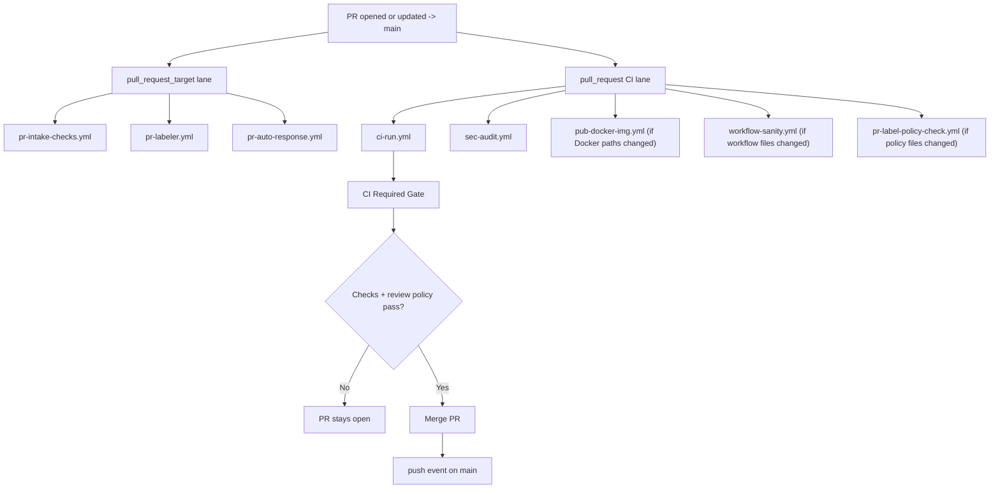
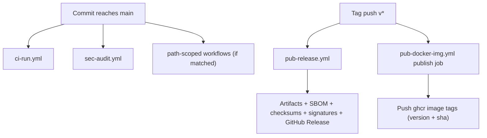

# Main Branch Delivery Flows

This document explains what runs when code is proposed to `main`, merged into `main`, and released via tags.

Use this with:

- [`docs/ci-map.md`](../../docs/ci-map.md)
- [`docs/pr-workflow.md`](../../docs/pr-workflow.md)

## Event Summary

| Event | Main workflows |
| --- | --- |
| PR activity (`pull_request_target`) | `pr-intake-checks.yml`, `pr-labeler.yml`, `pr-auto-response.yml` |
| PR activity (`pull_request`) | `ci-run.yml`, `sec-audit.yml`, plus path-scoped `pub-docker-img.yml`, `workflow-sanity.yml`, `pr-label-policy-check.yml` |
| Push to `main` | `ci-run.yml`, `sec-audit.yml`, plus path-scoped workflows |
| Tag push (`v*`) | `pub-release.yml`, `pub-docker-img.yml` publish job |
| Scheduled/manual | `sec-codeql.yml`, `feature-matrix.yml`, `test-fuzz.yml`, `pr-check-stale.yml`, `pr-check-status.yml`, `sync-contributors.yml`, `test-benchmarks.yml`, `test-e2e.yml` |

## Runtime and Docker Matrix

Observed averages below are from recent completed runs (sampled from GitHub Actions on February 17, 2026). Values are directional, not SLA.

| Workflow | Typical trigger in main flow | Avg runtime | Docker build? | Docker run? | Docker push? |
| --- | --- | ---:| --- | --- | --- |
| `pr-intake-checks.yml` | PR open/update (`pull_request_target`) | 14.5s | No | No | No |
| `pr-labeler.yml` | PR open/update (`pull_request_target`) | 53.7s | No | No | No |
| `pr-auto-response.yml` | PR/issue automation | 24.3s | No | No | No |
| `ci-run.yml` | PR + push to `main` | 74.7s | No | No | No |
| `sec-audit.yml` | PR + push to `main` | 127.2s | No | No | No |
| `workflow-sanity.yml` | Workflow-file changes | 34.2s | No | No | No |
| `pr-label-policy-check.yml` | Label policy/automation changes | 14.7s | No | No | No |
| `pub-docker-img.yml` (`pull_request`) | Docker build-input PR changes | 240.4s | Yes | Yes | No |
| `pub-docker-img.yml` (`push`/`workflow_dispatch`) | `main` push (build-input paths), tag push `v*`, or manual dispatch | 139.9s | Yes | No | Yes |
| `pub-release.yml` | Tag push `v*` | N/A in recent sample | No | No | No |

Notes:

1. `pub-docker-img.yml` is the only workflow in the main PR/push path that builds Docker images.
2. Container runtime verification (`docker run`) occurs in PR smoke only.
3. Container registry push occurs on `main` build-input pushes, tag pushes, and manual dispatch.
4. `ci-run.yml` "Build (Smoke)" builds Rust binaries, not Docker images.

## Step-By-Step

### 1) PR from branch in this repository -> `main`

1. Contributor opens or updates PR against `main`.
2. `pull_request_target` automation runs (typical runtime):
   - `pr-intake-checks.yml` posts intake warnings/errors.
   - `pr-labeler.yml` sets size/risk/scope labels.
   - `pr-auto-response.yml` runs first-interaction and label routes.
3. `pull_request` CI workflows start:
   - `ci-run.yml`
   - `sec-audit.yml`
   - path-scoped workflows if matching files changed:
     - `pub-docker-img.yml` (Docker build-input paths only)
     - `workflow-sanity.yml` (workflow files only)
     - `pr-label-policy-check.yml` (label-policy files only)
4. In `ci-run.yml`, `changes` computes:
   - `docs_only`
   - `docs_changed`
   - `rust_changed`
   - `workflow_changed`
5. `build` runs for Rust-impacting changes.
6. On PRs, full lint/test/docs checks run when PR has label `ci:full`:
   - `lint`
   - `lint-strict-delta`
   - `test`
   - `docs-quality`
7. If `.github/workflows/**` changed, `workflow-owner-approval` must pass.
8. `lint-feedback` posts actionable comment if lint/docs gates fail.
9. `CI Required Gate` aggregates results to final pass/fail.
10. Maintainer merges PR once checks and review policy are satisfied.
11. Merge emits a `push` event on `main` (see scenario 3).

### 2) PR from fork -> `main`

1. External contributor opens PR from `fork/<branch>` into `zeroclaw:main`.
2. Immediately on `opened`:
   - `pull_request_target` workflows start with base-repo context and base-repo token:
     - `pr-intake-checks.yml`
     - `pr-labeler.yml`
     - `pr-auto-response.yml`
   - `pull_request` workflows are queued for the fork head commit:
     - `ci-run.yml`
     - `sec-audit.yml`
     - path-scoped workflows (`pub-docker-img.yml`, `workflow-sanity.yml`, `pr-label-policy-check.yml`) if changed files match.
3. Fork-specific permission behavior in `pull_request` workflows:
   - token is restricted (read-focused), so jobs that try to write PR comments/status extras can be limited.
   - secrets from the base repo are not exposed to fork PR `pull_request` jobs.
4. Approval gate possibility:
   - if Actions settings require maintainer approval for fork workflows, the `pull_request` run stays in `action_required`/waiting state until approved.
5. Event fan-out after labeling:
   - `pr-labeler.yml` and manual label changes emit `labeled`/`unlabeled` events.
   - those events retrigger `pull_request_target` automation (`pr-labeler.yml` and `pr-auto-response.yml`), creating extra run volume/noise.
6. When contributor pushes new commits to fork branch (`synchronize`):
   - reruns: `pr-intake-checks.yml`, `pr-labeler.yml`, `ci-run.yml`, `sec-audit.yml`, and matching path-scoped PR workflows.
   - does not rerun `pr-auto-response.yml` unless label/open events occur.
7. `ci-run.yml` execution details for fork PR:
   - `changes` computes `docs_only`, `docs_changed`, `rust_changed`, `workflow_changed`.
   - `build` runs for Rust-impacting changes.
   - `lint`/`lint-strict-delta`/`test`/`docs-quality` run on PR when `ci:full` label exists.
   - `workflow-owner-approval` runs when `.github/workflows/**` changed.
   - `CI Required Gate` emits final pass/fail for the PR head.
8. Fork PR merge blockers to check first when diagnosing stalls:
   - run approval pending for fork workflows.
   - `workflow-owner-approval` failing on workflow-file changes.
   - `CI Required Gate` failure caused by upstream jobs.
   - repeated `pull_request_target` reruns from label churn causing noisy signals.
9. After merge, normal `push` workflows on `main` execute (scenario 3).

### 3) Push to `main` (including after merge)

1. Commit reaches `main` (usually from a merged PR).
2. `ci-run.yml` runs on `push`.
3. `sec-audit.yml` runs on `push`.
4. Path-filtered workflows run only if touched files match their filters.
5. In `ci-run.yml`, push behavior differs from PR behavior:
   - Rust path: `lint`, `lint-strict-delta`, `test`, `build` are expected.
   - Docs/non-rust paths: fast-path behavior applies.
6. `CI Required Gate` computes overall push result.

## Docker Publish Logic

Workflow: `.github/workflows/pub-docker-img.yml`

### PR behavior

1. Triggered on `pull_request` to `main` when Docker build-input paths change.
2. Runs `PR Docker Smoke` job:
   - Builds local smoke image with Blacksmith builder.
   - Verifies container with `docker run ... --version`.
3. Typical runtime in recent sample: ~240.4s.
4. No registry push happens on PR events.

### Push behavior

1. `publish` job runs on `push` and `workflow_dispatch`.
2. Workflow trigger includes `main` pushes with Docker build-input changes and tag pushes `v*`.
3. Login to `ghcr.io` uses `${{ github.actor }}` and `${{ secrets.GITHUB_TOKEN }}`.
4. Tag computation includes:
   - `latest` + SHA tag (`sha-<12 chars>`) for `main`
   - semantic tag from pushed git tag (`vX.Y.Z`) + SHA tag for tag pushes
   - branch name + SHA tag for non-`main` manual dispatch refs
5. Multi-platform publish is used for tag pushes (`linux/amd64,linux/arm64`), while `main` publish stays `linux/amd64`.
6. Typical runtime in recent sample: ~139.9s.
7. Result: pushed image tags under `ghcr.io/<owner>/<repo>`.

Important: Docker publish now runs on qualifying `main` pushes; no release tag is required to refresh `latest`.

## Release Logic

Workflow: `.github/workflows/pub-release.yml`

1. Triggered only on tag push `v*`.
2. Builds release artifacts across matrix targets.
3. Generates SBOM (`CycloneDX` + `SPDX`).
4. Generates `SHA256SUMS`.
5. Signs artifacts with keyless cosign.
6. Publishes GitHub Release with artifacts.

## Merge/Policy Notes

1. Workflow-file changes (`.github/workflows/**`) activate owner-approval gate in `ci-run.yml`.
2. PR lint/test strictness is intentionally controlled by `ci:full` label.
3. `sec-audit.yml` runs on both PR and push, plus scheduled weekly.
4. Some workflows are operational and non-merge-path (`pr-check-stale`, `pr-check-status`, `sync-contributors`, etc.).
5. Workflow-specific JavaScript helpers are organized under `.github/workflows/scripts/`.

## Mermaid Diagrams

### PR to Main (Internal/Fork)

### Push/Tag Delivery

## Quick Troubleshooting

1. Unexpected skipped jobs: inspect `scripts/ci/detect_change_scope.sh` outputs.
2. Workflow-change PR blocked: verify `WORKFLOW_OWNER_LOGINS` and approvals.
3. Fork PR appears stalled: check whether Actions run approval is pending.
4. Docker not published: confirm changed files match Docker build-input paths, or run workflow dispatch manually.
