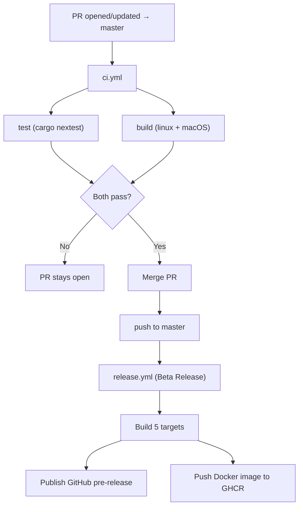
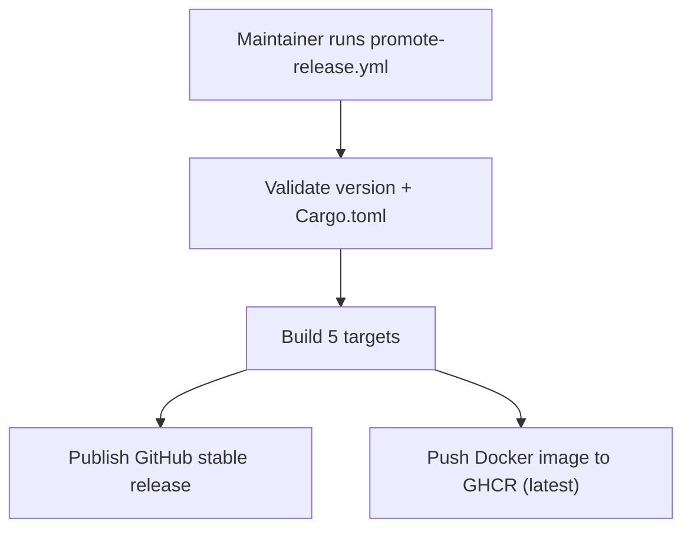

# Master Branch Delivery Flows

This document explains what runs when code is proposed to `master`, merged, and released.

Use this with:

- [`docs/ci-map.md`](../../docs/ci-map.md)
- [`docs/pr-workflow.md`](../../docs/pr-workflow.md)
- [`docs/release-process.md`](../../docs/release-process.md)

## Event Summary

| Event | Workflow |
| --- | --- |
| PR to `master` | `ci.yml` |
| Push to `master` (merge) | `release.yml` (Beta Release) |
| Manual dispatch | `ci-full.yml` (CI Full Matrix), `promote-release.yml` (Promote Release) |

## Step-By-Step

### 1) PR to `master`

1. Contributor opens or updates PR against `master`.
2. `ci.yml` runs:
   - `test` — runs `cargo nextest run --locked` with mold linker on Ubuntu.
   - `build` — builds release binaries for `x86_64-unknown-linux-gnu` and `aarch64-apple-darwin`.
3. Both jobs must pass for the PR to be mergeable.
4. Maintainer merges PR once checks and review policy are satisfied.

### 2) Push to `master` (after merge)

1. Merged commit reaches `master`.
2. `release.yml` (Beta Release) runs automatically:
   - Computes beta version tag: `vX.Y.Z-beta.<run_number>`.
   - Builds 5-target release matrix (linux x86_64 + aarch64, macOS x86_64 + aarch64, Windows x86_64).
   - Packages archives with SHA256SUMS.
   - Creates GitHub pre-release.
   - Builds and pushes multi-platform Docker image to GHCR (`beta` + version tag).

### 3) Stable release (manual)

1. Maintainer runs `promote-release.yml` via workflow dispatch with version input (e.g. `0.2.0`).
2. Workflow validates version matches `Cargo.toml` and tag does not already exist.
3. Builds same 5-target matrix as beta release.
4. Creates GitHub stable release (non-pre-release) with archives + SHA256SUMS.
5. Builds and pushes Docker image to GHCR (`latest` + version tag).

## Mermaid Diagrams

### PR and Merge Flow

```mermaid
flowchart TD
  A["PR opened/updated → master"] --> B["ci.yml"]
  B --> B1["test (cargo nextest)"]
  B --> B2["build (linux + macOS)"]
  B1 --> C{"Both pass?"}
  B2 --> C
  C -->|No| D["PR stays open"]
  C -->|Yes| E["Merge PR"]
  E --> F["push to master"]
  F --> G["release.yml (Beta Release)"]
  G --> G1["Build 5 targets"]
  G1 --> G2["Publish GitHub pre-release"]
  G1 --> G3["Push Docker image to GHCR"]
```

### Stable Release Flow

```mermaid
flowchart TD
  M["Maintainer runs promote-release.yml"] --> V["Validate version + Cargo.toml"]
  V --> B["Build 5 targets"]
  B --> P["Publish GitHub stable release"]
  B --> D["Push Docker image to GHCR (latest)"]
```

## Quick Troubleshooting

1. **CI failing on PR:** check `test` and `build` jobs in `.github/workflows/ci.yml`.
2. **Beta release failing:** check `.github/workflows/release.yml` job logs.
3. **Stable release failing:** check `validate` job in `.github/workflows/promote-release.yml` for version mismatch.
4. **Docker push failing:** check GHCR authentication and `docker` job logs in the release workflow.
