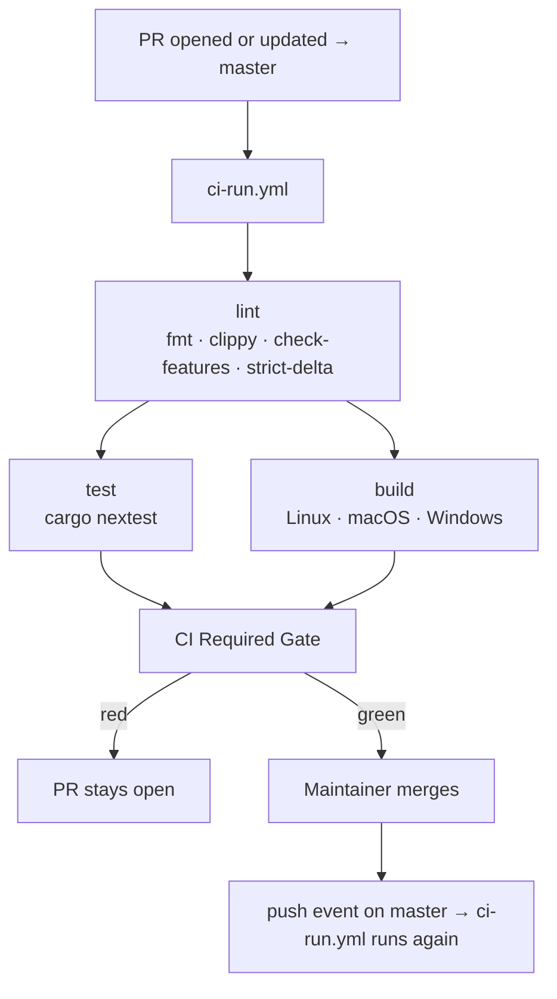
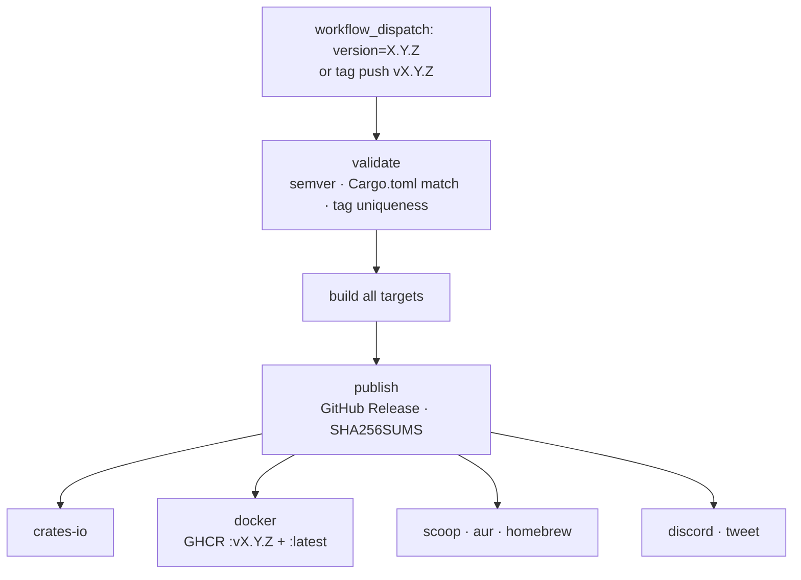

# Master Branch Delivery Flows

How code moves from a PR to a shipped release.

Use with:

- [`docs/contributing/ci-map.md`](../../docs/contributing/ci-map.md)
- [`docs/maintainers/release-runbook.md`](../../docs/maintainers/release-runbook.md)

Last updated: **May 2026** (post-v0.7.4 cleanup).

---

## Branching Model

ZeroClaw uses a single default branch: `master`. All contributor PRs target
`master` directly. There is no `dev` or promotion branch.

Maintainers with merge authority: `theonlyhennygod` and `JordanTheJet`.

---

## Active Workflows

| File | Trigger | Purpose |
|---|---|---|
| `ci-run.yml` | `pull_request` → `master`, `push` → `master` | Lint + test + build on every PR and every master commit |
| `release-stable-manual.yml` | `workflow_dispatch`, tag push `v*` | Stable release (manual, version-gated) |
| `cross-platform-build-manual.yml` | `workflow_dispatch` | Full platform build matrix (manual smoke check) |
| `pr-path-labeler.yml` | `pull_request` lifecycle | Automatic path-based PR labeling |

---

## Event Summary

| Event | What runs |
|---|---|
| PR opened or updated against `master` | `ci-run.yml` (full lint + test + build + strict delta) |
| Push to `master` (after merge) | `ci-run.yml` (lint + test + build; no strict delta) |
| Manual dispatch | `cross-platform-build-manual.yml` or `release-stable-manual.yml` |
| Tag push `vX.Y.Z` | `release-stable-manual.yml` (full release pipeline) |

There is no automatic release on push to master. Releases are always
intentional — either a manual dispatch or a deliberate tag push.

---

## Step-by-Step

### 1) PR → `master`

1. Contributor opens or updates a PR targeting `master`.
2. `ci-run.yml` runs:
   - `lint` — `cargo fmt --check`, `cargo clippy -D warnings`,
     `cargo check --features ci-all`, strict delta lint on changed lines.
   - `test` — `cargo nextest run --locked` on `ubuntu-latest`.
   - `build` — `cargo build --profile ci --locked` on Linux, macOS, and
     Windows. Benchmarks are verified to compile on the Linux leg.
   - `CI Required Gate` — composite job; branch protection requires this.
3. Maintainer reviews and merges once the gate is green and review policy is
   satisfied.
4. Merge emits a `push` event on `master`.

### 2) Push to `master` (after merge)

1. `ci-run.yml` runs again on the merged commit.
   - Same jobs as above, except strict delta lint is skipped (no PR base SHA).
2. If the gate is red on master, the team treats it as a P0 — nothing else
   merges until it is green again.
3. No release is triggered automatically.

### 3) Stable Release (manual)

See [`docs/maintainers/release-runbook.md`](../../docs/maintainers/release-runbook.md)
for the full procedure. In summary:

1. Maintainer verifies CI is green on master.
2. Version bump PR is merged.
3. Maintainer triggers `release-stable-manual.yml` via `workflow_dispatch`
   with the version number, or pushes an annotated tag `vX.Y.Z`.
4. Workflow builds all targets, creates the GitHub Release, publishes to
   crates.io, pushes Docker images, and notifies distribution channels.
5. Maintainer approves the three environment gates
   (`github-releases`, `crates-io`, `docker`) when prompted.

### 4) Full Platform Build (manual)

1. Maintainer runs `cross-platform-build-manual.yml` via `workflow_dispatch`.
2. Build-only across additional targets not covered by the PR build matrix.
3. No tests, no publish. Used to verify cross-compilation health.

---

## Build Targets by Workflow

| Target | `ci-run.yml` | `cross-platform-build-manual.yml` | `release-stable-manual.yml` |
|---|:---:|:---:|:---:|
| `x86_64-unknown-linux-gnu` | ✓ | | ✓ |
| `aarch64-unknown-linux-gnu` | | ✓ | ✓ |
| `armv7-unknown-linux-gnueabihf` | | | ✓ |
| `arm-unknown-linux-gnueabihf` | | | ✓ |
| `aarch64-apple-darwin` | ✓ | | ✓ |
| `aarch64-linux-android` | | | ✓ (experimental) |
| `x86_64-apple-darwin` | | ✓ | |
| `x86_64-pc-windows-msvc` | ✓ | ✓ | ✓ |

---

## Diagrams

### PR to master

### Stable release

---

## Troubleshooting

1. **Gate red on PR** — check the `lint` job first (fmt/clippy failures are
   the most common cause), then `test`, then `build`.
2. **Gate red on master after merge** — treat as P0; stop merging until fixed.
3. **Release validate failed** — `Cargo.toml` version does not match the
   input, or the tag already exists. Fix the version bump PR and re-trigger.
4. **Need a full cross-platform build** — run `cross-platform-build-manual.yml`
   manually from the Actions tab.
