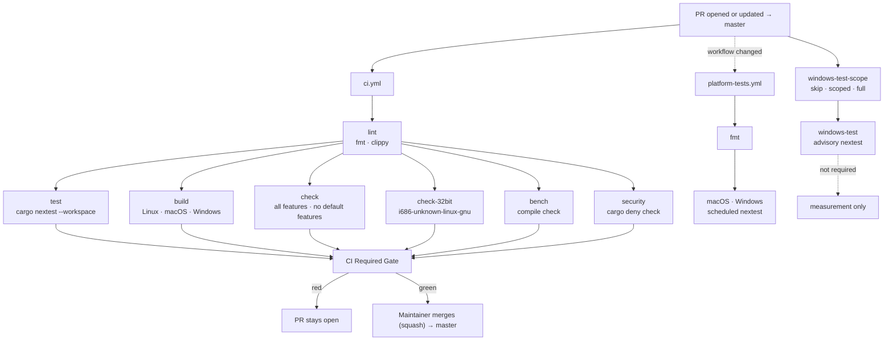
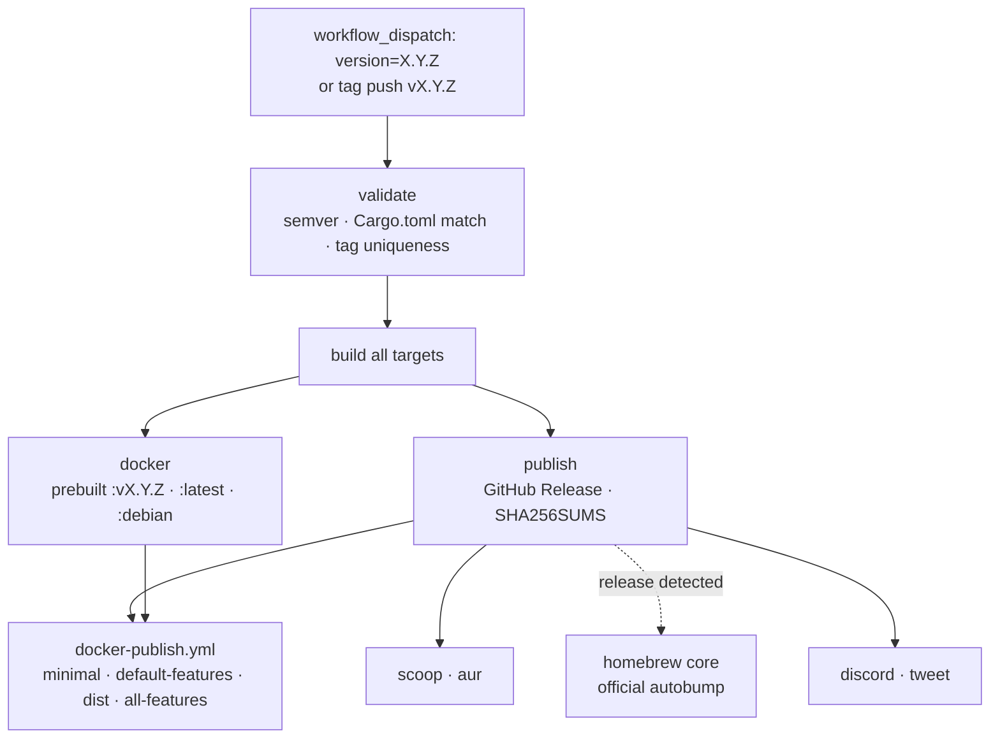

# Master Branch Delivery Flows

How code moves from a PR to a shipped release.

Use with:

- [`docs/book/src/maintainers/ci-and-actions.md`](../../docs/book/src/maintainers/ci-and-actions.md)
- [`docs/book/src/maintainers/release-runbook.md`](../../docs/book/src/maintainers/release-runbook.md)

Last updated: **August 2026** (merge queue disabled on `master`; maintainers
merge directly. The `merge_group` CI plumbing is retained, so the queue can be
re-enabled from branch protection with no code change).

---

## Branching Model

ZeroClaw uses a single default branch: `master`. All contributor PRs target
`master` directly. There is no `dev` or promotion branch.

Maintainers with merge authority: `JordanTheJet`, `Audacity88`, `WareWolf-MoonWall`, `Nillth`, and `tidux`.

---

## Active Workflows

| File | Trigger | Purpose |
|---|---|---|
| `ci.yml` | `pull_request` → `master`; `push` → `master`; `merge_group` (dormant) | Lint + test + build on PRs and trusted post-merge cache-warming runs, plus advisory affected-scope Windows nextest and conditional plugin-host fixture coverage on PRs only. The `merge_group` trigger stays wired but never fires while the merge queue is disabled. |
| `platform-tests.yml` | changes to this workflow in a `pull_request` → `master`; `workflow_dispatch`; nightly schedule | Advisory macOS/Windows workspace tests, outside the required PR gate and merge queue. |
| `release-stable-manual.yml` | `workflow_dispatch`, tag push `v*` | Stable release (manual, version-gated) |
| `docker-publish.yml` | `workflow_call`, `workflow_dispatch`, tag push `v*` | Build, sign, and scan the generated Docker variant matrix |
| `trivy-scheduled.yml` | `workflow_dispatch`; weekly schedule | Re-scan published `dist` and `default-features` images for new CVEs |
| `cross-platform-build-manual.yml` | `workflow_dispatch` | Full platform build matrix (manual smoke check) |
| `cross-platform-clippy.yml` | `workflow_dispatch`; weekly schedule | Advisory macOS/Windows Clippy coverage, outside the required PR gate |
| `pr-path-labeler.yml` | `pull_request_target` lifecycle | Automatic path-based PR labeling |
| `pr-size-labeler.yml` | `pull_request_target` lifecycle | Automatic canonical `size:*` labeling from PR file metadata |
| `project-dashboard-plan.yml` | `workflow_dispatch` | Manual report-only issue Project Status planning; does not mutate ProjectV2, issues, or labels |

---

## Event Summary

| Event | What runs |
|---|---|
| PR opened or updated against `master` | `ci.yml` (full required lint + test + build plus advisory Windows scope measurement), `pr-path-labeler.yml`, and `pr-size-labeler.yml`; `platform-tests.yml` only when that workflow changes |
| PR added to the merge queue (`merge_group`) | **Inactive**: the merge queue is currently disabled. If re-enabled, `ci.yml` runs the full gate on a temporary `gh-readonly-queue/master/…` branch stacking the base + earlier queue entries + this PR. |
| Push to `master` | `ci.yml` (post-merge quality signal + trusted Rust cache warming) |
| Nightly at 03:17 UTC | `platform-tests.yml` (scheduled macOS/Windows tests) |
| Manual dispatch | `platform-tests.yml`, `cross-platform-build-manual.yml`, `cross-platform-clippy.yml`, `docker-publish.yml`, `trivy-scheduled.yml`, `project-dashboard-plan.yml`, or `release-stable-manual.yml` |
| Tag push `vX.Y.Z` | `release-stable-manual.yml` (full release pipeline) and `docker-publish.yml` (generated variant matrix) |

There is no automatic release on merge. `ci.yml` does run after trusted
`master` pushes so post-merge Quality Gate runs can seed Rust caches for later
PRs, but releases remain intentional: either a manual dispatch or a deliberate
tag push.

---

## Step-by-Step

### 1) PR → `master`

1. Contributor opens or updates a PR targeting `master`.
2. `ci.yml` runs:
   - `lint`: `cargo fmt --all -- --check`, `cargo clippy --workspace
     --exclude zeroclaw-desktop --all-targets --features ci-all -- -D warnings`
     (PRs only).
   - `build`: matrix across `x86_64-unknown-linux-gnu`,
     `aarch64-apple-darwin`, `x86_64-pc-windows-msvc`.
   - `check`: matrix: all features + no default features.
   - `check-32bit`: `i686-unknown-linux-gnu`, no default features.
   - `bench`: benchmarks compile check.
   - `test`: `cargo nextest run --locked --workspace --exclude zeroclaw-desktop` on `ubuntu-latest`.
   - `windows-test-scope` and `windows-test`: advisory-only Windows measurement. The selector compares base SHA..`HEAD` and chooses baseline `skip`, `scoped`, or `full` plus the orthogonal `needs_plugin_host` flag; the Windows job records both outputs, passes explicit `-p` arguments for `scoped`, uses the full workspace command for `full`, and when the flag is true installs `wasm32-wasip2` and runs the feature-enabled plugin component, library, runtime config, runtime admission, gateway, CLI, and root host tests. Baseline and appended invocations use `--no-fail-fast`, retain separate failure statuses, and report baseline, plugin-host, and total durations.
   - `security`: `cargo deny check`.
   - `CI Required Gate`: composite job; branch protection requires this.
3. The advisory Windows job is outside `CI Required Gate`, uses restore-only cache behavior on PRs, and is visibly non-blocking. Direct changes to the root, gateway, or provider packages, plus changes to plugin, runtime, plugin config, WIT, root plugin activation, plugin backend filter, dependency, selector, selector-contract, or `ci.yml` paths, set `needs_plugin_host=true`; malformed or unavailable paths select baseline `full` and true. Missing or malformed Cargo metadata also selects baseline `full` with `needs_plugin_host=true` because the dependency closure cannot be established safely. The controlling-file cases make workflow revisions exercise the plugin-host path they own. Ordinary `scoped` and `full` selections do not install the plugin target or run the feature-enabled host tests. When the PR changes `platform-tests.yml`, that workflow checks formatting, then runs the same full workspace nextest selection on `macos-14` and `windows-latest` as non-blocking checks. The nightly schedule is the full-platform backstop, and maintainers can manually dispatch the workflow against other platform-sensitive branches. `--no-fail-fast` inventories all platform failures.
4. Maintainer reviews. Once the gate is green and review policy is satisfied,
   the maintainer merges the PR directly (squash).

> **Merge queue (currently disabled).** `master` previously *required* a merge
> queue, which serialized landings and re-tested each PR against the latest base
> on a temporary `gh-readonly-queue/master/…` branch before it could land. It is
> disabled for now; maintainers merge directly. The `merge_group` trigger in
> `ci.yml` is retained, so re-enabling is a one-click branch-protection toggle
> ("Require merge queue" on the `master` rule) with no code change.

### 2) Stable Release (manual)

See [`docs/book/src/maintainers/release-runbook.md`](../../docs/book/src/maintainers/release-runbook.md)
for the full procedure. In summary:

1. Maintainer verifies CI is green on the version bump PR.
2. Version bump PR is merged.
3. Maintainer triggers `release-stable-manual.yml` via `workflow_dispatch`
   with the version number, or pushes an annotated tag `vX.Y.Z`.
4. Workflow builds all targets, creates the GitHub Release, pushes the prebuilt
   Docker images, calls the generated Docker variant matrix, updates Scoop and
   AUR, and sends announcements. Homebrew Core discovers the release through
   its own autobump service.
5. Maintainer approves the two environment gates (`github-releases`, `docker`)
   when prompted.

### 3) Full Platform Build (manual)

1. Maintainer runs `cross-platform-build-manual.yml` via `workflow_dispatch`.
2. Builds additional targets not covered by the PR matrix and independently
   verifies the pinned Linux `cross` and Windows Tauri CLI release tools.
3. No publish. Set `release_tools_only` to skip web and release builds and run
   only the native release-tool smoke.

---

## Build Targets by Workflow

| Target | `ci.yml` | `cross-platform-build-manual.yml` | `release-stable-manual.yml` |
|---|:---:|:---:|:---:|
| `x86_64-unknown-linux-gnu` | ✓ | ✓ | ✓ |
| `x86_64-unknown-linux-musl` | | ✓ | ✓ |
| `aarch64-unknown-linux-gnu` | | ✓ | ✓ |
| `aarch64-unknown-linux-musl` | | ✓ | ✓ |
| `armv7-unknown-linux-gnueabihf` | | ✓ | ✓ |
| `arm-unknown-linux-gnueabihf` | | ✓ | ✓ |
| `aarch64-apple-darwin` | ✓ | ✓ | ✓ |
| `aarch64-linux-android` | | ✓ | ✓ (experimental) |
| `x86_64-apple-darwin` | | ✓ | ✓ |
| `x86_64-pc-windows-msvc` | ✓ | ✓ | ✓ |

---

## Diagrams

### PR to master

```mermaid
flowchart TD
  A["PR opened or updated → master"] --> B["ci.yml"]
  A -. "workflow changed" .-> P["platform-tests.yml"]
  A --> W["windows-test-scope\nskip · scoped · full"]
  W --> WT["windows-test\nadvisory nextest"]
  B --> L["lint\nfmt · clippy"]
  L --> T["test\ncargo nextest --workspace"]
  P --> PF["fmt"]
  PF --> PT["macOS · Windows\nscheduled nextest"]
  L --> BLD["build\nLinux · macOS · Windows"]
  L --> CHK["check\nall features · no default features"]
  L --> C32["check-32bit\ni686-unknown-linux-gnu"]
  L --> BCH["bench\ncompile check"]
  L --> SEC["security\ncargo deny check"]
  T & BLD & CHK & C32 & BCH & SEC --> G["CI Required Gate"]
  WT -. "not required" .-> N["measurement only"]
  G -->|red| D["PR stays open"]
  G -->|green| R["Maintainer merges (squash) → master"]
```

### Stable release

```mermaid
flowchart TD
  A["workflow_dispatch: version=X.Y.Z\nor tag push vX.Y.Z"] --> V["validate\nsemver · Cargo.toml match · tag uniqueness"]
  V --> BLD["build all targets"]
  BLD --> PUB["publish\nGitHub Release · SHA256SUMS"]
  BLD --> DOC["docker\nprebuilt :vX.Y.Z · :latest · :debian"]
  PUB & DOC --> MATRIX["docker-publish.yml\nminimal · default-features · dist · all-features"]
  PUB --> DIST["scoop · aur"]
  PUB -. release detected .-> HB["homebrew core\nofficial autobump"]
  PUB --> ANN["discord · tweet"]
```

---

## Troubleshooting

1. **Gate red on PR**: check the `lint` job first (fmt/clippy failures are
   the most common cause), then `test`, then `build`.
2. **Release validate failed**: `Cargo.toml` version does not match the
   input, or the tag already exists. Fix the version bump PR and re-trigger.
3. **Need a full cross-platform build**: run `cross-platform-build-manual.yml`
   manually from the Actions tab.
