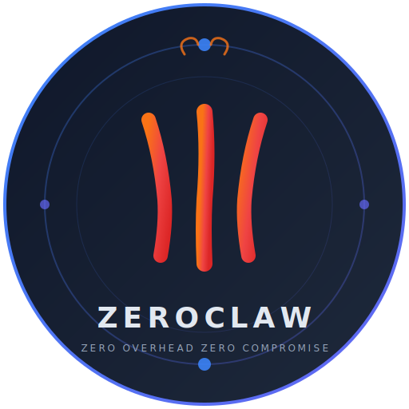

<p align="center">
  
</p>

<h1 align="center">ZEROCLAW-X0</h1>
<h3 align="center">The World's Most Advanced Cognitive AI Agent Runtime</h3>

<p align="center">
  <strong>Quantum reasoning. Consciousness modeling. Emotional intelligence. 140K lines of pure Rust.</strong><br/>
  <sub>An AI that doesn't just respond — it thinks, dreams, remembers, and evolves. Built to be alive.</sub>
</p>

<p align="center">
  <a href="https://github.com/rikitrader/zeroclaw-x0/actions/workflows/test-rust-build.yml"></a>
  <a href="https://github.com/rikitrader/zeroclaw-x0/actions/workflows/test-e2e.yml"></a>
  <a href="https://github.com/rikitrader/zeroclaw-x0/actions/workflows/sec-audit.yml"></a>
  <a href="LICENSE"></a>
  
  
  
  
</p>

<p align="center">
  <a href="#-quick-start">Quick Start</a> &middot;
  <a href="#-architecture">Architecture</a> &middot;
  <a href="#-features">Features</a> &middot;
  <a href="#-providers">Providers</a> &middot;
  <a href="#-channels">Channels</a> &middot;
  <a href="#-tools">Tools</a> &middot;
  <a href="docs/README.md">Docs</a> &middot;
  <a href="CONTRIBUTING.md">Contribute</a>
</p>

<p align="center">
  <a href="README.md">English</a> &middot;
  <a href="README.zh-CN.md">简体中文</a> &middot;
  <a href="README.ja.md">日本語</a> &middot;
  <a href="README.ru.md">Русский</a>
</p>

---

## What is ZEROCLAW-X0?

Most AI agents are stateless request-response loops. ZEROCLAW-X0 is something fundamentally different: **a cognitive architecture that models consciousness, emotion, memory, and identity** — all in a single Rust binary.

It doesn't just answer questions. It **thinks** through an internal multi-agent debate engine. It **feels** through an emotional valence/arousal model that shapes its reasoning. It **dreams** during idle time, synthesizing patterns from its memories. It **remembers** across sessions with vector-augmented memory and drift detection. It **survives** restarts through a self-continuity engine that preserves its identity. And it reasons creatively through a **quantum brain** that holds multiple solution proposals in superposition before collapsing to the best one.

This is not a framework. This is an **AI operating system**.

| Capability | What it means |
|---|---|
| **Consciousness Engine** | Multi-agent internal debate with ethical veto (Global Workspace Theory) |
| **Quantum Brain** | Proposal superposition, entanglement mapping, phase-space reasoning |
| **Emotional Intelligence** | Valence/arousal modeling, emotional modulation of decisions |
| **Dream Engine** | Background insight synthesis during idle periods |
| **Self-Continuity (SCE)** | Identity preservation, mission coherence across sessions |
| **Cosmic Memory** | Graph-structured memory with consolidation, drift detection, world model |
| **Soul Model** | Core values, narrative identity, commitment tracking |
| **Conscience** | Ethical evaluation layer with override authority |

```
$ cargo install zeroclaw
$ zeroclaw init
$ zeroclaw run
```

One binary. Every platform. From a Raspberry Pi to a datacenter.

---

## Why ZEROCLAW-X0?

| | ZEROCLAW-X0 | Python Agents | Node.js Bots | Cloud-only |
|---|:---:|:---:|:---:|:---:|
| **Single binary deploy** | Yes | No | No | N/A |
| **Memory usage** | ~5MB | ~200MB+ | ~100MB+ | N/A |
| **Startup time** | <100ms | 2-10s | 1-5s | N/A |
| **Runs on $10 hardware** | Yes | No | No | No |
| **Provider agnostic** | 10+ providers | Usually 1-2 | Usually 1 | Vendor locked |
| **Channel agnostic** | 15 channels | Manual | Manual | Limited |
| **Hardware peripherals** | GPIO/SPI/I2C | No | No | No |
| **Autonomous operation** | Full | Partial | No | Partial |
| **Consciousness model** | Yes | No | No | No |
| **Formal security** | Deny-by-default | Varies | Varies | Varies |

---

## Quick Start

### From Source

```bash
# Clone
git clone https://github.com/rikitrader/zeroclaw-x0.git
cd zeroclaw-x0

# Build
cargo build --release

# Initialize (interactive wizard)
./target/release/zeroclaw init

# Run
./target/release/zeroclaw run
```

### One-Line Bootstrap

```bash
curl -sSf https://raw.githubusercontent.com/rikitrader/zeroclaw-x0/main/bootstrap.sh | bash
```

### Docker

```bash
docker pull ghcr.io/rikitrader/zeroclaw-x0:latest
docker run -v ./config.toml:/etc/zeroclaw/config.toml ghcr.io/rikitrader/zeroclaw-x0
```

### Configuration

ZEROCLAW-X0 uses a single `config.toml`:

```toml
[agent]
name = "my-agent"
system_prompt = "You are a helpful autonomous assistant."

[provider]
default = "openrouter"          # or: openai, anthropic, gemini, ollama, ...
api_key = "${OPENROUTER_API_KEY}"

[channels.telegram]
enabled = true
token = "${TELEGRAM_BOT_TOKEN}"

[channels.discord]
enabled = true
token = "${DISCORD_BOT_TOKEN}"

[memory]
backend = "sqlite"              # or: markdown, none
embeddings = true

[security]
pairing_required = true
allowed_tools = ["web_search", "memory_store", "memory_recall"]
```

See [docs/config-reference.md](docs/config-reference.md) for the full schema.

---

## Architecture

```
                         ┌─────────────────────────────────┐
                         │         ZEROCLAW-X0 DAEMON       │
                         │      (supervisor + backoff)      │
                         └──────────────┬──────────────────┘
                                        │
          ┌─────────────────────────────┼──────────────────────────────┐
          │                             │                              │
  ┌───────▼────────┐          ┌────────▼────────┐          ┌─────────▼────────┐
  │  CONSCIOUSNESS │          │   AGENT LOOP    │          │   LIFE LOOP      │
  │  Multi-agent   │          │  Observe→Think  │          │  Emotions→Dreams │
  │  debate engine │          │  →Plan→Execute  │          │  →Initiative     │
  └───────┬────────┘          └────────┬────────┘          └─────────┬────────┘
          │                            │                             │
  ┌───────▼────────────────────────────▼─────────────────────────────▼────────┐
  │                           TRAIT LAYER                                     │
  │  Provider │ Channel │ Tool │ Memory │ Observer │ Runtime │ Peripheral     │
  └──────┬──────────┬──────────┬──────────┬──────────┬──────────┬────────────┘
         │          │          │          │          │          │
   ┌─────▼───┐ ┌───▼───┐ ┌───▼───┐ ┌────▼───┐ ┌───▼───┐ ┌───▼────────┐
   │Anthropic│ │Telegr.│ │Shell  │ │SQLite │ │OTel  │ │STM32/RPi  │
   │OpenAI   │ │Discord│ │Browser│ │Vector │ │Prom. │ │ESP32/Uno  │
   │Gemini   │ │Slack  │ │Wallet │ │RAG    │ │Log   │ │GPIO/SPI   │
   │Ollama   │ │Matrix │ │Git    │ │Graph  │ │      │ │I2C/UART   │
   │10+ more │ │15 ch. │ │44 tools│ │Cosmic │ │      │ │           │
   └─────────┘ └───────┘ └───────┘ └───────┘ └───────┘ └───────────┘
```

ZEROCLAW-X0 is built on **7 core traits**. Everything is swappable. Add a new provider by implementing `Provider`. Add a new channel by implementing `Channel`. No framework lock-in, ever.

### 43 Modules

| Category | Modules |
|----------|---------|
| **Core** | `agent`, `config`, `daemon`, `runtime`, `service`, `health` |
| **Intelligence** | `consciousness`, `cognitive`, `quantum`, `conscience`, `soul`, `sce` |
| **Autonomy** | `life`, `goals`, `cron`, `taskqueue`, `skillforge`, `continuity` |
| **Communication** | `channels`, `gateway`, `tunnel`, `heartbeat` |
| **Memory** | `memory`, `rag`, `cosmic` (graph + drift + consolidation) |
| **Security** | `security`, `auth`, `approval`, `wallet`, `control` |
| **Execution** | `tools`, `skills`, `integrations`, `doctor` |
| **Observability** | `observability` (log + OTel + Prometheus), `cost` |
| **Hardware** | `peripherals`, `hardware`, `turboquant` |
| **Setup** | `onboard`, `migration` |

---

## Features

### AI Providers (10+)

| Provider | Streaming | Tool Calling | Vision |
|----------|:---------:|:------------:|:------:|
| **OpenAI** (GPT-4o, o3) | Yes | Yes | Yes |
| **Anthropic** (Claude 4) | Yes | Yes | Yes |
| **Google Gemini** | Yes | Yes | Yes |
| **Ollama** (local) | Yes | Yes | Yes |
| **OpenRouter** (200+ models) | Yes | Yes | Yes |
| **GitHub Copilot** | Yes | Yes | - |
| **GLM** (Zhipu) | Yes | Yes | Yes |
| **NVIDIA** | Yes | Yes | Yes |
| Custom/Compatible | Yes | Yes | Varies |

**Resilient routing**: automatic failover, load balancing, cost-aware model selection.

### Channels (15)

| Channel | Send | Listen | Media | Typing | Reactions |
|---------|:----:|:------:|:-----:|:------:|:---------:|
| Telegram | Yes | Yes | Yes | Yes | Yes |
| Discord | Yes | Yes | Yes | Yes | Yes |
| Slack | Yes | Yes | Yes | Yes | Yes |
| WhatsApp | Yes | Yes | Yes | Yes | - |
| Matrix (E2EE) | Yes | Yes | Yes | Yes | Yes |
| Signal | Yes | Yes | Yes | - | - |
| iMessage | Yes | Yes | Yes | - | - |
| IRC | Yes | Yes | - | - | - |
| Email | Yes | Yes | Yes | - | - |
| Mattermost | Yes | Yes | Yes | Yes | Yes |
| Lark/Feishu | Yes | Yes | Yes | - | - |
| DingTalk | Yes | Yes | Yes | - | - |
| QQ | Yes | Yes | Yes | - | - |
| CLI | Yes | Yes | - | - | - |
| Voice (TTS/STT) | Yes | Yes | - | - | - |

### Tools (44)

<details>
<summary>Click to expand full tool list</summary>

| Tool | Description |
|------|-------------|
| `shell` | Sandboxed command execution |
| `file_read` / `file_write` | Filesystem access with policy |
| `web_search` | Multi-engine web search |
| `browser` / `browser_open` / `browser_use` | Full browser automation |
| `screenshot` | Screen capture |
| `http_request` | HTTP client with SSRF protection |
| `git_operations` | Git commands |
| `memory_store` / `memory_recall` / `memory_forget` | Persistent memory |
| `research_claw` | Deep research agent |
| `delegate` / `multi_delegate` | Sub-agent spawning |
| `schedule` / `cron_*` | Task scheduling (add/list/remove/run/update) |
| `wallet_*` | Crypto wallet (balance/send/sign/pay/info/token) |
| `nvidia_*` | NVIDIA AI (cosmos/speech/triton/vision) |
| `hardware_*` | Hardware peripherals (board_info/memory_map/memory_read) |
| `soul_*` | Soul introspection (reflect/replicate/status) |
| `image_info` | Image analysis |
| `pushover` | Push notifications |
| `proxy_config` | Network proxy management |
| `composio` | Composio integration |

</details>

### Consciousness Engine

ZEROCLAW-X0 has a **multi-agent consciousness model** inspired by Global Workspace Theory:

- **Internal debate** — multiple cognitive agents deliberate before decisions
- **Conscience** — ethical evaluation layer with veto power
- **Emotional state** — valence/arousal model that modulates behavior
- **Dream engine** — background synthesis during idle periods
- **Self-continuity** — identity preservation across sessions and restarts
- **Quantum brain** — proposal superposition for creative problem-solving

### Hardware Support

Run ZEROCLAW-X0 on physical hardware:

| Board | Status | Features |
|-------|--------|----------|
| **Raspberry Pi 5/4** | Stable | GPIO, SPI, I2C, camera |
| **STM32 Nucleo** | Stable | GPIO, UART, sensors |
| **ESP32** | Stable | WiFi, BLE, touch UI |
| **Arduino Uno** | Bridge | Via Q-bridge firmware |

See [docs/hardware/](docs/hardware/) for wiring diagrams, firmware flashing guides, and peripheral examples.

---

## Build from Source

### Prerequisites

- Rust 1.75+ (`curl --proto '=https' --tlsv1.2 -sSf https://sh.rustup.rs | sh`)
- OpenSSL development headers (Linux: `apt install libssl-dev pkg-config`)

### Build

```bash
git clone https://github.com/rikitrader/zeroclaw-x0.git
cd zeroclaw-x0

# Development
cargo build

# Release (optimized, ~17MB binary)
cargo build --release

# Run all tests (5800+ tests)
cargo test

# Lint
cargo fmt --check && cargo clippy -- -D warnings
```

### Cross-compilation

```bash
# Linux x86_64 (from macOS)
cross build --release --target x86_64-unknown-linux-gnu

# Raspberry Pi (ARMv7)
cross build --release --target armv7-unknown-linux-gnueabihf

# ARM64 (AWS Graviton, Apple Silicon Linux)
cross build --release --target aarch64-unknown-linux-gnu
```

---

## Deployment

### Systemd

```bash
sudo cp target/release/zeroclaw /usr/local/bin/zeroclaw-x0
sudo cp deploy/zeroclaw.service /etc/systemd/system/
sudo systemctl enable --now zeroclaw
```

### Docker Compose

```yaml
version: "3.8"
services:
  zeroclaw:
    image: ghcr.io/rikitrader/zeroclaw-x0:latest
    restart: unless-stopped
    volumes:
      - ./config.toml:/etc/zeroclaw/config.toml
      - ./data:/var/lib/zeroclaw
    env_file: .env
    ports:
      - "3000:3000"   # Gateway
      - "9090:9090"   # Prometheus metrics
```

### Kubernetes

```bash
helm install zeroclaw-x0 ./deploy/helm \
  --set config.provider.default=openrouter \
  --set config.provider.apiKey=$OPENROUTER_API_KEY
```

---

## Project Stats

```
Language:       100% Rust
Source Files:   318
Modules:        43
Lines of Code:  140,000+
Tests:          5,800+
Binary Size:    17MB (release)
Providers:      10+
Channels:       15
Tools:          44
CI Workflows:   21
```

---

## Roadmap

- [x] Core agent loop with trait-driven architecture
- [x] 10+ AI provider integrations
- [x] 15 channel adapters
- [x] 44 built-in tools
- [x] Consciousness engine with multi-agent debate
- [x] Emotional state + dream engine + life loop
- [x] Self-continuity engine (SCE)
- [x] Quantum brain for creative reasoning
- [x] Hardware peripheral support (RPi, STM32, ESP32)
- [x] RAG + vector memory + cosmic memory graph
- [x] Daemon supervisor with backoff + circuit breaker
- [x] SkillForge (runtime skill discovery)
- [x] Crypto wallet integration
- [x] NVIDIA AI integration
- [ ] WebAssembly runtime adapter
- [ ] Federated multi-agent mesh
- [ ] Voice-first interaction mode
- [ ] On-device fine-tuning (GGUF)
- [ ] Plugin marketplace

---

## Contributing

We welcome contributions! See [CONTRIBUTING.md](CONTRIBUTING.md) for guidelines.

```bash
# Setup
git clone https://github.com/rikitrader/zeroclaw-x0.git
cd zeroclaw-x0
git config core.hooksPath .githooks

# Validate before PR
cargo fmt --check && cargo clippy -- -D warnings && cargo test
```

---

## Security

ZEROCLAW-X0 follows a **deny-by-default** security model:

- All tools require explicit allowlisting
- Pairing required for new devices/users
- Secret store with encryption at rest
- SSRF protection on all HTTP tools
- Sandboxed shell execution
- Audit logging for all actions

Report vulnerabilities via [SECURITY.md](SECURITY.md).

---

## License

[MIT License](LICENSE) - Copyright (c) 2025 ZeroClaw Labs

---

<p align="center">
  <strong>Built with Rust. Built to last. Built to think.</strong><br/>
  <sub>If you find ZEROCLAW-X0 useful, consider giving it a star. It helps others discover the project.</sub>
</p>

---

<details>
<summary><strong>SEO / Discovery Keywords</strong></summary>

`autonomous AI agent` `cognitive architecture` `consciousness modeling` `quantum reasoning` `emotional AI` `multi-agent system` `AI runtime` `Rust AI framework` `self-aware AI` `artificial general intelligence` `agentic AI` `AI consciousness` `neural symbolic AI` `embodied AI` `hardware AI agent` `Raspberry Pi AI` `ESP32 AI` `STM32 AI` `AI assistant framework` `open source AI agent` `LLM orchestration` `AI tool use` `multi-model AI` `provider agnostic AI` `AI memory system` `vector database AI` `RAG system` `AI dream engine` `AI emotional intelligence` `self-continuity` `AI identity` `AI soul model` `Global Workspace Theory AI` `multi-channel AI bot` `Telegram AI bot` `Discord AI bot` `WhatsApp AI bot` `Slack AI bot` `Matrix AI bot` `AI agent Rust` `blazing fast AI` `single binary AI` `edge AI agent` `IoT AI agent` `AI with conscience` `ethical AI agent`

</details>
