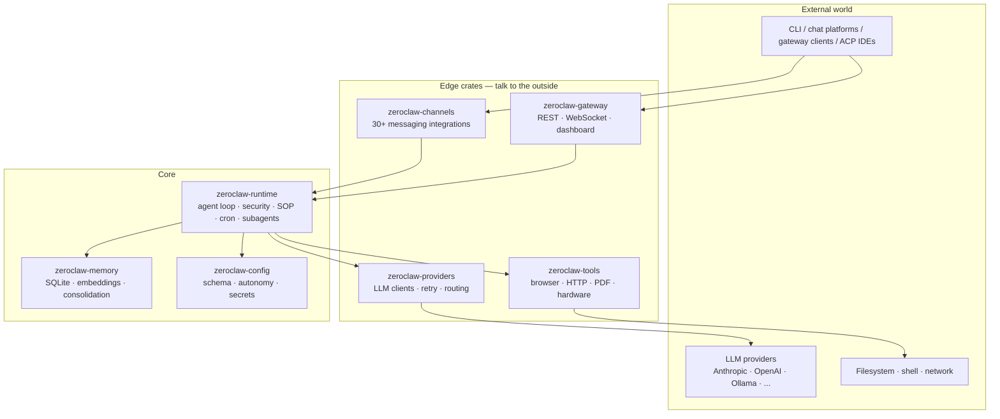
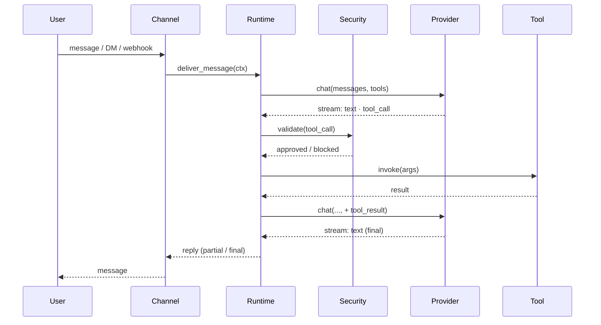
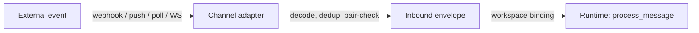
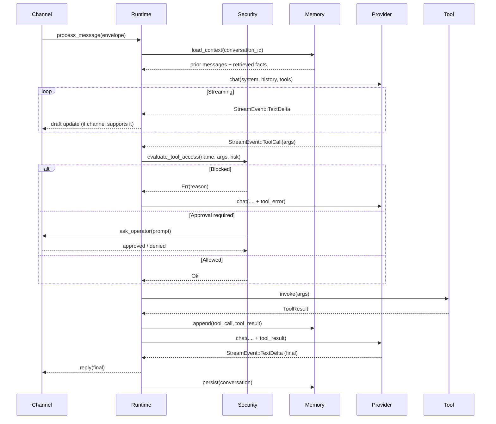
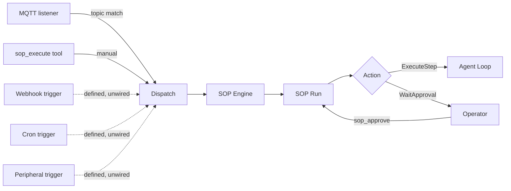

# ZeroClaw Documentation - Complete Reference

This document contains the complete ZeroClaw documentation for AI/agent consumption.

Version: v0.8.1
Source: https://docs.zeroclawlabs.ai/v0.8.1/en

---


============================================================
FILE: ./README.md
============================================================

# ZeroClaw Documentation Index

## About
ZeroClaw is a personal AI assistant written in Rust. It's an agent runtime: a single binary you configure and run.

## Documentation Structure

### Getting Started
- [Introduction](./introduction.md) - Overview and quick navigation
- [Getting Started](./getting-started/) - Quickstart, concepts, installation guides
- [Quickstart](./getting-started/quickstart.md)
- [YOLO Mode](./getting-started/yolo.md)
- [Zerocode Terminal UI](./zerocode/overview.md)
- [Multi-Model Setup](./getting-started/multi-model-setup.md)
- [Language & Translations](./getting-started/language.md)

### Installation
- [Linux](./setup/linux.md)
- [macOS](./setup/macos.md)
- [Windows](./setup/windows.md)
- [FreeBSD](./setup/freebsd.md)
- [NixOS](./setup/nixos.md)
- [Docker & Containers](./setup/container.md)
- [Service Management](./setup/service.md)
- [Platform Install Files](./setup/dist-files.md)

### Philosophy & Design
- [Philosophy Overview](./philosophy/index.md)
- [You Own It](./philosophy/you-own-it.md)
- [Security-First](./philosophy/security-first.md)
- [Minimal](./philosophy/minimal.md)
- [Provider-Agnostic](./philosophy/provider-agnostic.md)
- [What This Isn't](./philosophing/what-this-isnt.md)
- [How Decisions Get Made](./philosophy/how-decisions-get-made.md)

### Architecture
- [Architecture Overview](./architecture/overview.md)
- [Request Lifecycle](./architecture/request-lifecycle.md)
- [Crates](./architecture/crates.md)
- [Logging](./architecture/logging.md)
- [RPC Socket Transport](./architecture/rpc-socket.md)

### Agents
- [Agents Overview](./agents/overview.md)
- [Anatomy of an Agent](./agents/anatomy.md)
- [Filesystem Components](./agents/filesystem.md)
- [Running Agents](./agents/operating.md)
- [Delegation & SubAgents](./agents/delegation.md)
- [Runtime Internals](./agents/internals.md)

### Model Providers
- [Providers Overview](./providers/index.md)
- [Provider Catalog](./providers/catalog.md)
- [Configuration](./providers/configuration.md)
- [Streaming](./providers/streaming.md)
- [Routing](./providers/routing.md)
- [Custom Providers](./providers/custom.md)

### Channels & Integrations
- [Channels Overview](./channels/overview.md)
- [Peer Groups](./channels/peer-groups.md)
- [Matrix](./channels/matrix.md)
- [Discord](./channels/discord.md)
- [Slack](./channels/slack.md)
- [Mattermost](./channels/mattermost.md)
- [LINE](./channels/line.md)
- [Nextcloud Talk](./channels/nextcloud-talk.md)
- [Signal](./channels/signal.md)
- [WhatsApp](./channels/whatsapp.md)
- [Other Chat Platforms](./channels/other.md)
- [Social Media](./channels/social.md)
- [Email](./channels/email.md)
- [Voice & Telephony](./channels/voice.md)
- [Webhooks](./channels/webhooks.md)
- [ACP Protocol](./channels/acp.md)

### Tools & Extensibility
- [Tools Overview](./tools/overview.md)
- [MCP Protocol](./tools/mcp.md)
- [Browser Automation](./tools/browser.md)
- [Skills](./tools/skills.md)
- [Python Skills](./tools/python-skills.md)

### Security & Autonomy
- [Security Overview](./security/overview.md)
- [Security Model](./security/model.md)
- [Autonomy Levels](./security/autonomy.md)
- [Sandboxing](./security/sandboxing.md)
- [Tool Receipts](./security/tool-receipts.md)

### Operations & Deployment
- [Operations Overview](./ops/overview.md)
- [Service & Daemon](./ops/service.md)
- [Logs & Observability](./ops/logs.md)
- [Cost Tracking](./ops/cost-tracking.md)
- [Troubleshooting](./ops/troubleshooting.md)
- [Network Deployment](./ops/network-deployment.md)

### Hardware & Boards
- [Hardware Overview](./hardware/index.md)
- [Hardware Subsystem](./hardware/subsystem.md)
- [Adding Boards & Tools](./hardware/adding-boards.md)
- [Peripherals Design](./hardware/peripherals.md)
- [Arduino Uno Q](./hardware/arduino-uno-q.md)
- [STM32 Nucleo](./hardware/stm32-nucleo.md)
- [Android](./hardware/android.md)
- [Aardvark](./hardware/aardvark.md)
- [Raspberry Pi](./hardware/raspberry-pi.md)

### Standard Operating Procedures
- [SOP Overview](./sop/index.md)
- [How SOPs Run](./sop/how-it-works.md)
- [Syntax](./sop/syntax.md)
- [Cookbook](./sop/cookbook.md)
- [Connectivity](./sop/connectivity.md)
- [Observability](./sop/observability.md)
- [Worked Example](./sop/example.md)

### Reference
- [Reference Index](./reference/index.md)
- [CLI Reference](./reference/cli.md)
- [Config Reference](./reference/config.md)
- [Environment Variables](./reference/env-vars.md)
- [API Rustdoc](./api.md)
- [Gateway HTTP API](./gateway/api.md)
- [Web Dashboard](./gateway/web-dashboard.md)

### Developing
- [Developing Overview](./developing/index.md)
- [First-Party Extensions](./developing/first-party-extensions.md)
- [Plugin Protocol](./developing/plugin-protocol.md)
- [Extension Examples](./developing/extension-examples.md)
- [Building Docs Locally](./developing/building-docs.md)
- [Building Web Dashboard](./developing/web.md)

### Contributing
- [Contributing Overview](./contributing/index.md)
- [How to Contribute](./contributing/how-to.md)
- [Architecture & Contribution Map](./contributing/architecture-map.md)
- [RFC Process](./contributing/rfcs.md)
- [Communication](./contributing/communication.md)
- [Privacy & PII](./contributing/privacy.md)
- [Testing](./contributing/testing.md)
- [PR Review Protocol](./contributing/pr-review.md)
- [Multi-Agent Setup](./contributing/multi-agent-setup.md)
- [CLA](./contributing/cla.md)

### Maintainers
- [Maintainers Overview](./maintainers/index.md)
- [Docs & Translations](./maintainers/docs-and-translations.md)
- [CI & Actions](./maintainers/ci-and-actions.md)
- [Claude Code Skills](./maintainers/skills.md)
- [PR Workflow](./maintainers/pr-workflow.md)
- [Reviewer Playbook](./maintainers/reviewer-playbook.md)
- [Labels](./maintainers/labels.md)
- [Superseding PRs](./maintainers/superseding.md)
- [Release Runbook](./maintainers/release-runbook.md)

### Foundations (RFCs)
- [Foundations Overview](./foundations/index.md)
- [Intentional Architecture](./foundations/fnd-001-intentional-architecture.md)
- [Documentation Standards](./foundations/fnd-002-documentation-standards.md)
- [Governance](./foundations/fnd-003-governance.md)
- [Engineering Infrastructure](./foundations/fnd-004-engineering-infrastructure.md)
- [Contribution Culture](./foundations/fnd-005-contribution-culture.md)
- [Zero Compromise in Practice](./foundations/fnd-006-zero-compromise-in-practice.md)

## Quick Links
- GitHub: https://github.com/zeroclaw-labs/zeroclaw
- Discord: https://discord.gg/tQ88WUkPyJ
============================================================
FILE: ./agents/anatomy.md
============================================================

# [Anatomy of an agent](#anatomy-of-an-agent){.header}

An agent is configured as a single `[agents.<alias>]` block. Every field is either a reference to something configured elsewhere or a per-agent override. The table below is generated from the config schema, so it always matches the running build. Click a field to expand it; click again to see how to set it.

::::::::::::::::::: cfg-fields
`channels` [`ChannelRef[]` · default `[]`]{.cfg-field-meta}

Channel aliases this agent handles (e.g. `["telegram.<alias>", "discord.<alias>"]`). Each entry is a `ChannelRef` resolving through `[channels.<type>.<alias>]`; `Config::validate()` fails loud on dangling references.

**Set it on any surface:**

::: os-tabs-src
#### [Gateway dashboard](#gateway-dashboard){.header}

Open [`/config/agents`](http://127.0.0.1:42617/config/agents) and set the `agents.<alias>.channels` field.

#### [zerocode](#zerocode){.header}

In the **Config** pane, set the `agents.<alias>.channels` field.

#### [zeroclaw config](#zeroclaw-config){.header}

``` sh
zeroclaw config set agents.<alias>.channels <value>
```

#### [Environment variable](#environment-variable){.header}

Export the override (POSIX shells; drop into `~/.bashrc`, `~/.zshrc`, `.env`, or a Dockerfile). Replace `<alias>` with the literal alias:

``` sh
export ZEROCLAW_agents__<alias>__channels=
```
:::

`classifier_provider` [`ModelProviderRef` · default `""`]{.cfg-field-meta}

Optional override for the per-message LLM reply-intent classifier (`classify_channel_reply_intent` in zeroclaw-channels). When non-empty, the channel orchestrator routes the "should this message be replied to?" classification call to `[providers.models.<type>.<alias>]` referenced here, instead of reusing the main agent's `model_provider`. Source of truth for api_key / uri / model / temperature etc. is the referenced `[providers.models.<type>.<alias>]` entry. This field is a reference only (NEVER a copy), per AGENTS.md SINGLE SOURCE OF TRUTH. Empty (`Default`) = inherit the main agent's resolved provider+model (preserves pre-PR behavior; backward compatible). Use case: classification is a cheap REPLY/NO_REPLY decision, doesn't need a high-end model. Point this at a fast/free small model (e.g. `kimi-k2.5`, `qwen-turbo`) while `model_provider` stays on the expensive answering model (e.g. `qwen3.6-plus`). Note: TOML table names cannot contain `.`, so alias `kimi-k2.5` must be written as `[providers.models.custom.kimi-k2-5]`. The underlying `model = "kimi-k2.5"` string can still contain dots. ACP channels (IDE-direct) always reply and skip the classifier entirely, so this field has no effect on ACP traffic.

**Set it on any surface:**

::: os-tabs-src
#### [Gateway dashboard](#gateway-dashboard-1){.header}

Open [`/config/agents`](http://127.0.0.1:42617/config/agents) and set the `agents.<alias>.classifier_provider` field.

#### [zerocode](#zerocode-1){.header}

In the **Config** pane, set the `agents.<alias>.classifier_provider` field.

#### [zeroclaw config](#zeroclaw-config-1){.header}

``` sh
zeroclaw config set agents.<alias>.classifier_provider <value>
```

#### [Environment variable](#environment-variable-1){.header}

Export the override (POSIX shells; drop into `~/.bashrc`, `~/.zshrc`, `.env`, or a Dockerfile). Replace `<alias>` with the literal alias:

``` sh
export ZEROCLAW_agents__<alias>__classifier_provider=
```
:::

`cron_jobs` [`string[]` · default `[]`]{.cfg-field-meta}

Cron job aliases. Each entry references `cron[key]`, a declarative scheduled job invoked by the scheduler on its configured trigger. When the cron fires, this agent is the actor that executes the job.

**Set it on any surface:**

::: os-tabs-src
#### [Gateway dashboard](#gateway-dashboard-2){.header}

Open [`/config/agents`](http://127.0.0.1:42617/config/agents) and set the `agents.<alias>.cron_jobs` field.

#### [zerocode](#zerocode-2){.header}

In the **Config** pane, set the `agents.<alias>.cron_jobs` field.

#### [zeroclaw config](#zeroclaw-config-2){.header}

``` sh
zeroclaw config set agents.<alias>.cron_jobs <value>
```

#### [Environment variable](#environment-variable-2){.header}

Export the override (POSIX shells; drop into `~/.bashrc`, `~/.zshrc`, `.env`, or a Dockerfile). Replace `<alias>` with the literal alias:

``` sh
export ZEROCLAW_agents__<alias>__cron_jobs=
```
:::

`delegate_same_risk_profile` [`bool` · default `true`]{.cfg-field-meta}

Auto-allow delegation to every agent sharing this agent's risk profile. Default `true` preserves the historical reach where any same-profile peer is a delegation target. Set `false` to opt this agent out so only the explicit `delegates` list is reachable. Gating (whether delegation is permitted at all) still lives on the risk profile's `delegation_policy.mode`; this only narrows reach.

**Set it on any surface:**

::: os-tabs-src
#### [Gateway dashboard](#gateway-dashboard-3){.header}

Open [`/config/agents`](http://127.0.0.1:42617/config/agents) and set the `agents.<alias>.delegate_same_risk_profile` field.

#### [zerocode](#zerocode-3){.header}

In the **Config** pane, set the `agents.<alias>.delegate_same_risk_profile` field.

#### [zeroclaw config](#zeroclaw-config-3){.header}

``` sh
zeroclaw config set agents.<alias>.delegate_same_risk_profile <value>
```

#### [Environment variable](#environment-variable-3){.header}

Export the override (POSIX shells; drop into `~/.bashrc`, `~/.zshrc`, `.env`, or a Dockerfile). Replace `<alias>` with the literal alias:

``` sh
export ZEROCLAW_agents__<alias>__delegate_same_risk_profile=
```
:::

`delegates` [`string[]` · default `[]`]{.cfg-field-meta}

Explicit delegate roster: additional agent aliases this agent may delegate to, beyond same-profile peers. Possibly empty. Entries may name agents on a different risk profile; such cross-profile targets run under the target's own resolved policy and tool registry. `Config::validate()` fails loud on a dangling alias or a self-reference.

**Set it on any surface:**

::: os-tabs-src
#### [Gateway dashboard](#gateway-dashboard-4){.header}

Open [`/config/agents`](http://127.0.0.1:42617/config/agents) and set the `agents.<alias>.delegates` field.

#### [zerocode](#zerocode-4){.header}

In the **Config** pane, set the `agents.<alias>.delegates` field.

#### [zeroclaw config](#zeroclaw-config-4){.header}

``` sh
zeroclaw config set agents.<alias>.delegates <value>
```

#### [Environment variable](#environment-variable-4){.header}

Export the override (POSIX shells; drop into `~/.bashrc`, `~/.zshrc`, `.env`, or a Dockerfile). Replace `<alias>` with the literal alias:

``` sh
export ZEROCLAW_agents__<alias>__delegates=
```
:::

`identity` [`IdentityConfig` · default `{"aieos_inline":null,"aieos_path":null,"format":"openclaw"}`]{.cfg-field-meta}

Per-agent identity format (`[agents.<alias>.identity]`). Each agent renders its own IDENTITY.md / SOUL.md inside its per-agent workspace; this block selects the format (OpenClaw or AIEOS) and optional inline/file source for the agent's identity document.

**Set it on any surface:**

::: os-tabs-src
#### [Gateway dashboard](#gateway-dashboard-5){.header}

Open [`/config/agents`](http://127.0.0.1:42617/config/agents) and set the `agents.<alias>.identity` field.

#### [zerocode](#zerocode-5){.header}

In the **Config** pane, set the `agents.<alias>.identity` field.

#### [zeroclaw config](#zeroclaw-config-5){.header}

``` sh
zeroclaw config set agents.<alias>.identity <value>
```

#### [Environment variable](#environment-variable-5){.header}

Export the override (POSIX shells; drop into `~/.bashrc`, `~/.zshrc`, `.env`, or a Dockerfile). Replace `<alias>` with the literal alias:

``` sh
export ZEROCLAW_agents__<alias>__identity=
```
:::

`knowledge_bundles` [`string[]` · default `[]`]{.cfg-field-meta}

Knowledge bundle aliases. Additive: the agent loads every listed bundle.

**Set it on any surface:**

::: os-tabs-src
#### [Gateway dashboard](#gateway-dashboard-6){.header}

Open [`/config/agents`](http://127.0.0.1:42617/config/agents) and set the `agents.<alias>.knowledge_bundles` field.

#### [zerocode](#zerocode-6){.header}

In the **Config** pane, set the `agents.<alias>.knowledge_bundles` field.

#### [zeroclaw config](#zeroclaw-config-6){.header}

``` sh
zeroclaw config set agents.<alias>.knowledge_bundles <value>
```

#### [Environment variable](#environment-variable-6){.header}

Export the override (POSIX shells; drop into `~/.bashrc`, `~/.zshrc`, `.env`, or a Dockerfile). Replace `<alias>` with the literal alias:

``` sh
export ZEROCLAW_agents__<alias>__knowledge_bundles=
```
:::

`mcp_bundles` [`string[]` · default `[]`]{.cfg-field-meta}

MCP bundle aliases. Each entry references `mcp_bundles[key]`, itself a named group of MCP servers; agents pick which bundles to load.

**Set it on any surface:**

::: os-tabs-src
#### [Gateway dashboard](#gateway-dashboard-7){.header}

Open [`/config/agents`](http://127.0.0.1:42617/config/agents) and set the `agents.<alias>.mcp_bundles` field.

#### [zerocode](#zerocode-7){.header}

In the **Config** pane, set the `agents.<alias>.mcp_bundles` field.

#### [zeroclaw config](#zeroclaw-config-7){.header}

``` sh
zeroclaw config set agents.<alias>.mcp_bundles <value>
```

#### [Environment variable](#environment-variable-7){.header}

Export the override (POSIX shells; drop into `~/.bashrc`, `~/.zshrc`, `.env`, or a Dockerfile). Replace `<alias>` with the literal alias:

``` sh
export ZEROCLAW_agents__<alias>__mcp_bundles=
```
:::

`memory` [`AgentMemoryConfig` · default `{"backend":"sqlite"}`]{.cfg-field-meta}

Per-agent memory backend selection (`[agents.<alias>.memory]`). The `backend` field is locked at agent creation and immutable on subsequent loads. Defaults to `Sqlite`. See `crate::multi_agent::AgentMemoryConfig`.

**Set it on any surface:**

::: os-tabs-src
#### [Gateway dashboard](#gateway-dashboard-8){.header}

Open [`/config/agents`](http://127.0.0.1:42617/config/agents) and set the `agents.<alias>.memory` field.

#### [zerocode](#zerocode-8){.header}

In the **Config** pane, set the `agents.<alias>.memory` field.

#### [zeroclaw config](#zeroclaw-config-8){.header}

``` sh
zeroclaw config set agents.<alias>.memory <value>
```

#### [Environment variable](#environment-variable-8){.header}

Export the override (POSIX shells; drop into `~/.bashrc`, `~/.zshrc`, `.env`, or a Dockerfile). Replace `<alias>` with the literal alias:

``` sh
export ZEROCLAW_agents__<alias>__memory=
```
:::

`model_provider` [`ModelProviderRef` · default `""`]{.cfg-field-meta}

Dotted model-provider alias (e.g. `"anthropic.<alias>"`). Resolves through `model_providers.<type>.<alias>` at runtime; `Config::validate()` fails loud on dangling references.

**Set it on any surface:**

::: os-tabs-src
#### [Gateway dashboard](#gateway-dashboard-9){.header}

Open [`/config/agents`](http://127.0.0.1:42617/config/agents) and set the `agents.<alias>.model_provider` field.

#### [zerocode](#zerocode-9){.header}

In the **Config** pane, set the `agents.<alias>.model_provider` field.

#### [zeroclaw config](#zeroclaw-config-9){.header}

``` sh
zeroclaw config set agents.<alias>.model_provider <value>
```

#### [Environment variable](#environment-variable-9){.header}

Export the override (POSIX shells; drop into `~/.bashrc`, `~/.zshrc`, `.env`, or a Dockerfile). Replace `<alias>` with the literal alias:

``` sh
export ZEROCLAW_agents__<alias>__model_provider=
```
:::

`risk_profile` [`RiskProfileRef` · default `""`]{.cfg-field-meta}

Risk profile alias (e.g. `"default"`). Resolves delegation guardrails at runtime.

**Set it on any surface:**

::: os-tabs-src
#### [Gateway dashboard](#gateway-dashboard-10){.header}

Open [`/config/agents`](http://127.0.0.1:42617/config/agents) and set the `agents.<alias>.risk_profile` field.

#### [zerocode](#zerocode-10){.header}

In the **Config** pane, set the `agents.<alias>.risk_profile` field.

#### [zeroclaw config](#zeroclaw-config-10){.header}

``` sh
zeroclaw config set agents.<alias>.risk_profile <value>
```

#### [Environment variable](#environment-variable-10){.header}

Export the override (POSIX shells; drop into `~/.bashrc`, `~/.zshrc`, `.env`, or a Dockerfile). Replace `<alias>` with the literal alias:

``` sh
export ZEROCLAW_agents__<alias>__risk_profile=
```
:::

`runtime_profile` [`RuntimeProfileRef` · default `""`]{.cfg-field-meta}

Runtime profile alias (e.g. `"default"`). Resolves agentic/iteration settings.

**Set it on any surface:**

::: os-tabs-src
#### [Gateway dashboard](#gateway-dashboard-11){.header}

Open [`/config/agents`](http://127.0.0.1:42617/config/agents) and set the `agents.<alias>.runtime_profile` field.

#### [zerocode](#zerocode-11){.header}

In the **Config** pane, set the `agents.<alias>.runtime_profile` field.

#### [zeroclaw config](#zeroclaw-config-11){.header}

``` sh
zeroclaw config set agents.<alias>.runtime_profile <value>
```

#### [Environment variable](#environment-variable-11){.header}

Export the override (POSIX shells; drop into `~/.bashrc`, `~/.zshrc`, `.env`, or a Dockerfile). Replace `<alias>` with the literal alias:

``` sh
export ZEROCLAW_agents__<alias>__runtime_profile=
```
:::

`skill_bundles` [`string[]` · default `[]`]{.cfg-field-meta}

Skill bundle aliases. Each entry resolves to `skill_bundles[key].directory` at runtime; the agent loads every listed bundle.

**Set it on any surface:**

::: os-tabs-src
#### [Gateway dashboard](#gateway-dashboard-12){.header}

Open [`/config/agents`](http://127.0.0.1:42617/config/agents) and set the `agents.<alias>.skill_bundles` field.

#### [zerocode](#zerocode-12){.header}

In the **Config** pane, set the `agents.<alias>.skill_bundles` field.

#### [zeroclaw config](#zeroclaw-config-12){.header}

``` sh
zeroclaw config set agents.<alias>.skill_bundles <value>
```

#### [Environment variable](#environment-variable-12){.header}

Export the override (POSIX shells; drop into `~/.bashrc`, `~/.zshrc`, `.env`, or a Dockerfile). Replace `<alias>` with the literal alias:

``` sh
export ZEROCLAW_agents__<alias>__skill_bundles=
```
:::

`transcription_provider` [`TranscriptionProviderRef` · default `""`]{.cfg-field-meta}

Transcription / STT provider as a dotted alias reference (`<type>.<alias>`, e.g. `"groq.<alias>"`). Resolves through `transcription_providers.<type>.<alias>`. Empty = agent has no transcription preference; channels that ingest voice still need a resolved provider (there is no global default), so an inbound voice flow into an agent with empty `transcription_provider` errors loudly at the channel boundary.

**Set it on any surface:**

::: os-tabs-src
#### [Gateway dashboard](#gateway-dashboard-13){.header}

Open [`/config/agents`](http://127.0.0.1:42617/config/agents) and set the `agents.<alias>.transcription_provider` field.

#### [zerocode](#zerocode-13){.header}

In the **Config** pane, set the `agents.<alias>.transcription_provider` field.

#### [zeroclaw config](#zeroclaw-config-13){.header}

``` sh
zeroclaw config set agents.<alias>.transcription_provider <value>
```

#### [Environment variable](#environment-variable-13){.header}

Export the override (POSIX shells; drop into `~/.bashrc`, `~/.zshrc`, `.env`, or a Dockerfile). Replace `<alias>` with the literal alias:

``` sh
export ZEROCLAW_agents__<alias>__transcription_provider=
```
:::

`tts_provider` [`TtsProviderRef` · default `""`]{.cfg-field-meta}

TTS provider as a dotted alias reference (`<type>.<alias>`, e.g. `"openai.<alias>"`). Resolves through `tts_providers.<type>.<alias>`. Empty = no TTS for this agent (there is no global default-provider concept; every agent that wants TTS sets its own `tts_provider`).

**Set it on any surface:**

::: os-tabs-src
#### [Gateway dashboard](#gateway-dashboard-14){.header}

Open [`/config/agents`](http://127.0.0.1:42617/config/agents) and set the `agents.<alias>.tts_provider` field.

#### [zerocode](#zerocode-14){.header}

In the **Config** pane, set the `agents.<alias>.tts_provider` field.

#### [zeroclaw config](#zeroclaw-config-14){.header}

``` sh
zeroclaw config set agents.<alias>.tts_provider <value>
```

#### [Environment variable](#environment-variable-14){.header}

Export the override (POSIX shells; drop into `~/.bashrc`, `~/.zshrc`, `.env`, or a Dockerfile). Replace `<alias>` with the literal alias:

``` sh
export ZEROCLAW_agents__<alias>__tts_provider=
```
:::

`workspace` [`AgentWorkspaceConfig` · default `{"access":{},"read_memory_from":[],"unrestricted_filesystem":false}`]{.cfg-field-meta}

Per-agent workspace block (`[agents.<alias>.workspace]`). Holds the agent's filesystem path, cross-agent access allowlist, filesystem-escape boolean, and cross-agent memory allowlist. Default is fully jailed (no cross-agent access). See `crate::multi_agent::AgentWorkspaceConfig`.

**Set it on any surface:**

::: os-tabs-src
#### [Gateway dashboard](#gateway-dashboard-15){.header}

Open [`/config/agents`](http://127.0.0.1:42617/config/agents) and set the `agents.<alias>.workspace` field.

#### [zerocode](#zerocode-15){.header}

In the **Config** pane, set the `agents.<alias>.workspace` field.

#### [zeroclaw config](#zeroclaw-config-15){.header}

``` sh
zeroclaw config set agents.<alias>.workspace <value>
```

#### [Environment variable](#environment-variable-15){.header}

Export the override (POSIX shells; drop into `~/.bashrc`, `~/.zshrc`, `.env`, or a Dockerfile). Replace `<alias>` with the literal alias:

``` sh
export ZEROCLAW_agents__<alias>__workspace=
```
:::
:::::::::::::::::::

## [Where the references point](#where-the-references-point){.header}

Most of an agent's config is dotted aliases pointing at things configured in their own sections. The agent owns none of them, it points, and the same target can be shared by many agents. The field table above is the authoritative list; here is where each kind of reference leads:

-   **Providers** ([Model Providers](../providers/overview.html)): the agent's chat model and its companion text-to-speech, transcription, and classifier providers each name a `[providers.models.<type>.<alias>]` entry.
-   **Profiles** ([Security & Autonomy](../security/autonomy.html)): the risk profile sets the autonomy and sandbox posture; the runtime profile sets operational tuning (tool-iteration caps, budgets, timeouts, context limits).
-   **Channels** ([Channels](../channels/overview.html)): the messaging surfaces the agent answers on. When two agents share a channel, a [peer group](../channels/peer-groups.html) decides whether they can address each other.
-   **Bundles** ([Tools](../tools/overview.html)): reusable groups of skills, knowledge, and MCP servers attached by alias.
-   **Cron**: named scheduled jobs bound to the agent.

## [The per-agent overrides](#the-per-agent-overrides){.header}

Some of an agent's config is not a reference but a per-agent block that overrides a global default: the workspace, memory, and identity. Those are the on-disk side of the join, covered in [Filesystem components](./filesystem.html).

## [Validation](#validation){.header}

`Config::validate()` fails loud at startup if `model_provider` does not resolve to a configured provider entry, or if `risk_profile` does not resolve to a configured risk profile. A bad reference is caught before the agent runs, not silently ignored.

============================================================
FILE: ./agents/delegation.md
============================================================

# [Delegation & SubAgents](#delegation--subagents){.header} {#delegation--subagents}

A SubAgent is an **ephemeral child run** spawned by a parent agent that inherits the parent's identity by default: same agent alias, same `SecurityPolicy`, same memory allowlist, same configured model provider, same tool registry. Auditable as a child via a tracing span `agent.<alias>.subagent.<run_id>`.

SubAgents are not a separate configuration concept. There is no `[subagents.*]` block in the schema. Every SubAgent's identity is whichever parent's agent loop spawned it.

## [When to use `spawn_subagent` vs `delegate`](#when-to-use-spawn_subagent-vs-delegate){.header}

Two tools sit nearby. They are not interchangeable.

-   **`spawn_subagent`**: runs the SAME agent again under its own identity for a focused subtask. The child sees the parent's full permissions envelope minus any narrowing. Use when the parent wants to scope an internal subtask out of its main conversation history without changing identity.
-   **`delegate`**: hands the request off to a DIFFERENT configured agent (named by alias). The target agent runs under its own identity and model provider, but delegation is gated: the caller's risk profile must set `delegation_policy mode = "allow"` (default is `"forbidden"`), AND the target must share the **same** risk profile as the caller. Use when a sibling agent on the same trust tier is the right specialist for the work. See [Delegation gating](#delegation-gating) below.

This page documents `spawn_subagent` end to end. `delegate` lives at `crates/zeroclaw-runtime/src/tools/delegate.rs` and is a separate surface.

## [How a SubAgent is instantiated](#how-a-subagent-is-instantiated){.header}

Two spawn sites converge on `SubAgentSpawn` (`crates/zeroclaw-runtime/src/subagent/mod.rs:97`):

1.  **From an agent loop**: the model calls the `spawn_subagent` tool with a `prompt` string. The tool is registered like any other in the registry (`crates/zeroclaw-runtime/src/tools/mod.rs`, `SpawnSubagentTool::new`).
2.  **From cron**: `JobType::Agent` jobs run through `run_agent_job` (`crates/zeroclaw-runtime/src/cron/scheduler.rs`) which builds the same `SubAgentContext` but flags the child as a top-level run (not a SubAgent) so it can itself spawn one level of subagent.

Both paths invoke:

``` playground
#![allow(unused)]
fn main() {
SubAgentSpawn::for_agent(config, parent_alias)?     // resolve parent identity
    .build(SubAgentOverrides::default())?           // validate any narrowing
}
```

`for_agent` reads the parent's `risk_profile` and `[agents.<alias>.workspace.read_memory_from]` to build the inherited allowlist; the parent's own alias is always added so a SubAgent always sees its parent's own memory rows. `build` applies optional narrowing (see [Permission inheritance](#permission-inheritance) below) and returns a validated `SubAgentContext`.

## [Lifecycle](#lifecycle){.header}

Synchronous, in-process, single tokio runtime. Nothing crosses the process boundary.

1.  Parent's tool loop dispatches `spawn_subagent`. The tool reads its `prompt` argument, refuses if empty.
2.  The tool checks two guards in order:
    -   **Depth-1 cap.** If the calling run was itself a SubAgent (`AgentRunOverrides.is_subagent == true`), refuse with `"spawn_subagent: a subagent may not spawn its own subagents (depth-1 cap)"`. SubAgents cannot recurse.
    -   **Risk-profile tool gate.** If the parent's `[risk_profiles.<alias>].allowed_tools` is non-empty and does not list `spawn_subagent`, or `excluded_tools` lists it, refuse with a message naming the parent alias.
3.  The tool calls `SubAgentSpawn::for_agent` + `build`. Failures (unknown parent alias, escalating override) surface as `ToolResult { success: false, error: "subagent spawn failed: ..." }`.
4.  The tool constructs `AgentRunOverrides { security, memory: None, is_subagent: true }` and awaits `crate::agent::run` (`crates/zeroclaw-runtime/src/agent/loop_.rs`, `pub async fn run`) inside a tracing scope keyed `subagent-<uuid>`. The parent's `tool` execution **blocks** until the child returns.
5.  The child agent loop runs to completion. Its tool registry is built fresh, with `is_subagent_caller: true` flowing into its own `SpawnSubagentTool` so any attempt to recurse is rejected at the same depth-1 gate.
6.  The child returns `Result<String>`. The parent's `spawn_subagent` tool wraps it:
    -   Success: `ToolResult { success: true, output: <child's final response>, error: None }`. Empty output is replaced with the literal `"subagent completed without output"`.
    -   Failure: `ToolResult { success: false, error: Some("subagent run failed: ...") }`.
7.  The parent's tool loop continues with that `ToolResult` in its conversation context. The child's intermediate turns and tool calls are NOT replayed into the parent's history; only the final response surfaces.

## [What gets delivered back upstream](#what-gets-delivered-back-upstream){.header}

One thing: the child's **final assistant message**, as a string, wrapped in `ToolResult.output`.

-   The child's tool calls, intermediate reasoning turns, and any memory writes the child performed are observable in the structured logs under the child's tracing span but do not enter the parent's conversation history.
-   The child's session lives under the path `subagent-<uuid>` (or `cron-<uuid>` for cron-spawned runs). This is the conversation-history key, not a filesystem location, it isolates the child's history from the parent's.
-   Memory writes performed by the child are written to the parent's identity (same agent UUID at the SQL/Postgres backends; same workspace dir for Markdown). Cron-spawned runs disable `memory.auto_save` so opt-in writes still work but routine recall doesn't accumulate.

There is no streaming or partial-progress channel back to the parent. Long-running SubAgents stall the parent's tool execution for their full duration; there is no per-call timeout knob.

### [Multiple calls in one turn](#multiple-calls-in-one-turn){.header}

The agent loop applies a per-turn duplicate-call guard: a tool called twice with identical arguments in the same turn normally has the second call skipped. `spawn_subagent` and `delegate` are **exempt** from that guard. Launching several with the same prompt (redundancy, sampling, fan-out) is an intentional pattern, not an accidental repeat, so each identical call runs and each result is returned. Without the exemption only the first identical call would execute and only its output would reach the model.

When parallel tool execution is enabled (`parallel_tools = true` in the runtime profile), multiple `spawn_subagent` calls in one turn run concurrently and every child's final response is returned to the parent, keyed to its own tool call. `delegate` has its own explicit fan-out via the `parallel: [...]` argument (see the output-strings section); that path spawns each target on its own task and aggregates all results.

## [Permission inheritance](#permission-inheritance){.header}

A SubAgent inherits the parent's permissions verbatim unless the spawn site supplies a narrowing `SubAgentOverrides`. Today both in-tree spawn sites pass `SubAgentOverrides::default()` (inherit everything). The override surface is shipped and validated; a future caller-supplied narrowing path drops in without runtime changes.

Inheritance axis by axis:

1.  **`SecurityPolicy`**: inherited by `Arc<SecurityPolicy>` cloning. Override path (`SubAgentOverrides::policy = Some(policy)`) runs `SecurityPolicy::ensure_no_escalation_beyond` (`crates/zeroclaw-config/src/policy.rs`) and rejects any field that adds privilege the parent doesn't have. Validated axes include autonomy level, allowed_roots (rw + ro + write-only), allowed_commands, workspace_only, forbidden_paths in the parent ⊆ child direction, shell_env_passthrough, `max_actions_per_hour`, `max_cost_per_day_cents`, `shell_timeout_secs`, `block_high_risk_commands`, and `require_approval_for_medium_risk`. Rejections chain a precise `EscalationViolation` so diagnostics name the offending field.
2.  **Action / cost budgets**: `PerSenderTracker` is shared between parent and child by `Arc` clone. Inherit-verbatim path: the child holds the same `Arc<SecurityPolicy>` so writes to `record_action()` / `record_cost()` hit the same bucket. Override path: `SubAgentSpawn::build` copies the parent's `tracker` field into the narrowed child policy explicitly. **A SubAgent cannot bypass `max_actions_per_hour` or `max_cost_per_day_cents` by spawning**, the limit is shared.
3.  **Tool registry**: the child's registry is built fresh by `tools::all_tools_with_runtime` under the inherited policy. The registry then passes through `apply_policy_tool_filter` (`crates/zeroclaw-runtime/src/agent/loop_.rs`), which drops any tool whose name fails either gate:
    -   The policy's `allowed_tools` / `excluded_tools` (sourced from the parent's `risk_profile`).
    -   The caller-supplied `allowed_tools` argument to `agent::run`. `spawn_subagent` is in the registry but its `is_subagent_caller` flag is set to `true` for the child, so the depth-1 refusal fires before any spawn work. The same `is_subagent_caller` flag drops `model_switch` from the child's registry entirely: a SubAgent inherits the parent's model verbatim (see axis 5) and must not be able to switch the active model out from under the parent, so the tool is simply not offered to it.
4.  **Memory allowlist**: a `HashSet<String>` of sibling agent **aliases** (the `[agents.<alias>]` config keys). Inherited from the parent's `workspace.read_memory_from` plus the parent's own alias. Override path (`SubAgentOverrides::allowed_agent_aliases`) is validated as a subset; any alias not on the parent's list is rejected by name. The parent's own alias is always re-added so a SubAgent always sees its parent's rows.
5.  **Model provider**: inherited from the parent's `[agents.<alias>] model_provider` resolution. Temperature comes from the parent's provider entry (`config.model_provider_for_agent(parent_alias).and_then(|e| e.temperature)`). This inheritance is enforced, not merely a default: `model_switch` is excluded from the SubAgent's tool registry (see axis 3), so a SubAgent cannot switch its own model. To run a subtask on a different model, use `delegate` to a sibling agent whose `model_provider` names that model.
6.  **Identity at the data layer**: same UUID in the `agents` table (SQL backends), same workspace dir for Markdown, same secret store. The parent-vs-child distinction is purely observability: a separate tracing span and a separate conversation-history session key.

## [How a user makes one fire](#how-a-user-makes-one-fire){.header}

You don't call these tools yourself; the bot does, from inside its turn. As a user, you influence the bot's choice with how you phrase the request. There is no special command, no slash-syntax, and no JSON the user types. Whether the model picks `spawn_subagent` or `delegate` depends on its system prompt, the tool's `description` text (visible to the model), and the user's wording. **Phrasing influences; it does not force.**

What CAN be made deterministic is **availability**: tools that aren't in the parent agent's registry can't be picked. The risk-profile gate lives in `[risk_profiles.<alias>].allowed_tools` and `[risk_profiles.<alias>].excluded_tools`. A non-empty `allowed_tools` list must include `spawn_subagent` or `delegate` for the model to see that tool; an empty `allowed_tools` list leaves tool availability unrestricted unless `excluded_tools` names the tool. Restart the daemon after editing the config.

What's verifiable end-to-end:

1.  The literal output strings the tool returns to the model on each path (success, refusal, failure). Quoted verbatim below, sourced from `tools/spawn_subagent.rs` and `tools/delegate.rs`.
2.  The literal config knobs that change behavior (`allowed_tools`, `max_delegation_depth`, etc.).
3.  The structured tracing span shape that scopes everything emitted during the child run.

What's NOT verifiable from these docs:

1.  Whether your specific bot, on your specific model, on your specific system prompt, will pick the tool when asked "Spawn a subagent to ..." Wording moves the needle; outcomes vary. If the bot doesn't pick the tool, the most reliable lever is to extend the bot's system prompt with explicit instructions ("When asked for a focused subtask, use the `spawn_subagent` tool").
2.  The exact text the bot writes to you in its final reply. The bot reads the tool's output and **generates its own** reply on top. The tool's output text may be quoted, paraphrased, or summarized.

### [`spawn_subagent`: refusal strings the model sees](#spawn_subagent-refusal-strings-the-model-sees){.header}

These are exact, sourced from `crates/zeroclaw-runtime/src/tools/spawn_subagent.rs`. The model receives them as the tool's error string and reacts. The user-visible bot reply is whatever the model writes next; it commonly references or echoes the refusal.

1.  Empty/missing `prompt` argument: `Missing or empty 'prompt' parameter`
2.  Caller is itself a SubAgent (depth-1 cap): `spawn_subagent: a subagent may not spawn its own subagents (depth-1 cap)`
3.  Parent's risk-profile tool gate excludes `spawn_subagent`: `spawn_subagent: refused — agent '<parent_alias>' risk_profile does not list spawn_subagent in allowed_tools`
4.  Unknown parent alias / spawn build error: `subagent spawn failed: <wrapped error>`
5.  Child run returned an error: `subagent run failed: <wrapped error>`

On success, the tool's output IS the child's final response text. If the child returned an empty string, the output is the literal placeholder: `subagent completed without output`. There is no fixed prefix to grep for in the success case.

### [`spawn_subagent`: how to verify it actually fired](#spawn_subagent-how-to-verify-it-actually-fired){.header}

Tail your log. The tool-spawned child runs inside a `scope!` that emits a tracing span named `zeroclaw_scope` (with target `zeroclaw_log_internal_scope`) carrying `agent_alias=<parent>` and `session_key=<uuid>`. Every log line emitted during the child run carries those fields. The parent's own turn has its own `session_key`; a NEW `session_key` value appearing mid-turn for the same `agent_alias` is the signal that a SubAgent ran. The child's conversation-history session path is `subagent-<uuid>` (filesystem-ish identifier, distinct from the tracing field).

Cron-launched agent jobs use a different, more explicit span name: `subagent` (literal) with fields `category="cron"`, `agent_alias=<owning agent>`, `cron_job_id=<id>`, `run_id=<uuid>`, `spawn_site="cron"`. Cron paths are trivially greppable: `grep 'spawn_site="cron"' zeroclaw.log`. Note that cron-launched runs are top-level (`is_subagent=false`); they may themselves call `spawn_subagent` once.

This is a thin signal for the agent-loop spawn path. A dedicated "subagent started / completed" record routed through `attribution_span!(tool)` is tracked as a code-side follow-up, once the agent loop wraps tool execution in an attribution span, every `record!` inside the tool will carry `tool=spawn_subagent` automatically and the question becomes a trivial grep.

### [Delegation gating](#delegation-gating){.header}

`delegate` enforces two gates in `crates/zeroclaw-runtime/src/tools/delegate.rs` before a target agent runs, in this order:

1.  **`delegation_policy.mode`**: the caller's risk profile must permit delegation. `[risk_profiles.<alias>].delegation_policy` is `{ mode = "forbidden" }` by default; set `mode = "allow"` to permit delegation at all. When forbidden, the refusal is:

    ``` text
    delegation is forbidden by the caller's delegation_policy; set [risk_profiles.<caller_profile>].delegation_policy mode = "allow"
    ```

    This is editable in the gateway dashboard and zerocode at **Config → Risk profiles → `<profile>` → `delegation_policy.mode`** (a forbidden/allow select).

2.  **Reachability**: the target agent must be in the caller's reachable set, resolved by `Config::reachable_delegate_targets`. The reachable set is the union of two per-agent sources on `[agents.<caller>]`, minus the caller itself:

    -   **same-profile peers**: every other agent sharing the caller's risk profile, included while `delegate_same_risk_profile = true` (the default). Set it `false` to opt the caller out of auto-allowing peers.
    -   **explicit roster**: `delegates`, a possibly-empty list of agent aliases the caller may delegate to even across risk profiles.

    When the target is outside that set the refusal is:

    ``` text
    delegate target "<target>" is not reachable from "<caller>"; add it to [agents.<caller>].delegates or share a risk profile with delegate_same_risk_profile enabled
    ```

    A same-profile target inherits the caller's session workspace boundary and shares its action/cost tracker. An explicit **cross-profile** target runs under its own resolved policy and must pass `ensure_no_escalation_beyond` the caller: a listed delegate that would widen privilege (broader autonomy, extra roots, higher budgets, etc.) is refused with:

    ``` text
    delegate target "<target>" (risk profile "<target_profile>") would escalate beyond the caller (risk profile "<caller_profile>"): <violation>
    ```

The advertised roster (the `agent` parameter's enum in the tool schema) lists exactly this reachable set, and only when `delegation_policy.mode = "allow"`. Disabled agents (`enabled = false`) are never reachable, whether as same-profile peers or explicit `delegates` entries.

In agentic delegation the sub-agent's tools are drawn from the caller's already-policy-filtered registry, intersected with the target's own `allowed_tools`. An **empty** `allowed_tools` on the target means "inherit": the sub-agent runs with the caller's full delegatable registry rather than being rejected. A non-empty list intersects with that registry. Either way the caller's registry is the ceiling: a cross-profile target whose risk profile names a tool the caller was never granted does not receive it. This is the invariant that keeps `ensure_no_escalation_beyond` (which does not itself diff tool allowlists) sufficient, since the target can never exceed the caller's tool surface.

Depth is capped per the parent's `runtime_profile.max_delegation_depth`. Set it to `1` to allow the top agent a single delegation hop with no further sub-delegation.

#### [Agentic target tool policy](#agentic-target-tool-policy){.header}

If the target agent's `[runtime_profiles.<target>].agentic = true`, `delegate` builds the target sub-loop's tool registry from the parent's available tools. The target risk profile then filters that inherited registry:

1.  A configured empty `[risk_profiles.<target_profile>].allowed_tools` list leaves the inherited parent registry unrestricted.
2.  A non-empty `allowed_tools` list keeps only exact matching tool names.
3.  `[risk_profiles.<target_profile>].excluded_tools` always subtracts from the result.
4.  `delegate` is always removed from the child registry so agentic delegation cannot recurse through another `delegate` call.

This policy lives on the target, not the caller. Same-profile peers use the shared risk profile, while explicit cross-profile delegates use the target's risk profile after the non-escalation check. A missing target risk profile refuses before the sub-loop starts; a configured profile that filters the inherited registry down to zero executable tools refuses with the output strings below.

### [`delegate`: output strings the model sees](#delegate-output-strings-the-model-sees){.header}

Exact, sourced from `crates/zeroclaw-runtime/src/tools/delegate.rs`.

1.  Synchronous success: output begins with `[Agent '<target>' (<provider_type>/<model>)]\n` followed by the target agent's response. If the target returned an empty string, the body is the literal `[Empty response]`.

2.  Synchronous failure: error field begins with `Agent '<target>' failed: <wrapped error>`.

3.  Synchronous timeout (when the target's runtime profile sets `delegation_timeout_secs`): error field is `Agent '<target>' timed out after <N>s`.

4.  Background spawn success: output is the three-line literal

    ``` text
    Background task started for agent '<target>'.
    task_id: <uuid>
    Use action='check_result' with task_id='<uuid>' to retrieve the result.
    ```

    The result file lives at `<workspace>/delegate_results/<uuid>.json`. While running, the file's `status` field is `Running`; terminal states are `Completed`, `Failed`, or `Cancelled`.

5.  `action="check_result"` with an unknown task id: error is `No result found for task_id '<uuid>'`.

6.  Parallel fan-out output: begins with `[Parallel delegation: <N> agents]\n\n`, followed by per-agent blocks separated by `\n\n`, each block beginning with `--- <target> (success=<bool>) ---\n`. On per-agent failure the inner block is `--- <target> (success=false) ---\nError: <wrapped error>`.

7.  Unknown target agent: error is `Unknown agent '<target>'. Available agents: <comma-separated list>`.

8.  Depth exceeded (controlled by the parent's `runtime_profile.max_delegation_depth`, default 3): error is `Delegation depth limit reached (<depth>/<max>).`

9.  Unknown action: error is `Unknown action '<value>'. Use delegate/check_result/list_results/cancel_task.`

10. Agentic target with a missing target risk profile: error is `Agent '<target>' is agentic but risk_profile '<target_profile>' is not configured`.

11. Agentic target with no executable child tools: error begins with `Agent '<target>' has no executable tools`, then names the filtering case:
    -   `available from parent registry` when no allowlist or denylist applies but no non-`delegate` parent tools are available.
    -   `after filtering allowlist (<comma-separated names>)` when a non-empty `allowed_tools` list leaves no executable tools.
    -   `after filtering denylist (<comma-separated names>)` when `excluded_tools` removes every inherited executable tool.
    -   `after filtering allowlist (<comma-separated names>) and denylist (<comma-separated names>)` when both gates combine to leave no executable tools.

### [`delegate`: how to verify it actually fired](#delegate-how-to-verify-it-actually-fired){.header}

`delegate` does not emit a dedicated tracing span today. The signal is the **target** agent's loop appearing in the log, which inherits whatever scope the parent's tool-call dispatch was inside. Background-mode spawns are easier to verify out-of-band: the result file `<workspace>/delegate_results/<uuid>.json` exists on disk and carries the target agent's `status` + `output` fields; `cat` or `jq` works without touching the log at all.

(Cron-launched agent jobs are a separate spawn site and use the explicit `subagent` span described above; `delegate` and cron are not the same path.)

### [What's not in this page (intentionally)](#whats-not-in-this-page-intentionally){.header}

1.  Example conversation transcripts. Anything I wrote here describing "what the bot will say" would be model-dependent. The bot's reply is downstream of the tool's output, model, system prompt, and current conversation state, none of which this page controls. The verifiable layer is what the tool returns (above) and what the log captures.
2.  A dedicated "subagent fired" / "delegate fired" log marker. Tracked as a code-side follow-up. Today, operators verify via the scope shape described above (which is the existing structural signal) and via the background-mode result file.

## [Choosing between `spawn_subagent` and `delegate`](#choosing-between-spawn_subagent-and-delegate){.header}

::: table-wrapper
                         `spawn_subagent`                                                                                       `delegate`
  ---------------------- ------------------------------------------------------------------------------------------------------ -------------------------------------------------------------------------------------------------------------------------------------------------------------------------------------------------------------------------------------------------------------
  **Identity**           Same as parent (same UUID, same risk profile)                                                          Target agent's identity (different alias; same-profile peer or an explicit cross-profile delegate)
  **Permission model**   Parent's policy verbatim (or narrowed subset)                                                          Target agent's own policy (same-profile, or a cross-profile delegate validated non-escalating)
  **Model provider**     Parent's                                                                                               Target agent's configured provider
  **Spawn depth**        Hard cap at 1                                                                                          Up to `runtime_profile.max_delegation_depth` (default 3)
  **Background mode**    Not supported                                                                                          `background: true` returns a `task_id`
  **Parallel fan-out**   No built-in argument; multiple calls in one turn run concurrently when `parallel_tools = true`         `parallel: [...]` runs multiple targets concurrently
  **Gating**             Non-empty `risk_profile.allowed_tools` must list `spawn_subagent`; `excluded_tools` must not list it   The caller's non-empty `risk_profile.allowed_tools` must list `delegate`; `excluded_tools` must not list it; caller's `delegation_policy mode = "allow"`; and the target is in the caller's reachable set (same-profile peer or explicit `delegates` entry)
  **Use when**           Internal subtask that should stay within the same identity                                             Want a different specialist (different model, different alias) to handle the task, on the same trust tier or an explicitly-allowed stricter/cross-profile one
:::

## [What's not supported](#whats-not-supported){.header}

1.  **Recursion beyond depth 1.** A SubAgent cannot spawn its own SubAgent. The cap is a hard refusal at the tool, not a budget. Cron-launched runs start at depth 0 and may spawn one level; agent-loop-launched SubAgents are at depth 1 and refuse further spawning.
2.  **A separate identity for the child.** SubAgents share the parent's agent UUID. To run under a different identity, use `delegate` to hand off to a configured sibling agent.
3.  **Per-spawn time budget.** There is no `timeout_secs` argument. The parent blocks for the full duration of the child run; cancellation has to flow through the broader interruption scope.
4.  **Streaming progress back to the parent.** The parent sees the child's final response as a single string after completion.
5.  **A `[agents.<alias>].subagent_*` config block.** The validator and override type ship today; the operator-facing config surface that plumbs caller-defined narrowing is not in this release. Both spawn sites pass `SubAgentOverrides::default()` until that surface lands.

============================================================
FILE: ./agents/filesystem.md
============================================================

# [Filesystem components](#filesystem-components){.header}

The relational half of an agent points at config; the on-disk half lives under the install root. The layout is organized by **scope**, not one flat tree: instance-wide state, cross-agent shared resources, and per-agent private data each get their own top-level directory.

``` text
<install>/
├── data/                         — instance-wide state (not per-agent)
│   ├── sessions/                 — chat session stores
│   │   └── sessions.db, acp-sessions.db
│   ├── state/                    — runtime state
│   │   └── costs.jsonl, runtime-trace.jsonl
│   ├── devices.db                — gateway pairing store
│   └── memory/                   — shared instance memory
│       └── brain.db, audit.db, response_cache.db,
│           MEMORY_SNAPSHOT.md, archive/
├── shared/                       — resources agents draw on in common
│   └── skills/<bundle>/          — skill bundles
│       └── SKILL.md, scripts/, references/, assets/
└── agents/                       — per-agent private data
    └── <alias>/
        └── workspace/            — the agent's jailed filesystem sandbox
            └── memory/
                └── brain.db
```

The three roots map to three scopes:

-   **`data/`** holds state that belongs to the whole install, not to any one agent: chat `sessions/`, runtime `state/` (cost tracking and the like), the pairing `devices.db`, and the shared instance memory under `data/memory/`.
-   **`shared/`** holds resources agents draw on in common, notably skill bundles under `shared/skills/<bundle>/`.
-   **`agents/<alias>/`** holds everything private to one agent. By default an agent's workspace is `<install>/agents/<alias>/workspace/`, and everything the agent reads or writes stays inside it. The agent's identity source is resolved relative to this workspace. Agents are **jailed** to their own workspace unless you explicitly grant cross-agent access.

## [Workspace](#workspace){.header}

The workspace is the agent's filesystem sandbox. The fields below are generated from the schema:

::::::: cfg-fields
`access` [`map` · default `{}`]{.cfg-field-meta}

Cross-agent filesystem allowlist (inbound declaration). Key is the target sibling agent alias; value is the granted mode. Empty map = jailed (own workspace only).

**Set it on any surface:**

::: os-tabs-src
#### [Gateway dashboard](#gateway-dashboard){.header}

Open [`/config/agents`](http://127.0.0.1:42617/config/agents) and set the `agents.<alias>.workspace.access` field.

#### [zerocode](#zerocode){.header}

In the **Config** pane, set the `agents.<alias>.workspace.access` field.

#### [zeroclaw config](#zeroclaw-config){.header}

``` sh
zeroclaw config set agents.<alias>.workspace.access <value>
```

#### [Environment variable](#environment-variable){.header}

Export the override (POSIX shells; drop into `~/.bashrc`, `~/.zshrc`, `.env`, or a Dockerfile). Replace `<alias>` with the literal alias:

``` sh
export ZEROCLAW_agents__<alias>__workspace__access=
```
:::

`path` [`string?` · default `—`]{.cfg-field-meta}

Optional explicit workspace path. `None` = derive from `<install>/agents/<alias>/workspace/`.

**Set it on any surface:**

::: os-tabs-src
#### [Gateway dashboard](#gateway-dashboard-1){.header}

Open [`/config/agents`](http://127.0.0.1:42617/config/agents) and set the `agents.<alias>.workspace.path` field.

#### [zerocode](#zerocode-1){.header}

In the **Config** pane, set the `agents.<alias>.workspace.path` field.

#### [zeroclaw config](#zeroclaw-config-1){.header}

``` sh
zeroclaw config set agents.<alias>.workspace.path <value>
```

#### [Environment variable](#environment-variable-1){.header}

Export the override (POSIX shells; drop into `~/.bashrc`, `~/.zshrc`, `.env`, or a Dockerfile). Replace `<alias>` with the literal alias:

``` sh
export ZEROCLAW_agents__<alias>__workspace__path=
```
:::

`read_memory_from` [`AgentAlias[]` · default `[]`]{.cfg-field-meta}

Cross-agent memory allowlist (inbound declaration). Each alias listed here is a sibling agent this agent may recall memory rows from. Empty = own only.

**Set it on any surface:**

::: os-tabs-src
#### [Gateway dashboard](#gateway-dashboard-2){.header}

Open [`/config/agents`](http://127.0.0.1:42617/config/agents) and set the `agents.<alias>.workspace.read_memory_from` field.

#### [zerocode](#zerocode-2){.header}

In the **Config** pane, set the `agents.<alias>.workspace.read_memory_from` field.

#### [zeroclaw config](#zeroclaw-config-2){.header}

``` sh
zeroclaw config set agents.<alias>.workspace.read_memory_from <value>
```

#### [Environment variable](#environment-variable-2){.header}

Export the override (POSIX shells; drop into `~/.bashrc`, `~/.zshrc`, `.env`, or a Dockerfile). Replace `<alias>` with the literal alias:

``` sh
export ZEROCLAW_agents__<alias>__workspace__read_memory_from=
```
:::

`unrestricted_filesystem` [`bool` · default `false`]{.cfg-field-meta}

Escape hatch: when `true`, the agent can read or write anywhere the host filesystem permits. Off by default; flipping this on is auditable.

**Set it on any surface:**

::: os-tabs-src
#### [Gateway dashboard](#gateway-dashboard-3){.header}

Open [`/config/agents`](http://127.0.0.1:42617/config/agents) and set the `agents.<alias>.workspace.unrestricted_filesystem` field.

#### [zerocode](#zerocode-3){.header}

In the **Config** pane, set the `agents.<alias>.workspace.unrestricted_filesystem` field.

#### [zeroclaw config](#zeroclaw-config-3){.header}

``` sh
zeroclaw config set agents.<alias>.workspace.unrestricted_filesystem <value>
```

#### [Environment variable](#environment-variable-3){.header}

Export the override (POSIX shells; drop into `~/.bashrc`, `~/.zshrc`, `.env`, or a Dockerfile). Replace `<alias>` with the literal alias:

``` sh
export ZEROCLAW_agents__<alias>__workspace__unrestricted_filesystem=
```
:::
:::::::

Two things worth calling out:

-   **`access`** is an inbound allowlist for cross-agent filesystem sharing. Empty means jailed (own workspace only); an entry grants a named sibling agent a read or write mode into this agent's workspace.
-   **`unrestricted_filesystem`** is the escape hatch: when `true`, the agent can touch anything the host filesystem permits. It is off by default and flipping it on is auditable.

## [Memory](#memory){.header}

Each agent keeps its own memory store under its workspace (`agents/<alias>/workspace/memory/`), separate from the shared instance memory in `data/memory/`. The backend is selected per agent:

:::: cfg-fields
`backend` [`MemoryBackendKind` · default `"sqlite"`]{.cfg-field-meta}

The backend kind this agent uses. Defaults to `Sqlite` for new agents; once an agent has on-disk data the value is locked.

**Set it on any surface:**

::: os-tabs-src
#### [Gateway dashboard](#gateway-dashboard-4){.header}

Open [`/config/agents`](http://127.0.0.1:42617/config/agents) and set the `agents.<alias>.memory.backend` field.

#### [zerocode](#zerocode-4){.header}

In the **Config** pane, set the `agents.<alias>.memory.backend` field.

#### [zeroclaw config](#zeroclaw-config-4){.header}

``` sh
zeroclaw config set agents.<alias>.memory.backend <value>
```

#### [Environment variable](#environment-variable-4){.header}

Export the override (POSIX shells; drop into `~/.bashrc`, `~/.zshrc`, `.env`, or a Dockerfile). Replace `<alias>` with the literal alias:

``` sh
export ZEROCLAW_agents__<alias>__memory__backend=
```
:::
::::

The backend defaults to SQLite for a new agent, and once the agent has written on-disk data the value is locked, so you cannot silently swap a backend out from under existing memory. Cross-agent memory sharing is opt-in through the workspace `read_memory_from` allowlist. For the memory model itself, see [Runtime internals](./internals.html).

## [Identity](#identity){.header}

An agent's identity (its personality) is sourced per agent:

:::::: cfg-fields
`aieos_inline` [`string?` · default `null`]{.cfg-field-meta}

Inline AIEOS JSON (alternative to file path)

**Set it on any surface:**

::: os-tabs-src
#### [Gateway dashboard](#gateway-dashboard-5){.header}

Open [`/config/agents`](http://127.0.0.1:42617/config/agents) and set the `agents.<alias>.identity.aieos_inline` field.

#### [zerocode](#zerocode-5){.header}

In the **Config** pane, set the `agents.<alias>.identity.aieos_inline` field.

#### [zeroclaw config](#zeroclaw-config-5){.header}

``` sh
zeroclaw config set agents.<alias>.identity.aieos_inline <value>
```

#### [Environment variable](#environment-variable-5){.header}

Export the override (POSIX shells; drop into `~/.bashrc`, `~/.zshrc`, `.env`, or a Dockerfile). Replace `<alias>` with the literal alias:

``` sh
export ZEROCLAW_agents__<alias>__identity__aieos_inline=
```
:::

`aieos_path` [`string?` · default `null`]{.cfg-field-meta}

Path to AIEOS JSON file (relative to workspace)

**Set it on any surface:**

::: os-tabs-src
#### [Gateway dashboard](#gateway-dashboard-6){.header}

Open [`/config/agents`](http://127.0.0.1:42617/config/agents) and set the `agents.<alias>.identity.aieos_path` field.

#### [zerocode](#zerocode-6){.header}

In the **Config** pane, set the `agents.<alias>.identity.aieos_path` field.

#### [zeroclaw config](#zeroclaw-config-6){.header}

``` sh
zeroclaw config set agents.<alias>.identity.aieos_path <value>
```

#### [Environment variable](#environment-variable-6){.header}

Export the override (POSIX shells; drop into `~/.bashrc`, `~/.zshrc`, `.env`, or a Dockerfile). Replace `<alias>` with the literal alias:

``` sh
export ZEROCLAW_agents__<alias>__identity__aieos_path=
```
:::

`format` [`string` · default `"openclaw"`]{.cfg-field-meta}

Identity format: "openclaw" (default) or "aieos"

**Set it on any surface:**

::: os-tabs-src
#### [Gateway dashboard](#gateway-dashboard-7){.header}

Open [`/config/agents`](http://127.0.0.1:42617/config/agents) and set the `agents.<alias>.identity.format` field.

#### [zerocode](#zerocode-7){.header}

In the **Config** pane, set the `agents.<alias>.identity.format` field.

#### [zeroclaw config](#zeroclaw-config-7){.header}

``` sh
zeroclaw config set agents.<alias>.identity.format <value>
```

#### [Environment variable](#environment-variable-7){.header}

Export the override (POSIX shells; drop into `~/.bashrc`, `~/.zshrc`, `.env`, or a Dockerfile). Replace `<alias>` with the literal alias:

``` sh
export ZEROCLAW_agents__<alias>__identity__format=
```
:::
::::::

The `format` selects how the identity is loaded. The default reads the project's personality files; the alternative loads an AIEOS JSON definition, either from a path relative to the workspace or inline.

============================================================
FILE: ./agents/internals.md
============================================================

# [Runtime internals](#runtime-internals){.header}

This page is the architecture-depth companion to the rest of the Agents section: how the runtime enforces per-agent permissions, scopes memory, and attributes logs. For configuring and running agents, start at [Agents](./overview.html); for the schema-level field reference, see [Config](../reference/config.html); for live setup steps, see [Multi-agent setup](../contributing/multi-agent-setup.html).

## [Permissions model](#permissions-model){.header}

Each agent's effective `SecurityPolicy` is built by `SecurityPolicy::for_agent(config, alias)`:

1.  Start from the agent's risk profile (`[risk_profiles.<profile>]`).
2.  Set the boundary to the per-agent workspace dir (`<install>/agents/<alias>/workspace/`).
3.  Walk `[agents.<alias>.workspace.access]`:
    -   `Read` → sibling's workspace lands in the read-only allowlist.
    -   `Write` / `ReadWrite` → sibling's workspace lands in the read-write allowlist.
4.  If `[agents.<alias>.workspace.unrestricted_filesystem]` is `true`, flip `workspace_only` off.

The read-only allowlist is honored by `file_read` (and other read-side tools); the read-write allowlist gates `file_write`, `file_edit`, `git_operations`, and the shell tool's path-touching invocations. POSIX device files (`/dev/null`, `/dev/zero`, `/dev/random`, `/dev/urandom`) are always readable so shell idioms keep working without per-agent config.

SubAgent spawns enforce the rule that a child cannot escalate beyond its parent. The validator's full axis list and the budget-sharing behavior are documented at [Delegation → Permission inheritance](./delegation.html#permission-inheritance).

## [Memory model](#memory-model){.header}

Each agent has its own `Arc<dyn Memory>` instance. The factory (`zeroclaw_memory::create_memory_for_agent`) dispatches by backend kind:

-   **SQLite / Postgres / Lucid**: shared install-wide store. The `agents` table maps alias → UUID, and the `memories` table carries `agent_id` referencing that UUID. The factory wraps the inner backend in `AgentScopedMemory`, which stamps the bound agent's UUID on every store via `store_with_agent` and filters every recall via `recall_for_agents` with the resolved allowlist.
-   **Markdown**: per-agent dir. Each agent's `MarkdownMemory` writes to `<install>/agents/<alias>/workspace/MEMORY.md` and `memory/YYYY-MM-DD.md`. Cross-agent recall is composed by `AgentScopedMarkdownMemory`, which holds the bound agent's `MarkdownMemory` plus a peer set of `(alias, MarkdownMemory)` pairs and unions their results with `[<alias>] ` attribution prefixes on each row.
-   **Qdrant**: shared collection, payload-keyed. The `agent_id` payload field is the per-agent attribution; `recall_for_agents` over-fetches and post-filters by payload.
-   **None**: no-op stub. The wrapper still exists so the runtime path is uniform.

Cross-backend cross-agent memory is not supported: the schema validator at config load rejects `read_memory_from` entries that point at a sibling on a different backend.

## [Not supported today](#not-supported-today){.header}

1.  Cross-backend cross-agent memory access (e.g. SQLite agent reading a Postgres agent's rows).
2.  Agent rename (the `agents.id` UUID indirection is the rename-ready foundation, but no CLI/UI surface exists).
3.  Pre-delete archive and restore.
4.  Per-agent secret namespacing: there is a single workspace-wide `SecretStore`.
5.  Lucid wire-format extensions for cross-agent scoping.
6.  A dedicated `zeroclaw agents` management CLI for creating/deleting/listing agents.

============================================================
FILE: ./agents/operating.md
============================================================

# [Running agents](#running-agents){.header}

Because there is no privileged "the agent," every command that drives an agent names which one. Agents coexist; you address one by its alias.

## [Addressing an agent](#addressing-an-agent){.header}

On the CLI, the agent alias is required, there is no default agent:

::: os-tabs-src
#### [sh](#sh){.header}

``` sh
zeroclaw agent -a <alias> -m "hello"
```
:::

The alias is the `<alias>` half of an `[agents.<alias>]` block. For the full CLI surface and every flag, see the generated [CLI reference](../reference/cli.html).

## [Coexistence and isolation](#coexistence-and-isolation){.header}

Agents run side by side from one install. Each one keeps its own workspace, memory, and identity (see [Filesystem components](./filesystem.html)), so by default nothing one agent does leaks into another. They share only what their config references share, a provider, a channel, a bundle.

There are two ways one agent reaches another, each separately gated:

-   **Messaging** on a shared channel: two agents can address each other only where they share a [peer group](../channels/peer-groups.html).
-   **[Delegation](./delegation.html)**: an agent can hand a task to another agent only when **both** conditions hold, its own risk profile's `delegation_policy.mode` is `allow` (the default is `forbidden`), **and** the target agent shares the **same risk profile**. Delegation never crosses trust tiers, an agent on a hardened profile cannot delegate to one on a permissive profile. The shared risk profile is itself the allow-list: the delegate roster offered to the model is exactly the other agents on the caller's profile, and only when delegation is permitted. See [Delegation & SubAgents](./delegation.html) for the full gate behavior and the exact refusal messages.

When an agent needs a one-off helper instead of an existing peer, it spawns an ephemeral [SubAgent](./delegation.html) that inherits its identity and security policy for a single task, then disappears.

## [Agents in zerocode](#agents-in-zerocode){.header}

[zerocode](../zerocode/overview.html) is the terminal UI for driving agents. Two panes put an agent in front of you:

-   The **Code** pane runs an agent against your working tree for coding tasks.
-   The **Chat** pane is a conversational view of an agent.

Both panes drive a specific agent, and zerocode can give each agent its own colour palette so you can tell them apart at a glance, see [Per-agent themes](../zerocode/themes.html#per-agent-themes-code--chat-panes). The **Config** pane is the preferred place to add and wire agents without editing files by hand.

## [Operating multiple agents at once](#operating-multiple-agents-at-once){.header}

`zeroclaw daemon` brings up every enabled agent together, each answering on its own channels. Adding an agent is additive: define a new `[agents.<alias>]` block, wire its references, and it joins the running set, the existing agents are untouched.

For the runtime internals, the permission model, the memory model, and the agent loop, see [Runtime internals](./internals.html).

============================================================
FILE: ./agents/overview.md
============================================================

# [Agents](#agents){.header}

Agents are the star of a ZeroClaw deployment. Everything else in this book, the providers, the channels, the security profiles, the skills, the memory, exists so that an agent can use it. This section is the showcase; the rest of the docs are the credits.

**Multi-agent.** ZeroClaw runs many agents from one install. Each agent has its own set of references (risk profile, model provider, channels), its own workspace directory, and its own memory backend. An agent can spawn an ephemeral **SubAgent** that inherits its parent's identity and security policy, and agents can talk to each other when they share a **peer group**. In the config each agent is an `[agents.<alias>]` block. See [Agents → Runtime internals](../agents/internals.html).

## [An agent is a join](#an-agent-is-a-join){.header}

An agent is not a program you install. It is a named row, `[agents.<alias>]`, that **joins** two halves:

-   **Config references** (the relational side): pointers to things configured elsewhere, a model provider, a risk profile, a runtime profile, channels, skill / knowledge / MCP bundles, cron jobs. Each is a dotted alias. The agent owns none of these; it points at them, and many agents can point at the same one or diverge freely.
-   **Filesystem components** (the on-disk side): a per-agent workspace directory, a memory backend, and an identity (personality) source. This is where the relational graph meets a concrete directory tree.

``` text
  Config references (relational)              Filesystem (on-disk)
  ──────────────────────────────             ──────────────────────
  - model provider                           - workspace/
  - risk profile                             - memory store
  - runtime profile          agents.<alias>  - identity / personality
  - channels             ──▶  (the join)  ◀──
  - peer groups
  - skill / knowledge / MCP bundles
  - cron jobs
```

The agent points at the references on the left, owning none of them: many agents may share one or diverge freely. It owns the filesystem half on the right.

Each reference is a link back to its own section, the credits: model providers live in [Model Providers](../providers/overview.html), the profiles in [Security & Autonomy](../security/autonomy.html), channels in [Channels](../channels/overview.html), peer groups in [Peer Groups](../channels/peer-groups.html), bundles in [Tools](../tools/overview.html).

## [Multi-agent from the jump](#multi-agent-from-the-jump){.header}

There is no privileged "the agent." The runtime holds a map of agents keyed by alias; a single-agent install is just a map of size one. You do not start with one bot and bolt on more later, you add agents and wire each one, and they coexist from the first line of config.

Because each agent joins its own references and its own filesystem, agents can share some axes and diverge on others independently. Two agents might share one model provider but run under different risk profiles, answer on different channels, and keep entirely separate memory.

Agents reach each other two ways, each gated separately: they can **message** on a channel where they share a [peer group](../channels/peer-groups.html), and they can **[delegate](./delegation.html)** a task to one another only when the caller's risk profile permits delegation and the target is in the caller's reachable set (a same-profile peer, or an explicit cross-profile entry in the caller's `delegates` list; see [Running agents](./operating.html#coexistence-and-isolation)).

``` text
                    agents.researcher          agents.support
                    ─────────────────          ──────────────
  model provider     openrouter.prod ◀───────── openrouter.prod   (same one)
  risk profile       hardened                   permissive        (diverge)
  channel            discord.main               slack.helpdesk    (diverge)
  peers              └──────▶ peer group on discord.main ◀───────┘
```

Two agents share one model provider, run under different risk profiles, answer on different channels, and meet only where they share a peer group.

A [SubAgent](./delegation.html) is the short-lived exception to coexistence: an agent can spawn an ephemeral SubAgent that inherits the parent's identity and security policy for a single task. See [Delegation & SubAgents](./delegation.html).

## [Where to go next](#where-to-go-next){.header}

-   [Anatomy of an agent](./anatomy.html): every field on `[agents.<alias>]`, and what each reference points at.
-   [Filesystem components](./filesystem.html): the workspace, memory, and identity that live on disk per agent.
-   [Running agents](./operating.html): addressing agents, coexistence, and how an agent surfaces in the zerocode Code and Chat panes.

For the runtime internals, the permission model, the memory model, and the agent loop, see [Runtime internals](./internals.html).

============================================================
FILE: ./api.md
============================================================

# [API Reference](#api-reference){.header}

Full rustdoc for every public type in the workspace, auto-generated from the `///` comments on each type, function, and module. Use this when you need to know the exact shape of a struct, the methods on a trait, or what a function returns: anything the generated reference exposes better than prose can.

**[Open the rustdoc →](/api/zeroclaw/index.html)**

## [How to navigate it](#how-to-navigate-it){.header}

-   The sidebar on the left lists every crate in the workspace
-   Click `zeroclaw-api` first; that's where the public traits (`Provider`, `Channel`, `Tool`) live
-   Use `cmd/ctrl+F` in the rustdoc page to search within a crate
-   Click on any trait to see implementors across the workspace

## [Crate index](#crate-index){.header}

::: table-wrapper
  Crate                                                        What it exposes
  ------------------------------------------------------------ -------------------------------------------------------------
  [`zeroclaw`](/api/zeroclaw/index.html)                       Top-level umbrella with re-exports
  [`zeroclaw-api`](/api/zeroclaw_api/index.html)               Public traits: `Provider`, `Channel`, `Tool`, `StreamEvent`
  [`zeroclaw-config`](/api/zeroclaw_config/index.html)         Config schema, autonomy types, secrets
  [`zeroclaw-runtime`](/api/zeroclaw_runtime/index.html)       Agent loop, security, SOP, onboarding
  [`zeroclaw-providers`](/api/zeroclaw_providers/index.html)   Every LLM-provider implementation
  [`zeroclaw-channels`](/api/zeroclaw_channels/index.html)     Messaging integrations
  [`zeroclaw-gateway`](/api/zeroclaw_gateway/index.html)       HTTP/WebSocket gateway
  [`zeroclaw-tools`](/api/zeroclaw_tools/index.html)           Agent-callable tools
  [`zeroclaw-memory`](/api/zeroclaw_memory/index.html)         Conversation memory, embeddings
  [`zeroclaw-plugins`](/api/zeroclaw_plugins/index.html)       WASM plugin host
  [`zeroclaw-hardware`](/api/zeroclaw_hardware/index.html)     GPIO / I2C / SPI / USB
  [`zeroclaw-infra`](/api/zeroclaw_infra/index.html)           Tracing, metrics
:::

See [Architecture → Crates](./architecture/crates.html) for a plain-English description of how the crates fit together.

## [Regenerating the API reference](#regenerating-the-api-reference){.header}

The rustdoc ships with every doc deploy. For local builds:

::: os-tabs-src
#### [sh](#sh){.header}

``` sh
cargo mdbook refs     # generates CLI + config reference + rustdoc
cargo mdbook build    # rebuilds the full book including rustdoc bridge
```
:::

See [Maintainers → Docs & Translations](./maintainers/docs-and-translations.html).

============================================================
FILE: ./architecture/crates.md
============================================================

# [Crates](#crates){.header}

The workspace is split into layers. Edge crates talk to the outside world; core crates orchestrate; support crates provide utilities. Each crate has its own rustdoc, see [API (rustdoc)](../api.html).

## [Layer: Core](#layer-core){.header}

### [`zeroclaw-runtime`](#zeroclaw-runtime){.header}

The agent loop, security-policy enforcement, SOP engine, cron scheduler, SubAgent lifecycle, and RPC layer for zerocode. Depends on every other core and edge crate.

Notable submodules:

-   `agent/`: the main request/response loop, streaming, tool-call orchestration
-   `security/`: policy types, sandbox detection, OTP, emergency stop
-   `sop/`: Standard Operating Procedure engine (see [SOP → Overview](../sop/index.html))
-   `subagent/`: SubAgent spawning and lifecycle (see [Delegation & SubAgents](../agents/delegation.html))
-   `cron/`, `daemon/`, `heartbeat/`: scheduling and long-running process management
-   `skillforge/`, `skills/`: skill compilation and execution
-   `service/`: systemd / launchctl / Windows Service integration
-   `rpc/`: the RPC layer for zerocode

### [`zeroclaw-config`](#zeroclaw-config){.header}

TOML schema and its validation. Handles:

-   Autonomy level enum (`ReadOnly` / `Supervised` / `Full`)
-   Encrypted secrets store (local key file)
-   Workspace resolution (env vars, Homebrew paths, XDG, container detection)
-   Schema versioning and migration

All user-facing config keys are documented in [Reference → Config](../reference/config.html), which is generated from this crate.

### [`zeroclaw-api`](#zeroclaw-api){.header}

The kernel ABI. Defines the core public traits, including:

-   `ModelProvider`: LLM client interface with streaming capability flags
-   `Channel`: inbound/outbound messaging surface
-   `Tool`: agent-callable capabilities
-   `Memory`: conversation storage and retrieval
-   `Observer`: typed metrics/observability sink

The runtime depends only on these traits, not on concrete implementations. This is what makes provider/channel/tool additions a matter of implementing a trait rather than patching the core.

## [Layer: Edge](#layer-edge){.header}

### [`zeroclaw-providers`](#zeroclaw-providers){.header}

All LLM client implementations plus the routing and retry wrappers. See [Model Providers → Overview](../providers/overview.html) for the list.

Structure:

-   `traits.rs`: re-exports from `zeroclaw-api` plus provider-internal helpers
-   `anthropic.rs`, `openai.rs`, `ollama.rs`, ...: one file per native provider
-   `compatible.rs`: a single OpenAI-compatible implementation reused by 20+ providers (Groq, Mistral, xAI, Venice, etc.)
-   `router.rs`: hint-based per-call model route selection
-   `reliable.rs`: same-provider retry / backoff / API-key rotation wrapper
-   `streaming.rs`: SSE parsing, token estimation, tool-call deltas

### [`zeroclaw-channels`](#zeroclaw-channels){.header}

30+ messaging integrations. See [Channels → Overview](../channels/overview.html) for the catalogue.

All channels implement the `Channel` trait from `zeroclaw-api`. Each is feature-gated, a minimal build includes only the channels you compile in.

The `orchestrator/` submodule handles message streaming, draft updates, multi-message splits, and the ACP server.

### [`zeroclaw-gateway`](#zeroclaw-gateway){.header}

HTTP/WebSocket gateway. Exposes the runtime over:

-   REST API (sessions, memory, status, cron management)
-   WebSocket for streaming responses
-   Web dashboard (static assets + auth)
-   Webhook endpoints (inbound from channels that push)

Pairing is required by default; `[gateway.allow_public_bind = true]` enables binding to `0.0.0.0`.

### [`zeroclaw-tools`](#zeroclaw-tools){.header}

Callable tools the agent invokes. Not to be confused with CLI `zeroclaw` subcommands.

Includes: `browser`, `http_request`, `pdf_read`, `web_search`, `shell`, `file_read`, `file_write`, hardware probes (`hardware_board_info`, `hardware_memory_read`), and more. See [Tools → Overview](../tools/overview.html).

Each tool is registered via factory and described to the model via Fluent-localised strings.

## [Layer: Support](#layer-support){.header}

### [`zeroclaw-memory`](#zeroclaw-memory){.header}

Conversation memory and retrieval. SQLite is the default backend; PostgreSQL is available behind `--features memory-postgres` for multi-instance deployments that need a shared, concurrent-write store. Optional:

-   Embedding backends (OpenAI, Ollama, local)
-   Vector retrieval over stored conversations (pgvector when on PostgreSQL)
-   Memory consolidation (summaries, fact extraction)

### [`zeroclaw-tool-call-parser`](#zeroclaw-tool-call-parser){.header}

Model-side tool-call syntax parsing. Handles variations between providers:

-   OpenAI-style `tool_calls` JSON
-   Anthropic-style `<tool_use>` blocks
-   Qwen/Ollama's function-call formats
-   Native tool-call streaming deltas

### [`zeroclaw-plugins`](#zeroclaw-plugins){.header}

Dynamic plugin loader for out-of-process tool implementations. See [Developing → Plugin protocol](../developing/plugin-protocol.html).

### [`zeroclaw-hardware`](#zeroclaw-hardware){.header}

Hardware abstraction: GPIO, I2C, SPI, USB. Platform-gated. See [Hardware → Overview](../hardware/index.html).

### [`zeroclaw-log`](#zeroclaw-log){.header}

The single emission surface for every log event in the workspace. Owns the on-disk JSONL schema (`LogEvent`), the alias-bound attribution registry (`ATTRIBUTION_FIELDS` + `COMPOSITE_PREFIXES`), the `tracing-subscriber` Layer that captures every `tracing::*` call, the `record!` and `scope!` macros, the rolling-trim writer, the paginated cursor reader behind `/api/logs`, and the bridge to the typed `Observer` for Prometheus / OTel consumers. See [`architecture/logging.md`](./logging.html).

### [`zeroclaw-spawn`](#zeroclaw-spawn){.header}

The sanctioned wrapper around `tokio::spawn`. Provides the `spawn!` macro, which instruments every background task with the caller's current attribution span so a `record!` emitted inside the spawned future inherits the parent's `agent_alias` / `channel` / `session_key`. Call sites use `spawn!` instead of `tokio::spawn` directly.

### [`zeroclaw-infra`](#zeroclaw-infra){.header}

Process-level support: debouncers, watchdogs, the SQLite session backend. Not a tracing/metrics layer, that's `zeroclaw-log`.

### [`zeroclaw-macros`](#zeroclaw-macros){.header}

Derive macros for config schema, tool registration, and channel registration. Saves boilerplate across the workspace.

### [`zerocode`](#zerocode){.header}

Terminal UI, built as a separate app under `apps/zerocode/`. It is its own workspace member with no `zeroclaw-*` crate dependency (see [Docs & Translations → zerocode strings](../maintainers/docs-and-translations.html) for its independent i18n catalogue).

### [`aardvark-sys`, `robot-kit`](#aardvark-sys-robot-kit){.header}

Specialised hardware support used by the `hardware` submodule. Out-of-scope unless you're bringing up specific peripherals.

## [Feature flags](#feature-flags){.header}

The microkernel roadmap (RFC #5574) defines a feature-flag taxonomy. The practical upshot for a user:

-   `default`: a sensible core build
-   `ci-all`: everything on, for CI
-   `channel-<name>`: opt-in per channel (e.g. `channel-matrix`, `channel-discord`)
-   `hardware`: enable hardware subsystem
-   `gateway`, `acp-bridge`, `whatsapp-web`: opt-in capability groups

Providers are not feature-gated; they all compile in. Channel selection is the main per-build knob. Read the top-level `Cargo.toml` `[features]` table for the full list.

============================================================
FILE: ./architecture/logging.md
============================================================

# [Logging architecture](#logging-architecture){.header}

ZeroClaw has exactly one logging surface: the `zeroclaw_log::record!` macro. Every emission in the workspace, agent loop activity, channel I/O, cron runs, tool calls, memory ops, session lifecycle, errors, flows through it. The macro fires a `tracing` event that the installed subscriber feeds to two sibling layers: the stderr fmt layer (terminal output) and the `LogCaptureLayer`. The fmt layer prints colored, alias-prefixed lines on stderr (muted unless `--verbose`). The `LogCaptureLayer` materializes a structured `LogEvent` and fans it out, via `writer::record_event`, to:

1.  The Observer bridge (`observer_bridge::forward`) for Prometheus / OTel typed metrics.
2.  The process-wide broadcast channel so the dashboard's SSE stream sees every event live.
3.  The persisted JSONL log at `<workspace>/state/runtime-trace.jsonl` (when `[observability] log_persistence` is `"rolling"` or `"full"`).

The on-disk JSONL append happens last and only when persistence is enabled; the Observer bridge and broadcast hook fire unconditionally.

## [Read this first: attribution is not attrs](#read-this-first-attribution-is-not-attrs){.header}

Every log event carries two completely separate channels of structured data. Confusing them is the single most common mistake at a call site, so internalize the split before anything else:

::: table-wrapper
                                  **Attribution** (`zeroclaw.*`)                                                     **Attrs** (`attributes.*`)
  ------------------------------- ---------------------------------------------------------------------------------- ----------------------------------------------------------------
  **Answers**                     *Who* did it and *under what context*                                              *What* specifically happened
  **Examples**                    `channel`, `agent_alias`, `model_provider`, `tool`, `session_key`, `cron_job_id`   `bytes_received`, `tokens_used`, `status_code`, error payloads
  **Source**                      **Spans.** Opened at entry points, walked by the layer.                            **The call site.** `Event::with_attrs(json!({...}))`.
  **Appears at the call site?**   **Never.** Not a `record!` argument.                                               Yes, that's the only place it can come from.
:::

The rule that falls out of this: **if a value identifies who or what scope an event belongs to, it comes from a span and must never appear at the call site.** Attribution flows in automatically from `attribution_span!` / `scope!` wrappers opened higher up the stack; the layer walks the span scope leaf→root when an event fires and merges every contribution into the event's `zeroclaw.*` block. The call site that fires `record!` names none of it.

Because attribution is the load-bearing half of this split and the half that trips people up, it comes first.

## [Attribution: it all comes from spans](#attribution-it-all-comes-from-spans){.header}

**Attribution is never a call-site argument.** Read that again. Channel composite, agent_alias, model_provider, tool, session_key, cron_job_id: none of these are ever typed into a `record!` call. They flow in through tracing spans opened at entry points and walked by the layer when an event fires. If you find yourself wanting to pass `agent_alias` or `tool` to `record!`, stop: the value is already in scope through a span, or it should be, and the fix is to open or fix the span, not to thread the value into the call site.

The mechanism, end to end:

1.  A "thing" (channel, provider, agent, tool, cron job, memory backend, ...) implements `Attributable` once, next to its struct.
2.  Its entry point wraps work in `attribution_span!(self)`, which opens a tracing span carrying that thing's role and alias.
3.  Every `record!` fired anywhere inside that span, directly or nested arbitrarily deep, inherits the attribution automatically.
4.  When the event fires, the layer walks the span scope **leaf→root**, merges every `Attributable`'s contribution, and writes the merged `zeroclaw.*` block. The call site named none of it.

This is the whole point of the design: per-thing logging code is zero. You impl the trait once and wrap the entry point once; every emission underneath is attributed for free.

### [The `Attributable` trait](#the-attributable-trait){.header}

Lives in `crates/zeroclaw-api/src/attribution.rs` so every crate can implement it without depending on `zeroclaw-log`:

``` playground
#![allow(unused)]
fn main() {
pub trait Attributable {
    fn role(&self) -> Role;
    fn alias(&self) -> &str;
}
}
```

Each "thing" in the workspace (a `TelegramChannel`, an `AnthropicModelProvider`, an `Agent`, a cron job, a tool, a memory backend, a peer group, a skill bundle, an MCP bundle, a session) impls `Attributable` once next to its struct.

### [The `Role` taxonomy](#the-role-taxonomy){.header}

Closed nested enum:

``` playground
#![allow(unused)]
fn main() {
pub enum Role {
    Swarm,
    Agent,
    Channel(ChannelKind),       // Telegram, Discord, Slack, Matrix, Lark, ...
    Tool(ToolKind),             // Shell, HttpRequest, FetchUrl, ...
    Cron(CronKind),             // Interval, At, Cron, Once
    Provider(ProviderKind),     // Model, Tts, Transcription, Tunnel
    Memory(MemoryKind),         // Sqlite, Json, InMemory, Markdown, Qdrant, ...
    PeerGroup,
    Skill,
    Mcp,
    Sop,
    Session,
    System,
}
}
```

`ChannelKind`, `ToolKind`, `CronKind`, `MemoryKind`, and the four `ProviderKind` sub-enums (`ModelProviderKind`, `TtsProviderKind`, `TranscriptionProviderKind`, `TunnelProviderKind`) are all closed. The variant's snake_case form via `strum::IntoStaticStr` is the canonical `<type>` portion of the `<type>.<alias>` composite. Adding a new implementation: extend the relevant `Kind` enum, that's it.

### [Opening a span, do this at every entry point](#opening-a-span-do-this-at-every-entry-point){.header}

Wrap an entry-point's work with `attribution_span!(thing)`. The macro returns a `Span` carrying the thing's role and alias as structured fields. `.instrument(span)` the future (or `let _g = span.entered()` in sync code). **A spawned task that does not re-establish the span loses attribution**: every `tokio::spawn` body that emits must carry the same `attribution_span!` / `scope!` the parent used, or its emissions land un-attributed.

``` playground
#![allow(unused)]
fn main() {
use zeroclaw_log::Instrument;

let span = zeroclaw_log::attribution_span!(self);  // self impls Attributable
async move {
    // every record! inside automatically carries the alias-bound fields
    record!(INFO, Event::new(module_path!(), Action::Start), "channel online");
    self.poll_loop().await
}.instrument(span).await
}
```

The layer walks the span scope leaf→root when an event fires, merges every `Attributable`'s contribution into the event's `zeroclaw.*` attribution block, and emits the composite (`channel = "telegram.clamps"`, `channel_type = "telegram"`, `channel_alias = "clamps"`) without the call site naming any of those keys.

### [The `scope!` macro, non-role context](#the-scope-macro-non-role-context){.header}

`attribution_span!` is for role-bearing `Attributable` things. For per-scope identifiers that aren't tied to one (sender id, message id, turn id, request id), use `scope!`:

``` playground
#![allow(unused)]
fn main() {
zeroclaw_log::scope!(
    sender: msg.sender.as_str(),
    message_id: msg.id.as_str(),
    => async move { process_message(msg).await }
).await
}
```

`scope!` straddles the attribution/attrs line deliberately: field keys that match the alias-bound `ATTRIBUTION_FIELDS` / `COMPOSITE_PREFIXES` (in `crates/zeroclaw-log/src/event.rs`) land in the typed `zeroclaw.*` attribution slot; everything else lands in the event `attributes` map for every descendant emission. Either way the value rides on every nested `record!` without being a call-site argument.

## [The `record!` macro and its call-site contract](#the-record-macro-and-its-call-site-contract){.header}

The `tracing` crate is `zeroclaw-log`'s implementation detail: the `record!` / `scope!` / `attribution_span!` macros expand to `zeroclaw_log::__private::tracing` so a call site never names a tracing type. The log-event macros themselves (`tracing::{trace,debug,info,warn,error}`, `log::*`, `std::dbg`, plus bare `anyhow::anyhow!`) are **hard-banned workspace-wide** as `disallowed-macros` in `clippy.toml`. With `-D warnings` in CI, any direct `tracing::info!` etc. **fails the build**, with a clippy message naming `::zeroclaw_log::record!` as the replacement. This is not a convention; it is enforced.

The only exemptions are the few files inside `crates/zeroclaw-log/` that bootstrap the pipeline and carry a local `#![allow(clippy::disallowed_macros)]`. A handful of crates (`zeroclaw-api`, `zeroclaw-spawn`, `zeroclaw-providers`, `zeroclaw-hardware`, `zeroclaw-log`) still list `tracing` / `tracing-subscriber` in `Cargo.toml`, but only for span and subscriber plumbing, not for emitting log macros. The dependency being present does not license calling the banned macros. (`tokio::spawn` is banned the same way via `disallowed-methods`; use `::zeroclaw_spawn::spawn!` so spawned tasks inherit the caller's attribution span.)

The macro is locked-shape: it takes a level, a single `Event` expression, and a message literal.

``` playground
#![allow(unused)]
fn main() {
use zeroclaw_log::{record, Event, Action, EventCategory, EventOutcome};

record!(INFO, Event::new(module_path!(), Action::Start), "starting step");
record!(WARN, Event::new(module_path!(), Action::Fail).with_outcome(EventOutcome::Failure).with_attrs(serde_json::json!({"exit_code": 137})), "tool failed");
}
```

`module_path!()` is the canonical source of the event name: it's the Rust module path of the call site (e.g. `zeroclaw_channels::telegram`), so events are searchable, jump-to-source-able, and impossible to typo. The same convention is used at every `record!` site in the workspace.

The macro injects `file!()` and `line!()` automatically. The `LogCaptureLayer` attaches them to the event's `attributes` map as `_file` and `_line` so operators jump to source from a log viewer.

### [Call-site contract](#call-site-contract){.header}

Every `record!` call is a single line of code that says **what happened**, not **who did it or under what context**.

-   The single positional argument after the level is an `Event` expression.
-   The next argument is a string literal for the human-readable message.
-   That is everything. Channel, agent_alias, provider, tool, session_key, cron_job_id, model: none of those are call-site arguments. They flow in from spans (see [Attribution: it all comes from spans](#attribution-it-all-comes-from-spans)).

The shape is enforced by the `Event` struct: unknown fields are a compile error.

### [When attrs are warranted](#when-attrs-are-warranted){.header}

`Event::with_attrs(serde_json::json!({...}))` is for per-event measurements and ad-hoc data that exist nowhere in the surrounding scope. Concretely:

-   Per-event measurements: `bytes_received`, `tokens_used`, `retry_count`, `status_code`, `queue_depth`.
-   Error payloads when the error is the event itself: anyhow chain text, HTTP error body, parse-error details.
-   External-system identifiers: a remote API's `request_id`, an upstream trace header.
-   Derived state captured at this instant: in-flight count, retry-after seconds.

**Attrs are NOT for** anything that comes from the surrounding scope: channel composite, agent_alias, model_provider, tool, session_key, cron_job_id, sender, message_id, etc. Those belong in a wrapping `attribution_span!` or `scope!`.

The serde rule: pass the **raw value**, never `format!("{}", v)` or `format!("{:?}", v)`. `serde_json::json!` serializes strings as strings, numbers as numbers, `Vec<T>` as arrays, `Option<T>` as null-or-value. Wrap with `.to_string()` only when the type doesn't `impl Serialize` (e.g. `anyhow::Error`, `reqwest::Error`, `std::io::Error`, `Path::Display`, `StatusCode`).

### [Placeholder rule](#placeholder-rule){.header}

Rust string-literal placeholders like `"raw error body: {body}"` are forbidden inside `record!` messages. Rust 2021's implicit format-string capture does not flow through `record!`: every `{var}` becomes a literal substring with no substitution. The conversion rule:

``` playground
#![allow(unused)]
fn main() {
// BAD — {body} is a literal, never interpolated
record!(WARN, Event::new(module_path!(), Action::Fail), "raw error body: {body}");

// GOOD — body in attrs, message is plain prose
record!(WARN, Event::new(module_path!(), Action::Fail).with_attrs(serde_json::json!({"body": body})), "raw error body");
}
```

## [`Event`, `Action`, `EventOutcome`, `EventCategory`](#event-action-eventoutcome-eventcategory){.header}

All four are closed enums defined in `crates/zeroclaw-log/src/event.rs`. Adding a value is the only point of change: call sites do not invent strings.

-   `Action`: closed verb set, snake-cased on disk via `strum::IntoStaticStr`: `Start`, `Complete`, `Fail`, `Cancel`, `Skip`, `Timeout`, `Retry`, `Inbound`, `Outbound`, `Send`, `Receive`, `Connect`, `Disconnect`, `Reconnect`, `Spawn`, `Kill`, `Tick`, `Trigger`, `Schedule`, `Approve`, `Reject`, `Defer`, `Read`, `Write`, `Delete`, `List`, `Query`, `Invoke`, `Dispatch`, `Resolve`, `Register`, `Unregister`, `Load`, `Save`, `Migrate`, `Validate`, `Note`.
-   `EventOutcome`: `Success`, `Failure`, `Unknown`. `Unknown` is the default and is skipped on serialization (omitted from the on-disk `event.outcome`), so a row with no `outcome` key is implicitly `Unknown`.
-   `EventCategory`: `Agent`, `Channel`, `Cron`, `Memory`, `Tool`, `Provider`, `Session`, `System`, `Internal`. Derived from the innermost role span unless overridden via `Event::with_category(...)`.

## [Tool input/output propagation](#tool-inputoutput-propagation){.header}

The central tool executor (`crates/zeroclaw-runtime/src/agent/tool_execution.rs::execute_one_tool`) wraps every `Tool::execute(args)` call with invoke/complete/fail events. Each event's name is `module_path!()` (the executor's own module), not a hardcoded string; the `Action` and severity distinguish them:

1.  Before running: `record!(DEBUG, Event::new(module_path!(), Action::Invoke).with_category(EventCategory::Tool).with_attrs(...))` with `tool`, `tool_call_id`, and the full `input` in attrs.
2.  Runs `execute(args).await`.
3.  On success (`r.success`): `record!(DEBUG, ... Action::Complete)` with `Outcome::Success`, the duration, and `tool` / `tool_call_id` / `input` / `output` in attrs.
4.  On tool-reported failure (`!r.success`): `record!(WARN, ... Action::Fail)` with `Outcome::Failure`, the duration, and `tool` / `tool_call_id` / `input` / `error` / `output` in attrs.
5.  On `Err` from `execute`: `record!(ERROR, ... Action::Fail)` with `Outcome::Failure`, the duration, and the debug-formatted error in attrs.

These events are emitted inside a `scope!`-style span (`target = "zeroclaw_log_internal_scope"`, field `tool = <name>`) opened around the call, so the `tool` field rides on every descendant emission too. Per-tool `Tool::execute` impls add zero logging code.

## [`LogCaptureLayer` and the on-disk schema](#logcapturelayer-and-the-on-disk-schema){.header}

The layer in `crates/zeroclaw-log/src/layer.rs` is a `tracing-subscriber` Layer that:

1.  On span creation/record with target `"zeroclaw_log_internal_attribution"` (the target the `attribution_span!` macro opens with): parses the role + alias fields into a `ZeroclawAttribution` snapshot stored on the span's extensions.
2.  On span creation/record with target `"zeroclaw_log_internal_scope"` (`scope!`-opened): parses ad-hoc kvps and stashes them similarly.
3.  On event emission with target `"zeroclaw_log_event"` (the target the `record!` macro fires through): builds a `LogEvent` from the `zc_*` field set, walks the span scope leaf→root merging every attribution snapshot it finds, parses the `zc_attrs` JSON blob into the event `attributes`, attaches `_file`/`_line` from auto-captured source location, and hands the final event to `writer::record_event`, which fans out in this order:
    -   Observer bridge (`observer_bridge.rs`) for Prometheus / OTel typed metrics (unconditional).
    -   Broadcast hook (`broadcast.rs`) for SSE/dashboard subscribers (unconditional).
    -   JSONL persistence (`writer.rs`), appended last and only when `log_persistence` is enabled.

The on-disk JSON shape (`LogEvent` in `event.rs`):

``` json
{
  "id": "<uuid>",
  "@timestamp": "2026-05-16T10:08:59.002Z",
  "severity_number": 9,
  "severity_text": "INFO",
  "event": { "category": "channel", "action": "inbound", "outcome": "success" },
  "service": { "name": "zeroclaw", "version": "0.8.1" },
  "trace_id": "<turn id>",
  "span_id": "<sub-span id>",
  "zeroclaw": {
    "channel": "telegram.clamps",
    "channel_type": "telegram",
    "channel_alias": "clamps",
    "agent_alias": "clamps",
    "model_provider": "anthropic.clamps",
    "model_provider_type": "anthropic",
    "model_provider_alias": "clamps",
    "model": "claude-sonnet-4-6"
  },
  "message": "inbound message",
  "attributes": { "sender": "...", "_file": "...", "_line": 42 },
  "schema_version": 2
}
```

`@timestamp` is `chrono::DateTime<Utc>` serialized as RFC 3339 with `Z`. The schema version is `2`; older `version: 1` rows are migrated in place at daemon startup by `migrate::migrate_legacy_jsonl_in_place`.

## [`LogConfig` vs `ObservabilityConfig`](#logconfig-vs-observabilityconfig){.header}

`zeroclaw-log` defines its own minimal `LogConfig` (in `crates/zeroclaw-log/src/config.rs`): `log_persistence`, `log_persistence_path`, `log_persistence_max_entries`, `log_tool_io`, `log_tool_io_truncate_bytes`, `log_tool_io_denylist`. This breaks what would otherwise be a dep cycle: `zeroclaw-config::ObservabilityConfig` carries the full schema (with TOML deserialization and validation), and the runtime converts to `LogConfig` at startup via `crates/zeroclaw-runtime/src/observability/runtime_trace.rs::to_log_config`. The result: `zeroclaw-config` can `record!` without inverting the dep tree.

## [Subscriber installation](#subscriber-installation){.header}

The daemon installs the global subscriber via:

``` playground
#![allow(unused)]
fn main() {
zeroclaw_log::install_global_subscriber(
    recording_filter.as_deref(),   // Option<&str> — the --log-level flag, if set
    &default_filter,               // &str — fallback filter when no flag and no RUST_LOG
    cli.verbose,                   // bool — gates the stderr fmt (terminal) layer
);
}
```

Two independent axes: the **recording floor** (what reaches `LogCaptureLayer`, resolved as flag → `RUST_LOG` → default) and **terminal display** (the stderr fmt layer, muted entirely unless `verbose` is true). That single call sets up the agent-alias-prefixed terminal formatter + the `LogCaptureLayer` over a `tracing-subscriber::Registry`. `src/main.rs` is the only place that calls it. Tests use `zeroclaw_log::try_install_capture_subscriber()` + `zeroclaw_log::subscribe_or_install()` to drain emitted events through the broadcast hook without any tracing types named in the test crate.

## [When to extend the closed enums](#when-to-extend-the-closed-enums){.header}

-   **New channel impl**: add a variant to `ChannelKind`. The snake_case form is the on-disk `channel_type` string. Add `#[strum(serialize = "...")]` only when the variant name doesn't snake-case to the desired value (e.g. `OpenAi` → `"openai"`).
-   **New tool impl** (workspace built-in): add to `ToolKind`.
-   **New cron schedule shape**: add to `CronKind`.
-   **New model / TTS / transcription / tunnel provider**: add to the relevant `*ProviderKind` sub-enum under `ProviderKind`.
-   **New memory backend**: add to `MemoryKind`.
-   **New `Role` family altogether** (PeerGroup / Skill / Mcp gain sub-types): nest with its own `Kind` on the fly: the pattern is uniform.

Then add `impl Attributable for X` next to the new struct (`fn role() -> Role::Family(Kind::Variant)`, `fn alias() -> &str { &self.alias }`) and wrap its entry point with `attribution_span!(self)`. The layer picks up everything else automatically.

## [Operator concerns](#operator-concerns){.header}

For configuration knobs (`log_persistence`, `log_tool_io`, OTel export) and query syntax, see [Logs & observability](../ops/observability.html).

============================================================
FILE: ./architecture/overview.md
============================================================

# [Architecture Overview](#architecture-overview){.header}

ZeroClaw is a layered Rust workspace. At the top is the agent runtime; below it are pluggable providers, channels, tools, and memory; supporting crates handle config, sandboxing, and hardware.

## [High-level shape](#high-level-shape){.header}



## [Crates in scope](#crates-in-scope){.header}

::: table-wrapper
  Crate                         Role
  ----------------------------- ------------------------------------------------------------------------------------------------------------------------------
  `zeroclaw-runtime`            Agent loop, security policy enforcement, SOP engine, cron scheduler, SubAgents, RPC layer for zerocode
  `zeroclaw-config`             TOML schema, secrets encryption, autonomy levels, workspace resolution
  `zeroclaw-api`                Public traits: `ModelProvider`, `Channel`, `Tool`, `Memory`, `Observer`. The kernel ABI
  `zeroclaw-providers`          All LLM client impls (Anthropic, OpenAI, Ollama, ...) plus the hint-based router and same-provider retry wrapper
  `zeroclaw-channels`           30+ messaging integrations (Discord, Slack, Telegram, Matrix, email, voice, ...)
  `zeroclaw-gateway`            HTTP / WebSocket gateway, web dashboard, webhook ingress
  `zeroclaw-tools`              Callable tool implementations the agent invokes (browser, HTTP, PDF, hardware probes)
  `zeroclaw-tool-call-parser`   Model-side tool-call syntax parsing and normalisation
  `zeroclaw-memory`             Conversation memory, embeddings, vector retrieval
  `zeroclaw-plugins`            Dynamic plugin loading
  `zeroclaw-hardware`           Hardware abstraction layer (GPIO, I2C, SPI, USB)
  `zeroclaw-infra`              Process-level support: SQLite session backend, debouncers, stall watchdog
  `zeroclaw-log`                The single log-emission surface: JSONL schema, attribution, `record!`/`scope!` macros, `/api/logs` reader, `Observer` bridge
  `zeroclaw-spawn`              Sanctioned `tokio::spawn` wrapper (`spawn!` macro) that propagates attribution
  `zeroclaw-macros`             Derive macros for config, tool registration
  `zerocode`                    Terminal UI
  `aardvark-sys`, `robot-kit`   Specialised hardware support
:::

The microkernel roadmap (RFC #5574) is actively splitting `zeroclaw-runtime` further: the kernel layer will shrink to the agent loop and policy enforcement, with everything else moving behind feature flags.

## [Request lifecycle (short)](#request-lifecycle-short){.header}



Full detail: [Request lifecycle](./request-lifecycle.html).

## [Extension points](#extension-points){.header}

Three trait-based extension points live in `zeroclaw-api`:

-   **`ModelProvider`**: implement for a new LLM endpoint. See [Custom providers](../providers/custom.html).
-   **`Channel`**: implement for a new messaging platform. Inbound and outbound are separate hooks.
-   **`Tool`**: implement for a new capability the agent can invoke. See [Developing → Plugin protocol](../developing/plugin-protocol.html).

All three are registered at startup via factory functions; the kernel doesn't know the concrete types. Compile-time feature flags decide which implementations ship in a given binary.

## [Where to read next](#where-to-read-next){.header}

-   [Crates](./crates.html): per-crate deep dive
-   [Request lifecycle](./request-lifecycle.html): streaming, tool calls, approvals
-   [Model Providers → Overview](../providers/overview.html)
-   [Security → Overview](../security/overview.html)

============================================================
FILE: ./architecture/request-lifecycle.md
============================================================

# [Request Lifecycle](#request-lifecycle){.header}

What happens between "user sends a message" and "agent replies": the full path, with streaming, tool calls, and security gates annotated.

## [Inbound](#inbound){.header}



A channel adapter (e.g. `discord.rs`, `telegram.rs`, `email_channel.rs`) receives platform-native events and converts them into a uniform inbound envelope. The adapter handles:

-   **Decoding**: platform-specific payload → canonical message format
-   **Deduplication**: prevents replaying the same message twice (restarts, retries)
-   **Pair-check**: enforces the `[channels.<name>.allowed_users]` / IAM policy before the event reaches the runtime

If the channel is not paired or the user isn't allowed, the event is dropped before the runtime sees it.

## [Agent loop](#agent-loop){.header}



Key properties:

-   **Streaming is end-to-end.** The provider streams tokens. If the channel adapter reports `supports_draft_updates()`, the runtime edits a sent message in place as text arrives. Discord, Slack, and Telegram support this.
-   **Tool calls are mid-stream.** The model can emit a tool call while still generating text. The runtime pauses the stream, validates, invokes, feeds the result back, and resumes.
-   **Security gates every tool call.** `evaluate_tool_access` consults the [autonomy level](../security/autonomy.html), allow/deny lists, and path boundaries. Medium-risk calls under `Supervised` autonomy go to the operator-approval path.
-   **Memory is persistent.** The conversation, tool calls, and tool results are written to the memory backend. (Receipts ride in-band in the conversation text rather than as a separate persisted artifact.)

## [Tool receipts](#tool-receipts){.header}

Every tool invocation produces an HMAC-SHA256 receipt that is appended to the tool-result text and passed back to the model in the conversation, proving the tool actually ran. The HMAC is keyed by a per-daemon-process key and computed over `tool_name || args || result || timestamp`. Receipts are not written to a separate on-disk log and are not chained; the model can echo them but cannot forge a new valid one without the key. See [Tool receipts](../security/tool-receipts.html).

## [Outbound](#outbound){.header}

Outbound messages go back through the same channel adapter. Adapters with multi-message support (Discord, Slack) can stream long replies as a sequence of messages; others (email, SMS) flush on stream completion.

## [Where it lives in code](#where-it-lives-in-code){.header}

-   Agent loop: `crates/zeroclaw-runtime/src/agent/turn/` (`run_tool_call_loop`), with entry points in `crates/zeroclaw-runtime/src/agent/loop_.rs` (`process_message`, `run`)
-   Tool-call access checks: `crates/zeroclaw-runtime/src/security/` (`iam_policy.rs` `evaluate_tool_access`)
-   Channel orchestration: `crates/zeroclaw-channels/src/orchestrator/`
-   Provider streaming: `crates/zeroclaw-api/src/model_provider.rs` (`StreamEvent` enum, re-exported from `zeroclaw-providers`), `compatible.rs` (SSE parser)

Since #7415, every transport (channels, CLI, cron, gateway WebSocket, RPC/zerocode, ACP, and the embedded `Agent` API) runs the same turn engine: `run_tool_call_loop` in `crates/zeroclaw-runtime/src/agent/turn/`. The streaming and embedded entry points are thin wrappers in `agent.rs` that set per-caller knobs (dedup, iteration-cap behavior, event emission) around the shared loop. The `turn/` module is one file per step:

::: table-wrapper
  File(s)                                                                                                         Step
  --------------------------------------------------------------------------------------------------------------- ------------------------------------------------------------------------------------------------
  `mod.rs`                                                                                                        orchestrator: iteration control, knobs, steering drain
  `history_window.rs` · `tool_specs.rs` · `vision_route.rs`                                                       pre-call: history maintenance, tool specs, vision routing
  `provider_call.rs` · `stream_consume.rs` · `stream_guard.rs`                                                    the LLM call, stream consumption, mid-stream protocol guarding
  `parse_response.rs` · `protocol_detect.rs` · `context_recovery.rs`                                              response interpretation, parse-issue detection, overflow recovery
  `approval_gate.rs` · `call_prep.rs`                                                                             tool-call approval and preparation (dedup, hooks, delivery defaults)
  `post_exec.rs` · `results_collect.rs` · `history_append.rs` · `max_iter.rs`                                     result recording, loop detection, history append, iteration cap
  `context.rs` · `events.rs` · `knobs.rs` · `steering.rs` · `outcome.rs` · `redact.rs` · `delivery_defaults.rs`   shared types: turn context, events, per-caller knobs, steering, outcomes, credential scrubbing
:::

============================================================
FILE: ./architecture/rpc-socket.md
============================================================

# [RPC Socket Transport](#rpc-socket-transport){.header}

The daemon exposes a JSON-RPC 2.0 interface over a local IPC stream, a Unix domain socket on Unix and a named pipe on Windows. This is the primary transport for local clients like zerocode. The HTTP/WS gateway remains for webhooks, the web dashboard, and remote REST consumers.

## [Endpoint resolution](#endpoint-resolution){.header}

Each data directory gets its own endpoint, so multiple daemon instances on the same machine do not collide. The data dir is derived from the config dir (`--config-dir` / `ZEROCLAW_CONFIG_DIR`, or `ZEROCLAW_DATA_DIR`).

::: table-wrapper
  OS        Default endpoint
  --------- ----------------------------------------------------------------------
  Linux     `<data_dir>/daemon.sock` (Unix domain socket)
  macOS     `<data_dir>/daemon.sock` (Unix domain socket)
  Windows   `\\.\pipe\zeroclaw-<hash>` where `<hash>` is derived from `data_dir`
:::

Override with the `ZEROCLAW_SOCKET` environment variable on either platform:

::: os-tabs-src
#### [sh](#sh){.header}

``` sh
export ZEROCLAW_SOCKET=/tmp/my-zeroclaw.sock
zeroclaw daemon
```

#### [PowerShell](#powershell){.header}

``` powershell
$env:ZEROCLAW_SOCKET = '\\.\pipe\my-zeroclaw'
zeroclaw daemon
```
:::

## [Wire protocol](#wire-protocol){.header}

NDJSON (newline-delimited JSON). Each line is a complete JSON-RPC 2.0 message. No HTTP framing, no length prefix. The framing is identical across platforms; named pipes carry the same byte stream as Unix sockets.

    {"jsonrpc":"2.0","method":"initialize","params":{"protocolVersion":1},"id":1}\n
    {"jsonrpc":"2.0","result":{"protocolVersion":1,"serverVersion":"0.8.1"},"id":1}\n

## [Handshake](#handshake){.header}

The first RPC call must be `initialize`. The daemon rejects all other methods until `initialize` succeeds. Protocol version mismatch produces a structured error with code `-32011`.

``` json
{
  "jsonrpc": "2.0",
  "method": "initialize",
  "params": {
    "protocolVersion": 1
  },
  "id": 1
}
```

The endpoint does not require a pairing token. Access control is handled by the operating system:

-   Unix: socket is `0o600`, parent directory is `0o700`.
-   Windows: named pipe ACL defaults to the creating user and `SYSTEM`.

## [Methods](#methods){.header}

::: table-wrapper
  Method             Direction           Description
  ------------------ ------------------- ------------------------------------------------------------------------------
  `initialize`       client -\> daemon   Authenticate and negotiate protocol version
  `session/new`      client -\> daemon   Create an agent session (requires `agentAlias`, optional `cwd`, `sessionId`)
  `session/close`    client -\> daemon   Close and clean up a session
  `session/prompt`   client -\> daemon   Run a turn (streamed via `session/update` notifications)
  `session/cancel`   client -\> daemon   Cancel an in-flight turn
  `status`           client -\> daemon   Server version, protocol version, active session list
  `session/update`   daemon -\> client   Streaming notification during a turn (text chunks, tool calls, approvals)
:::

### [Turn streaming](#turn-streaming){.header}

`session/prompt` returns the final result when the turn completes. During execution, the daemon sends `session/update` notifications with incremental events:

``` json
{"jsonrpc":"2.0","method":"session/update","params":{"sessionId":"...","type":"agent_message_chunk","text":"Hello"}}
{"jsonrpc":"2.0","method":"session/update","params":{"sessionId":"...","type":"tool_call","toolCallId":"tc_1","name":"bash","rawInput":{...}}}
{"jsonrpc":"2.0","method":"session/update","params":{"sessionId":"...","type":"tool_result","toolCallId":"tc_1","name":"bash","rawOutput":"..."}}
```

Event types: `agent_message_chunk`, `agent_thought_chunk`, `tool_call`, `tool_result`, `approval_request`.

## [Ephemeral mode](#ephemeral-mode){.header}

`zeroclaw daemon --ephemeral` tracks connected clients and self-terminates when the last one disconnects (after a 1-second grace period). A reconnect during the grace period cancels the shutdown. The daemon will not exit until at least one client has connected.

Daemons started without `--ephemeral` ignore client count and run until explicitly stopped.

## [Security](#security){.header}

-   Unix socket directory: `0o700` (owner only)
-   Unix socket file: `0o600` (owner only)
-   Windows named pipe: default ACL grants the creating user and `SYSTEM`
-   `SO_PEERCRED` on Linux provides the connecting process PID and UID for audit logging; Windows logs `pipe:local` as the peer label

## [Quick test](#quick-test){.header}

Start the daemon in one terminal:

::: os-tabs-src
#### [sh](#sh-1){.header}

``` sh
zeroclaw daemon
```
:::

In a second terminal on Unix, connect with `socat`:

::: os-tabs-src
#### [sh](#sh-2){.header}

``` sh
socat READLINE UNIX-CONNECT:~/.zeroclaw/data/daemon.sock
```
:::

Paste lines one at a time:

    {"jsonrpc":"2.0","method":"initialize","params":{"protocolVersion":1},"id":1}
    {"jsonrpc":"2.0","method":"status","params":{},"id":2}

On Windows, use any named-pipe client (PowerShell `[System.IO.Pipes.NamedPipeClientStream]`, `nc` via WSL, or just run `zerocode`).

## [Internals](#internals){.header}

The dispatch layer lives in `crates/zeroclaw-runtime/src/rpc/`:

::: table-wrapper
  File               Role
  ------------------ ----------------------------------------------------------------
  `transport.rs`     `RpcTransport` trait
  `turn.rs`          `execute_turn()` shared turn executor
  `session.rs`       `RpcSession`, `SessionStore`
  `dispatch.rs`      `RpcDispatcher` method routing
  `local.rs`         `LocalTransport` + listener (Unix socket / Windows named pipe)
  `wss.rs`           WSS (WebSocket Secure) transport + TLS acceptor
  `attachments.rs`   File upload processing, dedup, marker generation
:::

The `RpcTransport` trait is designed so that additional transports (vsock, custom IPC) slot in without touching the dispatch or session logic. The `local.rs` module wraps the Unix and Windows primitives behind a single `LocalTransport` struct using `tokio::io::split`, so the read/write loop is shared across both platforms.

============================================================
FILE: ./channels/acp.md
============================================================

# [ACP: Agent Client Protocol](#acp-agent-client-protocol){.header}

**ACP** is a JSON-RPC 2.0 protocol over stdio that lets editors and IDEs drive a running ZeroClaw agent as a session host. Newline-delimited JSON, lightweight, streamable, easy to wire to a subprocess.

Think of it as "LSP for agents": the editor launches `zeroclaw acp`, sends prompts over stdin, and receives session updates on stdout.

## [What you'd use it for](#what-youd-use-it-for){.header}

-   An editor extension that offers an "ask the agent about this file" command
-   A terminal multiplexer integration that opens a side pane with an agent session
-   A CI runner that drives the agent programmatically without a full gateway setup
-   Anything that wants agent sessions without HTTP and without binding a port

## [Protocol shape: v1](#protocol-shape-v1){.header}

All messages are JSON-RPC 2.0 (newline-delimited). ZeroClaw implements **protocol version 1**.

### [`initialize`](#initialize){.header}

Handshake. Returns server capabilities.

``` json
→ {"jsonrpc":"2.0","id":1,"method":"initialize"}
← {"jsonrpc":"2.0","id":1,"result":{
    "protocolVersion": 1,
    "agentCapabilities": {
      "loadSession": true,
      "promptCapabilities": {"image": false, "audio": false, "embeddedContext": false},
      "mcpCapabilities": {"http": false, "sse": false},
      "sessionCapabilities": {"resume": {}, "close": {}}
    },
    "agentInfo": {
      "name": "zeroclaw-acp",
      "title": "ZeroClaw ACP",
      "version": "0.7.x"
    },
    "authMethods": [],
    "_meta": {
      "zeroclaw": {
        "defaultModel": "anthropic/claude-sonnet-4.6",
        "maxSessions": 10,
        "sessionTimeoutSecs": 3600
      }
    }
  }}
```

`loadSession: true` and `sessionCapabilities: {"resume": {}, "close": {}}` indicate that session persistence is active. If the SQLite store could not be opened at startup, all three are absent or false and `session/load`, `session/resume`, and `session/close` will return `SESSION_NOT_FOUND` errors.

`_meta.zeroclaw` carries ZeroClaw-specific extension fields not in the base ACP spec. Clients that only implement the base spec can ignore this object.

The server always responds `protocolVersion: 1`. If you send a client-side `protocolVersion: 0`, you still get `1` back, v0 clients will see parse errors on the new message shapes; see [version compatibility](#version-compatibility) below.

### [`session/new`](#sessionnew){.header}

Open an isolated agent session.

**`agentAlias`** names which configured `[agents.<alias>]` entry to use. It is required when more than one agent is configured; when exactly one agent exists, it is auto-selected and the field may be omitted. The alias accepts the camelCase `agentAlias`, the snake_case `agent_alias`, or the short `agent` form.

The optional **`cwd`** parameter (aliases: `workspaceDir`, `workspace_dir`) pins the per-session file-access boundary, it becomes the `workspace_dir` inside the `SecurityPolicy` that all file tools enforce. The agent's persistent data directory (memory, identity, cron) remains the daemon-level `workspace_dir` from config.

``` json
→ {"jsonrpc":"2.0","id":2,"method":"session/new","params":{
    "agentAlias": "myagent",
    "cwd": "/path/to/project"
  }}
← {"jsonrpc":"2.0","id":2,"result":{
    "sessionId": "s-ab12cd",
    "workspaceDir": "/path/to/project"
  }}
```

`cwd` is canonicalized on intake, `../` traversal cannot escape the intended root. If `cwd` is omitted, the server uses the daemon's launch directory.

### [`session/prompt`](#sessionprompt){.header}

Send a prompt. The response is a sequence of `session/update` notifications streaming back, terminated by the `session/prompt` result.

The `prompt` parameter accepts either a plain string or an array of content parts:

-   **String:** `"prompt": "Summarise the changes in the last commit."`
-   **Array:** each element is a text part `{"text": "..."}` or an ACP resource block `{"type": "resource", "resource": {"uri": "file:///path/to/file.rs", "text": "<file contents>"}}`. Resource blocks carry `@`-notation file attachments from the editor. Parts are joined with double newlines in the order they appear.

``` json
→ {"jsonrpc":"2.0","id":3,"method":"session/prompt","params":{
    "sessionId": "s-ab12cd",
    "prompt": "Summarise the changes in the last commit."
  }}
← {"jsonrpc":"2.0","method":"session/update","params":{
    "sessionId": "s-ab12cd",
    "update": {"sessionUpdate": "agent_message_chunk", "content": {"type":"text","text":"The last commit..."}}
  }}
← {"jsonrpc":"2.0","method":"session/update","params":{
    "sessionId": "s-ab12cd",
    "update": {"sessionUpdate": "tool_call", "toolCallId": "tc-1", "title": "shell",
               "kind": "execute", "status": "pending", "rawInput": {...}}
  }}
← {"jsonrpc":"2.0","method":"session/update","params":{
    "sessionId": "s-ab12cd",
    "update": {"sessionUpdate": "tool_call_update", "toolCallId": "tc-1",
               "status": "completed", "rawOutput": "..."}
  }}
← {"jsonrpc":"2.0","id":3,"result":{
    "sessionId": "s-ab12cd",
    "stopReason": "end_turn",
    "content": "The last commit introduces..."
  }}
```

`stopReason` is `"end_turn"` on normal completion and `"cancelled"` when the turn was interrupted by `session/cancel`. The ACP completion signal is `stopReason`; ZeroClaw also includes the current final `content` string for existing clients.

Errors:

::: table-wrapper
  Code                           Meaning
  ------------------------------ -------------------------------------------------------------------------------------------------
  `-32000` `SESSION_NOT_FOUND`   No active session with the given `sessionId`
  `-32002` `SESSION_BUSY`        A prompt turn is already in flight for this session, wait for it to complete or cancel it first
  `-32602` `INVALID_PARAMS`      Missing or malformed `sessionId` / `prompt`
  `-32603` `INTERNAL_ERROR`      Agent task panicked or turn failed
:::

### [`session/update` notifications (agent → client)](#sessionupdate-notifications-agent--client){.header} {#sessionupdate-notifications-agent--client}

ZeroClaw sends four kinds of `session/update` notification during a prompt turn. The discriminant is the `sessionUpdate` field inside `update`:

::: table-wrapper
  `sessionUpdate` value   When emitted                               Key fields
  ----------------------- ------------------------------------------ ----------------------------------------------------------------
  `agent_message_chunk`   Each streaming text token                  `content.type = "text"`, `content.text`
  `agent_thought_chunk`   Internal reasoning tokens (when enabled)   `content.type = "text"`, `content.text`
  `tool_call`             Tool call initiated                        `toolCallId`, `title`, `kind`, `status: "pending"`, `rawInput`
  `tool_call_update`      Tool call completed                        `toolCallId`, `status: "completed"`, `rawOutput`, `content[]`
:::

`toolCallId` on `tool_call` and `tool_call_update` are stable and correlated, the update completing a call carries the same `toolCallId` as the one that opened it.

The `name` field on `tool_call_update` is a ZeroClaw extension (not required by the base ACP spec). Clients can use it for display; it's safe to ignore.

### [`session/request_permission` (agent → client, outbound request)](#sessionrequest_permission-agent--client-outbound-request){.header} {#sessionrequest_permission-agent--client-outbound-request}

When a tool requires user approval (via `always_ask` in the autonomy config, or the `ask_user`/`escalate_to_human` tools), ZeroClaw issues a **JSON-RPC request** from agent to client. The client must reply with a result before the tool call proceeds.

``` json
← {"jsonrpc":"2.0","id":"zc-out-0","method":"session/request_permission","params":{
    "sessionId": "s-ab12cd",
    "options": [
      {"optionId": "allow-once",  "name": "Allow once",  "kind": "allow_once"},
      {"optionId": "allow-always","name": "Always allow","kind": "allow_always"},
      {"optionId": "reject-once", "name": "Reject",      "kind": "reject_once"}
    ],
    "toolCall": {
      "toolCallId": "approval-...",
      "title": "Approve shell?",
      "kind": "execute",
      "status": "pending",
      "rawInput": {"tool": "shell", "summary": "git status --short"},
      "content": [{"type": "content", "content": {"type": "text", "text": "git status --short"}}]
    }
  }}
→ {"jsonrpc":"2.0","id":"zc-out-0","result":{
    "outcome": {"outcome": "selected", "optionId": "allow-once"}
  }}
```

The server-issued id (`"zc-out-N"`) is always a string prefixed `zc-out-`, disjoint from any integer or string ids the client uses for its own requests.

Response shape:

-   `{"outcome": {"outcome": "selected", "optionId": "<id>"}}`, user picked an option
-   `{"outcome": {"outcome": "cancelled"}}`, user dismissed the prompt

If the client never replies (crash, network drop, user closes IDE), the request times out after `sessionTimeoutSecs` and the tool call is denied.

`ask_user` uses the same `session/request_permission` mechanism, mapping the question's `choices` to permission options. Free-form (no-choices) `ask_user` is not supported until the [ACP elicitation RFD](https://github.com/zed-industries/agent-client-protocol/blob/main/docs/rfds/elicitation.mdx) lands. Calling `ask_user` without `choices` on an ACP session fast-fails with a clear error.

### [`session/cancel` *(ZeroClaw extension)*](#sessioncancel-zeroclaw-extension){.header}

Abort an in-flight `session/prompt` turn. This method is a ZeroClaw extension, not part of the base ACP spec. If ACP later standardizes a conflicting `session/cancel`, ZeroClaw will move its extension to `_meta/session/cancel`.

**Cancel vs. stop:** `session/cancel` aborts an in-flight prompt turn and returns `stopReason: "cancelled"` with any streamed text accumulated up to the interrupt point. `session/stop` gracefully ends the session after the current turn completes, it waits for the turn to finish rather than interrupting it.

The canonical parameter is `sessionId`; `session_id` is accepted as a compatibility alias.

``` json
→ {"jsonrpc":"2.0","method":"session/cancel","params":{"sessionId":"s-ab12cd"}}
← {"jsonrpc":"2.0","method":"session/update","params":{
    "sessionId": "s-ab12cd",
    "update": {"sessionUpdate": "agent_message_chunk", "content": {"type":"text","text":"partial..."}}
  }}
← {"jsonrpc":"2.0","id":3,"result":{
    "sessionId": "s-ab12cd",
    "stopReason": "cancelled",
    "content": "partial...\n\n[turn cancelled via client]"
  }}
```

If no turn is active for the session, the cancel is a noop, it succeeds silently without error. This follows ACP notification semantics: notifications must not produce errors.

### [`session/stop` *(ZeroClaw extension)*](#sessionstop-zeroclaw-extension){.header}

Cleanly end a session. Not in the base ACP spec: ZeroClaw-specific. If a future ACP spec revision adds `session/stop` with different semantics, this will be renamed `_meta/session/stop`.

``` json
→ {"jsonrpc":"2.0","id":4,"method":"session/stop","params":{"sessionId":"s-ab12cd"}}
← {"jsonrpc":"2.0","id":4,"result":{"sessionId": "s-ab12cd", "stopped":true}}
```

### [`session/update` (client → server) *(ZeroClaw extension)*](#sessionupdate-client--server-zeroclaw-extension){.header} {#sessionupdate-client--server-zeroclaw-extension}

ZeroClaw also accepts inbound `session/update` (and the legacy `session/event` alias) notifications from the client for custom event injection. Not in the base ACP spec: ZeroClaw-specific. If the ACP spec later defines an inbound `session/update` with different semantics, this will be renamed `_meta/session/update`.

## [Session persistence](#session-persistence){.header}

ZeroClaw automatically persists ACP sessions to SQLite. No configuration is required, the store opens at `<workspace_dir>/sessions/acp-sessions.db` whenever `zeroclaw acp` starts or a gateway WebSocket ACP connection is accepted. If the file cannot be created (read-only filesystem, bad permissions), the server falls back to in-memory-only sessions and `loadSession` reports `false` in the `initialize` response.

What is persisted:

-   Session metadata: `sessionId`, `workspaceDir`, `created_at`, `last_activity`
-   Full conversation history: every `ConversationMessage` written after each completed `session/prompt` turn, in one atomic transaction per turn

Sessions survive process restarts. A session created in one `zeroclaw acp` invocation can be loaded or resumed in a later one, as long as the same `workspace_dir` is in use (and therefore the same `acp-sessions.db` file).

Sessions are not automatically deleted. Use `session/close` to deactivate a session without deleting it, then `session/load` or `session/resume` to bring it back.

### [`session/load` *(ZeroClaw extension)*](#sessionload-zeroclaw-extension){.header}

Restore a previously persisted session with **full history replay**. The server seeds the agent with the stored conversation history, then streams that history back to the client as a sequence of `session/update` notifications before returning. The client receives the same update stream it would have seen had the session never ended.

``` json
→ {"jsonrpc":"2.0","id":5,"method":"session/load","params":{"sessionId":"s-ab12cd"}}
← {"jsonrpc":"2.0","method":"session/update","params":{
    "sessionId": "s-ab12cd",
    "update": {"sessionUpdate": "agent_message_chunk", "content": {"type":"text","text":"The last commit..."}}
  }}
← ... (remaining stored messages replayed as session/update notifications)
← {"jsonrpc":"2.0","id":5,"result":{}}
```

After `session/load` returns, the session is active and ready to accept `session/prompt` calls.

`session_id` is accepted as a snake_case alias for `sessionId`.

Errors:

::: table-wrapper
  Code                               Meaning
  ---------------------------------- ---------------------------------------------------------
  `-32000` `SESSION_NOT_FOUND`       No record exists for the given `sessionId` in the store
  `-32001` `SESSION_LIMIT_REACHED`   `max_sessions` active sessions already in flight
  `-32602` `INVALID_PARAMS`          Session is already active, call `session/close` first
  `-32603` `INTERNAL_ERROR`          SQLite read failure
:::

### [`session/resume` *(ZeroClaw extension)*](#sessionresume-zeroclaw-extension){.header}

Restore a previously persisted session **without history replay**. The agent is seeded with the stored conversation history so it has full context for the next turn, but no `session/update` notifications are emitted. Use this when the client already has the history from a previous connection and only needs the agent state restored.

``` json
→ {"jsonrpc":"2.0","id":5,"method":"session/resume","params":{"sessionId":"s-ab12cd"}}
← {"jsonrpc":"2.0","id":5,"result":{}}
```

After `session/resume` returns, the session is active and ready to accept `session/prompt` calls. Same errors as `session/load`.

**Load vs. resume:** use `session/load` when reconnecting after an unexpected disconnect and the client needs to rebuild its UI from the stored history. Use `session/resume` when the client already has the history (e.g., it stored it locally) and only needs the server-side agent state restored.

### [`session/close` *(ZeroClaw extension)*](#sessionclose-zeroclaw-extension){.header}

Deactivate an active session: cancels any in-flight turn, removes the session from the in-memory active set, and unregisters the ACP back-channel. The session record in the SQLite store is **not deleted**, the session can still be restored with `session/load` or `session/resume` later.

``` json
→ {"jsonrpc":"2.0","id":6,"method":"session/close","params":{"sessionId":"s-ab12cd"}}
← {"jsonrpc":"2.0","id":6,"result":{}}
```

`session_id` is accepted as a snake_case alias for `sessionId`.

Returns `SESSION_NOT_FOUND` (`-32000`) if the session is not currently active (it may still exist in the store).

**Close vs. stop:** `session/close` deactivates the session while preserving its persistent record for later reload. `session/stop` also removes the session from memory but has the same effect on the store. Neither deletes the SQLite record.

## [Configuration](#configuration){.header}

:::::: cfg-fields
`default_agent` [`string?` · default `—`]{.cfg-field-meta}

Agent alias to use when `session/new` omits `agentAlias` and more than one agent is configured. When exactly one agent exists it is auto-selected regardless of this field.

**Set it on any surface:**

::: os-tabs-src
#### [Gateway dashboard](#gateway-dashboard){.header}

Open [`/config/acp`](http://127.0.0.1:42617/config/acp) and set the `acp.default_agent` field.

#### [zerocode](#zerocode){.header}

In the **Config** pane, set the `acp.default_agent` field.

#### [zeroclaw config](#zeroclaw-config){.header}

``` sh
zeroclaw config set acp.default_agent <value>
```

#### [Environment variable](#environment-variable){.header}

Export the override (POSIX shells; drop into `~/.bashrc`, `~/.zshrc`, `.env`, or a Dockerfile). Replace `<alias>` with the literal alias:

``` sh
export ZEROCLAW_acp__default_agent=
```
:::

`max_sessions` [`integer` · default `10`]{.cfg-field-meta}

Maximum number of concurrent ACP sessions. Default: `10`.

**Set it on any surface:**

::: os-tabs-src
#### [Gateway dashboard](#gateway-dashboard-1){.header}

Open [`/config/acp`](http://127.0.0.1:42617/config/acp) and set the `acp.max_sessions` field.

#### [zerocode](#zerocode-1){.header}

In the **Config** pane, set the `acp.max_sessions` field.

#### [zeroclaw config](#zeroclaw-config-1){.header}

``` sh
zeroclaw config set acp.max_sessions <value>
```

#### [Environment variable](#environment-variable-1){.header}

Export the override (POSIX shells; drop into `~/.bashrc`, `~/.zshrc`, `.env`, or a Dockerfile). Replace `<alias>` with the literal alias:

``` sh
export ZEROCLAW_acp__max_sessions=
```
:::

`session_timeout_secs` [`integer` · default `3600`]{.cfg-field-meta}

Idle session timeout in seconds. Sessions with no activity for this duration are eligible for eviction. Default: `3600` (1 hour).

**Set it on any surface:**

::: os-tabs-src
#### [Gateway dashboard](#gateway-dashboard-2){.header}

Open [`/config/acp`](http://127.0.0.1:42617/config/acp) and set the `acp.session_timeout_secs` field.

#### [zerocode](#zerocode-2){.header}

In the **Config** pane, set the `acp.session_timeout_secs` field.

#### [zeroclaw config](#zeroclaw-config-2){.header}

``` sh
zeroclaw config set acp.session_timeout_secs <value>
```

#### [Environment variable](#environment-variable-2){.header}

Export the override (POSIX shells; drop into `~/.bashrc`, `~/.zshrc`, `.env`, or a Dockerfile). Replace `<alias>` with the literal alias:

``` sh
export ZEROCLAW_acp__session_timeout_secs=
```
:::
::::::

`default_agent` is consulted when `session/new` omits `agentAlias` and more than one agent is configured; if it is absent and exactly one `[agents.<alias>]` entry exists, that agent is auto-selected.

When running `zeroclaw acp` as a subprocess, the command starts the server unconditionally. When running as a daemon, the gateway exposes ACP over WebSocket at `/acp` with no additional config required.

## [Running](#running){.header}

**As a subprocess (typical IDE integration):**

::: os-tabs-src
#### [sh](#sh){.header}

``` sh
zeroclaw acp
```
:::

The binary reads stdin, writes stdout, exits on EOF.

**Via the daemon gateway (remote or same-host):**

Start the daemon normally. The gateway always exposes ACP over WebSocket at `/acp`, no extra config flag is required. Clients connect directly, or through `zeroclaw-acp-bridge`, which bridges the stdio ACP protocol to the gateway WebSocket:

::: os-tabs-src
#### [sh](#sh-1){.header}

``` sh
zeroclaw-acp-bridge
```
:::

The bridge reads the gateway address and auth token from the same config as the daemon. When the daemon runs with a non-default config directory (e.g. `--config-dir /tmp/zeroclaw`), point the bridge at the same directory:

::: os-tabs-src
#### [sh](#sh-2){.header}

``` sh
zeroclaw-acp-bridge --config-dir /tmp/zeroclaw
# or equivalently:
zeroclaw-acp-bridge --config-dir=/tmp/zeroclaw
```
:::

You can also supply the bearer token directly via `ZEROCLAW_ACP_BRIDGE_TOKEN` if you prefer not to rely on the cached token file.

## [Version compatibility](#version-compatibility){.header}

ACP v0 clients (using the flat `{streaming, maxSessions, ...}` initialize response and `kind: "text"|"tool_call"` session/update shape) will see deserialization errors on connecting to a v1 server. The discriminants and envelope shapes changed in a breaking way. Upgrade steps:

-   Use `sessionUpdate` (not `kind`) to discriminate `session/update` notifications.
-   Parse `session/prompt` results as `{sessionId, stopReason, content}` (not `{finished, usage}`).
-   Implement `session/request_permission` response handling: the approval mechanism moved from a server notification to a client-answered RPC.
-   Drop the `systemPrompt` param from `session/new`, it is not read.

## [Security](#security){.header}

ACP inherits the running config's autonomy level. When `[autonomy] level = "supervised"`, medium-risk tool calls trigger approval via the ACP back-channel, a `session/request_permission` outbound request the client must acknowledge. In `full` mode, tool calls execute without approval and `workspace_only` is implicitly disabled (the agent can reach paths outside the session cwd); `forbidden_paths` still apply.

The `cwd` from `session/new` becomes the `SecurityPolicy` workspace boundary used by all file and shell tools for that session. Note: the agent's system prompt currently reflects the daemon's global `workspace_dir` rather than the session `cwd`, this does not affect enforcement, only the directory the model believes it is working in.

## [Memory](#memory){.header}

ACP sessions do not interact with the agent's persistent memory system. This is a deliberate design choice: ACP is for IDE-driven coding tasks, not long-term relationship building.

**What ACP sessions inherit** from the agent config: personality, skills, risk profile, runtime profile, model provider, and all non-memory tools.

**What ACP sessions exclude:**

-   Memory tools (`memory_recall`, `memory_store`, `memory_forget`, `memory_export`, `memory_purge`) are not available
-   Automatic memory recall (the context preamble built from long-term memory at each turn) is disabled
-   Automatic conversation auto-save to the agent's memory store is disabled

**Session context** comes from the persisted conversation history in `acp-sessions.db`. Sessions are persistent, resumable, and deleteable, the session history serves as the working context, not the agent's long-term memory.

This separation ensures that ephemeral coding-assist conversations do not pollute the agent's long-term memory, and that unrelated knowledge from chat channels does not bleed into ACP sessions.

## [Code reference](#code-reference){.header}

-   ACP server: `crates/zeroclaw-channels/src/orchestrator/acp_server.rs`
-   ACP back-channel: `crates/zeroclaw-channels/src/acp_channel.rs`
-   Session store (SQLite): `crates/zeroclaw-infra/src/acp_session_store.rs`
-   Gateway ACP-over-WebSocket endpoint: `crates/zeroclaw-gateway/src/acp.rs`
-   Per-session path enforcement: `crates/zeroclaw-config/src/policy.rs` (`SecurityPolicy::from_config`), `crates/zeroclaw-runtime/src/agent/agent.rs` (`from_config_with_session_cwd_and_mcp`)
-   OS-level sandbox detection/backends: `crates/zeroclaw-runtime/src/security/detect.rs`, `landlock.rs`, `bubblewrap.rs`, `seatbelt.rs`

## [See also](#see-also){.header}

-   [Channels → Overview](./overview.html)
-   [Tools → MCP](../tools/mcp.html): clients providing tools to the agent; ACP is the inverse
-   [Security → Autonomy](../security/autonomy.html)
-   [Security → Overview](../security/overview.html)

============================================================
FILE: ./channels/chat-others.md
============================================================

# [Other Chat Platforms](#other-chat-platforms){.header}

Channels with working integrations but not yet pulled out into dedicated guides. Each is feature-gated; enable the matching `channel-<name>` feature at build time.

## [Pacing outbound replies (`reply_min_interval_secs`)](#pacing-outbound-replies-reply_min_interval_secs){.header}

Every outbound channel accepts an optional `reply_min_interval_secs = N` field (range `0..=REPLY_MIN_INTERVAL_MAX_SECS`, default `0`). When set, the orchestrator wraps the channel in a per-(channel, recipient) pacing layer so consecutive outbound replies to the same peer wait at least `N` seconds apart. `0` (the default) is a passthrough, no wrapper allocated, no overhead.

When the floor is active, sends that arrive before the floor elapses enter a bounded FIFO queue. A background worker drains the queue at the floor rate so replies still land in order at the configured cadence. The queue depth defaults to **16** (good for the "agent went briefly bursty" case) and is capped at `REPLY_QUEUE_DEPTH_CEILING` (`1024`). When the queue is full the **newest** send is dropped and a `WARN` is emitted with `channel_alias`, redacted `recipient`, `queue_depth`, `queue_max`, and `dropped_chars`: body content stays out of logs.

Streaming draft updates within a single reply are **not** paced (they would freeze the live preview); only the final `send` (and the terminal `finalize_draft` write) enter the queue. Different recipients are independent: pacing for one peer does not block messages to another. The wrapper retains state for up to `PACING_RECIPIENT_CAP` (1024) distinct peers via idle-state LRU eviction: only rows with no queued work and no in-flight send are reclaimed, so the cap is a target for idle state rather than an unconditional hard bound under an all-active burst.

Use case: paired-identity channels where sub-second replies are an AI-tell. Wire-level coverage exists end-to-end across nine channels (Telegram, Discord, Slack, Mattermost, Webhook, iMessage, Matrix, Signal, WhatsApp); integration tests pin the floor + overflow contract on Telegram and WhatsApp Web.

> **Webhook caveat:** on a synchronous webhook channel the outbound reply is the HTTP response to the caller's request. A non-zero `reply_min_interval_secs` floor can hold that response open for the floor duration, which may exceed the caller's own request timeout. Set the floor only when the webhook caller tolerates a delayed response, or leave it at `0` and pace upstream.

## [Telegram](#telegram){.header}

Inbound senders are gated against the **peer set** resolved for the bound agent, drawn from the `peer_groups` config the agent belongs to. Matching strips a leading `@` and is case-insensitive against the channel's native sender identifier. An **empty** set denies everyone; a set containing `"*"` accepts anyone; otherwise only the listed external peers (and peer agents) are accepted. This is separate from gateway pairing (`gateway.require_pairing`), which authenticates HTTP/WebSocket clients, not chat-channel senders.

A peer group for telegram sets `channel` to `telegram`, lists the allowed senders in `external_peers` (for telegram, the Telegram user ID or \@username; `["*"]` accepts anyone), optionally names peer `agents` for cross-agent dispatch, an `ignore` blocklist, and an `output_modality` (`mirror`, `voice`, or `text`). See [Peer Groups](peer-groups.html) for the field reference.

Where to set this:

::: os-tabs-src
#### [Gateway dashboard](#gateway-dashboard){.header}

Open [`/config/peer_groups`](http://127.0.0.1:42617/config/peer_groups) in the web dashboard.

#### [zerocode](#zerocode){.header}

In the **Config** pane, under **Peer groups**.
:::

-   Long polling is the default; no public URL required.
-   Streaming draft edits are supported but capped by Telegram's rate limit. Tune `draft_update_interval_ms` if you see "Too Many Requests".

## [iMessage (macOS only)](#imessage-macos-only){.header}

iMessage is bridged through the Linq Partner API (`[channels.linq.<alias>]`):

**macOS-only** and requires either Linq as a third-party relay, or direct AppleScript automation (experimental, requires Full Disk Access and Accessibility grants).

## [WeChat personal iLink Bot (微信个人号 iLink)](#wechat-personal-ilink-bot-微信个人号-ilink){.header}

WeChat personal iLink Bot uses QR-code login against the iLink Bot API for personal WeChat conversations.

## [DingTalk](#dingtalk){.header}

Alibaba's enterprise messenger.

## [Lark / Feishu](#lark--feishu){.header} {#lark--feishu}

Build with `channel-lark` for either Lark or Feishu. The root `channel-feishu` feature is an alias for `channel-lark`; runtime selection still happens through `use_feishu = true`.

## [QQ](#qq){.header}

Tencent's consumer messenger. Bot API access requires developer registration.

## [IRC](#irc){.header}

Classic IRC. Supports SASL, NickServ auth, and multiple channels.

## [Mochat](#mochat){.header}

## [Notion](#notion){.header}

Treats a Notion database as a message surface. Useful for asynchronous workflows where the "channel" is a task inbox.

------------------------------------------------------------------------

## [When to prefer a dedicated guide](#when-to-prefer-a-dedicated-guide){.header}

Channels with more intricate setup (OAuth flows, end-to-end encryption, multi-device considerations) live in their own pages:

-   [Matrix](./matrix.html): E2EE, device verification, Synapse/Dendrite specifics
-   [Discord](./discord.html)
-   [Slack](./slack.html)
-   [Mattermost](./mattermost.html)
-   [LINE](./line.html)
-   [Nextcloud Talk](./nextcloud-talk.html)
-   [Signal](./signal.html)
-   [WhatsApp](./whatsapp.html)

If you run into configuration friction on any channel above, file an issue with the repro and we'll consider promoting it to a dedicated guide.

============================================================
FILE: ./channels/discord.md
============================================================

# [Discord](#discord){.header}

Run your ZeroClaw agent as a Discord bot. This guide walks you through it click by click, no prior bot experience needed. By the end you'll have a bot sitting in your server that replies when people talk to it.

## [Who can talk to the agent](#who-can-talk-to-the-agent){.header}

Inbound senders are gated against the **peer set** resolved for the bound agent, drawn from the `peer_groups` config the agent belongs to. Matching strips a leading `@` and is case-insensitive against the channel's native sender identifier. An **empty** set denies everyone; a set containing `"*"` accepts anyone; otherwise only the listed external peers (and peer agents) are accepted. This is separate from gateway pairing (`gateway.require_pairing`), which authenticates HTTP/WebSocket clients, not chat-channel senders.

A peer group for discord sets `channel` to `discord`, lists the allowed senders in `external_peers` (for discord, the Discord user ID (snowflake); `["*"]` accepts anyone), optionally names peer `agents` for cross-agent dispatch, an `ignore` blocklist, and an `output_modality` (`mirror`, `voice`, or `text`). See [Peer Groups](peer-groups.html) for the field reference.

Where to set this:

::: os-tabs-src
#### [Gateway dashboard](#gateway-dashboard){.header}

Open [`/config/peer_groups`](http://127.0.0.1:42617/config/peer_groups) in the web dashboard.

#### [zerocode](#zerocode){.header}

In the **Config** pane, under **Peer groups**.
:::

## [Quickstart](#quickstart){.header}

Five steps: make the bot, copy its token, turn on two switches, invite it, and start ZeroClaw.

### [1. Create the bot](#1-create-the-bot){.header} {#1-create-the-bot}

1.  Go to the [Discord Developer Portal](https://discord.com/developers/applications).
2.  Click **New Application**, give it a name, and **Create**.
3.  In the left sidebar, click **Bot**.
4.  Click **Reset Token**, then **Copy**. This long string is your `bot_token`. Keep it somewhere safe for step 3, you cannot see it again later (only reset it).

> The bot token is a password for your bot. Anyone who has it can control your bot. Never paste it into a public chat, screenshot, or commit it to git.

### [2. Turn on the two switches the bot needs](#2-turn-on-the-two-switches-the-bot-needs){.header} {#2-turn-on-the-two-switches-the-bot-needs}

Still on the **Bot** page, scroll to **Privileged Gateway Intents** and toggle **both** of these on:

-   **Message Content Intent** so the bot can read what people type.
-   **Server Members Intent** so it can see who is in the server.

Click **Save Changes**. If you skip this, the bot connects but never sees any messages, which is the single most common "my bot does nothing" cause.

### [3. Tell ZeroClaw about the bot](#3-tell-zeroclaw-about-the-bot){.header} {#3-tell-zeroclaw-about-the-bot}

Put the token from step 1 into your config. The token is a secret, so set it through a surface that encrypts it rather than typing it into `config.toml`:

::: os-tabs-src
#### [Gateway dashboard](#gateway-dashboard-1){.header}

Open [`/config/channels/discord`](http://127.0.0.1:42617/config/channels/discord) in the web dashboard.

#### [zerocode](#zerocode-1){.header}

In the **Config** pane, under **Channels**.
:::

> **`channels.discord.<alias>.bot_token` is a secret.** Stored encrypted, never in plain `config.toml`. Set it through one of these, which encrypt on write:

::: os-tabs-src
#### [Gateway dashboard](#gateway-dashboard-2){.header}

Open [`/config/channels/discord`](http://127.0.0.1:42617/config/channels/discord) and set the `channels.discord.<alias>.bot_token` field there.

#### [zerocode](#zerocode-2){.header}

In the **Config** pane, set the `channels.discord.<alias>.bot_token` field (input is masked).

#### [zeroclaw config](#zeroclaw-config){.header}

``` sh
zeroclaw config set channels.discord.<alias>.bot_token    # prompts for masked input, stores encrypted
```
:::

### [4. Invite the bot to your server](#4-invite-the-bot-to-your-server){.header} {#4-invite-the-bot-to-your-server}

1.  Back in the Developer Portal, open **OAuth2 -\> URL Generator**.
2.  Under **Scopes**, check **bot**.
3.  Under **Bot Permissions**, check at least **Send Messages**, **Read Message History**, and **View Channels**.
4.  Copy the URL at the bottom, open it in your browser, pick your server, and **Authorize**.

The bot now shows up in your member list (offline until you start ZeroClaw).

### [5. Start and test](#5-start-and-test){.header} {#5-start-and-test}

Start ZeroClaw (`zeroclaw service restart` or `zeroclaw daemon`), then send a message in a channel the bot can see. It should reply. If it doesn't, jump to [Troubleshooting](#troubleshooting).

## [Configuration](#configuration){.header}

The full field list, derived from the live schema. Most have sensible defaults; for a basic bot you only ever set `bot_token`.

:::::::::::::::::::::: cfg-fields
`approval_timeout_secs` [`integer` · default `300`]{.cfg-field-meta}

Seconds to wait for operator approval on `always_ask` tools before auto-denying.

**Set it on any surface:**

::: os-tabs-src
#### [Gateway dashboard](#gateway-dashboard-3){.header}

Open [`/config/channels/discord`](http://127.0.0.1:42617/config/channels/discord) and set the `channels.discord.<alias>.approval_timeout_secs` field.

#### [zerocode](#zerocode-3){.header}

In the **Config** pane, set the `channels.discord.<alias>.approval_timeout_secs` field.

#### [zeroclaw config](#zeroclaw-config-1){.header}

``` sh
zeroclaw config set channels.discord.<alias>.approval_timeout_secs <value>
```

#### [Environment variable](#environment-variable){.header}

Export the override (POSIX shells; drop into `~/.bashrc`, `~/.zshrc`, `.env`, or a Dockerfile). Replace `<alias>` with the literal alias:

``` sh
export ZEROCLAW_channels__discord__<alias>__approval_timeout_secs=
```
:::

`archive` [`bool` · default `false`]{.cfg-field-meta}

When true, the channel opens a sidecar `discord.db` SQLite memory backend, archives every non-bot message it sees, and registers the `discord_search` tool against it. Default: false. Folded in from the legacy `[channels.discord-history]` block.

**Set it on any surface:**

::: os-tabs-src
#### [Gateway dashboard](#gateway-dashboard-4){.header}

Open [`/config/channels/discord`](http://127.0.0.1:42617/config/channels/discord) and set the `channels.discord.<alias>.archive` field.

#### [zerocode](#zerocode-4){.header}

In the **Config** pane, set the `channels.discord.<alias>.archive` field.

#### [zeroclaw config](#zeroclaw-config-2){.header}

``` sh
zeroclaw config set channels.discord.<alias>.archive <value>
```

#### [Environment variable](#environment-variable-1){.header}

Export the override (POSIX shells; drop into `~/.bashrc`, `~/.zshrc`, `.env`, or a Dockerfile). Replace `<alias>` with the literal alias:

``` sh
export ZEROCLAW_channels__discord__<alias>__archive=
```
:::

`bot_token`\* 🔑 [`secret` · default `—`]{.cfg-field-meta}

Discord bot token (from Discord Developer Portal).

**Set it on any surface:**

::: os-tabs-src
#### [Gateway dashboard](#gateway-dashboard-5){.header}

Open [`/config/channels/discord`](http://127.0.0.1:42617/config/channels/discord) and set the `channels.discord.<alias>.bot_token` field.

#### [zerocode](#zerocode-5){.header}

In the **Config** pane, set the `channels.discord.<alias>.bot_token` field.

#### [zeroclaw config](#zeroclaw-config-3){.header}

``` sh
zeroclaw config set channels.discord.<alias>.bot_token    # masked input, stored encrypted
```

#### [Environment variable](#environment-variable-2){.header}

Export the override (POSIX shells; drop into `~/.bashrc`, `~/.zshrc`, `.env`, or a Dockerfile). Replace `<alias>` with the literal alias:

``` sh
export ZEROCLAW_channels__discord__<alias>__bot_token=
```
:::

`channel_ids` [`string[]` · default `[]`]{.cfg-field-meta}

Channel IDs to watch. Empty = watch every channel the bot can see. Used by the archive sidecar (when `archive = true`) and by the in-channel filter when set.

**Set it on any surface:**

::: os-tabs-src
#### [Gateway dashboard](#gateway-dashboard-6){.header}

Open [`/config/channels/discord`](http://127.0.0.1:42617/config/channels/discord) and set the `channels.discord.<alias>.channel_ids` field.

#### [zerocode](#zerocode-6){.header}

In the **Config** pane, set the `channels.discord.<alias>.channel_ids` field.

#### [zeroclaw config](#zeroclaw-config-4){.header}

``` sh
zeroclaw config set channels.discord.<alias>.channel_ids <value>
```

#### [Environment variable](#environment-variable-3){.header}

Export the override (POSIX shells; drop into `~/.bashrc`, `~/.zshrc`, `.env`, or a Dockerfile). Replace `<alias>` with the literal alias:

``` sh
export ZEROCLAW_channels__discord__<alias>__channel_ids=
```
:::

`draft_update_interval_ms` [`integer` · default `1000`]{.cfg-field-meta}

Minimum interval (ms) between draft message edits to avoid rate limits. Only used when `stream_mode = "partial"`.

**Set it on any surface:**

::: os-tabs-src
#### [Gateway dashboard](#gateway-dashboard-7){.header}

Open [`/config/channels/discord`](http://127.0.0.1:42617/config/channels/discord) and set the `channels.discord.<alias>.draft_update_interval_ms` field.

#### [zerocode](#zerocode-7){.header}

In the **Config** pane, set the `channels.discord.<alias>.draft_update_interval_ms` field.

#### [zeroclaw config](#zeroclaw-config-5){.header}

``` sh
zeroclaw config set channels.discord.<alias>.draft_update_interval_ms <value>
```

#### [Environment variable](#environment-variable-4){.header}

Export the override (POSIX shells; drop into `~/.bashrc`, `~/.zshrc`, `.env`, or a Dockerfile). Replace `<alias>` with the literal alias:

``` sh
export ZEROCLAW_channels__discord__<alias>__draft_update_interval_ms=
```
:::

`excluded_tools` [`string[]` · default `[]`]{.cfg-field-meta}

Tools excluded from this channel's tool spec. When set, these tools are not exposed to the model when responding via this channel.

**Set it on any surface:**

::: os-tabs-src
#### [Gateway dashboard](#gateway-dashboard-8){.header}

Open [`/config/channels/discord`](http://127.0.0.1:42617/config/channels/discord) and set the `channels.discord.<alias>.excluded_tools` field.

#### [zerocode](#zerocode-8){.header}

In the **Config** pane, set the `channels.discord.<alias>.excluded_tools` field.

#### [zeroclaw config](#zeroclaw-config-6){.header}

``` sh
zeroclaw config set channels.discord.<alias>.excluded_tools <value>
```

#### [Environment variable](#environment-variable-5){.header}

Export the override (POSIX shells; drop into `~/.bashrc`, `~/.zshrc`, `.env`, or a Dockerfile). Replace `<alias>` with the literal alias:

``` sh
export ZEROCLAW_channels__discord__<alias>__excluded_tools=
```
:::

`guild_ids` [`string[]` · default `[]`]{.cfg-field-meta}

Guild (server) IDs to restrict the bot to. Empty = listen across all guilds the bot is invited to. Migrated from the legacy `guild_id` singular field.

**Set it on any surface:**

::: os-tabs-src
#### [Gateway dashboard](#gateway-dashboard-9){.header}

Open [`/config/channels/discord`](http://127.0.0.1:42617/config/channels/discord) and set the `channels.discord.<alias>.guild_ids` field.

#### [zerocode](#zerocode-9){.header}

In the **Config** pane, set the `channels.discord.<alias>.guild_ids` field.

#### [zeroclaw config](#zeroclaw-config-7){.header}

``` sh
zeroclaw config set channels.discord.<alias>.guild_ids <value>
```

#### [Environment variable](#environment-variable-6){.header}

Export the override (POSIX shells; drop into `~/.bashrc`, `~/.zshrc`, `.env`, or a Dockerfile). Replace `<alias>` with the literal alias:

``` sh
export ZEROCLAW_channels__discord__<alias>__guild_ids=
```
:::

`intents_mask` [`integer?` · default `null`]{.cfg-field-meta}

Raw gateway intent mask override. When set, this exact value is sent in IDENTIFY instead of the derived mask: an operator escape hatch for downstream deployments that consume gateway events through custom builds or forks. The operator owns the consequences: privileged bits still need their Developer Portal toggles, and dropping baseline bits silences message handling (a warning is logged). Unset (default) = derive the mask from the channel's feature config.

**Set it on any surface:**

::: os-tabs-src
#### [Gateway dashboard](#gateway-dashboard-10){.header}

Open [`/config/channels/discord`](http://127.0.0.1:42617/config/channels/discord) and set the `channels.discord.<alias>.intents_mask` field.

#### [zerocode](#zerocode-10){.header}

In the **Config** pane, set the `channels.discord.<alias>.intents_mask` field.

#### [zeroclaw config](#zeroclaw-config-8){.header}

``` sh
zeroclaw config set channels.discord.<alias>.intents_mask <value>
```

#### [Environment variable](#environment-variable-7){.header}

Export the override (POSIX shells; drop into `~/.bashrc`, `~/.zshrc`, `.env`, or a Dockerfile). Replace `<alias>` with the literal alias:

``` sh
export ZEROCLAW_channels__discord__<alias>__intents_mask=
```
:::

`interrupt_on_new_message` [`bool` · default `false`]{.cfg-field-meta}

When true, a newer Discord message from the same sender in the same channel cancels the in-flight request and starts a fresh response with preserved history.

**Set it on any surface:**

::: os-tabs-src
#### [Gateway dashboard](#gateway-dashboard-11){.header}

Open [`/config/channels/discord`](http://127.0.0.1:42617/config/channels/discord) and set the `channels.discord.<alias>.interrupt_on_new_message` field.

#### [zerocode](#zerocode-11){.header}

In the **Config** pane, set the `channels.discord.<alias>.interrupt_on_new_message` field.

#### [zeroclaw config](#zeroclaw-config-9){.header}

``` sh
zeroclaw config set channels.discord.<alias>.interrupt_on_new_message <value>
```

#### [Environment variable](#environment-variable-8){.header}

Export the override (POSIX shells; drop into `~/.bashrc`, `~/.zshrc`, `.env`, or a Dockerfile). Replace `<alias>` with the literal alias:

``` sh
export ZEROCLAW_channels__discord__<alias>__interrupt_on_new_message=
```
:::

`listen_to_bots` [`bool` · default `false`]{.cfg-field-meta}

When true, process messages from other bots (not just humans). The bot still ignores its own messages to prevent feedback loops.

**Set it on any surface:**

::: os-tabs-src
#### [Gateway dashboard](#gateway-dashboard-12){.header}

Open [`/config/channels/discord`](http://127.0.0.1:42617/config/channels/discord) and set the `channels.discord.<alias>.listen_to_bots` field.

#### [zerocode](#zerocode-12){.header}

In the **Config** pane, set the `channels.discord.<alias>.listen_to_bots` field.

#### [zeroclaw config](#zeroclaw-config-10){.header}

``` sh
zeroclaw config set channels.discord.<alias>.listen_to_bots <value>
```

#### [Environment variable](#environment-variable-9){.header}

Export the override (POSIX shells; drop into `~/.bashrc`, `~/.zshrc`, `.env`, or a Dockerfile). Replace `<alias>` with the literal alias:

``` sh
export ZEROCLAW_channels__discord__<alias>__listen_to_bots=
```
:::

`mention_only` [`bool` · default `false`]{.cfg-field-meta}

When true, only respond to messages that @-mention the bot. Other messages in the guild are silently ignored.

**Set it on any surface:**

::: os-tabs-src
#### [Gateway dashboard](#gateway-dashboard-13){.header}

Open [`/config/channels/discord`](http://127.0.0.1:42617/config/channels/discord) and set the `channels.discord.<alias>.mention_only` field.

#### [zerocode](#zerocode-13){.header}

In the **Config** pane, set the `channels.discord.<alias>.mention_only` field.

#### [zeroclaw config](#zeroclaw-config-11){.header}

``` sh
zeroclaw config set channels.discord.<alias>.mention_only <value>
```

#### [Environment variable](#environment-variable-10){.header}

Export the override (POSIX shells; drop into `~/.bashrc`, `~/.zshrc`, `.env`, or a Dockerfile). Replace `<alias>` with the literal alias:

``` sh
export ZEROCLAW_channels__discord__<alias>__mention_only=
```
:::

`multi_message_delay_ms` [`integer` · default `800`]{.cfg-field-meta}

Delay (ms) between sending each message chunk in multi-message mode. Only used when `stream_mode = "multi_message"`.

**Set it on any surface:**

::: os-tabs-src
#### [Gateway dashboard](#gateway-dashboard-14){.header}

Open [`/config/channels/discord`](http://127.0.0.1:42617/config/channels/discord) and set the `channels.discord.<alias>.multi_message_delay_ms` field.

#### [zerocode](#zerocode-14){.header}

In the **Config** pane, set the `channels.discord.<alias>.multi_message_delay_ms` field.

#### [zeroclaw config](#zeroclaw-config-12){.header}

``` sh
zeroclaw config set channels.discord.<alias>.multi_message_delay_ms <value>
```

#### [Environment variable](#environment-variable-11){.header}

Export the override (POSIX shells; drop into `~/.bashrc`, `~/.zshrc`, `.env`, or a Dockerfile). Replace `<alias>` with the literal alias:

``` sh
export ZEROCLAW_channels__discord__<alias>__multi_message_delay_ms=
```
:::

`proxy_url` [`string?` · default `null`]{.cfg-field-meta}

Per-channel proxy URL (http, https, socks5, socks5h). Overrides the global `[proxy]` setting for this channel only.

**Set it on any surface:**

::: os-tabs-src
#### [Gateway dashboard](#gateway-dashboard-15){.header}

Open [`/config/channels/discord`](http://127.0.0.1:42617/config/channels/discord) and set the `channels.discord.<alias>.proxy_url` field.

#### [zerocode](#zerocode-15){.header}

In the **Config** pane, set the `channels.discord.<alias>.proxy_url` field.

#### [zeroclaw config](#zeroclaw-config-13){.header}

``` sh
zeroclaw config set channels.discord.<alias>.proxy_url <value>
```

#### [Environment variable](#environment-variable-12){.header}

Export the override (POSIX shells; drop into `~/.bashrc`, `~/.zshrc`, `.env`, or a Dockerfile). Replace `<alias>` with the literal alias:

``` sh
export ZEROCLAW_channels__discord__<alias>__proxy_url=
```
:::

`reaction_notifications` [`DiscordReactionScope` · default `"off"`]{.cfg-field-meta}

Which inbound reactions to record: `off` (default: reaction events are not even requested from the gateway), `own` (reactions to the bot's messages), or `all` (reactions to any message passing the channel's filters). Recorded reactions are archived to `discord.db` when `archive` is enabled, and removed again when a user removes their reaction (bulk clears, remove-all / remove-emoji, are not yet swept). A set `intents_mask` overrides the derived mask: if it omits the reaction intents, nothing is recorded.

**Set it on any surface:**

::: os-tabs-src
#### [Gateway dashboard](#gateway-dashboard-16){.header}

Open [`/config/channels/discord`](http://127.0.0.1:42617/config/channels/discord) and set the `channels.discord.<alias>.reaction_notifications` field.

#### [zerocode](#zerocode-16){.header}

In the **Config** pane, set the `channels.discord.<alias>.reaction_notifications` field.

#### [zeroclaw config](#zeroclaw-config-14){.header}

``` sh
zeroclaw config set channels.discord.<alias>.reaction_notifications <value>
```

#### [Environment variable](#environment-variable-13){.header}

Export the override (POSIX shells; drop into `~/.bashrc`, `~/.zshrc`, `.env`, or a Dockerfile). Replace `<alias>` with the literal alias:

``` sh
export ZEROCLAW_channels__discord__<alias>__reaction_notifications=
```
:::

`reply_min_interval_secs` [`integer` · default `0`]{.cfg-field-meta}

Per-(channel, recipient) outbound pacing floor in seconds. Range: `0..=REPLY_MIN_INTERVAL_MAX_SECS` (0 disables).

**Set it on any surface:**

::: os-tabs-src
#### [Gateway dashboard](#gateway-dashboard-17){.header}

Open [`/config/channels/discord`](http://127.0.0.1:42617/config/channels/discord) and set the `channels.discord.<alias>.reply_min_interval_secs` field.

#### [zerocode](#zerocode-17){.header}

In the **Config** pane, set the `channels.discord.<alias>.reply_min_interval_secs` field.

#### [zeroclaw config](#zeroclaw-config-15){.header}

``` sh
zeroclaw config set channels.discord.<alias>.reply_min_interval_secs <value>
```

#### [Environment variable](#environment-variable-14){.header}

Export the override (POSIX shells; drop into `~/.bashrc`, `~/.zshrc`, `.env`, or a Dockerfile). Replace `<alias>` with the literal alias:

``` sh
export ZEROCLAW_channels__discord__<alias>__reply_min_interval_secs=
```
:::

`reply_queue_depth_max` [`integer` · default `0`]{.cfg-field-meta}

Per-(channel, recipient) outbound pacing queue depth. Range: `0..=REPLY_QUEUE_DEPTH_CEILING`. When `reply_min_interval_secs > 0` and this value is `0`, the pacing wrapper substitutes `DEFAULT_REPLY_QUEUE_DEPTH` (16). When the queue is full, the newest send is dropped and a `WARN` is logged.

**Set it on any surface:**

::: os-tabs-src
#### [Gateway dashboard](#gateway-dashboard-18){.header}

Open [`/config/channels/discord`](http://127.0.0.1:42617/config/channels/discord) and set the `channels.discord.<alias>.reply_queue_depth_max` field.

#### [zerocode](#zerocode-18){.header}

In the **Config** pane, set the `channels.discord.<alias>.reply_queue_depth_max` field.

#### [zeroclaw config](#zeroclaw-config-16){.header}

``` sh
zeroclaw config set channels.discord.<alias>.reply_queue_depth_max <value>
```

#### [Environment variable](#environment-variable-15){.header}

Export the override (POSIX shells; drop into `~/.bashrc`, `~/.zshrc`, `.env`, or a Dockerfile). Replace `<alias>` with the literal alias:

``` sh
export ZEROCLAW_channels__discord__<alias>__reply_queue_depth_max=
```
:::

`slash_commands` [`bool` · default `false`]{.cfg-field-meta}

When true, register and serve Discord slash commands (e.g. `/ask`) over the Gateway WebSocket, in addition to message handling. Default false. (Prototype: currently registers a single `/ask <prompt>`.)

**Set it on any surface:**

::: os-tabs-src
#### [Gateway dashboard](#gateway-dashboard-19){.header}

Open [`/config/channels/discord`](http://127.0.0.1:42617/config/channels/discord) and set the `channels.discord.<alias>.slash_commands` field.

#### [zerocode](#zerocode-19){.header}

In the **Config** pane, set the `channels.discord.<alias>.slash_commands` field.

#### [zeroclaw config](#zeroclaw-config-17){.header}

``` sh
zeroclaw config set channels.discord.<alias>.slash_commands <value>
```

#### [Environment variable](#environment-variable-16){.header}

Export the override (POSIX shells; drop into `~/.bashrc`, `~/.zshrc`, `.env`, or a Dockerfile). Replace `<alias>` with the literal alias:

``` sh
export ZEROCLAW_channels__discord__<alias>__slash_commands=
```
:::

`stall_timeout_secs` [`integer` · default `0`]{.cfg-field-meta}

Stall-watchdog timeout in seconds. When non-zero, the bot will abort and retry if no progress is made within this duration. 0 = disabled.

**Set it on any surface:**

::: os-tabs-src
#### [Gateway dashboard](#gateway-dashboard-20){.header}

Open [`/config/channels/discord`](http://127.0.0.1:42617/config/channels/discord) and set the `channels.discord.<alias>.stall_timeout_secs` field.

#### [zerocode](#zerocode-20){.header}

In the **Config** pane, set the `channels.discord.<alias>.stall_timeout_secs` field.

#### [zeroclaw config](#zeroclaw-config-18){.header}

``` sh
zeroclaw config set channels.discord.<alias>.stall_timeout_secs <value>
```

#### [Environment variable](#environment-variable-17){.header}

Export the override (POSIX shells; drop into `~/.bashrc`, `~/.zshrc`, `.env`, or a Dockerfile). Replace `<alias>` with the literal alias:

``` sh
export ZEROCLAW_channels__discord__<alias>__stall_timeout_secs=
```
:::

`stream_mode` [`StreamMode` · default `"off"`]{.cfg-field-meta}

Streaming mode for progressive response delivery. `off` (default): single message. `partial`: editable draft updates. `multi_message`: split response into separate messages at paragraph boundaries.

**Set it on any surface:**

::: os-tabs-src
#### [Gateway dashboard](#gateway-dashboard-21){.header}

Open [`/config/channels/discord`](http://127.0.0.1:42617/config/channels/discord) and set the `channels.discord.<alias>.stream_mode` field.

#### [zerocode](#zerocode-21){.header}

In the **Config** pane, set the `channels.discord.<alias>.stream_mode` field.

#### [zeroclaw config](#zeroclaw-config-19){.header}

``` sh
zeroclaw config set channels.discord.<alias>.stream_mode <value>
```

#### [Environment variable](#environment-variable-18){.header}

Export the override (POSIX shells; drop into `~/.bashrc`, `~/.zshrc`, `.env`, or a Dockerfile). Replace `<alias>` with the literal alias:

``` sh
export ZEROCLAW_channels__discord__<alias>__stream_mode=
```
:::
::::::::::::::::::::::

## [Narrowing where the bot listens](#narrowing-where-the-bot-listens){.header}

By default the bot listens in every server it's invited to and every channel it can see. To scope it down:

-   `guild_ids`: limit the bot to specific servers (guilds). Empty means all.
-   `channel_ids`: limit it to specific channels. Empty means all visible.

To find an ID, enable **Developer Mode** in Discord (User Settings -\> Advanced), then right-click a server or channel and **Copy ID**.

## [Threads and context](#threads-and-context){.header}

When a Discord conversation happens in a thread, that thread is its own conversation. ZeroClaw derives a distinct session key per thread, so every thread carries an independent context window and history: messages in one thread never bleed into another, and the agent does not see a sibling thread's earlier turns. For Discord, threads are native channels, so each thread is already a separate conversation: no toggle to set.

-   **Isolation is the point.** Each thread's context is self-contained: it does not leak outside the thread, and nothing from outside the thread leaks in. Parallel threads hold separate conversational state, so unrelated tasks never contaminate each other.
-   **Long threads grow context.** A thread accumulates history while it stays active, so a very long thread eventually fills the model's context window like any other long conversation. Start a new thread to reset.
-   **In-flight work is scoped per thread.** A new message in one thread does not cancel an in-flight response in another; each thread's task stands alone.

## [Archive and search](#archive-and-search){.header}

Set `archive = true` and the channel opens a sidecar `discord.db` memory store, records every message it sees, and registers a `discord_search` tool the agent can use to look up past conversation. Leave it off if you don't need history search; the bot still replies normally either way.

## [Streaming](#streaming){.header}

Discord streams replies via the `stream_mode` setting:

-   **`off`** (default): the whole reply posts as one message once the agent finishes. Simplest, and it never shows a half-written answer.
-   **`partial`**: the bot posts a draft immediately and edits it in place as the answer streams in. `draft_update_interval_ms` paces the edits; raise it if Discord rate-limits them.
-   **`multi_message`**: each paragraph posts as its own message, separated by `multi_message_delay_ms`. Good for long answers that would otherwise be one wall of text.

Set it on any surface:

::: os-tabs-src
#### [Gateway dashboard](#gateway-dashboard-22){.header}

Open [`/config/channels/discord`](http://127.0.0.1:42617/config/channels/discord) and set the `channels.discord.<alias>.stream_mode` field.

#### [zerocode](#zerocode-22){.header}

In the **Config** pane, set the `channels.discord.<alias>.stream_mode` field.

#### [zeroclaw config](#zeroclaw-config-20){.header}

``` sh
zeroclaw config set channels.discord.<alias>.stream_mode <value>
```
:::

## [Replies that feel natural](#replies-that-feel-natural){.header}

-   `mention_only`: when `true`, the bot only answers messages that @-mention it, so it stays quiet in busy channels.
-   `reply_min_interval_secs`: a minimum gap between replies to the same person, useful if instant responses feel robotic.

## [Troubleshooting](#troubleshooting){.header}

::: table-wrapper
  Symptom                           Likely cause                                            Fix
  --------------------------------- ------------------------------------------------------- ---------------------------------------------------------
  Bot is online but never replies   Message Content Intent is off                           Turn it on in the Developer Portal (step 2) and restart
  Bot replies nowhere               Not invited, or missing View Channels / Send Messages   Re-run the invite (step 4) with the right permissions
  Bot ignores most messages         `mention_only = true`                                   @-mention the bot, or set it to `false`
  "Invalid token" at startup        Token mistyped or reset                                 Reset the token in the portal, set it again (step 3)
:::

## [See also](#see-also){.header}

-   [Who can talk to the agent](#who-can-talk-to-the-agent) (peer groups)
-   [Slack](./slack.html)
-   [Channels overview](./overview.html)

============================================================
FILE: ./channels/email.md
============================================================

# [Email](#email){.header}

Two email channels depending on how you want inbound messages delivered.

## [Who can talk to the agent](#who-can-talk-to-the-agent){.header}

Inbound senders are gated against the **peer set** resolved for the bound agent, drawn from the `peer_groups` config the agent belongs to. Matching strips a leading `@` and is case-insensitive against the channel's native sender identifier. An **empty** set denies everyone; a set containing `"*"` accepts anyone; otherwise only the listed external peers (and peer agents) are accepted. This is separate from gateway pairing (`gateway.require_pairing`), which authenticates HTTP/WebSocket clients, not chat-channel senders.

A peer group for email sets `channel` to `email`, lists the allowed senders in `external_peers` (for email, the sender's email address; `["*"]` accepts anyone), optionally names peer `agents` for cross-agent dispatch, an `ignore` blocklist, and an `output_modality` (`mirror`, `voice`, or `text`). See [Peer Groups](peer-groups.html) for the field reference.

Where to set this:

::: os-tabs-src
#### [Gateway dashboard](#gateway-dashboard){.header}

Open [`/config/peer_groups`](http://127.0.0.1:42617/config/peer_groups) in the web dashboard.

#### [zerocode](#zerocode){.header}

In the **Config** pane, under **Peer groups**.
:::

## [IMAP + SMTP (`email_channel`)](#imap--smtp-email_channel){.header} {#imap--smtp-email_channel}

The general-purpose email channel. Polls IMAP for new messages, sends via SMTP. Works with Gmail, Outlook, Fastmail, self-hosted Postfix, and anything else that speaks IMAP/SMTP.

:::::::::::::::::::::: cfg-fields
`default_subject` [`string` · default `"Re: Message"`]{.cfg-field-meta}

**Set it on any surface:**

::: os-tabs-src
#### [Gateway dashboard](#gateway-dashboard-1){.header}

Open [`/config/channels/email`](http://127.0.0.1:42617/config/channels/email) and set the `channels.email.<alias>.default_subject` field.

#### [zerocode](#zerocode-1){.header}

In the **Config** pane, set the `channels.email.<alias>.default_subject` field.

#### [zeroclaw config](#zeroclaw-config){.header}

``` sh
zeroclaw config set channels.email.<alias>.default_subject <value>
```

#### [Environment variable](#environment-variable){.header}

Export the override (POSIX shells; drop into `~/.bashrc`, `~/.zshrc`, `.env`, or a Dockerfile). Replace `<alias>` with the literal alias:

``` sh
export ZEROCLAW_channels__email__<alias>__default_subject=
```
:::

`excluded_tools` [`string[]` · default `[]`]{.cfg-field-meta}

Tools excluded from this channel's tool spec. When set, these tools are not exposed to the model when responding via this channel.

**Set it on any surface:**

::: os-tabs-src
#### [Gateway dashboard](#gateway-dashboard-2){.header}

Open [`/config/channels/email`](http://127.0.0.1:42617/config/channels/email) and set the `channels.email.<alias>.excluded_tools` field.

#### [zerocode](#zerocode-2){.header}

In the **Config** pane, set the `channels.email.<alias>.excluded_tools` field.

#### [zeroclaw config](#zeroclaw-config-1){.header}

``` sh
zeroclaw config set channels.email.<alias>.excluded_tools <value>
```

#### [Environment variable](#environment-variable-1){.header}

Export the override (POSIX shells; drop into `~/.bashrc`, `~/.zshrc`, `.env`, or a Dockerfile). Replace `<alias>` with the literal alias:

``` sh
export ZEROCLAW_channels__email__<alias>__excluded_tools=
```
:::

`from_address`\* [`string` · default `—`]{.cfg-field-meta}

**Set it on any surface:**

::: os-tabs-src
#### [Gateway dashboard](#gateway-dashboard-3){.header}

Open [`/config/channels/email`](http://127.0.0.1:42617/config/channels/email) and set the `channels.email.<alias>.from_address` field.

#### [zerocode](#zerocode-3){.header}

In the **Config** pane, set the `channels.email.<alias>.from_address` field.

#### [zeroclaw config](#zeroclaw-config-2){.header}

``` sh
zeroclaw config set channels.email.<alias>.from_address <value>
```

#### [Environment variable](#environment-variable-2){.header}

Export the override (POSIX shells; drop into `~/.bashrc`, `~/.zshrc`, `.env`, or a Dockerfile). Replace `<alias>` with the literal alias:

``` sh
export ZEROCLAW_channels__email__<alias>__from_address=
```
:::

`html_body` [`bool` · default `true`]{.cfg-field-meta}

When `true` (default), outbound emails are rendered as HTML via Markdown conversion. Set to `false` to send plain-text emails instead.

**Set it on any surface:**

::: os-tabs-src
#### [Gateway dashboard](#gateway-dashboard-4){.header}

Open [`/config/channels/email`](http://127.0.0.1:42617/config/channels/email) and set the `channels.email.<alias>.html_body` field.

#### [zerocode](#zerocode-4){.header}

In the **Config** pane, set the `channels.email.<alias>.html_body` field.

#### [zeroclaw config](#zeroclaw-config-3){.header}

``` sh
zeroclaw config set channels.email.<alias>.html_body <value>
```

#### [Environment variable](#environment-variable-3){.header}

Export the override (POSIX shells; drop into `~/.bashrc`, `~/.zshrc`, `.env`, or a Dockerfile). Replace `<alias>` with the literal alias:

``` sh
export ZEROCLAW_channels__email__<alias>__html_body=
```
:::

`idle_timeout_secs` [`integer` · default `1740`]{.cfg-field-meta}

**Set it on any surface:**

::: os-tabs-src
#### [Gateway dashboard](#gateway-dashboard-5){.header}

Open [`/config/channels/email`](http://127.0.0.1:42617/config/channels/email) and set the `channels.email.<alias>.idle_timeout_secs` field.

#### [zerocode](#zerocode-5){.header}

In the **Config** pane, set the `channels.email.<alias>.idle_timeout_secs` field.

#### [zeroclaw config](#zeroclaw-config-4){.header}

``` sh
zeroclaw config set channels.email.<alias>.idle_timeout_secs <value>
```

#### [Environment variable](#environment-variable-4){.header}

Export the override (POSIX shells; drop into `~/.bashrc`, `~/.zshrc`, `.env`, or a Dockerfile). Replace `<alias>` with the literal alias:

``` sh
export ZEROCLAW_channels__email__<alias>__idle_timeout_secs=
```
:::

`imap_folder` [`string` · default `"INBOX"`]{.cfg-field-meta}

**Set it on any surface:**

::: os-tabs-src
#### [Gateway dashboard](#gateway-dashboard-6){.header}

Open [`/config/channels/email`](http://127.0.0.1:42617/config/channels/email) and set the `channels.email.<alias>.imap_folder` field.

#### [zerocode](#zerocode-6){.header}

In the **Config** pane, set the `channels.email.<alias>.imap_folder` field.

#### [zeroclaw config](#zeroclaw-config-5){.header}

``` sh
zeroclaw config set channels.email.<alias>.imap_folder <value>
```

#### [Environment variable](#environment-variable-5){.header}

Export the override (POSIX shells; drop into `~/.bashrc`, `~/.zshrc`, `.env`, or a Dockerfile). Replace `<alias>` with the literal alias:

``` sh
export ZEROCLAW_channels__email__<alias>__imap_folder=
```
:::

`imap_host`\* [`string` · default `—`]{.cfg-field-meta}

**Set it on any surface:**

::: os-tabs-src
#### [Gateway dashboard](#gateway-dashboard-7){.header}

Open [`/config/channels/email`](http://127.0.0.1:42617/config/channels/email) and set the `channels.email.<alias>.imap_host` field.

#### [zerocode](#zerocode-7){.header}

In the **Config** pane, set the `channels.email.<alias>.imap_host` field.

#### [zeroclaw config](#zeroclaw-config-6){.header}

``` sh
zeroclaw config set channels.email.<alias>.imap_host <value>
```

#### [Environment variable](#environment-variable-6){.header}

Export the override (POSIX shells; drop into `~/.bashrc`, `~/.zshrc`, `.env`, or a Dockerfile). Replace `<alias>` with the literal alias:

``` sh
export ZEROCLAW_channels__email__<alias>__imap_host=
```
:::

`imap_port` [`integer` · default `993`]{.cfg-field-meta}

**Set it on any surface:**

::: os-tabs-src
#### [Gateway dashboard](#gateway-dashboard-8){.header}

Open [`/config/channels/email`](http://127.0.0.1:42617/config/channels/email) and set the `channels.email.<alias>.imap_port` field.

#### [zerocode](#zerocode-8){.header}

In the **Config** pane, set the `channels.email.<alias>.imap_port` field.

#### [zeroclaw config](#zeroclaw-config-7){.header}

``` sh
zeroclaw config set channels.email.<alias>.imap_port <value>
```

#### [Environment variable](#environment-variable-7){.header}

Export the override (POSIX shells; drop into `~/.bashrc`, `~/.zshrc`, `.env`, or a Dockerfile). Replace `<alias>` with the literal alias:

``` sh
export ZEROCLAW_channels__email__<alias>__imap_port=
```
:::

`max_attachment_bytes` [`integer` · default `26214400`]{.cfg-field-meta}

**Set it on any surface:**

::: os-tabs-src
#### [Gateway dashboard](#gateway-dashboard-9){.header}

Open [`/config/channels/email`](http://127.0.0.1:42617/config/channels/email) and set the `channels.email.<alias>.max_attachment_bytes` field.

#### [zerocode](#zerocode-9){.header}

In the **Config** pane, set the `channels.email.<alias>.max_attachment_bytes` field.

#### [zeroclaw config](#zeroclaw-config-8){.header}

``` sh
zeroclaw config set channels.email.<alias>.max_attachment_bytes <value>
```

#### [Environment variable](#environment-variable-8){.header}

Export the override (POSIX shells; drop into `~/.bashrc`, `~/.zshrc`, `.env`, or a Dockerfile). Replace `<alias>` with the literal alias:

``` sh
export ZEROCLAW_channels__email__<alias>__max_attachment_bytes=
```
:::

`oauth2` [`EmailOAuth2Config` · default `—`]{.cfg-field-meta}

**Set it on any surface:**

::: os-tabs-src
#### [Gateway dashboard](#gateway-dashboard-10){.header}

Open [`/config/channels/email`](http://127.0.0.1:42617/config/channels/email) and set the `channels.email.<alias>.oauth2` field.

#### [zerocode](#zerocode-10){.header}

In the **Config** pane, set the `channels.email.<alias>.oauth2` field.

#### [zeroclaw config](#zeroclaw-config-9){.header}

``` sh
zeroclaw config set channels.email.<alias>.oauth2 <value>
```

#### [Environment variable](#environment-variable-9){.header}

Export the override (POSIX shells; drop into `~/.bashrc`, `~/.zshrc`, `.env`, or a Dockerfile). Replace `<alias>` with the literal alias:

``` sh
export ZEROCLAW_channels__email__<alias>__oauth2=
```
:::

`observer_mode` [`bool` · default `false`]{.cfg-field-meta}

When `true`, the daemon never modifies any IMAP flag: not on startup, not on message receipt, not ever. It only processes emails that arrive after startup (UID \>= uid_next at connect time). Existing unread mail stays unread; no `\Seen` is set implicitly via RFC822 or explicitly via STORE. Think of it as a PA who reads your messages aloud but never touches the read/unread indicator. When `false` (default), the daemon behaves as an active mailbox owner: it drains UNSEEN messages on startup (RFC822 fetch, which implicitly sets `\Seen`) and processes all new mail as it arrives.

**Set it on any surface:**

::: os-tabs-src
#### [Gateway dashboard](#gateway-dashboard-11){.header}

Open [`/config/channels/email`](http://127.0.0.1:42617/config/channels/email) and set the `channels.email.<alias>.observer_mode` field.

#### [zerocode](#zerocode-11){.header}

In the **Config** pane, set the `channels.email.<alias>.observer_mode` field.

#### [zeroclaw config](#zeroclaw-config-10){.header}

``` sh
zeroclaw config set channels.email.<alias>.observer_mode <value>
```

#### [Environment variable](#environment-variable-10){.header}

Export the override (POSIX shells; drop into `~/.bashrc`, `~/.zshrc`, `.env`, or a Dockerfile). Replace `<alias>` with the literal alias:

``` sh
export ZEROCLAW_channels__email__<alias>__observer_mode=
```
:::

`password`\* [`string` · default `—`]{.cfg-field-meta}

**Set it on any surface:**

::: os-tabs-src
#### [Gateway dashboard](#gateway-dashboard-12){.header}

Open [`/config/channels/email`](http://127.0.0.1:42617/config/channels/email) and set the `channels.email.<alias>.password` field.

#### [zerocode](#zerocode-12){.header}

In the **Config** pane, set the `channels.email.<alias>.password` field.

#### [zeroclaw config](#zeroclaw-config-11){.header}

``` sh
zeroclaw config set channels.email.<alias>.password <value>
```

#### [Environment variable](#environment-variable-11){.header}

Export the override (POSIX shells; drop into `~/.bashrc`, `~/.zshrc`, `.env`, or a Dockerfile). Replace `<alias>` with the literal alias:

``` sh
export ZEROCLAW_channels__email__<alias>__password=
```
:::

`poll_interval_secs` [`integer` · default `60`]{.cfg-field-meta}

Polling interval used when the IMAP server does not advertise the IDLE capability (RFC 2177). Ignored when IDLE is available.

**Set it on any surface:**

::: os-tabs-src
#### [Gateway dashboard](#gateway-dashboard-13){.header}

Open [`/config/channels/email`](http://127.0.0.1:42617/config/channels/email) and set the `channels.email.<alias>.poll_interval_secs` field.

#### [zerocode](#zerocode-13){.header}

In the **Config** pane, set the `channels.email.<alias>.poll_interval_secs` field.

#### [zeroclaw config](#zeroclaw-config-12){.header}

``` sh
zeroclaw config set channels.email.<alias>.poll_interval_secs <value>
```

#### [Environment variable](#environment-variable-12){.header}

Export the override (POSIX shells; drop into `~/.bashrc`, `~/.zshrc`, `.env`, or a Dockerfile). Replace `<alias>` with the literal alias:

``` sh
export ZEROCLAW_channels__email__<alias>__poll_interval_secs=
```
:::

`smtp_host`\* [`string` · default `—`]{.cfg-field-meta}

**Set it on any surface:**

::: os-tabs-src
#### [Gateway dashboard](#gateway-dashboard-14){.header}

Open [`/config/channels/email`](http://127.0.0.1:42617/config/channels/email) and set the `channels.email.<alias>.smtp_host` field.

#### [zerocode](#zerocode-14){.header}

In the **Config** pane, set the `channels.email.<alias>.smtp_host` field.

#### [zeroclaw config](#zeroclaw-config-13){.header}

``` sh
zeroclaw config set channels.email.<alias>.smtp_host <value>
```

#### [Environment variable](#environment-variable-13){.header}

Export the override (POSIX shells; drop into `~/.bashrc`, `~/.zshrc`, `.env`, or a Dockerfile). Replace `<alias>` with the literal alias:

``` sh
export ZEROCLAW_channels__email__<alias>__smtp_host=
```
:::

`smtp_password` [`string?` · default `null`]{.cfg-field-meta}

**Set it on any surface:**

::: os-tabs-src
#### [Gateway dashboard](#gateway-dashboard-15){.header}

Open [`/config/channels/email`](http://127.0.0.1:42617/config/channels/email) and set the `channels.email.<alias>.smtp_password` field.

#### [zerocode](#zerocode-15){.header}

In the **Config** pane, set the `channels.email.<alias>.smtp_password` field.

#### [zeroclaw config](#zeroclaw-config-14){.header}

``` sh
zeroclaw config set channels.email.<alias>.smtp_password <value>
```

#### [Environment variable](#environment-variable-14){.header}

Export the override (POSIX shells; drop into `~/.bashrc`, `~/.zshrc`, `.env`, or a Dockerfile). Replace `<alias>` with the literal alias:

``` sh
export ZEROCLAW_channels__email__<alias>__smtp_password=
```
:::

`smtp_port` [`integer` · default `465`]{.cfg-field-meta}

**Set it on any surface:**

::: os-tabs-src
#### [Gateway dashboard](#gateway-dashboard-16){.header}

Open [`/config/channels/email`](http://127.0.0.1:42617/config/channels/email) and set the `channels.email.<alias>.smtp_port` field.

#### [zerocode](#zerocode-16){.header}

In the **Config** pane, set the `channels.email.<alias>.smtp_port` field.

#### [zeroclaw config](#zeroclaw-config-15){.header}

``` sh
zeroclaw config set channels.email.<alias>.smtp_port <value>
```

#### [Environment variable](#environment-variable-15){.header}

Export the override (POSIX shells; drop into `~/.bashrc`, `~/.zshrc`, `.env`, or a Dockerfile). Replace `<alias>` with the literal alias:

``` sh
export ZEROCLAW_channels__email__<alias>__smtp_port=
```
:::

`smtp_tls` [`bool` · default `true`]{.cfg-field-meta}

**Set it on any surface:**

::: os-tabs-src
#### [Gateway dashboard](#gateway-dashboard-17){.header}

Open [`/config/channels/email`](http://127.0.0.1:42617/config/channels/email) and set the `channels.email.<alias>.smtp_tls` field.

#### [zerocode](#zerocode-17){.header}

In the **Config** pane, set the `channels.email.<alias>.smtp_tls` field.

#### [zeroclaw config](#zeroclaw-config-16){.header}

``` sh
zeroclaw config set channels.email.<alias>.smtp_tls <value>
```

#### [Environment variable](#environment-variable-16){.header}

Export the override (POSIX shells; drop into `~/.bashrc`, `~/.zshrc`, `.env`, or a Dockerfile). Replace `<alias>` with the literal alias:

``` sh
export ZEROCLAW_channels__email__<alias>__smtp_tls=
```
:::

`smtp_username` [`string?` · default `null`]{.cfg-field-meta}

**Set it on any surface:**

::: os-tabs-src
#### [Gateway dashboard](#gateway-dashboard-18){.header}

Open [`/config/channels/email`](http://127.0.0.1:42617/config/channels/email) and set the `channels.email.<alias>.smtp_username` field.

#### [zerocode](#zerocode-18){.header}

In the **Config** pane, set the `channels.email.<alias>.smtp_username` field.

#### [zeroclaw config](#zeroclaw-config-17){.header}

``` sh
zeroclaw config set channels.email.<alias>.smtp_username <value>
```

#### [Environment variable](#environment-variable-17){.header}

Export the override (POSIX shells; drop into `~/.bashrc`, `~/.zshrc`, `.env`, or a Dockerfile). Replace `<alias>` with the literal alias:

``` sh
export ZEROCLAW_channels__email__<alias>__smtp_username=
```
:::

`username`\* [`string` · default `—`]{.cfg-field-meta}

**Set it on any surface:**

::: os-tabs-src
#### [Gateway dashboard](#gateway-dashboard-19){.header}

Open [`/config/channels/email`](http://127.0.0.1:42617/config/channels/email) and set the `channels.email.<alias>.username` field.

#### [zerocode](#zerocode-19){.header}

In the **Config** pane, set the `channels.email.<alias>.username` field.

#### [zeroclaw config](#zeroclaw-config-18){.header}

``` sh
zeroclaw config set channels.email.<alias>.username <value>
```

#### [Environment variable](#environment-variable-18){.header}

Export the override (POSIX shells; drop into `~/.bashrc`, `~/.zshrc`, `.env`, or a Dockerfile). Replace `<alias>` with the literal alias:

``` sh
export ZEROCLAW_channels__email__<alias>__username=
```
:::
::::::::::::::::::::::

`password` (and `smtp_password` if you use a separate relay) are secrets:

> **`channels.email.<alias>.password` is a secret.** Stored encrypted, never in plain `config.toml`. Set it through one of these, which encrypt on write:

::: os-tabs-src
#### [Gateway dashboard](#gateway-dashboard-20){.header}

Open [`/config/channels/email`](http://127.0.0.1:42617/config/channels/email) and set the `channels.email.<alias>.password` field there.

#### [zerocode](#zerocode-20){.header}

In the **Config** pane, set the `channels.email.<alias>.password` field (input is masked).

#### [zeroclaw config](#zeroclaw-config-19){.header}

``` sh
zeroclaw config set channels.email.<alias>.password    # prompts for masked input, stores encrypted
```
:::

### [Gmail gotchas](#gmail-gotchas){.header}

-   **App passwords required** if 2FA is on. Regular account password is rejected.
-   **"Less secure app access" is gone**: app password is the only path.
-   Consider the Gmail Push channel below for real-time delivery instead of polling.

### [Outlook / Office 365](#outlook--office-365){.header} {#outlook--office-365}

`password` (and `smtp_password`) are secrets:

> **`channels.email.<alias>.password` is a secret.** Stored encrypted, never in plain `config.toml`. Set it through one of these, which encrypt on write:

::: os-tabs-src
#### [Gateway dashboard](#gateway-dashboard-21){.header}

Open [`/config/channels/email`](http://127.0.0.1:42617/config/channels/email) and set the `channels.email.<alias>.password` field there.

#### [zerocode](#zerocode-21){.header}

In the **Config** pane, set the `channels.email.<alias>.password` field (input is masked).

#### [zeroclaw config](#zeroclaw-config-20){.header}

``` sh
zeroclaw config set channels.email.<alias>.password    # prompts for masked input, stores encrypted
```
:::

## [Gmail Push (`gmail_push`)](#gmail-push-gmail_push){.header}

Real-time delivery via Google Cloud Pub/Sub, no polling.

::::::::: cfg-fields
`excluded_tools` [`string[]` · default `[]`]{.cfg-field-meta}

Tools excluded from this channel's tool spec. When set, these tools are not exposed to the model when responding via this channel.

**Set it on any surface:**

::: os-tabs-src
#### [Gateway dashboard](#gateway-dashboard-22){.header}

Open [`/config/channels/gmail_push`](http://127.0.0.1:42617/config/channels/gmail_push) and set the `channels.gmail_push.<alias>.excluded_tools` field.

#### [zerocode](#zerocode-22){.header}

In the **Config** pane, set the `channels.gmail_push.<alias>.excluded_tools` field.

#### [zeroclaw config](#zeroclaw-config-21){.header}

``` sh
zeroclaw config set channels.gmail_push.<alias>.excluded_tools <value>
```

#### [Environment variable](#environment-variable-19){.header}

Export the override (POSIX shells; drop into `~/.bashrc`, `~/.zshrc`, `.env`, or a Dockerfile). Replace `<alias>` with the literal alias:

``` sh
export ZEROCLAW_channels__gmail_push__<alias>__excluded_tools=
```
:::

`label_filter` [`string[]` · default `["INBOX"]`]{.cfg-field-meta}

**Set it on any surface:**

::: os-tabs-src
#### [Gateway dashboard](#gateway-dashboard-23){.header}

Open [`/config/channels/gmail_push`](http://127.0.0.1:42617/config/channels/gmail_push) and set the `channels.gmail_push.<alias>.label_filter` field.

#### [zerocode](#zerocode-23){.header}

In the **Config** pane, set the `channels.gmail_push.<alias>.label_filter` field.

#### [zeroclaw config](#zeroclaw-config-22){.header}

``` sh
zeroclaw config set channels.gmail_push.<alias>.label_filter <value>
```

#### [Environment variable](#environment-variable-20){.header}

Export the override (POSIX shells; drop into `~/.bashrc`, `~/.zshrc`, `.env`, or a Dockerfile). Replace `<alias>` with the literal alias:

``` sh
export ZEROCLAW_channels__gmail_push__<alias>__label_filter=
```
:::

`oauth_token` [`string` · default `""`]{.cfg-field-meta}

**Set it on any surface:**

::: os-tabs-src
#### [Gateway dashboard](#gateway-dashboard-24){.header}

Open [`/config/channels/gmail_push`](http://127.0.0.1:42617/config/channels/gmail_push) and set the `channels.gmail_push.<alias>.oauth_token` field.

#### [zerocode](#zerocode-24){.header}

In the **Config** pane, set the `channels.gmail_push.<alias>.oauth_token` field.

#### [zeroclaw config](#zeroclaw-config-23){.header}

``` sh
zeroclaw config set channels.gmail_push.<alias>.oauth_token <value>
```

#### [Environment variable](#environment-variable-21){.header}

Export the override (POSIX shells; drop into `~/.bashrc`, `~/.zshrc`, `.env`, or a Dockerfile). Replace `<alias>` with the literal alias:

``` sh
export ZEROCLAW_channels__gmail_push__<alias>__oauth_token=
```
:::

`topic`\* [`string` · default `—`]{.cfg-field-meta}

**Set it on any surface:**

::: os-tabs-src
#### [Gateway dashboard](#gateway-dashboard-25){.header}

Open [`/config/channels/gmail_push`](http://127.0.0.1:42617/config/channels/gmail_push) and set the `channels.gmail_push.<alias>.topic` field.

#### [zerocode](#zerocode-25){.header}

In the **Config** pane, set the `channels.gmail_push.<alias>.topic` field.

#### [zeroclaw config](#zeroclaw-config-24){.header}

``` sh
zeroclaw config set channels.gmail_push.<alias>.topic <value>
```

#### [Environment variable](#environment-variable-22){.header}

Export the override (POSIX shells; drop into `~/.bashrc`, `~/.zshrc`, `.env`, or a Dockerfile). Replace `<alias>` with the literal alias:

``` sh
export ZEROCLAW_channels__gmail_push__<alias>__topic=
```
:::

`webhook_secret` [`string` · default `""`]{.cfg-field-meta}

**Set it on any surface:**

::: os-tabs-src
#### [Gateway dashboard](#gateway-dashboard-26){.header}

Open [`/config/channels/gmail_push`](http://127.0.0.1:42617/config/channels/gmail_push) and set the `channels.gmail_push.<alias>.webhook_secret` field.

#### [zerocode](#zerocode-26){.header}

In the **Config** pane, set the `channels.gmail_push.<alias>.webhook_secret` field.

#### [zeroclaw config](#zeroclaw-config-25){.header}

``` sh
zeroclaw config set channels.gmail_push.<alias>.webhook_secret <value>
```

#### [Environment variable](#environment-variable-23){.header}

Export the override (POSIX shells; drop into `~/.bashrc`, `~/.zshrc`, `.env`, or a Dockerfile). Replace `<alias>` with the literal alias:

``` sh
export ZEROCLAW_channels__gmail_push__<alias>__webhook_secret=
```
:::

`webhook_url` [`string` · default `""`]{.cfg-field-meta}

**Set it on any surface:**

::: os-tabs-src
#### [Gateway dashboard](#gateway-dashboard-27){.header}

Open [`/config/channels/gmail_push`](http://127.0.0.1:42617/config/channels/gmail_push) and set the `channels.gmail_push.<alias>.webhook_url` field.

#### [zerocode](#zerocode-27){.header}

In the **Config** pane, set the `channels.gmail_push.<alias>.webhook_url` field.

#### [zeroclaw config](#zeroclaw-config-26){.header}

``` sh
zeroclaw config set channels.gmail_push.<alias>.webhook_url <value>
```

#### [Environment variable](#environment-variable-24){.header}

Export the override (POSIX shells; drop into `~/.bashrc`, `~/.zshrc`, `.env`, or a Dockerfile). Replace `<alias>` with the literal alias:

``` sh
export ZEROCLAW_channels__gmail_push__<alias>__webhook_url=
```
:::
:::::::::

`oauth_token` and `webhook_secret` are secrets:

> **`channels.gmail_push.<alias>.oauth_token` is a secret.** Stored encrypted, never in plain `config.toml`. Set it through one of these, which encrypt on write:

::: os-tabs-src
#### [Gateway dashboard](#gateway-dashboard-28){.header}

Open [`/config/channels/gmail_push`](http://127.0.0.1:42617/config/channels/gmail_push) and set the `channels.gmail_push.<alias>.oauth_token` field there.

#### [zerocode](#zerocode-28){.header}

In the **Config** pane, set the `channels.gmail_push.<alias>.oauth_token` field (input is masked).

#### [zeroclaw config](#zeroclaw-config-27){.header}

``` sh
zeroclaw config set channels.gmail_push.<alias>.oauth_token    # prompts for masked input, stores encrypted
```
:::

### [Setup](#setup){.header}

1.  Create a Google Cloud project, enable Gmail API and Pub/Sub API
2.  Create a Pub/Sub topic the Gmail service can publish to, set it as `topic`
3.  Authorize the agent's Gmail access and store the resulting token via the secret path above
4.  The agent watches for new-mail notifications and routes them to the bound agent

Outbound sends still go via SMTP: configure an IMAP+SMTP `[channels.email.<alias>]` block.

------------------------------------------------------------------------

## [Reply threading](#reply-threading){.header}

Both email channels thread replies using `In-Reply-To` and `References` headers so conversations stay grouped in whatever client the sender uses.

## [Outbound body format](#outbound-body-format){.header}

Agent replies are sent as `multipart/alternative` with both a plain-text and an HTML part by default. The HTML part is the Markdown-rendered body; the plain-text part is the raw body text. Mail clients that prefer plain text will select the plain-text alternative automatically.

To send plain text only (no HTML part, for clients or setups that prefer it), set the channel's `html_body` field to `false`.

When attachments are present the body alternatives are wrapped in an outer `multipart/mixed`.

## [Attachment handling](#attachment-handling){.header}

Inbound attachments are stored under `<workspace>/attachments/<conversation>/`. The agent gets file paths in its context and can read them via the `file_read` tool.

Outbound attachments are resolved from the workspace path provided by the agent and sent as MIME parts. Filenames are taken from the `Content-Disposition` header first, falling back to the `Content-Type` `name` parameter.

## [Rate and volume limits](#rate-and-volume-limits){.header}

Email isn't optimised for conversational latency. Expect:

-   IMAP poll latency: `poll_interval_secs` (default 60 s). Lower at the cost of server load; some providers rate-limit aggressive polling.
-   SMTP send: subject to your provider's daily-send quota (Gmail: 500/day for free accounts, 2000/day for Workspace).

## [Safety](#safety){.header}

Email has no auth at the protocol level beyond SMTP's envelope; anyone can claim to be anyone. Gate inbound senders with a peer group (above) before exposing the agent to an inbox that receives public mail.

============================================================
FILE: ./channels/line.md
============================================================

# [LINE](#line){.header}

ZeroClaw supports LINE via the Messaging API, receiving messages through an embedded webhook server and replying via the Reply API (with Push API fallback when the reply token has expired).

## [Who can talk to the agent](#who-can-talk-to-the-agent){.header}

Inbound senders are gated against the **peer set** resolved for the bound agent, drawn from the `peer_groups` config the agent belongs to. Matching strips a leading `@` and is case-insensitive against the channel's native sender identifier. An **empty** set denies everyone; a set containing `"*"` accepts anyone; otherwise only the listed external peers (and peer agents) are accepted. This is separate from gateway pairing (`gateway.require_pairing`), which authenticates HTTP/WebSocket clients, not chat-channel senders.

A peer group for line sets `channel` to `line`, lists the allowed senders in `external_peers` (for line, the LINE user ID; `["*"]` accepts anyone), optionally names peer `agents` for cross-agent dispatch, an `ignore` blocklist, and an `output_modality` (`mirror`, `voice`, or `text`). See [Peer Groups](peer-groups.html) for the field reference.

Where to set this:

::: os-tabs-src
#### [Gateway dashboard](#gateway-dashboard){.header}

Open [`/config/peer_groups`](http://127.0.0.1:42617/config/peer_groups) in the web dashboard.

#### [zerocode](#zerocode){.header}

In the **Config** pane, under **Peer groups**.
:::

LINE layers `dm_policy` and `group_policy` on top of the peer set, see [Access Policies](#6-access-policies) below. When a policy is set to `allowlist`, the peer set is the allowlist.

## [Prerequisites](#prerequisites){.header}

1.  A [LINE Developers Console](https://developers.line.biz) account.
2.  A public HTTPS endpoint reachable from LINE's servers (or ngrok for local development).
3.  ZeroClaw built with LINE channel support enabled (the `channel-line` feature on the `zeroclaw-channels` crate).

------------------------------------------------------------------------

## [1. Create a LINE Bot](#1-create-a-line-bot){.header} {#1-create-a-line-bot}

1.  Log in to the [LINE Developers Console](https://developers.line.biz).
2.  Create a **Provider** (or use an existing one).
3.  Create a new **Messaging API** channel under that Provider.
4.  From the channel settings, collect two values:
    -   **Channel Access Token**: Messaging API tab → **Issue** a long-lived token.
    -   **Channel Secret**: Basic settings tab.

------------------------------------------------------------------------

## [2. Configure ZeroClaw](#2-configure-zeroclaw){.header} {#2-configure-zeroclaw}

:::::::::: cfg-fields
`channel_access_token` 🔑 [`secret` · default `""`]{.cfg-field-meta}

Long-lived channel access token (from LINE Developers Console). Used for both the Reply API and the Push API fallback. Falls back to the `LINE_CHANNEL_ACCESS_TOKEN` environment variable if empty.

**Set it on any surface:**

::: os-tabs-src
#### [Gateway dashboard](#gateway-dashboard-1){.header}

Open [`/config/channels/line`](http://127.0.0.1:42617/config/channels/line) and set the `channels.line.<alias>.channel_access_token` field.

#### [zerocode](#zerocode-1){.header}

In the **Config** pane, set the `channels.line.<alias>.channel_access_token` field.

#### [zeroclaw config](#zeroclaw-config){.header}

``` sh
zeroclaw config set channels.line.<alias>.channel_access_token    # masked input, stored encrypted
```

#### [Environment variable](#environment-variable){.header}

Export the override (POSIX shells; drop into `~/.bashrc`, `~/.zshrc`, `.env`, or a Dockerfile). Replace `<alias>` with the literal alias:

``` sh
export ZEROCLAW_channels__line__<alias>__channel_access_token=
```
:::

`channel_secret` 🔑 [`secret` · default `""`]{.cfg-field-meta}

Channel secret (from LINE Developers Console). Used to verify the `X-Line-Signature` header on incoming webhooks. Falls back to the `LINE_CHANNEL_SECRET` environment variable if empty.

**Set it on any surface:**

::: os-tabs-src
#### [Gateway dashboard](#gateway-dashboard-2){.header}

Open [`/config/channels/line`](http://127.0.0.1:42617/config/channels/line) and set the `channels.line.<alias>.channel_secret` field.

#### [zerocode](#zerocode-2){.header}

In the **Config** pane, set the `channels.line.<alias>.channel_secret` field.

#### [zeroclaw config](#zeroclaw-config-1){.header}

``` sh
zeroclaw config set channels.line.<alias>.channel_secret    # masked input, stored encrypted
```

#### [Environment variable](#environment-variable-1){.header}

Export the override (POSIX shells; drop into `~/.bashrc`, `~/.zshrc`, `.env`, or a Dockerfile). Replace `<alias>` with the literal alias:

``` sh
export ZEROCLAW_channels__line__<alias>__channel_secret=
```
:::

`dm_policy` [`LineDmPolicy` · default `"pairing"`]{.cfg-field-meta}

DM (1:1 chat) access policy. Default: `pairing`. - `open`: respond to everyone - `pairing`: require one-time `/bind <code>` handshake on first contact - `allowlist`: respond only to user IDs listed in `allowed_users`

**Set it on any surface:**

::: os-tabs-src
#### [Gateway dashboard](#gateway-dashboard-3){.header}

Open [`/config/channels/line`](http://127.0.0.1:42617/config/channels/line) and set the `channels.line.<alias>.dm_policy` field.

#### [zerocode](#zerocode-3){.header}

In the **Config** pane, set the `channels.line.<alias>.dm_policy` field.

#### [zeroclaw config](#zeroclaw-config-2){.header}

``` sh
zeroclaw config set channels.line.<alias>.dm_policy <value>
```

#### [Environment variable](#environment-variable-2){.header}

Export the override (POSIX shells; drop into `~/.bashrc`, `~/.zshrc`, `.env`, or a Dockerfile). Replace `<alias>` with the literal alias:

``` sh
export ZEROCLAW_channels__line__<alias>__dm_policy=
```
:::

`excluded_tools` [`string[]` · default `[]`]{.cfg-field-meta}

Tools excluded from this channel's tool spec. When set, these tools are not exposed to the model when responding via this channel.

**Set it on any surface:**

::: os-tabs-src
#### [Gateway dashboard](#gateway-dashboard-4){.header}

Open [`/config/channels/line`](http://127.0.0.1:42617/config/channels/line) and set the `channels.line.<alias>.excluded_tools` field.

#### [zerocode](#zerocode-4){.header}

In the **Config** pane, set the `channels.line.<alias>.excluded_tools` field.

#### [zeroclaw config](#zeroclaw-config-3){.header}

``` sh
zeroclaw config set channels.line.<alias>.excluded_tools <value>
```

#### [Environment variable](#environment-variable-3){.header}

Export the override (POSIX shells; drop into `~/.bashrc`, `~/.zshrc`, `.env`, or a Dockerfile). Replace `<alias>` with the literal alias:

``` sh
export ZEROCLAW_channels__line__<alias>__excluded_tools=
```
:::

`group_policy` [`LineGroupPolicy` · default `"mention"`]{.cfg-field-meta}

Group / multi-person chat policy. Default: `mention`. - `open`: respond to every message - `mention`: respond only when \@mentioned - `disabled`: ignore all group messages

**Set it on any surface:**

::: os-tabs-src
#### [Gateway dashboard](#gateway-dashboard-5){.header}

Open [`/config/channels/line`](http://127.0.0.1:42617/config/channels/line) and set the `channels.line.<alias>.group_policy` field.

#### [zerocode](#zerocode-5){.header}

In the **Config** pane, set the `channels.line.<alias>.group_policy` field.

#### [zeroclaw config](#zeroclaw-config-4){.header}

``` sh
zeroclaw config set channels.line.<alias>.group_policy <value>
```

#### [Environment variable](#environment-variable-4){.header}

Export the override (POSIX shells; drop into `~/.bashrc`, `~/.zshrc`, `.env`, or a Dockerfile). Replace `<alias>` with the literal alias:

``` sh
export ZEROCLAW_channels__line__<alias>__group_policy=
```
:::

`proxy_url` [`string?` · default `null`]{.cfg-field-meta}

Per-channel proxy URL (http, https, socks5, socks5h). Overrides the global `[proxy]` setting for this channel only.

**Set it on any surface:**

::: os-tabs-src
#### [Gateway dashboard](#gateway-dashboard-6){.header}

Open [`/config/channels/line`](http://127.0.0.1:42617/config/channels/line) and set the `channels.line.<alias>.proxy_url` field.

#### [zerocode](#zerocode-6){.header}

In the **Config** pane, set the `channels.line.<alias>.proxy_url` field.

#### [zeroclaw config](#zeroclaw-config-5){.header}

``` sh
zeroclaw config set channels.line.<alias>.proxy_url <value>
```

#### [Environment variable](#environment-variable-5){.header}

Export the override (POSIX shells; drop into `~/.bashrc`, `~/.zshrc`, `.env`, or a Dockerfile). Replace `<alias>` with the literal alias:

``` sh
export ZEROCLAW_channels__line__<alias>__proxy_url=
```
:::

`webhook_port` [`integer` · default `8443`]{.cfg-field-meta}

TCP port the embedded webhook server listens on. Default: `8443`.

**Set it on any surface:**

::: os-tabs-src
#### [Gateway dashboard](#gateway-dashboard-7){.header}

Open [`/config/channels/line`](http://127.0.0.1:42617/config/channels/line) and set the `channels.line.<alias>.webhook_port` field.

#### [zerocode](#zerocode-7){.header}

In the **Config** pane, set the `channels.line.<alias>.webhook_port` field.

#### [zeroclaw config](#zeroclaw-config-6){.header}

``` sh
zeroclaw config set channels.line.<alias>.webhook_port <value>
```

#### [Environment variable](#environment-variable-6){.header}

Export the override (POSIX shells; drop into `~/.bashrc`, `~/.zshrc`, `.env`, or a Dockerfile). Replace `<alias>` with the literal alias:

``` sh
export ZEROCLAW_channels__line__<alias>__webhook_port=
```
:::
::::::::::

Configure the LINE channel under `[channels.line.<alias>]` with at minimum `channel_access_token` and `channel_secret`. The `dm_policy` / `group_policy` user-facing semantics are covered in §6 below.

### [Using environment variables instead of config file](#using-environment-variables-instead-of-config-file){.header}

If you prefer not to store credentials in the config file, omit the token fields and export them as environment variables instead:

::: os-tabs-src
#### [sh](#sh){.header}

``` sh
export LINE_CHANNEL_ACCESS_TOKEN="your-channel-access-token"
export LINE_CHANNEL_SECRET="your-channel-secret"
```
:::

Environment variables take precedence over empty config fields.

------------------------------------------------------------------------

## [3. Expose the Webhook Endpoint](#3-expose-the-webhook-endpoint){.header} {#3-expose-the-webhook-endpoint}

LINE delivers messages by posting to your webhook URL. The embedded server listens on the configured `webhook_port`.

**For local development (ngrok):**

::: os-tabs-src
#### [sh](#sh-1){.header}

``` sh
ngrok http 8443
```
:::

Copy the `https://` URL ngrok provides (e.g. `https://abc123.ngrok.io`).

**For production:** expose port 8443 (or the port you configured) behind an HTTPS reverse proxy (nginx, Caddy, etc.) or deploy directly on a server with a TLS certificate.

------------------------------------------------------------------------

## [4. Register the Webhook in LINE Developers Console](#4-register-the-webhook-in-line-developers-console){.header} {#4-register-the-webhook-in-line-developers-console}

1.  Go to your channel → **Messaging API** tab → **Webhook settings**.
2.  Set **Webhook URL** to `https://your-domain.com/line/webhook`.
3.  Toggle **Use webhook** to on.
4.  Click **Verify**, LINE will send a test request. ZeroClaw must be running for verification to succeed.

------------------------------------------------------------------------

## [5. Start ZeroClaw](#5-start-zeroclaw){.header} {#5-start-zeroclaw}

::: os-tabs-src
#### [sh](#sh-2){.header}

``` sh
zeroclaw daemon
```
:::

**Startup log signal:**

    LINE: webhook server listening on http://0.0.0.0:8443/line/webhook

------------------------------------------------------------------------

## [6. Access Policies](#6-access-policies){.header} {#6-access-policies}

### [DM (1:1 chat): `dm_policy`](#dm-11-chat-dm_policy){.header}

::: table-wrapper
  Value                 Behaviour
  --------------------- -------------------------------------------------------------------------------------------------------------------------------
  `pairing` (default)   The bot ignores all DMs until the user sends `/bind <code>`. A pairing code is displayed in the ZeroClaw log at startup.
  `open`                The bot responds to every DM immediately.
  `allowlist`           The bot responds only to LINE user IDs in the agent's peer set (see [Who can talk to the agent](#who-can-talk-to-the-agent)).
:::

**Pairing workflow:**

1.  ZeroClaw prints a pairing code in the log at startup.
2.  The user opens a LINE DM with the bot and sends `/bind <code>`.
3.  ZeroClaw confirms the pairing; subsequent DMs are accepted.

### [Group / multi-person chat: `group_policy`](#group--multi-person-chat-group_policy){.header} {#group--multi-person-chat-group_policy}

::: table-wrapper
  Value                 Behaviour
  --------------------- ----------------------------------------------------
  `mention` (default)   The bot responds only when explicitly \@mentioned.
  `open`                The bot responds to every message in the group.
  `disabled`            The bot ignores all group messages entirely.
:::

------------------------------------------------------------------------

## [7. Audio / Voice Message Transcription (optional)](#7-audio--voice-message-transcription-optional){.header} {#7-audio--voice-message-transcription-optional}

When transcription is enabled (via the global `[transcription]` config, see [Config reference](../reference/config.html)), LINE `audio` message events are automatically downloaded from the LINE Content API and transcribed before being passed to the model.

The maximum accepted audio size is 25 MB. Larger files are silently skipped with a log warning.

------------------------------------------------------------------------

## [8. Troubleshooting](#8-troubleshooting){.header} {#8-troubleshooting}

::: table-wrapper
  Symptom                           Likely cause                                            Action
  --------------------------------- ------------------------------------------------------- ------------------------------------------------------------------------
  LINE Verify fails                 ZeroClaw not running, or port not reachable             Confirm the process is up and the port is accessible from the internet
  Bot does not reply to DMs         `dm_policy = pairing` and user has not run `/bind`      User must send `/bind <code>` first, or switch to `dm_policy = open`
  Bot does not reply in groups      `group_policy = mention` and message has no \@mention   \@mention the bot, or switch to `group_policy = open`
  Reply arrives as a push message   Reply token expired (\~30 s window)                     Expected fallback behaviour, no action required
  Audio messages ignored            `[transcription]` not configured                        Add `[transcription]` block with `enabled = true`
:::

### [Log keywords](#log-keywords){.header}

::: table-wrapper
  Signal                             Log message
  ---------------------------------- ------------------------------------------------------------------------
  Startup healthy                    `LINE: webhook server listening on http://0.0.0.0:<port>/line/webhook`
  Signature rejected                 `LINE: invalid X-Line-Signature`
  Unauthorized DM                    `LINE: DM from <userId> rejected by policy`
  Pairing required                   `LINE: unpaired user <userId>; ignoring until /bind`
  Audio ignored (no transcription)   `LINE: audio message ignored (transcription not configured)`
  Audio transcription failed         `LINE: transcription failed for <messageId>:`
:::

------------------------------------------------------------------------

## [See also](#see-also){.header}

-   [Config reference](../reference/config.html): full config field index
-   [LINE Developers Documentation](https://developers.line.biz/en/docs/messaging-api/)

============================================================
FILE: ./channels/matrix.md
============================================================

# [Matrix](#matrix){.header}

Run ZeroClaw in Matrix rooms, including end-to-end encrypted (E2EE) rooms.

## [Who can talk to the agent](#who-can-talk-to-the-agent){.header}

Inbound senders are gated against the **peer set** resolved for the bound agent, drawn from the `peer_groups` config the agent belongs to. Matching strips a leading `@` and is case-insensitive against the channel's native sender identifier. An **empty** set denies everyone; a set containing `"*"` accepts anyone; otherwise only the listed external peers (and peer agents) are accepted. This is separate from gateway pairing (`gateway.require_pairing`), which authenticates HTTP/WebSocket clients, not chat-channel senders.

A peer group for matrix sets `channel` to `matrix`, lists the allowed senders in `external_peers` (for matrix, the full Matrix user ID, `@user:server.tld`; `["*"]` accepts anyone), optionally names peer `agents` for cross-agent dispatch, an `ignore` blocklist, and an `output_modality` (`mirror`, `voice`, or `text`). See [Peer Groups](peer-groups.html) for the field reference.

Where to set this:

::: os-tabs-src
#### [Gateway dashboard](#gateway-dashboard){.header}

Open [`/config/peer_groups`](http://127.0.0.1:42617/config/peer_groups) in the web dashboard.

#### [zerocode](#zerocode){.header}

In the **Config** pane, under **Peer groups**.
:::

Common failure mode this guide targets:

> "Matrix is configured correctly, checks pass, but the bot does not respond."

## [Fast FAQ](#fast-faq){.header}

If Matrix appears connected but there's no reply, validate these first:

1.  Sender is in the agent's peer set (for testing: `external_peers = ["*"]`).
2.  Bot account has joined the exact target room.
3.  Credentials belong to the bot account (`whoami` check on the token path, see [§5C](#c-token-and-identity)).
4.  Encrypted room can be decrypted: `recovery_key` set (recommended) or keys shared to the bot device.
5.  Daemon was restarted after config changes.

## [1. Requirements](#1-requirements){.header} {#1-requirements}

Before testing message flow:

1.  The bot account is joined to the target room.
2.  Credentials authenticate the bot account: either `user_id` + `password` (recommended, see [§2](#2-configuration)) or an `access_token` (token path, [§3](#3-token-path-alternative-obtaining-access_token-and-device_id)).
3.  `allowed_rooms` includes the target room (or is empty to allow all rooms the bot has joined). Entries are matched literally against the canonical room ID (`!room:server`) of each incoming message, so list canonical room IDs here: ZeroClaw does **not** resolve a `#alias:server` entry for this allowlist. (Aliases are resolved only for outbound delivery targets such as cron `delivery.to`.) Find a room's canonical ID in its client (in Element: Room settings → Advanced → Internal room ID).
4.  A peer group authorizes the sender (`external_peers = ["*"]` for open testing, see [§6](#b-sender-allowlist-peer-groups)).
5.  For E2EE rooms, the bot can decrypt: a `recovery_key` (recommended) restores keys automatically, or keys are shared to the bot device manually.

## [2. Configuration](#2-configuration){.header} {#2-configuration}

::::::::::::::::::::: cfg-fields
`access_token` 🔑 [`secret` · default `null`]{.cfg-field-meta}

Matrix access token for the bot account. When unset, the channel falls back to password login using `user_id` + `password`.

**Set it on any surface:**

::: os-tabs-src
#### [Gateway dashboard](#gateway-dashboard-1){.header}

Open [`/config/channels/matrix`](http://127.0.0.1:42617/config/channels/matrix) and set the `channels.matrix.<alias>.access_token` field.

#### [zerocode](#zerocode-1){.header}

In the **Config** pane, set the `channels.matrix.<alias>.access_token` field.

#### [zeroclaw config](#zeroclaw-config){.header}

``` sh
zeroclaw config set channels.matrix.<alias>.access_token    # masked input, stored encrypted
```

#### [Environment variable](#environment-variable){.header}

Export the override (POSIX shells; drop into `~/.bashrc`, `~/.zshrc`, `.env`, or a Dockerfile). Replace `<alias>` with the literal alias:

``` sh
export ZEROCLAW_channels__matrix__<alias>__access_token=
```
:::

`ack_reactions` [`bool?` · default `null`]{.cfg-field-meta}

Override for the top-level `[channels].ack_reactions`. When `None`, falls back to the channels-wide default. When set explicitly (`true`/`false`), takes precedence for this Matrix instance only.

**Set it on any surface:**

::: os-tabs-src
#### [Gateway dashboard](#gateway-dashboard-2){.header}

Open [`/config/channels/matrix`](http://127.0.0.1:42617/config/channels/matrix) and set the `channels.matrix.<alias>.ack_reactions` field.

#### [zerocode](#zerocode-2){.header}

In the **Config** pane, set the `channels.matrix.<alias>.ack_reactions` field.

#### [zeroclaw config](#zeroclaw-config-1){.header}

``` sh
zeroclaw config set channels.matrix.<alias>.ack_reactions <value>
```

#### [Environment variable](#environment-variable-1){.header}

Export the override (POSIX shells; drop into `~/.bashrc`, `~/.zshrc`, `.env`, or a Dockerfile). Replace `<alias>` with the literal alias:

``` sh
export ZEROCLAW_channels__matrix__<alias>__ack_reactions=
```
:::

`allowed_rooms` [`string[]` · default `[]`]{.cfg-field-meta}

Allowed Matrix room IDs. Empty = allow all rooms the bot has joined. Entries are matched literally against the canonical room ID (`!abc:server`) of each incoming message; `#room:server` aliases are not resolved for this allowlist (they are resolved only for outbound delivery targets such as cron `delivery.to`).

**Set it on any surface:**

::: os-tabs-src
#### [Gateway dashboard](#gateway-dashboard-3){.header}

Open [`/config/channels/matrix`](http://127.0.0.1:42617/config/channels/matrix) and set the `channels.matrix.<alias>.allowed_rooms` field.

#### [zerocode](#zerocode-3){.header}

In the **Config** pane, set the `channels.matrix.<alias>.allowed_rooms` field.

#### [zeroclaw config](#zeroclaw-config-2){.header}

``` sh
zeroclaw config set channels.matrix.<alias>.allowed_rooms <value>
```

#### [Environment variable](#environment-variable-2){.header}

Export the override (POSIX shells; drop into `~/.bashrc`, `~/.zshrc`, `.env`, or a Dockerfile). Replace `<alias>` with the literal alias:

``` sh
export ZEROCLAW_channels__matrix__<alias>__allowed_rooms=
```
:::

`approval_timeout_secs` [`integer` · default `300`]{.cfg-field-meta}

Seconds to wait for operator approval on `always_ask` tools before auto-denying.

**Set it on any surface:**

::: os-tabs-src
#### [Gateway dashboard](#gateway-dashboard-4){.header}

Open [`/config/channels/matrix`](http://127.0.0.1:42617/config/channels/matrix) and set the `channels.matrix.<alias>.approval_timeout_secs` field.

#### [zerocode](#zerocode-4){.header}

In the **Config** pane, set the `channels.matrix.<alias>.approval_timeout_secs` field.

#### [zeroclaw config](#zeroclaw-config-3){.header}

``` sh
zeroclaw config set channels.matrix.<alias>.approval_timeout_secs <value>
```

#### [Environment variable](#environment-variable-3){.header}

Export the override (POSIX shells; drop into `~/.bashrc`, `~/.zshrc`, `.env`, or a Dockerfile). Replace `<alias>` with the literal alias:

``` sh
export ZEROCLAW_channels__matrix__<alias>__approval_timeout_secs=
```
:::

`device_id` [`string?` · default `null`]{.cfg-field-meta}

Optional Matrix device ID.

**Set it on any surface:**

::: os-tabs-src
#### [Gateway dashboard](#gateway-dashboard-5){.header}

Open [`/config/channels/matrix`](http://127.0.0.1:42617/config/channels/matrix) and set the `channels.matrix.<alias>.device_id` field.

#### [zerocode](#zerocode-5){.header}

In the **Config** pane, set the `channels.matrix.<alias>.device_id` field.

#### [zeroclaw config](#zeroclaw-config-4){.header}

``` sh
zeroclaw config set channels.matrix.<alias>.device_id <value>
```

#### [Environment variable](#environment-variable-4){.header}

Export the override (POSIX shells; drop into `~/.bashrc`, `~/.zshrc`, `.env`, or a Dockerfile). Replace `<alias>` with the literal alias:

``` sh
export ZEROCLAW_channels__matrix__<alias>__device_id=
```
:::

`draft_update_interval_ms` [`integer` · default `1500`]{.cfg-field-meta}

Minimum interval (ms) between draft message edits in Partial mode.

**Set it on any surface:**

::: os-tabs-src
#### [Gateway dashboard](#gateway-dashboard-6){.header}

Open [`/config/channels/matrix`](http://127.0.0.1:42617/config/channels/matrix) and set the `channels.matrix.<alias>.draft_update_interval_ms` field.

#### [zerocode](#zerocode-6){.header}

In the **Config** pane, set the `channels.matrix.<alias>.draft_update_interval_ms` field.

#### [zeroclaw config](#zeroclaw-config-5){.header}

``` sh
zeroclaw config set channels.matrix.<alias>.draft_update_interval_ms <value>
```

#### [Environment variable](#environment-variable-5){.header}

Export the override (POSIX shells; drop into `~/.bashrc`, `~/.zshrc`, `.env`, or a Dockerfile). Replace `<alias>` with the literal alias:

``` sh
export ZEROCLAW_channels__matrix__<alias>__draft_update_interval_ms=
```
:::

`excluded_tools` [`string[]` · default `[]`]{.cfg-field-meta}

Tools excluded from this channel's tool spec. When set, these tools are not exposed to the model when responding via this channel.

**Set it on any surface:**

::: os-tabs-src
#### [Gateway dashboard](#gateway-dashboard-7){.header}

Open [`/config/channels/matrix`](http://127.0.0.1:42617/config/channels/matrix) and set the `channels.matrix.<alias>.excluded_tools` field.

#### [zerocode](#zerocode-7){.header}

In the **Config** pane, set the `channels.matrix.<alias>.excluded_tools` field.

#### [zeroclaw config](#zeroclaw-config-6){.header}

``` sh
zeroclaw config set channels.matrix.<alias>.excluded_tools <value>
```

#### [Environment variable](#environment-variable-6){.header}

Export the override (POSIX shells; drop into `~/.bashrc`, `~/.zshrc`, `.env`, or a Dockerfile). Replace `<alias>` with the literal alias:

``` sh
export ZEROCLAW_channels__matrix__<alias>__excluded_tools=
```
:::

`homeserver`\* [`string` · default `—`]{.cfg-field-meta}

Matrix homeserver URL (e.g. `"https://matrix.org"`).

**Set it on any surface:**

::: os-tabs-src
#### [Gateway dashboard](#gateway-dashboard-8){.header}

Open [`/config/channels/matrix`](http://127.0.0.1:42617/config/channels/matrix) and set the `channels.matrix.<alias>.homeserver` field.

#### [zerocode](#zerocode-8){.header}

In the **Config** pane, set the `channels.matrix.<alias>.homeserver` field.

#### [zeroclaw config](#zeroclaw-config-7){.header}

``` sh
zeroclaw config set channels.matrix.<alias>.homeserver <value>
```

#### [Environment variable](#environment-variable-7){.header}

Export the override (POSIX shells; drop into `~/.bashrc`, `~/.zshrc`, `.env`, or a Dockerfile). Replace `<alias>` with the literal alias:

``` sh
export ZEROCLAW_channels__matrix__<alias>__homeserver=
```
:::

`interrupt_on_new_message` [`bool` · default `false`]{.cfg-field-meta}

Whether to interrupt an in-flight agent response when a new message arrives.

**Set it on any surface:**

::: os-tabs-src
#### [Gateway dashboard](#gateway-dashboard-9){.header}

Open [`/config/channels/matrix`](http://127.0.0.1:42617/config/channels/matrix) and set the `channels.matrix.<alias>.interrupt_on_new_message` field.

#### [zerocode](#zerocode-9){.header}

In the **Config** pane, set the `channels.matrix.<alias>.interrupt_on_new_message` field.

#### [zeroclaw config](#zeroclaw-config-8){.header}

``` sh
zeroclaw config set channels.matrix.<alias>.interrupt_on_new_message <value>
```

#### [Environment variable](#environment-variable-8){.header}

Export the override (POSIX shells; drop into `~/.bashrc`, `~/.zshrc`, `.env`, or a Dockerfile). Replace `<alias>` with the literal alias:

``` sh
export ZEROCLAW_channels__matrix__<alias>__interrupt_on_new_message=
```
:::

`mention_only` [`bool` · default `false`]{.cfg-field-meta}

When true, only respond to messages that @-mention the bot in groups. Direct messages are always processed.

**Set it on any surface:**

::: os-tabs-src
#### [Gateway dashboard](#gateway-dashboard-10){.header}

Open [`/config/channels/matrix`](http://127.0.0.1:42617/config/channels/matrix) and set the `channels.matrix.<alias>.mention_only` field.

#### [zerocode](#zerocode-10){.header}

In the **Config** pane, set the `channels.matrix.<alias>.mention_only` field.

#### [zeroclaw config](#zeroclaw-config-9){.header}

``` sh
zeroclaw config set channels.matrix.<alias>.mention_only <value>
```

#### [Environment variable](#environment-variable-9){.header}

Export the override (POSIX shells; drop into `~/.bashrc`, `~/.zshrc`, `.env`, or a Dockerfile). Replace `<alias>` with the literal alias:

``` sh
export ZEROCLAW_channels__matrix__<alias>__mention_only=
```
:::

`multi_message_delay_ms` [`integer` · default `800`]{.cfg-field-meta}

Delay (ms) between sending each paragraph in MultiMessage mode.

**Set it on any surface:**

::: os-tabs-src
#### [Gateway dashboard](#gateway-dashboard-11){.header}

Open [`/config/channels/matrix`](http://127.0.0.1:42617/config/channels/matrix) and set the `channels.matrix.<alias>.multi_message_delay_ms` field.

#### [zerocode](#zerocode-11){.header}

In the **Config** pane, set the `channels.matrix.<alias>.multi_message_delay_ms` field.

#### [zeroclaw config](#zeroclaw-config-10){.header}

``` sh
zeroclaw config set channels.matrix.<alias>.multi_message_delay_ms <value>
```

#### [Environment variable](#environment-variable-10){.header}

Export the override (POSIX shells; drop into `~/.bashrc`, `~/.zshrc`, `.env`, or a Dockerfile). Replace `<alias>` with the literal alias:

``` sh
export ZEROCLAW_channels__matrix__<alias>__multi_message_delay_ms=
```
:::

`password` 🔑 [`secret` · default `null`]{.cfg-field-meta}

Optional login password for Matrix account (used for initial login flow).

**Set it on any surface:**

::: os-tabs-src
#### [Gateway dashboard](#gateway-dashboard-12){.header}

Open [`/config/channels/matrix`](http://127.0.0.1:42617/config/channels/matrix) and set the `channels.matrix.<alias>.password` field.

#### [zerocode](#zerocode-12){.header}

In the **Config** pane, set the `channels.matrix.<alias>.password` field.

#### [zeroclaw config](#zeroclaw-config-11){.header}

``` sh
zeroclaw config set channels.matrix.<alias>.password    # masked input, stored encrypted
```

#### [Environment variable](#environment-variable-11){.header}

Export the override (POSIX shells; drop into `~/.bashrc`, `~/.zshrc`, `.env`, or a Dockerfile). Replace `<alias>` with the literal alias:

``` sh
export ZEROCLAW_channels__matrix__<alias>__password=
```
:::

`recovery_key` 🔑 [`secret` · default `null`]{.cfg-field-meta}

Optional Matrix recovery key for automatic E2EE key backup restore. When set, ZeroClaw recovers room keys and cross-signing secrets on startup.

**Set it on any surface:**

::: os-tabs-src
#### [Gateway dashboard](#gateway-dashboard-13){.header}

Open [`/config/channels/matrix`](http://127.0.0.1:42617/config/channels/matrix) and set the `channels.matrix.<alias>.recovery_key` field.

#### [zerocode](#zerocode-13){.header}

In the **Config** pane, set the `channels.matrix.<alias>.recovery_key` field.

#### [zeroclaw config](#zeroclaw-config-12){.header}

``` sh
zeroclaw config set channels.matrix.<alias>.recovery_key    # masked input, stored encrypted
```

#### [Environment variable](#environment-variable-12){.header}

Export the override (POSIX shells; drop into `~/.bashrc`, `~/.zshrc`, `.env`, or a Dockerfile). Replace `<alias>` with the literal alias:

``` sh
export ZEROCLAW_channels__matrix__<alias>__recovery_key=
```
:::

`reply_in_thread` [`bool` · default `true`]{.cfg-field-meta}

When true (default), replies are sent as thread replies. Starts a new thread from the incoming message when none exists. When false, only continues existing threads.

**Set it on any surface:**

::: os-tabs-src
#### [Gateway dashboard](#gateway-dashboard-14){.header}

Open [`/config/channels/matrix`](http://127.0.0.1:42617/config/channels/matrix) and set the `channels.matrix.<alias>.reply_in_thread` field.

#### [zerocode](#zerocode-14){.header}

In the **Config** pane, set the `channels.matrix.<alias>.reply_in_thread` field.

#### [zeroclaw config](#zeroclaw-config-13){.header}

``` sh
zeroclaw config set channels.matrix.<alias>.reply_in_thread <value>
```

#### [Environment variable](#environment-variable-13){.header}

Export the override (POSIX shells; drop into `~/.bashrc`, `~/.zshrc`, `.env`, or a Dockerfile). Replace `<alias>` with the literal alias:

``` sh
export ZEROCLAW_channels__matrix__<alias>__reply_in_thread=
```
:::

`reply_min_interval_secs` [`integer` · default `0`]{.cfg-field-meta}

Per-(channel, recipient) outbound pacing floor in seconds. Range: `0..=REPLY_MIN_INTERVAL_MAX_SECS` (0 disables).

**Set it on any surface:**

::: os-tabs-src
#### [Gateway dashboard](#gateway-dashboard-15){.header}

Open [`/config/channels/matrix`](http://127.0.0.1:42617/config/channels/matrix) and set the `channels.matrix.<alias>.reply_min_interval_secs` field.

#### [zerocode](#zerocode-15){.header}

In the **Config** pane, set the `channels.matrix.<alias>.reply_min_interval_secs` field.

#### [zeroclaw config](#zeroclaw-config-14){.header}

``` sh
zeroclaw config set channels.matrix.<alias>.reply_min_interval_secs <value>
```

#### [Environment variable](#environment-variable-14){.header}

Export the override (POSIX shells; drop into `~/.bashrc`, `~/.zshrc`, `.env`, or a Dockerfile). Replace `<alias>` with the literal alias:

``` sh
export ZEROCLAW_channels__matrix__<alias>__reply_min_interval_secs=
```
:::

`reply_queue_depth_max` [`integer` · default `0`]{.cfg-field-meta}

Per-(channel, recipient) outbound pacing queue depth. Range: `0..=REPLY_QUEUE_DEPTH_CEILING`. When `reply_min_interval_secs > 0` and this value is `0`, the pacing wrapper substitutes `DEFAULT_REPLY_QUEUE_DEPTH` (16). When the queue is full, the newest send is dropped and a `WARN` is logged.

**Set it on any surface:**

::: os-tabs-src
#### [Gateway dashboard](#gateway-dashboard-16){.header}

Open [`/config/channels/matrix`](http://127.0.0.1:42617/config/channels/matrix) and set the `channels.matrix.<alias>.reply_queue_depth_max` field.

#### [zerocode](#zerocode-16){.header}

In the **Config** pane, set the `channels.matrix.<alias>.reply_queue_depth_max` field.

#### [zeroclaw config](#zeroclaw-config-15){.header}

``` sh
zeroclaw config set channels.matrix.<alias>.reply_queue_depth_max <value>
```

#### [Environment variable](#environment-variable-15){.header}

Export the override (POSIX shells; drop into `~/.bashrc`, `~/.zshrc`, `.env`, or a Dockerfile). Replace `<alias>` with the literal alias:

``` sh
export ZEROCLAW_channels__matrix__<alias>__reply_queue_depth_max=
```
:::

`stream_mode` [`StreamMode` · default `"off"`]{.cfg-field-meta}

Streaming mode for progressive response delivery. `"off"` (default): single message. `"partial"`: edit-in-place draft. `"multi_message"`: paragraph-split delivery.

**Set it on any surface:**

::: os-tabs-src
#### [Gateway dashboard](#gateway-dashboard-17){.header}

Open [`/config/channels/matrix`](http://127.0.0.1:42617/config/channels/matrix) and set the `channels.matrix.<alias>.stream_mode` field.

#### [zerocode](#zerocode-17){.header}

In the **Config** pane, set the `channels.matrix.<alias>.stream_mode` field.

#### [zeroclaw config](#zeroclaw-config-16){.header}

``` sh
zeroclaw config set channels.matrix.<alias>.stream_mode <value>
```

#### [Environment variable](#environment-variable-16){.header}

Export the override (POSIX shells; drop into `~/.bashrc`, `~/.zshrc`, `.env`, or a Dockerfile). Replace `<alias>` with the literal alias:

``` sh
export ZEROCLAW_channels__matrix__<alias>__stream_mode=
```
:::

`user_id` [`string?` · default `null`]{.cfg-field-meta}

Optional Matrix user ID (e.g. `"@bot:matrix.org"`).

**Set it on any surface:**

::: os-tabs-src
#### [Gateway dashboard](#gateway-dashboard-18){.header}

Open [`/config/channels/matrix`](http://127.0.0.1:42617/config/channels/matrix) and set the `channels.matrix.<alias>.user_id` field.

#### [zerocode](#zerocode-18){.header}

In the **Config** pane, set the `channels.matrix.<alias>.user_id` field.

#### [zeroclaw config](#zeroclaw-config-17){.header}

``` sh
zeroclaw config set channels.matrix.<alias>.user_id <value>
```

#### [Environment variable](#environment-variable-17){.header}

Export the override (POSIX shells; drop into `~/.bashrc`, `~/.zshrc`, `.env`, or a Dockerfile). Replace `<alias>` with the literal alias:

``` sh
export ZEROCLAW_channels__matrix__<alias>__user_id=
```
:::
:::::::::::::::::::::

Matrix is configured as a `[channels.matrix.<alias>]` block. Set it through any of these surfaces:

::: os-tabs-src
#### [Gateway dashboard](#gateway-dashboard-19){.header}

Open [`/config/channels/matrix`](http://127.0.0.1:42617/config/channels/matrix) in the web dashboard.

#### [zerocode](#zerocode-19){.header}

In the **Config** pane, under **Channels**.
:::

### [Recommended setup: password + recovery key](#recommended-setup-password--recovery-key){.header} {#recommended-setup-password--recovery-key}

The official, lowest-friction way to run Matrix is to let ZeroClaw log in fresh and manage its own device identity:

-   **Omit `device_id`.** Let the homeserver assign one at login. ZeroClaw saves the assigned id to `session.json` and reuses it on every restart, so there is no value for you to look up, copy, or keep in sync. Pinning a `device_id` by hand is the single most common source of broken key sharing.
-   **Omit `access_token`.** When it is unset, ZeroClaw falls back to password login. A fresh login is also what the auto-recovery path ([§8](#8-auto-recovery-from-corrupted-local-state)) uses, so the bot self-heals from corrupted local state without operator action.
-   **Set `password`.** With `access_token` absent, `user_id` + `password` perform the login.
-   **Set `recovery_key`.** This restores room keys from server-side backup and cross-signs the freshly registered device automatically on every startup: no emoji verification, no manual key sharing, no bootstrap. See [§5I](#i-recovery-key-recommended-for-e2ee) for how to get it from Element.

So a complete recommended block sets `homeserver`, `user_id`, `password`, and `recovery_key`, and leaves `access_token` and `device_id` unset.

The `access_token` + `device_id` path ([§3](#3-token-path-alternative-obtaining-access_token-and-device_id)) still works and is documented in full for operators who must reuse a pre-existing token, but it requires you to keep a stable `device_id` yourself, so prefer password + recovery key unless you have a specific reason not to.

> **`channels.matrix.<alias>.password` is a secret.** Stored encrypted, never in plain `config.toml`. Set it through one of these, which encrypt on write:

::: os-tabs-src
#### [Gateway dashboard](#gateway-dashboard-20){.header}

Open [`/config/channels/matrix`](http://127.0.0.1:42617/config/channels/matrix) and set the `channels.matrix.<alias>.password` field there.

#### [zerocode](#zerocode-20){.header}

In the **Config** pane, set the `channels.matrix.<alias>.password` field (input is masked).

#### [zeroclaw config](#zeroclaw-config-18){.header}

``` sh
zeroclaw config set channels.matrix.<alias>.password    # prompts for masked input, stores encrypted
```
:::

> **`channels.matrix.<alias>.access_token` is a secret.** Stored encrypted, never in plain `config.toml`. Set it through one of these, which encrypt on write:

::: os-tabs-src
#### [Gateway dashboard](#gateway-dashboard-21){.header}

Open [`/config/channels/matrix`](http://127.0.0.1:42617/config/channels/matrix) and set the `channels.matrix.<alias>.access_token` field there.

#### [zerocode](#zerocode-21){.header}

In the **Config** pane, set the `channels.matrix.<alias>.access_token` field (input is masked).

#### [zeroclaw config](#zeroclaw-config-19){.header}

``` sh
zeroclaw config set channels.matrix.<alias>.access_token    # prompts for masked input, stores encrypted
```
:::

`homeserver` is required. For the recommended setup, also set `user_id`, `password`, and `recovery_key`. `access_token` and `device_id` are only needed for the token-based path in [§3](#3-token-path-alternative-obtaining-access_token-and-device_id); `allowed_rooms` optionally restricts which rooms the bot answers in. Authorize senders with a [peer group](#who-can-talk-to-the-agent). Full field index: [config reference](../reference/config.html#channels).

> **Don't have a `recovery_key` yet?** See [§5I](#i-recovery-key-recommended-for-e2ee): it walks through generating one in Element. Going the token route instead? See [§3](#3-token-path-alternative-obtaining-access_token-and-device_id) for the password-login API call that mints an `access_token` plus a stable `device_id` in one shot. To look up `device_id` for a token you already have, see [§5H](#h-finding-device_id-for-an-existing-token).

### [About `user_id` and `device_id`](#about-user_id-and-device_id){.header}

-   For the recommended password + recovery-key setup, set `user_id` and leave `device_id` unset: the homeserver assigns and ZeroClaw persists it.
-   ZeroClaw reads identity from Matrix `/_matrix/client/v3/account/whoami`.
-   Only on the `access_token` path do you set `device_id` manually: a token login carries a device the server already minted, and ZeroClaw needs that exact id for E2EE session restore (see [§5H](#h-finding-device_id-for-an-existing-token) to find it).

### [Threads and context](#threads-and-context){.header}

When a Matrix conversation happens in a thread, that thread is its own conversation. ZeroClaw derives a distinct session key per thread, so every thread carries an independent context window and history: messages in one thread never bleed into another, and the agent does not see a sibling thread's earlier turns. For Matrix this is controlled by `reply_in_thread`: when it is on, top-level messages open a thread and each thread is a separate conversation; when off, replies post at the channel root and history is keyed by sender and target instead of by thread.

-   **Isolation is the point.** Each thread's context is self-contained: it does not leak outside the thread, and nothing from outside the thread leaks in. Parallel threads hold separate conversational state, so unrelated tasks never contaminate each other.
-   **Long threads grow context.** A thread accumulates history while it stays active, so a very long thread eventually fills the model's context window like any other long conversation. Start a new thread to reset.
-   **In-flight work is scoped per thread.** A new message in one thread does not cancel an in-flight response in another; each thread's task stands alone.

Set the thread behavior on any surface:

::: os-tabs-src
#### [Gateway dashboard](#gateway-dashboard-22){.header}

Open [`/config/channels/matrix`](http://127.0.0.1:42617/config/channels/matrix) and toggle the `channels.matrix.<alias>.reply_in_thread` field.

#### [zerocode](#zerocode-22){.header}

In the **Config** pane, set the `channels.matrix.<alias>.reply_in_thread` field.

#### [zeroclaw config](#zeroclaw-config-20){.header}

``` sh
zeroclaw config set channels.matrix.<alias>.reply_in_thread true     # thread replies on
zeroclaw config set channels.matrix.<alias>.reply_in_thread false    # replies at the channel root
```
:::

## [3. Token path (alternative): obtaining `access_token` and `device_id`](#3-token-path-alternative-obtaining-access_token-and-device_id){.header} {#3-token-path-alternative-obtaining-access_token-and-device_id}

> Important
>
> This section is for the `access_token` path only. If you followed the recommended password + recovery-key setup in [§2](#2-configuration), you can skip it: you do not need an access token or a hand-managed `device_id`.

Use this path when you must reuse a pre-existing token (for example one copied from another deployment). Element doesn't expose the token directly, so the canonical way to mint one is a one-shot password-login API call that returns both the access token and a stable device ID together. The token login carries a device, so on this path `device_id` is required and must stay stable.

If your operator account already has a token, skip to [§4](#4-quick-validation). If you only need to look up the `device_id` for an existing token, see [§5H](#h-finding-device_id-for-an-existing-token) Option 1 (`whoami`) or Option 2 (Element).

### [Step 1: Mint a token via password login](#step-1-mint-a-token-via-password-login){.header}

Run this once. Replace `your.homeserver`, the bot username, password, and pick any short `device_id` string (alphanumeric, no spaces; this is the *server-side* device label that ZeroClaw will reuse on every restart):

::: os-tabs-src
#### [sh](#sh){.header}

``` sh
curl -sS -X POST "https://your.homeserver/_matrix/client/v3/login" \
  -H "Content-Type: application/json" \
  -d '{"type":"m.login.password","identifier":{"type":"m.id.user","user":"YOUR_BOT_USERNAME"},"password":"YOUR_PASSWORD","device_id":"NEW_DEVICE_ID"}'
```
:::

Response:

``` json
{"user_id": "@bot:example.com", "access_token": "syt_...", "device_id": "NEWDEVICE"}
```

### [Step 2: Apply both values to ZeroClaw](#step-2-apply-both-values-to-zeroclaw){.header}

Put `access_token`, `device_id`, and `user_id` from the response into your `[channels.matrix.<alias>]` block (see [§2](#2-configuration) for where to set them), then restart: `zeroclaw service restart`.

### [Notes](#notes){.header}

-   **Keep a copy of the token** when you first paste it. Secrets are encrypted at rest and `zeroclaw config get` will print `[masked]` for the token field; you can't retrieve it later. Stash it in a scratch note if you'll need it for the curl validation snippets in [§5C](#c-token-and-identity).
-   **Reuse the same `device_id` on every restart**: changing it forces a new server-side device registration, which breaks key sharing and verification in encrypted rooms. The auto-recovery path in [§8](#8-auto-recovery-from-corrupted-local-state) handles the rare cases where wiping is genuinely the right call.
-   **Rotating the access token later** without re-running the wizard: update the `access_token` field in your config (see [§2](#2-configuration)), then `zeroclaw service restart`.
-   **Token shows as expired or invalid** at startup: mint a new one with the same curl, repeat Step 2.

## [4. Quick validation](#4-quick-validation){.header} {#4-quick-validation}

Apply the field set in [§2](#2-configuration) if you haven't yet, then restart with `zeroclaw service restart` (background) or `zeroclaw daemon` (foreground). Send a plain-text message in the configured Matrix room. Confirm:

-   ZeroClaw logs show the Matrix listener starting with no repeated sync/auth errors.
-   In an encrypted room, the bot can read and reply to encrypted messages from allowed users.

## [5. Troubleshooting "no response"](#5-troubleshooting-no-response){.header} {#5-troubleshooting-no-response}

Work through in order.

### [A. Room and membership](#a-room-and-membership){.header} {#a-room-and-membership}

-   Confirm the bot account has joined the room.
-   If you put a room in `allowed_rooms`, it must be the **canonical** room ID (`!room:server`), not a `#alias:server`. Aliases are not resolved for the allowlist, so an alias entry silently matches nothing. Find the canonical ID in Element via Room settings → Advanced → Internal room ID.

### [B. Sender allowlist (peer groups)](#b-sender-allowlist-peer-groups){.header} {#b-sender-allowlist-peer-groups}

The sender must be in the agent's peer set, see [Who can talk to the agent](#who-can-talk-to-the-agent) at the top of this page. For diagnosis, temporarily set `external_peers = ["*"]` and restart the daemon.

### [C. Token and identity](#c-token-and-identity){.header} {#c-token-and-identity}

Secrets are encrypted at rest and not retrievable: `zeroclaw config get` prints `[masked]` for any secret field. To run the checks below, use the access token you minted in [§3](#3-token-path-alternative-obtaining-access_token-and-device_id) (or mint a fresh one) and your own homeserver URL.

Validate the token server-side:

::: os-tabs-src
#### [sh](#sh-1){.header}

``` sh
curl -sS -H "Authorization: Bearer <access_token>" \
  "https://your.homeserver/_matrix/client/v3/account/whoami"
```
:::

-   Returned `user_id` must match the bot account.
-   If `device_id` is missing from the response, set it manually (see [§5H](#h-finding-device_id-for-an-existing-token)).
-   Rotate the access token: update the `access_token` field in your config (see [§2](#2-configuration)), then `zeroclaw service restart`.

### [D. E2EE-specific checks](#d-e2ee-specific-checks){.header} {#d-e2ee-specific-checks}

-   The bot device must have received room keys from trusted devices.
-   If keys haven't been shared to this device, encrypted events cannot be decrypted.
-   Verify device trust and key sharing from a trusted Matrix session.
-   `matrix_sdk_crypto::backups: Trying to backup room keys but no backup key was found`: key backup recovery isn't enabled on this device yet. Non-fatal for message flow; still worth completing (see [§5I](#i-recovery-key-recommended-for-e2ee)).
-   If recipients see bot messages as "unverified", verify/sign the bot device from a trusted Matrix session and keep `device_id` stable across restarts.

### [E. Log levels](#e-log-levels){.header} {#e-log-levels}

ZeroClaw suppresses `matrix_sdk`, `matrix_sdk_base`, and `matrix_sdk_crypto` to `warn` by default; they're noisy at `info`. Restore SDK output for debugging:

::: os-tabs-src
#### [sh](#sh-2){.header}

``` sh
RUST_LOG=info,matrix_sdk=info,matrix_sdk_base=info,matrix_sdk_crypto=info zeroclaw daemon
```
:::

### [F. Message formatting (Markdown)](#f-message-formatting-markdown){.header} {#f-message-formatting-markdown}

-   ZeroClaw sends Matrix replies as markdown-capable `m.room.message` text content.
-   Matrix clients that support `formatted_body` render emphasis, lists, and code blocks.
-   If formatting appears as plain text: check client capability first, then confirm ZeroClaw is running a build with markdown-enabled Matrix output.

### [G. Fresh start test](#g-fresh-start-test){.header} {#g-fresh-start-test}

After config changes, restart the daemon and send a new message. Old timeline history won't be replayed.

### [H. Finding `device_id` for an existing token](#h-finding-device_id-for-an-existing-token){.header} {#h-finding-device_id-for-an-existing-token}

You only need this on the `access_token` path ([§3](#3-token-path-alternative-obtaining-access_token-and-device_id)). The recommended password + recovery-key setup omits `device_id` entirely: the homeserver assigns one and ZeroClaw persists it, so there is nothing to look up. If you have switched to the recommended setup, skip this section.

If you really must pin a `device_id` (because you are reusing an existing access token rather than logging in with a password), use this to find the one bound to that token. For brand-new bots on the token path, see [§3](#3-token-path-alternative-obtaining-access_token-and-device_id): the password-login flow there returns both values together.

ZeroClaw needs a stable `device_id` for E2EE session restore on the token path. Without it, a new device is registered every restart, breaking key sharing and device verification.

#### [Option 1: `whoami` (easiest)](#option-1-whoami-easiest){.header}

::: os-tabs-src
#### [sh](#sh-3){.header}

``` sh
curl -sS -H "Authorization: Bearer <access_token>" \
  "https://your.homeserver/_matrix/client/v3/account/whoami"
```
:::

Response includes `device_id` if the token is bound to a device session:

``` json
{"user_id": "@bot:example.com", "device_id": "ABCDEF1234"}
```

If `device_id` is missing, the token was created without a device login (e.g. via the admin API). Mint a new token + device_id together via [§3](#3-token-path-alternative-obtaining-access_token-and-device_id).

#### [Option 2: From Element or another Matrix client](#option-2-from-element-or-another-matrix-client){.header}

1.  Log in as the bot account in Element.
2.  Settings → Sessions.
3.  Copy the Device ID for the active session.
4.  Set `device_id` in your config (see [§2](#2-configuration)), then `zeroclaw service restart`. Keep `device_id` stable: changing it forces a new device registration, which breaks existing key sharing and verification.

### [H (continued). Crypto-store deletion recovery](#h-continued-crypto-store-deletion-recovery){.header} {#h-continued-crypto-store-deletion-recovery}

**Symptom:** `Matrix one-time key upload conflict detected; stopping sync to avoid infinite retry loop` and the channel becomes unavailable.

**Cause:** The local crypto store was deleted while the old device still had one-time keys registered on the homeserver. The SDK can't upload new keys because the old keys still exist server-side, causing an infinite OTK conflict loop.

#### [Fix: fresh login](#fix-fresh-login){.header}

A fresh login creates a new device with a new `device_id`, sidestepping the OTK conflict entirely (no UIA-gated device deletion required).

1.  Stop ZeroClaw.

    ::: os-tabs-src
    #### [sh](#sh-4){.header}

    ``` sh
    zeroclaw service stop
    ```
    :::

2.  Get a fresh access token and `device_id`:

    ::: os-tabs-src
    #### [sh](#sh-5){.header}

    ``` sh
    curl -sS -X POST "https://matrix.org/_matrix/client/v3/login" \
      -H "Content-Type: application/json" \
      -d '{"type":"m.login.password","identifier":{"type":"m.id.user","user":"YOUR_BOT_USERNAME"},"password":"YOUR_PASSWORD","device_id":"NEW_DEVICE_ID"}'
    ```
    :::

    Save the returned `access_token` and `device_id`.

3.  Delete the local crypto store:

    ::: os-tabs-src
    #### [sh](#sh-6){.header}

    ``` sh
    rm -rf ~/.zeroclaw/state/matrix/
    ```
    :::

4.  Apply the new credentials: set `access_token` (secret, see [§2](#2-configuration)) and `device_id` in your config.

5.  Restart:

    ::: os-tabs-src
    #### [sh](#sh-7){.header}

    ``` sh
    zeroclaw service start
    ```
    :::

#### [What to expect on first restart](#what-to-expect-on-first-restart){.header}

-   `Our own device might have been deleted`: harmless; old device is gone.
-   `Failed to decrypt a room event`: old messages from before the reset; unrecoverable.
-   `Matrix E2EE recovery successful`: room keys restored from server backup (only if `recovery_key` is set; see [§5I](#i-recovery-key-recommended-for-e2ee)).
-   New messages decrypt and work normally.

**Prevention:** Don't delete the local state directory without planning a fresh login. If you need a fresh start, get new credentials first, then delete the store, then update config.

### [I. Recovery key (recommended for E2EE)](#i-recovery-key-recommended-for-e2ee){.header} {#i-recovery-key-recommended-for-e2ee}

A recovery key lets ZeroClaw automatically restore room keys and cross-signing secrets from server-side backup. Device resets, crypto-store deletions, and fresh installs all recover automatically: no emoji verification, no manual key sharing.

#### [Step 1: Get your recovery key from Element](#step-1-get-your-recovery-key-from-element){.header}

1.  Log into the bot account in Element (web or desktop).
2.  Settings → Security & Privacy → Encryption → Secure Backup.
3.  If backup is already set up, your recovery key was shown when you first enabled it. If you saved it, use that.
4.  If backup isn't set up, click "Set up Secure Backup" → "Generate a Security Key". Element shows the key (it looks like `EsTj 3yST y93F SLpB ...`); copy it somewhere safe.
5.  Continue past the key display: Element then asks you to **re-enter the key** in a confirmation box to prove you saved it. Paste it and continue to finish setup. This is the same value you put in `recovery_key`.
6.  (Optional) Log out of the bot's Element session once the key is saved: click the account menu → **All settings** → Account, then **Remove this device**. Leaving it logged in is fine; removing it just keeps the device list tidy.

#### [Step 2: Add the recovery key to ZeroClaw](#step-2-add-the-recovery-key-to-zeroclaw){.header}

Apply the recovery key to ZeroClaw:

> **`channels.matrix.<alias>.recovery_key` is a secret.** Stored encrypted, never in plain `config.toml`. Set it through one of these, which encrypt on write:

::: os-tabs-src
#### [Gateway dashboard](#gateway-dashboard-23){.header}

Open [`/config/channels/matrix`](http://127.0.0.1:42617/config/channels/matrix) and set the `channels.matrix.<alias>.recovery_key` field there.

#### [zerocode](#zerocode-23){.header}

In the **Config** pane, set the `channels.matrix.<alias>.recovery_key` field (input is masked).

#### [zeroclaw config](#zeroclaw-config-21){.header}

``` sh
zeroclaw config set channels.matrix.<alias>.recovery_key    # prompts for masked input, stores encrypted
```
:::

Then `zeroclaw service restart`. The recovery key is encrypted at rest immediately.

#### [Step 3: Restart](#step-3-restart){.header}

::: os-tabs-src
#### [sh](#sh-8){.header}

``` sh
zeroclaw service restart
```
:::

On startup you should see:

    Matrix E2EE recovery successful — room keys and cross-signing secrets restored from server backup.

From now on, even if the local crypto store is deleted, ZeroClaw recovers automatically on next startup.

## [6. Debug logging](#6-debug-logging){.header} {#6-debug-logging}

Matrix-channel-specific diagnostics:

::: os-tabs-src
#### [sh](#sh-9){.header}

``` sh
RUST_LOG=zeroclaw::channels::matrix=debug zeroclaw daemon
```
:::

Surfaces:

-   Session restore confirmation
-   Each sync cycle completion
-   OTK conflict flag state
-   Health check results
-   Transient vs. fatal sync error classification

For SDK-level detail as well:

::: os-tabs-src
#### [sh](#sh-10){.header}

``` sh
RUST_LOG=zeroclaw::channels::matrix=debug,matrix_sdk_crypto=debug zeroclaw daemon
```
:::

## [7. Operational notes](#7-operational-notes){.header} {#7-operational-notes}

-   Keep Matrix tokens out of logs and screenshots.
-   Start with permissive `external_peers = ["*"]`, tighten to explicit user IDs once verified.
-   Always use canonical room IDs in `allowed_rooms`: aliases are not resolved for the inbound allowlist (they are resolved only for outbound `delivery.to`).
-   **Threading:** when `channels.matrix.reply_in_thread` is `true` (default), every bot reply lives in a thread rooted at the user's message. Top-level user messages open a fresh thread; existing threads are continued. The main room timeline only carries the user-initiated messages.
-   **Thread root context:** the first inbound message ZeroClaw sees in any given thread is prefixed with `[Thread root from @sender]: <root body>` so the agent has the conversation that triggered the reply. Threads the bot itself started skip the preamble. Tracking is in-memory only; after a daemon restart, the next message in each active thread re-injects the preamble exactly once.
-   **Inline-reply media:** `channels.matrix.mention_only = true` makes the bot ignore naked media uploads (no text body to mention against). When the user inline-replies to such a dropped event with a question (`@bot can you see this?`), ZeroClaw walks the reply's `m.relates_to.m.in_reply_to.event_id`, fetches the parent event, and pulls its media into the current message: the agent's vision pipeline sees the image even though the original upload was filtered out.
-   **Attachments thread alongside text:** `room.send_attachment` calls carry an `AttachmentConfig::reply(...)` with `EnforceThread::Threaded` when a thread anchor is present, so PDFs / images / voice notes land inside the bot's thread instead of the main timeline.
-   **Outbound media markers:** the agent emits `[image:url|path]`, `[file:url|path]`, `[voice:url|path]`, `[video:...]`, `[audio:...]` (and uppercase / `[document:...]` aliases) inside its reply text; ZeroClaw fetches the bytes (HTTP for `http(s)://`, local read otherwise) and uploads as the appropriate Matrix message event. **Missing or unreadable targets are non-fatal:** the channel logs a warning, drops just that marker, and appends a `(note: I couldn't deliver the file at <path>.)` line so the operator sees what was attempted instead of a silently-dropped reply.
-   **Voice messages** (MSC3245): inbound `m.audio` events carrying the `org.matrix.msc3245.voice` field are saved to `{workspace_dir}/matrix_files/` and run through the agent's configured transcription provider so the agent gets both the transcript text and the source path. Outbound voice notes use the `[voice:<url|path>]` marker; ZeroClaw uploads as `m.audio` with the voice flag + zero-waveform set so Element renders the bubble as a voice note. See [Model Providers](../providers/overview.html) for transcription provider setup.
-   **Acknowledgement reactions:** controlled by `channels.matrix.ack_reactions` (default `true`). When on, the bot reacts with 👀 while processing and ✅ when done. Set to `false` to keep rooms reaction-free.
-   **Persistent sessions:** on first successful login, ZeroClaw writes `~/.zeroclaw/state/matrix/session.json` (user_id + device_id + access_token + optional refresh_token). Subsequent restarts call `restore_session()` from that blob: no re-login. The matrix-rust-sdk SQLite crypto store lives alongside it at `~/.zeroclaw/state/matrix/store/`. **Once `session.json` exists, rotating `access_token` in config has no effect until the file is deleted**: the saved token wins. Delete `session.json` to force a re-login from config values.
-   **Cross-signing:** when `recovery_key` matches what is sealed in your account's server-side secret storage, ZeroClaw runs `recovery().recover(key)` on every startup, the SDK imports your existing master / self-signing / user-signing keys, and the freshly registered device is automatically signed. **No bootstrap, no UIA, no key rotation.** If your account doesn't yet have cross-signing set up, generate the recovery key in Element (Settings → Security & Privacy → Secure Backup) before configuring `recovery_key`.
-   **Cron delivery:** `delivery.to` should be a plain room id (`!abc:server`) or alias (`#room:server`). Older configs that wrote `<sender>||<room>` are tolerated: ZeroClaw extracts the last `!`/`#`-prefixed segment and warns about the malformed value.

### [Streaming](#streaming){.header}

Matrix streams replies via the `stream_mode` setting:

-   **`off`** (default): the whole reply posts as one message once the agent finishes. Simplest, and it never shows a half-written answer.
-   **`partial`**: the bot posts a draft immediately and edits it in place as the answer streams in. `draft_update_interval_ms` paces the edits; raise it if Matrix rate-limits them.
-   **`multi_message`**: each paragraph posts as its own message, separated by `multi_message_delay_ms`. Good for long answers that would otherwise be one wall of text.

Set it on any surface:

::: os-tabs-src
#### [Gateway dashboard](#gateway-dashboard-24){.header}

Open [`/config/channels/matrix`](http://127.0.0.1:42617/config/channels/matrix) and set the `channels.matrix.<alias>.stream_mode` field.

#### [zerocode](#zerocode-24){.header}

In the **Config** pane, set the `channels.matrix.<alias>.stream_mode` field.

#### [zeroclaw config](#zeroclaw-config-22){.header}

``` sh
zeroclaw config set channels.matrix.<alias>.stream_mode <value>
```
:::

Matrix specifics: in `partial` mode, tool-execution status is shown through the same edit pipeline. In `multi_message` mode each paragraph posts as its own threaded message, and the split is code-fence-aware, so blank lines inside fenced blocks don't break a code block across messages.

## [8. Auto-recovery from corrupted local state](#8-auto-recovery-from-corrupted-local-state){.header} {#8-auto-recovery-from-corrupted-local-state}

The matrix-rust-sdk default SQLite store is single-device and assumes the local view stays in sync with the homeserver. Two failure modes break that assumption irrecoverably; ZeroClaw detects each at startup and (when `password` + `user_id` are both configured) auto-wipes `~/.zeroclaw/state/matrix/` and re-authenticates so a fresh device is created server-side.

-   **Orphan crypto state.** A `store/` directory exists but `session.json` doesn't (manual cleanup, interrupted prior install, etc.). Logging in fresh on top of orphaned crypto state reproduces `Duplicate one-time keys` / `SigningKeyChanged` conflicts that don't self-heal.
-   **`StateStoreDataKey::OneTimeKeyAlreadyUploaded` flag set.** The SDK persists this key into the state store the first time it sees a duplicate-OTK upload (per the SDK's own comment: "we forgot about some of our one-time keys. This will lead to UTDs."). It survives restarts; the only fix is wipe and re-register.

**`device_id` drift is detected but tolerated, not wiped.** If `channels.matrix.device_id` differs from the device id stored in `session.json`, the channel logs a warning and honors the saved id (which is the value the homeserver actually assigned at login). Wiping on drift would create a recovery loop because auto-recovery itself generates a new id, leaving config and session permanently out of sync.

When **`recover()` itself fails** (typically `MAC check for the secret storage key failed`), the channel logs the homeserver's default secret-storage key id, whether the key event has passphrase info, the whitespace-stripped input length, and the full error chain: these point at *which* layer rejected the recovery key without leaking the value. Recovery failures are **non-fatal** (they don't trigger auto-wipe); the bot continues, the new device just won't be cross-signed.

If `password` + `user_id` aren't configured, auto-recovery can't run: the channel bails with an actionable error pointing at the two choices: configure them, or `rm -rf ~/.zeroclaw/state/matrix/` manually.

## [See also](#see-also){.header}

-   [Network deployment](../ops/network-deployment.html)
-   [Config reference](../reference/config.html): generated from the live schema
-   [Channels overview](./overview.html)

============================================================
FILE: ./channels/mattermost.md
============================================================

# [Mattermost](#mattermost){.header}

REST v4 polling client. Self-hosted, on-prem, or sovereign-cloud Mattermost servers all work the same way: the bot polls the channels it can read every 3 seconds for new posts, and reply posts go out via `POST /api/v4/posts`.

## [Who can talk to the agent](#who-can-talk-to-the-agent){.header}

Inbound senders are gated against the **peer set** resolved for the bound agent, drawn from the `peer_groups` config the agent belongs to. Matching strips a leading `@` and is case-insensitive against the channel's native sender identifier. An **empty** set denies everyone; a set containing `"*"` accepts anyone; otherwise only the listed external peers (and peer agents) are accepted. This is separate from gateway pairing (`gateway.require_pairing`), which authenticates HTTP/WebSocket clients, not chat-channel senders.

A peer group for mattermost sets `channel` to `mattermost`, lists the allowed senders in `external_peers` (for mattermost, the Mattermost user UUID (not a username); `["*"]` accepts anyone), optionally names peer `agents` for cross-agent dispatch, an `ignore` blocklist, and an `output_modality` (`mirror`, `voice`, or `text`). See [Peer Groups](peer-groups.html) for the field reference.

Where to set this:

::: os-tabs-src
#### [Gateway dashboard](#gateway-dashboard){.header}

Open [`/config/peer_groups`](http://127.0.0.1:42617/config/peer_groups) in the web dashboard.

#### [zerocode](#zerocode){.header}

In the **Config** pane, under **Peer groups**.
:::

To allowlist a specific human, copy their user ID from **System Console → User Management**. Mattermost matches the user **UUID**, not a username, and does not resolve usernames at message-receive time.

## [Quickstart](#quickstart){.header}

Configure a Mattermost channel (`url` plus a `bot_token` secret, see [Authentication](#authentication)) through one of the surfaces below. That alone gives you:

1.  Auto-discovery of every channel the bot can read across every team it belongs to.
2.  DM and group-DM channels auto-discovered and polled alongside team channels.
3.  New DMs (created after the bot starts) picked up at the next 60-second discovery refresh.
4.  `mention_only` bypassed inside DM and group-DM channels (so 1:1 conversations don't need the bot to be @-mentioned).

To restrict the bot, narrow with `channel_ids`, `team_ids`, or `discover_dms`.

## [Configuration](#configuration){.header}

`bot_token` and `password` are secrets:

> **`channels.mattermost.<alias>.bot_token` is a secret.** Stored encrypted, never in plain `config.toml`. Set it through one of these, which encrypt on write:

::: os-tabs-src
#### [Gateway dashboard](#gateway-dashboard-1){.header}

Open [`/config/channels/mattermost`](http://127.0.0.1:42617/config/channels/mattermost) and set the `channels.mattermost.<alias>.bot_token` field there.

#### [zerocode](#zerocode-1){.header}

In the **Config** pane, set the `channels.mattermost.<alias>.bot_token` field (input is masked).

#### [zeroclaw config](#zeroclaw-config){.header}

``` sh
zeroclaw config set channels.mattermost.<alias>.bot_token    # prompts for masked input, stores encrypted
```
:::

### [Field reference](#field-reference){.header}

::::::::::::::::: cfg-fields
`bot_token` 🔑 [`secret` · default `null`]{.cfg-field-meta}

Mattermost bot access token. When unset, the channel falls back to the login flow using `login_id` + `password`.

**Set it on any surface:**

::: os-tabs-src
#### [Gateway dashboard](#gateway-dashboard-2){.header}

Open [`/config/channels/mattermost`](http://127.0.0.1:42617/config/channels/mattermost) and set the `channels.mattermost.<alias>.bot_token` field.

#### [zerocode](#zerocode-2){.header}

In the **Config** pane, set the `channels.mattermost.<alias>.bot_token` field.

#### [zeroclaw config](#zeroclaw-config-1){.header}

``` sh
zeroclaw config set channels.mattermost.<alias>.bot_token    # masked input, stored encrypted
```

#### [Environment variable](#environment-variable){.header}

Export the override (POSIX shells; drop into `~/.bashrc`, `~/.zshrc`, `.env`, or a Dockerfile). Replace `<alias>` with the literal alias:

``` sh
export ZEROCLAW_channels__mattermost__<alias>__bot_token=
```
:::

`channel_ids` [`string[]` · default `[]`]{.cfg-field-meta}

Channel IDs to restrict the bot to. Empty or `["*"]` = auto-discover every channel the bot can read (public, private, DMs, group DMs) and poll them all. Explicit IDs disable discovery and pin the bot to the listed channels only. Migrated from the legacy `channel_id` singular field.

**Set it on any surface:**

::: os-tabs-src
#### [Gateway dashboard](#gateway-dashboard-3){.header}

Open [`/config/channels/mattermost`](http://127.0.0.1:42617/config/channels/mattermost) and set the `channels.mattermost.<alias>.channel_ids` field.

#### [zerocode](#zerocode-3){.header}

In the **Config** pane, set the `channels.mattermost.<alias>.channel_ids` field.

#### [zeroclaw config](#zeroclaw-config-2){.header}

``` sh
zeroclaw config set channels.mattermost.<alias>.channel_ids <value>
```

#### [Environment variable](#environment-variable-1){.header}

Export the override (POSIX shells; drop into `~/.bashrc`, `~/.zshrc`, `.env`, or a Dockerfile). Replace `<alias>` with the literal alias:

``` sh
export ZEROCLAW_channels__mattermost__<alias>__channel_ids=
```
:::

`discover_dms` [`bool?` · default `null`]{.cfg-field-meta}

When true (default), auto-discovery includes DM (`type=D`) and group DM (`type=G`) channels. Set false to restrict the bot to public and private team channels only. Has no effect when `channel_ids` lists explicit IDs. Defaults to `true` at the call site via `discover_dms.unwrap_or(true)`.

**Set it on any surface:**

::: os-tabs-src
#### [Gateway dashboard](#gateway-dashboard-4){.header}

Open [`/config/channels/mattermost`](http://127.0.0.1:42617/config/channels/mattermost) and set the `channels.mattermost.<alias>.discover_dms` field.

#### [zerocode](#zerocode-4){.header}

In the **Config** pane, set the `channels.mattermost.<alias>.discover_dms` field.

#### [zeroclaw config](#zeroclaw-config-3){.header}

``` sh
zeroclaw config set channels.mattermost.<alias>.discover_dms <value>
```

#### [Environment variable](#environment-variable-2){.header}

Export the override (POSIX shells; drop into `~/.bashrc`, `~/.zshrc`, `.env`, or a Dockerfile). Replace `<alias>` with the literal alias:

``` sh
export ZEROCLAW_channels__mattermost__<alias>__discover_dms=
```
:::

`excluded_tools` [`string[]` · default `[]`]{.cfg-field-meta}

Tools excluded from this channel's tool spec. When set, these tools are not exposed to the model when responding via this channel.

**Set it on any surface:**

::: os-tabs-src
#### [Gateway dashboard](#gateway-dashboard-5){.header}

Open [`/config/channels/mattermost`](http://127.0.0.1:42617/config/channels/mattermost) and set the `channels.mattermost.<alias>.excluded_tools` field.

#### [zerocode](#zerocode-5){.header}

In the **Config** pane, set the `channels.mattermost.<alias>.excluded_tools` field.

#### [zeroclaw config](#zeroclaw-config-4){.header}

``` sh
zeroclaw config set channels.mattermost.<alias>.excluded_tools <value>
```

#### [Environment variable](#environment-variable-3){.header}

Export the override (POSIX shells; drop into `~/.bashrc`, `~/.zshrc`, `.env`, or a Dockerfile). Replace `<alias>` with the literal alias:

``` sh
export ZEROCLAW_channels__mattermost__<alias>__excluded_tools=
```
:::

`interrupt_on_new_message` [`bool` · default `false`]{.cfg-field-meta}

When true, a newer Mattermost message from the same sender in the same channel cancels the in-flight request and starts a fresh response with preserved history.

**Set it on any surface:**

::: os-tabs-src
#### [Gateway dashboard](#gateway-dashboard-6){.header}

Open [`/config/channels/mattermost`](http://127.0.0.1:42617/config/channels/mattermost) and set the `channels.mattermost.<alias>.interrupt_on_new_message` field.

#### [zerocode](#zerocode-6){.header}

In the **Config** pane, set the `channels.mattermost.<alias>.interrupt_on_new_message` field.

#### [zeroclaw config](#zeroclaw-config-5){.header}

``` sh
zeroclaw config set channels.mattermost.<alias>.interrupt_on_new_message <value>
```

#### [Environment variable](#environment-variable-4){.header}

Export the override (POSIX shells; drop into `~/.bashrc`, `~/.zshrc`, `.env`, or a Dockerfile). Replace `<alias>` with the literal alias:

``` sh
export ZEROCLAW_channels__mattermost__<alias>__interrupt_on_new_message=
```
:::

`login_id` [`string?` · default `null`]{.cfg-field-meta}

Login ID (email or username) for the password login flow. Used only when `bot_token` is unset; both `login_id` and `password` must be set together.

**Set it on any surface:**

::: os-tabs-src
#### [Gateway dashboard](#gateway-dashboard-7){.header}

Open [`/config/channels/mattermost`](http://127.0.0.1:42617/config/channels/mattermost) and set the `channels.mattermost.<alias>.login_id` field.

#### [zerocode](#zerocode-7){.header}

In the **Config** pane, set the `channels.mattermost.<alias>.login_id` field.

#### [zeroclaw config](#zeroclaw-config-6){.header}

``` sh
zeroclaw config set channels.mattermost.<alias>.login_id <value>
```

#### [Environment variable](#environment-variable-5){.header}

Export the override (POSIX shells; drop into `~/.bashrc`, `~/.zshrc`, `.env`, or a Dockerfile). Replace `<alias>` with the literal alias:

``` sh
export ZEROCLAW_channels__mattermost__<alias>__login_id=
```
:::

`mention_only` [`bool?` · default `null`]{.cfg-field-meta}

When true, only respond to messages that @-mention the bot. Other messages in the channel are silently ignored. DM and group DM channels always bypass this filter: a 1:1 (or small-group) direct conversation has no ambient noise to gate against, so every message is treated as addressed to the bot.

**Set it on any surface:**

::: os-tabs-src
#### [Gateway dashboard](#gateway-dashboard-8){.header}

Open [`/config/channels/mattermost`](http://127.0.0.1:42617/config/channels/mattermost) and set the `channels.mattermost.<alias>.mention_only` field.

#### [zerocode](#zerocode-8){.header}

In the **Config** pane, set the `channels.mattermost.<alias>.mention_only` field.

#### [zeroclaw config](#zeroclaw-config-7){.header}

``` sh
zeroclaw config set channels.mattermost.<alias>.mention_only <value>
```

#### [Environment variable](#environment-variable-6){.header}

Export the override (POSIX shells; drop into `~/.bashrc`, `~/.zshrc`, `.env`, or a Dockerfile). Replace `<alias>` with the literal alias:

``` sh
export ZEROCLAW_channels__mattermost__<alias>__mention_only=
```
:::

`password` 🔑 [`secret` · default `null`]{.cfg-field-meta}

Account password for the login flow. Used only when `bot_token` is unset; both `login_id` and `password` must be set together.

**Set it on any surface:**

::: os-tabs-src
#### [Gateway dashboard](#gateway-dashboard-9){.header}

Open [`/config/channels/mattermost`](http://127.0.0.1:42617/config/channels/mattermost) and set the `channels.mattermost.<alias>.password` field.

#### [zerocode](#zerocode-9){.header}

In the **Config** pane, set the `channels.mattermost.<alias>.password` field.

#### [zeroclaw config](#zeroclaw-config-8){.header}

``` sh
zeroclaw config set channels.mattermost.<alias>.password    # masked input, stored encrypted
```

#### [Environment variable](#environment-variable-7){.header}

Export the override (POSIX shells; drop into `~/.bashrc`, `~/.zshrc`, `.env`, or a Dockerfile). Replace `<alias>` with the literal alias:

``` sh
export ZEROCLAW_channels__mattermost__<alias>__password=
```
:::

`proxy_url` [`string?` · default `null`]{.cfg-field-meta}

Per-channel proxy URL (http, https, socks5, socks5h). Overrides the global `[proxy]` setting for this channel only.

**Set it on any surface:**

::: os-tabs-src
#### [Gateway dashboard](#gateway-dashboard-10){.header}

Open [`/config/channels/mattermost`](http://127.0.0.1:42617/config/channels/mattermost) and set the `channels.mattermost.<alias>.proxy_url` field.

#### [zerocode](#zerocode-10){.header}

In the **Config** pane, set the `channels.mattermost.<alias>.proxy_url` field.

#### [zeroclaw config](#zeroclaw-config-9){.header}

``` sh
zeroclaw config set channels.mattermost.<alias>.proxy_url <value>
```

#### [Environment variable](#environment-variable-8){.header}

Export the override (POSIX shells; drop into `~/.bashrc`, `~/.zshrc`, `.env`, or a Dockerfile). Replace `<alias>` with the literal alias:

``` sh
export ZEROCLAW_channels__mattermost__<alias>__proxy_url=
```
:::

`reply_min_interval_secs` [`integer` · default `0`]{.cfg-field-meta}

Per-(channel, recipient) outbound pacing floor in seconds. Range: `0..=REPLY_MIN_INTERVAL_MAX_SECS` (0 disables).

**Set it on any surface:**

::: os-tabs-src
#### [Gateway dashboard](#gateway-dashboard-11){.header}

Open [`/config/channels/mattermost`](http://127.0.0.1:42617/config/channels/mattermost) and set the `channels.mattermost.<alias>.reply_min_interval_secs` field.

#### [zerocode](#zerocode-11){.header}

In the **Config** pane, set the `channels.mattermost.<alias>.reply_min_interval_secs` field.

#### [zeroclaw config](#zeroclaw-config-10){.header}

``` sh
zeroclaw config set channels.mattermost.<alias>.reply_min_interval_secs <value>
```

#### [Environment variable](#environment-variable-9){.header}

Export the override (POSIX shells; drop into `~/.bashrc`, `~/.zshrc`, `.env`, or a Dockerfile). Replace `<alias>` with the literal alias:

``` sh
export ZEROCLAW_channels__mattermost__<alias>__reply_min_interval_secs=
```
:::

`reply_queue_depth_max` [`integer` · default `0`]{.cfg-field-meta}

Per-(channel, recipient) outbound pacing queue depth. Range: `0..=REPLY_QUEUE_DEPTH_CEILING`. When `reply_min_interval_secs > 0` and this value is `0`, the pacing wrapper substitutes `DEFAULT_REPLY_QUEUE_DEPTH` (16). When the queue is full, the newest send is dropped and a `WARN` is logged.

**Set it on any surface:**

::: os-tabs-src
#### [Gateway dashboard](#gateway-dashboard-12){.header}

Open [`/config/channels/mattermost`](http://127.0.0.1:42617/config/channels/mattermost) and set the `channels.mattermost.<alias>.reply_queue_depth_max` field.

#### [zerocode](#zerocode-12){.header}

In the **Config** pane, set the `channels.mattermost.<alias>.reply_queue_depth_max` field.

#### [zeroclaw config](#zeroclaw-config-11){.header}

``` sh
zeroclaw config set channels.mattermost.<alias>.reply_queue_depth_max <value>
```

#### [Environment variable](#environment-variable-10){.header}

Export the override (POSIX shells; drop into `~/.bashrc`, `~/.zshrc`, `.env`, or a Dockerfile). Replace `<alias>` with the literal alias:

``` sh
export ZEROCLAW_channels__mattermost__<alias>__reply_queue_depth_max=
```
:::

`team_ids` [`string[]` · default `[]`]{.cfg-field-meta}

Team IDs to restrict auto-discovery to. Empty = discover across every team the bot belongs to. Non-empty = only discover public/private channels whose `team_id` is in this list. DMs and group DMs (which have no team) are governed by `discover_dms` instead.

**Set it on any surface:**

::: os-tabs-src
#### [Gateway dashboard](#gateway-dashboard-13){.header}

Open [`/config/channels/mattermost`](http://127.0.0.1:42617/config/channels/mattermost) and set the `channels.mattermost.<alias>.team_ids` field.

#### [zerocode](#zerocode-13){.header}

In the **Config** pane, set the `channels.mattermost.<alias>.team_ids` field.

#### [zeroclaw config](#zeroclaw-config-12){.header}

``` sh
zeroclaw config set channels.mattermost.<alias>.team_ids <value>
```

#### [Environment variable](#environment-variable-11){.header}

Export the override (POSIX shells; drop into `~/.bashrc`, `~/.zshrc`, `.env`, or a Dockerfile). Replace `<alias>` with the literal alias:

``` sh
export ZEROCLAW_channels__mattermost__<alias>__team_ids=
```
:::

`thread_replies` [`bool?` · default `null`]{.cfg-field-meta}

When true (default), replies thread on the original post. When false, replies go to the channel root.

**Set it on any surface:**

::: os-tabs-src
#### [Gateway dashboard](#gateway-dashboard-14){.header}

Open [`/config/channels/mattermost`](http://127.0.0.1:42617/config/channels/mattermost) and set the `channels.mattermost.<alias>.thread_replies` field.

#### [zerocode](#zerocode-14){.header}

In the **Config** pane, set the `channels.mattermost.<alias>.thread_replies` field.

#### [zeroclaw config](#zeroclaw-config-13){.header}

``` sh
zeroclaw config set channels.mattermost.<alias>.thread_replies <value>
```

#### [Environment variable](#environment-variable-12){.header}

Export the override (POSIX shells; drop into `~/.bashrc`, `~/.zshrc`, `.env`, or a Dockerfile). Replace `<alias>` with the literal alias:

``` sh
export ZEROCLAW_channels__mattermost__<alias>__thread_replies=
```
:::

`url`\* [`string` · default `—`]{.cfg-field-meta}

Mattermost server URL (e.g. `"https://mattermost.example.com"`).

**Set it on any surface:**

::: os-tabs-src
#### [Gateway dashboard](#gateway-dashboard-15){.header}

Open [`/config/channels/mattermost`](http://127.0.0.1:42617/config/channels/mattermost) and set the `channels.mattermost.<alias>.url` field.

#### [zerocode](#zerocode-15){.header}

In the **Config** pane, set the `channels.mattermost.<alias>.url` field.

#### [zeroclaw config](#zeroclaw-config-14){.header}

``` sh
zeroclaw config set channels.mattermost.<alias>.url <value>
```

#### [Environment variable](#environment-variable-13){.header}

Export the override (POSIX shells; drop into `~/.bashrc`, `~/.zshrc`, `.env`, or a Dockerfile). Replace `<alias>` with the literal alias:

``` sh
export ZEROCLAW_channels__mattermost__<alias>__url=
```
:::
:::::::::::::::::

## [Channel discovery](#channel-discovery){.header}

There are two scoping modes.

1.  **Auto-discovery** (when `channel_ids` is empty or `["*"]`). On startup and every 60 seconds thereafter, the bot calls `GET /api/v4/users/me/channels`, filters the result by `team_ids` (public/private channels) and `discover_dms` (DMs/group DMs), and polls each surviving channel. New DMs created mid-runtime appear at the next refresh.
2.  **Explicit** (when `channel_ids` is a non-empty list of IDs other than `*`). On startup the bot calls `GET /api/v4/channels/{id}` for each entry to learn its `type` (so it knows which are DMs for the `mention_only` bypass), then polls exactly those channels forever. No periodic re-discovery.

In both modes each channel has its own `since` cursor: the bot tracks the highest `create_at` it has processed per channel and passes that as `since=<ms>` on the next `GET /api/v4/channels/{id}/posts` call. Cursors do not leak across channels, so a slow-moving channel doesn't suppress posts on a busy one.

## [Direct messages](#direct-messages){.header}

Mattermost classifies channels by `type`:

::: table-wrapper
  `type`   meaning
  -------- ---------------------------------------
  `O`      Public team channel.
  `P`      Private team channel.
  `G`      Group direct message (multi-user DM).
  `D`      Direct message (1:1).
:::

`G` and `D` are treated identically by ZeroClaw: both carry no `team_id`, both are gated by `discover_dms`, and both implicitly bypass `mention_only` (a private conversation has no ambient noise to filter against).

Authorization for DM senders still goes through the channel's peer-group resolver, same as any other channel. `discover_dms` is a knob, not a security boundary; peer groups decide who is allowed to address the agent.

## [Threading](#threading){.header}

1.  Inbound post is inside an existing thread (`root_id` is set) → the reply always lands in that thread, regardless of `thread_replies`.
2.  Inbound post is top-level and `thread_replies = true` (default) → the reply opens a thread rooted on the inbound post.
3.  Inbound post is top-level and `thread_replies = false` → the reply is posted at channel root.

### [Context management](#context-management){.header}

When a Mattermost conversation happens in a thread, that thread is its own conversation. ZeroClaw derives a distinct session key per thread, so every thread carries an independent context window and history: messages in one thread never bleed into another, and the agent does not see a sibling thread's earlier turns. For Mattermost this is controlled by `thread_replies`: when it is on, top-level messages open a thread and each thread is a separate conversation; when off, replies post at the channel root and history is keyed by sender and target instead of by thread.

-   **Isolation is the point.** Each thread's context is self-contained: it does not leak outside the thread, and nothing from outside the thread leaks in. Parallel threads hold separate conversational state, so unrelated tasks never contaminate each other.
-   **Long threads grow context.** A thread accumulates history while it stays active, so a very long thread eventually fills the model's context window like any other long conversation. Start a new thread to reset.
-   **In-flight work is scoped per thread.** A new message in one thread does not cancel an in-flight response in another; each thread's task stands alone.

Set the thread behavior on any surface:

::: os-tabs-src
#### [Gateway dashboard](#gateway-dashboard-16){.header}

Open [`/config/channels/mattermost`](http://127.0.0.1:42617/config/channels/mattermost) and toggle the `channels.mattermost.<alias>.thread_replies` field.

#### [zerocode](#zerocode-16){.header}

In the **Config** pane, set the `channels.mattermost.<alias>.thread_replies` field.

#### [zeroclaw config](#zeroclaw-config-15){.header}

``` sh
zeroclaw config set channels.mattermost.<alias>.thread_replies true     # thread replies on
zeroclaw config set channels.mattermost.<alias>.thread_replies false    # replies at the channel root
```
:::

## [Authentication](#authentication){.header}

Two paths:

1.  **Bot token** (preferred). Create at **System Console → Integrations → Bot Accounts**, copy the access token, store it in `bot_token`. Tokens survive password rotations and are easier to revoke.
2.  **Login flow**. Set `login_id` (email or username) and `password`. The bot calls `POST /api/v4/users/login` on startup and caches the returned session token in memory. No persistence to disk.

`bot_token` wins when both are set.

## [Voice messages](#voice-messages){.header}

When `[transcription]` is configured and an inbound post has an audio attachment (mime `audio/*` or extension `ogg`/`mp3`/`m4a`/`wav`/`opus`/`flac`) with no text body, the audio is downloaded via `GET /api/v4/files/{file_id}` and routed through the configured transcription provider. The transcript is prefixed `[Voice] ` and becomes the message content. Attachments larger than 25 MB or longer than `transcription.max_duration_secs` are dropped with a WARN.

## [Setup](#setup){.header}

1.  In Mattermost: **System Console → Integrations → Bot Accounts → Add Bot Account**. Set a username (e.g. `zeroclaw`), enable the scopes you want.
2.  Copy the access token. Store it in your ZeroClaw secrets backend.
3.  Invite the bot to whichever teams you want it active in. For DM auto-discovery, no extra invites needed: any user can DM the bot.
4.  Create the `mattermost.<alias>` channel referencing the token through the gateway, zerocode, or `zeroclaw config set`.
5.  Bind the channel to an agent in `[agents.<alias>]` via `channels = ["mattermost.<alias>"]`.

## [Operational notes](#operational-notes){.header}

1.  Poll cadence is 3 seconds per channel. N discovered channels = N HTTP calls every 3 seconds against the Mattermost server. Self-hosted defaults handle this easily; if you're on a shared cloud tenant with tight rate limits, consider scoping with `channel_ids` or `team_ids`.
2.  The bot identity is fetched once via `GET /api/v4/users/me` and cached for the process lifetime. Username changes require a restart.
3.  The session token from the password login flow is in-memory only. A restart re-logs in.

## [See also](#see-also){.header}

-   [Channels overview](./overview.html)
-   [Peer Groups](./peer-groups.html)
-   [Reference: config schema](../reference/config.html)

============================================================
FILE: ./channels/nextcloud-talk.md
============================================================

# [Nextcloud Talk](#nextcloud-talk){.header}

Nextcloud Talk integration via the Talk Bot webhook protocol. Self-hosted, federated, and E2E-capable: another sovereign-communication option alongside [Matrix](./matrix.html) and [Mattermost](./mattermost.html).

## [Who can talk to the agent](#who-can-talk-to-the-agent){.header}

Inbound senders are gated against the **peer set** resolved for the bound agent, drawn from the `peer_groups` config the agent belongs to. Matching strips a leading `@` and is case-insensitive against the channel's native sender identifier. An **empty** set denies everyone; a set containing `"*"` accepts anyone; otherwise only the listed external peers (and peer agents) are accepted. This is separate from gateway pairing (`gateway.require_pairing`), which authenticates HTTP/WebSocket clients, not chat-channel senders.

A peer group for nextcloud sets `channel` to `nextcloud`, lists the allowed senders in `external_peers` (for nextcloud, the Nextcloud actor ID; `["*"]` accepts anyone), optionally names peer `agents` for cross-agent dispatch, an `ignore` blocklist, and an `output_modality` (`mirror`, `voice`, or `text`). See [Peer Groups](peer-groups.html) for the field reference.

Where to set this:

::: os-tabs-src
#### [Gateway dashboard](#gateway-dashboard){.header}

Open [`/config/peer_groups`](http://127.0.0.1:42617/config/peer_groups) in the web dashboard.

#### [zerocode](#zerocode){.header}

In the **Config** pane, under **Peer groups**.
:::

## [What this integration does](#what-this-integration-does){.header}

-   Receives inbound Talk events via `POST /nextcloud-talk/<alias>` on the gateway (bare `/nextcloud-talk` still works as a deprecated fallback)
-   Verifies webhook signatures (HMAC-SHA256) when a secret is configured
-   Sends replies back to Talk rooms via the Nextcloud OCS API

## [Prerequisites](#prerequisites){.header}

-   **Nextcloud server** with the Talk app enabled (v17 or later recommended)
-   **Bot account** in Talk settings, give it a display name (e.g. `zeroclaw-bot`)
-   **Bot app token** from the Talk admin UI for OCS API bearer auth (used for outbound replies)
-   **Webhook secret** from the Talk admin UI if you want signature verification (strongly recommended)
-   **Publicly-reachable gateway**: see [Setup → Container](../setup/container.html) for tunnel options if self-hosted

## [Configuration](#configuration){.header}

::::::::::: cfg-fields
`app_token`\* 🔑 [`secret` · default `—`]{.cfg-field-meta}

Bot app token used for OCS API bearer auth.

**Set it on any surface:**

::: os-tabs-src
#### [Gateway dashboard](#gateway-dashboard-1){.header}

Open [`/config/channels/nextcloud_talk`](http://127.0.0.1:42617/config/channels/nextcloud_talk) and set the `channels.nextcloud_talk.<alias>.app_token` field.

#### [zerocode](#zerocode-1){.header}

In the **Config** pane, set the `channels.nextcloud_talk.<alias>.app_token` field.

#### [zeroclaw config](#zeroclaw-config){.header}

``` sh
zeroclaw config set channels.nextcloud_talk.<alias>.app_token    # masked input, stored encrypted
```

#### [Environment variable](#environment-variable){.header}

Export the override (POSIX shells; drop into `~/.bashrc`, `~/.zshrc`, `.env`, or a Dockerfile). Replace `<alias>` with the literal alias:

``` sh
export ZEROCLAW_channels__nextcloud_talk__<alias>__app_token=
```
:::

`base_url`\* [`string` · default `—`]{.cfg-field-meta}

Nextcloud base URL (e.g. `"https://cloud.example.com"`).

**Set it on any surface:**

::: os-tabs-src
#### [Gateway dashboard](#gateway-dashboard-2){.header}

Open [`/config/channels/nextcloud_talk`](http://127.0.0.1:42617/config/channels/nextcloud_talk) and set the `channels.nextcloud_talk.<alias>.base_url` field.

#### [zerocode](#zerocode-2){.header}

In the **Config** pane, set the `channels.nextcloud_talk.<alias>.base_url` field.

#### [zeroclaw config](#zeroclaw-config-1){.header}

``` sh
zeroclaw config set channels.nextcloud_talk.<alias>.base_url <value>
```

#### [Environment variable](#environment-variable-1){.header}

Export the override (POSIX shells; drop into `~/.bashrc`, `~/.zshrc`, `.env`, or a Dockerfile). Replace `<alias>` with the literal alias:

``` sh
export ZEROCLAW_channels__nextcloud_talk__<alias>__base_url=
```
:::

`bot_name` [`string?` · default `null`]{.cfg-field-meta}

Display name of the bot in Nextcloud Talk (e.g. "zeroclaw"). Used to filter out the bot's own messages and prevent feedback loops. If not set, defaults to an empty string (no self-message filtering by name).

**Set it on any surface:**

::: os-tabs-src
#### [Gateway dashboard](#gateway-dashboard-3){.header}

Open [`/config/channels/nextcloud_talk`](http://127.0.0.1:42617/config/channels/nextcloud_talk) and set the `channels.nextcloud_talk.<alias>.bot_name` field.

#### [zerocode](#zerocode-3){.header}

In the **Config** pane, set the `channels.nextcloud_talk.<alias>.bot_name` field.

#### [zeroclaw config](#zeroclaw-config-2){.header}

``` sh
zeroclaw config set channels.nextcloud_talk.<alias>.bot_name <value>
```

#### [Environment variable](#environment-variable-2){.header}

Export the override (POSIX shells; drop into `~/.bashrc`, `~/.zshrc`, `.env`, or a Dockerfile). Replace `<alias>` with the literal alias:

``` sh
export ZEROCLAW_channels__nextcloud_talk__<alias>__bot_name=
```
:::

`draft_update_interval_ms` [`integer` · default `1000`]{.cfg-field-meta}

Minimum interval in milliseconds between consecutive OCS edit calls per room when `stream_mode = "partial"`. Default: 1000 ms.

**Set it on any surface:**

::: os-tabs-src
#### [Gateway dashboard](#gateway-dashboard-4){.header}

Open [`/config/channels/nextcloud_talk`](http://127.0.0.1:42617/config/channels/nextcloud_talk) and set the `channels.nextcloud_talk.<alias>.draft_update_interval_ms` field.

#### [zerocode](#zerocode-4){.header}

In the **Config** pane, set the `channels.nextcloud_talk.<alias>.draft_update_interval_ms` field.

#### [zeroclaw config](#zeroclaw-config-3){.header}

``` sh
zeroclaw config set channels.nextcloud_talk.<alias>.draft_update_interval_ms <value>
```

#### [Environment variable](#environment-variable-3){.header}

Export the override (POSIX shells; drop into `~/.bashrc`, `~/.zshrc`, `.env`, or a Dockerfile). Replace `<alias>` with the literal alias:

``` sh
export ZEROCLAW_channels__nextcloud_talk__<alias>__draft_update_interval_ms=
```
:::

`excluded_tools` [`string[]` · default `[]`]{.cfg-field-meta}

Tools excluded from this channel's tool spec. When set, these tools are not exposed to the model when responding via this channel.

**Set it on any surface:**

::: os-tabs-src
#### [Gateway dashboard](#gateway-dashboard-5){.header}

Open [`/config/channels/nextcloud_talk`](http://127.0.0.1:42617/config/channels/nextcloud_talk) and set the `channels.nextcloud_talk.<alias>.excluded_tools` field.

#### [zerocode](#zerocode-5){.header}

In the **Config** pane, set the `channels.nextcloud_talk.<alias>.excluded_tools` field.

#### [zeroclaw config](#zeroclaw-config-4){.header}

``` sh
zeroclaw config set channels.nextcloud_talk.<alias>.excluded_tools <value>
```

#### [Environment variable](#environment-variable-4){.header}

Export the override (POSIX shells; drop into `~/.bashrc`, `~/.zshrc`, `.env`, or a Dockerfile). Replace `<alias>` with the literal alias:

``` sh
export ZEROCLAW_channels__nextcloud_talk__<alias>__excluded_tools=
```
:::

`proxy_url` [`string?` · default `null`]{.cfg-field-meta}

Per-channel proxy URL (http, https, socks5, socks5h). Overrides the global `[proxy]` setting for this channel only.

**Set it on any surface:**

::: os-tabs-src
#### [Gateway dashboard](#gateway-dashboard-6){.header}

Open [`/config/channels/nextcloud_talk`](http://127.0.0.1:42617/config/channels/nextcloud_talk) and set the `channels.nextcloud_talk.<alias>.proxy_url` field.

#### [zerocode](#zerocode-6){.header}

In the **Config** pane, set the `channels.nextcloud_talk.<alias>.proxy_url` field.

#### [zeroclaw config](#zeroclaw-config-5){.header}

``` sh
zeroclaw config set channels.nextcloud_talk.<alias>.proxy_url <value>
```

#### [Environment variable](#environment-variable-5){.header}

Export the override (POSIX shells; drop into `~/.bashrc`, `~/.zshrc`, `.env`, or a Dockerfile). Replace `<alias>` with the literal alias:

``` sh
export ZEROCLAW_channels__nextcloud_talk__<alias>__proxy_url=
```
:::

`stream_mode` [`StreamMode` · default `"off"`]{.cfg-field-meta}

Controls whether and how streaming draft updates are delivered. - `"off"` (default): responses are sent as a single final message. - `"partial"`: a placeholder is posted first and edited incrementally as tokens arrive, making long responses visible in real time.

**Set it on any surface:**

::: os-tabs-src
#### [Gateway dashboard](#gateway-dashboard-7){.header}

Open [`/config/channels/nextcloud_talk`](http://127.0.0.1:42617/config/channels/nextcloud_talk) and set the `channels.nextcloud_talk.<alias>.stream_mode` field.

#### [zerocode](#zerocode-7){.header}

In the **Config** pane, set the `channels.nextcloud_talk.<alias>.stream_mode` field.

#### [zeroclaw config](#zeroclaw-config-6){.header}

``` sh
zeroclaw config set channels.nextcloud_talk.<alias>.stream_mode <value>
```

#### [Environment variable](#environment-variable-6){.header}

Export the override (POSIX shells; drop into `~/.bashrc`, `~/.zshrc`, `.env`, or a Dockerfile). Replace `<alias>` with the literal alias:

``` sh
export ZEROCLAW_channels__nextcloud_talk__<alias>__stream_mode=
```
:::

`webhook_secret` 🔑 [`secret` · default `null`]{.cfg-field-meta}

Shared secret for webhook signature verification. Can also be set via `ZEROCLAW_NEXTCLOUD_TALK_WEBHOOK_SECRET`.

**Set it on any surface:**

::: os-tabs-src
#### [Gateway dashboard](#gateway-dashboard-8){.header}

Open [`/config/channels/nextcloud_talk`](http://127.0.0.1:42617/config/channels/nextcloud_talk) and set the `channels.nextcloud_talk.<alias>.webhook_secret` field.

#### [zerocode](#zerocode-8){.header}

In the **Config** pane, set the `channels.nextcloud_talk.<alias>.webhook_secret` field.

#### [zeroclaw config](#zeroclaw-config-7){.header}

``` sh
zeroclaw config set channels.nextcloud_talk.<alias>.webhook_secret    # masked input, stored encrypted
```

#### [Environment variable](#environment-variable-7){.header}

Export the override (POSIX shells; drop into `~/.bashrc`, `~/.zshrc`, `.env`, or a Dockerfile). Replace `<alias>` with the literal alias:

``` sh
export ZEROCLAW_channels__nextcloud_talk__<alias>__webhook_secret=
```
:::
:::::::::::

The channel is read from the `default` alias. Set it through any config surface:

::: os-tabs-src
#### [Gateway dashboard](#gateway-dashboard-9){.header}

Open [`/config/channels/nextcloud_talk`](http://127.0.0.1:42617/config/channels/nextcloud_talk) in the web dashboard.

#### [zerocode](#zerocode-9){.header}

In the **Config** pane, under **Channels**.
:::

`webhook_secret` can also be supplied at runtime via the generic env override `ZEROCLAW_channels__nextcloud_talk__default__webhook_secret`, useful for rotating it without editing the config.

## [Gateway endpoint](#gateway-endpoint){.header}

::: os-tabs-src
#### [sh](#sh){.header}

``` sh
zeroclaw daemon
```
:::

Configure your Talk bot's webhook URL to point at the alias of the `[channels.nextcloud_talk.<alias>]` instance that should receive it:

    https://<your-public-url>/nextcloud-talk/<alias>

For example, `[channels.nextcloud_talk.work]` receives `POST /nextcloud-talk/work`. This per-alias routing (#6312) lets you run several Talk bots side by side and deliver each one's webhooks to the right instance.

The bare `https://<your-public-url>/nextcloud-talk` path still works but is **deprecated**: it resolves to the lexicographically-first alias (deterministic across restarts) and returns an `X-Zeroclaw-Deprecation` response header. Single-instance deployments can keep using it unchanged. An unknown alias returns `404`.

Local development? Configure `[tunnel]` in your config (ngrok, Cloudflare, or Tailscale) and the gateway exposes itself on startup: see [Operations → Network deployment](../ops/network-deployment.html).

## [Signature verification](#signature-verification){.header}

When `webhook_secret` is set, inbound requests must carry:

-   `X-Nextcloud-Talk-Random` header
-   `X-Nextcloud-Talk-Signature` header

ZeroClaw verifies:

    expected_sig = hex(hmac_sha256(secret, random + raw_request_body))
    if X-Nextcloud-Talk-Signature != expected_sig:
        return 401

Without a secret, no verification: don't expose this endpoint publicly in that mode.

## [Message routing](#message-routing){.header}

-   **Bot-originated events** (`actorType = "bots"`) are ignored: prevents feedback loops
-   **System events** (joins, leaves, membership changes) are ignored
-   **Non-message events** are ignored
-   **User messages** are dispatched to the agent loop
-   **Replies** go back to the originating room via the `token` in the webhook payload

## [Quick validation](#quick-validation){.header}

1.  Set `external_peers = ["*"]` in the peer group for first-time testing
2.  Send a test message in the configured Talk room
3.  Confirm ZeroClaw receives and replies in the same room
4.  Tighten the peer group to explicit actor IDs (e.g. `["alice", "bob"]`)

## [Troubleshooting](#troubleshooting){.header}

-   **`404 Nextcloud Talk not configured`**: `[channels.nextcloud_talk.default]` section missing or `enabled = false`
-   **`401 Invalid signature`**: secret mismatch, wrong random header, or body-signing bug. Check the raw body is being signed (not the parsed JSON)
-   **No reply, webhook `200`**: event was filtered. Check logs for "actorType = bots" or a sender not in the peer set
-   **Replies delivered but look wrong**: check thread context; Talk replies are currently root-level only

## [Streaming](#streaming){.header}

Nextcloud Talk does not support message edits via the Bot API, so streaming draft updates are disabled for this channel. Replies are sent on stream completion only.

## [Self-hosting notes](#self-hosting-notes){.header}

-   TLS: terminate at your reverse proxy; webhook signature verification works over HTTP-to-container loopback
-   The OCS API is authenticated via Bearer token: use the bot app token from the Talk admin UI
-   Rate limits are Nextcloud-server dependent; the default bot doesn't run into them in normal conversation cadences
-   Per-channel proxy: set `proxy_url` to override the global `[proxy]` setting for Nextcloud Talk only (`http://`, `https://`, `socks5://`, `socks5h://`)

## [See also](#see-also){.header}

-   [Matrix](./matrix.html): richer E2EE but more operational complexity
-   [Mattermost](./mattermost.html): similar self-hosted posture, different protocol
-   [Channels → Overview](./overview.html)

============================================================
FILE: ./channels/overview.md
============================================================

# [Channels: Overview](#channels-overview){.header}

A **channel** is a messaging surface the agent talks through. One ZeroClaw instance can bind multiple channels simultaneously: the same agent can answer in Discord, Telegram, email, and over the REST gateway without you running separate processes.

An agent lists the channels it answers on; see [Agents](../agents/overview.html) for how channels attach to an agent (and how a [peer group](./peer-groups.html) lets agents on a shared channel address each other).

Channels are implementations of the `Channel` trait in `zeroclaw-api`. Each one is feature-gated at compile time, so a minimal build only includes the channels you want.

The default ZeroClaw build includes a lean channel bundle: ACP, webhook, email, Telegram, and Discord. These cover local/editor sessions, gateway ingress, and common first-run external messaging without compiling every bundled platform integration. Pre-built binaries use this lean default. For source installs that need the historical broad channel set, run `install.sh --source --preset full`, build with `--features channels-full`, or use individual `channel-*` features for selective builds:

::: os-tabs-src
#### [sh](#sh){.header}

``` sh
./install.sh --source --preset full
cargo build --features channels-full
cargo build --no-default-features --features "agent-runtime,gateway,channel-slack"
```
:::

## [Categories](#categories){.header}

### [Chat platforms](#chat-platforms){.header}

Real-time messaging where the agent can hold a conversation, get notified of new messages via push or long-poll, and reply as a bot user.

::: table-wrapper
  Channel                                                                                                  Feature flag               Dedicated guide
  -------------------------------------------------------------------------------------------------------- -------------------------- --------------------------------------------
  Matrix                                                                                                   `channel-matrix`           [Matrix](./matrix.html)
  Mattermost                                                                                               `channel-mattermost`       [Mattermost](./mattermost.html)
  LINE                                                                                                     `channel-line`             [LINE](./line.html)
  Nextcloud Talk                                                                                           `channel-nextcloud`        [Nextcloud Talk](./nextcloud-talk.html)
  Signal                                                                                                   `channel-signal`           [Signal](./signal.html)
  WhatsApp Cloud API                                                                                       `channel-whatsapp-cloud`   [WhatsApp](./whatsapp.html)
  WhatsApp Web                                                                                             `whatsapp-web`             [WhatsApp](./whatsapp.html)
  Discord, Slack, Telegram, iMessage, WeChat personal iLink Bot, DingTalk, Lark, QQ, IRC, Mochat, Notion   per channel                [Other chat platforms](./chat-others.html)
:::

### [Social & broadcast](#social--broadcast){.header} {#social--broadcast}

One-to-many or public-feed integrations.

::: table-wrapper
  Channel       Feature flag        Protocol / service
  ------------- ------------------- --------------------
  Bluesky       `channel-bluesky`   AT Protocol
  Nostr         `channel-nostr`     NIP-01 relays
  Twitter / X   `channel-twitter`   API v2
  Reddit        `channel-reddit`    JSON API
:::

See [Social channels](./social.html).

### [Email](#email){.header}

::: table-wrapper
  Channel       Feature flag      Notes
  ------------- ----------------- ----------------------------------------------------------
  IMAP / SMTP   `channel-email`   Classic poll-based inbox
  Gmail Push    `channel-email`   Google Pub/Sub push notifications: real-time, no polling
:::

See [Email](./email.html).

### [Voice & telephony](#voice--telephony){.header} {#voice--telephony}

::: table-wrapper
  Channel      Feature flag                           Service
  ------------ -------------------------------------- ---------------------------------------------------------------------------
  ClawdTalk    `channel-clawdtalk`                    Telnyx SIP real-time voice
  Voice Call   `channel-voice-call`                   Twilio / Telnyx / Plivo
  Voice Wake   `voice-wake`                           Local wake-word detection
  TTS          always compiled with channel support   Outbound speech synthesis (OpenAI, ElevenLabs, Google Cloud, Edge, Piper)
:::

See [Voice & telephony](./voice.html).

### [Webhooks & programmatic](#webhooks--programmatic){.header} {#webhooks--programmatic}

::: table-wrapper
  Channel                       Feature flag           Shape
  ----------------------------- ---------------------- ----------------------------------------------
  Webhook                       `channel-webhook`      Inbound HTTP → agent
  CLI                           always on              Local stdin/stdout
  Gateway REST/WS               always on              HTTP + WebSocket
  ACP (Agent Client Protocol)   `channel-acp-server`   JSON-RPC 2.0 over stdio: editor/IDE sessions
:::

See [Webhooks](./webhook.html) and [ACP](./acp.html).

## [Configuration](#configuration){.header}

Modern channel instances are configured under `[channels.<type>.<alias>]`, with `default` as the common first alias. Set them through any config surface:

::: os-tabs-src
#### [Gateway dashboard](#gateway-dashboard){.header}

Open [`/config/channels`](http://127.0.0.1:42617/config/channels) in the web dashboard.

#### [zerocode](#zerocode){.header}

In the **Config** pane, under **Channels**.
:::

Secrets (bot tokens, API keys, passwords) are stored encrypted; set them through the gateway, zerocode, or `zeroclaw config set` (masked), never in plaintext. The `channels` entry on an agent binds a channel alias to that agent. Field names differ per channel; `zeroclaw config schema` is the authoritative list. Fields that recur across many channels:

::: table-wrapper
  Key                          What it does
  ---------------------------- ---------------------------------------------------------------------------------
  `enabled`                    On/off without removing the section
  `mention_only`               Ignore messages that don't @-mention the bot (chat platforms)
  `proxy_url`                  Per-channel proxy (http/https/socks5/socks5h); overrides global `[proxy]`
  `excluded_tools`             Tools withheld from the model when answering on this channel
  `draft_update_interval_ms`   Streaming edit cadence (default 500 ms)
  `approval_timeout_secs`      Seconds to wait for operator approval on `always_ask` tools before auto-denying
:::

Inbound senders are gated through [peer groups](./peer-groups.html), not a per-channel field.

## [Streaming capability](#streaming-capability){.header}

Channels declare what kind of streaming they support: see [Providers → Streaming](../providers/streaming.html) for the capability matrix and what `supports_draft_updates` / `supports_multi_message_streaming` mean.

## [Adding a channel](#adding-a-channel){.header}

Implementing a new channel means adding a file to `crates/zeroclaw-channels/src/` that implements the `Channel` trait. The canonical reference is any existing channel of similar shape: `discord.rs` for push-based, `email_channel.rs` for polling, `webhook.rs` for HTTP-driven.

============================================================
FILE: ./channels/peer-groups.md
============================================================

# [Peer Groups](#peer-groups){.header}

A **peer group** declares who an agent accepts inbound messages from on a channel, and which other agents it can exchange messages with there. It is the inbound gate for chat channels and the routing primitive for cross-agent dispatch. In config it lives at `[peer_groups.<name>]`. For how peer groups fit into an agent's wiring, see [Agents](../agents/overview.html).

Inbound senders are gated against the **peer set** resolved for the bound agent, drawn from every `[peer_groups.<name>]` block the agent belongs to. Matching strips a leading `@` and is case-insensitive against the channel's native sender identifier. An **empty** set denies everyone; a set containing `"*"` accepts anyone; otherwise only the listed `external_peers` (and peer agents) are accepted. This is separate from gateway pairing (`[gateway] require_pairing`), which authenticates HTTP/WebSocket clients, not chat-channel senders.

## [Fields](#fields){.header}

A `[peer_groups.<name>]` block carries:

::: table-wrapper
  Field               Meaning
  ------------------- --------------------------------------------------------------------------------------------------------------------------------------------------------------------------------------------------
  `channel`           A channel type (`"telegram"`, applies to every alias of that type) or a dotted alias (`"telegram.work"`, scopes to that one instance).
  `agents`            Member agents by alias. Two agents are peers only when both appear in the same group; membership is mutual.
  `external_peers`    Non-agent members by the channel's native username/ID. `["*"]` accepts anyone; empty accepts no one.
  `ignore`            Per-group blocklist; subtracts from the resolved peer set.
  `output_modality`   Preferred reply modality for the group: `mirror` (input-driven, default), `voice` (always reply and deliver proactive messages as TTS notes on audio-capable channels), or `text` (always text).
:::

## [Resolution](#resolution){.header}

For a given agent, the runtime walks every group the agent appears in, unions the other members' aliases (as agent peers) and the group's `external_peers` on the group's channel, then subtracts the `ignore` list. The agent's own alias is removed defensively to avoid a self-loop. An agent on no peer group runs solo with no cross-agent dispatch.

The sender identifier each channel matches against differs by platform (a Telegram user ID, a Matrix `@user:server`, an E.164 number, a UUID, ...). Each channel page states the identifier shape it expects.

## [Example](#example){.header}

A discord peer group named e.g. `my_discord_group` sets `channel = "discord"`, allows `111111111111111111` in `external_peers`, names peer agents researcher, summariser, and blocks `222222222222222222` via `ignore`. Set it through the gateway dashboard, zerocode, or `zeroclaw config set`.

Each channel page shows the directive form with that channel's sender-identifier shape.

============================================================
FILE: ./channels/signal.md
============================================================

# [Signal](#signal){.header}

ZeroClaw's Signal channel talks to a running `signal-cli` HTTP daemon. Signal does not provide an official bot API, so ZeroClaw connects to `signal-cli` over local HTTP and lets `signal-cli` own the Signal account, device keys, and message transport.

Use this channel when you already operate a Signal account with `signal-cli`, or when you can run the daemon next to ZeroClaw. If you only have the Signal desktop or mobile app installed, that is not enough by itself; ZeroClaw needs the HTTP daemon endpoint.

## [Who can talk to the agent](#who-can-talk-to-the-agent){.header}

Inbound senders are gated against the **peer set** resolved for the bound agent, drawn from the `peer_groups` config the agent belongs to. Matching strips a leading `@` and is case-insensitive against the channel's native sender identifier. An **empty** set denies everyone; a set containing `"*"` accepts anyone; otherwise only the listed external peers (and peer agents) are accepted. This is separate from gateway pairing (`gateway.require_pairing`), which authenticates HTTP/WebSocket clients, not chat-channel senders.

A peer group for signal sets `channel` to `signal`, lists the allowed senders in `external_peers` (for signal, an E.164 phone number or a signal-cli source identifier; `["*"]` accepts anyone), optionally names peer `agents` for cross-agent dispatch, an `ignore` blocklist, and an `output_modality` (`mirror`, `voice`, or `text`). See [Peer Groups](peer-groups.html) for the field reference.

Where to set this:

::: os-tabs-src
#### [Gateway dashboard](#gateway-dashboard){.header}

Open [`/config/peer_groups`](http://127.0.0.1:42617/config/peer_groups) in the web dashboard.

#### [zerocode](#zerocode){.header}

In the **Config** pane, under **Peer groups**.
:::

You can also narrow traffic at the channel level: `dm_only = true` ignores groups; `group_ids = ["<signal-group-id>"]` accepts only listed groups while still accepting DMs; `ignore_attachments` and `ignore_stories` drop those message types before they reach the agent.

## [Prerequisites](#prerequisites){.header}

-   A Signal account linked or registered in `signal-cli`.
-   A running `signal-cli` HTTP daemon, for example `signal-cli daemon --http 127.0.0.1:8686`.
-   A ZeroClaw build with the `channel-signal` feature enabled.

Keep the daemon bound to localhost unless you have put it behind your own authenticated network boundary. The daemon can send and receive as the linked Signal account.

## [Configure the channel](#configure-the-channel){.header}

:::::::::::::: cfg-fields
`account`\* [`string` · default `—`]{.cfg-field-meta}

E.164 phone number of the signal-cli account (e.g. "+1234567890").

**Set it on any surface:**

::: os-tabs-src
#### [Gateway dashboard](#gateway-dashboard-1){.header}

Open [`/config/channels/signal`](http://127.0.0.1:42617/config/channels/signal) and set the `channels.signal.<alias>.account` field.

#### [zerocode](#zerocode-1){.header}

In the **Config** pane, set the `channels.signal.<alias>.account` field.

#### [zeroclaw config](#zeroclaw-config){.header}

``` sh
zeroclaw config set channels.signal.<alias>.account <value>
```

#### [Environment variable](#environment-variable){.header}

Export the override (POSIX shells; drop into `~/.bashrc`, `~/.zshrc`, `.env`, or a Dockerfile). Replace `<alias>` with the literal alias:

``` sh
export ZEROCLAW_channels__signal__<alias>__account=
```
:::

`approval_timeout_secs` [`integer` · default `300`]{.cfg-field-meta}

Seconds to wait for operator approval on `always_ask` tools before auto-denying.

**Set it on any surface:**

::: os-tabs-src
#### [Gateway dashboard](#gateway-dashboard-2){.header}

Open [`/config/channels/signal`](http://127.0.0.1:42617/config/channels/signal) and set the `channels.signal.<alias>.approval_timeout_secs` field.

#### [zerocode](#zerocode-2){.header}

In the **Config** pane, set the `channels.signal.<alias>.approval_timeout_secs` field.

#### [zeroclaw config](#zeroclaw-config-1){.header}

``` sh
zeroclaw config set channels.signal.<alias>.approval_timeout_secs <value>
```

#### [Environment variable](#environment-variable-1){.header}

Export the override (POSIX shells; drop into `~/.bashrc`, `~/.zshrc`, `.env`, or a Dockerfile). Replace `<alias>` with the literal alias:

``` sh
export ZEROCLAW_channels__signal__<alias>__approval_timeout_secs=
```
:::

`dm_only` [`bool` · default `false`]{.cfg-field-meta}

When true, only accept direct messages and ignore all group traffic. Mutually exclusive with `group_ids` (which is ignored when this is set). Migrated from the legacy `group_id = "dm"` sentinel.

**Set it on any surface:**

::: os-tabs-src
#### [Gateway dashboard](#gateway-dashboard-3){.header}

Open [`/config/channels/signal`](http://127.0.0.1:42617/config/channels/signal) and set the `channels.signal.<alias>.dm_only` field.

#### [zerocode](#zerocode-3){.header}

In the **Config** pane, set the `channels.signal.<alias>.dm_only` field.

#### [zeroclaw config](#zeroclaw-config-2){.header}

``` sh
zeroclaw config set channels.signal.<alias>.dm_only <value>
```

#### [Environment variable](#environment-variable-2){.header}

Export the override (POSIX shells; drop into `~/.bashrc`, `~/.zshrc`, `.env`, or a Dockerfile). Replace `<alias>` with the literal alias:

``` sh
export ZEROCLAW_channels__signal__<alias>__dm_only=
```
:::

`excluded_tools` [`string[]` · default `[]`]{.cfg-field-meta}

Tools excluded from this channel's tool spec. When set, these tools are not exposed to the model when responding via this channel.

**Set it on any surface:**

::: os-tabs-src
#### [Gateway dashboard](#gateway-dashboard-4){.header}

Open [`/config/channels/signal`](http://127.0.0.1:42617/config/channels/signal) and set the `channels.signal.<alias>.excluded_tools` field.

#### [zerocode](#zerocode-4){.header}

In the **Config** pane, set the `channels.signal.<alias>.excluded_tools` field.

#### [zeroclaw config](#zeroclaw-config-3){.header}

``` sh
zeroclaw config set channels.signal.<alias>.excluded_tools <value>
```

#### [Environment variable](#environment-variable-3){.header}

Export the override (POSIX shells; drop into `~/.bashrc`, `~/.zshrc`, `.env`, or a Dockerfile). Replace `<alias>` with the literal alias:

``` sh
export ZEROCLAW_channels__signal__<alias>__excluded_tools=
```
:::

`group_ids` [`string[]` · default `[]`]{.cfg-field-meta}

Group IDs to filter messages. Empty = accept all messages (DMs and groups). When non-empty, only messages from listed groups are accepted (DMs are still accepted unless `dm_only` flips the policy to DMs-only). Migrated from the legacy `group_id` singular field.

**Set it on any surface:**

::: os-tabs-src
#### [Gateway dashboard](#gateway-dashboard-5){.header}

Open [`/config/channels/signal`](http://127.0.0.1:42617/config/channels/signal) and set the `channels.signal.<alias>.group_ids` field.

#### [zerocode](#zerocode-5){.header}

In the **Config** pane, set the `channels.signal.<alias>.group_ids` field.

#### [zeroclaw config](#zeroclaw-config-4){.header}

``` sh
zeroclaw config set channels.signal.<alias>.group_ids <value>
```

#### [Environment variable](#environment-variable-4){.header}

Export the override (POSIX shells; drop into `~/.bashrc`, `~/.zshrc`, `.env`, or a Dockerfile). Replace `<alias>` with the literal alias:

``` sh
export ZEROCLAW_channels__signal__<alias>__group_ids=
```
:::

`http_url`\* [`string` · default `—`]{.cfg-field-meta}

Base URL for the signal-cli HTTP daemon (e.g. `"http://127.0.0.1:8686"`).

**Set it on any surface:**

::: os-tabs-src
#### [Gateway dashboard](#gateway-dashboard-6){.header}

Open [`/config/channels/signal`](http://127.0.0.1:42617/config/channels/signal) and set the `channels.signal.<alias>.http_url` field.

#### [zerocode](#zerocode-6){.header}

In the **Config** pane, set the `channels.signal.<alias>.http_url` field.

#### [zeroclaw config](#zeroclaw-config-5){.header}

``` sh
zeroclaw config set channels.signal.<alias>.http_url <value>
```

#### [Environment variable](#environment-variable-5){.header}

Export the override (POSIX shells; drop into `~/.bashrc`, `~/.zshrc`, `.env`, or a Dockerfile). Replace `<alias>` with the literal alias:

``` sh
export ZEROCLAW_channels__signal__<alias>__http_url=
```
:::

`ignore_attachments` [`bool` · default `false`]{.cfg-field-meta}

Skip messages that are attachment-only (no text body).

**Set it on any surface:**

::: os-tabs-src
#### [Gateway dashboard](#gateway-dashboard-7){.header}

Open [`/config/channels/signal`](http://127.0.0.1:42617/config/channels/signal) and set the `channels.signal.<alias>.ignore_attachments` field.

#### [zerocode](#zerocode-7){.header}

In the **Config** pane, set the `channels.signal.<alias>.ignore_attachments` field.

#### [zeroclaw config](#zeroclaw-config-6){.header}

``` sh
zeroclaw config set channels.signal.<alias>.ignore_attachments <value>
```

#### [Environment variable](#environment-variable-6){.header}

Export the override (POSIX shells; drop into `~/.bashrc`, `~/.zshrc`, `.env`, or a Dockerfile). Replace `<alias>` with the literal alias:

``` sh
export ZEROCLAW_channels__signal__<alias>__ignore_attachments=
```
:::

`ignore_stories` [`bool` · default `false`]{.cfg-field-meta}

Skip incoming story messages.

**Set it on any surface:**

::: os-tabs-src
#### [Gateway dashboard](#gateway-dashboard-8){.header}

Open [`/config/channels/signal`](http://127.0.0.1:42617/config/channels/signal) and set the `channels.signal.<alias>.ignore_stories` field.

#### [zerocode](#zerocode-8){.header}

In the **Config** pane, set the `channels.signal.<alias>.ignore_stories` field.

#### [zeroclaw config](#zeroclaw-config-7){.header}

``` sh
zeroclaw config set channels.signal.<alias>.ignore_stories <value>
```

#### [Environment variable](#environment-variable-7){.header}

Export the override (POSIX shells; drop into `~/.bashrc`, `~/.zshrc`, `.env`, or a Dockerfile). Replace `<alias>` with the literal alias:

``` sh
export ZEROCLAW_channels__signal__<alias>__ignore_stories=
```
:::

`proxy_url` [`string?` · default `null`]{.cfg-field-meta}

Per-channel proxy URL (http, https, socks5, socks5h). Overrides the global `[proxy]` setting for this channel only.

**Set it on any surface:**

::: os-tabs-src
#### [Gateway dashboard](#gateway-dashboard-9){.header}

Open [`/config/channels/signal`](http://127.0.0.1:42617/config/channels/signal) and set the `channels.signal.<alias>.proxy_url` field.

#### [zerocode](#zerocode-9){.header}

In the **Config** pane, set the `channels.signal.<alias>.proxy_url` field.

#### [zeroclaw config](#zeroclaw-config-8){.header}

``` sh
zeroclaw config set channels.signal.<alias>.proxy_url <value>
```

#### [Environment variable](#environment-variable-8){.header}

Export the override (POSIX shells; drop into `~/.bashrc`, `~/.zshrc`, `.env`, or a Dockerfile). Replace `<alias>` with the literal alias:

``` sh
export ZEROCLAW_channels__signal__<alias>__proxy_url=
```
:::

`reply_min_interval_secs` [`integer` · default `0`]{.cfg-field-meta}

Per-(channel, recipient) outbound pacing floor in seconds. Range: `0..=REPLY_MIN_INTERVAL_MAX_SECS` (0 disables).

**Set it on any surface:**

::: os-tabs-src
#### [Gateway dashboard](#gateway-dashboard-10){.header}

Open [`/config/channels/signal`](http://127.0.0.1:42617/config/channels/signal) and set the `channels.signal.<alias>.reply_min_interval_secs` field.

#### [zerocode](#zerocode-10){.header}

In the **Config** pane, set the `channels.signal.<alias>.reply_min_interval_secs` field.

#### [zeroclaw config](#zeroclaw-config-9){.header}

``` sh
zeroclaw config set channels.signal.<alias>.reply_min_interval_secs <value>
```

#### [Environment variable](#environment-variable-9){.header}

Export the override (POSIX shells; drop into `~/.bashrc`, `~/.zshrc`, `.env`, or a Dockerfile). Replace `<alias>` with the literal alias:

``` sh
export ZEROCLAW_channels__signal__<alias>__reply_min_interval_secs=
```
:::

`reply_queue_depth_max` [`integer` · default `0`]{.cfg-field-meta}

Per-(channel, recipient) outbound pacing queue depth. Range: `0..=REPLY_QUEUE_DEPTH_CEILING`. When `reply_min_interval_secs > 0` and this value is `0`, the pacing wrapper substitutes `DEFAULT_REPLY_QUEUE_DEPTH` (16). When the queue is full, the newest send is dropped and a `WARN` is logged.

**Set it on any surface:**

::: os-tabs-src
#### [Gateway dashboard](#gateway-dashboard-11){.header}

Open [`/config/channels/signal`](http://127.0.0.1:42617/config/channels/signal) and set the `channels.signal.<alias>.reply_queue_depth_max` field.

#### [zerocode](#zerocode-11){.header}

In the **Config** pane, set the `channels.signal.<alias>.reply_queue_depth_max` field.

#### [zeroclaw config](#zeroclaw-config-10){.header}

``` sh
zeroclaw config set channels.signal.<alias>.reply_queue_depth_max <value>
```

#### [Environment variable](#environment-variable-10){.header}

Export the override (POSIX shells; drop into `~/.bashrc`, `~/.zshrc`, `.env`, or a Dockerfile). Replace `<alias>` with the literal alias:

``` sh
export ZEROCLAW_channels__signal__<alias>__reply_queue_depth_max=
```
:::
::::::::::::::

::: os-tabs-src
#### [Gateway dashboard](#gateway-dashboard-12){.header}

Open [`/config/channels/signal`](http://127.0.0.1:42617/config/channels/signal) in the web dashboard.

#### [zerocode](#zerocode-12){.header}

In the **Config** pane, under **Channels**.
:::

Bind the channel to an agent via that agent's `channels` list.

## [Start and check](#start-and-check){.header}

Start the daemon first, then start ZeroClaw channels:

::: os-tabs-src
#### [sh](#sh){.header}

``` sh
signal-cli daemon --http 127.0.0.1:8686
zeroclaw channel start
```
:::

Use `zeroclaw channel doctor` to confirm ZeroClaw can load the configured channel. If the channel fails at runtime, check that `http_url` points at the daemon, the account is registered in `signal-cli`, and the build includes `channel-signal`.

## [Common confusion](#common-confusion){.header}

The `signal-cli` project is primarily known as a CLI, but ZeroClaw needs its HTTP daemon mode. If you installed only the command-line binary and never started the daemon, ZeroClaw has nothing to connect to.

============================================================
FILE: ./channels/slack.md
============================================================

# [Slack](#slack){.header}

Run your ZeroClaw agent as a Slack bot. This guide walks you through it step by step. By the end you'll have a bot in your workspace that answers when people message it or @-mention it.

## [Who can talk to the agent](#who-can-talk-to-the-agent){.header}

Inbound senders are gated against the **peer set** resolved for the bound agent, drawn from the `peer_groups` config the agent belongs to. Matching strips a leading `@` and is case-insensitive against the channel's native sender identifier. An **empty** set denies everyone; a set containing `"*"` accepts anyone; otherwise only the listed external peers (and peer agents) are accepted. This is separate from gateway pairing (`gateway.require_pairing`), which authenticates HTTP/WebSocket clients, not chat-channel senders.

A peer group for slack sets `channel` to `slack`, lists the allowed senders in `external_peers` (for slack, the Slack user ID; `["*"]` accepts anyone), optionally names peer `agents` for cross-agent dispatch, an `ignore` blocklist, and an `output_modality` (`mirror`, `voice`, or `text`). See [Peer Groups](peer-groups.html) for the field reference.

Where to set this:

::: os-tabs-src
#### [Gateway dashboard](#gateway-dashboard){.header}

Open [`/config/peer_groups`](http://127.0.0.1:42617/config/peer_groups) in the web dashboard.

#### [zerocode](#zerocode){.header}

In the **Config** pane, under **Peer groups**.
:::

## [Quickstart](#quickstart){.header}

Slack needs two tokens: a **bot token** (what the bot speaks with) and an **app token** (lets the bot connect without you hosting a public URL). Both come from the same app page.

### [1. Create the Slack app](#1-create-the-slack-app){.header} {#1-create-the-slack-app}

1.  Go to [api.slack.com/apps](https://api.slack.com/apps) and click **Create New App -\> From scratch**.
2.  Name it, pick your workspace, and **Create App**.

### [2. Add the permissions the bot needs](#2-add-the-permissions-the-bot-needs){.header} {#2-add-the-permissions-the-bot-needs}

1.  In the left sidebar, open **OAuth & Permissions**.
2.  Under **Scopes -\> Bot Token Scopes**, add: `app_mentions:read`, `channels:history`, `chat:write`, and `channels:read`. (Add `im:history` and `im:write` too if you want direct messages.)

### [3. Turn on Socket Mode and get the app token](#3-turn-on-socket-mode-and-get-the-app-token){.header} {#3-turn-on-socket-mode-and-get-the-app-token}

1.  In the left sidebar, open **Socket Mode** and toggle it **on**.
2.  Slack prompts you to create an **app-level token**. Name it, give it the `connections:write` scope, and **Generate**.
3.  Copy the token that starts with `xapp-`. This is your `app_token`.

> Socket Mode lets the bot hold an outbound connection to Slack, so you don't need a public webhook URL or any port forwarding. This is the easy path.

### [4. Install the app and get the bot token](#4-install-the-app-and-get-the-bot-token){.header} {#4-install-the-app-and-get-the-bot-token}

1.  Open **Install App** in the sidebar and click **Install to Workspace**, then **Allow**.
2.  Back on **OAuth & Permissions**, copy the **Bot User OAuth Token** that starts with `xoxb-`. This is your `bot_token`.

### [5. Tell ZeroClaw about both tokens](#5-tell-zeroclaw-about-both-tokens){.header} {#5-tell-zeroclaw-about-both-tokens}

Both tokens are secrets, so set them through a surface that encrypts them:

::: os-tabs-src
#### [Gateway dashboard](#gateway-dashboard-1){.header}

Open [`/config/channels/slack`](http://127.0.0.1:42617/config/channels/slack) in the web dashboard.

#### [zerocode](#zerocode-1){.header}

In the **Config** pane, under **Channels**.
:::

> **`channels.slack.<alias>.bot_token` is a secret.** Stored encrypted, never in plain `config.toml`. Set it through one of these, which encrypt on write:

::: os-tabs-src
#### [Gateway dashboard](#gateway-dashboard-2){.header}

Open [`/config/channels/slack`](http://127.0.0.1:42617/config/channels/slack) and set the `channels.slack.<alias>.bot_token` field there.

#### [zerocode](#zerocode-2){.header}

In the **Config** pane, set the `channels.slack.<alias>.bot_token` field (input is masked).

#### [zeroclaw config](#zeroclaw-config){.header}

``` sh
zeroclaw config set channels.slack.<alias>.bot_token    # prompts for masked input, stores encrypted
```
:::

Set `app_token` the same way (it's the `xapp-` token from step 3).

**Environment-variable alternative.** Both tokens can be supplied from the daemon's environment instead of the config file: `bot_token` is resolved from `ZEROCLAW_SLACK_BOT_TOKEN`, then `SLACK_BOT_TOKEN`; `app_token` from `ZEROCLAW_SLACK_APP_TOKEN`, then `SLACK_APP_TOKEN`. A value in the config file takes precedence over the environment. This lets you omit `bot_token` from `config.toml` entirely (e.g. for secret managers that inject env vars) without the config failing to load.

### [6. Invite the bot and test](#6-invite-the-bot-and-test){.header} {#6-invite-the-bot-and-test}

In Slack, go to a channel and type `/invite @YourBotName`. Then send a message or @-mention the bot. Start ZeroClaw (`zeroclaw service restart` or `zeroclaw daemon`) and it should reply. If not, see [Troubleshooting](#troubleshooting).

## [Configuration](#configuration){.header}

The full field list, derived from the live schema. For a basic Socket Mode bot you only set `bot_token` and `app_token`.

::::::::::::::::::: cfg-fields
`app_token` 🔑 [`secret` · default `null`]{.cfg-field-meta}

Slack app-level token for Socket Mode (xapp-...). When unset or empty, resolved at channel construction from `ZEROCLAW_SLACK_APP_TOKEN`, then `SLACK_APP_TOKEN`. `#[serde(default)]` makes omission explicit (an `Option` field is already omittable, but this keeps it consistent with `bot_token`).

**Set it on any surface:**

::: os-tabs-src
#### [Gateway dashboard](#gateway-dashboard-3){.header}

Open [`/config/channels/slack`](http://127.0.0.1:42617/config/channels/slack) and set the `channels.slack.<alias>.app_token` field.

#### [zerocode](#zerocode-3){.header}

In the **Config** pane, set the `channels.slack.<alias>.app_token` field.

#### [zeroclaw config](#zeroclaw-config-1){.header}

``` sh
zeroclaw config set channels.slack.<alias>.app_token    # masked input, stored encrypted
```

#### [Environment variable](#environment-variable){.header}

Export the override (POSIX shells; drop into `~/.bashrc`, `~/.zshrc`, `.env`, or a Dockerfile). Replace `<alias>` with the literal alias:

``` sh
export ZEROCLAW_channels__slack__<alias>__app_token=
```
:::

`approval_timeout_secs` [`integer` · default `300`]{.cfg-field-meta}

Seconds to wait for operator approval on `always_ask` tools before auto-denying.

**Set it on any surface:**

::: os-tabs-src
#### [Gateway dashboard](#gateway-dashboard-4){.header}

Open [`/config/channels/slack`](http://127.0.0.1:42617/config/channels/slack) and set the `channels.slack.<alias>.approval_timeout_secs` field.

#### [zerocode](#zerocode-4){.header}

In the **Config** pane, set the `channels.slack.<alias>.approval_timeout_secs` field.

#### [zeroclaw config](#zeroclaw-config-2){.header}

``` sh
zeroclaw config set channels.slack.<alias>.approval_timeout_secs <value>
```

#### [Environment variable](#environment-variable-1){.header}

Export the override (POSIX shells; drop into `~/.bashrc`, `~/.zshrc`, `.env`, or a Dockerfile). Replace `<alias>` with the literal alias:

``` sh
export ZEROCLAW_channels__slack__<alias>__approval_timeout_secs=
```
:::

`bot_token` 🔑 [`secret` · default `null`]{.cfg-field-meta}

Slack bot OAuth token (xoxb-...). Optional in config: when unset or empty it is resolved at channel construction from `ZEROCLAW_SLACK_BOT_TOKEN`, then `SLACK_BOT_TOKEN`. `#[serde(default)]` so a config that omits it still deserializes - the env fallback then supplies it - instead of failing with `missing field 'bot_token'`. See #6844 / #6237.

**Set it on any surface:**

::: os-tabs-src
#### [Gateway dashboard](#gateway-dashboard-5){.header}

Open [`/config/channels/slack`](http://127.0.0.1:42617/config/channels/slack) and set the `channels.slack.<alias>.bot_token` field.

#### [zerocode](#zerocode-5){.header}

In the **Config** pane, set the `channels.slack.<alias>.bot_token` field.

#### [zeroclaw config](#zeroclaw-config-3){.header}

``` sh
zeroclaw config set channels.slack.<alias>.bot_token    # masked input, stored encrypted
```

#### [Environment variable](#environment-variable-2){.header}

Export the override (POSIX shells; drop into `~/.bashrc`, `~/.zshrc`, `.env`, or a Dockerfile). Replace `<alias>` with the literal alias:

``` sh
export ZEROCLAW_channels__slack__<alias>__bot_token=
```
:::

`cancel_reaction` [`string?` · default `null`]{.cfg-field-meta}

Emoji reaction name (without colons) that cancels an in-flight request. For example, `"x"` means reacting with `:x:` cancels the task. Leave unset to disable reaction-based cancellation.

**Set it on any surface:**

::: os-tabs-src
#### [Gateway dashboard](#gateway-dashboard-6){.header}

Open [`/config/channels/slack`](http://127.0.0.1:42617/config/channels/slack) and set the `channels.slack.<alias>.cancel_reaction` field.

#### [zerocode](#zerocode-6){.header}

In the **Config** pane, set the `channels.slack.<alias>.cancel_reaction` field.

#### [zeroclaw config](#zeroclaw-config-4){.header}

``` sh
zeroclaw config set channels.slack.<alias>.cancel_reaction <value>
```

#### [Environment variable](#environment-variable-3){.header}

Export the override (POSIX shells; drop into `~/.bashrc`, `~/.zshrc`, `.env`, or a Dockerfile). Replace `<alias>` with the literal alias:

``` sh
export ZEROCLAW_channels__slack__<alias>__cancel_reaction=
```
:::

`channel_ids` [`string[]` · default `[]`]{.cfg-field-meta}

Explicit list of channel IDs to watch. Empty = listen across all accessible channels. Migrated from the legacy `channel_id` singular field.

**Set it on any surface:**

::: os-tabs-src
#### [Gateway dashboard](#gateway-dashboard-7){.header}

Open [`/config/channels/slack`](http://127.0.0.1:42617/config/channels/slack) and set the `channels.slack.<alias>.channel_ids` field.

#### [zerocode](#zerocode-7){.header}

In the **Config** pane, set the `channels.slack.<alias>.channel_ids` field.

#### [zeroclaw config](#zeroclaw-config-5){.header}

``` sh
zeroclaw config set channels.slack.<alias>.channel_ids <value>
```

#### [Environment variable](#environment-variable-4){.header}

Export the override (POSIX shells; drop into `~/.bashrc`, `~/.zshrc`, `.env`, or a Dockerfile). Replace `<alias>` with the literal alias:

``` sh
export ZEROCLAW_channels__slack__<alias>__channel_ids=
```
:::

`draft_update_interval_ms` [`integer` · default `1200`]{.cfg-field-meta}

Minimum interval (ms) between draft message edits to avoid Slack rate limits.

**Set it on any surface:**

::: os-tabs-src
#### [Gateway dashboard](#gateway-dashboard-8){.header}

Open [`/config/channels/slack`](http://127.0.0.1:42617/config/channels/slack) and set the `channels.slack.<alias>.draft_update_interval_ms` field.

#### [zerocode](#zerocode-8){.header}

In the **Config** pane, set the `channels.slack.<alias>.draft_update_interval_ms` field.

#### [zeroclaw config](#zeroclaw-config-6){.header}

``` sh
zeroclaw config set channels.slack.<alias>.draft_update_interval_ms <value>
```

#### [Environment variable](#environment-variable-5){.header}

Export the override (POSIX shells; drop into `~/.bashrc`, `~/.zshrc`, `.env`, or a Dockerfile). Replace `<alias>` with the literal alias:

``` sh
export ZEROCLAW_channels__slack__<alias>__draft_update_interval_ms=
```
:::

`excluded_tools` [`string[]` · default `[]`]{.cfg-field-meta}

Tools excluded from this channel's tool spec. When set, these tools are not exposed to the model when responding via this channel.

**Set it on any surface:**

::: os-tabs-src
#### [Gateway dashboard](#gateway-dashboard-9){.header}

Open [`/config/channels/slack`](http://127.0.0.1:42617/config/channels/slack) and set the `channels.slack.<alias>.excluded_tools` field.

#### [zerocode](#zerocode-9){.header}

In the **Config** pane, set the `channels.slack.<alias>.excluded_tools` field.

#### [zeroclaw config](#zeroclaw-config-7){.header}

``` sh
zeroclaw config set channels.slack.<alias>.excluded_tools <value>
```

#### [Environment variable](#environment-variable-6){.header}

Export the override (POSIX shells; drop into `~/.bashrc`, `~/.zshrc`, `.env`, or a Dockerfile). Replace `<alias>` with the literal alias:

``` sh
export ZEROCLAW_channels__slack__<alias>__excluded_tools=
```
:::

`interrupt_on_new_message` [`bool` · default `false`]{.cfg-field-meta}

When true, a newer Slack message from the same sender in the same channel cancels the in-flight request and starts a fresh response with preserved history.

**Set it on any surface:**

::: os-tabs-src
#### [Gateway dashboard](#gateway-dashboard-10){.header}

Open [`/config/channels/slack`](http://127.0.0.1:42617/config/channels/slack) and set the `channels.slack.<alias>.interrupt_on_new_message` field.

#### [zerocode](#zerocode-10){.header}

In the **Config** pane, set the `channels.slack.<alias>.interrupt_on_new_message` field.

#### [zeroclaw config](#zeroclaw-config-8){.header}

``` sh
zeroclaw config set channels.slack.<alias>.interrupt_on_new_message <value>
```

#### [Environment variable](#environment-variable-7){.header}

Export the override (POSIX shells; drop into `~/.bashrc`, `~/.zshrc`, `.env`, or a Dockerfile). Replace `<alias>` with the literal alias:

``` sh
export ZEROCLAW_channels__slack__<alias>__interrupt_on_new_message=
```
:::

`mention_only` [`bool` · default `false`]{.cfg-field-meta}

When true, only respond to messages that @-mention the bot in groups. Direct messages remain allowed.

**Set it on any surface:**

::: os-tabs-src
#### [Gateway dashboard](#gateway-dashboard-11){.header}

Open [`/config/channels/slack`](http://127.0.0.1:42617/config/channels/slack) and set the `channels.slack.<alias>.mention_only` field.

#### [zerocode](#zerocode-11){.header}

In the **Config** pane, set the `channels.slack.<alias>.mention_only` field.

#### [zeroclaw config](#zeroclaw-config-9){.header}

``` sh
zeroclaw config set channels.slack.<alias>.mention_only <value>
```

#### [Environment variable](#environment-variable-8){.header}

Export the override (POSIX shells; drop into `~/.bashrc`, `~/.zshrc`, `.env`, or a Dockerfile). Replace `<alias>` with the literal alias:

``` sh
export ZEROCLAW_channels__slack__<alias>__mention_only=
```
:::

`proxy_url` [`string?` · default `null`]{.cfg-field-meta}

Per-channel proxy URL (http, https, socks5, socks5h). Overrides the global `[proxy]` setting for this channel only.

**Set it on any surface:**

::: os-tabs-src
#### [Gateway dashboard](#gateway-dashboard-12){.header}

Open [`/config/channels/slack`](http://127.0.0.1:42617/config/channels/slack) and set the `channels.slack.<alias>.proxy_url` field.

#### [zerocode](#zerocode-12){.header}

In the **Config** pane, set the `channels.slack.<alias>.proxy_url` field.

#### [zeroclaw config](#zeroclaw-config-10){.header}

``` sh
zeroclaw config set channels.slack.<alias>.proxy_url <value>
```

#### [Environment variable](#environment-variable-9){.header}

Export the override (POSIX shells; drop into `~/.bashrc`, `~/.zshrc`, `.env`, or a Dockerfile). Replace `<alias>` with the literal alias:

``` sh
export ZEROCLAW_channels__slack__<alias>__proxy_url=
```
:::

`reply_min_interval_secs` [`integer` · default `0`]{.cfg-field-meta}

Per-(channel, recipient) outbound pacing floor in seconds. Range: `0..=REPLY_MIN_INTERVAL_MAX_SECS` (0 disables).

**Set it on any surface:**

::: os-tabs-src
#### [Gateway dashboard](#gateway-dashboard-13){.header}

Open [`/config/channels/slack`](http://127.0.0.1:42617/config/channels/slack) and set the `channels.slack.<alias>.reply_min_interval_secs` field.

#### [zerocode](#zerocode-13){.header}

In the **Config** pane, set the `channels.slack.<alias>.reply_min_interval_secs` field.

#### [zeroclaw config](#zeroclaw-config-11){.header}

``` sh
zeroclaw config set channels.slack.<alias>.reply_min_interval_secs <value>
```

#### [Environment variable](#environment-variable-10){.header}

Export the override (POSIX shells; drop into `~/.bashrc`, `~/.zshrc`, `.env`, or a Dockerfile). Replace `<alias>` with the literal alias:

``` sh
export ZEROCLAW_channels__slack__<alias>__reply_min_interval_secs=
```
:::

`reply_queue_depth_max` [`integer` · default `0`]{.cfg-field-meta}

Per-(channel, recipient) outbound pacing queue depth. Range: `0..=REPLY_QUEUE_DEPTH_CEILING`. When `reply_min_interval_secs > 0` and this value is `0`, the pacing wrapper substitutes `DEFAULT_REPLY_QUEUE_DEPTH` (16). When the queue is full, the newest send is dropped and a `WARN` is logged.

**Set it on any surface:**

::: os-tabs-src
#### [Gateway dashboard](#gateway-dashboard-14){.header}

Open [`/config/channels/slack`](http://127.0.0.1:42617/config/channels/slack) and set the `channels.slack.<alias>.reply_queue_depth_max` field.

#### [zerocode](#zerocode-14){.header}

In the **Config** pane, set the `channels.slack.<alias>.reply_queue_depth_max` field.

#### [zeroclaw config](#zeroclaw-config-12){.header}

``` sh
zeroclaw config set channels.slack.<alias>.reply_queue_depth_max <value>
```

#### [Environment variable](#environment-variable-11){.header}

Export the override (POSIX shells; drop into `~/.bashrc`, `~/.zshrc`, `.env`, or a Dockerfile). Replace `<alias>` with the literal alias:

``` sh
export ZEROCLAW_channels__slack__<alias>__reply_queue_depth_max=
```
:::

`stream_drafts` [`bool` · default `false`]{.cfg-field-meta}

Enable progressive draft message streaming via `chat.update`.

**Set it on any surface:**

::: os-tabs-src
#### [Gateway dashboard](#gateway-dashboard-15){.header}

Open [`/config/channels/slack`](http://127.0.0.1:42617/config/channels/slack) and set the `channels.slack.<alias>.stream_drafts` field.

#### [zerocode](#zerocode-15){.header}

In the **Config** pane, set the `channels.slack.<alias>.stream_drafts` field.

#### [zeroclaw config](#zeroclaw-config-13){.header}

``` sh
zeroclaw config set channels.slack.<alias>.stream_drafts <value>
```

#### [Environment variable](#environment-variable-12){.header}

Export the override (POSIX shells; drop into `~/.bashrc`, `~/.zshrc`, `.env`, or a Dockerfile). Replace `<alias>` with the literal alias:

``` sh
export ZEROCLAW_channels__slack__<alias>__stream_drafts=
```
:::

`strict_mention_in_thread` [`bool` · default `false`]{.cfg-field-meta}

When true (and `mention_only` is also true), messages inside a Slack thread must also @-mention the bot to trigger a response. By default, thread replies are allowed through without a mention so the bot can keep a back-and-forth going without the user repeating @-mentions. Set this to true in channels shared with human discussion where the bot should stay silent unless explicitly addressed.

**Set it on any surface:**

::: os-tabs-src
#### [Gateway dashboard](#gateway-dashboard-16){.header}

Open [`/config/channels/slack`](http://127.0.0.1:42617/config/channels/slack) and set the `channels.slack.<alias>.strict_mention_in_thread` field.

#### [zerocode](#zerocode-16){.header}

In the **Config** pane, set the `channels.slack.<alias>.strict_mention_in_thread` field.

#### [zeroclaw config](#zeroclaw-config-14){.header}

``` sh
zeroclaw config set channels.slack.<alias>.strict_mention_in_thread <value>
```

#### [Environment variable](#environment-variable-13){.header}

Export the override (POSIX shells; drop into `~/.bashrc`, `~/.zshrc`, `.env`, or a Dockerfile). Replace `<alias>` with the literal alias:

``` sh
export ZEROCLAW_channels__slack__<alias>__strict_mention_in_thread=
```
:::

`thread_replies` [`bool?` · default `null`]{.cfg-field-meta}

When true (default), replies stay in the originating Slack thread. When false, replies go to the channel root instead.

**Set it on any surface:**

::: os-tabs-src
#### [Gateway dashboard](#gateway-dashboard-17){.header}

Open [`/config/channels/slack`](http://127.0.0.1:42617/config/channels/slack) and set the `channels.slack.<alias>.thread_replies` field.

#### [zerocode](#zerocode-17){.header}

In the **Config** pane, set the `channels.slack.<alias>.thread_replies` field.

#### [zeroclaw config](#zeroclaw-config-15){.header}

``` sh
zeroclaw config set channels.slack.<alias>.thread_replies <value>
```

#### [Environment variable](#environment-variable-14){.header}

Export the override (POSIX shells; drop into `~/.bashrc`, `~/.zshrc`, `.env`, or a Dockerfile). Replace `<alias>` with the literal alias:

``` sh
export ZEROCLAW_channels__slack__<alias>__thread_replies=
```
:::

`use_markdown_blocks` [`bool` · default `false`]{.cfg-field-meta}

Use the newer Slack `markdown` block type (12 000 char limit, richer formatting). Defaults to false (uses universally supported `section` blocks with `mrkdwn`). Enable this only if your Slack workspace supports the `markdown` block type.

**Set it on any surface:**

::: os-tabs-src
#### [Gateway dashboard](#gateway-dashboard-18){.header}

Open [`/config/channels/slack`](http://127.0.0.1:42617/config/channels/slack) and set the `channels.slack.<alias>.use_markdown_blocks` field.

#### [zerocode](#zerocode-18){.header}

In the **Config** pane, set the `channels.slack.<alias>.use_markdown_blocks` field.

#### [zeroclaw config](#zeroclaw-config-16){.header}

``` sh
zeroclaw config set channels.slack.<alias>.use_markdown_blocks <value>
```

#### [Environment variable](#environment-variable-15){.header}

Export the override (POSIX shells; drop into `~/.bashrc`, `~/.zshrc`, `.env`, or a Dockerfile). Replace `<alias>` with the literal alias:

``` sh
export ZEROCLAW_channels__slack__<alias>__use_markdown_blocks=
```
:::
:::::::::::::::::::

## [Socket Mode vs HTTP](#socket-mode-vs-http){.header}

When `app_token` is set, the bot uses **Socket Mode**: it dials out to Slack, so no public URL is required. This is the recommended setup and what the quickstart above uses. Without an `app_token`, Slack must reach your bot over HTTP, which means hosting a public events endpoint, more setup and more to secure.

## [Threads and context](#threads-and-context){.header}

When a Slack conversation happens in a thread, that thread is its own conversation. ZeroClaw derives a distinct session key per thread, so every thread carries an independent context window and history: messages in one thread never bleed into another, and the agent does not see a sibling thread's earlier turns. For Slack this is controlled by `thread_replies`: when it is on, top-level messages open a thread and each thread is a separate conversation; when off, replies post at the channel root and history is keyed by sender and target instead of by thread.

-   **Isolation is the point.** Each thread's context is self-contained: it does not leak outside the thread, and nothing from outside the thread leaks in. Parallel threads hold separate conversational state, so unrelated tasks never contaminate each other.
-   **Long threads grow context.** A thread accumulates history while it stays active, so a very long thread eventually fills the model's context window like any other long conversation. Start a new thread to reset.
-   **In-flight work is scoped per thread.** A new message in one thread does not cancel an in-flight response in another; each thread's task stands alone.

Set the thread behavior on any surface:

::: os-tabs-src
#### [Gateway dashboard](#gateway-dashboard-19){.header}

Open [`/config/channels/slack`](http://127.0.0.1:42617/config/channels/slack) and toggle the `channels.slack.<alias>.thread_replies` field.

#### [zerocode](#zerocode-19){.header}

In the **Config** pane, set the `channels.slack.<alias>.thread_replies` field.

#### [zeroclaw config](#zeroclaw-config-17){.header}

``` sh
zeroclaw config set channels.slack.<alias>.thread_replies true     # thread replies on
zeroclaw config set channels.slack.<alias>.thread_replies false    # replies at the channel root
```
:::

`strict_mention_in_thread` tightens this further: when `true`, the bot only answers inside a thread if a message there @-mentions it, instead of replying to every message in a thread it's part of.

## [Mentions and formatting](#mentions-and-formatting){.header}

-   `mention_only`: when `true`, the bot only answers messages that @-mention it, keeping it quiet in busy channels.
-   `use_markdown_blocks`: render replies with Slack Block Kit formatting for richer layout. Turn off for plain text.

## [Streaming](#streaming){.header}

Slack streams replies via the `stream_drafts` boolean:

-   **`false`** (default): the whole reply posts as one message once the agent finishes.
-   **`true`**: the bot posts a placeholder immediately and edits it in place as the answer streams in. `draft_update_interval_ms` paces the edits; raise it if Slack rate-limits them.

Set it on any surface:

::: os-tabs-src
#### [Gateway dashboard](#gateway-dashboard-20){.header}

Open [`/config/channels/slack`](http://127.0.0.1:42617/config/channels/slack) and set the `channels.slack.<alias>.stream_drafts` field.

#### [zerocode](#zerocode-20){.header}

In the **Config** pane, set the `channels.slack.<alias>.stream_drafts` field.

#### [zeroclaw config](#zeroclaw-config-18){.header}

``` sh
zeroclaw config set channels.slack.<alias>.stream_drafts <value>
```
:::

`draft_update_interval_ms` controls how often the streaming draft is edited (raise it if Slack rate-limits the edits), and `cancel_reaction` sets an emoji users can react with to cancel an in-flight reply.

## [Troubleshooting](#troubleshooting){.header}

::: table-wrapper
  Symptom                                    Likely cause                             Fix
  ------------------------------------------ ---------------------------------------- --------------------------------------------------------
  Bot connects but never replies             Bot not invited to the channel           `/invite @YourBot` in the channel
  "not_authed" / "invalid_auth" at startup   Wrong or missing `bot_token`             Recopy the `xoxb-` token (step 4)
  Bot never connects                         Missing `app_token` or Socket Mode off   Turn on Socket Mode and set the `xapp-` token (step 3)
  Bot ignores most messages                  `mention_only = true`                    @-mention the bot, or set it to `false`
  Replies have no formatting                 `use_markdown_blocks = false`            Set it to `true`
:::

## [See also](#see-also){.header}

-   [Who can talk to the agent](#who-can-talk-to-the-agent) (peer groups)
-   [Discord](./discord.html)
-   [Channels overview](./overview.html)

============================================================
FILE: ./channels/social.md
============================================================

# [Social Channels](#social-channels){.header}

Broadcast / social-feed integrations. These differ from chat channels in two ways: messages are typically public, and the agent often acts as a poster rather than a bidirectional responder.

> **Build note:** Social channels are **not included** in the lean default build. To use them, build with `--features channels-full` (all channels) or the specific feature flag (e.g. `--features channel-twitter`). Prebuilt binaries do not include these channels by default. See [Channels → Overview](./overview.html) for the full build-options table.

## [Bluesky (AT Protocol)](#bluesky-at-protocol){.header}

-   **Auth:** Bluesky app-password (not your real password). Create one in settings.
-   **Outbound:** 300-character posts; longer responses auto-thread.
-   **Protocol:** AT Protocol via the `atrium-api` crate.

## [Nostr](#nostr){.header}

Inbound senders are gated against the **peer set** resolved for the bound agent, drawn from the `peer_groups` config the agent belongs to. Matching strips a leading `@` and is case-insensitive against the channel's native sender identifier. An **empty** set denies everyone; a set containing `"*"` accepts anyone; otherwise only the listed external peers (and peer agents) are accepted. This is separate from gateway pairing (`gateway.require_pairing`), which authenticates HTTP/WebSocket clients, not chat-channel senders.

A peer group for nostr sets `channel` to `nostr`, lists the allowed senders in `external_peers` (for nostr, the sender's hex public key; `["*"]` accepts anyone), optionally names peer `agents` for cross-agent dispatch, an `ignore` blocklist, and an `output_modality` (`mirror`, `voice`, or `text`). See [Peer Groups](peer-groups.html) for the field reference.

Where to set this:

::: os-tabs-src
#### [Gateway dashboard](#gateway-dashboard){.header}

Open [`/config/peer_groups`](http://127.0.0.1:42617/config/peer_groups) in the web dashboard.

#### [zerocode](#zerocode){.header}

In the **Config** pane, under **Peer groups**.
:::

-   **Auth:** raw private key (`nsec` bech32 or hex).
-   **Inbound:** kind-1 (text), kind-4 (DM, NIP-04), and kind-1059 (gift-wrap, NIP-17).
-   **Outbound:** same kinds. Zap handling is experimental.
-   **Relays:** the agent connects to all listed relays; use 3--5 for reliability. If `relays` is omitted, ZeroClaw connects to a built-in set of popular public relays.

## [Twitter / X](#twitter--x){.header} {#twitter--x}

Inbound senders are gated against the **peer set** resolved for the bound agent, drawn from the `peer_groups` config the agent belongs to. Matching strips a leading `@` and is case-insensitive against the channel's native sender identifier. An **empty** set denies everyone; a set containing `"*"` accepts anyone; otherwise only the listed external peers (and peer agents) are accepted. This is separate from gateway pairing (`gateway.require_pairing`), which authenticates HTTP/WebSocket clients, not chat-channel senders.

A peer group for twitter sets `channel` to `twitter`, lists the allowed senders in `external_peers` (for twitter, the Twitter/X \@username; `["*"]` accepts anyone), optionally names peer `agents` for cross-agent dispatch, an `ignore` blocklist, and an `output_modality` (`mirror`, `voice`, or `text`). See [Peer Groups](peer-groups.html) for the field reference.

Where to set this:

::: os-tabs-src
#### [Gateway dashboard](#gateway-dashboard-1){.header}

Open [`/config/peer_groups`](http://127.0.0.1:42617/config/peer_groups) in the web dashboard.

#### [zerocode](#zerocode-1){.header}

In the **Config** pane, under **Peer groups**.
:::

-   **Auth:** Twitter API v2 OAuth 2.0 Bearer Token only.
-   **Inbound:** mentions via the Filtered Stream endpoint.
-   **Outbound:** posts, replies, threads.
-   **Caveat:** the free tier is rate-limited to the point of near-uselessness. Budget accordingly.

## [Reddit](#reddit){.header}

-   **Auth:** OAuth 2.0 with a refresh token. Generate one with a script-type Reddit app and the `password` or `code` flow.
-   **Inbound:** new posts and comments in the configured subreddits (or all subreddits the bot has access to when `subreddits` is empty), plus replies to the agent's own posts.
-   **Outbound:** posts, comments, private messages.

------------------------------------------------------------------------

## [Operating social channels safely](#operating-social-channels-safely){.header}

Bots on public social networks attract adversarial input. Two precautions:

1.  **Restrict who the agent will respond to.** Gate inbound senders with a peer group (per channel, above): an empty peer set denies everyone, `["*"]` accepts anyone. Bluesky has no peer-group sender field; gate at the autonomy / tool layer instead.
2.  **Keep autonomy level at `Supervised` or lower.** A public-facing agent in `Full` autonomy is effectively a public shell. For public-facing channels, restrict the tool surface in the global tool-policy config rather than expecting per-channel `tools_allow` (no such per-channel field exists).

## [Rate limits and backoff](#rate-limits-and-backoff){.header}

All social channels are subject to aggressive rate limits. ZeroClaw's outbound queue uses exponential backoff on 429 responses. If you hit persistent rate-limiting, throttle the agent's posting cadence at the source rather than relying on per-channel streaming knobs (none of these channels expose draft-update intervals; their schema is intentionally minimal).

============================================================
FILE: ./channels/voice.md
============================================================

# [Voice & Telephony](#voice--telephony){.header} {#voice--telephony}

Real-time voice input and output. Four channels cover the matrix: inbound calls, local microphone wake, outbound speech synthesis, and SIP-grade real-time conversation.

## [ClawdTalk (real-time SIP)](#clawdtalk-real-time-sip){.header}

Full-duplex SIP voice powered by Telnyx. The agent talks over a real phone call (inbound or outbound). Supports barge-in, mid-turn tool use, and regional number provisioning.

::::::::: cfg-fields
`allowed_destinations` [`string[]` · default `[]`]{.cfg-field-meta}

**Set it on any surface:**

::: os-tabs-src
#### [Gateway dashboard](#gateway-dashboard){.header}

Open [`/config/channels/clawdtalk`](http://127.0.0.1:42617/config/channels/clawdtalk) and set the `channels.clawdtalk.<alias>.allowed_destinations` field.

#### [zerocode](#zerocode){.header}

In the **Config** pane, set the `channels.clawdtalk.<alias>.allowed_destinations` field.

#### [zeroclaw config](#zeroclaw-config){.header}

``` sh
zeroclaw config set channels.clawdtalk.<alias>.allowed_destinations <value>
```

#### [Environment variable](#environment-variable){.header}

Export the override (POSIX shells; drop into `~/.bashrc`, `~/.zshrc`, `.env`, or a Dockerfile). Replace `<alias>` with the literal alias:

``` sh
export ZEROCLAW_channels__clawdtalk__<alias>__allowed_destinations=
```
:::

`api_key`\* [`string` · default `—`]{.cfg-field-meta}

**Set it on any surface:**

::: os-tabs-src
#### [Gateway dashboard](#gateway-dashboard-1){.header}

Open [`/config/channels/clawdtalk`](http://127.0.0.1:42617/config/channels/clawdtalk) and set the `channels.clawdtalk.<alias>.api_key` field.

#### [zerocode](#zerocode-1){.header}

In the **Config** pane, set the `channels.clawdtalk.<alias>.api_key` field.

#### [zeroclaw config](#zeroclaw-config-1){.header}

``` sh
zeroclaw config set channels.clawdtalk.<alias>.api_key <value>
```

#### [Environment variable](#environment-variable-1){.header}

Export the override (POSIX shells; drop into `~/.bashrc`, `~/.zshrc`, `.env`, or a Dockerfile). Replace `<alias>` with the literal alias:

``` sh
export ZEROCLAW_channels__clawdtalk__<alias>__api_key=
```
:::

`connection_id`\* [`string` · default `—`]{.cfg-field-meta}

**Set it on any surface:**

::: os-tabs-src
#### [Gateway dashboard](#gateway-dashboard-2){.header}

Open [`/config/channels/clawdtalk`](http://127.0.0.1:42617/config/channels/clawdtalk) and set the `channels.clawdtalk.<alias>.connection_id` field.

#### [zerocode](#zerocode-2){.header}

In the **Config** pane, set the `channels.clawdtalk.<alias>.connection_id` field.

#### [zeroclaw config](#zeroclaw-config-2){.header}

``` sh
zeroclaw config set channels.clawdtalk.<alias>.connection_id <value>
```

#### [Environment variable](#environment-variable-2){.header}

Export the override (POSIX shells; drop into `~/.bashrc`, `~/.zshrc`, `.env`, or a Dockerfile). Replace `<alias>` with the literal alias:

``` sh
export ZEROCLAW_channels__clawdtalk__<alias>__connection_id=
```
:::

`excluded_tools` [`string[]` · default `[]`]{.cfg-field-meta}

Tools excluded from this channel's tool spec. When set, these tools are not exposed to the model when responding via this channel.

**Set it on any surface:**

::: os-tabs-src
#### [Gateway dashboard](#gateway-dashboard-3){.header}

Open [`/config/channels/clawdtalk`](http://127.0.0.1:42617/config/channels/clawdtalk) and set the `channels.clawdtalk.<alias>.excluded_tools` field.

#### [zerocode](#zerocode-3){.header}

In the **Config** pane, set the `channels.clawdtalk.<alias>.excluded_tools` field.

#### [zeroclaw config](#zeroclaw-config-3){.header}

``` sh
zeroclaw config set channels.clawdtalk.<alias>.excluded_tools <value>
```

#### [Environment variable](#environment-variable-3){.header}

Export the override (POSIX shells; drop into `~/.bashrc`, `~/.zshrc`, `.env`, or a Dockerfile). Replace `<alias>` with the literal alias:

``` sh
export ZEROCLAW_channels__clawdtalk__<alias>__excluded_tools=
```
:::

`from_number`\* [`string` · default `—`]{.cfg-field-meta}

**Set it on any surface:**

::: os-tabs-src
#### [Gateway dashboard](#gateway-dashboard-4){.header}

Open [`/config/channels/clawdtalk`](http://127.0.0.1:42617/config/channels/clawdtalk) and set the `channels.clawdtalk.<alias>.from_number` field.

#### [zerocode](#zerocode-4){.header}

In the **Config** pane, set the `channels.clawdtalk.<alias>.from_number` field.

#### [zeroclaw config](#zeroclaw-config-4){.header}

``` sh
zeroclaw config set channels.clawdtalk.<alias>.from_number <value>
```

#### [Environment variable](#environment-variable-4){.header}

Export the override (POSIX shells; drop into `~/.bashrc`, `~/.zshrc`, `.env`, or a Dockerfile). Replace `<alias>` with the literal alias:

``` sh
export ZEROCLAW_channels__clawdtalk__<alias>__from_number=
```
:::

`webhook_secret` [`string?` · default `null`]{.cfg-field-meta}

**Set it on any surface:**

::: os-tabs-src
#### [Gateway dashboard](#gateway-dashboard-5){.header}

Open [`/config/channels/clawdtalk`](http://127.0.0.1:42617/config/channels/clawdtalk) and set the `channels.clawdtalk.<alias>.webhook_secret` field.

#### [zerocode](#zerocode-5){.header}

In the **Config** pane, set the `channels.clawdtalk.<alias>.webhook_secret` field.

#### [zeroclaw config](#zeroclaw-config-5){.header}

``` sh
zeroclaw config set channels.clawdtalk.<alias>.webhook_secret <value>
```

#### [Environment variable](#environment-variable-5){.header}

Export the override (POSIX shells; drop into `~/.bashrc`, `~/.zshrc`, `.env`, or a Dockerfile). Replace `<alias>` with the literal alias:

``` sh
export ZEROCLAW_channels__clawdtalk__<alias>__webhook_secret=
```
:::
:::::::::

`api_key` (Telnyx) and `webhook_secret` are secrets:

> **`channels.clawdtalk.<alias>.api_key` is a secret.** Stored encrypted, never in plain `config.toml`. Set it through one of these, which encrypt on write:

::: os-tabs-src
#### [Gateway dashboard](#gateway-dashboard-6){.header}

Open [`/config/channels/clawdtalk`](http://127.0.0.1:42617/config/channels/clawdtalk) and set the `channels.clawdtalk.<alias>.api_key` field there.

#### [zerocode](#zerocode-6){.header}

In the **Config** pane, set the `channels.clawdtalk.<alias>.api_key` field (input is masked).

#### [zeroclaw config](#zeroclaw-config-6){.header}

``` sh
zeroclaw config set channels.clawdtalk.<alias>.api_key    # prompts for masked input, stores encrypted
```
:::

**Pair with:** a `telnyx` model provider for the brain and ensure your Telnyx account has a SIP connection with the correct webhook URL pointed at the ZeroClaw gateway.

## [Voice Call (Twilio / Telnyx / Plivo)](#voice-call-twilio--telnyx--plivo){.header} {#voice-call-twilio--telnyx--plivo}

Traditional carrier voice: the agent picks up, transcribes the caller, replies with TTS. Higher latency than ClawdTalk but works with any regular phone number and doesn't require SIP trunk provisioning. Outbound calls hit `from_number` and require operator approval when `require_outbound_approval` is on.

:::::::::::::: cfg-fields
`account_id`\* [`string` · default `—`]{.cfg-field-meta}

**Set it on any surface:**

::: os-tabs-src
#### [Gateway dashboard](#gateway-dashboard-7){.header}

Open [`/config/channels/voice_call`](http://127.0.0.1:42617/config/channels/voice_call) and set the `channels.voice_call.<alias>.account_id` field.

#### [zerocode](#zerocode-7){.header}

In the **Config** pane, set the `channels.voice_call.<alias>.account_id` field.

#### [zeroclaw config](#zeroclaw-config-7){.header}

``` sh
zeroclaw config set channels.voice_call.<alias>.account_id <value>
```

#### [Environment variable](#environment-variable-6){.header}

Export the override (POSIX shells; drop into `~/.bashrc`, `~/.zshrc`, `.env`, or a Dockerfile). Replace `<alias>` with the literal alias:

``` sh
export ZEROCLAW_channels__voice_call__<alias>__account_id=
```
:::

`auth_token`\* [`string` · default `—`]{.cfg-field-meta}

**Set it on any surface:**

::: os-tabs-src
#### [Gateway dashboard](#gateway-dashboard-8){.header}

Open [`/config/channels/voice_call`](http://127.0.0.1:42617/config/channels/voice_call) and set the `channels.voice_call.<alias>.auth_token` field.

#### [zerocode](#zerocode-8){.header}

In the **Config** pane, set the `channels.voice_call.<alias>.auth_token` field.

#### [zeroclaw config](#zeroclaw-config-8){.header}

``` sh
zeroclaw config set channels.voice_call.<alias>.auth_token <value>
```

#### [Environment variable](#environment-variable-7){.header}

Export the override (POSIX shells; drop into `~/.bashrc`, `~/.zshrc`, `.env`, or a Dockerfile). Replace `<alias>` with the literal alias:

``` sh
export ZEROCLAW_channels__voice_call__<alias>__auth_token=
```
:::

`excluded_tools` [`string[]` · default `[]`]{.cfg-field-meta}

Tools excluded from this channel's tool spec. When set, these tools are not exposed to the model when responding via this channel.

**Set it on any surface:**

::: os-tabs-src
#### [Gateway dashboard](#gateway-dashboard-9){.header}

Open [`/config/channels/voice_call`](http://127.0.0.1:42617/config/channels/voice_call) and set the `channels.voice_call.<alias>.excluded_tools` field.

#### [zerocode](#zerocode-9){.header}

In the **Config** pane, set the `channels.voice_call.<alias>.excluded_tools` field.

#### [zeroclaw config](#zeroclaw-config-9){.header}

``` sh
zeroclaw config set channels.voice_call.<alias>.excluded_tools <value>
```

#### [Environment variable](#environment-variable-8){.header}

Export the override (POSIX shells; drop into `~/.bashrc`, `~/.zshrc`, `.env`, or a Dockerfile). Replace `<alias>` with the literal alias:

``` sh
export ZEROCLAW_channels__voice_call__<alias>__excluded_tools=
```
:::

`from_number`\* [`string` · default `—`]{.cfg-field-meta}

**Set it on any surface:**

::: os-tabs-src
#### [Gateway dashboard](#gateway-dashboard-10){.header}

Open [`/config/channels/voice_call`](http://127.0.0.1:42617/config/channels/voice_call) and set the `channels.voice_call.<alias>.from_number` field.

#### [zerocode](#zerocode-10){.header}

In the **Config** pane, set the `channels.voice_call.<alias>.from_number` field.

#### [zeroclaw config](#zeroclaw-config-10){.header}

``` sh
zeroclaw config set channels.voice_call.<alias>.from_number <value>
```

#### [Environment variable](#environment-variable-9){.header}

Export the override (POSIX shells; drop into `~/.bashrc`, `~/.zshrc`, `.env`, or a Dockerfile). Replace `<alias>` with the literal alias:

``` sh
export ZEROCLAW_channels__voice_call__<alias>__from_number=
```
:::

`max_call_duration_secs` [`integer` · default `3600`]{.cfg-field-meta}

**Set it on any surface:**

::: os-tabs-src
#### [Gateway dashboard](#gateway-dashboard-11){.header}

Open [`/config/channels/voice_call`](http://127.0.0.1:42617/config/channels/voice_call) and set the `channels.voice_call.<alias>.max_call_duration_secs` field.

#### [zerocode](#zerocode-11){.header}

In the **Config** pane, set the `channels.voice_call.<alias>.max_call_duration_secs` field.

#### [zeroclaw config](#zeroclaw-config-11){.header}

``` sh
zeroclaw config set channels.voice_call.<alias>.max_call_duration_secs <value>
```

#### [Environment variable](#environment-variable-10){.header}

Export the override (POSIX shells; drop into `~/.bashrc`, `~/.zshrc`, `.env`, or a Dockerfile). Replace `<alias>` with the literal alias:

``` sh
export ZEROCLAW_channels__voice_call__<alias>__max_call_duration_secs=
```
:::

`model_provider` [`VoiceProvider` · default `"twilio"`]{.cfg-field-meta}

**Set it on any surface:**

::: os-tabs-src
#### [Gateway dashboard](#gateway-dashboard-12){.header}

Open [`/config/channels/voice_call`](http://127.0.0.1:42617/config/channels/voice_call) and set the `channels.voice_call.<alias>.model_provider` field.

#### [zerocode](#zerocode-12){.header}

In the **Config** pane, set the `channels.voice_call.<alias>.model_provider` field.

#### [zeroclaw config](#zeroclaw-config-12){.header}

``` sh
zeroclaw config set channels.voice_call.<alias>.model_provider <value>
```

#### [Environment variable](#environment-variable-11){.header}

Export the override (POSIX shells; drop into `~/.bashrc`, `~/.zshrc`, `.env`, or a Dockerfile). Replace `<alias>` with the literal alias:

``` sh
export ZEROCLAW_channels__voice_call__<alias>__model_provider=
```
:::

`require_outbound_approval` [`bool` · default `true`]{.cfg-field-meta}

**Set it on any surface:**

::: os-tabs-src
#### [Gateway dashboard](#gateway-dashboard-13){.header}

Open [`/config/channels/voice_call`](http://127.0.0.1:42617/config/channels/voice_call) and set the `channels.voice_call.<alias>.require_outbound_approval` field.

#### [zerocode](#zerocode-13){.header}

In the **Config** pane, set the `channels.voice_call.<alias>.require_outbound_approval` field.

#### [zeroclaw config](#zeroclaw-config-13){.header}

``` sh
zeroclaw config set channels.voice_call.<alias>.require_outbound_approval <value>
```

#### [Environment variable](#environment-variable-12){.header}

Export the override (POSIX shells; drop into `~/.bashrc`, `~/.zshrc`, `.env`, or a Dockerfile). Replace `<alias>` with the literal alias:

``` sh
export ZEROCLAW_channels__voice_call__<alias>__require_outbound_approval=
```
:::

`transcription_logging` [`bool` · default `true`]{.cfg-field-meta}

**Set it on any surface:**

::: os-tabs-src
#### [Gateway dashboard](#gateway-dashboard-14){.header}

Open [`/config/channels/voice_call`](http://127.0.0.1:42617/config/channels/voice_call) and set the `channels.voice_call.<alias>.transcription_logging` field.

#### [zerocode](#zerocode-14){.header}

In the **Config** pane, set the `channels.voice_call.<alias>.transcription_logging` field.

#### [zeroclaw config](#zeroclaw-config-14){.header}

``` sh
zeroclaw config set channels.voice_call.<alias>.transcription_logging <value>
```

#### [Environment variable](#environment-variable-13){.header}

Export the override (POSIX shells; drop into `~/.bashrc`, `~/.zshrc`, `.env`, or a Dockerfile). Replace `<alias>` with the literal alias:

``` sh
export ZEROCLAW_channels__voice_call__<alias>__transcription_logging=
```
:::

`tts_voice` [`string?` · default `null`]{.cfg-field-meta}

**Set it on any surface:**

::: os-tabs-src
#### [Gateway dashboard](#gateway-dashboard-15){.header}

Open [`/config/channels/voice_call`](http://127.0.0.1:42617/config/channels/voice_call) and set the `channels.voice_call.<alias>.tts_voice` field.

#### [zerocode](#zerocode-15){.header}

In the **Config** pane, set the `channels.voice_call.<alias>.tts_voice` field.

#### [zeroclaw config](#zeroclaw-config-15){.header}

``` sh
zeroclaw config set channels.voice_call.<alias>.tts_voice <value>
```

#### [Environment variable](#environment-variable-14){.header}

Export the override (POSIX shells; drop into `~/.bashrc`, `~/.zshrc`, `.env`, or a Dockerfile). Replace `<alias>` with the literal alias:

``` sh
export ZEROCLAW_channels__voice_call__<alias>__tts_voice=
```
:::

`webhook_base_url` [`string?` · default `null`]{.cfg-field-meta}

**Set it on any surface:**

::: os-tabs-src
#### [Gateway dashboard](#gateway-dashboard-16){.header}

Open [`/config/channels/voice_call`](http://127.0.0.1:42617/config/channels/voice_call) and set the `channels.voice_call.<alias>.webhook_base_url` field.

#### [zerocode](#zerocode-16){.header}

In the **Config** pane, set the `channels.voice_call.<alias>.webhook_base_url` field.

#### [zeroclaw config](#zeroclaw-config-16){.header}

``` sh
zeroclaw config set channels.voice_call.<alias>.webhook_base_url <value>
```

#### [Environment variable](#environment-variable-15){.header}

Export the override (POSIX shells; drop into `~/.bashrc`, `~/.zshrc`, `.env`, or a Dockerfile). Replace `<alias>` with the literal alias:

``` sh
export ZEROCLAW_channels__voice_call__<alias>__webhook_base_url=
```
:::

`webhook_port` [`integer` · default `8090`]{.cfg-field-meta}

**Set it on any surface:**

::: os-tabs-src
#### [Gateway dashboard](#gateway-dashboard-17){.header}

Open [`/config/channels/voice_call`](http://127.0.0.1:42617/config/channels/voice_call) and set the `channels.voice_call.<alias>.webhook_port` field.

#### [zerocode](#zerocode-17){.header}

In the **Config** pane, set the `channels.voice_call.<alias>.webhook_port` field.

#### [zeroclaw config](#zeroclaw-config-17){.header}

``` sh
zeroclaw config set channels.voice_call.<alias>.webhook_port <value>
```

#### [Environment variable](#environment-variable-16){.header}

Export the override (POSIX shells; drop into `~/.bashrc`, `~/.zshrc`, `.env`, or a Dockerfile). Replace `<alias>` with the literal alias:

``` sh
export ZEROCLAW_channels__voice_call__<alias>__webhook_port=
```
:::
::::::::::::::

## [Voice Wake (local wake-word)](#voice-wake-local-wake-word){.header}

Runs locally, listens on the mic, triggers agent interaction when it hears the wake phrase. Useful for:

-   Physical voice assistants on SBCs
-   Desktop "hotword → ask" workflows
-   Always-listening home-automation agents

The agent doesn't send audio anywhere; wake detection is local. Only post-wake speech is captured and (separately) transcribed before reaching the LLM.

:::::::: cfg-fields
`energy_threshold` [`number` · default `0.009999999776482582`]{.cfg-field-meta}

RMS energy threshold for voice activity detection. Samples below this level are treated as silence. Default: `0.01`.

**Set it on any surface:**

::: os-tabs-src
#### [Gateway dashboard](#gateway-dashboard-18){.header}

Open [`/config/channels/voice_wake`](http://127.0.0.1:42617/config/channels/voice_wake) and set the `channels.voice_wake.<alias>.energy_threshold` field.

#### [zerocode](#zerocode-18){.header}

In the **Config** pane, set the `channels.voice_wake.<alias>.energy_threshold` field.

#### [zeroclaw config](#zeroclaw-config-18){.header}

``` sh
zeroclaw config set channels.voice_wake.<alias>.energy_threshold <value>
```

#### [Environment variable](#environment-variable-17){.header}

Export the override (POSIX shells; drop into `~/.bashrc`, `~/.zshrc`, `.env`, or a Dockerfile). Replace `<alias>` with the literal alias:

``` sh
export ZEROCLAW_channels__voice_wake__<alias>__energy_threshold=
```
:::

`excluded_tools` [`string[]` · default `[]`]{.cfg-field-meta}

Tools excluded from this channel's tool spec. When set, these tools are not exposed to the model when responding via this channel.

**Set it on any surface:**

::: os-tabs-src
#### [Gateway dashboard](#gateway-dashboard-19){.header}

Open [`/config/channels/voice_wake`](http://127.0.0.1:42617/config/channels/voice_wake) and set the `channels.voice_wake.<alias>.excluded_tools` field.

#### [zerocode](#zerocode-19){.header}

In the **Config** pane, set the `channels.voice_wake.<alias>.excluded_tools` field.

#### [zeroclaw config](#zeroclaw-config-19){.header}

``` sh
zeroclaw config set channels.voice_wake.<alias>.excluded_tools <value>
```

#### [Environment variable](#environment-variable-18){.header}

Export the override (POSIX shells; drop into `~/.bashrc`, `~/.zshrc`, `.env`, or a Dockerfile). Replace `<alias>` with the literal alias:

``` sh
export ZEROCLAW_channels__voice_wake__<alias>__excluded_tools=
```
:::

`max_capture_secs` [`integer` · default `30`]{.cfg-field-meta}

Maximum capture duration in seconds before forcing transcription. Default: `30`.

**Set it on any surface:**

::: os-tabs-src
#### [Gateway dashboard](#gateway-dashboard-20){.header}

Open [`/config/channels/voice_wake`](http://127.0.0.1:42617/config/channels/voice_wake) and set the `channels.voice_wake.<alias>.max_capture_secs` field.

#### [zerocode](#zerocode-20){.header}

In the **Config** pane, set the `channels.voice_wake.<alias>.max_capture_secs` field.

#### [zeroclaw config](#zeroclaw-config-20){.header}

``` sh
zeroclaw config set channels.voice_wake.<alias>.max_capture_secs <value>
```

#### [Environment variable](#environment-variable-19){.header}

Export the override (POSIX shells; drop into `~/.bashrc`, `~/.zshrc`, `.env`, or a Dockerfile). Replace `<alias>` with the literal alias:

``` sh
export ZEROCLAW_channels__voice_wake__<alias>__max_capture_secs=
```
:::

`silence_timeout_ms` [`integer` · default `2000`]{.cfg-field-meta}

Silence timeout in milliseconds: how long to wait after the last energy spike before finalizing a capture window. Default: `2000`.

**Set it on any surface:**

::: os-tabs-src
#### [Gateway dashboard](#gateway-dashboard-21){.header}

Open [`/config/channels/voice_wake`](http://127.0.0.1:42617/config/channels/voice_wake) and set the `channels.voice_wake.<alias>.silence_timeout_ms` field.

#### [zerocode](#zerocode-21){.header}

In the **Config** pane, set the `channels.voice_wake.<alias>.silence_timeout_ms` field.

#### [zeroclaw config](#zeroclaw-config-21){.header}

``` sh
zeroclaw config set channels.voice_wake.<alias>.silence_timeout_ms <value>
```

#### [Environment variable](#environment-variable-20){.header}

Export the override (POSIX shells; drop into `~/.bashrc`, `~/.zshrc`, `.env`, or a Dockerfile). Replace `<alias>` with the literal alias:

``` sh
export ZEROCLAW_channels__voice_wake__<alias>__silence_timeout_ms=
```
:::

`wake_word` [`string` · default `"hey zeroclaw"`]{.cfg-field-meta}

Wake word phrase to listen for (case-insensitive substring match). Default: `"hey zeroclaw"`.

**Set it on any surface:**

::: os-tabs-src
#### [Gateway dashboard](#gateway-dashboard-22){.header}

Open [`/config/channels/voice_wake`](http://127.0.0.1:42617/config/channels/voice_wake) and set the `channels.voice_wake.<alias>.wake_word` field.

#### [zerocode](#zerocode-22){.header}

In the **Config** pane, set the `channels.voice_wake.<alias>.wake_word` field.

#### [zeroclaw config](#zeroclaw-config-22){.header}

``` sh
zeroclaw config set channels.voice_wake.<alias>.wake_word <value>
```

#### [Environment variable](#environment-variable-21){.header}

Export the override (POSIX shells; drop into `~/.bashrc`, `~/.zshrc`, `.env`, or a Dockerfile). Replace `<alias>` with the literal alias:

``` sh
export ZEROCLAW_channels__voice_wake__<alias>__wake_word=
```
:::
::::::::

> **Build flag:** Voice Wake is gated by the `voice-wake` cargo feature on `zeroclaw-channels`. Build with `--features voice-wake` to include it.

## [TTS (outbound speech synthesis)](#tts-outbound-speech-synthesis){.header}

TTS is an output service channels call into, not its own inbound channel. Global defaults live under `tts`. TTS provider instances are configured under `providers.tts.<type>.<alias>` (OpenAI, ElevenLabs, Google, Edge, Piper) and selected per agent via the agent's `tts_provider`. See [Model Providers](../providers/overview.html) for the provider entries and per-agent wiring. Provider API keys are secrets; set them through the gateway, zerocode, or `zeroclaw config set`, never in plaintext.

------------------------------------------------------------------------

## [Latency budget](#latency-budget){.header}

Speech feels real-time below \~500 ms end-to-end. Practical budgets:

::: table-wrapper
  Component                   Typical latency
  --------------------------- --------------------------------
  Wake detection (local)      \<100 ms
  STT (Whisper local)         300--800 ms per utterance
  LLM first-token             100--2000 ms (model dependent)
  TTS first-audio             200--700 ms
  Network (cellular / PSTN)   100--300 ms RTT
:::

ClawdTalk shortcuts several of these by keeping the audio stream live; regular `voice_call` incurs STT + LLM + TTS sequentially.

## [STT](#stt){.header}

Speech-to-text is configured separately from the voice channels; see the `[transcription]` config in the [Config reference](../reference/config.html). Voice channels invoke whichever transcription provider is active when they need to turn audio into text.

## [Hardware notes](#hardware-notes){.header}

For always-on voice on an SBC:

-   USB mic: any UAC-compliant mic works. `arecord -l` to verify the OS sees it.
-   Speaker: either USB audio out or the SBC's onboard jack; pick the OS default device for the user the daemon runs as.
-   Microphones with built-in AEC (acoustic echo cancellation) dramatically improve wake reliability when the speaker is nearby.

See [Hardware → Android](../hardware/android-setup.html) for Android-specific audio setup.

============================================================
FILE: ./channels/webhook.md
============================================================

# [Webhooks](#webhooks){.header}

The `webhook` channel is a generic inbound/outbound HTTP adapter. It runs its own embedded HTTP server on a port you choose, accepts JSON-shaped messages, hands them to the agent, and (optionally) POSTs the agent's replies to a URL you specify. Use it as the universal adapter for any system that can produce an HTTP POST.

> **Not the same as the gateway's `/webhook` endpoint.** The gateway service has its own `POST /webhook` for paired clients hitting the agent over HTTP, that lives under `[gateway]` and is described in [Operations → Network deployment](../ops/network-deployment.html). This page documents the `[channels.webhook]` channel only.

## [Configuration](#configuration){.header}

::::::::::::::: cfg-fields
`auth_header` 🔑 [`secret` · default `null`]{.cfg-field-meta}

Optional `Authorization` header value for outbound requests.

**Set it on any surface:**

::: os-tabs-src
#### [Gateway dashboard](#gateway-dashboard){.header}

Open [`/config/channels/webhook`](http://127.0.0.1:42617/config/channels/webhook) and set the `channels.webhook.<alias>.auth_header` field.

#### [zerocode](#zerocode){.header}

In the **Config** pane, set the `channels.webhook.<alias>.auth_header` field.

#### [zeroclaw config](#zeroclaw-config){.header}

``` sh
zeroclaw config set channels.webhook.<alias>.auth_header    # masked input, stored encrypted
```

#### [Environment variable](#environment-variable){.header}

Export the override (POSIX shells; drop into `~/.bashrc`, `~/.zshrc`, `.env`, or a Dockerfile). Replace `<alias>` with the literal alias:

``` sh
export ZEROCLAW_channels__webhook__<alias>__auth_header=
```
:::

`excluded_tools` [`string[]` · default `[]`]{.cfg-field-meta}

Tools excluded from this channel's tool spec. When set, these tools are not exposed to the model when responding via this channel.

**Set it on any surface:**

::: os-tabs-src
#### [Gateway dashboard](#gateway-dashboard-1){.header}

Open [`/config/channels/webhook`](http://127.0.0.1:42617/config/channels/webhook) and set the `channels.webhook.<alias>.excluded_tools` field.

#### [zerocode](#zerocode-1){.header}

In the **Config** pane, set the `channels.webhook.<alias>.excluded_tools` field.

#### [zeroclaw config](#zeroclaw-config-1){.header}

``` sh
zeroclaw config set channels.webhook.<alias>.excluded_tools <value>
```

#### [Environment variable](#environment-variable-1){.header}

Export the override (POSIX shells; drop into `~/.bashrc`, `~/.zshrc`, `.env`, or a Dockerfile). Replace `<alias>` with the literal alias:

``` sh
export ZEROCLAW_channels__webhook__<alias>__excluded_tools=
```
:::

`listen_path` [`string?` · default `null`]{.cfg-field-meta}

URL path to listen on (default: `/webhook`).

**Set it on any surface:**

::: os-tabs-src
#### [Gateway dashboard](#gateway-dashboard-2){.header}

Open [`/config/channels/webhook`](http://127.0.0.1:42617/config/channels/webhook) and set the `channels.webhook.<alias>.listen_path` field.

#### [zerocode](#zerocode-2){.header}

In the **Config** pane, set the `channels.webhook.<alias>.listen_path` field.

#### [zeroclaw config](#zeroclaw-config-2){.header}

``` sh
zeroclaw config set channels.webhook.<alias>.listen_path <value>
```

#### [Environment variable](#environment-variable-2){.header}

Export the override (POSIX shells; drop into `~/.bashrc`, `~/.zshrc`, `.env`, or a Dockerfile). Replace `<alias>` with the literal alias:

``` sh
export ZEROCLAW_channels__webhook__<alias>__listen_path=
```
:::

`max_retries` [`integer?` · default `null`]{.cfg-field-meta}

Maximum number of retry attempts for outbound sends on transient failures (network errors, 429, 5xx). Set to `0` to disable retries. Default: `3`.

**Set it on any surface:**

::: os-tabs-src
#### [Gateway dashboard](#gateway-dashboard-3){.header}

Open [`/config/channels/webhook`](http://127.0.0.1:42617/config/channels/webhook) and set the `channels.webhook.<alias>.max_retries` field.

#### [zerocode](#zerocode-3){.header}

In the **Config** pane, set the `channels.webhook.<alias>.max_retries` field.

#### [zeroclaw config](#zeroclaw-config-3){.header}

``` sh
zeroclaw config set channels.webhook.<alias>.max_retries <value>
```

#### [Environment variable](#environment-variable-3){.header}

Export the override (POSIX shells; drop into `~/.bashrc`, `~/.zshrc`, `.env`, or a Dockerfile). Replace `<alias>` with the literal alias:

``` sh
export ZEROCLAW_channels__webhook__<alias>__max_retries=
```
:::

`port` [`integer` · default `8090`]{.cfg-field-meta}

Port to listen on for incoming webhooks.

**Set it on any surface:**

::: os-tabs-src
#### [Gateway dashboard](#gateway-dashboard-4){.header}

Open [`/config/channels/webhook`](http://127.0.0.1:42617/config/channels/webhook) and set the `channels.webhook.<alias>.port` field.

#### [zerocode](#zerocode-4){.header}

In the **Config** pane, set the `channels.webhook.<alias>.port` field.

#### [zeroclaw config](#zeroclaw-config-4){.header}

``` sh
zeroclaw config set channels.webhook.<alias>.port <value>
```

#### [Environment variable](#environment-variable-4){.header}

Export the override (POSIX shells; drop into `~/.bashrc`, `~/.zshrc`, `.env`, or a Dockerfile). Replace `<alias>` with the literal alias:

``` sh
export ZEROCLAW_channels__webhook__<alias>__port=
```
:::

`reply_min_interval_secs` [`integer` · default `0`]{.cfg-field-meta}

Per-(channel, recipient) outbound pacing floor in seconds. Range: `0..=REPLY_MIN_INTERVAL_MAX_SECS` (0 disables).

**Set it on any surface:**

::: os-tabs-src
#### [Gateway dashboard](#gateway-dashboard-5){.header}

Open [`/config/channels/webhook`](http://127.0.0.1:42617/config/channels/webhook) and set the `channels.webhook.<alias>.reply_min_interval_secs` field.

#### [zerocode](#zerocode-5){.header}

In the **Config** pane, set the `channels.webhook.<alias>.reply_min_interval_secs` field.

#### [zeroclaw config](#zeroclaw-config-5){.header}

``` sh
zeroclaw config set channels.webhook.<alias>.reply_min_interval_secs <value>
```

#### [Environment variable](#environment-variable-5){.header}

Export the override (POSIX shells; drop into `~/.bashrc`, `~/.zshrc`, `.env`, or a Dockerfile). Replace `<alias>` with the literal alias:

``` sh
export ZEROCLAW_channels__webhook__<alias>__reply_min_interval_secs=
```
:::

`reply_queue_depth_max` [`integer` · default `0`]{.cfg-field-meta}

Per-(channel, recipient) outbound pacing queue depth. Range: `0..=REPLY_QUEUE_DEPTH_CEILING`. When `reply_min_interval_secs > 0` and this value is `0`, the pacing wrapper substitutes `DEFAULT_REPLY_QUEUE_DEPTH` (16). When the queue is full, the newest send is dropped and a `WARN` is logged.

**Set it on any surface:**

::: os-tabs-src
#### [Gateway dashboard](#gateway-dashboard-6){.header}

Open [`/config/channels/webhook`](http://127.0.0.1:42617/config/channels/webhook) and set the `channels.webhook.<alias>.reply_queue_depth_max` field.

#### [zerocode](#zerocode-6){.header}

In the **Config** pane, set the `channels.webhook.<alias>.reply_queue_depth_max` field.

#### [zeroclaw config](#zeroclaw-config-6){.header}

``` sh
zeroclaw config set channels.webhook.<alias>.reply_queue_depth_max <value>
```

#### [Environment variable](#environment-variable-6){.header}

Export the override (POSIX shells; drop into `~/.bashrc`, `~/.zshrc`, `.env`, or a Dockerfile). Replace `<alias>` with the literal alias:

``` sh
export ZEROCLAW_channels__webhook__<alias>__reply_queue_depth_max=
```
:::

`retry_base_delay_ms` [`integer?` · default `null`]{.cfg-field-meta}

Base delay in milliseconds for exponential backoff between retries. Default: `500`. Values below `1` are clamped to `1ms` at runtime to avoid busy-retry loops.

**Set it on any surface:**

::: os-tabs-src
#### [Gateway dashboard](#gateway-dashboard-7){.header}

Open [`/config/channels/webhook`](http://127.0.0.1:42617/config/channels/webhook) and set the `channels.webhook.<alias>.retry_base_delay_ms` field.

#### [zerocode](#zerocode-7){.header}

In the **Config** pane, set the `channels.webhook.<alias>.retry_base_delay_ms` field.

#### [zeroclaw config](#zeroclaw-config-7){.header}

``` sh
zeroclaw config set channels.webhook.<alias>.retry_base_delay_ms <value>
```

#### [Environment variable](#environment-variable-7){.header}

Export the override (POSIX shells; drop into `~/.bashrc`, `~/.zshrc`, `.env`, or a Dockerfile). Replace `<alias>` with the literal alias:

``` sh
export ZEROCLAW_channels__webhook__<alias>__retry_base_delay_ms=
```
:::

`retry_max_delay_ms` [`integer?` · default `null`]{.cfg-field-meta}

Maximum delay cap in milliseconds for any single retry wait. Default: `30000` (30s). Values below `1` are clamped to `1ms` at runtime to avoid busy-retry loops.

**Set it on any surface:**

::: os-tabs-src
#### [Gateway dashboard](#gateway-dashboard-8){.header}

Open [`/config/channels/webhook`](http://127.0.0.1:42617/config/channels/webhook) and set the `channels.webhook.<alias>.retry_max_delay_ms` field.

#### [zerocode](#zerocode-8){.header}

In the **Config** pane, set the `channels.webhook.<alias>.retry_max_delay_ms` field.

#### [zeroclaw config](#zeroclaw-config-8){.header}

``` sh
zeroclaw config set channels.webhook.<alias>.retry_max_delay_ms <value>
```

#### [Environment variable](#environment-variable-8){.header}

Export the override (POSIX shells; drop into `~/.bashrc`, `~/.zshrc`, `.env`, or a Dockerfile). Replace `<alias>` with the literal alias:

``` sh
export ZEROCLAW_channels__webhook__<alias>__retry_max_delay_ms=
```
:::

`secret` 🔑 [`secret` · default `—`]{.cfg-field-meta}

Optional shared secret for webhook signature verification (HMAC-SHA256).

**Set it on any surface:**

::: os-tabs-src
#### [Gateway dashboard](#gateway-dashboard-9){.header}

Open [`/config/channels/webhook`](http://127.0.0.1:42617/config/channels/webhook) and set the `channels.webhook.<alias>.secret` field.

#### [zerocode](#zerocode-9){.header}

In the **Config** pane, set the `channels.webhook.<alias>.secret` field.

#### [zeroclaw config](#zeroclaw-config-9){.header}

``` sh
zeroclaw config set channels.webhook.<alias>.secret    # masked input, stored encrypted
```

#### [Environment variable](#environment-variable-9){.header}

Export the override (POSIX shells; drop into `~/.bashrc`, `~/.zshrc`, `.env`, or a Dockerfile). Replace `<alias>` with the literal alias:

``` sh
export ZEROCLAW_channels__webhook__<alias>__secret=
```
:::

`send_method` [`string?` · default `null`]{.cfg-field-meta}

HTTP method for outbound messages (`POST` or `PUT`). Default: `POST`.

**Set it on any surface:**

::: os-tabs-src
#### [Gateway dashboard](#gateway-dashboard-10){.header}

Open [`/config/channels/webhook`](http://127.0.0.1:42617/config/channels/webhook) and set the `channels.webhook.<alias>.send_method` field.

#### [zerocode](#zerocode-10){.header}

In the **Config** pane, set the `channels.webhook.<alias>.send_method` field.

#### [zeroclaw config](#zeroclaw-config-10){.header}

``` sh
zeroclaw config set channels.webhook.<alias>.send_method <value>
```

#### [Environment variable](#environment-variable-10){.header}

Export the override (POSIX shells; drop into `~/.bashrc`, `~/.zshrc`, `.env`, or a Dockerfile). Replace `<alias>` with the literal alias:

``` sh
export ZEROCLAW_channels__webhook__<alias>__send_method=
```
:::

`send_url` [`string?` · default `null`]{.cfg-field-meta}

URL to POST/PUT outbound messages to.

**Set it on any surface:**

::: os-tabs-src
#### [Gateway dashboard](#gateway-dashboard-11){.header}

Open [`/config/channels/webhook`](http://127.0.0.1:42617/config/channels/webhook) and set the `channels.webhook.<alias>.send_url` field.

#### [zerocode](#zerocode-11){.header}

In the **Config** pane, set the `channels.webhook.<alias>.send_url` field.

#### [zeroclaw config](#zeroclaw-config-11){.header}

``` sh
zeroclaw config set channels.webhook.<alias>.send_url <value>
```

#### [Environment variable](#environment-variable-11){.header}

Export the override (POSIX shells; drop into `~/.bashrc`, `~/.zshrc`, `.env`, or a Dockerfile). Replace `<alias>` with the literal alias:

``` sh
export ZEROCLAW_channels__webhook__<alias>__send_url=
```
:::
:::::::::::::::

Full field reference: [config reference](../reference/config.html#channels).

## [Inbound](#inbound){.header}

The channel binds `0.0.0.0:{port}` and routes `POST {listen_path}`.

Request body (JSON):

``` json
{
  "sender": "alice",
  "content": "Hello, agent.",
  "thread_id": "optional-conversation-id"
}
```

-   `sender`: required, used as the message's sender identity.
-   `content`: required, the user message handed to the agent. Empty content returns `400`.
-   `thread_id`: optional. If set, the agent's reply targets the same thread; otherwise replies target `sender`.

Success returns `200 OK`. Malformed JSON or empty `content` returns `400`. Backpressure (channel queue full) returns `503`.

## [Signature verification](#signature-verification){.header}

When `secret` is set, every inbound request must carry an `X-Webhook-Signature` header:

    X-Webhook-Signature: sha256=<hex-encoded HMAC-SHA256 of the raw body>

The channel computes `HMAC-SHA256(secret, raw_body)`, hex-encodes it, and compares against the header value (the `sha256=` prefix is stripped before decode). Mismatch or missing header returns `401`.

When `secret` is unset, **no verification runs**: every request is accepted. Don't expose an unsecured webhook channel to the public internet; either set `secret`, restrict access at a reverse proxy, or run the listener bound to a private network only.

## [Outbound](#outbound){.header}

When `send_url` is set, every agent reply is delivered as an HTTP request to that URL:

    {send_method} {send_url}
    Authorization: {auth_header}    # only if auth_header is set
    Content-Type: application/json

    {
      "content": "agent reply text",
      "thread_id": "optional thread id",
      "recipient": "optional recipient id"
    }

-   `send_method` is `POST` (default) or `PUT`. Any other value falls back to `POST`.
-   `auth_header` is sent verbatim as the `Authorization` header value, include the scheme yourself (e.g. `Bearer xyz`, `Basic dXNlcjpwYXNz`).
-   `recipient` is omitted when empty.
-   Non-2xx responses raise an error in logs; the agent reply is considered failed.

When `send_url` is unset, agent replies are dropped silently (logged at `debug`). This is the right configuration for fire-and-forget inbound flows where the response is delivered through some other channel.

## [Public exposure](#public-exposure){.header}

The channel binds to `0.0.0.0` directly. To expose it on the public internet:

1.  **Reverse proxy**: terminate TLS at nginx / Caddy / Traefik and proxy to the channel's port. See [Operations → Network deployment](../ops/network-deployment.html).
2.  **Tunnel**: configure `[tunnel]` (`ngrok`, `cloudflare`, or `tailscale`) and the daemon brings up the tunnel alongside the channel.
3.  **Local-only**: run inside a private network and have your producer hit the LAN/loopback address directly.

Always pair public exposure with `secret`. An unauthenticated webhook listener is an open ingress to the agent.

## [Outbound retries](#outbound-retries){.header}

When `send_url` is set, outbound delivery retries transient failures, network errors, HTTP `429`, and HTTP `5xx`, with exponential backoff (±25% jitter) capped by `retry_max_delay_ms`. Non-`429` `4xx` responses fail immediately without retrying. When the server returns a `Retry-After` header on `429` or `503`, that value is honored and also clamped by `retry_max_delay_ms`. Setting `max_retries = 0` is fire-and-forget.

## [See also](#see-also){.header}

-   [Operations → Network deployment](../ops/network-deployment.html): TLS termination, tunnels, the gateway's separate `/webhook`
-   [Channels → Overview](./overview.html)

============================================================
FILE: ./channels/whatsapp.md
============================================================

# [WhatsApp](#whatsapp){.header}

ZeroClaw supports two WhatsApp backends under the same `channels.whatsapp` config family:

::: table-wrapper
  Mode                 Use it when                                                            Required selector
  -------------------- ---------------------------------------------------------------------- -------------------
  WhatsApp Cloud API   You have a Meta Business app and WhatsApp Business phone number ID     `phone_number_id`
  WhatsApp Web         You want to link a regular WhatsApp account through the Web protocol   `session_path`
:::

Do not configure both selectors in the same channel unless you intentionally want Cloud API mode to win for backward compatibility.

## [Who can talk to the agent](#who-can-talk-to-the-agent){.header}

Inbound senders are gated against the **peer set** resolved for the bound agent, drawn from the `peer_groups` config the agent belongs to. Matching strips a leading `@` and is case-insensitive against the channel's native sender identifier. An **empty** set denies everyone; a set containing `"*"` accepts anyone; otherwise only the listed external peers (and peer agents) are accepted. This is separate from gateway pairing (`gateway.require_pairing`), which authenticates HTTP/WebSocket clients, not chat-channel senders.

A peer group for whatsapp sets `channel` to `whatsapp`, lists the allowed senders in `external_peers` (for whatsapp, a phone identifier (Cloud API) or the JID user part (Web mode); `["*"]` accepts anyone), optionally names peer `agents` for cross-agent dispatch, an `ignore` blocklist, and an `output_modality` (`mirror`, `voice`, or `text`). See [Peer Groups](peer-groups.html) for the field reference.

Where to set this:

::: os-tabs-src
#### [Gateway dashboard](#gateway-dashboard){.header}

Open [`/config/peer_groups`](http://127.0.0.1:42617/config/peer_groups) in the web dashboard.

#### [zerocode](#zerocode){.header}

In the **Config** pane, under **Peer groups**.
:::

## [Cloud API mode](#cloud-api-mode){.header}

Cloud API mode is the Meta Business Platform integration. It requires a Meta Business account, a WhatsApp Business app, a phone number ID, a verify token, and an access token. It is the right mode for business deployments that receive messages through Meta webhooks.

The gateway must be reachable by Meta for inbound webhooks. Configure a tunnel under the top-level `[tunnel]` section (`tunnel_provider` and the related provider blocks, see the [config reference](../reference/config.html#tunnel)), or front the gateway with your own reverse proxy when developing locally.

Point Meta's Callback URL at the alias of the `[channels.whatsapp.<alias>]` instance that should receive it: `GET`/`POST https://<your-public-url>/whatsapp/<alias>` (e.g. `[channels.whatsapp.work]` → `/whatsapp/work`). This per-alias routing (#6312) lets multiple WhatsApp numbers run side by side. The bare `/whatsapp` path still works but is **deprecated**: it resolves to the lexicographically-first alias (deterministic across restarts) and sets an `X-Zeroclaw-Deprecation` response header. An unknown alias returns `404`. Single-instance deployments need no change.

## [Web mode](#web-mode){.header}

WhatsApp Web mode links a regular WhatsApp account through the optional Web backend. It does not need a Meta Business account. It does need a ZeroClaw build with the `whatsapp-web` feature enabled and a persistent session database path.

On first start, the Web backend pairs the account using QR or pair-code linking (`pair_phone` seeds pair-code linking; leave it unset for QR). Keep `session_path` on persistent storage; removing it forces a fresh device link. Bind the channel to an agent via that agent's `channels` list.

The shared `interrupt_on_new_message` option applies to both Cloud API mode and Web mode. When enabled, a newer WhatsApp message from the same sender/chat cancels the in-flight response.

## [Personal and business behavior](#personal-and-business-behavior){.header}

For Web mode, `mode = "personal"` applies separate DM, group, and self-chat policies:

::: table-wrapper
  Field              Values                         Effect
  ------------------ ------------------------------ --------------------------------------------
  `dm_policy`        `allowlist`, `ignore`, `all`   Controls direct messages
  `group_policy`     `allowlist`, `ignore`, `all`   Controls group chats
  `self_chat_mode`   `true`, `false`                Controls the user's self-chat
  `mention_only`     `true`, `false`                Requires group messages to mention the bot
:::

The default `mode = "business"` does not apply the personal DM/group policy split. For peer-gated regular-account deployments, use `mode = "personal"` with `dm_policy = "allowlist"` and `group_policy = "allowlist"`.

## [Configuration surfaces](#configuration-surfaces){.header}

:::::::::::::::::::::::: cfg-fields
`access_token` 🔑 [`secret` · default `null`]{.cfg-field-meta}

Access token from Meta Business Suite (Cloud API mode)

**Set it on any surface:**

::: os-tabs-src
#### [Gateway dashboard](#gateway-dashboard-1){.header}

Open [`/config/channels/whatsapp`](http://127.0.0.1:42617/config/channels/whatsapp) and set the `channels.whatsapp.<alias>.access_token` field.

#### [zerocode](#zerocode-1){.header}

In the **Config** pane, set the `channels.whatsapp.<alias>.access_token` field.

#### [zeroclaw config](#zeroclaw-config){.header}

``` sh
zeroclaw config set channels.whatsapp.<alias>.access_token    # masked input, stored encrypted
```

#### [Environment variable](#environment-variable){.header}

Export the override (POSIX shells; drop into `~/.bashrc`, `~/.zshrc`, `.env`, or a Dockerfile). Replace `<alias>` with the literal alias:

``` sh
export ZEROCLAW_channels__whatsapp__<alias>__access_token=
```
:::

`app_secret` 🔑 [`secret` · default `null`]{.cfg-field-meta}

App secret from Meta Business Suite (for webhook signature verification) Can also be set via `ZEROCLAW_WHATSAPP_APP_SECRET` environment variable Only used in Cloud API mode

**Set it on any surface:**

::: os-tabs-src
#### [Gateway dashboard](#gateway-dashboard-2){.header}

Open [`/config/channels/whatsapp`](http://127.0.0.1:42617/config/channels/whatsapp) and set the `channels.whatsapp.<alias>.app_secret` field.

#### [zerocode](#zerocode-2){.header}

In the **Config** pane, set the `channels.whatsapp.<alias>.app_secret` field.

#### [zeroclaw config](#zeroclaw-config-1){.header}

``` sh
zeroclaw config set channels.whatsapp.<alias>.app_secret    # masked input, stored encrypted
```

#### [Environment variable](#environment-variable-1){.header}

Export the override (POSIX shells; drop into `~/.bashrc`, `~/.zshrc`, `.env`, or a Dockerfile). Replace `<alias>` with the literal alias:

``` sh
export ZEROCLAW_channels__whatsapp__<alias>__app_secret=
```
:::

`approval_timeout_secs` [`integer` · default `300`]{.cfg-field-meta}

Seconds to wait for operator approval on `always_ask` tools before auto-denying.

**Set it on any surface:**

::: os-tabs-src
#### [Gateway dashboard](#gateway-dashboard-3){.header}

Open [`/config/channels/whatsapp`](http://127.0.0.1:42617/config/channels/whatsapp) and set the `channels.whatsapp.<alias>.approval_timeout_secs` field.

#### [zerocode](#zerocode-3){.header}

In the **Config** pane, set the `channels.whatsapp.<alias>.approval_timeout_secs` field.

#### [zeroclaw config](#zeroclaw-config-2){.header}

``` sh
zeroclaw config set channels.whatsapp.<alias>.approval_timeout_secs <value>
```

#### [Environment variable](#environment-variable-2){.header}

Export the override (POSIX shells; drop into `~/.bashrc`, `~/.zshrc`, `.env`, or a Dockerfile). Replace `<alias>` with the literal alias:

``` sh
export ZEROCLAW_channels__whatsapp__<alias>__approval_timeout_secs=
```
:::

`dm_mention_patterns` [`string[]` · default `[]`]{.cfg-field-meta}

Regex patterns for DM mention gating (case-insensitive). When non-empty, only direct messages matching at least one pattern are processed; matched fragments are stripped from the forwarded content. Example: `["@?ZeroClaw", "\\+?15555550123"]`

**Set it on any surface:**

::: os-tabs-src
#### [Gateway dashboard](#gateway-dashboard-4){.header}

Open [`/config/channels/whatsapp`](http://127.0.0.1:42617/config/channels/whatsapp) and set the `channels.whatsapp.<alias>.dm_mention_patterns` field.

#### [zerocode](#zerocode-4){.header}

In the **Config** pane, set the `channels.whatsapp.<alias>.dm_mention_patterns` field.

#### [zeroclaw config](#zeroclaw-config-3){.header}

``` sh
zeroclaw config set channels.whatsapp.<alias>.dm_mention_patterns <value>
```

#### [Environment variable](#environment-variable-3){.header}

Export the override (POSIX shells; drop into `~/.bashrc`, `~/.zshrc`, `.env`, or a Dockerfile). Replace `<alias>` with the literal alias:

``` sh
export ZEROCLAW_channels__whatsapp__<alias>__dm_mention_patterns=
```
:::

`dm_policy` [`WhatsAppChatPolicy` · default `"allowlist"`]{.cfg-field-meta}

Policy for direct messages when mode = "personal". "allowlist" (default) \| "ignore" \| "all".

**Set it on any surface:**

::: os-tabs-src
#### [Gateway dashboard](#gateway-dashboard-5){.header}

Open [`/config/channels/whatsapp`](http://127.0.0.1:42617/config/channels/whatsapp) and set the `channels.whatsapp.<alias>.dm_policy` field.

#### [zerocode](#zerocode-5){.header}

In the **Config** pane, set the `channels.whatsapp.<alias>.dm_policy` field.

#### [zeroclaw config](#zeroclaw-config-4){.header}

``` sh
zeroclaw config set channels.whatsapp.<alias>.dm_policy <value>
```

#### [Environment variable](#environment-variable-4){.header}

Export the override (POSIX shells; drop into `~/.bashrc`, `~/.zshrc`, `.env`, or a Dockerfile). Replace `<alias>` with the literal alias:

``` sh
export ZEROCLAW_channels__whatsapp__<alias>__dm_policy=
```
:::

`excluded_tools` [`string[]` · default `[]`]{.cfg-field-meta}

Tools excluded from this channel's tool spec. When set, these tools are not exposed to the model when responding via this channel.

**Set it on any surface:**

::: os-tabs-src
#### [Gateway dashboard](#gateway-dashboard-6){.header}

Open [`/config/channels/whatsapp`](http://127.0.0.1:42617/config/channels/whatsapp) and set the `channels.whatsapp.<alias>.excluded_tools` field.

#### [zerocode](#zerocode-6){.header}

In the **Config** pane, set the `channels.whatsapp.<alias>.excluded_tools` field.

#### [zeroclaw config](#zeroclaw-config-5){.header}

``` sh
zeroclaw config set channels.whatsapp.<alias>.excluded_tools <value>
```

#### [Environment variable](#environment-variable-5){.header}

Export the override (POSIX shells; drop into `~/.bashrc`, `~/.zshrc`, `.env`, or a Dockerfile). Replace `<alias>` with the literal alias:

``` sh
export ZEROCLAW_channels__whatsapp__<alias>__excluded_tools=
```
:::

`group_mention_patterns` [`string[]` · default `[]`]{.cfg-field-meta}

Regex patterns for group-chat mention gating (case-insensitive). When non-empty, only group messages matching at least one pattern are processed; matched fragments are stripped from the forwarded content. Example: `["@?ZeroClaw", "\\+?15555550123"]`

**Set it on any surface:**

::: os-tabs-src
#### [Gateway dashboard](#gateway-dashboard-7){.header}

Open [`/config/channels/whatsapp`](http://127.0.0.1:42617/config/channels/whatsapp) and set the `channels.whatsapp.<alias>.group_mention_patterns` field.

#### [zerocode](#zerocode-7){.header}

In the **Config** pane, set the `channels.whatsapp.<alias>.group_mention_patterns` field.

#### [zeroclaw config](#zeroclaw-config-6){.header}

``` sh
zeroclaw config set channels.whatsapp.<alias>.group_mention_patterns <value>
```

#### [Environment variable](#environment-variable-6){.header}

Export the override (POSIX shells; drop into `~/.bashrc`, `~/.zshrc`, `.env`, or a Dockerfile). Replace `<alias>` with the literal alias:

``` sh
export ZEROCLAW_channels__whatsapp__<alias>__group_mention_patterns=
```
:::

`group_policy` [`WhatsAppChatPolicy` · default `"allowlist"`]{.cfg-field-meta}

Policy for group chats when mode = "personal". "allowlist" (default) \| "ignore" \| "all".

**Set it on any surface:**

::: os-tabs-src
#### [Gateway dashboard](#gateway-dashboard-8){.header}

Open [`/config/channels/whatsapp`](http://127.0.0.1:42617/config/channels/whatsapp) and set the `channels.whatsapp.<alias>.group_policy` field.

#### [zerocode](#zerocode-8){.header}

In the **Config** pane, set the `channels.whatsapp.<alias>.group_policy` field.

#### [zeroclaw config](#zeroclaw-config-7){.header}

``` sh
zeroclaw config set channels.whatsapp.<alias>.group_policy <value>
```

#### [Environment variable](#environment-variable-7){.header}

Export the override (POSIX shells; drop into `~/.bashrc`, `~/.zshrc`, `.env`, or a Dockerfile). Replace `<alias>` with the literal alias:

``` sh
export ZEROCLAW_channels__whatsapp__<alias>__group_policy=
```
:::

`interrupt_on_new_message` [`bool` · default `false`]{.cfg-field-meta}

Cancel an in-flight response from this channel sender when a newer WhatsApp message arrives. Default: `false`.

**Set it on any surface:**

::: os-tabs-src
#### [Gateway dashboard](#gateway-dashboard-9){.header}

Open [`/config/channels/whatsapp`](http://127.0.0.1:42617/config/channels/whatsapp) and set the `channels.whatsapp.<alias>.interrupt_on_new_message` field.

#### [zerocode](#zerocode-9){.header}

In the **Config** pane, set the `channels.whatsapp.<alias>.interrupt_on_new_message` field.

#### [zeroclaw config](#zeroclaw-config-8){.header}

``` sh
zeroclaw config set channels.whatsapp.<alias>.interrupt_on_new_message <value>
```

#### [Environment variable](#environment-variable-8){.header}

Export the override (POSIX shells; drop into `~/.bashrc`, `~/.zshrc`, `.env`, or a Dockerfile). Replace `<alias>` with the literal alias:

``` sh
export ZEROCLAW_channels__whatsapp__<alias>__interrupt_on_new_message=
```
:::

`mention_only` [`bool` · default `false`]{.cfg-field-meta}

When true, only respond to messages that @-mention the bot in groups (Web mode only). Direct messages are always processed. Bot identity is resolved from the wa-rs device at runtime; `pair_phone` seeds it on first connect.

**Set it on any surface:**

::: os-tabs-src
#### [Gateway dashboard](#gateway-dashboard-10){.header}

Open [`/config/channels/whatsapp`](http://127.0.0.1:42617/config/channels/whatsapp) and set the `channels.whatsapp.<alias>.mention_only` field.

#### [zerocode](#zerocode-10){.header}

In the **Config** pane, set the `channels.whatsapp.<alias>.mention_only` field.

#### [zeroclaw config](#zeroclaw-config-9){.header}

``` sh
zeroclaw config set channels.whatsapp.<alias>.mention_only <value>
```

#### [Environment variable](#environment-variable-9){.header}

Export the override (POSIX shells; drop into `~/.bashrc`, `~/.zshrc`, `.env`, or a Dockerfile). Replace `<alias>` with the literal alias:

``` sh
export ZEROCLAW_channels__whatsapp__<alias>__mention_only=
```
:::

`mode` [`WhatsAppWebMode` · default `"business"`]{.cfg-field-meta}

Usage mode for WhatsApp Web: "business" (default) or "personal". In personal mode the bot applies dm_policy, group_policy, and self_chat_mode to decide which chats to respond in.

**Set it on any surface:**

::: os-tabs-src
#### [Gateway dashboard](#gateway-dashboard-11){.header}

Open [`/config/channels/whatsapp`](http://127.0.0.1:42617/config/channels/whatsapp) and set the `channels.whatsapp.<alias>.mode` field.

#### [zerocode](#zerocode-11){.header}

In the **Config** pane, set the `channels.whatsapp.<alias>.mode` field.

#### [zeroclaw config](#zeroclaw-config-10){.header}

``` sh
zeroclaw config set channels.whatsapp.<alias>.mode <value>
```

#### [Environment variable](#environment-variable-10){.header}

Export the override (POSIX shells; drop into `~/.bashrc`, `~/.zshrc`, `.env`, or a Dockerfile). Replace `<alias>` with the literal alias:

``` sh
export ZEROCLAW_channels__whatsapp__<alias>__mode=
```
:::

`pair_code` [`string?` · default `null`]{.cfg-field-meta}

Custom pair code for linking (Web mode, optional) Leave empty to let WhatsApp generate one

**Set it on any surface:**

::: os-tabs-src
#### [Gateway dashboard](#gateway-dashboard-12){.header}

Open [`/config/channels/whatsapp`](http://127.0.0.1:42617/config/channels/whatsapp) and set the `channels.whatsapp.<alias>.pair_code` field.

#### [zerocode](#zerocode-12){.header}

In the **Config** pane, set the `channels.whatsapp.<alias>.pair_code` field.

#### [zeroclaw config](#zeroclaw-config-11){.header}

``` sh
zeroclaw config set channels.whatsapp.<alias>.pair_code <value>
```

#### [Environment variable](#environment-variable-11){.header}

Export the override (POSIX shells; drop into `~/.bashrc`, `~/.zshrc`, `.env`, or a Dockerfile). Replace `<alias>` with the literal alias:

``` sh
export ZEROCLAW_channels__whatsapp__<alias>__pair_code=
```
:::

`pair_phone` [`string?` · default `null`]{.cfg-field-meta}

Phone number for pair code linking (Web mode, optional) Format: country code + number (e.g., "15551234567") If not set, QR code pairing will be used

**Set it on any surface:**

::: os-tabs-src
#### [Gateway dashboard](#gateway-dashboard-13){.header}

Open [`/config/channels/whatsapp`](http://127.0.0.1:42617/config/channels/whatsapp) and set the `channels.whatsapp.<alias>.pair_phone` field.

#### [zerocode](#zerocode-13){.header}

In the **Config** pane, set the `channels.whatsapp.<alias>.pair_phone` field.

#### [zeroclaw config](#zeroclaw-config-12){.header}

``` sh
zeroclaw config set channels.whatsapp.<alias>.pair_phone <value>
```

#### [Environment variable](#environment-variable-12){.header}

Export the override (POSIX shells; drop into `~/.bashrc`, `~/.zshrc`, `.env`, or a Dockerfile). Replace `<alias>` with the literal alias:

``` sh
export ZEROCLAW_channels__whatsapp__<alias>__pair_phone=
```
:::

`phone_number_id` [`string?` · default `null`]{.cfg-field-meta}

Phone number ID from Meta Business API (Cloud API mode)

**Set it on any surface:**

::: os-tabs-src
#### [Gateway dashboard](#gateway-dashboard-14){.header}

Open [`/config/channels/whatsapp`](http://127.0.0.1:42617/config/channels/whatsapp) and set the `channels.whatsapp.<alias>.phone_number_id` field.

#### [zerocode](#zerocode-14){.header}

In the **Config** pane, set the `channels.whatsapp.<alias>.phone_number_id` field.

#### [zeroclaw config](#zeroclaw-config-13){.header}

``` sh
zeroclaw config set channels.whatsapp.<alias>.phone_number_id <value>
```

#### [Environment variable](#environment-variable-13){.header}

Export the override (POSIX shells; drop into `~/.bashrc`, `~/.zshrc`, `.env`, or a Dockerfile). Replace `<alias>` with the literal alias:

``` sh
export ZEROCLAW_channels__whatsapp__<alias>__phone_number_id=
```
:::

`proxy_url` [`string?` · default `null`]{.cfg-field-meta}

Per-channel proxy URL (http, https, socks5, socks5h). Overrides the global `[proxy]` setting for this channel only.

**Set it on any surface:**

::: os-tabs-src
#### [Gateway dashboard](#gateway-dashboard-15){.header}

Open [`/config/channels/whatsapp`](http://127.0.0.1:42617/config/channels/whatsapp) and set the `channels.whatsapp.<alias>.proxy_url` field.

#### [zerocode](#zerocode-15){.header}

In the **Config** pane, set the `channels.whatsapp.<alias>.proxy_url` field.

#### [zeroclaw config](#zeroclaw-config-14){.header}

``` sh
zeroclaw config set channels.whatsapp.<alias>.proxy_url <value>
```

#### [Environment variable](#environment-variable-14){.header}

Export the override (POSIX shells; drop into `~/.bashrc`, `~/.zshrc`, `.env`, or a Dockerfile). Replace `<alias>` with the literal alias:

``` sh
export ZEROCLAW_channels__whatsapp__<alias>__proxy_url=
```
:::

`reply_min_interval_secs` [`integer` · default `0`]{.cfg-field-meta}

Per-(channel, recipient) outbound pacing floor in seconds. Range: `0..=REPLY_MIN_INTERVAL_MAX_SECS` (0 disables).

**Set it on any surface:**

::: os-tabs-src
#### [Gateway dashboard](#gateway-dashboard-16){.header}

Open [`/config/channels/whatsapp`](http://127.0.0.1:42617/config/channels/whatsapp) and set the `channels.whatsapp.<alias>.reply_min_interval_secs` field.

#### [zerocode](#zerocode-16){.header}

In the **Config** pane, set the `channels.whatsapp.<alias>.reply_min_interval_secs` field.

#### [zeroclaw config](#zeroclaw-config-15){.header}

``` sh
zeroclaw config set channels.whatsapp.<alias>.reply_min_interval_secs <value>
```

#### [Environment variable](#environment-variable-15){.header}

Export the override (POSIX shells; drop into `~/.bashrc`, `~/.zshrc`, `.env`, or a Dockerfile). Replace `<alias>` with the literal alias:

``` sh
export ZEROCLAW_channels__whatsapp__<alias>__reply_min_interval_secs=
```
:::

`reply_queue_depth_max` [`integer` · default `0`]{.cfg-field-meta}

Per-(channel, recipient) outbound pacing queue depth. Range: `0..=REPLY_QUEUE_DEPTH_CEILING`. When `reply_min_interval_secs > 0` and this value is `0`, the pacing wrapper substitutes `DEFAULT_REPLY_QUEUE_DEPTH` (16). When the queue is full, the newest send is dropped and a `WARN` is logged.

**Set it on any surface:**

::: os-tabs-src
#### [Gateway dashboard](#gateway-dashboard-17){.header}

Open [`/config/channels/whatsapp`](http://127.0.0.1:42617/config/channels/whatsapp) and set the `channels.whatsapp.<alias>.reply_queue_depth_max` field.

#### [zerocode](#zerocode-17){.header}

In the **Config** pane, set the `channels.whatsapp.<alias>.reply_queue_depth_max` field.

#### [zeroclaw config](#zeroclaw-config-16){.header}

``` sh
zeroclaw config set channels.whatsapp.<alias>.reply_queue_depth_max <value>
```

#### [Environment variable](#environment-variable-16){.header}

Export the override (POSIX shells; drop into `~/.bashrc`, `~/.zshrc`, `.env`, or a Dockerfile). Replace `<alias>` with the literal alias:

``` sh
export ZEROCLAW_channels__whatsapp__<alias>__reply_queue_depth_max=
```
:::

`self_chat_mode` [`bool` · default `false`]{.cfg-field-meta}

When true and mode = "personal", always respond to messages in the user's own self-chat (Notes to Self). Defaults to false.

**Set it on any surface:**

::: os-tabs-src
#### [Gateway dashboard](#gateway-dashboard-18){.header}

Open [`/config/channels/whatsapp`](http://127.0.0.1:42617/config/channels/whatsapp) and set the `channels.whatsapp.<alias>.self_chat_mode` field.

#### [zerocode](#zerocode-18){.header}

In the **Config** pane, set the `channels.whatsapp.<alias>.self_chat_mode` field.

#### [zeroclaw config](#zeroclaw-config-17){.header}

``` sh
zeroclaw config set channels.whatsapp.<alias>.self_chat_mode <value>
```

#### [Environment variable](#environment-variable-17){.header}

Export the override (POSIX shells; drop into `~/.bashrc`, `~/.zshrc`, `.env`, or a Dockerfile). Replace `<alias>` with the literal alias:

``` sh
export ZEROCLAW_channels__whatsapp__<alias>__self_chat_mode=
```
:::

`session_path` [`string?` · default `null`]{.cfg-field-meta}

Session database path for WhatsApp Web client (Web mode) When set, enables native WhatsApp Web mode with wa-rs

**Set it on any surface:**

::: os-tabs-src
#### [Gateway dashboard](#gateway-dashboard-19){.header}

Open [`/config/channels/whatsapp`](http://127.0.0.1:42617/config/channels/whatsapp) and set the `channels.whatsapp.<alias>.session_path` field.

#### [zerocode](#zerocode-19){.header}

In the **Config** pane, set the `channels.whatsapp.<alias>.session_path` field.

#### [zeroclaw config](#zeroclaw-config-18){.header}

``` sh
zeroclaw config set channels.whatsapp.<alias>.session_path <value>
```

#### [Environment variable](#environment-variable-18){.header}

Export the override (POSIX shells; drop into `~/.bashrc`, `~/.zshrc`, `.env`, or a Dockerfile). Replace `<alias>` with the literal alias:

``` sh
export ZEROCLAW_channels__whatsapp__<alias>__session_path=
```
:::

`verify_token` 🔑 [`secret` · default `null`]{.cfg-field-meta}

Webhook verify token (you define this, Meta sends it back for verification) Only used in Cloud API mode

**Set it on any surface:**

::: os-tabs-src
#### [Gateway dashboard](#gateway-dashboard-20){.header}

Open [`/config/channels/whatsapp`](http://127.0.0.1:42617/config/channels/whatsapp) and set the `channels.whatsapp.<alias>.verify_token` field.

#### [zerocode](#zerocode-20){.header}

In the **Config** pane, set the `channels.whatsapp.<alias>.verify_token` field.

#### [zeroclaw config](#zeroclaw-config-19){.header}

``` sh
zeroclaw config set channels.whatsapp.<alias>.verify_token    # masked input, stored encrypted
```

#### [Environment variable](#environment-variable-19){.header}

Export the override (POSIX shells; drop into `~/.bashrc`, `~/.zshrc`, `.env`, or a Dockerfile). Replace `<alias>` with the literal alias:

``` sh
export ZEROCLAW_channels__whatsapp__<alias>__verify_token=
```
:::

`ws_url` [`string?` · default `null`]{.cfg-field-meta}

Override the WhatsApp Web WebSocket URL (Web mode, optional). Used by integration tests and proxy setups; leave unset to use the default endpoint that ships with `wa-rs`.

**Set it on any surface:**

::: os-tabs-src
#### [Gateway dashboard](#gateway-dashboard-21){.header}

Open [`/config/channels/whatsapp`](http://127.0.0.1:42617/config/channels/whatsapp) and set the `channels.whatsapp.<alias>.ws_url` field.

#### [zerocode](#zerocode-21){.header}

In the **Config** pane, set the `channels.whatsapp.<alias>.ws_url` field.

#### [zeroclaw config](#zeroclaw-config-20){.header}

``` sh
zeroclaw config set channels.whatsapp.<alias>.ws_url <value>
```

#### [Environment variable](#environment-variable-20){.header}

Export the override (POSIX shells; drop into `~/.bashrc`, `~/.zshrc`, `.env`, or a Dockerfile). Replace `<alias>` with the literal alias:

``` sh
export ZEROCLAW_channels__whatsapp__<alias>__ws_url=
```
:::
::::::::::::::::::::::::

::: os-tabs-src
#### [Gateway dashboard](#gateway-dashboard-22){.header}

Open [`/config/channels/whatsapp`](http://127.0.0.1:42617/config/channels/whatsapp) in the web dashboard.

#### [zerocode](#zerocode-22){.header}

In the **Config** pane, under **Channels**.
:::

> **`channels.whatsapp.<alias>.access_token` is a secret.** Stored encrypted, never in plain `config.toml`. Set it through one of these, which encrypt on write:

::: os-tabs-src
#### [Gateway dashboard](#gateway-dashboard-23){.header}

Open [`/config/channels/whatsapp`](http://127.0.0.1:42617/config/channels/whatsapp) and set the `channels.whatsapp.<alias>.access_token` field there.

#### [zerocode](#zerocode-23){.header}

In the **Config** pane, set the `channels.whatsapp.<alias>.access_token` field (input is masked).

#### [zeroclaw config](#zeroclaw-config-21){.header}

``` sh
zeroclaw config set channels.whatsapp.<alias>.access_token    # prompts for masked input, stores encrypted
```
:::

The same applies to `verify_token` and `app_secret` (Cloud API).

## [Start and check](#start-and-check){.header}

After configuring one mode, start the channel runner:

::: os-tabs-src
#### [sh](#sh){.header}

``` sh
zeroclaw channel start
```
:::

Use `zeroclaw channel doctor` for a first check. For Web mode, also confirm the binary was built with `whatsapp-web`; for Cloud API mode, confirm the webhook tunnel and Meta verify token agree.

============================================================
FILE: ./contributing/architecture-map.md
============================================================

# [Architecture and Contribution Map](#architecture-and-contribution-map){.header}

Use this page when a change is larger than a typo and you are not sure which architecture, foundation, contributor, or maintainer documents apply.

This page is only a map. The linked files remain the source of truth.

## [Start Here](#start-here){.header}

1.  Read the repo-root `AGENTS.md` first. It contains the current risk tiers, protected files, anti-patterns, localization rules, and agent-specific workflow contracts.
2.  Read [How to contribute](./how-to.html) for the PR mechanics, validation expectations, and review process.
3.  Use the tables below to choose the architecture and foundation documents that match the change.
4.  If the change crosses subsystem, config, security, workflow, governance, or release boundaries, check the [RFC process](./rfcs.html) before implementing.

## [Common Change Paths](#common-change-paths){.header}

::: table-wrapper
  Change                                                            Read first                                                                                                                                                                                                                                                                    Why
  ----------------------------------------------------------------- ----------------------------------------------------------------------------------------------------------------------------------------------------------------------------------------------------------------------------------------------------------------------------- -------------------------------------------------------------------------------------------------------------------------------------
  New provider                                                      [First-party extensions](../developing/first-party-extensions.html), [Architecture overview](../architecture/overview.html), [Crates](../architecture/crates.html), [Custom providers](../providers/custom.html), [Provider configuration](../providers/configuration.html)   Providers are edge adapters behind the provider trait, with config, factory, attribution, and routing contracts.
  New channel                                                       [First-party extensions](../developing/first-party-extensions.html), [Architecture overview](../architecture/overview.html), [Crates](../architecture/crates.html), [Channels overview](../channels/overview.html), existing implementations in `crates/zeroclaw-channels/`   Channels are user-visible trust boundaries; validate inbound, outbound, pairing, and authorization behavior.
  New built-in tool or tool policy                                  [Tools overview](../tools/overview.html), [Plugin protocol](../developing/plugin-protocol.html), [First-party extensions](../developing/first-party-extensions.html), [Security overview](../security/overview.html), [Tool receipts](../security/tool-receipts.html)         Tools execute actions for the agent, so security, approval, audit, receipts, localization, and attribution matter.
  Runtime, agent loop, cron, SOP, memory, or streaming behavior     [Request lifecycle](../architecture/request-lifecycle.html), [Crates](../architecture/crates.html), [FND-001](../foundations/fnd-001-intentional-architecture.html), [Testing](./testing.html)                                                                                Runtime changes often affect multiple user paths and need boundary-level tests.
  Gateway, web API, webhooks, or dashboard behavior                 [Gateway HTTP API](../gateway/api.html), [Building the web dashboard](../developing/web.html), [Request lifecycle](../architecture/request-lifecycle.html), [Security overview](../security/overview.html), [Reviewer playbook](../maintainers/reviewer-playbook.html)        Gateway changes can affect auth, public exposure, pairing, webhooks, generated API contracts, dashboard consumers, and review risk.
  Config schema, environment variables, or defaults                 [Environment variables](../reference/env-vars.html), [Provider configuration](../providers/configuration.html), [FND-001](../foundations/fnd-001-intentional-architecture.html), [RFC process](./rfcs.html)                                                                   Config changes affect upgrade paths and may require migration or RFC discussion.
  CI, release, GitHub Actions, or allowed actions                   [CI & Actions](../maintainers/ci-and-actions.html), [FND-004](../foundations/fnd-004-engineering-infrastructure.html), [PR workflow](../maintainers/pr-workflow.html)                                                                                                         Infrastructure changes are high-risk when they alter what code can run or ship.
  Docs structure, contributor guidance, or knowledge organization   [FND-002](../foundations/fnd-002-documentation-standards.html), [Docs & Translations](../maintainers/docs-and-translations.html), this page                                                                                                                                   Documentation changes should reduce search cost and preserve the decision trail.
  Governance, labels, board workflow, or contribution process       [FND-003](../foundations/fnd-003-governance.html), [RFC process](./rfcs.html), [Labels](../maintainers/labels.html), [Reviewer playbook](../maintainers/reviewer-playbook.html)                                                                                               Process changes affect maintainers and contributors; keep them durable and explicit.
  AI-assisted contribution, superseding, or review culture          [FND-005](../foundations/fnd-005-contribution-culture.html), [Superseding PRs](../maintainers/superseding.html), [PR review protocol](./pr-review-protocol.html)                                                                                                              AI-assisted work is welcome, but the human sponsor owns accuracy, attribution, and review response.
  Production code health, error handling, or dead-code cleanup      [FND-006](../foundations/fnd-006-zero-compromise-in-practice.html), [Testing](./testing.html), repo-root `AGENTS.md`                                                                                                                                                          Error discipline, unused code, and production readiness are review gates, not style preferences.
:::

## [Foundation Documents In One Screen](#foundation-documents-in-one-screen){.header}

::: table-wrapper
  Foundation                                                                                        Read when the change asks...
  ------------------------------------------------------------------------------------------------- ----------------------------------------------------------------------------------------
  [FND-001: Intentional architecture](../foundations/fnd-001-intentional-architecture.html)         Does this fit the microkernel/runtime direction? Which layer should own it?
  [FND-002: Documentation standards](../foundations/fnd-002-documentation-standards.html)           Where should knowledge live? How should docs stay navigable and durable?
  [FND-003: Governance](../foundations/fnd-003-governance.html)                                     Who decides? Which labels, project board, or RFC process should carry the state?
  [FND-004: Engineering infrastructure](../foundations/fnd-004-engineering-infrastructure.html)     How should CI, release automation, or GitHub Actions behave?
  [FND-005: Contribution culture](../foundations/fnd-005-contribution-culture.html)                 How should contributors, maintainers, and AI-assisted work communicate and review?
  [FND-006: Zero compromise in practice](../foundations/fnd-006-zero-compromise-in-practice.html)   What quality bar applies to production code, errors, dead code, and release readiness?
:::

## [Coding Agent Entry Points](#coding-agent-entry-points){.header}

Coding agents should use the same public docs as humans, plus the repository-local agent contracts.

-   Follow the repo-root `AGENTS.md` and the matching in-repo skill listed there when one applies.
-   Treat foundation documents as decision context. They explain why a review may ask for a split, an RFC, stronger validation, or a different owner.
-   Keep private workflow mechanics out of public PR bodies, issue comments, and reviews. Public text should cite concrete behavior, source paths, commands, validation evidence, linked issues, and user-visible risk.
-   If a generated or skill-authored draft conflicts with source code, current `AGENTS.md`, or a ratified foundation document, stop and reconcile before posting or implementing.

## [RFC And PR Checkpoints](#rfc-and-pr-checkpoints){.header}

This map does not replace the [RFC process](./rfcs.html) or the PR template; it only helps you find the right doc. The [RFC process](./rfcs.html) carries the canonical "is this RFC-shaped?" table, so check it rather than guessing from a restated list here. After RFC #6808 policy slices are promoted, follow [FND-003](../foundations/fnd-003-governance.html), [Labels](../maintainers/labels.html), [PR workflow](../maintainers/pr-workflow.html), and [Reviewer playbook](../maintainers/reviewer-playbook.html).

-   If a change is ambiguous but not clearly RFC-shaped, ask a maintainer or narrow the PR before implementation.
-   Before opening a PR, answer the prompts in the PR template (`.github/pull_request_template.md`). If those answers are not clear, write the design note or RFC first.

============================================================
FILE: ./contributing/cla.md
============================================================

# [Contributor License Agreement](#contributor-license-agreement){.header}

> Version 1.0, February 2026 · ZeroClaw Labs

By submitting a contribution (pull request, patch, issue with code, or any other form of code submission) to the ZeroClaw repository, you agree to the terms below. No separate signature is required for individual contributors.

## [Definitions](#definitions){.header}

-   **Contribution**: any original work of authorship, including modifications or additions to existing work, submitted to ZeroClaw Labs for inclusion in the ZeroClaw project.
-   **You**: the individual or legal entity submitting a Contribution.
-   **ZeroClaw Labs**: the maintainers and organization responsible for the ZeroClaw project at <https://github.com/zeroclaw-labs/zeroclaw>.

## [Grant of copyright license](#grant-of-copyright-license){.header}

You grant ZeroClaw Labs and recipients of software distributed by ZeroClaw Labs a perpetual, worldwide, non-exclusive, no-charge, royalty-free, irrevocable copyright license to reproduce, prepare derivative works of, publicly display, publicly perform, sublicense, and distribute your Contributions and derivative works under **both the MIT License and the Apache License 2.0**.

## [Grant of patent license](#grant-of-patent-license){.header}

You grant ZeroClaw Labs and recipients of software distributed by ZeroClaw Labs a perpetual, worldwide, non-exclusive, no-charge, royalty-free, irrevocable patent license to make, have made, use, offer to sell, sell, import, and otherwise transfer your Contributions.

This patent license applies only to patent claims licensable by you that are necessarily infringed by your Contribution alone or in combination with the ZeroClaw project.

**This protects you:** if a third party files a patent claim against ZeroClaw that covers your Contribution, your patent license to the project is not revoked.

## [You retain your rights](#you-retain-your-rights){.header}

This CLA does **not** transfer ownership of your Contribution to ZeroClaw Labs. You retain full copyright ownership of your Contribution. You are free to use your Contribution in any other project under any license.

## [Original work](#original-work){.header}

You represent that:

1.  Each Contribution is your original creation, or you have sufficient rights to submit it under this CLA.
2.  Your Contribution does not knowingly infringe any third-party patent, copyright, trademark, or other intellectual property right.
3.  If your employer has rights to intellectual property you create, you have received permission to submit the Contribution, or your employer has signed a corporate CLA with ZeroClaw Labs.

## [No trademark rights](#no-trademark-rights){.header}

This CLA does not grant you any rights to use the ZeroClaw name, trademarks, service marks, or logos. The "ZeroClaw" name and logo are trademarks of ZeroClaw Labs.

## [Attribution](#attribution){.header}

ZeroClaw Labs maintains attribution to contributors in the repository commit history and `NOTICE` file. Your contributions are permanently and publicly recorded.

## [Dual-license commitment](#dual-license-commitment){.header}

All Contributions accepted into the ZeroClaw project are licensed under both:

-   **MIT License**: permissive open-source use
-   **Apache License 2.0**: patent protection and stronger IP guarantees

This dual-license model ensures maximum compatibility and protection for the entire contributor community.

## [Corporate contributors](#corporate-contributors){.header}

For contributions on behalf of a company or organization, open an issue titled "Corporate CLA, \[Company Name\]" and a maintainer will follow up.

## [Questions](#questions){.header}

Open an issue at <https://github.com/zeroclaw-labs/zeroclaw/issues>.

------------------------------------------------------------------------

*Based on the Apache Individual Contributor License Agreement v2.0, adapted for the ZeroClaw dual-license model.*

============================================================
FILE: ./contributing/communication.md
============================================================

# [Communication](#communication){.header}

Where to ask questions, file bugs, propose features, and reach the team.

**If you just want to talk to us, Discord is the answer.** For anything that needs a durable record (bugs, feature requests, design discussion, RFCs), GitHub.

## [Discord: best place to reach the team](#discord-best-place-to-reach-the-team){.header}

Real-time chat. This is where the maintainers live day-to-day; the fastest path to a human response.

Channels:

-   `#general`: the default room
-   `#help`: "I can't get X working" threads; the fastest way to unblock
-   `#dev`: in-flight development discussion
-   `#releases`: announcements, release notes, breaking-change pre-warnings

[Invite link in the repo README.](https://github.com/zeroclaw-labs/zeroclaw)

**Discord is ephemeral**: if the conversation leads to a bug or a feature idea, capture it as a GitHub issue afterwards so the record persists. Discord is for conversation; GitHub is for memory.

Use a GitHub handoff when Discord produces something the project must remember. Create or update an issue, discussion, PR comment, or maintainer doc when the thread produces a reproducible bug, concrete feature scope, architecture or governance decision, maintainer commitment, owner assignment, milestone decision, blocker, workaround, validation evidence, release-impact note, or stale-exemption reason. The handoff only needs the decision, evidence, owner when one exists, and enough context for another maintainer to continue without rereading chat.

## [GitHub issues](#github-issues){.header}

For bugs, feature requests, and anything that needs to be tracked.

-   **Bug reports**: use the bug template (`.github/ISSUE_TEMPLATE/bug_report.yml`). Include `zeroclaw --version`, OS, and the output of `zeroclaw doctor`.
-   **Feature requests**: use the feature template (`.github/ISSUE_TEMPLATE/feature_request.yml`). Focus on user value and constraints; implementation details are for RFCs or PR discussion.
-   **RFCs**: see [RFC process](./rfcs.html).

Search before filing. Duplicates get consolidated; the search box is your friend.

## [GitHub Discussions](#github-discussions){.header}

For community-facing threads that need more permanence than Discord but are not yet tracked work. Discussions work well for Q&A, ideas, project show-and-tell, polls, maintainer announcements, and "does anyone else see this?" threads where Discord would scroll away.

Treat Discussions as non-urgent community conversation. They are maintained intake only when a steward or review cadence is documented. The maintainer routine and default cadence live in [Reviewer playbook: Discussions stewardship](../maintainers/reviewer-playbook.html#discussions-stewardship).

Discussions are part of the GitHub handoff system, not a replacement for issues, RFCs, PR comments, or maintainer docs. Move a Discussion into the tracked surface once it produces a concrete bug, feature scope, owner, blocker, validation evidence, policy decision, or docs requirement.

Use this split when choosing a surface:

::: table-wrapper
  Surface       Use it for                                                                                                                                                         Move it when
  ------------- ------------------------------------------------------------------------------------------------------------------------------------------------------------------ ---------------------------------------------------------------------------------------------------------------------------------------------
  Discord       Fast help, live coordination, early "is this a thing?" conversation                                                                                                The project needs a durable record, decision, owner, validation note, blocker, or release-impact note
  Discussions   Searchable Q&A, ideas, show-and-tell, demos, polls, announcements, broad feedback, and exploratory architecture questions that are not ready for formal tracking   The thread produces a concrete bug, feature scope, architecture proposal, policy decision, docs gap, owner, blocker, or validation evidence
  Issues        Bugs, feature requests, support/configuration reports, contributor tasks, roadmap trackers, and other work that needs triage or tracking                           The issue turns into an RFC, PR, tracker item, duplicate, support redirect, or closure decision
  RFC issues    Architecture, governance, lifecycle, compatibility, or process decisions that need formal review                                                                   The RFC is accepted, rejected, superseded, or split into implementation issues
  PR comments   Review feedback and implementation details for an active change                                                                                                    The detail becomes durable policy, reusable docs, a follow-up issue, or release note
:::

Discussion categories should make the expected outcome obvious. Use Q&A for answerable questions, Ideas for proposals that need community shaping, Show and tell for project-related demos, integrations, or downstream forks people want to share, Polls for community votes, Announcements for maintainer updates, and General for broad searchable conversation, early architecture exploration, or downstream/fork/enterprise collaboration that is not yet tracked work. If downstream collaboration becomes recurring enough to need its own stewarded lane, maintainers can add a dedicated category later.

Close the loop when a Discussion moves. Add a short summary and link to the issue, RFC, PR, or doc that now owns the outcome. If the category supports accepted answers, mark the summary or tracked-work link as the answer when that accurately reflects the result.

[github.com/zeroclaw-labs/zeroclaw/discussions](https://github.com/zeroclaw-labs/zeroclaw/discussions)

## [Maintainer contacts](#maintainer-contacts){.header}

Core maintainers and their focus areas:

::: table-wrapper
  Handle                                                        Role           Focus
  ------------------------------------------------------------- -------------- ----------------------------------------
  [\@JordanTheJet](https://github.com/JordanTheJet)             Project lead   Hardware, edge deployments
  [\@Audacity88](https://github.com/Audacity88)                 Maintainer     Runtime, agent, tools, gateway, config
  [\@singlerider](https://github.com/singlerider)               Maintainer     Providers, infra, hardware, web, i18n
  [\@WareWolf-MoonWall](https://github.com/WareWolf-MoonWall)   Maintainer     Governance, docs, reviewer playbook
  [\@Nillth](https://github.com/Nillth)                         Maintainer     Providers, channels
  [\@tidux](https://github.com/tidux)                           Maintainer     Channels (Matrix, ACP)
:::

`@`-mention sparingly, CC maintainers only when the issue genuinely needs their attention. Default to letting the team triage.

## [Security issues](#security-issues){.header}

Do not file public issues for security vulnerabilities.

Report privately through GitHub's [private vulnerability reporting](https://github.com/zeroclaw-labs/zeroclaw/security/advisories/new) (Security Advisories).

Include:

-   Affected versions
-   Reproduction (minimal, please)
-   Impact assessment

We aim to acknowledge within 48 hours, assess within 1 week, and ship a fix within 2 weeks for critical issues. Coordinated disclosure is appreciated.

See `SECURITY.md` in the repo root for the full policy.

## [Release feed](#release-feed){.header}

Subscribe to the GitHub release feed to be notified when new versions ship:

    https://github.com/zeroclaw-labs/zeroclaw/releases.atom

Or watch the repo on GitHub (Watch → Custom → Releases).

Release notes are cross-posted to Discord `#releases` and the community Twitter.

## [Commercial support](#commercial-support){.header}

None offered. ZeroClaw is maintained by the community. If you're deploying at scale and want SLAs, sponsor a maintainer directly or fund a dedicated support arrangement through the core team. Reach out via `hello@zeroclaw.dev`.

## [Feedback](#feedback){.header}

Open-ended feedback, "I tried to do X and it felt wrong", UX observations, direction thoughts, lands best as a thread in Discord `#general` or `#dev` when it needs a fast live conversation. Use GitHub Discussions `General` or `Ideas` when the feedback should stay searchable for asynchronous community input. If the thread turns into something concrete, move it to an issue, RFC, PR comment, or doc.

## [Contributor recognition](#contributor-recognition){.header}

Everyone who's had a PR merged appears in the contributors list on the repo. For substantial contributions, features, RFCs, significant bug fixes, your handle shows up in the release notes.

## [See also](#see-also){.header}

-   [How to contribute](./how-to.html)
-   [RFC process](./rfcs.html)
-   [Philosophy](../philosophy/index.html): what the project is trying to be, so you know what's in scope

============================================================
FILE: ./contributing/how-to.md
============================================================

# [How to Contribute](#how-to-contribute){.header}

We accept code, docs, bug reports, and feedback from anyone willing to file them clearly. This page covers the mechanics: how to get a change in, what we look for in review, and what to expect after you open a PR.

See [Communication](./communication.html) for non-code contributions (reporting issues, feedback, getting help).

See [RFC process](./rfcs.html) for larger changes that need design discussion before implementation.

## [Before you start](#before-you-start){.header}

For anything larger than a typo fix:

1.  **Check the issue tracker.** Someone may already be working on it or have filed a related discussion.
2.  **Read `AGENTS.md`.** The repo's root `AGENTS.md` is the canonical source of convention: risk tiers, PR discipline, anti-patterns, and review standards live there.
3.  **Use the [Architecture and contribution map](./architecture-map.html)** for anything that touches architecture, config, security, workflow, governance, CI, release behavior, or AI-assisted contribution policy.
4.  **Pick a branch.** PRs target `master`. Fork the repo and branch from there; there's no develop/integration branch to go through.

## [The flow](#the-flow){.header}

    fork → branch → commit → push → open PR → review → merge (squash)

The key checkpoints:

-   **PR template**: `.github/pull_request_template.md`. Fill it out. The summary, validation evidence, and compatibility sections are non-negotiable.
-   **CI**: runs on every PR. `ci.yml` is the composite gate; all legs must pass.
-   **Labels**: maintainers use labels to route review depth. You do not need to know every label family before opening a PR. If labels look obviously wrong and you cannot edit them, flag the mismatch in a comment; maintainers or reviewers with label permissions can correct obvious mismatches directly.
-   **Review routing**: make the scope, linked issues, validation, and risk/rollback context clear enough that reviewers can choose the right review path quickly.
-   **Review**: maintainers review. Findings use the PR review taxonomy: 🔴 blocking, 🟡 warning, 🔵 suggestion, 🟢 praise, and ✅ resolved. Address blockers; warnings should get a response; suggestions are optional.

## [Code style](#code-style){.header}

-   `cargo fmt` clean (checked in CI)
-   `cargo clippy -D warnings` clean (checked in CI)
-   No unused production code: delete it, wire it into behavior, or track a follow-up issue. Do not silence it with underscore prefixes or `#[allow(dead_code)]`; reserve underscore names for required but intentionally unused API, trait, or callback parameters.
-   Error handling: `anyhow::Result` at binary boundaries, typed errors in library crates. No `unwrap()` / `expect()` in production code paths: propagate with `?` or document the invariant that makes panic impossible.
-   Minimal dependencies: every dep adds to binary size; weigh the trade before adding one
-   Trait-first: define the trait in `zeroclaw-api`, then implement in the right edge crate
-   Security by default: allowlists, not blocklists. New external surface defaults closed
-   Inline unit tests: `#[cfg(test)] mod tests {}` at the bottom of the file or a sibling `tests.rs`
-   Don't commit secrets, personal data, or real-user identities: the [Privacy & PII discipline](./privacy.html) page is the merge gate

## [Testing](#testing){.header}

-   Unit tests co-located with the code (`mod tests`)
-   Integration tests in `tests/` and crate-local unit tests: run via `cargo nextest run --locked --workspace --exclude zeroclaw-desktop`
-   Feature-gated code needs feature-gated tests
-   Don't mock the database for tests that exercise schema or SQL: integration tests must hit a real SQLite

For the full five-level taxonomy (unit / component / integration / system / live), shared mock infrastructure, and JSON trace fixture format, see [Testing](./testing.html).

## [Docs changes](#docs-changes){.header}

-   Prose changes go in `docs/book/src/**/*.md` (this mdBook)
-   Rustdoc (`///`) changes update the API reference automatically on deploy
-   Reference pages (`docs/book/src/reference/cli.md`, `config.md`) are generated; don't hand-edit. Run `cargo mdbook refs` and commit the output
-   Localisation: English markdown is the source of truth. Routine English docs PRs may omit broad generated `.po` churn; use the standard PR-body note in [Building the docs locally](../developing/building-docs.html).
-   Translation-cache PRs, release translation passes, and new locales should run `cargo mdbook sync`, commit the resulting `.po` files, and validate them with `cargo mdbook check`

## [Publishing blog or website metadata](#publishing-blog-or-website-metadata){.header}

When you publish a blog post or otherwise update the public blog metadata, update the hand-maintained feed timestamps in the same PR:

-   `web/public/blog/rss.xml`: set `<lastBuildDate>` to the latest post publish time in RFC 2822 / GMT format
-   `web/public/blog/atom.xml`: set `<updated>` to the latest post publish time in ISO 8601 UTC format
-   `web/public/sitemap.xml`: set the `/blog` entry's `<lastmod>` to the latest publish date

Keep feed discovery environment-local:

-   `web/index.html` should keep `/blog/rss.xml`, `/blog/atom.xml`, and `/sitemap.xml` as root-relative links
-   `web/public/sitemap.xml` should list the human-facing `/blog` page, not the XML feed files

## [Commit messages](#commit-messages){.header}

Conventional Commits:

    feat(providers): add support for DeepSeek reasoning mode
    fix(channels/matrix): prevent duplicate device sessions after verify
    docs(getting-started): add YOLO-mode quick-start
    refactor(runtime): split agent loop into steps
    chore: bump tokio to 1.43

AI-assisted collaboration is welcome, but do not add bot/AI attribution trailers or generated tool footers to PR bodies or commit-message tails. Human `Co-authored-by:` trailers remain appropriate for incorporated contributor work when they follow the superseding and privacy rules. See FND-005 (Contribution Culture) for the full norm.

## [Pull requests](#pull-requests){.header}

Title mirrors the squash commit:

    feat(scope): short description

Body uses the PR template. **The validation-evidence section is required**: paste the checks that match the change. For docs-only PRs, use `scripts/ci/docs_quality_gate.sh` and `scripts/ci/docs_links_gate.sh` or explain why link checking had no added links to inspect. For Rust/code PRs, include `cargo fmt --check`, `cargo clippy`, `cargo test`, plus whatever manual verification you did. "It works on my machine" is not evidence.

Risk labels:

-   `risk: low`: rollback is a revert; no user action needed
-   `risk: medium`: users may need to update config / env / CLI usage; rollback plan required
-   `risk: high`: security-critical, schema changes, breaking behaviour. Rollback plan, feature flag, and observable failure symptoms required

## [After the PR](#after-the-pr){.header}

**Merge strategy:** squash-merge with the full commit history preserved in the body. See `.claude/skills/squash-merge/SKILL.md` for the exact format: TL;DR: PR title + `(#number)` as the subject, bullet list of original commits as the body.

**Release:** changes land on `master`; `master` does not auto-release. A maintainer bumps the version and tags `vX.Y.Z` when a release ships. You'll see your PR in the CHANGELOG.

## [Areas that want help](#areas-that-want-help){.header}

::: table-wrapper
  Area           Where to start
  -------------- -------------------------------------------------------------------------------------------------------------------------
  New channel    `crates/zeroclaw-channels/`: copy an existing channel of similar shape
  New provider   `crates/zeroclaw-providers/`: `compatible.rs` covers most OpenAI-like ones
  Docs           `docs/book/src/`: anything marked outdated or missing
  Translations   `cargo fluent fill --locale <code>`: see [Maintainers → Docs & Translations](../maintainers/docs-and-translations.html)
  Hardware       `crates/zeroclaw-hardware/`: new board support, new sensor drivers
:::

## [Code of conduct](#code-of-conduct){.header}

Don't be a jerk. Disagree on ideas; not people. Accept that maintainers will close things they don't want to own, usually with an explanation, occasionally without. If a close feels unjustified, ask; if the ask goes nowhere, move on.

## [See also](#see-also){.header}

-   [RFC process](./rfcs.html): for anything bigger than a patch
-   [Architecture and contribution map](./architecture-map.html): which architecture, foundation, and workflow docs to read first
-   [Communication](./communication.html): how to reach the team
-   [Maintainers → Overview](../maintainers/index.html): what maintainers do day-to-day

============================================================
FILE: ./contributing/index.md
============================================================

# [Contributing](#contributing){.header}

Start here before opening issues, proposing architecture changes, or submitting pull requests.

-   [How to contribute](./how-to.html)
-   [Architecture and contribution map](./architecture-map.html)
-   [RFC process](./rfcs.html)
-   [Communication](./communication.html)
-   [Privacy and PII discipline](./privacy.html)
-   [Testing](./testing.html)
-   [PR review protocol](./pr-review-protocol.html)
-   [Multi-agent setup](./multi-agent-setup.html)
-   [Contributor License Agreement](./cla.html)

============================================================
FILE: ./contributing/multi-agent-setup.md
============================================================

# [Multi-agent setup walkthrough](#multi-agent-setup-walkthrough){.header}

This is the operator-side companion to the [Agents section](../agents/overview.html). Follow it to add a second agent to an install, configure cross-agent memory access, and put both agents in a peer group on the same channel.

Background: each agent has its own workspace dir at `<install>/agents/<alias>/workspace/`, picks one memory backend at creation (immutable), and is gated by a `[risk_profiles.<profile>]` entry.

Throughout this walkthrough the existing single agent is called `primary` (substitute whatever your install actually uses) and the new agent being added is `researcher`.

## [Prerequisites](#prerequisites){.header}

-   A configured `[agents.primary]` entry with a working `model_provider`, `risk_profile`, and at least one channel binding.
-   A `[risk_profiles.<name>]` entry the new agent will inherit. Reusing `primary`'s profile is fine for most uses; pick a stricter alias (e.g. `hardened`) if the new agent has a different trust surface.

## [Add a second agent](#add-a-second-agent){.header}

Add another agent through the gateway dashboard, zerocode, or `zeroclaw config set`. The runtime creates `<install>/agents/<alias>/workspace/` on first agent-loop entry. On every start the agent loop injects the workspace identity files that exist into the system prompt: `AGENTS.md`, `SOUL.md`, `TOOLS.md`, `IDENTITY.md`, `USER.md`, then `BOOTSTRAP.md` (first run only) and `MEMORY.md` (main session only). `HEARTBEAT.md` is also a workspace personality file but it is read by the heartbeat engine, not injected into the prompt. The dashboard's personality editor exposes `SOUL.md`, `IDENTITY.md`, `USER.md`, `AGENTS.md`, `TOOLS.md`, `HEARTBEAT.md`, and `MEMORY.md` for editing. Create and edit those files to give the agent its persona. (`BOOTSTRAP.md` is a first-run scaffold the agent reads once and removes; the editor does not expose it.)

::: os-tabs-src
#### [Gateway dashboard](#gateway-dashboard){.header}

Open [`/config/agents`](http://127.0.0.1:42617/config/agents) in the web dashboard.

#### [zerocode](#zerocode){.header}

In the **Config** pane, under **Agents**.
:::

## [Bind a channel](#bind-a-channel){.header}

Without a channel the agent has nowhere to listen. Bind one via the agent's `channels` list, then restart the daemon. The agent picks up its channel on next start.

## [Cross-agent file access](#cross-agent-file-access){.header}

By default, an agent can only read and write within its own workspace dir. You can grant one agent read or write access into another agent's workspace (configured via the gateway, zerocode, or `zeroclaw config set`). Effective behavior, e.g. `researcher` granted write to `primary` and read to `archivist`:

-   `file_read` from `researcher` can read both `<install>/agents/primary/workspace/` and `<install>/agents/archivist/workspace/`.
-   `file_write` and `file_edit` from `researcher` can write into `<install>/agents/primary/workspace/` but **not** `<install>/agents/archivist/workspace/`.

POSIX device files (`/dev/null`, `/dev/zero`, `/dev/random`, `/dev/urandom`) are always readable, no per-agent config needed.

## [Cross-agent memory access](#cross-agent-memory-access){.header}

Same-backend only. To let `researcher` recall memories that `primary` wrote, both agents must use the same memory backend (e.g. both `sqlite`). The schema validator rejects entries that point at a sibling on a different backend; the runtime never sees a cross-backend allowlist by the time it builds the per-agent memory wrapper.

The bound agent always sees its own rows; the allowlist is purely additive. There is no way to *hide* an agent's own rows from itself.

## [Peer group on a shared channel](#peer-group-on-a-shared-channel){.header}

Two agents become "peers" (each can address the other on a channel) only when **both** appear in the same peer group. See [Peer Groups](../channels/peer-groups.html).

`external_peers` lists humans or external bots the group expects on the same channel; the runtime accepts inbound from those usernames as cross-agent traffic. `ignore` is a per-group blocklist that subtracts from the resolved peer set every member sees, useful for excluding a specific bot account that's noisy.

The schema validator at config load enforces:

1.  Every member's `channels` list includes the group's `channel` (an agent that doesn't listen there can't peer there).
2.  Every member is a configured agent (no dangling references).
3.  `read_memory_from` does not point at the agent itself.

## [Inspect the install](#inspect-the-install){.header}

Every configured agent lives under an `agents.<alias>` entry with its risk profile, model provider, memory backend, and channel set.

::: os-tabs-src
#### [Gateway dashboard](#gateway-dashboard-1){.header}

Open [`/config/agents`](http://127.0.0.1:42617/config/agents) in the web dashboard.

#### [zerocode](#zerocode-1){.header}

In the **Config** pane, under **Agents**.
:::

## [Delete an agent](#delete-an-agent){.header}

1.  Remove the `agents.<alias>` entry (and any nested `workspace` / `memory` tables) through the gateway, zerocode, or `zeroclaw config set`.
2.  Strip the alias from every `[peer_groups.<name>]` block's `agents` list.
3.  Remove the workspace dir: `rm -rf <install>/agents/<alias>/workspace/`.
4.  Optional cleanup of the agent's memory rows (they retain `agent_id = <alias-uuid>` attribution but no live agent maps to that UUID anymore):

``` sql
DELETE FROM memories WHERE agent_id = (SELECT id FROM agents WHERE alias = 'researcher');
DELETE FROM agents WHERE alias = 'researcher';
```

The schema validator will refuse to load if a `[peer_groups.<name>]` still lists the deleted alias, so step 2 is required before the daemon will start cleanly.

## [Verify](#verify){.header}

Look at the merged log stream; every line should now carry `[<alias>]` or `[system]` prefixes:

::: os-tabs-src
#### [sh](#sh){.header}

``` sh
zeroclaw daemon 2>&1 | grep '\[researcher\]'   # researcher's lines only
zeroclaw daemon 2>&1 | grep '\[system\]'       # boot/migration/scheduler lines only
```
:::

If the boundary checks are working, `file_read /dev/null` from any agent succeeds (POSIX device-file allowlist), `file_read` outside the workspace + access list fails with `Path escapes workspace directory`, and `file_write` to a read-only allowlisted sibling fails with the same message.

============================================================
FILE: ./contributing/privacy.md
============================================================

# [Privacy and PII Discipline](#privacy-and-pii-discipline){.header}

ZeroClaw artifacts are public, git history, releases, fixtures, snapshots, the docs book, every rendered locale. Anything you commit ships with the project forever. Treat privacy as a merge gate, not best-effort.

## [Never commit any of these](#never-commit-any-of-these){.header}

In code, docs, tests, fixtures, snapshots, logs, examples, error messages, or commit messages:

-   Real names
-   Personal email addresses
-   Phone numbers, addresses
-   Access tokens, API keys, credentials
-   Account IDs, session IDs, anything that identifies a real person or account
-   Private URLs (internal hostnames, signed S3 URLs, anything not meant to be public)

This list isn't exhaustive. The principle: if it would identify a real person or grant access to something, it doesn't belong in the repo.

## [Use neutral placeholders](#use-neutral-placeholders){.header}

Test fixtures, examples, error messages, and snapshots use generic project-scoped placeholders instead of real identity data. Recommended palette:

::: table-wrapper
  Use case                   Examples
  -------------------------- ---------------------------------------------------------------------------------------------------
  Actor labels               `zeroclaw_user`, `zeroclaw_operator`, `zeroclaw_maintainer`, `test_user`, `user_a`, `project_bot`
  Service / runtime labels   `zeroclaw_bot`, `zeroclaw_service`, `zeroclaw_runtime`, `zeroclaw_node`
  Environment labels         `zeroclaw_project`, `zeroclaw_workspace`, `zeroclaw_channel`
  Hostnames                  `example.com`, `host.invalid`, `192.0.2.x` (RFC 5737 documentation range)
  Email addresses            `user@example.com`, `bot@zeroclaw.invalid`
:::

Test names, assertion messages, and fixture content stay impersonal and system-focused: avoid first-person language and identity-specific framing.

## [When you have to reference identity](#when-you-have-to-reference-identity){.header}

If a test or doc genuinely needs a role-shaped identity, use ZeroClaw-scoped roles only: `ZeroClawAgent`, `ZeroClawOperator`, `ZeroClawMaintainer`. Don't borrow real names, even pseudonyms: pseudonyms drift back into being real over time.

GitHub `@`-mentions in PR/issue comments are different: addressing a contributor by their handle is how you talk to people on GitHub, and `@WareWolf-MoonWall` is not a privacy violation. The rule is about **content stored in the repo** (code, tests, fixtures, docs), not about conversation in PR/issue threads.

## [Reproducing external incidents](#reproducing-external-incidents){.header}

If you're capturing an incident trace, log payload, or external response in a test fixture: redact and anonymize before committing. Real session IDs, real user IDs, real hostnames, and real auth tokens all need to go through a scrubbing pass first. The redacted version is what ships; the original stays out of git.

## [Pre-push checklist](#pre-push-checklist){.header}

Before pushing, scan the staged diff specifically for identity leakage:

::: os-tabs-src
#### [sh](#sh){.header}

``` sh
git diff --cached
```
:::

The shapes to look for: anything that looks like an email, a URL with a non-public hostname, a long random-looking string that might be a token, a name that isn't yours and didn't come from a project-scoped placeholder.

If a CI run captured a real value (a real session ID in a snapshot, a real user agent string with identifying info, etc.) and got committed, it's a privacy incident: open an issue, scrub, force-push if it just landed, and contact the maintainers if it landed on `master`.

## [Why this is strict](#why-this-is-strict){.header}

The last category, accidentally committing a real identity, is hard to undo. Once a real name or email lands on `master` it propagates through forks, mirrors, and clones immediately. Squashing or force-pushing fixes the public branch but doesn't reach the copies. The cheapest fix is the pre-commit scan; everything after that is harm reduction.

============================================================
FILE: ./contributing/rfcs.md
============================================================

# [RFC Process](#rfc-process){.header}

Substantial changes to ZeroClaw's architecture, user-facing surface, or core policies go through an RFC before implementation. The process exists to surface design trade-offs, give maintainers and contributors a chance to push back early, and leave a searchable record of *why* a decision was made.

Governance, RFC ratification rules, and voting thresholds are defined in RFC #5577.

## [When to file an RFC vs. just a PR](#when-to-file-an-rfc-vs-just-a-pr){.header} {#when-to-file-an-rfc-vs-just-a-pr}

::: table-wrapper
  Change                                                          RFC first?
  --------------------------------------------------------------- ---------------------------------------------------------------------------------------------------------
  New channel implementation                                      No: open a PR
  New provider implementation                                     No: open a PR
  New tool                                                        No: open a PR
  Bug fix                                                         No: open a PR
  New config key                                                  Depends: if it fits within existing schema shape, PR. If it introduces a new subsystem or paradigm, RFC
  Changing an established default                                 Yes: RFC
  Schema migration that breaks existing configs                   Yes: RFC
  Cross-cutting refactor affecting multiple crates                Yes: RFC
  New subsystem (e.g. a new security layer, a new protocol)       Yes: RFC
  Changes to governance, release process, or contribution model   Yes: RFC
:::

Rule of thumb: if you'd want a second opinion before writing the code, it's an RFC. If it's obvious what to build, it's a PR.

## [Filing an RFC](#filing-an-rfc){.header}

RFCs are GitHub Issues tagged `type:rfc`. Title format:

    RFC: <short description of the proposal>

Body structure: adapt to the size of the proposal:

1.  **Problem**: what user pain or system deficiency motivates this?
2.  **Proposal**: what are you proposing to do?
3.  **Design**: the details; code sketches, schema shapes, migration plans
4.  **Alternatives considered**: what else did you evaluate, and why not?
5.  **Non-goals**: what this proposal explicitly isn't trying to solve
6.  **Risks and mitigations**: what could go wrong, and what's the rollback story
7.  **Rollout**: feature-flagged? schema-versioned? breaking change window?

Filed RFCs go through a discussion window (default 7 days, longer for larger proposals). Anyone can comment. Maintainers weigh in. The RFC author iterates on the body in response.

## [Ratification](#ratification){.header}

Per RFC #5577, RFCs are ratified by a two-thirds maintainer majority. The outcomes:

-   **Accepted**: issue closed with the `status:accepted` label and a maintainer comment summarising the final shape. Implementation PRs can then proceed.
-   **Rejected**: issue closed with a maintainer comment giving the rationale. The record lives; re-proposing requires a materially different take.
-   **Deferred**: issue stays open with a maintainer comment noting it's parked; revisit later. Add `status:blocked` when it's waiting on a specific prerequisite.
-   **Withdrawn**: the author pulls it. Closed without prejudice.

## [Implementing an accepted RFC](#implementing-an-accepted-rfc){.header}

Implementation PRs should:

-   Reference the RFC issue number (`Implements #5574 phase 1`)
-   Fit within the accepted design, if a detail changes during implementation, update the RFC body or file a follow-up clarification issue
-   Ship behind a feature flag if the RFC calls for gradual rollout
-   Include migration paths for users affected by breaking changes

Large RFCs often ship across multiple PRs over several releases. The RFC's tracking comment gets updated as phases land.

## [Current open RFCs](#current-open-rfcs){.header}

Open RFCs are the best primary source for "what's coming next" in ZeroClaw. Browse:

::: os-tabs-src
#### [sh](#sh){.header}

``` sh
gh issue list --repo zeroclaw-labs/zeroclaw --label type:rfc --state open
```
:::

The list above is the canonical source. A snapshot of notable open RFCs at time of writing (browse the live list for the current set):

-   **#6808**: Work Lanes, Board Automation, and Label Cleanup (governance, in progress)
-   **#6971**: Security UX, runtime credential boundaries, and isolation defaults
-   **#6996**: Granular sandbox policy: filesystem and network restrictions
-   **#7218**: A2A agent discovery (`.well-known/agent-card.json`) for multi-agent installs
-   **#7184**: Move translated `.ftl` and `.po` files into a git submodule

## [Ratified foundational RFCs](#ratified-foundational-rfcs){.header}

These shape everything else. Read them before proposing cross-cutting changes:

-   **#5574**: Microkernel transition: crate split, feature-flag taxonomy, v1.0 path
-   **#5576**: Documentation standards and knowledge architecture
-   **#5577**: Project governance: core team, voting thresholds, this document's authority
-   **#5579**: Engineering infrastructure: CI pipelines, release automation
-   **#5615**: Contribution culture: human/AI co-authorship norms
-   **#5653**: Zero Compromise: error handling, dead-code policy, release-readiness bar

## [AI-authored RFCs](#ai-authored-rfcs){.header}

RFC authorship by AI assistants (with a human sponsor) is explicitly permitted per RFC #5615. If an RFC was drafted with AI help:

-   Mark it clearly in the body ("drafted with Claude, reviewed by \@singlerider")
-   The sponsoring human is responsible for accuracy and for responding to review
-   The human takes the ratification vote, not the AI

This has worked well so far. Treat AI drafts as first-class but remember the sponsor is accountable.

## [See also](#see-also){.header}

-   [How to contribute](./how-to.html)
-   [Communication](./communication.html)
-   [Philosophy](../philosophy/index.html)

============================================================
FILE: ./contributing/testing.md
============================================================

# [Testing](#testing){.header}

ZeroClaw uses a five-level testing taxonomy backed by filesystem layout. Each level has a different boundary and a different cost; pick the lowest level that proves what you need to prove.

## [The five levels](#the-five-levels){.header}

::: table-wrapper
  Level             What it tests                                            Boundary                                 Where it lives
  ----------------- -------------------------------------------------------- ---------------------------------------- ------------------------------------------------------------
  **Unit**          A single function or struct                              Everything mocked                        `#[cfg(test)]` blocks in `src/**` or co-located `tests.rs`
  **Component**     One subsystem inside its own boundary                    Subsystem real, everything else mocked   `tests/component/`
  **Integration**   Multiple internal components wired together              Real internals, external APIs mocked     `tests/integration/`
  **System**        Full request → response across all internal boundaries   Only external APIs mocked                `tests/system/`
  **Live**          Full stack with real external services                   Nothing mocked, `#[ignore]`'d            `tests/live/`
:::

Plus two non-test directories:

::: table-wrapper
  Directory          Purpose
  ------------------ -------------------------------------------------------------------------------------------
  `tests/manual/`    Human-driven test scripts (shell, Python), run directly, not via cargo
  `tests/support/`   Shared mock infrastructure, not a test binary, included as `mod support;` from each level
:::

## [Running tests](#running-tests){.header}

::: os-tabs-src
#### [sh](#sh){.header}

``` sh
cargo test                                  # unit + component + integration + system
cargo test --lib                            # unit only
cargo test --test component                 # component only
cargo test --test integration               # integration only
cargo test --test system                    # system only
cargo test --test live -- --ignored         # live (requires API credentials)
cargo test --test integration agent         # filter within a level
cargo nextest run --locked --workspace --exclude zeroclaw-desktop  # what CI runs
./dev/ci.sh all                             # full CI battery (Docker)
./dev/ci.sh test-component                  # level-specific CI commands (Docker)
```
:::

## [Picking a level for a new test](#picking-a-level-for-a-new-test){.header}

1.  Testing one subsystem in isolation? → `tests/component/`
2.  Testing multiple components wired together? → `tests/integration/`
3.  Testing full message flow end to end? → `tests/system/`
4.  Requires real API keys? → `tests/live/` with `#[ignore]`

After creating the file, add it to the level's `mod.rs` and use shared infrastructure from `tests/support/`.

## [Shared infrastructure](#shared-infrastructure){.header}

Every test binary includes `mod support;`, making the shared mocks available as `crate::support::*`.

::: table-wrapper
  Module                     Contents
  -------------------------- ----------------------------------------------------------------------------------------------------------------------------------
  `mock_model_provider.rs`   `MockModelProvider` (FIFO scripted), `RecordingModelProvider` (captures requests), `TraceLlmModelProvider` (JSON fixture replay)
  `mock_tools.rs`            `EchoTool`, `CountingTool`, `FailingTool`, `RecordingTool`
  `mock_channel.rs`          `TestChannel` (captures sends, records typing events)
  `helpers.rs`               `make_memory()`, `make_observer()`, `build_agent()`, `text_response()`, `tool_response()`, `StaticMemoryStrategy`
  `trace.rs`                 `LlmTrace`, `TraceTurn`, `TraceStep` types + `LlmTrace::from_file()`
  `assertions.rs`            `verify_expects()` for declarative trace assertion
:::

Typical usage:

``` playground
#![allow(unused)]
fn main() {
use crate::support::{MockModelProvider, EchoTool, CountingTool};
use crate::support::helpers::{build_agent, text_response, tool_response};
}
```

## [JSON trace fixtures](#json-trace-fixtures){.header}

Trace fixtures are canned LLM response scripts stored as JSON files in `tests/fixtures/traces/`. They replace inline mock setup with declarative conversation scripts, much easier to read and edit than `mockall` chains.

How it works:

1.  `TraceLlmModelProvider` loads a fixture and implements the `ModelProvider` trait.
2.  Each `provider.chat()` call returns the next step from the fixture in FIFO order.
3.  Real tools execute normally (`EchoTool` actually processes its arguments).
4.  After all turns, `verify_expects()` checks declarative assertions.
5.  If the agent calls the provider more times than there are steps, the test fails.

Fixture format:

``` json
{
  "model_name": "test-name",
  "turns": [
    {
      "user_input": "User message",
      "steps": [
        {
          "response": {
            "type": "text",
            "content": "LLM response",
            "input_tokens": 20,
            "output_tokens": 10
          }
        }
      ]
    }
  ],
  "expects": {
    "response_contains": ["expected text"],
    "tools_used": ["echo"],
    "max_tool_calls": 1
  }
}
```

Response types: `"text"` (plain text) or `"tool_calls"` (LLM requests tool execution).

Expects fields: `response_contains`, `response_not_contains`, `tools_used`, `tools_not_used`, `max_tool_calls`, `all_tools_succeeded`, `response_matches` (regex).

## [Live test conventions](#live-test-conventions){.header}

Live tests hit real external services and cost real money; they are `#[ignore]` by default and only run with explicit opt-in.

-   Always `#[ignore]`. Never let a live test run on a normal `cargo test`.
-   Read credentials from `env::var("ZEROCLAW_TEST_*")`. Don't read the operator's config; live tests should be hermetic.
-   Run with `cargo test --test live -- --ignored --nocapture`.

## [Database tests are integration tests](#database-tests-are-integration-tests){.header}

Don't mock SQLite for tests that exercise schema or SQL; integration tests must hit a real database. The mock-passes-but-prod-fails class of bug is real and we've eaten it before.

## [Manual tests](#manual-tests){.header}

`tests/manual/` holds scripts for human-driven testing that can't be automated via `cargo test`. Run them directly. Channel-specific manual smoke tests live under `tests/manual/<channel>/`.

============================================================
FILE: ./developing/building-docs.md
============================================================

# [Building the docs locally](#building-the-docs-locally){.header}

The docs site you're reading is published from `docs/book/`. You can build the same site on your own machine, useful for offline reading, previewing edits before opening a PR, or developing translations.

## [One-command quickstart](#one-command-quickstart){.header}

::: os-tabs-src
#### [sh](#sh){.header}

``` sh
cargo mdbook serve                       # serve all locales at http://localhost:3000/en/
cargo mdbook serve --locale ja           # live-reload against Japanese source
cargo mdbook build                       # static build of every locale into docs/book/book/
cargo mdbook refs                        # regenerate the auto-generated reference pages
cargo mdbook sync                        # translation-cache pass: re-extract + merge .po files
cargo mdbook sync --locale ja            # sync one locale only
cargo mdbook sync --force                # force-retranslate everything (quality pass)
cargo mdbook sync --locale ja --force    # force-retranslate one locale
cargo mdbook stats                       # show translated/fuzzy/untranslated per locale
cargo mdbook check                       # validate .po format (run before a translation PR)
```
:::

> Always go through the `cargo mdbook …` wrapper. Running `mdbook build` directly from `docs/book/` skips the xtask step that renders `theme/lang-switcher.js` from `locales.toml`, which fails the build with `failed to open theme/lang-switcher.js for hashing`.

## [Required tools](#required-tools){.header}

`cargo mdbook` will fail fast and tell you what's missing, but for reference:

::: table-wrapper
  Tool                                                                     Install
  ------------------------------------------------------------------------ ------------------------------------------------
  [`mdbook`](https://rust-lang.github.io/mdBook/)                          `cargo install mdbook --locked`
  [`mdbook-i18n-helpers`](https://github.com/google/mdbook-i18n-helpers)   `cargo install mdbook-i18n-helpers --locked`
  `cargo`                                                                  <https://rustup.rs>
  `gettext` (msgfmt, msgmerge)                                             `apt install gettext` / `brew install gettext`
:::

## [What gets built where](#what-gets-built-where){.header}

::: table-wrapper
  Source                                   Output                        Generated by
  ---------------------------------------- ----------------------------- -----------------------------------
  `docs/book/src/**/*.md` (hand-written)   `docs/book/book/<locale>/`    `mdbook build`
  `docs/book/src/reference/cli.md`         (same path; **gitignored**)   `cargo mdbook refs`
  `docs/book/src/reference/config.md`      (same path; **gitignored**)   `cargo mdbook refs`
  `target/doc/` (rustdoc)                  `docs/book/book/api/`         `cargo doc --no-deps --workspace`
:::

The two `reference/*.md` files are generated from the actual `clap` derives and JSON schema in the code, never edit them by hand. Edit the `///` doc comments on the relevant Rust types instead.

`cargo mdbook` is an alias for `cargo run -p xtask --bin mdbook --` (defined in the cargo config).

## [Translations](#translations){.header}

English markdown is the only source maintained by humans. Translations live in `docs/book/po/<locale>.po` files that act as a cache, and `cargo mdbook sync` keeps them current. Routine English docs PRs do not need to carry the generated `.po` churn: leave it for a dedicated translation-cache PR. For the full translation pipeline (app strings, docs, zerocode, adding a locale, release passes), see [Docs & Translations](../maintainers/docs-and-translations.html).

## [Tips](#tips){.header}

-   **Fast iteration on prose:** `cargo mdbook serve` auto-rebuilds on save. Skip `cargo mdbook refs` unless you've changed CLI flags or config schema.
-   **Fast iteration on translations:** edit `po/<locale>.po` and reload the browser, mdbook serve detects `.po` changes and rebuilds automatically.
-   **Cleaning up:** `rm -rf docs/book/book target/doc` removes everything generated.
-   **Zero-cost re-runs:** `cargo mdbook sync` against unchanged English source completes in seconds, no AI calls, no cost.

============================================================
FILE: ./developing/extension-examples.md
============================================================

# [Extension Examples](#extension-examples){.header}

ZeroClaw's architecture is trait-driven and modular. To add a new provider, channel, tool, or memory backend, implement the corresponding trait and register it in the factory module.

This page contains minimal examples for each core extension point. For the architecture checklist that applies to built-in provider, channel, tool, memory, and hardware changes, read [First-party extensions](./first-party-extensions.html).

> **Source of truth**: the trait definitions live in `crates/zeroclaw-api/src/`. If an example here conflicts with the trait file, the trait file wins. Real first-party implementations must also satisfy current supertraits such as attribution.

------------------------------------------------------------------------

## [Tool (`crates/zeroclaw-api/src/tool.rs`)](#tool-crateszeroclaw-apisrctoolrs){.header} {#tool-crateszeroclaw-apisrctoolrs}

Tools are the agent's hands: they let it interact with the world.

**Required methods**: `name()`, `description()`, `parameters_schema()`, `execute()`. The `spec()` method has a default implementation that composes the others.

Register your tool in `crates/zeroclaw-tools/src/lib.rs` via `default_tools()`.

``` playground
#![allow(unused)]
fn main() {
// In your crate: use zeroclaw::tools::traits::{Tool, ToolResult};

use anyhow::Result;
use async_trait::async_trait;
use serde_json::{json, Value};

/// A tool that fetches a URL and returns the status code.
pub struct HttpGetTool;

#[async_trait]
impl Tool for HttpGetTool {
    fn name(&self) -> &str {
        "http_get"
    }

    fn description(&self) -> &str {
        "Fetch a URL and return the HTTP status code and content length"
    }

    fn parameters_schema(&self) -> Value {
        json!({
            "type": "object",
            "properties": {
                "url": { "type": "string", "description": "URL to fetch" }
            },
            "required": ["url"]
        })
    }

    async fn execute(&self, args: Value) -> Result<ToolResult> {
        let url = args["url"]
            .as_str()
            .ok_or_else(|| anyhow::anyhow!("Missing 'url' parameter"))?;

        match reqwest::get(url).await {
            Ok(resp) => {
                let status = resp.status().as_u16();
                let len = resp.content_length().unwrap_or(0);
                Ok(ToolResult {
                    success: status < 400,
                    output: format!("HTTP {status} — {len} bytes"),
                    error: None,
                })
            }
            Err(e) => Ok(ToolResult {
                success: false,
                output: String::new(),
                error: Some(format!("Request failed: {e}")),
            }),
        }
    }
}
}
```

------------------------------------------------------------------------

## [Channel (`crates/zeroclaw-api/src/channel.rs`)](#channel-crateszeroclaw-apisrcchannelrs){.header} {#channel-crateszeroclaw-apisrcchannelrs}

Channels let ZeroClaw communicate through any messaging platform.

**Required methods**: `name()`, `send(&SendMessage)`, `listen()`. Default implementations exist for `health_check()`, `start_typing()`, `stop_typing()`, draft methods (`send_draft`, `update_draft`, `finalize_draft`, `cancel_draft`), and reaction methods (`add_reaction`, `remove_reaction`).

Register your channel in `crates/zeroclaw-channels/src/lib.rs` and add config to `ChannelsConfig` in `crates/zeroclaw-config/src/schema.rs`. The example below shows platform polling only. Pairing, peer groups, and sender authorization belong to the canonical config/IAM path; do not store long-lived allowlist snapshots such as `allowed_users: Vec<String>` inside the channel handle.

``` playground
#![allow(unused)]
fn main() {
// In your crate: use zeroclaw::channels::traits::{Channel, ChannelMessage, SendMessage};

use anyhow::Result;
use async_trait::async_trait;
use tokio::sync::mpsc;

/// Telegram channel via Bot API.
pub struct TelegramChannel {
    bot_token: String,
    client: reqwest::Client,
}

impl TelegramChannel {
    pub fn new(bot_token: &str) -> Self {
        Self {
            bot_token: bot_token.to_string(),
            client: reqwest::Client::new(),
        }
    }

    fn api_url(&self, method: &str) -> String {
        format!("https://api.telegram.org/bot{}/{method}", self.bot_token)
    }
}

#[async_trait]
impl Channel for TelegramChannel {
    fn name(&self) -> &str {
        "telegram"
    }

    async fn send(&self, message: &SendMessage) -> Result<()> {
        self.client
            .post(self.api_url("sendMessage"))
            .json(&serde_json::json!({
                "chat_id": message.recipient,
                "text": message.content,
                "parse_mode": "Markdown",
            }))
            .send()
            .await?;
        Ok(())
    }

    async fn listen(&self, tx: mpsc::Sender<ChannelMessage>) -> Result<()> {
        let mut offset: i64 = 0;

        loop {
            let resp = self
                .client
                .get(self.api_url("getUpdates"))
                .query(&[("offset", offset.to_string()), ("timeout", "30".into())])
                .send()
                .await?
                .json::<serde_json::Value>()
                .await?;

            if let Some(updates) = resp["result"].as_array() {
                for update in updates {
                    if let Some(msg) = update.get("message") {
                        let sender = msg["from"]["username"]
                            .as_str()
                            .unwrap_or("unknown")
                            .to_string();

                        let chat_id = msg["chat"]["id"].to_string();

                        let channel_msg = ChannelMessage {
                            id: msg["message_id"].to_string(),
                            sender,
                            reply_target: chat_id,
                            content: msg["text"].as_str().unwrap_or("").to_string(),
                            channel: "telegram".into(),
                            timestamp: msg["date"].as_u64().unwrap_or(0),
                            ..Default::default()
                        };

                        if tx.send(channel_msg).await.is_err() {
                            return Ok(());
                        }
                    }
                    offset = update["update_id"].as_i64().unwrap_or(offset) + 1;
                }
            }
        }
    }

    async fn health_check(&self) -> bool {
        self.client
            .get(self.api_url("getMe"))
            .send()
            .await
            .map(|r| r.status().is_success())
            .unwrap_or(false)
    }
}
}
```

------------------------------------------------------------------------

## [Model provider (`crates/zeroclaw-api/src/model_provider.rs`)](#model-provider-crateszeroclaw-apisrcmodel_providerrs){.header} {#model-provider-crateszeroclaw-apisrcmodel_providerrs}

Model providers are LLM backend adapters. Each implementation connects ZeroClaw to a different model API.

**Required method**: `chat_with_system(system_prompt: Option<&str>, message: &str, model: &str, temperature: Option<f64>) -> Result<String>`. Everything else has default implementations: `simple_chat()` and `chat_with_history()` delegate to `chat_with_system()`; `capabilities()` returns no native tool calling by default; streaming methods return empty/error streams by default.

Register your provider in `crates/zeroclaw-providers/src/lib.rs`.

``` playground
#![allow(unused)]
fn main() {
// In your crate: use zeroclaw_api::model_provider::ModelProvider;

use anyhow::Result;
use async_trait::async_trait;

/// Ollama local provider.
pub struct OllamaModelProvider {
    base_url: String,
    client: reqwest::Client,
}

impl OllamaModelProvider {
    pub fn new(base_url: Option<&str>) -> Self {
        Self {
            base_url: base_url.unwrap_or("http://localhost:11434").to_string(),
            client: reqwest::Client::new(),
        }
    }
}

#[async_trait]
impl ModelProvider for OllamaModelProvider {
    async fn chat_with_system(
        &self,
        system_prompt: Option<&str>,
        message: &str,
        model: &str,
        temperature: Option<f64>,
    ) -> Result<String> {
        let temperature = temperature.unwrap_or(self.default_temperature());
        let url = format!("{}/api/generate", self.base_url);

        let mut body = serde_json::json!({
            "model": model,
            "prompt": message,
            "temperature": temperature,
            "stream": false,
        });

        if let Some(system) = system_prompt {
            body["system"] = serde_json::Value::String(system.to_string());
        }

        let resp = self
            .client
            .post(&url)
            .json(&body)
            .send()
            .await?
            .json::<serde_json::Value>()
            .await?;

        resp["response"]
            .as_str()
            .map(|s| s.to_string())
            .ok_or_else(|| anyhow::anyhow!("No response field in Ollama reply"))
    }
}
}
```

------------------------------------------------------------------------

## [Memory (`crates/zeroclaw-api/src/memory_traits.rs`)](#memory-crateszeroclaw-apisrcmemory_traitsrs){.header} {#memory-crateszeroclaw-apisrcmemory_traitsrs}

Memory backends provide pluggable persistence for the agent's knowledge.

**Required methods**: `name()`, `store()`, `recall()`, `get()`, `list()`, `forget()`, `count()`, `health_check()`. Both `store()` and `recall()` accept an optional `session_id` for scoping.

Register your backend in `crates/zeroclaw-memory/src/lib.rs`.

``` playground
#![allow(unused)]
fn main() {
// In your crate: use zeroclaw::memory::traits::{Memory, MemoryEntry, MemoryCategory};

use async_trait::async_trait;
use std::collections::HashMap;
use std::sync::Mutex;

/// In-memory HashMap backend (useful for testing or ephemeral sessions).
pub struct InMemoryBackend {
    store: Mutex<HashMap<String, MemoryEntry>>,
}

impl InMemoryBackend {
    pub fn new() -> Self {
        Self {
            store: Mutex::new(HashMap::new()),
        }
    }
}

#[async_trait]
impl Memory for InMemoryBackend {
    fn name(&self) -> &str {
        "in-memory"
    }

    async fn store(
        &self,
        key: &str,
        content: &str,
        category: MemoryCategory,
        session_id: Option<&str>,
    ) -> anyhow::Result<()> {
        let entry = MemoryEntry {
            id: uuid::Uuid::new_v4().to_string(),
            key: key.to_string(),
            content: content.to_string(),
            category,
            timestamp: chrono::Local::now().to_rfc3339(),
            session_id: session_id.map(|s| s.to_string()),
            score: None,
        };
        self.store
            .lock()
            .map_err(|e| anyhow::anyhow!("{e}"))?
            .insert(key.to_string(), entry);
        Ok(())
    }

    async fn recall(
        &self,
        query: &str,
        limit: usize,
        session_id: Option<&str>,
    ) -> anyhow::Result<Vec<MemoryEntry>> {
        let store = self.store.lock().map_err(|e| anyhow::anyhow!("{e}"))?;
        let query_lower = query.to_lowercase();

        let mut results: Vec<MemoryEntry> = store
            .values()
            .filter(|e| e.content.to_lowercase().contains(&query_lower))
            .filter(|e| match session_id {
                Some(sid) => e.session_id.as_deref() == Some(sid),
                None => true,
            })
            .cloned()
            .collect();

        results.truncate(limit);
        Ok(results)
    }

    async fn get(&self, key: &str) -> anyhow::Result<Option<MemoryEntry>> {
        let store = self.store.lock().map_err(|e| anyhow::anyhow!("{e}"))?;
        Ok(store.get(key).cloned())
    }

    async fn list(
        &self,
        category: Option<&MemoryCategory>,
        session_id: Option<&str>,
    ) -> anyhow::Result<Vec<MemoryEntry>> {
        let store = self.store.lock().map_err(|e| anyhow::anyhow!("{e}"))?;
        Ok(store
            .values()
            .filter(|e| match category {
                Some(cat) => &e.category == cat,
                None => true,
            })
            .filter(|e| match session_id {
                Some(sid) => e.session_id.as_deref() == Some(sid),
                None => true,
            })
            .cloned()
            .collect())
    }

    async fn forget(&self, key: &str) -> anyhow::Result<bool> {
        let mut store = self.store.lock().map_err(|e| anyhow::anyhow!("{e}"))?;
        Ok(store.remove(key).is_some())
    }

    async fn count(&self) -> anyhow::Result<usize> {
        let store = self.store.lock().map_err(|e| anyhow::anyhow!("{e}"))?;
        Ok(store.len())
    }

    async fn health_check(&self) -> bool {
        true
    }
}
}
```

------------------------------------------------------------------------

## [Registration And Architecture Rules](#registration-and-architecture-rules){.header}

The examples above show trait shape only. For production first-party implementations, use [First-party extensions](./first-party-extensions.html) for factory wiring, config ownership, source-of-truth rules, attribution, security, localization, docs, and testing expectations.

## [Tool shared state](#tool-shared-state){.header}

Any tool that owns long-lived shared state (rate limiters, connection pools, cached credentials, broadcast channels) follows a small contract that keeps the daemon's per-client isolation guarantees intact:

-   **`Arc<RwLock<T>>` handle pattern.** Accept handles at construction; do not create global or static mutable state inside a tool. Tests need to instantiate tools with isolated state, and the daemon needs to construct multiple instances for namespacing.
-   **`ClientId` is daemon-supplied.** Use it to namespace per-client state. Never construct identity keys inside a tool; the daemon owns identity and the tool consumes it.
-   **Security state isolates per client.** Credentials, quotas, anything that can leak between sessions stays per-`ClientId`. Display/broadcast state is allowed to share, with optional namespace prefixing for trace clarity.
-   **Cached validation invalidates on config change.** Tools must re-validate before the next execution when the config-change signal fires. The daemon emits the signal; the tool subscribes.

In short: per-client isolation is enforced by the daemon constructing one tool instance per `ClientId`. Broadcast state can be shared across clients but should be namespace-prefixed in trace output so a per-client filter still works.

============================================================
FILE: ./developing/first-party-extensions.md
============================================================

# [First-Party Extension Architecture](#first-party-extension-architecture){.header}

Use this page when adding or changing a built-in ZeroClaw provider, channel, tool, memory backend, or hardware/peripheral integration.

This page is not for out-of-process plugins. If the extension can live outside the core binary, start with [Plugin protocol](./plugin-protocol.html) or [MCP](../tools/mcp.html) before adding a first-party implementation.

## [Choose The Smallest Surface](#choose-the-smallest-surface){.header}

Before writing code, decide which extension surface owns the behavior.

::: table-wrapper
  Work                                       First stop                                                                                             Usually do not change
  ------------------------------------------ ------------------------------------------------------------------------------------------------------ --------------------------
  OpenAI-compatible model endpoint           [Custom providers](../providers/custom.html)                                                           `zeroclaw-runtime`
  New model wire format or provider family   `crates/zeroclaw-api/src/model_provider.rs`, `crates/zeroclaw-providers/`, `crates/zeroclaw-config/`   Channels, tools
  New messaging platform                     `crates/zeroclaw-api/src/channel.rs`, `crates/zeroclaw-channels/`, `crates/zeroclaw-config/`           Provider routing
  New agent-callable capability              `crates/zeroclaw-api/src/tool.rs`, `crates/zeroclaw-tools/`, risk policy docs                          Channel adapters
  New memory backend                         `crates/zeroclaw-api/src/memory_traits.rs`, `crates/zeroclaw-memory/`                                  Provider or channel code
  New hardware/peripheral surface            `crates/zeroclaw-api/src/peripherals_traits.rs`, `crates/zeroclaw-hardware/`                           Runtime agent loop
:::

If the change needs new config, security policy, generated docs, or runtime routing, it is more than a local adapter. Check the [architecture map](../contributing/architecture-map.html) and [RFC process](../contributing/rfcs.html) before implementation.

## [Source Of Truth](#source-of-truth){.header}

Do not duplicate state across config, runtime handles, generated docs, and UI state. Before adding a field or cache, name the source of truth.

::: table-wrapper
  Data                                                              Source of truth
  ----------------------------------------------------------------- ---------------------------------------------------------------------------------------------------------------------------------------------------------------------------------------------------------------
  Provider family slots, aliases, endpoint defaults, auth fields    `crates/zeroclaw-config/src/providers.rs` and the typed provider config structs
  Channel aliases, secrets, allowed peers, channel-local config     `crates/zeroclaw-config/src/schema.rs` and peer-group/IAM config
  Tool specs and model-visible descriptions                         The `Tool` implementation's `spec()`, `description()`, and schema; Fluent catalogues such as `crates/zeroclaw-runtime/locales/en/tools.ftl` own localised tool text where the tool is wired through that path
  Gateway API schema consumed by the dashboard                      `zeroclaw_gateway::openapi::build_spec()`
  Generated config docs                                             The config schema generator; do not edit generated output by hand
  Provider, channel, tool, memory, and peripheral trait contracts   `crates/zeroclaw-api/src/model_provider.rs`, `channel.rs`, `tool.rs`, `memory_traits.rs`, and `peripherals_traits.rs`
  Attribution and logging contracts                                 `crates/zeroclaw-api/src/attribution.rs` and [Logging architecture](../architecture/logging.html)
  Runtime turn execution                                            `crates/zeroclaw-runtime/src/agent/turn/`
:::

Valid patterns resolve from the source when needed: pass `&Config`, resolve through a factory, use a closure over the live config handle, or build a per-call materialized view. Avoid storing long-lived snapshots such as `allowed_users: Vec<String>` inside a channel handle when the canonical data lives in config.

## [Shared Implementation Checklist](#shared-implementation-checklist){.header}

Use this checklist when adding a new first-party extension or materially expanding an existing one.

1.  **Read a similar implementation first.** Match the closest existing provider, channel, tool, memory backend, or hardware module before inventing a new pattern.
2.  **Implement the public trait.** Keep the extension behind the relevant `zeroclaw-api` trait. Do not patch the runtime loop just to special-case one integration.
3.  **Register through the factory.** Wire the implementation at the existing factory boundary when the change adds a new implementation. Add feature flags only when the dependency or platform surface justifies them.
4.  **Add config at the schema boundary.** When a config key changes, define defaults, compatibility behavior, env-var expectations, and migration impact at the schema/source layer.
5.  **Keep security at the right edge.** Channels enforce channel-specific authentication, peer-group/allowlist, and pairing policy before messages reach the runtime. Tools go through autonomy/risk policy and receipts. Providers must not smuggle tool or credential policy into model I/O code.
6.  **Implement attribution and logging.** New first-party integrations should emit logs through the project logging surface with the correct kind/alias attribution rather than ad hoc tracing fields.
7.  **Localize user-facing strings.** CLI messages, tool descriptions, onboarding prompts, and UI text use Fluent or the owning UI catalogue. Logs and tracing remain stable English.
8.  **Document the operator surface.** If the extension adds config, commands, install steps, security behavior, or compatibility requirements, update the matching docs.
9.  **Test the factory and edge cases.** Cover factory registration when applicable, plus config parsing/defaults, auth or policy rejection paths, error handling, and at least one success path.
10. **Keep the PR narrow.** Do not bundle an adapter, a runtime refactor, a config migration, and docs reorganization unless the change cannot work without all of them.

## [Surface-Specific Notes](#surface-specific-notes){.header}

### [Providers](#providers){.header}

Prefer the `custom` slot or an existing OpenAI-compatible family when the endpoint speaks a supported wire protocol. Add a first-party provider only when the endpoint needs a new family, auth model, capability declaration, or wire translation.

A provider PR usually touches:

-   `crates/zeroclaw-config/src/providers.rs` and typed config structs;
-   `crates/zeroclaw-providers/src/`;
-   provider catalog/config docs;
-   tests for factory routing, aliases, endpoint defaults, capability flags, and error handling.

### [Channels](#channels){.header}

Channels are user-visible trust boundaries. Keep platform decoding, deduplication, reply-target construction, sender authorization, and any channel-specific pairing at the channel edge. Do not let unauthenticated or unauthorized events reach the runtime and then rely on the runtime to sort them out.

A channel PR usually touches:

-   `crates/zeroclaw-api/src/channel.rs` only when the shared channel contract really changes;
-   `crates/zeroclaw-channels/src/`;
-   channel config schema and feature flags;
-   channel docs, including setup and security notes;
-   tests for inbound filtering, outbound formatting, retry/error behavior, and factory wiring.

### [Tools](#tools){.header}

Tools are agent actions, so they must fit the autonomy model. A tool PR should define the tool's risk, arguments, result shape, receipt behavior, and user-facing description.

A tool PR usually touches:

-   `crates/zeroclaw-tools/src/`;
-   `crates/zeroclaw-runtime/locales/en/tools.ftl`;
-   security/autonomy docs when risk behavior changes;
-   tests for schema, allow/deny behavior, success, failure, and receipt-facing output.

### [Memory Backends](#memory-backends){.header}

Memory backends must preserve agent/session scoping. Do not bypass the agent-scoped wrapper or store unscoped data because it is easier for one backend.

A memory PR usually touches:

-   `crates/zeroclaw-memory/`;
-   config schema and setup docs;
-   tests for store, recall, list, forget, health, agent scoping, and backend-specific failure modes.

### [Hardware And Peripherals](#hardware-and-peripherals){.header}

Hardware integrations are platform-sensitive and can expose real devices. Keep unsafe calls, permissions, device discovery, and platform gates near the hardware crate. Document required OS packages, udev or permission steps, and failure behavior. If a peripheral is exposed through an agent-callable tool, it also follows the `Tool` and attribution contracts unless the team deliberately adds a new attribution role.

## [When To Stop And Ask For An RFC](#when-to-stop-and-ask-for-an-rfc){.header}

The [RFC process](../contributing/rfcs.html) is the canonical source for whether a change is RFC-shaped. For first-party extensions, stop and check it especially when the extension:

-   changes a public trait used by multiple crates or plugins;
-   adds a config migration that affects existing users;
-   broadens file, shell, network, credential, or device access;
-   changes runtime turn execution or tool approval semantics;
-   changes generated API contracts used by clients;
-   adds a heavy dependency or new always-on service;
-   creates a new long-term ownership area that maintainers must staff.

## [See Also](#see-also){.header}

-   [Architecture overview](../architecture/overview.html)
-   [Crates](../architecture/crates.html)
-   [Extension examples](./extension-examples.html)
-   [Custom providers](../providers/custom.html)
-   [Channels overview](../channels/overview.html)
-   [Tools overview](../tools/overview.html)
-   [Building the web dashboard](./web.html)

============================================================
FILE: ./developing/index.md
============================================================

# [Extending & Plugins](#extending--plugins){.header} {#extending--plugins}

Use these pages when extending ZeroClaw or working on project tooling.

-   [First-party extensions](./first-party-extensions.html)
-   [Plugin protocol](./plugin-protocol.html)
-   [Extension examples](./extension-examples.html)
-   [Building the docs locally](./building-docs.html)
-   [Building the web dashboard](./web.html)

============================================================
FILE: ./developing/web.md
============================================================

# [Building the web dashboard](#building-the-web-dashboard){.header}

The web dashboard at `web/` is a Vite + React + TypeScript app. Its TypeScript API client is generated from the gateway's runtime OpenAPI spec, not hand-written.

## [Quickstart](#quickstart){.header}

::: os-tabs-src
#### [sh](#sh){.header}

``` sh
cargo web build         # production bundle into web/dist/
cargo web dev           # vite dev server with HMR
cargo web check         # typecheck only (gen-api + tsc -b)
cargo web gen-api       # regenerate web/src/lib/api-generated.ts
cargo web install       # npm install in web/
```
:::

`cargo web` is an alias for `cargo run -p xtask --bin web --` (defined in the cargo config). Every subcommand auto-runs `npm install` if `web/node_modules/` is missing.

## [What gets generated](#what-gets-generated){.header}

::: table-wrapper
  Path                             Generator             Tracked?
  -------------------------------- --------------------- ------------
  `web/src/lib/api-generated.ts`   `cargo web gen-api`   gitignored
  `target/openapi.json`            `cargo web gen-api`   gitignored
  `web/dist/`                      `cargo web build`     gitignored
:::

`cargo web gen-api` renders the OpenAPI spec in-process from `zeroclaw_gateway::openapi::build_spec()`, writes it to `target/openapi.json`, and feeds that file to `openapi-typescript`. The same `build_spec()` serves `/api/openapi.json` at runtime, so `build_spec()` is the single contract source and the generated files are rebuilt on demand.

## [Editing flow](#editing-flow){.header}

1.  Change a gateway handler or schema in `crates/zeroclaw-gateway/`.
2.  Run `cargo web check`: `gen-api` regenerates `api-generated.ts` from the new spec, then `tsc -b` typechecks the dashboard against it. Any consumer that relies on a now-removed field fails to compile.
3.  Update consumers in `web/src/` to match.
4.  `cargo web build` for the final bundle.

## [CI and release builds](#ci-and-release-builds){.header}

CI does not run `cargo web build`: the lint/build/test jobs use a `web/dist/.gitkeep` placeholder so the gateway crate compiles without the bundle. Producing a release artifact that includes the dashboard is a separate step:

::: os-tabs-src
#### [sh](#sh-1){.header}

``` sh
cargo web build
cargo build --release --features gateway
```
:::

The gateway loads `web/dist/` from the filesystem at runtime via `static_files.rs`, so the Rust compile and the web build are decoupled. Ship the populated `web/dist/` alongside the binary for installs that should serve the dashboard.

## [Required tools](#required-tools){.header}

::: table-wrapper
  Tool      Install
  --------- ----------------------------------------------------------------------
  `npm`     <https://nodejs.org/> or `nvm install && nvm use` from the repo root
  `cargo`   <https://rustup.rs>
:::

The repo root `.nvmrc` pins the Node major version used by release web builds. Use it for local dashboard work so `npm install`, `cargo web check`, and manual release builds all run against the same Node line.

`cargo web` fails fast with an install hint if `npm` is missing.

## [Supported browsers (minimum)](#supported-browsers-minimum){.header}

The dashboard targets evergreen browsers with support for both `color-mix()` and `structuredClone()`.

-   Chrome 111+
-   Edge 111+
-   Firefox 113+
-   Safari 16.2+

============================================================
FILE: ./foundations/fnd-001-intentional-architecture.md
============================================================

# [FND-001: Intentional Architecture: ZeroClaw Microkernel Transition](#fnd-001-intentional-architecture-zeroclaw-microkernel-transition){.header}

> Starting v0.7.0 · Type: Architecture · Rev. 3
>
> **Canonical reference** · Ratified by the team · Rev. 3 Discussion thread and full revision history: [#5574](https://github.com/zeroclaw-labs/zeroclaw/issues/5574)

------------------------------------------------------------------------

> **A note to the team before you read this.**
>
> This document was written to help us move from a codebase that grew reactively into one that is built with intention. If some of the concepts here are new to you, that is not a problem. It means this document is doing its job. Every senior engineer you will ever work with has learned these lessons the hard way, on a codebase that got too big to understand. We have the rare opportunity to recognize the pattern early and course-correct before it becomes painful. This is a good thing. Take your time with it.

------------------------------------------------------------------------

## [Table of Contents](#table-of-contents){.header}

1.  [A Development Philosophy: Vision First](#1-a-development-philosophy-vision-first)
2.  [The Vision: What ZeroClaw Is](#2-the-vision-what-zeroclaw-is)
3.  [Honest Assessment: Where We Are Today](#3-honest-assessment-where-we-are-today)
4.  [The Target Architecture](#4-the-target-architecture)
    -   [4.4.1 Versioning Policy](#441-versioning-policy)
    -   [4.4.2 Release Artifacts](#442-release-artifacts)
5.  [Standards We Should Adopt](#5-standards-we-should-adopt)
6.  [Phased Roadmap: v0.7.0 → v1.0.0](#6-phased-roadmap-v070--v100)
7.  [Code and Complexity Metrics](#7-code-and-complexity-metrics)
8.  [What This Means for Contributors](#8-what-this-means-for-contributors)

------------------------------------------------------------------------

## [Revision History](#revision-history){.header}

::: table-wrapper
  Rev   Date         Summary
  ----- ------------ -----------------------------------------------------------------------------------------------------------------------------------------------------------------------------------------------------------------------------------------------------------------------------------------------------------------------------------------------------------------------------------------------------------------------------------------------------------------------------------------------------------------------------------------------------------------------------------------------------------------------------------------------------------------------------------------------------------------------------------------------------------------------------
  1     2026-04-09   Initial draft
  2     2026-04-09   Added §4.4.1 Versioning Policy (unified workspace inheritance, stability tiers, product-level breaking change definition); added §4.4.2 Release Artifacts (feature flag fate, canonical release binary profile, release artifact matrix); added Discussion Questions for versioning strategy and observability defaults
  3     2026-04-10   Terminology correction per implementation feedback from PR #5559: "kernel" → "runtime" for the agent orchestration layer throughout; "kernel" now refers specifically to the irreducible foundation (`--no-default-features` build); §4.1 updated to describe the explicit two-layer architecture (foundation + runtime); §4.2--§4.3 dependency diagram and component map updated to show `zeroclaw-runtime`; Phase 2 renamed from "The Kernel" to "The Runtime"; binary size targets reframed as aspirational north stars with measured progress tracking rather than hard gates; §7 updated with actual Phase 1 measurement (6.6 MB foundation build) and explicit note that architectural decomposition enables optimization but optimization is a dedicated second pass
  4     2026-06-02   Updated §5.2 to target `wasm32-wasip2` to enable WIT files. Updated Phase 2 §D2 to replace Extism with wasmtime to enable ARM32 targets and WIT files
:::

------------------------------------------------------------------------

## [1. A Development Philosophy: Vision First](#1-a-development-philosophy-vision-first){.header} {#1-a-development-philosophy-vision-first}

Every decision we make in software, what to build, how to build it, what to skip, should flow downward from a hierarchy of intent:

    Vision
      └── Architecture
            └── Design
                  └── Implementation
                        └── Testing
                              └── Documentation
                                    └── Release

This is not a waterfall process. It is a **decision hierarchy**. It means that when you are writing a function, you should be able to trace a straight line upward: this function exists because of this design decision, which exists because of this architectural choice, which exists because of this vision. If you cannot draw that line, the code probably should not exist.

**What each layer means in practice:**

::: table-wrapper
  Layer                The Question It Answers                                                               What Goes Wrong Without It
  -------------------- ------------------------------------------------------------------------------------- ------------------------------------------------------------------------------------------------------------
  **Vision**           *Why does this project exist? Who is it for? What does success look like?*            You build things nobody needs, or contradict yourself across releases
  **Architecture**     *What are the structural decisions that make the vision possible?*                    You end up with a "Big Ball of Mud": code that works but cannot be changed without breaking something else
  **Design**           *How do the components relate? What are the interfaces between them?*                 You get tight coupling: components that know too much about each other's internals
  **Implementation**   *How do we build this specific component?*                                            Bugs, performance issues, security holes
  **Testing**          *Does the implementation match the design? Does the design serve the architecture?*   You ship broken things and don't know why
  **Documentation**    *How do we transfer this knowledge to the next person?*                               Every contributor has to rediscover everything from scratch
  **Release**          *How do we get this to users safely and sustainably?*                                 Users get broken or confusing software
:::

### [The Problem With Skipping the Top](#the-problem-with-skipping-the-top){.header}

ZeroClaw was bootstrapped by AI tools working from OpenClaw's TypeScript codebase. AI code generation works at the **Implementation** layer. It writes functions, structs, and modules that do things. It does not set Vision. It does not make Architecture decisions. It does not define Design contracts.

The result is a codebase that is impressively functional but architecturally accidental. The code does what it needs to do today, but it was not designed. It accumulated. This pattern has a name in our industry: **the Big Ball of Mud**. It is the most common architecture in software, not because anyone chose it, but because it is what you get when you skip the top of the hierarchy.

This RFC is our chance to fix that, not by throwing away what works, but by growing an intentional architecture around it using a technique called the **Strangler Fig Pattern**: we build the new structure around the edges of the old one, migrating inward over time, until the old structure is gone. No "big bang" rewrite. No throwing away working code. Just steady, intentional improvement.

------------------------------------------------------------------------

## [2. The Vision: What ZeroClaw Is](#2-the-vision-what-zeroclaw-is){.header} {#2-the-vision-what-zeroclaw-is}

Before we talk about architecture, we need to be precise about what we are building. This is the Vision layer. Everything that follows must serve this.

> **ZeroClaw is a personal AI assistant runtime that any person can run on any hardware, from a \$10 embedded board to a cloud server, with zero configuration overhead, zero external service requirements, and zero compromise on capability or security.**

Breaking that down into concrete commitments:

**Zero overhead.** The core agent starts in milliseconds and uses less memory than a browser tab. This is not a marketing claim. It is an architectural constraint. Every decision we make must be tested against it.

**Zero external requirements.** A user who downloads ZeroClaw and has an LLM provider configured should have a working, useful AI assistant without installing anything else. Channels, dashboards, and integrations are things you add when you want them, not things you need before it works.

**Zero compromise.** Lean does not mean weak. ZeroClaw must have a serious security model, real observability, and genuine extensibility. The tension between "small binary" and "full capability" is resolved through composition: a small core, extended by components you choose.

**For every skill level.** A student on a \$10 Raspberry Pi and a team running a production deployment should both feel like ZeroClaw was designed for them. This means the default experience must be simple, and the advanced experience must be powerful, not two different products.

**User-owned.** Your data, your hardware, your configuration. ZeroClaw does not require an account, does not phone home, and does not lock you into a platform.

------------------------------------------------------------------------

## [3. Honest Assessment: Where We Are Today](#3-honest-assessment-where-we-are-today){.header} {#3-honest-assessment-where-we-are-today}

This section is not criticism of anyone's work. It is a diagnosis, and you cannot fix what you do not name.

### [3.1 The Structural Problem](#31-the-structural-problem){.header} {#31-the-structural-problem}

The entire ZeroClaw codebase currently lives in a single Rust crate. This means:

-   A Telegram channel and the core agent loop are compiled from the same source tree whether you use Telegram or not
-   The web dashboard (a full React application) is embedded in the binary using `rust-embed`, making every binary include the web UI even for users who only ever use the CLI
-   The gateway HTTP server contains webhook handlers for WhatsApp, WATI, Linq, Nextcloud Talk, and Gmail, meaning specific channel integrations are baked into the web server
-   Every one of the 70+ tools is compiled into the binary, regardless of which tools a user will ever call
-   The only mechanism for excluding code is a Cargo feature flag, which requires users to have a Rust development environment and recompile from source

**The consequence for users:** The stated goal is a lean binary for \$10 hardware. But the binary ships with code for 27 messaging channels, 70+ tools, a full web server, a React application, and integrations with Jira, Notion, Google Workspace, LinkedIn, and more, most of which any given user will never touch.

**The consequence for contributors:** When a file is 9,500 lines long, it is not possible to understand it. When every feature is in one crate, touching anything risks breaking everything.

### [3.2 The Evidence](#32-the-evidence){.header} {#32-the-evidence}

These are measured facts from the current codebase, not estimates:

::: table-wrapper
  File                     Lines                                       What It Does                                                                                                                                                   What It Should Do
  ------------------------ ------------------------------------------- -------------------------------------------------------------------------------------------------------------------------------------------------------------- ----------------------------------------
  `src/agent/loop_.rs`     \~9,500                                     Tool call parsing, streaming, history, cost tracking, model routing, memory, credential scrubbing, context building                                            Orchestrate a single agent turn
  `src/gateway/mod.rs`     \~2,260                                     Web server + React app server + WhatsApp webhooks + WATI webhooks + Linq webhooks + Nextcloud webhooks + Gmail webhooks + pairing + rate limiting + WebAuthn   Serve the web dashboard API
  `src/providers/mod.rs`   \~3,750                                     Factory + 40+ provider implementations + OAuth flows + credential resolution + error scrubbing                                                                 Route to a provider
  `src/tools/mod.rs`       `all_tools_with_runtime()` at L387--L1066   Instantiate all 70+ tools unconditionally                                                                                                                      Register the tools the user configured
:::

**A 9,500-line file is not a module. It is a monolith that happens to have a `.rs` extension.**

### [3.3 What Is Already Good](#33-what-is-already-good){.header} {#33-what-is-already-good}

This diagnosis should not obscure what is genuinely well-designed:

-   **The trait layer is excellent.** `Provider`, `Channel`, `Tool`, `Memory`, `Observer`, `RuntimeAdapter`, and `Peripheral` are clean, well-documented Rust traits. These are the right seams. The problem is they do not correspond to crate boundaries, so the compiler cannot enforce the layering.
-   **The WASM plugin system is partially built.** `PluginHost`, `WasmTool`, `WasmChannel`, `PluginManifest`, and Ed25519 signature verification all exist in `src/plugins/`. The execution bridge is a stub, but the structure is correct.
-   **The observability system is mature.** OpenTelemetry, Prometheus, and DORA metrics are all implemented against a clean `Observer` trait. This is production-quality work.
-   **The security model is thoughtful.** Pairing codes, autonomy levels, sandboxing, and policy enforcement show real design intent.

We are not rewriting ZeroClaw. We are giving its existing good ideas a structure they can grow in.

------------------------------------------------------------------------

## [4. The Target Architecture](#4-the-target-architecture){.header} {#4-the-target-architecture}

### [4.1 The Microkernel Model](#41-the-microkernel-model){.header} {#41-the-microkernel-model}

A microkernel architecture separates a minimal, stable core from optional subsystems that extend it. In operating systems, the classic example is a kernel that only handles memory and scheduling, with everything else, filesystems, device drivers, network stacks, running as separate processes that communicate through a well-defined interface.

For an AI agent runtime, the mapping reveals **two distinct internal layers** that the OS analogy conflates:

::: table-wrapper
  OS Microkernel Concept   ZeroClaw Equivalent
  ------------------------ ---------------------------------------------------------------------------------------------------------------------------------------------------------------------------------------------------------------------------------------------
  Kernel                   **Foundation layer**: API traits, config, providers, memory backends, infra, tool-call parser. The irreducible core: builds with `--no-default-features`. Can exchange messages with an LLM and store memory. Nothing more.
  Init / runtime system    **Agent runtime layer**: Orchestration loop, security policy enforcement, plugin host, core tools, IPC API. The `zeroclaw-runtime` crate, gated by the `agent-runtime` feature. This is what makes ZeroClaw an *agent*, not just a library.
  IPC                      Local socket / IPC API between the runtime and external components
  Device drivers           Channel plugins (Telegram, Discord, etc.)
  Filesystem drivers       Memory backend plugins (SQLite, Markdown)
  User processes           Gateway binary, Tauri desktop app
:::

The distinction matters: the **foundation** is the minimum that must exist for any ZeroClaw binary to function. The **runtime** is the minimum that must exist for it to function *as an agent*. Everything else is composed in.

This two-layer split was identified during the Phase 1 workspace decomposition (PR #5559) and is reflected in the crate naming: `zeroclaw-runtime` (the crate) is gated by `agent-runtime` (the feature). The earlier revisions of this RFC used "kernel" loosely to refer to what is now correctly named the runtime layer. This revision corrects that terminology throughout.

### [4.2 The Dependency Rule](#42-the-dependency-rule){.header} {#42-the-dependency-rule}

The most important architectural rule in this design, the one that, if broken, collapses the whole structure, is this:

> **Dependencies flow inward. The runtime knows nothing about the plugins. Plugins know about the API. Nothing knows about everything.**

        zeroclaw-api          ← defines all traits (Provider, Channel, Tool, ...)
             ▲                  no implementations, no heavy dependencies
             │ depends on
      foundation crates       ← zeroclaw-config, zeroclaw-providers, zeroclaw-memory,
             ▲                  zeroclaw-infra, zeroclaw-tool-call-parser
             │ depends on        all depend on zeroclaw-api; no cross-dependencies
        zeroclaw-runtime      ← implements the agent loop (agent-runtime feature)
             ▲                  depends on zeroclaw-api + foundation crates
             │ depends on        knows nothing about specific channels or tools
      plugin crates           ← zeroclaw-channel-discord, zeroclaw-tools-web, ...
             ▲                  depend on zeroclaw-api (not the runtime)
             │ depends on
      zeroclaw binary         ← thin wiring layer
                                 reads config, registers plugins, starts runtime

If `zeroclaw-runtime` ever imports `TelegramChannel`, the architecture has been violated. The compiler will enforce this once crate boundaries are drawn.

### [4.3 Component Map](#43-component-map){.header} {#43-component-map}

    ┌─────────────────────────────────────────────────────────────────────┐
    │                    zeroclaw (binary crate)                          │
    │  Reads config → registers only configured components → starts       │
    │                                                                     │
    │   ┌──────────────────────────────────────────────────────────────┐  │
    │   │              zeroclaw-runtime  (agent-runtime feature)       │  │
    │   │                                                              │  │
    │   │  Agent Loop · CLI Channel · Security Policy                  │  │
    │   │  Plugin Host · Local IPC API                                 │  │
    │   │  Core Tools: shell, file, git, memory recall/store           │  │
    │   │                                                              │  │
    │   │  ┌──────────────────────────────────────────────────────┐    │  │
    │   │  │   Foundation  (--no-default-features)                │    │  │
    │   │  │                                                      │    │  │
    │   │  │  zeroclaw-api · zeroclaw-config · zeroclaw-infra     │    │  │
    │   │  │  zeroclaw-providers · zeroclaw-memory                │    │  │
    │   │  │  zeroclaw-tool-call-parser                           │    │  │
    │   │  │                                                      │    │  │
    │   │  │  Vision target: <5 MB RAM at runtime                 │    │  │
    │   │  └──────────────────────────────────────────────────────┘    │  │
    │   └──────────────────────────────────────────────────────────────┘  │
    │                              ▲                                      │
    │                   zeroclaw-api (traits only)                        │
    │                              ▲                                      │
    │   ┌──────────────┐  ┌────────┴────────┐  ┌─────────────────────┐    │
    │   │  zeroclaw-gw │  │  Channel plugins│  │   Tool plugins      │    │
    │   │  (opt-in     │  │                 │  │                     │    │
    │   │   binary)    │  │  channel-discord│  │  tools-web          │    │
    │   │              │  │  channel-slack  │  │  tools-integrations │    │
    │   │  HTTP/WS/SSE │  │  channel-tg     │  │  tools-hardware     │    │
    │   │  Web UI      │  │  channel-email  │  │  tools-mcp          │    │
    │   │  REST API    │  │  ...            │  │  ...                │    │
    │   └──────┬───────┘  └─────────────────┘  └─────────────────────┘    │
    │          │                                                          │
    │          ▼                                                          │
    │   ┌─────────────────┐                                               │
    │   │ zeroclaw-desktop│   ← Tauri app (already exists in apps/tauri)  │
    │   │ System tray app │     bundles zeroclaw-gw as a sidecar          │
    │   │ Native GUI      │                                               │
    │   └─────────────────┘                                               │
    └─────────────────────────────────────────────────────────────────────┘

### [4.4 The Distribution Model](#44-the-distribution-model){.header} {#44-the-distribution-model}

The architecture enables a clean distribution story that requires no Rust toolchain from end users:

::: table-wrapper
  User wants      What they download                                What `zeroclaw onboard` does
  --------------- ------------------------------------------------- -------------------------------------------
  CLI only        `zeroclaw` runtime binary                         Configure provider, done
  CLI + Discord   `zeroclaw` runtime binary                         Download + install `channel-discord.wasm`
  Local web UI    `zeroclaw` + `zeroclaw-gw`                        Configure both, open browser
  Desktop app     `zeroclaw-desktop` installer                      Bundles runtime + gateway + UI
  Everything      `zeroclaw-desktop` or `zeroclaw --profile full`   Downloads all plugins
:::

The `zeroclaw plugin install` command (backed by `PluginHost`, which already exists) becomes the package manager. The `zeroclaw onboard` wizard integrates it so non-technical users never see `cargo`.

#### [4.4.1 Versioning Policy](#441-versioning-policy){.header} {#441-versioning-policy}

As ZeroClaw transitions from a single crate to a multi-crate workspace, two concerns must be kept separate from the start:

-   **The product version**: what `zeroclaw --version` reports, what GitHub Releases, changelogs, and package managers (Homebrew, apt, cargo-binstall) track. This is the version operators and users reason about.
-   **Component stability**: how mature and reliable a given component is. A single version number cannot carry this signal on its own.

These are orthogonal. Conflating them creates misleading semver noise and erodes trust in the version number. This policy defines both.

------------------------------------------------------------------------

##### [Crate versioning: unified with intentional exceptions](#crate-versioning-unified-with-intentional-exceptions){.header}

All application crates, the kernel, the gateway, tool plugin crates, channel plugin crates, and the CLI use Cargo workspace package inheritance: a single version in the root `Cargo.toml` is the authoritative product version. This is the right model because:

-   Users, operators, and packagers deal with one version, not twelve
-   Release automation via `release-plz` is straightforward: one PR, one bump, one changelog entry
-   It reflects ZeroClaw's identity as a **product**, not a library ecosystem
-   The WIT interface version, not the Rust crate version, is the actual plugin ABI contract (see §5.2)

Three crate classes are intentionally excluded from workspace inheritance and maintain independent versions on their own cadence:

::: table-wrapper
  Crate                                  Reason for independence
  -------------------------------------- ------------------------------------------------------------------------------------------------------------------------------------------------------------------------------
  `zeroclaw-api`                         Starts at `0.1.0`; its `1.0.0` release is a formal milestone deliverable of v1.0.0, signalling a stable Rust trait surface for plugin SDK authors
  `aardvark-sys`, `zeroclaw-robot-kit`   Hardware library crates with their own user audiences and maintenance cadences; not application components
  WIT interface files (`wit/*.wit`)      Versioned via `@since` and `@unstable` annotations per the WASI component model spec; these are the primary plugin ABI contract and are independent of Cargo semver entirely
:::

------------------------------------------------------------------------

##### [What "breaking" means for the product version](#what-breaking-means-for-the-product-version){.header}

Because application crates share a unified version, the team needs a product-level definition of a breaking change, distinct from a breaking change inside a single crate's internal implementation. A breaking change within a plugin crate that does not cross any of the boundaries below is **not** a product-level breaking change and does not warrant a MAJOR bump.

::: table-wrapper
  Bump        Warranted when
  ----------- --------------------------------------------------------------------------------------------------------------------------------------------------------------------------------------------------------------------------------------
  **MAJOR**   WIT interface changes incompatibly (existing plugins must recompile); kernel IPC API changes incompatibly (gateway or external clients break); config file schema requires a migration; CLI commands or flags are removed or renamed
  **MINOR**   New capabilities anywhere in the workspace; new plugins available in the registry; new stable APIs; stability tier promotions; deprecation announcements (not removals)
  **PATCH**   Bug fixes; security patches; documentation corrections; no new capabilities and no deprecations
:::

------------------------------------------------------------------------

##### [Stability tiers](#stability-tiers){.header}

The product version answers *"what release is this?"* A stability tier answers *"how much can I rely on this component?"* Every component, kernel, gateway, plugin crate, WIT interface, carries one of three tiers. Tiers are documented in the component's `AGENTS.md` and in its plugin registry manifest.

::: table-wrapper
  Tier               Meaning                                                                                                                                Implication
  ------------------ -------------------------------------------------------------------------------------------------------------------------------------- ---------------------------------------------------------------------------------------------------------
  **Stable**         Covered by the product's breaking-change policy. No breaking changes without a MAJOR version bump and a published migration guide.     Kernel (target: v0.8.0), `zeroclaw-api` WIT interface (target: v0.9.0), kernel IPC API (target: v1.0.0)
  **Beta**           Functional and tested. Breaking changes are permitted in MINOR releases but are announced in the changelog with upgrade notes.         `zeroclaw-gw` (v0.9.0 → v1.0.0), mature channel and tool plugins
  **Experimental**   No stability guarantee. May break in PATCH releases. Must be clearly marked as `experimental` in docs and plugin registry manifests.   New tool integrations, new channel implementations, early hardware plugins
:::

Stability tiers are **promoted, never demoted** through a deliberate team decision. Promotions are recorded in the changelog and, for architectural components, in an ADR. A component must hold its current tier for at least one full release cycle before promotion is considered.

------------------------------------------------------------------------

##### [Release automation](#release-automation){.header}

Releases use [`release-plz`](https://release-plz.eplant.org/), which opens a release PR on push to `master`, bumps the workspace version, and generates a changelog from conventional commit titles. `release-plz` natively understands workspace inheritance and handles the crate publication order automatically. Crates with independent versions (`zeroclaw-api`, hardware library crates) are managed separately using the same tool's per-crate configuration.

#### [4.4.2 Release Artifacts](#442-release-artifacts){.header} {#442-release-artifacts}

The microkernel transition changes the fundamental nature of the question "which features are compiled in?" Today that question has one answer: whatever feature flags you passed to `cargo build`. After the transition it splits into two separate concerns:

-   **What is in the kernel binary**: fixed at compile time, determined per platform, published to GitHub Releases
-   **What capabilities are available**: determined at runtime by which plugins are installed via `zeroclaw plugin install`

These are no longer the same question, and the current `[features]` section of `Cargo.toml` must be interpreted through that lens.

------------------------------------------------------------------------

##### [Fate of the current compile-time feature flags](#fate-of-the-current-compile-time-feature-flags){.header}

The 20+ feature flags in the current `Cargo.toml` fall into three buckets as the architecture matures:

::: table-wrapper
  Bucket                                    Flags                                                                                           Outcome
  ----------------------------------------- ----------------------------------------------------------------------------------------------- -------------------------------------------------------------------------------------------------------------------------------------------------------------------------------------------------------------------------
  **Retire → plugin**                       `channel-nostr`, `channel-matrix`, `channel-lark`, `whatsapp-web`, `browser-native`             Removed from the kernel. Each becomes a WASM plugin crate published to the plugin registry. No compile-time decision required.
  **Always-on**                             `plugins-wasm`, `skill-creation`                                                                Compiled into every kernel binary unconditionally. `plugins-wasm` is the kernel's core mechanism; `skill-creation` is a zero-overhead code path. Neither belongs behind a flag.
  **Stay → platform/infrastructure flag**   `peripheral-rpi`, `hardware`, `sandbox-landlock`, `sandbox-bubblewrap`, `voice-wake`, `probe`   Remain as compile-time flags because they require native library linking or OS-level access that cannot be provided by a WASM plugin. `peripheral-rpi` and `hardware` appear only in platform-specific release targets.
:::

Two flags require a deliberate team decision before the v0.8.0 release and are surfaced here rather than resolved unilaterally:

-   **`observability-prometheus`**: currently in `default`. Prometheus metrics add measurable binary size overhead. The question is whether a production runtime should ship observability on by default, or whether operators opt in. Recommendation: keep in `default` for the standard release; operators on severely size-constrained targets can build with `--no-default-features`.
-   **`observability-otel`**: OTLP export carries a larger dependency footprint (opentelemetry + reqwest blocking client). Recommendation: remains opt-in, not in `default`. Production deployments that need trace export enable it explicitly.

The `ci-all` meta-feature simplifies substantially as channel and tool flags retire. By v1.0.0 it covers only the remaining platform and infrastructure flags.

------------------------------------------------------------------------

##### [The canonical release kernel binary](#the-canonical-release-kernel-binary){.header}

The binary published to GitHub Releases for each platform target is built with the following profile:

::: table-wrapper
  Compiled in                               Not compiled in
  ----------------------------------------- --------------------------------------------
  Core agent loop                           Any channel implementation
  10--12 core tools (see Phase 2 D2)        Any non-core tool
  SQLite + Markdown memory backends         Browser automation
  Plugin host (`plugins-wasm`, always-on)   `observability-otel` (operator opt-in)
  `observability-prometheus`                `voice-wake` (libasound2 dependency)
  `skill-creation` (zero-overhead)          `probe` (niche hardware debugging)
  IPC server                                Web assets (moved to `zeroclaw-gw`)
  Platform sandbox where supported          `peripheral-rpi` (separate hardware build)
:::

There is no longer a "build with everything" binary. That mental model is replaced by `zeroclaw plugin install --profile full`, which downloads the full plugin catalog after installing the lean kernel binary.

------------------------------------------------------------------------

##### [Release artifact matrix](#release-artifact-matrix){.header}

Each GitHub Release publishes the following artifacts:

::: table-wrapper
  Artifact                              Targets                                                                                                                                                              Notes
  ------------------------------------- -------------------------------------------------------------------------------------------------------------------------------------------------------------------- ---------------------------------------------------------------------------------------------------
  `zeroclaw` kernel binary              `x86_64-unknown-linux-musl`, `aarch64-unknown-linux-gnu`, `armv7-unknown-linux-gnueabihf`, `x86_64-apple-darwin`, `aarch64-apple-darwin`, `x86_64-pc-windows-msvc`   Static musl build for Linux x86_64; GNU for ARM targets
  `zeroclaw` kernel binary (hardware)   `aarch64-unknown-linux-gnu`, `armv7-unknown-linux-gnueabihf`                                                                                                         Same targets, compiled with `peripheral-rpi` and `hardware` flags for Raspberry Pi deployments
  `zeroclaw-gw` gateway binary          Same platform matrix as kernel                                                                                                                                       Published alongside the kernel; users install separately
  WASM plugin files                     `wasm32-wasip2`                                                                                                                                                      Published to the plugin registry (not GitHub Releases); installable via `zeroclaw plugin install`
  `zeroclaw-desktop` installer          `x86_64` and `aarch64` for macOS, Windows, Linux (AppImage/deb)                                                                                                      Bundles kernel + gateway + full plugin set; built by the Tauri workflow
:::

The `wasm32-wasip2` plugin builds run in a separate CI job and are published to the plugin registry on their own cadence. A plugin release does not require a kernel release.

------------------------------------------------------------------------

### [4.5 The Gateway Separation](#45-the-gateway-separation){.header} {#45-the-gateway-separation}

The current gateway conflates two things that must be separated:

    Current (wrong):
      zeroclaw binary
        └── gateway
              ├── Web UI server (serves React app)
              ├── REST/WS/SSE API
              ├── WhatsApp webhook handler  ← this is a channel, not a web server
              ├── WATI webhook handler      ← this is a channel, not a web server
              ├── Linq webhook handler      ← this is a channel, not a web server
              ├── Nextcloud webhook handler ← this is a channel, not a web server
              └── Gmail push handler        ← this is a channel, not a web server

    Target (correct):
      zeroclaw-kernel
        └── Local IPC API (Unix socket / 127.x HTTP)

      zeroclaw-gw (separate binary, optional)
        └── Connects to kernel IPC API
        └── Web UI server
        └── REST/WS/SSE API
        └── Generic webhook proxy → routes to channel plugins

      channel-whatsapp.wasm
        └── Registers its own webhook route with the gateway
        └── Handles WhatsApp-specific message parsing

**Why this matters:** When the gateway is a separate process, it can crash, restart, or be absent without affecting the agent. The kernel keeps running. This is especially important for the edge hardware use case: a Raspberry Pi running the kernel can have its web UI served from a VPS, with the kernel connecting outbound via a channel plugin. No inbound firewall rules needed.

------------------------------------------------------------------------

## [5. Standards We Should Adopt](#5-standards-we-should-adopt){.header} {#5-standards-we-should-adopt}

Standards are agreements that have been made by many smart people over many years. Adopting them means we get those years of thinking for free, and it means our software integrates naturally with the rest of the ecosystem. Here are the ones that apply directly to ZeroClaw.

### [5.1 Observability: OpenTelemetry](#51-observability-opentelemetry){.header} {#51-observability-opentelemetry}

**What it is:** OpenTelemetry (OTel) is the industry standard for collecting traces, metrics, and logs from software systems. It is maintained by the Cloud Native Computing Foundation and supported by every major cloud provider and monitoring tool.

**Why it matters for ZeroClaw:** We have already implemented `OtelObserver` against our `Observer` trait. We have Prometheus metrics and DORA metrics. The issue is that these are not yet standardized across the codebase: some modules log with `tracing::info!`, others emit `ObserverEvent`s, and the two are not connected.

**What we should do:**

-   Adopt OpenTelemetry as the single observability interface for all components
-   Ensure every plugin emits OTel spans when it executes, so a user can see a full trace from "message received on Discord" through "agent called shell tool" to "response sent"
-   Adopt W3C Trace Context (`traceparent`/`tracestate` headers) for propagating trace IDs across the kernel ↔ gateway ↔ plugin boundary
-   Structured log output should be JSON when `ZEROCLAW_LOG_FORMAT=json` is set (already using the `tracing` crate, just needs a JSON subscriber)

**Standards:** OpenTelemetry specification · W3C Trace Context (REC) · RFC 5424 (Syslog, for system log integration)

### [5.2 Plugin Interface: WASI and WIT](#52-plugin-interface-wasi-and-wit){.header} {#52-plugin-interface-wasi-and-wit}

**What it is:** WASI (WebAssembly System Interface) is the standard API that WebAssembly modules use to interact with the host system. WIT (WebAssembly Interface Types) is the interface definition language for describing what a WASM component exports and imports: think of it as a `.proto` file but for WASM plugins.

**Why it matters for ZeroClaw:** Our `WasmTool` and `WasmChannel` bridges currently have no formal contract for what a plugin WASM binary must export. This means a plugin author has to guess. WIT files define that contract precisely and enable automatic code generation for plugin authors in any language.

**What we should do:**

-   Define WIT interface files for `Tool`, `Channel`, and `Memory` plugin types (a `wit/` directory at the root of the workspace)
-   Use `wit-bindgen` to generate the Rust host-side bindings from those WIT files
-   Document the WIT interfaces as the official plugin SDK
-   A plugin author writes Rust (or Go, or C, or Python) against the WIT interface and `cargo build --target wasm32-wasip2`: the result drops into `~/.zeroclaw/plugins/`

**Standards:** WASI 0.2 · W3C WebAssembly Component Model · WIT IDL

### [5.3 Local API: OpenAPI 3.1](#53-local-api-openapi-31){.header} {#53-local-api-openapi-31}

**What it is:** OpenAPI is the standard for describing HTTP APIs. Version 3.1 aligns with JSON Schema Draft 2020-12.

**Why it matters for ZeroClaw:** The kernel's local IPC API (the socket that the gateway and other components connect to) needs a stable, documented contract. Without a formal spec, the gateway and kernel will drift apart silently over time.

**What we should do:**

-   Write an OpenAPI 3.1 spec for the kernel's local IPC API before implementing it
-   Generate the Rust server stubs from the spec using `utoipa` or `aide`
-   Publish the spec as `docs/reference/api/kernel-ipc-api.yaml`
-   The gateway's external API should also have an OpenAPI spec

**Standards:** OpenAPI 3.1 · JSON Schema Draft 2020-12

### [5.4 Security: OWASP ASVS](#54-security-owasp-asvs){.header} {#54-security-owasp-asvs}

**What it is:** The OWASP Application Security Verification Standard is a checklist of security requirements organized by risk level (L1 basic, L2 standard, L3 advanced).

**Why it matters for ZeroClaw:** The gateway handles webhooks from external services, processes untrusted user input, and manages secrets. The pairing system, WebAuthn support, and rate limiting all exist, but there is no framework for verifying that they are complete or correct.

**What we should do:**

-   Target ASVS Level 2 for the gateway and security module
-   Work through the Level 2 checklist and document which requirements we meet, which we partially meet, and which are out of scope
-   Use this as the basis for security-related issues and PRs

**Standards:** OWASP ASVS 4.0 · OWASP Top 10

### [5.5 Quality Model: ISO/IEC 25010](#55-quality-model-isoiec-25010){.header} {#55-quality-model-isoiec-25010}

**What it is:** ISO/IEC 25010 defines a model for software product quality with eight top-level characteristics: functional suitability, performance efficiency, compatibility, usability, reliability, security, maintainability, and portability.

**Why it matters for ZeroClaw:** When someone asks "is this good enough to merge?" the answer is currently subjective. ISO 25010 gives us a vocabulary for that conversation. The vision commitments map directly: "zero overhead" → performance efficiency; "any hardware" → portability; "zero compromise" → security + reliability.

**What we should do:**

-   Use the eight quality characteristics as a lens in PR reviews for significant changes
-   Include a brief quality impact statement in the PR template for architectural changes (e.g., "This change improves maintainability by reducing coupling between the gateway and channel implementations, at no impact to performance efficiency")

**Standards:** ISO/IEC 25010:2023

### [5.6 Already Adopted: Keep These](#56-already-adopted-keep-these){.header} {#56-already-adopted-keep-these}

These are already in place and should be maintained:

::: table-wrapper
  Standard                           Status         Where
  ---------------------------------- -------------- -------------------------------
  Semantic Versioning 2.0.0          ✅ Adopted     `Cargo.toml`, releases
  Conventional Commits               ✅ Adopted     `AGENTS.md`, commit history
  RFC 3339 / ISO 8601 timestamps     ✅ Adopted     `MemoryEntry`, all timestamps
  XDG Base Directory Specification   ✅ Adopted     `directories` crate in use
  Keep a Changelog                   ✅ Adopted     `CHANGELOG.md`
  Rust API Guidelines                ✅ Partially   Clippy config enforces many
:::

------------------------------------------------------------------------

## [6. Phased Roadmap: v0.7.0 → v1.0.0](#6-phased-roadmap-v070--v100){.header} {#6-phased-roadmap-v070--v100}

Each phase follows the Vision → Architecture → Design → Implementation → Testing → Documentation → Release hierarchy. No phase begins implementation until its design is reviewed and agreed upon.

The overall migration strategy is the **Strangler Fig Pattern**: we grow the new architecture around the edges of the existing code, migrating inward steadily, until the old structure is fully replaced. We never have a "stop the world" rewrite. The application is always shippable.

------------------------------------------------------------------------

### [Phase 1 · v0.7.0: "The Seams"](#phase-1--v070-the-seams){.header} {#phase-1--v070-the-seams}

**Theme:** Make the architecture visible without changing any behavior. Draw the lines first.

**Why this phase:** You cannot migrate to a layered architecture until the layers exist as real boundaries. Right now, the traits define logical seams but the compiler does not enforce them: everything is in one crate, so anything can import anything. This phase makes the seams real.

**Vision alignment:** None of the vision properties change for users. This is entirely internal. The value is that every future contribution now has a structural home, and new contributors can understand the codebase in parts rather than all at once.

#### [Phase 1 Deliverables](#phase-1-deliverables){.header}

##### [D1: Extract `zeroclaw-api` crate](#d1-extract-zeroclaw-api-crate){.header}

Create a new crate `crates/zeroclaw-api` containing only trait definitions and their supporting types. No implementations. No heavy dependencies. This crate should compile in under two seconds.

Move into this crate:

-   `src/providers/traits.rs` → `Provider`, `ChatMessage`, `ChatResponse`, `ToolCall`, `StreamChunk`, `ProviderCapabilities`
-   `src/channels/traits.rs` → `Channel`, `ChannelMessage`, `SendMessage`
-   `src/tools/traits.rs` → `Tool`, `ToolResult`, `ToolSpec`
-   `src/memory/traits.rs` → `Memory`, `MemoryEntry`, `MemoryCategory`
-   `src/observability/traits.rs` → `Observer`, `ObserverEvent`, `ObserverMetric`
-   `src/runtime/traits.rs` → `RuntimeAdapter`
-   `src/peripherals/traits.rs` → `Peripheral`

Every other crate in the workspace that needs these types adds `zeroclaw-api` as a dependency. The compiler now enforces that no implementation crate can import another implementation crate without going through the API layer.

##### [D2: Extract `zeroclaw-tool-call-parser` crate](#d2-extract-zeroclaw-tool-call-parser-crate){.header}

The tool call parsing logic in `src/agent/loop_.rs` is approximately 1,400 lines of pure text transformation: it takes a string from the LLM and returns a list of structured tool calls. It has no dependency on agent state, memory, providers, or channels. It handles a dozen different LLM output formats (JSON, XML, GLM-style, MiniMax, Perl-style, markdown fences, and more).

This logic is:

1.  Self-contained: perfect for its own crate
2.  The most fuzz-testable code in the project: property-based tests belong here
3.  A genuine contribution to the Rust ecosystem: no other crate does this comprehensively

Create `crates/zeroclaw-tool-call-parser` with a public API of approximately:

``` playground
#![allow(unused)]
fn main() {
pub fn parse(text: &str, specs: &[ToolSpec]) -> ParseResult

pub struct ParseResult {
    pub calls: Vec<ParsedToolCall>,
    pub remaining_text: Option<String>,
}

pub struct ParsedToolCall {
    pub name: String,
    pub arguments: serde_json::Value,
    pub tool_call_id: Option<String>,
}
}
```

The \~300 parsing tests currently in `loop_.rs` move into this crate. `loop_.rs` shrinks by approximately 1,400 lines.

##### [D3: Adopt OpenTelemetry as the observability standard](#d3-adopt-opentelemetry-as-the-observability-standard){.header}

Formalize what is already implemented: document that `ObserverEvent` and `ObserverMetric` are the internal event bus, and that `OtelObserver` is the canonical production backend. Add a JSON structured logging subscriber for `ZEROCLAW_LOG_FORMAT=json`. Adopt W3C Trace Context for future cross-component tracing.

##### [D4: Write WIT interface files](#d4-write-wit-interface-files){.header}

Before we implement WASM plugin execution, define the contracts. Create a `wit/` directory at the workspace root with interface definitions for:

-   `zeroclaw:tool/tool.wit`: the Tool plugin interface
-   `zeroclaw:channel/channel.wit`: the Channel plugin interface

These become the official plugin SDK. The implementation in v0.8.0 will be generated from these files.

#### [Success Metrics for v0.7.0](#success-metrics-for-v070){.header} {#success-metrics-for-v070}

-   `zeroclaw-api` compiles in \< 2 seconds with zero implementation dependencies
-   `zeroclaw-tool-call-parser` has ≥ 95% test coverage (the logic is fully testable in isolation)
-   `loop_.rs` is under 8,000 lines
-   Zero user-facing behavior changes
-   Zero performance regressions (benchmark suite passes)

------------------------------------------------------------------------

### [Phase 2 · v0.8.0: "The Runtime"](#phase-2--v080-the-runtime){.header} {#phase-2--v080-the-runtime}

**Theme:** Formalize the agent runtime as a clean, independently deployable unit. Everything that is not the runtime becomes a guest.

**Why this phase:** Once the seams exist (v0.7.0), we can draw the runtime boundary explicitly. This phase extracts `zeroclaw-runtime` as a standalone crate, completes the WASM plugin execution bridge, and wires the plugin registry client: the mechanism by which everything outside the runtime connects to it.

**Vision alignment:** This is where the composition model becomes real for users. A user who wants only a CLI agent downloads one binary, runs `zeroclaw onboard`, and is done: no Rust toolchain, no compilation. The `zeroclaw onboard` wizard gains the ability to download plugin components on demand.

#### [Phase 2 Deliverables](#phase-2-deliverables){.header}

##### [D1: Formalize `zeroclaw-runtime` crate](#d1-formalize-zeroclaw-runtime-crate){.header}

Extract the agent orchestration loop, CLI channel, security policy, plugin host, and IPC API into `crates/zeroclaw-runtime`, gated by the `agent-runtime` feature. This crate depends on `zeroclaw-api` and the foundation crates. It has no knowledge of Telegram, Discord, Anthropic, or any specific tool implementation.

The runtime exports a clean public API:

``` playground
#![allow(unused)]
fn main() {
pub struct Runtime { ... }

pub struct Registry {
    pub fn register_channel(&mut self, ch: Arc<dyn Channel>);
    pub fn register_tool(&mut self, t: Box<dyn Tool>);
    pub fn set_provider(&mut self, p: Arc<dyn Provider>);
    pub fn set_memory(&mut self, m: Arc<dyn Memory>);
    pub fn set_observer(&mut self, o: Arc<dyn Observer>);
}

pub async fn run(runtime: Runtime, registry: Registry) -> anyhow::Result<()>;
}
```

The binary crate becomes a thin wiring layer that reads config and calls `run`.

##### [D2: Complete the WASM execution bridge](#d2-complete-the-wasm-execution-bridge){.header}

The `extism` dependency is incompatible with WASM Component Model (`.wit` files) and requires the `cranelift` feature of `wasmtime`, which blocks ARM32 targets from compiling. Remove Extism and replace it with direct usage of `wasmtime`. During the transition, Extism should be left as an option until the final deprecation PR.

Wire `wasmtime` into `zeroclaw-plugins` with optional dependencies on `cranelift` (for most build targets) or `pulley` (for ARM32). With WIT interfaces defined in v0.7.0, use `wit-bindgen` to generate the host-side bindings.

A complete WASM execution bridge implementation defines the WASI host functions that WASM plugins can call (HTTP requests, memory access, logging) within the permission model already defined in `PluginPermission`. Where possible, the WASI Preview 2 APIs should be used (`wasi:io`, `wasi:http`, `wasi:filesystem`, etc) to provide a consistent standards-based API for plugins.

##### [D3: Component registry client](#d3-component-registry-client){.header}

Add a `zeroclaw plugin` subcommand backed by a simple registry client:

    zeroclaw plugin list              # list installed plugins
    zeroclaw plugin search <query>    # search the component registry
    zeroclaw plugin install <name>    # download, verify, and install a plugin
    zeroclaw plugin remove <name>     # remove an installed plugin
    zeroclaw plugin update            # update all installed plugins

The registry is a JSON index file served from a known URL (e.g., `https://plugins.zeroclawlabs.ai/index.json`). Each entry includes name, version, download URL, SHA-256 checksum, and the publisher's Ed25519 public key. The `PluginHost` signature verification already handles the security model.

##### [D4: Integrate `zeroclaw onboard` with the plugin system](#d4-integrate-zeroclaw-onboard-with-the-plugin-system){.header}

The onboarding wizard should ask the user which channels and integrations they want, then call `PluginRegistry::install` for each. No compilation required. The user downloads a binary, runs `zeroclaw onboard`, and has a working configured agent in under two minutes.

##### [D5: Reduce `all_tools_with_runtime` to core tools only](#d5-reduce-all_tools_with_runtime-to-core-tools-only){.header}

The kernel includes exactly the tools a user needs for a useful agent with no plugins installed: `shell`, `file_read`, `file_write`, `file_edit`, `git_operations`, `glob_search`, `content_search`, `memory_recall`, `memory_store`, `memory_forget`, and `web_fetch`. Everything else is registered by installed plugins.

#### [Success Metrics for v0.8.0](#success-metrics-for-v080){.header} {#success-metrics-for-v080}

-   `zeroclaw-runtime` compiles independently with no channel or tool implementation code
-   `zeroclaw plugin install channel-discord` works end-to-end
-   `zeroclaw onboard` installs plugins without requiring a Rust toolchain
-   Runtime binary size is **tracked and reported** in the release notes; the aspiration is downward progress toward the vision target (see §7)
-   A WASM tool plugin written in Rust using the WIT interface executes correctly

------------------------------------------------------------------------

### [Phase 3 · v0.9.0: "The Gateway"](#phase-3--v090-the-gateway){.header} {#phase-3--v090-the-gateway}

**Theme:** Separate the web surface from the agent core.

**Why this phase:** The gateway is currently the largest structural coupling in the codebase. It embeds a compiled React application, handles channel-specific webhook logic, and is compiled into every binary, including binaries intended for \$10 edge hardware that will never serve a web page.

**Vision alignment:** This phase delivers the "zero external requirements" promise fully. A user on a Raspberry Pi gets a kernel binary with no web server, no React app, and no HTTP listener. A user who wants the web dashboard installs `zeroclaw-gw` separately.

#### [Phase 3 Deliverables](#phase-3-deliverables){.header}

##### [D1: Define the kernel IPC API](#d1-define-the-kernel-ipc-api){.header}

Before extracting the gateway, define the OpenAPI 3.1 spec for the local API the kernel exposes on a Unix socket or loopback port. This API is what the gateway, the Tauri app, and any future client connects to. It is the stable contract between the kernel and the outside world.

Endpoints include: send a message, receive a streaming response, list active sessions, list installed plugins, get agent status, manage memory, trigger cron jobs. This is a design document first: the spec should be reviewed and agreed upon before a line of implementation is written.

##### [D2: Implement the kernel IPC server](#d2-implement-the-kernel-ipc-server){.header}

Add the IPC server to `zeroclaw-kernel` behind a feature flag (`--features ipc`). On platforms that support it, the kernel listens on a Unix socket at `~/.zeroclaw/kernel.sock`. On Windows, use a named pipe. The `zeroclaw gateway` command (the current entrypoint for the web server) becomes `zeroclaw-gw` connecting to this socket.

##### [D3: Extract `zeroclaw-gw` as a separate binary](#d3-extract-zeroclaw-gw-as-a-separate-binary){.header}

Move `src/gateway/` to a new `crates/zeroclaw-gw/` crate with its own binary. It depends on `zeroclaw-api` and connects to the kernel via the IPC API. The embedded React application via `rust-embed` moves entirely into this crate: the kernel binary no longer contains any web assets.

##### [D4: Migrate channel webhook handlers out of the gateway](#d4-migrate-channel-webhook-handlers-out-of-the-gateway){.header}

The WhatsApp, WATI, Linq, Nextcloud Talk, and Gmail webhook handlers currently in `gateway/mod.rs` move to their respective channel plugins. The gateway provides a generic webhook registration API: a channel plugin, when loaded, registers its webhook path prefix and its handler function. The gateway routes incoming webhooks to the registered handler. The gateway no longer knows about WhatsApp.

##### [D5: Formalize the Tauri sidecar relationship](#d5-formalize-the-tauri-sidecar-relationship){.header}

Update `apps/tauri/` to bundle `zeroclaw-gw` as a Tauri sidecar binary. The Tauri app becomes the "full experience" distribution: it starts the kernel and gateway automatically and opens the web UI. Users who download the Tauri app get everything working without touching a terminal.

#### [Success Metrics for v0.9.0](#success-metrics-for-v090){.header} {#success-metrics-for-v090}

-   Kernel binary (release) does not contain any web assets or HTTP server code
-   `zeroclaw-gw` starts, connects to the kernel via IPC, and serves the web dashboard
-   Removing `zeroclaw-gw` does not break the kernel or any channel plugins
-   WhatsApp, WATI, Linq, Nextcloud Talk, and Gmail channel code has moved to plugin crates
-   Tauri desktop app bundles and starts both binaries correctly

------------------------------------------------------------------------

### [Phase 4 · v1.0.0: "The Platform"](#phase-4--v100-the-platform){.header} {#phase-4--v100-the-platform}

**Theme:** ZeroClaw becomes a composable platform, not a monolithic application.

**Why this phase:** With the kernel stable, the gateway separate, and the plugin system working, v1.0.0 is the release where the architecture becomes the product. External developers can write and publish plugins. Users can assemble exactly the ZeroClaw they want. The binary can credibly claim the lean profile the vision promises.

#### [Phase 4 Deliverables](#phase-4-deliverables){.header}

##### [D1: Migrate all remaining channels to plugins](#d1-migrate-all-remaining-channels-to-plugins){.header}

Each of the 27+ channel implementations becomes a standalone WASM plugin crate. They are published to the component registry with signed releases. The kernel binary contains zero channel implementations except the CLI.

##### [D2: Migrate long-tail tools to plugins](#d2-migrate-long-tail-tools-to-plugins){.header}

Approximately 60 of the 70+ tools move to plugin crates, grouped by domain: `zeroclaw-tools-web` (browser, search, screenshot, PDF), `zeroclaw-tools-integrations` (Jira, Notion, Google Workspace, MS365, LinkedIn), `zeroclaw-tools-hardware` (board info, GPIO), `zeroclaw-tools-cloud` (cloud ops, security ops). The kernel retains only the 10--12 core tools identified in v0.8.0.

##### [D3: Plugin SDK and developer documentation](#d3-plugin-sdk-and-developer-documentation){.header}

Publish a plugin development guide. A developer should be able to write a new tool plugin in an afternoon:

1.  Add `zeroclaw-plugin-sdk` as a dependency
2.  Implement the WIT-generated trait
3.  `cargo build --target wasm32-wasip2`
4.  `zeroclaw plugin install ./my-plugin/`

The SDK handles the host function bindings, the manifest format, and the permissions model.

##### [D4: Stabilize the kernel IPC API at v1.0](#d4-stabilize-the-kernel-ipc-api-at-v10){.header} {#d4-stabilize-the-kernel-ipc-api-at-v10}

The kernel IPC API gets a version prefix (`/v1/`) and a stability guarantee. Breaking changes in v1.x are not permitted to this API. This is the contract that third-party clients and the gateway depend on.

##### [D5: Extract the versioning policy and stability tier definitions to `docs/book/src/maintainers/stability-tiers.md`](#d5-extract-the-versioning-policy-and-stability-tier-definitions-to-docsbooksrcmaintainersstability-tiersmd){.header} {#d5-extract-the-versioning-policy-and-stability-tier-definitions-to-docsbooksrcmaintainersstability-tiersmd}

The versioning policy and stability tier table defined in §4.4.1 of this RFC become a standing contributor reference document at `docs/book/src/maintainers/stability-tiers.md`. This document is the day-to-day reference contributors use when assigning a tier to a new plugin crate, and that maintainers consult when making release decisions. The RFC itself remains the historical record of *why* these decisions were made; the extracted document is *what* contributors look up.

#### [Success Metrics for v1.0.0](#success-metrics-for-v100){.header} {#success-metrics-for-v100}

-   Runtime binary size is **tracked against the vision target** (see §7); a dedicated optimization pass through each crate is expected as a v1.0.0 workstream
-   A third-party developer can publish a working plugin using only public documentation
-   All 27+ channel implementations are available as downloadable plugins in the registry
-   `zeroclaw onboard` completes a full setup in under 2 minutes on a Raspberry Pi Zero 2W with no Rust toolchain installed
-   The full plugin catalog is installable with `zeroclaw plugin install --profile full`

------------------------------------------------------------------------

## [7. Code and Complexity Metrics](#7-code-and-complexity-metrics){.header} {#7-code-and-complexity-metrics}

These are estimates based on direct code analysis of the current codebase. They are meant to give a sense of scale, not to be exact predictions.

### [Lines of Code Moving Out of the Runtime](#lines-of-code-moving-out-of-the-runtime){.header}

::: table-wrapper
  What moves                                 Approximate lines    Destination
  ------------------------------------------ -------------------- -----------------------------------
  Tool call parser (from `loop_.rs`)         \~1,400              `zeroclaw-tool-call-parser` crate
  60+ non-core tool implementations          \~30,000             Plugin crates
  24+ non-core channel implementations       \~7,200              Plugin crates
  Gateway HTTP server                        \~2,260              `zeroclaw-gw` crate
  Embedded React app (binary weight)         N/A                  `zeroclaw-gw` crate
  Channel webhook handlers from gateway      \~500                Channel plugin crates
  **Estimated total removed from runtime**   **\~41,000 lines**   N/A
:::

### [File-Level Complexity Reduction](#file-level-complexity-reduction){.header}

::: table-wrapper
  File                     Current lines                             Target after migration              Reduction
  ------------------------ ----------------------------------------- ----------------------------------- -----------
  `src/agent/loop_.rs`     \~9,500                                   \~5,000                             \~47%
  `src/gateway/mod.rs`     \~2,260                                   Moves to `zeroclaw-gw`              100%
  `src/tools/mod.rs`       `all_tools_with_runtime` is \~680 lines   \~80 lines (core tools only)        \~88%
  `src/providers/mod.rs`   \~3,750                                   \~1,200 (providers self-register)   \~68%
  `src/channels/mod.rs`    \~200 + 44 channel files                  CLI channel only                    \~90%
:::

### [Binary Size: Measured Progress and Vision Target](#binary-size-measured-progress-and-vision-target){.header}

The project's vision is expressed in runtime terms: **\<5 MB RAM** on \$10 hardware. Binary size on disk and runtime memory footprint (RSS) are related but not identical: demand paging means only executed code paths are resident. Both are tracked.

> **Two-pass model:** Architectural decomposition (Phases 1--3) and binary size optimization are separate workstreams. Decomposition *enables* optimization by isolating dependencies to their owning crates. Maximizing efficiency crate-by-crate is the expected second pass, not a deliverable of the structural work itself.

::: table-wrapper
  Configuration                                   Pre-decomposition (v0.6.x)   Phase 1 result (v0.7.0)             Vision target
  ----------------------------------------------- ---------------------------- ----------------------------------- -----------------------------------------
  Full monolith binary                            \~8.8 MB                     N/A (replaced by plugin model)      N/A
  Foundation only (`--no-default-features`)       N/A                          **6.6 MB** *(measured, stripped)*   TBD after optimization pass
  Runtime binary (foundation + `agent-runtime`)   N/A                          tracked →                           aspiration: ≤ 5 MB RAM at runtime
  Runtime + gateway                               N/A                          tracked →                           \~5--7 MB on disk
  Runtime + gateway + top 5 channels              N/A                          tracked →                           \~8--10 MB (plugins are separate files)
  Tauri desktop app (bundles all)                 N/A                          tracked →                           \~20--25 MB installer
:::

The 6.6 MB Phase 1 foundation build represents real progress from the 8.8 MB monolith and proves the decomposition is working. Reaching the vision target requires a dedicated dependency-audit and optimization pass through each crate after the structural decomposition is complete: reviewing each crate's `Cargo.toml` for unnecessary or over-featured dependencies, validating LTO and strip profiles, and auditing which tokio/serde feature flags are actually needed.

The key structural shift: binary size stops being a function of "features compiled in at build time" and becomes a function of "plugins installed at runtime," which the user controls. That shift is the architectural goal of Phases 1--3. The size numbers are the optimization goal of the pass that follows.

### [Compilation Time Improvement](#compilation-time-improvement){.header}

Currently, a full `cargo build --release` on this codebase compiles every channel, every tool, every provider, and the embedded React app in a single compilation unit. Crate decomposition means:

-   The kernel compiles independently and its compiled output is cached
-   A change to `channel-discord` does not recompile the kernel
-   Contributors working on a plugin only recompile their plugin
-   CI can parallelize crate compilation across jobs

Estimated wall-clock time improvement for incremental builds: 60--75% reduction for changes that do not touch the kernel.

------------------------------------------------------------------------

## [8. What This Means for Contributors](#8-what-this-means-for-contributors){.header} {#8-what-this-means-for-contributors}

### [For new contributors](#for-new-contributors){.header}

The most common complaint from new contributors to large codebases is: "I don't know where to start." With the current architecture, the answer to "where does a Discord message go?" requires tracing through `channels/discord.rs` → `channels/mod.rs` → `gateway/mod.rs` → `agent/loop_.rs` → dozens of other files.

With the microkernel architecture, the answer is: "it goes to the kernel's `Channel` receiver, via the `channel-discord` plugin." A new contributor can understand the Discord channel completely by reading one plugin crate. They can understand the full agent loop by reading `zeroclaw-kernel` without any channel or tool code in scope.

**A good rule of thumb for new contributors:** if you can describe your change in one sentence without mentioning more than one component, you are working at the right level. "Fix a bug in how the Discord channel handles thread replies" is one component. "Refactor the agent loop and update the Discord channel and also fix the memory backend" is three components: it should be three PRs.

### [For maintainers](#for-maintainers){.header}

Every bug report will have a clear home. "The agent is calling tools incorrectly" → `zeroclaw-tool-call-parser` or `zeroclaw-runtime`. "The Discord integration is broken" → `channel-discord` plugin. "The web dashboard is not loading" → `zeroclaw-gw`. Right now, any of those bugs could be anywhere in 50,000+ lines.

### [For the release process](#for-the-release-process){.header}

The plugin model means channels and tools can have independent release cycles. A bug fix in the Telegram channel does not require a new kernel release. The kernel's stability becomes the foundation that everything else builds on. Rapid iteration on plugins does not risk kernel stability.

### [For the community](#for-the-community){.header}

A published WIT interface and plugin SDK means anyone can extend ZeroClaw without forking it. A company that needs a specific integration can write a plugin against the public interface. This is how ecosystems are built.

------------------------------------------------------------------------

## [Appendix A: Glossary](#appendix-a-glossary){.header}

Terms used in this document that may be unfamiliar:

**Big Ball of Mud**: An architecture (or lack thereof) in which the codebase has grown organically without structural planning. The name comes from a 1997 paper by Brian Foote and Joseph Yoder. It is the most common architecture in software, not because anyone chooses it, but because it is what you get by default.

**Conway's Law**: "Any organization that designs a system will produce a design whose structure is a mirror image of the organization's communication structure." (Mel Conway, 1968) If contributors work in isolated silos without talking to each other, the code will reflect that. If contributors collaborate with clear interfaces between their work, the code will reflect that too.

**Dependency Inversion Principle**: High-level modules should not depend on low-level modules. Both should depend on abstractions. This is why `zeroclaw-runtime` depends on `zeroclaw-api` (abstractions) and not on `channel-discord` (a specific implementation).

**Microkernel**: An architecture in which the core system contains only the minimum necessary functionality, and all other capabilities are provided by separate components that communicate with the core through well-defined interfaces.

**Strangler Fig Pattern**: A migration strategy in which you incrementally replace parts of an existing system by building new components alongside the old ones. Named for the strangler fig plant, which grows around an existing tree until the original tree has been fully replaced. The key property: the system is always running and always deployable during the migration.

**Technical Debt**: The accumulated cost of taking shortcuts in software design. Like financial debt, a small amount can be productive (you ship faster now). A large amount becomes crippling (you spend all your time on interest payments, i.e., bug fixes and workarounds, instead of new features).

**WIT (WebAssembly Interface Types)**: An interface definition language for describing what WASM components export and import. Think of it as a contract: "a Tool plugin must export a function called `execute` that takes JSON and returns JSON." WIT makes that contract precise and machine-readable.

------------------------------------------------------------------------

## [Appendix B: Further Reading](#appendix-b-further-reading){.header}

These are resources the team may find valuable. They are not required reading, but each one has directly influenced this proposal.

-   **"A Philosophy of Software Design"**: John Ousterhout. The best short book on managing complexity in software. His concept of "deep modules" (simple interfaces, powerful implementations) is exactly what the microkernel model aims for.

-   **"Clean Architecture"**: Robert C. Martin. The Dependency Rule described in Section 4.2 of this document comes from this book.

-   **"Release It!"**: Michael Nygard. Practical patterns for building software that stays up in production. The gateway separation and circuit-breaker patterns discussed here are drawn from this book.

-   [The Rust API Guidelines](https://rust-lang.github.io/api-guidelines/): The official guide for designing idiomatic Rust libraries. Our trait interfaces should follow these conventions.

-   [The WebAssembly Component Model](https://component-model.bytecodealliance.org/): The technical foundation for the plugin system proposed in this RFC.

-   [OpenTelemetry specification](https://opentelemetry.io/docs/specs/): The full specification for the observability standard we are adopting.

------------------------------------------------------------------------

*This proposal was developed from a detailed analysis of the ZeroClaw codebase at v0.6.8. The code metrics cited are based on direct measurement of the source files. The architectural recommendations reflect established patterns in systems software design applied to the specific constraints and goals of the ZeroClaw project.*

*Feedback, corrections, and counterproposals are welcome. The best architecture is the one the team understands and believes in, not the one any single person dictated.*

============================================================
FILE: ./foundations/fnd-002-documentation-standards.md
============================================================

# [FND-002: Intentional Documentation: Standards, Structure, and i18n Strategy](#fnd-002-intentional-documentation-standards-structure-and-i18n-strategy){.header}

> Starting v0.7.0 · Type: Documentation · Rev. 1
>
> **Canonical reference** · Ratified by the team · Rev. 1 Discussion thread and full revision history: [#5576](https://github.com/zeroclaw-labs/zeroclaw/issues/5576)

------------------------------------------------------------------------

> **A note to the team before you read this.**
>
> Documentation is not what you write after the code is done. It is a product surface in its own right, the interface between the project and every person who will ever contribute to it, use it, or build on it. A codebase with no documentation forces every new person to rediscover everything from scratch. A codebase with bad documentation is often worse, because it gives people false confidence. This RFC proposes treating documentation with the same intentionality we are applying to the architecture: Vision first, then structure, then content.

------------------------------------------------------------------------

## [Table of Contents](#table-of-contents){.header}

1.  [The Documentation Philosophy](#1-the-documentation-philosophy)
2.  [Honest Assessment: Where We Are Today](#2-honest-assessment-where-we-are-today)
3.  [A Classification Framework: EA Artifacts on a Page](#3-a-classification-framework-ea-artifacts-on-a-page)
4.  [The i18n Problem](#4-the-i18n-problem)
5.  [The Repo / Wiki Split](#5-the-repo--wiki-split)
6.  [ADR Standards](#6-adr-standards)
7.  [AGENTS.md as the AI Development Layer](#7-agentsmd-as-the-ai-development-layer)
8.  [The Target Structure](#8-the-target-structure)
9.  [The Replacement docs-contract](#9-the-replacement-docs-contract)
10. [Standards We Should Adopt](#10-standards-we-should-adopt)
11. [Phased Roadmap](#11-phased-roadmap)

------------------------------------------------------------------------

## [1. The Documentation Philosophy](#1-the-documentation-philosophy){.header} {#1-the-documentation-philosophy}

Documentation problems almost always come from skipping a question that should have been asked before writing the first sentence: **what kind of document is this, and who is it for?**

Without an answer to that question, documentation accumulates as a pile of pages that are all slightly different shapes of the same vague category: "stuff about the project." Setup guides live next to architecture decisions. User-facing how-tos sit alongside internal coding standards. Thirty language translations of the README compete for space with the single security policy document. Nobody can find anything, everything goes stale at a different rate, and every PR that touches documentation becomes a negotiation about which pages need updating.

The fix is not to write more documentation. The fix is to decide, before writing anything, what type of artifact you are creating. Type determines format, audience, location, lifecycle, and who is responsible for keeping it current. Once type is established, the rest follows naturally.

This RFC adopts the **EA Artifacts on a Page** framework by Svyatoslav Kotusev (<https://eaonapage.com>) as the classification lens for all ZeroClaw documentation. The framework is evidence-based, deliberately non-prescriptive, and maps directly onto the kinds of documents an open source infrastructure project actually needs.

The core principle, borrowed from the broader development philosophy this team is adopting:

> **Documents, like code, should trace a line upward through Vision → Architecture → Design → Implementation. If you cannot name the artifact type and its audience before writing, you are not ready to write.**

------------------------------------------------------------------------

## [2. Honest Assessment: Where We Are Today](#2-honest-assessment-where-we-are-today){.header} {#2-honest-assessment-where-we-are-today}

### [2.1 The i18n Footprint](#21-the-i18n-footprint){.header} {#21-the-i18n-footprint}

The most immediately measurable problem in the current documentation is the localization system:

::: table-wrapper
  Metric                                                Value
  ----------------------------------------------------- -------------------------------------------
  Non-English README files at repo root                 31
  Files in `docs/i18n/`                                 169
  Disk space consumed by `docs/i18n/`                   2.2 MB
  Actively "supported" locales per `docs-contract.md`   6 (`en`, `zh-CN`, `ja`, `ru`, `fr`, `vi`)
  Locales with README files at root                     31
:::

The i18n system creates a **contributor tax on every documentation PR**. The current `docs-contract.md` contains this requirement:

> *If a change touches docs IA, runtime-contract references, or user-facing wording in shared docs, perform i18n follow-through for supported locales in the same PR.*

This means a contributor fixing a typo in a setup guide must update up to six language versions of that document, or the PR fails review. This is a significant barrier to contribution, particularly for the students and early-career engineers who make up most of this project's contributor base.

### [2.2 The Structure Problem](#22-the-structure-problem){.header} {#22-the-structure-problem}

The current `docs/` hierarchy mixes three fundamentally different document types at the same level:

-   **Code-adjacent documents** that must version with the codebase (ADRs, API specs, security policy, contribution process)
-   **User-facing operational documents** that should update independently of code releases (setup guides, troubleshooting, deployment how-tos)
-   **Community documents** that should be community-maintained and need no formal review process (translations, FAQ, community guides)

All three live in `docs/` with no structural distinction between them. The result is a flat pile with a hand-maintained `SUMMARY.md` that someone has to update every time anything changes.

### [2.3 The ADR Gap](#23-the-adr-gap){.header} {#23-the-adr-gap}

The project has exactly one Architecture Decision Record: `ADR-004-tool-shared-state-ownership.md`. It is excellent: well-structured, code-referenced, specific. But the project has made at least five or six architectural decisions of equal or greater consequence that have never been recorded:

-   The choice of Rust over TypeScript
-   The trait-driven extensibility model
-   The WASM plugin system design
-   The choice of SQLite and Markdown as the two memory backends
-   The security model (pairing codes, autonomy levels, sandbox layers)

Without these records, every new contributor must rediscover the reasoning through code archaeology. Every AI coding assistant that reads the codebase gets the *what* but not the *why*. This is one of the most expensive forms of undocumented technical debt.

### [2.4 What Is Already Good](#24-what-is-already-good){.header} {#24-what-is-already-good}

The `docs-contract.md` concept, treating documentation as a governed product surface, is the right instinct. It just needs the right rules. The `AGENTS.md` at the root is excellent and sets the right precedent for AI-assisted development. ADR-004 proves the team can write high-quality architectural records.

------------------------------------------------------------------------

## [3. A Classification Framework: EA Artifacts on a Page](#3-a-classification-framework-ea-artifacts-on-a-page){.header} {#3-a-classification-framework-ea-artifacts-on-a-page}

The **EA Artifacts on a Page** framework defines five families of architecture artifacts. Every document in the ZeroClaw repository should belong to one of these families, and that family determines everything about where it lives, how it is formatted, and when it becomes stale.

::: table-wrapper
  EA Artifact Family   The Question It Answers                              Examples in ZeroClaw                                             Location
  -------------------- ---------------------------------------------------- ---------------------------------------------------------------- ----------------------------------------------------------------
  **Considerations**   What principles and standards guide our decisions?   `AGENTS.md` files, coding standards, security policy, this doc   `docs/book/src/contributing/` or per-crate
  **Landscapes**       What does the system look like right now?            Component maps, crate topology, dependency diagrams              `docs/book/src/architecture/`
  **Outlines**         Where are we going?                                  RFCs and roadmap proposals                                       GitHub Issues with `type:rfc`
  **Designs**          How exactly are we doing this specific thing?        ADRs, OpenAPI specs, WIT interface files                         `docs/book/src/architecture/` (ADR section)
  **Standards**        What are the specific rules for how we build?        PR workflow, testing standards, release process                  `docs/book/src/contributing/` and `docs/book/src/maintainers/`
:::

**What is notably absent from this table:** user guides, setup instructions, channel-specific how-tos, troubleshooting, FAQ. These are **operational content**, not EA artifacts. They do not version with the code. They belong on the GitHub Wiki.

### [Using the Framework](#using-the-framework){.header}

Before writing any document, ask and answer these two questions:

1.  **What artifact family is this?** If you cannot answer this, you are not ready to write.
2.  **Does it need to version with the code?** If yes, it goes in the repository. If no, it goes on the Wiki.

A useful test for the second question: *would this document become wrong or misleading if someone read it against a different version of the codebase?* If yes, it lives in the repo, versioned with the code. If no, it lives on the Wiki.

------------------------------------------------------------------------

## [4. The i18n Problem](#4-the-i18n-problem){.header} {#4-the-i18n-problem}

### [4.1 The Argument for Removal](#41-the-argument-for-removal){.header} {#41-the-argument-for-removal}

The case for removing all non-English content from the repository rests on four pillars:

**1. The audience has on-demand translation.** ZeroClaw's primary users are people running an AI assistant. Every such person has access to instant, high-quality machine translation, either through the agent they are running, through their browser, or through any of dozens of free translation services. The practical benefit of shipping translations in the repository is marginal.

**2. The translations are almost certainly stale.** Machine-translated content was likely generated once and has not been kept synchronised with the English source. Stale documentation is worse than no documentation for AI-assisted development, because language models will confidently derive incorrect conclusions from outdated information.

**3. The contributor tax is real and measurable.** The `docs-contract.md` parity requirement means every documentation PR must touch up to six language versions. This makes documentation contributions expensive and discourages exactly the kind of small, incremental improvements (fixing a typo, clarifying a step, updating a stale reference) that keep documentation healthy.

**4. Localization is community work, not core project work.** The communities best positioned to maintain Japanese documentation are Japanese-speaking contributors. Putting localized content in the main repository with a parity requirement places the burden on the core maintainers instead of the communities who benefit. The GitHub Wiki inverts this correctly: community members can edit and maintain their language's pages without opening PRs.

### [4.2 What Stays](#42-what-stays){.header} {#42-what-stays}

One thing worth preserving: the *structure* of the i18n approach. The idea of making ZeroClaw accessible in multiple languages is right. Only the *location* and *ownership model* is wrong.

### [4.3 The Replacement Strategy](#43-the-replacement-strategy){.header} {#43-the-replacement-strategy}

1.  **Remove** all `README.*.md` files from the repository root, except `README.md`

2.  **Remove** `docs/i18n/` entirely

3.  **Remove** all non-English hub files from `docs/` (e.g. `docs/README.zh-CN.md`)

4.  **Add** a `Languages` section to the main `README.md`:

    > **Translations:** Community-maintained translations are available in the [GitHub Wiki](https://github.com/zeroclaw-labs/zeroclaw/wiki). To contribute a translation or improve an existing one, edit the Wiki directly. All languages are welcome.

5.  **Create** a `Translations` page on the GitHub Wiki with a table of available languages, their completeness, and the contributors maintaining them

6.  **Optionally:** add a `zeroclaw docs --translate` CLI feature that uses the configured LLM provider to translate any doc page on demand, a natural fit for a product whose entire purpose is AI assistance

### [4.4 The AGENTS.md Impact](#44-the-agentsmd-impact){.header} {#44-the-agentsmd-impact}

Remove the i18n follow-through requirement from `docs-contract.md`. Replace it with: *Documentation PRs are reviewed in English only. Translations are community-maintained on the Wiki and are not subject to PR review.*

------------------------------------------------------------------------

## [5. The Repo / Wiki Split](#5-the-repo--wiki-split){.header} {#5-the-repo--wiki-split}

### [5.1 The Decision Rule](#51-the-decision-rule){.header} {#51-the-decision-rule}

> **A document lives in the repository if it would become wrong when the code changes. It lives on the Wiki if it would not.**

This is not a fuzzy rule. Apply it literally.

An ADR records why a specific architectural decision was made at a specific point in time. If the code changes, the ADR still accurately describes what was decided and when. The code may have evolved away from it, but the record remains accurate. → **Repository.**

A setup guide for configuring the Telegram channel describes steps a user takes against the current version of the software. If the configuration format changes, the guide becomes wrong. → **This sounds like it should be in the repo, but it shouldn't.** Setup guides should update on their own timeline, not be coupled to code commits. The right model is: the API reference (which maps directly to configuration structs) lives in the repo, and the setup guide that walks a user through using that API lives on the Wiki, updated by anyone when the steps change.

### [5.2 The Split in Practice](#52-the-split-in-practice){.header} {#52-the-split-in-practice}

**Stays in the repository (`docs/book/src/`):**

::: table-wrapper
  Current location                      Artifact family              Notes
  ------------------------------------- ---------------------------- ---------------------------------------------------
  `docs/book/src/architecture/`         Landscapes + Designs         Component diagrams, ADRs, crate topology
  `docs/book/src/contributing/`         Considerations + Standards   PR workflow, testing, coding standards
  `docs/book/src/maintainers/`          Considerations + Standards   Release runbook, reviewer playbook, label policy
  `docs/book/src/security/`             Considerations + Designs     Security policy, sandboxing design, audit logging
  `docs/book/src/hardware/`             Designs                      Peripheral design docs, datasheets
  `docs/book/src/reference/config.md`   Designs                      Config reference (generated from code)
  `docs/book/src/reference/cli.md`      Designs                      CLI reference (generated from code)
  `docs/book/src/foundations/`          Considerations               Ratified RFCs that shape everything else
:::

**Moves to the GitHub Wiki (proposed; not yet executed):**

::: table-wrapper
  Current location                                          Reason for moving
  --------------------------------------------------------- -------------------------------------------------------
  `docs/book/src/setup/`                                    User-facing how-tos that change independently of code
  `docs/book/src/ops/service.md`                            Operational, user-maintained
  `docs/book/src/ops/troubleshooting.md`                    Operational, changes frequently
  `docs/book/src/ops/network-deployment.md`                 Operational, deployment-specific
  Per-channel setup pages under `docs/book/src/channels/`   User-facing, change with upstream platform APIs
:::

**Deleted (i18n removal):**

::: table-wrapper
  Item                               Size impact
  ---------------------------------- ---------------------------
  `docs/i18n/` (169 files)           −2.2 MB from repo
  31 × `README.*.md` at root         −significant root clutter
  Non-English hub files in `docs/`   −31 files
  i18n coverage map, i18n index      −2 files
:::

### [5.3 The Wiki Structure](#53-the-wiki-structure){.header} {#53-the-wiki-structure}

    Home
    │
    ├── Getting Started
    │     ├── Installation
    │     ├── Quick Start (TL;DR)
    │     ├── Migrating from OpenClaw
    │     └── Onboarding Walkthrough
    │
    ├── Configuration
    │     ├── Providers
    │     ├── Channels
    │     ├── Memory
    │     ├── Security & Pairing
    │     └── Tunnels
    │
    ├── Channels
    │     ├── Telegram
    │     ├── Discord
    │     ├── Slack
    │     ├── WhatsApp
    │     └── ... (one page per channel)
    │
    ├── Operations
    │     ├── Troubleshooting
    │     ├── Deployment
    │     ├── Network Setup
    │     └── Performance Tuning
    │
    ├── Hardware
    │     ├── Getting Started with Peripherals
    │     ├── ESP32 Setup
    │     ├── STM32 Nucleo Setup
    │     └── Arduino Setup
    │
    └── Community
          ├── FAQ
          ├── Translations
          └── How to Contribute

------------------------------------------------------------------------

## [6. ADR Standards](#6-adr-standards){.header} {#6-adr-standards}

### [6.1 The Format](#61-the-format){.header} {#61-the-format}

All Architecture Decision Records use the **Nygard format**, extended with YAML frontmatter for machine readability. ADR-004 is the existing model. This section formalizes it.

Every ADR has three sections and five frontmatter fields:

    ---
    id: ADR-NNN
    title: Short imperative sentence describing the decision
    date: YYYY-MM-DD
    status: proposed | accepted | deprecated | superseded-by-ADR-NNN
    relates-to:
      - ADR-XXX (optional, list of related decisions)
      - crates/zeroclaw-api (optional, affected code paths)
    ---

    # ADR-NNN: Title

    ## Context

    What is the situation, constraint, or problem that required a decision?
    What forces were at play? What options were considered?

    ## Decision

    What was decided? State it in the active voice.
    "We will..." not "It was decided that..."

    ## Consequences

    What are the results of this decision?
    List both positive consequences and negative ones — every decision has tradeoffs.
    Note any follow-up decisions or actions this creates.

    ## References

    Links to the relevant code files, issues, and external resources.

### [6.2 ADR Lifecycle Rules](#62-adr-lifecycle-rules){.header} {#62-adr-lifecycle-rules}

-   **ADRs are immutable once accepted.** If a decision changes, the old ADR is marked `superseded-by-ADR-NNN` and a new ADR is written describing the new decision and why it superseded the old one.
-   **ADRs are numbered sequentially and never renumbered.** Gaps in the sequence are acceptable (a proposed ADR that was rejected can be withdrawn, leaving a gap).
-   **ADRs live in `docs/architecture/decisions/`.** They are named `ADR-NNN-short-slug.md`.
-   **Significant architectural changes require an ADR.** "Significant" means: a decision that would be surprising to a new contributor, a decision that constrains future choices, or a decision that involves a non-obvious tradeoff.

### [6.3 Retroactive ADRs](#63-retroactive-adrs){.header} {#63-retroactive-adrs}

The following key decisions should be documented retroactively. They represent the foundational reasoning a new contributor or AI tool needs to understand the codebase:

::: table-wrapper
  Proposed ADR   Decision to record
  -------------- ---------------------------------------------------------------------
  ADR-001        Rust as the implementation language (replacing TypeScript/OpenClaw)
  ADR-002        Trait-driven extensibility as the primary architectural pattern
  ADR-003        WASM + Extism as the plugin execution model
  ADR-004        Tool shared state ownership contract *(already exists)*
  ADR-005        SQLite + Markdown as the two memory backends
  ADR-006        CLI as the only built-in channel; all others as plugins
  ADR-007        Gateway extraction as a separate optional binary
:::

Retroactive ADRs should be marked with a note:

> *This is a retroactive record of a decision made prior to the formal ADR process. The date reflects when the decision was made, not when this record was written.*

### [6.4 Why This Matters for AI-Assisted Development](#64-why-this-matters-for-ai-assisted-development){.header} {#64-why-this-matters-for-ai-assisted-development}

When an AI coding assistant reads a repository, it sees the code as it is now. It does not see the choices that were rejected, the tradeoffs that were weighed, or the reasons a particular structure was chosen over alternatives. Without ADRs, the AI will suggest changes that violate architectural constraints it has no way of knowing about. With ADRs, the reasoning is explicit and machine-readable. The frontmatter makes ADRs queryable: an AI tool can find all ADRs related to `zeroclaw-api` and load them as context before editing that crate.

------------------------------------------------------------------------

## [7. AGENTS.md as the AI Development Layer](#7-agentsmd-as-the-ai-development-layer){.header} {#7-agentsmd-as-the-ai-development-layer}

### [7.1 The Pattern](#71-the-pattern){.header} {#71-the-pattern}

The root `AGENTS.md` is the project's strongest existing contribution to AI-assisted development. It tells AI coding assistants the commands to run, the architecture to respect, the risk tiers to apply, and the anti-patterns to avoid. It works because it is specific, opinionated, and short.

As the workspace decomposes into crates (per the microkernel architecture RFC), each crate should have its own `AGENTS.md`. This is the mechanism by which architectural boundaries become enforceable at the AI-assistance layer, not just at compile time through crate dependencies, but at the reasoning layer before any code is written.

### [7.2 What Each Crate AGENTS.md Contains](#72-what-each-crate-agentsmd-contains){.header} {#72-what-each-crate-agentsmd-contains}

Keep them short. An `AGENTS.md` that is longer than 60 lines will not be read. Each file answers five questions:

``` markdown
# <crate-name>

## What this crate is
One or two sentences. What problem does this crate solve?

## What this crate is allowed to depend on
List the crates this crate may import. Be explicit.
If a dependency is not listed here, do not add it without an ADR.

## Extension points
Where can new implementations be added? What trait do they implement?
Link to the relevant traits.

## What does NOT belong here
Explicit anti-patterns. What would be a mistake to add to this crate?

## Related ADRs
- ADR-NNN: Short title
```

### [7.3 Examples](#73-examples){.header} {#73-examples}

**For `crates/zeroclaw-api` (once extracted):**

``` markdown
# zeroclaw-api

## What this crate is
Trait definitions and shared data types for the ZeroClaw plugin and kernel
interfaces. This is the contract layer. Everything else depends on it.

## What this crate is allowed to depend on
- serde, serde_json (serialization)
- async-trait (async trait support)
- anyhow (error types)
- tokio (async runtime types, minimal)
Nothing else. No HTTP clients. No database drivers. No external services.

## Extension points
All traits in this crate are extension points:
- `Provider` (src/providers/traits.rs) — LLM provider implementations
- `Channel` (src/channels/traits.rs) — messaging platform integrations
- `Tool` (src/tools/traits.rs) — agent tool implementations
- `Memory` (src/memory/traits.rs) — persistence backends
- `Observer` (src/observability/traits.rs) — observability backends
- `RuntimeAdapter` (src/runtime/traits.rs) — execution environments
- `Peripheral` (src/peripherals/traits.rs) — hardware integrations

## What does NOT belong here
- Any concrete implementation of any trait
- Any dependency on a specific messaging platform, LLM provider, or database
- Any network I/O or filesystem access
- Any binary or executable target

## Related ADRs
- ADR-002: Trait-driven extensibility
```

**For `crates/zeroclaw-kernel` (once extracted):**

``` markdown
# zeroclaw-kernel

## What this crate is
The orchestration engine. Runs the agent loop, manages the service registry,
exposes the local IPC API. The kernel knows nothing about specific channels,
providers, or tools — only their abstract interfaces.

## What this crate is allowed to depend on
- zeroclaw-api (traits only)
- zeroclaw-tool-call-parser (parsing, no agent state)
- Standard async/runtime crates (tokio, anyhow, tracing)
- Config and storage crates (toml, serde, rusqlite for core memory)
NOT: any specific channel, provider, or tool implementation crate.

## Extension points
- `Registry::register_channel()` — add a channel at startup
- `Registry::register_tool()` — add a tool at startup
- `Registry::set_provider()` — set the active provider at startup
Implementations are registered by the binary crate, not by the kernel.

## What does NOT belong here
- Any import of TelegramChannel, DiscordChannel, or any named channel
- Any import of AnthropicProvider, OpenAIProvider, or any named provider
- Any tool implementation beyond the 10-12 designated core tools
- The gateway HTTP server or any web serving code

## Related ADRs
- ADR-002: Trait-driven extensibility
- ADR-006: CLI as the only built-in channel
- ADR-007: Gateway extraction
```

### [7.4 The AGENTS.md Hierarchy](#74-the-agentsmd-hierarchy){.header} {#74-the-agentsmd-hierarchy}

The root `AGENTS.md` sets project-wide policy. Crate-level `AGENTS.md` files narrow that policy for their specific scope. When an AI tool reads a file in `crates/zeroclaw-api/`, it should read both the root `AGENTS.md` (project policy) and `crates/zeroclaw-api/AGENTS.md` (crate policy). Crate policy is more specific and takes precedence where they conflict.

------------------------------------------------------------------------

## [8. The Target Structure](#8-the-target-structure){.header} {#8-the-target-structure}

After the changes proposed in this RFC, the repository's documentation layout becomes:

    docs/
    │
    ├── README.md                    ← Hub: links to wiki for user guides,
    │                                  to proposals/ for roadmap, to
    │                                  architecture/ for decisions
    ├── SUMMARY.md                   ← Canonical TOC (English only, repo docs only)
    │
    ├── architecture/
    │   ├── README.md                ← Overview: what decisions have been made,
    │   │                              current system landscape
    │   ├── decisions/               ← ADRs (immutable once accepted)
    │   │   ├── ADR-001-rust-first.md
    │   │   ├── ADR-002-trait-driven-extensibility.md
    │   │   ├── ADR-003-wasm-plugin-model.md
    │   │   ├── ADR-004-tool-shared-state-ownership.md  (already exists)
    │   │   ├── ADR-005-memory-backends.md
    │   │   ├── ADR-006-cli-only-built-in-channel.md
    │   │   └── ADR-007-gateway-extraction.md
    │   └── diagrams/
    │       ├── component-map.md     ← Mermaid: crate topology
    │       └── data-flow.md         ← Mermaid: message lifecycle
    │
    ├── proposals/                   ← RFCs (living until accepted/rejected)
    │   ├── microkernel-architecture.md    (already exists)
    │   └── documentation-standards.md    (this document)
    │
    ├── contributing/
    │   ├── README.md
    │   ├── docs-contract.md         ← Replaced (see Section 9)
    │   ├── pr-workflow.md
    │   ├── reviewer-playbook.md
    │   ├── ci-map.md
    │   ├── actions-source-policy.md
    │   ├── testing.md
    │   ├── extension-examples.md
    │   ├── change-playbooks.md
    │   └── pr-discipline.md
    │
    ├── reference/
    │   ├── README.md
    │   ├── api/
    │   │   ├── config-reference.md
    │   │   ├── providers-reference.md
    │   │   └── channels-reference.md
    │   └── cli/
    │       └── commands-reference.md
    │
    ├── security/
    │   ├── README.md
    │   ├── agnostic-security.md
    │   ├── frictionless-security.md
    │   ├── sandboxing.md
    │   ├── audit-logging.md
    │   └── security-roadmap.md
    │
    └── hardware/
        ├── README.md
        ├── hardware-peripherals-design.md
        ├── adding-boards-and-tools.md
        └── datasheets/
            ├── nucleo-f401re.md
            ├── arduino-uno.md
            └── esp32.md

**Deleted from current structure:**

    docs/i18n/                       ← 169 files, 2.2 MB — removed entirely
    docs/maintainers/                ← project snapshots and i18n coverage maps
                                       moved to Wiki (operational, not code-adjacent)
    docs/setup-guides/               ← moved to Wiki
    docs/ops/                        ← moved to Wiki
    README.ar.md (and 30 others)     ← removed from repo root
    docs/README.ar.md (and 30 others)← removed

The root of the repository becomes clean:

    README.md
    AGENTS.md
    CHANGELOG.md
    CLAUDE.md
    CODE_OF_CONDUCT.md
    CONTRIBUTING.md
    SECURITY.md
    LICENSE-APACHE
    LICENSE-MIT
    NOTICE
    Cargo.toml
    Cargo.lock
    ... (build and config files)

No language variants. No duplicated READMEs. One authoritative English README that links to the Wiki for user guides and the docs/ tree for technical reference.

------------------------------------------------------------------------

## [9. The Replacement docs-contract](#9-the-replacement-docs-contract){.header} {#9-the-replacement-docs-contract}

The legacy `docs/contributing/docs-contract.md` encoded an i18n parity requirement and a directory structure that this RFC supersedes. It has been removed; this section is its replacement.

The replacement governs three things: artifact classification, the repo/wiki split, and ADR governance. It says nothing about i18n: locale parity is now handled by the [Maintainers → Docs & Translations](../maintainers/docs-and-translations.html) page.

**Replacement docs-contract:**

``` markdown
# Documentation Contract

## Document Classification

Every document in `docs/` belongs to one artifact family:

- **Considerations** — principles and standards that guide decisions
- **Landscapes** — descriptions of the current system state
- **Outlines** — proposals and roadmaps for future work
- **Designs** — ADRs, API specs, and detailed technical decisions
- **Standards** — specific rules for how we build and operate

If you cannot name the family before writing, do not write yet.

## The Repo / Wiki Rule

A document lives in the repository if it would become wrong when the
code changes. It lives on the Wiki if it would not.

Reference documentation (config reference, CLI reference) lives in the
repository because it maps directly to code structures.

User guides, setup instructions, and operational how-tos live on the Wiki
because they update on their own timeline.

## ADR Governance

See docs/architecture/decisions/ for the ADR format and lifecycle rules.

Major architectural changes require an ADR before implementation begins,
not after.

## Language

All documents in this repository are written in English.
Community-maintained translations live on the GitHub Wiki.
Documentation PRs are reviewed in English only.

## Freshness

Documents should be updated in the same PR as the code change that makes
them stale. A PR that changes a configuration format must update the
config reference. A PR that adds a new command must update the CLI reference.

Proposals in docs/proposals/ are exempt — they describe intent and may
precede implementation by multiple releases.
```

------------------------------------------------------------------------

## [10. Standards We Should Adopt](#10-standards-we-should-adopt){.header} {#10-standards-we-should-adopt}

These documentation-specific standards complement the broader standards proposed in the architecture RFC.

### [Diátaxis Framework (Documentation Structure)](#diátaxis-framework-documentation-structure){.header}

**What it is:** Diátaxis (<https://diataxis.fr>) is a systematic framework for technical documentation that divides content into four types: tutorials, how-to guides, reference, and explanation. It is the documentation framework behind the Python documentation, Django docs, and many others. It is highly compatible with the EA Artifacts approach: they answer different questions (Diátaxis: how to structure the content of a document; EA Artifacts: what type of document is this and where does it live).

**How it applies:** User-facing documentation on the Wiki should follow Diátaxis structure. Code-adjacent documentation in the repository follows EA Artifacts. The two frameworks operate at different levels and do not conflict.

::: table-wrapper
  Diátaxis Type      Purpose                                          Example in ZeroClaw               Location
  ------------------ ------------------------------------------------ --------------------------------- ----------
  **Tutorial**       Learning-oriented, leads through an experience   "Build your first tool plugin"    Wiki
  **How-to Guide**   Goal-oriented, solves a specific problem         "Set up Telegram integration"     Wiki
  **Reference**      Information-oriented, describes the machinery    Config reference, CLI reference   Repo
  **Explanation**    Understanding-oriented, explains why             ADRs, architecture docs           Repo
:::

### [Markdown Frontmatter for Machine Readability](#markdown-frontmatter-for-machine-readability){.header}

All documents in `docs/` should include YAML frontmatter. This makes them queryable by AI tools, CI checks, and future tooling:

``` yaml
---
type: adr | proposal | reference | contributing | security | hardware
status: draft | proposed | accepted | deprecated | superseded
last-reviewed: YYYY-MM-DD
relates-to:
  - ADR-NNN
  - crates/zeroclaw-api
---
```

A CI check should verify that all documents in `docs/` have valid frontmatter. This prevents documents from being written without first declaring their type and status, enforcing the classification discipline at the tooling level.

### [CommonMark + GitHub Flavored Markdown](#commonmark--github-flavored-markdown){.header} {#commonmark--github-flavored-markdown}

All documentation uses CommonMark (the standardized Markdown specification) with GitHub Flavored Markdown extensions (tables, task lists, fenced code blocks, Mermaid diagrams). No custom extensions, no MDX, no ReStructuredText. Mermaid diagrams are preferred over image files for architecture diagrams because they version cleanly with the code.

### [Vale for Prose Linting](#vale-for-prose-linting){.header}

**What it is:** Vale (<https://vale.sh>) is a prose linter: it checks writing style, consistency, and readability using configurable rules. It can enforce things like: always use "you" not "the user", avoid passive voice in imperative sections, use consistent terminology ("plugin" not "extension" not "module").

**Why it matters:** The current documentation is inconsistent in tone, terminology, and style. Some pages say "plugin", some say "module", some say "extension". Vale makes these rules automatic and enforces them at CI time, the same way Clippy enforces code quality.

------------------------------------------------------------------------

## [11. Phased Roadmap](#11-phased-roadmap){.header} {#11-phased-roadmap}

The documentation migration follows the same Strangler Fig pattern as the architecture migration: incremental, always in a working state, no big-bang rewrites.

------------------------------------------------------------------------

### [Phase 1 · v0.7.0: "Clean the Root"](#phase-1--v070-clean-the-root){.header} {#phase-1--v070-clean-the-root}

**Deliverables:**

Remove all `README.*.md` files from the repo root (keep only `README.md`)

Remove `docs/i18n/` entirely

Remove all non-English hub files from `docs/`

Add the `Languages` section to `README.md` with Wiki link

Create the GitHub Wiki with the structural skeleton (Home + top-level pages, content stubs)

Remove the i18n parity requirement from `docs-contract.md`

Add YAML frontmatter to all existing `docs/` files

Create `docs/architecture/decisions/` directory and move ADR-004 into it as `ADR-004-tool-shared-state-ownership.md`

**Success metrics:**

-   Repo root contains exactly one README file
-   `docs/i18n/` does not exist
-   All `docs/` files have valid YAML frontmatter (CI-enforced)
-   GitHub Wiki is live and publicly linked from README

------------------------------------------------------------------------

### [Phase 2 · v0.7.0--v0.8.0: "Write the Missing ADRs"](#phase-2--v070v080-write-the-missing-adrs){.header} {#phase-2--v070v080-write-the-missing-adrs}

**Deliverables:**

Write ADR-001 through ADR-003 and ADR-005 through ADR-007 (retroactive, see Section 6.3)

Add a Vale configuration (`.vale.ini` + style rules) and CI check

Replace `docs-contract.md` in full with the version specified in Section 9

Migrate `docs/setup-guides/` content to the GitHub Wiki

Migrate `docs/ops/` content to the GitHub Wiki

Update `SUMMARY.md` to reflect the new structure (repo-only content)

Write root-level `AGENTS.md` for `crates/zeroclaw-api` (in anticipation of extraction)

**Success metrics:**

-   ADR-001 through ADR-007 exist and are accepted
-   Vale CI check passes on all docs
-   Wiki has complete content for all migrated sections
-   No dead links in `docs/`

------------------------------------------------------------------------

### [Phase 3 · v0.8.0--v0.9.0: "The AI Layer"](#phase-3--v080v090-the-ai-layer){.header} {#phase-3--v080v090-the-ai-layer}

**Deliverables:**

Write `AGENTS.md` for each new crate as the workspace decomposes (per architecture RFC phases)

Write `docs/architecture/diagrams/component-map.md` (Mermaid, reflects target crate topology)

Write `docs/architecture/diagrams/data-flow.md` (Mermaid, message lifecycle)

Write the plugin SDK documentation in `docs/book/src/developing/plugin-sdk.md`

Write the WIT interface documentation alongside the `wit/` files (generated from WIT + hand-written explanation)

Update the OpenAPI spec documentation as the kernel IPC API stabilizes

**Success metrics:**

-   Every crate in the workspace has an `AGENTS.md`
-   Architecture diagrams are Mermaid (no binary image files in docs/)
-   Plugin SDK documentation is sufficient for an external contributor to write a working tool plugin

------------------------------------------------------------------------

### [Phase 4 · v1.0.0: "The Stable Platform"](#phase-4--v100-the-stable-platform){.header} {#phase-4--v100-the-stable-platform}

**Deliverables:**

Mark ADR-001 through ADR-007 as `accepted` (not `proposed`) once the corresponding code is shipped

Version the kernel IPC API documentation at `v1` with a stability guarantee

Write the Plugin Registry governance document (who controls the registry, how plugins are reviewed, how compromised plugins are revoked)

Publish the plugin SDK as a standalone document site (from `docs/book/src/developing/plugin-sdk.md`)

Establish the Wiki translation coordinator role (a community member who maintains the Translations page and coordinates volunteer translators)

**Success metrics:**

-   All foundational ADRs are accepted
-   Plugin SDK is complete and externally linked from the README
-   Wiki has active community-maintained translations in at least two languages
-   Documentation CI (frontmatter check + Vale) passes on every PR

------------------------------------------------------------------------

## [Appendix A: Glossary](#appendix-a-glossary){.header}

**ADR (Architecture Decision Record)**: An immutable record of a significant architectural decision: the context that prompted it, what was decided, and the consequences. ADRs do not change once accepted; superseded decisions are recorded as new ADRs.

**Diátaxis**: A systematic framework for technical documentation structure that divides content into tutorials (learning), how-to guides (goal-oriented), reference (information), and explanation (understanding). See <https://diataxis.fr>.

**EA Artifacts on a Page**: A classification framework for enterprise architecture documents developed by Svyatoslav Kotusev. Classifies artifacts into five families: Considerations, Landscapes, Outlines, Designs, and Standards. See <https://eaonapage.com>.

**Frontmatter**: YAML metadata at the top of a Markdown file, delimited by `---`. Makes documents machine-readable and queryable by tools, CI checks, and AI assistants.

**Nygard Format**: The ADR format introduced by Michael Nygard: three sections (Context, Decision, Consequences) that capture the essential reasoning without unnecessary ceremony.

**Strangler Fig Pattern**: A migration strategy in which new structure is built incrementally around the old, replacing it piece by piece rather than all at once. The system remains functional throughout the migration.

**Vale**: A prose linter for technical documentation. Enforces style, consistency, and readability rules at CI time, the way Clippy enforces Rust code quality. See <https://vale.sh>.

------------------------------------------------------------------------

## [Appendix B: Further Reading](#appendix-b-further-reading){.header}

-   [Diátaxis documentation framework](https://diataxis.fr): The definitive reference for structuring technical documentation by type.
-   [EA Artifacts on a Page (v2.2)](https://eaonapage.com): The classification framework used in Section 3.
-   **"Docs for Developers"**: Jared Bhatti et al.: A practical guide to technical documentation written by engineers who have maintained large documentation systems.
-   [Vale documentation](https://vale.sh/docs): Setup guide and configuration reference for the prose linter proposed in Section 10.
-   [Michael Nygard on ADRs](https://cognitect.com/blog/2011/11/15/documenting-architecture-decisions): The original post that introduced the ADR format used in Section 6.
-   [GitHub Wikis documentation](https://docs.github.com/en/communities/documenting-your-project-with-wikis): Reference for setting up and governing the GitHub Wiki proposed in Section 5.

------------------------------------------------------------------------

*This proposal was developed from direct analysis of the ZeroClaw documentation system at v0.6.8. The metrics cited (169 i18n files, 2.2 MB, 31 language README variants) are based on direct measurement. The recommendations reflect established practices in technical documentation for open source infrastructure projects, adapted to the specific constraints and goals of ZeroClaw.*

*Feedback, corrections, and counterproposals are welcome. Good documentation is a community effort, and the best structure is the one the team will actually maintain.*

============================================================
FILE: ./foundations/fnd-003-governance.md
============================================================

# [FND-003: Team Organization, Project Governance, and Contribution Pipeline](#fnd-003-team-organization-project-governance-and-contribution-pipeline){.header}

> Starting v0.7.0 · Type: Governance · Rev. 5
>
> **Canonical reference** · Ratified by the team · Rev. 5 Original governance discussion: [#5577](https://github.com/zeroclaw-labs/zeroclaw/issues/5577) Follow-up work-lane and label-governance policy: [#6808](https://github.com/zeroclaw-labs/zeroclaw/issues/6808)

------------------------------------------------------------------------

> **A note to the team before you read this.**
>
> Software projects do not fail because the code is bad. They fail because the people writing the code cannot coordinate. Features get built twice. Bugs get lost. Good ideas evaporate because nobody wrote them down. New contributors show up wanting to help and cannot find where to start. This RFC is about building the lightweight scaffolding that prevents those failures, not so the project feels organized, but so the team can move faster, with more confidence, and with less friction. Every recommendation here is chosen specifically for a small, growing, student-led open source team. Nothing here requires a project manager, a Scrum Master, or a formal committee.

------------------------------------------------------------------------

## [Revision History](#revision-history){.header}

::: table-wrapper
  Rev   Date         Summary
  ----- ------------ ----------------------------------------------------------------------------------------------------------------------------------------------------------------------------------------------------------------------
  1     2026-04-09   Initial draft
  2     2026-04-09   Added §6.4 Architectural Compliance: Human Review, AI Support; added Discussion Question on AI automation of architecture reviews
  3     2026-05-24   Added #6808 operational-label-policy pointers; current label behavior lives in maintainer docs
  4     2026-05-24   Added #6808 community-pickup and issue-risk/PR-risk operational pointers
  5     2026-05-25   Promoted #6808 feature-facing work-lane and label-governance policy into FND-003; clarified durable source boundaries, Discussions stewardship, Discord-to-GitHub handoff, and where operational gate questions live
:::

------------------------------------------------------------------------

## [Table of Contents](#table-of-contents){.header}

1.  [The Coordination Problem](#1-the-coordination-problem)
2.  [The Three-Part System](#2-the-three-part-system)
3.  [GitHub Projects: The Work Pipeline](#3-github-projects-the-work-pipeline)
    -   [3.6 Work Lanes and State Ownership](#36-work-lanes-and-state-ownership)
4.  [GitHub Discussions: Community Discussion and Handoff](#4-github-discussions-community-discussion-and-handoff)
    -   [4.5 Discussions Stewardship And Discord-to-GitHub Handoff](#45-discussions-stewardship-and-discord-to-github-handoff)
5.  [Team Tiers and Contribution Authority](#5-team-tiers-and-contribution-authority)
6.  [CODEOWNERS and Branch Protection](#6-codeowners-and-branch-protection)
    -   [6.4 Architectural Compliance: Human Review, AI Support](#64-architectural-compliance-human-review-ai-support)
7.  [Issue Templates](#7-issue-templates)
8.  [The RFC Governance Loop](#8-the-rfc-governance-loop)
9.  [Label Taxonomy](#9-label-taxonomy)
10. [Definition of Done](#10-definition-of-done)
11. [Automation](#11-automation)
12. [Phased Rollout](#12-phased-rollout)

------------------------------------------------------------------------

## [1. The Coordination Problem](#1-the-coordination-problem){.header} {#1-the-coordination-problem}

Every project without an intentional coordination system develops an accidental one. The accidental system for most open source projects looks like this:

-   Ideas live in someone's head, or in a chat message that scrolls off the screen
-   Issues pile up in the tracker with no priority, no owner, and no clear definition of done
-   Contributors open PRs for things nobody asked for, or ask to help and get no response
-   The team works reactively: whoever shouts loudest gets attention, whatever breaks gets fixed, nothing gets planned more than a week out
-   Architectural decisions get made in PR comments and are never recorded anywhere

This is not a criticism of anyone's effort. It is a description of what happens by default. The solution is not more process. It is the right process, applied at the right level for the size and maturity of the team.

ZeroClaw needs three things:

1.  **A pipeline** for turning ideas into shipped code, with visible stages and clear gates at each transition
2.  **A maintained discussion lane** for community questions, ideas, showcases, and early exploration that are not ready for the pipeline yet, without losing them or cluttering the active work
3.  **A governance model** that defines who can decide what, how architectural decisions get made, and how the team grows

These are three distinct concerns. Conflating them, putting everything in one board, or relying on informal chat for decisions, is what creates the chaos the team is trying to escape.

------------------------------------------------------------------------

## [2. The Three-Part System](#2-the-three-part-system){.header} {#2-the-three-part-system}

::: table-wrapper
  Concern                                    Tool                                        Why This Tool
  ------------------------------------------ ------------------------------------------- -------------------------------------------------------------------------------------------------------------------------------------------------
  Work pipeline (backlog → release)          **GitHub Projects v2**                      Custom fields, multiple views, Kanban + roadmap, built-in automation, milestone tracking
  Community discussion and idea incubation   **GitHub Discussions**                      Community-visible, no PR required, separates early conversation from committed work, promotes concrete outcomes into the owning tracked surface
  Governance and decision authority          **RFC process + Team Tiers + CODEOWNERS**   Already partially established via `docs/proposals/`; needs formalization and close loop
:::

The key principle: **the Project board contains only work the team has committed to thinking about.** Early community discussion, ideas, Q&A, and showcases can live in Discussions when the lane is maintained. Work that has been evaluated, accepted, and scoped lives in the Project. This distinction is what keeps the board useful.

FND-003 is the durable governance source for work-lane and contribution-pipeline policy. RFC #6808 was the staging discussion for feature-facing work lanes, label governance, issue triage, and maintainer routing; after its policy slices are promoted, their durable rules live in this foundation document plus the maintainer operational pages linked below. Do not treat the RFC issue as a competing governance document after its policy has been promoted here.

Operational details intentionally live close to the workflow that uses them:

::: table-wrapper
  Durable decision                                                                    Operational home
  ----------------------------------------------------------------------------------- ---------------------------------------------------------------------------------------------------------------------------------------------------------
  Project board purpose and stage gates                                               This document
  PR lanes and merge/review queue discipline                                          [Maintainer PR workflow](../maintainers/pr-workflow.html)
  Label definitions, ownership boundaries, and cleanup protocol                       [Maintainer labels guide](../maintainers/labels.html)
  Reviewer intake, risk depth, issue triage, and queue hygiene                        [Reviewer playbook](../maintainers/reviewer-playbook.html)
  Mechanical issue-triage procedure and stale pass details                            [Maintainer skills guide](../maintainers/skills.html#issue-triage-workflow) and [Reviewer playbook](../maintainers/reviewer-playbook.html#issue-triage)
  Contributor-facing filing and PR mechanics                                          Issue templates, PR template, and [How to contribute](../contributing/how-to.html)
  Contributor communication, Discussions stewardship, and Discord-to-GitHub handoff   [Communication](../contributing/communication.html) and §4.5 below
  RFC-shaped contribution routing before implementation                               [Architecture and contribution map](../contributing/architecture-map.html) and [RFC process](../contributing/rfcs.html)
:::

------------------------------------------------------------------------

## [3. GitHub Projects: The Work Pipeline](#3-github-projects-the-work-pipeline){.header} {#3-github-projects-the-work-pipeline}

### [3.1 The Pipeline Stages](#31-the-pipeline-stages){.header} {#31-the-pipeline-stages}

The Project board has a single **Status** field with seven values. Each value is a stage in the pipeline. The sequence is linear but items can be moved back:

    💡 Idea
        ↓  Gate: Vision alignment check
    📋 Backlog
        ↓  Gate: Architecture fit + acceptance criteria
    🎯 Defined
        ↓  Gate: Assignee, size, risk tier confirmed
    🚧 In Progress
        ↓  Gate: Tests written, CI passing
    👀 In Review
        ↓  Gate: Correct reviewer tier approved, docs updated
    ✅ Done

Plus one terminal state that can be reached from anywhere:

    🚫 Won't Do  ← explicit decision not to pursue; never silently closed

The board-level `Won't Do` state is a durable closure decision. Current closure-label spelling and replacement-process rules live in the [maintainer label guide](../maintainers/labels.html#resolution-labels) and [superseding guide](../maintainers/superseding.html).

### [3.2 The Gate Questions](#32-the-gate-questions){.header} {#32-the-gate-questions}

Every transition has a gate question. The question must be answered "yes" before the item moves forward. This is the project board made operational: the Vision → Architecture → Design → Implementation → Testing → Documentation hierarchy becomes a checklist at each stage.

::: table-wrapper
  Transition                Gate Question                                                                                          Who Checks
  ------------------------- ------------------------------------------------------------------------------------------------------ ---------------------
  Idea → Backlog            Does this align with the Vision statement? Does it fit the target architecture?                        Core Team triage
  Backlog → Defined         Is there a clear acceptance criteria? Does it need an ADR or design note? Is the risk tier assigned?   Assignee + reviewer
  Defined → In Progress     Is there an assignee? Is it sized? Are the related ADRs or docs identified?                            Assignee
  In Progress → In Review   Do tests exist for the new behavior? Is CI passing? Is the PR description complete?                    Author (self-check)
  In Review → Done          Has the correct reviewer tier approved? Is documentation updated? Is the CHANGELOG entry written?      Reviewer
  Any → Won't Do            Has the decision not to pursue been explained in the item's comments?                                  Core Team
:::

**Why explicit gates matter for a student team:** Without gates, cards move because someone feels done, not because done has a definition. This is the single most common source of "done" work that is not actually done. The gates make the definition visible and shared.

These gate questions are governance prompts, not another checklist to duplicate in every PR body or issue comment. The operational forms live in the artifacts that maintainers already touch:

-   issue templates collect the report, user value, reproduction, architecture impact, and risk hints needed for first triage;
-   the PR template collects scope boundary, validation evidence, security/privacy impact, compatibility, rollback, labels, and linked issues;
-   the maintainer PR workflow defines Definition of Ready, Definition of Done, PR lanes, and merge checks;
-   the labels guide defines durable classification, stale-policy labels, and cleanup sequence;
-   the reviewer playbook defines intake, review depth, issue triage, automation override, and queue hygiene.

If an old FND-003 gate question seems missing, first check those operational homes before adding another copy here.

### [3.3 Custom Fields](#33-custom-fields){.header} {#33-custom-fields}

Create these fields in the GitHub Project settings:

::: table-wrapper
  Field           Type            Values
  --------------- --------------- --------------------------------------------------------------------------------------------
  **Status**      Single select   💡 Idea · 📋 Backlog · 🎯 Defined · 🚧 In Progress · 👀 In Review · ✅ Done · 🚫 Won't Do
  **Type**        Single select   Feature · Bug · Refactor · ADR · Docs · Security · Infrastructure · RFC
  **Priority**    Single select   🔴 Critical · 🟠 High · 🟡 Medium · 🟢 Low
  **Size**        Single select   XS · S · M · L · XL
  **Risk Tier**   Single select   Low · Medium · High (mirrors `AGENTS.md` risk tiers)
  **Component**   Single select   Kernel · Gateway · Channels · Tools · Memory · Security · Hardware · Docs · Infrastructure
  **Milestone**   Milestone       v0.7.0 · v0.8.0 · v0.9.0 · v1.0.0 · Icebox
:::

**On sizing (T-shirt sizes):** Story points require calibration and historical data the team does not have yet. T-shirt sizes are immediately intuitive and good enough for a team at this stage:

::: table-wrapper
  Size   What It Means       Approximate Scope
  ------ ------------------- -----------------------------------------------------------------------
  XS     Under 2 hours       A typo fix, a config tweak, a one-line change
  S      Half a day          A small bug fix, a minor feature addition, a docs update
  M      1--3 days           A meaningful feature, a refactor of one module, a new test suite
  L      1--2 weeks          A significant feature, a new crate extraction, a cross-cutting change
  XL     More than 2 weeks   An architectural change; should be broken into smaller items
:::

XL items should almost always be broken down before they enter In Progress. If you cannot break it down, the design is not complete enough.

### [3.4 Views](#34-views){.header} {#34-views}

Create four named views in the Project:

#### [View 1: Roadmap](#view-1-roadmap){.header}

-   Type: Roadmap (timeline)
-   Grouped by: Milestone
-   Visible fields: Title, Type, Size, Component, Assignee
-   Purpose: Public-facing. "Here is what is coming and when." Share this link in the README and with the community. Keep it updated.

#### [View 2: Board](#view-2-board){.header}

-   Type: Board (Kanban)
-   Columns: Status field values
-   Filtered to: Current milestone only
-   Visible fields: Title, Assignee, Size, Risk Tier
-   Purpose: Day-to-day work visibility. What is everyone working on right now? What is blocked?

#### [View 3: Backlog](#view-3-backlog){.header}

-   Type: Table
-   Sorted by: Priority (descending), then Size (ascending)
-   Filtered to: Status = Backlog OR Defined
-   Visible fields: Title, Type, Priority, Size, Component, Milestone, Risk Tier
-   Purpose: Used during grooming sessions. What needs to be worked on next? What is sized and ready to pick up?

#### [View 4: My Work](#view-4-my-work){.header}

-   Type: Board
-   Filtered to: Assignee = \@me
-   Purpose: Personal dashboard. Each contributor can see their own items without noise.

### [3.5 Pinned Items](#35-pinned-items){.header} {#35-pinned-items}

GitHub allows up to six pinned issues per repository. Use them for high-signal, always-visible communication:

1.  The current active RFC under discussion
2.  The most wanted community feature (highest-voted Discussion)
3.  The next release milestone tracking issue
4.  The good first issue index (an issue that links to all current `good first issue` items)

Pinned issues are a promise to the community: these are the things that matter most right now. Update them when priorities shift.

### [3.6 Work Lanes and State Ownership](#36-work-lanes-and-state-ownership){.header} {#36-work-lanes-and-state-ownership}

Work-lane policy keeps the board, labels, PRs, and issues from trying to answer the same question in different places.

Use this split:

::: table-wrapper
  Surface           Owns                                                                                                                                  Does not own
  ----------------- ------------------------------------------------------------------------------------------------------------------------------------- --------------------------------------------------------------
  Labels            durable classification: type, scope, risk, size, contributor tier, stale/triage policy                                                per-push review state, active CI status, personal task lists
  Project board     planning state: readiness, routing evidence, roadmap grouping, dependency/blocker state, stale-exemption reason when a field exists   authoritative PR review queue, mergeability, required checks
  Native PR state   review decision, required checks, branch freshness, conflicts, mergeability, draft/ready state                                        long-term roadmap ownership
  Issues/RFCs       durable discussion record, acceptance state, user need, linked implementation trail                                                   live replacement for maintainer docs after policy promotion
:::

PR lanes, contributor-pickup labels, stale-exemption labels, and label migration are durable governance concepts, but their exact operational criteria live in maintainer docs. FND-003 owns the split: labels classify durable work, project boards plan work, native PR state owns live review and merge state, and issues/RFCs preserve decisions. The [Maintainer PR workflow](../maintainers/pr-workflow.html#pr-lanes) owns PR lane definitions, the [Labels guide](../maintainers/labels.html) owns exact label meanings and cleanup rules, and the [Reviewer playbook](../maintainers/reviewer-playbook.html#issue-triage) owns how reviewers apply those signals during triage and review. Treat live label migration as a separate maintainer-approved cleanup, not ordinary PR review.

Stale exemptions are governance exceptions, not permanent label shields. The target policy is that `status:no-stale` is valid only when the lane's operational source records why the issue is exempt and what visible routing evidence carries the next decision. The maintainer docs define where those facts live and how stale automation or stale sweeps enforce the rule.

------------------------------------------------------------------------

## [4. GitHub Discussions: Community Discussion and Handoff](#4-github-discussions-community-discussion-and-handoff){.header} {#4-github-discussions-community-discussion-and-handoff}

### [4.1 Maintained Discussions Lane](#41-maintained-discussions-lane){.header} {#41-maintained-discussions-lane}

Treat GitHub Discussions as a maintained community surface. Discussions are useful for questions, ideas, polls, announcements, showcases, project or integration demos, and exploratory threads that need more permanence than Discord but are not yet tracked work.

Exact categories, category descriptions, and review cadence are operational details. They belong in the contributor communication guide and maintainer workflow docs, and they may evolve without revising this foundation document.

### [4.2 Promotion From Discussion To Tracked Work](#42-promotion-from-discussion-to-tracked-work){.header} {#42-promotion-from-discussion-to-tracked-work}

Discussions do not become backlog work just because a thread exists. Promote a Discussion when it produces a concrete tracked outcome. Contributor-facing trigger examples live in [Communication](../contributing/communication.html).

The target depends on the result. Confirmed bugs and accepted feature scopes move to issues. Architecture decisions move through the RFC process. PR-specific details move to PR comments. Durable operating rules move to maintainer or contributor docs.

Close the loop in the originating Discussion. If the category supports answers, mark the summary or tracked-work link as the answer when that is appropriate. If it does not, add a final summary comment with the issue, RFC, PR, or docs link.

### [4.3 Ideas That Should Not Wait for Votes](#43-ideas-that-should-not-wait-for-votes){.header} {#43-ideas-that-should-not-wait-for-votes}

Some items bypass Discussions and enter the tracked surface directly:

-   Security vulnerabilities (via private security report, never public)
-   Confirmed bugs with reproduction steps (go directly to Bug Report issue template)
-   RFC-accepted architecture items (spawned directly from the RFC close loop)
-   Items from the project roadmap (placed directly by Core Team)

### [4.4 Architecture Exploration](#44-architecture-exploration){.header} {#44-architecture-exploration}

Architecture exploration can start in Discussions when the question is community-facing and not yet ready for a formal RFC. This lowers the barrier to raising design concerns without turning every early thought into tracked policy.

When the thread reaches a concrete architecture proposal, open the RFC issue and move the durable proposal into the RFC surface. The Discussion can then link to the RFC and stop being the source of truth.

### [4.5 Discussions Stewardship And Discord-to-GitHub Handoff](#45-discussions-stewardship-and-discord-to-github-handoff){.header} {#45-discussions-stewardship-and-discord-to-github-handoff}

Discord is for fast conversation. GitHub is the durable record. Discussions are one maintained GitHub surface for community-facing conversation that needs more permanence than Discord but is not yet tracked work.

Discussions are active only when someone owns the lane. That ownership can be a named steward or a documented review cadence. Without ownership, Discussions are a passive archive, not a required intake path.

Use Discussions for exploratory, community-facing, or broad-feedback threads. Use an issue, RFC issue, PR comment, or maintainer doc when the outcome is already concrete or authoritative. The contributor-facing trigger list and category examples live in [Communication](../contributing/communication.html).

The handoff does not need to copy the whole chat. Capture the outcome and enough context for another maintainer to continue. If a Discussion later produces tracked work or durable policy, promote that result into the surface that owns it.

------------------------------------------------------------------------

## [5. Team Tiers and Contribution Authority](#5-team-tiers-and-contribution-authority){.header} {#5-team-tiers-and-contribution-authority}

### [5.1 The Three Tiers](#51-the-three-tiers){.header} {#51-the-three-tiers}

Open source projects run on **meritocracy**: influence and authority come from demonstrated contribution, not from seniority, title, or who you know. This is one of the things that makes open source different from corporate software, and it is worth teaching explicitly.

The three tiers reflect increasing demonstrated commitment to the project:

------------------------------------------------------------------------

#### [Tier 1: Community](#tier-1-community){.header}

Anyone. No approval required.

*What they can do:*

-   Open issues using the issue templates
-   Comment on any issue or PR
-   React to Discussions and vote on ideas
-   Submit pull requests (which will be reviewed before merging)
-   Edit the GitHub Wiki

*What they cannot do:*

-   Be assigned issues (can request to be assigned)
-   Approve PRs
-   Merge PRs
-   Vote on RFCs with binding authority

------------------------------------------------------------------------

#### [Tier 2: Contributor](#tier-2-contributor){.header}

Community members who have had at least two PRs merged into the `master` branch.

*How to become one:* Have two PRs merged. A Core Team member adds you to the Contributors team in GitHub and to `CONTRIBUTORS.md`.

*What they gain beyond Community:*

-   Can be assigned issues
-   Can be requested as a reviewer on PRs (non-required review)
-   Vote on Ideas in Discussions counts toward the promotion threshold
-   Can request RFC discussions without going through Discussions first

*What they still cannot do:*

-   Approve PRs for High Risk paths
-   Merge PRs
-   Cast binding RFC votes

*Why this tier exists:* It creates a visible, achievable first milestone for new contributors. "How do I get more involved?" has a clear answer: get two PRs merged. This motivates good early contributions and gives the team a way to recognize contributors publicly.

------------------------------------------------------------------------

#### [Tier 3: Core Team](#tier-3-core-team){.header}

Contributors who have demonstrated consistent, high-quality contributions over time and have been invited by existing Core Team members.

*How to become one:* Invitation from existing Core Team members, announced publicly in Discussions. There is no formal threshold; it is a judgment call based on the quality, consistency, and alignment of past contributions.

*What they gain beyond Contributor:*

-   Write access to the repository
-   Can merge PRs that have met review requirements
-   Can approve PRs for High Risk paths (subject to CODEOWNERS requirements)
-   Cast binding votes on RFCs
-   Can move items through the Project pipeline
-   Can cut releases
-   Participate in governance decisions (Core Team discussions)

*Responsibilities:*

-   Triage new issues within 3 business days
-   Review PRs in their area of expertise within 5 business days
-   Participate in RFC votes
-   Uphold the project's Code of Conduct

------------------------------------------------------------------------

### [5.2 The Lazy Consensus Rule](#52-the-lazy-consensus-rule){.header} {#52-the-lazy-consensus-rule}

For routine decisions, adding a label, closing a stale issue, updating documentation, Core Team members operate under **lazy consensus**: if you announce your intention in the relevant issue and no Core Team member objects within 48 hours, you proceed. This prevents the paralysis of requiring explicit approval for everything while maintaining visibility.

Lazy consensus does not apply to:

-   RFC acceptance or rejection
-   Releases
-   Changes to CODEOWNERS or branch protection rules
-   Changes to this governance document
-   Additions to the Core Team

These always require explicit Core Team votes.

### [5.3 Recording Team Membership](#53-recording-team-membership){.header} {#53-recording-team-membership}

Team membership is recorded in two places:

**`CONTRIBUTORS.md`** at the repository root: a public record of everyone who has contributed, organized by tier. Updated by Core Team members as contributors are recognized.

**GitHub Teams** in the organization settings: `zeroclaw-core` and `zeroclaw-contributors` teams, referenced in CODEOWNERS and used for notification routing.

------------------------------------------------------------------------

## [6. CODEOWNERS and Branch Protection](#6-codeowners-and-branch-protection){.header} {#6-codeowners-and-branch-protection}

### [6.1 CODEOWNERS](#61-codeowners){.header} {#61-codeowners}

The `CODEOWNERS` file makes governance automatic. It defines which paths require review from which team before a PR can merge. GitHub enforces this as a required review: the PR cannot be merged until the requirement is satisfied.

Create `.github/CODEOWNERS`:

    # CODEOWNERS — Automatic review routing by risk tier
    # See AGENTS.md for risk tier definitions.
    # See docs/proposals/project-governance.md for team tier definitions.

    # ── High Risk: requires Core Team approval ──────────────────────────────────

    src/security/**                 @zeroclaw-labs/zeroclaw-core
    src/gateway/**                  @zeroclaw-labs/zeroclaw-core
    src/runtime/**                  @zeroclaw-labs/zeroclaw-core
    src/tools/shell.rs              @zeroclaw-labs/zeroclaw-core
    src/tools/file_write.rs         @zeroclaw-labs/zeroclaw-core
    src/tools/security_ops.rs       @zeroclaw-labs/zeroclaw-core

    # ── Governance and configuration: requires Core Team approval ───────────────

    .github/**                      @zeroclaw-labs/zeroclaw-core
    CODEOWNERS                      @zeroclaw-labs/zeroclaw-core
    Cargo.toml                      @zeroclaw-labs/zeroclaw-core
    deny.toml                       @zeroclaw-labs/zeroclaw-core

    # ── Architecture documents: requires Core Team review ───────────────────────

    docs/proposals/**               @zeroclaw-labs/zeroclaw-core
    docs/architecture/decisions/**  @zeroclaw-labs/zeroclaw-core
    AGENTS.md                       @zeroclaw-labs/zeroclaw-core

    # ── Default: any Contributor or Core Team member can review ─────────────────

    *                               @zeroclaw-labs/zeroclaw-contributors

As specific Core Team members take ownership of components, add their individual handles alongside the team handle. Specificity wins in CODEOWNERS: a more specific path rule overrides a more general one.

### [6.2 Branch Protection Rules](#62-branch-protection-rules){.header} {#62-branch-protection-rules}

Configure the following branch protection rules for `master`:

::: table-wrapper
  Rule                                        Setting                                     Reason
  ------------------------------------------- ------------------------------------------- ------------------------------------------
  Require a pull request before merging       Enabled                                     No direct pushes to master, ever
  Require approvals                           1 for Low/Medium risk; 2 for High risk      CODEOWNERS enforcement handles the "who"
  Require status checks to pass               `cargo fmt`, `cargo clippy`, `cargo test`   CI must be green before merge
  Require branches to be up to date           Enabled                                     Prevents merging stale code
  Require conversation resolution             Enabled                                     All review comments must be resolved
  Do not allow bypassing the above settings   Enabled                                     Applies to everyone, including admins
  Allow force pushes                          Disabled                                    Preserve commit history
  Allow deletions                             Disabled                                    Protect the branch
:::

**Why admins cannot bypass:** One of the most common mistakes in small team projects is treating branch protection as "for other people." When an admin can bypass, they will, under time pressure, in an emergency, "just this once." Then it becomes the norm. The rule must apply to everyone for it to mean anything. If there is a genuine emergency, the right response is to follow the process faster, not to skip it.

### [6.3 Required Status Checks](#63-required-status-checks){.header} {#63-required-status-checks}

The CI checks that must pass before any PR can merge:

    build (stable)          ← cargo build --release
    test                    ← cargo test
    fmt                     ← cargo fmt --all -- --check
    clippy                  ← cargo clippy --all-targets -- -D warnings

As the workspace decomposes into crates (per the architecture RFC), add per-crate checks. A change to `crates/zeroclaw-api` should run that crate's test suite independently.

### [6.4 Architectural Compliance: Human Review, AI Support](#64-architectural-compliance-human-review-ai-support){.header} {#64-architectural-compliance-human-review-ai-support}

This section exists because the question will come up (it already has) and it deserves a clear, documented answer rather than a debate on every PR.

**The question:** Should we add an automated gate that checks whether a PR conforms to the architecture and design patterns defined in the RFCs?

**The answer:** No. And understanding why is important.

------------------------------------------------------------------------

**There are two fundamentally different kinds of quality enforcement, and they require different mechanisms.**

The first kind is *structural compliance*: does this code violate a mechanical rule? Does `zeroclaw-kernel` import `TelegramChannel`? Do the dependency graph edges point the wrong way? Are there clippy warnings? These are binary questions. Either the code violates the rule or it does not. The compiler, `cargo deny`, and `cargo clippy --workspace` already enforce this. No human is needed. No AI is needed. The machine is authoritative, fast, and never wrong about a factual violation.

The second kind is *architectural intent*: does this decision belong here? Is this abstraction at the right layer? Does this trade-off align with the vision? Is this coupling going to be painful in Phase 3? Will this PR create a maintenance burden that isn't visible in the diff today? These questions require judgment, context, and an understanding of *why* the architecture exists, not just what the rules are. No automated tool can answer them reliably, because the answer depends on information that is not in the diff: the roadmap, the team's current priorities, the contributor's intent, and the long-term cost of the decision.

**The failure modes of automating architectural judgment are both bad.**

A gate that passes subtle architectural violations creates false confidence. The developer sees ✅ and assumes their decision was validated. The most damaging architectural drift, the kind that takes years to untangle, looks structurally correct. It compiles. It passes lint. The dependency graph is fine. The problem is that it violated the spirit of the design in a way that only becomes apparent later, when the cost of unwinding it is high.

A gate that flags valid architectural decisions because the tool misread the context teaches developers to dismiss the gate entirely. Once a team learns to click past a noisy automated check, the check is gone in practice even if it is still running in CI. The project has spent CI minutes to achieve negative value.

**CODEOWNERS is the architectural compliance gate. The reviewer is the tool.**

The `CODEOWNERS` configuration in §6.1 already enforces that PRs touching high-risk paths, crate boundaries, trait definitions, the dependency graph, `src/security/`, `.github/`, require review from a Core Team member. That Core Team member, equipped with the RFCs as their reference framework, is the architectural compliance check. They bring the contextual judgment that no automation can replicate.

This is why the RFCs, the AGENTS.md files, and the documentation standards exist: not so a machine can parse them and produce a score, but so a human reviewer has a consistent, documented framework to apply. The RFC answers "why does this architecture exist." The reviewer answers "does this PR serve or undermine that why."

**AI belongs in the development loop, not the merge gate.**

AI tools, Claude, Copilot, Cursor, and whatever comes next, are genuinely useful for architectural work when they are used in the right place. The right place is *during development*, not *during the merge gate*.

During development, an AI assistant equipped with the RFC and the crate's AGENTS.md can help a contributor understand which crate a new piece of functionality belongs in before they write it, flag a potential dependency inversion while the code is still being shaped, explain why a design pattern exists, and suggest whether a new abstraction is at the right layer. This is additive. It makes contributors more capable.

During a review, an AI assistant can help a human reviewer draft structured feedback, cross-reference a change against the RFC, and identify which discussion questions in the RFC are relevant to the PR. This is also additive. The reviewer brings the judgment; the AI brings speed and recall.

What AI cannot do is replace the judgment. "AI helps me assess this PR" and "AI automatically gates this PR" are categorically different, and only the first one works for architectural decisions. The day the project routes architectural compliance through an automated gate, however sophisticated, is the day the architecture starts drifting in ways nobody notices until it is too late.

**The practical policy, stated plainly:**

-   Structural compliance (import direction, dependency graph, lint, format) is enforced by CI. This is non-negotiable and automated.
-   Architectural intent compliance is enforced by CODEOWNERS routing to a Core Team reviewer. This is non-negotiable and human.
-   AI tools support contributors during development and support reviewers during review. They do not gate merges on their own authority.
-   If the team wants to evaluate AI-assisted review tooling in the future, that evaluation goes through the RFC process first. It does not get added to `.github/workflows/` without a documented decision.

This policy is not a limitation on AI or on automation. It is a recognition that different problems require different tools, and using the right tool in the right place is exactly what the architecture RFC is asking of the codebase.

------------------------------------------------------------------------

## [7. Issue Templates](#7-issue-templates){.header} {#7-issue-templates}

Issue templates route incoming reports to the right process before they reach a human. A well-written template gathers the information needed for triage automatically. A missing or ignored template results in issues that take three comment exchanges to understand.

The operational source of truth is `.github/ISSUE_TEMPLATE/`. Do not duplicate full template YAML here. When template wording changes, update the issue form itself and keep this section at the level of durable intent.

Current intake lanes:

::: table-wrapper
  Template                 Purpose                                                                       Intake signals collected
  ------------------------ ----------------------------------------------------------------------------- ----------------------------------------------------------------------------------------
  `bug_report.yml`         Reproducible defects                                                          Component, severity, reproduction, expected behavior, environment, privacy check
  `support_config.yml`     Setup, configuration, and usage help                                          Goal, observed behavior, redacted config or commands when relevant
  `feature_request.yml`    Ordinary feature ideas                                                        User problem, proposed solution, non-goals, architecture/risk hints, expected routing
  `rfc_design.yml`         Architecture, governance, default, release, or contribution-model proposals   Problem, proposal, risks, breaking-change assessment, decision/revisit surface
  `roadmap_tracker.yml`    Active release, roadmap, RFC, implementation, cleanup, or audit trackers      Purpose, scope, linked work, routing evidence, close criteria, stale-exemption request
  `docs_issue.yml`         Missing, wrong, confusing, or outdated docs                                   Location, problem, expected documentation, related source of truth
  `contributor_task.yml`   Maintainer-scoped work intended for external contributors                     Context, acceptance criteria, likely files, pickup fit, mentor or review contact
:::

Security vulnerabilities do not get a public issue template. `config.yml` links to the private security policy, Discord, GitHub Discussions, the contribution guide, the RFC process, and the maintainer PR workflow so contributors can choose the right surface before creating a tracked issue.

Issue templates collect evidence; they do not decide final labels by themselves. Maintainers still apply judgment-only labels such as `status:accepted`, `status:no-stale`, `help wanted`, and `good first issue` after checking the body, discussion, and linked work. In particular, `status:no-stale` should not be applied automatically from a template. A tracker, RFC, or long-lived accepted issue must record both the stale-exemption reason and the visible next decision or revisit surface before stale protection is added or kept.

------------------------------------------------------------------------

## [8. The RFC Governance Loop](#8-the-rfc-governance-loop){.header} {#8-the-rfc-governance-loop}

The RFC process was established in the documentation RFC and the architecture RFC. This section defines the close loop: how an RFC moves from proposal to decision to action.

### [8.1 The Full RFC Lifecycle](#81-the-full-rfc-lifecycle){.header} {#81-the-full-rfc-lifecycle}

    1. AUTHOR writes proposal → docs/proposals/<slug>.md
               ↓
    2. AUTHOR opens PR with the proposal document
               ↓
    3. AUTHOR opens RFC issue using the RFC issue template
       linking to the PR
               ↓
    4. DISCUSSION PERIOD — minimum 7 days
       Anyone can comment. Core Team members engage substantively.
       Discussions happen on the issue, not the PR.
               ↓
    5. CORE TEAM VOTE on the issue
       Format: comment with one of:
         ✅ APPROVE — with brief rationale
         ❌ REJECT — with specific objections
         🔄 REVISE — with specific requests
               ↓
       ┌── Majority APPROVE ──────────────────────────────────────┐
       │  RFC is accepted                                          │
       │  PR is merged                                            │
       │  Issue labeled rfc:accepted                              │
       │  Author writes ADR(s) in docs/architecture/decisions/    │
       │  ADR issue(s) linked back to RFC issue                   │
       │  RFC issue closed                                        │
       └──────────────────────────────────────────────────────────┘
               ↓
       ┌── Any REJECT ────────────────────────────────────────────┐
       │  RFC is rejected                                          │
       │  PR is closed (not merged)                               │
       │  Issue labeled rfc:rejected                              │
       │  Rejecting members document specific objections          │
       │  RFC issue closed with rejection summary comment         │
       └──────────────────────────────────────────────────────────┘
               ↓
       ┌── REVISE requested ──────────────────────────────────────┐
       │  RFC is not voted on until revisions are complete        │
       │  Issue labeled rfc:revision-requested                    │
       │  Author revises proposal document                        │
       │  Author re-requests review via issue comment             │
       │  Process returns to step 4                               │
       └──────────────────────────────────────────────────────────┘

### [8.2 Vote Thresholds](#82-vote-thresholds){.header} {#82-vote-thresholds}

::: table-wrapper
  Change Type                                                      Vote Required                                  Rationale
  ---------------------------------------------------------------- ---------------------------------------------- ---------------------------------------
  Documentation, tooling, non-breaking features                    Simple majority of active Core Team members    Low stakes, fast iteration
  API changes, new subsystems, behavioral changes                  Two-thirds majority of Core Team               Moderate stakes, needs real consensus
  Architecture changes, security model changes, breaking changes   Unanimous agreement of all Core Team members   High stakes, affects everyone
:::

"Active" Core Team members are those who have participated in at least one vote in the past 90 days. Inactive members do not count against majority thresholds but are notified of votes.

### [8.3 The ADR Connection](#83-the-adr-connection){.header} {#83-the-adr-connection}

Every accepted RFC must produce at least one ADR before the corresponding implementation can begin. The ADR is not a summary of the RFC: it is the permanent record of the specific decision made, in the Nygard format defined in the documentation RFC. The RFC can be long and exploratory. The ADR is short and definitive.

RFCs are proposals. ADRs are decisions. Both are necessary. Neither replaces the other.

### [8.4 Existing RFCs in This Repository](#84-existing-rfcs-in-this-repository){.header} {#84-existing-rfcs-in-this-repository}

The following RFCs have been filed as of this writing and should be converted to formal RFC issues immediately:

::: table-wrapper
  RFC Document                                   Issue to create                          Priority
  ---------------------------------------------- ---------------------------------------- ----------
  `docs/proposals/microkernel-architecture.md`   Microkernel Architecture RFC (v0.7.0+)   High
  `docs/proposals/documentation-standards.md`    Documentation Standards and i18n RFC     High
  `docs/proposals/project-governance.md`         Team Organization and Governance RFC     Medium
:::

------------------------------------------------------------------------

## [9. Label Taxonomy](#9-label-taxonomy){.header} {#9-label-taxonomy}

Labels are the metadata layer on issues and PRs. A consistent, well-designed label system makes filtering, reporting, and automation possible. An inconsistent label system (the common case, labels added ad hoc by whoever creates an issue) creates noise.

Use a **namespaced** label system. Each label has a prefix that identifies its category:

### [`type:` What kind of work is this?](#type-what-kind-of-work-is-this){.header}

::: table-wrapper
  Label                   Color                    Use
  ----------------------- ------------------------ --------------------------------------------
  `type:feature`          `#0075ca` Blue           New capability or enhancement
  `type:bug`              `#d73a4a` Red            Something is not working correctly
  `type:refactor`         `#e4e669` Yellow         Code restructuring without behavior change
  `type:docs`             `#0075ca` Blue           Documentation changes only
  `type:security`         `#e11d48` Dark red       Security-related changes
  `type:infrastructure`   `#6366f1` Purple         CI, tooling, build system
  `type:adr`              `#a855f7` Light purple   Architecture Decision Record
  `type:rfc`              `#f59e0b` Amber          Request for Comments / proposal
:::

### [`priority:` How urgent is this?](#priority-how-urgent-is-this){.header}

::: table-wrapper
  Label                 Color                Use
  --------------------- -------------------- ----------------------------------------
  `priority:critical`   `#b91c1c` Dark red   Blocking release or causing data loss
  `priority:high`       `#f97316` Orange     Important, should be in next milestone
  `priority:medium`     `#eab308` Yellow     Normal priority
  `priority:low`        `#22c55e` Green      Nice to have, low urgency
:::

### [`size:` How large is this work item?](#size-how-large-is-this-work-item){.header}

::: table-wrapper
  Label       Color                    Use
  ----------- ------------------------ ------------------------------------------
  `size:xs`   `#dcfce7` Light green    Under 2 hours
  `size:s`    `#bbf7d0` Green          Half a day
  `size:m`    `#86efac` Medium green   1--3 days
  `size:l`    `#4ade80` Dark green     1--2 weeks
  `size:xl`   `#16a34a` Deep green     More than 2 weeks; should be broken down
:::

### [`component:` Which part of the system?](#component-which-part-of-the-system){.header}

`component:kernel` · `component:gateway` · `component:channels` · `component:tools` · `component:memory` · `component:security` · `component:hardware` · `component:docs` · `component:infra`

Use `#f1f5f9` (light gray) for all component labels to distinguish them visually from other categories.

### [`risk:` What is the risk tier? (mirrors `AGENTS.md`)](#risk-what-is-the-risk-tier-mirrors-agentsmd){.header} {#risk-what-is-the-risk-tier-mirrors-agentsmd}

::: table-wrapper
  Label           Color       Use
  --------------- ----------- --------------------------------
  `risk:low`      `#dcfce7`   Docs, tests, minor changes
  `risk:medium`   `#fef9c3`   Most `src/**` changes
  `risk:high`     `#fee2e2`   Security, gateway, runtime, CI
:::

### [`status:` Where is this in the process?](#status-where-is-this-in-the-process){.header}

This table records governance intent and historical taxonomy shape. For current live label semantics and automation behavior, use the maintainer label guide as the operational reference; maintainer docs carry later label-policy corrections from #6808.

::: table-wrapper
  Label                       Color              Use
  --------------------------- ------------------ ---------------------------------------------------------------------------------------------------------------------------------------------------------------------
  `status:needs-triage`       `#f8fafc` White    Newly opened, not yet reviewed
  `status:accepted`           `#0e8a16` Green    RFC or work item ratified; not stale-exempt by itself
  `status:blocked`            `#b60205` Red      Waiting on a recorded unresolved external dependency, maintainer decision, or linked prerequisite
  `status:in-progress`        `#0075ca` Blue     Open PR is actively targeting the issue; verify live PR state during stale passes
  `status:stale`              `#e4e669` Yellow   No original-author activity for the stale threshold window
  `status:no-stale`           `#0e8a16` Green    Explicit stale exemption for accepted or otherwise long-lived work; target policy requires a recorded reason and visible routing evidence in the operational source
  `status:help-wanted`        `#059669` Green    Looking for a contributor
  `status:good-first-issue`   `#059669` Green    Suitable for new contributors
  `status:discussion`         `#a78bfa` Purple   Needs team discussion before work begins
:::

The live community-pickup labels are the unprefixed `good first issue` and `help wanted`; the `status:*` pickup rows above are historical taxonomy. Current operational risk labels also distinguish issue risk (likely fix blast radius from the report) from PR risk (the actual diff under review). See the [maintainer label guide](../maintainers/labels.html) for the live policy.

Terminal closure labels are operational policy, not part of the historical `status:*` taxonomy in this foundation document. Use the [maintainer label guide](../maintainers/labels.html#resolution-labels) for current resolution labels and the [superseding guide](../maintainers/superseding.html) for replacement-process rules.

### [`rfc:` RFC-specific status](#rfc-rfc-specific-status){.header}

`rfc:accepted` · `rfc:rejected` · `rfc:revision-requested`

------------------------------------------------------------------------

## [10. Definition of Done](#10-definition-of-done){.header} {#10-definition-of-done}

**"Done" means something specific. If you do not define it, everyone will have a different definition, and the disagreements will surface at the worst possible time: during review, during release, or after a user files a bug.**

An item is **Done** when all of the following are true:

### [For code changes](#for-code-changes){.header}

The PR has been reviewed and approved by the required reviewer tier (per CODEOWNERS and risk level)

All CI checks pass: `cargo fmt`, `cargo clippy`, `cargo test`

Tests exist for the new or changed behavior (unit tests at minimum; integration tests for user-facing features)

No test coverage that was passing before the PR was lost

The PR description explains *what* changed and *why* (not just "fixed bug": what bug, what was wrong, what was changed)

If the change affects user-facing behavior: the relevant reference documentation is updated in the same PR

If the change is significant: a CHANGELOG.md entry is added under the correct milestone section

If the change requires an ADR: the ADR is written, linked, and merged before or with the implementation PR

### [For documentation changes](#for-documentation-changes){.header}

YAML frontmatter is present and valid

All internal links resolve correctly

If the document describes a current behavior: it is accurate against the current `master` branch

If the document is an ADR: it follows the Nygard format and has a `status` field

### [For releases](#for-releases){.header}

All items in the milestone are in `Done` status or explicitly moved to the next milestone with a comment explaining why

The CHANGELOG.md entry for the release is complete

All ADRs spawned by accepted RFCs in this milestone are written and accepted

The release has been tested on at least one platform (Linux x86_64 at minimum)

The release tag follows Semantic Versioning

### [The "Done Done" rule](#the-done-done-rule){.header}

There is a concept in software teams of work that is "done" but not "done done." Done means the code is written. Done done means it is tested, documented, reviewed, merged, and released. The Definition of Done above describes done done. Nothing should be called done until it meets the full definition.

------------------------------------------------------------------------

## [11. Automation](#11-automation){.header} {#11-automation}

GitHub Projects v2 and GitHub Actions together enable significant automation that reduces manual coordination overhead. Here is what to implement, ordered by value-to-effort ratio.

### [11.1 Project Board Automation (Built-in, No Actions Required)](#111-project-board-automation-built-in-no-actions-required){.header} {#111-project-board-automation-built-in-no-actions-required}

Configure these in the Project's built-in automation settings:

::: table-wrapper
  Trigger                              Action
  ------------------------------------ -------------------------------------------------------
  Issue opened                         Add to Project; set Status = 💡 Idea
  Issue labeled `type:bug`             Set Priority = 🟠 High (if no priority set)
  PR opened that references an issue   Set linked issue Status = 👀 In Review
  PR merged                            Set linked issue Status = ✅ Done; close linked issue
  Issue closed as not planned          Set Status = 🚫 Won't Do
:::

### [11.2 GitHub Actions Workflows](#112-github-actions-workflows){.header} {#112-github-actions-workflows}

**Auto-label by changed files:**

The active path labeler applies scope labels to PRs based on changed files. Risk and size labels are currently maintainer-applied; the maintainer label guide is the live source for label names, automation status, and risk semantics.

**Auto-request CODEOWNERS review (built into CODEOWNERS: no Action needed):**

GitHub enforces CODEOWNERS automatically when the file exists and branch protection requires it. No Action required.

**Stale issue management (`.github/workflows/stale.yml`):**

Issues with no activity for 45 days are labeled `status:stale` and a comment is posted asking if the issue is still relevant. Issues with no activity for 15 days after the stale label is applied are closed. This prevents the backlog from accumulating hundreds of issues that are months old and no longer relevant. Exclude `priority:p0`, `type:rfc`, issues with open linked PRs, and issues with `status:blocked` while a recorded blocker remains unresolved. The intended `status:no-stale` follow-up is to exclude it only while the operational source records both the stale-exemption reason and contributor-visible routing evidence. The maintainer label guide and issue-triage protocol carry the current operational details.

**PR size labeling (`.github/workflows/pr-size.yml`):**

Automatically label PRs with `size:xs` through `size:xl` based on lines changed. This gives reviewers and maintainers an immediate sense of scope without opening the diff. Use these thresholds as a starting point: XS \< 10 lines, S \< 50, M \< 250, L \< 1000, XL ≥ 1000.

**Milestone check on PR merge (`.github/workflows/milestone-check.yml`):**

Warn (not block) if a PR is merged without a linked issue that has a milestone assigned. This is a gentle nudge, not a hard gate: the goal is to prevent work from happening without being tracked to a release.

### [11.3 What NOT to Automate Yet](#113-what-not-to-automate-yet){.header} {#113-what-not-to-automate-yet}

-   **Automated release drafts:** GitHub's release-drafter is useful but adds configuration overhead. Add it after the team has established a stable release rhythm.
-   **Automated dependency updates (Dependabot PRs):** Enable Dependabot security updates (free, low noise), but defer automated version bumps until the team has CI stability. Bumping versions creates noise before the CI foundation is solid.
-   **Sprint planning automation:** Do not automate sprint planning. It requires human judgment about capacity, priority, and team context that no automation can replace at this team size.

------------------------------------------------------------------------

## [12. Phased Rollout](#12-phased-rollout){.header} {#12-phased-rollout}

Governance and tooling must be introduced incrementally. Introducing everything at once creates overhead before the team understands why each piece exists.

------------------------------------------------------------------------

### [Phase 1 · This Week: "Foundations"](#phase-1--this-week-foundations){.header} {#phase-1--this-week-foundations}

The minimum viable governance setup. Gets the team coordinating immediately.

Create the GitHub Project with Status, Type, Priority, and Milestone fields

Create the four Project views (Roadmap, Board, Backlog, My Work)

Enable GitHub Discussions with maintained categories documented in the contributor communication and maintainer workflow docs

Create the three RFC issues for the existing proposals (Section 8.4)

Add the issue templates listed in Section 7

Create the `CODEOWNERS` file (Section 6.1)

Enable branch protection rules on `master` (Section 6.2)

Add the remaining label taxonomy (Section 9) to the repository

Pin the three RFC issues and the next release milestone issue

**Success signal:** New issues automatically appear in the Project. The team knows where to look for active work and where to post ideas.

------------------------------------------------------------------------

### [Phase 2 · v0.7.0 Milestone: "The Pipeline"](#phase-2--v070-milestone-the-pipeline){.header} {#phase-2--v070-milestone-the-pipeline}

Establish the full workflow and populate the backlog from the accepted RFCs.

Add Size, Risk Tier, and Component fields to the Project

Populate the Backlog with deliverables from the microkernel architecture RFC

Populate the Backlog with deliverables from the documentation standards RFC

Conduct the first formal RFC votes on the three existing proposals

Write ADRs for accepted RFCs (ADR-001 through ADR-007 per the docs RFC)

Add the `CONTRIBUTORS.md` file with current team members in their tiers

Implement the auto-label by path Actions workflow

Implement the stale issue management workflow

Create the `zeroclaw-core` and `zeroclaw-contributors` GitHub Teams

**Success signal:** The team is using the board daily. Items move through stages with visible gate checks. The RFC for the microkernel architecture has a recorded vote outcome.

------------------------------------------------------------------------

### [Phase 3 · v0.8.0 Milestone: "Growing the Community"](#phase-3--v080-milestone-growing-the-community){.header} {#phase-3--v080-milestone-growing-the-community}

As the plugin system becomes usable, external contributors will start arriving. The contribution infrastructure must be ready.

Implement the PR size labeling workflow

Create the first batch of `good first issue` items (minimum 5) for the plugin SDK work

Add the `Good First Issue Index` as a pinned issue with links to current good first issues

Establish the idea promotion threshold and promote the first Discussion idea to an issue

Document the Core Team expansion process: criteria for inviting new Core Team members

**Success signal:** At least one external contributor (not on the current team) submits a PR via a good first issue. The Discussions Ideas category has active community participation.

------------------------------------------------------------------------

### [Phase 4 · v1.0.0: "Sustainable Governance"](#phase-4--v100-sustainable-governance){.header} {#phase-4--v100-sustainable-governance}

By v1.0.0, the governance model should be self-sustaining: the team should not need to think about it, it should just work.

Review and update the governance document based on what has worked and what has not

Establish the release cadence (how often are releases cut, who cuts them)

Publish the plugin registry governance document (per the architecture RFC)

Consider introducing time-boxed cycles (two or four weeks) if milestone-only planning feels too loose

Document the process for a Core Team member to step down or become inactive

**Success signal:** The last six months of development history shows consistent use of the pipeline. Issues are triaged within 3 days. PRs are reviewed within 5 days. The CHANGELOG is updated on every merge.

------------------------------------------------------------------------

## [Appendix A: Glossary](#appendix-a-glossary){.header}

**Backlog grooming**: A regular team activity (typically weekly or bi-weekly) in which the team reviews the backlog, reprioritizes items, closes stale ones, and ensures that the top items are "Defined" and ready to be picked up.

**Branch protection**: A GitHub feature that prevents direct pushes to protected branches and enforces requirements (reviews, CI checks) before merging.

**CODEOWNERS**: A GitHub file that automatically requests reviews from specified individuals or teams when files they own are changed in a PR.

**Definition of Done**: A shared checklist that specifies exactly what "done" means for a work item. Without a shared definition, "done" means something different to everyone.

**Lazy consensus**: A decision-making approach in which a proposed action proceeds unless someone objects within a defined time period. Reduces the overhead of requiring explicit approval for routine decisions.

**Meritocracy**: A governance model in which authority and influence are earned through demonstrated contribution, not through seniority or title. Standard in open source projects.

**Milestone**: A GitHub feature that groups issues and PRs by release target. A milestone represents a version of the software.

**T-shirt sizing**: An estimation technique that uses abstract sizes (XS, S, M, L, XL) rather than numeric story points. Easier to use without historical calibration data and sufficient for teams at an early stage.

**Triage**: The process of reviewing new issues to confirm they are valid, assign labels and priority, link them to milestones, and determine whether they belong in the backlog or should be closed.

------------------------------------------------------------------------

## [Appendix B: Further Reading](#appendix-b-further-reading){.header}

-   [GitHub Projects documentation](https://docs.github.com/en/issues/planning-and-tracking-with-projects): Complete reference for GitHub Projects v2 features.
-   [GitHub Discussions documentation](https://docs.github.com/en/discussions): Setup guide and governance options for GitHub Discussions.
-   [CODEOWNERS syntax reference](https://docs.github.com/en/repositories/managing-your-repositorys-settings-and-features/customizing-your-repository/about-code-owners): The full syntax for CODEOWNERS files.
-   **"Producing Open Source Software"**: Karl Fogel: The definitive book on running an open source project. Free online at [producingoss.com](https://producingoss.com). Chapters on governance, contributor management, and communication are directly applicable.
-   **"An Introduction to Open Source Governance Models"**: The Apache Software Foundation's governance documentation is a good model for how a mature open source project formalizes authority and decision-making: <https://www.apache.org/foundation/governance/>
-   **Vale prose linter**: [Vale](https://vale.sh): Referenced in the documentation RFC; integrates with the `good first issue` documentation improvement workflow.

------------------------------------------------------------------------

*This proposal was developed in the context of ZeroClaw v0.6.8 and the two preceding architecture and documentation RFCs. The governance model proposed here is intentionally lightweight for a student-led project at an early stage of community growth. It is designed to scale: adding process as the team grows, not all at once.*

*The best governance model is the simplest one the team will actually follow. Start here. Adjust based on what you learn.*

============================================================
FILE: ./foundations/fnd-004-engineering-infrastructure.md
============================================================

# [FND-004: Engineering Infrastructure: CI/CD Pipeline and Release Automation](#fnd-004-engineering-infrastructure-cicd-pipeline-and-release-automation){.header}

> Supporting v0.7.0 → v1.0.0 · Type: Architecture · Rev. 1
>
> **Canonical reference** · Ratified by the team · Rev. 1 Discussion thread and full revision history: [#5579](https://github.com/zeroclaw-labs/zeroclaw/issues/5579)

------------------------------------------------------------------------

> **A note to the team before you read this.**
>
> This document is about the scaffolding around the code: the automation that builds it, tests it, audits it, and ships it. That scaffolding is invisible when it works well and painful when it does not. Most teams do not think about it until it is painful, and by then it has grown into something nobody fully understands. This RFC is an attempt to get ahead of that. If you have never thought deeply about CI/CD before, this is a good place to start. If you have, you will recognise the patterns. Either way, the goal is the same: a pipeline that gives the team confidence without getting in the way.

------------------------------------------------------------------------

## [Table of Contents](#table-of-contents){.header}

1.  [Context: Pipelines Are Architecture](#1-context-pipelines-are-architecture)
2.  [Honest Assessment: Where We Are Today](#2-honest-assessment-where-we-are-today)
3.  [The Target Pipeline Design](#3-the-target-pipeline-design)
4.  [Security Scanning as a Lifecycle](#4-security-scanning-as-a-lifecycle)
5.  [Release Automation Aligned to the Distribution Model](#5-release-automation-aligned-to-the-distribution-model)
6.  [Standards We Should Adopt](#6-standards-we-should-adopt)
7.  [Phased Roadmap](#7-phased-roadmap)
8.  [What This Means for Contributors](#8-what-this-means-for-contributors)

------------------------------------------------------------------------

## [Revision History](#revision-history){.header}

::: table-wrapper
  Rev   Date         Summary
  ----- ------------ ---------------
  1     2026-04-09   Initial draft
:::

------------------------------------------------------------------------

## [1. Context: Pipelines Are Architecture](#1-context-pipelines-are-architecture){.header} {#1-context-pipelines-are-architecture}

The architecture RFC (#5574) established a principle: *dependencies flow inward, and structure is enforced by the compiler.* The same principle applies to the pipeline that surrounds the code. A pipeline is not just automation: it is a set of architectural decisions about what you trust, what you verify, when you verify it, and how you ship.

Those decisions have consequences. A pipeline that was designed for a monolith will actively resist a microkernel. A security gate that has no triage process will either block everything or get bypassed. A release workflow built around one binary will not survive a distribution model with five artifact types. These are not configuration problems. They are design problems, and they deserve the same intentional treatment as the code architecture.

The current pipeline grew reactively, the same way `loop_.rs` grew to 9,500 lines. Nobody chose the current state. It accumulated. PR #5559, the first major step of the microkernel transition, exposed several places where the pipeline's assumptions no longer hold. That is a useful signal. It means now is exactly the right moment to stop, assess, and design intentionally.

This RFC does for the pipeline what the architecture RFC does for the codebase: names what exists, identifies the structural problems, and proposes a path forward that is consistent with where the project is going.

------------------------------------------------------------------------

## [2. Honest Assessment: Where We Are Today](#2-honest-assessment-where-we-are-today){.header} {#2-honest-assessment-where-we-are-today}

This section is not criticism. It is a diagnosis. The current pipeline reflects the decisions that made sense at the time. The goal is to understand it clearly enough to improve it.

### [2.1 Two Workflows Doing the Same Work](#21-two-workflows-doing-the-same-work){.header} {#21-two-workflows-doing-the-same-work}

The repository currently has two separate workflows that run on pull requests against `master`:

-   `checks-on-pr.yml`, branded as "Quality Gate"
-   `ci-run.yml`, branded as "CI"

Both run Lint, Build, Test, and Security jobs independently on every PR. This means every PR triggers two full pipeline runs in parallel. For a monolith with a single compilation unit, this was expensive but manageable. For a multi-crate workspace, it doubles an already significant CI budget with no additional signal.

The duplication has a subtler cost beyond compute minutes: when a check fails in one workflow but not the other, contributors do not know which result to trust. When a new check needs to be added, it must be added in two places. When behaviour needs to change, it must change in two places. Two sources of truth is the same problem as two sources of truth in code.

### [2.2 Single-Binary Assumptions Are Baked In Everywhere](#22-single-binary-assumptions-are-baked-in-everywhere){.header} {#22-single-binary-assumptions-are-baked-in-everywhere}

The release automation, `release-stable-manual.yml`, `release-beta-on-push.yml`, `publish-crates.yml`, `pub-aur.yml`, `pub-homebrew-core.yml`, `pub-scoop.yml`, `discord-release.yml`, `tweet-release.yml`, was designed around the assumption that a release is one binary. You build it, sign it, push it to package managers, and announce it.

The architecture RFC defines a distribution model with five distinct artifact types: the kernel binary (multiple platform targets), the hardware-variant kernel binary, the gateway binary, WASM plugin files, and the Tauri desktop installer. None of the current release workflows account for this structure. When the architecture transition reaches Phase 3 and Phase 4, every one of these workflows will need to change, unless they are redesigned now with that model in mind.

### [2.3 Security Scanning Without a Lifecycle](#23-security-scanning-without-a-lifecycle){.header} {#23-security-scanning-without-a-lifecycle}

The security job runs `cargo audit` as a hard gate. If any advisory is present in the dependency tree, the gate fails and the PR cannot merge. The intent is correct. The implementation has a structural problem.

`cargo audit` reports all advisories in the dependency tree: active vulnerabilities, unmaintained crates, and informational notices. It does not distinguish between:

-   A critical vulnerability in a crate the project actively calls
-   A vulnerability in a transitive dependency three levels deep in an optional feature
-   An "unmaintained" notice for a crate the project depends on indirectly through a third-party library it cannot control
-   A pre-existing advisory that was present before this PR was opened

When all of these produce the same hard failure, the gate becomes noise. The realistic response to noise is to lower the gate, ignore the failures, or suppress the checks. All three of those responses make the project less secure, not more. A security gate that cannot be maintained will not be maintained.

PR #5559 surfaced twelve RUSTSEC-2026 advisories simultaneously. Without tooling to distinguish "new advisory introduced by this PR" from "pre-existing advisory present on master," the PR author and reviewers cannot know whether this PR made the security posture worse.

### [2.4 The Strict Delta Lint Script](#24-the-strict-delta-lint-script){.header} {#24-the-strict-delta-lint-script}

`ci-run.yml` includes a job that runs `scripts/ci/rust_strict_delta_gate.sh`, a custom script that compares clippy output against the base SHA of the PR. The concept is sound: you want to know whether this PR introduced new warnings, not just whether warnings exist in the codebase. The implementation works well for small, focused PRs against a monolithic crate.

A PR that moves 260,000 lines of code across 10 new crates, touching hundreds of files, puts this script in territory it was not designed for. The changed-file surface is too large for an incremental comparison to produce a meaningful signal. The script needs to understand workspace structure: specifically that a change to a file in `crates/zeroclaw-channels/` should be evaluated in the context of that crate, not the root.

### [2.5 No Workspace-Aware Caching or Scoping](#25-no-workspace-aware-caching-or-scoping){.header} {#25-no-workspace-aware-caching-or-scoping}

The current Rust cache configuration (`Swatinem/rust-cache`) is adequate for a single crate. For a multi-crate workspace, cache effectiveness depends on understanding which crates changed and which compiled artifacts can be reused. Without explicit workspace scoping, a change to any crate can invalidate caches that other crates depend on, producing full recompilation on every PR.

More significantly, there is no mechanism for running CI only against the crates affected by a given change. A PR that fixes a typo in `zeroclaw-tool-call-parser` does not need to rebuild and retest the gateway. As the workspace grows toward the 30+ crate model the architecture RFC envisions, the cost of running the full pipeline on every PR becomes a meaningful obstacle to contribution.

### [2.6 Action Pinning Is Good: But Undocumented](#26-action-pinning-is-good-but-undocumented){.header} {#26-action-pinning-is-good-but-undocumented}

The existing workflows do pin actions to full commit SHAs, which is correct security practice and worth acknowledging. But there is no documented policy explaining why, no process for reviewing when those SHAs should be updated, and no automation for keeping them current. Good behaviour without a policy is fragile: the next contributor to add a workflow step may not know why SHA pinning matters and will use a mutable tag instead.

------------------------------------------------------------------------

## [3. The Target Pipeline Design](#3-the-target-pipeline-design){.header} {#3-the-target-pipeline-design}

### [3.1 One Pipeline, One Source of Truth](#31-one-pipeline-one-source-of-truth){.header} {#31-one-pipeline-one-source-of-truth}

The two parallel workflows should be consolidated into a single, well-structured pipeline. The distinction between "Quality Gate" and "CI" is not meaningful to contributors: both are checks a PR must pass. The consolidation creates one place to find check results, one place to update when behaviour changes, and one place to document what each check is doing and why.

The consolidated pipeline follows a staged structure where a very cheap formatting check runs first, then Rust-heavy jobs fan out in parallel. Lint remains required, but it should not unnecessarily hold the build and test cache warm-up hostage when the goal is to shorten the green critical path:

    Stage 1: Format (cheap serial gate)
      └── cargo fmt --check

    Post-format quality gate (parallel, required)
      └── cargo clippy --workspace --all-targets -- -D warnings
      └── Docs quality gate

    Post-format Build + Check (parallel, 5–15 min)
      └── Build matrix (Linux x86_64, macOS ARM, Windows)
      └── cargo check --features ci-all
      └── cargo check --no-default-features (kernel profile)
      └── cargo check --target i686 (32-bit)

    Post-format Test (parallel, 10–30 min)
      └── cargo nextest run --workspace

    Post-format Security (parallel)
      └── cargo deny check (licenses, sources, advisories)
      └── Advisory triage gate (see §4)

    Required Gate
      └── Composite status — branch protection requires only this job

The post-format jobs run in parallel after formatting passes. This means a formatting error fails fast without burning compute on a build that will be thrown away, while clippy, build, test, and security can make progress together on cleanly formatted PRs. The Required Gate job aggregates all results so branch protection needs to track only one job name, a pattern already present in both current workflows.

### [3.2 Workspace-Aware Clippy](#32-workspace-aware-clippy){.header} {#32-workspace-aware-clippy}

The current clippy invocation runs against the default feature set of the root crate. The correct invocation for a multi-crate workspace is:

::: os-tabs-src
#### [sh](#sh){.header}

``` sh
cargo clippy --workspace --all-targets -- -D warnings
```
:::

The `--workspace` flag ensures every crate in the workspace is linted, not just the root. The `--all-targets` flag includes tests, benchmarks, and examples. Combined with `--features ci-all` for the feature-gated check, this gives a complete picture.

The strict delta lint concept, checking whether this PR introduced new warnings rather than whether warnings exist at all, is worth preserving. The implementation should move from a shell script comparing diff output to a proper workspace-aware invocation that evaluates each affected crate independently. A simpler and more reliable approach: require `--workspace -D warnings` to pass clean at all times, making the delta concept implicit. If the baseline is always clean, any PR that introduces a warning fails. This removes the need for a custom comparison script entirely.

### [3.3 Changed-Crate Detection](#33-changed-crate-detection){.header} {#33-changed-crate-detection}

For a workspace growing toward 30+ crates, running the full test suite on every PR regardless of what changed is wasteful. The pipeline should detect which crates were affected by the PR and scope test execution accordingly.

The mechanism is straightforward: compare the files changed in the PR against the workspace member list, identify which crates contain changed files, expand the set to include all crates that depend on any changed crate (downstream impact), and run tests only for that set.

    PR changes: crates/zeroclaw-tool-call-parser/src/lib.rs

    Affected crates:
      zeroclaw-tool-call-parser     ← directly changed
      zeroclaw-misc                 ← depends on it
      zeroclawlabs (root)           ← depends on it

    Not affected:
      zeroclaw-channels             ← no dependency path
      zeroclaw-memory               ← no dependency path
      zeroclaw-providers            ← no dependency path

This is implemented using `cargo metadata` to extract the dependency graph and a short script to walk it. The full test suite continues to run on pushes to `master` and on release branches. PRs run the affected-crate subset.

### [3.4 Caching Strategy](#34-caching-strategy){.header} {#34-caching-strategy}

`Swatinem/rust-cache` supports workspace-aware caching through its `workspaces` configuration. The cache key should incorporate the workspace member list so that adding a new crate invalidates appropriately without invalidating unrelated crate caches.

``` yaml
- uses: Swatinem/rust-cache@<sha>
  with:
    workspaces: |
      . -> target
    cache-on-failure: true
    save-if: ${{ github.ref == 'refs/heads/master' }}
```

Because cache saves are limited to `refs/heads/master`, the workflow must run on trusted `master` pushes. PRs read the master-seeded cache but do not write competing branch artifacts. This avoids cache thrashing when multiple PRs are open simultaneously, while still letting post-merge runs warm Linux, macOS, and Windows build caches for the next review loop.

------------------------------------------------------------------------

## [4. Security Scanning as a Lifecycle](#4-security-scanning-as-a-lifecycle){.header} {#4-security-scanning-as-a-lifecycle}

### [4.1 The Problem With a Binary Gate](#41-the-problem-with-a-binary-gate){.header} {#41-the-problem-with-a-binary-gate}

A security gate that blocks on any advisory, without context, trains the team to treat security failures as noise. That is the opposite of the intended effect. The goal is a gate that is:

-   **High signal**: failures mean something real that this PR affected
-   **Actionable**: the contributor knows what to do and why
-   **Sustainable**: the gate can be maintained without constant manual intervention

`cargo audit` alone does not achieve this. `cargo deny` does.

### [4.2 cargo-deny as the Primary Security Tool](#42-cargo-deny-as-the-primary-security-tool){.header} {#42-cargo-deny-as-the-primary-security-tool}

`cargo deny` is a more capable successor to `cargo audit` for project-level dependency policy. It enforces:

-   **Advisories**: RUSTSEC database, with the ability to deny, warn, or explicitly ignore specific advisories with a documented justification
-   **Licenses**: ensures all dependencies use acceptable licenses (important as the workspace grows and new contributors add deps)
-   **Sources**: ensures dependencies come only from approved registries (crates.io, path, git with specific hosts)
-   **Duplicates**: warns when multiple versions of the same crate appear in the dependency tree

The key capability is the `[advisories]` section of `deny.toml`, which allows explicit, justified ignores. This approach transforms security scanning from a binary pass/fail into a documented, auditable policy. Every ignored advisory has a written justification and a tracking issue. Reviewers can see exactly which advisories are being suppressed and why. When a suppressed advisory escalates (a new exploit is found, a fix is available), the tracking issue is the reminder.

### [4.3 Advisory Triage Process](#43-advisory-triage-process){.header} {#43-advisory-triage-process}

When a new advisory appears in the dependency tree, whether from a PR or from the daily advisory database update, the process is:

1.  **Classify the advisory**: Is the affected crate a direct dependency or transitive? Does ZeroClaw call the vulnerable code path? Is there a fixed version available?
2.  **Determine the response**:
    -   *Vulnerability in a direct dep with a fix available* → update the dep, no ignore needed
    -   *Vulnerability in a transitive dep with a fix available* → pin the transitive version or wait for the direct dep to update; open a tracking issue
    -   *Unmaintained notice, no active exploit* → add to `deny.toml` ignore list with justification and tracking issue
    -   *Critical vulnerability with no fix* → assess workaround; may block the PR
3.  **Record the decision** in `deny.toml` with the advisory ID, a brief rationale, and a link to the tracking issue

This process means a PR like #5559 that surfaces twelve pre-existing advisories does not fail the gate without context. The advisories are triaged, the pre-existing ones are documented, and the gate reports only on new un-triaged advisories introduced by the PR.

### [4.4 Daily Advisory Scan](#44-daily-advisory-scan){.header} {#44-daily-advisory-scan}

Security advisories are published continuously. A PR that passed the security gate when it merged may contain a vulnerability published the following week. The pipeline should include a scheduled daily run against `master` that checks the advisory database and opens a GitHub Issue if new un-triaged advisories are found.

``` yaml
on:
  schedule:
    - cron: '0 9 * * *'  # 09:00 UTC daily
```

This separates the advisory triage cycle from the PR merge cycle. Contributors are not blocked by advisories that appeared after their PR was written. The security team (or whoever is on rotation) handles the daily scan output as a regular maintenance task.

------------------------------------------------------------------------

## [5. Release Automation Aligned to the Distribution Model](#5-release-automation-aligned-to-the-distribution-model){.header} {#5-release-automation-aligned-to-the-distribution-model}

### [5.1 The Current Mismatch](#51-the-current-mismatch){.header} {#51-the-current-mismatch}

The architecture RFC §4.4.2 defines the following release artifacts:

::: table-wrapper
  Artifact                   Build target                                                                                                 Published to
  -------------------------- ------------------------------------------------------------------------------------------------------------ ----------------------------------
  Kernel binary (standard)   x86_64-linux-musl, aarch64-linux-gnu, armv7-linux-gnueabihf, x86_64-darwin, aarch64-darwin, x86_64-windows   GitHub Releases
  Kernel binary (hardware)   aarch64-linux-gnu, armv7-linux-gnueabihf                                                                     GitHub Releases
  Gateway binary             Same platform matrix                                                                                         GitHub Releases
  WASM plugin files          wasm32-wasip1                                                                                                Plugin registry
  Desktop installer          x86_64 + aarch64, macOS/Windows/Linux                                                                        GitHub Releases, platform stores
:::

The current release workflows know about exactly one of these: the standard binary. The rest do not exist in the automation yet. This is appropriate for now: the plugin system is not yet complete. But the release workflows should be designed with this model in mind so they do not need to be rewritten as each new artifact type is introduced.

### [5.2 A Release Pipeline Structure](#52-a-release-pipeline-structure){.header} {#52-a-release-pipeline-structure}

The target release pipeline is a directed graph of jobs, not a monolithic workflow:

    version-bump (release-plz PR merged)
        │
        ├── build-kernel-standard (matrix: 6 targets)
        ├── build-kernel-hardware (matrix: 2 ARM targets + hardware flags)
        ├── build-gateway (matrix: 6 targets)
        ├── build-plugins-wasm (matrix: all plugin crates → wasm32-wasip1)
        └── build-desktop (matrix: macOS, Windows, Linux AppImage/deb)
                │
                ├── publish-github-release (attaches all kernel + gateway binaries)
                ├── publish-plugin-registry (uploads WASM files)
                ├── publish-aur (kernel binary for Arch Linux)
                ├── publish-homebrew (kernel binary for macOS)
                ├── publish-scoop (kernel binary for Windows)
                └── announce (Discord, social)

Each build job is independent and can be triggered separately for hotfix releases. The publish jobs depend on all relevant build jobs succeeding. The announce job runs last.

This structure means a plugin-only release (a new version of `channel-discord.wasm`) can run only the `build-plugins-wasm` and `publish-plugin-registry` jobs without triggering a full kernel rebuild. A kernel patch release runs `build-kernel-*` and the downstream publish jobs without touching the plugin registry.

### [5.3 Release-plz for Workspace-Aware Version Management](#53-release-plz-for-workspace-aware-version-management){.header} {#53-release-plz-for-workspace-aware-version-management}

The architecture RFC §4.4.1 specifies `release-plz` as the release automation tool. `release-plz` integrates directly with this pipeline model:

-   On push to `master`, `release-plz` opens a "Release PR" that bumps the workspace version, updates changelogs from conventional commit history, and lists all crates that have changed since the last release
-   When the Release PR is merged, the release pipeline triggers automatically
-   Crates with `version.workspace = true` are bumped together; independently-versioned crates (`zeroclaw-api`, hardware library crates) are handled separately per the versioning policy

The Release PR serves as a review checkpoint: the team sees exactly what version will be published and what the changelog says before anything goes out. This replaces manual version bumps and the `version-sync.yml` workflow.

### [5.4 Action Pinning Policy](#54-action-pinning-policy){.header} {#54-action-pinning-policy}

The current workflows already pin actions to full commit SHAs. This is correct and should be formalised as an explicit policy so it survives contributor turnover:

**Policy:** All `uses:` references in workflow files must be pinned to a full commit SHA with a version comment. Mutable tags (`@v4`, `@main`, `@latest`) are not permitted. No exceptions.

``` yaml
# Correct
- uses: actions/checkout@11bd71901bbe5b1630ceea73d27597364c9af683 # v4.2.2

# Not permitted
- uses: actions/checkout@v4
- uses: actions/checkout@main
```

**Rationale:** A mutable tag is a promise from a third party that the action's behaviour will not change. That promise has been broken repeatedly across the GitHub Actions ecosystem. A SHA pin means the workflow runs exactly what was reviewed, regardless of what the action author does after the fact. This is especially important for actions that have write permissions or access to secrets.

The update process: use `dependabot` or `renovate` configured for GitHub Actions to open PRs when new SHA versions are available. The team reviews and merges those PRs. This keeps actions current without requiring manual monitoring.

------------------------------------------------------------------------

## [6. Standards We Should Adopt](#6-standards-we-should-adopt){.header} {#6-standards-we-should-adopt}

### [6.1 SLSA: Supply Chain Security Framework](#61-slsa-supply-chain-security-framework){.header} {#61-slsa-supply-chain-security-framework}

SLSA (Supply-chain Levels for Software Artifacts, pronounced "salsa") is a framework developed by Google and adopted across the industry for securing the software supply chain. It defines four levels of build integrity, from basic to hermetic.

For ZeroClaw's current scale and team size, **SLSA Level 2** is the appropriate target:

-   Builds run on a hosted CI platform (already true, GitHub Actions)
-   Build scripts are version-controlled (already true)
-   Build provenance is generated and attached to release artifacts (the step to add)

SLSA Level 2 provenance means each release artifact ships with a cryptographically signed attestation that records: what source commit produced it, which workflow produced it, and that the workflow ran on the expected platform. Users and package managers can verify this attestation. It closes the gap between "we say this binary came from this source" and "this binary provably came from this source."

GitHub Actions supports SLSA Level 2 provenance generation natively through the `actions/attest-build-provenance` action. The cost to add it is one step per build job.

### [6.2 Conventional Commits (Already Implied, Formalise It)](#62-conventional-commits-already-implied-formalise-it){.header} {#62-conventional-commits-already-implied-formalise-it}

The architecture RFC's versioning policy and release-plz integration both depend on conventional commit format for changelog generation. The governance RFC already references PR title conventions. This RFC formalises the connection: conventional commit format in commit messages and PR titles is a requirement, not a suggestion, because it is the input that drives automated changelog generation.

The categories that matter for ZeroClaw's changelog:

::: table-wrapper
  Prefix                Changelog section   Version impact
  --------------------- ------------------- --------------------
  `feat:`               New features        MINOR
  `fix:`                Bug fixes           PATCH
  `feat!:` or `fix!:`   Breaking changes    MAJOR
  `chore:`              Maintenance         No release entry
  `docs:`               Documentation       No release entry
  `perf:`               Performance         PATCH
  `security:`           Security fixes      PATCH (at minimum)
:::

CI enforces this with a PR title lint job that validates the title matches the conventional commit format before any other check runs.

### [6.3 Reusable Workflows](#63-reusable-workflows){.header} {#63-reusable-workflows}

As the number of crates and artifact types grows, workflow duplication becomes a maintenance problem. GitHub Actions supports reusable workflows: a workflow that can be called from another workflow like a function. The build matrix, the security scan, and the test runner should each be extracted as reusable workflows.

    .github/
      workflows/
        ci.yml               ← PR checks (calls reusable workflows)
        release.yml          ← Release pipeline (calls reusable workflows)
        daily-audit.yml      ← Scheduled security scan
      _workflows/            ← Reusable workflow definitions
        build-rust.yml       ← Parameterised build job
        test-workspace.yml   ← Parameterised test job
        security-scan.yml    ← cargo-deny invocation + triage
        publish-release.yml  ← Parameterised publish job

A reusable workflow is called with parameters:

``` yaml
jobs:
  build-kernel:
    uses: ./.github/_workflows/build-rust.yml
    with:
      target: x86_64-unknown-linux-musl
      features: ""
      profile: dist
```

This means the CI workflow and the release workflow share the same build definition. A fix to the build process applies everywhere at once.

------------------------------------------------------------------------

## [7. Phased Roadmap](#7-phased-roadmap){.header} {#7-phased-roadmap}

The pipeline migration follows the same Strangler Fig approach as the code migration: build alongside, migrate steadily, never break the existing gate.

------------------------------------------------------------------------

### [Phase 1 · v0.7.0: "Rationalise"](#phase-1--v070-rationalise){.header} {#phase-1--v070-rationalise}

**Theme:** One pipeline, clean signal, no duplication.

**Why this phase:** The architectural transition is already underway. The pipeline needs to stop fighting it before it makes implementation work harder than it needs to be.

#### [Phase 1 Deliverables](#phase-1-deliverables){.header}

##### [D1: Consolidate `checks-on-pr.yml` and `ci-run.yml` into a single workflow](#d1-consolidate-checks-on-pryml-and-ci-runyml-into-a-single-workflow){.header} {#d1-consolidate-checks-on-pryml-and-ci-runyml-into-a-single-workflow}

Merge the two PR workflows into one. The consolidated workflow keeps the staged structure defined in §3.1. The `Quality Gate` and `CI` naming distinction disappears. There is one workflow, one set of results, one place to look.

The composite gate job (`CI Required Gate`) is preserved. Branch protection continues to require only that single job. This means the internal structure of the pipeline can change without requiring branch protection rule updates.

##### [D2: Replace `cargo audit` with `cargo deny`](#d2-replace-cargo-audit-with-cargo-deny){.header}

Add `deny.toml` to the repository root. Configure the `[advisories]`, `[licenses]`, and `[sources]` sections. Triage all current RUSTSEC advisories on `master`: update what can be updated, document what cannot with justification and tracking issues. The security gate passes clean on `master` before this phase is complete.

##### [D3: Fix workspace-aware clippy invocation](#d3-fix-workspace-aware-clippy-invocation){.header}

Change `cargo clippy --all-targets -- -D warnings` to `cargo clippy --workspace --all-targets -- -D warnings` in the consolidated workflow. Remove the `rust_strict_delta_gate.sh` script: with `--workspace -D warnings` always enforced clean, the delta concept is implicit.

##### [D4: Formalise action pinning policy](#d4-formalise-action-pinning-policy){.header}

Add a `SECURITY.md` note and a CI check that validates all `uses:` references in workflow files are SHA-pinned. Add `dependabot` configuration for GitHub Actions updates.

##### [D5: Add daily advisory scan workflow](#d5-add-daily-advisory-scan-workflow){.header}

Add `daily-audit.yml` as a scheduled workflow running `cargo deny check advisories` against `master` at 09:00 UTC. On failure, open a GitHub Issue with the advisory details using `gh issue create`.

#### [Success Metrics for Phase 1](#success-metrics-for-phase-1){.header}

-   Single PR workflow file, no duplication
-   Security gate passes clean on `master` with documented triage for all pre-existing advisories
-   `cargo clippy --workspace` runs and passes clean
-   No mutable action tag references in any workflow file
-   Daily advisory scan operational

------------------------------------------------------------------------

### [Phase 2 · v0.8.0: "Workspace-Aware"](#phase-2--v080-workspace-aware){.header} {#phase-2--v080-workspace-aware}

**Theme:** The pipeline understands the workspace. Fast feedback for focused changes.

**Why this phase:** By v0.8.0 the workspace will have grown further. Running the full pipeline on every PR will be increasingly expensive. Contributors to `zeroclaw-tool-call-parser` should not wait 30 minutes for a gateway rebuild.

#### [Phase 2 Deliverables](#phase-2-deliverables){.header}

##### [D1: Changed-crate detection](#d1-changed-crate-detection){.header}

Add a `scripts/ci/affected_crates.sh` script that uses `cargo metadata` to build the dependency graph and returns the set of crates affected by the PR's changed files. The CI workflow uses this output to scope test execution.

##### [D2: Per-crate test scoping](#d2-per-crate-test-scoping){.header}

Add `--package` flags to `cargo nextest` based on the affected-crate output. Full workspace tests continue to run on `master` pushes and nightly. PRs run the affected subset.

##### [D3: Workspace-aware cache configuration](#d3-workspace-aware-cache-configuration){.header}

Update `Swatinem/rust-cache` configuration with explicit workspace scoping and `save-if: ${{ github.ref == 'refs/heads/master' }}` to prevent cache thrashing from concurrent PRs.

##### [D4: Extract reusable workflow definitions](#d4-extract-reusable-workflow-definitions){.header}

Extract the build, test, and security jobs into reusable workflow files under `.github/_workflows/`. Update `ci.yml` and the new `release.yml` skeleton to call them.

#### [Success Metrics for Phase 2](#success-metrics-for-phase-2){.header}

-   A PR touching only `zeroclaw-tool-call-parser` runs tests for that crate and its dependents, not the full workspace
-   Cache hit rate on CI above 80% for incremental builds
-   Reusable workflows in place for build, test, and security jobs

------------------------------------------------------------------------

### [Phase 3 · v0.9.0: "Release Pipeline"](#phase-3--v090-release-pipeline){.header} {#phase-3--v090-release-pipeline}

**Theme:** Release automation that matches the distribution model.

**Why this phase:** Phase 3 of the architecture RFC extracts `zeroclaw-gw` as a separate binary. The first multi-artifact release happens here. The release pipeline must be ready before it is needed.

#### [Phase 3 Deliverables](#phase-3-deliverables){.header}

##### [D1: Introduce `release-plz` and remove `version-sync.yml`](#d1-introduce-release-plz-and-remove-version-syncyml){.header} {#d1-introduce-release-plz-and-remove-version-syncyml}

Configure `release-plz` for the workspace. Workspace application crates use `version.workspace = true`. `zeroclaw-api` and hardware library crates are configured with independent release settings. The `version-sync.yml` workflow is retired.

##### [D2: Build the structured release pipeline in `release.yml`](#d2-build-the-structured-release-pipeline-in-releaseyml){.header} {#d2-build-the-structured-release-pipeline-in-releaseyml}

Implement the directed release graph from §5.2: `build-kernel-standard`, `build-kernel-hardware`, `build-gateway`, with downstream publish jobs. Plugin build jobs are stubbed: they succeed with no-op until Phase 4.

##### [D3: Add SLSA Level 2 provenance](#d3-add-slsa-level-2-provenance){.header}

Add `actions/attest-build-provenance` to each build job. Provenance attestations are attached to GitHub Release assets. Document verification instructions in `SECURITY.md`.

##### [D4: Retire redundant release workflows](#d4-retire-redundant-release-workflows){.header}

Consolidate `release-stable-manual.yml`, `release-beta-on-push.yml`, `pub-aur.yml`, `pub-homebrew-core.yml`, `pub-scoop.yml`, `discord-release.yml`, `tweet-release.yml` into the structured `release.yml` pipeline. These workflows grew independently; the structured pipeline replaces them with a single, auditable flow.

#### [Success Metrics for Phase 3](#success-metrics-for-phase-3){.header}

-   `release-plz` opens and manages Release PRs on `master`
-   Kernel and gateway binaries are built and published from a single `release.yml` workflow
-   SLSA Level 2 provenance attached to all release assets
-   Redundant release workflows retired

------------------------------------------------------------------------

### [Phase 4 · v1.0.0: "Platform Pipeline"](#phase-4--v100-platform-pipeline){.header} {#phase-4--v100-platform-pipeline}

**Theme:** The pipeline ships the platform, not just the binary.

**Why this phase:** v1.0.0 is when WASM plugins become publishable. The pipeline must handle plugin publishing, registry upload, and the Tauri desktop installer as first-class release artifacts.

#### [Phase 4 Deliverables](#phase-4-deliverables){.header}

##### [D1: Activate WASM plugin build jobs](#d1-activate-wasm-plugin-build-jobs){.header}

Implement `build-plugins-wasm` in the release pipeline. Each plugin crate builds to `wasm32-wasip1` in a dedicated job. Plugin manifests are generated and signed. The `publish-plugin-registry` job uploads signed WASM files to the plugin registry.

##### [D2: Desktop installer build and publish](#d2-desktop-installer-build-and-publish){.header}

Complete the Tauri build jobs for macOS, Windows, and Linux. The installer bundles the kernel and gateway binaries. Code signing credentials for macOS and Windows are documented as required repository secrets with a setup guide.

##### [D3: Publish the CI/CD standards to `docs/book/src/maintainers/ci-and-actions.md`](#d3-publish-the-cicd-standards-to-docsbooksrcmaintainersci-and-actionsmd){.header} {#d3-publish-the-cicd-standards-to-docsbooksrcmaintainersci-and-actionsmd}

The action pinning policy, advisory triage process, conventional commit requirements, and release pipeline structure defined in this RFC are extracted to `docs/book/src/maintainers/ci-and-actions.md` as a standing reference. This RFC remains the historical record of the decisions; the extracted document is what contributors look up day-to-day.

##### [D4: Contributor onboarding for the pipeline](#d4-contributor-onboarding-for-the-pipeline){.header}

Add a `Running CI Locally` section to the contributing documentation that shows contributors how to replicate the CI checks on their own machine before pushing:

::: os-tabs-src
#### [sh](#sh-1){.header}

``` sh
# What CI runs — run these before pushing
cargo fmt --all -- --check
cargo clippy --workspace --all-targets -- -D warnings
cargo nextest run --workspace
cargo deny check
```
:::

#### [Success Metrics for Phase 4](#success-metrics-for-phase-4){.header}

-   WASM plugin files are published to the registry as part of the release pipeline
-   Tauri desktop installer is built and published automatically on release
-   `docs/book/src/maintainers/ci-and-actions.md` exists and covers action pinning, advisory triage, and conventional commits
-   A contributor can replicate all CI checks locally with four commands

------------------------------------------------------------------------

## [8. What This Means for Contributors](#8-what-this-means-for-contributors){.header} {#8-what-this-means-for-contributors}

### [For contributors opening PRs](#for-contributors-opening-prs){.header}

The consolidated pipeline means one place to look for results. Stage 1 (format and lint) fails fast: if you have a formatting error, you know in two minutes without waiting for a build. If Stage 1 passes, the build and test stages run in parallel and you have a full result in under 30 minutes for most changes.

The conventional commit requirement on PR titles is enforced by CI. If your title does not match the format, the lint job fails immediately with a clear message. This is not bureaucracy: it is the input that generates the changelog automatically, which means releases happen faster and with less manual work.

### [For contributors adding dependencies](#for-contributors-adding-dependencies){.header}

Every new dependency passes through `cargo deny`. If the dependency has a known vulnerability, an unacceptable license, or comes from an untrusted source, the security gate fails and tells you why. This is by design. The right response is to investigate the dependency, not to suppress the check.

If a dependency carries an advisory that is not fixable (a transitive dep with no available update), the triage process in §4.3 is how you document that. Open a tracking issue, add the ignore entry to `deny.toml` with your justification, and move forward. The security posture is maintained through documentation, not through hoping the advisory goes away.

### [For contributors adding workflow files](#for-contributors-adding-workflow-files){.header}

New workflow files follow three rules without exception:

1.  All `uses:` references are SHA-pinned with a version comment
2.  New jobs are extracted as reusable workflows if they duplicate logic from an existing job
3.  New release-related jobs are added to `release.yml`, not as new workflow files

When in doubt, ask before adding. Workflow files are high-risk changes: they run with elevated permissions on CI infrastructure and can affect supply chain security. They deserve the same review standard as `src/security/`.

### [For maintainers](#for-maintainers){.header}

The daily advisory scan means security is a regular maintenance task, not a crisis. When a new advisory fires, the triage process is well-defined and the outcome is documented in `deny.toml` and a tracking issue. Reviewers can audit the full history of advisory decisions in git history.

The Release PR from `release-plz` is the release review checkpoint. Before anything is published, the team sees the version, the changelog, and the list of changed crates. Releases do not happen by accident.

------------------------------------------------------------------------

## [Appendix A: Glossary](#appendix-a-glossary){.header}

**SLSA (Supply-chain Levels for Software Artifacts)**: A security framework that defines levels of build integrity, from basic provenance to fully hermetic builds. Developed by Google and adopted by the OpenSSF. Level 2 is the practical target for most open-source projects: hosted build platform, version-controlled build scripts, signed provenance attached to artifacts.

**Provenance**: A cryptographically signed record of where a build artifact came from: which source commit, which workflow, which platform. Allows users and package managers to verify that a binary was produced from the claimed source by the claimed process.

**`cargo deny`**: A Cargo plugin that enforces dependency policy across three dimensions: security advisories (from the RustSec database), software licenses (against a defined allowlist), and source registries (ensuring deps come only from approved locations). More configurable than `cargo audit` and better suited to policy management at scale.

**`release-plz`**: A Rust-ecosystem release automation tool that creates "Release PRs" on push to the default branch, bumping versions and generating changelogs from conventional commit history. Workspace-aware; understands which crates changed and which need new versions.

**Reusable workflow**: A GitHub Actions workflow that can be called as a job from another workflow, with parameters. Allows build, test, and security logic to be defined once and called from both the PR pipeline and the release pipeline.

**Conventional commits**: A commit message convention (`feat:`, `fix:`, `chore:`, etc.) that enables automated changelog generation and version determination. The input that tools like `release-plz` use to decide whether a release is a patch, minor, or major bump.

**Strangler Fig (in pipeline context)**: The same migration strategy applied to workflows: build the new pipeline structure alongside the existing one, migrate jobs one at a time, retire the old files only when the new structure is complete and verified.

------------------------------------------------------------------------

## [Appendix B: Further Reading](#appendix-b-further-reading){.header}

-   [SLSA Framework](https://slsa.dev): The full specification and implementation guides for supply chain security levels.

-   [`cargo deny` documentation](https://embarkstudios.github.io/cargo-deny/): Configuration reference for the `deny.toml` policy file, including all advisory, license, and source options.

-   [`release-plz` documentation](https://release-plz.eplant.org): Workspace configuration, changelog format customisation, and GitHub Actions integration guide.

-   [GitHub Actions security hardening](https://docs.github.com/en/actions/security-for-github-actions/security-guides/security-hardening-for-github-actions): Official guidance on SHA pinning, token permissions, and supply chain risk in Actions workflows.

-   [Conventional Commits specification](https://www.conventionalcommits.org): The full specification for commit message format and its relationship to semantic versioning.

-   [OpenSSF Scorecard](https://securityscorecards.dev): An automated tool that scores open-source projects on security practices including dependency pinning, branch protection, code review requirements, and more. Useful as a baseline assessment and ongoing health metric.

============================================================
FILE: ./foundations/fnd-005-contribution-culture.md
============================================================

# [FND-005: Contribution Culture: Human Collaboration, AI Partnership, and Team Growth](#fnd-005-contribution-culture-human-collaboration-ai-partnership-and-team-growth){.header}

> Starting v0.7.0 · Type: Culture · Rev. 1
>
> **Canonical reference** · Ratified by the team · Rev. 1 Discussion thread and full revision history: [#5615](https://github.com/zeroclaw-labs/zeroclaw/issues/5615)

------------------------------------------------------------------------

> **A note to the team before you read this.**
>
> This is the fifth document in ZeroClaw's maturity framework. The other four address architecture, documentation, governance, and engineering infrastructure, the structural layers that make a project work. This one addresses something those four take for granted but never explicitly teach: how to work together.
>
> The tools and processes in the other RFCs only function as well as the team using them. A perfect CI pipeline does not help a team that cannot give honest feedback. A clean architecture does not survive a team that cannot disagree productively. A governance model does not build ownership in people who have never been taught what ownership means.
>
> This document is about building that team, not just technically capable individuals, but people who know how to give and receive feedback, how to ask for help, how to use powerful tools responsibly, and how to grow together over time. These are learnable skills. Nobody arrives with them fully formed. This document names them clearly enough that you can start practicing them deliberately, here, in the context of real work that matters.
>
> Nothing in this document is criticism of who you are or where you started. It is a map for where we are trying to go together.

------------------------------------------------------------------------

## [The Maturity Framework Suite](#the-maturity-framework-suite){.header}

This RFC is the fifth in a set of five documents that together form ZeroClaw's maturity framework. They are designed to be read as a whole, though each stands on its own.

::: table-wrapper
  RFC                                                                Scope                                           Issue
  ------------------------------------------------------------------ ----------------------------------------------- -------------
  Intentional Architecture: Microkernel Transition                   What we are building and how it is structured   #5574
  Documentation Standards and Knowledge Architecture                 How we document what we build                   #5576
  Team Organization and Project Governance                           How we coordinate and make decisions            #5577
  Engineering Infrastructure: CI/CD Pipeline                         How we build, test, and ship reliably           #5579
  **Contribution Culture: Human Collaboration and AI Partnership**   **How we work together and grow**               **FND-005**
:::

The first four RFCs answer structural questions. This one answers a human question: given the structure, how do the people inside it behave toward each other and toward their tools? That question does not have a compiler, a linter, or a CI gate. It has only the habits we build, the examples we set, and the intentionality we bring to it.

------------------------------------------------------------------------

## [Table of Contents](#table-of-contents){.header}

1.  [Why this document exists](#1-why-this-document-exists)
2.  [The work before the work](#2-the-work-before-the-work)
3.  [Working with people](#3-working-with-people)
    -   [Giving feedback](#giving-feedback)
    -   [Receiving feedback](#receiving-feedback)
    -   [Asking for help](#asking-for-help)
    -   [Disagreeing productively](#disagreeing-productively)
    -   [Ownership](#ownership)
    -   [Supporting someone who is struggling](#supporting-someone-who-is-struggling)
4.  [Working with AI](#4-working-with-ai)
    -   [The delegation mental model](#the-delegation-mental-model)
    -   [AI works at the implementation layer](#ai-works-at-the-implementation-layer)
    -   [Amplification is not magic](#amplification-is-not-magic)
    -   [The review discipline](#the-review-discipline)
    -   [What this means for your career](#what-this-means-for-your-career)
5.  [The feedback taxonomy](#5-the-feedback-taxonomy)
6.  [A note to reviewers and mentors](#6-a-note-to-reviewers-and-mentors)

------------------------------------------------------------------------

## [1. Why this document exists](#1-why-this-document-exists){.header} {#1-why-this-document-exists}

Most contributing guides tell you how to open a PR. They tell you what labels to use, how to run the test suite, and what goes in the commit message. Those things matter, and we have documents that cover them.

This document covers something different: the skills that determine whether a group of talented people becomes a functional team or a collection of individuals who happen to share a repository.

These are learnable skills. They are not personality traits you either have or do not have. They are not things that come automatically with technical ability. They are practiced, slowly, with feedback, over time, the same way any other skill is learned. Most software engineering education focuses almost entirely on the technical layer and leaves the human layer to chance. The result is that a lot of technically capable people end up in teams that do not work well together, without any clear understanding of what is missing or how to fix it.

The goal of this document is to name those skills clearly enough that you can start practicing them deliberately, here, in the context of real work that matters.

------------------------------------------------------------------------

## [2. The work before the work](#2-the-work-before-the-work){.header} {#2-the-work-before-the-work}

Before you write a line of code, open a PR, or ask an AI to generate anything, there is a set of questions you should be able to answer. This project uses a decision hierarchy to describe them:

    Vision
      └── Architecture
            └── Design
                  └── Implementation
                        └── Testing
                              └── Documentation
                                    └── Release

The hierarchy is described in full in the architecture RFC (#5574). What matters here is the principle behind it: **every decision you make should be traceable back up to the top.**

In practice, this means asking yourself before you start building:

-   **What problem am I solving?** Not "what ticket am I closing": what actual problem does this solve for someone?
-   **Does this fit the architecture?** If you cannot describe where this belongs in the system structure, you do not yet understand the system well enough to change it.
-   **What does done look like?** Before you write the code, write the acceptance criteria. "It works" is not an acceptance criterion. "A user can install a plugin without a Rust toolchain and it runs correctly" is.
-   **Who needs to know about this?** Changes that touch other people's work, or that make decisions the whole team should make, need visibility before implementation, not after.

This is not bureaucracy. It is the difference between building something and building the right thing. It also applies directly to how you work with AI tools, which we cover in Section 4.

The honest version of what happens when you skip this step: you build something that works, open a PR, and then learn in the review that it solves the wrong problem, or solves the right problem in a way that conflicts with a decision that was already made somewhere else. That wastes your time, the reviewer's time, and delays the people who depend on the work. The pre-work is not extra. It is how you protect your own effort.

------------------------------------------------------------------------

## [3. Working with people](#3-working-with-people){.header} {#3-working-with-people}

### [Giving feedback](#giving-feedback){.header}

Feedback is one of the highest-leverage things you can do for another engineer. A well-written review comment can teach something that takes years to learn on your own. A poorly written one can discourage someone from contributing again.

**Be specific.** Vague feedback creates anxiety without direction.

> ❌ "This is hard to read."
>
> ✅ "This function is handling three separate concerns: input validation, business logic, and formatting the response. Consider splitting them so each function does one thing. That makes it easier to test each piece and easier to understand at a glance what each one does."

The second version is longer, but it teaches something. The reader now knows what the problem is, why it matters, and what to do about it.

**Explain the principle, not just the verdict.** If you ask someone to change something, tell them why. "Change X to Y" produces a fix. "Change X to Y because Z" produces understanding that applies to the next ten situations where the same principle applies.

**Separate the work from the person.** "This approach has a problem" and "you made a mistake" are not the same statement. The first is about the code. The second is about the person. Keep your feedback pointed at the work.

**Name what is good.** This is not about being nice. It is about being useful. When you tell someone what they got right and explain why it is right, you teach them what patterns to repeat. Generic praise ("great work!") teaches nothing. Specific praise ("extracting this into its own crate was the right call because it means we can now test this logic in isolation without standing up the whole agent loop") teaches the principle and reinforces the decision.

**Use the feedback taxonomy.** The taxonomy in Section 5 gives every comment a clear weight. Reviewers who mix blocking issues with minor suggestions without distinguishing between them force the author to guess which things actually need to change. Do not make people guess.

------------------------------------------------------------------------

### [Receiving feedback](#receiving-feedback){.header}

This is harder than giving feedback for most people, and it is worth being honest about why.

When you have spent hours on something, working through a problem, making decisions, writing the code, and someone tells you it has issues, the natural human response is to feel like the criticism is about you. It is not. It is about the work. Learning to hold those two things as separate is a skill, and it takes practice.

A few things that help:

**Read the feedback before you respond to it.** Not just the summary line, the whole comment, including the explanation. Many feedback responses are written in reaction to the verdict before the person has absorbed the reasoning. Read the why before you decide how you feel about the what.

**Distinguish between "I disagree" and "I do not understand."** These require different responses. If you do not understand the feedback, ask a clarifying question. If you understand it and disagree, say so with evidence. Both are good outcomes. What is not useful is staying silent when you have questions, or saying "ok fine" when you actually disagree.

**You do not have to agree with every piece of feedback to learn from it.** Sometimes feedback is wrong. Sometimes it reflects a different set of tradeoffs than the ones you were optimising for. You are allowed to push back. See Disagreeing productively below. But even feedback you ultimately reject is worth understanding fully before you decide to reject it.

**Close the loop.** When someone takes time to review your work, tell them when you have addressed their feedback. You do not have to thank them effusively. A simple "addressed in the latest commit" is enough. It tells them their time was worthwhile and keeps the PR moving.

**Feedback on your code is not feedback on your worth.** This sounds obvious. It is not obvious when you are in the middle of it. Every experienced engineer has code reviewed by people who are more experienced, and that process is uncomfortable every time. The discomfort is the sensation of learning. It does not go away; you just get better at sitting with it.

------------------------------------------------------------------------

### [Asking for help](#asking-for-help){.header}

In school, asking for help can feel like admitting you are behind, or that you do not belong. In a team, asking for help is one of the most professional things you can do.

**The cost of being stuck and not asking is almost always higher than the cost of asking.** Three hours of spinning on a problem that a five-minute conversation would resolve is three hours of your time and your team's time that is gone. Knowing when to ask is a skill, not a weakness.

A good help request has three parts:

1.  **What you are trying to do.** Not just "it's broken": what is the goal?
2.  **What you have already tried.** This shows you have engaged with the problem and gives the person helping you a starting point that is not zero.
3.  **Where you are stuck specifically.** "I don't know what's wrong" is a different problem than "I know what's wrong but I don't know how to fix it" and "I fixed it but I don't know why my fix works."

A help request that has these three components gets answered faster and teaches you more, because the person helping you can calibrate to exactly where you are.

**Ask publicly when you can.** A question asked in a shared channel or on a PR benefits everyone who has the same question later. A question asked privately benefits only you. There are times when private is right, sensitive feedback, personal circumstances, but technical questions about the codebase are almost always better asked in the open.

**Not knowing something is not shameful.** Nobody knows everything. The engineers who appear to know everything have asked a lot of questions over a long time, and the answers accumulated. The only way to get there is to start asking.

------------------------------------------------------------------------

### [Disagreeing productively](#disagreeing-productively){.header}

Architecture disagreements are healthy. They mean people care about how the system is built and are paying attention to the decisions being made. A team where nobody disagrees is not a team where everyone agrees. It is a team where people have stopped engaging.

The difference between a productive disagreement and an unproductive one is usually in the framing.

**Lead with the concern, not the verdict.**

> ❌ "This approach is wrong."
>
> ✅ "I have a concern about this approach: specifically, if we wire the gateway directly into the runtime here, we break the dependency rule in RFC §4.2. Can we talk through whether there is a way to achieve the same result without that coupling?"

The second version opens a conversation. The first closes one.

**Bring evidence.** An architecture disagreement backed by a measured fact, a specific RFC section, or a concrete failure scenario is a contribution. An architecture disagreement backed by "I just feel like" is an opinion. Both are worth expressing, but only one moves the conversation forward quickly.

**Be genuinely open to being wrong.** If you go into a disagreement having already decided you are right, you are not having a conversation. You are lobbying. People can tell the difference, and it makes them less likely to engage seriously with your concerns. The goal is the best outcome for the project, not being right.

**When the team decides, move with the team.** You can note your dissent on the record. in the issue, in the RFC comments, in the PR thread, and then you build what was decided. This is not capitulation. It is how teams function. A team that keeps relitigating settled decisions does not ship.

**Some decisions are reversible and some are not.** Know which kind you are arguing about. A naming decision is reversible. A wire protocol decision that will be in production binaries for two years is not. Weight your energy accordingly.

------------------------------------------------------------------------

### [Ownership](#ownership){.header}

Ownership is one of those words that gets used a lot without a clear definition. Here is what it means in practice on this project:

**Ownership means you see the problem before you are asked to.** It means reading a PR that touches your area and noticing a side effect the author did not notice. It means seeing a follow-up issue sitting without an assignee and picking it up. It means not waiting to be told.

**Ownership means your word means something.** If you file a follow-up issue with your name on it, that issue is your commitment. Not "someone should do this": you will do this. If circumstances change and you cannot, you say so early and you find a handoff. A tracker full of filed-and-forgotten issues with names attached is a broken trust register.

**Ownership is not "I did my part."** It is "I care whether the whole thing works." You can own a crate without being indifferent to whether the system that crate lives in is healthy. You can own a feature without being indifferent to whether users can actually use it. Narrow ownership, "I did my bit, the rest is someone else's problem", produces systems that technically have owners for every piece and functionally have no one responsible for anything.

**Ownership includes the follow-through.** Shipping code is not the end of ownership. It is the beginning of the responsibility to make sure it works, to fix what breaks, and to teach the next person who works in that area what you learned.

------------------------------------------------------------------------

### [Supporting someone who is struggling](#supporting-someone-who-is-struggling){.header}

At some point in this project you will be more experienced than someone else in a thread. Maybe you have been here longer. Maybe you happen to know the part of the codebase they are working in. Maybe you have seen this particular failure mode before.

What you do with that position matters.

**Do not just fix it for them.** Giving someone a working solution without explaining what was wrong or why your solution works produces a merged PR and zero learning. The next time they hit a similar problem, they will be in the same place. Take the extra five minutes to explain what you saw and why the fix works.

**Review with intent to teach.** A bad PR is not just a problem to close. It is a teaching opportunity. A dismissive review ("this doesn't follow the architecture") is less useful than a review that names what was missed, explains the principle it violates, and points to where the contributor can learn more. The extra effort is an investment in a contributor who writes better PRs from that point forward.

**If someone is blocked and not asking for help, say something.** Sometimes people do not ask because they do not want to look like they are struggling. Sometimes they are not sure who to ask. Sometimes they have been struggling long enough that they have stopped noticing how stuck they are. A quiet "looks like this one has been open for a while. is there anything I can help unblock?" costs almost nothing and can mean everything to someone who is spinning.

**Make it safe to not know things.** If people in your team feel judged for not knowing something, they will pretend to know things. That produces worse decisions, not better ones. The team that makes it safe to say "I don't know, let me find out" makes better decisions than the team where everyone performs confidence.

------------------------------------------------------------------------

## [4. Working with AI](#4-working-with-ai){.header} {#4-working-with-ai}

This section is about something that most contributing guides do not cover: how to work with AI coding tools in a way that makes you better, not just faster.

### [The delegation mental model](#the-delegation-mental-model){.header}

Here is the most useful reframe for working with AI effectively:

**Working with an AI is the same skill as delegating to a person.**

When you delegate work to a colleague or a junior engineer, you provide context. You explain the goal, the constraints, what good looks like, and what the boundaries are. You do not just say "build me a feature." You say: here is what the user is trying to do, here is how it fits into the system, here is how we will know it is done, and here are the things you should not do.

Then, critically, you review what comes back. You do not accept a junior engineer's PR without reading it. You check whether it does what was asked, whether it fits the architecture, whether it has test coverage, whether the error handling is correct. You give feedback. You may iterate.

AI tools work exactly the same way. The quality of what you get back is determined almost entirely by the quality of what you put in. A vague prompt produces vague output. A prompt with clear context, specific constraints, and concrete acceptance criteria produces output that is actually useful as a starting point.

The engineers who struggle with AI tools are usually the ones who are still learning to give clear direction to anything: human or AI. The engineers who thrive with them are the ones who already know what they want before they ask for it.

This mental model also means that the output is your responsibility. You cannot submit a PR and say "the AI wrote it." You reviewed it. You opened the PR. It is your work.

------------------------------------------------------------------------

### [AI works at the implementation layer](#ai-works-at-the-implementation-layer){.header}

This is the most important technical limitation to understand.

AI code generation works at the **implementation layer** of the decision hierarchy:

    Vision          ← AI cannot set this. You must.
    Architecture    ← AI cannot make these decisions. You must.
    Design          ← AI will sometimes guess. You must verify.
    Implementation  ← AI can help here.
    Testing         ← AI can help, but you define what to test.
    Documentation   ← AI can draft. You must review for accuracy.
    Release         ← Human judgment required.

An AI tool will generate a function that does what you described. It will not tell you whether that function belongs in this crate or a different one. It will not flag that the approach contradicts an architectural decision made three months ago. It will not ask whether you have thought through the security implications. It will not notice that you are solving the wrong problem.

ZeroClaw itself is a useful example. The initial codebase was bootstrapped with AI assistance. The result, as the architecture RFC describes it, is "impressively functional but architecturally accidental." The code does what it needs to do today, but it was not designed, it accumulated. That is not a failure of AI tools. It is a predictable outcome of using implementation-layer tooling without first doing the vision, architecture, and design work that gives implementation its direction.

The solution is not to use AI less. It is to do the top-of-hierarchy work yourself, always, before you ask the AI to build anything.

------------------------------------------------------------------------

### [Amplification is not magic](#amplification-is-not-magic){.header}

AI tools amplify your existing capabilities. That is the honest description of what they do.

If you have a clear vision, a defined architecture, quality criteria you can articulate, and the ability to evaluate output critically. AI is a genuine force multiplier. You move faster. You explore more options. You write more tests. You draft more documentation.

If you do not have those things. AI generates a lot of code that looks convincing and does not hold together. It generates tests that pass without testing anything meaningful. It generates documentation that describes the code but not the intent. It generates architecture that is locally consistent and globally incoherent.

The amplification is neutral. It amplifies good inputs and bad inputs with equal enthusiasm.

This means the most valuable skill in an AI-assisted workflow is not prompt engineering. It is the ability to evaluate the output. That requires knowing what good looks like before you ask for anything. Which brings you back, every time, to the top of the decision hierarchy.

A useful self-check before using an AI tool to implement something:

-   Can I describe the problem in one sentence without mentioning implementation details?
-   Can I name the RFC section or design decision that this implementation serves?
-   Can I describe what a correct implementation looks like before I see one?
-   Can I explain why a generated implementation is or is not correct after I see one?

If the answer to any of these is no, you are not ready to implement yet. You are still in the design phase.

------------------------------------------------------------------------

### [The review discipline](#the-review-discipline){.header}

AI-generated code requires the same review discipline as human-written code. In some ways it requires more, because the surface area of issues you are checking for is wider.

When you review AI-generated output, your own or someone else's, check for:

**Architectural fit.** Does this respect the dependency rules? Does it live in the right crate? Does it introduce a coupling that the design explicitly avoids?

**Correctness at the boundary.** AI models are very good at the common case and frequently wrong at the edge case. Check what happens when inputs are empty, null, malformed, or at the maximum expected size. Check what happens when a dependency is unavailable.

**Security implications.** AI tools do not have a security mindset by default. They will generate code that accepts user input without validation, that logs sensitive values, that uses deprecated cryptographic primitives, that opens file paths without checking them. You have to bring the security lens explicitly.

**Test quality.** AI-generated tests frequently test the implementation rather than the behaviour. A test that asserts a function returns a specific internal struct value is not a behaviour test. It is a snapshot of the implementation that will break whenever the implementation changes. Ask: does this test verify that the system does what the user or caller needs, or does it verify that the code does what it currently does?

**Completeness.** AI tools optimise for plausible-looking completeness. They will generate code that handles the happy path thoroughly and the error path superficially. Check that errors are propagated, handled, or surfaced in a way that is actually useful to the caller.

------------------------------------------------------------------------

### [What this means for your career](#what-this-means-for-your-career){.header}

The skills being described here: giving direction clearly, evaluating output critically, understanding where a component fits in a larger system, knowing what good looks like before you build, are not AI-specific skills. They are the skills that make someone an effective engineer, an effective tech lead, and eventually an effective engineering manager.

The engineers who will be most valuable in a world saturated with AI-generated code are not the ones who can write the most code fastest. They are the ones who can tell whether the code is right. That requires system thinking, architectural judgment, and the ability to evaluate work against a standard you have internalised.

Everything you practice here: understanding the RFC before you implement, asking "why" before you build, reviewing AI output with the same eye you would bring to a junior engineer's PR, is practice for that kind of judgment. It compounds. Every PR where you engage seriously with the architecture is a data point that makes the next architectural decision easier.

The contributors on this project have an unusual advantage: you are building these habits on a real system, with real architectural constraints, with people who will review your work and explain why. That combination is rare. It is worth taking seriously.

------------------------------------------------------------------------

## [5. The feedback taxonomy](#5-the-feedback-taxonomy){.header} {#5-the-feedback-taxonomy}

Every review comment on this project carries an explicit weight. Using those weights consistently means reviewers communicate clearly and authors know exactly what requires action.

The categories below describe the project's review intent. PR reviews render that intent through the review protocol's emoji headings: 🔴 blocking, 🟡 warning, 🔵 suggestion, 🟢 praise, and ✅ resolved. Use `docs/book/src/contributing/pr-review-protocol.md` for the exact PR-review format.

------------------------------------------------------------------------

### [✅ Commendation](#-commendation){.header} {#-commendation}

Something the author got right, named specifically and explained so the pattern gets repeated.

This is not politeness. Generic praise ("nice work!") teaches nothing. Specific praise with an explanation teaches the principle behind what was done well, which applies to every future decision in the same category.

**Commendations require no action.** Their purpose is to reinforce.

> *Example: "Extracting the tool call parser into its own crate was the right call: this code has zero dependencies on agent state and is now independently testable. The 91 tests you added are exactly the kind of coverage that would be impossible to achieve when this logic lived inside `loop_.rs`."*

------------------------------------------------------------------------

### [🔴 Blocking](#-blocking){.header} {#-blocking}

Something that must be resolved before the PR merges. Blocking items fall into two categories:

-   **Architectural violations**: code that crosses a dependency boundary the design explicitly prohibits, or that contradicts a decision recorded in an RFC or ADR.
-   **Quality regressions**: missing test coverage for new behaviour, security issues, broken contract compatibility, or code that introduces a defect.

A blocking comment explains what the issue is, why it matters, and, where possible, what a resolution path looks like. A blocking comment is not a judgment of the author. It is the reviewer's responsibility to the codebase and the users who depend on it.

**Authors should not interpret a blocking comment as rejection.** It is a specific, resolvable problem. Address it and move forward.

------------------------------------------------------------------------

### [🟡 Conditional](#-conditional){.header} {#-conditional}

Something acceptable to defer, but only with a committed tracked issue and an assignee. A conditional item is the reviewer saying: *I trust that this will be addressed, but I need that commitment on record before we merge.*

The distinction between blocking and conditional is often about timing and risk. A missing feature that will be delivered in the next PR is conditional. A missing feature that creates a security gap is blocking.

**A conditional deferral without an assignee is not a deferral. It is a wish.** Tracked issues with no owner tend to stay open indefinitely. When a reviewer marks something conditional, they are asking for a named commitment, not a theoretical future intention.

------------------------------------------------------------------------

### [🔵 Team Decision](#-team-decision){.header} {#-team-decision}

A question the PR surfaces that no single reviewer or author should answer unilaterally. Team decisions involve tradeoffs that affect the project's direction, its architecture, or its users, and they belong to the group.

Using this label is how reviewers avoid holding up individual contributors with questions that are really about shared direction. It surfaces the decision, frames the tradeoffs, and asks the team to weigh in, without making the author feel like their PR is blocked on something that is not in their control.

**Team decisions should be answered in the PR thread, on the record, by the people who need to own the outcome.** A decision answered in a side conversation that does not appear in the PR thread does not exist for anyone who reads the history later.

------------------------------------------------------------------------

## [6. A note to reviewers and mentors](#6-a-note-to-reviewers-and-mentors){.header} {#6-a-note-to-reviewers-and-mentors}

If you are in a position of reviewing someone else's work, whether as a code owner, a more experienced contributor, or simply someone who has been here longer, this section is for you.

**You are modelling what collaboration looks like.** Every review you write teaches the author how to review. Every question you ask in a PR thread teaches newer contributors what questions are worth asking. You cannot opt out of this: the only choice is whether to do it intentionally or accidentally.

**Thoroughness is respect.** A thorough review that explains its reasoning is more respectful of the author's effort than a quick approval. The author put time into the work. They deserve to understand why it is or is not ready to merge, and what they can take forward from the interaction.

**The goal of every review interaction is to leave the author better equipped than they were before.** Not just to produce a merged PR. Not to demonstrate your own knowledge. Not to enforce rules. To leave the author with something they can use: a principle, a pattern, an understanding of a tradeoff, that applies beyond the immediate PR.

**Name the pattern, not just the instance.** When you ask for a change, explain the principle behind it. "Rename this variable to something that describes what it contains" is less useful than "variable names should describe their purpose from the caller's perspective, not the implementation's: what does the caller of this function actually care that this value represents?" The second version applies to every variable in every function the author will ever write.

**Be honest about what is your preference and what is a requirement.** "I would write this differently" is not the same as "this must change." If you are expressing a preference, say so. If you are citing a hard requirement: architecture, security, compatibility, cite the specific reason. Authors who cannot tell the difference between reviewer preference and architectural necessity will either change everything or change nothing. Neither serves them well.

**The team you are helping build is the team you will work in.** The investment you make in a careful, educational review today compounds into a contributor who writes better code, opens better PRs, and reviews others more thoughtfully. That makes the project better. It also makes your own work easier, because the people around you are growing.

This is not a soft skill. It is engineering work.

------------------------------------------------------------------------

============================================================
FILE: ./foundations/fnd-006-zero-compromise-in-practice.md
============================================================

# [FND-006: Zero Compromise in Practice: Code Health, Error Discipline, and the Production Readiness Standard](#fnd-006-zero-compromise-in-practice-code-health-error-discipline-and-the-production-readiness-standard){.header}

> Starting v0.7.0 · Type: Quality · Rev. 1
>
> **Canonical reference** · Ratified by the team · Rev. 1 Discussion thread and full revision history: [#5653](https://github.com/zeroclaw-labs/zeroclaw/issues/5653)

------------------------------------------------------------------------

> A note to the team before you read this.
>
> This is the sixth document in ZeroClaw's maturity framework. The five before it addressed architecture, documentation, governance, engineering infrastructure, and collaboration, the structural and human scaffolding that surrounds the work. Each one answered a different question about how we build this project together. If you have read them all, you may have noticed a question none of them answered: yes, but how do we actually write it well? The architecture RFC told you what shape to build in. The documentation RFC told you how to record it. The governance RFC told you how to coordinate. The CI/CD RFC told you how to gate it. The culture RFC told you how to work with the people around you. None of them told you what quality looks like at the sentence level, inside a function, at the moment you are making a choice.
>
> That is what this document is for.
>
> The specific topics here, error handling, API documentation, test design, technical debt, are Rust topics on the surface. The skills they develop are not. Technology changes. It changes faster with each iteration than it did the time before. The tools you are using today, this language, this framework, this AI assistant, will be superseded. Some of them within the lifetime of this project. The judgment this document is trying to help you build will not be superseded. It will compound quietly in the background of every decision you make, in every language you will ever write, in every system you will ever build, and in work that may have nothing to do with software at all. That is the investment we are making in you. Not in your ability to write Rust. In your ability to think about quality, failure, and craft, and to carry that thinking with you into every tool you ever pick up, including the AI tools you are using today and the ones that do not exist yet.
>
> Take your time with it.

------------------------------------------------------------------------

## [The Maturity Framework Suite](#the-maturity-framework-suite){.header}

This RFC is the sixth in a set of documents that together form ZeroClaw's maturity framework. They are designed to be read as a whole, though each stands on its own.

::: table-wrapper
  RFC                                                                                                 Scope                                           Issue
  --------------------------------------------------------------------------------------------------- ----------------------------------------------- ----------
  Intentional Architecture: Microkernel Transition                                                    What we are building and how it is structured   #5574
  Documentation Standards and Knowledge Architecture                                                  How we document what we build                   #5576
  Team Organization and Project Governance                                                            How we coordinate and make decisions            #5577
  Engineering Infrastructure: CI/CD Pipeline                                                          How we build, test, and ship reliably           #5579
  Contribution Culture: Human Collaboration, AI Partnership, and Team Growth                          How we work together and grow                   #5615
  Zero Compromise in Practice: Code Health, Error Discipline, and the Production Readiness Standard   How we write code that lasts                    this RFC
:::

The first five RFCs answer structural and human questions. This one answers the question that sits inside all of them: given the structure, given the team, given the tools, what does it mean to write the code well?

------------------------------------------------------------------------

## [Table of Contents](#table-of-contents){.header}

1.  A Development Philosophy: The Investment in Judgment
2.  Honest Assessment: What the Codebase Is Telling Us
    -   2.1 The Evidence
    -   2.2 What the Numbers Do Not Show
    -   2.3 What Is Already Good
3.  Gates and Standards: The Central Distinction
4.  The Seven Disciplines
    -   4.1 Error Handling as a Design Concern
    -   4.2 Public API Surface as a Promise
    -   4.3 Tests as Design Feedback
    -   4.4 Technical Debt Triage
    -   4.5 Security at the Application Layer
    -   4.6 Observability as Debuggability
    -   4.7 Working Above the Floor
5.  What This Means for AI-Assisted Development
6.  The Portability of Craft
7.  What This Means for Contributors

------------------------------------------------------------------------

## [Revision History](#revision-history){.header}

::: table-wrapper
  Rev   Date         Summary
  ----- ------------ ---------------
  1     2026-04-12   Initial draft
:::

------------------------------------------------------------------------

## [1. A Development Philosophy: The Investment in Judgment](#1-a-development-philosophy-the-investment-in-judgment){.header} {#1-a-development-philosophy-the-investment-in-judgment}

The architecture RFC introduced a decision hierarchy that describes how every choice in this project should flow:

    Vision
      └── Architecture
            └── Design
                  └── Implementation
                        └── Testing
                              └── Documentation
                                    └── Release

That hierarchy answers the question of *what* to build at each layer. This RFC lives inside the Implementation and Testing layers and asks a different question: *how well?*

The answer to "how well" is not a checklist. Checklists can be satisfied without being understood, and in software, understanding is what creates durable results. A contributor who has memorized the rules will follow them until the situation is slightly different. A contributor who has internalized the judgment behind the rules will apply it correctly to situations the rules did not anticipate, including the situations that matter most, which are always the ones nobody planned for.

This distinction matters especially in this project's context. ZeroClaw is operated in an environment of powerful tools: AI code generation, CI gates that catch a wide range of common errors, IDE linters, automated security scanners. These tools are genuinely valuable. They define a floor, a minimum below which code should not be merged. But what they cannot do is think. They cannot decide whether an error is operational or a programmer error. They cannot evaluate whether a test is asserting the right behavior. They cannot tell whether a public API is documented clearly enough for a future contributor to implement against correctly. They can only check what they were programmed to check.

The gap between "what the tools can verify" and "quality that serves users, contributors, and the project over time" is filled by judgment. That judgment is what this document is trying to help you build, not to replace the tools, but to direct them.

------------------------------------------------------------------------

## [2. Honest Assessment: What the Codebase Is Telling Us](#2-honest-assessment-what-the-codebase-is-telling-us){.header} {#2-honest-assessment-what-the-codebase-is-telling-us}

This section is not criticism. It is a diagnosis. The same framing that applied in the architecture RFC applies here: you cannot improve what you cannot name, and the specifics are useful precisely because they are specific.

### [2.1 The Evidence](#21-the-evidence){.header} {#21-the-evidence}

The workspace decomposition from RFC §5574 succeeded. The crates exist, the trait boundaries are real, and the compiler enforces the dependency direction. That is genuinely good work. And within those new crates, the same patterns that characterized the original monolith have been carried forward, because the codebase moved before the team had a shared model for what "quality at the implementation level" looks like.

These are measured facts, not estimates:

::: table-wrapper
  Metric                                                                        Value             What It Indicates
  ----------------------------------------------------------------------------- ----------------- ----------------------------------------------------------------------------------------------------------------------------------------
  `zeroclaw-config/src/schema.rs`                                               16,800 lines      Now the largest file in the codebase; the original `loop_.rs` was called out at 9,500 lines in the architecture RFC; this surpasses it
  `zeroclaw-channels/src/orchestrator/mod.rs`                                   11,813 lines      Second-largest file; a single module carrying concentrated responsibility
  `zeroclaw-runtime/src/onboard/wizard.rs`                                      7,988 lines       A single workflow in a single file
  `zeroclaw-runtime/src/agent/loop_.rs`                                         6,101 lines       Reduced from \~9,500 in the monolith: real, measurable progress; still large
  `zeroclaw-channels/src/orchestrator/telegram.rs`                              5,122 lines       One channel implementation; one file
  `.unwrap()` / `.expect()` calls in crates                                     5,630             Each one is a deferred judgment call about error handling, see §4.1
  `.unwrap()` / `.expect()` calls in legacy `src/`                              240               The migration carried the pattern forward at scale
  Public functions in `zeroclaw-api`                                            371               The entire foundational API surface; every other crate depends on this
  Doc comment lines in `zeroclaw-api`                                           \~27              Roughly 14:1 ratio of undocumented public API, see §4.2
  `#[allow(unused_imports)]` / `#[allow(dead_code)]` in legacy `src/` modules   \~30+ instances   The compiler has identified code that is no longer being used; it has been asked not to say so
  `TODO` / `FIXME` / `todo!()` / `unimplemented!()` across the full codebase    20                Notably low, suggests most debt is silent rather than marked
:::

The last row deserves its own note. Twenty explicit markers of incomplete work in a codebase of this size is not a sign that the work is nearly finished. It is a sign that most of the incomplete work is not being labeled as such. Unmarked debt is harder to find, harder to prioritize, and harder to assign than debt that has been named. Silence is not the same as completeness.

### [2.2 What the Numbers Do Not Show](#22-what-the-numbers-do-not-show){.header} {#22-what-the-numbers-do-not-show}

These numbers measure what is countable. The more consequential quality questions cannot be counted:

-   Whether the 5,630 `.unwrap()` calls are in critical paths or in test utilities
-   Whether the tests that exist are testing behavior or testing implementation details
-   Whether the public functions in `zeroclaw-api` can be correctly implemented by someone reading only the signature and type
-   Whether a log message emitted during a production failure would contain enough context to diagnose the failure
-   Whether a contributor working in the security module understands which data has crossed a trust boundary and which has not

These are judgment questions. They do not have a CI gate. They have the standards this document is proposing to name, and the culture of review and mentorship we are building together.

### [2.3 What Is Already Good](#23-what-is-already-good){.header} {#23-what-is-already-good}

The diagnosis should not obscure what is genuinely well-built.

The trait layer in `zeroclaw-api` is the right architecture. `Provider`, `Channel`, `Tool`, `Memory`, `Observer`, `RuntimeAdapter`, and `Peripheral` are clean, well-reasoned abstractions. They are the right seams. The problem is not the design. It is that the design is not yet fully expressed in documentation, test coverage, and error handling discipline. This RFC is about closing that gap.

The security model is thoughtful. Pairing codes, autonomy levels, sandboxing layers, and policy enforcement show real design intent. That intent needs to be understood by every contributor who writes code near a trust boundary, and this RFC exists partly to give contributors the vocabulary to recognize where those boundaries are.

The observability infrastructure is mature. OpenTelemetry, Prometheus, and DORA metrics are all implemented against a clean `Observer` trait. The infrastructure is in place. The teaching gap is in how contributors use it so that it actually helps when something goes wrong.

The test suite is not absent. The existing test investment is real. The work this RFC describes is about the quality and distribution of that investment: what gets tested, how, and whether the tests prove what they appear to prove.

`ADR-004-tool-shared-state-ownership.md` is an excellent piece of architectural record. It proves the team can produce high-quality design documentation when the expectation is clear. This RFC is proposing an equivalent expectation for the code itself.

------------------------------------------------------------------------

## [3. Gates and Standards: The Central Distinction](#3-gates-and-standards-the-central-distinction){.header} {#3-gates-and-standards-the-central-distinction}

This is the organizing idea of the entire document. Understanding it clearly matters more than any specific technique in §4.

A **gate** is binary. Pass or fail. It is automated, enforced by tooling, and defines the minimum below which no code merges. The CI/CD RFC built the gates. They are real and working.

::: table-wrapper
  Gate                                                   What It Checks
  ------------------------------------------------------ ----------------------------------------------------------------------
  `cargo fmt --check`                                    Code is formatted consistently across the workspace
  `cargo clippy --workspace --all-targets -D warnings`   No Clippy-known antipatterns; workspace-wide
  `cargo deny check`                                     No unacknowledged security advisories; license and source compliance
  `cargo nextest run --workspace`                        Tests that exist, pass
:::

A **standard** is aspirational. It describes what quality looks like above the floor. It is enforced by judgment, peer review, and the habits the team builds together.

::: table-wrapper
  Standard                    What It Describes
  --------------------------- ------------------------------------------------------------------------------------------------
  Error handling discipline   Failures are categorized; operational errors surface with context at the right layer
  API documentation           Every public item has enough documentation to use correctly without reading the implementation
  Test quality                Tests assert behavior, not implementation; test difficulty is treated as design feedback
  Debt triage                 Unaddressed debt is labeled, located, and risk-weighted; high-risk debt has an owner
  Security posture            Trust boundaries are explicit at the implementation level, not only at the policy level
  Observability discipline    Log messages answer the diagnostic question; spans bound meaningful units of work
:::

Gates and standards are not in competition. They are complementary layers. Gates without standards produce code that passes every check and still fails users. Standards without gates are unenforceable. You need both. The project currently has good gates and underdeveloped standards.

> A codebase can pass every gate and still be incomprehensible to the next contributor, silent where it should surface errors, impossible to test in isolation, and insecure at the boundary where user input meets business logic. The green checkmark answers the question "did this code pass the rules we wrote down?" It does not answer the question "is this code good?" Those are not the same question.

This is not a criticism of the gates. The gates are valuable precisely because they define a shared, enforceable baseline that every contributor works within. The goal of this document is to build the shared vocabulary and judgment that defines what good looks like above that baseline, and to explain clearly why that judgment cannot be delegated to a tool.

------------------------------------------------------------------------

## [4. The Seven Disciplines](#4-the-seven-disciplines){.header} {#4-the-seven-disciplines}

### [4.1 Error Handling as a Design Concern](#41-error-handling-as-a-design-concern){.header} {#41-error-handling-as-a-design-concern}

Every `.unwrap()` call is a decision. Most of the 5,630 in the codebase were not made consciously. They were made by default, because `.unwrap()` is the path of least resistance when you need a value out of a `Result` or `Option` and want to move on. The problem with decisions made by default is that they are not decisions. They are deferrals. And what they defer is a real question: *what should happen here when this fails?*

The answer depends on what kind of failure you are dealing with. There are three kinds, and they have three different correct responses.

**Programmer errors** are violations of invariants that should be impossible in correct code. A function that requires a non-empty `Vec`, called with an empty one. An enum match that reaches an arm the type system should have made unreachable. These represent bugs, not operational failures, but incorrect logic. `panic!` is the correct response, because the goal is to find these at development time, not in front of a user at runtime. `assert!` and `debug_assert!` are the right tools. `.expect()` with a message explaining why this state is impossible is also appropriate here. It makes the reasoning explicit and searchable, so the next person who reads the code understands why the panic was intentional.

**Operational errors** are expected failure modes. Network timeouts. Files that do not exist. API keys that have expired. Provider responses that carry an error status. Users who provide malformed input. These are not bugs. They are the normal operating conditions of a system that interacts with the world. The correct response is `Result<T, E>`. The `?` operator propagates the failure to a caller who is in a better position to decide what to do about it. A `.unwrap()` on an operational error is a deferred panic: it will fire, eventually, under real conditions, in front of a real user, with no useful context and no opportunity to recover.

**Configuration errors** are malformed or missing configuration discovered at startup. The correct response is to fail fast, but specifically. Not a panic with a stack trace, not a vague "invalid config" message. A message that points at the specific field, explains what was expected, and tells the operator what to provide. A user who cannot start ZeroClaw because of a misconfiguration should leave the process with a clear understanding of exactly what to fix.

::: table-wrapper
  Failure kind          What it means                                              Correct response
  --------------------- ---------------------------------------------------------- ---------------------------------------------------------
  Programmer error      Invariant violated; should be impossible in correct code   `panic!`, `assert!`, `.expect("reason this is safe")`
  Operational error     Expected failure mode; the world is not cooperating        `Result<T, E>`, `?`, structured error type with context
  Configuration error   Invalid or missing startup configuration                   Fail fast with a specific, actionable message
:::

Before every `.unwrap()` or `.expect()`, ask yourself: which kind of failure is this? If the answer is "programmer error: this state cannot occur in correct code," then `.expect()` with a comment explaining why is the right choice, and it communicates your reasoning to every future reader. If the answer is anything else, use `?` or handle the failure explicitly.

The `?` operator is worth understanding for what it *says*, not just what it does. It says: I acknowledge this operation can fail. I am explicitly propagating that failure to my caller, who is better positioned to decide what to do about it. That acknowledgment is architecturally meaningful: it makes the error handling contract visible at the call site and pushes decisions to the layer that has the most context.

The goal is not zero `.unwrap()` calls. Some are correct. The goal is that every one represents a conscious decision, with the reasoning visible to anyone who reads the code. The difference between `.unwrap()` and `.expect("this vec is guaranteed non-empty by the caller — see §4.2 of the SOP engine invariants")` is not just style. It is the difference between deferred judgment and documented judgment.

### [4.2 Public API Surface as a Promise](#42-public-api-surface-as-a-promise){.header} {#42-public-api-surface-as-a-promise}

`pub` is a contract.

When you mark a function, struct, trait, or module as public, you are making a promise to every caller. That includes the contributor who implements against it next month with no memory of your original intent. It includes the AI assistant that reads your crate to generate an implementation. It includes the person debugging a production incident who needs to understand what this was supposed to do. It includes yourself, returning to this code after two months working on something else.

A public item without documentation is a promise with no terms. The caller has no way to know what assumptions you made when you wrote it, what error conditions it can return and under what circumstances, what side effects it has, whether it is safe to call concurrently, or what the subtle difference is between two functions with similar names. They are left to infer, from the name, the type signature, and the implementation body something that you could have told them in three sentences.

The `zeroclaw-api` situation is specific enough to name directly. This is the one crate the entire architecture depends on. Every provider, channel, tool, memory backend, observer, runtime adapter, and peripheral implementation in the workspace is built against these traits and types. An undocumented interface in this foundation propagates confusion into every crate that implements it, every test that exercises it, and every AI-generated code that works with it. The 14:1 ratio of undocumented public API surface is not a documentation style preference. It is a gap in the contract that the architecture RFC said was the most important layer of the system.

The AI dimension here is practical and direct: when you ask an AI assistant to implement a trait or call a function that has no documentation, the AI infers intent from the name and the type signature. Sometimes that inference is correct. More often, it produces code that compiles, passes the type checker, and behaves incorrectly under specific conditions that the AI did not know to anticipate, because nobody wrote them down. Documentation is not just for humans. It is the specification you provide to every tool that will ever work with your code, and to every person who will ever depend on it.

At minimum, every public item in `zeroclaw-api` should carry:

-   **One sentence describing what it does.** Not what it is: what it does.
-   **An `# Errors` section** (if it returns `Result`): under what conditions does this fail, and what error variants does the caller need to handle?
-   **A `# Panics` section** (if it can panic): under what conditions, and why?
-   **Preconditions** (if any are non-obvious): what must be true before calling this?

A three-sentence doc comment on a public trait method is worth more to the next implementor than a hundred lines of implementation with no explanation. The implementation tells them what the code does. The documentation tells them what it is supposed to do, which is what matters when the two diverge.

### [4.3 Tests as Design Feedback](#43-tests-as-design-feedback){.header} {#43-tests-as-design-feedback}

The goal of a test is not to produce a green checkmark. The goal is to create a precise, executable record of what a piece of code is *supposed to do*: a record that fails loudly if that behavior ever changes.

This distinction matters because there are two fundamentally different kinds of tests, and only one of them achieves that goal.

A test that reaches into a struct's internal state, sets values directly, calls a method, and asserts on return values is testing the *implementation*. If the implementation changes, if the same behavior is achieved through a different mechanism, the test breaks, even though nothing the user cares about changed. This creates friction against refactoring without creating safety. It also tends to pass when the behavior is wrong in ways the test did not anticipate.

A test that constructs values through public interfaces, exercises behavior through public methods, and asserts on observable outcomes is testing the *behavior*. If the implementation changes but the behavior is preserved, the test passes. If the behavior changes in a way that matters to users, the test fails. This is what makes confident refactoring possible: the tests are checking that you got the right answer, not that you got it a particular way.

The more important principle is the diagnostic one:

> A test that is hard to write is usually telling you something about the design.

If writing a unit test for a function requires standing up a database connection, mocking six dependencies, building a full configuration object, and starting an async runtime explicitly, that function is probably doing too much, depending on too much, or sitting at the wrong layer of the architecture. The difficulty is not a nuisance to work around. It is feedback. The test is being honest about something the code is not yet honest about.

This connects directly to the crate structure the architecture RFC established. One of the purposes of crate decomposition was to create components that can be tested in isolation. `zeroclaw-tool-call-parser` should be testable with a `&str` input and no runtime. `zeroclaw-config` should be testable by constructing config structs directly. Trait implementations in `zeroclaw-api` should be testable against fake implementations of the trait, not against the full production stack. When you find yourself unable to test a component without its entire environment, ask whether a dependency has entered the implementation that the architecture did not intend. The test is giving you the answer; the question is whether you are listening to it.

A practical approach to growing test quality over time:

-   When you fix a bug, write a test that would have caught it. This one habit, practiced consistently, moves the test suite toward the failure modes that actually matter.
-   When you add behavior, write a test that proves the behavior exists and can be verified in isolation.
-   When a test is hard to write, spend time asking *why* before reaching for a mock. The answer to that question is usually more valuable than the test you were about to write.

### [4.4 Technical Debt Triage](#44-technical-debt-triage){.header} {#44-technical-debt-triage}

The word "debt" is useful because it carries the right implication: it accrues interest. Debt left unexamined in a high-traffic area of the codebase compounds: new code adapts to its presence, new assumptions build on top of old ones, and the cost of addressing it grows with every layer added above it.

The most common mistake teams make with technical debt is treating it as binary: either everything is debt and nothing can be done about it, or nothing is debt and no time should be spent on it. Both positions are wrong. The useful question is: *which debt, in which location, carries the most risk right now?*

Two axes determine priority.

**Proximity to a trust boundary.** Code that handles user input, enforces security policy, executes tools, manages authentication, or processes data from external sources is operating near a trust boundary. Failures here can be exploited, silently corrupt state, or produce incorrect behavior with security consequences. Debt near trust boundaries carries disproportionate risk relative to its size.

**Blast radius.** Debt in `zeroclaw-api`, the foundation everything else depends on, has a larger blast radius than debt in a single channel implementation. A wrong assumption in a foundational type propagates wherever that type is used. Debt in a leaf crate affects only that crate's consumers.

::: table-wrapper
                                  High blast radius               Low blast radius
  ------------------------------- ------------------------------- ------------------------------------------------------------
  **Near a trust boundary**       Address in the current cycle    Address in the next planned cycle
  **Far from a trust boundary**   Address in a planned refactor   Address opportunistically, as adjacent work passes through
:::

This framework means that a `.unwrap()` in the security policy enforcement path is not the same problem as a `.unwrap()` in a CLI display formatter. Both appear in the count of 5,630. The count tells us the scope. The triage tells us the priority.

When you are working in a file and you notice debt, an `.unwrap()` that represents an unhandled operational error, a function that has grown to handle four separate concerns, a `#[allow(dead_code)]` silencing something that nobody calls, you do not need to fix everything. You need to ask: is this in a high-risk location? If it is, address it in this PR or file a follow-up issue with the specific location, the risk, and a proposed owner. If it is not, you can mark it with a `// TODO(debt): <description>` comment that makes it visible without making it urgent. What you should not do is leave it completely unmarked, because silence is how 5,630 deferred decisions accumulate without anyone noticing the trend.

The Strangler Fig pattern applies at this level too. The architecture RFC applied it at the crate level: build the new structure around the old one, migrate inward over time. The same pattern works inside a large file. You do not rewrite `schema.rs` in a single PR. You identify the functions that are closest to trust boundaries, most frequently changed, or hardest to test, and you extract them first, improving the structure incrementally, leaving the rest to follow at a pace the team can sustain.

### [4.5 Security at the Application Layer](#45-security-at-the-application-layer){.header} {#45-security-at-the-application-layer}

The CI/CD RFC established the security posture for the *supply chain*: `cargo deny` finds known vulnerabilities in dependencies, enforces license compliance, and ensures dependencies come from approved sources. That is the immune system for what enters the project. This section is about the security posture of the code that runs.

`cargo deny` cannot find a vulnerability your application logic creates. It cannot tell you whether user input is being validated before it reaches your business logic. It cannot tell you whether a tool execution is respecting the autonomy level it is supposed to enforce. It cannot tell you whether an error path is silently swallowing a security check failure. These require a contributor who understands where the trust boundaries are and what responsible code looks like on either side of them.

Three principles that should guide any code written near a trust boundary:

**Trust boundaries are explicit, not assumed.** A trust boundary is any point where data arrives from outside your direct control: user input from any channel, API responses from providers, file contents from the filesystem, plugin outputs, tool results, hardware readings. At every trust boundary, validate before you process. Do not assume the shape, size, type, or content of data you did not produce. The ZeroClaw security model defines these boundaries at the policy level. The implementation should reflect them at the code level, not because the policy will fail, but because defense in depth means each layer of the system is doing its part, rather than trusting that every other layer did theirs.

**Minimum footprint.** A function that needs to read a file should not be able to write one. A trait implementation that handles one channel's messages should not have access to another channel's state. A tool running at autonomy level 1 should not be in a position to exercise capabilities that require level 3. The security model already defines these constraints. The discipline is in writing implementations that do not acquire more capability than they require for the task at hand, and in noticing when an implementation is reaching for something outside its intended scope.

**Fail loudly near security boundaries.** An error in a security check, a failed policy evaluation, a signature verification failure, an unauthorized tool call attempt, a pairing code mismatch, should never be silently swallowed. It should be logged, propagated, and handled explicitly. An error in a display helper can be recovered from gracefully with a log message. An error in an authorization path cannot. Know which kind of function you are writing, and let that determination drive how aggressively you surface failures from it.

These are not advanced security principles. They are foundational hygiene that applies to any code that touches something a user can influence. The architecture RFC described the security model as "thoughtful." The work this RFC is asking for is to make that thoughtfulness legible at the implementation level: in the functions that validate inputs, in the error paths that handle policy failures, in the boundaries between what the system was asked to do and what it actually does.

### [4.6 Observability as Debuggability](#46-observability-as-debuggability){.header} {#46-observability-as-debuggability}

The observability infrastructure is mature: OpenTelemetry tracing, Prometheus metrics, DORA tracking, and a clean `Observer` trait are all in place. This is production-quality work. The teaching gap is between having the infrastructure and using it in a way that actually helps when something goes wrong, ideally before you know what went wrong.

Consider two log messages. Both compile. Both pass CI. Both are syntactically correct.

``` playground
#![allow(unused)]
fn main() {
error!("request failed");
}
```

``` playground
#![allow(unused)]
fn main() {
error!(
    provider = %provider_name,
    model    = %model_id,
    user     = %sender_id,
    tool     = %tool_name,
    attempt  = attempt,
    elapsed  = ?elapsed,
    err      = %e,
    "provider request failed — retries exhausted"
);
}
```

The first is a record. It confirms that something went wrong. The second is a *diagnostic*. It answers the questions that matter: what were we trying to do, in what context, with what parameters, and exactly what went wrong. The difference between them is not technical sophistication. It is whether the person writing the message was thinking about the person who will one day need to read it.

The question to ask before writing any log message at `warn` or above:

> What does the person who needs to diagnose this failure at the worst moment need to know?

That person might be you, six months from now, with no memory of writing this code. It might be another contributor who has never seen this module. It might be a user filing a bug report with a log excerpt they copied from their terminal. Write for them. The fields that almost always matter: what were we trying to do, what context was in scope at the time, and what specifically went wrong.

The same principle governs tracing span design. A span should represent a meaningful unit of work, carry the context needed to understand that work, and have a name that makes sense when you read it in a flame graph or a trace viewer.

``` playground
#![allow(unused)]
fn main() {
// A record
let _span = span!(Level::INFO, "process");

// A diagnostic
let _span = span!(
    Level::INFO,
    "agent.tool_call",
    tool = %tool_name,
    turn = turn_number,
    sender = %sender_id,
);
}
```

Structured logging and meaningful span design are not style preferences. They are what make the observability infrastructure you have actually useful, not just during development, but in the hands of users running ZeroClaw on hardware you will never see, in configurations you did not anticipate, encountering errors you did not plan for. The infrastructure creates the capability. The discipline in how contributors use it determines whether that capability translates into diagnosable systems.

### [4.7 Working Above the Floor](#47-working-above-the-floor){.header} {#47-working-above-the-floor}

The previous six disciplines each address a specific domain. This section synthesizes them into a single picture of what "above the floor" looks like in practice: what a reviewer, a future contributor, or a user actually experiences when they encounter code that meets the standards described in this RFC.

::: table-wrapper
  Dimension           At the floor, gates pass                                              Above the floor, standard met
  ------------------- --------------------------------------------------------------------- -----------------------------------------------------------------------------------------------------------------
  Error handling      Code compiles; no Clippy warnings                                     Failures are categorized; operational errors surface with context; panics are intentional and documented
  Documentation       Doc tests pass if they exist                                          Every public item can be understood and used correctly without reading the implementation
  Testing             Tests that exist pass                                                 Tests assert behavior; test difficulty is treated as design feedback; the failure modes that matter are covered
  Debt                No compiler errors or warnings (with `#[allow]` silencing the rest)   Debt is labeled, located, and risk-weighted; high-risk debt has an owner and a timeline
  Security            `cargo deny` passes                                                   Trust boundaries are explicit; security failures surface loudly; implementations respect their intended scope
  Observability       Code runs and emits something                                         Log messages answer the diagnostic question; spans bound meaningful units of work with useful context
  Code organization   File compiles; module structure exists                                Functions do one thing; files group related concerns; large files are candidates for extraction, not the norm
:::

None of these are achievable entirely through automation. All of them are achievable by contributors who understand why they matter and have built the judgment to apply them consistently. That is what this document is working toward.

------------------------------------------------------------------------

## [5. What This Means for AI-Assisted Development](#5-what-this-means-for-ai-assisted-development){.header} {#5-what-this-means-for-ai-assisted-development}

The culture RFC addressed how to work with AI tools as part of a collaborative team. This section addresses something more specific: what happens when AI-generated code encounters the standards described above, and what it takes to recognize and close the gap when it does not.

AI tools are genuinely good at passing gates. They generate code that compiles, satisfies the type checker, passes Clippy, and often produces tests alongside the implementation. This is real value, and it is not the point of this section to minimize it. The problem is not that AI tools are unreliable. The problem is that they are reliable at the wrong thing: producing code that passes checks, rather than code that meets standards.

The reason is structural. AI generates code against what it can infer. If a function has no documentation, the AI infers intent from the name and signature, and sometimes that inference is correct, and sometimes it produces subtly wrong behavior that only surfaces under conditions nobody tested. If an error type has no documentation of when it is returned, the AI handles it based on the name of the variant. If a test suite tests implementation rather than behavior, the AI generates implementations that match those tests, which may or may not match the intended behavior that the tests were supposed to capture. The quality ceiling of AI output is set by the quality of the context you provide. Better context, clearer documentation, more specific error types, behavior-focused tests, produces better output. Underdeveloped context produces output that passes the gates and defers the judgment to whoever reviews it next.

This creates a specific and non-optional responsibility for contributors working with AI tools.

**Review is not optional because AI wrote it.** The culture RFC named this clearly, and it bears repeating with specifics: when reviewing AI-generated code, the gate questions does it compile, do the tests pass, are the beginning of the review, not the end. The standard questions are: does this handle operational errors correctly, or does it `.unwrap()` them? Is the new public API documented? Does the test assert the behavior or the implementation? Is this near a trust boundary, and if so, does it validate its inputs? These questions are your responsibility regardless of who wrote the code or what tools were used to produce it.

**AI amplifies your judgment, not your absence of it.** A contributor who does not yet have a mental model for what good error handling looks like will accept AI-generated error handling at face value: `.unwrap()` and all. A contributor who has internalized §4.1 can look at the same output and direct the tool: "this is an operational error path; use `?` and propagate the failure to the caller with context." The tool will produce a corrected version. The same pattern applies to every discipline in §4. The tool is powerful in the hands of someone who knows what to ask for. Without that direction, it produces code that satisfies the compiler and defers the real decisions to the next person in the chain.

**This relationship compounds in both directions.** A team that understands the standards gets progressively more value from AI tooling as the tools improve, because they can direct more capable tools more precisely. The gap between "what the tool produced" and "what the standard requires" becomes something they can close with direction rather than manual rewriting. A team that does not build that judgment gets a faster path to the same quality floor, without the ability to push past it. The investment described throughout this document is also, directly, an investment in the long-term effectiveness of every AI tool the team will ever use, because the value of those tools scales with the clarity of the judgment directing them.

------------------------------------------------------------------------

## [6. The Portability of Craft](#6-the-portability-of-craft){.header} {#6-the-portability-of-craft}

Technology changes. It changes faster with each iteration than it did the time before, and that rate is accelerating. The specific tools in this document: Rust, `cargo`, `clippy`, the OpenTelemetry SDK, the AI assistants the team uses today, will be superseded. Some of them within the lifetime of this project. The platforms will change. The languages will evolve. The tooling ecosystem will look different in five years than it does today, and different again in ten.

The mental models in this document will not change.

The question "what should happen here when this fails, and who needs to know?" does not expire when the language changes. You will ask it in the next language you learn. You will ask it when designing a distributed system where the "language" is a wire protocol. You will ask it when building anything that other people depend on and that you cannot personally supervise. The specific Rust mechanism for answering it: `Result<T, E>`, the `?` operator, structured error types with context, is one answer to a question that exists everywhere.

The question "what is the public interface I am promising, and does my documentation reflect that promise?": you will ask this when designing an API, when writing a technical specification, when defining the scope of a team's responsibilities, when communicating requirements to another team, to an AI tool, to a client, to a contractor. The promise-and-terms model of public interfaces extends far beyond Rust and far beyond software.

The question "what does my test actually prove?" extends beyond software into any domain where you need to verify that a system behaves as intended. The instinct to ask it, to distinguish between evidence that your implementation exists and evidence that the right thing happens, is the skill. The syntax for expressing it in Rust is incidental.

The question "what would the person who needs to diagnose this failure need to know?" is an engineering question that applies to anything you build that other people depend on. It is also, at a deeper level, a question about empathy, about remembering that the person on the other side of your work is a real person with a real problem, at a moment you cannot predict, with context you will not be there to provide.

> You are not learning Rust. You are, through the vehicle of Rust, learning to build things that can be trusted. That is portable. It will compound for as long as you practice it, across every language, every system, every team, and every domain you ever work in.

This is the investment the project is making in you. Not in your specific technical skills, but in your ability to bring judgment, craft, and care to whatever you build next. And it is, in turn, the investment you make in every person who will one day depend on something you built.

------------------------------------------------------------------------

## [7. What This Means for Contributors](#7-what-this-means-for-contributors){.header} {#7-what-this-means-for-contributors}

**If you are new to Rust or new to software development:**

The seven disciplines in §4 are not requirements to master before you can contribute. They are a map of the territory: things you will encounter as you work, named clearly enough that you know what you are looking at when you see them.

Start with §4.1. The error handling mental model is the single highest-leverage thing you can internalize early, and it is not Rust-specific. When you read existing code and encounter `.unwrap()`, ask yourself which of the three categories it falls into. When you write new code, ask the same question about your own choices. That single habit, practiced consistently, improves every file it touches and develops a judgment that will follow you everywhere.

Do not wait until you feel ready to apply these standards. Apply them imperfectly, ask questions when you are unsure which category something falls into, and treat the feedback you receive in review as the teaching it is intended to be. Nobody arrived knowing these things. They were learned, slowly, through exactly the kind of work you are doing here.

**If you are using AI tools to help you contribute:**

The standards in this document are what a careful review will evaluate AI-generated code against. They are also, practically, the context that makes AI output more correct before it reaches review. Before asking an AI to implement something, check whether the interfaces it will implement against are documented. If they are not, document them first, or include the documentation as part of what you ask the AI to produce. The output will be more correct, you will have closed a real gap in the foundation, and the next contributor who comes along will benefit from both.

When you receive review feedback on AI-generated code, treat it as feedback on the code, not as feedback on your choice to use AI. The standards apply equally regardless of authorship. The question is always: does this code meet the standard? If it does not, what needs to change, and why?

**If you are reviewing pull requests:**

The gate questions, does it compile, do the tests pass, does Clippy accept it, are the floor, not the ceiling. A review that only answers those questions is an incomplete review. Use the framework in §3 and the disciplines in §4 to structure your observations. Name the standard you are applying, explain why it matters, and clearly separate blocking concerns from non-blocking suggestions.

The goal of a review is not to find fault. It is to transfer understanding. Every specific piece of feedback that includes an explanation, "this is an operational error path; here is why `.unwrap()` creates a production risk here and what to use instead", is an investment in the contributor you are reviewing. That investment compounds. The contributor who understands the principle will apply it correctly to the next ten situations where it matters, without needing to be told again.

**If you are a maintainer or more experienced contributor:**

You are in the best position to make these standards real, not by enforcing them from above, but by modeling them in your own code and naming them by name in review. The most effective teaching in an open source project happens in PR threads and code comments, not in documents. This document provides the vocabulary. Using it consistently in everyday review is what moves it from words on a page to shared practice.

When you see a `.unwrap()` on an operational error path, name it as such. When you see a public function without documentation, ask the question: what does a future implementor need to know here? When you see a test that would break on a valid refactor, explain why that matters. These are not corrections: they are the ongoing mentorship that the culture RFC identified as one of the most important things a more experienced contributor can offer.

------------------------------------------------------------------------

============================================================
FILE: ./foundations/index.md
============================================================

# [The ZeroClaw Maturity Framework](#the-zeroclaw-maturity-framework){.header}

*A letter to whoever finds this.*

------------------------------------------------------------------------

If you are reading this, you have found your way into a folder that represents something this team is genuinely proud of, not because the documents here are perfect, but because they are honest.

ZeroClaw started as something accidental. It was bootstrapped from an existing codebase, shaped by AI tools working faster than anyone could fully understand, and grew into a codebase that was impressively functional and architecturally unplanned. Nobody chose that outcome. It accumulated. Most software does.

What happened next is less common. A small team, many of them students, early-career engineers, and people learning in public for the first time, chose to stop and look clearly at what they had built, and then chose to build differently. Not by throwing away the work that came before, but by growing intention around it. These documents are the record of that choice.

The series is called the Maturity Framework because that is exactly what it is: a set of foundational documents that describe how this team thinks about building software together. Not rules to follow, but thinking to internalize. Not a process to comply with, but a set of mental models that travel with you, through every language, every tool, every team you will ever join, because they are about craft and judgment and care, not about any specific technology.

They were written for a team of people with a wide range of experience. Some brought decades of professional practice. Some were writing their first production code. All of them were working at a moment when AI tools were becoming powerful enough to change what was possible, and when the question of how to work well alongside those tools was genuinely open. They were written by people who believed that investing in people was a better investment than investing in code, because people carry what they learn forward, and code does not.

------------------------------------------------------------------------

Read these in order if you can. Each document builds on the ones before it, and the sequence tells a story. You can enter anywhere and learn something useful, but reading them from the beginning gives you the full arc: from the shape of the architecture, to how we record and coordinate and ship and collaborate, to what it means to write the code well at the sentence level.

If you are trying to decide which foundation applies to a specific change, start with the [Architecture and contribution map](../contributing/architecture-map.html).

::: table-wrapper
  \#   Document                                                                                                                                          What It Answers                                        Discussion Thread
  ---- ------------------------------------------------------------------------------------------------------------------------------------------------- ------------------------------------------------------ ----------------------------------------------------------------
  1    [Intentional Architecture: Microkernel Transition](./fnd-001-intentional-architecture.html)                                                       What are we building, and what shape should it take?   [#5574](https://github.com/zeroclaw-labs/zeroclaw/issues/5574)
  2    [Documentation Standards and Knowledge Architecture](./fnd-002-documentation-standards.html)                                                      How do we record and transfer what we know?            [#5576](https://github.com/zeroclaw-labs/zeroclaw/issues/5576)
  3    [Team Organization and Project Governance](./fnd-003-governance.html)                                                                             How do we coordinate and make decisions together?      [#5577](https://github.com/zeroclaw-labs/zeroclaw/issues/5577)
  4    [Engineering Infrastructure: CI/CD Pipeline](./fnd-004-engineering-infrastructure.html)                                                           How do we build, test, and ship reliably?              [#5579](https://github.com/zeroclaw-labs/zeroclaw/issues/5579)
  5    [Contribution Culture: Human Collaboration and AI Partnership](./fnd-005-contribution-culture.html)                                               How do we work together and grow?                      [#5615](https://github.com/zeroclaw-labs/zeroclaw/issues/5615)
  6    [Zero Compromise in Practice: Code Health, Error Discipline, and the Production Readiness Standard](./fnd-006-zero-compromise-in-practice.html)   How do we write code that lasts?                       [#5653](https://github.com/zeroclaw-labs/zeroclaw/issues/5653)
:::

The first five documents answer structural and human questions. The sixth answers the question that sits inside all of them: given the structure, given the team, given the tools: what does it mean to write the code well?

------------------------------------------------------------------------

Each document in this series began as a GitHub issue, an RFC, open for discussion, challenge, and refinement by the whole team. The linked discussion threads above are the living record of that process: the questions asked, the pushback offered, and the thinking that shaped the final form.

The files in this folder are the ratified versions, documents the team discussed, stood behind, and chose to carry forward as canonical references. They live in this repository, versioned alongside the code, because the thinking they represent influences every decision made within it. An AI assistant reading this codebase, a new contributor finding their footing, or a maintainer revisiting a decision made two years ago should all be able to trace a line from the code back to the reasoning that shaped it.

The GitHub issues remain open as permanent discussion records. If you have a question, a disagreement, or a perspective these documents do not capture, the right place for it is one of those threads, or, if you are reading this long after those conversations closed, a new discussion in the community. These documents are references, not verdicts. The conversation they started is meant to continue.

------------------------------------------------------------------------

You may be joining this project years after these were written. The tools will have changed. The codebase will look different. Some of what is described here will have been superseded, refined, or replaced by documents that came after.

The judgment these documents are trying to develop in you has not changed, and will not. The questions they are asking: what should happen when this fails, what does this interface promise, what does my test actually prove, what would the person who inherits this problem need to know, are not Rust questions or software questions. They are questions about how to build things that other people can trust. Those questions are the same in every language, every system, and every discipline you will ever work in. They compound quietly, in the background, for as long as you practice asking them.

That is the investment this series is making in you. Welcome to the team.

------------------------------------------------------------------------

*The ZeroClaw Maturity Framework is a living body of work. New documents are added when the team has learned something worth preserving. Each begins as a public RFC discussion and earns its place here through the same process as the six above: open conversation, honest disagreement, and the team's collective decision to carry it forward.*

============================================================
FILE: ./gateway/api.md
============================================================

# [Gateway HTTP API](#gateway-http-api){.header}

The gateway exposes a REST surface alongside the local CLI. Anything that can be set with `zeroclaw config get/set/list/init/migrate` is also reachable via HTTP, so the dashboard, third-party tooling, and the CLI all drive the same underlying `Config` mutation core.

This page is a high-level overview. Field-level definitions, request and response shapes, and "Try it out" forms are generated from the runtime types and live at `/api/docs` on a running gateway. The generator is the same set of schemas the daemon enforces, so the docs cannot drift from the implementation.

> Tracked under issue #6175.

## [Authentication](#authentication){.header}

Every `/api/*` route is gated by the existing pairing/bearer auth. A first-run pairing code is printed when the daemon starts; subsequent calls send the derived bearer token in the `Authorization` header. The Scalar explorer at `/api/docs` exposes an "Authentication" panel where you paste the token before issuing live calls.

Local-bound by default. Over-the-network access requires TLS termination at the gateway or in front of it; the per-property and PATCH endpoints are not safe to expose unauthenticated regardless of TLS posture.

## [Discovering the surface](#discovering-the-surface){.header}

Two endpoints answer the question "what can I do here?":

-   `OPTIONS /api/config` returns the JSON Schema for the whole-config type and an `Allow` header listing the methods supported on the resource. Static per build; clients should cache against the `ETag` header.
-   `OPTIONS /api/config/prop?path=<dotted>` returns the schema fragment for a specific path with `Allow: GET, PUT, DELETE, OPTIONS`. Returns 404 if the path doesn't exist in the schema.

`OPTIONS` returns capabilities. `GET /api/config/prop` and `GET /api/config/list` return the user's current values. Forms in the dashboard issue `OPTIONS` once at load time to learn types and constraints, then `GET` to populate fields, then `PUT`/`PATCH` to write. There is no whole-file `GET /api/config`, deliberately. Walk the per-property surface; the schema is the source of truth for what fields exist.

CORS preflight requests (those carrying `Access-Control-Request-Method`) get the standard preflight response and short-circuit before the schema body is returned.

## [Per-property CRUD](#per-property-crud){.header}

::: table-wrapper
  Method      Path                             Purpose
  ----------- -------------------------------- --------------------------------------------------------------------------------------------------------------------------------
  `PATCH`     `/api/config`                    Apply a JSON Patch (RFC 6902) document atomically.
  `OPTIONS`   `/api/config`                    Whole-config JSON Schema (capabilities, not values).
  `GET`       `/api/config/prop?path=...`      Read one field. Secrets return `{path, populated}` only.
  `PUT`       `/api/config/prop`               Write one field. Body: `{path, value, comment?}`. Secrets respond with `{path, populated: true}` only.
  `DELETE`    `/api/config/prop?path=...`      Reset one field to its default. Secrets respond with `{path, populated: false}`.
  `OPTIONS`   `/api/config/prop?path=...`      Per-field schema fragment.
  `GET`       `/api/config/list?prefix=...`    Enumerate every reachable path with type and category. Secret entries carry `{path, populated, is_secret: true}` and no value.
  `POST`      `/api/config/init?section=...`   Instantiate `None` nested sections with defaults. Mirrors `zeroclaw config init`.
  `POST`      `/api/config/migrate`            Apply on-disk schema migration in place. Mirrors `zeroclaw config migrate`.
:::

## [Atomic batch writes: JSON Patch](#atomic-batch-writes-json-patch){.header}

`PATCH /api/config` accepts a JSON Patch document (RFC 6902). The supported op subset is `add`, `replace`, `remove`, `test`. Each op runs against an in-memory copy of the config; once every op has applied, `Config::validate()` runs once on the result. If validation passes, the new state is persisted and swapped in. If any op or the final validation fails, on-disk and in-memory state are unchanged.

`move` and `copy` return `400 op_not_supported` because safe reference-graph rewriting is not part of this surface. `test` against a `#[secret]` path is rejected with `secret_test_forbidden`: a differential outcome would be the only signal a client could read, and that would leak the value.

Path syntax: JSON Pointer (`/agents/researcher/model_provider`) or the dotted form (`agents.researcher.model_provider`). Both are accepted; the server normalises.

The CLI counterpart is `zeroclaw config patch <file-or-stdin>`, which applies the same op set against the local Config and returns the same structured response shape (`--json` for scripts).

## [Secrets: write-only over HTTP](#secrets-write-only-over-http){.header}

Secret fields (those marked `#[secret]` or `#[derived_from_secret]` in the schema) are **never** readable over HTTP in any form. Responses for secrets carry `{populated: bool}` only, no value, no length, no masked stand-in, no hash. This is enforced at the response layer regardless of which endpoint is called.

`PUT` and `PATCH` write the new secret value and respond with `{populated: true}`; `DELETE` clears it and responds with `{populated: false}`. There is no HTTP path to retrieve a secret by any means.

## [Stable error codes](#stable-error-codes){.header}

Errors return JSON with a stable `code` field plus a human-readable `message`. Frontends and scripts match against the code; UI matches against the path.

::: table-wrapper
  Code                          Status   Meaning
  ----------------------------- -------- ----------------------------------------------------------------------------------------------------------------------------------
  `path_not_found`              404      The requested property does not exist in the schema.
  `validation_failed`           400      The whole-config validator rejected the proposed state.
  `dangling_reference`          400      A configured alias reference (e.g. `agents.<x>.model_provider`) names a missing target (e.g. `providers.models.<type>.<alias>`).
  `value_type_mismatch`         400      The submitted JSON value cannot coerce into the target type.
  `op_not_supported`            400      JSON Patch op is `move` / `copy` / unknown.
  `secret_test_forbidden`       400      JSON Patch `test` op targeted a secret path.
  `config_changed_externally`   409      The on-disk config drifted from the in-memory copy. (See drift detection.)
  `reload_failed`               500      The save succeeded but daemon reload could not pick up the new state; on-disk reverted.
  `internal_error`              500      Unclassified server-side failure.
:::

## [Live exploration](#live-exploration){.header}

Once a gateway is running, browse to `http://<gateway-host>:<port>/api/docs` for the Scalar API explorer. Schema definitions and "Try it out" forms come from the same `schemars` annotations the daemon uses, so the documentation cannot lie about the runtime surface.

The explorer's authentication panel binds to the `bearerAuth` scheme declared in the spec, paste your pairing-derived bearer token there before issuing live calls. The CLI shortcut for the URL is `zeroclaw config docs`.

If the Scalar bundle can't load from the CDN (offline / air-gapped install), the page degrades gracefully and points you at the raw spec at `/api/openapi.json` so you can use any compatible viewer (Insomnia, Postman, Swagger UI, etc.).

## [Event stream contract](#event-stream-contract){.header}

`GET /api/events` is a raw Server-Sent Events stream of observable runtime events. It is not a deduplicated one-row-per-turn lifecycle timeline.

Gateway handlers, webhook handling, cron/heartbeat work, and agent-loop observers can all publish lifecycle-shaped events into the same broadcast path. Clients should treat the stream as an append-only observation log. If a dashboard wants a compact turn timeline, it should group or deduplicate by the identifiers present on the event payload rather than assuming each `agent_start`, `llm_request`, or `agent_end` frame appears only once.

`GET /api/events/history` replays the retained recent events from the same buffer, oldest first. It is a reconnect window for subscribers, not a separate canonical lifecycle store.

============================================================
FILE: ./gateway/web-dashboard.md
============================================================

# [Web dashboard (`gateway.web_dist_dir`)](#web-dashboard-gatewayweb_dist_dir){.header} {#web-dashboard-gatewayweb_dist_dir}

The gateway daemon ships its HTTP API in the binary, but the web dashboard HTML/JS/CSS lives on disk in a `web/dist/` directory produced by Vite. The `gateway.web_dist_dir` setting (and its `ZEROCLAW_gateway__web_dist_dir` schema-mirror env-var override) tells the daemon where that directory is. When neither the setting nor a known fallback location contains a built `index.html`, the gateway boots in **API-only mode** and the dashboard URL returns a "not available" message.

## [TL;DR](#tldr){.header}

::: os-tabs-src
#### [sh](#sh){.header}

``` sh
# Equivalent env-var override (in-memory only, never persisted)
export ZEROCLAW_gateway__web_dist_dir="/absolute/path/to/zeroclaw/web/dist"
```
:::

Then build the bundle once:

::: os-tabs-src
#### [sh](#sh-1){.header}

``` sh
cargo web build
```
:::

...and restart the daemon. The startup log changes from

``` text
Web dashboard: not available — no web/dist found. Build with `cargo web build` …
```

to

``` text
Web dashboard: serving from /absolute/path/to/zeroclaw/web/dist
```

## [What the setting does](#what-the-setting-does){.header}

`gateway.web_dist_dir` is an `Option<String>` pointing at the directory that contains a built `index.html`. At gateway start, the daemon:

1.  Reads the configured value (or the env-var override).
2.  Verifies the directory exists AND contains `index.html` on this machine.
3.  If yes, serves the dashboard from that path.
4.  If no, logs a WARN ("path doesn't contain `index.html` on this machine; falling back to auto-detect") and tries the auto-detect candidates below.
5.  If auto-detect also turns up nothing, the gateway runs in API-only mode and `GET /` returns a "not available" message that points back here.

The value is treated as a hint, not a hard requirement. A stale path (typo, host-specific path copied from another machine, missing build) demotes to auto-detect rather than crashing every dashboard request.

## [Default: auto-detect order](#default-auto-detect-order){.header}

When `gateway.web_dist_dir` is unset (or set to a path with no `index.html`), the daemon probes these locations in order and serves from the first one that contains `index.html`:

::: table-wrapper
  \#   Candidate                                              When it matches
  ---- ------------------------------------------------------ -----------------------------------------------------
  1    `./web/dist` (relative to CWD)                         Running `cargo run` from the repo root in dev
  2    `<dir-of-binary>/web/dist`                             The packaged binary ships `web/dist` next to itself
  3    `/zeroclaw-data/web/dist`                              Standard Docker / packaged-volume layout
  4    `/usr/share/zeroclawlabs/web/dist`                     AUR / system package install
  5    `${XDG_DATA_HOME:-~/.local/share}/zeroclaw/web/dist`   Prebuilt-binary installer (per-user)
:::

If you're on one of those distributions and the dashboard "just works", you don't need to set `gateway.web_dist_dir` at all, the auto-detect found it.

## [How to obtain a `web/dist`](#how-to-obtain-a-webdist){.header}

You have three options. Pick whichever matches how you installed ZeroClaw.

### [A) Source checkout (developers / packagers)](#a-source-checkout-developers--packagers){.header} {#a-source-checkout-developers--packagers}

::: os-tabs-src
#### [sh](#sh-2){.header}

``` sh
git clone https://github.com/zeroclaw-labs/zeroclaw.git
cd zeroclaw
cargo web build           # alias for `cargo run -p xtask --bin web -- build`
                          # auto-runs `npm install` on first run
```
:::

The bundle lands in `web/dist/`. Point `web_dist_dir` at the absolute path of that directory, or run the daemon from the repo root and let auto-detect candidate 1 pick it up.

The full set of `cargo web` subcommands (`dev`, `check`, `gen-api`, etc.) is documented in [Building the web dashboard](../developing/web.html).

### [B) Pre-built release artifact](#b-pre-built-release-artifact){.header}

Release archives on the [Releases page](https://github.com/zeroclaw-labs/zeroclaw/releases) ship the daemon with `web/dist/` already populated alongside the binary. Auto-detect candidate 2 finds it; no `gateway.web_dist_dir` configuration needed.

### [C) Docker image](#c-docker-image){.header}

The official Docker image places the bundle at `/zeroclaw-data/web/dist` (auto-detect candidate 3). It works out of the box; you only need to set `web_dist_dir` if you mount your own volume over that path.

## [Override precedence](#override-precedence){.header}

The value is resolved with the standard config-layer order:

1.  `ZEROCLAW_gateway__web_dist_dir` (schema-mirror env var, see [Environment variables](../reference/env-vars.html))
2.  The configured `gateway.web_dist_dir`
3.  Auto-detect (the five candidates above)

Env-var overrides apply to the in-memory `Config` only; they are never persisted.

## [Schema-mirror grammar: deriving `ZEROCLAW_gateway__web_dist_dir`](#schema-mirror-grammar-deriving-zeroclaw_gateway__web_dist_dir){.header}

The general operator override grammar (see [Environment variables](../reference/env-vars.html)) maps the dotted TOML path to an env-var name mechanically:

``` text
TOML path:  gateway.web_dist_dir
            ─────── ─────────────
            section field-name (snake_case, kept as-is)

Env var:    ZEROCLAW_gateway__web_dist_dir
            ─────────       ──            ────────────
            prefix          path-separator  field-name
                            (`.` → `__`)    (unchanged)
```

The same three steps produce env-var names for every other gateway knob, e.g. `gateway.request_timeout_secs` becomes `ZEROCLAW_gateway__request_timeout_secs`.

## [Common pitfalls](#common-pitfalls){.header}

### [Don't use `~` or `$HOME`](#dont-use--or-home){.header} {#dont-use--or-home}

A literal tilde is **not** expanded by the gateway; use an absolute path for `gateway.web_dist_dir`. Shell variables (`$HOME`, `%USERPROFILE%`) are likewise not expanded; pre-expand them in the env var if you set the value that way:

::: os-tabs-src
#### [sh](#sh-3){.header}

``` sh
export ZEROCLAW_gateway__web_dist_dir="$HOME/zeroclaw/web/dist"   # shell expands $HOME
```
:::

Companion [PR #6961](https://github.com/zeroclaw-labs/zeroclaw/pull/6961) adds the targeted "looks like an unexpanded `~` / `$VAR`, [`shellexpand`](https://crates.io/crates/shellexpand) it before writing this value" check tracked in [issue #6079](https://github.com/zeroclaw-labs/zeroclaw/issues/6079) to both `zeroclaw doctor` and `zeroclaw self-test` as a Warn-severity diagnostic. Neither command surfaces it on current `master`, until #6961 lands, expand `~` / `$VAR` yourself before writing `gateway.web_dist_dir` (for example write `/home/alice/zeroclaw/web/dist` instead of `~/zeroclaw/web/dist`).

### [Relative paths resolve against CWD, not the config file](#relative-paths-resolve-against-cwd-not-the-config-file){.header}

`web_dist_dir = "web/dist"` is interpreted relative to the daemon's working directory at start time, not relative to the config location. If you ship a config to another host or invoke the daemon from a different directory (e.g. via systemd), the relative form will look in the wrong place. **Use absolute paths for `web_dist_dir`.**

### ["Stale path" WARN at startup](#stale-path-warn-at-startup){.header}

``` text
WARN gateway.web_dist_dir points at a path that doesn't contain index.html
on this machine; falling back to auto-detect. Update or remove the setting
to silence this warning.
```

This means the path is syntactically valid but the file isn't there yet. Either run `cargo web build`, fix the path, or remove the setting entirely and let auto-detect handle it.

### ["Web dashboard: not available" at startup](#web-dashboard-not-available-at-startup){.header}

``` text
INFO Web dashboard: not available — no web/dist found. Build with
`cargo web build` and point gateway.web_dist_dir at the resulting
web/dist directory.
```

API endpoints still work, only the HTML/JS bundle is missing. Build it (option A/B/C above) or set the path.

## [See also](#see-also){.header}

-   [Environment variables](../reference/env-vars.html): full schema-mirror grammar
-   [Gateway HTTP API](./api.html): what the dashboard talks to
-   [Building the web dashboard](../developing/web.html): `cargo web` subcommands and what gets generated

============================================================
FILE: ./getting-started/concepts.md
============================================================

# [Concepts](#concepts){.header}

These are the terms Quickstart and the config reference assume. Each one has a deeper page linked at the end of its definition.

**Alias.** An alias is the name you assign to a configured instance, then reference elsewhere to point at it. You choose the name freely; other parts of the config wire things together by that name. Aliases are lowercase ASCII letters, digits, and single underscores, must start and end with a letter or digit, and cannot contain `__` or hyphens. In the config they appear as the `<alias>` segment of a section header, such as `[agents.<alias>]` or `[providers.models.<type>.<alias>]`. See [Reference → Environment variables → Alias grammar](../reference/env-vars.html#alias-grammar).

**Model provider.** A model provider is ZeroClaw's abstraction over an LLM endpoint. Every chat-completion request goes through a provider, whether the target is a remote API, a self-hosted server, or a local Ollama model. Providers are typed by vendor family, and you can run several named instances of the same family. In the config each one lives at `[providers.models.<type>.<alias>]`. See [Model Providers → Overview](../providers/overview.html).

**Risk profile.** A risk profile is a named autonomy and sandbox posture. Its level is `readonly`, `supervised` (the default), or `full`, controlling whether tools run automatically, prompt for approval, or are blocked. Each agent references exactly one risk profile. In the config it lives at `[risk_profiles.<alias>]`. See [Security → Autonomy Levels](../security/autonomy.html).

**Runtime profile.** A runtime profile is reusable operational tuning: agentic mode, tool-iteration caps, action and cost budgets, timeouts, context limits, and delegation policy. It is separate from the risk profile, which governs autonomy. Quickstart installs the `unbounded` preset for new agents; adjust the fields afterward. In the config it lives at `[runtime_profiles.<alias>]`. See [Reference → Config](../reference/config.html).

**Multi-agent.** ZeroClaw runs many agents from one install. Each agent has its own set of references (risk profile, model provider, channels), its own workspace directory, and its own memory backend. An agent can spawn an ephemeral **SubAgent** that inherits its parent's identity and security policy, and agents can talk to each other when they share a **peer group**. In the config each agent is an `[agents.<alias>]` block. See [Agents → Runtime internals](../agents/internals.html).

**Peer group.** A peer group declares an opt-in cross-agent communication set on a single channel. Membership is mutual: two agents are peers only when both appear in the same group's member list. In the config it lives at `[peer_groups.<name>]`. See [Agents → Runtime internals](../agents/internals.html).

**Skill bundle.** A skill bundle is a reusable group of skills attached to an agent or channel by alias. It controls which skills load and from where: a source directory plus optional include and exclude lists. Skills themselves are reusable instructions and optional tool definitions. In the config a bundle lives at `[skill_bundles.<alias>]`. See [Tools → Skills](../tools/skills.html).

============================================================
FILE: ./getting-started/index.md
============================================================

# [Getting Started](#getting-started){.header}

Start here if you are installing ZeroClaw for the first time or choosing the simplest path to a working agent.

-   [Concepts](./concepts.html) defines the terms Quickstart and the config reference assume.
-   [Quickstart](./quickstart.html) covers installation, onboarding, and the first chat.
-   [YOLO mode](./yolo.html) documents the fastest unsafe local-dev preset.
-   [Multi-model setup](./multi-model-setup.html) explains provider and route basics.
-   [zerocode](./zerocode.html) introduces the terminal UI.
-   [Language & translations](./language.html) covers locale selection.

============================================================
FILE: ./getting-started/language.md
============================================================

# [Language & translations](#language--translations){.header} {#language--translations}

ZeroClaw's interface strings (CLI messages, command help, and the `zerocode` TUI) can be shown in languages other than English. English is always built in; other languages are downloaded on demand.

## [Set your language](#set-your-language){.header}

ZeroClaw reads a top-level `locale` key from your config. Set it to a locale code such as `ja`, `fr`, or `zh-CN`. If `locale` is unset, ZeroClaw uses your operating system's language and falls back to English when no translation is available.

## [Fetch your language files](#fetch-your-language-files){.header}

English ships inside the binary. For any other language you fetch the translated files once:

::: os-tabs-src
#### [sh](#sh){.header}

``` sh
zeroclaw locales fetch ja
```
:::

This downloads the Japanese translation files from the ZeroClaw project and installs them under `~/.zeroclaw/data/ftl/ja/`, where ZeroClaw looks for them at startup. Restart ZeroClaw (and `zerocode`) afterward to pick them up.

Fetch any locale the same way:

::: os-tabs-src
#### [sh](#sh-1){.header}

``` sh
zeroclaw locales fetch fr        # French
zeroclaw locales fetch zh-CN     # Simplified Chinese
```
:::

### [Fetching only part of a language](#fetching-only-part-of-a-language){.header}

By default `fetch` downloads every catalogue for the locale. To download only some, pass `--catalog` with a comma-separated list:

::: table-wrapper
  Catalog      Covers
  ------------ -------------------------------
  `cli`        CLI messages and command help
  `tools`      Built-in tool descriptions
  `zerocode`   The `zerocode` terminal UI
:::

::: os-tabs-src
#### [sh](#sh-2){.header}

``` sh
zeroclaw locales fetch ja --catalog cli            # just CLI strings
zeroclaw locales fetch ja --catalog cli,zerocode   # CLI + the TUI
```
:::

If a catalogue has not been translated for your language yet, `fetch` skips it and tells you: the catalogues that do exist are still installed.

## [Where the files live](#where-the-files-live){.header}

::: table-wrapper
  Path                                           What
  ---------------------------------------------- -------------------------------
  `~/.zeroclaw/data/ftl/<locale>/cli.ftl`        CLI message translations
  `~/.zeroclaw/data/ftl/<locale>/tools.ftl`      Tool description translations
  `~/.zeroclaw/data/ftl/<locale>/zerocode.ftl`   `zerocode` TUI translations
:::

If you run ZeroClaw with a custom config directory (`--config-dir` or `ZEROCLAW_CONFIG_DIR`), the files install under that directory's `data/ftl/` instead.

## [Troubleshooting](#troubleshooting){.header}

-   **Still seeing English after fetching.** Confirm `locale` in your config matches the locale you fetched, and restart the process. ZeroClaw loads language files at startup.
-   **`fetch` reports a catalogue was skipped.** That catalogue has not been translated for your locale yet. The available catalogues are still installed; untranslated strings fall back to English.
-   **A specific string is in English even though the rest is translated.** That individual string has no translation yet and falls back to English by design.

============================================================
FILE: ./getting-started/multi-model-setup.md
============================================================

# [Multi-Model Setup](#multi-model-setup){.header}

A walkthrough of the common patterns for using multiple model providers: per-agent dispatch, cost tiering, local-first with hosted backup, API key rotation, and rate-limit handling.

> **Reference material** for the provider system lives in:
>
> -   [Model Providers → Overview](../providers/overview.html): what providers are, configuration shape
> -   [Model Providers → Routing](../providers/routing.html): per-agent dispatch and OpenRouter
> -   [Model Providers → Catalog](../providers/catalog.html): every provider's config shape

## [When to use multi-model setup](#when-to-use-multi-model-setup){.header}

Multi-model configuration is useful for:

1.  **Cost tiering**: cheap model handles high-volume channels; reasoning model handles complex requests
2.  **Capability routing**: vision-capable model for image-bearing channels, reasoning model for research workflows
3.  **Local-first development**: local Ollama for development, hosted endpoint for production
4.  **Per-team isolation**: different teams use different agents with different model_providers and credentials
5.  **Rate-limit handling**: rotate through API keys on `429` (rate limit) responses

## [Core idea: per-agent dispatch](#core-idea-per-agent-dispatch){.header}

Each `[agents.<alias>]` entry points at exactly one `[providers.models.<type>.<alias>]`. If the model goes down, the agent goes down; the operator routes affected channels to a different agent. See [Routing](../providers/routing.html) for the full pattern.

To run multiple models, run multiple agents, each binding to one model provider. Each channel binds to one agent at a time. To move a channel to a different agent, edit the `channels` list on the agent that should pick it up; `Config::validate()` makes sure references resolve at startup.

## [Cross-vendor reliability: use OpenRouter](#cross-vendor-reliability-use-openrouter){.header}

OpenRouter is treated as a single first-class provider. It handles vendor fan-out and uptime behind one endpoint. If your goal is "one provider goes down, automatically use another", that's OpenRouter's job, not ZeroClaw's. The runtime sees one provider; OpenRouter does the cross-vendor work upstream.

## [Same-vendor retry](#same-vendor-retry){.header}

For transient errors (network blip, 503, timeout) against the *same* provider, ZeroClaw retries with exponential backoff, configurable globally under `reliability` (defaults: 2 retries, 500 ms initial backoff). These are inside-one-provider retries.

## [API key rotation](#api-key-rotation){.header}

For providers that frequently encounter rate limits, supply additional API keys on the provider entry that ZeroClaw rotates through on `429` responses. The primary `api_key` is always tried first; extras are rotated on rate-limit errors. All keys must belong to the same provider account class; this is rate-limit smoothing, not multi-tenant key juggling.

## [Local development with hosted alternative](#local-development-with-hosted-alternative){.header}

Run a local-Ollama agent and a hosted-provider agent side by side; route each channel to whichever you want it to use.

The `dev` agent runs from the CLI (no channel binding required, `zeroclaw agent -a dev` is enough). When Ollama is down, the dev agent fails fast and surfaces the error. The prod channels are unaffected.

## [Local-small no-text-fallback profile](#local-small-no-text-fallback-profile){.header}

Small local models usually need a runtime profile, not a provider-specific mode. Keep the Ollama provider focused on connection details, then use `[runtime_profiles.<alias>]` to tighten the prompt/tool loop behavior.

``` toml
[providers.models.ollama.local]
uri   = "http://localhost:11434"
model = "qwen2.5-coder:7b"

[agents.local]
model_provider  = "ollama.local"
risk_profile    = "supervised"
runtime_profile = "local_small"

[risk_profiles.supervised]
level                            = "supervised"
workspace_only                   = true
require_approval_for_medium_risk = true
block_high_risk_commands         = true

[runtime_profiles.local_small]
compact_context          = true
strict_tool_parsing      = true
max_tool_iterations      = 4
max_history_messages     = 20
max_context_tokens       = 8000
max_tool_result_chars    = 4000
keep_tool_context_turns  = 1
```

This profile composes existing primitives:

-   `compact_context` keeps startup context small.
-   `strict_tool_parsing` treats XML/JSON-looking fallback text as assistant text unless the provider returns native tool calls.
-   `max_tool_iterations`, `max_context_tokens`, and `max_tool_result_chars` bound runaway loops and oversized tool context.

With Ollama, this is a no-text-fallback profile: authorized tools remain configured in `risk_profile`, but text-form tool markup from the model is not executed. Use it for chat-first local agents, or for providers that return native/structured tool calls. If a local model must use ZeroClaw's text fallback tool syntax, set `strict_tool_parsing = false` and keep the other small-model limits.

## [Cost tiering: heavy model when needed, fast model otherwise](#cost-tiering-heavy-model-when-needed-fast-model-otherwise){.header}

Run two agents and route channels to the appropriate tier. The `delegate` tool lets one agent hand off to another mid-conversation. [Delegation](../agents/delegation.html) is gated: the caller's risk profile must set `delegation_policy mode = "allow"`, and the target must be reachable from the caller (a same-profile peer, or an explicit entry in the caller's `delegates` list). The frontline and heavy agents below run on the *same* `trusted` risk profile, so they reach each other as same-profile peers; they differ in model and runtime profile (iteration budget), not in trust surface.

The frontline agent handles every inbound message on Haiku. When it needs deeper reasoning, it calls the `delegate` tool with `agent = "heavy"`; because both agents share the `trusted` risk profile and that profile allows delegation, the heavier agent picks up the sub-task on Opus.

## [Error handling](#error-handling){.header}

Inside-one-provider retries trigger on:

1.  **Timeout**: provider did not respond within the configured timeout
2.  **Connection error**: network or DNS failure
3.  **Rate limit (429)**: triggers API key rotation first; if all keys exhausted, fails up to the channel
4.  **Service unavailable (503)**: temporary service issue

Retries are NOT triggered by:

1.  **Invalid request (400)**: malformed input; retrying won't help
2.  **Permanent auth failure**: invalid API key format
3.  **Model output errors**: the model responded but returned an error payload

When all retries are exhausted on a single provider, the failure surfaces to the calling channel. There is no automatic cross-provider retry, that's the point of using OpenRouter or splitting traffic across multiple agents.

## [Debugging](#debugging){.header}

Persisted logs (`"rolling"` is the default) capture retry and key-rotation behaviour. Then query traces:

::: os-tabs-src
#### [sh](#sh){.header}

``` sh
zeroclaw doctor traces --contains "retry"
zeroclaw doctor traces --contains "429"
zeroclaw doctor traces --contains "model_provider"
```
:::

## [Best practices](#best-practices){.header}

1.  **One agent per routing intent.** If two channels need different model behavior, name two agents.
2.  **Use OpenRouter for cross-vendor reliability.** Cross-vendor "if Claude fails, try OpenAI" is OpenRouter's job; configure it as one provider and let its endpoint handle the fan-out.
3.  **Keep API key rotation pools homogeneous.** All keys in `[reliability] api_keys` should be from the same provider account, this is rate-limit smoothing, not multi-tenancy.
4.  **Smoke-test each agent in isolation.** `zeroclaw agent -a <alias>` runs an agent without channel plumbing in the way.
5.  **Document agent intent.** Add `# comment` lines explaining which channels each agent serves and why.
6.  **Inject secrets via env, not inline.** `ZEROCLAW_providers__models__<type>__<alias>__api_key=...` sets `api_key` at startup; see [Environment variables](../reference/env-vars.html).
7.  **Separate dev and prod agents.** Each environment gets its own `[agents.<alias>]` entry bound to its own channels.

## [Credential resolution](#credential-resolution){.header}

Each provider entry resolves credentials in this order:

1.  **Inline `api_key`** on the provider entry.
2.  **Secrets store** at `~/.zeroclaw/secrets`.
3.  **Generic env override**: `ZEROCLAW_providers__models__<type>__<alias>__api_key=...` at startup. See [Environment variables](../reference/env-vars.html) for the full grammar.
4.  **Per-vendor env var** when the family supports it (e.g. `ANTHROPIC_API_KEY` / `ANTHROPIC_OAUTH_TOKEN` for Anthropic; `OPENROUTER_API_KEY` for OpenRouter).

Credentials are not shared between providers, set them per provider entry.

## [Related Documentation](#related-documentation){.header}

-   [Model Providers → Overview](../providers/overview.html)
-   [Model Providers → Routing](../providers/routing.html)
-   [Environment variables](../reference/env-vars.html)

============================================================
FILE: ./getting-started/quickstart.md
============================================================

# [Quickstart](#quickstart){.header}

Quickstart is the guided setup that takes you from a fresh install to a working agent in one pass. It runs on three surfaces: the **CLI**, the **zerocode** terminal interface, and the **web gateway**. All three drive the same underlying flow, so the config they produce is identical. Use whichever fits where you are.

## [Install](#install){.header}

::: os-tabs-src
### [Linux](#linux){.header}

**One-liner (`install.sh` via curl):**

``` sh
curl -fsSL https://raw.githubusercontent.com/zeroclaw-labs/zeroclaw/master/install.sh | sh
```

**From a clone:**

``` sh
./install.sh
```

**Homebrew (Linuxbrew):**

``` sh
brew install zeroclaw
```

### [macOS](#macos){.header}

**One-liner (`install.sh` via curl):**

``` sh
curl -fsSL https://raw.githubusercontent.com/zeroclaw-labs/zeroclaw/master/install.sh | sh
```

**From a clone:**

``` sh
./install.sh
```

**Homebrew:**

``` sh
brew install zeroclaw
```

### [Windows](#windows){.header}

**`setup.bat` (from a release):**

``` cmd
setup.bat
```

**Scoop:**

``` cmd
scoop install zeroclaw
```

**From source:**

``` cmd
cargo install --locked --path .
```

On WSL2, follow the Linux path; `install.sh` runs unchanged. See [Setup → Windows](../setup/windows.html) for the full walkthrough.
:::

This builds and installs both `zeroclaw` and the `zerocode` terminal interface. Run it with no flags for an interactive picker that lets you choose the build type, which apps to install, and which optional features to compile in.

## [The steps](#the-steps){.header}

> **Important:** if any of these terms are unfamiliar, read [Getting Started → Concepts](./index.html#concepts) first. It defines model provider, risk profile, alias, and the rest in one place.

Every surface walks the same checklist and writes the same config. Required steps must be satisfied before the agent can be created; optional steps can be skipped.

::: table-wrapper
  Step                 Required   What it sets
  -------------------- ---------- --------------------------------------------------------------------------------------------------------------------
  **Model provider**   yes        Provider family (Anthropic, OpenAI, Ollama, OpenRouter, ...), its API key or endpoint, and the model.
  **Risk profile**     yes        Autonomy and sandbox posture. Pick a preset or reuse an existing `[risk_profiles.<alias>]`.
  **Memory**           yes        Memory backend (`sqlite`, `markdown`, `postgres`, `qdrant`, `lucid`, or `none`).
  **Channels**         optional   Chat platforms (Telegram, Discord, Slack, ...). The built-in `cli` channel always works; add others here or later.
  **Peer groups**      optional   Multi-agent peer membership for the channels you configured.
  **Agent**            yes        Agent alias, system prompt, and any personality files.
:::

> The runtime profile is set automatically. Quickstart installs the `unbounded` preset for the new agent. Tune budgets and timeouts afterward by editing `[runtime_profiles.<alias>]` (see [Reference → Config](../reference/config.html)).

## [CLI](#cli){.header}

The fastest path on a headless box or over SSH:

::: os-tabs-src
#### [sh](#sh){.header}

``` sh
zeroclaw quickstart
```
:::

You answer one prompt per step in the terminal. The built-in `cli` channel works immediately, so Channels and Peer groups can be skipped. For an all-defaults, no-approvals config, see [YOLO mode](./yolo.html).

## [zerocode](#zerocode){.header}

In the [zerocode](./zerocode.html) terminal interface, the Quickstart pane is one of the tabs. Drive it with the keyboard:

Switch to the **Quickstart** pane:

::: table-wrapper
  Keys              Action
  ----------------- -----------
  `Alt+← / Alt+b`   prev pane
  `Alt+→ / Alt+f`   next pane
:::

Inside the pane:

::: table-wrapper
  Keys        Action
  ----------- --------------
  `k / ↑`     prev
  `j / ↓`     next
  `Enter`     open
  `q / Esc`   leave
  `c / C`     create agent
:::

Mouse works too: click a tab in the mode bar to switch panes, click a step to select and open it, and scroll to move through the list.

Each step opens a modal that mirrors the checklist above, with a "Use existing" option that lists the matching aliases already in your config.

## [Web gateway](#web-gateway){.header}

With the daemon running, open the dashboard in a browser:

::: os-tabs-src
#### [sh](#sh-1){.header}

``` sh
zeroclaw daemon
```
:::

`zeroclaw daemon` runs the full runtime: the gateway, your configured channels, the scheduler, and the heartbeat monitor. (`zeroclaw gateway` starts only the HTTP gateway if that is all you need.)

Then visit `http://127.0.0.1:42617/quickstart`. A fresh install with no agents configured redirects there automatically; afterward you can always reach it from the dashboard navigation.

The web form presents the same steps as cards. On submit it applies your submission through the daemon (`POST /api/quickstart/apply`), which returns a structured error list if anything is invalid, then reloads the daemon in place so the new agent is live without a restart. A separate `POST /api/quickstart/validate` endpoint runs the same checks without applying, for clients that want to validate first.

## [After Quickstart](#after-quickstart){.header}

-   **Drive it from [zerocode](./zerocode.html):** the terminal interface is the best way to chat, watch live logs, manage config, and monitor the daemon, all in one place. Just run `zerocode`.
-   **Quick one-off from the shell:** `zeroclaw agent -a <alias> -m "your message"`.
-   **Run always-on:** `zeroclaw service install && zeroclaw service start`.
-   **Add channels later:** [Channels → Overview](../channels/overview.html).
-   **Tune autonomy and budgets:** [Reference → Config](../reference/config.html).

============================================================
FILE: ./getting-started/yolo.md
============================================================

# [YOLO Mode](#yolo-mode){.header}

**YOLO mode** disables every safety gate ZeroClaw ships with. No approval prompts, no workspace boundary, no shell policy, no command allow/denylist, no OTP, no sandbox. The agent can run any shell command, touch any file, hit any URL: immediately, without asking.

> **This is for dev boxes, home labs, and throwaway VMs.** Do not run YOLO mode on shared infrastructure. Do not run YOLO mode on a machine with production credentials in its environment. Do not run YOLO mode if you do not understand what an autonomous agent with `rm -rf` access can do.

## [When YOLO is the right call](#when-yolo-is-the-right-call){.header}

-   A dev box where you're iterating fast and approval prompts slow you down
-   A throwaway container/VM used for agent experiments
-   A home-lab SBC where you own every byte on the machine
-   CI/CD pipelines where the agent's actions are reviewed before merge

## [When YOLO is the wrong call](#when-yolo-is-the-wrong-call){.header}

-   Your laptop with your email, your browser profile, and SSH keys to production
-   A shared server
-   A VPS with live customers on it
-   Anywhere the agent might be reached by an untrusted user through a channel: a YOLO agent with a public Telegram bot is a Telegram-accessible root shell

## [Enabling it](#enabling-it){.header}

Name the YOLO posture explicitly on a dedicated risk profile (`yolo` is a good intent-naming choice) and point your agent at it. If multiple agents share the host, give the YOLO-bound one its own profile and keep your other agents on a stricter profile (e.g. `hardened`); risk profiles are per-profile, so a YOLO agent and a hardened agent can coexist in the same config.

## [What you lose](#what-you-lose){.header}

::: table-wrapper
  Guard                Normal behaviour                                                  YOLO behaviour
  -------------------- ----------------------------------------------------------------- --------------------------------------------
  Autonomy             Medium-risk ops need operator approval                            Agent runs everything unattended
  Workspace boundary   Agent can only touch `~/.zeroclaw/workspace/`                     Agent can touch any path its user can
  Shell policy         Unknown commands blocked                                          Any command executes
  Forbidden paths      `/etc`, `/sys`, `/boot`, `~/.ssh` etc. blocked                    No path is off-limits
  Sandbox              Docker / Firejail / Landlock / Seatbelt isolates tool execution   Tools run as the ZeroClaw process user
  OTP gating           Gated actions require a code                                      No gate
  Emergency stop       `zeroclaw estop` halts running ops                                No halt semantics beyond `SIGTERM`
  Gateway pairing      Clients must pair first                                           Anyone who reaches the port owns the agent
:::

## [What you keep](#what-you-keep){.header}

YOLO mode doesn't lobotomise the agent:

-   **[Tool receipts](../security/tool-receipts.html)** still get written. You can `tail -f` the receipts log and see exactly what ran.
-   **[Audit logging](../ops/observability.html)** still works if enabled (`[security.audit] enabled = true`). Strongly recommended in YOLO.
-   **Conversation memory** still persists: there's still a record of what happened.

You're not turning off the logs, you're turning off the approval gates and path enforcement.

## [Reverting](#reverting){.header}

Delete the YOLO settings from the risk profile, or flip `[risk_profiles.<alias>] level = "supervised"` back and restart the service. Nothing persists across config changes: each startup loads the current config fresh.

## [See also](#see-also){.header}

-   [Security → Autonomy levels](../security/autonomy.html): the full gradient between YOLO and paranoid
-   [Security → Tool receipts](../security/tool-receipts.html): the audit trail you should keep on even in YOLO
-   [Philosophy](../philosophy/index.html): why this exists as an escape hatch rather than a default

============================================================
FILE: ./getting-started/zerocode.md
============================================================

# [zerocode](#zerocode){.header}

zerocode is ZeroClaw's terminal interface for managing configuration, chatting with agents, and monitoring your daemon. It connects over a local IPC stream, a Unix domain socket on Unix or a named pipe on Windows, or over WebSocket Secure (WSS) for remote use.

It is the primary way to operate a running ZeroClaw: the Config pane is the preferred path for changing settings, the Code and Chat panes drive agents, and the connection works the same whether the daemon is local or on a remote host.

See the full [zerocode section](../zerocode/overview.html) for running it, the Config pane, themes, remote (WSS) setup, and environment pass-through.

============================================================
FILE: ./hardware/aardvark.md
============================================================

# [Aardvark](#aardvark){.header}

A plain-language walkthrough of every piece and how they connect.

------------------------------------------------------------------------

## [The Big Picture](#the-big-picture){.header}

    ┌──────────────────────────────────────────────────────────────┐
    │                        STARTUP (boot)                        │
    │                                                              │
    │  1. Ask aardvark-sys: "any adapters plugged in?"             │
    │  2. For each one found → register a device + transport       │
    │  3. Load tools only if hardware was found                    │
    └──────────────────────────────────────────┬───────────────────┘
                                               │
                        ┌──────────────────────▼───────────────────────┐
                        │              RUNTIME (agent loop)            │
                        │                                              │
                        │  User: "scan i2c bus"                        │
                        │     → agent calls i2c_scan tool              │
                        │     → tool builds a ZcCommand                │
                        │     → AardvarkTransport sends to hardware    │
                        │     → response flows back as text            │
                        └──────────────────────────────────────────────┘

------------------------------------------------------------------------

## [Layer by Layer](#layer-by-layer){.header}

### [Layer 1: `aardvark-sys` (the USB talker)](#layer-1-aardvark-sys-the-usb-talker){.header}

**File:** `crates/aardvark-sys/src/lib.rs`

This is the only layer that ever touches the raw C library. Think of it as a thin translator: it turns C function calls into safe Rust.

**Algorithm:**

    find_devices()
      → call aa_find_devices(16, buf)       // ask C lib how many adapters
      → return Vec of port numbers          // [0, 1, ...] one per adapter

    open_port(port)
      → call aa_open(port)                  // open that specific adapter
      → if handle ≤ 0, return OpenFailed
      → else return AardvarkHandle{ _port: handle }

    i2c_scan(handle)
      → for addr in 0x08..=0x77            // every valid 7-bit address
          try aa_i2c_read(addr, 1 byte)    // knock on the door
          if ACK → add to list             // device answered
      → return list of live addresses

    i2c_read(handle, addr, len)
      → aa_i2c_read(addr, len bytes)
      → return bytes as Vec<u8>

    i2c_write(handle, addr, data)
      → aa_i2c_write(addr, data)

    spi_transfer(handle, bytes_to_send)
      → aa_spi_write(bytes)                // full-duplex: sends + receives
      → return received bytes

    gpio_set(handle, direction, value)
      → aa_gpio_direction(direction)       // which pins are outputs
      → aa_gpio_put(value)                 // set output levels

    gpio_get(handle)
      → aa_gpio_get()                      // read all pin levels as bitmask

    Drop(handle)
      → aa_close(handle._port)            // always close on drop

**In stub mode** (no SDK): every method returns `Err(NotFound)` immediately. `find_devices()` returns `[]`. Nothing crashes.

------------------------------------------------------------------------

### [Layer 2: `AardvarkTransport` (the bridge)](#layer-2-aardvarktransport-the-bridge){.header}

**File:** `crates/zeroclaw-hardware/src/aardvark.rs`

The rest of ZeroClaw speaks a single language: `ZcCommand` → `ZcResponse`. `AardvarkTransport` translates between that protocol and the aardvark-sys calls above.

**Algorithm:**

    send(ZcCommand) → ZcResponse

      extract command name from cmd.name
      extract parameters from cmd.params (serde_json values)

      match cmd.name:

        "i2c_scan"   → open handle → call i2c_scan()
                       → format found addresses as hex list
                       → return ZcResponse{ output: "0x48, 0x68" }

        "i2c_read"   → parse addr (hex string) + len (number)
                       → open handle → i2c_enable(bitrate)
                       → call i2c_read(addr, len)
                       → format bytes as hex
                       → return ZcResponse{ output: "0xAB 0xCD" }

        "i2c_write"  → parse addr + data bytes
                       → open handle → i2c_write(addr, data)
                       → return ZcResponse{ output: "ok" }

        "spi_transfer" → parse bytes_hex string → decode to Vec<u8>
                         → open handle → spi_enable(bitrate)
                         → spi_transfer(bytes)
                         → return received bytes as hex

        "gpio_set"   → parse direction + value bitmasks
                       → open handle → gpio_set(dir, val)
                       → return ZcResponse{ output: "ok" }

        "gpio_get"   → open handle → gpio_get()
                       → return bitmask value as string

      on any AardvarkError → return ZcResponse{ error: "..." }

**Key design choice: lazy open:** The handle is opened fresh for every command and dropped at the end. This means no held connection, no state to clean up, and no "is it still open?" logic anywhere.

------------------------------------------------------------------------

### [Layer 3: Tools (what the agent calls)](#layer-3-tools-what-the-agent-calls){.header}

**File:** `crates/zeroclaw-hardware/src/aardvark_tools.rs`

Each tool is a thin wrapper. It:

1.  Validates the agent's JSON input
2.  Resolves which physical device to use
3.  Builds a `ZcCommand`
4.  Calls `AardvarkTransport.send()`
5.  Returns the result as text

<!-- -->

    I2cScanTool.call(args)
      → look up "device" in args (default: "aardvark0")
      → find that device in the registry
      → build ZcCommand{ name: "i2c_scan", params: {} }
      → send to AardvarkTransport
      → return "Found: 0x48, 0x68" (or "No devices found")

    I2cReadTool.call(args)
      → require args["addr"] and args["len"]
      → build ZcCommand{ name: "i2c_read", params: {addr, len} }
      → send → return hex bytes

    I2cWriteTool.call(args)
      → require args["addr"] and args["data"] (hex or array)
      → build ZcCommand{ name: "i2c_write", params: {addr, data} }
      → send → return "ok" or error

    SpiTransferTool.call(args)
      → require args["bytes"] (hex string)
      → build ZcCommand{ name: "spi_transfer", params: {bytes} }
      → send → return received bytes

    GpioAardvarkTool.call(args)
      → require args["direction"] + args["value"]  (set)
             OR no extra args                       (get)
      → build appropriate ZcCommand
      → send → return result

    DatasheetTool.call(args)
      → action = args["action"]: "search" | "download" | "list" | "read"
      → "search":   return a Google/vendor search URL for the device
      → "download": fetch PDF from args["url"] → save to ~/.zeroclaw/hardware/datasheets/
      → "list":     scan the datasheets directory → return filenames
      → "read":     open a saved PDF and return its text

------------------------------------------------------------------------

### [Layer 4: Device Registry (the address book)](#layer-4-device-registry-the-address-book){.header}

**File:** `crates/zeroclaw-hardware/src/device.rs`

The registry is a runtime map of every connected device. Each entry stores: alias, kind, capabilities, transport handle.

    register("aardvark", vid=0x2b76, ...)
      → DeviceKind::from_vid(0x2b76)  → DeviceKind::Aardvark
      → DeviceRuntime::from_kind()    → DeviceRuntime::Aardvark
      → assign alias "aardvark0" (then "aardvark1" for second, etc.)
      → store entry in HashMap

    attach_transport("aardvark0", AardvarkTransport, capabilities{i2c,spi,gpio})
      → store Arc<dyn Transport> in the entry

    has_aardvark()
      → any entry where kind == Aardvark  → true / false

    resolve_aardvark_device(args)
      → read "device" param (default: "aardvark0")
      → look up alias in HashMap
      → return (alias, DeviceContext{ transport, capabilities })

------------------------------------------------------------------------

### [Layer 5: `boot()` (startup wiring)](#layer-5-boot-startup-wiring){.header}

**File:** `crates/zeroclaw-hardware/src/lib.rs`

`boot()` runs once at startup. For Aardvark:

    boot()
      ...
      aardvark_ports = aardvark_sys::AardvarkHandle::find_devices()
      // → [] in stub mode, [0] if one adapter is plugged in

      for (i, port) in aardvark_ports:
        alias = registry.register("aardvark", vid=0x2b76, ...)
        // → "aardvark0", "aardvark1", ...

        transport = AardvarkTransport::new(port, bitrate=100kHz)
        registry.attach_transport(alias, transport, {i2c:true, spi:true, gpio:true})

        log "[registry] aardvark0 ready → Total Phase port 0"
      ...

------------------------------------------------------------------------

### [Layer 6: Tool Registry (the loader)](#layer-6-tool-registry-the-loader){.header}

**File:** `crates/zeroclaw-hardware/src/tool_registry.rs`

After `boot()`, the tool registry checks what hardware is present and loads only the relevant tools:

    ToolRegistry::load(devices)

      # always loaded (base hardware tools — see catalog::BASE_TOOLS)
      register: gpio_read, gpio_write, pico_flash,
                device_read_code, device_write_code, device_exec

      # only loaded if an Aardvark was found at boot (catalog::AARDVARK_TOOLS)
      if devices.has_aardvark():
        register: i2c_scan, i2c_read, i2c_write, spi_transfer, gpio_aardvark, datasheet

This is why the `hardware_feature_registers_catalog_base_tools` test still passes in stub mode: `has_aardvark()` returns false, 0 extra tools load, count stays at the base set.

------------------------------------------------------------------------

## [Full Flow Diagram](#full-flow-diagram){.header}

     SDK FILES          aardvark-sys            ZeroClaw core
     (vendor/)          (crates/)               (src/)
    ─────────────────────────────────────────────────────────────────

     aardvark.h  ──►  build.rs         boot()
     aardvark.so       (bindgen)    ──►  find_devices()
                           │                │
                      bindings.rs           │  vec![0]  (one adapter)
                           │                ▼
                      lib.rs           register("aardvark0")
                      AardvarkHandle   attach_transport(AardvarkTransport)
                           │                │
                           │                ▼
                           │         ToolRegistry::load()
                           │           has_aardvark() == true
                           │           → load aardvark tools
                           │
    ─────────────────────────────────────────────────────────────────

     USER MESSAGE: "scan the i2c bus"

      agent loop
          │
          ▼
      I2cScanTool.call()
          │
          ▼
      resolve_aardvark_device("aardvark0")
          │  returns transport Arc
          ▼
      AardvarkTransport.send(ZcCommand{ name: "i2c_scan" })
          │
          ▼
      AardvarkHandle::open_port(0)    ← opens USB connection
          │
          ▼
      aa_i2c_read(0x08..0x77)         ← probes each address
          │
          ▼
      AardvarkHandle dropped           ← USB connection closed
          │
          ▼
      ZcResponse{ output: "Found: 0x48, 0x68" }
          │
          ▼
      agent sends reply to user: "I found two I2C devices: 0x48 and 0x68"

------------------------------------------------------------------------

## [Stub vs Real Side by Side](#stub-vs-real-side-by-side){.header}

::: table-wrapper
                     Stub mode (now)                Real hardware
  ------------------ ------------------------------ -----------------------------------
  `find_devices()`   returns `[]`                   returns `[0]`
  `open_port(0)`     `Err(NotFound)`                opens USB, returns handle
  `i2c_scan()`       `[]`                           probes bus, returns addresses
  tools loaded       only the base hardware tools   base tools + Aardvark tools
  `has_aardvark()`   `false`                        `true`
  SDK needed         no                             yes (`vendor/aardvark.h` + `.so`)
:::

The only code that changes when you plug in real hardware is inside `crates/aardvark-sys/src/lib.rs`: every other layer is already wired up and waiting.

============================================================
FILE: ./hardware/adding-boards-and-tools.md
============================================================

# [Adding Boards and Tools: ZeroClaw Hardware Guide](#adding-boards-and-tools-zeroclaw-hardware-guide){.header}

This guide explains how to add new hardware boards and custom tools to ZeroClaw.

## [Quick Start: Add a Board via CLI](#quick-start-add-a-board-via-cli){.header}

::: os-tabs-src
#### [sh](#sh){.header}

``` sh
# Add a board
zeroclaw peripheral add nucleo-f401re /dev/ttyACM0
zeroclaw peripheral add arduino-uno /dev/cu.usbmodem12345
zeroclaw peripheral add rpi-gpio native   # for Raspberry Pi GPIO (Linux)

# Restart daemon to apply
zeroclaw daemon --host 127.0.0.1 --port 42617
```
:::

## [Supported Boards](#supported-boards){.header}

Boards are identified by USB VID/PID. The canonical registry:

::: table-wrapper
  Board             Architecture                 USB VID:PID
  ----------------- ---------------------------- -------------------
  `nucleo-f401re`   ARM Cortex-M4                `0x0483`:`0x374b`
  `nucleo-f411re`   ARM Cortex-M4                `0x0483`:`0x3748`
  `arduino-uno`     AVR ATmega328P               `0x2341`:`0x0043`
  `arduino-uno`     Arduino Uno Q / ATmega328P   `0x2341`:`0x0078`
  `arduino-mega`    AVR ATmega2560               `0x2341`:`0x0042`
  `cp2102`          USB-UART bridge              `0x10c4`:`0xea60`
  `cp2102n`         USB-UART bridge              `0x10c4`:`0xea70`
  `esp32`           ESP32 (CH340)                `0x1a86`:`0x7523`
  `esp32`           ESP32 (CH340)                `0x1a86`:`0x55d4`
:::

The `board` value in `[[peripherals.boards]]` is matched against these registry names (and a few transport-specific aliases such as `arduino-uno-q` / `rpi-gpio` handled in `peripherals/mod.rs`).

## [Manual Config](#manual-config){.header}

Boards are configured under `peripherals` and `peripherals.boards`. See the [Config reference](../reference/config.html) for the full field index, including `datasheet_dir` (RAG source).

## [Adding a Datasheet (RAG)](#adding-a-datasheet-rag){.header}

Place `.md` or `.txt` files in `docs/datasheets/` (or your `datasheet_dir`). Name files by board: `nucleo-f401re.md`, `arduino-uno.md`. PDF datasheets are also indexed when ZeroClaw is built with the `rag-pdf` feature (this enables general PDF text extraction, not a hardware-specific capability; see [Tools](../tools/overview.html)). Either way the files are extracted, chunked, and retrieved into the agent's context for board-specific questions.

### [Pin Aliases (Recommended)](#pin-aliases-recommended){.header}

Add a `## Pin Aliases` section so the agent can map "red led" → pin 13:

``` text
# My Board

## Pin Aliases

| alias       | pin |
|-------------|-----|
| red_led     | 13  |
| builtin_led | 13  |
| user_led    | 5   |
```

Or use key-value format:

``` text
## Pin Aliases
red_led: 13
builtin_led: 13
```

## [Adding a New Board Type](#adding-a-new-board-type){.header}

1.  **Create a datasheet**: `docs/datasheets/my-board.md` with pin aliases and GPIO info.
2.  **Add to config**: `zeroclaw peripheral add my-board /dev/ttyUSB0`
3.  **Implement a peripheral** (optional): For custom protocols, implement the `Peripheral` trait in `crates/zeroclaw-hardware/src/peripherals/` and register in `create_peripheral_tools`.

See [`docs/hardware/hardware-peripherals-design.md`](../hardware/hardware-peripherals-design.html) for the full design.

## [Adding a Custom Tool](#adding-a-custom-tool){.header}

1.  Implement the `Tool` trait in `crates/zeroclaw-tools/src/`.
2.  Register in `create_peripheral_tools` (for hardware tools) or the agent tool registry.
3.  Add a tool description to the agent's `tool_descs` in `crates/zeroclaw-runtime/src/agent/loop_.rs`.

## [CLI Reference](#cli-reference){.header}

See the [generated CLI reference](../reference/cli.html) for `zeroclaw peripheral` and `zeroclaw hardware` subcommands.

## [Troubleshooting](#troubleshooting){.header}

-   **Serial port not found**: On macOS use `/dev/cu.usbmodem*`; on Linux use `/dev/ttyACM0` or `/dev/ttyUSB0`.
-   **Build with hardware**: `cargo build --features hardware`
-   **Probe-rs for Nucleo**: `cargo build --features hardware,probe`

============================================================
FILE: ./hardware/android-setup.md
============================================================

# [Android Setup](#android-setup){.header}

ZeroClaw provides prebuilt binaries for Android devices.

## [Supported Architectures](#supported-architectures){.header}

ZeroClaw publishes a prebuilt `aarch64-linux-android` binary for modern 64-bit Android devices. The full set of prebuilt release targets (derived from the release workflow) is:

-   `aarch64-apple-darwin`
-   `aarch64-linux-android`
-   `aarch64-unknown-linux-gnu`
-   `aarch64-unknown-linux-musl`
-   `arm-unknown-linux-gnueabihf`
-   `armv7-unknown-linux-gnueabihf`
-   `x86_64-pc-windows-msvc`
-   `x86_64-unknown-linux-gnu`
-   `x86_64-unknown-linux-musl`

Only `aarch64-linux-android` targets Android directly. 32-bit Android (`armv7-linux-androideabi`) is not currently published as a prebuilt binary; on a 32-bit device, build from source (see below).

## [Installation via Termux](#installation-via-termux){.header}

The easiest way to run ZeroClaw on Android is via [Termux](https://termux.dev/).

### [1. Install Termux](#1-install-termux){.header} {#1-install-termux}

Download from [F-Droid](https://f-droid.org/packages/com.termux/) (recommended) or GitHub releases.

> ⚠️ **Note:** The Play Store version is outdated and unsupported.

### [2. Download ZeroClaw](#2-download-zeroclaw){.header} {#2-download-zeroclaw}

::: os-tabs-src
#### [sh](#sh){.header}

``` sh
# Check your architecture
uname -m
# aarch64 = 64-bit (prebuilt binary available)
# armv7l/armv8l = 32-bit (build from source — no prebuilt binary)

# Download the prebuilt 64-bit (aarch64) binary
curl -LO https://github.com/zeroclaw-labs/zeroclaw/releases/latest/download/zeroclaw-aarch64-linux-android.tar.gz
tar xzf zeroclaw-aarch64-linux-android.tar.gz
```
:::

### [3. Install and Run](#3-install-and-run){.header} {#3-install-and-run}

::: os-tabs-src
#### [sh](#sh-1){.header}

``` sh
chmod +x zeroclaw
mv zeroclaw $PREFIX/bin/

# Verify installation
zeroclaw --version

# Run setup
zeroclaw quickstart
```
:::

## [Direct Installation via ADB](#direct-installation-via-adb){.header}

For advanced users who want to run ZeroClaw outside Termux:

::: os-tabs-src
#### [sh](#sh-2){.header}

``` sh
# From your computer with ADB
adb push zeroclaw /data/local/tmp/
adb shell chmod +x /data/local/tmp/zeroclaw
adb shell /data/local/tmp/zeroclaw --version
```
:::

> ⚠️ Running outside Termux requires a rooted device or specific permissions for full functionality.

## [Limitations on Android](#limitations-on-android){.header}

-   **No systemd:** Use Termux's `termux-services` for daemon mode
-   **Storage access:** Requires Termux storage permissions (`termux-setup-storage`)
-   **Network:** Some features may require Android VPN permission for local binding

## [Building from Source](#building-from-source){.header}

To build for Android yourself:

::: os-tabs-src
#### [sh](#sh-3){.header}

``` sh
# Install Android NDK
# Add targets
rustup target add armv7-linux-androideabi aarch64-linux-android

# Set NDK path
export ANDROID_NDK_HOME=/path/to/ndk
export PATH=$ANDROID_NDK_HOME/toolchains/llvm/prebuilt/linux-x86_64/bin:$PATH

# Build
cargo build --release --target armv7-linux-androideabi
cargo build --release --target aarch64-linux-android
```
:::

## [Troubleshooting](#troubleshooting){.header}

### ["Permission denied"](#permission-denied){.header}

::: os-tabs-src
#### [sh](#sh-4){.header}

``` sh
chmod +x zeroclaw
```
:::

### ["not found" or linker errors](#not-found-or-linker-errors){.header}

Make sure you downloaded the correct architecture for your device.

### [Old / 32-bit Android](#old--32-bit-android){.header} {#old--32-bit-android}

There is no prebuilt 32-bit Android binary. On a 32-bit device, add the `armv7-linux-androideabi` target and build from source as shown above.

============================================================
FILE: ./hardware/arduino-uno-q-setup.md
============================================================

# [ZeroClaw on Arduino Uno Q: Step-by-Step Guide](#zeroclaw-on-arduino-uno-q-step-by-step-guide){.header}

Run ZeroClaw on the Arduino Uno Q's Linux side. Telegram works over WiFi; GPIO control uses the Bridge (requires a minimal App Lab app).

------------------------------------------------------------------------

## [What's Included (No Code Changes Needed)](#whats-included-no-code-changes-needed){.header}

ZeroClaw includes everything needed for Arduino Uno Q. **Clone the repo and follow this guide, no patches or custom code required.**

::: table-wrapper
  Component       Location                                                     Purpose
  --------------- ------------------------------------------------------------ --------------------------------------------------------------------------------
  Bridge app      `firmware/uno-q-bridge/`                                     MCU sketch + Python socket server (port 9999) for GPIO
  Bridge tools    `crates/zeroclaw-hardware/src/peripherals/uno_q_bridge.rs`   `gpio_read` / `gpio_write` tools that talk to the Bridge over TCP
  Setup command   `crates/zeroclaw-hardware/src/peripherals/uno_q_setup.rs`    `zeroclaw peripheral setup-uno-q` deploys the Bridge via scp + arduino-app-cli
  Config schema   `board = "arduino-uno-q"`, `transport = "bridge"`            Configurable via the gateway, zerocode, or `zeroclaw config set`
:::

Build with `--features hardware` to include Uno Q support.

------------------------------------------------------------------------

## [Prerequisites](#prerequisites){.header}

-   Arduino Uno Q with WiFi configured
-   Arduino App Lab installed on your computer (for initial board setup)
-   `arduino-app-cli` available on the Uno Q (pre-installed with the board's Debian image, used for Bridge deployment)
-   API key for LLM (OpenRouter, etc.)

------------------------------------------------------------------------

## [Phase 1: Initial Uno Q Setup (One-Time)](#phase-1-initial-uno-q-setup-one-time){.header}

### [1.1 Configure Uno Q via App Lab](#11-configure-uno-q-via-app-lab){.header} {#11-configure-uno-q-via-app-lab}

1.  Download [Arduino App Lab](https://docs.arduino.cc/software/app-lab/) (tar.gz on Linux).
2.  Connect Uno Q via USB, power it on.
3.  Open App Lab, connect to the board.
4.  Follow the setup wizard:
    -   Set username and password (for SSH)
    -   Configure WiFi (SSID, password)
    -   Apply any firmware updates
5.  Note the IP address shown (e.g. `arduino@192.168.1.42`) or find it later via `ip addr show` in App Lab's terminal.

### [1.2 Verify SSH Access](#12-verify-ssh-access){.header} {#12-verify-ssh-access}

::: os-tabs-src
#### [sh](#sh){.header}

``` sh
ssh arduino@<UNO_Q_IP>
# Enter the password you set
```
:::

------------------------------------------------------------------------

## [Phase 2: Install ZeroClaw on Uno Q](#phase-2-install-zeroclaw-on-uno-q){.header}

### [Option A: Build on the Device (Simpler)](#option-a-build-on-the-device-simpler){.header}

::: os-tabs-src
#### [sh](#sh-1){.header}

``` sh
# SSH into Uno Q
ssh arduino@<UNO_Q_IP>

# Install Rust
curl --proto '=https' --tlsv1.2 -sSf https://sh.rustup.rs | sh -s -- -y
source ~/.cargo/env

# Install build deps (Debian)
sudo apt-get update
sudo apt-get install -y pkg-config libssl-dev

# Clone zeroclaw (or scp your project)
git clone https://github.com/zeroclaw-labs/zeroclaw.git
cd zeroclaw

# Build (on-device build is slow; cross-compile from a larger machine if build time matters)
export CARGO_BUILD_JOBS=1 # build will be OOM-killed mid-link without this
cargo build --release --features hardware

# Install
sudo cp target/release/zeroclaw /usr/local/bin/
```
:::

### [Option B: Cross-Compile on Mac (Faster)](#option-b-cross-compile-on-mac-faster){.header}

::: os-tabs-src
#### [sh](#sh-2){.header}

``` sh
# On your Mac — add aarch64 target
rustup target add aarch64-unknown-linux-gnu

# Install cross-compiler (macOS; required for linking)
brew tap messense/macos-cross-toolchains
brew install aarch64-unknown-linux-gnu

# Build
CC_aarch64_unknown_linux_gnu=aarch64-unknown-linux-gnu-gcc cargo build --release --target aarch64-unknown-linux-gnu --features hardware

# Copy to Uno Q
scp target/aarch64-unknown-linux-gnu/release/zeroclaw arduino@<UNO_Q_IP>:~/
ssh arduino@<UNO_Q_IP> "sudo mv ~/zeroclaw /usr/local/bin/"
```
:::

If cross-compile fails, use Option A and build on the device.

------------------------------------------------------------------------

## [Phase 3: Configure ZeroClaw](#phase-3-configure-zeroclaw){.header}

### [3.1 Run Quickstart (or Create Config Manually)](#31-run-quickstart-or-create-config-manually){.header} {#31-run-quickstart-or-create-config-manually}

::: os-tabs-src
#### [sh](#sh-3){.header}

``` sh
ssh arduino@<UNO_Q_IP>

# Quick config
zeroclaw quickstart --api-key YOUR_OPENROUTER_KEY --model-provider openrouter
```
:::

### [3.2 Minimal config](#32-minimal-config){.header} {#32-minimal-config}

At minimum, configure one `[providers.models.<type>.<alias>]` entry with `api_key` / `model`, one `[agents.<alias>]` that references it via `model_provider = "<type>.<alias>"`, and one `[channels.telegram.<alias>]` with your `bot_token`. Bind the channel to the agent via `channels = ["telegram.<alias>"]` on the agent. Leave `[peripherals]` disabled until Phase 4 below. See the [Config reference](../reference/config.html) for all fields.

------------------------------------------------------------------------

## [Phase 4: Run ZeroClaw Daemon](#phase-4-run-zeroclaw-daemon){.header}

::: os-tabs-src
#### [sh](#sh-4){.header}

``` sh
ssh arduino@<UNO_Q_IP>

# Run daemon (Telegram polling works over WiFi)
zeroclaw daemon --host 127.0.0.1 --port 42617
```
:::

**At this point:** Telegram chat works. Send messages to your bot, ZeroClaw responds. No GPIO yet.

------------------------------------------------------------------------

## [Phase 5: GPIO via Bridge (ZeroClaw Handles It)](#phase-5-gpio-via-bridge-zeroclaw-handles-it){.header}

ZeroClaw includes the Bridge app and setup command.

### [5.1 Deploy Bridge App](#51-deploy-bridge-app){.header} {#51-deploy-bridge-app}

**From your computer** (with zeroclaw repo):

::: os-tabs-src
#### [sh](#sh-5){.header}

``` sh
zeroclaw peripheral setup-uno-q --host 192.168.0.48
```
:::

**From the Uno Q** (SSH'd in):

::: os-tabs-src
#### [sh](#sh-6){.header}

``` sh
zeroclaw peripheral setup-uno-q
```
:::

This copies the Bridge app to `~/ArduinoApps/uno-q-bridge` and starts it.

### [5.2 Add to config](#52-add-to-config){.header} {#52-add-to-config}

Enable `[peripherals]` and add a `[[peripherals.boards]]` entry with `board = "arduino-uno-q"` and `transport = "bridge"`.

### [5.3 Run ZeroClaw](#53-run-zeroclaw){.header} {#53-run-zeroclaw}

::: os-tabs-src
#### [sh](#sh-7){.header}

``` sh
zeroclaw daemon --host 127.0.0.1 --port 42617
```
:::

Now when you message your Telegram bot *"Turn on the LED"* or *"Set pin 13 high"*, ZeroClaw uses `gpio_write` via the Bridge.

------------------------------------------------------------------------

## [Summary: Commands Start to End](#summary-commands-start-to-end){.header}

::: table-wrapper
  Step   Command
  ------ --------------------------------------------------------------------------------------------------------------
  1      Configure Uno Q in App Lab (WiFi, SSH)
  2      `ssh arduino@<IP>`
  3      `curl -sSf https://sh.rustup.rs | sh -s -- -y && source ~/.cargo/env`
  4      `sudo apt-get install -y pkg-config libssl-dev`
  5      `git clone https://github.com/zeroclaw-labs/zeroclaw.git && cd zeroclaw`
  6      `export CARGO_BUILD_JOBS=1 && cargo build --release --features hardware`
  7      `zeroclaw quickstart --api-key KEY --model-provider openrouter`
  8      `zeroclaw config set channels.telegram.default.bot-token <token>`
  9      `zeroclaw daemon --host 127.0.0.1 --port 42617`
  10     Message your Telegram bot: it responds
  11     `zeroclaw peripheral setup-uno-q` (deploys Bridge)
  12     Add a `peripherals` board with `board = "arduino-uno-q"` via the gateway, zerocode, or `zeroclaw config set`
  13     Restart daemon (`zeroclaw daemon …`), GPIO commands now work
:::

------------------------------------------------------------------------

## [Troubleshooting](#troubleshooting){.header}

-   **"command not found: zeroclaw"**: Use full path: `/usr/local/bin/zeroclaw` or ensure `~/.cargo/bin` is in PATH.
-   **Telegram not responding**: Check bot_token, allowed_users, and that the Uno Q has internet (WiFi).
-   **Out of memory**: Keep features minimal (`--features hardware` for Uno Q); consider `compact_context = true`.
-   **GPIO commands ignored**: Ensure Bridge app is running (`zeroclaw peripheral setup-uno-q` deploys and starts it). Config must have `board = "arduino-uno-q"` and `transport = "bridge"`.
-   **LLM provider (GLM/Zhipu)**: Configure `[providers.models.glm.<alias>]` with `GLM_API_KEY` in env or config (the legacy `zhipu` synonym is collapsed onto `glm`). ZeroClaw uses the correct v4 endpoint.

============================================================
FILE: ./hardware/hardware-peripherals-design.md
============================================================

# [Hardware Peripherals Design: ZeroClaw](#hardware-peripherals-design-zeroclaw){.header}

ZeroClaw enables microcontrollers (MCUs) and Single Board Computers (SBCs) to **dynamically interpret natural language commands**, generate hardware-specific code, and execute peripheral interactions in real-time.

## [1. Vision](#1-vision){.header} {#1-vision}

**Goal:** ZeroClaw acts as a hardware-aware AI agent that:

-   Receives natural language triggers (e.g. "Move X arm", "Turn on LED") via channels (WhatsApp, Telegram)
-   Fetches accurate hardware documentation (datasheets, register maps)
-   Synthesizes Rust code/logic using an LLM (Gemini, local open-source models)
-   Executes the logic to manipulate peripherals (GPIO, I2C, SPI)
-   Persists optimized code for future reuse

**Mental model:** ZeroClaw = brain that understands hardware. Peripherals = arms and legs it controls.

## [2. Two Modes of Operation](#2-two-modes-of-operation){.header} {#2-two-modes-of-operation}

### [Mode 1: Edge-Native (Standalone)](#mode-1-edge-native-standalone){.header}

**Target:** Wi-Fi-enabled boards (ESP32, Raspberry Pi).

ZeroClaw runs **directly on the device**. The board spins up a gRPC/nanoRPC server and communicates with peripherals locally.

``` text
ZeroClaw on ESP32 / Raspberry Pi (Edge-Native)

  Channels (WhatsApp, Telegram)
        │
        ▼
  Agent Loop (LLM calls) ──► RAG: datasheets, register maps ──► LLM context
        │
        ▼
  Code synthesis ──► Wasm / dynamic exec ──► GPIO / I2C / SPI ──► persist
        │
        ▼
  gRPC/nanoRPC server ◄──► Peripherals (GPIO, I2C, SPI, sensors, actuators)
```

**Workflow:**

1.  User sends WhatsApp: *"Turn on LED on pin 13"*
2.  ZeroClaw fetches board-specific docs (e.g. ESP32 GPIO mapping)
3.  LLM synthesizes Rust code
4.  Code runs in a sandbox (Wasm or dynamic linking)
5.  GPIO is toggled; result returned to user
6.  Optimized code is persisted for future "Turn on LED" requests

**All happens on-device.** No host required.

### [Mode 2: Host-Mediated (Development / Debugging)](#mode-2-host-mediated-development--debugging){.header} {#mode-2-host-mediated-development--debugging}

**Target:** Hardware connected via USB / J-Link / Aardvark to a host (macOS, Linux).

ZeroClaw runs on the **host** and maintains a hardware-aware link to the target. Used for development, introspection, and flashing.

``` text
  ZeroClaw on Mac (host)              STM32 Nucleo-F401RE (or other MCU)
  ─────────────────────              ──────────────────────────────────
  - Channels                         - Memory map
  - LLM                              - Peripherals (GPIO, ADC, I2C)
  - Hardware probe        ◄────────► - Flash / RAM
  - Flash / debug
                       USB / J-Link / Aardvark
                       VID/PID discovery
```

**Workflow:**

1.  User sends Telegram: *"What are the readable memory addresses on this USB device?"*
2.  ZeroClaw identifies connected hardware (VID/PID, architecture)
3.  Performs memory mapping; suggests available address spaces
4.  Returns result to user

**Or:**

1.  User: *"Flash this firmware to the Nucleo"*
2.  ZeroClaw writes/flashes via OpenOCD or probe-rs
3.  Confirms success

**Or:**

1.  ZeroClaw auto-discovers: *"STM32 Nucleo on /dev/ttyACM0, ARM Cortex-M4"*
2.  Suggests: *"I can read/write GPIO, ADC, flash. What would you like to do?"*

------------------------------------------------------------------------

### [Mode Comparison](#mode-comparison){.header}

::: table-wrapper
  Aspect             Edge-Native                   Host-Mediated
  ------------------ ----------------------------- ---------------------------
  ZeroClaw runs on   Device (ESP32, RPi)           Host (Mac, Linux)
  Hardware link      Local (GPIO, I2C, SPI)        USB, J-Link, Aardvark
  LLM                On-device or cloud (Gemini)   Host (cloud or local)
  Use case           Production, standalone        Dev, debug, introspection
  Channels           WhatsApp, etc. (via WiFi)     Telegram, CLI, etc.
:::

## [3. Legacy / Simpler Modes (Pre-LLM-on-Edge)](#3-legacy--simpler-modes-pre-llm-on-edge){.header} {#3-legacy--simpler-modes-pre-llm-on-edge}

For boards without WiFi or before full Edge-Native is ready:

### [Mode A: Host + Remote Peripheral (STM32 via serial)](#mode-a-host--remote-peripheral-stm32-via-serial){.header} {#mode-a-host--remote-peripheral-stm32-via-serial}

Host runs ZeroClaw; peripheral runs minimal firmware. Simple JSON over serial.

### [Mode B: RPi as Host (Native GPIO)](#mode-b-rpi-as-host-native-gpio){.header}

ZeroClaw on Pi; GPIO via rppal or sysfs. No separate firmware.

## [4. Technical Requirements](#4-technical-requirements){.header} {#4-technical-requirements}

::: table-wrapper
  Requirement                   Description
  ----------------------------- ------------------------------------------------------------------------------------------------------------------------
  **Language**                  Pure Rust. `no_std` where applicable for embedded targets (STM32, ESP32).
  **Communication**             Lightweight gRPC or nanoRPC stack for low-latency command processing.
  **Dynamic execution**         Safely run LLM-generated logic on-the-fly: Wasm runtime for isolation, or dynamic linking where supported.
  **Documentation retrieval**   RAG (Retrieval-Augmented Generation) pipeline to feed datasheet snippets, register maps, and pinouts into LLM context.
  **Hardware discovery**        VID/PID-based identification for USB devices; architecture detection (ARM Cortex-M, RISC-V, etc.).
:::

### [RAG Pipeline (Datasheet Retrieval)](#rag-pipeline-datasheet-retrieval){.header}

-   **Index:** Datasheets, reference manuals, register maps (PDF → chunks, embeddings).
-   **Retrieve:** On user query ("turn on LED"), fetch relevant snippets (e.g. GPIO section for target board).
-   **Inject:** Add to LLM system prompt or context.
-   **Result:** LLM generates accurate, board-specific code.

### [Dynamic Execution Options](#dynamic-execution-options){.header}

::: table-wrapper
  Option                       Pros                           Cons
  ---------------------------- ------------------------------ ------------------------------------------
  **Wasm**                     Sandboxed, portable, no FFI    Overhead; limited HW access from Wasm
  **Dynamic linking**          Native speed, full HW access   Platform-specific; security concerns
  **Interpreted DSL**          Safe, auditable                Slower; limited expressiveness
  **Pre-compiled templates**   Fast, secure                   Less flexible; requires template library
:::

**Recommendation:** Start with pre-compiled templates + parameterization; evolve to Wasm for user-defined logic once stable.

## [5. CLI and Config](#5-cli-and-config){.header} {#5-cli-and-config}

See the [CLI reference](../reference/cli.html) for `zeroclaw hardware` / `zeroclaw peripheral` subcommands and the [Config reference](../reference/config.html) for the `[peripherals]` and `[[peripherals.boards]]` fields.

## [6. Architecture: Peripheral as Extension Point](#6-architecture-peripheral-as-extension-point){.header} {#6-architecture-peripheral-as-extension-point}

### [New Trait: `Peripheral`](#new-trait-peripheral){.header}

``` playground
#![allow(unused)]
fn main() {
/// A hardware peripheral that exposes capabilities as tools.
#[async_trait]
pub trait Peripheral: Send + Sync {
    fn name(&self) -> &str;
    fn board_type(&self) -> &str;  // e.g. "nucleo-f401re", "rpi-gpio"
    async fn connect(&mut self) -> anyhow::Result<()>;
    async fn disconnect(&mut self) -> anyhow::Result<()>;
    async fn health_check(&self) -> bool;
    /// Tools this peripheral provides (gpio_read, gpio_write, sensor_read, etc.)
    fn tools(&self) -> Vec<Box<dyn Tool>>;
}
}
```

### [Flow](#flow){.header}

1.  **Startup:** ZeroClaw loads config, sees `peripherals.boards`.
2.  **Connect:** For each board, create a `Peripheral` impl, call `connect()`.
3.  **Tools:** Collect tools from all connected peripherals; merge with default tools.
4.  **Agent loop:** Agent can call `gpio_write`, `sensor_read`, etc., these delegate to the peripheral.
5.  **Shutdown:** Call `disconnect()` on each peripheral.

### [Board Support](#board-support){.header}

Boards are identified by USB VID/PID in the canonical registry:

::: table-wrapper
  Board             Architecture                 USB VID:PID
  ----------------- ---------------------------- -------------------
  `nucleo-f401re`   ARM Cortex-M4                `0x0483`:`0x374b`
  `nucleo-f411re`   ARM Cortex-M4                `0x0483`:`0x3748`
  `arduino-uno`     AVR ATmega328P               `0x2341`:`0x0043`
  `arduino-uno`     Arduino Uno Q / ATmega328P   `0x2341`:`0x0078`
  `arduino-mega`    AVR ATmega2560               `0x2341`:`0x0042`
  `cp2102`          USB-UART bridge              `0x10c4`:`0xea60`
  `cp2102n`         USB-UART bridge              `0x10c4`:`0xea70`
  `esp32`           ESP32 (CH340)                `0x1a86`:`0x7523`
  `esp32`           ESP32 (CH340)                `0x1a86`:`0x55d4`
:::

Each connected board is driven over one of the subsystem transports:

::: table-wrapper
  Transport    Description
  ------------ -------------------------------------------------
  `serial`     Newline-delimited JSON over USB CDC serial
  `swd`        SWD debug probe (probe-rs)
  `uf2`        UF2 mass-storage firmware flashing
  `native`     Direct Linux GPIO/I2C/SPI (rppal, sysfs)
  `aardvark`   Total Phase Aardvark USB adapter (I2C/SPI/GPIO)
:::

The base tools every board exposes, plus the Aardvark-conditional set, are listed in [Hardware subsystem → Runtime tools](./subsystem.html#runtime-tools).

## [7. Communication Protocols](#7-communication-protocols){.header} {#7-communication-protocols}

### [gRPC / nanoRPC (Edge-Native, Host-Mediated)](#grpc--nanorpc-edge-native-host-mediated){.header} {#grpc--nanorpc-edge-native-host-mediated}

For low-latency, typed RPC between ZeroClaw and peripherals:

-   **nanoRPC** or **tonic** (gRPC): Protobuf-defined services.
-   Methods: `GpioWrite`, `GpioRead`, `I2cTransfer`, `SpiTransfer`, `MemoryRead`, `FlashWrite`, etc.
-   Enables streaming, bidirectional calls, and code generation from `.proto` files.

### [Serial Transport (Host-Mediated, legacy)](#serial-transport-host-mediated-legacy){.header}

Simple JSON over serial for boards without gRPC support:

**Request (host → peripheral):**

``` json
{"id":"1","cmd":"gpio_write","args":{"pin":13,"value":1}}
```

**Response (peripheral → host):**

``` json
{"id":"1","ok":true,"result":"done"}
```

## [8. Firmware (Separate Repo or Crate)](#8-firmware-separate-repo-or-crate){.header} {#8-firmware-separate-repo-or-crate}

-   **zeroclaw-firmware** or **zeroclaw-peripheral**: a separate crate/workspace.
-   Targets: `thumbv7em-none-eabihf` (STM32), `armv7-unknown-linux-gnueabihf` (RPi), etc.
-   Uses `embassy` or Zephyr for STM32.
-   Implements the protocol above.
-   User flashes this to the board; ZeroClaw connects and discovers capabilities.

## [9. Capability Layers](#9-capability-layers){.header} {#9-capability-layers}

The subsystem is built in layers; each is independently usable. Rather than tracking phase status here (which drifts as work lands), the layers are:

-   **Skeleton.** The `Peripheral` trait, config schema, and `zeroclaw peripheral` CLI. The `--peripheral` flag wires a board into the agent.

-   **Host-mediated discovery.** `zeroclaw hardware discover` enumerates USB devices by VID/PID; the board registry maps them to architecture and name; `zeroclaw hardware introspect <path>` reports the memory map and peripheral list.

-   **Serial / probe transport.** `SerialPeripheral` carries the JSON protocol over USB CDC; the `probe` feature adds probe-rs SWD for flash, memory map, and memory read (see the `hardware_*` tools).

-   **RAG pipeline.** Datasheets are indexed and injected into LLM context on hardware queries.

    **Usage:** `zeroclaw config set peripherals.datasheet-dir docs/datasheets`. Place `.md` or `.txt` files named by board (e.g. `nucleo-f401re.md`, `rpi-gpio.md`). Files in `_generic/` or named `generic.md` apply to all boards. Chunks are retrieved by keyword match and injected into the user message context.

-   **Edge-native (Raspberry Pi).** ZeroClaw runs on the Pi with native GPIO via rppal (the `peripheral-rpi` feature).

-   **ESP32.** Host-mediated over the serial transport, same JSON protocol as STM32. ESP32 dev boards are in the registry by their CH340 USB VID/PID.

    **Usage:** Flash `firmware/esp32` to the ESP32, add `board = "esp32"`, `transport = "serial"`, `path = "/dev/ttyUSB0"` to config.

-   **Dynamic execution.** LLM-generated logic runs through parameterized templates, with a sandboxed Wasm runtime as the longer-term direction for user-defined logic.

## [10. Security Considerations](#10-security-considerations){.header} {#10-security-considerations}

-   **Serial path:** Validate `path` is in allowlist (e.g. `/dev/ttyACM*`, `/dev/ttyUSB*`); never arbitrary paths.
-   **GPIO:** Restrict which pins are exposed; avoid power/reset pins.
-   **No secrets on peripheral:** Firmware should not store API keys; host handles auth.

## [11. Non-Goals (For Now)](#11-non-goals-for-now){.header} {#11-non-goals-for-now}

-   Running full ZeroClaw *on* bare STM32 (no WiFi, limited RAM), use Host-Mediated instead
-   Real-time guarantees: peripherals are best-effort
-   Arbitrary native code execution from LLM: prefer Wasm or templates

## [12. Related Documents](#12-related-documents){.header} {#12-related-documents}

-   [adding-boards-and-tools.md](adding-boards-and-tools.html): How to add boards and datasheets
-   [network-deployment.md](../ops/network-deployment.html): RPi and network deployment

## [13. References](#13-references){.header} {#13-references}

-   [Zephyr RTOS Rust support](https://docs.zephyrproject.org/latest/develop/languages/rust/index.html)
-   [Embassy](https://embassy.dev/): async embedded framework
-   [rppal](https://github.com/golemparts/rppal): Raspberry Pi GPIO in Rust
-   [STM32 Nucleo-F401RE](https://www.st.com/en/evaluation-tools/nucleo-f401re.html)
-   [tonic](https://github.com/hyperium/tonic): gRPC for Rust
-   [probe-rs](https://probe.rs/): ARM debug probe, flash, memory access
-   [nusb](https://github.com/nic-hartley/nusb): USB device enumeration (VID/PID)

## [14. Raw Prompt Summary](#14-raw-prompt-summary){.header} {#14-raw-prompt-summary}

> *"Boards like ESP, Raspberry Pi, or boards with WiFi can connect to an LLM (Gemini or open-source). ZeroClaw runs on the device, creates its own gRPC, spins it up, and communicates with peripherals. User asks via WhatsApp: 'move X arm' or 'turn on LED'. ZeroClaw gets accurate documentation, writes code, executes it, stores it optimally, runs it, and turns on the LED, all on the development board.*
>
> *For STM Nucleo connected via USB/J-Link/Aardvark to my Mac: ZeroClaw from my Mac accesses the hardware, installs or writes what it wants on the device, and returns the result. Example: 'Hey ZeroClaw, what are the available/readable addresses on this USB device?' It can figure out what's connected where and suggest."*

============================================================
FILE: ./hardware/index.md
============================================================

# [Hardware: Overview](#hardware-overview){.header}

ZeroClaw's hardware subsystem lets the agent control microcontrollers, SBCs, and peripherals directly. Enable with `--features hardware`.

-   [Hardware subsystem](./subsystem.html): supported targets, enabling, runtime tools, the Raspberry Pi quickstart, safety, and datasheets.
-   [Adding boards & tools](./adding-boards-and-tools.html): implement the `Peripheral` trait for a new board.
-   [Peripherals design](./hardware-peripherals-design.html): the subsystem architecture.
-   [Arduino Uno Q](./arduino-uno-q-setup.html), [STM32 Nucleo](./nucleo-setup.html), [Android](./android-setup.html), [Aardvark](./aardvark.html), [Raspberry Pi](./raspberry-pi-setup.html): per-board setup guides.

============================================================
FILE: ./hardware/nucleo-setup.md
============================================================

# [ZeroClaw on Nucleo-F401RE: Step-by-Step Guide](#zeroclaw-on-nucleo-f401re-step-by-step-guide){.header}

Run ZeroClaw on your Mac or Linux host. Connect a Nucleo-F401RE via USB. Control GPIO (LED, pins) via Telegram or CLI.

------------------------------------------------------------------------

## [Get Board Info via Telegram (No Firmware Needed)](#get-board-info-via-telegram-no-firmware-needed){.header}

ZeroClaw can read chip info from the Nucleo over USB **without flashing any firmware**. Message your Telegram bot:

-   *"What board info do I have?"*
-   *"Board info"*
-   *"What hardware is connected?"*
-   *"Chip info"*

The agent uses the `hardware_board_info` tool to return chip name, architecture, and memory map. With the `probe` feature, it reads live data via USB/SWD; otherwise it returns static datasheet info.

**Config:** Use `zeroclaw config set peripherals.boards.0.board nucleo-f401re`, `transport serial`, and `path <your-serial-port>`. See the [Config reference](../reference/config.html) for all fields.

**CLI alternative:**

::: os-tabs-src
#### [sh](#sh){.header}

``` sh
cargo build --features hardware,probe
zeroclaw hardware info
zeroclaw hardware discover
```
:::

------------------------------------------------------------------------

## [What's Included (No Code Changes Needed)](#whats-included-no-code-changes-needed){.header}

ZeroClaw includes everything for Nucleo-F401RE:

::: table-wrapper
  Component           Location                                               Purpose
  ------------------- ------------------------------------------------------ ------------------------------------------------------
  Firmware            `firmware/nucleo/`                                     Embassy Rust: USART2 (115200), gpio_read, gpio_write
  Serial peripheral   `crates/zeroclaw-hardware/src/peripherals/serial.rs`   JSON-over-serial protocol (same as Arduino/ESP32)
  Flash command       `zeroclaw peripheral flash-nucleo`                     Builds firmware, flashes via probe-rs
:::

Protocol: newline-delimited JSON. Request: `{"id":"1","cmd":"gpio_write","args":{"pin":13,"value":1}}`. Response: `{"id":"1","ok":true,"result":"done"}`.

------------------------------------------------------------------------

## [Prerequisites](#prerequisites){.header}

-   Nucleo-F401RE board
-   USB cable (USB-A to Mini-USB; Nucleo has built-in ST-Link)
-   For flashing: `cargo install probe-rs-tools --locked` (or use the [install script](https://probe.rs/docs/getting-started/installation/))

------------------------------------------------------------------------

## [Phase 1: Flash Firmware](#phase-1-flash-firmware){.header}

### [1.1 Connect Nucleo](#11-connect-nucleo){.header} {#11-connect-nucleo}

1.  Connect Nucleo to your Mac/Linux via USB.
2.  The board appears as a USB device (ST-Link). No separate driver needed on modern systems.

### [1.2 Flash via ZeroClaw](#12-flash-via-zeroclaw){.header} {#12-flash-via-zeroclaw}

From the zeroclaw repo root:

::: os-tabs-src
#### [sh](#sh-1){.header}

``` sh
zeroclaw peripheral flash-nucleo
```
:::

This builds `firmware/nucleo` and runs `probe-rs run --chip STM32F401RETx`. The firmware runs immediately after flashing.

### [1.3 Manual Flash (Alternative)](#13-manual-flash-alternative){.header} {#13-manual-flash-alternative}

::: os-tabs-src
#### [sh](#sh-2){.header}

``` sh
cd firmware/nucleo
cargo build --release --target thumbv7em-none-eabihf
probe-rs run --chip STM32F401RETx target/thumbv7em-none-eabihf/release/nucleo
```
:::

------------------------------------------------------------------------

## [Phase 2: Find Serial Port](#phase-2-find-serial-port){.header}

-   **macOS:** `/dev/cu.usbmodem*` or `/dev/tty.usbmodem*` (e.g. `/dev/cu.usbmodem101`)
-   **Linux:** `/dev/ttyACM0` (or check `dmesg` after plugging in)

USART2 (PA2/PA3) is bridged to the ST-Link's virtual COM port, so the host sees one serial device.

------------------------------------------------------------------------

## [Phase 3: Configure ZeroClaw](#phase-3-configure-zeroclaw){.header}

Enable `[peripherals]` and add a `[[peripherals.boards]]` entry for the Nucleo (`board = "nucleo-f401re"`, `transport = "serial"`, `path = "/dev/cu.usbmodem101"`, adjust to your serial port). See the [Config reference](../reference/config.html) for all fields.

------------------------------------------------------------------------

## [Phase 4: Run and Test](#phase-4-run-and-test){.header}

::: os-tabs-src
#### [sh](#sh-3){.header}

``` sh
zeroclaw daemon --host 127.0.0.1 --port 42617
```
:::

Or use the agent directly:

::: os-tabs-src
#### [sh](#sh-4){.header}

``` sh
zeroclaw agent -a assistant --message "Turn on the LED on pin 13"
```
:::

Pin 13 = PA5 = User LED (LD2) on Nucleo-F401RE.

------------------------------------------------------------------------

## [Summary: Commands](#summary-commands){.header}

::: table-wrapper
  Step   Command
  ------ ---------------------------------------------------------------------------------------------------------
  1      Connect Nucleo via USB
  2      `cargo install probe-rs-tools --locked`
  3      `zeroclaw peripheral flash-nucleo`
  4      `zeroclaw config set peripherals.boards.0.path <serial-port>` (and `board`, `transport` if not yet set)
  5      `zeroclaw daemon` or `zeroclaw agent -a assistant -m "Turn on LED"`
:::

------------------------------------------------------------------------

## [Troubleshooting](#troubleshooting){.header}

-   **flash-nucleo unrecognized**: Build from repo: `cargo run --features hardware -- peripheral flash-nucleo`. The subcommand is only in the repo build, not in crates.io installs.
-   **probe-rs not found**: `cargo install probe-rs-tools --locked` (the `probe-rs` crate is a library; the CLI is in `probe-rs-tools`)
-   **No probe detected**: Ensure Nucleo is connected. Try another USB cable/port.
-   **Serial port not found**: On Linux, add user to `dialout`: `sudo usermod -a -G dialout $USER`, then log out/in.
-   **GPIO commands ignored**: Check `path` in config matches your serial port. Run `zeroclaw peripheral list` to verify.

============================================================
FILE: ./hardware/raspberry-pi-setup.md
============================================================

# [Raspberry Pi Setup](#raspberry-pi-setup){.header}

This guide covers installing and running ZeroClaw on Raspberry Pi.

The runtime is small enough to run comfortably on any Pi. The only constraint is **building from source on the device**: Rust's linker is memory-hungry (fat LTO can OOM a low-RAM board), so the on-device build path needs swap and a lighter profile. Most users should take the **pre-built binary** and skip all of that.

## [Hardware Compatibility](#hardware-compatibility){.header}

Any Pi that can run a 64-bit (`aarch64`) or 32-bit (`armv7`) Raspberry Pi OS runs the pre-built binary; there is no meaningful memory floor for the runtime. The prebuilt Pi binaries come from these release targets (64-bit `aarch64` for 64-bit Raspberry Pi OS, 32-bit `armv7`/`arm` for 32-bit OS):

-   `aarch64-unknown-linux-gnu` (64-bit)
-   `arm-unknown-linux-gnueabihf` (32-bit)
-   `armv7-unknown-linux-gnueabihf` (32-bit)

## [Option 1: Pre-built Binary (Recommended)](#option-1-pre-built-binary-recommended){.header}

Fastest path. No compiler, no swap, no OOM risk.

### [Using the install script](#using-the-install-script){.header}

### [Linux](#linux){.header}

**One-liner (`install.sh` via curl):**

``` sh
curl -fsSL https://raw.githubusercontent.com/zeroclaw-labs/zeroclaw/master/install.sh | sh
```

**From a clone:**

``` sh
./install.sh
```

**Homebrew (Linuxbrew):**

``` sh
brew install zeroclaw
```

The script auto-detects your architecture (`aarch64`, `armv7`, or `armv6`) and installs the matching release binary into `$CARGO_HOME/bin/zeroclaw` (defaulting to `~/.cargo/bin/zeroclaw`). Make sure that directory is on your `PATH`.

When the script builds from source instead of taking a prebuilt binary, it also adapts the build to the board's available memory:

When `install.sh` builds from source on Linux, it reads `MemTotal` from `/proc/meminfo` and, on hosts with **under 12 GiB** of RAM, exports `CARGO_PROFILE_RELEASE_LTO=thin` before building. Fat LTO (the `[profile.release]` default) can peak past 7 GB RSS during the cross-crate type pass and OOM a low-RAM board; thin LTO trades a small binary-size increase for a much lower build-time memory peak.

The switch only applies when you have not already pinned the variable. Override either direction explicitly:

``` sh
# Force fat LTO even on a low-RAM host (smaller binary, higher build RAM)
export CARGO_PROFILE_RELEASE_LTO=fat

# Force thin LTO on a high-RAM host (lower build RAM)
export CARGO_PROFILE_RELEASE_LTO=thin
```

### [Manual download](#manual-download){.header}

Pick the matching tarball from the [latest release](https://github.com/zeroclaw-labs/zeroclaw/releases/latest):

::: os-tabs-src
#### [sh](#sh){.header}

``` sh
# 64-bit (Pi 4/5 with 64-bit Raspberry Pi OS)
curl -LO https://github.com/zeroclaw-labs/zeroclaw/releases/latest/download/zeroclaw-aarch64-unknown-linux-gnu.tar.gz
tar xzf zeroclaw-aarch64-unknown-linux-gnu.tar.gz
sudo install -m 0755 zeroclaw /usr/local/bin/

# 32-bit (Pi Zero 2 W, older Pi 3 with 32-bit OS)
curl -LO https://github.com/zeroclaw-labs/zeroclaw/releases/latest/download/zeroclaw-armv7-unknown-linux-gnueabihf.tar.gz
tar xzf zeroclaw-armv7-unknown-linux-gnueabihf.tar.gz
sudo install -m 0755 zeroclaw /usr/local/bin/
```
:::

### [Check your architecture](#check-your-architecture){.header}

::: os-tabs-src
#### [sh](#sh-1){.header}

``` sh
uname -m
# aarch64 → 64-bit (use the aarch64-unknown-linux-gnu binary)
# armv7l  → 32-bit (use the armv7-unknown-linux-gnueabihf binary)
# armv6l  → Pi 1 / Zero / Zero W (use the arm-unknown-linux-gnueabihf binary)
```
:::

## [Option 2: Cross-Compile From Another Machine](#option-2-cross-compile-from-another-machine){.header}

If you already have a beefier machine, cross-compiling is faster than building on the Pi.

::: os-tabs-src
#### [macOS (Apple Silicon or Intel)](#macos-apple-silicon-or-intel){.header}

``` sh
# Install the cross-compilation target
rustup target add aarch64-unknown-linux-gnu

# Install a Linux GNU cross-toolchain — same pattern used by the Arduino Uno Q guide
brew tap messense/macos-cross-toolchains
brew install aarch64-unknown-linux-gnu

# Build
CC_aarch64_unknown_linux_gnu=aarch64-unknown-linux-gnu-gcc \
CARGO_TARGET_AARCH64_UNKNOWN_LINUX_GNU_LINKER=aarch64-unknown-linux-gnu-gcc \
cargo build --release --target aarch64-unknown-linux-gnu

# Copy to your Pi
scp target/aarch64-unknown-linux-gnu/release/zeroclaw pi@raspberrypi:~/
```

> **Note:** earlier drafts of this guide suggested `aarch64-elf-gcc` from Homebrew. That toolchain produces bare-metal ELF binaries and links against newlib, not glibc. It will not produce a working Raspberry Pi OS binary. Use the `messense/macos-cross-toolchains` tap above (a real Linux GNU/glibc toolchain), or fall back to Option 3 (build on the Pi).

#### [Linux x86_64](#linux-x86_64){.header}

``` sh
# Install cross-compilation toolchain
sudo apt-get install -y gcc-aarch64-linux-gnu

# Add target
rustup target add aarch64-unknown-linux-gnu

# Configure linker
# [target.aarch64-unknown-linux-gnu]
# linker = "aarch64-linux-gnu-gcc"

# Build
cargo build --release --target aarch64-unknown-linux-gnu

# Copy to Pi
scp target/aarch64-unknown-linux-gnu/release/zeroclaw pi@raspberrypi:~/
```
:::

## [Option 3: Build on the Pi](#option-3-build-on-the-pi){.header}

The agent compiling itself on the device. Works on any Pi with swap and the right build profile; slower on lower-RAM boards.

### [Step 1: Install Rust toolchain](#step-1-install-rust-toolchain){.header}

::: os-tabs-src
#### [sh](#sh-2){.header}

``` sh
curl --proto '=https' --tlsv1.2 -sSf https://sh.rustup.rs | sh
source $HOME/.cargo/env
```
:::

### [Step 2: Add swap](#step-2-add-swap){.header}

Fat LTO peaks during the final link; without swap, a low-RAM board OOM-kills mid-link.

::: os-tabs-src
#### [sh](#sh-3){.header}

``` sh
# Create a 4 GB swap file
sudo fallocate -l 4G /swapfile
sudo chmod 600 /swapfile
sudo mkswap /swapfile
sudo swapon /swapfile

# Verify
free -h

# Make persistent across reboots
echo '/swapfile none swap sw 0 0' | sudo tee -a /etc/fstab
```
:::

### [Step 3: Build](#step-3-build){.header}

Pick a profile by available RAM. `release` is fat LTO (best binary, heaviest link); `release-fast` raises codegen-units for a lighter link; `ci` uses thin LTO for the lowest-memory link. (`install.sh` picks this automatically; see [Using the install script](#using-the-install-script).)

::: os-tabs-src
#### [sh](#sh-4){.header}

``` sh
git clone https://github.com/zeroclaw-labs/zeroclaw.git
cd zeroclaw

cargo build --release           # higher-RAM board
cargo build --profile release-fast   # mid-RAM board
cargo build --profile ci        # low-RAM / constrained board

# Install the binary you built:
sudo install -m 0755 target/release/zeroclaw /usr/local/bin/
# (or target/release-fast/zeroclaw, or target/ci/zeroclaw)
```
:::

### [GPIO support](#gpio-support){.header}

To drive Pi GPIO from skills, build with the relevant `peripherals` feature flag. Most agent workloads don't need it; see [Peripherals design](./hardware-peripherals-design.html).

## [Containerized deployment (Podman recommended over Docker)](#containerized-deployment-podman-recommended-over-docker){.header}

On a memory-constrained Pi, container runtime choice matters: everything you stack alongside ZeroClaw competes for the same fixed pool, so memory not spent on container infrastructure is memory the agent gets.

**Why Podman over Docker on a Pi:**

1.  **Rootless by default.** No root daemon; containers run as your user, which matters on an exposed edge device.
2.  **systemd-native via Quadlets.** `.container` unit files systemd manages directly, with no separate `docker.service` or logging layer.
3.  **No persistent daemon.** Docker keeps `dockerd` resident; Podman does not, freeing the largest single chunk of memory without losing isolation.

The trade-off: Podman's rootless network (slirp4netns/pasta) is slower than Docker's bridge. For ZeroClaw's "one or two long-running agent containers" pattern that's negligible, and the daemon savings dominate on constrained hardware.

### [Quick install (Raspberry Pi OS Bookworm/Trixie)](#quick-install-raspberry-pi-os-bookwormtrixie){.header}

::: os-tabs-src
#### [sh](#sh-5){.header}

``` sh
sudo apt-get install -y podman
# Optional: shorter aliases — many docker-compose flows just work with podman-compose
sudo apt-get install -y podman-compose
```
:::

### [Running ZeroClaw under Podman](#running-zeroclaw-under-podman){.header}

The published OCI image works under Podman without modification:

::: os-tabs-src
#### [sh](#sh-6){.header}

``` sh
podman pull ghcr.io/zeroclaw-labs/zeroclaw:latest

podman run --rm -d \
  --name zeroclaw \
  -p 42617:42617 \
  -v ~/.zeroclaw:/root/.zeroclaw \
  ghcr.io/zeroclaw-labs/zeroclaw:latest \
  daemon --host 0.0.0.0 --port 42617
```
:::

> **Bind gotcha:** ZeroClaw defaults to `127.0.0.1` for the gateway. Inside a container that means the gateway is unreachable from the host. Always pass `--host 0.0.0.0` (or set `ZEROCLAW_BIND=0.0.0.0`) when running in a container.

### [Running as a systemd unit via Quadlet](#running-as-a-systemd-unit-via-quadlet){.header}

Drop a `.container` file in `/etc/containers/systemd/` (system) or `~/.config/containers/systemd/` (rootless user):

``` ini
# ~/.config/containers/systemd/zeroclaw.container
[Unit]
Description=ZeroClaw gateway
After=network-online.target
Wants=network-online.target

[Container]
Image=ghcr.io/zeroclaw-labs/zeroclaw:latest
ContainerName=zeroclaw
PublishPort=42617:42617
Environment=ZEROCLAW_BIND=0.0.0.0
Exec=daemon --host 0.0.0.0 --port 42617
Volume=zeroclaw-data:/root/.zeroclaw

[Service]
Restart=always
RestartSec=10

[Install]
WantedBy=multi-user.target default.target
```

::: os-tabs-src
#### [sh](#sh-7){.header}

``` sh
systemctl --user daemon-reload
systemctl --user start zeroclaw.service
```
:::

For rootless setups, also run `loginctl enable-linger $USER` so the service starts before you log in.

## [Post-Install: Native (non-container) setup](#post-install-native-non-container-setup){.header}

### [1. Initialize ZeroClaw](#1-initialize-zeroclaw){.header} {#1-initialize-zeroclaw}

::: os-tabs-src
#### [sh](#sh-8){.header}

``` sh
zeroclaw quickstart
```
:::

This walks you through provider auth, gateway config, and creates your ZeroClaw config.

### [2. Verify it works](#2-verify-it-works){.header} {#2-verify-it-works}

::: os-tabs-src
#### [sh](#sh-9){.header}

``` sh
zeroclaw doctor
zeroclaw agent -a assistant -m "what's 2+2?"
```
:::

### [3. Run as a persistent service](#3-run-as-a-persistent-service){.header} {#3-run-as-a-persistent-service}

::: os-tabs-src
#### [sh](#sh-10){.header}

``` sh
# Install and start the systemd user service
zeroclaw service install
systemctl --user enable --now zeroclaw

# So it survives logout / reboot:
loginctl enable-linger $USER
```
:::

### [4. Run as a foreground daemon](#4-run-as-a-foreground-daemon){.header} {#4-run-as-a-foreground-daemon}

For dev / debugging:

::: os-tabs-src
#### [sh](#sh-11){.header}

``` sh
zeroclaw daemon --host 0.0.0.0 --port 42617
```
:::

### [5. Enable channels](#5-enable-channels){.header} {#5-enable-channels}

ZeroClaw can connect to chat platforms (Matrix, Mattermost, Discord, Telegram, etc.). See [Channels → Overview](../channels/overview.html). Most channel transports work fine on a Pi; the heaviest is the WebRTC stack used by some voice channels, which can spike CPU during call setup.

## [GPIO and Hardware Peripherals](#gpio-and-hardware-peripherals){.header}

If you want skills to drive GPIO pins (LEDs, buttons, sensors, etc.):

1.  Add your user to the `gpio` group:

    ::: os-tabs-src
    #### [sh](#sh-12){.header}

    ``` sh
    sudo usermod -aG gpio $USER
    # Log out and back in for the group change to take effect
    ```
    :::

2.  Use the `peripherals` crate's GPIO bindings from your skills. See [Hardware → Peripherals design](./hardware-peripherals-design.html) for the abstraction model.

## [Troubleshooting](#troubleshooting){.header}

-   **OOM-killed during build:** add swap (Option 3 Step 2), drop to a lighter profile (`release-fast` or `ci`), or use the pre-built binary / cross-compile.
-   **Build extremely slow:** expected on lower-RAM boards; cross-compile (Option 2) if it matters.
-   **Pre-built binary "Exec format error":** architecture mismatch. `uname -m` and grab the matching binary (`aarch64` = 64-bit, `armv7l` = 32-bit).
-   **GPIO permission denied:** you are not in the `gpio` group; `sudo usermod -aG gpio $USER`, then re-login.
-   **Service won't start after reboot:** `loginctl enable-linger $USER` so the user service survives logout.
-   **Container can't reach gateway from host:** the gateway binds `127.0.0.1`; pass `--host 0.0.0.0` (or `ZEROCLAW_BIND=0.0.0.0`).

## [Performance tips](#performance-tips){.header}

-   **Use an SSD or fast SD card.** Compilation is I/O-bound; a USB 3.0 SSD on a Pi 4/5 cuts build time significantly.
-   **Run headless:** `sudo systemctl set-default multi-user.target`.
-   **tmpfs for build artifacts** (with RAM + swap headroom): `export CARGO_TARGET_DIR=/tmp/zeroclaw-target`.
-   **Check `clk_ignore_unused`** isn't on the kernel cmdline if you use a custom image; it inhibits clock gating and raises idle power. Stock Raspberry Pi OS doesn't set it.

## [Related](#related){.header}

-   [Linux setup](../setup/linux.html): non-Pi-specific Linux setup, applicable here too once the binary's installed
-   [Service management](../setup/service.html): systemd patterns, deeper than what's above
-   [Hardware → Peripherals design](./hardware-peripherals-design.html): GPIO and the peripherals crate
-   [Hardware → Adding boards & tools](./adding-boards-and-tools.html): extending hardware support

============================================================
FILE: ./hardware/subsystem.md
============================================================

# [Hardware subsystem](#hardware-subsystem){.header}

ZeroClaw's hardware subsystem lets the agent control microcontrollers, SBCs, and peripherals directly. Enable with `--features hardware`.

## [What's supported](#whats-supported){.header}

The hardware subsystem identifies boards by USB VID/PID. The boards in the canonical registry:

::: table-wrapper
  Board             Architecture                 USB VID:PID
  ----------------- ---------------------------- -------------------
  `nucleo-f401re`   ARM Cortex-M4                `0x0483`:`0x374b`
  `nucleo-f411re`   ARM Cortex-M4                `0x0483`:`0x3748`
  `arduino-uno`     AVR ATmega328P               `0x2341`:`0x0043`
  `arduino-uno`     Arduino Uno Q / ATmega328P   `0x2341`:`0x0078`
  `arduino-mega`    AVR ATmega2560               `0x2341`:`0x0042`
  `cp2102`          USB-UART bridge              `0x10c4`:`0xea60`
  `cp2102n`         USB-UART bridge              `0x10c4`:`0xea70`
  `esp32`           ESP32 (CH340)                `0x1a86`:`0x7523`
  `esp32`           ESP32 (CH340)                `0x1a86`:`0x55d4`
:::

Transports the subsystem speaks:

::: table-wrapper
  Transport    Description
  ------------ -------------------------------------------------
  `serial`     Newline-delimited JSON over USB CDC serial
  `swd`        SWD debug probe (probe-rs)
  `uf2`        UF2 mass-storage firmware flashing
  `native`     Direct Linux GPIO/I2C/SPI (rppal, sysfs)
  `aardvark`   Total Phase Aardvark USB adapter (I2C/SPI/GPIO)
:::

See [Peripherals design](./hardware-peripherals-design.html) for the architecture and the per-board setup guides ([Nucleo](./nucleo-setup.html), [Arduino Uno Q](./arduino-uno-q-setup.html), [Aardvark](./aardvark.html), [Raspberry Pi](./raspberry-pi-setup.html), [Android](./android-setup.html)) for wiring each one up.

## [Enabling](#enabling){.header}

At compile time:

::: os-tabs-src
#### [sh](#sh){.header}

``` sh
cargo build --release --features hardware
```
:::

The hardware features are `hardware` (core subsystem), `peripheral-rpi` (Raspberry Pi native GPIO), and `probe` (probe-rs SWD introspection). See the [Config reference](../reference/config.html) for the per-board config fields.

## [Runtime tools](#runtime-tools){.header}

With the `hardware` feature, the agent gains these built-in tools:

-   `gpio_read`
-   `gpio_write`
-   `pico_flash`
-   `device_read_code`
-   `device_write_code`
-   `device_exec`

When an Aardvark adapter is connected at startup, these additional tools load:

-   `i2c_scan`
-   `i2c_read`
-   `i2c_write`
-   `spi_transfer`
-   `gpio_aardvark`
-   `datasheet`

All tool invocations go through the same [security policy](../security/overview.html) as any other tool. Hardware tools only reach the device paths explicitly listed in `[[peripherals.boards]]` entries:

## [Running on a Raspberry Pi](#running-on-a-raspberry-pi){.header}

The most common hardware target. A minimal setup:

::: os-tabs-src
#### [sh](#sh-1){.header}

``` sh
# install
curl -fsSL https://raw.githubusercontent.com/zeroclaw-labs/zeroclaw/master/install.sh | bash

# add yourself to hardware groups (re-login after)
sudo usermod -aG gpio,spi,i2c $USER

# install as user service (ensures hardware group membership is inherited)
zeroclaw service install
```
:::

The stock systemd unit sets `SupplementaryGroups=gpio spi i2c`.

## [Safety](#safety){.header}

Hardware tools can brick things. Real, expensive things.

-   `pico_flash` writes firmware; a bad image can brick the board. The tool requires operator approval at `Supervised` autonomy regardless of autonomy level; there's no way to auto-approve it.
-   `i2c_write` / `spi_transfer` to device addresses the agent doesn't know can damage sensors.
-   GPIO writes that conflict with external drivers (voltage fights) damage pins.

For production deployments with untrusted channels exposed, keep hardware tools off non-CLI channels via the global `autonomy.non_cli_excluded_tools` list (the schema has no per-channel `tools_deny` field). Tools listed there are omitted from the tool specs sent to the model on every non-CLI channel (Discord, Telegram, Bluesky, etc.). The local CLI still sees them.

## [Datasheets](#datasheets){.header}

Per-board pin maps and electrical characteristics:

-   STM32 Nucleo-F401RE: <https://www.st.com/en/evaluation-tools/nucleo-f401re.html>
-   Arduino Uno Q: <https://docs.arduino.cc/hardware/uno-q>
-   Raspberry Pi GPIO: <https://www.raspberrypi.com/documentation/computers/raspberry-pi.html#gpio>
-   ESP32: <https://www.espressif.com/sites/default/files/documentation/esp32_datasheet_en.pdf>

============================================================
FILE: ./index.md
============================================================

# [ZeroClaw](#zeroclaw){.header}

Personal AI assistant you own, written in Rust.

ZeroClaw is an agent runtime: a single binary you configure and run. It talks to LLM providers (Anthropic, OpenAI, Ollama, and \~20 others), reaches the world through channels (Discord, Telegram, Matrix, email, voice, webhooks, your own CLI), and acts through tools (shell, browser, HTTP, hardware, custom MCP servers). Everything runs on your machine, with your keys, in your workspace.

Read [Philosophy](./philosophy/index.html) to understand the opinions that shape it.

This site is the documentation. Everything under **Reference → CLI** and **Reference → Config** is generated directly from the code at build time (via `clap` derives and the JSON schema), so it stays in sync with the binary you actually run. Everything else is hand-written user-facing material.

Where to start:

-   New to ZeroClaw? → [Quickstart](./getting-started/quickstart.html)
-   Prefer a terminal UI? → [zerocode](./zerocode/overview.html)
-   Just want it running fast without safety prompts? → [YOLO mode](./getting-started/yolo.html)
-   Controlling what the agent is allowed to do? → [Security & Autonomy](./security/overview.html)
-   Installing on a specific platform? → [Linux](./setup/linux.html) · [macOS](./setup/macos.html) · [Windows](./setup/windows.html) · [Docker](./setup/container.html)
-   Understanding the architecture? → [Architecture overview](./architecture/overview.html)
-   Wiring up a chat platform? → [Channels](./channels/overview.html)
-   Pointing it at an LLM? → [Model Providers](./providers/overview.html)
-   Adding capabilities? → [Tools](./tools/overview.html)
-   Talking to hardware or boards? → [Hardware](./hardware/index.html)
-   Running it in production? → [Operations](./ops/overview.html)
-   Writing a workflow? → [SOP](./sop/index.html)
-   Building on top of it? → [Developing](./developing/index.html)
-   Looking up a flag or config key? → [Reference](./reference/index.html) · [API rustdoc](./api.html)
-   Want to contribute? → [Contributing](./contributing/index.html)

Source:

-   Upstream: <https://github.com/zeroclaw-labs/zeroclaw>
-   Issues, discussions, and RFCs: [GitHub issues](https://github.com/zeroclaw-labs/zeroclaw/issues)
-   Real-time chat: Discord (invite link in the repo README)

See [Contributing → Communication](./contributing/communication.html) for the full list of places to reach the project.

============================================================
FILE: ./introduction.md
============================================================

# [ZeroClaw](#zeroclaw){.header}

Personal AI assistant you own, written in Rust.

ZeroClaw is an agent runtime: a single binary you configure and run. It talks to LLM providers (Anthropic, OpenAI, Ollama, and \~20 others), reaches the world through channels (Discord, Telegram, Matrix, email, voice, webhooks, your own CLI), and acts through tools (shell, browser, HTTP, hardware, custom MCP servers). Everything runs on your machine, with your keys, in your workspace.

Read [Philosophy](./philosophy/index.html) to understand the opinions that shape it.

This site is the documentation. Everything under **Reference → CLI** and **Reference → Config** is generated directly from the code at build time (via `clap` derives and the JSON schema), so it stays in sync with the binary you actually run. Everything else is hand-written user-facing material.

Where to start:

-   New to ZeroClaw? → [Quickstart](./getting-started/quickstart.html)
-   Prefer a terminal UI? → [zerocode](./zerocode/overview.html)
-   Just want it running fast without safety prompts? → [YOLO mode](./getting-started/yolo.html)
-   Controlling what the agent is allowed to do? → [Security & Autonomy](./security/overview.html)
-   Installing on a specific platform? → [Linux](./setup/linux.html) · [macOS](./setup/macos.html) · [Windows](./setup/windows.html) · [Docker](./setup/container.html)
-   Understanding the architecture? → [Architecture overview](./architecture/overview.html)
-   Wiring up a chat platform? → [Channels](./channels/overview.html)
-   Pointing it at an LLM? → [Model Providers](./providers/overview.html)
-   Adding capabilities? → [Tools](./tools/overview.html)
-   Talking to hardware or boards? → [Hardware](./hardware/index.html)
-   Running it in production? → [Operations](./ops/overview.html)
-   Writing a workflow? → [SOP](./sop/index.html)
-   Building on top of it? → [Developing](./developing/index.html)
-   Looking up a flag or config key? → [Reference](./reference/index.html) · [API rustdoc](./api.html)
-   Want to contribute? → [Contributing](./contributing/index.html)

Source:

-   Upstream: <https://github.com/zeroclaw-labs/zeroclaw>
-   Issues, discussions, and RFCs: [GitHub issues](https://github.com/zeroclaw-labs/zeroclaw/issues)
-   Real-time chat: Discord (invite link in the repo README)

See [Contributing → Communication](./contributing/communication.html) for the full list of places to reach the project.

============================================================
FILE: ./maintainers/ci-and-actions.md
============================================================

# [CI & Actions](#ci--actions){.header} {#ci--actions}

Every workflow lives in `.github/workflows/`. The sections below group them by trigger: automatic on git events, or manual via `workflow_dispatch`.

## [Automatic workflows](#automatic-workflows){.header}

### [Quality Gate (`ci.yml`)](#quality-gate-ciyml){.header} {#quality-gate-ciyml}

Fires on every PR targeting `master` and on trusted pushes to `master`. Composite job with multiple matrix legs:

-   **fmt**: `cargo fmt --all -- --check`
-   **lint**: `cargo clippy --workspace --exclude zeroclaw-desktop --all-targets --features ci-all -- -D warnings`, plus two architecture guards (`cargo test --test architecture`): config-write isolation and Fluent coverage (no bare user-facing strings)
-   **build**: matrix: `x86_64-unknown-linux-gnu`, `aarch64-apple-darwin`, `x86_64-pc-windows-msvc`
-   **check**: all features + no-default-features
-   **check-32bit**: `i686-unknown-linux-gnu` with no default features
-   **bench**: benchmarks compile check
-   **test**: `cargo nextest run --locked --workspace --exclude zeroclaw-desktop` on Linux
-   **security**: `cargo deny check`
-   **nix-eval**: evaluates the NixOS module assertions (`nixos-module-eval` flake check)
-   **docs-style**: markdown lint + em-dash prose check via `scripts/ci/docs_quality_gate.sh`

`fmt` runs first as the cheap serial gate. Every other job declares `needs: [fmt]` and fans out after formatting passes; `CI Required Gate` aggregates every result. Branch protection pins the composite gate job. A PR cannot merge until this is green. The `master` push run keeps the same quality signal while seeding trusted Rust caches for later PR runs.

### [Daily Advisory Scan (`daily-audit.yml`)](#daily-advisory-scan-daily-audityml){.header} {#daily-advisory-scan-daily-audityml}

Runs `cargo deny check advisories` daily at 09:00 UTC against the dependency tree. Opens an issue on findings. No action unless a vulnerability is reported.

### [PR Path Labeler (`pr-path-labeler.yml`)](#pr-path-labeler-pr-path-labeleryml){.header} {#pr-path-labeler-pr-path-labeleryml}

Auto-applies path and scope labels based on changed files. It runs on PR open, reopen, and every pushed update to the PR branch. Because `sync-labels: true` is enabled, labels defined in `.github/labeler.yml` are recalculated from the current PR file set.

This workflow does not currently apply `risk:*`, `size:*`, `type:*`, contributor-tier, status, resolution, stale, or pickup labels. If a PR is missing a path/scope label, check whether the paths in `.github/labeler.yml` cover the changes.

Dependabot has separate label configuration in `.github/dependabot.yml` for its own PRs. Cargo update PRs start with `dependencies`; GitHub Actions and Docker update PRs start with `ci` and `dependencies`.

### [Validate PR title (`pr-title.yml`)](#validate-pr-title-pr-titleyml){.header} {#validate-pr-title-pr-titleyml}

Runs on every PR open/edit/synchronize. Runs the validator unit tests (`scripts/check-pr-title.test.sh`) and checks the PR title against Conventional Commits (`scripts/check-pr-title.sh`).

### [Deploy mdBook docs to Pages (`docs-deploy.yml`)](#deploy-mdbook-docs-to-pages-docs-deployyml){.header} {#deploy-mdbook-docs-to-pages-docs-deployyml}

Triggered on tag push (and `workflow_dispatch`); builds and publishes versioned docs to the `gh-pages` branch. See [Release Runbook → Versioned documentation deployment](./release-runbook.html#step-7-versioned-documentation-deployment) for the version-floor and bootstrap rules.

### [Docker Image PR Check (`docker-image-pr.yml`)](#docker-image-pr-check-docker-image-pryml){.header} {#docker-image-pr-check-docker-image-pryml}

Runs only when Docker image or release-Docker context files change. It prepares a smoke `docker-ctx` with the same helper used by the stable release workflow, then builds the default and Debian compatibility images without pushing either image. This catches image dependency and `COPY` path breakage before release without giving PR runs registry write permission or running on every PR.

### [Discord Release (`discord-release.yml`)](#discord-release-discord-releaseyml){.header} {#discord-release-discord-releaseyml}

Fires after a successful stable release. Posts the release notes to the community Discord.

### [Tweet Release (`tweet-release.yml`)](#tweet-release-tweet-releaseyml){.header} {#tweet-release-tweet-releaseyml}

Fires after a successful stable release. Posts an announcement tweet.

Docs are built and published as part of the release pipeline rather than on every `master` push. Translation is a local-only workflow: run `cargo mdbook sync --provider <name>` for dedicated translation-cache PRs, new locales, and release translation passes. Routine English docs PRs may defer broad generated `.po` churn. See [Docs & Translations](./docs-and-translations.html) for details.

## [Manual workflows](#manual-workflows){.header}

### [Cross-Platform Build (`cross-platform-build-manual.yml`)](#cross-platform-build-cross-platform-build-manualyml){.header} {#cross-platform-build-cross-platform-build-manualyml}

Manual trigger for building release binaries across the full target matrix: Linux x86_64/aarch64 GNU plus armv7 and arm hard-float, macOS Intel/ARM, Windows x86_64, and `aarch64-linux-android` (built with the NDK). Use this to verify a branch compiles cleanly on non-Linux targets before tagging.

### [Release Stable (`release-stable-manual.yml`)](#release-stable-release-stable-manualyml){.header} {#release-stable-release-stable-manualyml}

Manual trigger for the full release pipeline. Builds all targets, creates the GitHub Release, pushes Docker images to GHCR, triggers the website redeploy, and invokes the distribution sub-workflows (Scoop, AUR, Homebrew, Discord, tweet). Two environment gates require maintainer approval mid-run: `github-releases` (the `publish` job) and `docker`.

See the [Release Runbook](./release-runbook.html) for the full procedure.

### [Package Publishers](#package-publishers){.header}

Each fires on `workflow_dispatch` with a version input. They are also invoked from the release workflow after a successful publish.

::: table-wrapper
  Workflow                  What it does
  ------------------------- -------------------------------------------------------------------
  `pub-aur.yml`             Updates the Arch User Repository `PKGBUILD` and pushes to the AUR
  `pub-homebrew-core.yml`   Opens a PR against `homebrew/homebrew-core` with the new version
  `pub-scoop.yml`           Updates the Scoop manifest for Windows
:::

## [Required secrets](#required-secrets){.header}

::: table-wrapper
  Secret                                                                                                                 Used by
  ---------------------------------------------------------------------------------------------------------------------- -------------------------------------------------------------------
  `AUR_SSH_KEY`                                                                                                          `pub-aur.yml`
  `DISCORD_WEBHOOK_URL`                                                                                                  `discord-release.yml`
  `TWITTER_ACCESS_TOKEN`, `TWITTER_ACCESS_TOKEN_SECRET`, `TWITTER_CONSUMER_API_KEY`, `TWITTER_CONSUMER_API_SECRET_KEY`   `tweet-release.yml`
  `HOMEBREW_CORE_BOT_TOKEN`, `HOMEBREW_UPSTREAM_PR_TOKEN`                                                                `pub-homebrew-core.yml`
  `SCOOP_BUCKET_TOKEN`                                                                                                   `pub-scoop.yml`
  `WEBSITE_REPO_PAT`                                                                                                     `release-stable-manual.yml` (triggers the website repo redeploy)
  `GITHUB_TOKEN` (automatic)                                                                                             All workflows that push commits, open PRs, or push images to GHCR
:::

Docker images push to GHCR using the automatic `GITHUB_TOKEN`; there is no separate registry token. The release pipeline does not publish to crates.io, so no `CARGO_REGISTRY_TOKEN` is required.

## [Build cache behavior](#build-cache-behavior){.header}

Most Rust-heavy jobs in `ci.yml` use `Swatinem/rust-cache@v2`. The `fmt`, `nix-eval`, and `docs-style` jobs (none of which compile the workspace) do not. These behaviors are worth knowing when triaging cache-related flakes:

-   **Cache writes are master-only.** `save-if` is conditioned on `github.ref == 'refs/heads/master'`, so PR runs read the master-seeded cache but never update it. PR branches can't pollute the shared cache with branch-specific artifacts. The `push` trigger on `master` is what gives the workflow a trusted cache-writing run after merges.
-   **Cache saves on failure.** `cache-on-failure: true` is set on every job, so a partial run still seeds the next attempt warm.
-   **Windows build cache is enabled.** The Windows build leg runs the same pinned Rust cache action as Linux and macOS. If Windows cache behavior flakes or regresses, revert the workflow change and document the failing restore/save evidence in the cache issue.
-   **Incremental compilation is disabled.** `CARGO_INCREMENTAL: 0` at the workflow level. Incremental builds inflate cache size and produce non-reproducible artifacts under partial-stale conditions.
-   **`cargo-deny` and `cargo-nextest` are installed fresh each run.** The `security` job runs `cargo install cargo-deny --locked`; the `test` job pulls the `cargo-nextest` binary from `get.nexte.st`. Neither is cached, so both add a fixed install cost to every run. Switching either to `taiki-e/install-action` would let them be cached, but that action is not in the allowlist today.

## [When the gate goes red](#when-the-gate-goes-red){.header}

::: table-wrapper
  Symptom                         First thing to check
  ------------------------------- --------------------------------------------------------------------------------------------
  `CI Required Gate` red          Start with `fmt`, then `lint`, then `test`, then `build`
  Release `validate` failed       `Cargo.toml` version doesn't match the workflow input, or the tag already exists
  Release build leg failed        The specific target's job log. Android is `experimental` and runs with `continue-on-error`
  Environment gate timed out      Re-run only the timed-out job from the workflow run page
  Distribution publisher failed   Re-run the corresponding sub-workflow manually with `dry_run: true` first
:::

## [Allowed actions](#allowed-actions){.header}

The repository runs Actions in `selected` mode, only the actions in this allowlist may run. The allowlist must stay tight; new third-party actions need explicit maintainer approval before being added.

All third-party refs are pinned to a full commit SHA with a trailing version comment; the version column below records that comment.

::: table-wrapper
  Action                                    Used in                                                                                                          Purpose
  ----------------------------------------- ---------------------------------------------------------------------------------------------------------------- ----------------------------------------------------
  `actions/checkout` (`v6.0.2`)             Most workflows                                                                                                   Repository checkout
  `actions/cache` (`v5.0.5`)                `tweet-release.yml`                                                                                              Generic dependency caching
  `actions/setup-node` (`v6.4.0`)           `release-stable-manual.yml`, `cross-platform-build-manual.yml`                                                   Node toolchain for the web-dashboard build
  `actions/upload-artifact` (`v7.0.1`)      `release-stable-manual.yml`, `cross-platform-build-manual.yml`                                                   Upload build artifacts
  `actions/download-artifact` (`v8.0.1`)    `release-stable-manual.yml`, `cross-platform-build-manual.yml`                                                   Download build artifacts for packaging
  `actions/labeler` (`v6.1.0`)              `pr-path-labeler.yml`                                                                                            Apply path/scope labels from `.github/labeler.yml`
  `dtolnay/rust-toolchain` (`stable`)       `ci.yml`, `release-stable-manual.yml`, `cross-platform-build-manual.yml`, `daily-audit.yml`, `docs-deploy.yml`   Install Rust toolchain
  `Swatinem/rust-cache` (`v2.9.1`)          `ci.yml`, `release-stable-manual.yml`, `cross-platform-build-manual.yml`, `docs-deploy.yml`                      Cargo build/dependency caching
  `docker/setup-buildx-action` (`v4.0.0`)   `release-stable-manual.yml`                                                                                      Docker Buildx setup
  `docker/login-action` (`v4.1.0`)          `release-stable-manual.yml`                                                                                      GHCR authentication
  `docker/build-push-action` (`v7.1.0`)     `release-stable-manual.yml`                                                                                      Multi-platform image build and push
:::

The GitHub Release itself is created with `gh release create` inside the `publish` job, not a release action.

Equivalent allowlist patterns (kept narrow on purpose):

    actions/*
    dtolnay/rust-toolchain@*
    Swatinem/rust-cache@*
    docker/*

Export the current effective policy:

::: os-tabs-src
#### [sh](#sh){.header}

``` sh
gh api repos/zeroclaw-labs/zeroclaw/actions/permissions
gh api repos/zeroclaw-labs/zeroclaw/actions/permissions/selected-actions
```
:::

Any PR that adds or changes a `uses:` action source must include an allowlist impact note in its body. Avoid broad wildcard exceptions; expand the allowlist only for verified missing actions.

## [Maintenance rules](#maintenance-rules){.header}

-   Keep `CI Required Gate` deterministic and small. Adding jobs to the gate needs a clear quality argument.
-   All third-party action refs must be pinned to a full commit SHA (per the allowlist policy above).
-   Keep `ci.yml`, `dev/ci.sh`, and `.githooks/pre-push` aligned, the same quality gates run locally and in CI.
-   Keep `scripts/ci/prepare_docker_context.sh`, `docker-image-pr.yml`, and the Docker job in `release-stable-manual.yml` aligned so PR validation exercises the same context shape the release workflow publishes.
-   The `docs-style` gate job runs `bash scripts/ci/docs_quality_gate.sh` (markdown lint + em-dash prose check). Run the same script locally before pushing docs changes.

## [Emergency rollback](#emergency-rollback){.header}

If the allowlist locks out a critical action mid-incident:

1.  Temporarily set Actions policy back to `all`.
2.  Restore `selected` allowlist after identifying the missing entry.
3.  Record the incident and the final allowlist delta.

This is the only justified path to `all` mode, and it should never outlast the incident.

============================================================
FILE: ./maintainers/docs-and-translations.md
============================================================

# [Docs & Translations](#docs--translations){.header} {#docs--translations}

ZeroClaw has two independent translation layers:

::: table-wrapper
  Layer             Format                    What it covers
  ----------------- ------------------------- -------------------------------------------------------
  **App strings**   Mozilla Fluent (`.ftl`)   CLI help text, command descriptions, runtime messages
  **Docs**          gettext (`.po`)           Everything in this mdBook
:::

They are filled separately and stored separately. Both use a provider-agnostic fill pipeline: configure any OpenAI-compatible endpoint under `providers.models.<kind>.<alias>` and pass `--model-provider <alias>` to the fill commands. Any configured alias is choosable: a bare alias (`--model-provider <alias>`), or a `kind.alias` qualifier (`--model-provider anthropic.<alias>`) when the same alias exists under more than one kind. The resolver reads `uri`, `model`, and `api_key` straight from the matched entry; a missing `uri` or `model` is a hard error, not a guessed default.

Local models via [Ollama](https://ollama.com) are a first-class option: no API keys required, no per-call cost. A hosted provider is also fine for release-grade quality. Translation is a local operation. Run `cargo mdbook sync` for dedicated translation-cache PRs, release translation passes, and new locales; routine English docs PRs may defer broad generated `.po` churn to a focused follow-up.

## [Provider configuration](#provider-configuration){.header}

Ollama is the current canonical source for docs. Ensure you have [Ollama](https://ollama.com/) installed and have `qwen3:30b-a3b` pulled, then configure an Ollama provider entry. `uri` is the full endpoint URL and is **optional**: leave it unset to use the provider family's default endpoint (resolved by the runtime provider stack). Set it only to point at a self-hosted gateway or proxy. Any configured family works (Anthropic, OpenAI, OpenRouter, Ollama, ...); the translation tools build the real runtime provider, so each family's endpoint, auth header, and wire protocol are handled for you: no OpenAI-compatibility requirement.

## [Building the docs locally](#building-the-docs-locally){.header}

## [One-command quickstart](#one-command-quickstart){.header}

::: os-tabs-src
#### [sh](#sh){.header}

``` sh
cargo mdbook serve                       # serve all locales at http://localhost:3000/en/
cargo mdbook serve --locale ja           # live-reload against Japanese source
cargo mdbook build                       # static build of every locale into docs/book/book/
cargo mdbook refs                        # regenerate the auto-generated reference pages
cargo mdbook sync                        # translation-cache pass: re-extract + merge .po files
cargo mdbook sync --locale ja            # sync one locale only
cargo mdbook sync --force                # force-retranslate everything (quality pass)
cargo mdbook sync --locale ja --force    # force-retranslate one locale
cargo mdbook stats                       # show translated/fuzzy/untranslated per locale
cargo mdbook check                       # validate .po format (run before a translation PR)
```
:::

> Always go through the `cargo mdbook …` wrapper. Running `mdbook build` directly from `docs/book/` skips the xtask step that renders `theme/lang-switcher.js` from `locales.toml`, which fails the build with `failed to open theme/lang-switcher.js for hashing`.

## [Required tools](#required-tools){.header}

`cargo mdbook` will fail fast and tell you what's missing, but for reference:

::: table-wrapper
  Tool                                                                     Install
  ------------------------------------------------------------------------ ------------------------------------------------
  [`mdbook`](https://rust-lang.github.io/mdBook/)                          `cargo install mdbook --locked`
  [`mdbook-i18n-helpers`](https://github.com/google/mdbook-i18n-helpers)   `cargo install mdbook-i18n-helpers --locked`
  `cargo`                                                                  <https://rustup.rs>
  `gettext` (msgfmt, msgmerge)                                             `apt install gettext` / `brew install gettext`
:::

## [What gets built where](#what-gets-built-where){.header}

::: table-wrapper
  Source                                   Output                        Generated by
  ---------------------------------------- ----------------------------- -----------------------------------
  `docs/book/src/**/*.md` (hand-written)   `docs/book/book/<locale>/`    `mdbook build`
  `docs/book/src/reference/cli.md`         (same path; **gitignored**)   `cargo mdbook refs`
  `docs/book/src/reference/config.md`      (same path; **gitignored**)   `cargo mdbook refs`
  `target/doc/` (rustdoc)                  `docs/book/book/api/`         `cargo doc --no-deps --workspace`
:::

The two `reference/*.md` files are generated from the actual `clap` derives and JSON schema in the code, never edit them by hand. Edit the `///` doc comments on the relevant Rust types instead.

`cargo mdbook` is an alias for `cargo run -p xtask --bin mdbook --` (defined in the cargo config). For a lean contributor-facing version of this section, see [Building the docs locally](../developing/building-docs.html).

> Note
>
> Full-text search is built only for the primary locale (English, first in `locales.toml`). Translated locales build without a search index or search box. Per-locale search indexes are large (\~6-7 MB each) and dominate `gh-pages` clone size; restricting search to English keeps clones lean. Adding a search box back to a translated locale means re-enabling `output.html.search.enable` for that build in `build_locales` (`xtask/src/cmd/mdbook/build.rs`).

### [How translations stay current](#how-translations-stay-current){.header}

When English source changes, `cargo mdbook sync` runs two stages:

1.  **Extract**: `mdbook-xgettext` regenerates `po/messages.pot` from the current English source.
2.  **Merge**: `msgmerge` updates each locale's `.po` file, new strings get an empty `msgstr ""`; changed strings get marked `#, fuzzy` with the old translation preserved as a starting point.

Then the command counts fuzzy + untranslated entries and, when `--model-provider` is given, fills only those. Unchanged strings cost nothing: the `.po` cache means re-running against unchanged source is a no-op. Without `--model-provider`, sync still runs extract + merge and reports the delta; strings without a `msgstr` fall back to English at render time.

Sync normalizes catalogs with stable output rules (`msgcat --sort-output --no-wrap --add-location=file`), so diffs stay focused on real source changes. Unavoidable churn: header metadata (`POT-Creation-Date` etc.), reference-location updates when a string moves files, and actual source-string edits.

Routine English docs PRs may defer broad `.po` churn to a focused follow-up. Include `.po` updates only when the PR is a translation-cache pass, a release-translation pass, adds a locale, or produces a small reviewable diff.

## [Filling app strings (Fluent)](#filling-app-strings-fluent){.header}

App strings live in `crates/zeroclaw-runtime/locales/`. English is the source of truth and is embedded at compile time.

> **Runtime loading caveat (verify before relying on this).** Only `en` and `zh-CN` are wired into the runtime as built-ins: `crates/zeroclaw-runtime/src/i18n.rs` embeds `en` via `include_str!`, and `builtin_cli_ftl_source()` returns the embedded `zh-CN` catalogue for `zh-CN` and `None` for every other locale. A disk-override path exists: `load_ftl_from_disk` resolves `zeroclaw_config::schema::ftl_locale_dir(locale)`, i.e. `<config-dir>/data/ftl/<locale>/cli.ftl` (the same location `zeroclaw locales fetch` populates). **So a freshly filled `ja/cli.ftl` is generated and committed, but is not loaded at runtime** unless either the locale is added to `builtin_cli_ftl_source()` or the filled `cli.ftl` is placed under `<config-dir>/data/ftl/ja/`. Confirm the current state in `i18n.rs` and `zeroclaw_config::schema::ftl_locale_dir` rather than trusting this note.
>
> The `apps/zerocode` TUI maintains an independent Fluent catalogue (`apps/zerocode/locales/`), see [zerocode strings](#zerocode-strings-fluent-independent) below. `cargo fluent` walks **both** catalogue roots (runtime + zerocode), so every subcommand below covers both by default.

::: os-tabs-src
#### [sh](#sh-1){.header}

``` sh
cargo fluent stats                                                   # coverage per locale, per catalogue
cargo fluent check                                                   # validate .ftl syntax across both catalogues
cargo fluent fill --locale ja --model-provider anthropic.<alias>             # fill missing keys (default batch 50)
cargo fluent fill --locale ja --model-provider anthropic.<alias> --batch 10  # smaller batches: fewer entries per request (eases rate limits / truncation)
cargo fluent fill --locale ja --model-provider anthropic.<alias> --force     # retranslate everything
cargo fluent scan                                                    # find stale or missing keys vs Rust source
```
:::

**Scoping to one catalogue**: every subcommand takes `--catalog <runtime|zerocode>` (default: both). To translate only the TUI:

::: os-tabs-src
#### [sh](#sh-2){.header}

``` sh
cargo fluent fill --locale ja --model-provider anthropic.<alias> --catalog zerocode
cargo fluent check --catalog zerocode                                # syntax-check only zerocode
```
:::

An unknown `--catalog` value errors with the valid choices.

`fill` generates `<locale>/<domain>.ftl` for every selected catalogue root that has an `en/` directory: the runtime's `cli.ftl`/`tools.ftl` and zerocode's `zerocode.ftl`.

**Provider resolution is shared with the runtime.** `--model-provider` accepts any alias configured under `[providers.models.<kind>.<alias>]`: a bare alias (`<alias>`) or a `kind.alias` qualifier (`anthropic.<alias>`) when ambiguous. The tool builds the actual runtime provider, so the endpoint, auth header, and wire protocol are resolved per family (Anthropic `/v1/messages` + `x-api-key`, OpenAI-compatible `/v1/chat/completions` + `Bearer`, etc.): nothing is assumed. Encrypted `api_key` values are decrypted through the canonical `SecretStore`. Use `--config-dir <dir>` (mirrors `zeroclaw --config-dir`) to read config + `.secret-key` from a non-default location; defaults to `~/.zeroclaw` then `~/.config/zeroclaw`.

**Batching:** `fill` sends one request per batch (all N entries as a single JSON object); `--batch` lowers N to ease provider rate limits or response truncation on long entries. Each batch is written to disk before the next request, so a mid-run failure only loses the in-flight batch. Re-running skips keys that already exist in the target `.ftl`, so resume is automatic: no `--force` needed.

## [zerocode strings (Fluent, independent)](#zerocode-strings-fluent-independent){.header}

`apps/zerocode` carries its own self-contained Fluent setup, separate from the runtime catalogues above. The TUI is intentionally decoupled from the rest of the workspace: it has no `zeroclaw-*` crate dependency, and its strings live next to its source rather than under `zeroclaw-runtime/locales/`.

::: table-wrapper
  Where                                                             What
  ----------------------------------------------------------------- ----------------------------------------------------
  `apps/zerocode/locales/en/zerocode.ftl`                           Source of truth, embedded at compile time
  `apps/zerocode/locales/<locale>/zerocode.ftl`                     Other locales, embedded if present in-tree
  `$ZEROCODE_LOCALE_DIR/<locale>/zerocode.ftl`                      Explicit override, useful for testing translations
  `<config-dir>/zerocode/locales/<locale>/zerocode.ftl`             Per-user catalogue override
  `~/.zeroclaw/zerocode/locales/<locale>/zerocode.ftl`              Alternate per-user location
  `<install-prefix>/share/zerocode/locales/<locale>/zerocode.ftl`   System install path
:::

### [Key namespace](#key-namespace){.header}

All zerocode keys are prefixed `zc-` and never collide with the runtime's `cli-`, `channel-`, or `tool-` namespaces. The convention inside `zc-` is `zc-<pane>-<purpose>`:

-   `zc-pane-<name>`: top-level mode bar labels
-   `zc-app-<purpose>`: strings owned by `app.rs` (dialogs, help, status)
-   `zc-<pane>-<purpose>`: strings local to a specific pane (`zc-dashboard-*`, `zc-chat-*`, ...)

### [Chord literals are not translated](#chord-literals-are-not-translated){.header}

Chord glyphs like `Ctrl+C`, `Esc`, `Shift+Up` are protocol, not language. The `HelpEntry` and `HelpNode` constructors take the chord vector as `&'static str` and the description as `String`, so chord literals stay hard-coded while descriptions flow through `t()`. When prose embeds a chord inline, use a `{ $keys }` Fluent slot and pass the chord at render time rather than concatenating translated text around a literal.

### [Locale resolution](#locale-resolution){.header}

Locale comes from a top-level `locale` field in zerocode's config. When unset, `i18n::detect_locale()` reads the config dir resolved as `--config-dir`, then `ZEROCLAW_CONFIG_DIR`, then `~/.zeroclaw`, and otherwise falls back to `en`. zerocode resolves its locale independently from its own config; it does not share the daemon's lookup.

### [Adding strings](#adding-strings){.header}

1.  Add the key + English value to `apps/zerocode/locales/en/zerocode.ftl`. Group keys by source file with a section comment so the catalogue stays scannable.
2.  Replace the literal in the source with `crate::i18n::t("zc-…")`. For enum→label `match` arms, return the key constant (`&'static str`) from a `fluent_key()` method and call `t()` at the render site, never `match` on a string.
3.  `cargo check -p zerocode` and the `i18n` unit tests (`cargo test -p zerocode i18n`) catch missing keys at compile/test time. Missing keys at runtime render as `{zc-key-name}` and emit a one-shot stderr warning.

### [Filling translations](#filling-translations){.header}

`cargo fluent` walks the zerocode catalogue alongside the runtime one, so no manual step is needed. Running `cargo fluent fill --locale <code> --model-provider <alias>` generates `apps/zerocode/locales/<code>/zerocode.ftl` in the same pass that fills the runtime catalogue. `cargo fluent check` and `cargo fluent stats` likewise report zerocode; `scan` indexes `apps/` so `zc-` key references resolve against zerocode's source. The generated `<code>/zerocode.ftl` is embedded in-tree at compile time, or can be dropped into any of the disk-search paths above for testing with `--config-dir`.

## [Filling doc translations (gettext)](#filling-doc-translations-gettext){.header}

Doc translations live in `docs/book/po/`. `cargo mdbook sync` runs extract → merge → strip obsolete → AI-fill in one step. Without `--model-provider`, sync still runs extract + merge and reports how many strings need translation: partial translations fall back to English at render time.

::: os-tabs-src
#### [sh](#sh-3){.header}

``` sh
cargo mdbook sync --model-provider anthropic.<alias>              # delta fill
cargo mdbook sync --model-provider anthropic.<alias> --force      # quality pass: retranslate all entries
cargo mdbook sync --model-provider anthropic.<alias> --batch 1    # write after every entry (safest resume)
cargo mdbook sync --locale ja --model-provider anthropic.<alias>  # single locale
cargo mdbook sync --model-provider anthropic.<alias> --config-dir ~/.zeroclaw  # qualified alias + explicit config dir
```
:::

`--model-provider` resolves through the same shared runtime provider path as `cargo fluent` (any configured family/alias, per-family endpoint + auth + wire protocol, `SecretStore` decryption, `--config-dir` support). Unlike `cargo fluent`, which sends a whole batch as one JSON object, the gettext filler issues **one request per source string** to keep the `msgid → msgstr` mapping unambiguous, so `--batch` controls how often the `.po` is flushed to disk (the checkpoint interval), not the request size. A full-catalogue locale is thousands of sequential requests; for routine delta fills a cheap local Ollama alias is the economical choice.

The pipeline has built-in resilience:

-   **Leak detection**: if a model returns its own instructions instead of a translation, the tool detects the pattern (via response-length ratio and bullet-list structure), attempts to recover the real translation from the response tail, and blanks the entry for re-translation if recovery fails.
-   **Protected literal checks**: `cargo mdbook check` also rejects high-confidence literal corruption in generated `.po` files. Product names such as `ZeroClaw Maturity Framework`, command literals such as `zeroclaw daemon`, and fenced TOML section/key literals must stay byte-for-byte intact inside translations. Translate the surrounding prose, not the machine-facing text.
-   **Incremental writes**: after each batch, the `.po` file is rewritten. A Ctrl-C mid-run doesn't lose the progress up to that point.
-   **Obsolete stripping**: `msgmerge` + `msgattrib --no-obsolete` keep removed source strings from accumulating as `#~` entries.

Maintainers should accept the routine English docs exception documented in [Building the docs locally](../developing/building-docs.html). Ask for `.po` updates only when the PR is itself a translation-cache pass, a release translation pass, a new-locale change, or the generated diff is small enough to review.

## [Adding a new locale](#adding-a-new-locale){.header}

1.  Edit `locales.toml` at the repo root, the **only** file you need to touch:

2.  Translate the app strings:

    ::: os-tabs-src
    #### [sh](#sh-4){.header}

    ``` sh
    cargo fluent fill --locale <code> --model-provider ollama
    ```
    :::

3.  Bootstrap and fill the docs `.po` file:

    ::: os-tabs-src
    #### [sh](#sh-5){.header}

    ``` sh
    cargo mdbook sync --locale <code> --model-provider ollama
    ```
    :::

4.  The `cargo fluent fill` run in step 2 already generates `apps/zerocode/locales/<code>/zerocode.ftl` in the same pass, since `cargo fluent` walks both the runtime and zerocode catalogues. No manual zerocode step is needed; verify coverage with `cargo fluent stats`.

Everything else, `lang-switcher.js`, CI deploy target list, `cargo mdbook locales` output, reads from `locales.toml` automatically.

## [Release translation workflow](#release-translation-workflow){.header}

Before tagging a release, run a full translation pass locally and commit the updated `.po` files.

::: os-tabs-src
#### [sh](#sh-6){.header}

``` sh
# Fast delta pass (only new or changed strings since last release)
cargo mdbook sync --model-provider ollama

# OR: quality pass — re-translate everything
cargo mdbook sync --model-provider ollama --force

cargo mdbook check   # validate before committing
cargo mdbook stats   # review coverage
```
:::

The model used is whatever is configured under `providers.models.<name>`.

## [Model quality notes](#model-quality-notes){.header}

Translation quality varies significantly by language and model.

::: table-wrapper
  Locale                 Well-supported by                         Notes
  ---------------------- ----------------------------------------- ---------------------------------------------
  `ja`, `zh-CN`          qwen3 family, any frontier hosted model   Qwen is Chinese-first; Japanese also strong
  `es`, `fr`             qwen3, mistral, gemma3, hosted            Romance languages are broadly well-trained
  Low-resource locales   Hosted frontier models only               Local models often hallucinate words
:::

For release-grade passes, prefer a hosted frontier model via `--force`. For ongoing delta fills during development, a local Ollama model is fine and free.

============================================================
FILE: ./maintainers/index.md
============================================================

# [Maintainer Guide](#maintainer-guide){.header}

This section covers everything beyond day-to-day development: docs, translations, CI, releases, governance, and the Claude Code skills that automate the heavier parts of the workflow.

-   [Docs & Translations](./docs-and-translations.html): building docs locally, filling Fluent app strings and `.po` doc strings, adding a new locale
-   [CI & Actions](./ci-and-actions.html): workflow inventory, build cache behavior, allowed-actions policy, triage when CI goes red
-   [Claude Code Skills](./skills.html): in-repo skills for PR reviews, issue triage, squash-merging, changelog generation
-   [PR workflow](./pr-workflow.html): branch protection, DoR/DoD, AI-assisted contribution policy, failure recovery
-   [Reviewer playbook](./reviewer-playbook.html): review depth matrix, intake triage, automation override, queue hygiene
-   [Labels](./labels.html): single source of truth for every label and its automation status
-   [Superseding PRs](./superseding.html): when to supersede, attribution rules, PR and commit templates
-   [Release runbook](./release-runbook.html): verification, tag cut, monitor, post-release validation, downstream publishers

============================================================
FILE: ./maintainers/labels.md
============================================================

# [Labels](#labels){.header}

Single reference for every label used on PRs and issues. Sources of truth:

-   `.github/labeler.yml`: path-label config consumed by `actions/labeler`
-   `.github/label-policy.json`: contributor tier thresholds
-   This page: definitions, behavior, and what's automated vs manual

When definitions conflict, update the source file first, then sync this page.

## [Ownership boundaries](#ownership-boundaries){.header}

Labels are portable metadata. They should answer what kind of work this is, what code area it touches, how risky it is to review, and whether stale policy or triage policy needs special handling.

When Project board automation is added, use it as an automated planning board, not as a second PR review queue. The board should answer slower-moving planning questions: what is ready to pick up, what routing evidence keeps it active, what tracker or milestone it belongs to, and what is blocked. Native GitHub PR state should continue to answer fast-moving review and merge questions.

Keep the split based on update frequency:

-   Labels own durable classification: work type, scope/component, review risk, measured PR size, and stale exemption.
-   Project board fields are appropriate for issue planning stage, visible routing evidence, dependency state, stale-exemption reason, and roadmap grouping when those fields are actively maintained.
-   Native GitHub PR state owns fast-changing review state: review decision, required checks, mergeability, conflicts, and stale approvals.

The board should reduce maintainer work. If a field would need manual upkeep after every PR push or review, prefer labels, milestones, or native GitHub state instead.

Labels can suggest likely routing, but they are not ownership. A `channel:*`, `provider:*`, `tool:*`, `security`, or `docs` label identifies the surface that probably needs attention. Contributor-visible routing-evidence rules live in the [Project board contract](./pr-workflow.html#issue-routing-evidence).

Use assignees for active work. Use issue comments, issue body sections, public fields, or linked trackers for routing evidence when a special stale, tracker, or deferred-decision state needs explanation. `status:blocked` uses the recorded-blocker rule. The [Project board contract](./pr-workflow.html#issue-routing-evidence) defines the accepted evidence sources and routing outcomes.

## [Canonical spelling](#canonical-spelling){.header}

Use the live no-space module spelling for scoped module labels: `provider:openai`, `channel:telegram`, `security:policy`, and similar labels. The size, risk, and most type families currently keep a space after the colon: `size: XS`, `risk: low`, `risk: medium`, `risk: high`, and `type: docs`.

Legacy duplicate labels such as `provider: openai`, `channel: telegram`, or `tool: shell` are cleanup candidates. Future no-space spelling for size, risk, or type labels is also a migration question, not a casual rename. Migrate open issues/PRs to the canonical label before deletion. Do not delete labels with open references, broadly rename label families, or remove stale-policy labels without a maintainer decision for that cleanup batch.

## [Automation contract](#automation-contract){.header}

Live PR label automation is split by source. `pr-path-labeler.yml` runs `actions/labeler` from `.github/labeler.yml` on PR open, reopen, and every pushed update. Because that workflow uses `sync-labels: true`, labels owned by `.github/labeler.yml` are recalculated from the current PR file set: matching path labels are added, and path labels that no longer match are removed.

Dependabot also seeds configured labels on its own PRs from `.github/dependabot.yml`: Cargo updates get `dependencies`; GitHub Actions and Docker updates get `ci` and `dependencies`. Those labels are initial Dependabot PR metadata, not the synchronized path-labeler contract.

Today `.github/labeler.yml` owns only path and scope labels such as `docs`, `ci`, `channel`, `provider:openai`, and `tool:file`. It does not own `risk:*`, `size:*`, `type:*`, contributor-tier, status, resolution, stale, or pickup labels.

If risk or size automation is added later, it should recalculate on every pushed PR update so the labels continue to describe the actual diff under review. Risk automation must honor `risk: manual` as an override that prevents future automated risk replacement for that PR until a maintainer removes the override.

## [Cleanup protocol](#cleanup-protocol){.header}

Label cleanup is a maintainer action, not a side effect of normal PR review.

Use this sequence:

1.  Refresh live label usage before acting.
2.  Split candidates into zero-history deletes, zero-open duplicate deletes, migrate-first active labels, and policy holdbacks.
3.  For labels with open refs, add the canonical label to each open issue/PR, remove the legacy label, verify the legacy label has zero open refs, then delete it.
4.  Do not delete governance labels, stale-policy labels, contributor-tier labels, or default GitHub labels as part of module-label cleanup.

Every live cleanup batch needs exact maintainer approval for the labels and issue/PR refs being changed.

## [Type labels](#type-labels){.header}

Type labels capture the high-level work class. They are separate from path labels such as `docs`, `ci`, or `dependencies`.

::: table-wrapper
  Label                  Purpose
  ---------------------- ------------------------------------------------------------------
  `type: ci`             CI, workflow, or repository automation work
  `type: dependencies`   Dependency or lockfile maintenance
  `type: docs`           Documentation-only or docs-primary work
  `type:rfc`             RFC issue or proposal; protected from stale closure while active
:::

## [Path labels](#path-labels){.header}

Applied automatically by `pr-path-labeler.yml`. Globs live in `.github/labeler.yml`; when this page and the config disagree, treat `.github/labeler.yml` as the operational source and update this page.

### [Base scope labels](#base-scope-labels){.header}

::: table-wrapper
  Label             Matches
  ----------------- ---------------------------------------------------------------------------------------------------------------------------------------------------------------------
  `docs`            `docs/**`, `**/*.md`, `**/*.mdx`, `LICENSE`, `.markdownlint-cli2.yaml`
  `dependencies`    `Cargo.toml`, `Cargo.lock`, `deny.toml`, `.github/dependabot.yml`
  `ci`              `.github/codeql/**`, `.github/workflows/**`, `.github/*.yaml`, `.github/*.yml`, `.github/*.json`, `.githooks/**`
  `core`            `src/*.rs`
  `agent`           `src/agent/**`, `crates/zeroclaw-runtime/src/agent/**`
  `channel`         `src/channels/**`, `crates/zeroclaw-channels/src/**`
  `gateway`         `src/gateway/**`, `crates/zeroclaw-gateway/src/**`
  `config`          `src/config/**`, `crates/zeroclaw-config/src/**`
  `cron`            `src/cron/**`, `crates/zeroclaw-runtime/src/cron/**`
  `daemon`          `src/daemon/**`, `crates/zeroclaw-runtime/src/daemon/**`
  `doctor`          `src/doctor/**`, `crates/zeroclaw-runtime/src/doctor/**`
  `health`          `src/health/**`, `crates/zeroclaw-runtime/src/health/**`
  `heartbeat`       `src/heartbeat/**`, `crates/zeroclaw-runtime/src/heartbeat/**`
  `integration`     `src/integrations/**`, `crates/zeroclaw-runtime/src/integrations/**`
  `memory`          `src/memory/**`, `crates/zeroclaw-memory/src/**`
  `security`        `src/security/**`, `crates/zeroclaw-runtime/src/security/**`
  `runtime`         `src/runtime/**`, `crates/zeroclaw-runtime/src/**`
  `quickstart`      `crates/zeroclaw-runtime/src/quickstart/**`, `crates/zeroclaw-gateway/src/api_quickstart.rs`, `apps/zerocode/src/quickstart_pane.rs`, `web/src/pages/quickstart/**`
  `provider`        `src/providers/**`, `crates/zeroclaw-providers/src/**`
  `service`         `src/service/**`, `crates/zeroclaw-runtime/src/service/**`
  `skillforge`      `src/skillforge/**`, `crates/zeroclaw-runtime/src/skillforge/**`
  `skills`          `src/skills/**`, `crates/zeroclaw-runtime/src/skills/**`
  `tool`            `src/tools/**`, `crates/zeroclaw-tools/src/**`
  `tunnel`          `src/tunnel/**`, `crates/zeroclaw-runtime/src/tunnel/**`
  `observability`   `src/observability/**`, `crates/zeroclaw-runtime/src/observability/**`
  `tests`           `tests/**`
  `scripts`         `scripts/**`
  `dev`             `dev/**`
:::

`ci` is scoped to GitHub automation/config files, not all `.github/**` paths. The root `.github/*.json` matcher is intentional for automation metadata (for example `.github/label-policy.json`), so files like `.github/assets/**`, `.github/ISSUE_TEMPLATE/**`, `.github/CODEOWNERS`, and `.github/pull_request_template.md` do not match `ci`.

### [Per-channel labels](#per-channel-labels){.header}

Each channel gets a `channel:<name>` label in addition to the base `channel` label.

::: table-wrapper
  Label                      Matches
  -------------------------- ---------------------------------------------------------
  `channel:bluesky`          `bluesky.rs`
  `channel:clawdtalk`        `clawdtalk.rs`
  `channel:cli`              `cli.rs`
  `channel:dingtalk`         `dingtalk.rs`
  `channel:discord`          `discord.rs`, `discord_history.rs`
  `channel:email`            `email_channel.rs`, `gmail_push.rs`
  `channel:imessage`         `imessage.rs`
  `channel:irc`              `irc.rs`
  `channel:lark`             `lark.rs`
  `channel:linq`             `linq.rs`
  `channel:matrix`           `matrix.rs`
  `channel:mattermost`       `mattermost.rs`
  `channel:mochat`           `mochat.rs`
  `channel:mqtt`             `mqtt.rs`
  `channel:nextcloud-talk`   `nextcloud_talk.rs`
  `channel:nostr`            `nostr.rs`
  `channel:notion`           `notion.rs`
  `channel:qq`               `qq.rs`
  `channel:reddit`           `reddit.rs`
  `channel:signal`           `signal.rs`
  `channel:slack`            `slack.rs`
  `channel:telegram`         `telegram.rs`
  `channel:twitter`          `twitter.rs`
  `channel:wati`             `wati.rs`
  `channel:webhook`          `webhook.rs`
  `channel:wecom`            `wecom.rs`, `wecom_ws.rs`
  `channel:whatsapp`         `whatsapp.rs`, `whatsapp_storage.rs`, `whatsapp_web.rs`
:::

### [Per-provider labels](#per-provider-labels){.header}

::: table-wrapper
  Label                     Matches
  ------------------------- --------------------------------
  `provider:anthropic`      `anthropic.rs`
  `provider:azure-openai`   `azure_openai.rs`
  `provider:bedrock`        `bedrock.rs`
  `provider:claude-code`    `claude_code.rs`
  `provider:compatible`     `compatible.rs`
  `provider:copilot`        `copilot.rs`
  `provider:gemini`         `gemini.rs`, `gemini_cli.rs`
  `provider:glm`            `glm.rs`
  `provider:kilocli`        `kilocli.rs`
  `provider:ollama`         `ollama.rs`
  `provider:openai`         `openai.rs`, `openai_codex.rs`
  `provider:openrouter`     `openrouter.rs`
  `provider:telnyx`         `telnyx.rs`
:::

### [Per-tool-group labels](#per-tool-group-labels){.header}

Tools are grouped by logical function rather than one label per file.

::: table-wrapper
  Label                     Matches
  ------------------------- --------------------------------------------------------------------------------------------------------------------------------------------------------------------------------------------------------------------------------------------------------------------------------------------------------------------------------------------------------------------------------------------------------------------------------------------------------------------------------------------------------------------------------
  `tool:browser`            `browser.rs`, `browser_delegate.rs`, `browser_open.rs`, `text_browser.rs`, `screenshot.rs`
  `tool:cloud`              `cloud_ops.rs`, `cloud_patterns.rs`
  `tool:composio`           `composio.rs`
  `tool:cron`               `src/tools/cron_add.rs`, `src/tools/cron_list.rs`, `src/tools/cron_remove.rs`, `src/tools/cron_run.rs`, `src/tools/cron_runs.rs`, `src/tools/cron_update.rs`, `crates/zeroclaw-runtime/src/tools/cron_add.rs`, `crates/zeroclaw-runtime/src/tools/cron_common.rs`, `crates/zeroclaw-runtime/src/tools/cron_list.rs`, `crates/zeroclaw-runtime/src/tools/cron_remove.rs`, `crates/zeroclaw-runtime/src/tools/cron_run.rs`, `crates/zeroclaw-runtime/src/tools/cron_runs.rs`, `crates/zeroclaw-runtime/src/tools/cron_update.rs`
  `tool:file`               `src/tools/file_edit.rs`, `src/tools/file_read.rs`, `src/tools/file_write.rs`, `src/tools/glob_search.rs`, `src/tools/content_search.rs`, `crates/zeroclaw-tools/src/file_edit.rs`, `crates/zeroclaw-runtime/src/tools/file_read.rs`, `crates/zeroclaw-tools/src/file_write.rs`, `crates/zeroclaw-tools/src/glob_search.rs`, `crates/zeroclaw-tools/src/content_search.rs`
  `tool:google-workspace`   `google_workspace.rs`
  `tool:mcp`                `mcp_client.rs`, `mcp_deferred.rs`, `mcp_protocol.rs`, `mcp_tool.rs`, `mcp_transport.rs`
  `tool:memory`             `memory_forget.rs`, `memory_recall.rs`, `memory_store.rs`
  `tool:microsoft365`       `microsoft365/**`
  `tool:security`           `src/tools/security_ops.rs`, `src/tools/verifiable_intent.rs`, `crates/zeroclaw-runtime/src/tools/security_ops.rs`, `crates/zeroclaw-runtime/src/tools/verifiable_intent.rs`
  `tool:shell`              `src/tools/shell.rs`, `src/tools/node_tool.rs`, `src/tools/cli_discovery.rs`, `crates/zeroclaw-runtime/src/tools/shell.rs`, `crates/zeroclaw-gateway/src/node_tool.rs`, `crates/zeroclaw-tools/src/cli_discovery.rs`
  `tool:sop`                `src/tools/sop_advance.rs`, `src/tools/sop_approve.rs`, `src/tools/sop_execute.rs`, `src/tools/sop_list.rs`, `src/tools/sop_status.rs`, `crates/zeroclaw-runtime/src/tools/sop_advance.rs`, `crates/zeroclaw-runtime/src/tools/sop_approve.rs`, `crates/zeroclaw-runtime/src/tools/sop_execute.rs`, `crates/zeroclaw-runtime/src/tools/sop_list.rs`, `crates/zeroclaw-runtime/src/tools/sop_status.rs`
  `tool:web`                `web_fetch.rs`, `web_search_tool.rs`, `web_search_provider_routing.rs`, `http_request.rs`
:::

## [Size labels](#size-labels){.header}

Based on effective changed line count, normalized for docs-only and lockfile-heavy PRs. Currently applied **manually**; the size automation that previously computed these was removed during CI simplification. Future size automation should follow the [automation contract](#automation-contract).

::: table-wrapper
  Label        Threshold
  ------------ ---------------
  `size: XS`   ≤ 80 lines
  `size: S`    ≤ 250 lines
  `size: M`    ≤ 500 lines
  `size: L`    ≤ 1000 lines
  `size: XL`   \> 1000 lines
:::

## [Risk labels](#risk-labels){.header}

For PRs, risk labels describe the actual diff under review: touched paths, behavior change, security boundary exposure, and rollback difficulty. For issues, risk labels describe the likely fix blast radius based on the report, help triage reviewer depth and contributor fit, and may change once a concrete PR shows the actual implementation path. Currently applied **manually**. Future risk automation should follow the [automation contract](#automation-contract).

::: table-wrapper
  Label            Meaning
  ---------------- --------------------------------------------------------------------------
  `risk: low`      No high-risk paths touched, small change
  `risk: medium`   Behavioral `crates/*/src/**` changes without boundary or security impact
  `risk: high`     Touches a high-risk path, or large security-adjacent change
  `risk: manual`   Maintainer override that freezes automated risk recalculation
:::

High-risk paths (canonical set; other maintainer pages reference this list): `crates/zeroclaw-runtime/src/**`, `crates/zeroclaw-gateway/src/**`, `crates/zeroclaw-tools/src/**`, `crates/zeroclaw-runtime/src/security/**`, `.github/workflows/**`.

When uncertain, treat as higher risk.

## [Contributor tier labels](#contributor-tier-labels){.header}

Defined in `.github/label-policy.json`. Based on the author's merged PR count queried from the GitHub API. Currently applied **manually**.

::: table-wrapper
  Label                         Minimum merged PRs
  ----------------------------- --------------------
  `trusted contributor`         5
  `experienced contributor`     10
  `principal contributor`       20
  `distinguished contributor`   50
:::

## [Status labels](#status-labels){.header}

Track lifecycle state of RFCs and tracked work items. Applied manually unless a maintained workflow says otherwise.

::: table-wrapper
  Label                  Description
  ---------------------- ----------------------------------------------------------------------------------------------------------------------------------------------------------------------------------------------------------------------------------------------------------------------------------------------------------------------------------------------------------------------------------------------------------------------------------------------------------------------------------------------------------------------------------------------------------------------------------------------------------------------------------------------------------------------------------------------------------------------------------------------------------------------------------------
  `status:accepted`      RFC or work item ratified by the team. This does not exempt the issue from stale handling by itself.
  `status:blocked`       Work is valid but waiting on an external dependency, maintainer decision, or linked prerequisite. Exempt from stale while the blocker is recorded and unresolved. Do not pair with `status:no-stale` for the same blocker.
  `status:in-progress`   An open PR is actively targeting this issue. Reconcile against live PR state during stale passes; the label is not a permanent exemption after the PR closes.
  `status:stale`         No author activity for the stale window; may close if not refreshed
  `status:no-stale`      Explicit stale exemption for accepted or otherwise long-lived work that is not already protected by another stale exclusion. Target policy: use only when the [Project board contract](./pr-workflow.html#issue-routing-evidence) has a contributor-visible stale-exemption reason and routing evidence. Active release trackers and active RFC or design trackers may use the tracker itself as the visible reason and routing surface while they remain active; revisit them when the milestone closes, the tracker drifts from live state, the RFC reaches a decision, is superseded, or closes, or the issue stops representing an active project decision surface. Existing exemptions missing those facts should be audited and repaired before stale sweeps stop honoring them.
:::

## [Resolution labels](#resolution-labels){.header}

Resolution labels explain why an issue or PR is being closed or removed from the active queue. They are terminal outcomes, not lifecycle status labels, and should include enough comment context for a future maintainer to understand the decision.

::: table-wrapper
  Label         Purpose
  ------------- ------------------------------------------------------------------------------------------------------------------------------------
  `wontfix`     Valid request or report that the project is explicitly choosing not to pursue. Use a brief rationale; do not silently close.
  `invalid`     Not actionable as a bug, feature request, support item, RFC, or tracked project work. Explain the mismatch or missing requirement.
  `duplicate`   Same underlying issue as another tracked issue or PR. Link the canonical target before closing or redirecting discussion.
:::

Do not create or apply proposed terminal labels such as `status:wont-do` or `status:wont-fix` until a maintainer-approved label migration packet defines the exact rename, alias, or deletion plan. The current live label for the board-level "Won't Do" concept is `wontfix`.

Superseding is a replacement process, not currently a live label. Use [Superseding PRs](./superseding.html) for replacement rules and attribution requirements until a later approved migration packet creates or maps a superseding label.

## [Triage labels](#triage-labels){.header}

Applied manually: the auto-response automation that used to handle these was removed during CI simplification.

::: table-wrapper
  Label               Purpose
  ------------------- ----------------------------------------------------------
  `r:needs-repro`     Incomplete bug report; request a deterministic repro
  `r:support`         Usage / help item better handled outside the bug backlog
  `stale-candidate`   Dormant PR or issue; candidate for closing
:::

## [Community pickup labels](#community-pickup-labels){.header}

Applied manually when maintainers want outside contribution.

::: table-wrapper
  Label                Purpose
  -------------------- -----------------------------------------------------------------------------------------------------------------------------------------------------------------------------
  `good first issue`   Small, self-contained, well-documented XS/S work that is safe for a new contributor and has acceptance criteria, relevant code or docs links, and a named mentor or contact
  `help wanted`        Actionable, unblocked work that maintainers want external help on and can review, usually low or medium likely issue risk
:::

Do not use `help wanted` as a generic marker for "valid but unstaffed." If an issue is blocked, architecture-dependent, missing acceptance criteria, likely high-risk, or waiting on a policy decision, leave it without pickup labels until the blocker is resolved or a maintainer writes the missing scope.

## [Maintenance triggers](#maintenance-triggers){.header}

Update this page when:

-   A new channel, provider, or tool is added to the source tree (path labels need new entries).
-   A label policy or threshold changes.
-   A new triage workflow surfaces or an old one is removed.

The automation status notes ("currently applied manually") are deliberately included so a future maintainer doesn't assume the absence of a workflow means the label tier doesn't exist.

============================================================
FILE: ./maintainers/pr-workflow.md
============================================================

# [PR Workflow](#pr-workflow){.header}

The maintainer-side governance contract for PRs targeting `master`. Branch-protection settings, the DoR/DoD readiness contracts, and the failure-recovery protocol live here. Day-to-day reviewing lives in the [Reviewer Playbook](./reviewer-playbook.html). The contributor-facing flow lives in [How to contribute](../contributing/how-to.html).

## [Governance goals](#governance-goals){.header}

The workflow exists to keep five things true under high PR volume:

1.  Merge throughput is predictable.
2.  CI signal quality stays high, fast feedback, low false positives.
3.  Security review is explicit on risky surfaces.
4.  Changes are easy to reason about and easy to revert.
5.  Repository artifacts stay free of personal or sensitive data.

The control loop that delivers this is layered on purpose:

-   **Intake classification**: path/size/risk labels route the PR to the right depth.
-   **Deterministic validation**: the merge gate depends on reproducible checks, not subjective comments.
-   **Risk-based review depth**: high-risk paths get deep review, low-risk paths stay fast.
-   **Rollback-first merge contract**: every merge path includes a concrete recovery story.

Automation handles path/scope labels and CI gating. Risk, size, type, and contributor-tier labels are maintainer intake decisions unless a maintained workflow explicitly owns them. Final merge accountability stays with human maintainers and PR authors.

## [Project board contract](#project-board-contract){.header}

The Project board is an automated planning board, not the authoritative PR review queue.

Use the board for issue readiness, routing evidence, roadmap grouping, dependencies, blocker state, and stale-exemption reasons. Those signals move slowly enough that a board field or planning lane can stay useful.

A draft JSON summary of this planning split lives in [`project-board-contract.json`](./project-board-contract.json). Treat it as design input for future board refresh automation, not as an active GitHub Project integration yet.

Do not mirror native PR review state into manual board lanes. GitHub PR state owns review decision, required checks, mergeability, conflicts, stale approvals, and merge readiness. If the board later displays derived PR routing such as `DIRTY`, `BEHIND`, or `APPROVED`, treat it as a dashboard view of GitHub state, not a separate source of truth.

This keeps the board useful without asking maintainers to update it after every push, review, or CI run.

### [Issue routing evidence](#issue-routing-evidence){.header}

Issue triage stays a shared maintainer responsibility. Accepted issues do not need a standing owner map before they can remain open, and CODEOWNERS does not make code owners responsible for every issue in a matching area.

Issues need contributor-visible routing evidence when a special state would otherwise hide them from routine review or stale sweeps: `status:no-stale`, active release/RFC/design tracker status, or a deferred maintainer decision. `status:blocked` keeps its simpler rule: record the unresolved blocker and revisit stale protection when the blocker clears.

Use these meanings consistently:

::: table-wrapper
  Signal                  Means                                                                                                                                                        Does not mean
  ----------------------- ------------------------------------------------------------------------------------------------------------------------------------------------------------ --------------------------------------------------------------------------------------------------------
  Assignee                Someone is actively implementing, investigating, or shepherding the immediate work.                                                                          Permanent area ownership or passive responsibility for every related issue.
  Routing evidence        A visible issue comment, body section, public field, board field, or linked tracker records the reason for special handling and the next decision surface.   Automatic implementation ownership or permanent area ownership.
  Tracker/RFC surface     An active release tracker, RFC, or design tracker can be the coordination surface while it remains current.                                                  Permanent stale protection after the tracker closes, drifts, or stops representing an active decision.
  Project board field     Optional planning signal for readiness, routing evidence, blocker state, or stale-exemption rationale when it is visible and maintained.                     A private stale-policy source or replacement for native PR review state.
  Labels and CODEOWNERS   Durable classification, likely area routing, and PR-review consultation hints.                                                                               Ownership or stale protection by themselves.
:::

CODEOWNERS is a PR-review routing mechanism. It can identify people to consult when an issue clearly touches a path, but it does not create issue ownership and should not be mirrored into stale policy as a private routing map.

Routing evidence is about the next decision, not delivery ownership. A routed issue should not sit in "owned" limbo; the next visible update should make one of these outcomes explicit: assign an active implementer, make the issue contributor-ready, route it to a tracker or milestone, record the blocker, schedule a concrete maintainer decision point, or close/defer it with rationale.

Scheduling an issue for maintainer triage is valid only when the issue records what decision is needed, where that decision will be tracked, and when it will be revisited. After that triage pass, replace the triage routing with an active implementer, contributor-ready scope, tracker or milestone route, blocked/deferred state, or closure rationale.

For protected issues, record both the stale-exemption reason and the next decision surface before adding or keeping `status:no-stale`. Useful visible evidence sources include:

-   an assignee doing active work plus an issue-visible note, body section, or tracker entry explaining why stale handling should not apply;
-   an issue comment, issue body section, or public issue field recording the stale-exemption reason and next decision surface;
-   a public Project field that is visible to normal issue readers and actively maintained;
-   a linked public tracker, milestone, RFC, or design issue that records why the issue stays open and when it should be revisited.

Active release trackers and active RFC or design trackers are durable coordination surfaces. When the issue title, body, labels, or milestone clearly identify an active tracker or RFC, the tracker itself supplies the stale-exemption reason and contributor-visible routing surface; it does not need repetitive per-issue comments. Revisit the exemption when the milestone closes, the tracker drifts from live release state, the RFC reaches a decision, is superseded, or closes, or the issue no longer represents an active project decision surface.

If none of those exists and the issue is not an active tracker or RFC, the issue can still stay open while triage continues, but it should not rely on `status:no-stale` as a permanent shield. Until the stale-exemption audit lands, missing reason or routing evidence is an audit finding and proposed correction, not an automatic stale-closure trigger.

## [PR lanes](#pr-lanes){.header}

PR lanes are routing expectations, not another required label family. Use them to decide how much review depth, sequencing, and maintainer attention a PR needs. CODEOWNERS, native GitHub review state, CI, labels, linked issues, and explicit relationship keywords still carry the actual routing data.

::: table-wrapper
  Lane                                             Common examples                                                                                                                                                                          Expected movement
  ------------------------------------------------ ---------------------------------------------------------------------------------------------------------------------------------------------------------------------------------------- ------------------------------------------------------------------------------------------------------------------------------------------------------------------------------------
  A: maintenance fast lane                         Docs-only corrections, small tests that leave behavior unchanged, metadata/template fixes, narrow examples, CI/tooling fixes that preserve permissions and release behavior              Lightest review; fast merge once CI, template, labels, and privacy checks are clean. Usually `risk: low` and `size: XS` or `size: S`.
  B: narrow bug/fix lane                           Small bug fixes with clear failing behavior, targeted provider/channel/tool fixes with focused validation, compatibility fixes that preserve behavior outside the reported path          Normal review by one subsystem-aware reviewer unless risk or ownership says otherwise. Merge when the linked issue is actually satisfied, validation is credible, and CI is green.
  C: feature slice lane                            Additive feature work, new provider/channel/tool support, new config surface, scoped user-visible behavior changes                                                                       Normal review plus boundary-specific validation. Milestone fit matters, and the PR should say whether it implements, depends on, or is related to a tracker.
  D: architecture, migration, and high-risk lane   Runtime, gateway, security, tool-execution, workflow, broad crate migration, lifecycle, persistence, provider payload, channel behavior, permission, or release-infrastructure changes   Deep review, stronger local and CI evidence, rollback and compatibility analysis, and possible milestone sequencing or second-maintainer review.
  E: supersede, replacement, and overlap lane      Multiple PRs solving the same issue, newer PRs replacing older ones, contributor work carried forward from another PR, old PR made obsolete by current `master`                          Coordinate before deep review. Choose one canonical path when possible, use `Supersedes #N` only when accurate, and preserve attribution when work is materially carried forward.
:::

Do not build a separate manual PR board for these lanes unless native GitHub state and CODEOWNERS stop answering the routing question. Check native GitHub merge state before normal lane review: `DIRTY` means resolve conflicts first; `BEHIND` alone is mergeability housekeeping, not an author-facing blocker.

## [Required repository settings](#required-repository-settings){.header}

Branch protection on `master`:

-   Require status checks before merge.
-   Require check `CI Required Gate`.
-   Require pull request reviews before merge.
-   Require CODEOWNERS review for protected paths. `.github/**` (including `.github/workflows/**`) is owned by the maintainers listed in `.github/CODEOWNERS`, so workflow changes need an owning maintainer's review.
-   Keep branch / ruleset bypass limited to org owners.
-   Dismiss stale approvals when new commits are pushed.
-   Restrict force-push.
-   All contributor PRs target `master` directly.

## [Definition of Ready (DoR)](#definition-of-ready-dor){.header}

Before requesting review, the PR has all of these:

-   PR template fully completed.
-   Scope boundary explicit (what changed / what did not).
-   Validation evidence attached, actual command output, not "CI will check."
-   Security & privacy, compatibility, and (for risky paths) rollback fields completed.
-   Privacy and data-hygiene rules satisfied, neutral, project-scoped test wording. See [Privacy](../contributing/privacy.html).
-   Identity-like wording, where unavoidable, uses ZeroClaw / project-native labels.

## [Definition of Done (DoD)](#definition-of-done-dod){.header}

Before merge:

-   `CI Required Gate` is green.
-   Required reviewers approved (including any CODEOWNERS paths).
-   Risk labels match touched paths. See [Labels](./labels.html).
-   Migration / compatibility impact is documented.
-   Rollback path is concrete and fast.

## [Maintainer merge checklist](#maintainer-merge-checklist){.header}

Every merge:

-   Scope is focused and understandable.
-   CI gate is green.
-   Docs-quality checks are green when docs changed.
-   Security and privacy fields are complete; evidence is redacted / anonymized.
-   Agent-workflow notes are sufficient for reproducibility (if AI-assisted).
-   Rollback plan is explicit.
-   Commit title follows Conventional Commits.

Squash-merge with full commit history preserved in the body. The `squash-merge` skill produces both the purple **Merged** badge and the conventional-commits formatted body, see [Skills](./skills.html) for invocation.

## [AI / Agent contribution policy](#ai--agent-contribution-policy){.header} {#ai--agent-contribution-policy}

AI-assisted PRs are welcome. Review can also be agent-assisted.

**Required:**

1.  Clear PR summary with scope boundary.
2.  Explicit test / validation evidence.
3.  Security impact and rollback notes for risky changes.

**Recommended:**

1.  Brief tool / workflow notes when automation materially influenced the change.
2.  Optional prompt / plan snippets for reproducibility.

We do **not** require contributors to quantify AI-vs-human line ownership. The diff and the validation evidence carry the load.

For AI-heavy PRs, reviewers focus on:

-   Contract compatibility.
-   Security boundaries.
-   Error handling.
-   Performance and memory regressions.
-   Whether the author can answer questions about behavior and blast radius (intent comprehension).

## [Review SLA and queue discipline](#review-sla-and-queue-discipline){.header}

-   First maintainer triage target: **within 48 hours**.
-   Blocked PRs get one actionable checklist comment, not a series of partial reviews.
-   `status:no-stale` is reserved for accepted or otherwise long-lived work with a recorded stale-exemption reason and contributor-visible routing evidence when the issue is not already protected by another stale exclusion. Active release trackers and active RFC or design trackers may use the tracker itself as that visible reason and routing surface while they remain active. Existing exemptions missing those facts are audit findings until the stale-exemption repair packet lands.

For stacked work, require explicit `Depends on #...` so review order is deterministic.

For replacements, require explicit `Supersedes #...`. See [Superseding PRs](./superseding.html) for attribution and template rules.

The reviewer-side queue management, backlog pruning order, stale handling, label hygiene, is in [Reviewer Playbook](./reviewer-playbook.html).

## [Security and stability rules](#security-and-stability-rules){.header}

These paths require stricter review and stronger test evidence. The canonical high-risk path set is defined in [Labels → Risk labels](./labels.html#risk-labels). In review terms that set covers:

-   `crates/zeroclaw-runtime/` (including `src/security/`)
-   `crates/zeroclaw-gateway/` (ingress, authentication, pairing)
-   `crates/zeroclaw-tools/` (anything with execution capability)
-   `.github/workflows/` and the release pipeline

Filesystem access boundaries and network/authentication behavior inside those crates carry the same scrutiny even when the diff looks small.

**Minimum for risky PRs:** threat / risk statement, mitigation notes, rollback steps.

**Recommended for high-risk PRs:** a focused test proving boundary behavior, plus one explicit failure-mode scenario with expected degradation.

For agent-assisted contributions on these paths, reviewers also verify the author can talk through runtime behavior and blast radius, not just paste validation output.

## [Failure recovery](#failure-recovery){.header}

If a merged PR causes regressions:

1.  Revert on `master` immediately.
2.  Open a follow-up issue with root-cause analysis.
3.  Re-introduce the fix only with regression tests covering the failure mode.

Prefer fast restoration of service quality over a delayed perfect fix.

## [What this page does NOT cover](#what-this-page-does-not-cover){.header}

-   **Day-to-day review mechanics**: see [Reviewer Playbook](./reviewer-playbook.html) and [PR Review Protocol](../contributing/pr-review-protocol.html).
-   **Label thresholds and definitions**: see [Labels](./labels.html).
-   **Privacy and PII rules**: see [Privacy](../contributing/privacy.html).
-   **Supersede attribution and templates**: see [Superseding PRs](./superseding.html).
-   **CI workflow inventory and triage**: see [CI & Actions](./ci-and-actions.html).
-   **Release procedure**: see [Release Runbook](./release-runbook.html).

============================================================
FILE: ./maintainers/skills.md
============================================================

# [Claude Code Skills](#claude-code-skills){.header}

The repo ships a set of [Claude Code skills](https://docs.claude.com/en/docs/agents/skills) under `.claude/skills/` that automate the heavier parts of the maintainer workflow: PR reviews, issue triage, squash-merging, changelog generation, and more.

Each skill lives in its own directory with a `SKILL.md` file. Claude Code loads them automatically when you open the repo; invoke them by describing what you want in plain language, or by explicit reference (e.g. `/squash-merge 1234`).

## [Available skills](#available-skills){.header}

::: table-wrapper
  Skill                        Use it when
  ---------------------------- -----------------------------------------------------------------------------------------------------------------------------------------------------------------------------
  `github-pr-review-session`   Reviewing a specific PR or working through the review queue: drafts the review body, cross-checks against source, posts via `gh` under the active account holder's identity
  `github-issue-triage`        Running a backlog sweep, closing stale/duplicate issues, applying labels, enforcing the RFC stale policy
  `github-issue`               Filing a structured issue (bug report or feature request)
  `github-pr`                  Opening or updating a PR with a fully-populated template body
  `squash-merge`               Landing an approved PR into `master` with preserved commit history and the purple **Merged** badge
  `changelog-generation`       Preparing `CHANGELOG-next.md` for a release: summarises merges since the last tag
  `skill-creator`              Creating, editing, or benchmarking the skills themselves
  `zeroclaw`                   Operating the running ZeroClaw instance (CLI + gateway API)
:::

## [PR review workflow](#pr-review-workflow){.header}

The `github-pr-review-session` skill is the main tool for review days. A typical session looks like:

    > review 1234

The skill reads `AGENTS.md`, the reviewer playbook, and the PR's diff + commits, then drafts a review. It uses:

-   **Inline diff comments** for every 🔴 blocking, 🟡 warning, or 🔵 suggestion finding tied to a specific line
-   **Review body** for overall verdict, comprehension summary, cross-references, and template-level issues not tied to a line
-   **Bare commit hashes** (never wrapped in backticks: GitHub auto-links them)
-   **@-prefixed usernames** in all review content

Findings follow the [feedback taxonomy](../contributing/pr-review-protocol.html#feedback-taxonomy): 🔴 \[blocking\] holds the PR, 🟡 \[warning\] should be addressed, 🔵 \[suggestion\] is optional, 🟢 \[praise\] names what works, and ✅ \[resolved\] acknowledges an addressed finding on re-review. The [PR Review Protocol](../contributing/pr-review-protocol.html) is canonical for the tiers and the review-body Markdown format.

The skill always shows a draft for approval before posting. Reviews are posted under the human reviewer's identity, not as a bot.

Re-review after changes:

    > re-review 1234

Or work through the queue:

    > go through the queue

## [Issue triage workflow](#issue-triage-workflow){.header}

The `github-issue-triage` skill runs autonomous backlog sweeps within defined authority bounds. With no argument it runs an **accounting** pass (backlog state, then prompts for a mode); otherwise the modes are:

-   **Triage**: process issues with no triage labels: classify, apply labels, link to open PRs, flag thin bug reports, redirect security issues
-   **Sweep**: full backlog pass in priority order (fixed-by-merged-PR → duplicates → `r:support` → stale candidates)
-   **Stale**: RFC stale-policy enforcement (`status:stale` then close per the policy window and exclusion rules)
-   **Won't-fix**: close issues that violate a named core engineering constraint, citing the constraint and its `AGENTS.md`/RFC reference
-   **Single**: handle one issue by number or URL

Label definitions live in [Labels](./labels.html); the triage labels the skill applies (`r:needs-repro`, `r:support`, `stale-candidate`, the `status:*` lifecycle labels, and the resolution labels) are all defined there. Stale procedure lives in the issue-triage skill protocol, with reviewer-side context in [Reviewer playbook → Issue triage](./reviewer-playbook.html#issue-triage). The skill escalates ambiguity to the user before acting.

## [Squash-merge strategy](#squash-merge-strategy){.header}

ZeroClaw uses squash-merge for all PRs. The `squash-merge` skill produces both the purple **Merged** badge *and* a conventional-commits formatted squash message with full commit history in the body.

### [Why the skill exists](#why-the-skill-exists){.header}

GitHub's default squash-merge:

-   Omits the PR number from the subject
-   Formats the body inconsistently
-   Doesn't match project conventions

Direct-pushing a squash to master bypasses the PR merge mechanism: the PR shows "Closed" instead of "Merged" (no purple badge, no linked issue auto-close, no merge association). The skill uses `gh pr merge --subject --body` to get both the badge and the correctly formatted commit.

### [Format](#format){.header}

-   **Subject:** `<PR title> (#<number>)`: must be conventional commits (`feat(scope): …`, `fix: …`, etc.)
-   **Body (multi-commit PR):** bulleted list of `- <short sha> <commit subject>` from the PR branch
-   **Body (single-commit PR):** full commit body, or blank if there isn't one

### [Pre-flight checks](#pre-flight-checks){.header}

The skill stops on:

1.  PR not open
2.  PR targets a branch other than `master`
3.  Merge conflicts present (user must ask author to rebase)
4.  `CHANGES_REQUESTED` review outstanding
5.  `gh` CLI \< 2.17.0 (missing `--subject`/`--body` flags)

A `REVIEW_REQUIRED` state prompts confirmation but doesn't block.

### [Invocation](#invocation){.header}

    > squash-merge 1234

or explicit:

    > /squash-merge 1234

The skill always confirms the generated subject and body before calling `gh pr merge`.

## [Changelog generation](#changelog-generation){.header}

`changelog-generation` builds `CHANGELOG-next.md` for a release by querying `gh` for merged PRs since the last tag, grouping them by conventional-commits prefix, and formatting them into the house changelog style. Use it as part of the release runbook, before dispatching `release-stable-manual.yml`.

## [Editing the skills](#editing-the-skills){.header}

Skills are plain Markdown with YAML frontmatter. Their `description` field is what Claude Code uses to decide when to trigger them: be specific and include concrete trigger phrases (`"review 1234"`, `"triage issues"`, etc.). Use `skill-creator` to edit them; it enforces the structure and helps run evals to measure trigger accuracy.

When a skill's behaviour diverges from what the docs describe (e.g. the reviewer playbook changes), update the skill **and** any docs referencing it. The skill's `SKILL.md` is canonical for the automation; the contributing docs are canonical for the humans.

============================================================
FILE: ./maintainers/superseding.md
============================================================

# [Superseding PRs](#superseding-prs){.header}

When a maintainer-authored PR replaces a contributor's open PR, attribution and process discipline keep the contributor relationship healthy. This page is the rulebook.

## [Try the alternatives first](#try-the-alternatives-first){.header}

Superseding is the heaviest option. Before you open one, try in this order:

1.  **Push fixups to the contributor's branch.** If the PR has `maintainerCanModify: true` (the default for PRs from personal forks; confirm with `gh pr view <number> --json maintainerCanModify`), push your fixups directly and merge the contributor's PR. Attribution stays clean in `git log`, `git blame`, and the contributor's GitHub profile. Coordinate with the contributor first if your fix isn't trivial; pushing while they have unpushed work creates conflicts they have to resolve.

2.  **Leave a review with specific requested changes.** If the contributor is responsive and the fix is within their original scope (a clippy lint, an edge case, a test addition), request the change and let them push the fixup. Single-line fixes are almost always better as a requested change than a supersede.

3.  **Open a follow-up PR after merging.** If the contributor's PR is correct as-is and you want additional hardening, merge first, then open a separate PR. Attribution preserved; the cost is a brief window with known issues on `master`.

Supersede only when one of these applies:

-   The contributor is unresponsive (no reply within the project's review SLA).
-   The change requires substantially more work than the contributor's original scope.
-   Multiple related contributor PRs need to be unified into a single coherent change.
-   The contributor opted out of maintainer edits (`maintainerCanModify: false`) and a follow-up PR is impractical.

## [Attribution rules](#attribution-rules){.header}

When you do supersede and you carry forward substantive code or design decisions, preserve authorship explicitly:

-   Add one `Co-authored-by: Name <email>` trailer per superseded contributor whose work was materially incorporated. Use a GitHub-recognized email: either the contributor's `<login@users.noreply.github.com>` form or their verified commit email.
-   Trailers go on their own lines after a blank line at the end of the commit message. Never encode them as escaped `\n` text.
-   In the PR body, list the superseded PR links and briefly state what was incorporated from each.
-   If no actual code or design was incorporated (only inspiration), don't use `Co-authored-by`, give credit in the PR notes section instead.

These trailers route GitHub's contributor recognition correctly. Without them, the original author shows up as "Closed" on their PR with no record of the carry-forward.

## [PR title and body template](#pr-title-and-body-template){.header}

``` md
feat(<scope>): unify and supersede #<pr_a>, #<pr_b> [and #<pr_n>]
```

``` md
## Supersedes

- #<pr_a> by @<author_a>
- #<pr_b> by @<author_b>

## Integrated scope

- From #<pr_a>: <what was materially incorporated>
- From #<pr_b>: <what was materially incorporated>

## Attribution

- `Co-authored-by` trailers added for materially incorporated contributors: Yes/No
- If No, explain why

## Non-goals

- <explicitly list what was not carried over>

## Risk and rollback

- Risk: <summary>
- Rollback: <revert commit/PR strategy>
```

## [Commit message template](#commit-message-template){.header}

``` text
feat(<scope>): unify and supersede #<pr_a>, #<pr_b> [and #<pr_n>]

<one-paragraph summary of integrated outcome>

Supersedes:
- #<pr_a> by @<author_a>
- #<pr_b> by @<author_b>

Integrated scope:
- <subsystem_or_feature_a>: from #<pr_x>
- <subsystem_or_feature_b>: from #<pr_y>

Co-authored-by: <Name A> <login_a@users.noreply.github.com>
Co-authored-by: <Name B> <login_b@users.noreply.github.com>
```

## [Closing the superseded PRs](#closing-the-superseded-prs){.header}

Close each with a comment that names the new PR and the carry-forward:

``` text
Superseded by #<new_pr>. Your work is incorporated as `Co-authored-by` —
specifically the <X> approach in <Y>. Thanks for the original take here;
closing this one in favor of the unified PR.
```

If the contributor pushed back on a particular design choice during their original PR and the supersede took a different direction, name that explicitly. Don't pretend it's a clean carry-forward when it's actually a redesign.

## [Handoff template (agent → agent or agent → maintainer)](#handoff-template-agent--agent-or-agent--maintainer){.header} {#handoff-template-agent--agent-or-agent--maintainer}

When handing off mid-flight work, include:

1.  **What changed.**
2.  **What did not change.**
3.  **Validation run and results.**
4.  **Remaining risks / unknowns.**
5.  **Next recommended action.**

This applies to supersedes that span multiple work sessions, agent-assisted handovers between maintainers, and any case where one person needs to pick up another's in-progress branch.

============================================================
FILE: ./ops/cost-tracking.md
============================================================

# [Cost tracking](#cost-tracking){.header}

ZeroClaw records every priced API call to an append-only ledger, attributes spend to the originating agent, enforces daily / monthly budgets, and surfaces the rollup on the dashboard `Cost` tab. The pricing rules live in config so operators can edit them without a rebuild.

This page describes the schema, the lookup pipeline, and the operator surfaces. The code lives in `crates/zeroclaw-config/src/cost/` and `crates/zeroclaw-runtime/src/agent/cost.rs`.

## [Config schema](#config-schema){.header}

Two related sections own the surface. `cost` covers budget enforcement and recording behavior. `cost.rates.*` is the operator-managed rate sheet; every subsection's dotted path mirrors the matching `providers.*` path with the trailing `<alias>` segment replaced by the upstream resource being priced.

### [Why the key is a resource id, not an alias](#why-the-key-is-a-resource-id-not-an-alias){.header}

A `[providers.models.anthropic.<alias>]` entry is keyed by an operator-chosen alias (`glados`, `production`) that follows the alias validator: lowercase ASCII, single underscores, no hyphens. A `[cost.rates.providers.models.anthropic.<resource>]` entry is keyed by the **upstream model id** as it appears in usage telemetry (`claude-opus-4-7`, `gpt-4o-mini`, `whisper-1`): those id strings come from the provider's namespace and almost always contain hyphens.

The schema marks every rate-sheet HashMap with `#[resource_key]` (in `crates/zeroclaw-macros/src/lib.rs`). That attribute opts the field out of `validate_alias_key` in `create_map_key` / `rename_map_key`, so the gateway's `POST /api/config/map-key` accepts hyphenated ids. Without it, `create_map_key` rejects every realistic model id and the rate-sheet UI falls flat. Aliases and resource ids share the on-disk structure (`HashMap<String, T>`) but they're different naming systems with different validators.

### [Slot lists are the single source of truth](#slot-lists-are-the-single-source-of-truth){.header}

The per-provider-type slots under `[cost.rates.providers.models.<type>]`, `[cost.rates.providers.tts.<type>]`, and `[cost.rates.providers.transcription.<type>]` expand from the same macros that drive the `[providers.*]` slot wrappers:

``` playground
#![allow(unused)]
fn main() {
// crates/zeroclaw-config/src/providers.rs
for_each_model_provider_slot!(emit_model_cost_rates_struct);
for_each_tts_provider_slot!(emit_tts_cost_rates_struct, super::schema::TtsCostRates);
for_each_transcription_provider_slot!(emit_transcription_cost_rates_struct, super::schema::TranscriptionCostRates);
}
```

Adding a new model provider type is one row in `for_each_model_provider_slot!`; the rate-sheet slot, the provider config slot, and the dashboard dropdowns all expand from it. No hand-typed dispatch tables, no parallel string lists on the frontend.

## [Pricing at request time](#pricing-at-request-time){.header}

The pipeline from `[cost.rates.*]` to a recorded `cost_usd` value is:

1.  **Orchestrator startup builds the pricing map.** When the channels supervisor instantiates a runtime context for an agent it walks `config.cost.rates.providers.models.iter_entries()` and merges the rates into a `HashMap<provider_type, HashMap<key, f64>>` where `key` is `"<model_id>.input"`, `"<model_id>.output"`, or `"<model_id>.cached_input"`. The legacy per-alias `[providers.models.<type>.<alias>].pricing` table is merged in too; `[cost.rates.*]` wins on conflict because it's the forward-looking surface. (See `crates/zeroclaw-channels/src/orchestrator/mod.rs`, the closure under `cost_tracking: CostTracker::get_or_init_global(...).map(|tracker| ...)`.)

2.  **Recording inside the agent loop.** Every successful LLM response reaches `record_tool_loop_cost_usage(provider_name, model, usage)` in `crates/zeroclaw-runtime/src/agent/cost.rs`. The function pulls the pricing map slot for `provider_name`, calls `resolve_rates(map, model)`, multiplies by token counts, and stores a `CostRecord` via the global `CostTracker`.

3.  **resolve_rates** tries the model id first, then the path-suffix form for `provider/model` strings (so `anthropic/claude-opus-4-7` degrades to `claude-opus-4-7` if the operator stored only the short form). Returns `(0.0, 0.0)` on miss and triggers a one-shot `missing_pricing` warn so silent zero-cost records show up in logs.

4.  **CostTracker is a process-global singleton** (`OnceLock` in `crates/zeroclaw-config/src/cost/tracker.rs`). Its `CostConfig` is frozen at first init; if the operator flips `cost.enabled` after that, the daemon must restart for the tracker to honor the new value. The orchestrator's pricing map, in contrast, is rebuilt on every daemon reload from the live config, so rate edits take effect on the next request after reload.

## [Persistence](#persistence){.header}

`CostTracker::record_usage_with_agent` appends one `CostRecord` per priced response to `<workspace>/state/costs.jsonl`, one JSON object per line. The file is read on startup to seed `daily_records()` so the dashboard's per-agent rollup survives restarts.

`cost_usd` is computed at record time from the rate sheet in effect **at that moment**. Records are immutable: if the operator adds rates after some requests have already been recorded, those existing records keep `cost_usd = 0`. Only requests made after the rate is configured (and the daemon reloaded so the orchestrator's pricing map rebuilds) carry a non-zero cost.

This is the most common surprise after first enabling the rate sheet. The fix is to wait for new requests; there's no retroactive repricing.

## [Budget enforcement](#budget-enforcement){.header}

`CostConfig::enforcement.mode` decides what happens when a projected cost would push `daily_total` or `monthly_total` past the configured limit:

-   `warn`: the default; record the event with a warn-level log and let the request through.
-   `block`: refuse the request with a `BudgetExceeded` error.
-   `route_down`: substitute `route_down_model` (a cheaper alternative) for the original model. The substitution happens before the request is dispatched.

`allow_override = true` lets a request bypass `block` by passing an override token on the CLI (`zeroclaw --override`). Defaults to `false`. `warn_at_percent` controls when the gateway surfaces a warning banner ahead of the hard limit; defaults to 80%.

## [Per-agent attribution](#per-agent-attribution){.header}

When `cost.track_per_agent` is true (default) every recorded `CostRecord` carries the originating agent alias. The dashboard's **Spend by agent** panel and `GET /api/cost?agent=<alias>` consume this field. Setting `track_per_agent = false` is an optimization for high-volume installs where the extra HashMap aggregation shows up in profiles; the trade-off is losing the per-agent dimension everywhere.

## [Operator surfaces](#operator-surfaces){.header}

### [Config UI](#config-ui){.header}

-   `/config/cost` → **Limits** tab: every flat `[cost].*` field (enabled, limits, enforcement, track_per_agent). Rate-sheet rows are not edited here, they're tied to the provider that owns the model, so they live one tier down.
-   `/config/providers.<category>/<type>` → **Costs** tab: rate-sheet editor for that provider type. The `+ Add` input suggests upstream resource ids drawn from `providers.<category>.<type>.*.model` across configured aliases, so the operator can one-click a rate row for every model they've actually bound. This is the only entry point for editing `[cost.rates.providers.<category>.<type>.*]`.

### [Dashboard](#dashboard){.header}

The dashboard's **Cost** tab shows three panels plus a Window picker (today / last 7 days / last 30 days / this month / all time):

-   **Spend totals**: daily and monthly totals from `costs.jsonl`.
-   **Spend by agent · `<window>`**: per-agent rollup over the picked window. Visible when `track_per_agent` is true.
-   **Spend by model · `<window>`**: per-model rollup. Each row's model id is clickable; the click resolves the owning provider type from configured aliases and navigates to that provider's Costs tab. When the model id isn't bound to any configured provider the click is a no-op (there's no qualified rate-sheet route for an orphan model).

### [Gateway](#gateway){.header}

-   `GET /api/cost`: current `CostSummary` (matches the dashboard's Cost overview shape). Add `?agent=<alias>` for a single-agent view.
-   `GET /api/config/templates`: every map-keyed section the schema registers, used by the Rates tab's category × provider-type dropdowns.
-   `POST /api/config/map-key?path=cost.rates.providers.<category>.<type>&key=<resource>` create a new rate row. The path is rejected if no such map section exists; the resource key passes `#[resource_key]` instead of `validate_alias_key`.

## [Troubleshooting](#troubleshooting){.header}

**Dashboard shows \$0.0000 for all agents after configuring rates.** Old records are immutable, they were recorded with `cost_usd = 0` because no rate was set when they happened. Make a new chat request after the daemon reload and check **Cost overview \> Session** plus **Spend by model**; both should populate for the new request.

**Drift detected against `cost.rates.*` paths after save.** A pre v0.8.0 daemon mangled hyphenated HashMap keys in the dirty-save path, silently dropping every write to the rate sheet. If you see this on v0.8.0+ it's a real bug: the dirty-path resolution lives in `crates/zeroclaw-config/src/schema.rs::apply_dirty_path`; file an issue with the daemon version and the path that drifted.

**`missing_pricing` warns spam the log.** Emitted once per `(provider_type, model)` pair when `resolve_rates` returns `(0.0, 0.0)`. Either the rate isn't configured for that model, or the upstream returned a different model id than what's in the rate sheet (some providers return versioned ids like `claude-3-5-sonnet-20241022` even when you configured `claude-3-5-sonnet`). Add the exact id the warn names, or set the unversioned id and rely on `resolve_rates`'s suffix-match path.

============================================================
FILE: ./ops/network-deployment.md
============================================================

# [Network Deployment](#network-deployment){.header}

Deploying ZeroClaw so it can receive inbound traffic: gateway exposure, webhook channels, tunnels, and LAN-only vs. public-facing configurations. Raspberry Pis and other home-network hosts are first-class targets here.

## [When inbound ports matter](#when-inbound-ports-matter){.header}

::: table-wrapper
  Mode                                                                          Inbound port?   Notes
  --------------------------------------------------------------------------- ----------------- -----------------------------------------------------
  Telegram (long-poll)                                                               No         ZeroClaw polls `api.telegram.org`, works behind NAT
  Matrix / Mattermost / Nextcloud Talk                                               No         Sync/WebSocket, outbound only
  Discord / Slack (Socket Mode)                                                      No         Outbound WebSocket
  Signal (`signal-cli-rest-api`)                                                     No         Localhost container
  Nostr / IMAP / MQTT                                                                No         All outbound
  Webhooks (GitHub, Slack Events API, WhatsApp, Nextcloud Talk bot, custom)        **Yes**      Public POST endpoint required
  Gateway pairing from LAN                                                     Yes (LAN-scope)  Bind to `0.0.0.0` or use a tunnel
  Discord / Slack (HTTP Events)                                                      Yes        If you don't use Socket Mode
:::

**Upshot:** a Telegram-only bot runs on a Pi behind a consumer router with zero port forwarding. Anything webhook-based needs a reachable URL, which is where tunnels come in.

## [Binding the gateway](#binding-the-gateway){.header}

By default the gateway binds to `127.0.0.1`, unreachable from other devices. Three options to expose it:

### [Option 1: Public bind (LAN)](#option-1-public-bind-lan){.header}

Then any device on the LAN can reach `http://<pi-ip>:42617`. Doesn't help for internet-reachable webhooks, your router's public IP isn't forwarded to the Pi.

**Safety:** `allow_public_bind = true` is required because binding to `0.0.0.0` is a significant posture change. Without it, the daemon refuses. This is deliberate.

### [Option 2: Tunnel (internet-reachable)](#option-2-tunnel-internet-reachable){.header}

Then restart the daemon, the tunnel is managed declaratively from config, starting alongside the gateway.

The tunnel forwards from a public URL to the gateway on `127.0.0.1`. No router config, no opened ports. Set `tunnel.tunnel_provider` to one of the supported values; each works similarly:

::: table-wrapper
  Provider       Setup friction                      Cost               Good for
  -------------- ----------------------------------- ------------------ ------------------------
  `tailscale`    Account + client                    Free tier          Long-term, stable URLs
  `cloudflare`   Account + `cloudflared` + token     Free               Custom domains
  `ngrok`        Account + agent + token             Free with limits   Testing, short-lived
  `pinggy`       SSH, no account                     Free tier          Quick one-shot URLs
  `openvpn`      Your own OpenVPN egress             Self-hosted        Existing VPN infra
  `custom`       A command under `[tunnel.custom]`   Depends            Anything else
:::

`tunnel_provider = "none"` (the default) keeps the gateway local with no tunnel. See the [Config reference](../reference/config.html#tunnel) for each provider's `[tunnel.<provider>]` fields.

### [Option 3: Reverse proxy](#option-3-reverse-proxy){.header}

Run nginx / Caddy / Traefik in front of the gateway. Terminate TLS there, proxy to `localhost:42617`. Suitable for:

-   Servers with a real public IP
-   Existing reverse-proxy setups with Let's Encrypt
-   Serving multiple services on the same host

A minimal Caddy config:

``` caddy
agent.example.com {
    reverse_proxy localhost:42617
}
```

The gateway stays bound to `127.0.0.1`, the proxy does the listening.

## [Remote daemon reload](#remote-daemon-reload){.header}

`POST /admin/reload` re-reads `config.toml` and rebuilds every subsystem in place (same PID, sub-second downtime). It is the supported way to apply config changes without a full restart. By default it only accepts **loopback** callers, so a remote dashboard or `curl` from another machine gets `403 Forbidden`.

To allow authenticated remote reloads:

``` toml
[gateway]
allow_remote_admin = true    # off by default
require_pairing = true        # required for remote reload (also the default)
```

With this enabled, a non-loopback caller may hit `/admin/reload` **only if it also passes pairing authentication** (`Authorization: Bearer <token>`). Loopback callers (the local CLI) are always allowed and need no token. `/admin/shutdown` and the pairing-code endpoints remain localhost-only regardless of this flag.

Because remote access is enforced through pairing, `allow_remote_admin` has no effect unless `require_pairing` is also on: if pairing is disabled, a remote caller cannot be authenticated, so the request is rejected with `403 Forbidden` rather than allowed anonymously. This makes it impossible to expose an unauthenticated remote reload by flipping a single flag.

**Safety:** leave `allow_remote_admin` off unless you specifically need to reload from another host. Keep `require_pairing = true` (the default) so reloads can't be triggered anonymously.

## [Raspberry Pi deployment](#raspberry-pi-deployment){.header}

### [Prerequisites](#prerequisites){.header}

-   Raspberry Pi 3/4/5 (or similar SBC) with Raspberry Pi OS or Alpine
-   Network connectivity (WiFi or Ethernet)
-   Optional: USB peripherals for hardware integration

### [Install](#install){.header}

Clone and run the installer. With no flags it drops into an interactive picker where you choose the build type and which features to compile in, including the hardware features for GPIO/I2C/SPI. On the Pi it also uses the Pi-tuned cargo profiles; see [Raspberry Pi setup](../hardware/raspberry-pi-setup.html) for swap setup and the per-model build matrix.

::: os-tabs-src
#### [Raspberry Pi OS](#raspberry-pi-os){.header}

``` sh
git clone https://github.com/zeroclaw-labs/zeroclaw.git
cd zeroclaw
./install.sh
```

#### [Alpine](#alpine){.header}

``` sh
apk add curl rust cargo openssl-dev pkgconf git
git clone https://github.com/zeroclaw-labs/zeroclaw.git
cd zeroclaw
./install.sh
```
:::

Grants access to GPIO, I2C, SPI via `rppal` when you pick the hardware features. The stock service unit already adds the user to the `gpio`, `spi`, `i2c` groups.

### [Checklist](#checklist){.header}

Install the binary (`./install.sh`, pick your features in the picker)

Run `zeroclaw quickstart`

Configure your channels. Telegram needs no port; webhooks need a tunnel

Install the service: `zeroclaw service install && zeroclaw service start`

For LAN access: set `[gateway] host = "0.0.0.0"` + `allow_public_bind = true`

For webhooks: configure `[tunnel]` with a provider

## [Alpine Linux (OpenRC)](#alpine-linux-openrc){.header}

OpenRC services run system-wide. Install as root:

::: os-tabs-src
#### [sh](#sh){.header}

``` sh
sudo zeroclaw service install
```
:::

Creates:

-   `/etc/init.d/zeroclaw`: init script
-   `/etc/zeroclaw/`: config directory
-   `/var/log/zeroclaw/`: log files

Enable and start:

::: os-tabs-src
#### [sh](#sh-1){.header}

``` sh
sudo rc-update add zeroclaw default
sudo rc-service zeroclaw start
sudo rc-service zeroclaw status
```
:::

Logs:

::: os-tabs-src
#### [sh](#sh-2){.header}

``` sh
sudo tail -f /var/log/zeroclaw/error.log
```
:::

### [OpenRC notes](#openrc-notes){.header}

-   Service runs as `zeroclaw:zeroclaw` (least privilege)
-   System-wide only: no user-level OpenRC services
-   All service operations need `sudo`

## [Telegram polling caveat](#telegram-polling-caveat){.header}

Telegram Bot API's `getUpdates` is single-poller per bot token. You cannot run two instances with the same token; the second gets `Conflict: terminated by other getUpdates request`.

If you see this:

1.  `ps aux | grep zeroclaw` and confirm only one daemon is running

2.  Check you don't have `cargo run --bin zeroclaw -- channel start telegram` from a dev session hanging around

3.  If stale, reset Telegram's poll session:

    ::: os-tabs-src
    #### [sh](#sh-3){.header}

    ``` sh
    curl -X POST "https://api.telegram.org/bot$TOKEN/close"
    ```
    :::

## [Exposing webhooks safely](#exposing-webhooks-safely){.header}

A publicly-reachable webhook URL is attack surface. At minimum:

-   **HMAC signature verification**: `secret` configured on each webhook channel
-   **Source IP allowlist** where the service has fixed egress IPs (GitHub, AWS SNS)
-   **Rate limiting**: `rate_limit_per_sec` in the webhook channel config

See [Channels → Webhooks](../channels/webhook.html) for the full set of knobs.

## [See also](#see-also){.header}

-   [Setup → Container](../setup/container.html): Docker-specific network config
-   [Setup → Service management](../setup/service.html): platform service integration
-   [Operations → Overview](./overview.html)
-   [Security → Overview](../security/overview.html)

============================================================
FILE: ./ops/observability.md
============================================================

# [Logs & observability](#logs--observability){.header} {#logs--observability}

Every event ZeroClaw emits flows through one crate: `zeroclaw-log`. The crate owns the on-disk JSONL schema, the in-process broadcast stream the dashboard reads, the bridge to the typed `Observer` (Prometheus / OTel), and the macros (`record!`, `scope!`, `spawn!`) that subsystems call.

This page covers what an operator needs: configuration, where the log lives, the shape of the events, and how to query them.

## [Config (`[observability]`)](#config-observability){.header}

Defaults: `log_persistence = "rolling"`, `log_persistence_max_entries = 200`, `log_tool_io = "redacted"`, `log_tool_io_truncate_bytes = 40960`. A fresh install produces a 200-event rolling JSONL at `~/.zeroclaw/data/state/runtime-trace.jsonl`, and the dashboard's Logs page works without further configuration.

`log_persistence = "none"` disables persistence entirely. The broadcast stream (dashboard SSE) and the typed `Observer` bridge still receive events; only the JSONL writer is gated.

## [On-disk format](#on-disk-format){.header}

JSONL: one event per line, UTF-8, `0o600` permissions on Unix. Every line is `sync_data`'d after write, the line is durable before the emitting code returns.

Line shape mirrors `zeroclaw_log::event::LogEvent`. Top-level keys:

::: table-wrapper
  Key                 Type                    Notes
  ------------------- ----------------------- -----------------------------------------------------------------------------------------------
  `id`                UUID v4 string          Persistent event id.
  `@timestamp`        RFC 3339 + ms, UTC      Lexicographic-sortable; the reader sorts on this.
  `severity_number`   u8                      OTel: 1 TRACE, 5 DEBUG, 9 INFO, 13 WARN, 17 ERROR.
  `severity_text`     string                  Bucket label for `severity_number`.
  `event.category`    string                  `agent`, `channel`, `cron`, `memory`, `tool`, `provider`, `session`, `system`, or `internal`.
  `event.action`      string                  Stable identifier (`llm_request`, `channel_message_inbound`, ...).
  `event.outcome`     string \| omitted       `success`, `failure`, `unknown` (omitted when `unknown`).
  `service.name`      string                  Constant `"zeroclaw"`.
  `service.version`   string                  Crate version of the running daemon.
  `trace_id`          hex string \| omitted   Per-turn correlation. One agent turn = one trace_id.
  `span_id`           hex string \| omitted   Sub-span within a turn.
  `zeroclaw.*`        flat string map         Alias-bound attribution (see below).
  `message`           string \| omitted       Human-readable line body.
  `attributes`        object \| omitted       Free-form per-action payload.
  `schema_version`    u8                      Currently `2`. v1 rows migrate in-place on startup.
:::

### [`zeroclaw.*` attribution](#zeroclaw-attribution){.header} {#zeroclaw-attribution}

The Rust source of truth is `ATTRIBUTION_FIELDS` + `COMPOSITE_PREFIXES` in `crates/zeroclaw-log/src/event.rs`. The `/api/logs` response carries the canonical list as `attribution_keys`; fetch it instead of hard-coding.

Plain fields (`ATTRIBUTION_FIELDS`) carry a single string each. Composite prefixes get three keys: `<prefix>`, `<prefix>_type`, `<prefix>_alias` (e.g. `channel = "discord.glados"`, `channel_type = "discord"`, `channel_alias = "glados"`). Filters can match either coarse or precise.

When a tracing call sets a composite-prefix field to a bare type (no `.`), only the `_type` slot is populated, that way a `tracing::*!(model_provider = name, …)` call inside a span that already carries the full `<type>.<alias>` composite doesn't clobber it on the leaf→root merge.

## [Querying](#querying){.header}

The dashboard's Logs page is the primary surface. Underneath:

    GET /api/logs

Top-level filters (query params): `since_ts`, `until_ts`, `until_id`, `action`, `category`, `outcome`, `severity_min`, `trace_id`, `q` (substring across `message` + `attributes`), `hide_internal` (drops `event.category = "internal"`), `limit`.

Every other `?<key>=<value>` is treated as a per-attribution equality filter, the gateway validates the key against `is_attribution_field` and rejects unknowns with `400`. The response includes `attribution_keys: string[]`, so callers don't have to guess.

Examples:

::: os-tabs-src
#### [sh](#sh){.header}

``` sh
# All WARN+ events since the daemon started.
curl "$ZEROCLAW_GATEWAY/api/logs?severity_min=13"

# A specific agent's events:
curl "$ZEROCLAW_GATEWAY/api/logs?agent_alias=glados"

# Discord traffic for one bot:
curl "$ZEROCLAW_GATEWAY/api/logs?channel=discord.glados"

# A single agent turn:
curl "$ZEROCLAW_GATEWAY/api/logs?trace_id=<value-from-a-prior-event>"
```
:::

Pagination is reverse-cursor. The response includes `next_cursor: [timestamp, id] | null`; pass these back as `until_ts` + `until_id` to load older. `at_end: true` means the reader scanned the whole file for the current filter.

The `/api/status` response includes `daemon_started_at: string` (RFC 3339), so a dashboard can default to "since daemon start" without an extra round-trip.

## [External log viewers](#external-log-viewers){.header}

The JSONL schema is an OTel-logs + ECS hybrid: `@timestamp`, `severity_number` + `severity_text`, `event.{category,action,outcome}`, `service.{name,version}`, `attributes`, plus the `zeroclaw.*` vendor namespace. Most log viewers ingest it with little or no transform. Replace `<install>` with the absolute path to your install dir in the examples below (typically `~/.zeroclaw` expanded).

### [Grafana Loki](#grafana-loki){.header}

Promtail labels lift `agent_alias`, `channel`, and `severity_text` so they're filterable in Grafana:

``` yaml
scrape_configs:
  - job_name: zeroclaw
    static_configs:
      - targets: [localhost]
        labels:
          job: zeroclaw
          __path__: <install>/data/state/runtime-trace.jsonl
    pipeline_stages:
      - json:
          expressions:
            agent: zeroclaw.agent_alias
            channel: zeroclaw.channel
            level: severity_text
      - labels:
          agent:
          channel:
          level:
      - timestamp:
          source: '@timestamp'
          format: RFC3339
```

### [OpenTelemetry Collector](#opentelemetry-collector){.header}

The `filelog` receiver maps the schema directly. Export to any OTel sink afterward (Tempo, Honeycomb, Datadog, etc.):

``` yaml
receivers:
  filelog/zeroclaw:
    include: [<install>/data/state/runtime-trace.jsonl]
    operators:
      - type: json_parser
        timestamp:
          parse_from: attributes["@timestamp"]
          layout: '%Y-%m-%dT%H:%M:%S.%LZ'
        severity:
          parse_from: attributes.severity_number
```

### [Kibana / Elastic](#kibana--elastic){.header} {#kibana--elastic}

Ingest works as-is. Strict ECS pipelines expect `log.level` in place of `severity_text`. A Filebeat ingest pipeline that renames `severity_text` to `log.level` (and `severity_number` to `log.syslog.severity.code`) covers the gap. `@timestamp` and `event.{category,action,outcome}` are already in canonical positions.

### [Vector / Fluent Bit](#vector--fluent-bit){.header} {#vector--fluent-bit}

Both tail JSONL with a JSON parser stage; no schema transforms needed before shipping to any backend.

## [Terminal format](#terminal-format){.header}

The daemon's stderr formatter prefixes every line with the closest enclosing alias-bound identity:

-   agent context → `[<agent_alias>]`
-   channel-only context (channel listener, no agent yet) → `[<channel_composite>]` (e.g. `[discord.glados]`)
-   otherwise → `[system]`

The span chain follows: `channel_listener{channel=discord.glados}: …`. Span fields are visible inline.

## [Schema migration](#schema-migration){.header}

On startup, if `log_persistence` is enabled and the file exists, the writer streams any schema-1 rows through an in-place migration to schema-2 before the first append. Pure streaming, bounded by a single line's allocation regardless of file size. The migrated file is atomically renamed into place. Files already at v2 are left untouched.

If migration fails, the daemon logs a `warn` and continues writing v2 appends; the old v1 rows remain readable by tools that still understand v1 but won't pass the v2 reader's deserializer.

## [What is `internal`?](#what-is-internal){.header}

`event.category = "internal"` is the bucket for ops noise an operator doesn't need on the dashboard by default: heartbeat ticks, idle broadcasts, lossy sync retries, and the like. The dashboard's "Hide internal" toggle (on by default) filters these.

Use it when you have a high-frequency event whose presence matters for forensics but whose absence is the normal state. Don't use it as a volume governor for genuine errors.

## [Files of interest](#files-of-interest){.header}

-   `crates/zeroclaw-log/src/event.rs`: the canonical `LogEvent` shape.
-   `crates/zeroclaw-log/src/layer.rs`: the `tracing-subscriber` Layer that captures every `tracing::*` call and feeds the pipeline.
-   `crates/zeroclaw-log/src/macro.rs`: `record!`, `scope!`, `spawn!`.
-   `crates/zeroclaw-log/src/writer.rs`: append + rolling trim.
-   `crates/zeroclaw-log/src/reader.rs`: `/api/logs` reader.
-   `crates/zeroclaw-log/src/config.rs`: `StoragePolicy`, `ToolIoPolicy`, `ResolvedPolicy`.
-   `crates/zeroclaw-log/src/migrate.rs`: schema-1 → schema-2 streaming migration.
-   `crates/zeroclaw-log/src/observer_bridge.rs`: typed `Observer` projection for Prometheus / OTel consumers.
-   `crates/zeroclaw-gateway/src/api_logs.rs`: the HTTP adapter.

Touch the source before you trust the prose on this page.

============================================================
FILE: ./ops/overview.md
============================================================

# [Operations: Overview](#operations-overview){.header}

How to run ZeroClaw in production. The surface is intentionally small: one binary, one config file, one SQLite workspace. Most "operations" is "systemd and journald".

This section covers:

-   [Service & daemon](./service.html): keeping the process alive
-   [Logs & observability](./observability.html): reading what the agent did
-   [Cost tracking](./cost-tracking.html): token spend and per-model cost
-   [Troubleshooting](./troubleshooting.html): when things break
-   [Network deployment](./network-deployment.html): exposing the gateway, tunnels, reverse proxies

## [The shape of a deployment](#the-shape-of-a-deployment){.header}

A typical always-on ZeroClaw install is:

``` text
zeroclaw service                          — systemd / launchctl / Windows Service
└── zeroclaw daemon                       — the single long-running process
    ├── gateway listener  :42617          — REST / WebSocket / webhook intake
    ├── channel pollers                   — Telegram, IMAP, Nostr relays (outbound poll)
    ├── channel listeners                 — Discord / Slack / Matrix / WebSocket (inbound stream)
    ├── cron scheduler                    — scheduled SOPs and jobs
    └── agent loop  (one per session)     — provider call + tool execution
                                            ▲ driven by any listener, poller,
                                              gateway request, or cron fire

on disk (everything but the binary can move)
├── ~/.zeroclaw/config.toml               — configuration
├── ~/.zeroclaw/.secret_key               — master key for the encrypted secrets store
└── ~/.zeroclaw/data/                     — runtime state
    ├── memory/                           — agent memory backend
    ├── sessions/                         — per-session conversation stores
    └── state/                            — scheduler, cost, health, misc runtime state

logs                                      — journald / launchctl / Windows Event Log (platform-native)
```

Everything except the binary can move. The data dir defaults to `~/.zeroclaw/data/` (the legacy `~/.zeroclaw/workspace/` name is still accepted); config paths resolve per environment (Homebrew vs. bootstrap vs. XDG), and log destinations are platform-native by default.

## [What to monitor](#what-to-monitor){.header}

Four signals matter:

### [1. Service liveness](#1-service-liveness){.header} {#1-service-liveness}

Is the process running?

::: os-tabs-src
#### [Linux](#linux){.header}

``` sh
systemctl --user is-active zeroclaw
```

#### [macOS](#macos){.header}

``` sh
launchctl list | grep -c com.zeroclaw.daemon
```

#### [Windows](#windows){.header}

``` cmd
schtasks /Query /TN "ZeroClaw Daemon" /FO LIST | findstr Status
```
:::

If it's dying repeatedly, check [Troubleshooting → Daemon keeps restarting](./troubleshooting.html).

### [2. Channel and component health](#2-channel-and-component-health){.header} {#2-channel-and-component-health}

The gateway exposes a component health snapshot at `/health` (public, no secrets) and `/api/health` (authenticated). Channels, providers, and other long-running components register themselves in the `components` map as they start, report OK, or error.

::: os-tabs-src
#### [sh](#sh){.header}

``` sh
curl -s http://localhost:42617/health | jq
```
:::

``` json
{
  "status": "ok",
  "paired": true,
  "require_pairing": true,
  "runtime": {
    "pid": 4821,
    "updated_at": "2026-06-08T09:00:00+00:00",
    "uptime_seconds": 3600,
    "components": {
      "channel:telegram": {"status": "ok", "updated_at": "…", "last_ok": "…", "last_error": null, "restart_count": 0},
      "channel:matrix":   {"status": "error", "updated_at": "…", "last_ok": "…", "last_error": "401 Unauthorized", "restart_count": 3}
    }
  }
}
```

Each component carries `status` (`starting` / `ok` / `error`), `last_ok`, `last_error`, and `restart_count`. Watch for `status: "error"` and climbing `restart_count`.

### [3. Provider reliability](#3-provider-reliability){.header} {#3-provider-reliability}

Providers surface as components in the same `/health` snapshot. For request-level signal (latency, success rate, token counts), scrape `/metrics` (see below) and read `zeroclaw_llm_requests_total` and `zeroclaw_request_latency_seconds`.

### [4. Tool-call volume and metrics](#4-tool-call-volume-and-metrics){.header} {#4-tool-call-volume-and-metrics}

`/metrics` returns Prometheus text exposition. It requires `[observability] backend = "prometheus"` in config; without it the endpoint returns a one-line "backend not enabled" hint.

::: os-tabs-src
#### [sh](#sh-1){.header}

``` sh
curl -s http://localhost:42617/metrics
```
:::

    zeroclaw_tool_calls_total{success="true",tool="shell"} 342
    zeroclaw_tool_calls_total{success="false",tool="shell"} 6
    zeroclaw_tool_calls_total{success="true",tool="file_write"} 89

The `zeroclaw_tool_calls_total` counter is labelled by `tool` and `success` (`"true"`/`"false"`). A rising `success="false"` count for one tool is worth looking at: either a policy block, a misbehaving agent, or a flaky tool. Other useful series include `zeroclaw_llm_requests_total`, `zeroclaw_errors_total`, `zeroclaw_active_sessions`, and `zeroclaw_tokens_input_total` / `zeroclaw_tokens_output_total`.

## [Capacity](#capacity){.header}

A single ZeroClaw instance can handle:

-   Multiple concurrent conversations across all channels
-   Tool calls at whatever rate the provider and sandbox allow
-   Long-running agent loops (tool chains of 20+ calls)

Scale laterally by running one instance per workspace. Don't try to run two daemons on the same workspace: SQLite's single-writer model will produce lock contention and ultimately corruption.

For multi-tenant hosting, see the proposal in #2765 (closed, historical, the architecture for in-process multi-workspace routing).

## [Backups](#backups){.header}

What to back up:

-   `~/.zeroclaw/data/memory/*.db`: SQLite conversation memory (`brain.db`, plus `audit.db`)
-   `~/.zeroclaw/data/sessions/`: persisted session state
-   `~/.zeroclaw/.secret_key`: master key for the encrypted secrets store (if used). **Without it, the config's encrypted secrets are unrecoverable.**

A plain `tar czf zeroclaw-$(date +%F).tar.gz ~/.zeroclaw` covers everything. Restic, borg, or Duplicacy work fine for incremental backups.

`~/.zeroclaw/data/memory/response_cache.db` is a regenerable LLM response cache; it's safe to include in a full-directory backup or to exclude to save space. Tool receipts are in-band HMAC tokens in the conversation history (see [Tool receipts](../security/tool-receipts.html)), not an on-disk log, so there is nothing separate to back up for them.

## [Updates](#updates){.header}

The service does not auto-update. Subscribe to the release feed (GitHub releases or the Discord `#releases` channel: see [Contributing → Communication](../contributing/communication.html)). Typical update cadence:

1.  Read the release notes
2.  Back up `~/.zeroclaw/`
3.  Update the binary (`brew upgrade`, bootstrap re-run, or `cargo install --force`)
4.  `zeroclaw service restart`
5.  Verify the `/health` endpoint reports `status: "ok"` with no component in `error`

If the new version requires config migrations, the startup log emits a warning and the binary usually auto-migrates. Check `zeroclaw config list` to spot-check values after upgrade, and `zeroclaw config migrate` to apply any pending schema migrations manually.

## [See also](#see-also){.header}

-   [Setup → Service management](../setup/service.html): install/remove/logs per platform
-   [Logs & observability](./observability.html)
-   [Troubleshooting](./troubleshooting.html)
-   [Network deployment](./network-deployment.html)

============================================================
FILE: ./ops/service.md
============================================================

# [Service & Daemon](#service--daemon){.header} {#service--daemon}

This page is the operations-side companion to [Setup → Service management](../setup/service.html); that page covers installing and uninstalling the service. This page covers running it: tuning, resource limits, graceful restarts, and multi-workspace setups.

## [Choosing between user and system scope](#choosing-between-user-and-system-scope){.header}

::: table-wrapper
  Scope    Good for                                          Downside
  -------- ------------------------------------------------- ------------------------------------------------------------------------------------------------
  User     Laptop, single-user dev box, simple deployments   Only runs when the user is logged in (Linux with a desktop, macOS) unless you enable lingering
  System   Headless servers, SBCs, VPSes, multi-user hosts   Needs root to install; gets its own user account
:::

On desktop Linux, enable user-service lingering so the user service persists across logouts:

::: os-tabs-src
#### [sh](#sh){.header}

``` sh
loginctl enable-linger $USER
```
:::

Without lingering, a user-scope systemd service stops when the last session closes.

## [Restart behaviour](#restart-behaviour){.header}

The installed systemd user unit (`~/.config/systemd/user/zeroclaw.service`) uses:

``` ini
Restart=always
RestartSec=3
```

systemd restarts the daemon on any exit with a 3-second backoff. There is no exit-code allowlist, so a daemon that fails fast on a bad config will flap; fix the config and `systemctl --user restart zeroclaw` rather than relying on the service to give up.

On macOS, the LaunchAgent (`~/Library/LaunchAgents/com.zeroclaw.daemon.plist`) sets `RunAtLoad` and `KeepAlive` to `true`, so launchd keeps the daemon running and relaunches it whenever it exits.

On Windows, `zeroclaw service install` registers a Task Scheduler task triggered `ONLOGON` at the `LIMITED` run level. It starts the daemon at logon; it does not add an automatic restart-on-failure policy.

## [Graceful shutdown](#graceful-shutdown){.header}

On Unix the daemon traps `SIGINT` and `SIGTERM`; on Windows it traps Ctrl+C (`ctrl_c`). Any of these triggers a clean shutdown: the daemon stops its channel server and the gateway listener and exits.

`SIGHUP` is ignored (the daemon stays running). A reload requested via the `/admin/reload` endpoint restarts the daemon loop in place rather than exiting.

Conversation memory and session state are written to SQLite incrementally during operation, not buffered until shutdown, so a clean stop does not depend on a flush step. Tool receipts are in-band HMAC tokens in the conversation, not a separate on-disk log. A hard `SIGKILL` skips the clean channel teardown but does not corrupt already-committed memory; only an agent turn that was mid-write is lost.

## [Manual start for debugging](#manual-start-for-debugging){.header}

Skip the service and run the daemon directly:

::: os-tabs-src
#### [sh](#sh-1){.header}

``` sh
zeroclaw service stop     # free the gateway port if the service is running
zeroclaw daemon
```
:::

`zeroclaw daemon` runs in the foreground, logs to stderr, and is the same process the service runs, just without the service harness. Useful when:

-   Diagnosing startup failures that the service swallows
-   Running under `gdb` / `lldb`
-   Testing a config change before committing to it

Terminate with Ctrl-C, same graceful shutdown semantics as SIGTERM.

## [Resource limits](#resource-limits){.header}

### [Linux: systemd](#linux-systemd){.header}

Add to a drop-in:

::: os-tabs-src
#### [sh](#sh-2){.header}

``` sh
systemctl --user edit zeroclaw.service
```
:::

``` ini
[Service]
MemoryMax=2G
CPUQuota=200%            # two cores
LimitNOFILE=16384        # if opening many channel sockets
```

Reload and restart:

::: os-tabs-src
#### [sh](#sh-3){.header}

``` sh
systemctl --user daemon-reload
systemctl --user restart zeroclaw
```
:::

### [macOS: launchd](#macos-launchd){.header}

Edit `~/Library/LaunchAgents/com.zeroclaw.daemon.plist`:

``` xml
<key>SoftResourceLimits</key>
<dict>
  <key>NumberOfFiles</key>
  <integer>16384</integer>
</dict>
```

Unload + load the plist to apply:

::: os-tabs-src
#### [sh](#sh-4){.header}

``` sh
launchctl unload ~/Library/LaunchAgents/com.zeroclaw.daemon.plist
launchctl load ~/Library/LaunchAgents/com.zeroclaw.daemon.plist
```
:::

### [Docker](#docker){.header}

Compose:

``` yaml
services:
  zeroclaw:
    image: ghcr.io/zeroclaw-labs/zeroclaw:latest
    mem_limit: 2g
    cpus: 2.0
    ulimits:
      nofile: 16384
```

## [Running multiple workspaces](#running-multiple-workspaces){.header}

Each ZeroClaw daemon owns one config directory (which contains its `data/` dir). To run two side by side, give each its own config directory via `--config-dir` (or the `ZEROCLAW_CONFIG_DIR` env var):

::: os-tabs-src
#### [sh](#sh-5){.header}

``` sh
zeroclaw --config-dir ~/.zeroclaw-home daemon
zeroclaw --config-dir ~/.zeroclaw-work daemon
```
:::

Each instance reads its own config, its own `data/` (memory, sessions), its own gateway port (set per config), and its own channel bindings. Memory stays separate; a Telegram bot in one config dir doesn't know about the other.

`zeroclaw service install` always installs a single unit pointed at the default config directory; it has no flag to name or parameterize instances. To run more than one as a persistent service, hand-author a second unit file (copy `~/.config/systemd/user/zeroclaw.service` to a new name) whose `ExecStart` passes `--config-dir <dir>`, then enable it separately.

Don't point two daemons at the same config directory. SQLite is single-writer; the second will fail on startup.

## [Observing restarts and crashes](#observing-restarts-and-crashes){.header}

::: os-tabs-src
#### [sh](#sh-6){.header}

``` sh
# Linux
journalctl --user -u zeroclaw --since "1 day ago" | grep -E 'Started|Stopped|failed'

# macOS
log show --predicate 'process == "zeroclaw"' --last 1d | grep -E 'start|stop|error'
```
:::

If you're seeing repeated restarts, enable debug logging (`RUST_LOG=debug` via the unit file's `Environment=`) and let one more crash happen to capture the full trace.

## [See also](#see-also){.header}

-   [Setup → Service management](../setup/service.html)
-   [Logs & observability](./observability.html)
-   [Troubleshooting](./troubleshooting.html)

============================================================
FILE: ./ops/troubleshooting.md
============================================================

# [Troubleshooting](#troubleshooting){.header}

Common failure modes, in the order you're likely to encounter them.

First stop for any issue:

::: os-tabs-src
#### [sh](#sh){.header}

``` sh
zeroclaw doctor
```
:::

Runs a series of checks and prints a summary. Most of what follows is the detailed version of what `doctor` flags.

------------------------------------------------------------------------

## [Install-time](#install-time){.header}

### [`cargo` not found](#cargo-not-found){.header}

::: os-tabs-src
#### [sh](#sh-1){.header}

``` sh
curl --proto '=https' --tlsv1.2 -sSf https://sh.rustup.rs | sh
```
:::

Or pass `--prebuilt` to `install.sh` / `setup.bat` to skip Rust entirely.

### [Missing build dependencies (Linux)](#missing-build-dependencies-linux){.header}

Install the baseline toolchain for your distro, then re-run `./install.sh`:

::: os-tabs-src
#### [Debian/Ubuntu](#debianubuntu){.header}

``` sh
sudo apt install build-essential pkg-config
```

#### [Fedora/RHEL](#fedorarhel){.header}

``` sh
sudo dnf group install development-tools && sudo dnf install pkg-config
```

#### [Arch](#arch){.header}

``` sh
sudo pacman -S base-devel
```
:::

Full per-distro list: [Setup → Linux](../setup/linux.html).

### [Build OOMs on low-RAM hosts](#build-ooms-on-low-ram-hosts){.header}

Building ZeroClaw from source is memory-hungry, mostly during the final link. `install.sh` already adapts to this automatically when it builds from source:

When `install.sh` builds from source on Linux, it reads `MemTotal` from `/proc/meminfo` and, on hosts with **under 12 GiB** of RAM, exports `CARGO_PROFILE_RELEASE_LTO=thin` before building. Fat LTO (the `[profile.release]` default) can peak past 7 GB RSS during the cross-crate type pass and OOM a low-RAM board; thin LTO trades a small binary-size increase for a much lower build-time memory peak.

The switch only applies when you have not already pinned the variable. Override either direction explicitly:

``` sh
# Force fat LTO even on a low-RAM host (smaller binary, higher build RAM)
export CARGO_PROFILE_RELEASE_LTO=fat

# Force thin LTO on a high-RAM host (lower build RAM)
export CARGO_PROFILE_RELEASE_LTO=thin
```

If you still run out of memory, or you are not building through `install.sh`:

1.  **Use a prebuilt**: `./install.sh --prebuilt` skips the toolchain and downloads from GitHub Releases.
2.  **Cross-compile on a bigger machine and copy the binary.**
3.  **Pick a lighter build profile**: `cargo build --profile release-fast` (more codegen parallelism, lighter link) or `--profile ci` (thin LTO, fastest/lowest-memory).
4.  **Serialise the build**: `CARGO_BUILD_JOBS=1 cargo build --release --locked`.
5.  **Add swap** (works for RAM, costs disk, check you have both).

For the Raspberry Pi specifics, see [Raspberry Pi setup → build](../hardware/raspberry-pi-setup.html#step-3-build).

### [Build is very slow](#build-is-very-slow){.header}

The Matrix E2EE stack (`matrix-sdk`, `ruma`, `vodozemac`) and TLS/crypto native deps (`aws-lc-sys`, `ring`) are the main cost. Opt out if you don't need them:

::: os-tabs-src
#### [sh](#sh-2){.header}

``` sh
cargo build --release --locked --no-default-features --features "default-lean"
```
:::

Or check what's happening:

::: os-tabs-src
#### [sh](#sh-3){.header}

``` sh
cargo check --timings
# report at target/cargo-timings/cargo-timing.html
```
:::

### [`zeroclaw: command not found` after install](#zeroclaw-command-not-found-after-install){.header}

`cargo install` puts binaries in `~/.cargo/bin/`. Add to PATH:

::: os-tabs-src
#### [sh](#sh-4){.header}

``` sh
export PATH="$HOME/.cargo/bin:$PATH"
```
:::

Persist in your shell profile.

------------------------------------------------------------------------

## [Quickstart](#quickstart){.header}

### [Quickstart won't overwrite an existing config](#quickstart-wont-overwrite-an-existing-config){.header}

`zeroclaw quickstart` does not have a `--force` flag, it intentionally leaves an existing install alone. To run a fresh quickstart on a stale install, delete the directory and start over:

::: os-tabs-src
#### [sh](#sh-5){.header}

``` sh
rm -rf ~/.zeroclaw
zeroclaw quickstart
```
:::

Or, to edit a single stale field instead of wiping everything, use `zeroclaw config set <key>=<value>` directly.

### [Homebrew install: config path mismatch](#homebrew-install-config-path-mismatch){.header}

Homebrew installs prefer `$HOMEBREW_PREFIX/var/zeroclaw/` (so `brew services` works) while the default config dir is `~/.zeroclaw/`. Set `ZEROCLAW_WORKSPACE` to the Homebrew path before running quickstart so the two paths line up:

::: os-tabs-src
#### [sh](#sh-6){.header}

``` sh
export ZEROCLAW_WORKSPACE="$HOMEBREW_PREFIX/var/zeroclaw"
zeroclaw quickstart
```
:::

Or manually symlink once:

::: os-tabs-src
#### [sh](#sh-7){.header}

``` sh
ln -s "$HOMEBREW_PREFIX/var/zeroclaw" ~/.zeroclaw
```
:::

------------------------------------------------------------------------

## [Runtime](#runtime){.header}

### [OpenAI Codex subscription auth warns about config or streaming](#openai-codex-subscription-auth-warns-about-config-or-streaming){.header}

Symptoms:

-   The agent's `model_provider = "openai.<alias>"` points at a Codex entry, but runs still feel misconfigured
-   Config loading warns about unknown top-level fields like `api_key` / `api_url` (those belong on the provider entry, not at the file root)
-   Agent logs `provider streaming failed, falling back to non-streaming chat`

Checks (substitute `<alias>` with the configured agent alias from `[agents.<alias>]`):

For an OpenAI Codex subscription, set `requires_openai_auth = true` on the provider alias and leave `api_key` unset; the runtime uses the stored Codex login. Get the subscription credential from the vendor's own login flow. See [Provider Configuration → OAuth and subscription auth](../providers/configuration.html#oauth-and-subscription-auth) for the full credential model. Then test:

::: os-tabs-src
#### [sh](#sh-8){.header}

``` sh
zeroclaw agent -a <alias> -m "hello"
```
:::

Notes:

-   `requires_openai_auth = true` on the alias (with `api_key` unset) selects the subscription path; surround it with the canonical agent + risk profile from the [Minimal working example](../providers/configuration.html#minimal-working-example).
-   `api_key` / `uri` on the alias entry are only needed for custom OpenAI-compatible gateways or other explicit endpoint overrides.
-   The streaming-disabled warning by itself is not an auth failure; ZeroClaw retries the request in non-streaming mode.

### [Daemon starts, then immediately exits](#daemon-starts-then-immediately-exits){.header}

Check journald / the platform log (see [Logs & observability](./observability.html)) for the actual error. Common causes:

-   **Invalid config**: `zeroclaw config list` to print resolved values, `zeroclaw config schema` to see the expected shape
-   **Port conflict**: another process on `42617`; change `[gateway] port` or free the port
-   **Missing secrets**: encrypted secrets store can't decrypt because the key file is gone; restore from backup or re-run onboarding

### [Daemon keeps restarting](#daemon-keeps-restarting){.header}

`systemctl --user status zeroclaw` shows the last exit. If it's a config error, it stopped restarting (exit 2) and you need to fix the config. If it's a panic, the unit retries every 10 s.

Enable debug logging and catch the next failure:

::: os-tabs-src
#### [sh](#sh-9){.header}

``` sh
zeroclaw service stop
RUST_LOG=debug zeroclaw daemon
```
:::

### [Gateway unreachable](#gateway-unreachable){.header}

::: os-tabs-src
#### [sh](#sh-10){.header}

``` sh
curl -sv http://localhost:42617/health
```
:::

If connection refused: daemon isn't running, or it's bound to a different interface. Check `[gateway] host` / `port` in config.

If 403 / 401: pairing not completed or token expired. Run the pairing flow again.

------------------------------------------------------------------------

## [Channels](#channels){.header}

### [Telegram: `terminated by other getUpdates request`](#telegram-terminated-by-other-getupdates-request){.header}

Two processes are polling the same bot token. Telegram only allows one poller at a time.

Fix: stop all but one `zeroclaw daemon` / `zeroclaw channel start` using that token.

### [Discord / Slack auth failures](#discord--slack-auth-failures){.header} {#discord--slack-auth-failures}

Discord tokens expire if you regenerate them in the Developer Portal. Slack bot tokens don't expire but can be revoked. Check the bot is still installed in the target workspace/guild.

For either:

::: os-tabs-src
#### [sh](#sh-11){.header}

``` sh
zeroclaw channel doctor discord
zeroclaw channel doctor slack
```
:::

### [Matrix: "unknown device"](#matrix-unknown-device){.header}

If you re-onboarded without keeping device keys, the homeserver sees a new device that hasn't been verified. Re-verify from another logged-in client, or reset the key store:

::: os-tabs-src
#### [sh](#sh-12){.header}

``` sh
rm -rf ~/.zeroclaw/workspace/matrix-crypto
# re-run pairing flow on next channel start
```
:::

### [IMAP polling stopped](#imap-polling-stopped){.header}

Most often an auth failure, provider rotated the password or the app-password expired. Check:

::: os-tabs-src
#### [sh](#sh-13){.header}

``` sh
journalctl --user -u zeroclaw -n 200 | grep -i imap
```
:::

------------------------------------------------------------------------

## [Providers](#providers){.header}

### ["Connection timed out" to Ollama](#connection-timed-out-to-ollama){.header}

-   Ollama daemon not running: `systemctl status ollama` (Linux), `brew services list` (macOS)
-   Wrong URL in config, from inside a container, `localhost:11434` doesn't reach the host; use `host.docker.internal` or the host's LAN IP
-   Firewall blocking port 11434, rare locally, common on shared LANs

### [Anthropic / OpenAI 401](#anthropic--openai-401){.header} {#anthropic--openai-401}

API key invalid or expired. Regenerate at the provider's dashboard, update in `[providers.models.<name>] api_key`, restart the service.

If using OAuth (`sk-ant-oat*`), the OAuth token may have expired. OAuth-issued tokens are longer-lived but not infinite. Re-authenticate.

------------------------------------------------------------------------

## [Tools](#tools){.header}

### [Shell commands "blocked by policy"](#shell-commands-blocked-by-policy){.header}

Expected behaviour at `Supervised` autonomy for unknown commands. Either:

-   Approve inline when prompted
-   Add the command to `[autonomy] allowed_commands`
-   Raise autonomy to `Full` if you trust the context

See [Security → Autonomy levels](../security/autonomy.html).

### [Tool invocations fail inside Docker sandbox](#tool-invocations-fail-inside-docker-sandbox){.header}

-   Container image isn't pulled, run `docker pull <image>` for whatever you have configured under `[security.sandbox].image` (default: `alpine:latest`)
-   Docker daemon not reachable from the ZeroClaw user, check `docker info`
-   Tool needs a device that's not passed through, extend `allow_devices`

### [Browser tool hangs on first use](#browser-tool-hangs-on-first-use){.header}

Playwright downloads Chromium (\~150 MB) on first launch. Let it finish. If it keeps hanging, check disk space and proxy config.

------------------------------------------------------------------------

## [Service mode](#service-mode){.header}

### [Service installed but shows inactive](#service-installed-but-shows-inactive){.header}

::: os-tabs-src
#### [sh](#sh-14){.header}

``` sh
zeroclaw service start
zeroclaw service status
```
:::

Use `zeroclaw service logs` to tail the installed service logs. Add `--follow` to stream new entries or `--lines <count>` to change how much history is shown. If the wrapper is unavailable or you need to inspect the platform directly, use:

-   Linux: `journalctl --user -u zeroclaw.service -f`
-   macOS: `log stream --predicate 'process == "zeroclaw"'`
-   If you are running `zeroclaw daemon` directly in a terminal, use that foreground output instead of service log commands.

If that succeeds interactively but the service dies in the background, it's almost always config or permissions, read the journal:

::: os-tabs-src
#### [sh](#sh-15){.header}

``` sh
journalctl --user -u zeroclaw --since "5 minutes ago"
```
:::

### [Service can't find config](#service-cant-find-config){.header}

The service and CLI may resolve config differently if they run as different users or with different env vars. Force-print the path the daemon sees:

::: os-tabs-src
#### [sh](#sh-16){.header}

``` sh
zeroclaw config list
```
:::

If the paths differ between `zeroclaw config list` (as you) and the service (as its user), either:

-   Set `ZEROCLAW_CONFIG_DIR` in the service unit's `Environment=`
-   Run the service as you (lingering-enabled user service)
-   Copy/symlink the config to the path the service expects

------------------------------------------------------------------------

## [Still stuck?](#still-stuck){.header}

Gather diagnostics and file an issue:

::: os-tabs-src
#### [sh](#sh-17){.header}

``` sh
zeroclaw --version
zeroclaw doctor
zeroclaw channel doctor
journalctl --user -u zeroclaw --since "1 hour ago" > zeroclaw-log.txt
```
:::

Sanitise `zeroclaw-log.txt` (redact channel tokens if any slipped through, they shouldn't) and attach it to the issue. See [Contributing → Communication](../contributing/communication.html) for where.

## [See also](#see-also){.header}

-   [Logs & observability](./observability.html)
-   [Service & daemon](./service.html)
-   [Setup → Service management](../setup/service.html)
-   [Reference → Config](../reference/config.html)

============================================================
FILE: ./philosophy/how-decisions-get-made.md
============================================================

# [How decisions get made](#how-decisions-get-made){.header}

Substantive changes go through the RFC process: see [Contributing → RFCs](../contributing/rfcs.html). An RFC labelled `status:accepted` is ratified and binding even while its implementation is still open; the discussion thread stays the living record until the work lands.

The ratified foundational RFCs, the maturity framework this project is built on, live in the book as the [Foundations](../foundations/) section, versioned alongside the code. Start there for the canonical, always-current set rather than a list duplicated here.

============================================================
FILE: ./philosophy/index.md
============================================================

# [Philosophy](#philosophy){.header}

ZeroClaw is built on four opinions, in priority order.

-   [You own it](./you-own-it.html) is the foundational constraint.
-   [Security-first, with escape hatches](./security-first.html) follows from local-first.
-   [Minimal](./minimal.html) keeps binary size, dependencies, and surface area small.
-   [Provider-agnostic](./provider-agnostic.html) keeps the model pluggable.

See also [What this isn't](./what-this-isnt.html) and [How decisions get made](./how-decisions-get-made.html).

============================================================
FILE: ./philosophy/minimal.md
============================================================

# [Minimal: in binary size, dependencies, and surface area](#minimal-in-binary-size-dependencies-and-surface-area){.header}

ZeroClaw is written in Rust and optimised for a small binary and fast startup. The microkernel split ([RFC #5574](https://github.com/zeroclaw-labs/zeroclaw/issues/5574)) factors functionality behind feature flags so you only ship what you use: the foundation builds with `--no-default-features`, and channels, hardware, and the gateway are opt-in. A typical release build lands around 26 MiB; a minimal feature set trims it further.

The same discipline applies to the agent's prompt surface. Tool descriptions are [Fluent](https://projectfluent.org/)-localised and terse. There are no hidden system prompts injecting personality. The model sees what you configure.

============================================================
FILE: ./philosophy/provider-agnostic.md
============================================================

# [Provider-agnostic](#provider-agnostic){.header}

The agent's brain is pluggable. Anthropic, OpenAI, Ollama, Bedrock, Gemini, Azure, OpenRouter, and any OpenAI-compatible endpoint (Groq, Mistral, xAI, and \~20 others) work out of the box. Per-agent dispatch and hint-based model routes let you run reasoning-heavy tasks on one model and cheap chat on another.

This is deliberate. We have opinions about quality but not about vendors. If a better model ships tomorrow under a different banner, the config is a one-line change.

============================================================
FILE: ./philosophy/security-first.md
============================================================

# [Security-first, with escape hatches](#security-first-with-escape-hatches){.header}

Local-first doesn't mean consequence-free. An agent that can execute shell commands, call HTTP endpoints, and write files is a privileged process. The default autonomy level is `supervised`: medium-risk operations require approval, high-risk operations are blocked.

The runtime ships with:

-   Workspace boundaries (the agent can only touch paths inside its configured workspace)
-   Command allow/deny lists
-   Shell-policy validation
-   OS-level sandboxes (Docker, Firejail, Bubblewrap, Landlock on Linux; Seatbelt on macOS)
-   Tool receipts: a cryptographically-linked audit log of every tool call
-   Emergency stop (`zeroclaw estop`) and OTP-gated actions

For developers and home-lab users who understand the trade-offs, there's [YOLO mode](../getting-started/yolo.html): one config preset that disables the guardrails. It's loud, logged, and obviously named. Not the default.

============================================================
FILE: ./philosophy/what-this-isnt.md
============================================================

# [What this isn't](#what-this-isnt){.header}

-   **Not a SaaS.** There's no hosted version, no account system, no billing.
-   **Not only a chat UI.** It ships chat front-ends, the [zerocode](../zerocode/overview.html) terminal interface, the web dashboard, and chat-platform channels, but those sit on top of an agent runtime. The runtime is the product; the chat surfaces are how you reach it, alongside the CLI, the REST gateway, and the ACP JSON-RPC interface.
-   **Not a framework.** You don't build apps on top of ZeroClaw. You configure it and connect channels.
-   **Not a toy.** Production deployments run 24/7 on homelab SBCs, VPSes, and cloud VMs. The `zeroclaw service` subcommand manages systemd / launchctl / Windows Service registration out of the box.

============================================================
FILE: ./philosophy/you-own-it.md
============================================================

# [You own it](#you-own-it){.header}

The binary runs on your machine, your VPS, or your SBC. Your API keys live in your config file. Your conversation history lives in your database. No telemetry, no cloud tenancy, no license server. If you pull the power cord, the agent stops, and nothing else breaks.

This is the foundational constraint. Every other decision below falls out of it.

============================================================
FILE: ./providers/catalog.md
============================================================

# [Provider Catalog](#provider-catalog){.header}

Every model-provider family ZeroClaw ships with. For each: config shape, notes on auth and endpoint behavior, and the slot key to use under `[providers.models.<type>.<alias>]`.

See [Configuration](./configuration.html) for universal fields (`api_key`, `uri`, `model`, ...) and resolution order.

> Examples below use `home` as the alias to underline that the alias half is operator-chosen, pick whatever name fits (`work`, `personal`, `cn`, `prod`, ...). Reference it from an agent via `model_provider = "<type>.<alias>"`.

------------------------------------------------------------------------

## [Native](#native){.header}

### [Anthropic: slot `anthropic`](#anthropic-slot-anthropic){.header}

Supports OAuth tokens (`sk-ant-oat*`) from Claude Pro/Team subscriptions, no separate API billing. Streaming, tool calls, vision, and reasoning all supported. Custom endpoints (Anthropic-compatible proxies, e.g. Z.AI's Anthropic API) go on this slot too: set `uri` to override.

### [OpenAI: slot `openai`](#openai-slot-openai){.header}

GPT-4o, GPT-5, o-series reasoning models. Reasoning tokens surfaced as `ReasoningDelta` events; see [Streaming](./streaming.html).

### [OpenAI Codex: `openai` slot with `requires_openai_auth = true`](#openai-codex-openai-slot-with-requires_openai_auth--true){.header} {#openai-codex-openai-slot-with-requires_openai_auth--true}

OpenAI Codex subscription auth lives on the `openai` slot. Set `wire_api = "responses"` to route through `POST /v1/responses` and `requires_openai_auth = true` to use the Codex subscription login (from the Codex CLI's own `~/.codex/auth.json`) instead of an `api_key` field on the entry. The subscription path does not read `OPENAI_API_KEY`; that variable applies only to the metered `openai` API-key mode. See [Provider Configuration → OAuth and subscription auth](./configuration.html#oauth-and-subscription-auth) for the credential model.

### [Ollama: slot `ollama`](#ollama-slot-ollama){.header}

Local inference via Ollama's native `/api/chat`. Schema-based structured output via `format`. No API key.

### [Bedrock: slot `bedrock`](#bedrock-slot-bedrock){.header}

### [Gemini: slot `gemini`](#gemini-slot-gemini){.header}

Google's Gemini API. Supports vision and pre-executed grounded search (see [Streaming](./streaming.html) for `PreExecutedToolCall` events).

### [Gemini CLI: slot `gemini_cli`](#gemini-cli-slot-gemini_cli){.header}

Shells out to the `gemini` CLI; uses the CLI's existing auth.

### [Azure OpenAI: slot `azure`](#azure-openai-slot-azure){.header}

`resource`, `deployment`, and `api_version` live in this typed config, they are not read from environment variables.

### [Copilot: slot `copilot`](#copilot-slot-copilot){.header}

Uses a GitHub Copilot subscription for agent inference. Authentication uses a Copilot OAuth token obtained from GitHub.

### [Telnyx: slot `telnyx`](#telnyx-slot-telnyx){.header}

Voice-oriented AI endpoint. Pair with the `clawdtalk` channel for real-time SIP calls.

### [KiloCLI: slot `kilocli`](#kilocli-slot-kilocli){.header}

Local inference via KiloCLI.

### [Kilo AI Gateway: slot `kilo`](#kilo-ai-gateway-slot-kilo){.header}

``` toml
[providers.models.kilo.home]
model   = "anthropic/claude-sonnet-4-6"
api_key = "..."
# endpoint = "gateway"  # default → https://api.kilo.ai/api/gateway
```

Cloud API via Kilo AI Gateway. Bearer-token auth with multiple model tiers (free, balanced, pro). The `/models` endpoint is public (`PUBLIC_MODEL_LISTING`), so model listing works without a credential. Because it is queried live, it is the source that carries pricing into the cost-rates editor. The shared models.dev catalog (`kilo` key) is only a fallback for when the live endpoint is unreachable, and it does not include pricing.

> **Naming migration:** `kilo` now refers to this gateway provider. The KiloCLI subprocess provider keeps its `kilocli` slot (synonym `kilo-cli`). If you previously configured the CLI provider under the `kilo` shorthand, switch to `kilocli`.

------------------------------------------------------------------------

## [All slots](#all-slots){.header}

Every canonical slot, its default endpoint, whether it runs locally, and its full config field set, generated from the provider registry and the config schema. Click a slot to expand its fields; click a field to see how to set it. Slots with no fixed default need `uri` set on the alias entry (Azure, `custom`, multi-region families, CLI shims).

### [Shared fields](#shared-fields){.header}

Every provider slot accepts these fields. Slot-specific extras are listed per provider below.

:::::::::::::::::::::: cfg-fields
`api_key` 🔑 [`secret` · default `—`]{.cfg-field-meta}

Secret API token for this model_provider. Grab it from the model_provider's dashboard (OpenAI platform, Anthropic console, OpenRouter keys page, etc.). Stored via the OS keyring when possible; never commit it to config.toml directly.

**Set it on any surface:**

::: os-tabs-src
#### [Gateway dashboard](#gateway-dashboard){.header}

Open [`/config/providers.models/openrouter`](http://127.0.0.1:42617/config/providers.models/openrouter) and set the `providers.models.openrouter.<alias>.api_key` field.

#### [zerocode](#zerocode){.header}

In the **Config** pane, set the `providers.models.openrouter.<alias>.api_key` field.

#### [zeroclaw config](#zeroclaw-config){.header}

``` sh
zeroclaw config set providers.models.openrouter.<alias>.api_key    # masked input, stored encrypted
```

#### [Environment variable](#environment-variable){.header}

Export the override (POSIX shells; drop into `~/.bashrc`, `~/.zshrc`, `.env`, or a Dockerfile). Replace `<alias>` with the literal alias:

``` sh
export ZEROCLAW_providers__models__openrouter__<alias>__api_key=
```
:::

`chat_template_kwargs` [`table` · default `—`]{.cfg-field-meta}

Arbitrary key/value pairs forwarded verbatim as `chat_template_kwargs` in the request body (llama.cpp-specific). Use this to pass model-family template variables that control behaviour not exposed by other fields. Example (Qwen3 thinking suppression): `chat_template_kwargs = { enable_thinking = false }`

**Set it on any surface:**

::: os-tabs-src
#### [Gateway dashboard](#gateway-dashboard-1){.header}

Open [`/config/providers.models/openrouter`](http://127.0.0.1:42617/config/providers.models/openrouter) and set the `providers.models.openrouter.<alias>.chat_template_kwargs` field.

#### [zerocode](#zerocode-1){.header}

In the **Config** pane, set the `providers.models.openrouter.<alias>.chat_template_kwargs` field.

#### [zeroclaw config](#zeroclaw-config-1){.header}

``` sh
zeroclaw config set providers.models.openrouter.<alias>.chat_template_kwargs <value>
```

#### [Environment variable](#environment-variable-1){.header}

Export the override (POSIX shells; drop into `~/.bashrc`, `~/.zshrc`, `.env`, or a Dockerfile). Replace `<alias>` with the literal alias:

``` sh
export ZEROCLAW_providers__models__openrouter__<alias>__chat_template_kwargs=
```
:::

`extra_headers` 🔑 [`secret` · default `—`]{.cfg-field-meta}

Extra HTTP headers sent with every request. Niche: used for auth bridges, corporate proxies, or custom gateways that demand a tracing header. Most users never touch this; edit `config.toml` directly if you need it.

**Set it on any surface:**

::: os-tabs-src
#### [Gateway dashboard](#gateway-dashboard-2){.header}

Open [`/config/providers.models/openrouter`](http://127.0.0.1:42617/config/providers.models/openrouter) and set the `providers.models.openrouter.<alias>.extra_headers` field.

#### [zerocode](#zerocode-2){.header}

In the **Config** pane, set the `providers.models.openrouter.<alias>.extra_headers` field.

#### [zeroclaw config](#zeroclaw-config-2){.header}

``` sh
zeroclaw config set providers.models.openrouter.<alias>.extra_headers    # masked input, stored encrypted
```

#### [Environment variable](#environment-variable-2){.header}

Export the override (POSIX shells; drop into `~/.bashrc`, `~/.zshrc`, `.env`, or a Dockerfile). Replace `<alias>` with the literal alias:

``` sh
export ZEROCLAW_providers__models__openrouter__<alias>__extra_headers=
```
:::

`fallback` [`string[]` · default `—`]{.cfg-field-meta}

Ordered list of other provider aliases to try when every model on this alias has failed. Each entry is a dotted `<type>.<alias>` reference into `providers.models` and resolves with its own credentials, endpoint, and model. A fallback never inherits this alias's key. The walk is depth-first: this alias's models are exhausted first, then each fallback alias is descended in turn (applying its own `fallback_models` and `fallback`). Empty means no provider-level fallback.

**Set it on any surface:**

::: os-tabs-src
#### [Gateway dashboard](#gateway-dashboard-3){.header}

Open [`/config/providers.models/openrouter`](http://127.0.0.1:42617/config/providers.models/openrouter) and set the `providers.models.openrouter.<alias>.fallback` field.

#### [zerocode](#zerocode-3){.header}

In the **Config** pane, set the `providers.models.openrouter.<alias>.fallback` field.

#### [zeroclaw config](#zeroclaw-config-3){.header}

``` sh
zeroclaw config set providers.models.openrouter.<alias>.fallback <value>
```

#### [Environment variable](#environment-variable-3){.header}

Export the override (POSIX shells; drop into `~/.bashrc`, `~/.zshrc`, `.env`, or a Dockerfile). Replace `<alias>` with the literal alias:

``` sh
export ZEROCLAW_providers__models__openrouter__<alias>__fallback=
```
:::

`fallback_models` [`string[]` · default `—`]{.cfg-field-meta}

Ordered alternate models to try on THIS provider before falling over to the `fallback` aliases. Same endpoint, key, and headers as the primary `model`. Only the model identifier changes. Use this when a provider serves a backup model (e.g. a smaller or older variant) that should be tried before leaving the provider entirely. Empty means only `model` is tried.

**Set it on any surface:**

::: os-tabs-src
#### [Gateway dashboard](#gateway-dashboard-4){.header}

Open [`/config/providers.models/openrouter`](http://127.0.0.1:42617/config/providers.models/openrouter) and set the `providers.models.openrouter.<alias>.fallback_models` field.

#### [zerocode](#zerocode-4){.header}

In the **Config** pane, set the `providers.models.openrouter.<alias>.fallback_models` field.

#### [zeroclaw config](#zeroclaw-config-4){.header}

``` sh
zeroclaw config set providers.models.openrouter.<alias>.fallback_models <value>
```

#### [Environment variable](#environment-variable-4){.header}

Export the override (POSIX shells; drop into `~/.bashrc`, `~/.zshrc`, `.env`, or a Dockerfile). Replace `<alias>` with the literal alias:

``` sh
export ZEROCLAW_providers__models__openrouter__<alias>__fallback_models=
```
:::

`kind` [`string?` · default `—`]{.cfg-field-meta}

Provider implementation to instantiate for this profile. Use this when a canonical typed slot should run through a compatible implementation, e.g. `[providers.models.openai.proxy] kind = "openai-compatible"`.

**Set it on any surface:**

::: os-tabs-src
#### [Gateway dashboard](#gateway-dashboard-5){.header}

Open [`/config/providers.models/openrouter`](http://127.0.0.1:42617/config/providers.models/openrouter) and set the `providers.models.openrouter.<alias>.kind` field.

#### [zerocode](#zerocode-5){.header}

In the **Config** pane, set the `providers.models.openrouter.<alias>.kind` field.

#### [zeroclaw config](#zeroclaw-config-5){.header}

``` sh
zeroclaw config set providers.models.openrouter.<alias>.kind <value>
```

#### [Environment variable](#environment-variable-5){.header}

Export the override (POSIX shells; drop into `~/.bashrc`, `~/.zshrc`, `.env`, or a Dockerfile). Replace `<alias>` with the literal alias:

``` sh
export ZEROCLAW_providers__models__openrouter__<alias>__kind=
```
:::

`max_tokens` [`integer?` · default `—`]{.cfg-field-meta}

Hard cap on response length in tokens. Most models enforce sensible built-in limits already; leave unset unless you specifically need to clip long outputs for cost or latency reasons.

**Set it on any surface:**

::: os-tabs-src
#### [Gateway dashboard](#gateway-dashboard-6){.header}

Open [`/config/providers.models/openrouter`](http://127.0.0.1:42617/config/providers.models/openrouter) and set the `providers.models.openrouter.<alias>.max_tokens` field.

#### [zerocode](#zerocode-6){.header}

In the **Config** pane, set the `providers.models.openrouter.<alias>.max_tokens` field.

#### [zeroclaw config](#zeroclaw-config-6){.header}

``` sh
zeroclaw config set providers.models.openrouter.<alias>.max_tokens <value>
```

#### [Environment variable](#environment-variable-6){.header}

Export the override (POSIX shells; drop into `~/.bashrc`, `~/.zshrc`, `.env`, or a Dockerfile). Replace `<alias>` with the literal alias:

``` sh
export ZEROCLAW_providers__models__openrouter__<alias>__max_tokens=
```
:::

`merge_system_into_user` [`bool` · default `—`]{.cfg-field-meta}

ModelProvider-specific quirk: fold the system prompt into the first user message instead of sending a separate system role. Only needed for models that reject (or mishandle) a standalone system role, e.g. certain older Mistral variants.

**Set it on any surface:**

::: os-tabs-src
#### [Gateway dashboard](#gateway-dashboard-7){.header}

Open [`/config/providers.models/openrouter`](http://127.0.0.1:42617/config/providers.models/openrouter) and set the `providers.models.openrouter.<alias>.merge_system_into_user` field.

#### [zerocode](#zerocode-7){.header}

In the **Config** pane, set the `providers.models.openrouter.<alias>.merge_system_into_user` field.

#### [zeroclaw config](#zeroclaw-config-7){.header}

``` sh
zeroclaw config set providers.models.openrouter.<alias>.merge_system_into_user <value>
```

#### [Environment variable](#environment-variable-7){.header}

Export the override (POSIX shells; drop into `~/.bashrc`, `~/.zshrc`, `.env`, or a Dockerfile). Replace `<alias>` with the literal alias:

``` sh
export ZEROCLAW_providers__models__openrouter__<alias>__merge_system_into_user=
```
:::

`model` [`string?` · default `—`]{.cfg-field-meta}

Model identifier to send with each request: the ID string from the model_provider's catalog (e.g. `gpt-4o`, `claude-sonnet-4-5`, `llama-3.3-70b`). Must match a model the model_provider actually serves on this account.

**Set it on any surface:**

::: os-tabs-src
#### [Gateway dashboard](#gateway-dashboard-8){.header}

Open [`/config/providers.models/openrouter`](http://127.0.0.1:42617/config/providers.models/openrouter) and set the `providers.models.openrouter.<alias>.model` field.

#### [zerocode](#zerocode-8){.header}

In the **Config** pane, set the `providers.models.openrouter.<alias>.model` field.

#### [zeroclaw config](#zeroclaw-config-8){.header}

``` sh
zeroclaw config set providers.models.openrouter.<alias>.model <value>
```

#### [Environment variable](#environment-variable-8){.header}

Export the override (POSIX shells; drop into `~/.bashrc`, `~/.zshrc`, `.env`, or a Dockerfile). Replace `<alias>` with the literal alias:

``` sh
export ZEROCLAW_providers__models__openrouter__<alias>__model=
```
:::

`native_tools` [`bool?` · default `—`]{.cfg-field-meta}

Override the provider's default for native tool calling. `None` (default) honors the provider's built-in choice. `Some(true)` forces native tool calls on, `Some(false)` forces text-fallback. Currently consulted only by the Groq factory, which defaults to text-fallback because llama-family Groq models reject native tool calls with HTTP 400. Setting `native_tools = true` re-enables native tool calling for Groq models that support it.

**Set it on any surface:**

::: os-tabs-src
#### [Gateway dashboard](#gateway-dashboard-9){.header}

Open [`/config/providers.models/openrouter`](http://127.0.0.1:42617/config/providers.models/openrouter) and set the `providers.models.openrouter.<alias>.native_tools` field.

#### [zerocode](#zerocode-9){.header}

In the **Config** pane, set the `providers.models.openrouter.<alias>.native_tools` field.

#### [zeroclaw config](#zeroclaw-config-9){.header}

``` sh
zeroclaw config set providers.models.openrouter.<alias>.native_tools <value>
```

#### [Environment variable](#environment-variable-9){.header}

Export the override (POSIX shells; drop into `~/.bashrc`, `~/.zshrc`, `.env`, or a Dockerfile). Replace `<alias>` with the literal alias:

``` sh
export ZEROCLAW_providers__models__openrouter__<alias>__native_tools=
```
:::

`pricing` [`map` · default `—`]{.cfg-field-meta}

Per-model pricing for cost tracking, USD per 1M tokens. Free-form key/value map. Keys are user-defined model identifiers; an optional `.input` / `.output` suffix encodes pricing dimension when the operator wants to split rates. A bare key without a suffix is used as a flat per-token rate when neither dimension is specified. Default is empty: cost tracking falls back to "unknown" rates and only token usage is recorded. Example: `pricing = { opus = 15.0, sonnet = 3.0 }` Or split: `pricing = { "opus.input" = 15.0, "opus.output" = 75.0 }`

**Set it on any surface:**

::: os-tabs-src
#### [Gateway dashboard](#gateway-dashboard-10){.header}

Open [`/config/providers.models/openrouter`](http://127.0.0.1:42617/config/providers.models/openrouter) and set the `providers.models.openrouter.<alias>.pricing` field.

#### [zerocode](#zerocode-10){.header}

In the **Config** pane, set the `providers.models.openrouter.<alias>.pricing` field.

#### [zeroclaw config](#zeroclaw-config-10){.header}

``` sh
zeroclaw config set providers.models.openrouter.<alias>.pricing <value>
```

#### [Environment variable](#environment-variable-10){.header}

Export the override (POSIX shells; drop into `~/.bashrc`, `~/.zshrc`, `.env`, or a Dockerfile). Replace `<alias>` with the literal alias:

``` sh
export ZEROCLAW_providers__models__openrouter__<alias>__pricing=
```
:::

`provider_extra` [`table` · default `—`]{.cfg-field-meta}

Extra JSON parameters to include in API requests. Merged at the top level of the request body, allowing provider-specific features (routing, transforms, etc.) without code changes. Example: `provider_extra = { model_provider = { only = ["Anthropic"] } }`

**Set it on any surface:**

::: os-tabs-src
#### [Gateway dashboard](#gateway-dashboard-11){.header}

Open [`/config/providers.models/openrouter`](http://127.0.0.1:42617/config/providers.models/openrouter) and set the `providers.models.openrouter.<alias>.provider_extra` field.

#### [zerocode](#zerocode-11){.header}

In the **Config** pane, set the `providers.models.openrouter.<alias>.provider_extra` field.

#### [zeroclaw config](#zeroclaw-config-11){.header}

``` sh
zeroclaw config set providers.models.openrouter.<alias>.provider_extra <value>
```

#### [Environment variable](#environment-variable-11){.header}

Export the override (POSIX shells; drop into `~/.bashrc`, `~/.zshrc`, `.env`, or a Dockerfile). Replace `<alias>` with the literal alias:

``` sh
export ZEROCLAW_providers__models__openrouter__<alias>__provider_extra=
```
:::

`requires_openai_auth` [`bool` · default `—`]{.cfg-field-meta}

When true, the client pulls credentials from `OPENAI_API_KEY` or `~/.codex/auth.json` instead of the `api_key` field above. Turn on only for the OpenAI Codex model_provider; leave off for standard API-key model_providers.

**Set it on any surface:**

::: os-tabs-src
#### [Gateway dashboard](#gateway-dashboard-12){.header}

Open [`/config/providers.models/openrouter`](http://127.0.0.1:42617/config/providers.models/openrouter) and set the `providers.models.openrouter.<alias>.requires_openai_auth` field.

#### [zerocode](#zerocode-12){.header}

In the **Config** pane, set the `providers.models.openrouter.<alias>.requires_openai_auth` field.

#### [zeroclaw config](#zeroclaw-config-12){.header}

``` sh
zeroclaw config set providers.models.openrouter.<alias>.requires_openai_auth <value>
```

#### [Environment variable](#environment-variable-12){.header}

Export the override (POSIX shells; drop into `~/.bashrc`, `~/.zshrc`, `.env`, or a Dockerfile). Replace `<alias>` with the literal alias:

``` sh
export ZEROCLAW_providers__models__openrouter__<alias>__requires_openai_auth=
```
:::

`temperature` [`number?` · default `—`]{.cfg-field-meta}

Sampling temperature passed to the model. Lower values (0.0--0.3) give deterministic, near-verbatim output, which fits code, routing, summarization. Higher values (0.7--1.2) give more varied output, which fits open-ended chat.

**Set it on any surface:**

::: os-tabs-src
#### [Gateway dashboard](#gateway-dashboard-13){.header}

Open [`/config/providers.models/openrouter`](http://127.0.0.1:42617/config/providers.models/openrouter) and set the `providers.models.openrouter.<alias>.temperature` field.

#### [zerocode](#zerocode-13){.header}

In the **Config** pane, set the `providers.models.openrouter.<alias>.temperature` field.

#### [zeroclaw config](#zeroclaw-config-13){.header}

``` sh
zeroclaw config set providers.models.openrouter.<alias>.temperature <value>
```

#### [Environment variable](#environment-variable-13){.header}

Export the override (POSIX shells; drop into `~/.bashrc`, `~/.zshrc`, `.env`, or a Dockerfile). Replace `<alias>` with the literal alias:

``` sh
export ZEROCLAW_providers__models__openrouter__<alias>__temperature=
```
:::

`think` [`bool?` · default `—`]{.cfg-field-meta}

Enable or disable chain-of-thought thinking for models that support it (e.g. Qwen3, GLM-4). `true` turns thinking on, `false` turns it off. `None` (default) lets the model decide. Forwarded as `enable_thinking` in the request body; mirrors the Ollama provider's `think` field.

**Set it on any surface:**

::: os-tabs-src
#### [Gateway dashboard](#gateway-dashboard-14){.header}

Open [`/config/providers.models/openrouter`](http://127.0.0.1:42617/config/providers.models/openrouter) and set the `providers.models.openrouter.<alias>.think` field.

#### [zerocode](#zerocode-14){.header}

In the **Config** pane, set the `providers.models.openrouter.<alias>.think` field.

#### [zeroclaw config](#zeroclaw-config-14){.header}

``` sh
zeroclaw config set providers.models.openrouter.<alias>.think <value>
```

#### [Environment variable](#environment-variable-14){.header}

Export the override (POSIX shells; drop into `~/.bashrc`, `~/.zshrc`, `.env`, or a Dockerfile). Replace `<alias>` with the literal alias:

``` sh
export ZEROCLAW_providers__models__openrouter__<alias>__think=
```
:::

`timeout_secs` [`integer?` · default `—`]{.cfg-field-meta}

HTTP request timeout in seconds. Bump this for slow local model_providers (Ollama on CPU, big local models) or high-latency networks; leave unset otherwise.

**Set it on any surface:**

::: os-tabs-src
#### [Gateway dashboard](#gateway-dashboard-15){.header}

Open [`/config/providers.models/openrouter`](http://127.0.0.1:42617/config/providers.models/openrouter) and set the `providers.models.openrouter.<alias>.timeout_secs` field.

#### [zerocode](#zerocode-15){.header}

In the **Config** pane, set the `providers.models.openrouter.<alias>.timeout_secs` field.

#### [zeroclaw config](#zeroclaw-config-15){.header}

``` sh
zeroclaw config set providers.models.openrouter.<alias>.timeout_secs <value>
```

#### [Environment variable](#environment-variable-15){.header}

Export the override (POSIX shells; drop into `~/.bashrc`, `~/.zshrc`, `.env`, or a Dockerfile). Replace `<alias>` with the literal alias:

``` sh
export ZEROCLAW_providers__models__openrouter__<alias>__timeout_secs=
```
:::

`tls_ca_cert_path` [`string?` · default `—`]{.cfg-field-meta}

Path to a PEM-encoded CA certificate for TLS connections to this provider. Must be an absolute path; shell expansion (e.g. `~`) is not performed. Leave unset to use the system's default trust store.

**Set it on any surface:**

::: os-tabs-src
#### [Gateway dashboard](#gateway-dashboard-16){.header}

Open [`/config/providers.models/openrouter`](http://127.0.0.1:42617/config/providers.models/openrouter) and set the `providers.models.openrouter.<alias>.tls_ca_cert_path` field.

#### [zerocode](#zerocode-16){.header}

In the **Config** pane, set the `providers.models.openrouter.<alias>.tls_ca_cert_path` field.

#### [zeroclaw config](#zeroclaw-config-16){.header}

``` sh
zeroclaw config set providers.models.openrouter.<alias>.tls_ca_cert_path <value>
```

#### [Environment variable](#environment-variable-16){.header}

Export the override (POSIX shells; drop into `~/.bashrc`, `~/.zshrc`, `.env`, or a Dockerfile). Replace `<alias>` with the literal alias:

``` sh
export ZEROCLAW_providers__models__openrouter__<alias>__tls_ca_cert_path=
```
:::

`uri` [`string?` · default `—`]{.cfg-field-meta}

Endpoint URI the client hits. Override the family's default endpoint when pointing at a self-hosted gateway (LiteLLM, vLLM, Ollama), a custom proxy, or any non-standard URL. Leave unset to use the family's default URI from its `ModelEndpoint` impl. Set this to the FULL endpoint URL; there is no separate path-suffix field.

**Set it on any surface:**

::: os-tabs-src
#### [Gateway dashboard](#gateway-dashboard-17){.header}

Open [`/config/providers.models/openrouter`](http://127.0.0.1:42617/config/providers.models/openrouter) and set the `providers.models.openrouter.<alias>.uri` field.

#### [zerocode](#zerocode-17){.header}

In the **Config** pane, set the `providers.models.openrouter.<alias>.uri` field.

#### [zeroclaw config](#zeroclaw-config-17){.header}

``` sh
zeroclaw config set providers.models.openrouter.<alias>.uri <value>
```

#### [Environment variable](#environment-variable-17){.header}

Export the override (POSIX shells; drop into `~/.bashrc`, `~/.zshrc`, `.env`, or a Dockerfile). Replace `<alias>` with the literal alias:

``` sh
export ZEROCLAW_providers__models__openrouter__<alias>__uri=
```
:::

`wire_api` [`` `responses` \| `chat_completions` `` · default `—`]{.cfg-field-meta}

Wire protocol flavor for the model_provider client. `responses` routes through OpenAI's Codex/Responses API (`POST /v1/responses`); `chat_completions` routes through the legacy `/v1/chat/completions` (or the family's chat-completions-compatible endpoint). Auto-selected per family when unset.

**Set it on any surface:**

::: os-tabs-src
#### [Gateway dashboard](#gateway-dashboard-18){.header}

Open [`/config/providers.models/openrouter`](http://127.0.0.1:42617/config/providers.models/openrouter) and set the `providers.models.openrouter.<alias>.wire_api` field.

#### [zerocode](#zerocode-18){.header}

In the **Config** pane, set the `providers.models.openrouter.<alias>.wire_api` field.

#### [zeroclaw config](#zeroclaw-config-18){.header}

``` sh
zeroclaw config set providers.models.openrouter.<alias>.wire_api <value>
```

#### [Environment variable](#environment-variable-18){.header}

Export the override (POSIX shells; drop into `~/.bashrc`, `~/.zshrc`, `.env`, or a Dockerfile). Replace `<alias>` with the literal alias:

``` sh
export ZEROCLAW_providers__models__openrouter__<alias>__wire_api=
```
:::
::::::::::::::::::::::

### [Primary](#primary){.header}

:::::::::::::::::::: provider-fields
::: provider-row
`openrouter` [`https://openrouter.ai/api/v1`]{.provider-endpoint}
:::

::: provider-row
`anthropic` [`https://api.anthropic.com`]{.provider-endpoint}
:::

::: provider-row
`openai` [`https://api.openai.com/v1`]{.provider-endpoint}
:::

::: provider-row
`telnyx` [`https://api.telnyx.com/v2/ai`]{.provider-endpoint}
:::

`azure` [no fixed default]{.provider-endpoint}

**Slot-specific fields** (in addition to the shared fields above):

:::::: cfg-fields
`api_version` [`string?` · default `—`]{.cfg-field-meta}

Azure API version string (e.g. `2024-10-21`).

**Set it on any surface:**

::: os-tabs-src
#### [Gateway dashboard](#gateway-dashboard-19){.header}

Open [`/config/providers.models/azure`](http://127.0.0.1:42617/config/providers.models/azure) and set the `providers.models.azure.<alias>.api_version` field.

#### [zerocode](#zerocode-19){.header}

In the **Config** pane, set the `providers.models.azure.<alias>.api_version` field.

#### [zeroclaw config](#zeroclaw-config-19){.header}

``` sh
zeroclaw config set providers.models.azure.<alias>.api_version <value>
```

#### [Environment variable](#environment-variable-19){.header}

Export the override (POSIX shells; drop into `~/.bashrc`, `~/.zshrc`, `.env`, or a Dockerfile). Replace `<alias>` with the literal alias:

``` sh
export ZEROCLAW_providers__models__azure__<alias>__api_version=
```
:::

`deployment` [`string?` · default `—`]{.cfg-field-meta}

Azure deployment name: the deployment created in Azure AI Studio.

**Set it on any surface:**

::: os-tabs-src
#### [Gateway dashboard](#gateway-dashboard-20){.header}

Open [`/config/providers.models/azure`](http://127.0.0.1:42617/config/providers.models/azure) and set the `providers.models.azure.<alias>.deployment` field.

#### [zerocode](#zerocode-20){.header}

In the **Config** pane, set the `providers.models.azure.<alias>.deployment` field.

#### [zeroclaw config](#zeroclaw-config-20){.header}

``` sh
zeroclaw config set providers.models.azure.<alias>.deployment <value>
```

#### [Environment variable](#environment-variable-20){.header}

Export the override (POSIX shells; drop into `~/.bashrc`, `~/.zshrc`, `.env`, or a Dockerfile). Replace `<alias>` with the literal alias:

``` sh
export ZEROCLAW_providers__models__azure__<alias>__deployment=
```
:::

`resource` [`string?` · default `—`]{.cfg-field-meta}

Azure resource name (the `<resource>` part of `<resource>.openai.azure.com`).

**Set it on any surface:**

::: os-tabs-src
#### [Gateway dashboard](#gateway-dashboard-21){.header}

Open [`/config/providers.models/azure`](http://127.0.0.1:42617/config/providers.models/azure) and set the `providers.models.azure.<alias>.resource` field.

#### [zerocode](#zerocode-21){.header}

In the **Config** pane, set the `providers.models.azure.<alias>.resource` field.

#### [zeroclaw config](#zeroclaw-config-21){.header}

``` sh
zeroclaw config set providers.models.azure.<alias>.resource <value>
```

#### [Environment variable](#environment-variable-21){.header}

Export the override (POSIX shells; drop into `~/.bashrc`, `~/.zshrc`, `.env`, or a Dockerfile). Replace `<alias>` with the literal alias:

``` sh
export ZEROCLAW_providers__models__azure__<alias>__resource=
```
:::
::::::

`ollama` [`http://localhost:11434` · local]{.provider-endpoint}

**Slot-specific fields** (in addition to the shared fields above):

:::::: cfg-fields
`num_ctx` [`integer?` · default `—`]{.cfg-field-meta}

Override the Ollama `num_ctx` (context window, in tokens) sent on every `/api/chat` request. Defaults to the framework constant (`OLLAMA_DEFAULT_NUM_CTX`) when unset.

**Set it on any surface:**

::: os-tabs-src
#### [Gateway dashboard](#gateway-dashboard-22){.header}

Open [`/config/providers.models/ollama`](http://127.0.0.1:42617/config/providers.models/ollama) and set the `providers.models.ollama.<alias>.num_ctx` field.

#### [zerocode](#zerocode-22){.header}

In the **Config** pane, set the `providers.models.ollama.<alias>.num_ctx` field.

#### [zeroclaw config](#zeroclaw-config-22){.header}

``` sh
zeroclaw config set providers.models.ollama.<alias>.num_ctx <value>
```

#### [Environment variable](#environment-variable-22){.header}

Export the override (POSIX shells; drop into `~/.bashrc`, `~/.zshrc`, `.env`, or a Dockerfile). Replace `<alias>` with the literal alias:

``` sh
export ZEROCLAW_providers__models__ollama__<alias>__num_ctx=
```
:::

`num_predict` [`integer?` · default `—`]{.cfg-field-meta}

Override the Ollama `num_predict` (max output tokens) sent on every `/api/chat` request. Defaults to the framework constant (`OLLAMA_DEFAULT_NUM_PREDICT`) when unset.

**Set it on any surface:**

::: os-tabs-src
#### [Gateway dashboard](#gateway-dashboard-23){.header}

Open [`/config/providers.models/ollama`](http://127.0.0.1:42617/config/providers.models/ollama) and set the `providers.models.ollama.<alias>.num_predict` field.

#### [zerocode](#zerocode-23){.header}

In the **Config** pane, set the `providers.models.ollama.<alias>.num_predict` field.

#### [zeroclaw config](#zeroclaw-config-23){.header}

``` sh
zeroclaw config set providers.models.ollama.<alias>.num_predict <value>
```

#### [Environment variable](#environment-variable-23){.header}

Export the override (POSIX shells; drop into `~/.bashrc`, `~/.zshrc`, `.env`, or a Dockerfile). Replace `<alias>` with the literal alias:

``` sh
export ZEROCLAW_providers__models__ollama__<alias>__num_predict=
```
:::

`temperature_override` [`number?` · default `—`]{.cfg-field-meta}

Force every Ollama `/api/chat` request to use this temperature, overriding the per-call value passed through `ModelProvider::chat_with_system(.., temperature)`. When unset (`None`, the default), the per-call temperature wins: full backward compatibility.

**Set it on any surface:**

::: os-tabs-src
#### [Gateway dashboard](#gateway-dashboard-24){.header}

Open [`/config/providers.models/ollama`](http://127.0.0.1:42617/config/providers.models/ollama) and set the `providers.models.ollama.<alias>.temperature_override` field.

#### [zerocode](#zerocode-24){.header}

In the **Config** pane, set the `providers.models.ollama.<alias>.temperature_override` field.

#### [zeroclaw config](#zeroclaw-config-24){.header}

``` sh
zeroclaw config set providers.models.ollama.<alias>.temperature_override <value>
```

#### [Environment variable](#environment-variable-24){.header}

Export the override (POSIX shells; drop into `~/.bashrc`, `~/.zshrc`, `.env`, or a Dockerfile). Replace `<alias>` with the literal alias:

``` sh
export ZEROCLAW_providers__models__ollama__<alias>__temperature_override=
```
:::
::::::

`gemini` [`https://generativelanguage.googleapis.com/v1beta`]{.provider-endpoint}

**Slot-specific fields** (in addition to the shared fields above):

::::::: cfg-fields
`auth_mode` [`table` · default `—`]{.cfg-field-meta}

Authentication mode for model model_provider families that support more than one (e.g. Qwen, Minimax can use API key OR OAuth). Families that only support a single auth flow simply omit this field from their config struct.

**Set it on any surface:**

::: os-tabs-src
#### [Gateway dashboard](#gateway-dashboard-25){.header}

Open [`/config/providers.models/gemini`](http://127.0.0.1:42617/config/providers.models/gemini) and set the `providers.models.gemini.<alias>.auth_mode` field.

#### [zerocode](#zerocode-25){.header}

In the **Config** pane, set the `providers.models.gemini.<alias>.auth_mode` field.

#### [zeroclaw config](#zeroclaw-config-25){.header}

``` sh
zeroclaw config set providers.models.gemini.<alias>.auth_mode <value>
```

#### [Environment variable](#environment-variable-25){.header}

Export the override (POSIX shells; drop into `~/.bashrc`, `~/.zshrc`, `.env`, or a Dockerfile). Replace `<alias>` with the literal alias:

``` sh
export ZEROCLAW_providers__models__gemini__<alias>__auth_mode=
```
:::

`oauth_client_id` [`string?` · default `—`]{.cfg-field-meta}

Google OAuth app `client_id`, used when this alias drives ZeroClaw's own browser/device-code login flow (`zeroclaw auth login --model-provider gemini --profile <alias>`). Operators relying on the upstream `gemini login` tool don't need this; that tool writes its own client_id / client_secret into `~/.gemini/oauth_creds.json`.

**Set it on any surface:**

::: os-tabs-src
#### [Gateway dashboard](#gateway-dashboard-26){.header}

Open [`/config/providers.models/gemini`](http://127.0.0.1:42617/config/providers.models/gemini) and set the `providers.models.gemini.<alias>.oauth_client_id` field.

#### [zerocode](#zerocode-26){.header}

In the **Config** pane, set the `providers.models.gemini.<alias>.oauth_client_id` field.

#### [zeroclaw config](#zeroclaw-config-26){.header}

``` sh
zeroclaw config set providers.models.gemini.<alias>.oauth_client_id <value>
```

#### [Environment variable](#environment-variable-26){.header}

Export the override (POSIX shells; drop into `~/.bashrc`, `~/.zshrc`, `.env`, or a Dockerfile). Replace `<alias>` with the literal alias:

``` sh
export ZEROCLAW_providers__models__gemini__<alias>__oauth_client_id=
```
:::

`oauth_client_secret` [`string?` · default `—`]{.cfg-field-meta}

Google OAuth app `client_secret`. Set alongside `oauth_client_id`.

**Set it on any surface:**

::: os-tabs-src
#### [Gateway dashboard](#gateway-dashboard-27){.header}

Open [`/config/providers.models/gemini`](http://127.0.0.1:42617/config/providers.models/gemini) and set the `providers.models.gemini.<alias>.oauth_client_secret` field.

#### [zerocode](#zerocode-27){.header}

In the **Config** pane, set the `providers.models.gemini.<alias>.oauth_client_secret` field.

#### [zeroclaw config](#zeroclaw-config-27){.header}

``` sh
zeroclaw config set providers.models.gemini.<alias>.oauth_client_secret <value>
```

#### [Environment variable](#environment-variable-27){.header}

Export the override (POSIX shells; drop into `~/.bashrc`, `~/.zshrc`, `.env`, or a Dockerfile). Replace `<alias>` with the literal alias:

``` sh
export ZEROCLAW_providers__models__gemini__<alias>__oauth_client_secret=
```
:::

`oauth_project` [`string?` · default `—`]{.cfg-field-meta}

Pin a specific GCP project ID for the OAuth `loadCodeAssist` discovery call. When unset, the discovery probes for an already-onboarded project on the credential's account. Replaces `GOOGLE_CLOUD_PROJECT` / `GOOGLE_CLOUD_PROJECT_ID` env vars.

**Set it on any surface:**

::: os-tabs-src
#### [Gateway dashboard](#gateway-dashboard-28){.header}

Open [`/config/providers.models/gemini`](http://127.0.0.1:42617/config/providers.models/gemini) and set the `providers.models.gemini.<alias>.oauth_project` field.

#### [zerocode](#zerocode-28){.header}

In the **Config** pane, set the `providers.models.gemini.<alias>.oauth_project` field.

#### [zeroclaw config](#zeroclaw-config-28){.header}

``` sh
zeroclaw config set providers.models.gemini.<alias>.oauth_project <value>
```

#### [Environment variable](#environment-variable-28){.header}

Export the override (POSIX shells; drop into `~/.bashrc`, `~/.zshrc`, `.env`, or a Dockerfile). Replace `<alias>` with the literal alias:

``` sh
export ZEROCLAW_providers__models__gemini__<alias>__oauth_project=
```
:::
:::::::
::::::::::::::::::::

### [OpenAI-compatible](#openai-compatible){.header}

::::::::::::::::::::::::::::::::::::::::::::::::::::::::::::::::::: provider-fields
::: provider-row
`venice` [no fixed default]{.provider-endpoint}
:::

::: provider-row
`nearai` [`https://cloud-api.near.ai/v1`]{.provider-endpoint}
:::

::: provider-row
`vercel` [`https://ai-gateway.vercel.sh/v1`]{.provider-endpoint}
:::

::: provider-row
`cloudflare` [`https://gateway.ai.cloudflare.com/v1`]{.provider-endpoint}
:::

`moonshot` [no fixed default]{.provider-endpoint}

**Slot-specific fields** (in addition to the shared fields above):

:::: cfg-fields
`endpoint` [`table` · default `—`]{.cfg-field-meta}

Moonshot endpoint variants. Operators pick the region that matches their account; the runtime resolves the URI from the chosen variant unless overridden by `base.uri`. Code variant is intl-only.

**Set it on any surface:**

::: os-tabs-src
#### [Gateway dashboard](#gateway-dashboard-29){.header}

Open [`/config/providers.models/moonshot`](http://127.0.0.1:42617/config/providers.models/moonshot) and set the `providers.models.moonshot.<alias>.endpoint` field.

#### [zerocode](#zerocode-29){.header}

In the **Config** pane, set the `providers.models.moonshot.<alias>.endpoint` field.

#### [zeroclaw config](#zeroclaw-config-29){.header}

``` sh
zeroclaw config set providers.models.moonshot.<alias>.endpoint <value>
```

#### [Environment variable](#environment-variable-29){.header}

Export the override (POSIX shells; drop into `~/.bashrc`, `~/.zshrc`, `.env`, or a Dockerfile). Replace `<alias>` with the literal alias:

``` sh
export ZEROCLAW_providers__models__moonshot__<alias>__endpoint=
```
:::
::::

::: provider-row
`synthetic` [`https://api.synthetic.new/openai/v1`]{.provider-endpoint}
:::

::: provider-row
`opencode` [`https://opencode.ai/zen/v1`]{.provider-endpoint}
:::

`zai` [no fixed default]{.provider-endpoint}

**Slot-specific fields** (in addition to the shared fields above):

:::: cfg-fields
`endpoint` [`` `cn` \| `global` `` · default `—`]{.cfg-field-meta}

**Set it on any surface:**

::: os-tabs-src
#### [Gateway dashboard](#gateway-dashboard-30){.header}

Open [`/config/providers.models/zai`](http://127.0.0.1:42617/config/providers.models/zai) and set the `providers.models.zai.<alias>.endpoint` field.

#### [zerocode](#zerocode-30){.header}

In the **Config** pane, set the `providers.models.zai.<alias>.endpoint` field.

#### [zeroclaw config](#zeroclaw-config-30){.header}

``` sh
zeroclaw config set providers.models.zai.<alias>.endpoint <value>
```

#### [Environment variable](#environment-variable-30){.header}

Export the override (POSIX shells; drop into `~/.bashrc`, `~/.zshrc`, `.env`, or a Dockerfile). Replace `<alias>` with the literal alias:

``` sh
export ZEROCLAW_providers__models__zai__<alias>__endpoint=
```
:::
::::

`glm` [no fixed default]{.provider-endpoint}

**Slot-specific fields** (in addition to the shared fields above):

:::: cfg-fields
`endpoint` [`` `cn` \| `global` `` · default `—`]{.cfg-field-meta}

**Set it on any surface:**

::: os-tabs-src
#### [Gateway dashboard](#gateway-dashboard-31){.header}

Open [`/config/providers.models/glm`](http://127.0.0.1:42617/config/providers.models/glm) and set the `providers.models.glm.<alias>.endpoint` field.

#### [zerocode](#zerocode-31){.header}

In the **Config** pane, set the `providers.models.glm.<alias>.endpoint` field.

#### [zeroclaw config](#zeroclaw-config-31){.header}

``` sh
zeroclaw config set providers.models.glm.<alias>.endpoint <value>
```

#### [Environment variable](#environment-variable-31){.header}

Export the override (POSIX shells; drop into `~/.bashrc`, `~/.zshrc`, `.env`, or a Dockerfile). Replace `<alias>` with the literal alias:

``` sh
export ZEROCLAW_providers__models__glm__<alias>__endpoint=
```
:::
::::

`minimax` [no fixed default]{.provider-endpoint}

**Slot-specific fields** (in addition to the shared fields above):

::::::: cfg-fields
`auth_mode` [`table` · default `—`]{.cfg-field-meta}

Authentication mode for model model_provider families that support more than one (e.g. Qwen, Minimax can use API key OR OAuth). Families that only support a single auth flow simply omit this field from their config struct.

**Set it on any surface:**

::: os-tabs-src
#### [Gateway dashboard](#gateway-dashboard-32){.header}

Open [`/config/providers.models/minimax`](http://127.0.0.1:42617/config/providers.models/minimax) and set the `providers.models.minimax.<alias>.auth_mode` field.

#### [zerocode](#zerocode-32){.header}

In the **Config** pane, set the `providers.models.minimax.<alias>.auth_mode` field.

#### [zeroclaw config](#zeroclaw-config-32){.header}

``` sh
zeroclaw config set providers.models.minimax.<alias>.auth_mode <value>
```

#### [Environment variable](#environment-variable-32){.header}

Export the override (POSIX shells; drop into `~/.bashrc`, `~/.zshrc`, `.env`, or a Dockerfile). Replace `<alias>` with the literal alias:

``` sh
export ZEROCLAW_providers__models__minimax__<alias>__auth_mode=
```
:::

`endpoint` [`` `cn` \| `intl` `` · default `—`]{.cfg-field-meta}

**Set it on any surface:**

::: os-tabs-src
#### [Gateway dashboard](#gateway-dashboard-33){.header}

Open [`/config/providers.models/minimax`](http://127.0.0.1:42617/config/providers.models/minimax) and set the `providers.models.minimax.<alias>.endpoint` field.

#### [zerocode](#zerocode-33){.header}

In the **Config** pane, set the `providers.models.minimax.<alias>.endpoint` field.

#### [zeroclaw config](#zeroclaw-config-33){.header}

``` sh
zeroclaw config set providers.models.minimax.<alias>.endpoint <value>
```

#### [Environment variable](#environment-variable-33){.header}

Export the override (POSIX shells; drop into `~/.bashrc`, `~/.zshrc`, `.env`, or a Dockerfile). Replace `<alias>` with the literal alias:

``` sh
export ZEROCLAW_providers__models__minimax__<alias>__endpoint=
```
:::

`oauth_client_id` [`string?` · default `—`]{.cfg-field-meta}

Override of MiniMax's published OAuth client_id. Most operators should leave this unset; the runtime defaults to the vendor-published client_id (same one MiniMax's own portal uses).

**Set it on any surface:**

::: os-tabs-src
#### [Gateway dashboard](#gateway-dashboard-34){.header}

Open [`/config/providers.models/minimax`](http://127.0.0.1:42617/config/providers.models/minimax) and set the `providers.models.minimax.<alias>.oauth_client_id` field.

#### [zerocode](#zerocode-34){.header}

In the **Config** pane, set the `providers.models.minimax.<alias>.oauth_client_id` field.

#### [zeroclaw config](#zeroclaw-config-34){.header}

``` sh
zeroclaw config set providers.models.minimax.<alias>.oauth_client_id <value>
```

#### [Environment variable](#environment-variable-34){.header}

Export the override (POSIX shells; drop into `~/.bashrc`, `~/.zshrc`, `.env`, or a Dockerfile). Replace `<alias>` with the literal alias:

``` sh
export ZEROCLAW_providers__models__minimax__<alias>__oauth_client_id=
```
:::

`oauth_refresh_token` [`string?` · default `—`]{.cfg-field-meta}

Long-lived OAuth refresh token issued by MiniMax. When set, the runtime exchanges it for a short-lived access token at provider construction time and uses that as the API credential. Operators who prefer dashboard-generated long-lived API keys can leave this unset and populate `api_key` directly.

**Set it on any surface:**

::: os-tabs-src
#### [Gateway dashboard](#gateway-dashboard-35){.header}

Open [`/config/providers.models/minimax`](http://127.0.0.1:42617/config/providers.models/minimax) and set the `providers.models.minimax.<alias>.oauth_refresh_token` field.

#### [zerocode](#zerocode-35){.header}

In the **Config** pane, set the `providers.models.minimax.<alias>.oauth_refresh_token` field.

#### [zeroclaw config](#zeroclaw-config-35){.header}

``` sh
zeroclaw config set providers.models.minimax.<alias>.oauth_refresh_token <value>
```

#### [Environment variable](#environment-variable-35){.header}

Export the override (POSIX shells; drop into `~/.bashrc`, `~/.zshrc`, `.env`, or a Dockerfile). Replace `<alias>` with the literal alias:

``` sh
export ZEROCLAW_providers__models__minimax__<alias>__oauth_refresh_token=
```
:::
:::::::

`bedrock` [no fixed default]{.provider-endpoint}

**Slot-specific fields** (in addition to the shared fields above):

:::: cfg-fields
`region` [`string?` · default `—`]{.cfg-field-meta}

AWS region for the Bedrock endpoint (e.g. `us-east-1`, `eu-west-1`).

**Set it on any surface:**

::: os-tabs-src
#### [Gateway dashboard](#gateway-dashboard-36){.header}

Open [`/config/providers.models/bedrock`](http://127.0.0.1:42617/config/providers.models/bedrock) and set the `providers.models.bedrock.<alias>.region` field.

#### [zerocode](#zerocode-36){.header}

In the **Config** pane, set the `providers.models.bedrock.<alias>.region` field.

#### [zeroclaw config](#zeroclaw-config-36){.header}

``` sh
zeroclaw config set providers.models.bedrock.<alias>.region <value>
```

#### [Environment variable](#environment-variable-36){.header}

Export the override (POSIX shells; drop into `~/.bashrc`, `~/.zshrc`, `.env`, or a Dockerfile). Replace `<alias>` with the literal alias:

``` sh
export ZEROCLAW_providers__models__bedrock__<alias>__region=
```
:::
::::

::: provider-row
`qianfan` [no fixed default]{.provider-endpoint}
:::

::: provider-row
`doubao` [`https://ark.cn-beijing.volces.com/api/v3`]{.provider-endpoint}
:::

`qwen` [no fixed default]{.provider-endpoint}

**Slot-specific fields** (in addition to the shared fields above):

:::::::: cfg-fields
`auth_mode` [`table` · default `—`]{.cfg-field-meta}

Authentication mode for model model_provider families that support more than one (e.g. Qwen, Minimax can use API key OR OAuth). Families that only support a single auth flow simply omit this field from their config struct.

**Set it on any surface:**

::: os-tabs-src
#### [Gateway dashboard](#gateway-dashboard-37){.header}

Open [`/config/providers.models/qwen`](http://127.0.0.1:42617/config/providers.models/qwen) and set the `providers.models.qwen.<alias>.auth_mode` field.

#### [zerocode](#zerocode-37){.header}

In the **Config** pane, set the `providers.models.qwen.<alias>.auth_mode` field.

#### [zeroclaw config](#zeroclaw-config-37){.header}

``` sh
zeroclaw config set providers.models.qwen.<alias>.auth_mode <value>
```

#### [Environment variable](#environment-variable-37){.header}

Export the override (POSIX shells; drop into `~/.bashrc`, `~/.zshrc`, `.env`, or a Dockerfile). Replace `<alias>` with the literal alias:

``` sh
export ZEROCLAW_providers__models__qwen__<alias>__auth_mode=
```
:::

`endpoint` [`table` · default `—`]{.cfg-field-meta}

Qwen endpoint variants. Operators pick the region matching their account.

**Set it on any surface:**

::: os-tabs-src
#### [Gateway dashboard](#gateway-dashboard-38){.header}

Open [`/config/providers.models/qwen`](http://127.0.0.1:42617/config/providers.models/qwen) and set the `providers.models.qwen.<alias>.endpoint` field.

#### [zerocode](#zerocode-38){.header}

In the **Config** pane, set the `providers.models.qwen.<alias>.endpoint` field.

#### [zeroclaw config](#zeroclaw-config-38){.header}

``` sh
zeroclaw config set providers.models.qwen.<alias>.endpoint <value>
```

#### [Environment variable](#environment-variable-38){.header}

Export the override (POSIX shells; drop into `~/.bashrc`, `~/.zshrc`, `.env`, or a Dockerfile). Replace `<alias>` with the literal alias:

``` sh
export ZEROCLAW_providers__models__qwen__<alias>__endpoint=
```
:::

`oauth_client_id` [`string?` · default `—`]{.cfg-field-meta}

Override of Qwen's published OAuth client_id. Most operators should leave this unset.

**Set it on any surface:**

::: os-tabs-src
#### [Gateway dashboard](#gateway-dashboard-39){.header}

Open [`/config/providers.models/qwen`](http://127.0.0.1:42617/config/providers.models/qwen) and set the `providers.models.qwen.<alias>.oauth_client_id` field.

#### [zerocode](#zerocode-39){.header}

In the **Config** pane, set the `providers.models.qwen.<alias>.oauth_client_id` field.

#### [zeroclaw config](#zeroclaw-config-39){.header}

``` sh
zeroclaw config set providers.models.qwen.<alias>.oauth_client_id <value>
```

#### [Environment variable](#environment-variable-39){.header}

Export the override (POSIX shells; drop into `~/.bashrc`, `~/.zshrc`, `.env`, or a Dockerfile). Replace `<alias>` with the literal alias:

``` sh
export ZEROCLAW_providers__models__qwen__<alias>__oauth_client_id=
```
:::

`oauth_refresh_token` [`string?` · default `—`]{.cfg-field-meta}

Long-lived Qwen OAuth refresh token. When set, the runtime exchanges it for a short-lived access token at provider construction time. Operators relying on the upstream `qwen login` tool (which writes `~/.qwen/oauth_creds.json`) leave this unset; the file-cache integration takes over.

**Set it on any surface:**

::: os-tabs-src
#### [Gateway dashboard](#gateway-dashboard-40){.header}

Open [`/config/providers.models/qwen`](http://127.0.0.1:42617/config/providers.models/qwen) and set the `providers.models.qwen.<alias>.oauth_refresh_token` field.

#### [zerocode](#zerocode-40){.header}

In the **Config** pane, set the `providers.models.qwen.<alias>.oauth_refresh_token` field.

#### [zeroclaw config](#zeroclaw-config-40){.header}

``` sh
zeroclaw config set providers.models.qwen.<alias>.oauth_refresh_token <value>
```

#### [Environment variable](#environment-variable-40){.header}

Export the override (POSIX shells; drop into `~/.bashrc`, `~/.zshrc`, `.env`, or a Dockerfile). Replace `<alias>` with the literal alias:

``` sh
export ZEROCLAW_providers__models__qwen__<alias>__oauth_refresh_token=
```
:::

`oauth_resource_url` [`string?` · default `—`]{.cfg-field-meta}

Operator override of the resource URL the refreshed access token is paired with. When unset, the runtime falls back to the `endpoint`-derived URL (or the cached `resource_url` when reading from `~/.qwen/oauth_creds.json`).

**Set it on any surface:**

::: os-tabs-src
#### [Gateway dashboard](#gateway-dashboard-41){.header}

Open [`/config/providers.models/qwen`](http://127.0.0.1:42617/config/providers.models/qwen) and set the `providers.models.qwen.<alias>.oauth_resource_url` field.

#### [zerocode](#zerocode-41){.header}

In the **Config** pane, set the `providers.models.qwen.<alias>.oauth_resource_url` field.

#### [zeroclaw config](#zeroclaw-config-41){.header}

``` sh
zeroclaw config set providers.models.qwen.<alias>.oauth_resource_url <value>
```

#### [Environment variable](#environment-variable-41){.header}

Export the override (POSIX shells; drop into `~/.bashrc`, `~/.zshrc`, `.env`, or a Dockerfile). Replace `<alias>` with the literal alias:

``` sh
export ZEROCLAW_providers__models__qwen__<alias>__oauth_resource_url=
```
:::
::::::::

::: provider-row
`groq` [no fixed default]{.provider-endpoint}
:::

::: provider-row
`mistral` [`https://api.mistral.ai/v1`]{.provider-endpoint}
:::

::: provider-row
`xai` [no fixed default]{.provider-endpoint}
:::

::: provider-row
`deepseek` [`https://api.deepseek.com`]{.provider-endpoint}
:::

::: provider-row
`together` [`https://api.together.xyz`]{.provider-endpoint}
:::

::: provider-row
`fireworks` [`https://api.fireworks.ai/inference/v1`]{.provider-endpoint}
:::

::: provider-row
`novita` [`https://api.novita.ai/openai`]{.provider-endpoint}
:::

::: provider-row
`perplexity` [`https://api.perplexity.ai`]{.provider-endpoint}
:::

::: provider-row
`cohere` [`https://api.cohere.com/compatibility`]{.provider-endpoint}
:::

::: provider-row
`copilot` [no fixed default]{.provider-endpoint}
:::

`gemini_cli` [no fixed default · local]{.provider-endpoint}

**Slot-specific fields** (in addition to the shared fields above):

:::: cfg-fields
`binary_path` [`string?` · default `—`]{.cfg-field-meta}

Path to the `gemini` CLI binary. Falls back to `gemini` (PATH lookup).

**Set it on any surface:**

::: os-tabs-src
#### [Gateway dashboard](#gateway-dashboard-42){.header}

Open [`/config/providers.models/gemini_cli`](http://127.0.0.1:42617/config/providers.models/gemini_cli) and set the `providers.models.gemini_cli.<alias>.binary_path` field.

#### [zerocode](#zerocode-42){.header}

In the **Config** pane, set the `providers.models.gemini_cli.<alias>.binary_path` field.

#### [zeroclaw config](#zeroclaw-config-42){.header}

``` sh
zeroclaw config set providers.models.gemini_cli.<alias>.binary_path <value>
```

#### [Environment variable](#environment-variable-42){.header}

Export the override (POSIX shells; drop into `~/.bashrc`, `~/.zshrc`, `.env`, or a Dockerfile). Replace `<alias>` with the literal alias:

``` sh
export ZEROCLAW_providers__models__gemini_cli__<alias>__binary_path=
```
:::
::::

`kilocli` [no fixed default · local]{.provider-endpoint}

**Slot-specific fields** (in addition to the shared fields above):

:::: cfg-fields
`binary_path` [`string?` · default `—`]{.cfg-field-meta}

Path to the `kilo` CLI binary. Falls back to `kilo` (PATH lookup).

**Set it on any surface:**

::: os-tabs-src
#### [Gateway dashboard](#gateway-dashboard-43){.header}

Open [`/config/providers.models/kilocli`](http://127.0.0.1:42617/config/providers.models/kilocli) and set the `providers.models.kilocli.<alias>.binary_path` field.

#### [zerocode](#zerocode-43){.header}

In the **Config** pane, set the `providers.models.kilocli.<alias>.binary_path` field.

#### [zeroclaw config](#zeroclaw-config-43){.header}

``` sh
zeroclaw config set providers.models.kilocli.<alias>.binary_path <value>
```

#### [Environment variable](#environment-variable-43){.header}

Export the override (POSIX shells; drop into `~/.bashrc`, `~/.zshrc`, `.env`, or a Dockerfile). Replace `<alias>` with the literal alias:

``` sh
export ZEROCLAW_providers__models__kilocli__<alias>__binary_path=
```
:::
::::

`kilo` [no fixed default]{.provider-endpoint}

**Slot-specific fields** (in addition to the shared fields above):

:::: cfg-fields
`endpoint` [`` `gateway` `` · default `—`]{.cfg-field-meta}

Kilo AI Gateway endpoint. Single canonical endpoint at kilo.ai.

**Set it on any surface:**

::: os-tabs-src
#### [Gateway dashboard](#gateway-dashboard-44){.header}

Open [`/config/providers.models/kilo`](http://127.0.0.1:42617/config/providers.models/kilo) and set the `providers.models.kilo.<alias>.endpoint` field.

#### [zerocode](#zerocode-44){.header}

In the **Config** pane, set the `providers.models.kilo.<alias>.endpoint` field.

#### [zeroclaw config](#zeroclaw-config-44){.header}

``` sh
zeroclaw config set providers.models.kilo.<alias>.endpoint <value>
```

#### [Environment variable](#environment-variable-44){.header}

Export the override (POSIX shells; drop into `~/.bashrc`, `~/.zshrc`, `.env`, or a Dockerfile). Replace `<alias>` with the literal alias:

``` sh
export ZEROCLAW_providers__models__kilo__<alias>__endpoint=
```
:::
::::

::: provider-row
`lmstudio` [no fixed default · local]{.provider-endpoint}
:::

::: provider-row
`llamacpp` [no fixed default · local]{.provider-endpoint}
:::

::: provider-row
`sglang` [`http://localhost:30000/v1` · local]{.provider-endpoint}
:::

::: provider-row
`vllm` [`http://localhost:8000/v1` · local]{.provider-endpoint}
:::

::: provider-row
`osaurus` [no fixed default · local]{.provider-endpoint}
:::

::: provider-row
`nvidia` [no fixed default]{.provider-endpoint}
:::

::: provider-row
`siliconflow` [`https://api.siliconflow.com/v1`]{.provider-endpoint}
:::

::: provider-row
`aihubmix` [`https://aihubmix.com/v1`]{.provider-endpoint}
:::

::: provider-row
`litellm` [`http://localhost:4000/v1`]{.provider-endpoint}
:::

::: provider-row
`atomic_chat` [no fixed default · local]{.provider-endpoint}
:::

::: provider-row
`astrai` [`https://as-trai.com/v1`]{.provider-endpoint}
:::

::: provider-row
`deepmyst` [no fixed default]{.provider-endpoint}
:::

::: provider-row
`manifest` [no fixed default]{.provider-endpoint}
:::

::: provider-row
`morph` [`https://api.morphllm.com/v1`]{.provider-endpoint}
:::

::: provider-row
`github_models` [`https://models.github.ai/inference`]{.provider-endpoint}
:::

::: provider-row
`upstage` [`https://api.upstage.ai/v1`]{.provider-endpoint}
:::

::: provider-row
`featherless` [`https://api.featherless.ai/v1`]{.provider-endpoint}
:::

::: provider-row
`arcee` [`https://api.arcee.ai/api/v1`]{.provider-endpoint}
:::

::: provider-row
`lambda_ai` [`https://api.lambda.ai/v1`]{.provider-endpoint}
:::

::: provider-row
`inception` [`https://api.inceptionlabs.ai/v1`]{.provider-endpoint}
:::

::: provider-row
`custom` [no fixed default]{.provider-endpoint}
:::
:::::::::::::::::::::::::::::::::::::::::::::::::::::::::::::::::::

### [Fast inference](#fast-inference){.header}

:::::: provider-fields
::: provider-row
`cerebras` [`https://api.cerebras.ai/v1`]{.provider-endpoint}
:::

::: provider-row
`sambanova` [`https://api.sambanova.ai/v1`]{.provider-endpoint}
:::

::: provider-row
`hyperbolic` [`https://api.hyperbolic.xyz/v1`]{.provider-endpoint}
:::
::::::

### [Model hosting platforms](#model-hosting-platforms){.header}

::::::::::::: provider-fields
::: provider-row
`deepinfra` [`https://api.deepinfra.com/v1/openai`]{.provider-endpoint}
:::

::: provider-row
`huggingface` [`https://router.huggingface.co/v1`]{.provider-endpoint}
:::

::: provider-row
`ai21` [`https://api.ai21.com/studio/v1`]{.provider-endpoint}
:::

::: provider-row
`reka` [`https://api.reka.ai/v1`]{.provider-endpoint}
:::

::: provider-row
`baseten` [`https://inference.baseten.co/v1`]{.provider-endpoint}
:::

::: provider-row
`nscale` [`https://inference.api.nscale.com/v1`]{.provider-endpoint}
:::

::: provider-row
`anyscale` [`https://api.endpoints.anyscale.com/v1`]{.provider-endpoint}
:::

::: provider-row
`nebius` [`https://api.studio.nebius.ai/v1`]{.provider-endpoint}
:::

::: provider-row
`friendli` [`https://api.friendli.ai/serverless/v1`]{.provider-endpoint}
:::

::: provider-row
`lepton` [`https://llama3-1-405b.lepton.run/api/v1`]{.provider-endpoint}
:::
:::::::::::::

### [Chinese AI](#chinese-ai){.header}

:::::::: provider-fields
`stepfun` [no fixed default]{.provider-endpoint}

**Slot-specific fields** (in addition to the shared fields above):

:::: cfg-fields
`endpoint` [`table` · default `—`]{.cfg-field-meta}

**Set it on any surface:**

::: os-tabs-src
#### [Gateway dashboard](#gateway-dashboard-45){.header}

Open [`/config/providers.models/stepfun`](http://127.0.0.1:42617/config/providers.models/stepfun) and set the `providers.models.stepfun.<alias>.endpoint` field.

#### [zerocode](#zerocode-45){.header}

In the **Config** pane, set the `providers.models.stepfun.<alias>.endpoint` field.

#### [zeroclaw config](#zeroclaw-config-45){.header}

``` sh
zeroclaw config set providers.models.stepfun.<alias>.endpoint <value>
```

#### [Environment variable](#environment-variable-45){.header}

Export the override (POSIX shells; drop into `~/.bashrc`, `~/.zshrc`, `.env`, or a Dockerfile). Replace `<alias>` with the literal alias:

``` sh
export ZEROCLAW_providers__models__stepfun__<alias>__endpoint=
```
:::
::::

::: provider-row
`baichuan` [`https://api.baichuan-ai.com/v1`]{.provider-endpoint}
:::

::: provider-row
`yi` [`https://api.lingyiwanwu.com/v1`]{.provider-endpoint}
:::

::: provider-row
`hunyuan` [no fixed default]{.provider-endpoint}
:::
::::::::

### [Cloud AI endpoints](#cloud-ai-endpoints){.header}

::::: provider-fields
::: provider-row
`ovh` [no fixed default]{.provider-endpoint}
:::

::: provider-row
`avian` [no fixed default]{.provider-endpoint}
:::
:::::

For a worked example per family, see [Configuration](./configuration.html). If your vendor isn't listed, use the `custom` slot ([Custom providers](./custom.html)).

### [Worked examples: Morph, GitHub Models, Upstage, Featherless, Arcee, Lambda AI, Inception](#worked-examples-morph-github-models-upstage-featherless-arcee-lambda-ai-inception){.header}

Each of these is a standard OpenAI-compatible slot: set `model` and `api_key`, leave `uri` off (the typed endpoint supplies it). None of them ship a public model index, so the model picker stays empty until you paste a credential. Once a key is set, ZeroClaw lists models from the provider's live `/models` endpoint. The model IDs below are illustrative; confirm the current catalog in the vendor dashboard.

**Morph**: slot `morph`. Fast apply-edits models (`morph-v3-large`, `morph-v3-fast`, or `auto`). Key from the [Morph dashboard](https://morphllm.com).

**GitHub Models**: slot `github_models` (alias `github-models`). OpenAI / Meta / Microsoft models behind a single GitHub Personal Access Token. Create a PAT with the **`models`** permission (fine-grained); a Copilot token is *not* the same credential. Model IDs are publisher-prefixed (e.g. `openai/gpt-4o`).

**Upstage**: slot `upstage`. Solar Pro / Solar Mini (e.g. `solar-pro2`). Key from the [Upstage console](https://console.upstage.ai/api-keys).

**Featherless**: slot `featherless`. Serverless open-weight models, addressed by their Hugging Face repo IDs (e.g. `meta-llama/Meta-Llama-3.1-8B-Instruct`). Key from [featherless.ai](https://featherless.ai).

**Arcee**: slot `arcee`. Native models include `conductor`, `maestro`, `virtuoso-large`, `coder-large`, and `blitz`. Key from the [Arcee platform](https://www.arcee.ai). Arcee's Platform API uses the non-standard `/api/v1` base path; the typed endpoint already accounts for this, so still leave `uri` off.

**Lambda AI**: slot `lambda_ai` (alias `lambda-ai`). Lambda's hosted inference (e.g. `hermes3-405b`). Key from the [Lambda Cloud](https://cloud.lambda.ai) API-keys page.

**Inception**: slot `inception`. The Mercury diffusion-LLM family (`mercury-coder` and the newer `mercury-2`). Key from the [Inception platform](https://platform.inceptionlabs.ai).

> Credentials come only from config (`api_key`) or the `--credential` override at run time, these slots do **not** read a per-provider `*_API_KEY` environment variable.

NEAR AI Cloud example:

``` toml
[providers.models.nearai.tee]
model   = "..."       # pick a modelId from https://cloud-api.near.ai/v1/model/list
api_key = "..."
```

The `nearai` slot uses `https://cloud-api.near.ai/v1` by default and sends `Authorization: Bearer <api_key>`. To bridge an existing `NEARAI_API_KEY` shell variable into ZeroClaw's schema-mirror env surface, set `ZEROCLAW_providers__models__nearai__tee__api_key="$NEARAI_API_KEY"`.

------------------------------------------------------------------------

## [Multi-region families](#multi-region-families){.header}

Several Chinese vendors expose distinct regional endpoints with different default models. Use one canonical slot and pick the region with the typed `endpoint` field on the alias entry.

### [Moonshot: slot `moonshot`](#moonshot-slot-moonshot){.header}

Variants: `cn`, `intl`, `code`.

### [Qwen / DashScope: slot `qwen`](#qwen--dashscope-slot-qwen){.header} {#qwen--dashscope-slot-qwen}

OAuth-backed Qwen accounts use the same slot with `auth_mode = "oauth"`.

### [GLM: slot `glm`](#glm-slot-glm){.header}

### [MiniMax: slot `minimax`](#minimax-slot-minimax){.header}

### [Z.AI: slot `zai`](#zai-slot-zai){.header} {#zai-slot-zai}

For Z.AI's Anthropic-compatible API, use `[providers.models.anthropic.zai]` with `uri = "https://api.z.ai/api/anthropic"` instead.

### [Doubao / Volcengine: slot `doubao`](#doubao--volcengine-slot-doubao){.header} {#doubao--volcengine-slot-doubao}

The remaining Chinese-region slots (`yi`, `hunyuan`, `qianfan`, `baichuan`) appear in the all-slots table above; select the region with the typed `endpoint` field on the alias entry.

------------------------------------------------------------------------

## [Routing layers](#routing-layers){.header}

OpenRouter is treated as a single first-class provider, not a meta-router. The runtime sees one endpoint; OpenRouter handles vendor fan-out behind that endpoint.

For per-task routing, run multiple agents and let channels pick which agent handles which traffic, see [Routing](./routing.html). For a narrower in-config hint mechanism, use `[[model_routes]]`.

------------------------------------------------------------------------

## [Something missing?](#something-missing){.header}

-   If the endpoint is OpenAI-compatible, use the `custom` slot with `uri` set.
-   If it has its own canonical slot above, use that, even if you only see one of its regions, the slot's `endpoint` enum covers the rest.
-   If it speaks a non-OpenAI wire format and needs its own implementation, see [Custom providers](./custom.html).

============================================================
FILE: ./providers/configuration.md
============================================================

# [Provider Configuration](#provider-configuration){.header}

Every model provider lives at `[providers.models.<type>.<alias>]`. `<type>` is a canonical family slot (see the [Catalog](./catalog.html#all-slots) for every slot with its endpoint). `<alias>` is your operator-assigned instance name, pick any descriptive name (`home`, `work`, `cn`, `gpt5`, ...).

## [Minimal working example](#minimal-working-example){.header}

The smallest config that loads clean has four section headers: a provider entry, an agent that references it, and a risk profile the agent gates against. Configure them through the gateway, zerocode, or `zeroclaw config set`; the [config reference](../reference/config.html#providers) has the full field index.

## [Field reference: provider entry](#field-reference-provider-entry){.header}

Almost every family also takes:

## [Field resolution order](#field-resolution-order){.header}

For every family, the URL is resolved in this order:

1.  **Operator override**: `uri` field on the alias entry, if set.
2.  **Family endpoint**: the family's `*Endpoint` enum supplies the URL (e.g. `OpenAIEndpoint::Default` -\> `https://api.openai.com/v1`). Multi-region families have an `endpoint` field on the alias entry that picks the variant (e.g. `endpoint = "cn"` for Moonshot).
3.  **Templated families**: Azure and Bedrock take typed inputs (`resource`, `deployment`, `api_version` for Azure; `region` for Bedrock) and substitute them into the family's URI template. Missing fields fail loud at runtime.

## [Family slots](#family-slots){.header}

Every slot, its default endpoint, and whether it runs locally is in the [Catalog](./catalog.html#all-slots). There is one canonical key per vendor: no synonyms.

## [Credentials](#credentials){.header}

Supported credential input and storage forms:

1.  **Inline `api_key = "..."`** in the alias entry (fine for dev, risky for checked-in configs).
2.  **1Password references**: set a secret field to `op://vault/item/field`. ZeroClaw keeps the reference in config and resolves it at runtime with `op read`, so the 1Password CLI must be installed and signed in.
3.  **Config-level secrets store**: encrypted at `~/.zeroclaw/secrets` via a local key file.
4.  **Generic env override**: `ZEROCLAW_providers__models__<type>__<alias>__api_key=...` sets `providers.models.<type>.<alias>.api_key` at startup. See [Environment variables](../reference/env-vars.html) for the full grammar.

Schema-mirror env overrides win at startup. They replace the in-memory credential for that process without rewriting the stored inline, encrypted, or `op://` value on disk.

`zeroclaw quickstart` writes credentials to the secrets store by default. Configs you commit should not contain inline keys. For ecosystem-default names you already export in your shell (`$ANTHROPIC_API_KEY`, `$OPENROUTER_API_KEY`, ...), the [env-vars reference](../reference/env-vars.html#bridging-ecosystem-default-env-vars) shows the one-line bash expansions that point a schema-mirror name at the existing value.

## [OAuth and subscription auth](#oauth-and-subscription-auth){.header}

Several providers accept OAuth or subscription-style tokens instead of raw API keys. Get the token from the vendor's own dashboard or CLI flow, then drop it into the alias entry the same way you would an API key:

-   **Anthropic**: `sk-ant-oat-*` OAuth tokens (from Claude Pro/Team) go in `api_key` on `[providers.models.anthropic.<alias>]`.
-   **OpenAI Codex subscription**: set `requires_openai_auth = true` and leave `api_key` unset on `[providers.models.openai.<alias>]`; the runtime reads the stored Codex login.
-   **Gemini CLI**: `[providers.models.gemini_cli.<alias>]` shells out to the `gemini` CLI; use the CLI's own auth flow.
-   **Qwen / MiniMax**: set `auth_mode = "oauth"` on the alias entry plus the relevant `oauth_*` fields (see [env-vars → OAuth and CLI-path fields](../reference/env-vars.html#oauth-and-cli-path-fields)).

## [Container-friendly overrides](#container-friendly-overrides){.header}

When ZeroClaw runs inside a container and a provider is on the host (e.g. Ollama), set `uri` to a host-reachable address. The generic env-override mechanism (`ZEROCLAW_<dotted_path_with_double_underscores>=<value>`) can set the same field at runtime without editing config:

::: os-tabs-src
#### [sh](#sh){.header}

``` sh
ZEROCLAW_providers__models__ollama__home__uri=http://ollama:11434 zeroclaw agent -a assistant
```
:::

The `__` is the path separator; the example above sets `providers.models.ollama.home.uri`. See [Environment variables](../reference/env-vars.html) for the full grammar.

## [Per-family knobs: worked examples](#per-family-knobs-worked-examples){.header}

### [Ollama](#ollama){.header}

### [Azure OpenAI](#azure-openai){.header}

The `resource`, `deployment`, and `api_version` values live in this typed config, they are not read from environment variables.

### [Multi-region (Moonshot / Qwen / GLM / MiniMax / ...)](#multi-region-moonshot--qwen--glm--minimax--){.header} {#multi-region-moonshot--qwen--glm--minimax--}

One type per family; pick the region via the typed `endpoint` field on the alias entry.

### [Custom OpenAI-compatible endpoint](#custom-openai-compatible-endpoint){.header}

The `custom` slot requires `uri`. See [Custom providers](./custom.html).

## [Picking which provider an agent uses](#picking-which-provider-an-agent-uses){.header}

Agents reference a provider by dotted alias. Provider entries on their own do nothing.

`risk_profile` and `runtime_profile` reference independent alias maps, so their names need not match (`runtime_profile` is also optional). `Config::validate()` fails loud at startup if `model_provider` doesn't resolve to a configured `[providers.models.<type>.<alias>]` entry, or if `risk_profile` doesn't resolve to a configured `[risk_profiles.<alias>]` entry.

For multiple agents pointing at different providers, see [Routing](./routing.html).

## [Fallback on failure](#fallback-on-failure){.header}

When a request to a provider fails after exhausting its retries (provider down, key rate-limited, model unavailable), the alias can fall over to alternatives you declare on the alias entry. Two independent, ordered axes:

-   **`fallback_models`**: alternate model IDs tried on *this* provider, using the same endpoint, key, and headers. Only the model identifier changes. Use it when a provider serves a backup model (a smaller or older variant) that should be tried before leaving the provider entirely.
-   **`fallback`**: an ordered list of *other* provider aliases (dotted `<type>.<alias>` references into `[providers.models]`). Each fallback alias resolves with **its own** credentials, endpoint, and model, a fallback never inherits the failing alias's key.

### [Order of attempts](#order-of-attempts){.header}

The walk is depth-first: an alias's entire model list is exhausted before leaving it, then each `fallback` alias is descended in turn, applying that alias's own `fallback_models` and `fallback` recursively. Suppose `anthropic.prod` serves `claude-sonnet-4-5`, lists `claude-haiku-4-5` in its `fallback_models`, and names `openai.backup` (serving `gpt-4.1`) in its `fallback`. The attempt order is then:

    anthropic.prod/claude-sonnet-4-5
      -> anthropic.prod/claude-haiku-4-5
      -> openai.backup/gpt-4.1
      -> (request fails)

Fallback aliases can themselves declare `fallback`, so the chain is as long as your config makes it, up to a maximum depth of **3 aliases**. A chain that loops back on itself (`a` -\> `b` -\> `a`) is detected and the cycle edge is pruned, and an acyclic chain deeper than the limit has its remaining links pruned; neither ever loops, hangs, or overflows the stack.

### [Misconfiguration](#misconfiguration){.header}

A `fallback` entry that names an alias which is not configured, one that closes a cycle, or a chain that exceeds the maximum depth is **non-fatal**: `Config::validate()` still succeeds, the offending edge is skipped at runtime, and the issue is surfaced as a validation warning (`dangling_fallback_ref` / `fallback_cycle` / `max_fallback_depth_exceeded`) on the CLI and in the dashboard. A `fallback_models` entry that is blank or duplicates the alias's primary `model` is likewise skipped at runtime and surfaced (`empty_fallback_model` / `fallback_model_duplicates_primary`). A bad fallback link degrades gracefully, it never prevents the agent from running.

## [See also](#see-also){.header}

-   [Overview](./overview.html)
-   [Provider catalog](./catalog.html): concrete config example for every family
-   [Streaming](./streaming.html)
-   [Routing](./routing.html)
-   [Custom providers](./custom.html)

============================================================
FILE: ./providers/custom.md
============================================================

# [Custom Providers](#custom-providers){.header}

Three ways to add a provider ZeroClaw doesn't ship with:

1.  **Use the `custom` slot.** For any OpenAI-compatible endpoint not covered by an existing canonical slot.
2.  **Use the first-class local-server slots** (`lmstudio`, `llamacpp`, `sglang`, `vllm`, `osaurus`, `litellm`). Thin wrappers with sensible defaults.
3.  **Implement the `ModelProvider` trait** in Rust. For anything that's not OpenAI-compatible.

## [OpenAI-compatible endpoint: use the `custom` slot](#openai-compatible-endpoint-use-the-custom-slot){.header}

If the service speaks OpenAI chat-completions, this is a config-only change. The `custom` slot requires `uri` (the family's endpoint enum has no default); reference it from an agent's `model_provider`.

This is the same `OpenAiCompatibleModelProvider` runtime impl used by `groq`, `mistral`, `xai`, and every other vendor with its own canonical slot in the [catalog](./catalog.html). The difference is which family slot you use: `custom` is the catch-all for endpoints not represented by a vendor slot.

## [First-class local-inference servers](#first-class-local-inference-servers){.header}

ZeroClaw ships canonical slots for popular local-inference stacks. They're all OpenAI-compatible under the hood but with default `uri` values pre-applied so you can usually omit `uri` entirely.

### [llama.cpp: slot `llamacpp`](#llamacpp-slot-llamacpp){.header} {#llamacpp-slot-llamacpp}

::: os-tabs-src
#### [sh](#sh){.header}

``` sh
llama-server -hf ggml-org/gpt-oss-20b-GGUF --jinja -c 133000 --host 127.0.0.1 --port 8033
```
:::

**Optional fields** apply to any compat-slot family (including `llamacpp`). The full set, derived from the schema:

:::::::::::::::::::::: cfg-fields
`api_key` 🔑 [`secret` · default `—`]{.cfg-field-meta}

Secret API token for this model_provider. Grab it from the model_provider's dashboard (OpenAI platform, Anthropic console, OpenRouter keys page, etc.). Stored via the OS keyring when possible; never commit it to config.toml directly.

**Set it on any surface:**

::: os-tabs-src
#### [Gateway dashboard](#gateway-dashboard){.header}

Open [`/config/providers.models/custom`](http://127.0.0.1:42617/config/providers.models/custom) and set the `providers.models.custom.<alias>.api_key` field.

#### [zerocode](#zerocode){.header}

In the **Config** pane, set the `providers.models.custom.<alias>.api_key` field.

#### [zeroclaw config](#zeroclaw-config){.header}

``` sh
zeroclaw config set providers.models.custom.<alias>.api_key    # masked input, stored encrypted
```

#### [Environment variable](#environment-variable){.header}

Export the override (POSIX shells; drop into `~/.bashrc`, `~/.zshrc`, `.env`, or a Dockerfile). Replace `<alias>` with the literal alias:

``` sh
export ZEROCLAW_providers__models__custom__<alias>__api_key=
```
:::

`chat_template_kwargs` [`table` · default `—`]{.cfg-field-meta}

Arbitrary key/value pairs forwarded verbatim as `chat_template_kwargs` in the request body (llama.cpp-specific). Use this to pass model-family template variables that control behaviour not exposed by other fields. Example (Qwen3 thinking suppression): `chat_template_kwargs = { enable_thinking = false }`

**Set it on any surface:**

::: os-tabs-src
#### [Gateway dashboard](#gateway-dashboard-1){.header}

Open [`/config/providers.models/custom`](http://127.0.0.1:42617/config/providers.models/custom) and set the `providers.models.custom.<alias>.chat_template_kwargs` field.

#### [zerocode](#zerocode-1){.header}

In the **Config** pane, set the `providers.models.custom.<alias>.chat_template_kwargs` field.

#### [zeroclaw config](#zeroclaw-config-1){.header}

``` sh
zeroclaw config set providers.models.custom.<alias>.chat_template_kwargs <value>
```

#### [Environment variable](#environment-variable-1){.header}

Export the override (POSIX shells; drop into `~/.bashrc`, `~/.zshrc`, `.env`, or a Dockerfile). Replace `<alias>` with the literal alias:

``` sh
export ZEROCLAW_providers__models__custom__<alias>__chat_template_kwargs=
```
:::

`extra_headers` 🔑 [`secret` · default `—`]{.cfg-field-meta}

Extra HTTP headers sent with every request. Niche: used for auth bridges, corporate proxies, or custom gateways that demand a tracing header. Most users never touch this; edit `config.toml` directly if you need it.

**Set it on any surface:**

::: os-tabs-src
#### [Gateway dashboard](#gateway-dashboard-2){.header}

Open [`/config/providers.models/custom`](http://127.0.0.1:42617/config/providers.models/custom) and set the `providers.models.custom.<alias>.extra_headers` field.

#### [zerocode](#zerocode-2){.header}

In the **Config** pane, set the `providers.models.custom.<alias>.extra_headers` field.

#### [zeroclaw config](#zeroclaw-config-2){.header}

``` sh
zeroclaw config set providers.models.custom.<alias>.extra_headers    # masked input, stored encrypted
```

#### [Environment variable](#environment-variable-2){.header}

Export the override (POSIX shells; drop into `~/.bashrc`, `~/.zshrc`, `.env`, or a Dockerfile). Replace `<alias>` with the literal alias:

``` sh
export ZEROCLAW_providers__models__custom__<alias>__extra_headers=
```
:::

`fallback` [`ModelProviderRef[]` · default `—`]{.cfg-field-meta}

Ordered list of other provider aliases to try when every model on this alias has failed. Each entry is a dotted `<type>.<alias>` reference into `providers.models` and resolves with its own credentials, endpoint, and model. A fallback never inherits this alias's key. The walk is depth-first: this alias's models are exhausted first, then each fallback alias is descended in turn (applying its own `fallback_models` and `fallback`). Empty means no provider-level fallback.

**Set it on any surface:**

::: os-tabs-src
#### [Gateway dashboard](#gateway-dashboard-3){.header}

Open [`/config/providers.models/custom`](http://127.0.0.1:42617/config/providers.models/custom) and set the `providers.models.custom.<alias>.fallback` field.

#### [zerocode](#zerocode-3){.header}

In the **Config** pane, set the `providers.models.custom.<alias>.fallback` field.

#### [zeroclaw config](#zeroclaw-config-3){.header}

``` sh
zeroclaw config set providers.models.custom.<alias>.fallback <value>
```

#### [Environment variable](#environment-variable-3){.header}

Export the override (POSIX shells; drop into `~/.bashrc`, `~/.zshrc`, `.env`, or a Dockerfile). Replace `<alias>` with the literal alias:

``` sh
export ZEROCLAW_providers__models__custom__<alias>__fallback=
```
:::

`fallback_models` [`string[]` · default `—`]{.cfg-field-meta}

Ordered alternate models to try on THIS provider before falling over to the `fallback` aliases. Same endpoint, key, and headers as the primary `model`. Only the model identifier changes. Use this when a provider serves a backup model (e.g. a smaller or older variant) that should be tried before leaving the provider entirely. Empty means only `model` is tried.

**Set it on any surface:**

::: os-tabs-src
#### [Gateway dashboard](#gateway-dashboard-4){.header}

Open [`/config/providers.models/custom`](http://127.0.0.1:42617/config/providers.models/custom) and set the `providers.models.custom.<alias>.fallback_models` field.

#### [zerocode](#zerocode-4){.header}

In the **Config** pane, set the `providers.models.custom.<alias>.fallback_models` field.

#### [zeroclaw config](#zeroclaw-config-4){.header}

``` sh
zeroclaw config set providers.models.custom.<alias>.fallback_models <value>
```

#### [Environment variable](#environment-variable-4){.header}

Export the override (POSIX shells; drop into `~/.bashrc`, `~/.zshrc`, `.env`, or a Dockerfile). Replace `<alias>` with the literal alias:

``` sh
export ZEROCLAW_providers__models__custom__<alias>__fallback_models=
```
:::

`kind` [`string?` · default `—`]{.cfg-field-meta}

Provider implementation to instantiate for this profile. Use this when a canonical typed slot should run through a compatible implementation, e.g. `[providers.models.openai.proxy] kind = "openai-compatible"`.

**Set it on any surface:**

::: os-tabs-src
#### [Gateway dashboard](#gateway-dashboard-5){.header}

Open [`/config/providers.models/custom`](http://127.0.0.1:42617/config/providers.models/custom) and set the `providers.models.custom.<alias>.kind` field.

#### [zerocode](#zerocode-5){.header}

In the **Config** pane, set the `providers.models.custom.<alias>.kind` field.

#### [zeroclaw config](#zeroclaw-config-5){.header}

``` sh
zeroclaw config set providers.models.custom.<alias>.kind <value>
```

#### [Environment variable](#environment-variable-5){.header}

Export the override (POSIX shells; drop into `~/.bashrc`, `~/.zshrc`, `.env`, or a Dockerfile). Replace `<alias>` with the literal alias:

``` sh
export ZEROCLAW_providers__models__custom__<alias>__kind=
```
:::

`max_tokens` [`integer?` · default `—`]{.cfg-field-meta}

Hard cap on response length in tokens. Most models enforce sensible built-in limits already; leave unset unless you specifically need to clip long outputs for cost or latency reasons.

**Set it on any surface:**

::: os-tabs-src
#### [Gateway dashboard](#gateway-dashboard-6){.header}

Open [`/config/providers.models/custom`](http://127.0.0.1:42617/config/providers.models/custom) and set the `providers.models.custom.<alias>.max_tokens` field.

#### [zerocode](#zerocode-6){.header}

In the **Config** pane, set the `providers.models.custom.<alias>.max_tokens` field.

#### [zeroclaw config](#zeroclaw-config-6){.header}

``` sh
zeroclaw config set providers.models.custom.<alias>.max_tokens <value>
```

#### [Environment variable](#environment-variable-6){.header}

Export the override (POSIX shells; drop into `~/.bashrc`, `~/.zshrc`, `.env`, or a Dockerfile). Replace `<alias>` with the literal alias:

``` sh
export ZEROCLAW_providers__models__custom__<alias>__max_tokens=
```
:::

`merge_system_into_user` [`bool` · default `—`]{.cfg-field-meta}

ModelProvider-specific quirk: fold the system prompt into the first user message instead of sending a separate system role. Only needed for models that reject (or mishandle) a standalone system role, e.g. certain older Mistral variants.

**Set it on any surface:**

::: os-tabs-src
#### [Gateway dashboard](#gateway-dashboard-7){.header}

Open [`/config/providers.models/custom`](http://127.0.0.1:42617/config/providers.models/custom) and set the `providers.models.custom.<alias>.merge_system_into_user` field.

#### [zerocode](#zerocode-7){.header}

In the **Config** pane, set the `providers.models.custom.<alias>.merge_system_into_user` field.

#### [zeroclaw config](#zeroclaw-config-7){.header}

``` sh
zeroclaw config set providers.models.custom.<alias>.merge_system_into_user <value>
```

#### [Environment variable](#environment-variable-7){.header}

Export the override (POSIX shells; drop into `~/.bashrc`, `~/.zshrc`, `.env`, or a Dockerfile). Replace `<alias>` with the literal alias:

``` sh
export ZEROCLAW_providers__models__custom__<alias>__merge_system_into_user=
```
:::

`model` [`string?` · default `—`]{.cfg-field-meta}

Model identifier to send with each request: the ID string from the model_provider's catalog (e.g. `gpt-4o`, `claude-sonnet-4-5`, `llama-3.3-70b`). Must match a model the model_provider actually serves on this account.

**Set it on any surface:**

::: os-tabs-src
#### [Gateway dashboard](#gateway-dashboard-8){.header}

Open [`/config/providers.models/custom`](http://127.0.0.1:42617/config/providers.models/custom) and set the `providers.models.custom.<alias>.model` field.

#### [zerocode](#zerocode-8){.header}

In the **Config** pane, set the `providers.models.custom.<alias>.model` field.

#### [zeroclaw config](#zeroclaw-config-8){.header}

``` sh
zeroclaw config set providers.models.custom.<alias>.model <value>
```

#### [Environment variable](#environment-variable-8){.header}

Export the override (POSIX shells; drop into `~/.bashrc`, `~/.zshrc`, `.env`, or a Dockerfile). Replace `<alias>` with the literal alias:

``` sh
export ZEROCLAW_providers__models__custom__<alias>__model=
```
:::

`native_tools` [`bool?` · default `—`]{.cfg-field-meta}

Override the provider's default for native tool calling. `None` (default) honors the provider's built-in choice. `Some(true)` forces native tool calls on, `Some(false)` forces text-fallback. Currently consulted only by the Groq factory, which defaults to text-fallback because llama-family Groq models reject native tool calls with HTTP 400. Setting `native_tools = true` re-enables native tool calling for Groq models that support it.

**Set it on any surface:**

::: os-tabs-src
#### [Gateway dashboard](#gateway-dashboard-9){.header}

Open [`/config/providers.models/custom`](http://127.0.0.1:42617/config/providers.models/custom) and set the `providers.models.custom.<alias>.native_tools` field.

#### [zerocode](#zerocode-9){.header}

In the **Config** pane, set the `providers.models.custom.<alias>.native_tools` field.

#### [zeroclaw config](#zeroclaw-config-9){.header}

``` sh
zeroclaw config set providers.models.custom.<alias>.native_tools <value>
```

#### [Environment variable](#environment-variable-9){.header}

Export the override (POSIX shells; drop into `~/.bashrc`, `~/.zshrc`, `.env`, or a Dockerfile). Replace `<alias>` with the literal alias:

``` sh
export ZEROCLAW_providers__models__custom__<alias>__native_tools=
```
:::

`pricing` [`map` · default `—`]{.cfg-field-meta}

Per-model pricing for cost tracking, USD per 1M tokens. Free-form key/value map. Keys are user-defined model identifiers; an optional `.input` / `.output` suffix encodes pricing dimension when the operator wants to split rates. A bare key without a suffix is used as a flat per-token rate when neither dimension is specified. Default is empty: cost tracking falls back to "unknown" rates and only token usage is recorded. Example: `pricing = { opus = 15.0, sonnet = 3.0 }` Or split: `pricing = { "opus.input" = 15.0, "opus.output" = 75.0 }`

**Set it on any surface:**

::: os-tabs-src
#### [Gateway dashboard](#gateway-dashboard-10){.header}

Open [`/config/providers.models/custom`](http://127.0.0.1:42617/config/providers.models/custom) and set the `providers.models.custom.<alias>.pricing` field.

#### [zerocode](#zerocode-10){.header}

In the **Config** pane, set the `providers.models.custom.<alias>.pricing` field.

#### [zeroclaw config](#zeroclaw-config-10){.header}

``` sh
zeroclaw config set providers.models.custom.<alias>.pricing <value>
```

#### [Environment variable](#environment-variable-10){.header}

Export the override (POSIX shells; drop into `~/.bashrc`, `~/.zshrc`, `.env`, or a Dockerfile). Replace `<alias>` with the literal alias:

``` sh
export ZEROCLAW_providers__models__custom__<alias>__pricing=
```
:::

`provider_extra` [`table` · default `—`]{.cfg-field-meta}

Extra JSON parameters to include in API requests. Merged at the top level of the request body, allowing provider-specific features (routing, transforms, etc.) without code changes. Example: `provider_extra = { model_provider = { only = ["Anthropic"] } }`

**Set it on any surface:**

::: os-tabs-src
#### [Gateway dashboard](#gateway-dashboard-11){.header}

Open [`/config/providers.models/custom`](http://127.0.0.1:42617/config/providers.models/custom) and set the `providers.models.custom.<alias>.provider_extra` field.

#### [zerocode](#zerocode-11){.header}

In the **Config** pane, set the `providers.models.custom.<alias>.provider_extra` field.

#### [zeroclaw config](#zeroclaw-config-11){.header}

``` sh
zeroclaw config set providers.models.custom.<alias>.provider_extra <value>
```

#### [Environment variable](#environment-variable-11){.header}

Export the override (POSIX shells; drop into `~/.bashrc`, `~/.zshrc`, `.env`, or a Dockerfile). Replace `<alias>` with the literal alias:

``` sh
export ZEROCLAW_providers__models__custom__<alias>__provider_extra=
```
:::

`requires_openai_auth` [`bool` · default `—`]{.cfg-field-meta}

When true, the client pulls credentials from `OPENAI_API_KEY` or `~/.codex/auth.json` instead of the `api_key` field above. Turn on only for the OpenAI Codex model_provider; leave off for standard API-key model_providers.

**Set it on any surface:**

::: os-tabs-src
#### [Gateway dashboard](#gateway-dashboard-12){.header}

Open [`/config/providers.models/custom`](http://127.0.0.1:42617/config/providers.models/custom) and set the `providers.models.custom.<alias>.requires_openai_auth` field.

#### [zerocode](#zerocode-12){.header}

In the **Config** pane, set the `providers.models.custom.<alias>.requires_openai_auth` field.

#### [zeroclaw config](#zeroclaw-config-12){.header}

``` sh
zeroclaw config set providers.models.custom.<alias>.requires_openai_auth <value>
```

#### [Environment variable](#environment-variable-12){.header}

Export the override (POSIX shells; drop into `~/.bashrc`, `~/.zshrc`, `.env`, or a Dockerfile). Replace `<alias>` with the literal alias:

``` sh
export ZEROCLAW_providers__models__custom__<alias>__requires_openai_auth=
```
:::

`temperature` [`number?` · default `—`]{.cfg-field-meta}

Sampling temperature passed to the model. Lower values (0.0--0.3) give deterministic, near-verbatim output, which fits code, routing, summarization. Higher values (0.7--1.2) give more varied output, which fits open-ended chat.

**Set it on any surface:**

::: os-tabs-src
#### [Gateway dashboard](#gateway-dashboard-13){.header}

Open [`/config/providers.models/custom`](http://127.0.0.1:42617/config/providers.models/custom) and set the `providers.models.custom.<alias>.temperature` field.

#### [zerocode](#zerocode-13){.header}

In the **Config** pane, set the `providers.models.custom.<alias>.temperature` field.

#### [zeroclaw config](#zeroclaw-config-13){.header}

``` sh
zeroclaw config set providers.models.custom.<alias>.temperature <value>
```

#### [Environment variable](#environment-variable-13){.header}

Export the override (POSIX shells; drop into `~/.bashrc`, `~/.zshrc`, `.env`, or a Dockerfile). Replace `<alias>` with the literal alias:

``` sh
export ZEROCLAW_providers__models__custom__<alias>__temperature=
```
:::

`think` [`bool?` · default `—`]{.cfg-field-meta}

Enable or disable chain-of-thought thinking for models that support it (e.g. Qwen3, GLM-4). `true` turns thinking on, `false` turns it off. `None` (default) lets the model decide. Forwarded as `enable_thinking` in the request body; mirrors the Ollama provider's `think` field.

**Set it on any surface:**

::: os-tabs-src
#### [Gateway dashboard](#gateway-dashboard-14){.header}

Open [`/config/providers.models/custom`](http://127.0.0.1:42617/config/providers.models/custom) and set the `providers.models.custom.<alias>.think` field.

#### [zerocode](#zerocode-14){.header}

In the **Config** pane, set the `providers.models.custom.<alias>.think` field.

#### [zeroclaw config](#zeroclaw-config-14){.header}

``` sh
zeroclaw config set providers.models.custom.<alias>.think <value>
```

#### [Environment variable](#environment-variable-14){.header}

Export the override (POSIX shells; drop into `~/.bashrc`, `~/.zshrc`, `.env`, or a Dockerfile). Replace `<alias>` with the literal alias:

``` sh
export ZEROCLAW_providers__models__custom__<alias>__think=
```
:::

`timeout_secs` [`integer?` · default `—`]{.cfg-field-meta}

HTTP request timeout in seconds. Bump this for slow local model_providers (Ollama on CPU, big local models) or high-latency networks; leave unset otherwise.

**Set it on any surface:**

::: os-tabs-src
#### [Gateway dashboard](#gateway-dashboard-15){.header}

Open [`/config/providers.models/custom`](http://127.0.0.1:42617/config/providers.models/custom) and set the `providers.models.custom.<alias>.timeout_secs` field.

#### [zerocode](#zerocode-15){.header}

In the **Config** pane, set the `providers.models.custom.<alias>.timeout_secs` field.

#### [zeroclaw config](#zeroclaw-config-15){.header}

``` sh
zeroclaw config set providers.models.custom.<alias>.timeout_secs <value>
```

#### [Environment variable](#environment-variable-15){.header}

Export the override (POSIX shells; drop into `~/.bashrc`, `~/.zshrc`, `.env`, or a Dockerfile). Replace `<alias>` with the literal alias:

``` sh
export ZEROCLAW_providers__models__custom__<alias>__timeout_secs=
```
:::

`tls_ca_cert_path` [`string?` · default `—`]{.cfg-field-meta}

Path to a PEM-encoded CA certificate for TLS connections to this provider. Must be an absolute path; shell expansion (e.g. `~`) is not performed. Leave unset to use the system's default trust store.

**Set it on any surface:**

::: os-tabs-src
#### [Gateway dashboard](#gateway-dashboard-16){.header}

Open [`/config/providers.models/custom`](http://127.0.0.1:42617/config/providers.models/custom) and set the `providers.models.custom.<alias>.tls_ca_cert_path` field.

#### [zerocode](#zerocode-16){.header}

In the **Config** pane, set the `providers.models.custom.<alias>.tls_ca_cert_path` field.

#### [zeroclaw config](#zeroclaw-config-16){.header}

``` sh
zeroclaw config set providers.models.custom.<alias>.tls_ca_cert_path <value>
```

#### [Environment variable](#environment-variable-16){.header}

Export the override (POSIX shells; drop into `~/.bashrc`, `~/.zshrc`, `.env`, or a Dockerfile). Replace `<alias>` with the literal alias:

``` sh
export ZEROCLAW_providers__models__custom__<alias>__tls_ca_cert_path=
```
:::

`uri` [`string?` · default `—`]{.cfg-field-meta}

Endpoint URI the client hits. Override the family's default endpoint when pointing at a self-hosted gateway (LiteLLM, vLLM, Ollama), a custom proxy, or any non-standard URL. Leave unset to use the family's default URI from its `ModelEndpoint` impl. Set this to the FULL endpoint URL; there is no separate path-suffix field.

**Set it on any surface:**

::: os-tabs-src
#### [Gateway dashboard](#gateway-dashboard-17){.header}

Open [`/config/providers.models/custom`](http://127.0.0.1:42617/config/providers.models/custom) and set the `providers.models.custom.<alias>.uri` field.

#### [zerocode](#zerocode-17){.header}

In the **Config** pane, set the `providers.models.custom.<alias>.uri` field.

#### [zeroclaw config](#zeroclaw-config-17){.header}

``` sh
zeroclaw config set providers.models.custom.<alias>.uri <value>
```

#### [Environment variable](#environment-variable-17){.header}

Export the override (POSIX shells; drop into `~/.bashrc`, `~/.zshrc`, `.env`, or a Dockerfile). Replace `<alias>` with the literal alias:

``` sh
export ZEROCLAW_providers__models__custom__<alias>__uri=
```
:::

`wire_api` [`WireApi` · default `—`]{.cfg-field-meta}

**Set it on any surface:**

::: os-tabs-src
#### [Gateway dashboard](#gateway-dashboard-18){.header}

Open [`/config/providers.models/custom`](http://127.0.0.1:42617/config/providers.models/custom) and set the `providers.models.custom.<alias>.wire_api` field.

#### [zerocode](#zerocode-18){.header}

In the **Config** pane, set the `providers.models.custom.<alias>.wire_api` field.

#### [zeroclaw config](#zeroclaw-config-18){.header}

``` sh
zeroclaw config set providers.models.custom.<alias>.wire_api <value>
```

#### [Environment variable](#environment-variable-18){.header}

Export the override (POSIX shells; drop into `~/.bashrc`, `~/.zshrc`, `.env`, or a Dockerfile). Replace `<alias>` with the literal alias:

``` sh
export ZEROCLAW_providers__models__custom__<alias>__wire_api=
```
:::
::::::::::::::::::::::

**Controlling thinking mode** varies by model family. `think = false` sets the top-level `enable_thinking` field in the request. Some models (e.g. Qwen3) read this flag from the Jinja template via `chat_template_kwargs` instead:

Other model families use different template variable names, check your model's chat template and set the appropriate key under `chat_template_kwargs`.

### [SGLang: slot `sglang`](#sglang-slot-sglang){.header}

::: os-tabs-src
#### [sh](#sh-1){.header}

``` sh
python -m sglang.launch_server --model meta-llama/Llama-3.1-8B-Instruct --port 30000
```
:::

### [vLLM: slot `vllm`](#vllm-slot-vllm){.header}

::: os-tabs-src
#### [sh](#sh-2){.header}

``` sh
vllm serve meta-llama/Llama-3.1-8B-Instruct
```
:::

### [LM Studio, Osaurus, LiteLLM](#lm-studio-osaurus-litellm){.header}

Slots `lmstudio`, `osaurus`, `litellm` follow the same pattern, see the [catalog](./catalog.html).

## [Wire protocol: `wire_api = "responses"`](#wire-protocol-wire_api--responses){.header} {#wire-protocol-wire_api--responses}

Bring-your-own-endpoint slots default to the OpenAI chat-completions wire. An endpoint that only speaks the OpenAI **responses** wire (some self-hosted vLLM / TGI deployments) needs an explicit `wire_api = "responses"` opt-in on the alias entry.

When set to `"responses"`, the provider is built as an `OpenAiResponsesModelProvider` (full streaming tool calls over the responses protocol) instead of a chat-completions provider. Omit the field, or set `"chat_completions"`, for the default wire.

`wire_api` is honored by the bring-your-own-endpoint families where the wire is operator-configurable: `openai`, `llamacpp`, and `custom` (plus the generic openai-compatible path). Branded vendor slots (`groq`, `mistral`, `deepseek`, ...) have a fixed wire protocol and ignore the field, with one exception: `opencode` honors `wire_api = "responses"` because OpenCode Zen serves both wires. With no `uri` override, the OpenCode responses route targets `https://opencode.ai/zen/v1/responses`:

``` toml
[providers.models.opencode.default]
model    = "big-pickle"
wire_api = "responses"
```

The setting governs both the primary agent path and delegate targets, so a delegate whose target alias declares `wire_api = "responses"` reaches the endpoint over the responses wire.

## [Validation](#validation){.header}

Regardless of approach:

::: os-tabs-src
#### [sh](#sh-3){.header}

``` sh
zeroclaw config list                          # loads config; any validation failures print to stderr
zeroclaw models refresh --provider <type>.<alias>   # list models the endpoint advertises
zeroclaw agent -a <alias> -m "hello"          # smoke-test against the agent at `[agents.<alias>]`
```
:::

## [Implementing a new `ModelProvider` trait](#implementing-a-new-modelprovider-trait){.header}

If the endpoint isn't OpenAI-compatible and isn't one of the local-server slots, you need code.

The trait lives in `crates/zeroclaw-api/src/model_provider.rs`:

``` playground
#![allow(unused)]
fn main() {
#[async_trait]
pub trait ModelProvider: Send + Sync {
    fn name(&self) -> &str;
    fn supports_streaming(&self) -> bool { true }
    fn supports_streaming_tool_events(&self) -> bool { false }

    async fn chat(
        &self,
        messages: Vec<Message>,
        tools: Vec<ToolSchema>,
        options: ChatOptions,
    ) -> Pin<Box<dyn Stream<Item = Result<StreamEvent>> + Send>>;
}
}
```

Implementation pattern:

1.  Define the typed config in `crates/zeroclaw-config/src/schema.rs`:

    ``` playground
    #![allow(unused)]
    fn main() {
    pub struct MyProviderModelProviderConfig {
        #[serde(flatten)]
        pub base: ModelProviderConfig,
        pub endpoint: MyProviderEndpoint,
        // family-specific fields
    }

    pub enum MyProviderEndpoint { Default }
    impl ModelEndpoint for MyProviderEndpoint {
        fn uri(&self) -> &'static str {
            match self { Self::Default => "https://my-provider.example.com/v1" }
        }
    }
    }
    ```

2.  Add the slot to `for_each_model_provider_slot!` in `crates/zeroclaw-config/src/providers.rs`. Every helper picks up the new slot automatically.

3.  Add the runtime impl in `crates/zeroclaw-providers/src/myprovider.rs`. Translate `Vec<Message>` to the wire format, stream the response, emit `StreamEvent` values.

4.  Wire the factory branch in `crates/zeroclaw-providers/src/lib.rs::create_provider_with_url_and_options`.

5.  Add a feature flag in `Cargo.toml` if the provider pulls heavy deps.

See `anthropic.rs` as a reference for a provider with a fully custom wire format. See `compatible.rs` for the SSE-streaming OpenAI-compat pattern.

## [Troubleshooting](#troubleshooting){.header}

### [Authentication errors](#authentication-errors){.header}

-   Verify the API key matches the endpoint (many vendors use key prefixes: `sk-`, `gsk_`, `sk-ant-`).
-   Check that `uri` includes the scheme (`http://` / `https://`) and the `/v1` path if the endpoint expects it.
-   Endpoints behind a VPN or proxy? Confirm routing from the ZeroClaw host.

### [Model not found](#model-not-found){.header}

-   List what the endpoint advertises:

::: os-tabs-src
#### [sh](#sh-4){.header}

``` sh
  curl -sS "$URI/models" -H "Authorization: Bearer $API_KEY" | jq
```
:::

\- If the endpoint doesn\'t implement \`/models\`, send a direct chat request and read the error, most endpoints return the expected model family in the error body. - Gateway services often expose only a subset of upstream models.

### [Connection issues](#connection-issues){.header}

-   `curl -I $URI`, does it respond?
-   Firewall, proxy, egress rules? VPS providers sometimes block outbound high ports.
-   Vendor status page if it's a hosted service.

### [Gateway rejects `temperature`](#gateway-rejects-temperature){.header}

Some gateways (e.g. a LiteLLM proxy fronting `claude-opus-4-7`) return an error when a `temperature` field is present at all. ZeroClaw honors the `Option` contract: if you leave `temperature` unset in config, the field is **omitted** from the request body entirely and the backend picks its own default. Only set `temperature` explicitly when the endpoint accepts it.

## [See also](#see-also){.header}

-   [Overview](./overview.html): provider model and how per-agent dispatch works
-   [Configuration](./configuration.html): full `[providers.*]` schema, Azure typed config, regional and OAuth variants
-   [Catalog](./catalog.html): every canonical slot with a worked TOML example
-   [Developing → Plugin protocol](../developing/plugin-protocol.html): if a plugin works better than a first-class crate

============================================================
FILE: ./providers/openai-codex-subscription.md
============================================================

# [OpenAI Codex over a ChatGPT subscription](#openai-codex-over-a-chatgpt-subscription){.header}

Run an agent on the `openai` slot, paid through a ChatGPT subscription instead of metered `OPENAI_API_KEY` billing. The agent is a GPT-5.x Codex model driving ZeroClaw's tools, authenticated by your Codex login rather than an API key. Billing follows your ChatGPT plan: the usage included with your subscription is consumed first, and Codex usage beyond that included allowance draws on your account's flexible credits at OpenAI's per-model token rates. It is not a flat per-call `$0` path once you are past the included allowance.

This page covers the slot config, the served model strings, the cost and routing implications, and the OAuth wiring. For the universal provider fields see [Configuration](./configuration.html); for the one-line catalog entry see the [Provider Catalog](./catalog.html).

## [Config](#config){.header}

Codex subscription auth lives on the `openai` slot. Set `wire_api = "responses"` to route through `POST /v1/responses` (the Codex backend, not the chat completions API) and `requires_openai_auth = true` to pull credentials from `~/.codex/auth.json` instead of an `api_key` field:

``` toml
[providers.models.openai.coding]
model                = "gpt-5.4"
wire_api             = "responses"
requires_openai_auth = true

[providers.models.openai.review]
model                = "codex-auto-review"
wire_api             = "responses"
requires_openai_auth = true
```

There is no `api_key` field; `requires_openai_auth = true` is the switch that reads the stored Codex login rather than a key on the entry. See [Configuration → OAuth and subscription auth](./configuration.html#oauth-and-subscription-auth).

The alias half (`coding`, `review`) is operator-chosen; pick whatever fits. Reference it from an agent with `model_provider = "openai.coding"`.

## [Models](#models){.header}

The `responses` wire API hits the Codex backend directly, so the `model` value must be an **exact served ID**: the Codex CLI's client-side aliases (`gpt-5`, `gpt-5.3`, `instant`, `gpt-5.5-instant`) are not resolved here and fail with a `400`.

Treat the served catalog as volatile. Query it rather than trusting any hardcoded list, including this one:

``` bash
# Field names match the live ~/.codex/auth.json (verify against the file itself;
# the layout has shifted across Codex versions).
AT=$(jq -r .tokens.access_token ~/.codex/auth.json)
# account_id is OPTIONAL in auth.json; ZeroClaw falls back to the OAuth JWT when
# it is absent. `// empty` keeps jq from emitting the literal string "null", and
# the header is sent only when the field is actually present. After an import you
# can also read the resolved id from `zeroclaw auth status`.
ACC=$(jq -r '.tokens.account_id // empty' ~/.codex/auth.json)
curl -s "https://chatgpt.com/backend-api/codex/models?client_version=1.0.0" \
  -H "Authorization: Bearer ${AT}" \
  ${ACC:+-H "chatgpt-account-id: ${ACC}"} \
  -H "originator: pi" | jq -r '.models[].slug'
```

> `client_version` is required and gated: a stale or too-low value returns an empty `{"models": []}` with no error. Use a current client version (for example `1.0.0`) if the list comes back empty.

Served catalog (2026-06-02; verify against the endpoint before pinning):

::: table-wrapper
  Served ID               Role
  ----------------------- -------------------------------------------------
  `gpt-5.4`               everyday coding (default workhorse)
  `gpt-5.5`               frontier: complex coding / reasoning
  `gpt-5.4-mini`          small, fast, cheap; simpler tasks and subagents
  `gpt-5.3-codex-spark`   ultra-fast coding iteration
  `codex-auto-review`     automatic code-review model
:::

> `GPT-5.5 Instant` and `GPT-5.3` are **ChatGPT-app** models, a different namespace that is not served on the Codex backend, so they are not usable from this slot.

To avoid editing config on every model bump, resolve roles to current served IDs dynamically (enumerate `codex/models`, pick the newest match per role) rather than pinning a version.

## [Cost and routing](#cost-and-routing){.header}

How OpenAI bills this path (follow OpenAI's current Codex / ChatGPT-plan billing docs, which supersede any figure pinned here):

1.  **Included plan usage first.** Each ChatGPT plan includes a Codex usage allowance that refreshes on a rolling window. While you are inside it, Codex requests do not draw extra charges.
2.  **Flexible credits after the included allowance.** Once the included usage is exhausted, Codex usage draws from your account's credit balance where the plan supports it. Input, cached input, and output are priced as credits per 1M tokens, so what a task consumes depends on its token mix and the model used.
3.  **Over-limit options.** When the included allowance and any credits are gone, OpenAI's paths are add credits, upgrade the plan, or wait for the window to reset.

The plan tiers below are therefore **usage-allowance multipliers**, not a guarantee of per-call zero cost.

### [ZeroClaw cost tracking](#zeroclaw-cost-tracking){.header}

ZeroClaw records this slot at `$0` per call. **That is a local accounting limitation, not an OpenAI billing fact:** ZeroClaw cannot see your ChatGPT plan's included-usage meter or credit balance, so it cannot attribute per-call token cost to a subscription request. Read the `$0` as "not metered by ZeroClaw", and watch the real allowance / credit state in your OpenAI account. Keep subscription and metered (api-key) classes separate in accounting; see [Cost tracking](../ops/cost-tracking.html).

::: table-wrapper
  Class                                      ZeroClaw budget signal          Real billing
  ------------------------------------------ ------------------------------- ------------------------------------------------------
  Subscription (`openai` slot, Codex auth)   rolling Codex usage allowance   included plan usage, then per-token flexible credits
  Metered (api-key providers)                running \$ balance              per-token
:::

So routing is about spending the included allowance deliberately and keeping a fallback for when you are past it, both to avoid credit burn at per-model token rates and to survive a hard stop. It is not "free per token" once you are outside the included usage.

Routing is per-agent (see [Routing](./routing.html)): define one agent alias per role, each pointing at an `openai` Codex entry, and point channels at the agent that should handle their traffic.

::: table-wrapper
  Role                         Served model
  ---------------------------- ---------------------
  everyday coding (default)    `gpt-5.4`
  code review / adversarial    `codex-auto-review`
  heavy / frontier reasoning   `gpt-5.5`
  light / narrow / subagent    `gpt-5.4-mini`
:::

Keep a metered fallback for when the subscription can't serve: allowance exhausted (`429`), token refresh in backoff (see below), or an unavailable model string. The fallback is per-token, so it should be the exception. Which providers sit in that fallback set is environment-specific; configure it in your own routing, not here.

## [Subscription tiers and limits](#subscription-tiers-and-limits){.header}

ChatGPT tiers relevant to this slot (as of 2026-06). The "allowance" column is the **included-usage multiplier**, not a free-call ceiling: beyond the included allowance every tier falls back to per-token flexible credits at OpenAI's published Codex rates. A higher tier raises the included multiplier; it does not make usage free.

::: table-wrapper
  Tier   Price      Codex included-usage allowance
  ------ ---------- --------------------------------
  Plus   \$20/mo    baseline
  Pro    \$100/mo   5× Plus limits
  Pro    \$200/mo   20× Plus limits
:::

Both Pro tiers expose the same model suite and features; they differ only in included-allowance volume.

> **The \$100 tier stepped down on 2026-06-01.** Through 2026-05-31 it ran a launch promotion at 10× Plus, then reverted to the standard 5×. Per-model message counts captured before that date included a temporary 2× boost and are no longer accurate.

OpenAI does not publish hard per-tier Codex message counts, and does not pin "unlimited" to specific model names; the public pricing page shows one "Pro" card ("From \$100", headline "5x or 20x more usage") with the catch-all "unlimited, subject to abuse guardrails." Treat any specific per-model count, from older docs or other sources, as non-authoritative. The Pro reasoning flagship is GPT-5.5 Pro.

> The pricing page's `128K` / `400K` context-window and `~680 pages` figures describe the ChatGPT-app GPT Instant / GPT Reasoning models, a different namespace than the Codex `responses` backend this slot uses. Do not read them as Codex-backend limits.

## [Importing the token](#importing-the-token){.header}

Import the existing Codex-CLI token non-interactively rather than starting a browser flow:

``` bash
zeroclaw auth login --model-provider openai-codex --import ~/.codex/auth.json
zeroclaw auth status   # openai-codex:default kind=OAuth account=... expires=...
```

(Interactive alternatives: `zeroclaw auth login` without `--import`, or `--device-code`.)

Run the daemon from the default config-dir (`~/.zeroclaw`). The auth profile is stored there natively and the `zeroclaw auth` commands default there; pointing the daemon at a custom dir means the profile has to be placed there too, and because it is encrypted per-config-dir (below), that is where the pain starts.

### [Two things that bite](#two-things-that-bite){.header}

**Auth profiles are not portable.** `auth-profiles.json` is encrypted (`enc2:`) with the config-dir's `.secret_key`. You cannot copy one host's profile to another, because the target cannot decrypt it; the runtime logs `` enc2: decryption failed (wrong `.secret_key` or tampered ciphertext) `` (the `or tampered ciphertext` clause shares this error path, so the message alone does not distinguish a foreign profile from a corrupt blob). Each host imports its own profile from a raw `~/.codex/auth.json`. If a foreign `auth-profiles.json` is already present, move it aside first or the import fails trying to load it:

``` bash
mv ~/.zeroclaw/auth-profiles.json ~/.zeroclaw/auth-profiles.json.foreign 2>/dev/null
zeroclaw auth login --model-provider openai-codex --import ~/.codex/auth.json
```

**Refresh tokens rotate, one owner only.** Each successful refresh invalidates the previous refresh token. If two hosts refresh the same account independently, they invalidate each other:

``` text
error=OpenAI token refresh is in backoff for 9s due to previous failures
```

The pattern that works across more than one host, strictly limited to machines **you own under the same OpenAI account**:

> ⚠️ **Credential boundary.** `~/.codex/auth.json` holds live bearer and refresh credentials for your OpenAI account. Distribute it **only** to your own hosts, over a **private, encrypted channel**: a secret manager, an encrypted transport, or an SSH-only pull. **Never** commit it to a repo, publish it, paste it into chat or a ticket, or share it with another user or a team. OpenAI's terms prohibit sharing account credentials or making an account available to someone else, and a raw `auth.json` pull point is a high-value secret on its own. This is operator-facing credential-handling guidance; the runtime code does not change it.

1.  One host owns the refresh (e.g. the one running the Codex CLI's background refresh) and keeps `~/.codex/auth.json` current.
2.  That host publishes the raw `~/.codex/auth.json` to a **private** pull point (secret manager or encrypted/SSH-only channel), reachable only by your own hosts.
3.  Every other host pulls the raw `auth.json` (portable, it is just the token) and re-imports it locally, which re-encrypts it under that host's own `.secret_key`.
4.  Other hosts do not refresh independently.

The artifact you distribute is the raw `~/.codex/auth.json`, never the encrypted `auth-profiles.json`, and only ever to your own machines through a private, encrypted channel.

## [Verifying](#verifying){.header}

``` bash
zeroclaw auth status   # present and unexpired
# then drive the agent once against the local gateway
```

A healthy run returns model output with `exit_code=0`. Two failure signatures:

-   `... token refresh in backoff`: stale or rotated token; re-pull the raw `auth.json` and re-import.
-   `model=<x> ... 400`: unsupported model string; use an exact served ID.

## [New-host checklist](#new-host-checklist){.header}

1.  `~/.codex/auth.json` present and current (pulled from the refresh owner).
2.  `zeroclaw auth login --model-provider openai-codex --import ~/.codex/auth.json` (move aside any foreign `auth-profiles.json` first).
3.  `zeroclaw auth status` shows `openai-codex:default ... kind=OAuth ... expires=<future>`.
4.  An `openai` entry with `wire_api = "responses"`, `requires_openai_auth = true`, and an exact served model ID.
5.  Daemon on `--config-dir ~/.zeroclaw` (the default).
6.  Drive the agent once → `exit_code=0` with real output.
7.  Router maps roles to current served IDs (don't pin a version you will have to chase).

============================================================
FILE: ./providers/overview.md
============================================================

# [Model Providers: Overview](#model-providers-overview){.header}

Model providers are ZeroClaw's abstraction over any LLM endpoint the agent can call. Every chat-completion request goes through a `ModelProvider` trait implementation (`zeroclaw-api::ModelProvider`), whether the target is a remote API, a self-hosted inference server, or a local Ollama model.

An agent reaches a provider by referencing it; see [Agents](../agents/overview.html) for how that wiring fits together.

Why "model" provider? We use the phrase "model provider" consistently, there are also TTS providers and transcription providers, and keeping the qualifier specific avoids ambiguity.

## [Configuration shape](#configuration-shape){.header}

Providers are typed by family, addressed as `providers.models.<type>.<alias>`. `<type>` is a canonical family slot (see the [Catalog](./catalog.html#all-slots) for every slot). There is one slot per vendor, with no synonyms: `azure_openai`, `azure-openai`, and `claude` (for Anthropic) are not accepted.

`<alias>` is your operator-assigned instance name, and you can define **as many aliases per type as you want**. Run several profiles of the same vendor family side by side: same `type`, different aliases, each with its own key, model, and settings. For example, two Anthropic accounts as `anthropic.personal` and `anthropic.work` (each with its own `api_key` and `model`), where an agent picks one with `model_provider = "anthropic.personal"` (or `"anthropic.work"`). Add and edit these through the surfaces below, not by hand:

::: os-tabs-src
#### [Gateway dashboard](#gateway-dashboard){.header}

Open [`/config/providers.models`](http://127.0.0.1:42617/config/providers.models) in the web dashboard.

#### [zerocode](#zerocode){.header}

In the **Config** pane, under **Model providers**.
:::

See [Configuration](./configuration.html) for the full schema and [Catalog](./catalog.html) for a worked example per family.

## [Per-agent dispatch: there are no global defaults](#per-agent-dispatch-there-are-no-global-defaults){.header}

A provider entry on its own does nothing. To use it, an agent references it by `model_provider` (along with a `risk_profile` and optional `runtime_profile`). `risk_profile` and `runtime_profile` reference independent alias maps, so their names need not match. `Config::validate()` fails loud at startup if any reference doesn't resolve. Every callsite picks a configured alias or opts out; there is no global "default provider" or "default model" knob.

For multi-agent deployments, give each agent its own `model_provider`. Channels that ingest messages bind to one agent at a time via the agent's `channels` list; see [Channels](../channels/overview.html) for the full picture.

## [Per-agent voice (TTS) and transcription](#per-agent-voice-tts-and-transcription){.header}

Voice synthesis and speech-to-text follow the same pattern: a typed-family provider entry, then a per-agent reference. There are no global TTS or transcription selector fields. Each agent that wants voice sets its own routing.

## [Where to next](#where-to-next){.header}

-   [Configuration](./configuration.html): the full `[providers.*]` schema, Azure typed config, regional and OAuth variants
-   [Streaming](./streaming.html): how tokens, tool calls, and reasoning deltas flow
-   [Routing](./routing.html): multi-agent dispatch and OpenRouter as a routing layer
-   [Provider catalog](./catalog.html): every supported family with a worked TOML example
-   [Custom providers](./custom.html): pointing the `custom` slot at an OpenAI-compatible endpoint, or implementing the `ModelProvider` trait

============================================================
FILE: ./providers/routing.md
============================================================

# [Routing](#routing){.header}

Routing happens at the **agent layer**. Each agent points at exactly one provider; channels point at agents.

Two layers of decisions:

1.  **Per-call backend selection**: "use the cheap model unless this prompt looks like reasoning." Each routing target is its own `[agents.<alias>]` entry with its own `model_provider`. Channels are routed to whichever agent should handle their traffic.
2.  **Provider reliability**: vendor-redundancy lives behind a single first-class provider. Configure OpenRouter (or an equivalent) as one provider and let it handle vendor fan-out at its endpoint.

## [Per-agent dispatch](#per-agent-dispatch){.header}

Define each routing target as its own agent, then point channels at the agent that should handle their traffic.

Each channel binds to one agent. Channels move between agents by editing `channels = [...]` on the agent that should pick them up; `Config::validate()` makes sure references resolve.

For ad-hoc multi-step routing inside a single conversation, the `spawn_subagent` tool lets an agent run an ephemeral child under its own identity. The child inherits the parent's permissions envelope (see `[risk_profiles.<alias>].allowed_tools`) and returns its final response to the parent's tool loop.

## [Hint-based model routes](#hint-based-model-routes){.header}

A narrower mechanism: `[[model_routes]]` lets an agent override the configured `model_provider` for prompts marked with a hint string. Useful when one agent should occasionally reach for a different model without spinning up a second agent. Each route entry carries a `hint` (the string a prompt must declare to fire it), a `model_provider` (the dotted `<type>.<alias>` profile to switch to, e.g. `deepseek.reasoner`), and a `model` (the provider-local model id, e.g. `deepseek-reasoner`). Configure routes through the gateway, zerocode, or `zeroclaw config set`; see the [Config reference](../reference/config.html#model_routes) for the field schema.

Routes only fire when a prompt explicitly carries the matching hint. The default request path uses the agent's primary `model_provider`.

`model_provider` is always a provider profile reference in dotted `<type>.<alias>` form, such as `anthropic.sonnet` or `openai.default`. The profile carries the endpoint, credential reference, compatibility flavor, fallback chain, and configured default model. The `model` field is provider-local state under that profile.

## [Runtime model switching](#runtime-model-switching){.header}

Runtime switches use the same provider-profile contract as config-backed routing:

-   `/models <type>.<alias>` selects the active provider profile for the sender session. Channel runtimes can also accept a bare `<type>` shorthand when exactly one configured alias exists for that provider family.
-   `/model <model-id>` selects a model within the active provider profile. If the value matches a `[[model_routes]]` hint or model, that route can switch both provider profile and model together.
-   The `model_switch` tool uses `model_provider = "<type>.<alias>"` plus `model = "<provider-local-model-id>"`.

Runtime switches are session/runtime state. They do not edit `config.toml`; persisted defaults require an explicit config write. For tool-driven switches, bare provider family names such as `openai` are not switch targets because they do not identify which configured profile, credential, endpoint, or compatibility mode should be used.

## [Observability](#observability){.header}

Per-agent dispatch decisions are visible in tracing logs:

    INFO channel=telegram.home routed to agent=fast
    INFO agent=fast model_provider=anthropic.haiku turn_id=...
    INFO model_provider=anthropic.haiku stream complete tokens={input=512, output=128}

For production deployments, wire the log output to Loki / Grafana. See [Operations → Logs & observability](../ops/observability.html).

## [See also](#see-also){.header}

-   [Overview](./overview.html): provider model and per-agent dispatch
-   [Configuration](./configuration.html): full `[providers.*]` schema
-   [Provider catalog](./catalog.html): every canonical slot

============================================================
FILE: ./providers/streaming.md
============================================================

# [Streaming](#streaming){.header}

Every provider in ZeroClaw that speaks a streaming API streams token-by-token. The runtime forwards those streams to channel adapters that support partial updates (Discord, Slack, Telegram, the gateway's WebSocket), so the user sees text appear as the model generates it.

## [What gets streamed](#what-gets-streamed){.header}

The provider trait emits `StreamEvent` values as the model generates output: text deltas, structured tool calls, provider-side pre-executed tool calls and their results, token-usage reports, and a final completion marker. The authoritative, per-variant definitions live with the type in `crates/zeroclaw-api/src/model_provider.rs` (`enum StreamEvent`); reasoning tokens arrive as text deltas, not a separate variant.

Channels consume these events via the `Channel` trait's outbound stream hook.

## [Capability flags](#capability-flags){.header}

A provider exposes two flags so the runtime knows what it can expect:

``` playground
#![allow(unused)]
fn main() {
fn supports_streaming(&self) -> bool { true }
fn supports_streaming_tool_events(&self) -> bool { true }
}
```

-   **`supports_streaming`**: true for every actively maintained provider
-   **`supports_streaming_tool_events`**: true when the provider emits `ToolCall` events during the stream rather than at the end

OpenAI-compatible providers differ: some stream tool-call arg deltas chunk-by-chunk, others only emit the call once complete. The `compatible.rs` SSE parser handles both.

## [Channel-side streaming](#channel-side-streaming){.header}

Channels advertise their own streaming capabilities through the `Channel` trait:

``` playground
#![allow(unused)]
fn main() {
fn supports_draft_updates(&self) -> bool;           // edit a message in place
fn supports_multi_message_streaming(&self) -> bool; // split one reply into many messages
}
```

A channel's capability follows from its config: a channel with the `stream_mode` enum (off / partial / multi_message) supports both draft updates and multi-message; a channel with the `stream_drafts` boolean supports draft updates only. This table is generated from the channel config schema, so it stays correct as channels gain or lose streaming support:

::: table-wrapper
  Channel             Draft updates   Multi-message
  ------------------ --------------- ---------------
  `discord`                 ✓               ✓
  `lark`                    ✓               ✓
  `matrix`                  ✓               ✓
  `nextcloud_talk`          ✓               ✓
  `slack`                   ✓        
  `telegram`                ✓               ✓
  `wecom_ws`                ✓               ✓
:::

When both the provider and the channel support streaming, the flow is: provider emits `TextDelta` → runtime passes to channel → channel edits the sent message. The edit cadence is bounded by `draft_update_interval_ms` in the channel config (default: 500 ms) to avoid rate-limiting.

## [Reasoning blocks](#reasoning-blocks){.header}

Reasoning models (OpenAI o-series, DeepSeek-R1, Qwen-thinking variants) emit `ReasoningDelta` events separate from regular text. By default the runtime strips these from outbound streams, see `<think>…</think>` handling in `crates/zeroclaw-channels/src/orchestrator/mod.rs`. Users see the final answer, not the chain-of-thought.

To surface reasoning to the user, enable it on the alias entry. This is off by default because reasoning content is (a) often verbose and (b) sometimes reveals internal deliberation that looks confusing to an end user.

To disable reasoning entirely on a reasoning-capable model, set the relevant reasoning field to off. Both fields are top-level; the right name depends on the provider/endpoint. Setting both covers Ollama native, Ollama OpenAI-compat, and upstream APIs that honour `reasoning_effort`.

## [Tool calls mid-stream](#tool-calls-mid-stream){.header}

When a model decides to call a tool, the provider emits `ToolCall`. The runtime:

1.  Pauses reading from the provider's stream
2.  Flushes any buffered text to the channel
3.  Runs the tool (subject to security validation, see [Security → Overview](../security/overview.html))
4.  Resumes the conversation with the tool result appended
5.  Opens a new streaming call to the provider for the next assistant turn

From the user's perspective: text, then a visible indicator that the agent ran a tool (via channel-specific hints), then more text. For channels without typing indicators, the gap between the tool call and the next text chunk is the only signal.

## [Non-streaming providers](#non-streaming-providers){.header}

If a provider returns the entire response in one shot (older OpenAI-compat endpoints, legacy Gemini), the runtime synthesises a single `TextDelta` containing the full reply followed by `Final`. Channel adapters still work; they just don't see partials.

## [Code references](#code-references){.header}

-   `crates/zeroclaw-api/src/model_provider.rs`: `ModelProvider` trait, `StreamEvent` enum
-   `crates/zeroclaw-providers/src/compatible.rs`: OpenAI-compat SSE parser
-   `crates/zeroclaw-providers/src/anthropic.rs`: Anthropic streaming
-   `crates/zeroclaw-providers/src/ollama.rs`: Ollama streaming
-   `crates/zeroclaw-channels/src/orchestrator/mod.rs`: channel-side stream consumption

============================================================
FILE: ./reference/cli.md
============================================================

# [Command-Line Help for `zeroclaw`](#command-line-help-for-zeroclaw){.header}

This document contains the help content for the `zeroclaw` command-line program.

**Command Overview:**

-   [`zeroclaw`↴](#zeroclaw)
-   [`zeroclaw quickstart`↴](#zeroclaw-quickstart)
-   [`zeroclaw onboard`↴](#zeroclaw-onboard)
-   [`zeroclaw onboard providers.models`↴](#zeroclaw-onboard-providers.models)
-   [`zeroclaw onboard risk_profiles`↴](#zeroclaw-onboard-risk_profiles)
-   [`zeroclaw onboard runtime_profiles`↴](#zeroclaw-onboard-runtime_profiles)
-   [`zeroclaw onboard storage`↴](#zeroclaw-onboard-storage)
-   [`zeroclaw onboard memory`↴](#zeroclaw-onboard-memory)
-   [`zeroclaw onboard skills`↴](#zeroclaw-onboard-skills)
-   [`zeroclaw onboard skill_bundles`↴](#zeroclaw-onboard-skill_bundles)
-   [`zeroclaw onboard mcp`↴](#zeroclaw-onboard-mcp)
-   [`zeroclaw onboard mcp.servers`↴](#zeroclaw-onboard-mcp.servers)
-   [`zeroclaw onboard mcp_bundles`↴](#zeroclaw-onboard-mcp_bundles)
-   [`zeroclaw onboard knowledge_bundles`↴](#zeroclaw-onboard-knowledge_bundles)
-   [`zeroclaw onboard providers.tts`↴](#zeroclaw-onboard-providers.tts)
-   [`zeroclaw onboard providers.transcription`↴](#zeroclaw-onboard-providers.transcription)
-   [`zeroclaw onboard channels`↴](#zeroclaw-onboard-channels)
-   [`zeroclaw onboard hardware`↴](#zeroclaw-onboard-hardware)
-   [`zeroclaw onboard agents`↴](#zeroclaw-onboard-agents)
-   [`zeroclaw onboard peer_groups`↴](#zeroclaw-onboard-peer_groups)
-   [`zeroclaw onboard cron`↴](#zeroclaw-onboard-cron)
-   [`zeroclaw onboard tunnel`↴](#zeroclaw-onboard-tunnel)
-   [`zeroclaw onboard onboard_state`↴](#zeroclaw-onboard-onboard_state)
-   [`zeroclaw agent`↴](#zeroclaw-agent)
-   [`zeroclaw gateway`↴](#zeroclaw-gateway)
-   [`zeroclaw gateway start`↴](#zeroclaw-gateway-start)
-   [`zeroclaw gateway restart`↴](#zeroclaw-gateway-restart)
-   [`zeroclaw gateway get-paircode`↴](#zeroclaw-gateway-get-paircode)
-   [`zeroclaw acp`↴](#zeroclaw-acp)
-   [`zeroclaw daemon`↴](#zeroclaw-daemon)
-   [`zeroclaw service`↴](#zeroclaw-service)
-   [`zeroclaw service install`↴](#zeroclaw-service-install)
-   [`zeroclaw service start`↴](#zeroclaw-service-start)
-   [`zeroclaw service stop`↴](#zeroclaw-service-stop)
-   [`zeroclaw service restart`↴](#zeroclaw-service-restart)
-   [`zeroclaw service status`↴](#zeroclaw-service-status)
-   [`zeroclaw service uninstall`↴](#zeroclaw-service-uninstall)
-   [`zeroclaw service logs`↴](#zeroclaw-service-logs)
-   [`zeroclaw doctor`↴](#zeroclaw-doctor)
-   [`zeroclaw doctor models`↴](#zeroclaw-doctor-models)
-   [`zeroclaw doctor traces`↴](#zeroclaw-doctor-traces)
-   [`zeroclaw status`↴](#zeroclaw-status)
-   [`zeroclaw estop`↴](#zeroclaw-estop)
-   [`zeroclaw estop status`↴](#zeroclaw-estop-status)
-   [`zeroclaw estop resume`↴](#zeroclaw-estop-resume)
-   [`zeroclaw cron`↴](#zeroclaw-cron)
-   [`zeroclaw cron list`↴](#zeroclaw-cron-list)
-   [`zeroclaw cron add`↴](#zeroclaw-cron-add)
-   [`zeroclaw cron add-at`↴](#zeroclaw-cron-add-at)
-   [`zeroclaw cron add-every`↴](#zeroclaw-cron-add-every)
-   [`zeroclaw cron once`↴](#zeroclaw-cron-once)
-   [`zeroclaw cron remove`↴](#zeroclaw-cron-remove)
-   [`zeroclaw cron update`↴](#zeroclaw-cron-update)
-   [`zeroclaw cron pause`↴](#zeroclaw-cron-pause)
-   [`zeroclaw cron resume`↴](#zeroclaw-cron-resume)
-   [`zeroclaw models`↴](#zeroclaw-models)
-   [`zeroclaw models refresh`↴](#zeroclaw-models-refresh)
-   [`zeroclaw models list`↴](#zeroclaw-models-list)
-   [`zeroclaw models set`↴](#zeroclaw-models-set)
-   [`zeroclaw models status`↴](#zeroclaw-models-status)
-   [`zeroclaw providers`↴](#zeroclaw-providers)
-   [`zeroclaw providers list`↴](#zeroclaw-providers-list)
-   [`zeroclaw providers create`↴](#zeroclaw-providers-create)
-   [`zeroclaw providers rename`↴](#zeroclaw-providers-rename)
-   [`zeroclaw providers delete`↴](#zeroclaw-providers-delete)
-   [`zeroclaw channel`↴](#zeroclaw-channel)
-   [`zeroclaw channel list`↴](#zeroclaw-channel-list)
-   [`zeroclaw channel start`↴](#zeroclaw-channel-start)
-   [`zeroclaw channel doctor`↴](#zeroclaw-channel-doctor)
-   [`zeroclaw channel add`↴](#zeroclaw-channel-add)
-   [`zeroclaw channel remove`↴](#zeroclaw-channel-remove)
-   [`zeroclaw channel bind-telegram`↴](#zeroclaw-channel-bind-telegram)
-   [`zeroclaw channel send`↴](#zeroclaw-channel-send)
-   [`zeroclaw agents`↴](#zeroclaw-agents)
-   [`zeroclaw agents list`↴](#zeroclaw-agents-list)
-   [`zeroclaw agents create`↴](#zeroclaw-agents-create)
-   [`zeroclaw agents rename`↴](#zeroclaw-agents-rename)
-   [`zeroclaw agents delete`↴](#zeroclaw-agents-delete)
-   [`zeroclaw channels`↴](#zeroclaw-channels)
-   [`zeroclaw channels list`↴](#zeroclaw-channels-list)
-   [`zeroclaw channels create`↴](#zeroclaw-channels-create)
-   [`zeroclaw channels rename`↴](#zeroclaw-channels-rename)
-   [`zeroclaw channels delete`↴](#zeroclaw-channels-delete)
-   [`zeroclaw integrations`↴](#zeroclaw-integrations)
-   [`zeroclaw integrations info`↴](#zeroclaw-integrations-info)
-   [`zeroclaw skills`↴](#zeroclaw-skills)
-   [`zeroclaw skills list`↴](#zeroclaw-skills-list)
-   [`zeroclaw skills add`↴](#zeroclaw-skills-add)
-   [`zeroclaw skills edit`↴](#zeroclaw-skills-edit)
-   [`zeroclaw skills bundle`↴](#zeroclaw-skills-bundle)
-   [`zeroclaw skills bundle list`↴](#zeroclaw-skills-bundle-list)
-   [`zeroclaw skills bundle add`↴](#zeroclaw-skills-bundle-add)
-   [`zeroclaw skills bundle remove`↴](#zeroclaw-skills-bundle-remove)
-   [`zeroclaw skills bundle rename`↴](#zeroclaw-skills-bundle-rename)
-   [`zeroclaw skills bundle show`↴](#zeroclaw-skills-bundle-show)
-   [`zeroclaw skills audit`↴](#zeroclaw-skills-audit)
-   [`zeroclaw skills install`↴](#zeroclaw-skills-install)
-   [`zeroclaw skills remove`↴](#zeroclaw-skills-remove)
-   [`zeroclaw skills test`↴](#zeroclaw-skills-test)
-   [`zeroclaw browse`↴](#zeroclaw-browse)
-   [`zeroclaw sop`↴](#zeroclaw-sop)
-   [`zeroclaw sop list`↴](#zeroclaw-sop-list)
-   [`zeroclaw sop validate`↴](#zeroclaw-sop-validate)
-   [`zeroclaw sop show`↴](#zeroclaw-sop-show)
-   [`zeroclaw migrate`↴](#zeroclaw-migrate)
-   [`zeroclaw migrate openclaw`↴](#zeroclaw-migrate-openclaw)
-   [`zeroclaw auth`↴](#zeroclaw-auth)
-   [`zeroclaw auth login`↴](#zeroclaw-auth-login)
-   [`zeroclaw auth paste-redirect`↴](#zeroclaw-auth-paste-redirect)
-   [`zeroclaw auth paste-token`↴](#zeroclaw-auth-paste-token)
-   [`zeroclaw auth setup-token`↴](#zeroclaw-auth-setup-token)
-   [`zeroclaw auth refresh`↴](#zeroclaw-auth-refresh)
-   [`zeroclaw auth logout`↴](#zeroclaw-auth-logout)
-   [`zeroclaw auth use`↴](#zeroclaw-auth-use)
-   [`zeroclaw auth list`↴](#zeroclaw-auth-list)
-   [`zeroclaw auth status`↴](#zeroclaw-auth-status)
-   [`zeroclaw hardware`↴](#zeroclaw-hardware)
-   [`zeroclaw hardware discover`↴](#zeroclaw-hardware-discover)
-   [`zeroclaw hardware introspect`↴](#zeroclaw-hardware-introspect)
-   [`zeroclaw hardware info`↴](#zeroclaw-hardware-info)
-   [`zeroclaw peripheral`↴](#zeroclaw-peripheral)
-   [`zeroclaw peripheral list`↴](#zeroclaw-peripheral-list)
-   [`zeroclaw peripheral add`↴](#zeroclaw-peripheral-add)
-   [`zeroclaw peripheral flash`↴](#zeroclaw-peripheral-flash)
-   [`zeroclaw peripheral setup-uno-q`↴](#zeroclaw-peripheral-setup-uno-q)
-   [`zeroclaw peripheral flash-nucleo`↴](#zeroclaw-peripheral-flash-nucleo)
-   [`zeroclaw memory`↴](#zeroclaw-memory)
-   [`zeroclaw memory list`↴](#zeroclaw-memory-list)
-   [`zeroclaw memory get`↴](#zeroclaw-memory-get)
-   [`zeroclaw memory stats`↴](#zeroclaw-memory-stats)
-   [`zeroclaw memory clear`↴](#zeroclaw-memory-clear)
-   [`zeroclaw memory reindex`↴](#zeroclaw-memory-reindex)
-   [`zeroclaw config`↴](#zeroclaw-config)
-   [`zeroclaw config schema`↴](#zeroclaw-config-schema)
-   [`zeroclaw config list`↴](#zeroclaw-config-list)
-   [`zeroclaw config get`↴](#zeroclaw-config-get)
-   [`zeroclaw config set`↴](#zeroclaw-config-set)
-   [`zeroclaw config init`↴](#zeroclaw-config-init)
-   [`zeroclaw config migrate`↴](#zeroclaw-config-migrate)
-   [`zeroclaw config patch`↴](#zeroclaw-config-patch)
-   [`zeroclaw config docs`↴](#zeroclaw-config-docs)
-   [`zeroclaw config generate`↴](#zeroclaw-config-generate)
-   [`zeroclaw update`↴](#zeroclaw-update)
-   [`zeroclaw self-test`↴](#zeroclaw-self-test)
-   [`zeroclaw completions`↴](#zeroclaw-completions)
-   [`zeroclaw desktop`↴](#zeroclaw-desktop)
-   [`zeroclaw locales`↴](#zeroclaw-locales)
-   [`zeroclaw locales fetch`↴](#zeroclaw-locales-fetch)

## [`zeroclaw`](#zeroclaw){.header}

The fastest, smallest AI assistant.

**Usage:** `zeroclaw [OPTIONS] <COMMAND>`

**Subcommands:**

-   `quickstart` --- Quickstart --- create one working agent end-to-end. Replaces the section-by-section onboarding flow with a single preset-driven path. Interactive: the flags below pre-seed checklist selectors but do not skip them; a terminal is required
-   `onboard` --- Deprecated. Use `zeroclaw quickstart`. Any flags error
-   `agent` --- Start the AI agent loop
-   `gateway` --- Start/manage the gateway server (webhooks, websockets)
-   `acp` --- Start ACP (Agent Control Protocol) server over stdio
-   `daemon` --- Start long-running autonomous runtime (gateway + channels + heartbeat + scheduler)
-   `service` --- Manage OS service lifecycle (launchd/systemd user service)
-   `doctor` --- Run diagnostics for daemon/scheduler/channel freshness
-   `status` --- Show system status (full details)
-   `estop` --- Engage, inspect, and resume emergency-stop states
-   `cron` --- Configure and manage scheduled tasks
-   `models` --- Manage model_provider model catalogs
-   `providers` --- List supported AI model providers, or manage provider aliases
-   `channel` --- Manage channels (telegram, discord, slack)
-   `agents` --- Manage agent aliases (create/list/rename/delete). Distinct from `agent`, which runs an agent
-   `channels` --- Manage channel aliases (create/list/rename/delete)
-   `integrations` --- Browse 50+ integrations
-   `skills` --- Manage skills (user-defined capabilities)
-   `browse` --- Browse the shared workspace one directory at a time
-   `sop` --- Manage standard operating procedures (SOPs)
-   `migrate` --- Migrate data from other agent runtimes
-   `auth` --- Manage model_provider subscription authentication profiles
-   `hardware` --- Discover and introspect USB hardware
-   `peripheral` --- Manage hardware peripherals (STM32, RPi GPIO, etc.)
-   `memory` --- Manage agent memory (list, get, stats, clear)
-   `config` --- Manage configuration
-   `update` --- Check for and apply updates
-   `self-test` --- Run diagnostic self-tests
-   `completions` --- Generate shell completion script to stdout
-   `desktop` --- Launch or install the companion desktop app
-   `locales` --- Fetch translated locale files (FTL) from upstream

**Options:**

-   `--config-dir <CONFIG_DIR>`

-   `--log-level <LOG_LEVEL>` --- Lowest severity recorded to the runtime trace (and capture layer). Immutable for the process. Precedence: this flag \> RUST_LOG env \> per-command default

    Possible values: `error`, `warn`, `info`, `debug`, `trace`

-   `-v`, `--verbose` --- Surface recorded logs on the terminal. Off by default: logs go to the trace file only and the terminal shows just command output. When on, the terminal shows events down to the recorded floor. Immutable for the process

## [`zeroclaw quickstart`](#zeroclaw-quickstart){.header}

Quickstart --- create one working agent end-to-end. Replaces the section-by-section onboarding flow with a single preset-driven path. Interactive: the flags below pre-seed checklist selectors but do not skip them; a terminal is required

**Usage:** `zeroclaw quickstart [OPTIONS]`

**Options:**

-   `--model-provider <MODEL_PROVIDER>` --- Provider type (anthropic / openai / openrouter / ollama)
-   `--model <MODEL>` --- Model id for the new provider entry
-   `--api-key <API_KEY>` --- API key for the new provider entry (omit for ollama / local)
-   `--agent <AGENT>` --- Alias for the new agent. Defaults to a sanitized provider name

## [`zeroclaw onboard`](#zeroclaw-onboard){.header}

Deprecated. Use `zeroclaw quickstart`. Any flags error

**Usage:** `zeroclaw onboard [COMMAND]`

**Subcommands:**

-   `providers.models` --- Pick a model provider to configure (Anthropic, OpenAI, OpenRouter, Ollama, custom OpenAI-compatible gateways, etc.). Multiple aliases per provider are supported --- e.g. anthropic.production and anthropic.dev can coexist
-   `risk_profiles` --- Named risk profiles binding allowlists, denylists, and approval thresholds. Agents reference one via `agents.<alias>.risk_profile`
-   `runtime_profiles` --- Named runtime tuning profiles (token limits, retry policy, timeouts). Agents reference one via `agents.<alias>.runtime_profile`
-   `storage` --- SQLite is the safe default for single-node installs (file-based, zero-config, no extra services). Pick Postgres for shared or multi-instance deployments, Qdrant for vector search, Markdown or Lucid for human-readable files. Each backend supports multiple aliased instances; agents reference them via `memory.storage_ref`
-   `memory` --- Persistent memory backend. SQLite is the default; pick `none` to disable long-term recall entirely
-   `skills` --- Skills tool settings --- where skill markdown lives on disk (defaults to the data dir), and how the skills loader handles community repositories. Add skill BUNDLES under `skill-bundles` below
-   `skill_bundles` --- Named bundles of skill files. Agents reference a bundle to load a set of capabilities at startup
-   `mcp` --- Model Context Protocol settings. Toggle `enabled` and pick deferred or eager loading. Individual MCP servers live under `mcp.servers[]`
-   `mcp.servers` --- Individual Model Context Protocol servers. Each entry binds a transport (stdio, http, sse), the command or URL to reach it, optional headers, and a `tool_timeout_secs` cap (≤ 600). Each server's `name` is its addressable key --- rename via the section page rather than editing the field directly. Group servers into bundles under `mcp_bundles` below
-   `mcp_bundles` --- Named bundles of MCP servers. Agents reference a bundle to pull in a set of MCP tools as one unit
-   `knowledge_bundles` --- Named bundles of knowledge sources (RAG indexes, doc folders). Agents reference a bundle to surface relevant snippets at inference time
-   `providers.tts` --- Text-to-speech providers (OpenAI, ElevenLabs, Google, Edge, Piper). Configure one per voice / language; agents reference them by alias
-   `providers.transcription` --- Speech-to-text providers (OpenAI Whisper, Groq, Deepgram, AssemblyAI, Google, local Whisper). Configure one per pipeline; agents reference them by alias
-   `channels` --- Pick which chat platforms ZeroClaw should listen on. Global channel settings live on \[channels\]; each configured platform still gets its own alias
-   `hardware` --- Optional: hardware peripherals (Arduino, STM32, GPIO, etc.). Skip if you don't need them
-   `agents` --- An agent binds a model provider, profiles, bundles, and channels into one dispatchable unit. Add one per persona; reuse the same alias across channels to share state
-   `peer_groups` --- Named groups binding a channel, member agents, and external peers. Mutual opt-in: two agents become peers only when both appear in the same group's `agents` list
-   `cron` --- Scheduled tasks. Each cron entry binds a schedule expression to a prompt, channel, and target
-   `tunnel` --- Optional: expose your gateway over the public internet via Cloudflare or ngrok. Pick `none` to keep it localhost-only
-   `onboard_state` --- Quickstart lifecycle state. `quickstart_completed` flips to true once the Quickstart finishes a successful run; while false, the web gateway and TUI auto-launch the Quickstart on startup. `completed_sections` is a legacy per-section ledger retained for backwards compatibility with prior data

## [`zeroclaw onboard providers.models`](#zeroclaw-onboard-providersmodels){.header} {#zeroclaw-onboard-providersmodels}

Pick a model provider to configure (Anthropic, OpenAI, OpenRouter, Ollama, custom OpenAI-compatible gateways, etc.). Multiple aliases per provider are supported --- e.g. anthropic.production and anthropic.dev can coexist

**Usage:** `zeroclaw onboard providers.models`

## [`zeroclaw onboard risk_profiles`](#zeroclaw-onboard-risk_profiles){.header}

Named risk profiles binding allowlists, denylists, and approval thresholds. Agents reference one via `agents.<alias>.risk_profile`

**Usage:** `zeroclaw onboard risk_profiles`

## [`zeroclaw onboard runtime_profiles`](#zeroclaw-onboard-runtime_profiles){.header}

Named runtime tuning profiles (token limits, retry policy, timeouts). Agents reference one via `agents.<alias>.runtime_profile`

**Usage:** `zeroclaw onboard runtime_profiles`

## [`zeroclaw onboard storage`](#zeroclaw-onboard-storage){.header}

SQLite is the safe default for single-node installs (file-based, zero-config, no extra services). Pick Postgres for shared or multi-instance deployments, Qdrant for vector search, Markdown or Lucid for human-readable files. Each backend supports multiple aliased instances; agents reference them via `memory.storage_ref`

**Usage:** `zeroclaw onboard storage`

## [`zeroclaw onboard memory`](#zeroclaw-onboard-memory){.header}

Persistent memory backend. SQLite is the default; pick `none` to disable long-term recall entirely

**Usage:** `zeroclaw onboard memory`

## [`zeroclaw onboard skills`](#zeroclaw-onboard-skills){.header}

Skills tool settings --- where skill markdown lives on disk (defaults to the data dir), and how the skills loader handles community repositories. Add skill BUNDLES under `skill-bundles` below

**Usage:** `zeroclaw onboard skills`

## [`zeroclaw onboard skill_bundles`](#zeroclaw-onboard-skill_bundles){.header}

Named bundles of skill files. Agents reference a bundle to load a set of capabilities at startup

**Usage:** `zeroclaw onboard skill_bundles`

## [`zeroclaw onboard mcp`](#zeroclaw-onboard-mcp){.header}

Model Context Protocol settings. Toggle `enabled` and pick deferred or eager loading. Individual MCP servers live under `mcp.servers[]`

**Usage:** `zeroclaw onboard mcp`

## [`zeroclaw onboard mcp.servers`](#zeroclaw-onboard-mcpservers){.header} {#zeroclaw-onboard-mcpservers}

Individual Model Context Protocol servers. Each entry binds a transport (stdio, http, sse), the command or URL to reach it, optional headers, and a `tool_timeout_secs` cap (≤ 600). Each server's `name` is its addressable key --- rename via the section page rather than editing the field directly. Group servers into bundles under `mcp_bundles` below

**Usage:** `zeroclaw onboard mcp.servers`

## [`zeroclaw onboard mcp_bundles`](#zeroclaw-onboard-mcp_bundles){.header}

Named bundles of MCP servers. Agents reference a bundle to pull in a set of MCP tools as one unit

**Usage:** `zeroclaw onboard mcp_bundles`

## [`zeroclaw onboard knowledge_bundles`](#zeroclaw-onboard-knowledge_bundles){.header}

Named bundles of knowledge sources (RAG indexes, doc folders). Agents reference a bundle to surface relevant snippets at inference time

**Usage:** `zeroclaw onboard knowledge_bundles`

## [`zeroclaw onboard providers.tts`](#zeroclaw-onboard-providerstts){.header} {#zeroclaw-onboard-providerstts}

Text-to-speech providers (OpenAI, ElevenLabs, Google, Edge, Piper). Configure one per voice / language; agents reference them by alias

**Usage:** `zeroclaw onboard providers.tts`

## [`zeroclaw onboard providers.transcription`](#zeroclaw-onboard-providerstranscription){.header} {#zeroclaw-onboard-providerstranscription}

Speech-to-text providers (OpenAI Whisper, Groq, Deepgram, AssemblyAI, Google, local Whisper). Configure one per pipeline; agents reference them by alias

**Usage:** `zeroclaw onboard providers.transcription`

## [`zeroclaw onboard channels`](#zeroclaw-onboard-channels){.header}

Pick which chat platforms ZeroClaw should listen on. Global channel settings live on \[channels\]; each configured platform still gets its own alias

**Usage:** `zeroclaw onboard channels`

## [`zeroclaw onboard hardware`](#zeroclaw-onboard-hardware){.header}

Optional: hardware peripherals (Arduino, STM32, GPIO, etc.). Skip if you don't need them

**Usage:** `zeroclaw onboard hardware`

## [`zeroclaw onboard agents`](#zeroclaw-onboard-agents){.header}

An agent binds a model provider, profiles, bundles, and channels into one dispatchable unit. Add one per persona; reuse the same alias across channels to share state

**Usage:** `zeroclaw onboard agents`

## [`zeroclaw onboard peer_groups`](#zeroclaw-onboard-peer_groups){.header}

Named groups binding a channel, member agents, and external peers. Mutual opt-in: two agents become peers only when both appear in the same group's `agents` list

**Usage:** `zeroclaw onboard peer_groups`

## [`zeroclaw onboard cron`](#zeroclaw-onboard-cron){.header}

Scheduled tasks. Each cron entry binds a schedule expression to a prompt, channel, and target

**Usage:** `zeroclaw onboard cron`

## [`zeroclaw onboard tunnel`](#zeroclaw-onboard-tunnel){.header}

Optional: expose your gateway over the public internet via Cloudflare or ngrok. Pick `none` to keep it localhost-only

**Usage:** `zeroclaw onboard tunnel`

## [`zeroclaw onboard onboard_state`](#zeroclaw-onboard-onboard_state){.header}

Quickstart lifecycle state. `quickstart_completed` flips to true once the Quickstart finishes a successful run; while false, the web gateway and TUI auto-launch the Quickstart on startup. `completed_sections` is a legacy per-section ledger retained for backwards compatibility with prior data

**Usage:** `zeroclaw onboard onboard_state`

## [`zeroclaw agent`](#zeroclaw-agent){.header}

Start the AI agent loop.

Launches an interactive chat session with the configured AI model_provider. Use --message for single-shot queries without entering interactive mode.

Examples: zeroclaw agent -a assistant \# interactive session zeroclaw agent -a assistant -m "Summarize today's logs" \# single message zeroclaw agent -a assistant -p anthropic --model claude-sonnet-4-20250514 zeroclaw agent -a assistant --peripheral nucleo-f401re:/dev/ttyACM0

**Usage:** `zeroclaw agent [OPTIONS] --agent <AGENT>`

**Options:**

-   `-a`, `--agent <AGENT>` --- Configured agent alias to run as (must match `[agents.<alias>]`). Required --- there is no default agent
-   `-m`, `--message <MESSAGE>` --- Single message mode (don't enter interactive mode)
-   `--session-state-file <SESSION_STATE_FILE>` --- Load and save interactive session state in this JSON file
-   `-p`, `--model-provider <MODEL_PROVIDER>` --- Model provider to use (openrouter, anthropic, openai, openai-codex)
-   `--model <MODEL>` --- Model to use
-   `-t`, `--temperature <TEMPERATURE>` --- Temperature (0.0 - 2.0, defaults to `providers.models.<type>.<alias>.temperature`)
-   `--peripheral <PERIPHERAL>` --- Attach a peripheral (board:path, e.g. nucleo-f401re:/dev/ttyACM0)

## [`zeroclaw gateway`](#zeroclaw-gateway){.header}

Manage the gateway server (webhooks, websockets).

Start, restart, or inspect the HTTP/WebSocket gateway that accepts incoming webhook events and WebSocket connections.

Examples: zeroclaw gateway start \# start gateway zeroclaw gateway restart \# restart gateway zeroclaw gateway get-paircode \# show pairing code

**Usage:** `zeroclaw gateway [COMMAND]`

**Subcommands:**

-   `start` --- Start the gateway server (default if no subcommand specified)
-   `restart` --- Restart the gateway server
-   `get-paircode` --- Show or generate the pairing code without restarting

## [`zeroclaw gateway start`](#zeroclaw-gateway-start){.header}

Start the gateway server (webhooks, websockets).

Runs the HTTP/WebSocket gateway that accepts incoming webhook events and WebSocket connections. Bind address defaults to the values in your config file (gateway.host / gateway.port).

Examples: zeroclaw gateway start \# use config defaults zeroclaw gateway start -p 8080 \# listen on port 8080 zeroclaw gateway start --host 0.0.0.0 \# requires \[gateway\].allow_public_bind=true or a tunnel zeroclaw gateway start -p 0 \# random available port

**Usage:** `zeroclaw gateway start [OPTIONS]`

**Options:**

-   `-p`, `--port <PORT>` --- Port to listen on (use 0 for random available port); defaults to config gateway.port
-   `--host <HOST>` --- Host to bind to; defaults to config gateway.host Note: Binding to 0.0.0.0 requires `gateway.allow_public_bind = true` in config
-   `--allow-degraded-security` --- Boot even when security-critical config sections were dropped to their defaults during load (weakened posture). Off by default

## [`zeroclaw gateway restart`](#zeroclaw-gateway-restart){.header}

Restart the gateway server.

Stops the running gateway if present, then starts a new instance with the current configuration.

Examples: zeroclaw gateway restart \# restart with config defaults zeroclaw gateway restart -p 8080 \# restart on port 8080

**Usage:** `zeroclaw gateway restart [OPTIONS]`

**Options:**

-   `-p`, `--port <PORT>` --- Port to listen on (use 0 for random available port); defaults to config gateway.port
-   `--host <HOST>` --- Host to bind to; defaults to config gateway.host Note: Binding to 0.0.0.0 requires `gateway.allow_public_bind = true` in config
-   `--allow-degraded-security` --- Boot even when security-critical config sections were dropped to their defaults during load (weakened posture). Off by default

## [`zeroclaw gateway get-paircode`](#zeroclaw-gateway-get-paircode){.header}

Show or generate the gateway pairing code.

Displays the pairing code for connecting new clients without restarting the gateway. Requires the gateway to be running.

With --new, generates a fresh pairing code even if the gateway was previously paired (useful for adding additional clients). This does NOT revoke existing tokens.

With --rotate, revokes ALL paired bearer tokens, clears the device registry, and issues a fresh code. Use this after a suspected token leak when you do not know which token was compromised; every client must re-pair.

With --rotate-device ID, revokes just that device's bearer token and issues a fresh code for re-pairing that one device.

Examples: zeroclaw gateway get-paircode \# show current pairing code zeroclaw gateway get-paircode --new \# add another client (no revocation) zeroclaw gateway get-paircode --rotate \# revoke ALL tokens, then issue a code zeroclaw gateway get-paircode --rotate-device dash-1 \# revoke one device's token zeroclaw gateway get-paircode --new --port 3001 \# target alternate-port gateway

**Usage:** `zeroclaw gateway get-paircode [OPTIONS]`

**Options:**

-   `--new` --- Generate a new pairing code for adding a client (does not revoke existing tokens)
-   `--rotate` --- Revoke ALL paired tokens and clear the device registry, then issue a new code
-   `--rotate-device <DEVICE_ID>` --- Revoke a single device's bearer token by id, then issue a new code
-   `-p`, `--port <PORT>` --- Port of the running gateway to query; defaults to config gateway.port
-   `--host <HOST>` --- Host of the running gateway to query; defaults to config gateway.host

## [`zeroclaw acp`](#zeroclaw-acp){.header}

Start the ACP server (JSON-RPC 2.0 over stdio).

Launches a JSON-RPC 2.0 server on stdin/stdout for IDE and tool integration. Supports session management and streaming agent responses as notifications.

Methods: initialize, session/new, session/prompt, session/stop.

Examples: zeroclaw acp \# start ACP server zeroclaw acp --max-sessions 5 \# limit concurrent sessions

**Usage:** `zeroclaw acp [OPTIONS]`

**Options:**

-   `--max-sessions <MAX_SESSIONS>` --- Maximum concurrent sessions (default: 10)
-   `--session-timeout <SESSION_TIMEOUT>` --- Session inactivity timeout in seconds (default: 3600)

## [`zeroclaw daemon`](#zeroclaw-daemon){.header}

Start the long-running autonomous daemon.

Launches the full ZeroClaw runtime: gateway server, all configured channels (Telegram, Discord, Slack, etc.), heartbeat monitor, and the cron scheduler. This is the recommended way to run ZeroClaw in production or as an always-on assistant.

Use 'zeroclaw service install' to register the daemon as an OS service (systemd/launchd) for auto-start on boot.

Examples: zeroclaw daemon \# use config defaults zeroclaw daemon -p 9090 \# gateway on port 9090 zeroclaw daemon --host 127.0.0.1 \# localhost only

**Usage:** `zeroclaw daemon [OPTIONS]`

**Options:**

-   `-p`, `--port <PORT>` --- Port to listen on (use 0 for random available port); defaults to config gateway.port
-   `--host <HOST>` --- Host to bind to; defaults to config gateway.host
-   `--ephemeral` --- Self-terminate after all socket clients disconnect (with grace period)
-   `--allow-degraded-security` --- Boot even when security-critical config sections were dropped to their defaults during load. Without this, the daemon refuses to start with a weakened posture; with it, the daemon boots so the operator can reach repair surfaces, emitting a repeating warning

## [`zeroclaw service`](#zeroclaw-service){.header}

Manage OS service lifecycle (launchd/systemd user service)

**Usage:** `zeroclaw service [OPTIONS] <COMMAND>`

**Subcommands:**

-   `install` --- Install daemon service unit for auto-start and restart
-   `start` --- Start daemon service
-   `stop` --- Stop daemon service
-   `restart` --- Restart daemon service to apply latest config
-   `status` --- Check daemon service status
-   `uninstall` --- Uninstall daemon service unit
-   `logs` --- Tail daemon service logs

**Options:**

-   `--service-init <SERVICE_INIT>` --- Init system to use: auto (detect), systemd, or openrc

    Default value: `auto`

    Possible values: `auto`, `systemd`, `openrc`

## [`zeroclaw service install`](#zeroclaw-service-install){.header}

Install daemon service unit for auto-start and restart

**Usage:** `zeroclaw service install`

## [`zeroclaw service start`](#zeroclaw-service-start){.header}

Start daemon service

**Usage:** `zeroclaw service start`

## [`zeroclaw service stop`](#zeroclaw-service-stop){.header}

Stop daemon service

**Usage:** `zeroclaw service stop`

## [`zeroclaw service restart`](#zeroclaw-service-restart){.header}

Restart daemon service to apply latest config

**Usage:** `zeroclaw service restart`

## [`zeroclaw service status`](#zeroclaw-service-status){.header}

Check daemon service status

**Usage:** `zeroclaw service status`

## [`zeroclaw service uninstall`](#zeroclaw-service-uninstall){.header}

Uninstall daemon service unit

**Usage:** `zeroclaw service uninstall`

## [`zeroclaw service logs`](#zeroclaw-service-logs){.header}

Tail daemon service logs

**Usage:** `zeroclaw service logs [OPTIONS]`

**Options:**

-   `-n`, `--lines <LINES>` --- Number of lines to show (default: 50)

    Default value: `50`

-   `-f`, `--follow` --- Follow log output (like tail -f)

## [`zeroclaw doctor`](#zeroclaw-doctor){.header}

Run diagnostics for daemon/scheduler/channel freshness

**Usage:** `zeroclaw doctor [COMMAND]`

**Subcommands:**

-   `models` --- Probe model catalogs across model_providers and report availability
-   `traces` --- Query runtime trace events (tool diagnostics and model replies)

## [`zeroclaw doctor models`](#zeroclaw-doctor-models){.header}

Probe model catalogs across model_providers and report availability

**Usage:** `zeroclaw doctor models [OPTIONS]`

**Options:**

-   `--model-provider <MODEL_PROVIDER>` --- Probe a specific model_provider only (default: all known model_providers)
-   `--use-cache` --- Prefer cached catalogs when available (skip forced live refresh)

## [`zeroclaw doctor traces`](#zeroclaw-doctor-traces){.header}

Query runtime trace events (tool diagnostics and model replies)

**Usage:** `zeroclaw doctor traces [OPTIONS]`

**Options:**

-   `--id <ID>` --- Show a specific trace event by id

-   `--event <EVENT>` --- Filter list output by event type

-   `--contains <CONTAINS>` --- Case-insensitive text match across message/payload

-   `--limit <LIMIT>` --- Maximum number of events to display

    Default value: `20`

## [`zeroclaw status`](#zeroclaw-status){.header}

Show system status (full details)

**Usage:** `zeroclaw status [OPTIONS]`

**Options:**

-   `--format <FORMAT>` --- Output format: "exit-code" exits 0 if healthy, 1 otherwise (for Docker HEALTHCHECK)

## [`zeroclaw estop`](#zeroclaw-estop){.header}

Engage, inspect, and resume emergency-stop states.

Examples: - `zeroclaw estop` - `zeroclaw estop --level network-kill` - `zeroclaw estop --level domain-block --domain "*.chase.com"` - `zeroclaw estop --level tool-freeze --tool shell --tool browser` - `zeroclaw estop status` - `zeroclaw estop resume --network` - `zeroclaw estop resume --domain "*.chase.com"` - `zeroclaw estop resume --tool shell`

**Usage:** `zeroclaw estop [OPTIONS] [COMMAND]`

**Subcommands:**

-   `status` --- Print current estop status
-   `resume` --- Resume from an engaged estop level

**Options:**

-   `--level <LEVEL>` --- Level used when engaging estop from `zeroclaw estop`

    Possible values: `kill-all`, `network-kill`, `domain-block`, `tool-freeze`

-   `--domain <DOMAINS>` --- Domain pattern(s) for `domain-block` (repeatable)

-   `--tool <TOOLS>` --- Tool name(s) for `tool-freeze` (repeatable)

## [`zeroclaw estop status`](#zeroclaw-estop-status){.header}

Print current estop status

**Usage:** `zeroclaw estop status`

## [`zeroclaw estop resume`](#zeroclaw-estop-resume){.header}

Resume from an engaged estop level

**Usage:** `zeroclaw estop resume [OPTIONS]`

**Options:**

-   `--network` --- Resume only network kill
-   `--domain <DOMAINS>` --- Resume one or more blocked domain patterns
-   `--tool <TOOLS>` --- Resume one or more frozen tools
-   `--otp <OTP>` --- OTP code. If omitted and OTP is required, a prompt is shown

## [`zeroclaw cron`](#zeroclaw-cron){.header}

Configure and manage scheduled tasks.

Schedule recurring, one-shot, or interval-based tasks using cron expressions, RFC3339 timestamps with explicit Z or offsets, durations, or fixed intervals.

Cron expressions use the standard 5-field format: 'min hour day month weekday'. When --tz is omitted, cron schedules use the runtime local timezone. For user-facing schedules, pass --tz with an explicit IANA timezone.

Examples: zeroclaw cron list zeroclaw cron add '0 9 \* \* 1-5' 'Good morning' --tz America/New_York --agent zeroclaw cron add '\*/30 \* \* \* *' 'Check system health' --agent zeroclaw cron add '*/5 \* \* \* \*' 'echo ok' zeroclaw cron add-at 2025-01-15T14:00:00Z 'Send reminder' --agent zeroclaw cron add-every 60000 'Ping heartbeat' zeroclaw cron once 30m 'Run backup in 30 minutes' --agent zeroclaw cron pause TASK_ID zeroclaw cron update TASK_ID --expression '0 8 \* \* \*' --tz Europe/London

**Usage:** `zeroclaw cron <COMMAND>`

**Subcommands:**

-   `list` --- List all scheduled tasks
-   `add` --- Add a new scheduled task
-   `add-at` --- Add a one-shot scheduled task at an RFC3339 timestamp with explicit Z or offset
-   `add-every` --- Add a fixed-interval scheduled task
-   `once` --- Add a one-shot delayed task (e.g. "30m", "2h", "1d")
-   `remove` --- Remove a scheduled task
-   `update` --- Update a scheduled task
-   `pause` --- Pause a scheduled task
-   `resume` --- Resume a paused task

## [`zeroclaw cron list`](#zeroclaw-cron-list){.header}

List all scheduled tasks

**Usage:** `zeroclaw cron list`

## [`zeroclaw cron add`](#zeroclaw-cron-add){.header}

Add a new recurring scheduled task.

Uses standard 5-field cron syntax: 'min hour day month weekday'. When --tz is omitted, cron schedules use the runtime local timezone. For user-facing schedules, pass --tz with an explicit IANA timezone.

Examples: zeroclaw cron add '0 9 \* \* 1-5' 'Good morning' --tz America/New_York --agent zeroclaw cron add '\*/30 \* \* \* *' 'Check system health' --agent zeroclaw cron add '*/5 \* \* \* \*' 'echo ok'

**Usage:** `zeroclaw cron add [OPTIONS] --agent <AGENT_ALIAS> <EXPRESSION> <COMMAND>`

**Arguments:**

-   `<EXPRESSION>` --- Cron expression
-   `<COMMAND>` --- Command (shell) or prompt (when --prompt) to run

**Options:**

-   `-a`, `--agent <AGENT_ALIAS>` --- Configured agent alias the cron job runs as. Required --- there is no default agent
-   `--tz <TZ>` --- Optional IANA timezone (e.g. America/Los_Angeles)
-   `--prompt` --- Treat the argument as an agent prompt instead of a shell command
-   `--allowed-tool <ALLOWED_TOOLS>` --- Restrict agent cron jobs to the specified tool names (repeatable, prompt-only)

## [`zeroclaw cron add-at`](#zeroclaw-cron-add-at){.header}

Add a one-shot task that fires at a specific RFC3339 timestamp with explicit Z or offset.

The timestamp must include an explicit Z or numeric offset (e.g. 2025-01-15T14:00:00Z or 2025-01-15T09:00:00-05:00).

Examples: zeroclaw cron add-at --agent morning-shift 2025-01-15T14:00:00Z 'Send reminder' zeroclaw cron add-at --agent morning-shift --prompt 2025-12-31T23:59:00Z 'Happy New Year!'

**Usage:** `zeroclaw cron add-at [OPTIONS] --agent <AGENT_ALIAS> <AT> <COMMAND>`

**Arguments:**

-   `<AT>` --- One-shot RFC3339 timestamp with explicit Z or offset
-   `<COMMAND>` --- Command (shell) or prompt (when --prompt) to run

**Options:**

-   `-a`, `--agent <AGENT_ALIAS>` --- Configured agent alias the cron job runs as
-   `--prompt` --- Treat the argument as an agent prompt instead of a shell command
-   `--allowed-tool <ALLOWED_TOOLS>` --- Restrict agent cron jobs to the specified tool names (repeatable, prompt-only)

## [`zeroclaw cron add-every`](#zeroclaw-cron-add-every){.header}

Add a task that repeats at a fixed interval.

Interval is specified in milliseconds. For example, 60000 = 1 minute.

Examples: zeroclaw cron add-every --agent triage 60000 'Ping heartbeat' zeroclaw cron add-every --agent triage 3600000 'Hourly report'

**Usage:** `zeroclaw cron add-every [OPTIONS] --agent <AGENT_ALIAS> <EVERY_MS> <COMMAND>`

**Arguments:**

-   `<EVERY_MS>` --- Interval in milliseconds
-   `<COMMAND>` --- Command (shell) or prompt (when --prompt) to run

**Options:**

-   `-a`, `--agent <AGENT_ALIAS>` --- Configured agent alias the cron job runs as
-   `--prompt` --- Treat the argument as an agent prompt instead of a shell command
-   `--allowed-tool <ALLOWED_TOOLS>` --- Restrict agent cron jobs to the specified tool names (repeatable, prompt-only)

## [`zeroclaw cron once`](#zeroclaw-cron-once){.header}

Add a one-shot task that fires after a delay from now.

Accepts human-readable durations: s (seconds), m (minutes), h (hours), d (days).

Examples: zeroclaw cron once --agent ops-bot 30m 'Run backup in 30 minutes' zeroclaw cron once --agent researcher --prompt 2h 'Follow up on deployment'

**Usage:** `zeroclaw cron once [OPTIONS] --agent <AGENT_ALIAS> <DELAY> <COMMAND>`

**Arguments:**

-   `<DELAY>` --- Delay duration
-   `<COMMAND>` --- Command (shell) or prompt (when --prompt) to run

**Options:**

-   `-a`, `--agent <AGENT_ALIAS>` --- Configured agent alias the cron job runs as
-   `--prompt` --- Treat the argument as an agent prompt instead of a shell command
-   `--allowed-tool <ALLOWED_TOOLS>` --- Restrict agent cron jobs to the specified tool names (repeatable, prompt-only)

## [`zeroclaw cron remove`](#zeroclaw-cron-remove){.header}

Remove a scheduled task

**Usage:** `zeroclaw cron remove <ID>`

**Arguments:**

-   `<ID>` --- Task ID

## [`zeroclaw cron update`](#zeroclaw-cron-update){.header}

Update one or more fields of an existing scheduled task.

Only the fields you specify are changed; others remain unchanged.

Examples: zeroclaw cron update TASK_ID --expression '0 8 \* \* \*' zeroclaw cron update TASK_ID --tz Europe/London --name 'Morning check' zeroclaw cron update TASK_ID --command 'Updated message'

**Usage:** `zeroclaw cron update [OPTIONS] --agent <AGENT_ALIAS> <ID>`

**Arguments:**

-   `<ID>` --- Task ID

**Options:**

-   `-a`, `--agent <AGENT_ALIAS>` --- Configured agent alias whose risk profile gates the new shell command (when --command is provided). Required
-   `--expression <EXPRESSION>` --- New cron expression
-   `--tz <TZ>` --- New IANA timezone
-   `--command <COMMAND>` --- New command to run
-   `--name <NAME>` --- New job name
-   `--allowed-tool <ALLOWED_TOOLS>` --- Replace the agent job allowlist with the specified tool names (repeatable)

## [`zeroclaw cron pause`](#zeroclaw-cron-pause){.header}

Pause a scheduled task

**Usage:** `zeroclaw cron pause <ID>`

**Arguments:**

-   `<ID>` --- Task ID

## [`zeroclaw cron resume`](#zeroclaw-cron-resume){.header}

Resume a paused task

**Usage:** `zeroclaw cron resume <ID>`

**Arguments:**

-   `<ID>` --- Task ID

## [`zeroclaw models`](#zeroclaw-models){.header}

Manage model_provider model catalogs

**Usage:** `zeroclaw models <COMMAND>`

**Subcommands:**

-   `refresh` --- Refresh and cache model_provider models
-   `list` --- List the models configured in config.toml
-   `set` --- Set the default model in config
-   `status` --- Show current model configuration and cache status

## [`zeroclaw models refresh`](#zeroclaw-models-refresh){.header}

Refresh and cache model_provider models

**Usage:** `zeroclaw models refresh [OPTIONS]`

**Options:**

-   `--model-provider <MODEL_PROVIDER>` --- ModelProvider name (defaults to configured default model_provider)
-   `--all` --- Refresh all model_providers that support live model discovery
-   `--force` --- Force live refresh and ignore fresh cache

## [`zeroclaw models list`](#zeroclaw-models-list){.header}

List the models configured in config.toml

**Usage:** `zeroclaw models list [OPTIONS]`

**Options:**

-   `--model-provider <MODEL_PROVIDER>` --- ModelProvider name (defaults to all configured entries)
-   `--check` --- Verify each configured model against the provider's live catalog

## [`zeroclaw models set`](#zeroclaw-models-set){.header}

Set the default model in config

**Usage:** `zeroclaw models set <MODEL>`

**Arguments:**

-   `<MODEL>` --- Model name to set as default

## [`zeroclaw models status`](#zeroclaw-models-status){.header}

Show current model configuration and cache status

**Usage:** `zeroclaw models status`

## [`zeroclaw providers`](#zeroclaw-providers){.header}

List supported AI model providers, or manage provider aliases.

With no subcommand, prints the catalog of supported provider types. With `create`/`list`/`rename`/`delete`, manages configured provider aliases under `[providers.<category>.<family>.<alias>]`.

**Usage:** `zeroclaw providers [COMMAND]`

**Subcommands:**

-   `list` --- List provider aliases (optionally filtered by category)
-   `create` --- Create a new provider alias with default config
-   `rename` --- Rename a provider alias, rewriting every reference
-   `delete` --- Delete a provider alias, scrubbing references

## [`zeroclaw providers list`](#zeroclaw-providers-list){.header}

List provider aliases (optionally filtered by category)

**Usage:** `zeroclaw providers list [OPTIONS]`

**Options:**

-   `--category <CATEGORY>` --- Category: models \| tts \| transcription

## [`zeroclaw providers create`](#zeroclaw-providers-create){.header}

Create a new provider alias with default config

**Usage:** `zeroclaw providers create <CATEGORY> <FAMILY> <ALIAS>`

**Arguments:**

-   `<CATEGORY>` --- Category: models \| tts \| transcription
-   `<FAMILY>` --- Provider family (e.g. anthropic, openai, elevenlabs)
-   `<ALIAS>` --- New alias

## [`zeroclaw providers rename`](#zeroclaw-providers-rename){.header}

Rename a provider alias, rewriting every reference

**Usage:** `zeroclaw providers rename <CATEGORY> <FAMILY> <FROM> <TO>`

**Arguments:**

-   `<CATEGORY>`
-   `<FAMILY>`
-   `<FROM>`
-   `<TO>`

## [`zeroclaw providers delete`](#zeroclaw-providers-delete){.header}

Delete a provider alias, scrubbing references

**Usage:** `zeroclaw providers delete [OPTIONS] <CATEGORY> <FAMILY> <ALIAS>`

**Arguments:**

-   `<CATEGORY>`
-   `<FAMILY>`
-   `<ALIAS>`

**Options:**

-   `--dry-run`
-   `--yes`

## [`zeroclaw channel`](#zeroclaw-channel){.header}

Manage communication channels.

Add, remove, list, send, and health-check channels that connect ZeroClaw to messaging platforms. Supported channel types: telegram, discord, slack, whatsapp, matrix, imessage, email.

Examples: zeroclaw channel list zeroclaw channel doctor zeroclaw channel add telegram '{"bot_token":"...","name":"my-bot"}' zeroclaw channel remove my-bot zeroclaw channel bind-telegram zeroclaw_user zeroclaw channel send 'Alert!' --channel-id telegram --recipient 123456789

**Usage:** `zeroclaw channel <COMMAND>`

**Subcommands:**

-   `list` --- List all configured channels
-   `start` --- Start all configured channels (handled in main.rs for async)
-   `doctor` --- Run health checks for configured channels (handled in main.rs for async)
-   `add` --- Add a new channel configuration
-   `remove` --- Remove a channel configuration
-   `bind-telegram` --- Bind a Telegram identity (username or numeric user ID) into allowlist
-   `send` --- Send a message to a configured channel

## [`zeroclaw channel list`](#zeroclaw-channel-list){.header}

List all configured channels

**Usage:** `zeroclaw channel list`

## [`zeroclaw channel start`](#zeroclaw-channel-start){.header}

Start all configured channels (handled in main.rs for async)

**Usage:** `zeroclaw channel start`

## [`zeroclaw channel doctor`](#zeroclaw-channel-doctor){.header}

Run health checks for configured channels (handled in main.rs for async)

**Usage:** `zeroclaw channel doctor`

## [`zeroclaw channel add`](#zeroclaw-channel-add){.header}

Add a new channel configuration.

Provide the channel type and a JSON object with the required configuration keys for that channel type.

Supported types: telegram, discord, slack, whatsapp, matrix, imessage, email.

Examples: zeroclaw channel add telegram '{"bot_token":"...","name":"my-bot"}' zeroclaw channel add discord '{"bot_token":"...","name":"my-discord"}'

**Usage:** `zeroclaw channel add <CHANNEL_TYPE> <CONFIG>`

**Arguments:**

-   `<CHANNEL_TYPE>` --- Channel type (telegram, discord, slack, whatsapp, matrix, imessage, email)
-   `<CONFIG>` --- Optional configuration as JSON

## [`zeroclaw channel remove`](#zeroclaw-channel-remove){.header}

Remove a channel configuration

**Usage:** `zeroclaw channel remove <NAME>`

**Arguments:**

-   `<NAME>` --- Channel name to remove

## [`zeroclaw channel bind-telegram`](#zeroclaw-channel-bind-telegram){.header}

Bind a Telegram identity into the allowlist.

Adds a Telegram username (without the '@' prefix) or numeric user ID to the channel allowlist so the agent will respond to messages from that identity.

Examples: zeroclaw channel bind-telegram zeroclaw_user zeroclaw channel bind-telegram 123456789

**Usage:** `zeroclaw channel bind-telegram <IDENTITY>`

**Arguments:**

-   `<IDENTITY>` --- Telegram identity to allow (username without '@' or numeric user ID)

## [`zeroclaw channel send`](#zeroclaw-channel-send){.header}

Send a one-off message to a configured channel.

Sends a text message through the specified channel without starting the full agent loop. Useful for scripted notifications, hardware sensor alerts, and automation pipelines.

The --channel-id selects the channel by its config section name (e.g. 'telegram', 'discord', 'slack'). The --recipient is the platform-specific destination (e.g. a Telegram chat ID).

Examples: zeroclaw channel send 'Someone is near your device.' --channel-id telegram --recipient 123456789 zeroclaw channel send 'Build succeeded!' --channel-id discord --recipient 987654321

**Usage:** `zeroclaw channel send --channel-id <CHANNEL_ID> --recipient <RECIPIENT> <MESSAGE>`

**Arguments:**

-   `<MESSAGE>` --- Message text to send

**Options:**

-   `--channel-id <CHANNEL_ID>` --- Channel config name (e.g. telegram, discord, slack)
-   `--recipient <RECIPIENT>` --- Recipient identifier (platform-specific, e.g. Telegram chat ID)

## [`zeroclaw agents`](#zeroclaw-agents){.header}

Manage agent aliases (create/list/rename/delete). Distinct from `agent`, which runs an agent

**Usage:** `zeroclaw agents <COMMAND>`

**Subcommands:**

-   `list` --- List configured agent aliases
-   `create` --- Create a new agent alias with default config
-   `rename` --- Rename an agent alias, rewriting every reference to it
-   `delete` --- Delete an agent alias, scrubbing references and cascading owned state

## [`zeroclaw agents list`](#zeroclaw-agents-list){.header}

List configured agent aliases

**Usage:** `zeroclaw agents list`

## [`zeroclaw agents create`](#zeroclaw-agents-create){.header}

Create a new agent alias with default config

**Usage:** `zeroclaw agents create <ALIAS>`

**Arguments:**

-   `<ALIAS>` --- New agent alias (lowercase alphanumeric + single underscore)

## [`zeroclaw agents rename`](#zeroclaw-agents-rename){.header}

Rename an agent alias, rewriting every reference to it

**Usage:** `zeroclaw agents rename <FROM> <TO>`

**Arguments:**

-   `<FROM>` --- Current alias
-   `<TO>` --- New alias

## [`zeroclaw agents delete`](#zeroclaw-agents-delete){.header}

Delete an agent alias, scrubbing references and cascading owned state

**Usage:** `zeroclaw agents delete [OPTIONS] <ALIAS>`

**Arguments:**

-   `<ALIAS>` --- Alias to delete

**Options:**

-   `--dry-run` --- Show the impact (references that would be scrubbed) without deleting
-   `--yes` --- Skip the confirmation prompt

## [`zeroclaw channels`](#zeroclaw-channels){.header}

Manage channel aliases (create/list/rename/delete)

**Usage:** `zeroclaw channels <COMMAND>`

**Subcommands:**

-   `list` --- List channel aliases (optionally filtered by type)
-   `create` --- Create a new channel alias with default config
-   `rename` --- Rename a channel alias, rewriting every reference
-   `delete` --- Delete a channel alias, scrubbing references

## [`zeroclaw channels list`](#zeroclaw-channels-list){.header}

List channel aliases (optionally filtered by type)

**Usage:** `zeroclaw channels list [OPTIONS]`

**Options:**

-   `--channel-type <CHANNEL_TYPE>` --- Channel type, e.g. discord, telegram

## [`zeroclaw channels create`](#zeroclaw-channels-create){.header}

Create a new channel alias with default config

**Usage:** `zeroclaw channels create <CHANNEL_TYPE> <ALIAS>`

**Arguments:**

-   `<CHANNEL_TYPE>` --- Channel type (discord, telegram, slack, ...)
-   `<ALIAS>` --- New alias

## [`zeroclaw channels rename`](#zeroclaw-channels-rename){.header}

Rename a channel alias, rewriting every reference

**Usage:** `zeroclaw channels rename <CHANNEL_TYPE> <FROM> <TO>`

**Arguments:**

-   `<CHANNEL_TYPE>`
-   `<FROM>`
-   `<TO>`

## [`zeroclaw channels delete`](#zeroclaw-channels-delete){.header}

Delete a channel alias, scrubbing references

**Usage:** `zeroclaw channels delete [OPTIONS] <CHANNEL_TYPE> <ALIAS>`

**Arguments:**

-   `<CHANNEL_TYPE>`
-   `<ALIAS>`

**Options:**

-   `--dry-run`
-   `--yes`

## [`zeroclaw integrations`](#zeroclaw-integrations){.header}

Browse 50+ integrations

**Usage:** `zeroclaw integrations <COMMAND>`

**Subcommands:**

-   `info` --- Show details about a specific integration

## [`zeroclaw integrations info`](#zeroclaw-integrations-info){.header}

Show details about a specific integration

**Usage:** `zeroclaw integrations info <NAME>`

**Arguments:**

-   `<NAME>` --- Integration name

## [`zeroclaw skills`](#zeroclaw-skills){.header}

Manage skills (user-defined capabilities)

**Usage:** `zeroclaw skills <COMMAND>`

**Subcommands:**

-   `list` --- List all installed skills
-   `add` --- Scaffold a new skill from scratch (canonical SKILL.md + optional subdirs)
-   `edit` --- Open a skill's SKILL.md (or a sibling file) in \$EDITOR
-   `bundle` --- Manage skill bundles (the named directories skills live in)
-   `audit` --- Audit a skill source directory or installed skill name
-   `install` --- Install a new skill from a URL or local path
-   `remove` --- Remove an installed skill
-   `test` --- Run TEST.sh validation for a skill (or all skills)

## [`zeroclaw skills list`](#zeroclaw-skills-list){.header}

List all installed skills

**Usage:** `zeroclaw skills list`

## [`zeroclaw skills add`](#zeroclaw-skills-add){.header}

Scaffold a new skill under a skill bundle. Writes `<bundle.directory>`/`<name>`/SKILL.md plus the canonical optional subdirs (scripts/, references/, assets/). Name must be lowercase + hyphens; description is required (prompted on TTY if omitted).

Examples: zeroclaw skills add code-review --bundle official --description "Review PRs." zeroclaw skills add ops-runbook --description "Triage prod incidents." --edit

**Usage:** `zeroclaw skills add [OPTIONS] <NAME>`

**Arguments:**

-   `<NAME>` --- Skill name (lowercase + hyphens only)

**Options:**

-   `--bundle <BUNDLE>` --- Target bundle alias. Optional when exactly one bundle is configured
-   `--description <DESCRIPTION>` --- What the skill does and when to use it (frontmatter `description`). Required; prompted on TTY when missing
-   `--license <LICENSE>` --- SPDX license identifier (e.g. MIT)
-   `--author <AUTHOR>` --- Skill author handle
-   `--version <VERSION>` --- SemVer version (defaults to 0.1.0)
-   `--category <CATEGORY>` --- Skill category for registry grouping
-   `--no-scaffold` --- Skip scaffolding scripts/, references/, assets/
-   `--edit` --- Open SKILL.md in \$EDITOR after scaffold

## [`zeroclaw skills edit`](#zeroclaw-skills-edit){.header}

Open a skill's SKILL.md (or a sibling file) in \$EDITOR

**Usage:** `zeroclaw skills edit [OPTIONS] <NAME>`

**Arguments:**

-   `<NAME>` --- Skill name

**Options:**

-   `--bundle <BUNDLE>` --- Target bundle alias. Optional when name is unique across bundles
-   `--file <FILE>` --- Edit a sibling file instead of SKILL.md (e.g. scripts/runner.sh)

## [`zeroclaw skills bundle`](#zeroclaw-skills-bundle){.header}

Manage skill bundles (the named directories skills live in)

**Usage:** `zeroclaw skills bundle <COMMAND>`

**Subcommands:**

-   `list` --- List configured skill bundles and their resolved directories
-   `add` --- Add a new skill bundle. Directory defaults to shared/skills/`<alias>`/
-   `remove` --- Remove a configured skill bundle (archives its directory + strips it from every agent's `skill_bundles` list)
-   `rename` --- Rename a skill bundle (moves its directory + rewrites agent references)
-   `show` --- Show metadata + skill list for a bundle

## [`zeroclaw skills bundle list`](#zeroclaw-skills-bundle-list){.header}

List configured skill bundles and their resolved directories

**Usage:** `zeroclaw skills bundle list`

## [`zeroclaw skills bundle add`](#zeroclaw-skills-bundle-add){.header}

Add a new skill bundle. Directory defaults to shared/skills/`<alias>`/

**Usage:** `zeroclaw skills bundle add [OPTIONS] <ALIAS>`

**Arguments:**

-   `<ALIAS>` --- Bundle alias (lowercase + hyphens; same convention as agents/channels)

**Options:**

-   `--directory <DIRECTORY>` --- Override directory (relative to install root or absolute). Must resolve inside `<install>/shared/`

## [`zeroclaw skills bundle remove`](#zeroclaw-skills-bundle-remove){.header}

Remove a configured skill bundle (archives its directory + strips it from every agent's `skill_bundles` list)

**Usage:** `zeroclaw skills bundle remove [OPTIONS] <ALIAS>`

**Arguments:**

-   `<ALIAS>` --- Bundle alias

**Options:**

-   `--yes` --- Skip the confirmation prompt

## [`zeroclaw skills bundle rename`](#zeroclaw-skills-bundle-rename){.header}

Rename a skill bundle (moves its directory + rewrites agent references)

**Usage:** `zeroclaw skills bundle rename <FROM> <TO>`

**Arguments:**

-   `<FROM>` --- Current alias
-   `<TO>` --- New alias

## [`zeroclaw skills bundle show`](#zeroclaw-skills-bundle-show){.header}

Show metadata + skill list for a bundle

**Usage:** `zeroclaw skills bundle show <ALIAS>`

**Arguments:**

-   `<ALIAS>` --- Bundle alias

## [`zeroclaw skills audit`](#zeroclaw-skills-audit){.header}

Audit a skill source directory or installed skill name

**Usage:** `zeroclaw skills audit <SOURCE>`

**Arguments:**

-   `<SOURCE>` --- Skill path or installed skill name

## [`zeroclaw skills install`](#zeroclaw-skills-install){.header}

Install a new skill from a URL or local path

**Usage:** `zeroclaw skills install [OPTIONS] <SOURCE>`

**Arguments:**

-   `<SOURCE>` --- Source URL or local path

**Options:**

-   `--no-tier-banner` --- Suppress only the install-time tier banner; other install progress output (resolving, installed, audited) is unaffected

## [`zeroclaw skills remove`](#zeroclaw-skills-remove){.header}

Remove an installed skill

**Usage:** `zeroclaw skills remove <NAME>`

**Arguments:**

-   `<NAME>` --- Skill name to remove

## [`zeroclaw skills test`](#zeroclaw-skills-test){.header}

Run TEST.sh validation for a skill (or all skills)

**Usage:** `zeroclaw skills test [OPTIONS] [NAME]`

**Arguments:**

-   `<NAME>` --- Skill name to test; omit for all skills

**Options:**

-   `--verbose` --- Show verbose output

## [`zeroclaw browse`](#zeroclaw-browse){.header}

List children of a directory under `<install>`/shared/. Paths are relative to the shared workspace root; `..` traversal that escapes the root is rejected. Used by the dashboard's skill-bundle directory picker and by operators who want to inspect what's installed.

Examples: zeroclaw browse \# list shared/ root zeroclaw browse skills \# list shared/skills/ zeroclaw browse skills/coding \# list shared/skills/coding/

**Usage:** `zeroclaw browse [PATH]`

**Arguments:**

-   `<PATH>` --- Path relative to `<install>/shared/`. Empty = root

    Default value: \`\`

## [`zeroclaw sop`](#zeroclaw-sop){.header}

Manage standard operating procedures (SOPs)

**Usage:** `zeroclaw sop <COMMAND>`

**Subcommands:**

-   `list` --- List loaded SOPs
-   `validate` --- Validate SOP definitions
-   `show` --- Show details of an SOP

## [`zeroclaw sop list`](#zeroclaw-sop-list){.header}

List loaded SOPs

**Usage:** `zeroclaw sop list`

## [`zeroclaw sop validate`](#zeroclaw-sop-validate){.header}

Validate SOP definitions

**Usage:** `zeroclaw sop validate [NAME]`

**Arguments:**

-   `<NAME>` --- SOP name to validate (all if omitted)

## [`zeroclaw sop show`](#zeroclaw-sop-show){.header}

Show details of an SOP

**Usage:** `zeroclaw sop show <NAME>`

**Arguments:**

-   `<NAME>` --- Name of the SOP to show

## [`zeroclaw migrate`](#zeroclaw-migrate){.header}

Migrate data from other agent runtimes

**Usage:** `zeroclaw migrate <COMMAND>`

**Subcommands:**

-   `openclaw` --- Import memory from an `OpenClaw` workspace into this `ZeroClaw` workspace

## [`zeroclaw migrate openclaw`](#zeroclaw-migrate-openclaw){.header}

Import memory from an `OpenClaw` workspace into this `ZeroClaw` workspace

**Usage:** `zeroclaw migrate openclaw [OPTIONS]`

**Options:**

-   `--source <SOURCE>` --- Optional path to `OpenClaw` workspace (defaults to \~/.openclaw/workspace)
-   `--dry-run` --- Validate and preview migration without writing any data

## [`zeroclaw auth`](#zeroclaw-auth){.header}

Manage model_provider subscription authentication profiles

**Usage:** `zeroclaw auth <COMMAND>`

**Subcommands:**

-   `login` --- Login with OAuth (OpenAI Codex or Gemini)
-   `paste-redirect` --- Complete OAuth by pasting redirect URL or auth code
-   `paste-token` --- Paste setup token / auth token (for Anthropic subscription auth)
-   `setup-token` --- Alias for `paste-token` (interactive by default)
-   `refresh` --- Refresh OpenAI Codex access token using refresh token
-   `logout` --- Remove auth profile
-   `use` --- Set active profile for a model_provider
-   `list` --- List auth profiles
-   `status` --- Show auth status with active profile and token expiry info

## [`zeroclaw auth login`](#zeroclaw-auth-login){.header}

Login with OAuth (OpenAI Codex or Gemini)

**Usage:** `zeroclaw auth login [OPTIONS] --model-provider <MODEL_PROVIDER>`

**Options:**

-   `--model-provider <MODEL_PROVIDER>` --- ModelProvider (`openai-codex` or `gemini`)

-   `--profile <PROFILE>` --- Profile name (default: default)

    Default value: `default`

-   `--device-code` --- Use OAuth device-code flow

-   `--import <PATH>` --- Import an existing auth.json file instead of starting a new login flow. Currently supports only `openai-codex`; Codex defaults to `~/.codex/auth.json`

## [`zeroclaw auth paste-redirect`](#zeroclaw-auth-paste-redirect){.header}

Complete OAuth by pasting redirect URL or auth code

**Usage:** `zeroclaw auth paste-redirect [OPTIONS] --model-provider <MODEL_PROVIDER>`

**Options:**

-   `--model-provider <MODEL_PROVIDER>` --- ModelProvider (`openai-codex`)

-   `--profile <PROFILE>` --- Profile name (default: default)

    Default value: `default`

-   `--input <INPUT>` --- Full redirect URL or raw OAuth code

## [`zeroclaw auth paste-token`](#zeroclaw-auth-paste-token){.header}

Paste setup token / auth token (for Anthropic subscription auth)

**Usage:** `zeroclaw auth paste-token [OPTIONS] --model-provider <MODEL_PROVIDER>`

**Options:**

-   `--model-provider <MODEL_PROVIDER>` --- ModelProvider (`anthropic`)

-   `--profile <PROFILE>` --- Profile name (default: default)

    Default value: `default`

-   `--token <TOKEN>` --- Token value (if omitted, read interactively)

-   `--auth-kind <AUTH_KIND>` --- Auth kind override (`authorization` or `api-key`)

## [`zeroclaw auth setup-token`](#zeroclaw-auth-setup-token){.header}

Alias for `paste-token` (interactive by default)

**Usage:** `zeroclaw auth setup-token [OPTIONS] --model-provider <MODEL_PROVIDER>`

**Options:**

-   `--model-provider <MODEL_PROVIDER>` --- ModelProvider (`anthropic`)

-   `--profile <PROFILE>` --- Profile name (default: default)

    Default value: `default`

## [`zeroclaw auth refresh`](#zeroclaw-auth-refresh){.header}

Refresh OpenAI Codex access token using refresh token

**Usage:** `zeroclaw auth refresh [OPTIONS] --model-provider <MODEL_PROVIDER>`

**Options:**

-   `--model-provider <MODEL_PROVIDER>` --- ModelProvider (`openai-codex`)
-   `--profile <PROFILE>` --- Profile name or profile id

## [`zeroclaw auth logout`](#zeroclaw-auth-logout){.header}

Remove auth profile

**Usage:** `zeroclaw auth logout [OPTIONS] --model-provider <MODEL_PROVIDER>`

**Options:**

-   `--model-provider <MODEL_PROVIDER>` --- ModelProvider

-   `--profile <PROFILE>` --- Profile name (default: default)

    Default value: `default`

## [`zeroclaw auth use`](#zeroclaw-auth-use){.header}

Set active profile for a model_provider

**Usage:** `zeroclaw auth use --model-provider <MODEL_PROVIDER> --profile <PROFILE>`

**Options:**

-   `--model-provider <MODEL_PROVIDER>` --- ModelProvider
-   `--profile <PROFILE>` --- Profile name or full profile id

## [`zeroclaw auth list`](#zeroclaw-auth-list){.header}

List auth profiles

**Usage:** `zeroclaw auth list`

## [`zeroclaw auth status`](#zeroclaw-auth-status){.header}

Show auth status with active profile and token expiry info

**Usage:** `zeroclaw auth status`

## [`zeroclaw hardware`](#zeroclaw-hardware){.header}

Discover and introspect USB hardware.

Enumerate connected USB devices, identify known development boards (STM32 Nucleo, Arduino, ESP32), and retrieve chip information via probe-rs / ST-Link.

Examples: zeroclaw hardware discover zeroclaw hardware introspect /dev/ttyACM0 zeroclaw hardware info --chip STM32F401RETx

**Usage:** `zeroclaw hardware <COMMAND>`

**Subcommands:**

-   `discover` --- Enumerate USB devices (VID/PID) and show known boards
-   `introspect` --- Introspect a device by path (e.g. /dev/ttyACM0)
-   `info` --- Get chip info via USB (probe-rs over ST-Link). No firmware needed on target

## [`zeroclaw hardware discover`](#zeroclaw-hardware-discover){.header}

Enumerate USB devices and show known boards.

Scans connected USB devices by VID/PID and matches them against known development boards (STM32 Nucleo, Arduino, ESP32).

Examples: zeroclaw hardware discover

**Usage:** `zeroclaw hardware discover`

## [`zeroclaw hardware introspect`](#zeroclaw-hardware-introspect){.header}

Introspect a device by its serial or device path.

Opens the specified device path and queries for board information, firmware version, and supported capabilities.

Examples: zeroclaw hardware introspect /dev/ttyACM0 zeroclaw hardware introspect COM3

**Usage:** `zeroclaw hardware introspect <PATH>`

**Arguments:**

-   `<PATH>` --- Serial or device path

## [`zeroclaw hardware info`](#zeroclaw-hardware-info){.header}

Get chip info via USB using probe-rs over ST-Link.

Queries the target MCU directly through the debug probe without requiring any firmware on the target board.

Examples: zeroclaw hardware info zeroclaw hardware info --chip STM32F401RETx

**Usage:** `zeroclaw hardware info [OPTIONS]`

**Options:**

-   `--chip <CHIP>` --- Chip name (e.g. STM32F401RETx). Default: STM32F401RETx for Nucleo-F401RE

    Default value: `STM32F401RETx`

## [`zeroclaw peripheral`](#zeroclaw-peripheral){.header}

Manage hardware peripherals.

Add, list, flash, and configure hardware boards that expose tools to the agent (GPIO, sensors, actuators). Supported boards: nucleo-f401re, rpi-gpio, esp32, arduino-uno.

Examples: zeroclaw peripheral list zeroclaw peripheral add nucleo-f401re /dev/ttyACM0 zeroclaw peripheral add rpi-gpio native zeroclaw peripheral flash --port /dev/cu.usbmodem12345 zeroclaw peripheral flash-nucleo

**Usage:** `zeroclaw peripheral <COMMAND>`

**Subcommands:**

-   `list` --- List configured peripherals
-   `add` --- Add a peripheral (board path, e.g. nucleo-f401re /dev/ttyACM0)
-   `flash` --- Flash ZeroClaw firmware to Arduino (creates .ino, installs arduino-cli if needed, uploads)
-   `setup-uno-q` --- Setup Arduino Uno Q Bridge app (deploy GPIO bridge for agent control)
-   `flash-nucleo` --- Flash ZeroClaw firmware to Nucleo-F401RE (builds + probe-rs run)

## [`zeroclaw peripheral list`](#zeroclaw-peripheral-list){.header}

List configured peripherals

**Usage:** `zeroclaw peripheral list`

## [`zeroclaw peripheral add`](#zeroclaw-peripheral-add){.header}

Add a peripheral by board type and transport path.

Registers a hardware board so the agent can use its tools (GPIO, sensors, actuators). Use 'native' as path for local GPIO on single-board computers like Raspberry Pi.

Supported boards: nucleo-f401re, rpi-gpio, esp32, arduino-uno.

Examples: zeroclaw peripheral add nucleo-f401re /dev/ttyACM0 zeroclaw peripheral add rpi-gpio native zeroclaw peripheral add esp32 /dev/ttyUSB0

**Usage:** `zeroclaw peripheral add <BOARD> <PATH>`

**Arguments:**

-   `<BOARD>` --- Board type (nucleo-f401re, rpi-gpio, esp32)
-   `<PATH>` --- Path for serial transport (/dev/ttyACM0) or "native" for local GPIO

## [`zeroclaw peripheral flash`](#zeroclaw-peripheral-flash){.header}

Flash ZeroClaw firmware to an Arduino board.

Generates the .ino sketch, installs arduino-cli if it is not already available, compiles, and uploads the firmware.

Examples: zeroclaw peripheral flash zeroclaw peripheral flash --port /dev/cu.usbmodem12345 zeroclaw peripheral flash -p COM3

**Usage:** `zeroclaw peripheral flash [OPTIONS]`

**Options:**

-   `-p`, `--port <PORT>` --- Serial port (e.g. /dev/cu.usbmodem12345). If omitted, uses first arduino-uno from config

## [`zeroclaw peripheral setup-uno-q`](#zeroclaw-peripheral-setup-uno-q){.header}

Setup Arduino Uno Q Bridge app (deploy GPIO bridge for agent control)

**Usage:** `zeroclaw peripheral setup-uno-q [OPTIONS]`

**Options:**

-   `--host <HOST>` --- Uno Q IP (e.g. 192.168.0.48). If omitted, assumes running ON the Uno Q

## [`zeroclaw peripheral flash-nucleo`](#zeroclaw-peripheral-flash-nucleo){.header}

Flash ZeroClaw firmware to Nucleo-F401RE (builds + probe-rs run)

**Usage:** `zeroclaw peripheral flash-nucleo`

## [`zeroclaw memory`](#zeroclaw-memory){.header}

Manage agent memory entries.

List, inspect, and clear memory entries stored by the agent. Supports filtering by category and session, pagination, and batch clearing with confirmation.

Examples: zeroclaw memory stats zeroclaw memory list zeroclaw memory list --category core --limit 10 zeroclaw memory get KEY zeroclaw memory clear --category conversation --yes

**Usage:** `zeroclaw memory <COMMAND>`

**Subcommands:**

-   `list` --- List memory entries with optional filters
-   `get` --- Get a specific memory entry by key
-   `stats` --- Show memory backend statistics and health
-   `clear` --- Clear memories by category, by key, or clear all
-   `reindex` --- Rebuild backend indexes: FTS tables + any missing embedding vectors

## [`zeroclaw memory list`](#zeroclaw-memory-list){.header}

List memory entries with optional filters

**Usage:** `zeroclaw memory list [OPTIONS]`

**Options:**

-   `--category <CATEGORY>`

-   `--session <SESSION>`

-   `--limit <LIMIT>`

    Default value: `50`

-   `--offset <OFFSET>`

    Default value: `0`

## [`zeroclaw memory get`](#zeroclaw-memory-get){.header}

Get a specific memory entry by key

**Usage:** `zeroclaw memory get <KEY>`

**Arguments:**

-   `<KEY>`

## [`zeroclaw memory stats`](#zeroclaw-memory-stats){.header}

Show memory backend statistics and health

**Usage:** `zeroclaw memory stats`

## [`zeroclaw memory clear`](#zeroclaw-memory-clear){.header}

Clear memories by category, by key, or clear all

**Usage:** `zeroclaw memory clear [OPTIONS]`

**Options:**

-   `--key <KEY>` --- Delete a single entry by key (supports prefix match)
-   `--category <CATEGORY>`
-   `--yes` --- Skip confirmation prompt

## [`zeroclaw memory reindex`](#zeroclaw-memory-reindex){.header}

Rebuild backend indexes: FTS tables + any missing embedding vectors.

Run after `zeroclaw migrate openclaw` or other bulk writes that land rows with `embedding = NULL`. Safe to re-run; only touches entries whose vector is missing. No-op for backends without a vector index.

**Usage:** `zeroclaw memory reindex`

## [`zeroclaw config`](#zeroclaw-config){.header}

Manage ZeroClaw configuration.

View, set, or initialize config properties by dotted path. Use 'schema' to dump the full JSON Schema for the config file.

Properties are addressed by dotted path (e.g. channels.matrix.mention-only). Secret fields (API keys, tokens) automatically use masked input. Enum fields offer interactive selection when value is omitted.

Examples: zeroclaw config list \# list all properties zeroclaw config list --secrets \# list only secrets zeroclaw config list --filter channels.matrix \# filter by prefix zeroclaw config get channels.matrix.mention-only \# get a value zeroclaw config set channels.matrix.mention-only true \# set a value zeroclaw config set channels.matrix.access-token \# secret: masked input zeroclaw config set channels.matrix.stream-mode \# enum: interactive select zeroclaw config init channels.matrix \# init section with defaults zeroclaw config schema \# print JSON Schema to stdout zeroclaw config schema \> schema.json

Property path tab completion is included automatically in `zeroclaw completions <shell>`.

**Usage:** `zeroclaw config <COMMAND>`

**Subcommands:**

-   `schema` --- Dump the full configuration JSON Schema to stdout. With `--path`, returns the schema fragment for that property only --- same payload `OPTIONS /api/config/prop?path=...` returns over HTTP
-   `list` --- List all config properties with current values
-   `get` --- Get a config property value
-   `set` --- Set a config property (secret fields auto-prompt for masked input)
-   `init` --- Initialize unconfigured sections with defaults (enabled=false)
-   `migrate` --- Migrate the on-disk config to the current schema version (preserves comments)
-   `patch` --- Apply a JSON Patch (RFC 6902) document atomically. Mirrors `PATCH /api/config`
-   `docs` --- Print the API explorer URL (plus a hint if the daemon isn't running)
-   `generate` --- Generate a canonical config at any supported schema version to stdout

## [`zeroclaw config schema`](#zeroclaw-config-schema){.header}

Dump the full configuration JSON Schema to stdout. With `--path`, returns the schema fragment for that property only --- same payload `OPTIONS /api/config/prop?path=...` returns over HTTP

**Usage:** `zeroclaw config schema [OPTIONS]`

**Options:**

-   `--path <PATH>` --- Property path to scope the schema dump (e.g. `agents.researcher.model_provider`). Without it, dumps the whole-config schema

## [`zeroclaw config list`](#zeroclaw-config-list){.header}

List all config properties with current values

**Usage:** `zeroclaw config list [OPTIONS]`

**Options:**

-   `-f`, `--filter <FILTER>` --- Filter by path prefix (e.g. "channels.telegram")
-   `--secrets` --- Show only secret (encrypted) fields

## [`zeroclaw config get`](#zeroclaw-config-get){.header}

Get a config property value

**Usage:** `zeroclaw config get [OPTIONS] <PATH>`

**Arguments:**

-   `<PATH>` --- Property path (e.g. channels.telegram.mention-only)

**Options:**

-   `--json` --- Emit a structured JSON envelope ({path, value} or {path, populated}) instead of plain text

## [`zeroclaw config set`](#zeroclaw-config-set){.header}

Set a config property (secret fields auto-prompt for masked input)

**Usage:** `zeroclaw config set [OPTIONS] <PATH> [VALUE]`

**Arguments:**

-   `<PATH>` --- Property path
-   `<VALUE>` --- New value (omit for secret fields to get masked input)

**Options:**

-   `--no-interactive` --- Skip interactive prompts --- require value on command line, accept raw strings for enums
-   `--comment <COMMENT>` --- Optional comment to write alongside the value in TOML (preserves through future edits)
-   `--json` --- Emit a structured JSON envelope on success

## [`zeroclaw config init`](#zeroclaw-config-init){.header}

Initialize unconfigured sections with defaults (enabled=false)

**Usage:** `zeroclaw config init [OPTIONS] [SECTION]`

**Arguments:**

-   `<SECTION>` --- Section prefix (e.g. channels.matrix). Omit to init all

**Options:**

-   `--json` --- Emit a structured JSON envelope ({initialized: \[...\]}) instead of plain text

## [`zeroclaw config migrate`](#zeroclaw-config-migrate){.header}

Migrate the on-disk config to the current schema version (preserves comments)

**Usage:** `zeroclaw config migrate [OPTIONS]`

**Options:**

-   `--json` --- Emit a structured JSON envelope ({migrated, backup_path?, schema_version}) instead of plain text

## [`zeroclaw config patch`](#zeroclaw-config-patch){.header}

Apply a JSON Patch (RFC 6902) document atomically. Mirrors `PATCH /api/config`.

Reads operations from the given file, or from stdin when path is `-` or omitted. Supported ops: `add`, `replace`, `remove`, `test`. `move` and `copy` are rejected.

**Usage:** `zeroclaw config patch [OPTIONS] [INPUT]`

**Arguments:**

-   `<INPUT>` --- Path to a JSON Patch document, or `-` for stdin (default)

**Options:**

-   `--json` --- Print results as JSON (one object per applied op) instead of human-readable text

## [`zeroclaw config docs`](#zeroclaw-config-docs){.header}

Print the API explorer URL (plus a hint if the daemon isn't running)

**Usage:** `zeroclaw config docs`

## [`zeroclaw config generate`](#zeroclaw-config-generate){.header}

Generate a canonical config at any supported schema version to stdout.

Runs the embedded V1 fixture through the typed migration chain and emits the result at the requested version. Useful for repros, doc snippets, and seeding test installs. Valid versions are `1..=CURRENT_SCHEMA_VERSION` --- invalid inputs error out.

**Usage:** `zeroclaw config generate [OPTIONS] [VERSION]`

**Arguments:**

-   `<VERSION>` --- Target schema version (e.g. 1, 2, 3). Defaults to current

**Options:**

-   `--encrypt` --- Encrypt secret-bearing string values in the output (api_key, bot_token, access_token, password, refresh_token, etc.). Works at every schema version via a key-name-based walker. Uses the resolved config-dir's `.secret_key` (creates one if missing)

## [`zeroclaw update`](#zeroclaw-update){.header}

Check for and apply ZeroClaw updates.

By default, downloads and installs the latest release with a 6-phase pipeline: preflight, download, backup, validate, swap, and smoke test. Automatic rollback on failure.

Use --check to only check for updates without installing. Use --force to skip the confirmation prompt. Use --version to target a specific release instead of latest.

Examples: zeroclaw update \# download and install latest zeroclaw update --check \# check only, don't install zeroclaw update --force \# install without confirmation zeroclaw update --version 0.6.0 \# install specific version

**Usage:** `zeroclaw update [OPTIONS]`

**Options:**

-   `--check` --- Only check for updates, don't install
-   `--force` --- Skip confirmation prompt
-   `--version <VERSION>` --- Target version (default: latest)

## [`zeroclaw self-test`](#zeroclaw-self-test){.header}

Run diagnostic self-tests to verify the ZeroClaw installation.

By default, runs the full test suite including network checks (gateway health, memory round-trip). Use --quick to skip network checks for faster offline validation.

Examples: zeroclaw self-test \# full suite zeroclaw self-test --quick \# quick checks only (no network)

**Usage:** `zeroclaw self-test [OPTIONS]`

**Options:**

-   `--quick` --- Run quick checks only (no network)

## [`zeroclaw completions`](#zeroclaw-completions){.header}

Generate shell completion scripts for `zeroclaw`.

The script is printed to stdout so it can be sourced directly:

Examples (Unix shells): source \<(zeroclaw completions bash) zeroclaw completions zsh \> \~/.zfunc/\_zeroclaw zeroclaw completions fish \> \~/.config/fish/completions/zeroclaw.fish

Examples (Windows PowerShell): zeroclaw completions powershell \| Out-String \| Invoke-Expression zeroclaw completions powershell \> \$PROFILE.CurrentUserAllHosts

**Usage:** `zeroclaw completions <SHELL>`

**Arguments:**

-   `<SHELL>` --- Target shell

    Possible values: `bash`, `fish`, `zsh`, `powershell`, `elvish`

## [`zeroclaw desktop`](#zeroclaw-desktop){.header}

Launch the ZeroClaw companion desktop app.

The companion app is a lightweight menu bar / system tray application that connects to the same gateway as the CLI. It provides quick access to the dashboard, status monitoring, and device pairing.

Use --install to download the pre-built companion app for your platform.

Examples: zeroclaw desktop \# launch the companion app zeroclaw desktop --install \# download and install it

**Usage:** `zeroclaw desktop [OPTIONS]`

**Options:**

-   `--install` --- Download and install the companion app

## [`zeroclaw locales`](#zeroclaw-locales){.header}

Fetch translated Fluent (.ftl) catalogues for a locale from the upstream repository and install them under `<config-dir>/data/ftl/<locale>/`, where the runtime and zerocode loaders read them.

Pass a single locale. By default every catalogue is fetched; restrict with --catalog (comma-separated): cli, tools, zerocode.

Examples: zeroclaw locales fetch ja zeroclaw locales fetch fr --catalog cli,tools zeroclaw locales fetch zh-CN --catalog zerocode

**Usage:** `zeroclaw locales <COMMAND>`

**Subcommands:**

-   `fetch` --- Download translated FTL files for a locale from upstream

## [`zeroclaw locales fetch`](#zeroclaw-locales-fetch){.header}

Download translated FTL files for a locale from upstream

**Usage:** `zeroclaw locales fetch [OPTIONS] <LOCALE>`

**Arguments:**

-   `<LOCALE>` --- Locale code to fetch (e.g. `ja`, `fr`, `zh-CN`)

**Options:**

-   `--catalog <CATALOG>` --- Comma-separated catalogues to fetch: cli, tools, zerocode. Omit to fetch all of them

------------------------------------------------------------------------

[*This document was generated automatically by [`clap-markdown`](https://crates.io/crates/clap-markdown).*]{.small}

============================================================
FILE: ./reference/config.md
============================================================

# [Config Reference](#config-reference){.header}

ZeroClaw is configured via a TOML file. All fields are optional unless noted.

::: table-wrapper
  Section                                           Description
  ------------------------------------------------- ----------------------------------------------------------------------------------------------
  [`acp`](#acp)                                     ACP (Agent Client Protocol) server configuration (`[acp]` section).
  [`agents`](#agents)                               Aliased agents in this install. Each entry under `[agents.<alias>]`
  [`backup`](#backup)                               Backup tool configuration (`[backup]` section).
  [`browser`](#browser)                             Browser automation configuration (`[browser]` section).
  [`browser_delegate`](#browser_delegate)           
  [`channels`](#channels)                           Top-level channel configurations (`[channels]` section).
  [`claude_code`](#claude_code)                     Claude Code CLI tool configuration (`[claude_code]` section).
  [`claude_code_runner`](#claude_code_runner)       Claude Code task runner configuration (`[claude_code_runner]` section).
  [`cloud_ops`](#cloud_ops)                         Controls the read-only cloud transformation analysis tools:
  [`codex_cli`](#codex_cli)                         Codex CLI tool configuration (`[codex_cli]` section).
  [`composio`](#composio)                           Composio managed OAuth tools integration (`[composio]` section).
  [`conversational_ai`](#conversational_ai)         Conversational AI agent builder configuration (`[conversational_ai]` section).
  [`cost`](#cost)                                   Cost tracking and budget enforcement configuration (`[cost]` section).
  [`cron`](#cron)                                   Declarative cron jobs (`[cron.<alias>]`), alias-keyed.
  [`data_retention`](#data_retention)               Data retention and purge configuration (`[data_retention]` section).
  [`delegate`](#delegate)                           Global delegate tool configuration for default timeout values.
  [`embedding_routes`](#embedding_routes)           Embedding-routing rules --- route `hint:<name>` to specific
  [`escalation`](#escalation)                       Escalation routing configuration (`[escalation]` section).
  [`eval`](#eval)                                   Configuration for the agent evaluation harness (`[eval]`), surfaced via the
  [`file_download`](#file_download)                 Standalone file download tool configuration (`[file_download]`).
  [`file_upload`](#file_upload)                     Standalone file upload tool configuration (`[file_upload]`).
  [`file_upload_bundle`](#file_upload_bundle)       Standalone multi-file bundle upload tool configuration
  [`gateway`](#gateway)                             Gateway server configuration (`[gateway]` section).
  [`gemini_cli`](#gemini_cli)                       Gemini CLI tool configuration (`[gemini_cli]` section).
  [`google_workspace`](#google_workspace)           Google Workspace CLI (`gws`) tool configuration (`[google_workspace]` section).
  [`hardware`](#hardware)                           Wizard-driven hardware configuration for physical world interaction.
  [`heartbeat`](#heartbeat)                         Heartbeat configuration for periodic health pings (`[heartbeat]` section).
  [`hooks`](#hooks)                                 
  [`http_request`](#http_request)                   HTTP request tool configuration (`[http_request]` section).
  [`image_gen`](#image_gen)                         Standalone image generation tool configuration (`[image_gen]`).
  [`jira`](#jira)                                   Jira integration configuration (`[jira]`).
  [`knowledge`](#knowledge)                         Knowledge graph configuration for capturing and reusing expertise.
  [`knowledge_bundles`](#knowledge_bundles)         Named knowledge bundles (`[knowledge_bundles.<alias>]`).
  [`link_enricher`](#link_enricher)                 Automatic link understanding for inbound channel messages (`[link_enricher]`).
  [`linkedin`](#linkedin)                           LinkedIn integration configuration (`[linkedin]` section).
  [`locale`](#locale)                               Locale for tool descriptions (e.g. `"en"`, `"zh-CN"`).
  [`mcp`](#mcp)                                     External MCP client configuration (`[mcp]` section).
  [`mcp_bundles`](#mcp_bundles)                     Named MCP server bundles (`[mcp_bundles.<alias>]`).
  [`media_pipeline`](#media_pipeline)               Automatic media understanding pipeline configuration (`[media_pipeline]`).
  [`memory`](#memory)                               Memory backend configuration (`[memory]` section).
  [`microsoft365`](#microsoft365)                   Microsoft 365 integration via Microsoft Graph API (`[microsoft365]` section).
  [`model_routes`](#model_routes)                   Model-routing rules --- route `hint:<name>` to specific
  [`multimodal`](#multimodal)                       Multimodal (image) handling configuration (`[multimodal]` section).
  [`node_transport`](#node_transport)               Secure transport configuration for inter-node communication (`[node_transport]`).
  [`nodes`](#nodes)                                 Configuration for the dynamic node discovery system (`[nodes]`).
  [`notion`](#notion)                               Notion integration configuration (`[notion]`).
  [`observability`](#observability)                 Observability backend configuration (`[observability]` section).
  [`onboard_state`](#onboard_state)                 Multi-client workspace isolation configuration.
  [`opencode_cli`](#opencode_cli)                   OpenCode CLI tool configuration (`[opencode_cli]` section).
  [`pacing`](#pacing)                               Pacing controls for slow/local LLM workloads (`[pacing]` section).
  [`peer_groups`](#peer_groups)                     Named peer groups (`[peer_groups.<name>]`). Each entry binds a
  [`peripherals`](#peripherals)                     Peripheral board integration configuration (`[peripherals]` section).
  [`pipeline`](#pipeline)                           Pipeline tool configuration (`[pipeline]` section).
  [`plugins`](#plugins)                             Plugin system configuration.
  [`project_intel`](#project_intel)                 Project delivery intelligence configuration (`[project_intel]` section).
  [`providers`](#providers)                         Top-level wrapper for every provider category. TOML root sees a
  [`proxy`](#proxy)                                 Proxy configuration for outbound HTTP/HTTPS/SOCKS5 traffic (`[proxy]` section).
  [`query_classification`](#query_classification)   Automatic query classification --- classifies user messages by keyword/pattern
  [`reliability`](#reliability)                     Reliability and supervision configuration (`[reliability]` section).
  [`risk_profiles`](#risk_profiles)                 Named risk/autonomy profiles (`[risk_profiles.<alias>]`).
  [`runtime`](#runtime)                             Runtime adapter configuration (`[runtime]` section).
  [`runtime_profiles`](#runtime_profiles)           Named runtime/LLM execution profiles (`[runtime_profiles.<alias>]`).
  [`scheduler`](#scheduler)                         Scheduler configuration for periodic task execution (`[scheduler]` section).
  [`schema_version`](#schema_version)               Config file schema version.
  [`secrets`](#secrets)                             Secrets encryption configuration (`[secrets]` section).
  [`security`](#security)                           Security configuration for audit logging, OTP, e-stop, IAM/SSO, and WebAuthn.
  [`security_ops`](#security_ops)                   Managed Cybersecurity Service (MCSS) dashboard agent configuration (`[security_ops]`).
  [`shell_tool`](#shell_tool)                       Shell tool configuration (`[shell_tool]` section).
  [`skill_bundles`](#skill_bundles)                 Named skill bundles (`[skill_bundles.<alias>]`).
  [`skills`](#skills)                               Skills loading configuration (`[skills]` section).
  [`sop`](#sop)                                     Standard Operating Procedures engine configuration (`[sop]`).
  [`storage`](#storage)                             Persistent storage configuration (`[storage]` section).
  [`text_browser`](#text_browser)                   Text browser tool configuration (`[text_browser]` section).
  [`transcription`](#transcription)                 Voice transcription configuration with multi-provider support.
  [`trust`](#trust)                                 
  [`tts`](#tts)                                     Text-to-Speech subsystem configuration (`[tts]`).
  [`tunnel`](#tunnel)                               Tunnel configuration for exposing the gateway publicly (`[tunnel]` section).
  [`verifiable_intent`](#verifiable_intent)         Verifiable Intent (VI) credential verification and issuance (`[verifiable_intent]` section).
  [`web_fetch`](#web_fetch)                         Web fetch tool configuration (`[web_fetch]` section).
  [`web_search`](#web_search)                       Web search tool configuration (`[web_search]` section).
  [`wss`](#wss)                                     WebSocket Secure (WSS) transport for remote TUI-to-daemon connections (`[wss]`).
:::

## [`acp`](#acp){.header}

ACP (Agent Client Protocol) server configuration (`[acp]` section).

::: table-wrapper
  Key                      Type      Default   Description
  ------------------------ --------- --------- ------------------------------------------------------------------------
  `default_agent`          string?   `—`       Agent alias to use when `session/new` omits `agentAlias` and more than
  `max_sessions`           integer   `10`      Maximum number of concurrent ACP sessions. Default: `10`.
  `session_timeout_secs`   integer   `3600`    Idle session timeout in seconds. Sessions with no activity for this
:::

## [`agents`](#agents){.header}

Aliased agents in this install. Each entry under `[agents.<alias>]` is one user-facing agent with its own identity, channels, model provider, risk profile, workspace, and memory scope. `DelegateTool` consults this map when one agent delegates a subtask to another.

## [`backup`](#backup){.header}

Backup tool configuration (`[backup]` section).

::: table-wrapper
  Key                   Type         Default                                     Description
  --------------------- ------------ ------------------------------------------- --------------------------------------------------------------------
  `compress`            bool         `true`                                      Compress backup archives.
  `destination_dir`     string       `"state/backups"`                           Output directory for backup archives (relative to workspace root).
  `enabled`             bool         `true`                                      Enable the `backup` tool.
  `encrypt`             bool         `false`                                     Encrypt backup archives (requires a configured secret store key).
  `include_dirs`        string\[\]   `["config","memory","audit","knowledge"]`   Workspace subdirectories to include in backups.
  `max_keep`            integer      `10`                                        Maximum number of backups to keep (oldest are pruned).
  `schedule_cron`       string?      `null`                                      Optional cron expression for scheduled automatic backups.
  `schedule_timezone`   string?      `null`                                      IANA timezone for `schedule_cron`.
:::

## [`browser`](#browser){.header}

Browser automation configuration (`[browser]` section).

Controls the `browser_open` tool and browser automation backends.

::: table-wrapper
  Key                      Type         Default                     Description
  ------------------------ ------------ --------------------------- -------------------------------------------------------------------------------------------
  `allowed_domains`        string\[\]   `["*"]`                     Allowed domains for `browser_open` (exact or subdomain match)
  `backend`                string       `"agent_browser"`           Browser automation backend: "agent_browser" \| "rust_native" \| "computer_use" \| "auto"
  `computer_use`           object       `—`                         Computer-use sidecar configuration (`[browser.computer_use]` section).
  `enabled`                bool         `true`                      Enable `browser_open` tool (opens URLs in the system browser without scraping)
  `headed`                 bool?        `null`                      Show browser window for agent_browser backend. When unset, inherits AGENT_BROWSER_HEADED.
  `native_chrome_path`     string?      `null`                      Optional Chrome/Chromium executable path for rust-native backend
  `native_headless`        bool         `true`                      Headless mode for rust-native backend
  `native_webdriver_url`   string       `"http://127.0.0.1:9515"`   WebDriver endpoint URL for rust-native backend (e.g. `http://127.0.0.1:9515`)
  `session_name`           string?      `null`                      Browser session name (for agent-browser automation)
:::

### [`browser.computer_use`](#browsercomputer_use){.header} {#browsercomputer_use}

Computer-use sidecar configuration (`[browser.computer_use]` section).

Delegates OS-level mouse, keyboard, and screenshot actions to a local sidecar.

::: table-wrapper
  Key                       Type         Default                                Description
  ------------------------- ------------ -------------------------------------- --------------------------------------------------------------------------------
  `allow_remote_endpoint`   bool         `false`                                Allow remote/public endpoint for computer-use sidecar (default: false)
  `api_key` 🔑              string?      `null`                                 Optional bearer token for computer-use sidecar
  `endpoint`                string       `"http://127.0.0.1:8787/v1/actions"`   Sidecar endpoint for computer-use actions (OS-level mouse/keyboard/screenshot)
  `max_coordinate_x`        integer?     `null`                                 Optional X-axis boundary for coordinate-based actions
  `max_coordinate_y`        integer?     `null`                                 Optional Y-axis boundary for coordinate-based actions
  `timeout_ms`              integer      `15000`                                Per-action request timeout in milliseconds
  `window_allowlist`        string\[\]   `[]`                                   Optional window title/process allowlist forwarded to sidecar policy
:::

## [`browser_delegate`](#browser_delegate){.header}

::: table-wrapper
  Key                    Type         Default      Description
  ---------------------- ------------ ------------ -------------
  `allowed_domains`      string\[\]   `[]`         
  `blocked_domains`      string\[\]   `[]`         
  `chrome_profile_dir`   string       `""`         
  `cli_binary`           string       `"claude"`   
  `enabled`              bool         `false`      
  `task_timeout_secs`    integer      `120`        
:::

## [`channels`](#channels){.header}

Top-level channel configurations (`[channels]` section).

each channel type is a keyed table of named instances (aliases). `[channels.telegram.default]` is the conventional single-instance key. Access via `config.channels.telegram.get("default")`.

::: table-wrapper
  Key                            Type      Default      Description
  ------------------------------ --------- ------------ ---------------------------------------------------------------------------------------
  `ack_reactions`                bool      `true`       Whether to add acknowledgement reactions (👀 on receipt, ✅/⚠️ on
  `amqp`                         map       `—`          AMQP channel instances (`[channels.amqp.<alias>]`).
  `bluesky`                      map       `—`          Bluesky channel instances (`[channels.bluesky.<alias>]`).
  `clawdtalk`                    map       `—`          ClawdTalk voice channel instances (`[channels.clawdtalk.<alias>]`).
  `cli`                          bool      `true`       Enable the CLI interactive channel. Default: `true`.
  `debounce_ms`                  integer   `0`          Inbound message debounce window in milliseconds. When a sender fires
  `dingtalk`                     map       `—`          DingTalk channel instances (`[channels.dingtalk.<alias>]`).
  `discord`                      map       `—`          Discord bot channel instances (`[channels.discord.<alias>]`).
  `email`                        map       `—`          Email channel instances (`[channels.email.<alias>]`).
  `gmail_push`                   map       `—`          Gmail Pub/Sub push notification channel instances (`[channels.gmail_push.<alias>]`).
  `imessage`                     map       `—`          iMessage channel instances (`[channels.imessage.<alias>]`, macOS only).
  `irc`                          map       `—`          IRC channel instances (`[channels.irc.<alias>]`).
  `lark`                         map       `—`          Lark channel instances (`[channels.lark.<alias>]`).
  `line`                         map       `—`          LINE Messaging API channel instances (`[channels.line.<alias>]`).
  `linq`                         map       `—`          Linq Partner API channel instances (`[channels.linq.<alias>]`).
  `matrix`                       map       `—`          Matrix channel instances (`[channels.matrix.<alias>]`).
  `mattermost`                   map       `—`          Mattermost bot channel instances (`[channels.mattermost.<alias>]`).
  `max_concurrent_per_channel`   integer   `4`          Per-channel multiplier for the global channel message in-flight budget.
  `message_timeout_secs`         integer   `300`        Base timeout in seconds for processing a single channel message (LLM + tools).
  `mochat`                       map       `—`          Mochat customer service channel instances (`[channels.mochat.<alias>]`).
  `mqtt`                         map       `—`          MQTT channel instances (`[channels.mqtt.<alias>]`).
  `nextcloud_talk`               map       `—`          Nextcloud Talk bot channel instances (`[channels.nextcloud_talk.<alias>]`).
  `nostr`                        map       `—`          
  `qq`                           map       `—`          QQ Official Bot channel instances (`[channels.qq.<alias>]`).
  `reddit`                       map       `—`          Reddit channel instances (`[channels.reddit.<alias>]`).
  `session_backend`              string    `"sqlite"`   Session persistence backend: `"jsonl"` (legacy) or `"sqlite"` (new default).
  `session_persistence`          bool      `true`       Persist channel conversation history to JSONL files so sessions survive
  `session_ttl_hours`            integer   `0`          Auto-archive stale sessions older than this many hours. `0` disables. Default: `0`.
  `show_tool_calls`              bool      `false`      Whether to send tool-call notification messages (e.g. `🔧 web_search_tool: …`)
  `signal`                       map       `—`          Signal channel instances (`[channels.signal.<alias>]`).
  `slack`                        map       `—`          Slack bot channel instances (`[channels.slack.<alias>]`).
  `telegram`                     map       `—`          Telegram bot channel instances (`[channels.telegram.<alias>]`).
  `twitch`                       map       `—`          Twitch chat channel instances (`[channels.twitch.<alias>]`).
  `twitter`                      map       `—`          X/Twitter channel instances (`[channels.twitter.<alias>]`).
  `voice_call`                   map       `—`          Voice call channel instances (`[channels.voice_call.<alias>]`).
  `voice_duplex`                 map       `—`          Voice duplex instances (`[channels.voice_duplex.<alias>]`).
  `voice_wake`                   map       `—`          Voice wake word detection channel instances (`[channels.voice_wake.<alias>]`).
  `wati`                         map       `—`          WATI WhatsApp Business API channel instances (`[channels.wati.<alias>]`).
  `webhook`                      map       `—`          Webhook channel instances (`[channels.webhook.<alias>]`).
  `wechat`                       map       `—`          WeChat personal iLink Bot channel instances (`[channels.wechat.<alias>]`).
  `wecom`                        map       `—`          WeCom (WeChat Enterprise) Bot Webhook channel instances (`[channels.wecom.<alias>]`).
  `wecom_ws`                     map       `—`          WeCom AI Bot WebSocket channel instances (`[channels.wecom_ws.<alias>]`).
  `whatsapp`                     map       `—`          WhatsApp channel instances (`[channels.whatsapp.<alias>]`).
:::

## [`claude_code`](#claude_code){.header}

Claude Code CLI tool configuration (`[claude_code]` section).

Delegates coding tasks to the `claude -p` CLI. Authentication uses the binary's own OAuth session (Max subscription) by default --- no API key needed unless `env_passthrough` includes `ANTHROPIC_API_KEY`.

::: table-wrapper
  Key                  Type         Default                            Description
  -------------------- ------------ ---------------------------------- ---------------------------------------------------------------------------------------------
  `allowed_tools`      string\[\]   `["Read","Edit","Bash","Write"]`   Claude Code tools the subprocess is allowed to use
  `enabled`            bool         `false`                            Enable the `claude_code` tool
  `env_passthrough`    string\[\]   `[]`                               Extra env vars passed to the claude subprocess (e.g. ANTHROPIC_API_KEY for API-key billing)
  `max_output_bytes`   integer      `2097152`                          Maximum output size in bytes (2MB default)
  `system_prompt`      string?      `null`                             Optional system prompt appended to Claude Code invocations
  `timeout_secs`       integer      `600`                              Maximum execution time in seconds (coding tasks can be long)
:::

## [`claude_code_runner`](#claude_code_runner){.header}

Claude Code task runner configuration (`[claude_code_runner]` section).

Spawns Claude Code in a tmux session with HTTP hooks that POST tool execution events back to ZeroClaw's gateway, updating a Slack message in-place with progress plus an SSH handoff link.

::: table-wrapper
  Key             Type      Default          Description
  --------------- --------- ---------------- ---------------------------------------------------------------------
  `enabled`       bool      `false`          Enable the `claude_code_runner` tool
  `session_ttl`   integer   `3600`           Session time-to-live in seconds before auto-cleanup (default: 3600)
  `ssh_host`      string?   `null`           SSH host for session handoff links (e.g. "myhost.example.com")
  `tmux_prefix`   string    `"zc-claude-"`   Prefix for tmux session names (default: "zc-claude-")
:::

## [`cloud_ops`](#cloud_ops){.header}

Controls the read-only cloud transformation analysis tools: IaC review, migration assessment, cost analysis, and architecture review.

::: table-wrapper
  Key                             Type         Default                   Description
  ------------------------------- ------------ ------------------------- -----------------------------------------------------------------------
  `cost_threshold_monthly_usd`    number       `100.0`                   Monthly USD threshold to flag cost items. Default: 100.0.
  `default_cloud`                 string       `"aws"`                   Default cloud model_provider for analysis context. Default: "aws".
  `enabled`                       bool         `false`                   Enable cloud operations tools. Default: false.
  `iac_tools`                     string\[\]   `["terraform"]`           Supported IaC tools for review. Default: \[`terraform`\].
  `supported_clouds`              string\[\]   `["aws","azure","gcp"]`   Supported cloud model_providers. Default: \[`aws`, `azure`, `gcp`\].
  `well_architected_frameworks`   string\[\]   `["aws-waf"]`             Well-Architected Frameworks to check against. Default: \[`aws-waf`\].
:::

## [`codex_cli`](#codex_cli){.header}

Codex CLI tool configuration (`[codex_cli]` section).

Delegates coding tasks to the `codex exec` CLI. Authentication uses the binary's own session by default --- no API key needed unless `env_passthrough` includes `OPENAI_API_KEY`.

::: table-wrapper
  Key                  Type         Default     Description
  -------------------- ------------ ----------- ---------------------------------------------------------------------
  `enabled`            bool         `false`     Enable the `codex_cli` tool
  `env_passthrough`    string\[\]   `[]`        Extra env vars passed to the codex subprocess (e.g. OPENAI_API_KEY)
  `extra_args`         string\[\]   `[]`        Extra CLI arguments appended to `codex exec` before the prompt.
  `max_output_bytes`   integer      `2097152`   Maximum output size in bytes (2MB default)
  `timeout_secs`       integer      `600`       Maximum execution time in seconds (coding tasks can be long)
:::

## [`composio`](#composio){.header}

Composio managed OAuth tools integration (`[composio]` section).

Provides access to 1000+ OAuth-connected tools via the Composio platform.

::: table-wrapper
  Key            Type      Default       Description
  -------------- --------- ------------- -----------------------------------------------------------------
  `api_key` 🔑   string?   `null`        Composio API key (stored encrypted when secrets.encrypt = true)
  `enabled`      bool      `false`       Enable Composio integration for 1000+ OAuth tools
  `entity_id`    string    `"default"`   Default entity ID for multi-user setups
:::

## [`conversational_ai`](#conversational_ai){.header}

Conversational AI agent builder configuration (`[conversational_ai]` section).

**Status: Reserved for future use.** This configuration is parsed but not yet consumed by the runtime. Setting `enabled = true` will produce a startup warning.

::: table-wrapper
  Key                                 Type         Default                   Description
  ----------------------------------- ------------ ------------------------- ------------------------------------------------------------------------------
  `analytics_enabled`                 bool         `false`                   Enable conversation analytics tracking. Default: false (privacy-by-default).
  `auto_detect_language`              bool         `true`                    Automatically detect user language from message content. Default: true.
  `conversation_timeout_secs`         integer      `1800`                    Conversation timeout in seconds (inactivity). Default: 1800.
  `default_language`                  string       `"en"`                    Default language for conversations (BCP-47 tag). Default: "en".
  `enabled`                           bool         `false`                   Enable conversational AI features. Default: false.
  `escalation_confidence_threshold`   number       `0.3`                     Intent confidence below this threshold triggers escalation. Default: 0.3.
  `knowledge_base_tool`               string?      `null`                    Optional tool name for RAG-based knowledge base lookup during conversations.
  `max_conversation_turns`            integer      `50`                      Maximum conversation turns before auto-ending. Default: 50.
  `supported_languages`               string\[\]   `["en","de","fr","it"]`   Supported languages for conversations. Default: \[`en`, `de`, `fr`, `it`\].
:::

## [`cost`](#cost){.header}

Cost tracking and budget enforcement configuration (`[cost]` section).

::: table-wrapper
  Key                   Type      Default   Description
  --------------------- --------- --------- -----------------------------------------------------------------------------
  `allow_override`      bool      `false`   Allow requests to exceed budget with --override flag (default: false)
  `daily_limit_usd`     number    `10.0`    Daily spending limit in USD (default: 10.00)
  `enabled`             bool      `true`    Enable cost tracking (default: true)
  `enforcement`         object    `—`       Configuration for cost enforcement behavior when budget limits are reached.
  `monthly_limit_usd`   number    `100.0`   Monthly spending limit in USD (default: 100.00)
  `rates`               object    `—`       `[cost.rates]` --- top-level rate-sheet namespace. Mirrors the
  `track_per_agent`     bool      `true`    Stamp each recorded cost entry with the originating agent alias so
  `warn_at_percent`     integer   `80`      Warn when spending reaches this percentage of limit (default: 80)
:::

### [`cost.enforcement`](#costenforcement){.header} {#costenforcement}

Configuration for cost enforcement behavior when budget limits are reached.

::: table-wrapper
  Key                  Type      Default    Description
  -------------------- --------- ---------- -------------------------------------------------------------------------------
  `mode`               string    `"warn"`   Enforcement mode: "warn", "block", or "route_down".
  `reserve_percent`    integer   `10`       Reserve this percentage of budget for critical operations.
  `route_down_model`   string?   `null`     Model hint to route to when budget is exceeded (used with "route_down" mode).
:::

### [`cost.rates`](#costrates){.header} {#costrates}

`[cost.rates]` --- top-level rate-sheet namespace. Mirrors the `[providers.*]` shape so each subsection here points at the same kind of resource its `[providers.*]` counterpart configures.

::: table-wrapper
  Key           Type     Default   Description
  ------------- -------- --------- ------------------------------------------------------------------------
  `providers`   object   `—`       `[cost.rates.providers.*]` --- provider-shaped rate sheets. Each field
  `tools`       map      `{}`      `[cost.rates.tools.<name>]` --- per-call rates for tools that
:::

#### [`cost.rates.providers`](#costratesproviders){.header} {#costratesproviders}

`[cost.rates.providers.*]` --- provider-shaped rate sheets. Each field here mirrors a corresponding field on `[providers.*]` with the trailing alias segment replaced by the resource the rate prices. The inner typed wrappers carry the per-provider-type slot layout and own dispatch (their slot list is the single source of truth, shared with their providers counterpart via the `for_each_*_provider_slot!` macros in \[`crate::providers`\]).

::: table-wrapper
  Key               Type     Default   Description
  ----------------- -------- --------- ---------------------------------------------------------------------
  `models`          object   `—`       `[cost.rates.providers.models.<type>.<model>]` --- token-cost rates
  `transcription`   object   `—`       `cost.rates.providers.transcription.<type>.<model>`
  `tts`             object   `—`       `cost.rates.providers.tts.<type>.<voice>`
:::

## [`cron`](#cron){.header}

Declarative cron jobs (`[cron.<alias>]`), alias-keyed.

Each entry is a named scheduled job synced into the database at scheduler startup. Subsystem runtime knobs (enable/disable, catch-up, run-history retention) live on `[scheduler]`.

## [`data_retention`](#data_retention){.header}

Data retention and purge configuration (`[data_retention]` section).

::: table-wrapper
  Key                Type         Default   Description
  ------------------ ------------ --------- ------------------------------------------------------------------------
  `categories`       string\[\]   `[]`      Limit retention enforcement to specific data categories (empty = all).
  `dry_run`          bool         `false`   Preview what would be deleted without actually removing anything.
  `enabled`          bool         `false`   Enable the `data_management` tool.
  `retention_days`   integer      `90`      Days of data to retain before purge eligibility.
:::

## [`delegate`](#delegate){.header}

Global delegate tool configuration for default timeout values.

::: table-wrapper
  Key                      Type      Default   Description
  ------------------------ --------- --------- ----------------------------------------------------------------------------
  `agentic_timeout_secs`   integer   `300`     Default timeout in seconds for agentic sub-agent runs.
  `timeout_secs`           integer   `120`     Default timeout in seconds for non-agentic sub-agent model_provider calls.
:::

## [`embedding_routes`](#embedding_routes){.header}

Embedding-routing rules --- route `hint:<name>` to specific model_provider + model combos for embedding requests.

## [`escalation`](#escalation){.header}

Escalation routing configuration (`[escalation]` section).

Controls which channels receive alert notifications when `escalate_to_human` is called with high or critical urgency. Channels are identified by name (e.g. `"telegram"`, `"slack"`). Alerts are sent best-effort and do not block the escalation.

::: table-wrapper
  Key                Type         Default   Description
  ------------------ ------------ --------- -----------------------------------------------------------------------
  `alert_channels`   string\[\]   `[]`      Channel names to alert on high/critical escalations (default: empty).
:::

## [`eval`](#eval){.header}

Configuration for the agent evaluation harness (`[eval]`), surfaced via the `zeroclaw eval` command. Distinct from `[agent.eval]`, which is the in-loop response-quality scorer.

::: table-wrapper
  Key           Type     Default      Description
  ------------- -------- ------------ ------------------------------------------------------------------------------
  `mode`        string   `"replay"`   Default execution mode (`replay` or `live`) used when `--mode` is omitted.
  `suite_dir`   string   `"evals"`    Default directory of `*.json` trace fixtures used when `--suite` is omitted.
:::

## [`file_download`](#file_download){.header}

Standalone file download tool configuration (`[file_download]`).

When `url` is set to a non-empty value, registers a `file_download` tool that GETs a file from the configured endpoint and writes it to the agent's workspace filesystem. The LLM supplies only a document identifier and a workspace-relative destination path; the endpoint URL comes solely from this config and is never model-controlled. Response bytes are streamed to disk and never loaded into model context.

When `url` is `None` or empty, the tool is not registered.

::: table-wrapper
  Key                     Type      Default      Description
  ----------------------- --------- ------------ -------------------------------------------------------------------------
  `headers` 🔑            map       `{}`         Static HTTP headers attached to every download request --- typically an
  `max_file_size_bytes`   integer   `26214400`   Maximum download size in bytes. Enforced while streaming: the transfer
  `timeout_secs`          integer   `120`        Request timeout in seconds. Default: 120.
  `url`                   string?   `null`       Download endpoint URL. Tool is disabled when this is `None` or empty.
:::

## [`file_upload`](#file_upload){.header}

Standalone file upload tool configuration (`[file_upload]`).

When `url` is set to a non-empty value, registers a `file_upload` tool that POSTs files from the agent's local filesystem to the configured endpoint using `multipart/form-data`. The LLM provides only a file path; the host reads the bytes and uploads them without ever including file content in the model context.

When `url` is `None` or empty, the tool is not registered.

::: table-wrapper
  Key                     Type      Default      Description
  ----------------------- --------- ------------ ---------------------------------------------------------------------
  `field_name`            string    `"file"`     Multipart form-field name for the file part. Default: `file`.
  `headers` 🔑            map       `{}`         Static HTTP headers attached to every upload request. Same shape as
  `max_file_size_bytes`   integer   `26214400`   Maximum file size in bytes. Larger files are rejected before any
  `method`                string    `"POST"`     HTTP method. Only `POST` (default) and `PUT` are accepted.
  `timeout_secs`          integer   `60`         Request timeout in seconds. Default: 60.
  `url`                   string?   `null`       Upload endpoint URL. Tool is disabled when this is `None` or empty.
:::

## [`file_upload_bundle`](#file_upload_bundle){.header}

Standalone multi-file bundle upload tool configuration (`[file_upload_bundle]`).

When `url` is set to a non-empty value, registers a `file_upload_bundle` tool that POSTs N files from the agent's local filesystem to the configured endpoint as a single `multipart/form-data` request. The LLM provides only file paths; the host reads the bytes.

When `url` is `None` or empty, the tool is not registered.

::: table-wrapper
  Key                         Type      Default      Description
  --------------------------- --------- ------------ ---------------------------------------------------------------------------
  `field_name`                string    `"file"`     Multipart form-field name reused across every file part. Default: `file`.
  `headers` 🔑                map       `{}`         Static HTTP headers attached to every upload request.
  `max_file_size_bytes`       integer   `10485760`   Maximum per-file size in bytes. Default: 10 MiB.
  `max_files`                 integer   `16`         Maximum number of files per call. Default: 16.
  `max_response_body_bytes`   integer   `4096`       Maximum response body bytes to read from the upload endpoint.
  `max_total_size_bytes`      integer   `33554432`   Maximum cumulative size across every file in one call. Default: 32 MiB.
  `method`                    string    `"POST"`     HTTP method. Only `POST` (default) and `PUT` are accepted.
  `timeout_secs`              integer   `120`        Request timeout in seconds. Default: 120.
  `url`                       string?   `null`       Upload endpoint URL. Tool is disabled when this is `None` or empty.
:::

## [`gateway`](#gateway){.header}

Gateway server configuration (`[gateway]` section).

Controls the HTTP gateway for webhook and pairing endpoints.

::: table-wrapper
  Key                                   Type         Default         Description
  ------------------------------------- ------------ --------------- -----------------------------------------------------------------------------------
  `allow_public_bind`                   bool         `false`         Allow binding to non-localhost without a tunnel (default: false)
  `allow_remote_admin`                  bool         `false`         Allow authenticated remote callers to use admin endpoints that are
  `host`                                string       `"127.0.0.1"`   Gateway host (default: 127.0.0.1)
  `idempotency_max_keys`                integer      `10000`         Maximum distinct idempotency keys retained in memory.
  `idempotency_ttl_secs`                integer      `300`           TTL for webhook idempotency keys.
  `long_running_request_timeout_secs`   integer      `600`           HTTP request timeout (seconds) for `POST /api/cron/{id}/run`, which
  `pair_rate_limit_per_minute`          integer      `10`            Max `/pair` requests per minute per client key.
  `paired_tokens` 🔑                    string\[\]   `[]`            Paired bearer tokens (managed automatically, not user-edited)
  `pairing_dashboard`                   object       `—`             Pairing dashboard configuration (`[gateway.pairing_dashboard]`).
  `path_prefix`                         string?      `null`          Optional URL path prefix for reverse-proxy deployments.
  `port`                                integer      `42617`         Gateway port (default: 42617)
  `rate_limit_max_keys`                 integer      `10000`         Maximum distinct client keys tracked by gateway rate limiter maps.
  `request_timeout_secs`                integer      `30`            HTTP request timeout (seconds) for gateway routes other than the
  `require_pairing`                     bool         `true`          Require pairing before accepting requests (default: true)
  `session_persistence`                 bool         `true`          Persist gateway WebSocket chat sessions to SQLite. Default: true.
  `session_ttl_hours`                   integer      `0`             Auto-archive stale gateway sessions older than N hours. 0 = disabled. Default: 0.
  `tls`                                 object       `—`             TLS configuration for the gateway server (`[gateway.tls]`).
  `trust_forwarded_headers`             bool         `false`         Trust proxy-forwarded client IP headers (`X-Forwarded-For`, `X-Real-IP`).
  `web_dist_dir`                        string?      `null`          Path to the web dashboard `dist` directory. When set, the gateway
  `webhook_rate_limit_per_minute`       integer      `60`            Max `/webhook` requests per minute per client key.
:::

### [`gateway.pairing_dashboard`](#gatewaypairing_dashboard){.header} {#gatewaypairing_dashboard}

Pairing dashboard configuration (`[gateway.pairing_dashboard]`).

::: table-wrapper
  Key                     Type      Default   Description
  ----------------------- --------- --------- -------------------------------------------------------------------
  `code_length`           integer   `8`       Length of pairing codes (default: 8)
  `code_ttl_secs`         integer   `3600`    Time-to-live for pending pairing codes in seconds (default: 3600)
  `lockout_secs`          integer   `300`     Lockout duration in seconds after max attempts (default: 300)
  `max_failed_attempts`   integer   `5`       Maximum failed pairing attempts before lockout (default: 5)
  `max_pending_codes`     integer   `3`       Maximum concurrent pending pairing codes (default: 3)
:::

### [`gateway.tls`](#gatewaytls){.header} {#gatewaytls}

TLS configuration for the gateway server (`[gateway.tls]`).

::: table-wrapper
  Key             Type     Default   Description
  --------------- -------- --------- ---------------------------------------------------------------------------------------
  `cert_path`\*   string   `—`       Path to the PEM-encoded server certificate file.
  `client_auth`   object   `—`       Client certificate authentication (mTLS) configuration (`[gateway.tls.client_auth]`).
  `enabled`       bool     `false`   Enable TLS for the gateway (default: false).
  `key_path`\*    string   `—`       Path to the PEM-encoded server private key file.
:::

#### [`gateway.tls.client_auth`](#gatewaytlsclient_auth){.header} {#gatewaytlsclient_auth}

Client certificate authentication (mTLS) configuration (`[gateway.tls.client_auth]`).

::: table-wrapper
  Key                     Type         Default   Description
  ----------------------- ------------ --------- ------------------------------------------------------------------------------------
  `ca_cert_path`          string       `""`      Path to the PEM-encoded CA certificate used to verify client certs.
  `enabled`               bool         `false`   Enable client certificate verification (default: false).
  `pinned_certs`          string\[\]   `[]`      Optional SHA-256 fingerprints for certificate pinning.
  `require_client_cert`   bool         `true`    Reject connections that do not present a valid client certificate (default: true).
:::

## [`gemini_cli`](#gemini_cli){.header}

Gemini CLI tool configuration (`[gemini_cli]` section).

Delegates coding tasks to the `gemini -p` CLI. Authentication uses the binary's own session by default --- no API key needed unless `env_passthrough` includes `GOOGLE_API_KEY`.

::: table-wrapper
  Key                  Type         Default     Description
  -------------------- ------------ ----------- ----------------------------------------------------------------------
  `enabled`            bool         `false`     Enable the `gemini_cli` tool
  `env_passthrough`    string\[\]   `[]`        Extra env vars passed to the gemini subprocess (e.g. GOOGLE_API_KEY)
  `max_output_bytes`   integer      `2097152`   Maximum output size in bytes (2MB default)
  `timeout_secs`       integer      `600`       Maximum execution time in seconds (coding tasks can be long)
:::

## [`google_workspace`](#google_workspace){.header}

Google Workspace CLI (`gws`) tool configuration (`[google_workspace]` section).

## [Defaults](#defaults){.header}

-   `enabled`: `false` (tool is not registered unless explicitly opted-in).
-   `allowed_services`: empty vector, which grants access to the full default service set: `drive`, `sheets`, `gmail`, `calendar`, `docs`, `slides`, `tasks`, `people`, `chat`, `classroom`, `forms`, `keep`, `meet`, `events`.
-   `allowed_operations`: empty vector, which preserves the legacy behavior of allowing any resource/method under the allowed service set.
-   `credentials_path`: `None` (uses default `gws` credential discovery).
-   `default_account`: `None` (uses the `gws` active account).
-   `rate_limit_per_minute`: `60`.
-   `timeout_secs`: `30`.
-   `audit_log`: `false`.

## [Compatibility](#compatibility){.header}

Configs that omit the `[google_workspace]` section entirely are treated as `GoogleWorkspaceConfig::default()` (disabled, all defaults allowed). Adding the section is purely opt-in and does not affect other config sections.

## [Rollback / Migration](#rollback--migration){.header} {#rollback--migration}

To revert, remove the `[google_workspace]` section from the config file (or set `enabled = false`). No data migration is required; the tool simply stops being registered.

::: table-wrapper
  Key                       Type         Default   Description
  ------------------------- ------------ --------- ----------------------------------------------------------------------
  `allowed_operations`      object\[\]   `[]`      Restrict which resource/method combinations the agent can access.
  `allowed_services`        string\[\]   `[]`      Restrict which Google Workspace services the agent can access.
  `audit_log`               bool         `false`   Enable audit logging of every `gws` invocation (service, resource,
  `credentials_path`        string?      `null`    Path to service account JSON or OAuth client credentials file.
  `default_account`         string?      `null`    Default Google account email to pass to `gws --account`.
  `enabled`                 bool         `false`   Enable the `google_workspace` tool. Default: `false`.
  `rate_limit_per_minute`   integer      `60`      Maximum number of `gws` API calls allowed per minute. Default: `60`.
  `timeout_secs`            integer      `30`      Command execution timeout in seconds. Default: `30`.
:::

## [`hardware`](#hardware){.header}

Wizard-driven hardware configuration for physical world interaction.

::: table-wrapper
  Key                      Type                                        Default    Description
  ------------------------ ------------------------------------------- ---------- ------------------------------------------------------------------------------------------------------------------------------------------------------------------------------------------------------------------------------------------------------------------
  `baud_rate`              integer                                     `115200`   Baud rate negotiated on the serial link. 115200 matches the common Arduino / ESP32 bootloader default; bump to 230400+ when your firmware explicitly supports faster rates and you need the throughput.
  `enabled`                bool                                        `false`    Opt in to direct physical-hardware control --- GPIO pins, USB-tethered microcontrollers (Arduino, ESP32, Nucleo), or SWD/JTAG debug probes. Leave off for software-only use; turning it on without the right transport configured does nothing.
  `probe_target`           string?                                     `null`     Target chip identifier for `transport = probe` (e.g. `STM32F401RE`, `nRF52840_xxAA`). Passed straight to probe-rs for flash/debug operations; must match a chip probe-rs recognizes.
  `serial_port`            string?                                     `null`     TTY path for the `serial` transport --- e.g. `/dev/ttyACM0` on Linux, `/dev/tty.usbmodem1` on macOS, `COM3` on Windows. Ignored for other transports.
  `transport`              `None` \| `Native` \| `Serial` \| `Probe`   `—`        Hardware transport mode.
  `workspace_datasheets`   bool                                        `false`    Index PDF schematics and datasheets from the workspace into a local RAG store, so the agent can look up pin assignments and electrical specs inline when you ask hardware questions. Off by default --- turn on once the workspace has relevant PDFs dropped in.
:::

## [`heartbeat`](#heartbeat){.header}

Heartbeat configuration for periodic health pings (`[heartbeat]` section).

::: table-wrapper
  Key                         Type      Default   Description
  --------------------------- --------- --------- ----------------------------------------------------------------------------
  `adaptive`                  bool      `false`   Enable adaptive intervals that back off on failures and speed up for
  `agent`                     string    `""`      Configured agent alias the heartbeat worker runs as. Required
  `deadman_channel`           string?   `null`    Channel for dead-man's switch alerts (e.g. `telegram`). Falls back to
  `deadman_timeout_minutes`   integer   `0`       Dead-man's switch timeout in minutes. If the heartbeat has not ticked
  `deadman_to`                string?   `null`    Recipient for dead-man's switch alerts. Falls back to `to`.
  `enabled`                   bool      `false`   Enable periodic heartbeat pings. Default: `false`. When enabled,
  `interval_minutes`          integer   `30`      Interval in minutes between heartbeat pings. Minimum: `1`. Default: `30`.
  `load_session_context`      bool      `false`   Load the channel session history before each heartbeat task execution so
  `max_interval_minutes`      integer   `120`     Maximum interval in minutes when adaptive mode backs off. Default: `120`.
  `max_run_history`           integer   `100`     Maximum number of heartbeat run history records to retain. Default: `100`.
  `message`                   string?   `null`    Optional fallback task text when `HEARTBEAT.md` has no task entries.
  `min_interval_minutes`      integer   `5`       Minimum interval in minutes when adaptive mode is enabled. Default: `5`.
  `target`                    string?   `null`    Optional delivery channel for heartbeat output (for example: `telegram`).
  `task_timeout_secs`         integer   `600`     Maximum wall-clock seconds allowed for a single agent invocation
  `to`                        string?   `null`    Optional delivery recipient/chat identifier (required when `target` is
  `two_phase`                 bool      `true`    Enable two-phase heartbeat: Phase 1 asks LLM whether to run, Phase 2
:::

## [`hooks`](#hooks){.header}

::: table-wrapper
  Key         Type     Default   Description
  ----------- -------- --------- ----------------------------------
  `builtin`   object   `—`       
  `enabled`   bool     `true`    Enable lifecycle hook execution.
:::

### [`hooks.builtin`](#hooksbuiltin){.header} {#hooksbuiltin}

::: table-wrapper
  Key                Type     Default   Description
  ------------------ -------- --------- ----------------------------------------------------------------
  `command_logger`   bool     `false`   Enable the command-logger hook (logs tool calls for auditing).
  `webhook_audit`    object   `—`       Configuration for the webhook-audit builtin hook.
:::

#### [`hooks.builtin.webhook_audit`](#hooksbuiltinwebhook_audit){.header} {#hooksbuiltinwebhook_audit}

Configuration for the webhook-audit builtin hook.

Sends an HTTP POST with a JSON body to an external endpoint each time a tool call matches one of the configured patterns. Useful for centralised audit logging, SIEM ingestion, or compliance pipelines.

::: table-wrapper
  Key                Type         Default   Description
  ------------------ ------------ --------- ----------------------------------------------------------------------
  `enabled`          bool         `false`   Enable the webhook-audit hook. Default: `false`.
  `include_args`     bool         `false`   Include tool call arguments in the audit payload. Default: `false`.
  `max_args_bytes`   integer      `4096`    Maximum size (in bytes) of serialised arguments included in a single
  `tool_patterns`    string\[\]   `[]`      Glob patterns for tool names to audit (e.g. `["Bash", "Write"]`).
  `url`              string       `""`      Target URL that will receive the audit POST requests.
:::

## [`http_request`](#http_request){.header}

HTTP request tool configuration (`[http_request]` section).

Domain filtering: `allowed_domains` controls which hosts are reachable (use `["*"]` for all public hosts, which is the default). If `allowed_domains` is empty, all requests are rejected.

::: table-wrapper
  Key                       Type         Default     Description
  ------------------------- ------------ ----------- -------------------------------------------------------------------------------
  `allow_private_hosts`     bool         `false`     Allow requests to private/LAN hosts (RFC 1918, loopback, link-local, .local).
  `allowed_domains`         string\[\]   `["*"]`     Allowed domains for HTTP requests (exact or subdomain match)
  `allowed_private_hosts`   string\[\]   `[]`        Private/internal hosts explicitly allowed to bypass SSRF protection.
  `enabled`                 bool         `true`      Enable `http_request` tool for API interactions
  `max_response_size`       integer      `1000000`   Maximum response size in bytes (default: 1MB, 0 = unlimited)
  `secrets` 🔑              map          `{}`        Named authorization secrets for `auth_secret` requests.
  `timeout_secs`            integer      `30`        Request timeout in seconds (default: 30)
:::

## [`image_gen`](#image_gen){.header}

Standalone image generation tool configuration (`[image_gen]`).

When enabled, registers an `image_gen` tool that generates images via fal.ai's synchronous API (Flux / Nano Banana models) and saves them to the workspace `images/` directory.

::: table-wrapper
  Key               Type     Default                   Description
  ----------------- -------- ------------------------- --------------------------------------------------------------
  `api_key_env`     string   `"FAL_API_KEY"`           Environment variable name holding the fal.ai API key.
  `default_model`   string   `"fal-ai/flux/schnell"`   Default fal.ai model identifier.
  `enabled`         bool     `false`                   Enable the standalone image generation tool. Default: false.
:::

## [`jira`](#jira){.header}

Jira integration configuration (`[jira]`).

When `enabled = true`, registers the `jira` tool which can get tickets, search with JQL, and add comments. Requires `base_url` and `api_token` (or the `JIRA_API_TOKEN` env var).

## [Defaults](#defaults-1){.header}

-   `enabled`: `false`
-   `allowed_actions`: `["get_ticket"]` --- read-only by default. Add `"search_tickets"` or `"comment_ticket"` to unlock them.
-   `timeout_secs`: `30`

## [Auth](#auth){.header}

Jira Cloud uses HTTP Basic auth: `email` + `api_token`. Jira Server/Data Center uses Bearer token auth: omit `email` and set `api_token` to a personal access token. `api_token` is stored encrypted at rest; set it here or via `JIRA_API_TOKEN`.

::: table-wrapper
  Key                 Type         Default            Description
  ------------------- ------------ ------------------ ----------------------------------------------------------------------------
  `allowed_actions`   string\[\]   `["get_ticket"]`   Actions the agent is permitted to call.
  `api_token` 🔑      string       `""`               Jira API token. Encrypted at rest. Falls back to `JIRA_API_TOKEN` env var.
  `base_url`          string       `""`               Atlassian instance base URL, e.g. `https://yourco.atlassian.net`.
  `email`             string?      `—`                Jira account email used for Basic auth (Cloud).
  `enabled`           bool         `false`            Enable the `jira` tool. Default: `false`.
  `timeout_secs`      integer      `30`               Request timeout in seconds. Default: `30`.
:::

## [`knowledge`](#knowledge){.header}

Knowledge graph configuration for capturing and reusing expertise.

::: table-wrapper
  Key                  Type      Default                                   Description
  -------------------- --------- ----------------------------------------- ---------------------------------------------------------------------
  `auto_capture`       bool      `false`                                   Automatically capture knowledge from conversations. Default: false.
  `db_path`            string    `"/home/runner/.zeroclaw/knowledge.db"`   Path to the knowledge graph SQLite database.
  `enabled`            bool      `false`                                   Enable the knowledge graph tool. Default: false.
  `max_nodes`          integer   `100000`                                  Maximum number of knowledge nodes. Default: 100000.
  `suggest_on_query`   bool      `true`                                    Proactively suggest relevant knowledge on queries. Default: true.
:::

## [`knowledge_bundles`](#knowledge_bundles){.header}

Named knowledge bundles (`[knowledge_bundles.<alias>]`).

## [`link_enricher`](#link_enricher){.header}

Automatic link understanding for inbound channel messages (`[link_enricher]`).

When enabled, URLs in incoming messages are automatically fetched and summarised. The summary is prepended to the message before the agent processes it, giving the LLM context about linked pages without an explicit tool call.

::: table-wrapper
  Key              Type      Default   Description
  ---------------- --------- --------- -----------------------------------------------------------
  `enabled`        bool      `false`   Enable the link enricher pipeline stage (default: false)
  `max_links`      integer   `3`       Maximum number of links to fetch per message (default: 3)
  `timeout_secs`   integer   `10`      Per-link fetch timeout in seconds (default: 10)
:::

## [`linkedin`](#linkedin){.header}

LinkedIn integration configuration (`[linkedin]` section).

When enabled, the `linkedin` tool is registered in the agent tool surface. Requires `LINKEDIN_*` credentials in the workspace `.env` file.

::: table-wrapper
  Key             Type     Default      Description
  --------------- -------- ------------ ----------------------------------------------------------------------------------
  `api_version`   string   `"202602"`   LinkedIn REST API version header (YYYYMM format).
  `content`       object   `—`          Content strategy configuration for LinkedIn auto-posting (`[linkedin.content]`).
  `enabled`       bool     `false`      Enable the LinkedIn tool.
  `image`         object   `—`          Image generation configuration for LinkedIn posts (`[linkedin.image]`).
:::

### [`linkedin.content`](#linkedincontent){.header} {#linkedincontent}

Content strategy configuration for LinkedIn auto-posting (`[linkedin.content]`).

The agent reads this via the `linkedin get_content_strategy` action to know what feeds to check, which repos to highlight, and how to write posts.

::: table-wrapper
  Key              Type         Default   Description
  ---------------- ------------ --------- ---------------------------------------------------------------
  `github_repos`   string\[\]   `[]`      GitHub repositories to highlight (format: `owner/repo`).
  `github_users`   string\[\]   `[]`      GitHub usernames whose public activity to reference.
  `instructions`   string       `""`      Freeform posting instructions for the AI agent.
  `persona`        string       `""`      Professional persona description (name, role, expertise).
  `rss_feeds`      string\[\]   `[]`      RSS feed URLs to monitor for topic inspiration (titles only).
  `topics`         string\[\]   `[]`      Topics of expertise and interest for post themes.
:::

### [`linkedin.image`](#linkedinimage){.header} {#linkedinimage}

Image generation configuration for LinkedIn posts (`[linkedin.image]`).

::: table-wrapper
  Key                   Type         Default                                   Description
  --------------------- ------------ ----------------------------------------- ------------------------------------------------------------------------
  `card_accent_color`   string       `"#0A66C2"`                               Accent color for the fallback card (CSS hex).
  `dalle`               object       `—`                                       OpenAI DALL-E settings (`[linkedin.image.dalle]`).
  `enabled`             bool         `false`                                   Enable image generation for posts.
  `fallback_card`       bool         `true`                                    Generate a branded SVG text card when all AI model_providers fail.
  `flux`                object       `—`                                       Flux (fal.ai) image generation settings (`[linkedin.image.flux]`).
  `imagen`              object       `—`                                       Google Imagen (Vertex AI) settings (`[linkedin.image.imagen]`).
  `providers`           string\[\]   `["stability","imagen","dalle","flux"]`   ModelProvider priority order. Tried in sequence; first success wins.
  `stability`           object       `—`                                       Stability AI image generation settings (`[linkedin.image.stability]`).
  `temp_dir`            string       `"linkedin/images"`                       Temp directory for generated images, relative to workspace.
:::

#### [`linkedin.image.dalle`](#linkedinimagedalle){.header} {#linkedinimagedalle}

OpenAI DALL-E settings (`[linkedin.image.dalle]`).

::: table-wrapper
  Key             Type     Default              Description
  --------------- -------- -------------------- -------------------------------------------------------
  `api_key_env`   string   `"OPENAI_API_KEY"`   Environment variable name holding the OpenAI API key.
  `model`         string   `"dall-e-3"`         DALL-E model identifier.
  `size`          string   `"1024x1024"`        Image dimensions.
:::

#### [`linkedin.image.flux`](#linkedinimageflux){.header} {#linkedinimageflux}

Flux (fal.ai) image generation settings (`[linkedin.image.flux]`).

::: table-wrapper
  Key             Type     Default                   Description
  --------------- -------- ------------------------- -------------------------------------------------------
  `api_key_env`   string   `"FAL_API_KEY"`           Environment variable name holding the fal.ai API key.
  `model`         string   `"fal-ai/flux/schnell"`   Flux model identifier.
:::

#### [`linkedin.image.imagen`](#linkedinimageimagen){.header} {#linkedinimageimagen}

Google Imagen (Vertex AI) settings (`[linkedin.image.imagen]`).

::: table-wrapper
  Key                Type     Default                     Description
  ------------------ -------- --------------------------- -------------------------------------------------------
  `api_key_env`      string   `"GOOGLE_VERTEX_API_KEY"`   Environment variable name holding the API key.
  `project_id_env`   string   `"GOOGLE_CLOUD_PROJECT"`    Environment variable for the Google Cloud project ID.
  `region`           string   `"us-central1"`             Vertex AI region.
:::

#### [`linkedin.image.stability`](#linkedinimagestability){.header} {#linkedinimagestability}

Stability AI image generation settings (`[linkedin.image.stability]`).

::: table-wrapper
  Key             Type     Default                             Description
  --------------- -------- ----------------------------------- ------------------------------------------------
  `api_key_env`   string   `"STABILITY_API_KEY"`               Environment variable name holding the API key.
  `model`         string   `"stable-diffusion-xl-1024-v1-0"`   Stability model identifier.
:::

## [`locale`](#locale){.header}

Locale for tool descriptions (e.g. `"en"`, `"zh-CN"`).

When set, tool descriptions shown in system prompts are loaded from Fluent `.ftl` locale files. Falls back to embedded English, then to hardcoded descriptions.

If omitted or empty, the locale is auto-detected from the host system's locale (defaulting to `"en"` if that can't be determined).

## [`mcp`](#mcp){.header}

External MCP client configuration (`[mcp]` section).

::: table-wrapper
  Key                  Type         Default   Description
  -------------------- ------------ --------- ----------------------------------------------------------------------
  `deferred_loading`   bool         `false`   Load MCP tool schemas on-demand via `tool_search` instead of eagerly
  `enabled`            bool         `true`    Enable MCP tool loading.
  `servers`            object\[\]   `[]`      Configured MCP servers. The `#[nested]` annotation makes the macro
:::

## [`mcp_bundles`](#mcp_bundles){.header}

Named MCP server bundles (`[mcp_bundles.<alias>]`).

## [`media_pipeline`](#media_pipeline){.header}

Automatic media understanding pipeline configuration (`[media_pipeline]`).

When enabled, inbound channel messages with media attachments are pre-processed before reaching the agent: audio is transcribed, images are annotated, and videos are summarised.

::: table-wrapper
  Key                  Type   Default   Description
  -------------------- ------ --------- ---------------------------------------------------------------------------------
  `describe_images`    bool   `true`    Add image descriptions when a vision-capable model is active.
  `enabled`            bool   `false`   Master toggle for the media pipeline (default: false).
  `summarize_video`    bool   `true`    Summarize video attachments (placeholder --- requires external API).
  `transcribe_audio`   bool   `true`    Transcribe audio attachments using the configured transcription model_provider.
:::

## [`memory`](#memory){.header}

Memory backend configuration (`[memory]` section).

Controls conversation memory storage, embeddings, hybrid search, response caching, and memory snapshot/hydration. Backend-specific connection settings live under `[storage.<backend>.<alias>]`; this section selects which storage instance to use via the `backend` dotted reference.

::: table-wrapper
  Key                             Type         Default                      Description
  ------------------------------- ------------ ---------------------------- -----------------------------------------------------------------------------------------------------------------------------------------------------------------------------------------------------------------------------------------------------------------------------------------------------------------------------------------------------------------------
  `archive_after_days`            integer      `7`                          Move daily/session files to the archive directory after this many days. Keeps the hot working set small without deleting history.
  `audit_enabled`                 bool         `false`                      Enable audit logging of memory operations.
  `audit_retention_days`          integer      `30`                         Retention period for audit entries in days (default: 30).
  `auto_hydrate`                  bool         `true`                       Auto-hydrate from MEMORY_SNAPSHOT.md when brain.db is missing
  `auto_save`                     bool         `true`                       Auto-save what *you* tell ZeroClaw into memory as conversation history --- the agent's own replies are not saved. Turn off if you want memory to only hold things you explicitly record via the memory tool.
  `backend`                       string       `"sqlite"`                   Dotted reference to the active storage instance: `<backend>.<alias>`
  `chunk_max_tokens`              integer      `512`                        Max tokens per chunk for document splitting
  `conflict_threshold`            number       `0.85`                       Cosine similarity threshold for conflict detection (0.0--1.0).
  `conversation_retention_days`   integer      `30`                         Delete conversation rows older than this many days from the DB (sqlite backend only). Age is measured by `updated_at` (last write time). 0 = keep forever.
  `core_retention_days`           integer      `0`                          Delete core memory rows older than this many days from the DB. Age is measured by `created_at` (first-write time). Neither recall nor ordinary rewrites refresh `created_at` under the current SQLite upsert, so core retention is an absolute age limit from first write. Set this to a generously large window for durable core memories, or keep 0 = keep forever.
  `daily_retention_days`          integer      `0`                          Delete daily memory rows older than this many days from the DB. Age is measured by `updated_at` (last write time). 0 = keep forever.
  `default_namespace`             string       `"default"`                  Default namespace for memory entries.
  `embedding_cache_size`          integer      `10000`                      Max embedding cache entries before LRU eviction
  `embedding_dimensions`          integer      `1536`                       Vector width produced by the embedding model --- must match the model's native dimension or vectors won't store correctly. Look up the number on the model_provider's model page.
  `embedding_model`               string       `"text-embedding-3-small"`   Embedding model identifier --- must match a model your chosen embedding model_provider serves (e.g. `text-embedding-3-small` for OpenAI). Changing this invalidates existing embeddings; you'll need to re-index.
  `embedding_provider`            string       `"none"`                     Source of embedding vectors for semantic search. `none` = keyword-only retrieval (no API calls, no vector cost); `openai` = OpenAI's embedding API; `custom:URL` = any OpenAI-compatible embedding endpoint (LiteLLM, local gateway, etc.).
  `fts_early_return_score`        number       `0.85`                       FTS score above which to early-return without vector search (0.0--1.0).
  `hygiene_enabled`               bool         `true`                       Run the periodic hygiene pass that archives stale daily/session files and enforces retention windows. Leave on unless you want to manage cleanup yourself.
  `keyword_weight`                number       `0.3`                        How heavily BM25 (keyword) overlap counts when `search_mode = hybrid`. Raise toward 1.0 for exact-term matching; lower it when paraphrases should still score well.
  `min_relevance_score`           number       `0.4`                        Minimum hybrid score (0.0--1.0) for a memory to be included in context.
  `policy`                        object       `—`                          Memory policy configuration (`[memory.policy]` section).
  `purge_after_days`              integer      `30`                         Delete archived files permanently after this many days. Set high if you need long-term history; set low for privacy / disk-space reasons.
  `rerank_enabled`                bool         `false`                      Enable LLM reranking when candidate count exceeds threshold.
  `rerank_threshold`              integer      `5`                          Minimum candidate count to trigger reranking.
  `response_cache_enabled`        bool         `false`                      Enable LLM response caching to avoid paying for duplicate prompts
  `response_cache_hot_entries`    integer      `256`                        Max in-memory hot cache entries for the two-tier response cache (default: 256)
  `response_cache_max_entries`    integer      `5000`                       Max number of cached responses before LRU eviction (default: 5000)
  `response_cache_ttl_minutes`    integer      `60`                         TTL in minutes for cached responses (default: 60)
  `retrieval_stages`              string\[\]   `["cache","fts","vector"]`   Retrieval stages to execute in order. Valid: "cache", "fts", "vector".
  `search_mode`                   table        `—`                          Search strategy for memory recall.
  `snapshot_enabled`              bool         `false`                      Enable periodic export of core memories to MEMORY_SNAPSHOT.md
  `snapshot_on_hygiene`           bool         `false`                      Run snapshot during hygiene passes (heartbeat-driven)
  `vector_weight`                 number       `0.7`                        How heavily vector (semantic) similarity counts when `search_mode = hybrid`. Raise toward 1.0 to favor meaning-based matches; lower it to lean on keyword overlap instead.
:::

### [`memory.policy`](#memorypolicy){.header} {#memorypolicy}

Memory policy configuration (`[memory.policy]` section).

::: table-wrapper
  Key                            Type         Default   Description
  ------------------------------ ------------ --------- ---------------------------------------------------------------------------------------
  `max_entries_per_category`     integer      `0`       Maximum entries per category (0 = unlimited).
  `max_entries_per_namespace`    integer      `0`       Maximum entries per namespace (0 = unlimited).
  `read_only_namespaces`         string\[\]   `[]`      Namespaces that are read-only (writes are rejected).
  `retention_days_by_category`   map          `{}`      Retention days by category (overrides global). Keys: "core", "daily", "conversation".
:::

## [`microsoft365`](#microsoft365){.header}

Microsoft 365 integration via Microsoft Graph API (`[microsoft365]` section).

Provides access to Outlook mail, Teams messages, Calendar events, OneDrive files, and SharePoint search.

::: table-wrapper
  Key                       Type         Default                                      Description
  ------------------------- ------------ -------------------------------------------- -----------------------------------------------------------------------
  `auth_flow`               string       `"client_credentials"`                       Authentication flow: "client_credentials" or "device_code"
  `client_id`               string?      `null`                                       Azure AD application (client) ID
  `client_secret` 🔑        string?      `null`                                       Azure AD client secret (stored encrypted when secrets.encrypt = true)
  `enabled`                 bool         `false`                                      Enable Microsoft 365 integration
  `scopes`                  string\[\]   `["https://graph.microsoft.com/.default"]`   OAuth scopes to request
  `tenant_id`               string?      `null`                                       Azure AD tenant ID
  `token_cache_encrypted`   bool         `true`                                       Encrypt the token cache file on disk
  `user_id`                 string?      `null`                                       User principal name or "me" (for delegated flows)
:::

## [`model_routes`](#model_routes){.header}

Model-routing rules --- route `hint:<name>` to specific model_provider + model combos.

## [`multimodal`](#multimodal){.header}

Multimodal (image) handling configuration (`[multimodal]` section).

# [Privacy and cost note](#privacy-and-cost-note){.header}

Tool results that print real local image paths (e.g. shell tools doing `ls /pictures` or `find . -name '*.png'`) are canonicalized into `[IMAGE:...]` markers and base64-inlined into the next provider request. This means image bytes that previously stayed local will be uploaded to the configured provider when surfaced by a tool.

`max_images` (and the `trim_old_images` LRU policy) bounds the per-request image budget, but operators running shell-style tools over directories of personal or sensitive images should be aware of the upload semantics. See `docs/book/src/contributing/privacy.md` for the project's privacy stance.

::: table-wrapper
  Key                       Type      Default   Description
  ------------------------- --------- --------- -----------------------------------------------------------------------------
  `allow_remote_fetch`      bool      `false`   Allow fetching remote image URLs (http/https). Disabled by default.
  `max_image_size_mb`       integer   `5`       Maximum image payload size in MiB before base64 encoding.
  `max_image_turns`         integer   `0`       Maximum age of images in conversation turns.
  `max_images`              integer   `4`       Maximum number of image attachments accepted per request.
  `vision_model`            string?   `null`    Model to use when routing to the vision model_provider (e.g. `"llava:7b"`).
  `vision_model_provider`   string?   `null`    ModelProvider name to use for vision/image messages (e.g. `"ollama"`).
:::

## [`node_transport`](#node_transport){.header}

Secure transport configuration for inter-node communication (`[node_transport]`).

::: table-wrapper
  Key                      Type         Default   Description
  ------------------------ ------------ --------- ----------------------------------------------------------------
  `allowed_peers`          string\[\]   `[]`      Allow specific node IPs/CIDRs.
  `connection_pool_size`   integer      `4`       Maximum number of connections per peer.
  `enabled`                bool         `true`    Enable the secure transport layer.
  `max_request_age_secs`   integer      `300`     Maximum age of signed requests in seconds (replay protection).
  `mutual_tls`             bool         `false`   Require client certificates (mutual TLS).
  `require_https`          bool         `true`    Require HTTPS for all node communication.
  `shared_secret` 🔑       string       `""`      Shared secret for HMAC authentication between nodes.
  `tls_cert_path`          string?      `null`    Path to TLS certificate file.
  `tls_key_path`           string?      `null`    Path to TLS private key file.
:::

## [`nodes`](#nodes){.header}

Configuration for the dynamic node discovery system (`[nodes]`).

When enabled, external processes/devices can connect via WebSocket at `/ws/nodes` and advertise their capabilities at runtime.

::: table-wrapper
  Key               Type      Default   Description
  ----------------- --------- --------- ------------------------------------------------
  `auth_token` 🔑   string?   `null`    Optional bearer token for node authentication.
  `enabled`         bool      `false`   Enable dynamic node discovery endpoint.
  `max_nodes`       integer   `16`      Maximum number of concurrent node connections.
:::

## [`notion`](#notion){.header}

Notion integration configuration (`[notion]`).

When `enabled = true`, the agent polls a Notion database for pending tasks and exposes a `notion` tool for querying, reading, creating, and updating pages. Requires `api_key` (or the `NOTION_API_KEY` env var) and `database_id`.

::: table-wrapper
  Key                    Type      Default      Description
  ---------------------- --------- ------------ -------------
  `api_key` 🔑           string    `""`         
  `database_id`          string    `""`         
  `enabled`              bool      `false`      
  `input_property`       string    `"Input"`    
  `max_concurrent`       integer   `4`          
  `poll_interval_secs`   integer   `5`          
  `recover_stale`        bool      `true`       
  `result_property`      string    `"Result"`   
  `status_property`      string    `"Status"`   
:::

## [`observability`](#observability){.header}

Observability backend configuration (`[observability]` section).

::: table-wrapper
  Key                             Type                                                     Default                         Description
  ------------------------------- -------------------------------------------------------- ------------------------------- ------------------------------------------------------------------------------------
  `backend`                       `none` \| `log` \| `verbose` \| `prometheus` \| `otel`   `—`                             Observability sink backend.
  `log_persistence`               `none` \| `rolling` \| `full`                            `—`                             JSONL log persistence mode.
  `log_persistence_max_entries`   integer                                                  `200`                           Maximum entries retained when `log_persistence = "rolling"`.
  `log_persistence_path`          string                                                   `"state/runtime-trace.jsonl"`   Log persistence file path. Relative paths resolve under workspace_dir.
  `log_tool_io`                   `off` \| `redacted` \| `full`                            `—`                             Tool I/O capture policy.
  `log_tool_io_denylist`          string\[\]                                               `[]`                            Tool names whose I/O is never logged beyond name + outcome + duration
  `log_tool_io_truncate_bytes`    integer                                                  `40960`                         Truncate the captured tool input and output at this many bytes when
  `otel_endpoint`                 string?                                                  `null`                          OTLP endpoint (e.g. `"http://localhost:4318"`). Only used when backend = `"otel"`.
  `otel_headers` 🔑               map?                                                     `null`                          Optional HTTP headers sent with every OTLP export request (e.g. authorization).
  `otel_service_name`             string?                                                  `null`                          Service name reported to the OTel collector. Defaults to "zeroclaw".
:::

## [`onboard_state`](#onboard_state){.header}

Multi-client workspace isolation configuration.

When enabled, each client engagement gets an isolated workspace with separate memory, audit, secrets, and tool restrictions. Opaque state the Quickstart flow writes so it can tell, on a re-run, which sections the user has already walked through at least once --- which lets it offer "Reconfigure? \[y/N\]" skip gates instead of forcing users through every field again.

This is meta-state about the Quickstart flow, not user-facing config.

::: table-wrapper
  Key                      Type         Default   Description
  ------------------------ ------------ --------- --------------------------------------------------------------
  `completed_sections`     string\[\]   `[]`      Section keys the user has completed at least once.
  `quickstart_completed`   bool         `false`   `true` once the Quickstart has applied a `BuilderSubmission`
:::

## [`opencode_cli`](#opencode_cli){.header}

OpenCode CLI tool configuration (`[opencode_cli]` section).

Delegates coding tasks to the `opencode run` CLI. Authentication uses the binary's own session by default --- no API key needed unless `env_passthrough` includes provider-specific keys.

::: table-wrapper
  Key                  Type         Default     Description
  -------------------- ------------ ----------- --------------------------------------------------------------
  `enabled`            bool         `false`     Enable the `opencode_cli` tool
  `env_passthrough`    string\[\]   `[]`        Extra env vars passed to the opencode subprocess
  `max_output_bytes`   integer      `2097152`   Maximum output size in bytes (2MB default)
  `timeout_secs`       integer      `600`       Maximum execution time in seconds (coding tasks can be long)
:::

## [`pacing`](#pacing){.header}

Pacing controls for slow/local LLM workloads (`[pacing]` section).

All fields are optional and default to values that preserve existing behavior. When set, they extend --- not replace --- the existing timeout and loop-detection subsystems.

::: table-wrapper
  Key                                 Type         Default   Description
  ----------------------------------- ------------ --------- ----------------------------------------------------------------------
  `loop_detection_enabled`            bool         `true`    Enable pattern-based loop detection (exact repeat, ping-pong,
  `loop_detection_max_repeats`        integer      `3`       Number of consecutive identical tool+args calls before the first
  `loop_detection_min_elapsed_secs`   integer?     `null`    Minimum elapsed seconds before loop detection activates.
  `loop_detection_window_size`        integer      `20`      Sliding window size for the pattern-based loop detector.
  `loop_ignore_tools`                 string\[\]   `[]`      Tool names excluded from identical-output / alternating-pattern loop
  `message_timeout_scale_max`         integer?     `null`    Override for the hardcoded timeout scaling cap (default: 4).
  `step_timeout_secs`                 integer?     `null`    Per-step timeout in seconds: the maximum time allowed for a single
:::

## [`peer_groups`](#peer_groups){.header}

Named peer groups (`[peer_groups.<name>]`). Each entry binds a channel, a list of member agents, and optional non-agent (external) members and a per-group blocklist. Mutual opt-in: two agents become peers only when both appear in the same group's `agents`. Empty by default for single-agent installs. See `crate::multi_agent::PeerGroupConfig`.

## [`peripherals`](#peripherals){.header}

Peripheral board integration configuration (`[peripherals]` section).

Boards become agent tools when enabled.

::: table-wrapper
  Key               Type         Default   Description
  ----------------- ------------ --------- -------------------------------------------------------------------
  `boards`          object\[\]   `[]`      Board configurations (nucleo-f401re, rpi-gpio, etc.)
  `datasheet_dir`   string?      `null`    Path to datasheet docs (relative to workspace) for RAG retrieval.
  `enabled`         bool         `false`   Enable peripheral support (boards become agent tools)
:::

## [`pipeline`](#pipeline){.header}

Pipeline tool configuration (`[pipeline]` section).

::: table-wrapper
  Key               Type         Default   Description
  ----------------- ------------ --------- ----------------------------------------------------------------------
  `allowed_tools`   string\[\]   `[]`      Tools allowed in pipeline steps. Steps referencing tools not on this
  `enabled`         bool         `false`   Enable the `execute_pipeline` meta-tool.
  `max_steps`       integer      `20`      Maximum number of steps allowed in a single pipeline invocation.
:::

## [`plugins`](#plugins){.header}

Plugin system configuration.

::: table-wrapper
  Key               Type      Default                              Description
  ----------------- --------- ------------------------------------ ---------------------------------------------------------------------
  `auto_discover`   bool      `false`                              Auto-discover and load plugins on startup
  `enabled`         bool      `false`                              Enable the plugin system (default: false)
  `max_plugins`     integer   `50`                                 Maximum number of plugins that can be loaded
  `plugins_dir`     string    `"/home/runner/.zeroclaw/plugins"`   Directory where plugins are stored
  `security`        object    `—`                                  Plugin signature verification configuration (`[plugins.security]`).
:::

### [`plugins.security`](#pluginssecurity){.header} {#pluginssecurity}

Plugin signature verification configuration (`[plugins.security]`).

Controls Ed25519 signature verification for plugin manifests. In `strict` mode, only plugins signed by a trusted publisher key are loaded. In `permissive` mode, unsigned or untrusted plugins produce warnings but are still loaded. In `disabled` mode (the default), no signature checking occurs.

::: table-wrapper
  Key                        Type         Default        Description
  -------------------------- ------------ -------------- --------------------------------------------------------------------
  `signature_mode`           string       `"disabled"`   Signature enforcement mode: "disabled", "permissive", or "strict".
  `trusted_publisher_keys`   string\[\]   `[]`           Hex-encoded Ed25519 public keys of trusted plugin publishers.
:::

## [`project_intel`](#project_intel){.header}

Project delivery intelligence configuration (`[project_intel]` section).

::: table-wrapper
  Key                   Type      Default                                      Description
  --------------------- --------- -------------------------------------------- -------------------------------------------------------------------
  `default_language`    string    `"en"`                                       Default report language (en, de, fr, it). Default: "en".
  `enabled`             bool      `false`                                      Enable the project_intel tool. Default: false.
  `include_git_data`    bool      `true`                                       Include git log data in reports. Default: true.
  `include_jira_data`   bool      `false`                                      Include Jira data in reports. Default: false.
  `jira_base_url`       string?   `null`                                       Jira instance base URL (required if include_jira_data is true).
  `report_output_dir`   string    `"/home/runner/.zeroclaw/project-reports"`   Output directory for generated reports.
  `risk_sensitivity`    string    `"medium"`                                   Risk detection sensitivity: low, medium, high. Default: "medium".
  `templates_dir`       string?   `null`                                       Optional custom templates directory.
:::

## [`providers`](#providers){.header}

Top-level wrapper for every provider category. TOML root sees a single `[providers]` table with one sub-key per category:

``` toml
[providers.models.anthropic.default]
api_key = "..."

[providers.tts.openai.default]
api_key = "..."

[providers.transcription.groq.default]
api_key = "..."
```

Each category keeps its own typed-slot internals (so per-family endpoints and extras stay validated at the type level); this wrapper just gives them a shared top-level home.

::: table-wrapper
  Key               Type     Default   Description
  ----------------- -------- --------- --------------------------------------------------------------------------------
  `models`          object   `—`       Typed model provider container --- one slot per canonical model_provider type.
  `transcription`   object   `—`       Typed transcription-provider container --- one slot per STT family.
  `tts`             object   `—`       Typed TTS-provider container --- one slot per TTS family. Mirrors
:::

### [`providers.models`](#providersmodels){.header} {#providersmodels}

Typed model provider container --- one slot per canonical model_provider type.

Replaces the `HashMap<String, HashMap<String, ModelProviderConfig>>` with a typed struct so each family's per-alias map carries its own typed config (with the family's `*Endpoint` enum and family-specific extras visible at the type level).

TOML shape is preserved byte-identical: each named field deserializes from the same `[providers.models.<type>.<alias>]` block as before.

Adding a new model_provider family means: define the typed config in `schema.rs`, then add one row to `for_each_model_provider_slot!`, and every helper picks up the new slot automatically.

One slot per family (`ai21`, `aihubmix`, `anthropic`, `anyscale`, `arcee`, `astrai`, `atomic_chat`, `avian`, `azure`, `baichuan`, `baseten`, `bedrock`, `cerebras`, `cloudflare`, `cohere`, `copilot`, `custom`, `deepinfra`, `deepmyst`, `deepseek`, `doubao`, `featherless`, `fireworks`, `friendli`, `gemini`, `gemini_cli`, `github_models`, `glm`, `groq`, `huggingface`, `hunyuan`, `hyperbolic`, `inception`, `kilo`, `kilocli`, `lambda_ai`, `lepton`, `litellm`, `llamacpp`, `lmstudio`, `manifest`, `minimax`, `mistral`, `moonshot`, `morph`, `nearai`, `nebius`, `novita`, `nscale`, `nvidia`, `ollama`, `openai`, `opencode`, `openrouter`, `osaurus`, `ovh`, `perplexity`, `qianfan`, `qwen`, `reka`, `sambanova`, `sglang`, `siliconflow`, `stepfun`, `synthetic`, `telnyx`, `together`, `upstage`, `venice`, `vercel`, `vllm`, `xai`, `yi`, `zai`). Each slot is a `[providers.models.<slot>.<alias>]` map; see the dedicated section page for the per-field reference.

### [`providers.transcription`](#providerstranscription){.header} {#providerstranscription}

Typed transcription-provider container --- one slot per STT family. Mirrors `ModelProviders` / `TtsProviders`. Closed set of 6 families: groq, openai, deepgram, assemblyai, google, local_whisper.

One slot per family (`assemblyai`, `deepgram`, `google`, `groq`, `local_whisper`, `openai`). Each slot is a `[providers.transcription.<slot>.<alias>]` map; see the dedicated section page for the per-field reference.

### [`providers.tts`](#providerstts){.header} {#providerstts}

Typed TTS-provider container --- one slot per TTS family. Mirrors `ModelProviders` but smaller (TTS has a closed set of 5 families: openai, elevenlabs, google, edge, piper). No catch-all needed.

One slot per family (`edge`, `elevenlabs`, `google`, `openai`, `piper`). Each slot is a `[providers.tts.<slot>.<alias>]` map; see the dedicated section page for the per-field reference.

## [`proxy`](#proxy){.header}

Proxy configuration for outbound HTTP/HTTPS/SOCKS5 traffic (`[proxy]` section).

::: table-wrapper
  Key             Type         Default   Description
  --------------- ------------ --------- -------------------------------------------------------------------------------
  `all_proxy`     string?      `null`    Fallback proxy URL for all schemes.
  `enabled`       bool         `false`   Enable proxy support for selected scope.
  `http_proxy`    string?      `null`    Proxy URL for HTTP requests (supports http, https, socks5, socks5h).
  `https_proxy`   string?      `null`    Proxy URL for HTTPS requests (supports http, https, socks5, socks5h).
  `no_proxy`      string\[\]   `[]`      No-proxy bypass list. Same format as NO_PROXY.
  `scope`         table        `—`       Proxy application scope --- determines which outbound traffic uses the proxy.
  `services`      string\[\]   `[]`      Service selectors used when scope = "services".
:::

## [`query_classification`](#query_classification){.header}

Automatic query classification --- classifies user messages by keyword/pattern and routes to the appropriate model hint. Disabled by default.

::: table-wrapper
  Key         Type         Default   Description
  ----------- ------------ --------- ----------------------------------------------------------
  `enabled`   bool         `false`   Enable automatic query classification. Default: `false`.
  `rules`     object\[\]   `[]`      Classification rules evaluated in priority order.
:::

## [`reliability`](#reliability){.header}

Reliability and supervision configuration (`[reliability]` section).

Controls model_provider retries, API key rotation, and channel restart backoff.

::: table-wrapper
  Key                              Type         Default   Description
  -------------------------------- ------------ --------- --------------------------------------------------------------------------
  `api_keys` 🔑                    string\[\]   `[]`      Additional API keys for round-robin rotation on rate-limit (429) errors.
  `channel_initial_backoff_secs`   integer      `2`       Initial backoff for channel/daemon restarts.
  `channel_max_backoff_secs`       integer      `60`      Max backoff for channel/daemon restarts.
  `provider_backoff_ms`            integer      `500`     Base backoff (ms) for model_provider retry delay.
  `provider_retries`               integer      `2`       Retries per model_provider before bailing.
  `scheduler_poll_secs`            integer      `15`      Scheduler polling cadence in seconds.
  `scheduler_retries`              integer      `2`       Max retries for cron job execution attempts.
:::

## [`risk_profiles`](#risk_profiles){.header}

Named risk/autonomy profiles (`[risk_profiles.<alias>]`).

## [`runtime`](#runtime){.header}

Runtime adapter configuration (`[runtime]` section).

::: table-wrapper
  Key                   Type                                   Default   Description
  --------------------- -------------------------------------- --------- ------------------------------------------------------------------------------
  `docker`              object                                 `—`       Docker runtime configuration (`[runtime.docker]` section).
  `kind`                `native` \| `docker` \| `cloudflare`   `—`       Runtime adapter kind.
  `reasoning_effort`    string?                                `null`    Optional reasoning effort for model_providers that expose a level control.
  `reasoning_enabled`   bool?                                  `null`    Global reasoning override for model_providers that expose explicit controls.
:::

### [`runtime.docker`](#runtimedocker){.header} {#runtimedocker}

Docker runtime configuration (`[runtime.docker]` section).

::: table-wrapper
  Key                         Type         Default           Description
  --------------------------- ------------ ----------------- ----------------------------------------------------------------
  `allowed_workspace_roots`   string\[\]   `[]`              Optional workspace root allowlist for Docker mount validation.
  `cpu_limit`                 number?      `1.0`             Optional CPU limit (`None` = no explicit limit).
  `image`                     string       `"alpine:3.20"`   Runtime image used to execute shell commands.
  `memory_limit_mb`           integer?     `512`             Optional memory limit in MB (`None` = no explicit limit).
  `mount_workspace`           bool         `true`            Mount configured workspace into `/workspace`.
  `network`                   string       `"none"`          Docker network mode (`none`, `bridge`, etc.).
  `read_only_rootfs`          bool         `true`            Mount root filesystem as read-only.
:::

## [`runtime_profiles`](#runtime_profiles){.header}

Named runtime/LLM execution profiles (`[runtime_profiles.<alias>]`).

## [`scheduler`](#scheduler){.header}

Scheduler configuration for periodic task execution (`[scheduler]` section).

Owns the cron-runtime knobs: per-job declarations live on `Config.cron: HashMap<String, CronJobDecl>` (alias-keyed), while the scheduler loop's runtime behavior (`enabled`, polling cap, catch-up) lives here.

::: table-wrapper
  Key                     Type      Default   Description
  ----------------------- --------- --------- -------------------------------------------------------------------------
  `catch_up_on_startup`   bool      `true`    Run all overdue jobs at scheduler startup. Default: `true`.
  `enabled`               bool      `true`    Enable the built-in scheduler loop. When false, no cron jobs run.
  `max_concurrent`        integer   `4`       Maximum tasks executed in parallel within a single polling cycle.
  `max_run_history`       integer   `50`      Maximum number of historical cron run records to retain. Default: `50`.
  `max_tasks`             integer   `64`      Maximum number of persisted scheduled tasks per polling cycle.
:::

## [`schema_version`](#schema_version){.header}

Config file schema version.

## [`secrets`](#secrets){.header}

Secrets encryption configuration (`[secrets]` section).

::: table-wrapper
  Key         Type   Default   Description
  ----------- ------ --------- ---------------------------------------------------
  `encrypt`   bool   `true`    Enable encryption for API keys and tokens at rest
:::

## [`security`](#security){.header}

Security configuration for audit logging, OTP, e-stop, IAM/SSO, and WebAuthn.

Sandbox backend and resource limits live on per-agent risk profiles (see `RiskProfileConfig::sandbox_*` and `RiskProfileConfig::max_*`); the runtime resolves them via `Config::active_risk_profile(agent_alias)`.

::: table-wrapper
  Key          Type     Default   Description
  ------------ -------- --------- -------------------------------------------------------------------------------------
  `audit`      object   `—`       Audit logging configuration
  `estop`      map      `—`       Emergency stop configuration.
  `nevis`      map      `—`       Nevis IAM integration configuration.
  `otp`        map      `—`       Security OTP configuration.
  `webauthn`   object   `—`       WebAuthn / FIDO2 hardware key authentication configuration (`[security.webauthn]`).
:::

### [`security.audit`](#securityaudit){.header} {#securityaudit}

Audit logging configuration

::: table-wrapper
  Key             Type      Default         Description
  --------------- --------- --------------- ---------------------------------------------------
  `enabled`       bool      `true`          Enable audit logging
  `log_path`      string    `"audit.log"`   Path to audit log file (relative to zeroclaw dir)
  `max_size_mb`   integer   `100`           Maximum log size in MB before rotation
  `sign_events`   bool      `false`         Sign events with HMAC for tamper evidence
:::

### [`security.estop`](#securityestop){.header} {#securityestop}

Emergency stop configuration.

::: table-wrapper
  Key                       Type     Default                                       Description
  ------------------------- -------- --------------------------------------------- -----------------------------------------------
  `enabled`                 bool     `false`                                       Enable emergency stop controls.
  `require_otp_to_resume`   bool     `true`                                        Require a valid OTP before resume operations.
  `state_file`              string   `"/home/runner/.zeroclaw/estop-state.json"`   File path used to persist estop state.
:::

### [`security.nevis`](#securitynevis){.header} {#securitynevis}

Nevis IAM integration configuration.

When `enabled` is true, ZeroClaw validates incoming requests against a Nevis Security Suite instance and maps Nevis roles to tool/workspace permissions.

::: table-wrapper
  Key                      Type      Default      Description
  ------------------------ --------- ------------ -----------------------------------------------------------------------------
  `client_id`              string    `""`         OAuth2 client ID registered in Nevis.
  `client_secret` 🔑       string?   `null`       OAuth2 client secret. Encrypted via SecretStore when stored on disk.
  `enabled`                bool      `false`      Enable Nevis IAM integration. Defaults to false for backward compatibility.
  `instance_url`           string    `""`         Base URL of the Nevis instance (e.g. `https://nevis.example.com`).
  `jwks_url`               string?   `null`       JWKS endpoint URL for local token validation.
  `realm`                  string    `"master"`   Nevis realm to authenticate against.
  `require_mfa`            bool      `false`      Require MFA verification for all Nevis-authenticated requests.
  `role_mapping`           map\[\]   `[]`         Nevis role to ZeroClaw permission mappings.
  `session_timeout_secs`   integer   `3600`       Session timeout in seconds.
  `token_validation`       string    `"local"`    Token validation strategy: `"local"` (JWKS) or `"remote"` (introspection).
:::

### [`security.otp`](#securityotp){.header} {#securityotp}

Security OTP configuration.

::: table-wrapper
  Key                         Type         Default                                                             Description
  --------------------------- ------------ ------------------------------------------------------------------- -------------------------------------------------------------------------
  `cache_valid_secs`          integer      `300`                                                               Reuse window for recently validated OTP codes.
  `challenge_max_attempts`    integer      `3`                                                                 Maximum number of OTP challenge attempts before lockout.
  `enabled`                   bool         `false`                                                             Enable OTP gating. Defaults to disabled for backward compatibility.
  `gated_actions`             string\[\]   `["shell","file_write","browser_open","browser","memory_forget"]`   Tool/action names gated by OTP. Empty or malformed entries are rejected
  `gated_domain_categories`   string\[\]   `[]`                                                                Domain-category presets expanded into `gated_domains`.
  `gated_domains`             string\[\]   `[]`                                                                Explicit domain patterns gated by OTP.
  `method`                    table        `—`                                                                 OTP validation strategy.
  `token_ttl_secs`            integer      `30`                                                                TOTP time-step in seconds.
:::

### [`security.webauthn`](#securitywebauthn){.header} {#securitywebauthn}

WebAuthn / FIDO2 hardware key authentication configuration (`[security.webauthn]`).

Enables registration and authentication via hardware security keys (YubiKey, SoloKey, etc.) and platform authenticators (Touch ID, Windows Hello).

::: table-wrapper
  Key           Type     Default                      Description
  ------------- -------- ---------------------------- -----------------------------------------------------------------------------------------------
  `enabled`     bool     `false`                      Enable WebAuthn authentication. Default: false.
  `rp_id`       string   `"localhost"`                Relying Party ID (domain name, e.g. "example.com"). Default: "localhost".
  `rp_name`     string   `"ZeroClaw"`                 Relying Party display name. Default: "ZeroClaw".
  `rp_origin`   string   `"http://localhost:42617"`   Relying Party origin URL (e.g. `"https://example.com"`). Default: `"http://localhost:42617"`.
:::

## [`security_ops`](#security_ops){.header}

Managed Cybersecurity Service (MCSS) dashboard agent configuration (`[security_ops]`).

::: table-wrapper
  Key                              Type      Default                                       Description
  -------------------------------- --------- --------------------------------------------- ----------------------------------------------------------------------
  `auto_triage`                    bool      `false`                                       Automatically triage incoming alerts without user prompt.
  `enabled`                        bool      `false`                                       Enable security operations tools.
  `max_auto_severity`              string    `"low"`                                       Maximum severity level that can be auto-remediated without approval.
  `playbooks_dir`                  string    `"/home/runner/.zeroclaw/playbooks"`          Directory containing incident response playbook definitions (JSON).
  `report_output_dir`              string    `"/home/runner/.zeroclaw/security-reports"`   Directory for generated security reports.
  `require_approval_for_actions`   bool      `true`                                        Require human approval before executing playbook actions.
  `siem_integration`               string?   `null`                                        Optional SIEM webhook URL for alert ingestion.
:::

## [`shell_tool`](#shell_tool){.header}

Shell tool configuration (`[shell_tool]` section).

Controls the behaviour of the `shell` execution tool. The main tunable is `timeout_secs` --- the maximum wall-clock time a single shell command may run before it is killed.

::: table-wrapper
  Key              Type      Default   Description
  ---------------- --------- --------- ----------------------------------------------------------------
  `timeout_secs`   integer   `60`      Maximum shell command execution time in seconds (default: 60).
:::

## [`skill_bundles`](#skill_bundles){.header}

Named skill bundles (`[skill_bundles.<alias>]`).

## [`skills`](#skills){.header}

Skills loading configuration (`[skills]` section).

::: table-wrapper
  Key                       Type      Default   Description
  ------------------------- --------- --------- --------------------------------------------------------------------------------------
  `allow_scripts`           bool      `false`   Allow script-like files in skills (`.sh`, `.bash`, `.ps1`, shebang shell files).
  `install_suggestions`     object    `—`       Prompt-triggered skill install suggestions (`[skills.install_suggestions]` section).
  `open_skills_dir`         string?   `null`    Optional path to a local open-skills repository.
  `open_skills_enabled`     bool      `false`   Enable loading and syncing the community open-skills repository.
  `prompt_injection_mode`   table     `—`       Skills loading configuration (`[skills]` section).
  `registry_url`            string?   `null`    URL of the skills registry repository for bare-name installs.
  `skill_creation`          object    `—`       Autonomous skill creation configuration (`[skills.skill_creation]` section).
  `skill_improvement`       object    `—`       Skill self-improvement configuration (`[skills.skill-improvement]` section).
:::

### [`skills.install_suggestions`](#skillsinstall_suggestions){.header} {#skillsinstall_suggestions}

Prompt-triggered skill install suggestions (`[skills.install_suggestions]` section).

::: table-wrapper
  Key         Type   Default   Description
  ----------- ------ --------- ----------------------------------------------------------------------
  `enabled`   bool   `false`   Enable suggestions for installable skills before normal agent turns.
:::

### [`skills.skill_creation`](#skillsskill_creation){.header} {#skillsskill_creation}

Autonomous skill creation configuration (`[skills.skill_creation]` section).

::: table-wrapper
  Key                      Type      Default   Description
  ------------------------ --------- --------- --------------------------------------------------------------------
  `enabled`                bool      `false`   Enable automatic skill creation after successful multi-step tasks.
  `max_skills`             integer   `500`     Maximum number of auto-generated skills to keep.
  `similarity_threshold`   number    `0.85`    Embedding similarity threshold for deduplication.
:::

### [`skills.skill_improvement`](#skillsskill_improvement){.header} {#skillsskill_improvement}

Skill self-improvement configuration (`[skills.skill-improvement]` section).

Controls the post-turn background review fork that may patch, expand, or archive skills based on what the conversation revealed. The fork runs in a restricted toolset (only `skills_list`, `skill_view`, `skill_manage`) and never touches the user-visible conversation.

::: table-wrapper
  Key                           Type      Default   Description
  ----------------------------- --------- --------- -------------------------------------------------------------------------
  `cooldown_secs`               integer   `3600`    Minimum interval (in seconds) between reviews for the same skill.
  `enabled`                     bool      `false`   Enable the background skill-review fork. Default: `false`.
  `max_review_iterations`       integer   `8`       Maximum tool-call iterations the review fork itself is allowed to make.
  `nudge_interval_iterations`   integer   `10`      Spawn a review fork once at least this many tool-call iterations have
:::

## [`sop`](#sop){.header}

Standard Operating Procedures engine configuration (`[sop]`).

The `default_execution_mode` field uses the `SopExecutionMode` type from `sop::types` (re-exported via `sop::SopExecutionMode`). To avoid circular module references, config stores it using the same enum definition.

::: table-wrapper
  Key                        Type      Default          Description
  -------------------------- --------- ---------------- ------------------------------------------------------------------------
  `approval_timeout_secs`    integer   `300`            Approval timeout in seconds. When a run waits for approval longer than
  `default_execution_mode`   string    `"supervised"`   Default execution mode for SOPs that omit `execution_mode`.
  `max_concurrent_total`     integer   `4`              Maximum total concurrent SOP runs across all SOPs.
  `max_finished_runs`        integer   `100`            Maximum number of finished runs kept in memory for status queries.
  `sops_dir`                 string?   `null`           Directory containing SOP definitions (subdirs with SOP.toml + SOP.md).
:::

## [`storage`](#storage){.header}

Persistent storage configuration (`[storage]` section).

Storage is a two-tier alias-keyed map: `[storage.<backend>.<alias>]`, parallel to `[providers.models.<type>.<alias>]`. Each backend has its own typed config struct. `MemoryConfig.backend` carries a dotted reference (`"sqlite.default"`, `"postgres.work"`) that resolves to one of these entries via \[`Config::resolve_active_storage`\].

One slot per family (`lucid`, `markdown`, `postgres`, `qdrant`, `sqlite`). Each slot is a `[storage.<slot>.<alias>]` map; see the dedicated section page for the per-field reference.

## [`text_browser`](#text_browser){.header}

Text browser tool configuration (`[text_browser]` section).

Uses text-based browsers (lynx, links, w3m) to render web pages as plain text. Designed for headless/SSH environments without graphical browsers.

::: table-wrapper
  Key                   Type      Default   Description
  --------------------- --------- --------- -----------------------------------------------------------------------------
  `enabled`             bool      `false`   Enable `text_browser` tool
  `preferred_browser`   string?   `null`    Preferred text browser ("lynx", "links", or "w3m"). If unset, auto-detects.
  `timeout_secs`        integer   `30`      Request timeout in seconds (default: 30)
:::

## [`transcription`](#transcription){.header}

Voice transcription configuration with multi-provider support.

The top-level `api_url`, `model`, and `api_key` fields remain for backward compatibility with existing Groq-based configurations.

::: table-wrapper
  Key                          Type       Default                                                   Description
  ---------------------------- ---------- --------------------------------------------------------- --------------------------------------------------------------------------------------
  `api_key` 🔑                 string?    `null`                                                    API key used for transcription requests (Groq transcription provider).
  `api_url`                    string     `"https://api.groq.com/openai/v1/audio/transcriptions"`   Whisper API endpoint URL (Groq transcription provider).
  `assemblyai`                 object     `—`                                                       AssemblyAI STT model_provider configuration (`[transcription.assemblyai]`).
  `deepgram`                   object     `—`                                                       Deepgram STT model_provider configuration (`[transcription.deepgram]`).
  `enabled`                    bool       `false`                                                   Enable voice transcription for channels that support it.
  `google`                     object     `—`                                                       Google Cloud Speech-to-Text model_provider configuration (`[transcription.google]`).
  `initial_prompt`             string?    `null`                                                    Optional initial prompt to bias transcription toward expected vocabulary
  `language`                   string?    `null`                                                    Optional language hint (ISO-639-1, e.g. "en", "ru") for Groq transcription provider.
  `local_whisper`              object     `—`                                                       Local/self-hosted Whisper-compatible STT endpoint (`[transcription.local_whisper]`).
  `max_audio_bytes`            integer?   `null`                                                    Optional global audio size upper bound in bytes, enforced before
  `max_duration_secs`          integer    `120`                                                     Maximum voice duration in seconds (messages longer than this are skipped).
  `model`                      string     `"whisper-large-v3-turbo"`                                Whisper model name (Groq transcription provider).
  `openai`                     object     `—`                                                       OpenAI Whisper STT model_provider configuration (`[transcription.openai]`).
  `transcribe_non_ptt_audio`   bool       `false`                                                   Also transcribe non-PTT (forwarded/regular) audio messages on WhatsApp,
:::

### [`transcription.assemblyai`](#transcriptionassemblyai){.header} {#transcriptionassemblyai}

AssemblyAI STT model_provider configuration (`[transcription.assemblyai]`).

::: table-wrapper
  Key            Type      Default   Description
  -------------- --------- --------- ---------------------
  `api_key` 🔑   string?   `null`    AssemblyAI API key.
:::

### [`transcription.deepgram`](#transcriptiondeepgram){.header} {#transcriptiondeepgram}

Deepgram STT model_provider configuration (`[transcription.deepgram]`).

::: table-wrapper
  Key            Type      Default      Description
  -------------- --------- ------------ ------------------------------------------
  `api_key` 🔑   string?   `null`       Deepgram API key.
  `model`        string    `"nova-2"`   Deepgram model name (default: "nova-2").
:::

### [`transcription.google`](#transcriptiongoogle){.header} {#transcriptiongoogle}

Google Cloud Speech-to-Text model_provider configuration (`[transcription.google]`).

::: table-wrapper
  Key               Type      Default     Description
  ----------------- --------- ----------- ------------------------------------------
  `api_key` 🔑      string?   `null`      Google Cloud API key.
  `language_code`   string    `"en-US"`   BCP-47 language code (default: "en-US").
:::

### [`transcription.local_whisper`](#transcriptionlocal_whisper){.header} {#transcriptionlocal_whisper}

Local/self-hosted Whisper-compatible STT endpoint (`[transcription.local_whisper]`).

Configures a self-hosted STT endpoint. Can be on localhost, a private network host, or any reachable URL.

::: table-wrapper
  Key                 Type      Default      Description
  ------------------- --------- ------------ ---------------------------------------------------------------------------
  `bearer_token` 🔑   string?   `null`       Bearer token for endpoint authentication.
  `max_audio_bytes`   integer   `26214400`   Maximum audio file size in bytes accepted by this endpoint.
  `timeout_secs`      integer   `300`        Request timeout in seconds. Defaults to 300 (large files on local GPU).
  `url`\*             string    `—`          HTTP or HTTPS endpoint URL, e.g. `"http://10.10.0.1:8001/v1/transcribe"`.
:::

### [`transcription.openai`](#transcriptionopenai){.header} {#transcriptionopenai}

OpenAI Whisper STT model_provider configuration (`[transcription.openai]`).

::: table-wrapper
  Key            Type      Default         Description
  -------------- --------- --------------- --------------------------------------------
  `api_key` 🔑   string?   `null`          OpenAI API key for Whisper transcription.
  `model`        string    `"whisper-1"`   Whisper model name (default: "whisper-1").
:::

## [`trust`](#trust){.header}

::: table-wrapper
  Key                      Type     Default   Description
  ------------------------ -------- --------- -------------
  `correction_penalty`     number   `0.05`    
  `decay_half_life_days`   number   `30.0`    
  `initial_score`          number   `0.8`     
  `regression_threshold`   number   `0.5`     
  `success_boost`          number   `0.01`    
:::

## [`tts`](#tts){.header}

Text-to-Speech subsystem configuration (`[tts]`).

Per-instance TTS configs live under `[tts_providers.<type>.<alias>]` (parallel to `providers.models`). What remains here are the global runtime knobs that apply to every model_provider invocation.

::: table-wrapper
  Key                 Type      Default     Description
  ------------------- --------- ----------- -----------------------------------------------------------
  `default_format`    string    `"mp3"`     Default audio output format (`"mp3"`, `"opus"`, `"wav"`).
  `default_voice`     string    `"alloy"`   Default voice ID passed to the selected tts provider.
  `enabled`           bool      `false`     Enable TTS synthesis.
  `max_text_length`   integer   `4096`      Maximum input text length in characters (default 4096).
:::

## [`tunnel`](#tunnel){.header}

Tunnel configuration for exposing the gateway publicly (`[tunnel]` section).

Supported model_providers: `"none"` (default), `"cloudflare"`, `"tailscale"`, `"ngrok"`, `"openvpn"`, `"pinggy"`, `"custom"`.

::: table-wrapper
  Key                 Type     Default    Description
  ------------------- -------- ---------- ----------------------------------------------------------------------------------------------------------------------------------------------------------------------------------------------------------------------------------------------------------------------------------------------------------------------------------------------------------------------------------------------------------------------------------------------------------------------------------------------------------------------------------------------
  `cloudflare`        object   `—`        
  `custom`            object   `—`        
  `ngrok`             object   `—`        
  `openvpn`           object   `—`        OpenVPN tunnel configuration (`[tunnel.openvpn]`).
  `pinggy`            object   `—`        
  `tailscale`         object   `—`        
  `tunnel_provider`   string   `"none"`   How the gateway gets exposed to the public internet so webhooks (Telegram, Slack, etc.) can reach it. `none` = keep it local, no tunnel; `cloudflare` = Cloudflare Tunnel via cloudflared (needs a Zero Trust account and token); `tailscale` = Tailscale Funnel/Serve (tailnet-only or public, no account beyond tailscale); `ngrok` = ngrok agent with auth token; `openvpn` = bring-your-own OpenVPN egress; `pinggy` = Pinggy SSH tunnels (quick one-shot URLs); `custom` = run an arbitrary command you define under `[tunnel.custom]`.
:::

### [`tunnel.cloudflare`](#tunnelcloudflare){.header} {#tunnelcloudflare}

::: table-wrapper
  Key          Type     Default   Description
  ------------ -------- --------- -----------------------------------------------------
  `token` 🔑   string   `""`      Cloudflare Tunnel token (from Zero Trust dashboard)
:::

### [`tunnel.custom`](#tunnelcustom){.header} {#tunnelcustom}

::: table-wrapper
  Key               Type      Default   Description
  ----------------- --------- --------- ---------------------------------------------------------------------------
  `health_url`      string?   `null`    Optional URL to check tunnel health
  `start_command`   string    `""`      Command template to start the tunnel. Use {port} and {host} placeholders.
  `url_pattern`     string?   `null`    Optional regex to extract public URL from command stdout
:::

### [`tunnel.ngrok`](#tunnelngrok){.header} {#tunnelngrok}

::: table-wrapper
  Key               Type      Default   Description
  ----------------- --------- --------- ------------------------
  `auth_token` 🔑   string    `""`      ngrok auth token
  `domain`          string?   `null`    Optional custom domain
:::

### [`tunnel.openvpn`](#tunnelopenvpn){.header} {#tunnelopenvpn}

OpenVPN tunnel configuration (`[tunnel.openvpn]`).

Required when `tunnel.tunnel_provider = "openvpn"`. Omitting this section entirely preserves previous behavior. Setting `tunnel.tunnel_provider = "none"` (or removing the `[tunnel.openvpn]` block) cleanly reverts to no-tunnel mode.

Defaults: `connect_timeout_secs = 30`.

::: table-wrapper
  Key                      Type         Default   Description
  ------------------------ ------------ --------- ----------------------------------------------------------------------
  `advertise_address`      string?      `null`    Advertised address once VPN is connected (e.g., `"10.8.0.2:42617"`).
  `auth_file`              string?      `null`    Optional path to auth credentials file (`--auth-user-pass`).
  `config_file`\*          string       `—`       Path to `.ovpn` configuration file (must not be empty).
  `connect_timeout_secs`   integer      `30`      Connection timeout in seconds (default: 30, must be \> 0).
  `extra_args`             string\[\]   `[]`      Extra openvpn CLI arguments forwarded verbatim.
:::

### [`tunnel.pinggy`](#tunnelpinggy){.header} {#tunnelpinggy}

::: table-wrapper
  Key          Type      Default   Description
  ------------ --------- --------- ----------------------------------------------------------------------------------------------------------------------------
  `region`     string?   `null`    Server region: `"us"` (USA), `"eu"` (Europe), `"ap"` (Asia), `"br"` (South America), `"au"` (Australia), or omit for auto.
  `token` 🔑   string?   `null`    Pinggy access token (optional --- free tier works without one).
:::

### [`tunnel.tailscale`](#tunneltailscale){.header} {#tunneltailscale}

::: table-wrapper
  Key          Type      Default   Description
  ------------ --------- --------- ----------------------------------------------------------------
  `funnel`     bool      `false`   Use Tailscale Funnel (public internet) vs Serve (tailnet only)
  `hostname`   string?   `null`    Optional hostname override
:::

## [`verifiable_intent`](#verifiable_intent){.header}

Verifiable Intent (VI) credential verification and issuance (`[verifiable_intent]` section).

::: table-wrapper
  Key            Type     Default      Description
  -------------- -------- ------------ -----------------------------------------------------------------------------
  `enabled`      bool     `false`      Enable VI credential verification on commerce tool calls (default: false).
  `strictness`   string   `"strict"`   Strictness mode for constraint evaluation: "strict" (fail-closed on unknown
:::

## [`web_fetch`](#web_fetch){.header}

Web fetch tool configuration (`[web_fetch]` section).

Fetches web pages and converts HTML to plain text for LLM consumption. Domain filtering: `allowed_domains` controls which hosts are reachable (use `["*"]` for all public hosts). `blocked_domains` takes priority over `allowed_domains`. If `allowed_domains` is empty, all requests are rejected (deny-by-default).

::: table-wrapper
  Key                       Type         Default    Description
  ------------------------- ------------ ---------- ------------------------------------------------------------------------------------------------------
  `allowed_domains`         string\[\]   `["*"]`    Allowed domains for web fetch (exact or subdomain match; `["*"]` = all public hosts)
  `allowed_private_hosts`   string\[\]   `[]`       Private/internal hosts allowed to bypass SSRF protection (e.g. `["192.168.1.10", "internal.local"]`)
  `blocked_domains`         string\[\]   `[]`       Blocked domains (exact or subdomain match; always takes priority over allowed_domains)
  `enabled`                 bool         `true`     Enable `web_fetch` tool for fetching web page content
  `firecrawl`               object       `—`        Firecrawl fallback configuration for JS-heavy and bot-blocked sites.
  `max_response_size`       integer      `500000`   Maximum response size in bytes (default: 500KB, plain text is much smaller than raw HTML)
  `timeout_secs`            integer      `30`       Request timeout in seconds (default: 30)
:::

### [`web_fetch.firecrawl`](#web_fetchfirecrawl){.header} {#web_fetchfirecrawl}

Firecrawl fallback configuration for JS-heavy and bot-blocked sites.

When enabled, if the standard web fetch fails (HTTP error, empty body, or body shorter than 100 characters suggesting a JS-only page), the tool falls back to the Firecrawl API for stealth content extraction.

::: table-wrapper
  Key             Type     Default                            Description
  --------------- -------- ---------------------------------- ----------------------------------------------------------------------
  `api_key_env`   string   `"FIRECRAWL_API_KEY"`              Environment variable name for the Firecrawl API key
  `api_url`       string   `"https://api.firecrawl.dev/v1"`   Firecrawl API base URL
  `enabled`       bool     `false`                            Enable Firecrawl fallback
  `mode`          table    `—`                                Firecrawl fallback mode: scrape a single page or crawl linked pages.
:::

## [`web_search`](#web_search){.header}

Web search tool configuration (`[web_search]` section).

::: table-wrapper
  Key                      Type      Default          Description
  ------------------------ --------- ---------------- ------------------------------------------------------------------------------------------------------------------------------------------------------
  `brave_api_key` 🔑       string?   `null`           Brave Search API key (required if search_provider is "brave")
  `enabled`                bool      `true`           Enable `web_search_tool` for web searches
  `jina_api_key` 🔑        string?   `null`           Jina AI API key (required if search_provider is "jina")
  `max_results`            integer   `5`              Maximum results per search (1-10)
  `search_provider`        string    `"duckduckgo"`   Search provider: "duckduckgo" (free), "brave" (requires API key), "tavily" (requires API key), "searxng" (self-hosted), or "jina" (requires API key)
  `searxng_instance_url`   string?   `null`           SearXNG instance URL (required if search_provider is `"searxng"`), e.g. `"https://searx.example.com"`.
  `tavily_api_key` 🔑      string?   `null`           Tavily Search API key (required if search_provider is "tavily")
  `timeout_secs`           integer   `15`             Request timeout in seconds
:::

## [`wss`](#wss){.header}

WebSocket Secure (WSS) transport for remote TUI-to-daemon connections (`[wss]`).

When enabled, the daemon listens for TLS-encrypted WebSocket connections on the configured bind address and port. TUI clients connect via `--connect wss://host:port`.

::: table-wrapper
  Key           Type      Default       Description
  ------------- --------- ------------- ---------------------------------------------------------
  `bind`        string    `"0.0.0.0"`   Bind address for the WSS listener (default: "0.0.0.0").
  `cert_path`   string    `""`          Path to the PEM-encoded server certificate file.
  `enabled`     bool      `false`       Enable the WSS listener (default: false).
  `key_path`    string    `""`          Path to the PEM-encoded server private key file.
  `port`        integer   `9781`        Port for the WSS listener (default: 9781).
:::

============================================================
FILE: ./reference/env-vars.md
============================================================

# [Environment Variables](#environment-variables){.header}

Every operator env-var override uses a single schema-mirror grammar. The tail of a `ZEROCLAW_*` env var is the dotted prop-path that `zeroclaw config set` accepts, with each `__` (double underscore) separating path segments and each single `_` either a snake-case joiner inside a field name (`api_key` → `api-key` in `set_prop`) or a literal char inside an alias key.

::: os-tabs-src
#### [sh](#sh){.header}

``` sh
ZEROCLAW_<dotted_path_with_double_underscores>=<value>
```
:::

## [Examples](#examples){.header}

::: os-tabs-src
#### [sh](#sh-1){.header}

``` sh
# Inject a typed-family alias credential
ZEROCLAW_providers__models__anthropic__home__api_key=sk-ant-...

# Set a model on a non-default OpenRouter alias (alias with underscore is fine)
ZEROCLAW_providers__models__openrouter__prod_v2__model=anthropic/claude-sonnet-4-6
ZEROCLAW_providers__models__openrouter__prod_v2__api_key=sk-or-...

# Toggle and configure a channel
ZEROCLAW_channels__matrix__home__enabled=true
ZEROCLAW_channels__matrix__home__homeserver=https://matrix.example.org

# Override gateway runtime knobs
ZEROCLAW_gateway__request_timeout_secs=120
ZEROCLAW_gateway__long_running_request_timeout_secs=900

# Point the gateway at a built web dashboard (absolute path; no ~ / $HOME)
ZEROCLAW_gateway__web_dist_dir=/srv/zeroclaw/web/dist

# Inject webhook signing secrets
ZEROCLAW_channels__whatsapp__home__app_secret=...
ZEROCLAW_channels__linq__home__signing_secret=...
ZEROCLAW_channels__nextcloud_talk__home__webhook_secret=...

# Inject Qdrant memory backend connection
ZEROCLAW_storage__qdrant__home__url=https://qdrant.example.com
ZEROCLAW_storage__qdrant__home__collection=zeroclaw
ZEROCLAW_storage__qdrant__home__api_key=...
```
:::

The mapping from env-var name to TOML path is mechanical:

::: table-wrapper
  TOML                                                  Env var
  ----------------------------------------------------- ------------------------------------------------------------
  `[providers.models.anthropic.home] api_key = "..."`   `ZEROCLAW_providers__models__anthropic__home__api_key=...`
  `[channels.matrix.home] homeserver = "..."`           `ZEROCLAW_channels__matrix__home__homeserver=...`
  `[gateway] request_timeout_secs = "..."`              `ZEROCLAW_gateway__request_timeout_secs=...`
  `[gateway] web_dist_dir = "..."`                      `ZEROCLAW_gateway__web_dist_dir=...`
:::

The `<alias>` segments above (`home`, `prod_v2`) are operator-chosen, substitute whatever names your config actually uses.

## [Bootstrap (uppercase tail)](#bootstrap-uppercase-tail){.header}

These env vars decide *where* the config file and instance data live, before any `Config` exists. They keep their UPPERCASE form so the case rule disambiguates them from the schema-mirror surface. They resolve in the order `ZEROCLAW_CONFIG_DIR` \> `ZEROCLAW_DATA_DIR` \> `ZEROCLAW_WORKSPACE` (deprecated):

::: os-tabs-src
#### [sh](#sh-2){.header}

``` sh
ZEROCLAW_CONFIG_DIR=/etc/zeroclaw         # config-file location (takes precedence)
ZEROCLAW_DATA_DIR=/srv/zeroclaw           # instance data directory (canonical)
ZEROCLAW_WORKSPACE=/srv/zeroclaw          # DEPRECATED — alias for ZEROCLAW_DATA_DIR
```
:::

The gateway's web-dashboard location is configured via the standard schema-mirror form `ZEROCLAW_gateway__web_dist_dir`, see [Web dashboard (web_dist_dir)](../gateway/web-dashboard.html) for the full setting reference.

## [Persistence boundary](#persistence-boundary){.header}

Values applied via `ZEROCLAW_*` env vars land on the **in-memory** `Config` at load time and are **never** persisted to disk. `zeroclaw config save` masks env-overridden paths back to their disk-or-default values before encryption. A `WARN` log line is emitted whenever a secret-typed path (e.g. an API key) is env-overridden, so audit logs make the injection visible.

## [Alias grammar](#alias-grammar){.header}

Aliases (the `<alias>` segments in the examples above, `home`, `prod_v2`, `mymatrixalias`, etc.) follow these rules:

1.  Lowercase ASCII letters, digits, and single underscores.
2.  Must start AND end with a letter or digit (no leading or trailing underscore).
3.  No `__` substring (reserved as the env-var grammar's path separator).
4.  No hyphen (illegal in env-var identifiers).
5.  No uppercase (would conflict with bootstrap names).
6.  1--63 characters.

`prod_v2` is a single alias token; `home__api_key` parses as two segments (alias `home`, field `api_key`). Configs with non-conforming aliases produce a load-time error naming the offending alias.

## [Errors](#errors){.header}

Unresolvable `ZEROCLAW_<lowercase_*>` names (typos, paths that don't match any prop in the schema) abort startup with a hard error naming the offending env var. Env-var names without the `ZEROCLAW_` prefix are not read by this override layer.

## [Visibility](#visibility){.header}

The override state is surfaced wherever the config is rendered, with a 💉 indicator marking env-overridden fields:

1.  **`zeroclaw config list`**: legend `💉 env-overridden 🔒 secret` printed once at the top; rows for env-overridden fields are prefixed with 💉.
2.  **Web Config editor**: every `ListEntry` carries an `is_env_overridden` bool. Env-overridden field rows render the 💉 badge and a persistent warning *"Edits here won't take effect, overridden by ZEROCLAW\_..."* so operators see the override without having to attempt an edit.
3.  **CLI/TUI onboarding**: `prompt_field` skips env-overridden fields and prints a 💉 three-line note (the env var name, the TOML path, and a skip notice) that clears on next/back navigation. Operators don't get prompted to type a value they've already injected.
4.  **Programmatic**: `Config::prop_is_env_overridden(path) -> bool` is an O(1) HashSet lookup. Hooks here for any custom render layer.

## [Deriving env-var names from your config](#deriving-env-var-names-from-your-config){.header}

Three mechanical steps to derive an env-var name from any TOML key:

1.  **Prefix the path with `ZEROCLAW_`.** The dotted config path is the source of truth, find the field via `zeroclaw config schema`.
2.  **Replace `.` with `__`** (double underscore, the path separator).
3.  **Field name stays as-is** (snake_case). Aliases stay as-is. Nothing else transforms.

For example, `[providers.models.anthropic.home] api_key = "sk-..."` lives at the dotted path `providers.models.anthropic.home.api_key`. Apply the three rules and the env var is `ZEROCLAW_providers__models__anthropic__home__api_key=sk-...`. Same mechanical mapping for any field in any section.

## [Bridging ecosystem-default env vars](#bridging-ecosystem-default-env-vars){.header}

The schema-mirror grammar is the canonical way to inject values, but `ANTHROPIC_API_KEY` / `OPENROUTER_API_KEY` / `QDRANT_URL` / etc. are still common names in `.env` files and CI configs. One-line shell expansions point a schema-mirror name at the ecosystem-default value:

::: os-tabs-src
#### [sh](#sh-3){.header}

``` sh
# POSIX (bash, zsh, sh) — drop into ~/.bashrc / ~/.zshrc / .env / Dockerfile
export ZEROCLAW_providers__models__anthropic__home__api_key="$ANTHROPIC_API_KEY"
export ZEROCLAW_providers__models__openai__home__api_key="$OPENAI_API_KEY"
export ZEROCLAW_providers__models__openrouter__home__api_key="$OPENROUTER_API_KEY"
export ZEROCLAW_providers__models__nearai__tee__api_key="$NEARAI_API_KEY"
export ZEROCLAW_storage__qdrant__home__url="$QDRANT_URL"
export ZEROCLAW_storage__qdrant__home__api_key="$QDRANT_API_KEY"
export ZEROCLAW_gateway__request_timeout_secs="$GATEWAY_TIMEOUT_SECS"
```

#### [PowerShell](#powershell){.header}

``` powershell
# PowerShell — drop into $PROFILE
$env:ZEROCLAW_providers__models__anthropic__home__api_key = $env:ANTHROPIC_API_KEY
$env:ZEROCLAW_providers__models__openai__home__api_key = $env:OPENAI_API_KEY
$env:ZEROCLAW_providers__models__nearai__tee__api_key = $env:NEARAI_API_KEY
$env:ZEROCLAW_storage__qdrant__home__url = $env:QDRANT_URL
```
:::

Substitute the alias name in place of `home` to match your config. For multiple aliases on the same family, repeat the line with each alias.

## [OAuth and CLI-path fields](#oauth-and-cli-path-fields){.header}

A handful of fields live as schema fields, reachable via the standard mapping:

1.  **MiniMax OAuth refresh flow**: `[providers.models.minimax.<alias>] oauth_refresh_token = "..."` (with optional `oauth_client_id`); region selection is the typed `endpoint` enum (`cn` / `intl`). The runtime exchanges the refresh token for a short-lived access token at provider construction time.
2.  **Qwen OAuth refresh flow**: `[providers.models.qwen.<alias>] oauth_refresh_token = "..."` (with optional `oauth_client_id` and `oauth_resource_url`).
3.  **Gemini OAuth**: `[providers.models.gemini.<alias>] oauth_client_id` and `oauth_client_secret`; optional `oauth_project` pins a Code Assist GCP project ID.
4.  **KiloCLI / Gemini CLI paths**: `[providers.models.kilocli.<alias>] binary_path` and `[providers.models.gemini_cli.<alias>] binary_path`.
5.  **Transcription / TTS keys**: `[transcription].api_key`, `[providers.tts.openai.<alias>].api_key`, `[providers.tts.elevenlabs.<alias>].api_key`, `[providers.tts.google.<alias>].api_key`.
6.  **Notion / WhatsApp**: `[notion].api_key`, `[channels.whatsapp.<alias>].ws_url` (test/proxy WebSocket override).

============================================================
FILE: ./reference/index.md
============================================================

# [Reference](#reference){.header}

Reference material for operators and integrators who need exact command, configuration, environment, and API details.

-   [CLI](./cli.html)
-   [Config](./config.html)
-   [Environment variables](./env-vars.html)
-   [API rustdoc](../api.html)
-   [Gateway HTTP API](../gateway/api.html)
-   [Web dashboard](../gateway/web-dashboard.html)

============================================================
FILE: ./security/autonomy.md
============================================================

# [Autonomy Levels](#autonomy-levels){.header}

Autonomy is a per-agent setting that lives on a named risk profile: `[risk_profiles.<alias>].level`. Each agent references one risk profile via `agents.<alias>.risk_profile = "<profile-alias>"`. Three settings; `supervised` is the default.

`readonly` / `supervised` / `full` are the only accepted values; `read_only` (with an underscore) is rejected at config load. See the canonical [Minimal working example](../providers/configuration.html#minimal-working-example) for how the profile slots into a complete config.

## [The three levels](#the-three-levels){.header}

### [`readonly`](#readonly){.header}

The agent can observe but not change anything. Permitted tools are the ones with no side effects:

-   `file_read`, `file_list`
-   `memory_search`
-   `http` (GET only; POSTs blocked)
-   `web_search`
-   `time`

Useful for: a public-facing Q&A agent, an analysis-only deployment, or as a way to vet a new tool configuration before letting it write anything.

### [`supervised` (default)](#supervised-default){.header}

Low-risk tools run automatically. Medium-risk tools trigger an operator approval prompt. High-risk tools are blocked.

Risk classification:

::: table-wrapper
  Risk     Examples                                                                                       Behaviour
  -------- ---------------------------------------------------------------------------------------------- ---------------
  Low      `file_read`, `http GET`, `memory_search`, `web_search`, `time`                                 Runs
  Medium   `file_write` within workspace, `shell` with allowed commands, `http POST` to allowed domains   Asks operator
  High     `shell` with unknown/denied commands, `file_write` outside workspace, destructive patterns     Blocks
:::

**Approval channel:** the approval prompt is delivered through whichever channel initiated the conversation. Telegram uses inline keyboard buttons; Slack Socket Mode uses Block Kit buttons; Discord, Signal, Matrix, and WhatsApp embed a short token in the prompt and wait for a `<token> approve|deny|always` reply. In the CLI, it's an inline prompt. In ACP, the agent issues a `session/request_permission` JSON-RPC *request* from agent to client (not a `session/update` notification); the client responds with `{"outcome": {"outcome": "selected", "optionId": "allow-once|allow-always|reject-once"}}` or `{"outcome": {"outcome": "cancelled"}}` to approve, always-approve, or deny. See [ACP → `session/request_permission`](../channels/acp.html#sessionrequest_permission-agent--client-outbound-request).

**Timeout:** unanswered approval requests expire after the channel's `approval_timeout_secs` (default 120 for most channels; see each channel's config block). Timeouts are treated as denials.

### [`full`](#full){.header}

No approval gates; all tool calls flagged low/medium/high run without asking. `workspace_only` is implicitly disabled (the agent can access paths outside the workspace); `forbidden_paths` still blocks; the OS-level sandbox (`sandbox_enabled` + `sandbox_backend`) still applies.

This is appropriate for trusted local dev, CI, or SOPs that need to run end-to-end without a human in the loop. If you need `full` + no workspace constraints + no sandboxing, see [YOLO mode](../getting-started/yolo.html).

## [Per-tool overrides](#per-tool-overrides){.header}

`auto_approve`, `always_ask`, and `excluded_tools` live as flat lists of tool names on the risk profile (not nested tables). `excluded_tools` is also available per-channel (`channels.<type>.<alias>.excluded_tools`) to hide tools from specific surfaces without changing the profile.

## [Command allow list](#command-allow-list){.header}

For the shell tool specifically: if `allowed_commands` is non-empty, it's strict: any command not listed is blocked. The shell-policy validator handles destructive-pattern detection on top of the allowlist.

## [Path rules](#path-rules){.header}

`workspace_only = true` restricts reads and writes to `<workspace>/**`. `forbidden_paths` always blocks regardless of workspace setting (covers the cases where `workspace_only` is off).

## [Sandbox](#sandbox){.header}

OS-level sandboxing fields live on the same risk profile. See [Sandboxing](./sandboxing.html) for backend selection per OS.

## [Environment passthrough](#environment-passthrough){.header}

The shell tool runs in a minimal environment by default; expose specific env vars via the risk profile. Secrets (`API_KEY`, `_TOKEN`, `_SECRET`, `_PASSWORD` patterns) are *never* passed through automatically; list them explicitly or fetch from the secrets store inside the command.

## [Per-channel stricter autonomy](#per-channel-stricter-autonomy){.header}

Autonomy is per-agent, not per-channel. To run a public-facing channel at a stricter level than your main agent, define a second agent bound to a stricter risk profile and route that channel to it. Per-channel `excluded_tools` (`channels.<type>.<alias>.excluded_tools`) is the cheaper knob when you only need to hide individual tools, no second agent required.

## [Observability](#observability){.header}

Approval requests, grants, denials, and timeouts all emit structured events via the infra crate:

    INFO autonomy:approval_requested tool=file_write path=/tmp/foo.txt channel=discord user=alice
    INFO autonomy:approval_granted   tool=file_write path=/tmp/foo.txt channel=discord user=alice
    WARN autonomy:approval_timeout   tool=shell command="git push" channel=telegram user=bob
    WARN autonomy:blocked            tool=shell command="rm -rf /tmp" reason="forbidden pattern"

Receipts for blocked calls are written to the [tool-receipts log](./tool-receipts.html) the same as successful calls; a denial is an event worth auditing.

## [Why not just a binary "safe mode"?](#why-not-just-a-binary-safe-mode){.header}

Because the useful middle ground is big. A user who wants agents to run scripts automatically but not push to master needs something between "everything's allowed" and "nothing's allowed". Three-level autonomy + per-tool overrides + command allowlists gives that knob without fragmenting the config.

============================================================
FILE: ./security/model.md
============================================================

# [The security model](#the-security-model){.header}

ZeroClaw's security model gates what the agent is allowed to do at runtime. There are six layers. From outer to inner:

## [Channel pairing and access control](#channel-pairing-and-access-control){.header}

Before a message from a channel reaches the agent, the channel's pairing and allow-list are checked. `allowed_users`, `allowed_chats`, IP allowlists for webhooks, all enforced at the channel adapter, before the runtime sees the event.

Docs: each channel's page under [Channels](../channels/overview.html).

## [Autonomy level](#autonomy-level){.header}

The coarse-grained knob. Three settings:

-   **ReadOnly**: the agent can observe (read files, query memory, fetch URLs it's allowed to fetch) but cannot write or execute commands.
-   **Supervised** (default): low-risk ops run; medium-risk ask the operator; high-risk block.
-   **Full**: no approval gates; `workspace_only` is implicitly disabled. `forbidden_paths`, `forbidden_commands`, and the OS sandbox still enforce.

Docs: [Autonomy levels](./autonomy.html).

## [Workspace boundary and path rules](#workspace-boundary-and-path-rules){.header}

The agent operates within a configured workspace directory. `file_read`, `file_write`, and `shell` (for commands that touch the filesystem) refuse paths outside it unless `workspace_only = false`.

**Per-session sandbox roots (ACP and gateway WebSocket):** When a session is opened via ACP (`session/new` with a `cwd` parameter) or via the gateway WebSocket (connect-time `cwd` parameter), that path becomes the `SecurityPolicy` workspace boundary for all file and shell tools for the lifetime of the session. The daemon's global `workspace_dir` remains the data directory for memory, identity, cron, and other persistent state. The model is: `session cwd` = project boundary the agent can touch; `workspace_dir` = where ZeroClaw stores its own files. Note: the agent's system prompt currently reflects the daemon's `workspace_dir` rather than the session `cwd`; enforcement is correct but the model's self-reported location may differ.

**Important:** the `cwd` parameter changes which directory on the **ZeroClaw host** the agent is sandboxed to, it does not affect which machine tools run on. Tool use (shell commands, file reads/writes) always executes on the machine running ZeroClaw. If you connect to a remote ZeroClaw instance over the gateway WebSocket, tool calls operate on the remote machine's filesystem, not on your local machine. For localhost-only deployments this distinction does not matter, but remote setups should account for it.

Beyond the workspace, a `forbidden_paths` list (default: `/etc`, `/sys`, `/boot`, `~/.ssh`, ...) is always blocked regardless of workspace setting.

## [Shell command policy](#shell-command-policy){.header}

For shell invocations:

-   `allowed_commands`: if non-empty, shell only runs commands whose basename is in this list
-   `forbidden_commands`: explicit denylist (`rm -rf /`, `shutdown`, kernel operations)
-   `validate_command_execution`: a pattern-matching pass that looks for dangerous flags, pipelines, and argument shapes

The validator runs *before* the command hits the shell. A blocked command surfaces as a tool error the model sees and can react to.

## [OS-level sandbox](#os-level-sandbox){.header}

When a sandbox backend is available, tool invocations run inside it:

::: table-wrapper
  Platform   Default backend
  ---------- -------------------------------------------------------------------
  Linux      Landlock (kernel) / Bubblewrap / Firejail / Docker, auto-detected
  macOS      Seatbelt (native)
  Windows    AppContainer (experimental)
  Any        Docker (if the daemon is reachable)
:::

The sandbox confines filesystem access to the workspace, drops network reachability except what the tool explicitly needs, and removes access to the parent process's secrets.

Docs: [Sandboxing](./sandboxing.html).

## [Tool receipts](#tool-receipts){.header}

Every tool invocation, whether it executed, was blocked, or required approval, produces a signed receipt in a chain. Each receipt includes the hash of the previous one, so tampering with any receipt invalidates the rest.

Receipts are the source of truth for "what did the agent do yesterday". They're readable, greppable, and durable.

Docs: [Tool receipts](./tool-receipts.html).

## [Additional gates](#additional-gates){.header}

Beyond the six layers:

-   **OTP gating**: `[security.otp] gated_actions = ["shell", "browser", "file_write"]` requires a one-time code before each listed action. Useful for remote-access scenarios.
-   **Emergency stop**: `zeroclaw estop` halts all in-flight tool calls. With `[security.estop] enabled = true`, resuming requires an OTP.
-   **Prompt injection guard**: scans model output for known injection patterns before tool calls are validated.
-   **Leak detector**: scans outbound messages for secrets (API key patterns, private keys) and blocks sends that match.
-   **Pairing guard**: device pairing for channel auth; prevents stolen credentials from working on a new device.

## [When things go wrong](#when-things-go-wrong){.header}

A blocked tool call doesn't silently fail:

1.  The security validator returns an error
2.  The runtime wraps it as a `ToolResult::Err` and hands it back to the model
3.  The model sees "Error: Shell command blocked by policy: forbidden pattern `rm -rf /`" and can retry, apologise, or ask the user

If a tool is excluded from the channel via `[autonomy].non_cli_excluded_tools` (which gates non-CLI channels as a group), it simply isn't advertised to the model on those channels. Model never sees a tool it can't use.

## [Default posture](#default-posture){.header}

Out of the box:

-   Autonomy: `Supervised`
-   Workspace-only: `true`
-   Sandbox: auto-detect (uses whatever the OS provides)
-   Audit logging: `false` (enable explicitly)
-   OTP: `false`
-   E-stop: `false`

This is a reasonable middle ground, safe enough for a laptop, permissive enough to not frustrate. Crank it up for production (OTP, audit, restricted tools) or down to [YOLO](../getting-started/yolo.html) for a dev box.

============================================================
FILE: ./security/overview.md
============================================================

# [Security: Overview](#security-overview){.header}

An agent that can execute shell commands, open URLs, and write files is a privileged process. ZeroClaw's security model sits on top of every tool call and every channel message, gating what the agent is actually allowed to do at runtime.

Each agent runs under a risk profile and a runtime profile it references; see [Agents](../agents/overview.html) for how those references attach to an agent.

-   [The security model](./model.html): the six enforcement layers, additional gates, failure behavior, and the default posture.
-   [Autonomy levels](./autonomy.html): the coarse-grained ReadOnly / Supervised / Full knob.
-   [Sandboxing](./sandboxing.html): OS-level isolation backends per platform.
-   [Tool receipts](./tool-receipts.html): the signed, chained audit log of every tool call.

============================================================
FILE: ./security/sandboxing.md
============================================================

# [Sandboxing](#sandboxing){.header}

The runtime can wrap tool invocations in an OS-level sandbox that restricts filesystem access to the workspace and removes access to the parent process's secrets. This is distinct from the autonomy system and command allow-list: those are *policy* layers that decide whether a tool may run; the sandbox is a *mechanism* layer that confines what a running tool can reach if it does run.

Sandbox settings live on a risk profile. Each agent points at a risk profile via `agents.<alias>.risk_profile`; the agent's sandbox enable/backend are read from that profile.

`sandbox_enabled = false` (or `sandbox_backend = "none"`) disables sandboxing for tools running under this profile. See the canonical [Minimal working example](../providers/configuration.html#minimal-working-example) for how a risk profile slots into the rest of the config.

## [Auto-detection](#auto-detection){.header}

`sandbox_backend = "auto"` picks the best available backend at startup:

::: table-wrapper
  Platform   Preferred order
  ---------- -----------------------------------------------------------------
  Linux      Landlock (kernel 5.13+) → Bubblewrap → Firejail → Docker → none
  macOS      Seatbelt (`sandbox-exec`, native) → Docker → none
  Windows    AppContainer (experimental) → Docker → none
  Any        Docker (if daemon reachable) → none
:::

To force a specific backend, set `sandbox_backend` to one of the literal values listed above.

## [What the sandbox confines](#what-the-sandbox-confines){.header}

### [Filesystem](#filesystem){.header}

-   **Read access**: restricted to the workspace, `/usr`, `/lib`, `/etc` (read-only), and explicitly-listed extra paths.
-   **Write access**: restricted to the workspace and `/tmp`.
-   **Forbidden paths**: anything listed in `[risk_profiles.<alias>].forbidden_paths`.

### [Network](#network){.header}

By default, sandboxed tools have full network egress but no inbound listening. Per-backend caveats:

-   Landlock does not control network, it is filesystem-only.
-   Bubblewrap and Firejail can block network when configured.
-   Docker container network mode follows `[runtime.docker].network` when `[runtime].kind = "docker"`.

Tool-specific network gates (browser, HTTP, web_fetch) live on those tools' own config blocks (`[browser].allowed_domains`, `[http_request].allowed_domains`, `[web_fetch].allowed_domains`).

For `http_request`, private/local targets remain blocked by default. Use `[http_request].allowed_private_hosts` to allow only named private/local hosts such as `localhost` or `10.0.0.1` while keeping `[http_request].allowed_domains` non-empty; `allowed_domains = []` still disables requests. The existing `[http_request].allow_private_hosts = true` setting remains a broader compatibility opt-in.

### [Environment](#environment){.header}

The sandbox passes through only the env vars listed in `[risk_profiles.<alias>].shell_env_passthrough`. Inherited secrets do not reach sandboxed tools unless explicitly passed.

### [Process limits](#process-limits){.header}

Per-tool wall-time timeouts live on the tool's own config block (`[shell_tool].timeout_secs`, etc.). Docker-specific limits (memory, CPU) live on `[runtime.docker]` when the agent's runtime kind is set to `docker`:

## [Per-backend notes](#per-backend-notes){.header}

### [Landlock](#landlock){.header}

The Linux-native path. Zero setup, kernel-enforced, very low overhead. Requires kernel 5.13+.

Limitations:

-   No network confinement: Landlock only controls filesystem access.
-   `forbidden_paths` is enforced via path-based rules, not inode-based, so a clever symlink can sometimes escape (we resolve links before handing to Landlock to mitigate this).

### [Bubblewrap (`bwrap`)](#bubblewrap-bwrap){.header}

User-namespace-based sandbox from Flatpak. Confines filesystem and can block network. Requires `bubblewrap` installed.

::: os-tabs-src
#### [Debian/Ubuntu](#debianubuntu){.header}

``` sh
sudo apt install bubblewrap
```

#### [Arch](#arch){.header}

``` sh
sudo pacman -S bubblewrap
```

#### [Fedora](#fedora){.header}

``` sh
sudo dnf install bubblewrap
```
:::

### [Firejail](#firejail){.header}

SUID-based sandbox. Older but widely available.

::: os-tabs-src
#### [sh](#sh){.header}

``` sh
sudo apt install firejail
```
:::

Firejail's default profile is fairly permissive; ZeroClaw applies a custom profile. Pass extra args with `firejail_args` on the risk profile.

### [Docker](#docker){.header}

Works anywhere Docker does. The Docker runtime kind (`[runtime] kind = "docker"`) runs each shell invocation in an ephemeral container; see the `[runtime.docker]` block above for image and resource controls.

::: os-tabs-src
#### [sh](#sh-1){.header}

``` sh
docker build -t zeroclaw-sandbox:local dev/sandbox/   # build the bundled toolkit image
```
:::

Pros: strong isolation, works on any OS. Cons: per-invocation container startup cost (100--500 ms). Best for production deployments where the overhead is acceptable.

### [Seatbelt (macOS)](#seatbelt-macos){.header}

Native macOS sandbox (`sandbox-exec`). Profiles are SBPL: ZeroClaw bundles one for tool runs. Works on macOS 10.11+.

Limitation: some CLI tools (older `git`, some Homebrew-linked binaries) don't cooperate with Seatbelt's file-access rules. If you see "Operation not permitted" errors from the agent's shell calls on macOS, the tool needs broader filesystem access: consider switching to Docker.

### [`none`](#none){.header}

No sandboxing. Tools run with the full privileges of the ZeroClaw service user. This is what YOLO mode enables. Loud, obvious, intentional.

## [Troubleshooting](#troubleshooting){.header}

-   **"Sandbox backend unavailable"** on startup: check `zeroclaw service status` and the journal; the auto-detect logs which backends it tried.
-   **Tools working on dev, failing in service**: the service user often differs from the CLI user. Verify both have whatever sandbox-adjacent permissions are needed (Landlock: nothing; Bubblewrap: userns enabled; Docker: service user in `docker` group).
-   **Slow tool invocations** on the Docker runtime: first invocation pulls the image, subsequent are fast. Pre-pull with `docker pull <image>`.

## [Code reference](#code-reference){.header}

-   Detection: `crates/zeroclaw-runtime/src/security/detect.rs`
-   Backends: `crates/zeroclaw-runtime/src/security/sandbox/` (one file per backend)
-   Schema: `RiskProfileConfig` and `DockerRuntimeConfig` in `crates/zeroclaw-config/src/schema.rs`

============================================================
FILE: ./security/tool-receipts.md
============================================================

# [Tool Receipts](#tool-receipts){.header}

Tool receipts are cryptographic proofs that a tool actually ran. Every tool invocation, approved, blocked, or auto-approved, produces an HMAC-SHA256 digest over the call and its result. The digest is appended to the tool-result text and passed back to the model as part of the conversation.

The practical outcome: the model cannot claim to have run a tool it didn't run, and it cannot fabricate a tool result. Both produce receipt mismatches the runtime detects.

## [The threat model](#the-threat-model){.header}

An LLM is a string generator. By default, nothing prevents it from narrating a tool call it never made ("I ran `git log` and the latest commit is..."), or inventing a result for a tool call ("The weather API says 72°F", when the call timed out). For an agent with autonomy, this is more than a correctness issue: it's a deniability issue.

Tool receipts close that gap with the cheapest possible construct: a symmetric MAC with an ephemeral process-lifetime key.

> **What "session" means here.** The HMAC key is generated once when `start_channels` initialises the channel server and lives for the lifetime of that daemon process. Every channel, every conversation, every `delegate` hand-off, and every spawned [SubAgent](../agents/delegation.html) inside that process verifies against the same key. Restarting the daemon rotates it; there is no per-conversation or per-channel scoping. "Session" is used elsewhere in this document as shorthand for "this daemon process."

Based on: Basu, A. (2026). "Tool Receipts, Not Zero-Knowledge Proofs: Practical Hallucination Detection for AI Agents." [arXiv:2603.10060](https://doi.org/10.48550/arXiv.2603.10060).

## [How it works](#how-it-works){.header}

1.  At channel-server startup, a 256-bit key is generated and held in `ChannelRuntimeContext` for the lifetime of the daemon process. It's ephemeral: never written to disk, never sent to the model, never logged. A daemon restart rotates the key.

2.  After each tool invocation, the runtime computes:

        receipt = HMAC-SHA256(key, tool_name || args || result || timestamp)

3.  The receipt is appended to the tool-result text as:

        [receipt: zc-receipt-<timestamp>-<base64url-digest>]

4.  The tool result (with the receipt) is fed back to the model.

The model sees every receipt in its conversation history. It can echo them in text it produces to the user. But it cannot produce a *new* valid receipt: the HMAC requires the session key, which the model doesn't have.

### [Receipt shape](#receipt-shape){.header}

    zc-receipt-1774608496-gzpEBuUIRYX1vd4fQl4oYkqhq4-GnoJDStmlYzvQiWA
              ^ epoch seconds     ^ base64url(HMAC-SHA256 digest)

The `zc-receipt-` prefix exists so the leak detector doesn't redact them (receipts are safe to surface; they contain no secret material).

## [What receipts detect](#what-receipts-detect){.header}

::: table-wrapper
  Scenario                                      Without receipts   With receipts
  --------------------------------------------- ------------------ ---------------------------------
  Model claims it ran a tool, didn't            Undetectable       No receipt: fabrication visible
  Model fabricates a result for a real call     Undetectable       HMAC mismatches on verification
  Model denies a call it did make               Unverifiable       Receipt in log proves it
  Model fabricates a plausible receipt string   Plausible          HMAC verification fails
:::

### [What receipts don't do](#what-receipts-dont-do){.header}

-   **Don't constrain text output.** The model can still say things unrelated to any tool call.
-   **Don't force tool use.** Receipts are only generated when a tool is called; they don't help with "the model answered from prior knowledge when it should have looked something up".
-   **Don't travel across daemon restarts.** The ephemeral key is rotated on every daemon process start, so a receipt generated under one process cannot be verified by the next.
-   **Don't isolate channels or conversations from each other within a single daemon.** All channels and all conversations in one daemon process share the key. The threat model targets LLM fabrication inside the process, not cross-channel forgery.
-   **Don't extend to background or detached delegate spawns.** Background and parallel delegate spawns that detach from the user's turn (`background: true`) do not surface receipts in the user-visible block, since the per-turn collector is rendered before those spawns finish. Receipts inside synchronous delegate sub-agents are captured.

## [Viewing receipts](#viewing-receipts){.header}

### [In debug logs](#in-debug-logs){.header}

::: os-tabs-src
#### [sh](#sh){.header}

``` sh
RUST_LOG=zeroclaw_runtime::agent=debug zeroclaw daemon
```
:::

Produces:

    DEBUG Tool receipt generated tool=shell receipt=zc-receipt-1774604899-fVRG...

### [In user-visible replies](#in-user-visible-replies){.header}

If `[agent.tool_receipts] show_in_response = true`, the reply includes a trailing block:

    Here's the weather in Istanbul: 16°C, sunny.

    ---
    Tool receipts:
      weather: zc-receipt-1774608496-gzpEBuUIRYX1vd4fQl4oYkqhq4-GnoJDStmlYzvQiWA

### [In the LLM's own output](#in-the-llms-own-output){.header}

Because the model sees receipts in its context, it may echo them when describing tool results. The leak detector is configured to pass `zc-receipt-*` tokens through unmodified so this echoing works. If both the runtime and the model include a receipts block, the user sees two: strip one via channel-specific formatting rules.

## [Configuration](#configuration){.header}

## [Security properties](#security-properties){.header}

-   **Ephemeral key per daemon process.** Generated at `start_channels` time, held only in memory, rotated on every restart. Never persisted, never logged, never in the model's context. Compromising long-term storage gains nothing.
-   **Standard MAC primitives.** `hmac` + `sha2` from the Rust ecosystem.
-   **Negligible overhead.** \<1 ms per tool call.
-   **No new external dependencies.**

## [What receipts are *not*](#what-receipts-are-not){.header}

-   Not ZK proofs. The runtime can verify receipts because it holds the key. A third party cannot.
-   Not cross-signed with the conversation hash. Tampering with the prior conversation doesn't invalidate subsequent receipts (the receipt only covers the call it was computed for).
-   Not a replacement for approval gates. A receipt proves a call happened; it doesn't decide whether it should have.

## [Current state](#current-state){.header}

::: table-wrapper
  Feature                                      Status
  -------------------------------------------- ----------------------------------------
  HMAC generation per call                     Shipped
  Receipt appended to tool result              Shipped
  Debug log of receipts                        Shipped
  `show_in_response`                           Shipped
  System-prompt instruction to echo receipts   Shipped
  Persistent audit database of receipts        Planned
  Cross-session receipt verification           Not planned (see ephemeral-key design)
:::

## [See also](#see-also){.header}

-   [Security → Overview](./overview.html)
-   [Autonomy levels](./autonomy.html): the policy layer that decides whether a receipt-worthy call happens
-   [Reference → Config](../reference/config.html): generated config reference

============================================================
FILE: ./setup/container.md
============================================================

# [Docker & Containers](#docker--containers){.header} {#docker--containers}

Run ZeroClaw in Docker, Podman, Kubernetes, or any OCI runtime.

## [Official images](#official-images){.header}

Pushed to GitHub Container Registry (`ghcr.io`) on every stable release:

-   `ghcr.io/zeroclaw-labs/zeroclaw:latest`: latest stable
-   `ghcr.io/zeroclaw-labs/zeroclaw:v0.7.5`: pinned
-   `ghcr.io/zeroclaw-labs/zeroclaw:debian`: Debian-based image (larger, broader glibc support)

Multi-arch: `linux/amd64`, `linux/arm64`.

> **Note on shell access:** The default `latest` image is intentionally distroless and does not include `sh`, `ash`, or `bash`. Use the `debian` tag if you need a shell inside the container (for example, to run `docker exec` for debugging).

## [Minimum run](#minimum-run){.header}

::: os-tabs-src
#### [sh](#sh){.header}

``` sh
docker run -d \
  --name zeroclaw \
  -v zeroclaw-data:/zeroclaw-data \
  -p 42617:42617 \
  ghcr.io/zeroclaw-labs/zeroclaw:latest
```
:::

The official image already binds `[::]` with `allow_public_bind = true` and `require_pairing = false` baked into its default config, so the published port is reachable out of the box. The `ZEROCLAW_gateway__allow_public_bind` override below only matters if you bind-mount your own config (which replaces the baked one) that defaults to localhost.

The image expects persistent state at `/zeroclaw-data`. On first run, it bootstraps a default config: you still need to run quickstart before it's useful:

::: os-tabs-src
#### [sh](#sh-1){.header}

``` sh
docker exec -it zeroclaw zeroclaw quickstart
```
:::

## [Running zerocode (the TUI)](#running-zerocode-the-tui){.header}

The image ships the [zerocode](../zerocode/overview.html) terminal interface alongside the `zeroclaw` binary. The default entrypoint is `zeroclaw`, so launch zerocode by overriding it with `--entrypoint zerocode` and an interactive TTY (`-it`). Both image variants carry it:

::: os-tabs-src
#### [distroless (`:latest`)](#distroless-latest){.header}

``` sh
docker run -it --entrypoint zerocode ghcr.io/zeroclaw-labs/zeroclaw:latest
```

#### [debian](#debian){.header}

``` sh
docker run -it --entrypoint zerocode ghcr.io/zeroclaw-labs/zeroclaw:debian
```
:::

zerocode connects to a running ZeroClaw daemon, so point it at one:

-   **Same container's daemon:** run it against the container that already runs the daemon (`docker exec -it zeroclaw zerocode`), which reaches the daemon over the local IPC socket.
-   **A remote daemon:** connect over WebSocket Secure with `zerocode --connect wss://<host>:<port>`; see [Remote setup (WSS)](../zerocode/remote.html). This is the portable way to drive a containerized or remote daemon from your own terminal.

Persist `/zeroclaw-data` (as in [Minimum run](#minimum-run)) so the config and identity zerocode reads are the same ones the daemon uses.

## [Compose](#compose){.header}

A minimal `docker-compose.yml`:

``` yaml
services:
  zeroclaw:
    image: ghcr.io/zeroclaw-labs/zeroclaw:latest
    restart: unless-stopped
    ports:
      - "42617:42617"      # gateway
    volumes:
      - ./data:/zeroclaw-data
    # The official image already enables public bind; only add an `environment:`
    # block with the override above if you bind-mount a localhost-default config.
```

After the container starts, run quickstart:

::: os-tabs-src
#### [sh](#sh-2){.header}

``` sh
docker compose exec zeroclaw zeroclaw quickstart
```
:::

With the official image you can omit the `ZEROCLAW_gateway__allow_public_bind` override entirely; it is already enabled in the baked config.

### [Rootless Compose with the Debian image](#rootless-compose-with-the-debian-image){.header}

For rootless Docker or Podman Compose deployments that need shell tools inside the container, use the current Debian image and bind a host data directory:

``` yaml
services:
  zeroclaw:
    image: ghcr.io/zeroclaw-labs/zeroclaw:debian
    container_name: zeroclaw
    restart: unless-stopped
    ports:
      - "42617:42617"
    volumes:
      - ./data:/zeroclaw-data
    healthcheck:
      test: ["CMD", "zeroclaw", "status", "--format=exit-code"]
      interval: 60s
      timeout: 10s
      retries: 3
      start_period: 10s
```

The current Debian image carries the packaged dashboard outside `/zeroclaw-data`, so the bind mount does not hide it and no `gateway.web_dist_dir` override is needed. The official image also carries the container-friendly gateway bind defaults. Only add an `environment:` block if you bind-mount your own localhost-default config; use the schema-mirror env-var spelling shown by `ZEROCLAW_gateway__allow_public_bind` rather than the legacy all-uppercase aliases.

## [macOS: OrbStack vs Colima](#macos-orbstack-vs-colima){.header}

macOS has no native Linux kernel, so every option (Docker Desktop, Podman, OrbStack, Colima) runs the container inside a lightweight Linux VM. For a Mac dev box, the two mac-native VMs worth comparing are OrbStack and Colima, both run the container with the same `docker run`/Compose commands above.

::: table-wrapper
              OrbStack                                           Colima
  ----------- -------------------------------------------------- ---------------------------------------------
  Engine      custom, tuned Linux VM (Apple Silicon optimized)   Lima VM + containerd/Docker
  License     commercial, freemium (free personal use)           MIT (Lima underneath is Apache 2.0)
  Interface   GUI app + CLI                                      CLI-first (`colima start/stop`), scriptable
  Best when   minimal fuss, polished UX                          everything OSS, config in code
:::

::: os-tabs-src
#### [OrbStack](#orbstack){.header}

``` sh
# Provides the docker CLI:
brew install --cask orbstack
```

#### [Colima](#colima){.header}

``` sh
# docker CLI talks to colima's VM:
brew install colima docker docker-compose   # docker-compose = the Compose v2 plugin; install if you need `docker compose`
colima start --cpu 4 --memory 8   # add --network-address to expose the VM IP to macOS
```
:::

Performance is comparable for typical dev workloads; the real differentiators are licensing (commercial vs OSS) and UX preference, not raw speed; benchmark both on your own machine if idle RAM or build throughput matters. Either way you drive the engine inside the VM with `docker`; systemd quadlets (below) are a Linux-host feature and don't apply on macOS.

## [Podman & systemd quadlets](#podman--systemd-quadlets){.header} {#podman--systemd-quadlets}

On a Linux server, the cleanest way to run the container long-term is a Podman **quadlet**: a declarative unit file that systemd turns into a real service. You get `systemctl` lifecycle, journald logs, auto-restart, and boot ordering with no daemon and no `--restart` hack, and the unit file is config you commit to git. This is the recommended server pattern; `docker run`/Compose are fine for a laptop.

A quadlet is a `*.container` file (siblings: `.pod`, `.volume`, `.network`, `.kube`, `.build`, `.image`). Podman's systemd generator reads it on every `daemon-reload` and writes a transient `.service`; you never author the `.service` yourself.

Rootful units live in `/etc/containers/systemd/`; rootless in `~/.config/containers/systemd/`.

`/etc/containers/systemd/zeroclaw.container`:

``` ini
[Unit]
Description=ZeroClaw agent runtime
After=network-online.target
Wants=network-online.target

[Container]
# Pin a release in production; :latest is distroless (no shell — use :debian to exec a shell).
Image=ghcr.io/zeroclaw-labs/zeroclaw:latest
ContainerName=zeroclaw
PublishPort=42617:42617
Volume=zeroclaw-data:/zeroclaw-data
# The official image already binds publicly; add an `Environment=` line with the
# allow-public-bind override only if you mount a localhost-default config.
# Optional rolling-upgrade path — re-pull a newer image on (re)start and opt into `podman auto-update`:
Pull=newer
AutoUpdate=registry

[Service]
Restart=always

[Install]
WantedBy=multi-user.target default.target
```

Deploy (idempotent, safe to re-run; re-applying converges the running container, never duplicates it):

::: os-tabs-src
#### [sh](#sh-3){.header}

``` sh
sudo cp zeroclaw.container /etc/containers/systemd/
sudo systemctl daemon-reload      # generator turns .container into zeroclaw.service
sudo systemctl restart zeroclaw
```
:::

Then onboard once, and manage it like any service:

::: os-tabs-src
#### [sh](#sh-4){.header}

``` sh
sudo podman exec -it zeroclaw zeroclaw quickstart
systemctl status zeroclaw
journalctl -u zeroclaw -f
```
:::

There is no `systemctl enable` step for generated units: the `[Install] WantedBy=` line is what brings it up on boot.

-   **Version pinning vs `:latest`.** Pin a tag or digest (`Image=ghcr.io/zeroclaw-labs/zeroclaw:v0.7.5` or `...@sha256:...`) for reproducible, auditable deploys; upgrading is then a reviewable tag bump in the committed `.container` file. `Pull=newer` + `AutoUpdate=registry` instead give rolling upgrades, driven by `podman-auto-update.timer` (`sudo systemctl enable --now podman-auto-update.timer`). Pick reproducibility or currency; the deploy loop is the same either way.
-   **Rootless variant.** Drop the file in `~/.config/containers/systemd/`, use `systemctl --user daemon-reload && systemctl --user restart zeroclaw`, and run `loginctl enable-linger $USER` so it survives logout (same lingering note as [Service & daemon](../ops/service.html)).
-   **WSL2.** Modern WSL2 runs systemd (`[boot] systemd=true` in `/etc/wsl.conf`, then `wsl --shutdown`), so this exact quadlet pattern works inside a WSL distro: no Windows-specific dialect.

## [Config inside containers](#config-inside-containers){.header}

The image expects config under `/zeroclaw-data/.zeroclaw/`. Mount your local config in:

::: os-tabs-src
#### [sh](#sh-5){.header}

``` sh
docker run -d --name zeroclaw \
  -v $(pwd)/my-config.toml:/zeroclaw-data/.zeroclaw/config.toml:ro \
  -v zeroclaw-state:/zeroclaw-data/workspace \
  -p 42617:42617 \
  ghcr.io/zeroclaw-labs/zeroclaw:latest
```
:::

For container workloads, set `uri` on each `providers.models.<type>.<alias>` to a container-reachable address (e.g. `http://host.docker.internal:11434` for an Ollama server on the Docker Desktop host). The generic env-override mechanism can set the same field at runtime without editing the config:

::: os-tabs-src
#### [sh](#sh-6){.header}

``` sh
ZEROCLAW_providers__models__ollama__home__uri=http://ollama:11434 zeroclaw agent -a assistant
```
:::

See [Providers → Container-friendly overrides](../providers/configuration.html#container-friendly-overrides) for the grammar.

## [Channels that poll (Telegram, email): just work](#channels-that-poll-telegram-email-just-work){.header}

Outbound-initiated channels don't need any special container configuration. Telegram polling, IMAP, MQTT, Nostr relays: all pull; the container only needs egress.

## [Channels that receive webhooks: need ingress](#channels-that-receive-webhooks-need-ingress){.header}

Discord, Slack, GitHub, and most webhook channels need inbound HTTP. Two options:

1.  **Expose the gateway**: `-p 42617:42617` + reverse proxy with TLS in front, point the webhook URL at the public address
2.  **Use a tunnel**: ngrok, Cloudflare Tunnel, or Tailscale Funnel; set the tunnel URL as the webhook target

Configure a tunnel by setting the top-level `[tunnel]` `tunnel_provider` (override env var: `ZEROCLAW_tunnel__tunnel_provider`) to one of the supported providers and filling the matching `tunnel.*` block; the full provider list and per-provider fields are in the [Config reference](../reference/config.html#tunnel). The resulting public URL is what you point your webhook senders at.

## [Kubernetes](#kubernetes){.header}

Helm chart templates are published to the [zeroclaw-templates](https://github.com/zeroclaw-labs/zeroclaw-templates) repo. Typical manifest fragment:

``` yaml
apiVersion: apps/v1
kind: Deployment
metadata:
  name: zeroclaw
spec:
  replicas: 1
  strategy:
    type: Recreate         # ZeroClaw is single-instance per workspace
  template:
    spec:
      containers:
        - name: zeroclaw
          image: ghcr.io/zeroclaw-labs/zeroclaw:v0.7.5
          ports:
            - containerPort: 42617
          volumeMounts:
            - name: data
              mountPath: /zeroclaw-data
          # The official image already binds publicly; add an `env:` entry for the
          # allow-public-bind override only if you mount a localhost-default config.
      volumes:
        - name: data
          persistentVolumeClaim:
            claimName: zeroclaw-data
```

**Scaling:** ZeroClaw is single-writer per workspace. Don't scale horizontally; run one instance per agent.

## [Re-authenticating after logout](#re-authenticating-after-logout){.header}

If you log out of the web UI while running in a container, the existing paircode becomes invalid. Generate a new one to log back in:

::: os-tabs-src
#### [sh](#sh-7){.header}

``` sh
docker exec -it zeroclaw zeroclaw gateway get-paircode --new
```
:::

For Compose deployments, use `docker compose exec` instead:

::: os-tabs-src
#### [sh](#sh-8){.header}

``` sh
docker compose exec zeroclaw zeroclaw gateway get-paircode --new
```
:::

## [Gotchas](#gotchas){.header}

-   **macOS hostname quirks (Docker Desktop, colima, Rancher Desktop).** `host.docker.internal` works out of the box on **Docker Desktop** for macOS. On **colima**, it is only reachable if you installed with `colima start --network-address` (otherwise the container can't see the host at all; connect via the VM's gateway IP, usually `192.168.5.2`, or tunnel through a shared network). **Rancher Desktop** behaves like Docker Desktop for recent versions but has had `host.docker.internal` resolve-failures on older releases. If provider calls fail with `connection refused` to `host.docker.internal`, verify with `docker run --rm alpine getent hosts host.docker.internal`: empty output means the hostname isn't resolvable and you need an explicit IP.
-   **Host-side services.** If a provider is Ollama on the host, `uri = "http://host.docker.internal:11434"` (under `[providers.models.ollama.<alias>]`) works on Docker Desktop. On Linux Docker you may need `--add-host=host.docker.internal:host-gateway`.
-   **Memory persistence.** Agent memory (the SQLite `brain.db`) lives under the config directory at `/zeroclaw-data/.zeroclaw/agents/<alias>/workspace/memory/`, with shared instance databases under `/zeroclaw-data/data/`. Mounting `/zeroclaw-data` persists all of it; skip the volume and every restart loses conversation history.
-   **Bind-mounting `/zeroclaw-data`.** A host bind mount on `/zeroclaw-data` replaces the entire image directory, including the default config and (previously) the dashboard bundle. The dashboard is now installed at `/usr/share/zeroclawlabs/web/dist`, outside the mount, so a bind mount no longer hides it. On first run, mount an empty host directory and the container bootstraps a fresh config; the gateway auto-detects the dashboard from its image path.
-   **No hardware passthrough by default.** GPIO / USB need explicit `--device` flags (`--device /dev/ttyUSB0`), and the container user needs matching GID for `dialout`/`gpio` groups.

## [Next](#next){.header}

-   [Service management](./service.html)
-   [Operations → Network deployment](../ops/network-deployment.html): tunnels, reverse proxies

============================================================
FILE: ./setup/dist-files.md
============================================================

# [Platform-specific install files](#platform-specific-install-files){.header}

ZeroClaw ships ready-to-use packaging and service files for several platforms under [`dist/`](https://github.com/zeroclaw-labs/zeroclaw/tree/master/dist). These are operator-facing: copy them to your host instead of hand-writing package or service definitions.

::: table-wrapper
  Platform     Directory                                                                               Contents
  ------------ --------------------------------------------------------------------------------------- ------------------------------------------------------------------------------------------------------------------------------------------------
  Arch Linux   [`dist/aur/`](https://github.com/zeroclaw-labs/zeroclaw/tree/master/dist/aur)           `PKGBUILD` for the AUR package.
  Windows      [`dist/scoop/`](https://github.com/zeroclaw-labs/zeroclaw/tree/master/dist/scoop)       `zeroclaw.json` Scoop manifest.
  FreeBSD      [`dist/freebsd/`](https://github.com/zeroclaw-labs/zeroclaw/tree/master/dist/freebsd)   `rc.d` service scripts, a hardened variant, an end-to-end jail provisioner, and sample configs. See the [FreeBSD setup guide](./freebsd.html).
:::

Linux (systemd), macOS (launchd), and Windows (Task Scheduler) service units are generated for you by `zeroclaw service install`: see [Service management](./service.html). The files above cover the platforms that command does not target.

============================================================
FILE: ./setup/freebsd.md
============================================================

# [FreeBSD](#freebsd){.header}

ZeroClaw runs natively on FreeBSD (tested on FreeBSD 15.0-RELEASE, `amd64`). Two things differ from the Linux/macOS/Windows paths:

1.  **No prebuilt binary and no `install.sh` support.** FreeBSD is not a target of the bootstrap installer, so you build from source with the system Rust toolchain.
2.  **No `zeroclaw service` backend.** The `zeroclaw service install` command knows systemd, OpenRC, launchd, and Windows Task Scheduler, not FreeBSD `rc.d`. You install a small `rc.d` script yourself. This page gives you a complete, tested one.

Everything else, config, providers, channels, the daemon, the gateway, is identical to any other platform.

> **When to use FreeBSD.** FreeBSD deployments are common in network-appliance, embedded, and jail-based hosting where operators want the base system's stability, ZFS + jail primitives, or need FreeBSD for policy/licensing reasons. Because there is no prebuilt binary and the `rc.d` setup is manual, this path suits operators comfortable with FreeBSD conventions. If you are only evaluating platforms with no specific FreeBSD requirement, Linux (systemd) or macOS (launchd) onboard faster via `install.sh` and `zeroclaw service install`.
>
> **Grab the files instead of copy-pasting.** Every shell script and sample config shown below ships in [`dist/freebsd/`](https://github.com/zeroclaw-labs/zeroclaw/tree/master/dist/freebsd): copy them to your host directly. The walkthrough explains what each piece does and why.

## [System dependencies](#system-dependencies){.header}

Install the toolchain and runtime from `pkg`:

::: os-tabs-src
#### [sh](#sh){.header}

``` sh
doas pkg install -y rust git
```
:::

::: table-wrapper
  Package   Why
  --------- ------------------------------------------------------------------------------------------------------------------------------------------------------------------------------
  `rust`    Provides `cargo` and `rustc` to build the binary. ZeroClaw's workspace MSRV is Rust 1.87; the FreeBSD `rust` port tracks a newer stable, so `pkg install rust` satisfies it.
  `git`     Cloning the repo, and required at runtime if you use any git-backed tools.
:::

> **`doas`, not `sudo`.** FreeBSD ships `doas` as the base privilege-escalation tool; `sudo` is an optional port. The examples here use `doas`. A minimal `/usr/local/etc/doas.conf` granting the `wheel` group passwordless escalation is:
>
>     permit nopass keepenv :wheel

## [Build from source](#build-from-source){.header}

::: os-tabs-src
#### [sh](#sh-1){.header}

``` sh
git clone https://github.com/zeroclaw-labs/zeroclaw.git
cd zeroclaw
cargo build --release
```
:::

The release binary lands at `target/release/zeroclaw`. A clean build of the default feature set takes a while on modest hardware, this is expected; ZeroClaw is a large Rust workspace.

To trim the build, disable features you don't need (see `./install.sh --list-features` on a Linux box, or `Cargo.toml`):

::: os-tabs-src
#### [sh](#sh-2){.header}

``` sh
cargo build --release --no-default-features --features agent-runtime
```
:::

## [Install the binary](#install-the-binary){.header}

Put it somewhere on `PATH`. `/usr/local/bin` is the conventional location for ports-installed binaries on FreeBSD:

::: os-tabs-src
#### [sh](#sh-3){.header}

``` sh
doas install -m 755 target/release/zeroclaw /usr/local/bin/zeroclaw
zeroclaw --version
```
:::

(`~/.cargo/bin/zeroclaw` works just as well if you'd rather keep it per-user.)

## [First-run configuration](#first-run-configuration){.header}

::: os-tabs-src
#### [sh](#sh-4){.header}

``` sh
zeroclaw quickstart
```
:::

This creates `~/.zeroclaw/` with a starter config and walks you through provider setup. Config layout and precedence are identical to every other platform: see [Reference → Config](../reference/config.html).

## [Provider authentication](#provider-authentication){.header}

Provider auth is not FreeBSD-specific. API-key providers just need the key set through the gateway, zerocode, `zeroclaw config set`, or the environment. OAuth and subscription providers (e.g. an OpenAI/Codex ChatGPT subscription, Anthropic Claude Pro/Team) get their token from the vendor's own dashboard or login flow, which you then configure the same way you would an API key.

For the full credential model (API keys, OAuth/subscription tokens, env overrides, and the secrets store), see [Provider Configuration → Credentials](../providers/configuration.html#credentials) and [OAuth and subscription auth](../providers/configuration.html#oauth-and-subscription-auth). That page is the source of truth for every platform.

## [Running as a service (`rc.d`)](#running-as-a-service-rcd){.header} {#running-as-a-service-rcd}

Because `zeroclaw service install` has no FreeBSD backend, supervise the daemon with FreeBSD's native [`daemon(8)`](https://man.freebsd.org/cgi/man.cgi?daemon%288%29) under an `rc.d` script. This gives you `service zeroclaw start|stop|restart|status`, restart-on-crash, a pidfile, and boot-time startup.

> **Ready-to-install copies of every script below live in [`dist/freebsd/`](https://github.com/zeroclaw-labs/zeroclaw/tree/master/dist/freebsd)** (`zeroclaw-run.sh`, the basic `zeroclaw.rc`, and the hardened `zeroclaw-hardened.rc`). The two `rc.d` scripts carry a `@@ZEROCLAW_USER@@` placeholder you `sed` in on install, so you can grab the files instead of copy-pasting: see `dist/freebsd/README.md`. The walkthrough below explains what each piece does.

### [1. Launcher script](#1-launcher-script){.header} {#1-launcher-script}

`daemon(8)` starts the child with a minimal environment, so export a full `PATH` (FreeBSD puts `git`, `python3`, etc. under `/usr/local/bin`, which is *not* on the default service `PATH`). The `rc.d` script runs this through `daemon -u <user>`, which per `daemon(8)` sets `HOME`, `USER`, and `SHELL` from that account's passwd entry before exec, so `${HOME}` is already the service account's home (accounts whose home is elsewhere, and `rc.conf` run-as overrides, just work). Save as `/usr/local/libexec/zeroclaw-run.sh`:

::: os-tabs-src
#### [sh](#sh-5){.header}

``` sh
#!/bin/sh
# daemon -u <user> has already set HOME from the account's passwd entry.
export PATH="/usr/local/bin:/usr/local/sbin:/usr/bin:/bin:/usr/sbin:/sbin:${HOME}/bin"
exec /usr/local/bin/zeroclaw daemon --config-dir "${HOME}/.zeroclaw"
```
:::

::: os-tabs-src
#### [sh](#sh-6){.header}

``` sh
doas install -m 755 zeroclaw-run.sh /usr/local/libexec/zeroclaw-run.sh
```
:::

### [2. `rc.d` script](#2-rcd-script){.header} {#2-rcd-script}

Save as `/usr/local/etc/rc.d/zeroclaw`:

::: os-tabs-src
#### [sh](#sh-7){.header}

``` sh
#!/bin/sh
#
# PROVIDE: zeroclaw
# REQUIRE: NETWORKING DAEMON
# KEYWORD: shutdown

. /etc/rc.subr

name="zeroclaw"
rcvar="zeroclaw_enable"

load_rc_config $name

: ${zeroclaw_enable:="NO"}
# Do NOT name this ${name}_user — rc.subr would then run its own su user-switch
# and collide with daemon -u ("failed to set user environment").
: ${zeroclaw_runas:="youruser"}

rundir="/var/run/zeroclaw"
pidfile="${rundir}/zeroclaw.pid"
logfile="/var/log/${name}.log"
launcher="/usr/local/libexec/zeroclaw-run.sh"

command="/usr/sbin/daemon"
command_args="-r -P ${pidfile} -o ${logfile} -u ${zeroclaw_runas} ${launcher}"

start_precmd="zeroclaw_precmd"

zeroclaw_precmd()
{
    # rundir + logfile stay root-owned: rc.d (root) writes the daemon -P pidfile
    # here and trusts it later, so the unprivileged service user must not be able
    # to forge it. daemon -o opens the logfile before dropping to ${zeroclaw_runas}.
    install -d -o root -g wheel -m 755 "${rundir}"
    install -o root -g wheel -m 640 /dev/null "${logfile}"
}

run_rc_command "$1"
```
:::

::: os-tabs-src
#### [sh](#sh-8){.header}

``` sh
doas install -m 755 zeroclaw /usr/local/etc/rc.d/zeroclaw
```
:::

What the flags do:

-   `-r`: supervise and restart the child if it exits (crash recovery).
-   `-P ${pidfile}`: write the *supervisor's* pid so `service zeroclaw stop` can signal it.
-   `-o ${logfile}`: redirect the child's stdout/stderr to a logfile.
-   `-u ${zeroclaw_runas}`: run zeroclaw as an unprivileged user, not root.

> **Why `daemon -u` and not `su -m`.** A common pattern is `daemon ... su -m user -c launcher`. Avoid it: `su(1)` does **not** forward `SIGTERM` to its child, so `service zeroclaw stop` kills the `daemon` supervisor but leaves an orphaned `zeroclaw` process behind, and the next `start` stacks a second copy. `daemon -u user` makes `daemon(8)` the direct parent of `zeroclaw`, so it forwards the stop signal and shuts down cleanly. (If you're stuck with a `su`-based script for other reasons, add a `pkill -f "zeroclaw daemon"` sweep to its stop path.)

### [3. Enable and start](#3-enable-and-start){.header} {#3-enable-and-start}

::: os-tabs-src
#### [sh](#sh-9){.header}

``` sh
doas sysrc zeroclaw_enable=YES
doas sysrc zeroclaw_runas=youruser     # the account that owns ~/.zeroclaw

doas service zeroclaw start
doas service zeroclaw status
```
:::

`service zeroclaw stop` / `restart` work as expected. Because `zeroclaw_enable=YES` is in `/etc/rc.conf` (written by `sysrc`), the daemon also starts on boot.

### [4. Hardening for unattended and remote operation](#4-hardening-for-unattended-and-remote-operation){.header} {#4-hardening-for-unattended-and-remote-operation}

The script above is correct for an interactive, single-instance install. Three `daemon(8)` behaviours will surprise you the moment you drive the service remotely (over `ssh`) or run more than one copy. All three bit a production deployment; the fixes are small. A complete script folding in every fix below ships as [`dist/freebsd/zeroclaw-hardened.rc`](https://github.com/zeroclaw-labs/zeroclaw/tree/master/dist/freebsd): install it in place of the basic `zeroclaw` script.

**Remote `service ... start` hangs.** `daemon -r` inherits and holds open whatever stdin/stdout/stderr it was launched with. Run `ssh host 'service zeroclaw start'` and the supervisor keeps your `ssh` session's stdout fd open forever, so `ssh` never sees EOF and the command hangs even though the daemon started fine. Detach the supervisor's own descriptors: `-o ${logfile}` already routes the *child's* output, so nothing is lost:

::: os-tabs-src
#### [sh](#sh-10){.header}

``` sh
command_args="-r -P ${pidfile} -o ${logfile} -u ${zeroclaw_runas} ${launcher}"
# ...invoke daemon with its own std{in,out,err} sent to /dev/null:
/usr/sbin/daemon ${command_args} </dev/null >/dev/null 2>&1
```
:::

If you use the stock `command`/`command_args` form, wrap the start in a custom `start_cmd` so you control the redirection. This one change is what makes `service zeroclaw start` safe to call from `ssh`, CI, or a config-management push.

**Repeated `start` stacks orphan supervisors.** A plain `start` does not check whether a supervisor is already running, so a second `start` (or a `start` after a crash that left a stale pidfile) launches another `daemon` that fights the first over the gateway port. Make `start` idempotent by refusing when a live supervisor already exists. Match the supervisor by the launcher path, **not** the pidfile alone (the pidfile can be stale). Two FreeBSD-specific traps when you do this:

-   `daemon(8)` *retitles its supervisor* to `daemon: /usr/local/libexec/zeroclaw-run.sh[<childpid>] (daemon)`. So `pgrep -f zeroclaw-run.sh` matches the supervisor, but a `pgrep -f` for the binary name does not. Bind on the literal `daemon:` prefix: that matches the supervisor and never the child, a hand-run of the launcher, or the rc shell itself. Bind the trailing `[` that opens daemon's `[<childpid>]` too, so a sibling launcher whose name merely *starts with* `zeroclaw-run.sh` can't match (this matters once you run a pool, see [Running a pool of instances](#4-hardening-for-unattended-and-remote-operation) below).
-   FreeBSD `pgrep -f` does **not** honour a leading `^` anchor against that retitle string: `pgrep -f '^daemon: ...'` matches nothing. Drop the `^`; rely on the `daemon:` prefix for specificity and escape the dot in `.sh` as `[.]` (and the bracket as `[[]`) so they are literal.

::: os-tabs-src
#### [sh](#sh-11){.header}

``` sh
launcher_pat="daemon: /usr/local/libexec/zeroclaw-run[.]sh[[]"

zeroclaw_running()
{
    pgrep -f "${launcher_pat}" >/dev/null 2>&1
}
```
:::

**`read` from a `daemon -P` pidfile reports a false negative.** `daemon -P` writes the pid with **no trailing newline**, so `IFS= read -r pid < "${pidfile}"` returns a *non-zero* status (EOF before newline) even though it set `pid` correctly. If you guard it as `read -r pid < "$pf" || return 1`, every running instance looks stopped and your idempotent `start` happily launches a duplicate. Don't key the success path on `read`'s exit status: validate the value instead:

::: os-tabs-src
#### [sh](#sh-12){.header}

``` sh
pid=""
IFS= read -r pid < "${pidfile}"     # do NOT `|| return 1` here
case "${pid}" in
    ''|*[!0-9]*) return 1 ;;        # empty or non-numeric → treat as not running
esac
```
:::

**Running a pool of instances.** To run N daemons (e.g. a worker pool), give each its own pidfile and logfile (`worker.$i.pid`, `worker.$i.log`) and loop the start/stop over `$i`. Because the supervisor retitle is identical for every instance and does not include per-instance arguments, the **pidfile is the only per-instance handle**: drive stop/status from the pidfile, and on a full stop sweep any leftover supervisor that no live pidfile points at (started by hand, or whose pidfile went stale).

## [Running in a jail](#running-in-a-jail){.header}

[Jails](https://docs.freebsd.org/en/books/handbook/jails/) give ZeroClaw an isolated root with its own packages, service user, and optionally its own IP, useful if the host runs other services or you want to constrain the agent. **The service setup is identical to the host case; you just run it *inside* the jail.** This walks through a classic thick jail with base-system tooling (no jail manager required).

> **One-step option.** [`dist/freebsd/zeroclaw-jail-setup.sh`](https://github.com/zeroclaw-labs/zeroclaw/tree/master/dist/freebsd) automates steps 1--3 below: it creates the jail, extracts a matching base, adds the `/etc/jail.conf` entry, starts the jail, and installs the launcher + hardened `rc.d` script inside it (`doas sh zeroclaw-jail-setup.sh`, with `JAIL_NAME` / `JAIL_PATH` / `ZPOOL` / `ZEROCLAW_USER` overridable via env). The manual walkthrough below explains what it does.

### [1. Create the jail](#1-create-the-jail){.header} {#1-create-the-jail}

::: os-tabs-src
#### [sh](#sh-13){.header}

``` sh
# ZFS dataset for the jail (use a plain directory if you're on UFS).
doas zfs create -o mountpoint=/jails/zeroclaw zroot/jails/zeroclaw   # adjust pool

# Extract a base matching the HOST's release into it.
doas fetch -o /tmp/base.txz \
    "https://download.freebsd.org/releases/$(uname -m)/$(freebsd-version -u)/base.txz"
doas tar -xpf /tmp/base.txz -C /jails/zeroclaw
doas cp /etc/resolv.conf /jails/zeroclaw/etc/
```
:::

### [2. Configure and start](#2-configure-and-start){.header} {#2-configure-and-start}

Add a jail entry to `/etc/jail.conf` (host side). This example shares the host network; set `ip4.addr` instead if you give the jail a dedicated address.

    zeroclaw {
        host.hostname = "zeroclaw";
        path = "/jails/zeroclaw";
        exec.start = "/bin/sh /etc/rc";
        exec.stop  = "/bin/sh /etc/rc.shutdown";
        exec.clean;
        mount.devfs;
        persist;
    }

::: os-tabs-src
#### [sh](#sh-14){.header}

``` sh
doas sysrc jail_enable=YES
doas sysrc jail_list+=" zeroclaw"
doas service jail start zeroclaw
```
:::

### [3. Install ZeroClaw inside the jail](#3-install-zeroclaw-inside-the-jail){.header} {#3-install-zeroclaw-inside-the-jail}

Everything from the sections above runs *inside* the jail: prefix commands with `doas jexec zeroclaw …`, or open a shell with `doas jexec zeroclaw /bin/sh`:

::: os-tabs-src
#### [sh](#sh-15){.header}

``` sh
doas jexec zeroclaw pkg install -y rust git     # or copy a binary built on the host
# build + install zeroclaw to /usr/local/bin/zeroclaw exactly as above, then:
doas jexec zeroclaw pw useradd zeroclaw -m -s /usr/sbin/nologin
```
:::

Install the launcher and `rc.d` script into the **jail's** filesystem (from the host, the jail root is prefixed: `/jails/zeroclaw/usr/local/libexec/…` and `/jails/zeroclaw/usr/local/etc/rc.d/…`). Then enable and start the service *inside* the jail:

::: os-tabs-src
#### [sh](#sh-16){.header}

``` sh
doas jexec zeroclaw sysrc zeroclaw_enable=YES
doas jexec zeroclaw service zeroclaw start
doas jexec zeroclaw service zeroclaw status
```
:::

### [Jail-specific notes](#jail-specific-notes){.header}

-   **Edit jail files from the host with `tee`, not `cp /dev/stdin`.** Pipe through `… | doas tee /jails/zeroclaw/usr/local/etc/rc.d/zeroclaw >/dev/null`; `doas cp /dev/stdin …` can fail mid-copy with `cp: /dev/stdin: File changed`.
-   **The gateway binds inside the jail.** The daemon listens on loopback by default: to reach it from the host or LAN, launch zeroclaw with `--host 0.0.0.0` (edit `zeroclaw-run.sh`) and give the jail a reachable address, or proxy from the host.
-   **Prefer the hardened `rc.d` script in a jail.** You'll typically drive `service` non-interactively via `jexec`/`ssh`, which is exactly where the basic script's `start` hang and orphan-stacking bite: see [Hardening](#4-hardening-for-unattended-and-remote-operation). It also keeps `/var/run/zeroclaw` root-owned inside the jail so the unprivileged service user can't forge the supervisor pidfile.
-   **Running several daemons in one jail** (e.g. a worker pool) follows the pool note in the hardening section: one pidfile/logfile per instance and a `pgrep` bound to the launcher retitle, since the jail shares one process table.

## [Running the Linux image under Podman + Linuxulator](#running-the-linux-image-under-podman--linuxulator){.header} {#running-the-linux-image-under-podman--linuxulator}

The native build above is the right path for ZeroClaw itself. But some Python-backed tools and skills depend on **manylinux-only wheels**: `polars`, `pyarrow`, and `oracledb`, for example, publish no FreeBSD wheels, so a tool that imports them can't run under the native FreeBSD `python3`. FreeBSD's [Linuxulator](https://docs.freebsd.org/en/books/handbook/linuxemu/) (Linux binary-compatibility layer) plus Podman lets you run the **official Linux container image** on a FreeBSD host, giving those tools the Linux ABI they expect. This complements the native `rc.d` daemon: you can run either, or both side by side.

### [1. Prerequisites](#1-prerequisites){.header} {#1-prerequisites}

Enable the Linux ABI and confirm it reports a Linux release:

::: os-tabs-src
#### [sh](#sh-17){.header}

``` sh
doas sysrc linux_enable="YES"
doas service linux start              # loads the modules and mounts /compat/linux
sysctl compat.linux.osrelease         # e.g. compat.linux.osrelease: 5.15.0
```
:::

`linux_enable="YES"` in `/etc/rc.conf` also loads the ABI on boot. Then install Podman:

::: os-tabs-src
#### [sh](#sh-18){.header}

``` sh
doas pkg install -y podman
```
:::

### [2. Pull the image: force the Linux platform](#2-pull-the-image-force-the-linux-platform){.header} {#2-pull-the-image-force-the-linux-platform}

FreeBSD Podman defaults to `os=freebsd` when resolving a manifest list. ZeroClaw's images are published only for `linux/amd64` and `linux/arm64`, so a plain `podman pull` fails with `no image found in manifest list for architecture ..., OS freebsd`. Force the Linux platform explicitly:

::: os-tabs-src
#### [sh](#sh-19){.header}

``` sh
doas podman pull --os linux --arch amd64 ghcr.io/zeroclaw-labs/zeroclaw:debian
```
:::

> Use the `debian` tag rather than `latest`: the distroless `latest` image has no shell, which makes it awkward to debug under emulation. See [Docker & Containers](./container.html) for the full image list.

### [3. Run the container](#3-run-the-container){.header} {#3-run-the-container}

The Linux image behaves exactly as documented in [Docker & Containers](./container.html), it expects persistent state at `/zeroclaw-data` and bootstraps a config on first run:

::: os-tabs-src
#### [sh](#sh-20){.header}

``` sh
doas podman run -d --name zeroclaw --restart=always \
    --os linux --arch amd64 \
    -p 42617:42617 \
    -v /var/db/zeroclaw:/zeroclaw-data \
    ghcr.io/zeroclaw-labs/zeroclaw:debian

doas podman exec -it zeroclaw zeroclaw quickstart
```
:::

Keep the `--os linux --arch amd64` flags on every `run` (not just `pull`) so Podman doesn't re-resolve to the FreeBSD default.

### [Linuxulator notes](#linuxulator-notes){.header}

-   **Boot persistence.** Podman's own `--restart=always` only restarts the container within a running Podman; it won't survive a host reboot on its own. Supervise the `podman start` from an `rc.d` script (same pattern as the [native service](#running-as-a-service-rcd)) or a `@reboot` cron entry so the container comes back after the host restarts.
-   **Networking.** `-p 42617:42617` publishes the gateway through Podman's bridge. If the bridge/CNI setup isn't configured on your host, `--network host` is the simplest alternative: the container then shares the host's network stack directly.
-   **Not everything emulates cleanly.** Linuxulator covers the common syscall surface, but exotic binaries may hit unimplemented calls. If a tool misbehaves, check `dmesg` for `linux:` warnings before assuming a ZeroClaw bug.

## [Logs](#logs){.header}

::: os-tabs-src
#### [sh](#sh-21){.header}

``` sh
tail -f /var/log/zeroclaw.log
```
:::

Set the log level via the standard config / env knobs: see [Operations → Logs & observability](../ops/observability.html).

## [Verify](#verify){.header}

::: os-tabs-src
#### [sh](#sh-22){.header}

``` sh
zeroclaw --version
service zeroclaw status
# if the daemon exposes the local gateway (default 127.0.0.1:42617):
fetch -qo - http://127.0.0.1:42617/health
```
:::

A `"status":"ok"` health payload means the gateway is up; the response's `runtime` field carries the per-component health (channels, providers, and so on).

## [Uninstall](#uninstall){.header}

::: os-tabs-src
#### [sh](#sh-23){.header}

``` sh
doas service zeroclaw stop
doas sysrc -x zeroclaw_enable
doas rm /usr/local/etc/rc.d/zeroclaw /usr/local/libexec/zeroclaw-run.sh
doas rm /usr/local/bin/zeroclaw
rm -rf ~/.zeroclaw        # optional — deletes config + history
```
:::

## [Next](#next){.header}

-   [Service management](./service.html): how the first-party backends work on other platforms
-   [Reference → Config](../reference/config.html): config file layout
-   [Quickstart](../getting-started/quickstart.html): first conversation
-   [Operations → Overview](../ops/overview.html): running in production

============================================================
FILE: ./setup/index.md
============================================================

# [Installation](#installation){.header}

Choose the installation path for your operating system or deployment target.

-   [Linux](./linux.html)
-   [macOS](./macos.html)
-   [Windows](./windows.html)
-   [FreeBSD](./freebsd.html)
-   [NixOS](./nixos.html)
-   [Docker and containers](./container.html)
-   [Service management](./service.html)
-   [Platform install files](./dist-files.html)

============================================================
FILE: ./setup/linux.md
============================================================

# [Linux](#linux){.header}

Install, update, run as a service, and uninstall, all Linux distributions.

## [Install](#install){.header}

``` sh
./install.sh
```

That is the whole install. Run it from a clone, or pipe it from `curl`:

::: os-tabs-src
#### [sh](#sh){.header}

``` sh
curl -fsSL https://raw.githubusercontent.com/zeroclaw-labs/zeroclaw/master/install.sh | bash
```
:::

The installer detects your distribution and architecture, picks a prebuilt binary or builds from source (interactive by default; non-interactive shells take the prebuilt when available), installs to `~/.cargo/bin/zeroclaw`, and offers to run [`zeroclaw quickstart`](../getting-started/quickstart.html) for first-time setup. Pass `--help` for the full flag reference, or `--skip-quickstart` to install only.

### [Homebrew (Linuxbrew)](#homebrew-linuxbrew){.header}

::: os-tabs-src
#### [sh](#sh-1){.header}

``` sh
brew install zeroclaw
```
:::

Homebrew-on-Linux installs follow Homebrew's service path convention, your workspace lives under `$HOMEBREW_PREFIX/var/zeroclaw/` instead of `~/.zeroclaw/`. See [Service management](./service.html) for why this matters.

### [NixOS](#nixos){.header}

A multi-instance NixOS module is shipped in-tree. See [NixOS](./nixos.html).

### [A note on `cargo binstall` and `nix run`](#a-note-on-cargo-binstall-and-nix-run){.header}

Neither works yet. `cargo binstall zeroclaw` resolves crate metadata from crates.io, but ZeroClaw is not published there (`publish = false`), so there is nothing for it to fetch; `nix run github:zeroclaw-labs/zeroclaw` does not launch the agent because the flake exposes only a dev toolchain, not a runnable package ([#5987](https://github.com/zeroclaw-labs/zeroclaw/issues/5987)). `install.sh` already does what `binstall` would (download a prebuilt release binary), so it remains the supported one-liner.

## [System dependencies](#system-dependencies){.header}

The core binary is statically linked where possible. Some features require system libraries:

::: table-wrapper
  Feature                                  Package (Debian/Ubuntu)                                          Package (Arch)         Package (Fedora)
  ---------------------------------------- ---------------------------------------------------------------- ---------------------- ----------------------
  Docs translation (`cargo mdbook sync`)   `gettext`                                                        `gettext`              `gettext`
  Browser tool (playwright)                `libnss3`, `libatk1.0-0`, `libcups2` (see `playwright --help`)   `nss`, `atk`, `cups`   `nss`, `atk`, `cups`
  Audio (TTS, voice channels)              `libasound2-dev`                                                 `alsa-lib`             `alsa-lib-devel`
:::

The hardware feature (GPIO / I2C / SPI on a Pi) uses the pure-Rust `rppal` driver and needs no extra system library; it talks to `/dev/gpiomem`, `/dev/spidev*`, and `/dev/i2c-*` directly. What it does need is device access: enable the SPI/I2C interfaces and put the service user in the `gpio`, `spi`, and `i2c` groups (see [SBC / Raspberry Pi](#sbc--raspberry-pi) below).

Most deployments don't need any of these.

## [Running as a service](#running-as-a-service){.header}

Systemd is the default. OpenRC is detected and supported as a fallback.

::: os-tabs-src
#### [sh](#sh-2){.header}

``` sh
zeroclaw service install
zeroclaw service start
zeroclaw service status
```
:::

Logs go to the systemd journal by default:

::: os-tabs-src
#### [sh](#sh-3){.header}

``` sh
journalctl --user -u zeroclaw -f
```
:::

Full details: [Service management](./service.html).

### [SBC / Raspberry Pi](#sbc--raspberry-pi){.header} {#sbc--raspberry-pi}

On a Raspberry Pi or similar SBC, build with the hardware feature:

::: os-tabs-src
#### [sh](#sh-4){.header}

``` sh
./install.sh --source --features hardware
```
:::

For hardware access without running as root, the service user needs the `gpio`, `spi`, and `i2c` groups. The user-level unit that `zeroclaw service install` writes does not set these; use the system-level Pi unit template at [`scripts/zeroclaw.service`](https://github.com/zeroclaw-labs/zeroclaw/blob/master/scripts/zeroclaw.service), which includes `SupplementaryGroups=gpio spi i2c`. Either way, verify your user is in those groups:

::: os-tabs-src
#### [sh](#sh-5){.header}

``` sh
getent group gpio spi i2c
sudo usermod -aG gpio,spi,i2c $USER
# re-login for group changes to take effect
```
:::

## [Update](#update){.header}

Re-run the installer, it detects the existing install and upgrades in place:

::: os-tabs-src
#### [sh](#sh-6){.header}

``` sh
curl -fsSL https://raw.githubusercontent.com/zeroclaw-labs/zeroclaw/master/install.sh | bash -s -- --skip-quickstart
```
:::

Or from a clone:

::: os-tabs-src
#### [sh](#sh-7){.header}

``` sh
cd /path/to/zeroclaw
git pull
./install.sh --skip-quickstart
```
:::

If installed via Homebrew instead:

::: os-tabs-src
#### [sh](#sh-8){.header}

``` sh
brew update && brew upgrade zeroclaw
```
:::

After updating, restart the service:

::: os-tabs-src
#### [sh](#sh-9){.header}

``` sh
zeroclaw service restart
```
:::

## [Uninstall](#uninstall){.header}

If you installed with the bootstrap script, use the same script to uninstall:

::: os-tabs-src
#### [sh](#sh-10){.header}

``` sh
./install.sh --uninstall
```
:::

Stop and remove the service:

::: os-tabs-src
#### [sh](#sh-11){.header}

``` sh
zeroclaw service stop
zeroclaw service uninstall
```
:::

Remove the binary:

::: os-tabs-src
#### [sh](#sh-12){.header}

``` sh
# cargo install / bootstrap
rm ~/.cargo/bin/zeroclaw

# Homebrew
brew uninstall zeroclaw
```
:::

Remove config and workspace (optional: this deletes conversation history):

::: os-tabs-src
#### [sh](#sh-13){.header}

``` sh
rm -rf ~/.zeroclaw ~/.config/zeroclaw
```
:::

## [Next](#next){.header}

-   [Service management](./service.html): systemd unit details, logs, auto-start
-   [Quickstart](../getting-started/quickstart.html): once installed, getting talking
-   [Operations → Overview](../ops/overview.html): running in production

============================================================
FILE: ./setup/macos.md
============================================================

# [macOS](#macos){.header}

Install, update, run as a LaunchAgent, and uninstall on macOS (Intel or Apple Silicon).

## [Install](#install){.header}

``` sh
./install.sh
```

That is the whole install. Run it from a clone, or pipe it from `curl`:

::: os-tabs-src
#### [sh](#sh){.header}

``` sh
curl -fsSL https://raw.githubusercontent.com/zeroclaw-labs/zeroclaw/master/install.sh | bash
```
:::

The installer picks a prebuilt binary or builds from source (interactive by default), installs to `~/.cargo/bin/zeroclaw`, and offers to run [`zeroclaw quickstart`](../getting-started/quickstart.html) for first-time setup. Pass `--help` for the full flag reference, or `--skip-quickstart` to install only.

### [Homebrew](#homebrew){.header}

::: os-tabs-src
#### [sh](#sh-1){.header}

``` sh
brew install zeroclaw
```
:::

Gets you `brew services` integration. Binary lives at `$HOMEBREW_PREFIX/bin/zeroclaw`.

**Workspace location gotcha:** with Homebrew, the service user and the CLI user may be different, so the workspace lives at `$HOMEBREW_PREFIX/var/zeroclaw/` rather than `~/.zeroclaw/`. Point CLI invocations at the same workspace:

::: os-tabs-src
#### [sh](#sh-2){.header}

``` sh
export ZEROCLAW_WORKSPACE="$HOMEBREW_PREFIX/var/zeroclaw"
```
:::

Add that to your shell profile if you want it permanent.

## [System dependencies](#system-dependencies){.header}

Most features work with a stock macOS install. Optional extras:

::: table-wrapper
  Feature            Install
  ------------------ -------------------------------------------------------------------------------------------------------------------
  Docs translation   `brew install gettext`
  Browser tool       Playwright pulls Chromium automatically on first use
  Hardware           No native GPIO on macOS; use a USB peripheral like Aardvark. See [Hardware → Aardvark](../hardware/aardvark.html)
  iMessage channel   Requires macOS 11+. See [Channels → Other chat platforms](../channels/chat-others.html)
:::

## [Running as a service](#running-as-a-service){.header}

::: os-tabs-src
#### [sh](#sh-3){.header}

``` sh
zeroclaw service install   # writes ~/Library/LaunchAgents/com.zeroclaw.daemon.plist
zeroclaw service start
zeroclaw service status
```
:::

Logs go to `~/.zeroclaw/logs/` (Homebrew installs: `$HOMEBREW_PREFIX/var/zeroclaw/logs/`):

::: os-tabs-src
#### [sh](#sh-4){.header}

``` sh
tail -f ~/.zeroclaw/logs/daemon.stdout.log
```
:::

For Homebrew installs, prefer:

::: os-tabs-src
#### [sh](#sh-5){.header}

``` sh
brew services start zeroclaw
brew services info zeroclaw
```
:::

Both methods produce the same end state, a loaded LaunchAgent that starts on login. Pick one and stick with it.

Full details: [Service management](./service.html).

## [Update](#update){.header}

Re-run the installer, it detects the existing install and upgrades in place:

::: os-tabs-src
#### [sh](#sh-6){.header}

``` sh
curl -fsSL https://raw.githubusercontent.com/zeroclaw-labs/zeroclaw/master/install.sh | bash -s -- --skip-quickstart
zeroclaw service restart
```
:::

Or from a clone:

::: os-tabs-src
#### [sh](#sh-7){.header}

``` sh
cd /path/to/zeroclaw
git pull
./install.sh --skip-quickstart
zeroclaw service restart
```
:::

If installed via Homebrew instead:

::: os-tabs-src
#### [sh](#sh-8){.header}

``` sh
brew update && brew upgrade zeroclaw
brew services restart zeroclaw
```
:::

## [Uninstall](#uninstall){.header}

::: os-tabs-src
#### [sh](#sh-9){.header}

``` sh
# stop and unregister the service
zeroclaw service stop
zeroclaw service uninstall

# Homebrew
brew uninstall zeroclaw

# bootstrap / cargo
rm ~/.cargo/bin/zeroclaw
```
:::

Remove config and workspace (optional: this deletes conversation history):

::: os-tabs-src
#### [sh](#sh-10){.header}

``` sh
# Homebrew workspace
rm -rf "$HOMEBREW_PREFIX/var/zeroclaw"

# Default workspace (includes logs at ~/.zeroclaw/logs)
rm -rf ~/.zeroclaw ~/.config/zeroclaw
```
:::

## [Gotchas](#gotchas){.header}

-   **Homebrew config path mismatch.** The `brew services` daemon reads config from `$HOMEBREW_PREFIX/var/zeroclaw/`, not `~/.zeroclaw/`. If your service is reading stale config, check which one the daemon sees and set `ZEROCLAW_WORKSPACE` accordingly.
-   **First launch of the browser tool** downloads Chromium (\~150 MB) via Playwright.
-   **Apple Silicon** and **Intel** builds are both released. The bootstrap script auto-detects. Homebrew auto-selects.

## [Next](#next){.header}

-   [Service management](./service.html)
-   [Quickstart](../getting-started/quickstart.html)
-   [Operations → Overview](../ops/overview.html)

============================================================
FILE: ./setup/nixos.md
============================================================

# [NixOS](#nixos){.header}

ZeroClaw ships a multi-instance NixOS module at [`nix/module.nix`](https://github.com/zeroclaw-labs/zeroclaw/blob/master/nix/module.nix). It runs one or more agents under systemd with hardening defaults appropriate for an internet-facing process, modelled on `services.restic.backups`.

## [The package](#the-package){.header}

The module invokes `${pkgs.zeroclaw}/bin/zeroclaw daemon`. `pkgs.zeroclaw` is not yet in nixpkgs; it is tracked in [#5987](https://github.com/zeroclaw-labs/zeroclaw/issues/5987). Until it lands, build the binary yourself and point the module at it with the `package` option:

::: os-tabs-src
#### [nix](#nix){.header}

``` nix
services.zeroclaw.instances.me.package =
  pkgs.callPackage ./zeroclaw.nix { };
```
:::

For the same reason, `nix run github:zeroclaw-labs/zeroclaw` does not launch the agent. `nix run` resolves `apps.<system>.default` then `packages.<system>.default`; this flake defines no `apps`, and its `packages.default` is the Rust toolchain (for the dev shell), so the command would run the toolchain derivation, not ZeroClaw. On any other platform, [`install.sh`](./linux.html) is the supported path.

## [Single instance](#single-instance){.header}

Membership in `services.zeroclaw.instances.<name>` is the activation signal; there is no top-level `enable`. Each instance gets its own systemd unit, state directory, and system user.

::: os-tabs-src
#### [nix](#nix-1){.header}

``` nix
{ config, pkgs, ... }: {
  imports = [ ./path/to/zeroclaw/nix/module.nix ];

  age.secrets.zeroclaw-bot-token.file = ./secrets/zeroclaw-bot-token.age;

  services.zeroclaw.instances.me = {
    environmentFile = config.age.secrets.zeroclaw-bot-token.path;
    settings = {
      providers.models.anthropic.home.model = "claude-sonnet-4-6";
      agents.assistant = {
        model_provider = "anthropic.home";
        risk_profile = "assistant";
        channels = [ "telegram.home" ];
      };
      risk_profiles.assistant = { };
      channels.telegram.home = {
        enabled = true;
        bot_token = "$BOT_TOKEN";   # systemd $VAR, substituted from environmentFile at start
        allowed_users = [ "12345" ];
      };
    };
  };
}
```
:::

`settings` mirrors `~/.zeroclaw/config.toml` as a Nix attrset, rendered to `${dataDir}/config.toml` (mode `0600`). Secrets travel through `environmentFile`, never `settings`: the unit's `ExecStartPre` runs `envsubst` so `$VAR` references resolve at start, keeping the `/nix/store` copy free of plaintext. The [config schema](../providers/configuration.html) (section headers, type/alias convention) is identical to every other platform.

## [Multiple instances](#multiple-instances){.header}

The module is `attrsOf submodule`-shaped, so N tenants on one host read the same as one. Instances may share a user when exactly one creates it and the rest set `createUser = false`.

::: os-tabs-src
#### [nix](#nix-2){.header}

``` nix
services.zeroclaw.instances = {
  alice = { environmentFile = "/run/secrets/alice/identity.env"; settings = { /* … */ }; };
  bob   = { environmentFile = "/run/secrets/bob/identity.env";   settings = { /* … */ }; };
};
```
:::

## [Options](#options){.header}

The full option surface (`package`, `user`, `group`, `createUser`, `dataDir`, `settings`, `environmentFile`, `extraConfig`, `bindReadOnlyPaths`) and the secrets pattern are documented in [`nix/README.md`](https://github.com/zeroclaw-labs/zeroclaw/blob/master/nix/README.md). To override a `serviceConfig` field, use the standard NixOS escape hatch rather than a module option:

::: os-tabs-src
#### [nix](#nix-3){.header}

``` nix
systemd.services."zeroclaw-me".serviceConfig.MemoryMax = "512M";
```
:::

## [Next](#next){.header}

-   [Service management](./service.html): the systemd unit ZeroClaw generates on non-Nix hosts
-   [Providers → Configuration](../providers/configuration.html): the config schema `settings` mirrors

============================================================
FILE: ./setup/service.md
============================================================

# [Service Management](#service-management){.header}

ZeroClaw ships with first-class service integration for systemd (Linux), launchctl (macOS), and Task Scheduler / Windows Service (Windows). All three are driven by one CLI surface:

::: os-tabs-src
#### [sh](#sh){.header}

``` sh
zeroclaw service install     # register the service
zeroclaw service start       # start it
zeroclaw service stop        # stop it
zeroclaw service restart     # stop + start
zeroclaw service status      # running / stopped, last exit code
zeroclaw service uninstall   # remove it
```
:::

The platform-specific backends are implemented in `crates/zeroclaw-runtime/src/service/`. You don't have to think about them, but knowing what they produce helps when debugging.

## [Linux: systemd](#linux-systemd){.header}

`zeroclaw service install` writes a user-scoped unit at `~/.config/systemd/user/zeroclaw.service`.

The unit:

-   `Type=simple` with the agent process staying in the foreground
-   `ExecStart={cargo-bin}/zeroclaw daemon`
-   `Restart=always` with `RestartSec=3`
-   `Environment=HOME=%h` and `PassEnvironment=DISPLAY XDG_RUNTIME_DIR` so headless browser tools can create profile/cache dirs and reach the user session
-   `WantedBy=default.target`

### [Manual control (systemd)](#manual-control-systemd){.header}

::: os-tabs-src
#### [sh](#sh-1){.header}

``` sh
systemctl --user start zeroclaw
systemctl --user stop zeroclaw
systemctl --user status zeroclaw
systemctl --user enable zeroclaw     # start on login
```
:::

### [Logs](#logs){.header}

::: os-tabs-src
#### [sh](#sh-2){.header}

``` sh
journalctl --user -u zeroclaw -f        # follow
journalctl --user -u zeroclaw --since "1h ago"
```
:::

### [Starting before user login](#starting-before-user-login){.header}

The CLI only ever writes a user-scoped unit (`systemctl --user`), which by default starts at login and stops at logout. To keep ZeroClaw running on a headless box without an active session, enable lingering for the service user:

::: os-tabs-src
#### [sh](#sh-3){.header}

``` sh
sudo loginctl enable-linger $USER
systemctl --user enable --now zeroclaw
```
:::

If you need a true system-scope unit (root-owned, `/etc/systemd/system/`, dedicated service account, or hardware groups via `SupplementaryGroups`), the CLI does not generate one; adapt the system-level template at [`scripts/zeroclaw.service`](https://github.com/zeroclaw-labs/zeroclaw/blob/master/scripts/zeroclaw.service) and install it yourself. On OpenRC hosts, `sudo zeroclaw service install` does provision a dedicated `zeroclaw` user and system paths (see below).

## [Linux: OpenRC](#linux-openrc){.header}

Detected automatically when `/run/openrc` exists (Alpine, some Gentoo configs).

::: os-tabs-src
#### [sh](#sh-4){.header}

``` sh
zeroclaw service install   # writes /etc/init.d/zeroclaw
rc-service zeroclaw start
rc-update add zeroclaw default    # start on boot
```
:::

## [macOS: LaunchAgent](#macos-launchagent){.header}

`zeroclaw service install` writes `~/Library/LaunchAgents/com.zeroclaw.daemon.plist` and loads it.

::: os-tabs-src
#### [sh](#sh-5){.header}

``` sh
launchctl list | grep zeroclaw
launchctl unload ~/Library/LaunchAgents/com.zeroclaw.daemon.plist
launchctl load ~/Library/LaunchAgents/com.zeroclaw.daemon.plist
```
:::

Logs go to `<config-dir>/logs/` as `daemon.stdout.log` and `daemon.stderr.log` (for a default install, `~/.zeroclaw/logs/`). Homebrew installs write to `$HOMEBREW_PREFIX/var/zeroclaw/logs/` instead.

### [Homebrew-managed](#homebrew-managed){.header}

If installed via Homebrew, `brew services` is the preferred interface:

::: os-tabs-src
#### [sh](#sh-6){.header}

``` sh
brew services start zeroclaw
brew services restart zeroclaw
brew services info zeroclaw
```
:::

Don't mix `zeroclaw service` CLI commands with `brew services`, pick one. Both end up writing a plist; having both around confuses `launchctl`.

## [Windows: Task Scheduler](#windows-task-scheduler){.header}

`zeroclaw service install` creates a per-user scheduled task named **ZeroClaw Daemon**:

-   Trigger: at logon (`/SC ONLOGON`)
-   Run level: `LIMITED` (runs as the current user, not elevated)
-   Action: runs the install wrapper `zeroclaw-daemon.cmd`, which launches `zeroclaw daemon`

Verify in Task Scheduler GUI (`taskschd.msc`) under Task Scheduler Library → ZeroClaw Daemon.

Logs go to `<config-dir>\logs\` as `daemon.stdout.log` and `daemon.stderr.log` (for a default install, `%USERPROFILE%\.zeroclaw\logs\`):

::: os-tabs-src
#### [cmd](#cmd){.header}

``` cmd
type %USERPROFILE%\.zeroclaw\logs\daemon.stdout.log
```
:::

### [Manual control (Task Scheduler)](#manual-control-task-scheduler){.header}

The task is driven through `zeroclaw service start|stop|status`, which wrap `schtasks /Run`, `/End`, and `/Query` against the **ZeroClaw Daemon** task. You can also manage it directly:

::: os-tabs-src
#### [cmd](#cmd-1){.header}

``` cmd
schtasks /Run /TN "ZeroClaw Daemon"
schtasks /End /TN "ZeroClaw Daemon"
schtasks /Query /TN "ZeroClaw Daemon" /FO LIST
```
:::

The CLI installs only a per-user ONLOGON task; it does not register a `LocalSystem` Windows Service. For a true system service, wrap the binary with a third-party supervisor (e.g. NSSM) yourself.

## [Config path resolution](#config-path-resolution){.header}

The service reads config from whichever directory resolved at install time. Precedence (first match wins):

1.  `$ZEROCLAW_CONFIG_DIR` (config lives directly under `$ZEROCLAW_CONFIG_DIR`)
2.  `$ZEROCLAW_DATA_DIR`
3.  `$ZEROCLAW_WORKSPACE` (**deprecated**, prefer `ZEROCLAW_DATA_DIR`; resolves either `$ZEROCLAW_WORKSPACE` or the legacy sibling `.zeroclaw/`)
4.  On macOS only, the Homebrew config dir (`$HOMEBREW_PREFIX/var/zeroclaw/`) when installed via Homebrew
5.  Default `~/.zeroclaw/` (Linux/macOS) or `%USERPROFILE%\.zeroclaw\` (Windows)

`ZEROCLAW_CONFIG_DIR` overrides everything; setting it alongside `ZEROCLAW_DATA_DIR` or `ZEROCLAW_WORKSPACE` logs a warning and ignores the others.

If your service seems to ignore config changes, check which path the daemon resolved against, `zeroclaw status` reports the active config file, and the runtime logs a resolution-source line at startup:

::: os-tabs-src
#### [sh](#sh-7){.header}

``` sh
zeroclaw status
```
:::

The output includes the config file path it resolved against.

## [Auto-update](#auto-update){.header}

The service does **not** auto-update. That's deliberate; you pick when to take new code. Subscribe to the GitHub release feed or the Discord `#releases` channel (see [Contributing → Communication](../contributing/communication.html)).

## [See also](#see-also){.header}

-   [Linux setup](./linux.html), [macOS setup](./macos.html), [Windows setup](./windows.html)
-   [Operations → Logs & observability](../ops/observability.html)
-   [Operations → Troubleshooting](../ops/troubleshooting.html)

============================================================
FILE: ./setup/windows.md
============================================================

# [Windows](#windows){.header}

Install, update, run as a scheduled task / Windows Service, and uninstall on Windows 10 / 11.

`setup.bat` is the Windows counterpart to `install.sh`, same job, different shell.

## [Install](#install){.header}

``` cmd
setup.bat
```

That is the whole install: grab `setup.bat` from a ZeroClaw release and run it. It prompts for a build mode, then either downloads the prebuilt binary or (for source modes) installs a stable Rust toolchain via `rustup` and compiles. Either way the binary lands at `%USERPROFILE%\.zeroclaw\bin\zeroclaw.exe`, and it points you at [`zeroclaw quickstart`](../getting-started/quickstart.html).

To skip the interactive prompt, pass a build-mode flag: `--prebuilt` (download a release binary, no toolchain), `--minimal` (core only), `--standard`, or `--full`. Run `setup.bat --help` for the authoritative list of modes and the exact feature set each one compiles; that output is generated from the script itself, so it never drifts. With `--minimal`, quickstart is unavailable; configure ZeroClaw manually with `zeroclaw config set` and use the reduced CLI path (`zeroclaw agent ...`).

### [Scoop](#scoop){.header}

::: os-tabs-src
#### [cmd](#cmd){.header}

``` cmd
scoop install zeroclaw
```
:::

### [From source](#from-source){.header}

Requires Rust (`rustup`) and Visual Studio Build Tools:

::: os-tabs-src
#### [cmd](#cmd-1){.header}

``` cmd
git clone https://github.com/zeroclaw-labs/zeroclaw
cd zeroclaw
cargo install --locked --path .
```
:::

If you're running WSL2, follow the [Linux setup](./linux.html) instead; `install.sh` runs unchanged under WSL.

## [System dependencies](#system-dependencies){.header}

Windows builds use the MSVC toolchain. You need:

-   Visual Studio Build Tools (or full Visual Studio) with the "Desktop development with C++" workload
-   Rust stable (via `rustup`)

If you're using `--prebuilt` you don't need the Rust toolchain; the binary is self-contained.

## [Running as a service](#running-as-a-service){.header}

Windows has two options: a scheduled task (user session) or a Windows Service (system session).

### [Scheduled task (recommended for single-user machines)](#scheduled-task-recommended-for-single-user-machines){.header}

::: os-tabs-src
#### [cmd](#cmd-2){.header}

``` cmd
zeroclaw service install
zeroclaw service start
```
:::

This creates a task that runs under your user account and starts on login. Managed via Task Scheduler (`taskschd.msc`).

Logs go to `%LOCALAPPDATA%\ZeroClaw\logs\`.

### [Windows Service (for server installs)](#windows-service-for-server-installs){.header}

Running as a true service requires Administrator privileges during install. Open an elevated `cmd.exe` and:

::: os-tabs-src
#### [cmd](#cmd-3){.header}

``` cmd
zeroclaw service install
```
:::

When run elevated, the installer registers a Windows Service under `LocalSystem` instead of a user-scoped scheduled task. Consider creating a dedicated service account if the agent touches user-scoped resources.

Full details: [Service management](./service.html).

## [Update](#update){.header}

### [From `setup.bat` / release zip](#from-setupbat--release-zip){.header} {#from-setupbat--release-zip}

Re-download the latest release and re-run `setup.bat --prebuilt` (or whichever flag you used originally). Then:

::: os-tabs-src
#### [cmd](#cmd-4){.header}

``` cmd
zeroclaw service restart
```
:::

### [Scoop update](#scoop-update){.header}

::: os-tabs-src
#### [cmd](#cmd-5){.header}

``` cmd
scoop update zeroclaw
zeroclaw service restart
```
:::

### [From source update](#from-source-update){.header}

::: os-tabs-src
#### [cmd](#cmd-6){.header}

``` cmd
cd C:\path\to\zeroclaw
git pull
cargo install --locked --path . --force
zeroclaw service restart
```
:::

## [Uninstall](#uninstall){.header}

Stop and remove the service:

::: os-tabs-src
#### [cmd](#cmd-7){.header}

``` cmd
zeroclaw service stop
zeroclaw service uninstall
```
:::

Remove the binary:

::: os-tabs-src
#### [cmd](#cmd-8){.header}

``` cmd
:: setup.bat
del "%USERPROFILE%\.zeroclaw\bin\zeroclaw.exe"

:: cargo install
del "%USERPROFILE%\.cargo\bin\zeroclaw.exe"

:: Scoop
scoop uninstall zeroclaw
```
:::

Remove config and workspace (optional, this deletes conversation history):

::: os-tabs-src
#### [cmd](#cmd-9){.header}

``` cmd
rmdir /s /q "%USERPROFILE%\.zeroclaw"
rmdir /s /q "%LOCALAPPDATA%\ZeroClaw"
```
:::

## [Gotchas](#gotchas){.header}

-   **Long paths.** Some Windows file systems still cap path lengths at 260 characters. Enable long path support if you hit `path too long` errors during build (`reg add HKLM\SYSTEM\CurrentControlSet\Control\FileSystem /v LongPathsEnabled /t REG_DWORD /d 1 /f`).
-   **SmartScreen.** The unsigned binary may trip SmartScreen on first launch. Right-click → Properties → "Unblock" is the standard workaround until we add a signed MSI.
-   **Task Scheduler stop-at-idle.** By default Windows may terminate scheduled tasks on idle / battery. The installed task explicitly disables these conditions; verify under Task Scheduler → ZeroClaw → Properties → Conditions.

## [Next](#next){.header}

-   [Service management](./service.html)
-   [Quickstart](../getting-started/quickstart.html)
-   [Operations → Overview](../ops/overview.html)

============================================================
FILE: ./sop/connectivity.md
============================================================

# [SOP Connectivity & Event Fan-In](#sop-connectivity--event-fan-in){.header} {#sop-connectivity--event-fan-in}

This document describes how external events trigger SOP runs.

## [Quick Paths](#quick-paths){.header}

-   [MQTT Integration](#2-mqtt-integration)
-   [Other Trigger Types](#3-other-trigger-types)
-   [Security Defaults](#4-security-defaults)
-   [Troubleshooting](#5-troubleshooting)

## [1. Overview](#1-overview){.header} {#1-overview}

SOP runs are driven by events delivered to the SOP engine through `dispatch_sop_event`. The engine matches each event against every loaded SOP's triggers and starts runs for those that match.

Key behaviors:

-   **Consistent trigger matching:** one matcher path evaluates all trigger types.
-   **Run-start audit:** started runs are persisted via `SopAuditLogger`.
-   **Headless safety:** in non-agent-loop contexts, `process_headless_results` logs `ExecuteStep` actions as pending instead of silently executing them.

Of the defined trigger types, **MQTT** is the only event source wired to a live listener in the daemon. Runs can also be started directly from an agent turn with the `sop_execute` tool. The webhook, cron, and peripheral trigger types are defined and matched by the engine, but no runtime currently feeds those event sources into `dispatch_sop_event`. See [Other Trigger Types](#3-other-trigger-types).

## [2. MQTT Integration](#2-mqtt-integration){.header} {#2-mqtt-integration}

MQTT is delivered by `run_mqtt_sop_listener`, which subscribes to the broker, builds an MQTT `SopEvent` per message, and calls `dispatch_sop_event`. This path is gated by the `channel-mqtt` build feature.

### [2.1 Configuration](#21-configuration){.header} {#21-configuration}

Configure broker access with `zeroclaw config set channels.mqtt.<field> <value>`: the keys land under `[channels.mqtt]` in the stored config. See the [Config reference](../reference/config.html) for all fields. The `use_tls` flag must match the scheme of `broker_url` (`mqtts://` ⇒ `true`, `mqtt://` ⇒ `false`).

### [2.2 Trigger Definition](#22-trigger-definition){.header} {#22-trigger-definition}

The SOP's trigger is defined in its `SOP.toml` (see [Syntax](./syntax.html)). Topic patterns support `+` (single-level) and `#` (multi-level) wildcards. The MQTT payload is forwarded into the SOP event payload (`event.payload`) and is available to an optional trigger `condition`, then shown in step context.

## [3. Other Trigger Types](#3-other-trigger-types){.header} {#3-other-trigger-types}

The engine defines and matches three further trigger types, but no live event source currently routes events into the dispatcher for them. The trigger syntax is accepted in `SOP.toml` and validated (see [Syntax](./syntax.html)); the matching logic is exercised by tests, but the runtime fan-in is not yet wired.

::: table-wrapper
  Trigger type   Matcher                                                                             Wiring status
  -------------- ----------------------------------------------------------------------------------- -----------------------------------------------------------------------------------------
  `webhook`      Exact match against the trigger `path`                                              No HTTP route delivers webhook `SopEvent`s; the gateway has no SOP endpoint.
  `cron`         `check_sop_cron_triggers` performs a window-based check over cached cron triggers   Defined, but no scheduler caller invokes it outside tests.
  `peripheral`   Exact match against `"{board}/{signal}"`                                            `dispatch_peripheral_signal` exists, but no peripheral listener calls it outside tests.
:::

Defining one of these triggers in a `SOP.toml` is valid and will not error, but the SOP will only ever start via MQTT or `sop_execute` until the corresponding event source is wired.

## [4. Security Defaults](#4-security-defaults){.header} {#4-security-defaults}

::: table-wrapper
  Feature                 Mechanism
  ----------------------- ------------------------------------------------------------------------------
  **MQTT transport**      `mqtts://` + `use_tls = true` for TLS transport
  **Cron validation**     Invalid cron expressions fail closed during parsing/cache build
  **Headless dispatch**   Headless callers log run progression instead of auto-executing `ExecuteStep`
:::

## [5. Troubleshooting](#5-troubleshooting){.header} {#5-troubleshooting}

::: table-wrapper
  Symptom                                           Likely Cause                                    Fix
  ------------------------------------------------- ----------------------------------------------- ---------------------------------------------------------------------------------------------------------
  **MQTT** connection errors                        broker URL/TLS mismatch                         Verify scheme + TLS flag pairing (`mqtt://`/`false`, `mqtts://`/`true`)
  **MQTT** SOP not starting                         topic pattern mismatch or failing `condition`   Verify the trigger topic/wildcards match the published topic; check the `condition` against the payload
  **SOP started but step not executed**             headless trigger without active agent loop      run an agent loop for `ExecuteStep`, or design the run to pause on approvals
  **Webhook/cron/peripheral trigger never fires**   event source not wired into the dispatcher      use an MQTT trigger or start the run with `sop_execute`
:::

============================================================
FILE: ./sop/example.md
============================================================

# [Worked Example: The StageX Auto-Update Bot](#worked-example-the-stagex-auto-update-bot){.header}

[stagehand](https://codeberg.org/singlerider/stagehand) is a production ZeroClaw bot. It watches the upstream release feed, bumps a [StageX](https://codeberg.org/stagex/stagex) package, builds it, verifies it reproduces by digest, pushes the change, opens a draft pull request, and announces the result. No human touches it until the PR exists.

It is the reference SOP deployment: the pipeline is a deterministic SOP, the release feed arrives over an AMQP channel, and the agent fires the SOP with the `sop_execute` tool. AMQP is a transport, not a native SOP trigger; only MQTT is wired to a live SOP listener (see [Connectivity](./connectivity.html)). The channel lifts each release into the agent loop, and the agent starts the run. That separation is what makes the pattern reusable.

Every command, config key, tool name, status value, and audit key below maps to a concrete definition in the codebase.

## [1. The Build](#1-the-build){.header} {#1-the-build}

stagehand needs the AMQP and Matrix channels compiled in. Both are feature-gated and off by default.

::: os-tabs-src
#### [sh](#sh){.header}

``` sh
cargo build --release --features channel-amqp,channel-matrix
```
:::

The result is a `zeroclaw` binary that loads the `amqp` and `matrix` channel types. A binary built without `channel-amqp` rejects an `amqp` channel block at startup and logs a warning instead of loading it.

## [2. The Artifacts](#2-the-artifacts){.header} {#2-the-artifacts}

Three things live under the ZeroClaw install root:

::: table-wrapper
  Artifact                  Location                                   Role
  ------------------------- ------------------------------------------ -------------------------------------------------------------------
  ZeroClaw config           `~/.zeroclaw/`                             The agent, the AMQP + Matrix channels, and the `sop` settings.
  `sops/stagex-update/`     `<install>/shared/sops/stagex-update/`     The pipeline: `SOP.toml` (metadata) + `SOP.md` (the eight steps).
  `skills/stagex-update/`   `<install>/shared/skills/stagex-update/`   The glue that fires the SOP on a release event.
:::

The config wires the agent to two channels (`amqp.anitya`, `matrix.announce`), runs it at full autonomy so it commits, pushes, and opens the PR without a gate, and points `[sop]` at `shared/sops` in `deterministic` execution mode. The agent never merges; a maintainer adopts the branch and merges via signed commit.

### [The AMQP channel](#the-amqp-channel){.header}

The `amqp.anitya` channel consumes Fedora Messaging's public feed. It binds the Anitya version-update routing key on the `amq.topic` exchange and connects over `amqps://` with client mutual TLS; Fedora's broker requires a client certificate, so the channel presents the configured `client_cert` and `client_key`. The channel validates its configuration at load: `amqp_url` must use `amqp://` or `amqps://`, an `amqps://` URL requires `ca_cert`, `client_cert` and `client_key` must be supplied together, the exchange must be non-empty, and at least one routing key must be bound.

Each delivery's JSON body is mapped into the agent's inbound message by `content_template`, whose `{dotted.path}` placeholders resolve against the body, turning a release delivery into *"New release: bzip2 1.0.9 (was 1.0.8). Bump the StageX package for bzip2."* The `thread_id_field` dotted path correlates replies back to the originating event. Delivery is at-least-once by default (`durable_ack = true`): the channel acknowledges a release only after it is durably handed to the agent loop, so a crash before the run starts redelivers the event rather than dropping it silently. That matters for an unattended side-effecting pipeline; a lost release would leave a package quietly behind. Credentials and certificates are supplied at deploy time and never committed: the Codeberg push token is an environment variable the agent's shell reads, the Matrix access token is set on the running instance, and the Fedora CA and client certificates are placed on the host.

## [3. Validation](#3-validation){.header} {#3-validation}

The `zeroclaw sop` surface is three subcommands. There is no `run` subcommand; runs start from a trigger or from the `sop_execute` tool.

::: os-tabs-src
#### [sh](#sh-1){.header}

``` sh
zeroclaw sop list
zeroclaw sop validate stagex-update
zeroclaw sop show stagex-update
```
:::

Validation surfaces warnings for an empty name or description, no triggers, no steps (a missing or empty `SOP.md`), and step-numbering gaps. A missing-steps warning means the run would fail at execution time. Drive the same checks from the [zerocode](../zerocode/overview.html) terminal interface when iterating; the CLI is the reproducible deploy-time check.

## [4. Deployment](#4-deployment){.header} {#4-deployment}

The bot runs as a long-lived daemon so it stays connected to the broker and the Matrix room.

::: os-tabs-src
#### [sh](#sh-2){.header}

``` sh
zeroclaw daemon
```
:::

On an always-on host it runs as a managed service that restarts with the machine (see [Service & daemon](../ops/service.html)):

::: os-tabs-src
#### [sh](#sh-3){.header}

``` sh
zeroclaw service install
zeroclaw service start
```
:::

The AMQP channel connects to the broker, binds its routing key, and consumes deliveries. The bot is idle until upstream ships a release.

## [5. A Release Flows Through](#5-a-release-flows-through){.header} {#5-a-release-flows-through}

Anitya publishes a version-update delivery. The AMQP channel receives it, applies the `content_template`, and hands the agent an inbound message naming the package, the new version, and the old version. The agent fires the pipeline:

``` jsonc
// tool: sop_execute
// args: { "name": "stagex-update", "payload": "{\"project\":{\"name\":\"bzip2\"},\"version\":\"1.0.9\",\"old_version\":\"1.0.8\"}" }
```

`sop_execute` starts a `SopRun` with a manual trigger and forwards the `payload` into the run context. The lifecycle from here is identical to any other run; the trigger source is the only thing that differs.

## [6. The Run](#6-the-run){.header} {#6-the-run}

Because `[sop]` runs in `deterministic` mode, the steps execute sequentially with no LLM round-trip between them. Each step's output pipes to the next, and only the patch-sourcing step calls the model, which is local, so package source never leaves the host. A checkpoint step pauses for human approval; this pipeline runs straight through to the draft PR.

    running → completed

The eight steps, parsed from the SOP's `## Steps` section:

::: table-wrapper
  \#   Step              What it does                                                                                                 Tools
  ---- ----------------- ------------------------------------------------------------------------------------------------------------ ----------------------------------------------------
  1    Resolve           Map the upstream project to the real StageX package; read the current version; stop if not strictly newer.   `shell`, `file_read`
  2    Bump + hash       Set the new version, run `make fetch`, write the correct source hash, re-fetch until clean.                  `shell`, `file_write`
  3    Build             Build just this package; retry once on a hash failure.                                                       `shell`
  4    Patch if broken   On a build break, refresh or source a patch using the local model; flag genuine API breaks.                  `shell`, `file_read`, `file_write`, `http_request`
  5    Digest repro      `make digests`, build a second time, confirm the digest is unchanged.                                        `shell`
  6    Commit + push     Commit on a per-package, per-version branch; push to the fork.                                               `shell`, `git_operations`
  7    Open draft PR     Fill the PR template, attach digests, mark ready only on a clean reproduced build.                           `http_request`
  8    Announce          Post the outcome to the Matrix room: package, version delta, repro status, digest, PR URL.                   `shell`
:::

The agent closes out each step with a `sop_advance` call reporting the result:

``` jsonc
// tool: sop_advance
// args: { "run_id": "<run-id>", "status": "completed", "output": "Bumped bzip2 1.0.8 → 1.0.9; source hash re-derived and verified." }
```

`status` is one of `completed`, `failed`, or `skipped`. When the final step is advanced, the run transitions to `completed` and its `completed_at` timestamp is set.

Progress is visible from an agent turn at any point:

``` jsonc
// tool: sop_status
// args: { "sop_name": "stagex-update", "include_metrics": true }
```

### [Headless safety](#headless-safety){.header}

When a delivery arrives with no agent loop active to drive the steps, the runtime records the run and logs each pending action rather than silently dropping work. The run waits for an agent turn to drive it forward.

## [7. The Audit Trail](#7-the-audit-trail){.header} {#7-the-audit-trail}

`SopAuditLogger` persists every transition into the configured Memory backend under category `sop`. One update run leaves these keys:

::: table-wrapper
  Key                                     Contents
  --------------------------------------- -----------------------------------------------------------------------
  `sop_run_<run-id>`                      Full run snapshot, written at start and updated on completion.
  `sop_step_<run-id>_1` ... `_8`          One per-step result: status, output, timestamps.
  `sop_approval_<run-id>_<step>`          An operator approval record, when a checkpoint step requires one.
  `sop_timeout_approve_<run-id>_<step>`   A timeout auto-approval record, when a checkpoint approval times out.
:::

`include_metrics: true` on `sop_status` adds SOP-specific aggregates; `include_gate_status: true` adds trust-phase and gate-evaluator state. These come through `sop_status`, not Prometheus. The `/metrics` endpoint, when the observability backend is `prometheus`, exposes only the general `zeroclaw_*` families.

## [8. The Guarantees](#8-the-guarantees){.header} {#8-the-guarantees}

Each guarantee traces to the pipeline:

-   **Source never leaves the host.** The patch-sourcing step runs against a local model, so package source never reaches a remote provider.
-   **The build proves itself.** Step 5 builds twice and compares digests; the PR is marked ready only when both match.
-   **A human owns the merge.** The bot stops at "draft PR opened"; a maintainer adopts the branch and merges via signed commit. It never auto-merges.
-   **The run is reconstructable.** The run snapshot and every step result are persisted under category `sop`, keyed by run ID.

## [9. The Pattern](#9-the-pattern){.header} {#9-the-pattern}

An inbound channel ingests an event, the agent fires an SOP with `sop_execute`, and a deterministic pipeline does the work. Swap the AMQP feed for any channel and the steps for any procedure, and the lifecycle, approval gates, and audit keys are identical. Where a step needs human judgment, mark it a checkpoint and the run pauses for an approval before continuing; the only difference from the unattended path is who advances the run.

============================================================
FILE: ./sop/how-it-works.md
============================================================

# [How SOPs run](#how-sops-run){.header}

## [Runtime contract](#runtime-contract){.header}

-   SOP definitions are loaded from `<workspace>/sops/<sop_name>/SOP.toml` plus optional `SOP.md`.
-   CLI `zeroclaw sop` currently manages definitions only: `list`, `validate`, `show`.
-   SOP runs are started by MQTT event fan-in or by the in-agent tool `sop_execute`. The webhook, cron, and peripheral trigger types are defined and matched but not yet wired to a live event source (see [Connectivity](./connectivity.html)).
-   Run progression uses tools: `sop_status`, `sop_approve`, `sop_advance`.
-   SOP audit records are persisted in the configured Memory backend under category `sop`.

## [Event flow](#event-flow){.header}



## [Getting started](#getting-started){.header}

1.  Set the SOP directory through the gateway, zerocode, or `zeroclaw config set` (required for runtime SOP loading):

2.  Create a SOP directory, for example:

    ``` text
    ~/.zeroclaw/workspace/sops/deploy-prod/SOP.toml
    ~/.zeroclaw/workspace/sops/deploy-prod/SOP.md
    ```

3.  Validate and inspect definitions:

    ::: os-tabs-src
    #### [sh](#sh){.header}

    ``` sh
    zeroclaw sop list
    zeroclaw sop validate
    zeroclaw sop show deploy-prod
    ```
    :::

4.  Trigger runs via configured event sources, or manually from an agent turn with `sop_execute`.

For trigger routing and auth details, see [Connectivity](./connectivity.html).

============================================================
FILE: ./sop/index.md
============================================================

# [Standard Operating Procedures (SOP)](#standard-operating-procedures-sop){.header}

SOPs are deterministic procedures executed by the `SopEngine`. They provide explicit trigger matching, approval gates, and auditable run state.

-   [How SOPs run](./how-it-works.html): the runtime contract, event flow, and a getting-started walkthrough.
-   [Syntax](./syntax.html): required file layout and trigger/step syntax.
-   [Cookbook](./cookbook.html): reusable SOP patterns.
-   [Connectivity](./connectivity.html): event fan-in to the SOP engine. MQTT is the wired live source; webhook, cron, and peripheral triggers are defined and matched but not yet routed to a live event source.
-   [Observability](./observability.html): where run state and audit entries are stored.
-   [Worked Example](./example.html): the stagehand StageX auto-update bot, from build to draft PR, driven by a deterministic SOP over an AMQP feed.

============================================================
FILE: ./sop/observability.md
============================================================

# [SOP Observability & Audit](#sop-observability--audit){.header} {#sop-observability--audit}

This page covers where SOP execution evidence is stored and how to inspect it.

## [1. Audit Persistence](#1-audit-persistence){.header} {#1-audit-persistence}

SOP audit entries are persisted via `SopAuditLogger` into the configured Memory backend, category `sop`.

Common key patterns:

-   `sop_run_{run_id}`: run snapshot (start + completion updates)
-   `sop_step_{run_id}_{step_number}`: per-step result
-   `sop_approval_{run_id}_{step_number}`: operator approval record
-   `sop_timeout_approve_{run_id}_{step_number}`: timeout auto-approval record

## [2. Inspection Paths](#2-inspection-paths){.header} {#2-inspection-paths}

### [2.1 Definition-level CLI](#21-definition-level-cli){.header} {#21-definition-level-cli}

::: os-tabs-src
#### [sh](#sh){.header}

``` sh
zeroclaw sop list
zeroclaw sop validate [name]
zeroclaw sop show <name>
```
:::

### [2.2 Runtime run-state tools](#22-runtime-run-state-tools){.header} {#22-runtime-run-state-tools}

SOP run state is queried from in-agent tools:

-   `sop_status`: active/finished runs and optional metrics
-   `sop_status` with `include_gate_status: true`: trust phase and gate evaluator state (when available)
-   `sop_approve`: approve waiting run step
-   `sop_advance`: submit step result and move run forward

## [3. Metrics](#3-metrics){.header} {#3-metrics}

-   `/metrics` exposes observer metrics when `[observability] backend = "prometheus"`.
-   Current exported names are `zeroclaw_*` families (general runtime metrics).
-   SOP-specific aggregates are available through `sop_status` with `include_metrics: true`.

============================================================
FILE: ./sop/syntax.md
============================================================

# [SOP Syntax Reference](#sop-syntax-reference){.header}

SOP definitions are loaded from subdirectories under `sops_dir`. When `sops_dir` is omitted from config, CLI commands fall back to `<workspace>/sops` for offline inspection, but runtime SOP execution is disabled.

## [1. Directory Layout](#1-directory-layout){.header} {#1-directory-layout}

``` text
<workspace>/sops/
  deploy-prod/
    SOP.toml
    SOP.md
```

Each SOP must have `SOP.toml`. `SOP.md` is optional, but runs with no parsed steps will fail validation.

## [2. `SOP.toml`](#2-soptoml){.header} {#2-soptoml}

## [3. `SOP.md` Step Format](#3-sopmd-step-format){.header} {#3-sopmd-step-format}

Steps are parsed from the `## Steps` section.

``` md
## Steps

1. **Preflight** — Check service health and release window.
   - tools: http_request

2. **Deploy** — Run deployment command.
   - tools: shell
   - requires_confirmation: true
```

Parser behavior:

-   Numbered items (`1.`, `2.`, ...) define step order.
-   Leading bold text (`**Title**`) becomes step title.
-   `- tools:` maps to `suggested_tools`.
-   `- requires_confirmation: true` enforces approval for that step.

## [4. Trigger Types](#4-trigger-types){.header} {#4-trigger-types}

::: table-wrapper
  Type           Fields                                    Notes
  -------------- ----------------------------------------- -----------------------------------------------------------------------------------------------------------------------------------------
  `manual`       none                                      Triggered by tool `sop_execute` (not a `zeroclaw sop run` CLI command).
  `webhook`      `path`                                    Exact match against the event `path`. Defined and matched, but no live event source is wired (see [Connectivity](./connectivity.html)).
  `mqtt`         `topic`, optional `condition`             MQTT topic supports `+` and `#` wildcards.
  `cron`         `expression`                              Supports 5, 6, or 7 fields (5-field gets seconds prepended internally).
  `peripheral`   `board`, `signal`, optional `condition`   Matches `"{board}/{signal}"`.
:::

## [5. Condition Syntax](#5-condition-syntax){.header} {#5-condition-syntax}

`condition` is evaluated fail-closed (invalid condition/payload =\> no match).

-   JSON path comparisons: `$.value > 85`, `$.status == "critical"`
-   Direct numeric comparisons: `> 0` (useful for simple payloads)
-   Operators: `>=`, `<=`, `!=`, `>`, `<`, `==`

## [6. Validation](#6-validation){.header} {#6-validation}

Use:

::: os-tabs-src
#### [sh](#sh){.header}

``` sh
zeroclaw sop validate
zeroclaw sop validate <name>
```
:::

Validation warns on empty names/descriptions, missing triggers, missing steps, and step numbering gaps.

============================================================
FILE: ./tools/browser.md
============================================================

# [Browser Automation](#browser-automation){.header}

This guide covers setting up browser automation capabilities in ZeroClaw, including both headless automation and GUI access via VNC.

## [Overview](#overview){.header}

ZeroClaw supports multiple browser access methods:

::: table-wrapper
  Method                      Use Case                         Requirements
  --------------------------- -------------------------------- ----------------------
  **agent-browser CLI**       Headless automation, AI agents   npm, Chrome
  **VNC + noVNC**             GUI access, debugging            Xvfb, x11vnc, noVNC
  **Chrome Remote Desktop**   Remote GUI via Google            XFCE, Google account
:::

## [Quick Start: Headless Automation](#quick-start-headless-automation){.header}

### [1. Install agent-browser](#1-install-agent-browser){.header} {#1-install-agent-browser}

::: os-tabs-src
#### [Linux](#linux){.header}

``` sh
# Install CLI
npm install -g agent-browser

# Download Chrome for Testing (includes system deps)
agent-browser install --with-deps
```

#### [macOS / Windows](#macos--windows){.header} {#macos--windows}

``` sh
# Install CLI
npm install -g agent-browser

# Download Chrome for Testing
agent-browser install
```
:::

### [2. Verify ZeroClaw Config](#2-verify-zeroclaw-config){.header} {#2-verify-zeroclaw-config}

The browser tool is enabled by default with `allowed_domains = ["*"]`. Restrict domains or disable it via `zeroclaw config set`:

::: os-tabs-src
#### [sh](#sh){.header}

``` sh
zeroclaw config set browser.allowed_domains '["example.com", "docs.example.com"]'
zeroclaw config set browser.enabled false
```
:::

::: os-tabs-src
#### [Gateway dashboard](#gateway-dashboard){.header}

Open [`/config/browser`](http://127.0.0.1:42617/config/browser) in the web dashboard.

#### [zerocode](#zerocode){.header}

In the **Config** pane, under **Browser**.
:::

For the `agent_browser` backend, set `browser.headed = true` to launch the browser in headed mode for debugging or first-time login setup, or `browser.headed = false` to force headless mode. When `browser.headed` is unset, Zeroclaw preserves the inherited `AGENT_BROWSER_HEADED` environment behavior. The rust-native backend continues to use `browser.native_headless`.

See the [Config reference](../reference/config.html) for all browser fields and defaults.

### [3. Test](#3-test){.header} {#3-test}

::: os-tabs-src
#### [sh](#sh-1){.header}

``` sh
echo "Open https://example.com and tell me what it says" | zeroclaw agent -a assistant
```
:::

## [VNC Setup (GUI Access)](#vnc-setup-gui-access){.header}

For debugging or when you need visual browser access:

### [Install Dependencies](#install-dependencies){.header}

::: os-tabs-src
#### [Debian/Ubuntu](#debianubuntu){.header}

``` sh
apt-get install -y xvfb x11vnc fluxbox novnc websockify

# Optional: Desktop environment for Chrome Remote Desktop
apt-get install -y xfce4 xfce4-goodies
```
:::

### [Start VNC Server](#start-vnc-server){.header}

::: os-tabs-src
#### [bash](#bash){.header}

``` bash
#!/bin/bash
# Start virtual display with VNC access

DISPLAY_NUM=99
VNC_PORT=5900
NOVNC_PORT=6080
RESOLUTION=1920x1080x24

# Start Xvfb
Xvfb :$DISPLAY_NUM -screen 0 $RESOLUTION -ac &
sleep 1

# Start window manager
fluxbox -display :$DISPLAY_NUM &
sleep 1

# Start x11vnc
x11vnc -display :$DISPLAY_NUM -rfbport $VNC_PORT -forever -shared -nopw -bg
sleep 1

# Start noVNC (web-based VNC)
websockify --web=/usr/share/novnc $NOVNC_PORT localhost:$VNC_PORT &

echo "VNC available at:"
echo "  VNC Client: localhost:$VNC_PORT"
echo "  Web Browser: http://localhost:$NOVNC_PORT/vnc.html"
```
:::

### [VNC Access](#vnc-access){.header}

-   **VNC Client**: Connect to `localhost:5900`
-   **Web Browser**: Open `http://localhost:6080/vnc.html`

### [Start Browser on VNC Display](#start-browser-on-vnc-display){.header}

::: os-tabs-src
#### [sh](#sh-2){.header}

``` sh
DISPLAY=:99 google-chrome --no-sandbox https://example.com &
```
:::

## [Chrome Remote Desktop](#chrome-remote-desktop){.header}

### [Install](#install){.header}

::: os-tabs-src
#### [sh](#sh-3){.header}

``` sh
# Download and install
wget https://dl.google.com/linux/direct/chrome-remote-desktop_current_amd64.deb
apt-get install -y ./chrome-remote-desktop_current_amd64.deb

# Configure session
echo "xfce4-session" > ~/.chrome-remote-desktop-session
chmod +x ~/.chrome-remote-desktop-session
```
:::

### [Setup](#setup){.header}

1.  Visit <https://remotedesktop.google.com/headless>
2.  Copy the "Debian Linux" setup command
3.  Run it on your server
4.  Start the service: `systemctl --user start chrome-remote-desktop`

### [Remote Access](#remote-access){.header}

Go to <https://remotedesktop.google.com/access> from any device.

## [Testing](#testing){.header}

### [CLI Tests](#cli-tests){.header}

::: os-tabs-src
#### [sh](#sh-4){.header}

``` sh
# Basic open and close
agent-browser open https://example.com
agent-browser get title
agent-browser close

# Snapshot with refs
agent-browser open https://example.com
agent-browser snapshot -i
agent-browser close

# Screenshot
agent-browser open https://example.com
agent-browser screenshot /tmp/test.png
agent-browser close
```
:::

### [ZeroClaw Integration Tests](#zeroclaw-integration-tests){.header}

::: os-tabs-src
#### [sh](#sh-5){.header}

``` sh
# Content extraction
echo "Open https://example.com and summarize it" | zeroclaw agent -a assistant

# Navigation
echo "Go to https://github.com/trending and list the top 3 repos" | zeroclaw agent -a assistant

# Form interaction
echo "Go to Wikipedia, search for 'Rust programming language', and summarize" | zeroclaw agent -a assistant
```
:::

## [Troubleshooting](#troubleshooting){.header}

### ["Element not found"](#element-not-found){.header}

The page may not be fully loaded. Add a wait:

::: os-tabs-src
#### [sh](#sh-6){.header}

``` sh
agent-browser open https://slow-site.com
agent-browser wait --load networkidle
agent-browser snapshot -i
```
:::

### [Cookie dialogs blocking access](#cookie-dialogs-blocking-access){.header}

Handle cookie consent first:

::: os-tabs-src
#### [sh](#sh-7){.header}

``` sh
agent-browser open https://site-with-cookies.com
agent-browser snapshot -i
agent-browser click @accept_cookies  # Click the accept button
agent-browser snapshot -i  # Now get the actual content
```
:::

### [Docker sandbox network restrictions](#docker-sandbox-network-restrictions){.header}

If `web_fetch` fails inside Docker sandbox, use agent-browser instead:

::: os-tabs-src
#### [sh](#sh-8){.header}

``` sh
# Instead of web_fetch, use:
agent-browser open https://example.com
agent-browser get text body
```
:::

## [Security Notes](#security-notes){.header}

-   `agent-browser` runs Chrome in headless mode with sandboxing
-   For sensitive sites, use `--session-name` to persist auth state
-   The `--allowed-domains` config restricts navigation to specific domains
-   VNC ports (5900, 6080) should be behind a firewall or Tailscale

## [Related](#related){.header}

-   [agent-browser Documentation](https://github.com/vercel-labs/agent-browser)
-   [Config reference](../reference/config.html)

============================================================
FILE: ./tools/mcp.md
============================================================

# [MCP](#mcp){.header}

ZeroClaw is an MCP client: it connects to external [Model Context Protocol](https://modelcontextprotocol.io) servers and exposes their tools to the agent. Each MCP tool is namespaced as `<server>__<tool>` (for example `filesystem__read_file`), so tools from different servers never collide.

## [Configure MCP](#configure-mcp){.header}

MCP support is enabled by default, but no external MCP tools are exposed until at least one server is configured under `mcp.servers`. Configure through the gateway, zerocode, or `zeroclaw config set`:

``` sh
zeroclaw config set mcp.servers.filesystem.command npx
```

Set `mcp.enabled = false` to disable MCP tool loading without removing server definitions.

## [Transports](#transports){.header}

A server is reached over one of three transports (the `transport` field):

::: table-wrapper
  Transport           When to use                                                   Required fields
  ------------------- ------------------------------------------------------------- -----------------------------------
  `stdio` (default)   A local process you spawn (a Node.js or Python MCP server)    `command`, optional `args`, `env`
  `http`              A remote server speaking MCP over HTTP POST                   `url`, optional `headers`
  `sse`               A remote server speaking MCP over HTTP + Server-Sent Events   `url`, optional `headers`
:::

`env` (stdio) and `headers` (http/sse) are stored as secrets; `headers` commonly carries the `Authorization: Bearer …` token for the upstream server.

Add a server through the gateway, zerocode, or `zeroclaw config set` (for example `zeroclaw config set mcp.servers.filesystem.command npx`). A stdio server needs `command` plus optional `args`/`env`; an http/sse server needs `url` plus optional `headers`. The per-field commands are in the field table below.

## [Editing servers](#editing-servers){.header}

Three surfaces edit the same `[[mcp.servers]]` table:

-   **`config.toml`**: hand-edit the keys documented below. The full table is round-tripped on save.
-   **zerocode TUI** (`/config` -\> `mcp.servers`): first-class per-field editor. The section shows one row per server, labeled with the server's `name`; enter a row to edit `transport`, `command` / `url`, `headers`, `env`, and `tool_timeout_secs` as individual fields. `+ Add` creates a new entry seeded with the name you supply; deleting from the alias list removes the entry. The `name` field is not edited inline because renaming the natural key mid-edit would invalidate in-flight references; use the dashboard or hand-edit `config.toml` to rename for now.
-   **Web dashboard**: currently renders `mcp.servers` through a JSON-array editor. A migration to the same per-field surface the TUI uses is planned; until then the dashboard remains a usable but coarser editor.

## [Server fields](#server-fields){.header}

Per-server fields (`[[mcp.servers]]`), generated from the schema:

::::::::::: cfg-fields
`args` [`string[]` · default `[]`]{.cfg-field-meta}

Command arguments for stdio transport.

**Set it on any surface:**

::: os-tabs-src
#### [Gateway dashboard](#gateway-dashboard){.header}

Open [`/config/mcp.servers`](http://127.0.0.1:42617/config/mcp.servers) and set the `mcp.servers.args` field.

#### [zerocode](#zerocode){.header}

In the **Config** pane, set the `mcp.servers.args` field.

#### [zeroclaw config](#zeroclaw-config){.header}

``` sh
zeroclaw config set mcp.servers.args <value>
```

#### [Environment variable](#environment-variable){.header}

Export the override (POSIX shells; drop into `~/.bashrc`, `~/.zshrc`, `.env`, or a Dockerfile). Replace `<alias>` with the literal alias:

``` sh
export ZEROCLAW_mcp__servers__args=
```
:::

`command` [`string` · default `""`]{.cfg-field-meta}

Executable to spawn for stdio transport.

**Set it on any surface:**

::: os-tabs-src
#### [Gateway dashboard](#gateway-dashboard-1){.header}

Open [`/config/mcp.servers`](http://127.0.0.1:42617/config/mcp.servers) and set the `mcp.servers.command` field.

#### [zerocode](#zerocode-1){.header}

In the **Config** pane, set the `mcp.servers.command` field.

#### [zeroclaw config](#zeroclaw-config-1){.header}

``` sh
zeroclaw config set mcp.servers.command <value>
```

#### [Environment variable](#environment-variable-1){.header}

Export the override (POSIX shells; drop into `~/.bashrc`, `~/.zshrc`, `.env`, or a Dockerfile). Replace `<alias>` with the literal alias:

``` sh
export ZEROCLAW_mcp__servers__command=
```
:::

`env` 🔑 [`secret` · default `{}`]{.cfg-field-meta}

Optional environment variables for stdio transport.

**Set it on any surface:**

::: os-tabs-src
#### [Gateway dashboard](#gateway-dashboard-2){.header}

Open [`/config/mcp.servers`](http://127.0.0.1:42617/config/mcp.servers) and set the `mcp.servers.env` field.

#### [zerocode](#zerocode-2){.header}

In the **Config** pane, set the `mcp.servers.env` field.

#### [zeroclaw config](#zeroclaw-config-2){.header}

``` sh
zeroclaw config set mcp.servers.env    # masked input, stored encrypted
```

#### [Environment variable](#environment-variable-2){.header}

Export the override (POSIX shells; drop into `~/.bashrc`, `~/.zshrc`, `.env`, or a Dockerfile). Replace `<alias>` with the literal alias:

``` sh
export ZEROCLAW_mcp__servers__env=
```
:::

`headers` 🔑 [`secret` · default `{}`]{.cfg-field-meta}

Optional HTTP headers for HTTP/SSE transports. Treated as secret: the values commonly carry Bearer tokens for the upstream MCP server.

**Set it on any surface:**

::: os-tabs-src
#### [Gateway dashboard](#gateway-dashboard-3){.header}

Open [`/config/mcp.servers`](http://127.0.0.1:42617/config/mcp.servers) and set the `mcp.servers.headers` field.

#### [zerocode](#zerocode-3){.header}

In the **Config** pane, set the `mcp.servers.headers` field.

#### [zeroclaw config](#zeroclaw-config-3){.header}

``` sh
zeroclaw config set mcp.servers.headers    # masked input, stored encrypted
```

#### [Environment variable](#environment-variable-3){.header}

Export the override (POSIX shells; drop into `~/.bashrc`, `~/.zshrc`, `.env`, or a Dockerfile). Replace `<alias>` with the literal alias:

``` sh
export ZEROCLAW_mcp__servers__headers=
```
:::

`name` [`string` · default `""`]{.cfg-field-meta}

Display name used as a tool prefix (`<server>__<tool>`). Filled in from the supplied `map_key` when the entry is created via `create_map_key("mcp.servers", "<name>")`; `#[serde(default)]` lets the macro default-construct from `{}` before the name gets injected.

**Set it on any surface:**

::: os-tabs-src
#### [Gateway dashboard](#gateway-dashboard-4){.header}

Open [`/config/mcp.servers`](http://127.0.0.1:42617/config/mcp.servers) and set the `mcp.servers.name` field.

#### [zerocode](#zerocode-4){.header}

In the **Config** pane, set the `mcp.servers.name` field.

#### [zeroclaw config](#zeroclaw-config-4){.header}

``` sh
zeroclaw config set mcp.servers.name <value>
```

#### [Environment variable](#environment-variable-4){.header}

Export the override (POSIX shells; drop into `~/.bashrc`, `~/.zshrc`, `.env`, or a Dockerfile). Replace `<alias>` with the literal alias:

``` sh
export ZEROCLAW_mcp__servers__name=
```
:::

`tool_timeout_secs` [`integer?` · default `null`]{.cfg-field-meta}

Optional per-call timeout in seconds (hard capped in validation).

**Set it on any surface:**

::: os-tabs-src
#### [Gateway dashboard](#gateway-dashboard-5){.header}

Open [`/config/mcp.servers`](http://127.0.0.1:42617/config/mcp.servers) and set the `mcp.servers.tool_timeout_secs` field.

#### [zerocode](#zerocode-5){.header}

In the **Config** pane, set the `mcp.servers.tool_timeout_secs` field.

#### [zeroclaw config](#zeroclaw-config-5){.header}

``` sh
zeroclaw config set mcp.servers.tool_timeout_secs <value>
```

#### [Environment variable](#environment-variable-5){.header}

Export the override (POSIX shells; drop into `~/.bashrc`, `~/.zshrc`, `.env`, or a Dockerfile). Replace `<alias>` with the literal alias:

``` sh
export ZEROCLAW_mcp__servers__tool_timeout_secs=
```
:::

`transport` [`McpTransport` · default `"stdio"`]{.cfg-field-meta}

Transport type (default: stdio).

**Set it on any surface:**

::: os-tabs-src
#### [Gateway dashboard](#gateway-dashboard-6){.header}

Open [`/config/mcp.servers`](http://127.0.0.1:42617/config/mcp.servers) and set the `mcp.servers.transport` field.

#### [zerocode](#zerocode-6){.header}

In the **Config** pane, set the `mcp.servers.transport` field.

#### [zeroclaw config](#zeroclaw-config-6){.header}

``` sh
zeroclaw config set mcp.servers.transport <value>
```

#### [Environment variable](#environment-variable-6){.header}

Export the override (POSIX shells; drop into `~/.bashrc`, `~/.zshrc`, `.env`, or a Dockerfile). Replace `<alias>` with the literal alias:

``` sh
export ZEROCLAW_mcp__servers__transport=
```
:::

`url` [`string?` · default `null`]{.cfg-field-meta}

URL for HTTP/SSE transports.

**Set it on any surface:**

::: os-tabs-src
#### [Gateway dashboard](#gateway-dashboard-7){.header}

Open [`/config/mcp.servers`](http://127.0.0.1:42617/config/mcp.servers) and set the `mcp.servers.url` field.

#### [zerocode](#zerocode-7){.header}

In the **Config** pane, set the `mcp.servers.url` field.

#### [zeroclaw config](#zeroclaw-config-7){.header}

``` sh
zeroclaw config set mcp.servers.url <value>
```

#### [Environment variable](#environment-variable-7){.header}

Export the override (POSIX shells; drop into `~/.bashrc`, `~/.zshrc`, `.env`, or a Dockerfile). Replace `<alias>` with the literal alias:

``` sh
export ZEROCLAW_mcp__servers__url=
```
:::
:::::::::::

`tool_timeout_secs` is an optional per-call timeout; it must be greater than 0 and is capped at 600 seconds.

## [Top-level fields](#top-level-fields){.header}

::::: cfg-fields
`deferred_loading` [`bool` · default `false`]{.cfg-field-meta}

Load MCP tool schemas on-demand via `tool_search` instead of eagerly including them in the LLM context window. When enabled, only tool names are listed in the system prompt; the LLM must call `tool_search` to fetch full schemas before invoking a deferred tool.

**Set it on any surface:**

::: os-tabs-src
#### [Gateway dashboard](#gateway-dashboard-8){.header}

Open [`/config/mcp`](http://127.0.0.1:42617/config/mcp) and set the `mcp.deferred_loading` field.

#### [zerocode](#zerocode-8){.header}

In the **Config** pane, set the `mcp.deferred_loading` field.

#### [zeroclaw config](#zeroclaw-config-8){.header}

``` sh
zeroclaw config set mcp.deferred_loading <value>
```

#### [Environment variable](#environment-variable-8){.header}

Export the override (POSIX shells; drop into `~/.bashrc`, `~/.zshrc`, `.env`, or a Dockerfile). Replace `<alias>` with the literal alias:

``` sh
export ZEROCLAW_mcp__deferred_loading=
```
:::

`servers` [`McpServerConfig[]` · default `[]`]{.cfg-field-meta}

Configured MCP servers. The `#[nested]` annotation makes the macro expose this as a List section in `map_key_sections()`, so the dashboard's `+ Add MCP server` affordance and the `POST /api/config/map-key?path=mcp.servers&key=<name>` endpoint pick it up automatically (no hand-table on the gateway side). `#[natural_key = "name"]` opts the Vec into per-element property routing (see `route_vec_path` and the `Configurable` derive's `#[natural_key]` arm). With it, `set_prop("mcp.servers.<name>.url", ...)` and `get_prop("mcp.servers.<name>.transport")` resolve to the matching element's own `set_prop` / `get_prop`, and the `mcp.servers` section behaves like a `HashMap<String, McpServerConfig>` from the dashboard / TUI's point of view. `name` itself becomes read-only via `set_prop`; rename goes through `rename_map_key` which mutates the `name` field in place.

**Set it on any surface:**

::: os-tabs-src
#### [Gateway dashboard](#gateway-dashboard-9){.header}

Open [`/config/mcp`](http://127.0.0.1:42617/config/mcp) and set the `mcp.servers` field.

#### [zerocode](#zerocode-9){.header}

In the **Config** pane, set the `mcp.servers` field.

#### [zeroclaw config](#zeroclaw-config-9){.header}

``` sh
zeroclaw config set mcp.servers <value>
```

#### [Environment variable](#environment-variable-9){.header}

Export the override (POSIX shells; drop into `~/.bashrc`, `~/.zshrc`, `.env`, or a Dockerfile). Replace `<alias>` with the literal alias:

``` sh
export ZEROCLAW_mcp__servers=
```
:::
:::::

## [Deferred loading](#deferred-loading){.header}

`mcp.deferred_loading` is `false` by default, so configured MCP tools are included in the model context eagerly. Set it to `true` to place only MCP tool **names** in the system prompt; the LLM calls the built-in `tool_search` tool to fetch a tool's full schema before invoking it. This keeps the initial context window small when a server exposes many tools.

## [Security and approval](#security-and-approval){.header}

MCP tool calls go through the same approval gate as every other tool, governed by the agent's risk profile (`risk_profiles.<alias>`). The `tool_search` discovery step is auto-approved so deferred MCP loading can work in non-interactive sessions, but tools discovered from MCP servers still follow the normal approval policy:

-   At autonomy `level = full`, no tool call prompts (MCP tools included).
-   Otherwise, an MCP tool call prompts for approval unless its **prefixed** name (`<server>__<tool>`) is in the profile's `auto_approve` list. `auto_approve = ["*"]` approves everything; an exact entry like `auto_approve = ["filesystem__read_file"]` approves just that tool.
-   `always_ask` is the inverse: a name (or `"*"`) there always prompts, overriding `auto_approve`.

### [Authorization: `allowed_tools` / `excluded_tools`](#authorization-allowed_tools--excluded_tools){.header} {#authorization-allowed_tools--excluded_tools}

Approval gates *when* a tool call needs a human green-light. Authorization gates *whether* the agent can call a tool at all. The two are independent.

Keep the three MCP tool controls on their own axes:

::: table-wrapper
  Control                              Scope                     Use it for
  ------------------------------------ ------------------------- ---------------------------------------------------------------------
  `tool_filter_groups`                 Prompt/context exposure   Decide which MCP tool schemas are visible to the model for a turn.
  `auto_approve` / `always_ask`        Approval policy           Decide whether a selected MCP tool call requires operator approval.
  `allowed_tools` / `excluded_tools`   Capability policy         Decide which prefixed tool names the risk profile may use at all.
:::

For runtime-discovered MCP tools the capability contract has an MCP-specific exception:

-   If the risk profile's `allowed_tools` is empty or omitted, no authorization constraint applies; every discovered tool (MCP or built-in) is reachable. The TOML config does not distinguish an omitted field from `allowed_tools = []`; both deserialize to the same "no authorization constraint" state at the risk-profile level. If you need an explicit deny-all gate, do it on the caller-supplied per-run `allowed_tools` (cron jobs and other narrowers pass that list in directly) or via `excluded_tools` covering the specific tools you want blocked.
-   If `allowed_tools` is non-empty, any MCP tool whose name contains `__` (the `<server>__<tool>` convention) is auto-admitted into the effective allow-list without being listed there individually. Non-MCP built-ins still need an exact entry.
-   `excluded_tools` always subtracts, including from the auto-admitted MCP set. To block a single MCP tool like `filesystem__write_file` while keeping the rest of the `filesystem` server reachable, put it in `excluded_tools`.

The rationale: before this exception, every agent that pinned an `allowed_tools` list to lock down its built-in surface would silently lose every MCP tool, even ones the operator explicitly configured. The cost is that the deny-list is now the operator's primary lever for blocking destructive MCP capabilities under an allow-list-pinned profile.

If you want the strict pattern from before this change, where you only admit MCP tools you list explicitly with no `__` auto-admit, combine an explicit `allowed_tools` entry with an `excluded_tools` entry per destructive sibling you need blocked:

``` toml
[risk_profiles.assistant]
allowed_tools = [
  "file_read",
  "filesystem__read_file",
]
# Block the destructive sibling that would otherwise be auto-admitted via
# the `__` exception above.
excluded_tools = [
  "filesystem__write_file",
]
auto_approve = [
  "filesystem__read_file",
]
```

The MCP `__` auto-admit exception is scoped to the **risk profile**'s `allowed_tools` only. Caller-supplied per-run allow-lists, like a cron job `allowed_tools` or any other narrowed invocation that passes an explicit list into the runtime, are still treated as strict explicit-list intersections, with no `__` auto-admit on top. A cron job that narrows itself to `allowed_tools = ["cron_add"]` will not surface `filesystem__write_file` to the model even when the agent's risk profile would otherwise auto-admit it via the `__` convention; the per-run narrowing remains a reliable capability boundary regardless of how many MCP servers are configured.

`auto_approve` alone does not hide a tool from the model; it only answers the approval question after the model selects that tool. Use `tool_filter_groups` to reduce prompt noise and `allowed_tools` / `excluded_tools` to enforce a capability boundary.

See [Autonomy levels](../security/autonomy.html) for the full per-profile field surface, and the [Config reference](../reference/config.html#mcp) for every MCP field and default.

============================================================
FILE: ./tools/overview.md
============================================================

# [Tools: Overview](#tools-overview){.header}

**Tools** are the agent's hands. A tool is a capability the model can invoke mid-conversation, run a shell command, fetch an HTTP URL, extract a PDF, open a browser, write a file, read a sensor. Every tool call is subject to [security policy](../security/overview.html) and produces a [tool receipt](../security/tool-receipts.html).

Tools are not to be confused with `zeroclaw` CLI subcommands. CLI commands are for operators; tools are for the agent.

An agent gets its tools through the skill, knowledge, and MCP bundles it references; see [Agents](../agents/overview.html) for how bundles attach to an agent.

## [Built-in tools](#built-in-tools){.header}

A minimal build ships with:

::: table-wrapper
  Tool                  What it does
  --------------------- -------------------------------------------------------------------------------------------------------------------------------------------------------------------------------------------------------------------------------------------------------------------------------------------------------------------------------------------------------------------------------------------------------------------------------------------------------------------------------------------------------
  `shell`               Execute a shell command in the workspace directory. Subject to command allow/deny lists
  `file_read`           Read a file with line numbers; supports partial reads and PDF text extraction (path must be inside the workspace unless autonomy permits otherwise)
  `file_write`          Write a file (same path constraint)
  `file_edit`           Replace an exact string match in a file with new content
  `glob_search`         List files matching a glob pattern within the workspace
  `content_search`      Search file contents by regex within the workspace (ripgrep with grep fallback)
  `http_request`        HTTP GET/POST/PUT/DELETE/PATCH/HEAD/OPTIONS to allowlisted domains
  `web_search_tool`     Web search. Provider is configurable: DuckDuckGo (default, no key), Brave, Tavily, SearXNG, or Jina
  `web_fetch`           Fetch a page and return clean plain text
  `browser`             Headless-browser automation. See [Browser automation](./browser.html)
  `memory_recall`       Search long-term memory for relevant facts, preferences, or context
  `memory_store`        Store a fact, preference, or note in long-term memory
  `ask_user`            Send a question to the active channel and wait for a reply. Supports optional `choices` for structured responses (inline keyboard on Telegram, numbered list on CLI). On ACP, `choices` are required: free-form ask awaits the ACP elicitation RFD. Parameters: `question` (required), `choices` (optional list), `timeout_secs` (default 600).
  `escalate_to_human`   Send a structured escalation message with urgency routing. `high` / `critical` urgency additionally notifies any channels listed in `[escalation] alert_channels`. Parameters: `summary` (required), `context` (optional), `urgency` (`low`/`medium`/`high`/`critical`, default `medium`), `wait_for_response` (bool, default false), `timeout_secs` (default 600). On ACP, `wait_for_response: true` fails immediately if the channel cannot receive free-form replies (awaits ACP elicitation RFD).
:::

Always registered alongside the built-ins:

::: table-wrapper
  Tool                                               Notes
  -------------------------------------------------- -------------------------------------------------------------------------------------------------------
  `cron_*`                                           Manage scheduled jobs: `cron_add`, `cron_list`, `cron_remove`, `cron_update`, `cron_run`, `cron_runs`
  `schedule`                                         Shell-only one-shot/recurring scheduling
  `memory_forget`, `memory_export`, `memory_purge`   Long-term memory management
  `spawn_subagent`, `delegate`                       Run a subtask in a child agent
:::

Conditionally registered:

::: table-wrapper
  Tool               Enabled by
  ------------------ --------------------------------------------------------------------
  Hardware probes    `--features hardware`: GPIO, I2C, SPI reads/writes
  `pdf_read`         `--features rag-pdf`
  `sop_*` tools      Registered when `sop.sops_dir` is configured: run and inspect SOPs
  `discord_search`   Registered when a Discord alias has `archive` enabled
:::

## [Extension protocols](#extension-protocols){.header}

Beyond built-in tools, ZeroClaw supports the **[MCP](./mcp.html)** (Model Context Protocol) extension surface. Connect any MCP server (Claude Code's filesystem, Playwright, your own) and the agent picks up its tools at startup.

For IDE-side integration where an editor drives ZeroClaw as a subprocess, see [ACP](../channels/acp.html): Agent Client Protocol lives under channels since it's an inbound session-management surface, not a tool the agent invokes.

## [Authoring a tool](#authoring-a-tool){.header}

Implement the `Tool` trait in `zeroclaw-api`:

``` playground
#![allow(unused)]
fn main() {
#[async_trait]
pub trait Tool: Send + Sync + Attributable {
    fn name(&self) -> &str;
    fn description(&self) -> &str;
    fn parameters_schema(&self) -> serde_json::Value;   // JSON Schema for args
    async fn execute(&self, args: serde_json::Value) -> anyhow::Result<ToolResult>;
}
}
```

Every `Tool` is also `Attributable`, so a tool call's log emissions and audit traces carry the same `<kind>.<alias>` attribution the rest of the runtime uses.

Register via the runtime's tool factory. See [Developing → Plugin protocol](../developing/plugin-protocol.html) for the full pattern.

## [Describing tools to the model](#describing-tools-to-the-model){.header}

Tool descriptions are [Mozilla Fluent](https://projectfluent.org/) strings: one per tool, localised per locale. This keeps tool descriptions terse in the model's context window while allowing UI localisation.

Source of truth: `crates/zeroclaw-runtime/locales/en/tools.ftl`. Translations are generated and maintained via `cargo fluent fill --locale <code>` (see [Maintainers → Docs & Translations](../maintainers/docs-and-translations.html)).

## [Risk and approval](#risk-and-approval){.header}

Every tool invocation is classified by risk:

-   **Low** (read-only, no side effects): `file_read`, `memory_recall`, `http_request GET` to allowed domains
-   **Medium** (mutates local state): `file_write`, `shell` with known safe commands
-   **High** (destructive or remote side effects): `shell` with unknown commands, `http_request POST` to unconstrained URLs

The [autonomy level](../security/autonomy.html) determines what each risk tier can do without operator approval. Default (`Supervised`): low runs, medium asks, high blocks.

Every tool invocation, approved or blocked, produces a [tool receipt](../security/tool-receipts.html) in the audit log.

## [Disabling tools on non-CLI channels](#disabling-tools-on-non-cli-channels){.header}

The schema has no per-channel `tools_allow` / `tools_deny` field. Tool gating lives on the agent's risk profile (`[risk_profiles.<alias>]`):

-   `excluded_tools` removes the listed tools from every non-CLI channel (Discord, Telegram, Bluesky, Matrix, Slack, etc.) while leaving the local CLI untouched. The granularity is binary (CLI vs non-CLI), not per-channel. It also subtracts from the agentic-delegate allow-list resolved at runtime, which is the only way to block individual `<server>__<tool>` MCP names that would otherwise be auto-admitted by the rule below.
-   `allowed_tools` is the inverse: an allowlist of tools the agent may call in agentic mode (empty or omitted means no authorization constraint; the TOML config does not distinguish the two).
-   **MCP exception**: when `allowed_tools` is non-empty, runtime-discovered MCP tools (any name containing `__`, the `<server>__<tool>` convention) are auto-admitted into the effective allow-list without having to be listed there individually. This keeps the post-#7464 eager-MCP default usable for agents that already pin an explicit allow-list. To block individual MCP tools, list them in `excluded_tools`.
-   The MCP exception is scoped to the **risk profile**'s `allowed_tools` only. Caller-supplied per-run allow-lists (cron job `allowed_tools`, narrowed delegate invocations, etc.) are still treated as strict explicit-list intersections. A job that narrows itself to `allowed_tools = ["cron_add"]` will not surface runtime-discovered MCP wrappers it did not name, even when the agent's risk profile would auto-admit them.

If you need finer-grained gating, drop the profile's `level` to `read_only` or `supervised` and rely on the per-profile `auto_approve` / `always_ask` lists to gate sensitive tools behind operator approval.

See [Autonomy levels](../security/autonomy.html) for the full set of per-profile fields.

## [See also](#see-also){.header}

-   [MCP](./mcp.html)
-   [ACP](../channels/acp.html)
-   [Browser automation](./browser.html)
-   [Security → Overview](../security/overview.html)

============================================================
FILE: ./tools/python-skills.md
============================================================

# [Running Python Skills](#running-python-skills){.header}

ZeroClaw can run Python skills, but realistic Python work usually needs one of two explicit deployment choices:

-   run the skill on a trusted host Python environment, or
-   run it inside a custom Docker runtime image that already contains Python and the packages the skill needs.

The default configuration is intentionally conservative. It blocks many copy-paste Python patterns until you decide which trust boundary you want.

This page covers Python scripts invoked through the built-in shell tool. If a `SKILL.toml` defines its own `[[tools]]` entry with `kind = "shell"` or `kind = "script"`, that skill tool currently executes as a host subprocess under shell policy, not through `runtime.kind = "docker"`. For containerized Python execution today, either have the skill instructions call Python scripts through the built-in shell tool, or make the skill tool command explicitly run the container boundary you want.

## [The Three Layers](#the-three-layers){.header}

Python skill execution is controlled by three separate layers.

::: table-wrapper
  Layer                Config surface                                        What it decides
  -------------------- ----------------------------------------------------- -------------------------------------------------------------------------------------------------------------
  Skill audit          `[skills].allow_scripts`                              Whether shell-like helper files can load from a skill package. Python `.py` helpers are allowed by default.
  Shell policy         `[risk_profiles.<alias>].allowed_commands`            Whether the shell tool may invoke `python`, `python3`, `pip`, or another executable.
  Execution boundary   `[risk_profiles.<alias>].sandbox_*` and `[runtime]`   Where the allowed command actually runs, and what filesystem, network, and resource limits apply.
:::

Python helper files do not require `allow_scripts = true`. Enable shell-like helper files only after you have reviewed the skill source, and allow the interpreter (`python`, `python3`, `pip`) in the risk profile's `allowed_commands`. `allowed_commands` is a strict executable allowlist when it is non-empty. The shell policy still checks destructive patterns and interpreter argument risks on top of that allowlist.

Prefer installing Python packages at image build time, in a reviewed local virtual environment, or in another setup step outside the agent turn. Add `pip` to a trusted profile only when runtime package installation is an intentional part of that deployment.

## [What Stays Blocked](#what-stays-blocked){.header}

ZeroClaw deliberately blocks inline interpreter execution such as:

::: os-tabs-src
#### [sh](#sh){.header}

``` sh
python3 -c 'print("hello")'
python3 -m http.server
python3 -m pip install requests
node -e 'console.log(process.env)'
```
:::

For Python skills, put code in an auditable script file and run that file:

::: os-tabs-src
#### [sh](#sh-1){.header}

``` sh
python3 skills/portfolio/run.py
```
:::

This makes the executable file reviewable by the skill audit path and avoids turning a shell command string into an arbitrary code container.

Environment-variable prefixes such as `PYTHONPATH=... python3 script.py` are also policy-sensitive. Prefer a wrapper script, a project-local virtual environment, or explicit configuration inside the script when you need stable runtime environment setup.

## [Pattern A: Trusted Native Python](#pattern-a-trusted-native-python){.header}

Use native execution when the skills are trusted and you want them to use the host's Python installation, packages, filesystem permissions, and network.

This is appropriate for local development, a single-user workstation, or a home lab where you wrote the skill. It removes OS-level sandboxing for tool runs under that profile, so normal user permissions and ZeroClaw policy checks are the remaining guardrails.

Do not use this pattern for unreviewed third-party skills or multi-tenant deployments.

## [Pattern B: Custom Docker Runtime Image](#pattern-b-custom-docker-runtime-image){.header}

Use Docker when you want Python dependencies to live in a repeatable container image and you still want a runtime boundary around built-in shell execution.

Create an image with the packages your skills need:

``` dockerfile
# Dockerfile.skill-exec
FROM python:3.12-slim

RUN pip install --no-cache-dir \
    pandas \
    polars \
    requests

WORKDIR /workspace
```

Build it:

::: os-tabs-src
#### [sh](#sh-2){.header}

``` sh
docker build -f Dockerfile.skill-exec -t zeroclaw-python-skills:local .
```
:::

Point ZeroClaw at the image via `runtime.kind = "docker"`, which runs shell invocations in an ephemeral container. Docker-specific image, network, memory, CPU, read-only rootfs, and workspace mount settings live under `runtime.docker`.

Set `sandbox_backend = "none"` to avoid wrapping the Docker runtime in a second, separate sandbox container. In this pattern the Docker runtime is the execution boundary for built-in shell invocations, and `runtime.docker` is where the image and container limits are configured.

If a skill needs outbound HTTP, change `runtime.docker.network` deliberately. If a skill needs to write package caches, reports, or temporary state outside the mounted workspace, review whether it should instead write under `/workspace`, then relax `read_only_rootfs` only when that is not enough.

## [Workspace Mounts](#workspace-mounts){.header}

When `runtime.docker.mount_workspace = true`, ZeroClaw mounts the configured workspace at `/workspace` in the container and sets the container workdir there. Skill scripts should use workspace-relative paths whenever possible.

If your workspace path must be constrained further, configure the workspace allowlist. ZeroClaw validates the host workspace path against that allowlist before adding the Docker volume mount.

## [Choosing a Pattern](#choosing-a-pattern){.header}

-   Use trusted native Python when you wrote or reviewed the skills and want the lowest latency on a single-user host.
-   Use a custom Docker runtime image when you need repeatable dependencies, production packaging, or an explicit container boundary for built-in shell calls.
-   Use stricter risk profiles, narrower command allowlists, and containerized execution for unreviewed or multi-tenant skill sources.

## [See Also](#see-also){.header}

-   [Skills](./skills.html)
-   [Autonomy levels](../security/autonomy.html)
-   [Sandboxing](../security/sandboxing.html)
-   [Docker & containers](../setup/container.html)

============================================================
FILE: ./tools/skills.md
============================================================

# [Skills](#skills){.header}

Skills are reusable instructions and optional tool definitions that ZeroClaw can load into an agent session. Use them for repeatable workflows such as code review checklists, deployment runbooks, support playbooks, or domain-specific tool wrappers.

Skills live in the workspace under `skills/<name>/`. With the default workspace this is:

``` text
~/.zeroclaw/workspace/skills/<name>/
```

For hand-authored local skills, use `SKILL.md` or `SKILL.toml`. Use `SKILL.md` for instructions plus simple metadata. Use `SKILL.toml` when the skill needs structured prompts or tool definitions. ZeroClaw also understands `manifest.toml` for registry-style skill packages, but `SKILL.md` and `SKILL.toml` are the recommended local authoring formats.

## [Create a Markdown skill](#create-a-markdown-skill){.header}

A minimal instruction-only skill can be just a Markdown file:

::: os-tabs-src
#### [sh](#sh){.header}

``` sh
mkdir -p ~/.zeroclaw/workspace/skills/release-check
$EDITOR ~/.zeroclaw/workspace/skills/release-check/SKILL.md
```
:::

``` markdown
# Release check

Review the release notes, changelog, version tags, and migration notes before confirming that a release is ready.
```

The directory name becomes the skill name. ZeroClaw uses the first non-heading paragraph as the description when no frontmatter description is present.

`SKILL.md` also supports simple frontmatter for metadata:

``` markdown
---
name: release-check
description: Check release readiness before tagging
version: 0.1.0
author: zeroclaw_user
tags: [release, docs]
---

# Release check

Review the release notes, changelog, version tags, and migration notes before confirming that a release is ready.
```

Supported frontmatter fields are `name`, `description`, `version`, `author`, and `tags`.

## [Create a TOML skill](#create-a-toml-skill){.header}

A skill can also be a structured TOML manifest (`SKILL.toml`). The `[skill]` table requires `name` and `description`; `version` defaults to `0.1.0` when omitted; `author`, `tags`, and `prompts` are optional. Tool entries may use `kind = "shell"`, `kind = "http"`, or `kind = "script"`. Keep tool descriptions narrow and concrete so the model knows when to use them.

## [Manage installed skills](#manage-installed-skills){.header}

List installed skills:

::: os-tabs-src
#### [sh](#sh-1){.header}

``` sh
zeroclaw skills list
```
:::

Audit an installed skill or a local skill directory:

::: os-tabs-src
#### [sh](#sh-2){.header}

``` sh
zeroclaw skills audit release-check
zeroclaw skills audit ./release-check
```
:::

Install a skill from a local directory, Git URL, registry name, or ClawHub source:

::: os-tabs-src
#### [sh](#sh-3){.header}

``` sh
zeroclaw skills install ./release-check
zeroclaw skills install https://example.com/zeroclaw-release-check.git
zeroclaw skills install release-check
zeroclaw skills install clawhub:release-check
```
:::

Remove an installed skill:

::: os-tabs-src
#### [sh](#sh-4){.header}

``` sh
zeroclaw skills remove release-check
```
:::

Run `TEST.sh` validation for one skill, or omit the name to test all installed skills:

::: os-tabs-src
#### [sh](#sh-5){.header}

``` sh
zeroclaw skills test release-check
zeroclaw skills test --verbose
```
:::

`zeroclaw skills test` runs the skill's `TEST.sh` file when one exists. Inspect `TEST.sh` before running tests from a skill source you do not already trust.

## [Prompt-triggered capability suggestions](#prompt-triggered-capability-suggestions){.header}

ZeroClaw can optionally suggest an installable skill capability when a submitted prompt clearly names something that exists in cached registry metadata but is not installed. The server-side path runs after submission and before the normal LLM turn. It only returns a suggestion; it does not install the skill, enable it, write memory, or treat the skill body as global instructions.

Enable it via the `skills` config (gateway, zerocode, or `zeroclaw config set`). The suggestion matcher uses installed skill names and cached registry metadata such as names, aliases, and frontmatter. It intentionally avoids matching unapproved skill bodies. Plugin/package-level discovery remains follow-up scope until the plugin registry search/install surface is available. Exact composer-time suggestions while the user is still typing require ACP, gateway, or client UI support and are outside this server-only path.

## [Script safety](#script-safety){.header}

ZeroClaw audits skills before loading or installing them. Script-like files such as `.sh`, `.bash`, `.ps1`, and files with shell shebangs are blocked by default.

If you intentionally use script-bearing skills, enable `skills.allow_scripts`. Keep this disabled unless you trust the skill source and have reviewed what the scripts do.

For Python-specific execution patterns, interpreter policy, and native versus Docker trade-offs, see [Running Python skills](./python-skills.html).

## [Loading community skills](#loading-community-skills){.header}

Community open-skills loading is opt-in via the `skills` config. When enabled, ZeroClaw loads skills from the configured `open_skills_dir`, or from `$HOME/open-skills` when no directory is set. If that directory does not exist, ZeroClaw may clone the community open-skills repository; if it does exist and is a git checkout, ZeroClaw may pull updates. Enable this only for community sources you trust, or point `open_skills_dir` at a reviewed local copy.

## [Advanced config](#advanced-config){.header}

The default prompt injection mode is `full`, which includes full skill instructions in the system prompt. Use `compact` to keep only compact metadata in context and load skill details on demand:

## [See also](#see-also){.header}

-   [Tools overview](./overview.html)
-   [Security overview](../security/overview.html)
-   [Tool receipts](../security/tool-receipts.html)

============================================================
FILE: ./zerocode/config.md
============================================================

# [Config pane](#config-pane){.header}

zerocode's **Config** pane is the way to configure a running ZeroClaw. Each setting has a typed control, validation, and an inline explanation of what it does, and most settings apply live without a daemon restart. Open it from any zerocode session and edit settings there rather than hand editing the config file.

Settings still persist to your config, and the docs describe the relevant fields so you can see exactly what a given control writes. Read those descriptions as the persisted result, not as an instruction to open the file in an editor. Hand editing is a fallback for headless hosts and scripted provisioning, where the docs call it out explicitly.

## [Why the pane over the file](#why-the-pane-over-the-file){.header}

-   **Validation.** Controls reject malformed values before they reach the daemon, so a typo cannot leave the config in a state that fails to load.
-   **Discoverability.** Every setting carries an inline description, so you do not have to cross-reference the config reference to know what a field does.
-   **Live apply.** Most settings take effect on the next frame, with no restart.
-   **Registry-backed lists.** Provider, channel, model, and theme choices come from the backend registry, so the options you see are exactly the ones this build supports.

============================================================
FILE: ./zerocode/environment.md
============================================================

# [Environment variable pass-through](#environment-variable-pass-through){.header}

The daemon runs as a background process and typically has a stripped-down environment. Your terminal has the full environment set up by your shell profile. There are two ways env vars reach shell subprocesses spawned by the agent.

## [zerocode forwarding (automatic)](#zerocode-forwarding-automatic){.header}

When zerocode connects it captures its own process environment and sends it to the daemon as part of the `initialize` handshake. The daemon stores that snapshot in `TuiRegistry` keyed by zerocode's unique `tui_id`. When you open a new chat session (`session/new`), the daemon looks up zerocode's snapshot and clones it into the agent's `ShellTool`. That clone is then overlaid on top of the safe-env baseline for every shell subprocess the agent spawns:

    cmd.env_clear()
      → Layer 1: SAFE_ENV_VARS + shell_env_passthrough (from daemon process)
      → Layer 2: zerocode's env snapshot (wins on conflict)

zerocode vars win on conflict: your `PATH`, `HOME`, and credential sockets take precedence over whatever the daemon inherited. No configuration required.

This is why `SSH_AUTH_SOCK` works when you run zerocode from a terminal that has an ssh-agent running, even if the daemon was started as a service with no agent:

::: os-tabs-src
#### [sh](#sh){.header}

``` sh
# Terminal has SSH_AUTH_SOCK set by ssh-agent or a hardware token (YubiKey, etc.)
echo $SSH_AUTH_SOCK
# /run/user/1000/gnupg/S.gpg-agent.ssh

# Daemon was started as a systemd service, with no SSH_AUTH_SOCK in its env.
# zerocode forwards its env at connect time, so any shell command the agent
# runs (git push, ssh, gpg-sign) gets SSH_AUTH_SOCK from your terminal.
```
:::

zerocode sends its full environment. On a shared or remote daemon where that's a concern, use WSS with a dedicated user account.

## [Multiple connected clients: no cross-session clobbering](#multiple-connected-clients-no-cross-session-clobbering){.header}

Each zerocode instance gets a unique `tui_id` (`tui_` + 8 random hex chars). The registry is a `HashMap<tui_id → TuiEntry>`, and entries are completely independent:

    TuiRegistry
    ├── "tui_a1b2c3d4"  →  { env: { PATH: "/home/alice/…", VIRTUAL_ENV: "…" } }
    ├── "tui_beef0042"  →  { env: { PATH: "/home/bob/…"  } }
    └── "tui_cafe1234"  →  { env: { PATH: "/opt/pyenv/…" } }

When zerocode `tui_a1b2c3d4` opens a session, only *its* env snapshot is cloned and used. The other clients' envs are never touched. Concretely:

::: table-wrapper
  Scenario                                                        Result
  --------------------------------------------------------------- ------------------------------------------------------------------------------------------------------------------
  Two clients open from different shells with different `PATH`s   Each session gets its own `PATH`; neither affects the other
  Client A has `VIRTUAL_ENV` set; Client B does not               Only sessions from Client A see `VIRTUAL_ENV`
  Client A disconnects while Client B's session is running        Client B is unaffected; env was **cloned at session creation**
  Client A reconnects with the same `tui_id`                      Old entry is removed, new entry with fresh env is registered; already-running sessions keep their original clone
:::

The last point matters: `get_env` returns a **clone**, not a reference. Once a session is created it owns its env snapshot. Reconnects or disconnects of the originating client have no effect on running sessions.

## [Risk profile passthrough (explicit allowlist)](#risk-profile-passthrough-explicit-allowlist){.header}

`shell_env_passthrough` on a risk profile controls which variables from the *daemon's own process environment* are passed to shell subprocesses. This is useful when you want specific vars available regardless of whether zerocode is connected, for example on a headless server where the daemon itself has the vars set.

Subagents cannot expand this list beyond what the parent policy allows: adding a var not present on the parent's list is rejected as a policy escalation.

============================================================
FILE: ./zerocode/overview.md
============================================================

# [zerocode](#zerocode){.header}

zerocode is ZeroClaw's terminal interface for managing configuration, chatting with agents, and monitoring your daemon. It connects over a local IPC stream, a Unix domain socket on Unix or a named pipe on Windows, or over WebSocket Secure (WSS) for remote use.

It is the primary way to operate a running ZeroClaw: the [Config](./config.html) pane is the preferred path for changing settings, the Code and Chat panes drive agents, and the connection works the same whether the daemon is local or on a remote host.

-   [Running zerocode](./running.html): local setup and CLI flags.
-   [Config pane](./config.html): the preferred way to change settings.
-   [Themes & terminal colours](./themes.html): named palettes and per-agent themes.
-   [Remote setup (WSS)](./remote.html): connect to a daemon on another machine.
-   [Environment pass-through](./environment.html): how env vars reach agent shells.

============================================================
FILE: ./zerocode/remote.md
============================================================

# [Remote setup (WSS)](#remote-setup-wss){.header}

Connect zerocode on your workstation to a daemon running on another machine (Raspberry Pi, home server, VPS, etc.).

## [On the remote host (daemon side)](#on-the-remote-host-daemon-side){.header}

1.  **Generate a self-signed TLS certificate:**

    ::: os-tabs-src
    #### [sh](#sh){.header}

    ``` sh
    openssl req -x509 -newkey ec -pkeyopt ec_paramgen_curve:prime256v1 \
      -keyout ~/.zeroclaw/wss.key \
      -out ~/.zeroclaw/wss.cert \
      -days 3650 -nodes -subj '/CN=zeroclaw'
    ```
    :::

2.  **Enable WSS.** Set the `wss` config through the [Config](./config.html) pane (or the gateway / `zeroclaw config set`). Use absolute paths; the config does not expand `~`.

3.  **Open the firewall port:**

    ::: os-tabs-src
    #### [sh](#sh-1){.header}

    ``` sh
    sudo ufw allow 9781/tcp
    ```
    :::

    The default WSS port is **9781**. Change it with `port = <number>` in the `[wss]` section.

4.  **Start (or restart) the daemon:**

    ::: os-tabs-src
    #### [sh](#sh-2){.header}

    ``` sh
    zeroclaw daemon
    ```
    :::

    You should see a log line confirming the WSS listener started on `0.0.0.0:9781`.

## [On your workstation (zerocode side)](#on-your-workstation-zerocode-side){.header}

1.  **Connect with TLS verification skipped:**

    ::: os-tabs-src
    #### [sh](#sh-3){.header}

    ``` sh
    zerocode --connect wss://<remote-ip>:9781 --tls-skip-verify
    ```
    :::

    `--tls-skip-verify` is required for self-signed certificates. The HMAC session signing still authenticates the connection.

That's it. zerocode reconnects automatically if the connection drops.

## [Config reference](#config-reference){.header}

The `wss` section:

::: table-wrapper
  Field         Default     Description
  ------------- ----------- ----------------------------------
  `enabled`     `false`     Enable the WSS listener
  `bind`        `0.0.0.0`   Bind address
  `port`        `9781`      Listen port
  `cert_path`   (none)      Absolute path to PEM certificate
  `key_path`    (none)      Absolute path to PEM private key
:::

============================================================
FILE: ./zerocode/running.md
============================================================

# [Running zerocode](#running-zerocode){.header}

## [Local setup](#local-setup){.header}

On the same machine as the daemon, no extra configuration is needed:

::: os-tabs-src
#### [sh](#sh){.header}

``` sh
zerocode
```
:::

zerocode finds the daemon's local endpoint automatically: `<data_dir>/data/daemon.sock` on Unix, `\\.\pipe\zeroclaw-<hash>` on Windows. If the daemon isn't running, zerocode spawns an ephemeral one.

## [CLI flags](#cli-flags){.header}

::: table-wrapper
  Flag                    Description
  ----------------------- -------------------------------------------------------------------
  `--connect <url>`       Connect to a remote daemon via WSS (e.g. `wss://host:9781`)
  `--tls-skip-verify`     Skip TLS certificate verification. Required for self-signed certs
  `--config-dir <path>`   Override the config directory
:::

============================================================
FILE: ./zerocode/themes.md
============================================================

# [Themes & terminal colors](#themes--terminal-colors){.header} {#themes--terminal-colors}

zerocode ships a set of named color themes, lets each agent carry its own theme in the Code and Chat panes, and adapts its color output to what the terminal can render.

All theme settings live in zerocode's own config, independent of which daemon zerocode connects to.

## [Choosing a theme](#choosing-a-theme){.header}

Open the **Config** pane, switch to the **zerocode** section, and select the **Theme** tab. Navigate with `↑`/`k` and `↓`/`j`; press `Enter` to apply. The choice takes effect immediately and is persisted to zerocode's config. The highlighted row previews the theme's palette inline, a strip of color blocks for its canvas, title, heading, body, warn, and tool roles, so you can see the colors before applying.

### [Available themes](#available-themes){.header}

One theme is authored directly in zerocode because it has no registry entry:

-   **`terminal`**: inherits your terminal's own colors. Every role is left to the terminal default and the app skips painting a background, so a tuned shell palette shows through untouched.

The real color palettes are generated at build time from the dashboard theme registry (`web/src/contexts/themes.json`), the single source of truth zerocode, the React dashboard, and these docs all read. The list below is produced by `cargo xtask mdbook themes` and included at build time. It is never committed:

**Dark:** `operator_dark`, `ayu_dark`, `catppuccin_mocha`, `cobalt2`, `code_red`, `default_dark`, `icy_blue`, `dracula`, `everforest_dark`, `flexoki_dark`, `gruvbox_dark`, `hacker_green`, `hazard`, `high_contrast_dark`, `kanagawa_dragon`, `kanagawa_wave`, `material_dark`, `monokai`, `night_owl`, `nord_dark`, `oled_black`, `one_dark`, `rose_pine`, `rose_pine_moon`, `solarized_dark`, `tokyo_night`

**Light:** `operator_light`, `catppuccin_latte`, `default_light`, `everforest_light`, `flexoki_light`, `gruvbox_light`, `high_contrast_white`, `kanagawa_lotus`, `material_light`, `nord_light`, `one_light`, `rose_pine_dawn`, `solarized_light`, `tokyo_night_day`

The default theme is `terminal` on macOS and `icy_blue` on every other platform.

> If `[theme].name` (or a per-agent override below) names a theme this build does not have, a typo, or a config written by a newer build, zerocode falls back to the `terminal` theme rather than refusing to start.

## [Per-agent themes (Code & Chat panes)](#per-agent-themes-code--chat-panes){.header} {#per-agent-themes-code--chat-panes}

A theme can follow the agent. When the **Code** or **Chat** pane is focused on an agent that has an override, that agent's theme replaces the base theme while the pane is shown; other panes keep the base theme. This makes it easy to tell at a glance which agent you are working with.

Configure overrides under `[theme.agent_override.<alias>]`:

### [Setting overrides from the UI](#setting-overrides-from-the-ui){.header}

In the Config pane's zerocode section, open the **Agent Themes** tab. It lists the daemon's enabled agents with each agent's current override (or `—` for none). The footer shows the keys.

-   `Enter` on an agent opens the **Theme** list in assign mode (titled `Theme → <agent>`); pick a theme and it is assigned to that agent.
-   `d` clears the highlighted agent's override.

Assignments and clears apply **live**: the Code/Chat pane re-themes on the next frame without restarting zerocode, and are persisted to zerocode's config. An override naming an unknown theme falls back to the `terminal` theme, same as the global setting.

## [Terminal color depth](#terminal-color-depth){.header}

zerocode detects how much color your terminal can render and adapts its output once, on first paint:

-   **Truecolor (24-bit)** is the default for virtually every terminal. zerocode emits 24-bit color, which modern terminals, and terminal multiplexers configured for it, render directly.
-   **xterm-256** is used for macOS Terminal.app, which lacks 24-bit color (detected via `TERM_PROGRAM=Apple_Terminal`). iTerm2, kitty, WezTerm, Ghostty, and other truecolor terminals are unaffected.
-   **ANSI-16** is used only for a genuinely low-color terminal: `TERM` unset, or `dumb`, `ansi`, or any `*-16color` value. Themed colors are down-converted to the nearest of the 16 ANSI colors.

When a depth below truecolor is in effect, every themed color (including the preview swatches) is snapped to the nearest renderable value.

### [Forcing a depth](#forcing-a-depth){.header}

Set `ZEROCODE_COLOR` to override detection:

::: table-wrapper
  Value                        Depth
  ---------------------------- ------------------
  `truecolor`, `24bit`, `24`   24-bit truecolor
  `256`                        xterm-256
  `16`, `ansi`                 16 ANSI colors
:::

::: os-tabs-src
#### [sh](#sh){.header}

``` sh
ZEROCODE_COLOR=256 zerocode
```
:::

Any unrecognised value is ignored and normal detection runs.

### [tmux: colors look wrong or washed out](#tmux-colors-look-wrong-or-washed-out){.header}

If you run zerocode inside tmux, commonly over SSH to a Raspberry Pi or other remote host, and the palette renders flat or near-monochrome, the cause is almost always tmux not advertising truecolor (RGB) support for the outer terminal. zerocode emits 24-bit color, but tmux only forwards it to your terminal when it knows the terminal supports RGB.

Tell tmux the client supports RGB by adding this to the **remote** machine's `~/.tmux.conf`:

``` tmux
set -as terminal-features ",*:RGB"
```

Then restart the tmux server so the change takes effect:

::: os-tabs-src
#### [sh](#sh-1){.header}

``` sh
tmux kill-server
```
:::

Reattach, and zerocode's truecolor output will render correctly.

As an alternative that needs no tmux change, force a lower depth that does not rely on truecolor passthrough:

::: os-tabs-src
#### [sh](#sh-2){.header}

``` sh
ZEROCODE_COLOR=256 zerocode
```
:::
