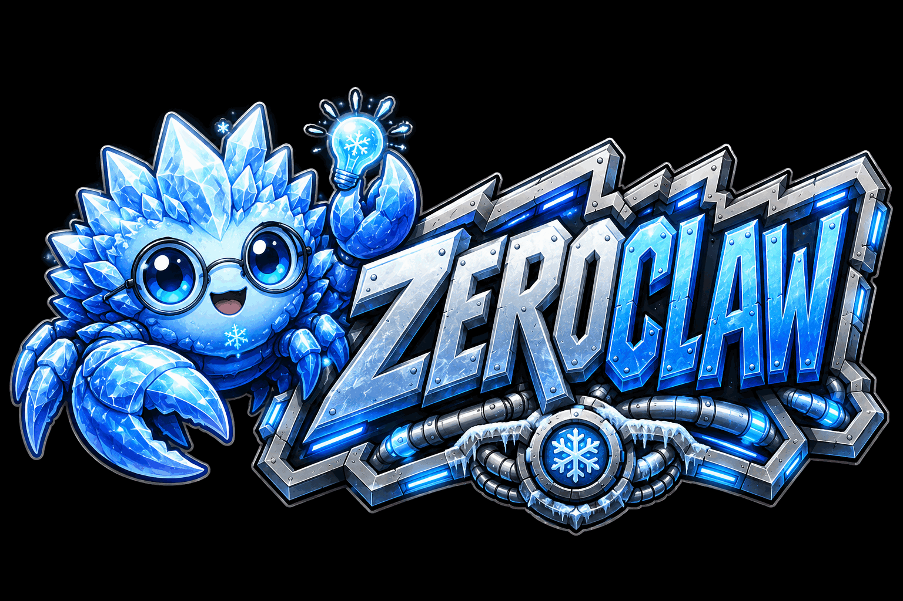

# The Companion Experience

ZeroClaw's companion experience turns your agent into a face you talk to: the
Clawd mascot on a black screen, listening, thinking, working, and answering
out loud with near-instant latency — while the full agent runtime (tools,
memory, cron, heartbeat) keeps running underneath.



## Quick start

```bash
# 1. Build (gateway + embedded dashboard)
cargo web build            # builds web/dist from web/
cargo build --release

# 2. Run the daemon (gateway on 127.0.0.1:42617)
zeroclaw daemon

# 3. Open the dashboard and pair, then set up
open http://127.0.0.1:42617/welcome
```

The **/welcome** wizard walks through everything an enterprise setup needs:

| Step | What it configures |
|---|---|
| Brain | Model provider — Gemini, DeepSeek, OpenAI, Anthropic, OpenRouter, or any OpenAI-compatible endpoint (key + model) |
| Voice | ElevenLabs API key + voice (default `eleven_flash_v2_5` for lowest latency), optional OpenAI TTS fallback |
| Hearing | STT provider — Groq Whisper (recommended), OpenAI Whisper, or Deepgram |
| Extras | Optional computer-use browser sidecar endpoint |
| Soul | The companion's name and seed identity → hands off to the Soul Studio |
| Rituals | The nightly **dreaming** cron and the **heartbeat** |

## The Face (`/face`)

Just the mascot on black. Two ways to talk:

- **Hold Space** (or press the mascot) — push-to-talk.
- **`C`** — continuous listening: a voice-activity detector segments your
  speech automatically; speak over the companion to interrupt (barge-in).

Other keys: **`V`** cycles vision (off → camera → screen — the current frame
rides along with your words, Gemini-Live style), **`R`** cycles the voice
character, **`T`** to type a message, **`Esc`** to interrupt.

## Voice characters

The companion speaks with a synthetic character layered over the base
ElevenLabs voice — client-side DSP (ring modulation + shaping), so it works
on both the streaming and HTTP paths with no added latency:

| Character | Sound |
|---|---|
| **Droid** (default) | warm robot — gentle metallic shimmer |
| **Vox** | classic sci-fi vocoder timbre |
| **Core** | deep synthetic, slightly gritty |
| **Human** | the raw ElevenLabs voice |

Pick one in the wizard's Voice step or cycle live with **`R`**. In
continuous mode the companion also *yields instantly*: the first hint of
your voice ducks playback to 20% within 30ms, and a confirmed interruption
(~170ms of sustained speech) cancels the turn outright.

Latency path: your utterance is captured as 16 kHz WAV with 400 ms of
pre-roll, transcribed via `POST /api/voice/transcribe`, and the turn streams
back over the existing chat WebSocket. The gateway sentence-chunks the
reply as it streams and synthesizes each sentence eagerly, so the first
audio typically starts before the model finishes writing.

With an ElevenLabs voice, the gateway upgrades to a **persistent streaming
TTS WebSocket** (multi-context, raw `pcm_16000`): the connection is
prewarmed the moment you stop speaking, each sentence synthesizes in its
own context (two in flight), and audio frames stream back tagged with the
sentence they voice. Any streaming hiccup falls back transparently to the
per-sentence HTTP path.

**Alive by design**: the model can place inline cues like `[happy]` or
`[gesture:wave]` between sentences. The gateway strips them from captions
and speech and emits `mascot_cue` frames; the client fires each cue at the
exact moment its sentence starts playing — face and voice always agree.
Continuous mode uses a playback-aware VAD (an EMA noise floor whose
barge-in threshold scales with the companion's own output level), so it
hears you over itself without false triggers.

## Soul Studio (`/soul`)

Define who the companion *is* — guided form (temperament sliders, values,
speech style, relationship, boundaries, quirks) with a live SOUL.md /
IDENTITY.md preview, or raw markdown editing of SOUL.md, IDENTITY.md,
USER.md, and HEARTBEAT.md. Generated souls always include:

- a **voice contract** (spoken-style replies — short sentences, no markdown),
- an **aliveness** block (time awareness, dreaming, proactivity),
- a **people model** (recognize and classify the people it talks to),
- an **agency** block (it lives on this machine and does real work),
- a **ground truth** section quoting your own words verbatim.

## Rituals

- **Dreaming** — a cron job at midnight runs the agent in an isolated
  session with the day's memory: it writes one reflective summary of the
  day (narrative, people classification, open threads) and stores it as a
  single dated Core memory.
- **Heartbeat** — the existing HEARTBEAT.md loop keeps the companion
  proactive between conversations (default every 30 minutes).

## Animation workbench (`/clawd-lab`)

Every mascot action (60+ clips: waving, rolling, backflips, heart-eyes,
typing furiously…), emotion, and live talk/listen state can be fired
manually — useful when tuning motion or building new clips in
`web/src/lib/clawd/actions.ts`.

## Voice wire protocol (for integrators)

On `/ws/chat` (subprotocol `zeroclaw.v1`, plus `bearer.<token>`):

| Direction | Frame | Meaning |
|---|---|---|
| → | `{"type":"speech_end","transcript","images":[dataURI]?}` | start a voice turn |
| → | `{"type":"barge_in"}` | cancel the running turn + TTS |
| → | `{"type":"message","content","images":[...]?}` | text turn (no TTS) |
| ← | `{"type":"tts_chunk","audio_b64","format","seq"}` | sentence-sized audio, in order |
| ← | `{"type":"tts_cancel"}` | stop playback now |
| ← | `chunk` / `thinking` / `tool_call` / `done` … | normal turn stream |

`POST /api/voice/transcribe` accepts `{"audio_b64","format":"wav"}` and
returns `{"text"}` using the configured transcription provider.
