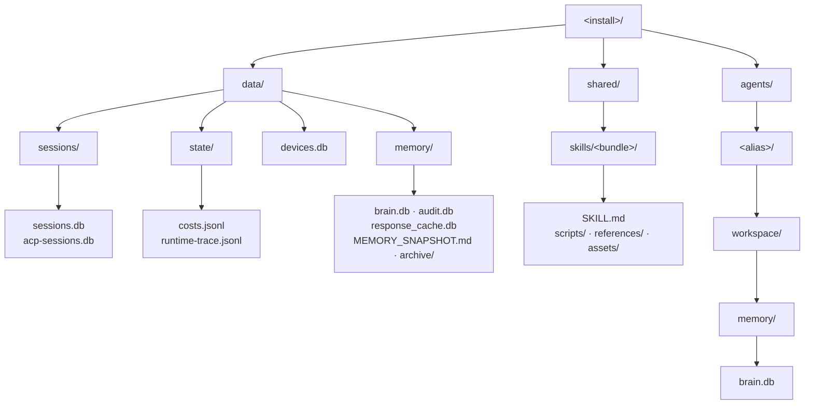

# Filesystem components

The relational half of an agent points at config; the on-disk half lives under
the install root. The layout is organized by **scope**, not one flat tree:
instance-wide state, cross-agent shared resources, and per-agent private data
each get their own top-level directory.

The three roots map to three scopes:

- **`data/`** holds state that belongs to the whole install, not to any one
  agent: chat `sessions/`, runtime `state/` (cost tracking and the like), the
  pairing `devices.db`, and the shared instance memory under `data/memory/`.
- **`shared/`** holds resources agents draw on in common, notably skill bundles
  under `shared/skills/<bundle>/`.
- **`agents/<alias>/`** holds everything private to one agent. By default an
  agent's workspace is `<install>/agents/<alias>/workspace/`, and everything the
  agent reads or writes stays inside it. The agent's identity source is resolved
  relative to this workspace. Agents are **jailed** to their own workspace
  unless you explicitly grant cross-agent access.

## Workspace

The workspace is the agent's filesystem sandbox. The fields below are generated
from the schema:

{{#config-fields agents.workspace}}

Two things worth calling out:

- **`access`** is an inbound allowlist for cross-agent filesystem sharing. Empty
  means jailed (own workspace only); an entry grants a named sibling agent a
  read or write mode into this agent's workspace.
- **`unrestricted_filesystem`** is the escape hatch: when `true`, the agent can
  touch anything the host filesystem permits. It is off by default and flipping
  it on is auditable.

## Memory

Each agent keeps its own memory store under its workspace
(`agents/<alias>/workspace/memory/`), separate from the shared instance memory
in `data/memory/`. The backend is selected per agent:

{{#config-fields agents.memory}}

The backend defaults to SQLite for a new agent, and once the agent has written
on-disk data the value is locked, so you cannot silently swap a backend out from
under existing memory. Cross-agent memory sharing is opt-in through the
workspace `read_memory_from` allowlist. For the memory model itself, see
[Runtime internals](./internals.md).

## Identity

An agent's identity (its personality) is sourced per agent:

{{#config-fields agents.identity}}

The `format` selects how the identity is loaded. The default reads the
project's personality files; the alternative loads an AIEOS JSON definition,
either from a path relative to the workspace or inline.
