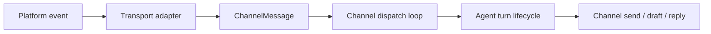

# Channel runtime lifecycle

Channels sit at the edge of ZeroClaw. They talk to chat platforms,
webhooks, editors, and event sources, then hand normalized work to the
agent runtime.

Use this page when a change touches channel listeners, gateway webhooks,
message dispatch, reply intent, streaming drafts, per-channel reload,
health/backoff behavior, or the boundary between platform-specific adapters
and runtime-owned turn processing.

## Target boundary and current transition

The target boundary is simple:

- Channel adapters own platform-specific I/O.
- Runtime-owned code owns the agent turn lifecycle.
- Gateway webhook handlers own generic HTTP transport details, then enter the
  same channel turn lifecycle as long-running listeners.

The current code is still in transition. `zeroclaw-channels` contains a
large `orchestrator` module with `ChannelRuntimeContext`,
`run_message_dispatch_loop`, and `process_channel_message`. That code
currently performs runtime-sized work: message routing, hooks, self-loop
guards, passive context, media/link enrichment, autosave, memory recall,
reply intent, tool-loop invocation, draft updates, cancellation, receipts,
cost tracking, and final delivery.

That is working code, not a reason to block every channel change. The review
rule is narrower: new channel, webhook, or streaming work should reuse this
shared lifecycle where possible and should not add another local
mini-orchestrator.

## What owns what

| Surface | Owner | Review rule |
| --- | --- | --- |
| Platform listener or channel inbound adapter | Channel module or channel plugin | Keep signature checks, payload decoding, platform retries, provider verification, challenge handling, and `ChannelMessage` construction local to the transport adapter. |
| Gateway webhook route | Gateway handler | Keep route hosting, proxying, timeout behavior, fast acknowledgement, and generic HTTP response policy local to the gateway. Do not grow new platform-specific parsing there except as documented transition debt. |
| Normalized inbound message | `ChannelMessage` from `zeroclaw-api` | Preserve sender, reply target, channel, alias, thread, attachments, subject, passive context, and conversation scope. Add structured metadata rather than hiding routing signals in user-visible text. |
| Agent ownership for a channel alias | `start_channels` / `AgentRouter` and active channel bindings | Resolve the owning agent from configured bindings. Do not silently fall back to an unrelated agent when a channel is unowned or disabled. |
| Message dispatch and cancellation | Shared channel dispatch loop | Reuse in-flight tracking, `/stop`, sender/thread cancellation, max in-flight limits, and worker concurrency. |
| Turn processing | Shared runtime/channel lifecycle | Hooks, self-loop guard, passive context, media/link enrichment, runtime commands, model routing, autosave, memory recall, reply intent, tool execution, receipts, cost, and delivery should live in one path. |
| Gateway webhook acknowledgement | Gateway handler | Fast-ack transports may return HTTP 200 before the model finishes, but the background work should still enter the shared channel lifecycle. |
| Channel health and reconnect | Listener supervisor | Retryable listener failures use bounded exponential backoff and cancellation-aware shutdown. Non-retryable failures should stop or surface clearly. |
| Runtime reload | Daemon reload and channel restart path | A config save is not enough. Long-running listeners adopt channel/provider/scheduler changes only when the daemon reloads or the process restarts. |

## Inbound shape

Long-running channels and webhook-backed channels have different transport
entry points, but they should converge on the same message shape:

Adapters should keep the work that only the platform can understand:

- route and alias resolution;
- body size limits and decoding;
- signature or token verification;
- platform-specific parse rules;
- pairing, allowlist, or sender identity extraction;
- provider challenge or verification endpoints;
- immediate acknowledgement policy.

After that, hand off a normalized `ChannelMessage`. Do not copy the rest of
the lifecycle into the adapter unless the exception is narrow, documented,
and tested.

## Runtime turn responsibilities

The shared lifecycle should own behavior that must be consistent across
channels:

- hooks such as message-received and message-sent;
- self-loop protection through `Channel::self_handle()` and
  `drop_self_messages`;
- passive-context recording without model/provider side effects;
- early acknowledgement reactions and no-reply cleanup;
- media and link preprocessing before the provider call;
- runtime commands such as `/new`, `/model`, `/models`, `/config`, and
  `/stop`;
- autosave and session history keys;
- memory recall and history trimming;
- reply-intent classification for group and ambient channels;
- streaming draft updates and multi-message behavior;
- tool approval, execution, receipts, observer events, and cost tracking;
- cancellation, timeout, rollback, and final reply delivery.

If a PR changes one of those responsibilities for only one channel, reviewers
should ask whether it belongs in the shared lifecycle or in typed channel
capability metadata.

## Gateway webhooks

Gateway webhooks have one legitimate special requirement: the HTTP request may
need to return quickly even when the agent turn is slow. Nextcloud Talk is the
clearest example because slow local models can exceed provider webhook
timeouts.

That fast acknowledgement requirement should not make the gateway own a
separate agent lifecycle. Some current gateway-backed handlers still carry
duplicated `parse -> autosave -> chat -> send` chains. Treat that as migration
debt and transition context, not as the pattern for new webhook-backed channel
work. A webhook handler can:

1. verify the request;
2. decode the payload;
3. parse one or more `ChannelMessage` values;
4. choose synchronous or background dispatch;
5. return the transport-appropriate HTTP response.

The message processing behind step 4 should reuse the channel lifecycle:
autosave/session policy, agent dispatch, quickstart fallback, reply/error
delivery, cancellation, and future ingress stamping should not be re-copied
for each webhook-backed channel.

When reviewing webhook changes, compare synchronous handlers and fast-ack
handlers separately:

- synchronous handlers must preserve existing status codes, invalid-signature
  behavior, autosave keys, and reply delivery;
- fast-ack handlers must prove the HTTP acknowledgement happens before the
  model call can block the provider timeout;
- both shapes should avoid adding another `parse -> autosave -> chat -> send`
  chain if a shared helper can own that work.

## Reload and listener lifecycle

Channel config can be saved before the running listener sees it. The daemon
owns the long-lived subsystem graph, so channel listener changes apply when
the daemon reloads or restarts the relevant subsystem. Standalone gateway
starts may require process restart for channel listener changes.

Review reload-sensitive changes by checking:

- whether the changed value is saved to `config.toml`;
- whether the running channel context reads the new value immediately, on
  reload, or only after restart;
- whether listener tasks stop through cancellation rather than orphaning old
  connections;
- whether active channel bindings remain the source of truth for which agent
  owns which channel alias.

## Streaming, drafts, and cancellation

Streaming is a capability boundary. A channel may support draft edits,
multi-message streaming, typing indicators, or only final-send behavior. The
shared lifecycle decides how those capabilities are used during a turn.

Review streaming changes by asking:

- does the channel declare the capability instead of hardcoding behavior in
  the turn loop?
- are draft messages finalized, cancelled, or replaced on every success,
  no-reply, failure, and cancellation path?
- does `/stop` cancel the correct sender/thread scope?
- do interrupted turns avoid persisting a partial assistant response as if it
  were complete?
- does the user-visible behavior stay consistent across direct messages,
  group chats, and threaded replies?

## Health and backoff

Long-running listeners must fail in a way operators can understand. Retryable
platform failures should back off and retry; non-retryable configuration or
authentication failures should surface clearly instead of looping forever.

For listener changes, prove the relevant path:

- healthy listener shutdown on cancellation;
- retryable API failure backs off and resumes;
- non-retryable failure stops or reports a durable configuration problem;
- one stalled channel does not wedge sibling listeners or observer delivery.

## Reviewer checklist

For channel, webhook, or channel-runtime changes, answer these before reviewer
sign-off:

- What transport-specific work remains in the adapter, and why?
- Where does the code first create or receive a `ChannelMessage`?
- Which agent owns the channel alias for this message?
- Does the change reuse the shared dispatch and turn lifecycle?
- If it adds channel-specific lifecycle behavior, what shared hook or
  capability was considered and why is it not enough?
- How are self-loop, addressedness, passive context, and reply intent carried?
- Are media, links, attachments, and tool outputs bounded before they enter
  provider-visible context?
- Does fast acknowledgement, if any, still preserve the same background turn
  behavior as synchronous dispatch?
- What happens on reload, listener cancellation, provider timeout, `/stop`,
  no-reply, and send failure?
- Which focused test or manual smoke proves the boundary that changed?

## Source pointers

Canonical docs:

- [Request lifecycle](./request-lifecycle.md)
- [Runtime state and persistence](./runtime-state-and-persistence.md)
- [Memory and payload lifecycle](./memory-payload-lifecycle.md)
- [Config lifecycle](./config-lifecycle.md)
- [Channels overview](../channels/overview.md)
- [Gateway HTTP API](../gateway/api.md)
- [FND-001: Intentional architecture](../foundations/fnd-001-intentional-architecture.md)
- [Plugin protocol](../developing/plugin-protocol.md)

Key code entry points:

- Channel trait and message shape: `crates/zeroclaw-api/src/channel.rs`
- Ingress context ABI: `crates/zeroclaw-api/src/ingress.rs`
- Channel dispatch and turn lifecycle:
  `crates/zeroclaw-channels/src/orchestrator/mod.rs`
- Runtime turn loop: `crates/zeroclaw-runtime/src/agent/turn/`
- Runtime generic process entry point:
  `crates/zeroclaw-runtime/src/agent/loop_.rs`
- Gateway webhook/chat path: `crates/zeroclaw-gateway/src/lib.rs`
