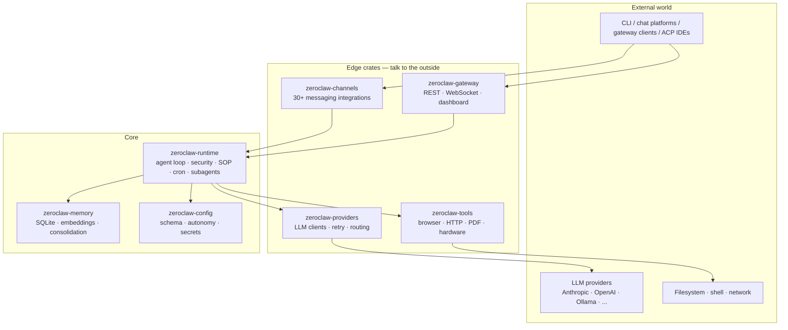
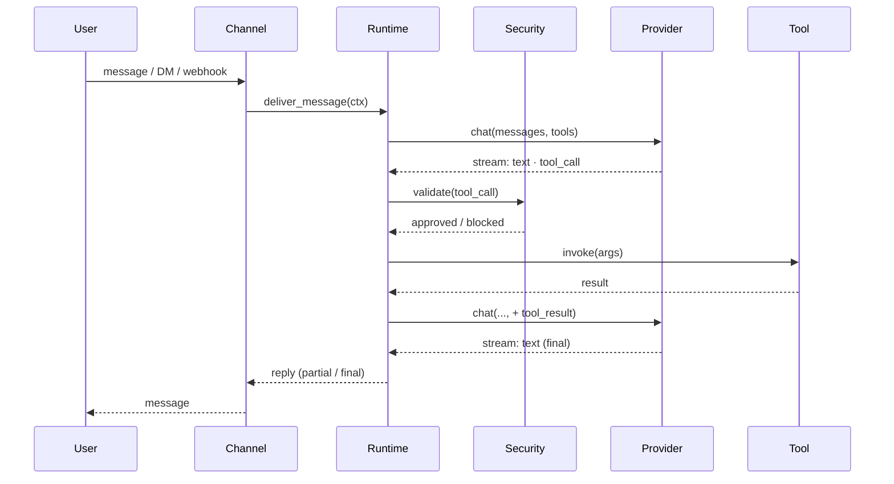

# Architecture Overview

ZeroClaw is a layered Rust workspace. At the top is the agent runtime; below it are pluggable providers, channels, tools, and memory; supporting crates handle config, sandboxing, and hardware.

## High-level shape

## Crates in scope

| Crate | Role |
|---|---|
| `zeroclaw-runtime` | Agent loop, security policy enforcement, SOP engine, cron scheduler, SubAgents, RPC layer for zerocode |
| `zeroclaw-config` | TOML schema, secrets encryption, autonomy levels, workspace resolution |
| `zeroclaw-api` | Public traits: `ModelProvider`, `Channel`, `Tool`, `Memory`, `Observer`, `RuntimeAdapter`, and `Peripheral`. The kernel ABI |
| `zeroclaw-providers` | All LLM client impls (Anthropic, OpenAI, Ollama, …) plus the hint-based router and same-provider retry wrapper |
| `zeroclaw-channels` | 30+ messaging integrations (Discord, Slack, Telegram, Matrix, email, voice, …) |
| `zeroclaw-gateway` | HTTP / WebSocket gateway, web dashboard, webhook ingress |
| `zeroclaw-tools` | Callable tool implementations the agent invokes (browser, HTTP, PDF, hardware probes) |
| `zeroclaw-tool-call-parser` | Model-side tool-call syntax parsing and normalisation |
| `zeroclaw-memory` | Conversation memory, embeddings, vector retrieval |
| `zeroclaw-plugins` | Dynamic plugin loading |
| `zeroclaw-hardware` | Hardware abstraction layer (GPIO, I2C, SPI, USB) |
| `zeroclaw-infra` | Process-level support: SQLite session backend, debouncers, stall watchdog |
| `zeroclaw-log` | The single log-emission surface: JSONL schema, attribution, `record!`/`scope!` macros, `/api/logs` reader, `Observer` bridge |
| `zeroclaw-spawn` | Sanctioned `tokio::spawn` wrapper (`spawn!` macro) that propagates attribution |
| `zeroclaw-macros` | Derive macros for config, tool registration |
| `zerocode` | Terminal UI |
| `aardvark-sys`, `robot-kit` | Specialised hardware support |

The microkernel roadmap (RFC #5574) is actively splitting `zeroclaw-runtime` further: the kernel layer will shrink to the agent loop and policy enforcement, with everything else moving behind feature flags.

## Request lifecycle (short)

Full detail: [Request lifecycle](./request-lifecycle.md).

## Extension points

Trait-based extension contracts live in `zeroclaw-api`. The common first-party extension surfaces are:

- **`ModelProvider`**: implement for a new LLM endpoint. See [Custom providers](../providers/custom.md) and [First-party extensions](../developing/first-party-extensions.md).
- **`Channel`**: implement for a new messaging platform. Inbound and outbound are separate hooks. See [Channels overview](../channels/overview.md) and [First-party extensions](../developing/first-party-extensions.md).
- **`Tool`**: implement for a new built-in agent capability. See [Tools overview](../tools/overview.md) and [First-party extensions](../developing/first-party-extensions.md).
- **`Memory`**: implement for a memory backend that preserves agent/session scoping. See [First-party extensions](../developing/first-party-extensions.md).
- **`Peripheral`**: implement for hardware boards and device surfaces. See [Hardware overview](../hardware/index.md) and [First-party extensions](../developing/first-party-extensions.md).

`Observer` and `RuntimeAdapter` are also public traits, but changes there are usually architecture-sensitive rather than ordinary adapter additions. Start with [Logging](./logging.md), [Request lifecycle](./request-lifecycle.md), and the [RFC process](../contributing/rfcs.md) before changing those contracts.

Concrete implementations are registered through the owning factory, registry, or feature gate for that surface. The kernel depends on the trait contracts rather than concrete implementations, and compile-time feature flags decide which optional implementations ship in a given binary.

## Where to read next

- [Crates](./crates.md): per-crate deep dive
- [Request lifecycle](./request-lifecycle.md): streaming, tool calls, approvals
- [Model Providers → Overview](../providers/overview.md)
- [Security → Overview](../security/overview.md)
