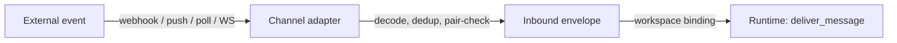
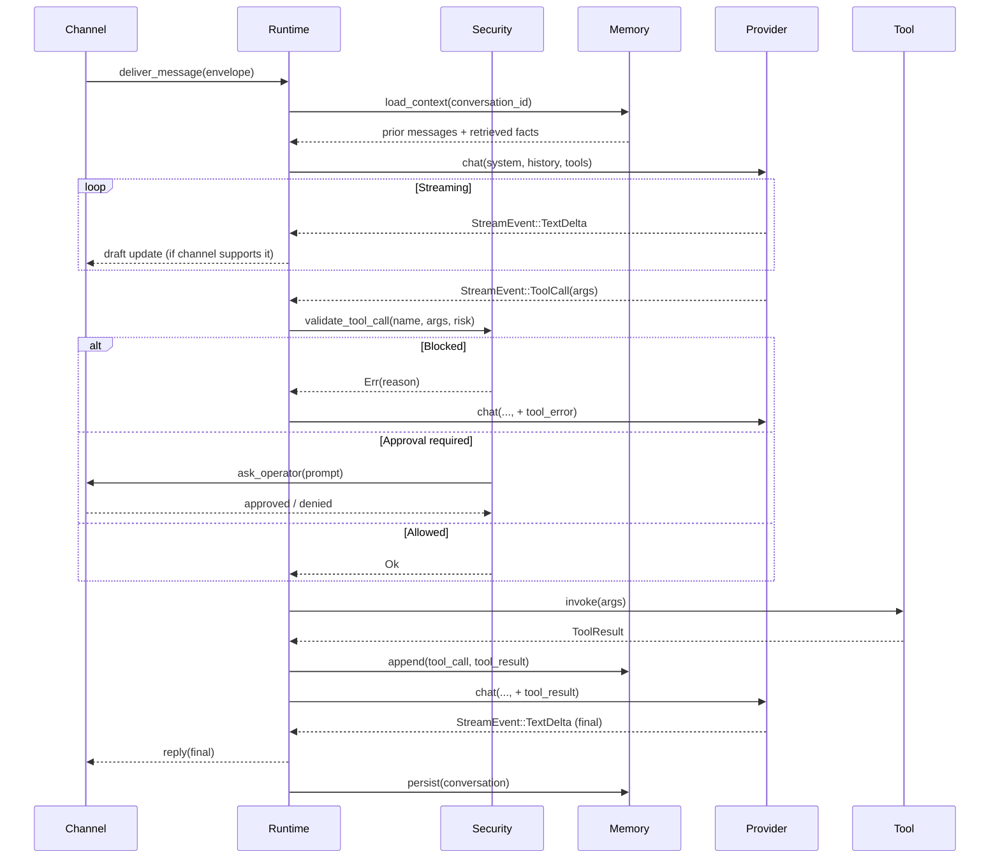

# Request Lifecycle

What happens between "user sends a message" and "agent replies" — the full path, with streaming, tool calls, and security gates annotated.

## Inbound

A channel adapter (e.g. `discord.rs`, `telegram.rs`, `email_channel.rs`) receives platform-native events and converts them into a uniform inbound envelope. The adapter handles:

- **Decoding** — platform-specific payload → canonical message format
- **Deduplication** — prevents replaying the same message twice (restarts, retries)
- **Pair-check** — enforces the `[channels.<name>.allowed_users]` / IAM policy before the event reaches the runtime

If the channel is not paired or the user isn't allowed, the event is dropped before the runtime sees it.

## Agent loop

Key properties:

- **Streaming is end-to-end.** The provider streams tokens. If the channel adapter reports `supports_draft_updates()`, the runtime edits a sent message in place as text arrives. Discord, Slack, and Telegram support this.
- **Tool calls are mid-stream.** The model can emit a tool call while still generating text. The runtime pauses the stream, validates, invokes, feeds the result back, and resumes.
- **Security gates every tool call.** `validate_tool_call` consults the [autonomy level](../security/autonomy.md), allow/deny lists, and path boundaries. Medium-risk calls under `Supervised` autonomy go to the operator-approval path.
- **Memory is persistent.** The full conversation, tool calls, tool results, and receipts are written to the memory backend.

## Tool receipts

Every tool invocation produces a signed receipt written to the tool-receipts log. See [Tool receipts](../security/tool-receipts.md). Receipts are chained — each one includes the hash of the previous — so tampering with any receipt invalidates the rest of the log.

## Outbound

Outbound messages go back through the same channel adapter. Adapters with multi-message support (Discord, Slack) can stream long replies as a sequence of messages; others (email, SMS) flush on stream completion.

## Where it lives in code

- Agent loop: `crates/zeroclaw-runtime/src/agent/loop_.rs`
- Tool-call validation: `crates/zeroclaw-runtime/src/security/`
- Channel orchestration: `crates/zeroclaw-channels/src/orchestrator/`
- Provider streaming: `crates/zeroclaw-providers/src/traits.rs` (`StreamEvent` enum), `compatible.rs` (SSE parser)
