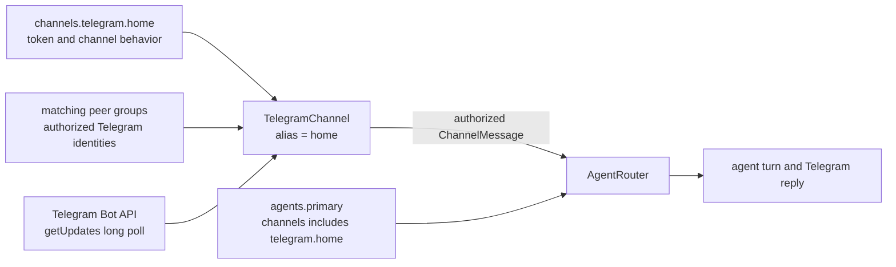
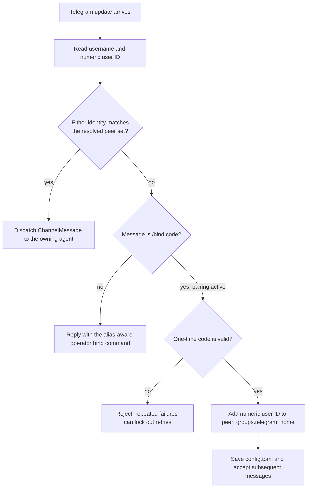

# Telegram

Run a ZeroClaw agent as a Telegram bot over long polling. No public URL or
webhook is required. This guide starts with the runtime wiring, then walks from
bot creation through the first authorized conversation.

## How the current implementation is wired

Telegram setup has three separate sources of truth. The channel block owns the
Telegram connection, the agent block owns routing, and peer groups own inbound
authorization:



`collect_configured_channels` constructs one `TelegramChannel` for every
enabled, agent-owned alias. The channel resolves matching peer-group members
from the shared `Config` when each message arrives. It accepts either the
sender's numeric Telegram user ID or username, then hands an authorized
`ChannelMessage` to the shared channel dispatch and agent-turn lifecycle.

There is no `allowed_users` field under `[channels.telegram.<alias>]`.
Authorization lives in [Peer Groups](./peer-groups.md); that page is the
canonical reference for peer-group fields, matching, and multi-agent behavior.

## 1. Create a Telegram bot

1. Open [@BotFather](https://t.me/BotFather) in Telegram.
2. Send `/newbot` and follow the prompts for a display name and username.
3. Copy the bot token. Telegram's
   [official tutorial](https://core.telegram.org/bots/tutorial#obtain-your-bot-token)
   covers the same flow.

Treat the token like a password. Anyone who has it can control the bot. Do not
paste it into `config.toml`, logs, screenshots, or source control.

## 2. Configure an alias and attach it to an agent

This guide uses `home` as the channel alias and `primary` as the agent alias.
The alias is ZeroClaw's local name for this bot instance; it does not have to
match the Telegram bot username.

Set the token through the masked secret prompt, then enable the channel:

```sh
zeroclaw config set channels.telegram.home.bot_token
zeroclaw config set channels.telegram.home.enabled true
```

List your agent aliases, then add `telegram.home` to the intended agent's
existing channel list. Omitting the value opens the list editor, so you can add
the new entry without discarding other channel bindings:

```sh
zeroclaw agents list
zeroclaw config set agents.primary.channels
```

Afterward, the relevant non-secret structure is equivalent to:

```toml
[channels.telegram.home]
enabled = true
# bot_token is stored encrypted after the masked `config set` prompt

[agents.primary]
channels = ["telegram.home"]
```

Replace `primary` with an existing agent that already has a working model
provider and risk profile. Once any agent in the config declares a `channels`
list, a channel that is enabled but not present in an enabled agent's
`channels` list is not started. If no agent declares any channel bindings,
ZeroClaw falls back to legacy routing instead: every enabled channel is
started and served by the resolved default enabled agent. Declare explicit
bindings as shown above so an unlisted bot is genuinely inactive rather than
silently running under the default agent.

## 3. Choose how the first users are authorized

Choose one of the following paths before starting the bot.

### Pair the first user with a one-time code

For a private first run, leave the resolved external-peer set empty. In
particular, no peer group whose `channel` is either `telegram` or
`telegram.home` may contribute any `external_peers` entries. A matching group
that carries only other settings while contributing no external peers does not
affect pairing.

When `TelegramChannel` is constructed with no resolved peers, it creates a
one-time pairing code and writes it to the foreground output and structured
logs. The first approved user redeems it from Telegram with `/bind`.

### Pre-authorize known users

If you already know the numeric Telegram user IDs, authorize them before
startup. A numeric ID is preferable to a username because it remains stable if
the user renames their account. This is the minimal alias-scoped example:

```toml
[peer_groups.telegram_home]
channel = "telegram.home"
external_peers = ["111111111", "222222222"]
```

Use a type-wide `channel = "telegram"` only when the same identities should be
accepted by every configured Telegram alias. For the complete schema and
resolution rules, see [Peer Groups](./peer-groups.md).

Any non-empty resolved external-peer set disables first-user pairing for that
channel instance. This includes a wildcard peer group.

> [!CAUTION]
> `external_peers = ["*"]` accepts every Telegram sender who can reach the bot
> and disables the one-time pairing flow. Those senders can drive the agent and
> any tools its risk profile permits. Use a wildcard only for a deliberately
> public bot with a suitably restricted agent; it is not a shortcut for private
> setup.

## 4. Start the channel and inspect it

Use the full daemon for normal operation, the channel-only process for a
foreground diagnostic run, or the installed service for long-running use:

```sh
zeroclaw daemon

# Alternative foreground diagnostic: starts all configured channels.
zeroclaw channel start

# If ZeroClaw is installed as a managed service.
zeroclaw service restart
```

Telegram uses `getUpdates` long polling, so it does not need an inbound port or
public callback URL. In another terminal, check connectivity and follow logs:

```sh
zeroclaw channel doctor
zeroclaw service logs --follow
```

With an empty peer set, look for `Telegram pairing required; one-time bind code
issued`. The structured event includes the channel alias and `pairing_code`.
Foreground `zeroclaw daemon` and `zeroclaw channel start` runs also print the
code directly. Treat the code and log output as sensitive until the code is
consumed.

## 5. Pair the first user with `/bind`

Send the printed code to the bot from the Telegram account you want to approve:

```text
/bind 123456
```

The authorization path is:



On success, ZeroClaw prefers the stable numeric sender ID, adds it to
`[peer_groups.telegram_home]` for `telegram.home`, and saves `config.toml`.
The running channel's peer resolver reads that shared config, so the user can
send the next message immediately without a restart.

The code is one-time. On later restarts the saved peer makes the resolved set
non-empty, so pairing stays disabled and no replacement code is issued. If the
bot says it paired only for the current runtime because persistence failed,
fix the reported config permission or write error before restarting.

## 6. Bind another user from the operator CLI

An unauthorized user can message the bot to receive a suggested operator
command containing their numeric ID. Run that command on the ZeroClaw host.
For the `home` alias it has this form:

```sh
zeroclaw channel bind-telegram 111111111 --alias home
```

You can also bind a Telegram username without its leading `@`:

```sh
zeroclaw channel bind-telegram example_user --alias home
```

`--alias` must match the key in `[channels.telegram.<alias>]`. The CLI defaults
to `default`, so only omit the flag when the configured channel really is
`[channels.telegram.default]`:

```sh
zeroclaw channel bind-telegram 111111111
```

The command rejects an unknown alias instead of creating a peer group that no
running channel would read. For a valid alias it creates or updates
`[peer_groups.telegram_<alias>]`, scopes the group to
`telegram.<alias>`, and saves the identity idempotently.

## Restart and persistence behavior

| Change | When the running channel sees it |
|---|---|
| Successful `/bind <code>` in Telegram | Immediately; the channel updates the shared in-process config and saves it. |
| `zeroclaw channel bind-telegram ...` with a detected running systemd, OpenRC, or launchd service | The CLI saves the config and restarts the managed service automatically. |
| `bind-telegram` while `zeroclaw daemon` or `zeroclaw channel start` is running in another terminal | After you stop and restart that foreground process. The CLI process changed the file, not the other process's in-memory config. |
| Direct `config.toml` edit or standalone `zeroclaw config set` change | After a daemon reload or process restart. Saving alone does not rebuild long-running listeners. |
| Restart with no matching peers | A new one-time pairing code is generated. |
| Restart after a peer was saved | The peer remains authorized and startup pairing is not activated. |

If automatic reload fails, the bind command keeps the saved change and tells
you to restart manually:

```sh
zeroclaw service stop
zeroclaw service start
```

## Logs and troubleshooting

For an installed service:

```sh
zeroclaw service logs --lines 200
zeroclaw service logs --follow
```

For a foreground run, read the process output. When persistent structured
logging is enabled, events are also written under the install directory at
`data/state/runtime-trace.jsonl`; see [Observability](../ops/observability.md).

| Symptom | Cause and fix |
|---|---|
| `Telegram channel alias 'default' is not configured` | The channel uses another alias. Re-run the bind with the matching `--alias`, such as `--alias home`. |
| No pairing code appears | A matching peer group already resolves at least one peer, possibly `"*"`. Pairing is intentionally inactive; use the operator bind command or correct the peer group and restart. |
| The bot still asks for operator approval after `bind-telegram` | The running foreground process has not reloaded, or the identity was bound to the wrong alias. Restart it and verify the `--alias` value. |
| The bot is silent | Confirm `enabled = true`, confirm an enabled agent owns `telegram.<alias>`, run `zeroclaw channel doctor`, then inspect logs. |
| `Telegram polling conflict (409)` | More than one process is using the same bot token. Stop the duplicate daemon or channel process. |
| Group messages are ignored | With `mention_only = true`, mention the bot or reply directly to one of its messages. Direct messages are still processed. |
| Draft edits report `Too Many Requests` | Increase `channels.telegram.<alias>.draft_update_interval_ms` or disable streaming. |

The full Telegram field list is generated from the live configuration schema:

{{#config-fields channels.telegram}}

## See also

- [Peer Groups](./peer-groups.md): canonical inbound authorization schema
- [Channel runtime lifecycle](../architecture/channel-runtime-lifecycle.md)
- [Service management](../setup/service.md)
- [Observability](../ops/observability.md)
