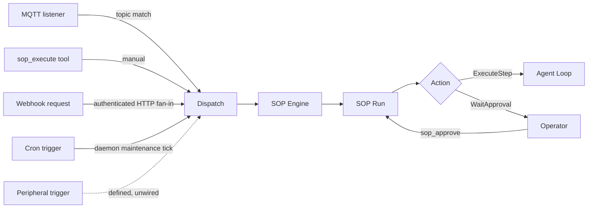

# How SOPs run

## Runtime contract

- SOP definitions are loaded from `<shared>/sops/<sop_name>/SOP.toml` plus optional `SOP.md`.
- CLI `zeroclaw sop` currently manages definitions only: `list`, `validate`, `show`.
- SOP runs are started by a live event fan-in (authenticated webhook, MQTT, filesystem, or AMQP), by the daemon's periodic SOP maintenance tick for `cron` triggers, or by the in-agent tool `sop_execute`. The remaining trigger types (peripheral and calendar) are defined and matched but not yet wired to a live event source (see [SOP Fan-In](./fan-in/overview.md)).
- Run progression uses tools: `sop_status`, `sop_approve`, `sop_advance`.
- Run state is process-local by default. With `sop.persist_runs = true`, successful initialization of the default SQLite backend stores it under `<data_dir>/sop/runs.db` and restores active runs after restart. Initialization failure logs a warning and falls back to process-local memory.
- SOP audit records are persisted in the configured Memory backend under category `sop`.

Run state and audit history are separate surfaces. See [Background work lifecycle](../architecture/background-work-lifecycle.md) for lifecycle ownership, cancellation, and restart semantics.

## Event flow



## Getting started

1. `sops_dir` is unset by default, so runtime SOP loading is off out of the box. Opt in by setting `sops_dir` through the gateway, zerocode, or `zeroclaw config set`. A relative value resolves against the install root (the directory holding `config.toml`), so the documented `shared/sops` yields `<install>/shared/sops`, the same directory the SOP author writes to. An absolute or `~`-prefixed value is used as-is. Setting it back to `""` (or removing it) disables runtime SOP loading again; the CLI still falls back to `<install>/shared/sops` for offline inspection.

   > **Migrating from an earlier build?** Relative `sops_dir` values now resolve against the install root, matching how `skill-bundles` directories resolve. Earlier builds had **two** different roots for the same setting, so check both before upgrading:
   >
   > | Surface on earlier builds | Root it used | Where `sops_dir = "shared/sops"` landed |
   > | --- | --- | --- |
   > | Runtime loading and local `zeroclaw sop` CLI | `data_dir` | `<data_dir>/shared/sops` |
   > | Web and RPC SOP authoring | `<install>/shared` | `<install>/shared/shared/sops` (doubled segment) |
   >
   > Both now resolve to the single canonical `<install>/shared/sops`. Inspect **both** old locations and move any definitions you find there into `<install>/shared/sops`; definitions left behind in either tree become invisible after upgrade. Definitions authored through the old web or RPC surface are the easiest to miss, because they sit in the doubled writer path rather than the location the docs described.
   >
   > Any other relative value shifts the same way: `sops_dir = "my-sops"` moves from `<data_dir>/my-sops` (runtime and CLI) or `<install>/shared/my-sops` (web and RPC authoring) to `<install>/my-sops`. Absolute and `~`-prefixed values are unaffected.
   >
   > The unset case moves too: the offline CLI fallback used to scan `<data_dir>/sops` and now scans `<install>/shared/sops`.
   >
   > `zeroclaw sop list` reads the new location, so an empty listing after upgrade means definitions are still sitting in one of the old trees.

2. Create a SOP directory, for example:

   ```text
   ~/.zeroclaw/shared/sops/deploy-prod/SOP.toml
   ~/.zeroclaw/shared/sops/deploy-prod/SOP.md
   ```

3. Validate and inspect definitions:

   <div class="os-tabs-src">

   #### sh

   ```sh
   zeroclaw sop list
   zeroclaw sop validate
   zeroclaw sop show deploy-prod
   ```

   </div>

4. Trigger runs via configured event sources, or manually from an agent turn with `sop_execute`.

For trigger routing and auth details, see [SOP Fan-In](./fan-in/overview.md).
