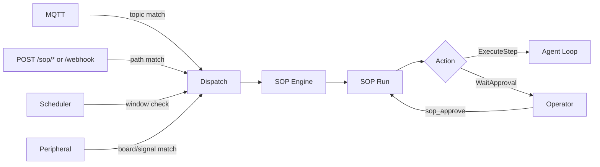

# 표준 운영 절차 (SOP)

SOP는 `SopEngine`에 의해 실행되는 결정론적 절차입니다. 명시적 트리거 매칭, 승인 게이트, 감사 가능한 실행 상태를 제공합니다.

## 바로 가기

- **이벤트 연결:** [연결 및 팬인](connectivity.md) -- MQTT, webhook, cron, 주변 장치를 통해 SOP를 트리거합니다.
- **SOP 작성:** [구문 레퍼런스](syntax.md) -- 필수 파일 레이아웃과 트리거/단계 구문입니다.
- **모니터링:** [관찰성 및 감사](observability.md) -- 실행 상태와 감사 항목이 저장되는 위치입니다.
- **예시:** [Cookbook](cookbook.md) -- 재사용 가능한 SOP 패턴입니다.

## 1. 런타임 계약 (현재)

- SOP 정의는 `<workspace>/sops/<sop_name>/SOP.toml`과 선택적 `SOP.md`에서 로드됩니다.
- CLI `zeroclaw sop`은 현재 정의 관리만 수행합니다: `list`, `validate`, `show`.
- SOP 실행은 이벤트 팬인(MQTT/webhook/cron/주변 장치) 또는 agent 내 도구 `sop_execute`에 의해 시작됩니다.
- 실행 진행은 도구를 사용합니다: `sop_status`, `sop_approve`, `sop_advance`.
- SOP 감사 기록은 구성된 Memory 백엔드에 카테고리 `sop`로 저장됩니다.

## 2. 이벤트 흐름



## 3. 시작하기

1. `config.toml`에서 SOP 하위 시스템을 활성화합니다:

   ```toml
   [sop]
   enabled = true
   sops_dir = "sops"  # 생략 시 기본값: <workspace>/sops
   ```

2. SOP 디렉터리를 생성합니다. 예:

   ```text
   ~/.zeroclaw/workspace/sops/deploy-prod/SOP.toml
   ~/.zeroclaw/workspace/sops/deploy-prod/SOP.md
   ```

3. 정의를 검증하고 확인합니다:

   ```bash
   zeroclaw sop list
   zeroclaw sop validate
   zeroclaw sop show deploy-prod
   ```

4. 구성된 이벤트 소스를 통해 실행을 트리거하거나, agent 턴에서 `sop_execute`로 수동 실행합니다.

트리거 라우팅 및 인증 세부 사항은 [연결](connectivity.md)을 참조하십시오.
