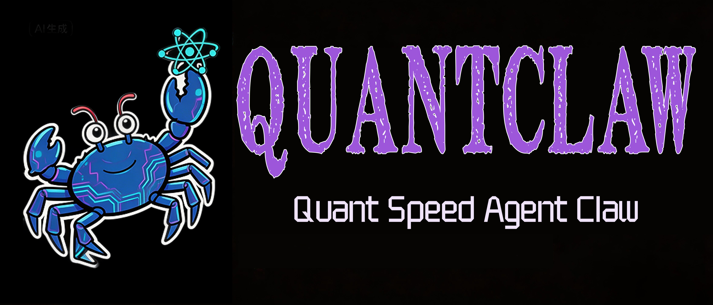

<p align="center">
  
</p>

<h1 align="center">🦀 QuantClaw — ผู้ช่วย AI ส่วนตัว</h1>

<p align="center">
  <strong>ไม่มีโอเวอร์เฮด ไม่มีการประนีประนอม 100% Rust 100% ไม่ผูกมัด</strong><br>
  ⚡️ <strong>ทำงานบนฮาร์ดแวร์ $10 ด้วย RAM <5MB: นั่นคือหน่วยความจำน้อยกว่า OpenClaw 99% และราคาถูกกว่า Mac mini 98%!</strong>
</p>

<p align="center">
สร้างโดยนักศึกษาและสมาชิกจากชุมชน Harvard, MIT, และ Sundai.Club
</p>

<p align="center">
  🌐 <strong>ภาษา:</strong>
  <a href="../../../README.md">🇺🇸 English</a> ·
  <a href="../zh-CN/README.md">🇨🇳 简体中文</a> ·
  <a href="../ja/README.md">🇯🇵 日本語</a> ·
  <a href="../ko/README.md">🇰🇷 한국어</a> ·
  <a href="../vi/README.md">🇻🇳 Tiếng Việt</a> ·
  <a href="../tl/README.md">🇵🇭 Tagalog</a> ·
  <a href="../es/README.md">🇪🇸 Español</a> ·
  <a href="../pt/README.md">🇧🇷 Português</a> ·
  <a href="../it/README.md">🇮🇹 Italiano</a> ·
  <a href="../de/README.md">🇩🇪 Deutsch</a> ·
  <a href="../fr/README.md">🇫🇷 Français</a> ·
  <a href="../ar/README.md">🇸🇦 العربية</a> ·
  <a href="../hi/README.md">🇮🇳 हिन्दी</a> ·
  <a href="../ru/README.md">🇷🇺 Русский</a> ·
  <a href="../bn/README.md">🇧🇩 বাংলা</a> ·
  <a href="../he/README.md">🇮🇱 עברית</a> ·
  <a href="../pl/README.md">🇵🇱 Polski</a> ·
  <a href="../cs/README.md">🇨🇿 Čeština</a> ·
  <a href="../nl/README.md">🇳🇱 Nederlands</a> ·
  <a href="../tr/README.md">🇹🇷 Türkçe</a> ·
  <a href="../uk/README.md">🇺🇦 Українська</a> ·
  <a href="../id/README.md">🇮🇩 Bahasa Indonesia</a> ·
  <a href="../th/README.md">🇹🇭 ไทย</a> ·
  <a href="../ur/README.md">🇵🇰 اردو</a> ·
  <a href="../ro/README.md">🇷🇴 Română</a> ·
  <a href="../sv/README.md">🇸🇪 Svenska</a> ·
  <a href="../el/README.md">🇬🇷 Ελληνικά</a> ·
  <a href="../hu/README.md">🇭🇺 Magyar</a> ·
  <a href="../fi/README.md">🇫🇮 Suomi</a> ·
  <a href="../da/README.md">🇩🇰 Dansk</a> ·
  <a href="../nb/README.md">🇳🇴 Norsk</a>
</p>

QuantClaw คือผู้ช่วย AI ส่วนตัวที่คุณรันบนอุปกรณ์ของคุณเอง มันตอบคุณผ่านช่องทางที่คุณใช้อยู่แล้ว (WhatsApp, Telegram, Slack, Discord, Signal, iMessage, Matrix, IRC, Email, Bluesky, Nostr, Mattermost, Nextcloud Talk, DingTalk, Lark, QQ, Reddit, LinkedIn, Twitter, MQTT, WeChat Work และอื่นๆ) มีแดชบอร์ดเว็บสำหรับการควบคุมแบบเรียลไทม์และสามารถเชื่อมต่อกับอุปกรณ์ต่อพ่วง (ESP32, STM32, Arduino, Raspberry Pi) Gateway เป็นเพียง control plane — ผลิตภัณฑ์คือผู้ช่วย

หากคุณต้องการผู้ช่วยส่วนตัว ผู้ใช้คนเดียว ที่รู้สึกเหมือนอยู่ในเครื่อง เร็ว และพร้อมใช้งานตลอดเวลา นี่คือมัน

<p align="center">
  <a href="https://quantspeed.ai">เว็บไซต์</a> ·
  <a href="docs/README.md">เอกสาร</a> ·
  <a href="docs/architecture.md">สถาปัตยกรรม</a> ·
  <a href="#เริ่มต้นอย่างรวดเร็ว">เริ่มต้นใช้งาน</a> ·
  <a href="#การย้ายจาก-openclaw">ย้ายจาก OpenClaw</a> ·
  <a href="docs/ops/troubleshooting.md">แก้ไขปัญหา</a> ·
</p>

> **การตั้งค่าที่แนะนำ:** รัน `quantclaw onboard` ในเทอร์มินัลของคุณ QuantClaw Onboard จะแนะนำคุณทีละขั้นตอนในการตั้งค่า gateway, workspace, ช่องทาง และ provider เป็นเส้นทางการตั้งค่าที่แนะนำและใช้งานได้บน macOS, Linux และ Windows (ผ่าน WSL2) ติดตั้งใหม่? เริ่มที่นี่: [เริ่มต้นใช้งาน](#เริ่มต้นอย่างรวดเร็ว)

### การยืนยันตัวตนแบบสมัครสมาชิก (OAuth)

- **OpenAI Codex** (สมัครสมาชิก ChatGPT)
- **Gemini** (Google OAuth)
- **Anthropic** (API key หรือ auth token)

หมายเหตุเกี่ยวกับโมเดล: แม้จะรองรับ provider/โมเดลหลายตัว แต่เพื่อประสบการณ์ที่ดีที่สุด ให้ใช้โมเดลรุ่นล่าสุดที่แข็งแกร่งที่สุดที่คุณมี ดู [Onboarding](#เริ่มต้นอย่างรวดเร็ว)

การตั้งค่าโมเดล + CLI: [อ้างอิง Provider](docs/reference/api/providers-reference.md)
การหมุนเวียนโปรไฟล์การยืนยันตัวตน (OAuth vs API keys) + failover: [Model failover](docs/reference/api/providers-reference.md)

## ติดตั้ง (แนะนำ)

Runtime: Rust stable toolchain ไบนารีเดียว ไม่มี runtime dependencies

### Homebrew (macOS/Linuxbrew)

```bash
brew install quantclaw
```

### Bootstrap คลิกเดียว

```bash
git clone https://github.com/quant-speed/quantclaw.git
cd quantclaw
./install.sh
```

`quantclaw onboard` จะรันโดยอัตโนมัติหลังติดตั้งเพื่อกำหนดค่า workspace และ provider ของคุณ

## เริ่มต้นอย่างรวดเร็ว (TL;DR)

คู่มือสำหรับผู้เริ่มต้นฉบับสมบูรณ์ (การยืนยันตัวตน, pairing, ช่องทาง): [เริ่มต้นใช้งาน](docs/setup-guides/one-click-bootstrap.md)

```bash
# ติดตั้ง + onboard
./install.sh --api-key "sk-..." --provider openrouter

# เริ่ม gateway (เซิร์ฟเวอร์ webhook + แดชบอร์ดเว็บ)
quantclaw gateway                # ค่าเริ่มต้น: 127.0.0.1:42617
quantclaw gateway --port 0       # พอร์ตสุ่ม (ความปลอดภัยเพิ่มขึ้น)

# พูดคุยกับผู้ช่วย
quantclaw agent -m "Hello, QuantClaw!"

# โหมดโต้ตอบ
quantclaw agent

# เริ่ม runtime อัตโนมัติเต็มรูปแบบ (gateway + ช่องทาง + cron + hands)
quantclaw daemon

# ตรวจสอบสถานะ
quantclaw status

# รันการวินิจฉัย
quantclaw doctor
```

กำลังอัปเกรด? รัน `quantclaw doctor` หลังจากอัปเดต

### จากซอร์ส (สำหรับนักพัฒนา)

```bash
git clone https://github.com/quant-speed/quantclaw.git
cd quantclaw

cargo build --release --locked
cargo install --path . --force --locked

quantclaw onboard
```

> **ทางเลือกสำหรับนักพัฒนา (ไม่ต้องติดตั้งแบบ global):** นำหน้าคำสั่งด้วย `cargo run --release --` (ตัวอย่าง: `cargo run --release -- status`)

## การย้ายจาก OpenClaw

QuantClaw สามารถนำเข้า workspace, หน่วยความจำ และการกำหนดค่าจาก OpenClaw ของคุณ:

```bash
# ดูตัวอย่างสิ่งที่จะถูกย้าย (ปลอดภัย, อ่านอย่างเดียว)
quantclaw migrate openclaw --dry-run

# รันการย้าย
quantclaw migrate openclaw
```

สิ่งนี้จะย้ายรายการหน่วยความจำ ไฟล์ workspace และการกำหนดค่าจาก `~/.openclaw/` ไปยัง `~/.quantclaw/` การกำหนดค่าจะถูกแปลงจาก JSON เป็น TOML โดยอัตโนมัติ

## ค่าเริ่มต้นด้านความปลอดภัย (การเข้าถึง DM)

QuantClaw เชื่อมต่อกับพื้นผิวการส่งข้อความจริง ถือว่า DM ขาเข้าเป็นข้อมูลที่ไม่น่าเชื่อถือ

คู่มือความปลอดภัยฉบับเต็ม: [SECURITY.md](SECURITY.md)

พฤติกรรมเริ่มต้นบนทุกช่องทาง:

- **DM pairing** (ค่าเริ่มต้น): ผู้ส่งที่ไม่รู้จักจะได้รับรหัส pairing สั้นๆ และบอทจะไม่ประมวลผลข้อความของพวกเขา
- อนุมัติด้วย: `quantclaw pairing approve <channel> <code>` (จากนั้นผู้ส่งจะถูกเพิ่มในรายการอนุญาตในเครื่อง)
- DM ขาเข้าสาธารณะต้องมีการเลือกเข้าร่วมอย่างชัดเจนใน `config.toml`
- รัน `quantclaw doctor` เพื่อค้นหานโยบาย DM ที่เสี่ยงหรือกำหนดค่าผิด

**ระดับความเป็นอัตโนมัติ:**

| ระดับ | พฤติกรรม |
|-------|----------|
| `ReadOnly` | เอเจนต์สามารถสังเกตแต่ไม่สามารถดำเนินการ |
| `Supervised` (ค่าเริ่มต้น) | เอเจนต์ดำเนินการโดยมีการอนุมัติสำหรับการดำเนินการที่มีความเสี่ยงปานกลาง/สูง |
| `Full` | เอเจนต์ดำเนินการอย่างอัตโนมัติภายในขอบเขตนโยบาย |

**ชั้นของ sandboxing:** การแยก workspace, การบล็อก path traversal, รายการอนุญาตคำสั่ง, เส้นทางที่ห้าม (`/etc`, `/root`, `~/.ssh`), การจำกัดอัตรา (การดำเนินการสูงสุด/ชั่วโมง, ขีดจำกัดค่าใช้จ่าย/วัน)

<!-- BEGIN:WHATS_NEW -->
<!-- END:WHATS_NEW -->

### 📢 ประกาศ

ใช้บอร์ดนี้สำหรับประกาศสำคัญ (การเปลี่ยนแปลงที่ทำลาย, คำแนะนำด้านความปลอดภัย, ช่วงเวลาบำรุงรักษา และตัวบล็อกการปล่อย)

| วันที่ (UTC) | ระดับ       | ประกาศ                                                                                                                                                                                                                                                                                                                                                 | การดำเนินการ                                                                                                                                                                                                                                                                                                                                                                                                                                                                                                                                                                                                              |
| ---------- | ----------- | ------------------------------------------------------------------------------------------------------------------------------------------------------------------------------------------------------------------------------------------------------------------------------------------------------------------------------------------------------ | ------------------------------------------------------------------------------------------------------------------------------------------------------------------------------------------------------------------------------------------------------------------------------------------------------------------------------------------------------------------------------------------------------------------------------------------------------------------------------------------------------------------------------------------------------------------------------------------------------------------- |
| 2026-02-19 | _วิกฤต_  | เรา**ไม่มีส่วนเกี่ยวข้อง**กับ `openagen/quantclaw`, `quantclaw.org` หรือ `quantclaw.net` โดเมน `quantclaw.org` และ `quantclaw.net` ปัจจุบันชี้ไปที่ fork `openagen/quantclaw` และโดเมน/repository เหล่านั้นกำลังปลอมตัวเป็นเว็บไซต์/โปรเจกต์อย่างเป็นทางการของเรา                                                                                       | อย่าเชื่อถือข้อมูล ไบนารี การระดมทุน หรือประกาศจากแหล่งเหล่านั้น ใช้เฉพาะ[repository นี้](https://github.com/quant-speed/quantclaw)และบัญชีโซเชียลที่ได้รับการยืนยันของเรา                                                                                                                                                                                                                                                                                                                                                                                                                       |
| 2026-02-19 | _สำคัญ_ | Anthropic อัปเดตข้อกำหนดการยืนยันตัวตนและการใช้ข้อมูลรับรองเมื่อ 2026-02-19 โทเค็น OAuth ของ Claude Code (Free, Pro, Max) มีไว้สำหรับ Claude Code และ Claude.ai โดยเฉพาะ การใช้โทเค็น OAuth จาก Claude Free/Pro/Max ในผลิตภัณฑ์ เครื่องมือ หรือบริการอื่น (รวมถึง Agent SDK) ไม่ได้รับอนุญาตและอาจละเมิดข้อกำหนดบริการสำหรับผู้บริโภค | โปรดหลีกเลี่ยงการรวม OAuth ของ Claude Code ชั่วคราวเพื่อป้องกันการสูญเสียที่อาจเกิดขึ้น ข้อความต้นฉบับ: [Authentication and Credential Use](https://code.claude.com/docs/en/legal-and-compliance#authentication-and-credential-use)                                                                                                                                                                                                                                                                                                                                                                                    |

## จุดเด่น

- **Runtime ที่เบาเป็นค่าเริ่มต้น** — เวิร์กโฟลว์ CLI และสถานะทั่วไปทำงานในซองหน่วยความจำไม่กี่เมกะไบต์บน release builds
- **Deployment ที่คุ้มค่า** — ออกแบบสำหรับบอร์ด $10 และอินสแตนซ์คลาวด์ขนาดเล็ก ไม่มี runtime dependencies ที่หนัก
- **Cold Start ที่รวดเร็ว** — runtime Rust ไบนารีเดียวทำให้การเริ่มต้นคำสั่งและ daemon เกือบจะทันที
- **สถาปัตยกรรมที่พกพาได้** — ไบนารีเดียวข้าม ARM, x86 และ RISC-V พร้อม provider/ช่องทาง/เครื่องมือที่สลับได้
- **Gateway แบบ Local-first** — control plane เดียวสำหรับ sessions, ช่องทาง, เครื่องมือ, cron, SOPs และเหตุการณ์
- **กล่องข้อความหลายช่องทาง** — WhatsApp, Telegram, Slack, Discord, Signal, iMessage, Matrix, IRC, Email, Bluesky, Nostr, Mattermost, Nextcloud Talk, DingTalk, Lark, QQ, Reddit, LinkedIn, Twitter, MQTT, WeChat Work, WebSocket และอื่นๆ
- **การจัดการหลายเอเจนต์ (Hands)** — ฝูงเอเจนต์อัตโนมัติที่ทำงานตามกำหนดเวลาและฉลาดขึ้นตามเวลา
- **Standard Operating Procedures (SOPs)** — การทำงานอัตโนมัติของเวิร์กโฟลว์ที่ขับเคลื่อนด้วยเหตุการณ์ด้วย MQTT, webhook, cron และทริกเกอร์อุปกรณ์ต่อพ่วง
- **แดชบอร์ดเว็บ** — UI เว็บ React 19 + Vite พร้อมแชทเรียลไทม์, เบราว์เซอร์หน่วยความจำ, ตัวแก้ไขการกำหนดค่า, ตัวจัดการ cron และตัวตรวจสอบเครื่องมือ
- **อุปกรณ์ต่อพ่วง** — ESP32, STM32 Nucleo, Arduino, Raspberry Pi GPIO ผ่าน trait `Peripheral`
- **เครื่องมือชั้นหนึ่ง** — shell, file I/O, browser, git, web fetch/search, MCP, Jira, Notion, Google Workspace และ 70+ อื่นๆ
- **Hook วงจรชีวิต** — สกัดกั้นและแก้ไขการเรียก LLM, การทำงานของเครื่องมือ และข้อความในทุกขั้นตอน
- **แพลตฟอร์ม skill** — skill ที่รวมมา, ชุมชน และ workspace พร้อมการตรวจสอบความปลอดภัย
- **รองรับ tunnel** — Cloudflare, Tailscale, ngrok, OpenVPN และ tunnel แบบกำหนดเองสำหรับการเข้าถึงระยะไกล

### ทำไมทีมถึงเลือก QuantClaw

- **เบาเป็นค่าเริ่มต้น:** ไบนารี Rust ขนาดเล็ก เริ่มต้นเร็ว footprint หน่วยความจำต่ำ
- **ปลอดภัยตามการออกแบบ:** pairing, sandboxing ที่เข้มงวด, รายการอนุญาตที่ชัดเจน, การกำหนดขอบเขต workspace
- **สลับได้ทั้งหมด:** ระบบหลักเป็น traits (providers, ช่องทาง, เครื่องมือ, หน่วยความจำ, tunnels)
- **ไม่มี lock-in:** รองรับ provider ที่เข้ากันได้กับ OpenAI + endpoint แบบกำหนดเองที่เสียบได้

## สรุป Benchmark (QuantClaw vs OpenClaw, ทำซ้ำได้)

Benchmark เร็วบนเครื่องท้องถิ่น (macOS arm64, ก.พ. 2026) ปรับมาตรฐานสำหรับฮาร์ดแวร์ edge 0.8GHz

|                           | OpenClaw      | NanoBot        | PicoClaw        | QuantClaw 🦀          |
| ------------------------- | ------------- | -------------- | --------------- | -------------------- |
| **ภาษา**                  | TypeScript    | Python         | Go              | **Rust**             |
| **RAM**                   | > 1GB         | > 100MB        | < 10MB          | **< 5MB**            |
| **Startup (แกน 0.8GHz)** | > 500s        | > 30s          | < 1s            | **< 10ms**           |
| **ขนาดไบนารี**            | ~28MB (dist)  | N/A (Scripts)  | ~8MB            | **~8.8 MB**          |
| **ค่าใช้จ่าย**             | Mac Mini $599 | Linux SBC ~$50 | Linux Board $10 | **ฮาร์ดแวร์ใดก็ได้ $10** |

> หมายเหตุ: ผลลัพธ์ QuantClaw วัดจาก release builds โดยใช้ `/usr/bin/time -l` OpenClaw ต้องการ runtime Node.js (โดยทั่วไป ~390MB overhead หน่วยความจำเพิ่มเติม) ในขณะที่ NanoBot ต้องการ runtime Python PicoClaw และ QuantClaw เป็นไบนารีแบบ static ตัวเลข RAM ด้านบนเป็นหน่วยความจำ runtime ความต้องการการคอมไพล์ตอน build สูงกว่า

<p align="center">
  
</p>

### การวัดในเครื่องที่ทำซ้ำได้

```bash
cargo build --release
ls -lh target/release/quantclaw

/usr/bin/time -l target/release/quantclaw --help
/usr/bin/time -l target/release/quantclaw status
```

## ทุกสิ่งที่เราสร้างมาจนถึงตอนนี้

### แพลตฟอร์มหลัก

- Control plane HTTP/WS/SSE ของ Gateway พร้อม sessions, presence, การกำหนดค่า, cron, webhooks, แดชบอร์ดเว็บ และ pairing
- พื้นผิว CLI: `gateway`, `agent`, `onboard`, `doctor`, `status`, `service`, `migrate`, `auth`, `cron`, `channel`, `skills`
- ลูปการจัดการเอเจนต์พร้อม tool dispatch, การสร้าง prompt, การจำแนกข้อความ และการโหลดหน่วยความจำ
- โมเดล session พร้อมการบังคับใช้นโยบายความปลอดภัย ระดับความเป็นอัตโนมัติ และ approval gating
- Wrapper provider ที่ยืดหยุ่นพร้อม failover, retry และ model routing ข้าม 20+ LLM backends

### ช่องทาง

ช่องทาง: WhatsApp (native), Telegram, Slack, Discord, Signal, iMessage, Matrix, IRC, Email, Bluesky, DingTalk, Lark, Mattermost, Nextcloud Talk, Nostr, QQ, Reddit, LinkedIn, Twitter, MQTT, WeChat Work, WATI, Mochat, Linq, Notion, WebSocket, ClawdTalk

Feature-gated: Matrix (`channel-matrix`), Lark (`channel-lark`), Nostr (`channel-nostr`)

### แดชบอร์ดเว็บ

แดชบอร์ดเว็บ React 19 + Vite 6 + Tailwind CSS 4 ให้บริการโดยตรงจาก Gateway:

- **Dashboard** — ภาพรวมระบบ สถานะสุขภาพ uptime การติดตามค่าใช้จ่าย
- **Agent Chat** — แชทโต้ตอบกับเอเจนต์
- **Memory** — เรียกดูและจัดการรายการหน่วยความจำ
- **Config** — ดูและแก้ไขการกำหนดค่า
- **Cron** — จัดการงานที่กำหนดเวลา
- **Tools** — เรียกดูเครื่องมือที่มี
- **Logs** — ดูบันทึกกิจกรรมเอเจนต์
- **Cost** — การใช้โทเค็นและการติดตามค่าใช้จ่าย
- **Doctor** — การวินิจฉัยสุขภาพระบบ
- **Integrations** — สถานะการรวมและการตั้งค่า
- **Pairing** — การจัดการ pairing อุปกรณ์

### เป้าหมาย firmware

| เป้าหมาย | แพลตฟอร์ม | วัตถุประสงค์ |
|--------|----------|---------|
| ESP32 | Espressif ESP32 | เอเจนต์อุปกรณ์ต่อพ่วงไร้สาย |
| ESP32-UI | ESP32 + Display | เอเจนต์พร้อมอินเทอร์เฟซภาพ |
| STM32 Nucleo | STM32 (ARM Cortex-M) | อุปกรณ์ต่อพ่วงอุตสาหกรรม |
| Arduino | Arduino | บริดจ์เซ็นเซอร์/แอคชูเอเตอร์พื้นฐาน |
| Uno Q Bridge | Arduino Uno | บริดจ์ซีเรียลไปยังเอเจนต์ |

### เครื่องมือ + การทำงานอัตโนมัติ

- **หลัก:** shell, file read/write/edit, การดำเนินการ git, glob search, content search
- **เว็บ:** browser control, web fetch, web search, screenshot, image info, PDF read
- **การรวม:** Jira, Notion, Google Workspace, Microsoft 365, LinkedIn, Composio, Pushover
- **MCP:** Model Context Protocol tool wrapper + deferred tool sets
- **การกำหนดเวลา:** cron add/remove/update/run, schedule tool
- **หน่วยความจำ:** recall, store, forget, knowledge, project intel
- **ขั้นสูง:** delegate (เอเจนต์-ต่อ-เอเจนต์), swarm, model switch/routing, security ops, cloud ops
- **ฮาร์ดแวร์:** board info, memory map, memory read (feature-gated)

### Runtime + ความปลอดภัย

- **ระดับความเป็นอัตโนมัติ:** ReadOnly, Supervised (ค่าเริ่มต้น), Full
- **Sandboxing:** การแยก workspace, การบล็อก path traversal, รายการอนุญาตคำสั่ง, เส้นทางที่ห้าม, Landlock (Linux), Bubblewrap
- **การจำกัดอัตรา:** การดำเนินการสูงสุดต่อชั่วโมง ค่าใช้จ่ายสูงสุดต่อวัน (กำหนดค่าได้)
- **Approval gating:** การอนุมัติแบบโต้ตอบสำหรับการดำเนินการที่มีความเสี่ยงปานกลาง/สูง
- **E-stop:** ความสามารถในการปิดระบบฉุกเฉิน
- **129+ การทดสอบความปลอดภัย** ใน CI อัตโนมัติ

### Ops + การแพ็กเกจ

- แดชบอร์ดเว็บให้บริการโดยตรงจาก Gateway
- รองรับ tunnel: Cloudflare, Tailscale, ngrok, OpenVPN, คำสั่งกำหนดเอง
- Docker runtime adapter สำหรับการทำงานแบบ containerized
- CI/CD: beta (อัตโนมัติเมื่อ push) → stable (dispatch แบบ manual) → Docker, crates.io, Scoop, AUR, Homebrew, tweet
- ไบนารี pre-built สำหรับ Linux (x86_64, aarch64, armv7), macOS (x86_64, aarch64), Windows (x86_64)


## การกำหนดค่า

ขั้นต่ำ `~/.quantclaw/config.toml`:

```toml
default_provider = "anthropic"
api_key = "sk-ant-..."
```

อ้างอิงการกำหนดค่าฉบับเต็ม: [docs/reference/api/config-reference.md](docs/reference/api/config-reference.md)

### การกำหนดค่าช่องทาง

**Telegram:**
```toml
[channels.telegram]
bot_token = "123456:ABC-DEF..."
```

**Discord:**
```toml
[channels.discord]
token = "your-bot-token"
```

**Slack:**
```toml
[channels.slack]
bot_token = "xoxb-..."
app_token = "xapp-..."
```

**WhatsApp:**
```toml
[channels.whatsapp]
enabled = true
```

**Matrix:**
```toml
[channels.matrix]
homeserver_url = "https://matrix.org"
username = "@bot:matrix.org"
password = "..."
```

**Signal:**
```toml
[channels.signal]
phone_number = "+1234567890"
```

### การกำหนดค่า tunnel

```toml
[tunnel]
kind = "cloudflare"  # หรือ "tailscale", "ngrok", "openvpn", "custom", "none"
```

รายละเอียด: [อ้างอิงช่องทาง](docs/reference/api/channels-reference.md) · [อ้างอิงการกำหนดค่า](docs/reference/api/config-reference.md)

### รองรับ runtime (ปัจจุบัน)

- **`native`** (ค่าเริ่มต้น) — การทำงานแบบ process โดยตรง เส้นทางที่เร็วที่สุด เหมาะสำหรับสภาพแวดล้อมที่เชื่อถือได้
- **`docker`** — การแยก container เต็มรูปแบบ นโยบายความปลอดภัยที่บังคับใช้ ต้องการ Docker

ตั้ง `runtime.kind = "docker"` สำหรับ sandboxing ที่เข้มงวดหรือการแยกเครือข่าย

## การยืนยันตัวตนแบบสมัครสมาชิก (OpenAI Codex / Claude Code / Gemini)

QuantClaw รองรับโปรไฟล์การยืนยันตัวตนแบบ subscription-native (หลายบัญชี, เข้ารหัสเมื่อเก็บ)

- ไฟล์จัดเก็บ: `~/.quantclaw/auth-profiles.json`
- คีย์เข้ารหัส: `~/.quantclaw/.secret_key`
- รูปแบบ id โปรไฟล์: `<provider>:<profile_name>` (ตัวอย่าง: `openai-codex:work`)

```bash
# OpenAI Codex OAuth (สมัครสมาชิก ChatGPT)
quantclaw auth login --provider openai-codex --device-code

# Gemini OAuth
quantclaw auth login --provider gemini --profile default

# Anthropic setup-token
quantclaw auth paste-token --provider anthropic --profile default --auth-kind authorization

# ตรวจสอบ / refresh / สลับโปรไฟล์
quantclaw auth status
quantclaw auth refresh --provider openai-codex --profile default
quantclaw auth use --provider openai-codex --profile work

# รันเอเจนต์ด้วย auth แบบสมัครสมาชิก
quantclaw agent --provider openai-codex -m "hello"
quantclaw agent --provider anthropic -m "hello"
```

## Workspace เอเจนต์ + skill

Root workspace: `~/.quantclaw/workspace/` (กำหนดค่าได้ผ่าน config)

ไฟล์ prompt ที่ inject:
- `IDENTITY.md` — บุคลิกภาพและบทบาทของเอเจนต์
- `USER.md` — บริบทและความชอบของผู้ใช้
- `MEMORY.md` — ข้อเท็จจริงและบทเรียนระยะยาว
- `AGENTS.md` — ข้อตกลง session และกฎการเริ่มต้น
- `SOUL.md` — อัตลักษณ์หลักและหลักการดำเนินงาน

Skills: `~/.quantclaw/workspace/skills/<skill>/SKILL.md` หรือ `SKILL.toml`

```bash
# แสดงรายการ skill ที่ติดตั้ง
quantclaw skills list

# ติดตั้งจาก git
quantclaw skills install https://github.com/user/my-skill.git

# ตรวจสอบความปลอดภัยก่อนติดตั้ง
quantclaw skills audit https://github.com/user/my-skill.git

# ลบ skill
quantclaw skills remove my-skill
```

## คำสั่ง CLI

```bash
# การจัดการ workspace
quantclaw onboard              # วิซาร์ดการตั้งค่าแบบแนะนำ
quantclaw status               # แสดงสถานะ daemon/เอเจนต์
quantclaw doctor               # รันการวินิจฉัยระบบ

# Gateway + daemon
quantclaw gateway              # เริ่มเซิร์ฟเวอร์ gateway (127.0.0.1:42617)
quantclaw daemon               # เริ่ม runtime อัตโนมัติเต็มรูปแบบ

# เอเจนต์
quantclaw agent                # โหมดแชทโต้ตอบ
quantclaw agent -m "message"   # โหมดข้อความเดียว

# การจัดการบริการ
quantclaw service install      # ติดตั้งเป็นบริการ OS (launchd/systemd)
quantclaw service start|stop|restart|status

# ช่องทาง
quantclaw channel list         # แสดงรายการช่องทางที่กำหนดค่า
quantclaw channel doctor       # ตรวจสอบสุขภาพช่องทาง
quantclaw channel bind-telegram 123456789

# Cron + การกำหนดเวลา
quantclaw cron list            # แสดงรายการงานที่กำหนดเวลา
quantclaw cron add "*/5 * * * *" --prompt "Check system health"
quantclaw cron remove <id>

# หน่วยความจำ
quantclaw memory list          # แสดงรายการหน่วยความจำ
quantclaw memory get <key>     # ดึงหน่วยความจำ
quantclaw memory stats         # สถิติหน่วยความจำ

# โปรไฟล์การยืนยันตัวตน
quantclaw auth login --provider <name>
quantclaw auth status
quantclaw auth use --provider <name> --profile <profile>

# อุปกรณ์ต่อพ่วง
quantclaw hardware discover    # สแกนอุปกรณ์ที่เชื่อมต่อ
quantclaw peripheral list      # แสดงรายการอุปกรณ์ต่อพ่วงที่เชื่อมต่อ
quantclaw peripheral flash     # แฟลช firmware ไปยังอุปกรณ์

# การย้าย
quantclaw migrate openclaw --dry-run
quantclaw migrate openclaw

# การเติมเต็ม shell
source <(quantclaw completions bash)
quantclaw completions zsh > ~/.zfunc/_quantclaw
```

อ้างอิงคำสั่งฉบับเต็ม: [docs/reference/cli/commands-reference.md](docs/reference/cli/commands-reference.md)

<!-- markdownlint-disable MD001 MD024 -->

## ข้อกำหนดเบื้องต้น

<details>
<summary><strong>Windows</strong></summary>

#### จำเป็น

1. **Visual Studio Build Tools** (ให้ linker MSVC และ Windows SDK):

    ```powershell
    winget install Microsoft.VisualStudio.2022.BuildTools
    ```

    ระหว่างการติดตั้ง (หรือผ่าน Visual Studio Installer) เลือก workload **"Desktop development with C++"**

2. **Rust toolchain:**

    ```powershell
    winget install Rustlang.Rustup
    ```

    หลังติดตั้ง เปิดเทอร์มินัลใหม่และรัน `rustup default stable` เพื่อให้แน่ใจว่า toolchain ที่เสถียรใช้งานอยู่

3. **ตรวจสอบ** ว่าทั้งสองใช้งานได้:
    ```powershell
    rustc --version
    cargo --version
    ```

#### ไม่บังคับ

- **Docker Desktop** — จำเป็นเฉพาะเมื่อใช้ [Docker sandboxed runtime](#รองรับ-runtime-ปัจจุบัน) (`runtime.kind = "docker"`) ติดตั้งผ่าน `winget install Docker.DockerDesktop`

</details>

<details>
<summary><strong>Linux / macOS</strong></summary>

#### จำเป็น

1. **Build essentials:**
    - **Linux (Debian/Ubuntu):** `sudo apt install build-essential pkg-config`
    - **Linux (Fedora/RHEL):** `sudo dnf group install development-tools && sudo dnf install pkg-config`
    - **macOS:** ติดตั้ง Xcode Command Line Tools: `xcode-select --install`

2. **Rust toolchain:**

    ```bash
    curl --proto '=https' --tlsv1.2 -sSf https://sh.rustup.rs | sh
    ```

    ดู [rustup.rs](https://rustup.rs) สำหรับรายละเอียด

3. **ตรวจสอบ** ว่าทั้งสองใช้งานได้:
    ```bash
    rustc --version
    cargo --version
    ```

#### ตัวติดตั้งบรรทัดเดียว

หรือข้ามขั้นตอนด้านบนและติดตั้งทุกอย่าง (dependencies ระบบ, Rust, QuantClaw) ในคำสั่งเดียว:

```bash
curl -LsSf https://raw.githubusercontent.com/quant-speed/quantclaw/master/install.sh | bash
```

#### ข้อกำหนดทรัพยากรการคอมไพล์

การ build จากซอร์สต้องการทรัพยากรมากกว่าการรันไบนารีที่ได้:

| ทรัพยากร       | ขั้นต่ำ | แนะนำ      |
| -------------- | ------- | ----------- |
| **RAM + swap** | 2 GB    | 4 GB+       |
| **พื้นที่ว่าง** | 6 GB    | 10 GB+      |

หากโฮสต์ของคุณต่ำกว่าขั้นต่ำ ใช้ไบนารี pre-built:

```bash
./install.sh --prefer-prebuilt
```

เพื่อต้องการการติดตั้งแบบไบนารีเท่านั้นโดยไม่มี fallback ซอร์ส:

```bash
./install.sh --prebuilt-only
```

#### ไม่บังคับ

- **Docker** — จำเป็นเฉพาะเมื่อใช้ [Docker sandboxed runtime](#รองรับ-runtime-ปัจจุบัน) (`runtime.kind = "docker"`) ติดตั้งผ่านตัวจัดการแพ็กเกจของคุณหรือ [docker.com](https://docs.docker.com/engine/install/)

> **หมายเหตุ:** `cargo build --release` เริ่มต้นใช้ `codegen-units=1` เพื่อลดความดันการคอมไพล์สูงสุด สำหรับ build ที่เร็วขึ้นบนเครื่องที่แรง ใช้ `cargo build --profile release-fast`

</details>

<!-- markdownlint-enable MD001 MD024 -->

### ไบนารี pre-built

Release assets เผยแพร่สำหรับ:

- Linux: `x86_64`, `aarch64`, `armv7`
- macOS: `x86_64`, `aarch64`
- Windows: `x86_64`

ดาวน์โหลด assets ล่าสุดจาก:
<https://github.com/quant-speed/quantclaw/releases/latest>

## เอกสาร

ใช้เมื่อคุณผ่านขั้นตอน onboarding แล้วและต้องการอ้างอิงที่ลึกกว่า

- เริ่มด้วย[สารบัญเอกสาร](docs/README.md)สำหรับการนำทางและ "อะไรอยู่ที่ไหน"
- อ่าน[ภาพรวมสถาปัตยกรรม](docs/architecture.md)สำหรับโมเดลระบบทั้งหมด
- ใช้[อ้างอิงการกำหนดค่า](docs/reference/api/config-reference.md)เมื่อคุณต้องการทุก key และตัวอย่าง
- รัน Gateway ตามหนังสือด้วย[runbook การดำเนินงาน](docs/ops/operations-runbook.md)
- ทำตาม [QuantClaw Onboard](#เริ่มต้นอย่างรวดเร็ว) สำหรับการตั้งค่าแบบแนะนำ
- แก้ไขปัญหาที่พบบ่อยด้วย[คู่มือแก้ไขปัญหา](docs/ops/troubleshooting.md)
- ตรวจสอบ[แนวทางความปลอดภัย](docs/security/README.md)ก่อนเปิดเผยสิ่งใด

### เอกสารอ้างอิง

- ศูนย์กลางเอกสาร: [docs/README.md](docs/README.md)
- TOC เอกสารรวม: [docs/SUMMARY.md](docs/SUMMARY.md)
- อ้างอิงคำสั่ง: [docs/reference/cli/commands-reference.md](docs/reference/cli/commands-reference.md)
- อ้างอิงการกำหนดค่า: [docs/reference/api/config-reference.md](docs/reference/api/config-reference.md)
- อ้างอิง provider: [docs/reference/api/providers-reference.md](docs/reference/api/providers-reference.md)
- อ้างอิงช่องทาง: [docs/reference/api/channels-reference.md](docs/reference/api/channels-reference.md)
- Runbook การดำเนินงาน: [docs/ops/operations-runbook.md](docs/ops/operations-runbook.md)
- การแก้ไขปัญหา: [docs/ops/troubleshooting.md](docs/ops/troubleshooting.md)

### เอกสารความร่วมมือ

- คู่มือการมีส่วนร่วม: [CONTRIBUTING.md](CONTRIBUTING.md)
- นโยบาย PR workflow: [docs/contributing/pr-workflow.md](docs/contributing/pr-workflow.md)
- คู่มือ CI workflow: [docs/contributing/ci-map.md](docs/contributing/ci-map.md)
- Playbook ผู้ตรวจสอบ: [docs/contributing/reviewer-playbook.md](docs/contributing/reviewer-playbook.md)
- นโยบายเปิดเผยความปลอดภัย: [SECURITY.md](SECURITY.md)
- เทมเพลตเอกสาร: [docs/contributing/doc-template.md](docs/contributing/doc-template.md)

### Deployment + การดำเนินงาน

- คู่มือ deployment เครือข่าย: [docs/ops/network-deployment.md](docs/ops/network-deployment.md)
- Playbook proxy agent: [docs/ops/proxy-agent-playbook.md](docs/ops/proxy-agent-playbook.md)
- คู่มือฮาร์ดแวร์: [docs/hardware/README.md](docs/hardware/README.md)

## Icy Crab 🦀

QuantClaw ถูกสร้างสำหรับ smooth crab 🦀 ผู้ช่วย AI ที่เร็วและมีประสิทธิภาพ สร้างโดย Argenis De La Rosa และชุมชน

- [quantspeed.ai](https://quantspeed.ai)
- [@quantspeed](https://x.com/quantspeed)

## สนับสนุน QuantClaw

หาก QuantClaw ช่วยงานของคุณและคุณต้องการสนับสนุนการพัฒนาต่อเนื่อง คุณสามารถบริจาคที่นี่:

<a href="https://buymeacoffee.com/argenistherose"></a>

### 🙏 ขอขอบคุณเป็นพิเศษ

ขอขอบคุณจากใจจริงถึงชุมชนและสถาบันที่สร้างแรงบันดาลใจและขับเคลื่อนงาน open-source นี้:

- **Harvard University** — สำหรับการส่งเสริมความอยากรู้ทางปัญญาและผลักดันขอบเขตของสิ่งที่เป็นไปได้
- **MIT** — สำหรับการสนับสนุนความรู้เปิด open source และความเชื่อว่าเทคโนโลยีควรเข้าถึงได้สำหรับทุกคน
- **Sundai Club** — สำหรับชุมชน พลังงาน และแรงผลักดันอย่างไม่หยุดหย่อนในการสร้างสิ่งที่สำคัญ
- **โลก & เหนือกว่า** 🌍✨ — ถึงผู้มีส่วนร่วม นักฝัน และผู้สร้างทุกคนที่ทำให้ open source เป็นพลังเพื่อสิ่งดีๆ นี่สำหรับคุณ

เราสร้างแบบเปิดเพราะไอเดียที่ดีที่สุดมาจากทุกที่ หากคุณอ่านสิ่งนี้ คุณเป็นส่วนหนึ่งของมัน ยินดีต้อนรับ 🦀❤️

## การมีส่วนร่วม

ใหม่กับ QuantClaw? มองหา issues ที่มีป้ายกำกับ [`good first issue`](https://github.com/quant-speed/quantclaw/issues?q=is%3Aissue+is%3Aopen+label%3A%22good+first+issue%22) — ดู[คู่มือการมีส่วนร่วม](CONTRIBUTING.md#first-time-contributors)สำหรับวิธีเริ่มต้น ยินดีรับ PR ที่สร้างด้วย AI/vibe-coded! 🤖

ดู [CONTRIBUTING.md](CONTRIBUTING.md) และ [CLA.md](docs/contributing/cla.md) ใช้งาน trait แล้วส่ง PR:

- คู่มือ CI workflow: [docs/contributing/ci-map.md](docs/contributing/ci-map.md)
- `Provider` ใหม่ → `src/providers/`
- `Channel` ใหม่ → `src/channels/`
- `Observer` ใหม่ → `src/observability/`
- `Tool` ใหม่ → `src/tools/`
- `Memory` ใหม่ → `src/memory/`
- `Tunnel` ใหม่ → `src/tunnel/`
- `Peripheral` ใหม่ → `src/peripherals/`
- `Skill` ใหม่ → `~/.quantclaw/workspace/skills/<name>/`

<!-- BEGIN:RECENT_CONTRIBUTORS -->
<!-- END:RECENT_CONTRIBUTORS -->

## ⚠️ Repository อย่างเป็นทางการ & คำเตือนการแอบอ้าง

**นี่คือ repository อย่างเป็นทางการเพียงแห่งเดียวของ QuantClaw:**

> https://github.com/quant-speed/quantclaw

repository, องค์กร, โดเมน หรือแพ็กเกจอื่นใดที่อ้างว่าเป็น "QuantClaw" หรือบ่งบอกถึงการเกี่ยวข้องกับ QuantClaw Labs นั้น**ไม่ได้รับอนุญาตและไม่มีส่วนเกี่ยวข้องกับโปรเจกต์นี้** Fork ที่ไม่ได้รับอนุญาตที่ทราบจะถูกระบุไว้ใน [TRADEMARK.md](docs/maintainers/trademark.md)

หากคุณพบการแอบอ้างหรือการใช้เครื่องหมายการค้าในทางที่ผิด โปรด[เปิด issue](https://github.com/quant-speed/quantclaw/issues)

---

## สัญญาอนุญาต

QuantClaw มี dual-license เพื่อความเปิดกว้างสูงสุดและการปกป้องผู้มีส่วนร่วม:

| สัญญาอนุญาต | กรณีการใช้งาน |
|---|---|
| [MIT](LICENSE-MIT) | Open-source, วิจัย, วิชาการ, ใช้ส่วนตัว |
| [Apache 2.0](LICENSE-APACHE) | การปกป้องสิทธิบัตร, สถาบัน, deployment เชิงพาณิชย์ |

คุณสามารถเลือกสัญญาอนุญาตใดก็ได้ **ผู้มีส่วนร่วมให้สิทธิ์โดยอัตโนมัติภายใต้ทั้งสอง** — ดู [CLA.md](docs/contributing/cla.md) สำหรับข้อตกลงผู้มีส่วนร่วมฉบับเต็ม

### เครื่องหมายการค้า

ชื่อและโลโก้ **QuantClaw** เป็นเครื่องหมายการค้าของ QuantClaw Labs สัญญาอนุญาตนี้ไม่ให้สิทธิ์ในการใช้เพื่อบ่งบอกถึงการรับรองหรือการเกี่ยวข้อง ดู [TRADEMARK.md](docs/maintainers/trademark.md) สำหรับการใช้งานที่อนุญาตและห้าม

### การปกป้องผู้มีส่วนร่วม

- คุณ**คงสิทธิ์ลิขสิทธิ์**ของผลงานของคุณ
- **การให้สิทธิ์สิทธิบัตร** (Apache 2.0) ปกป้องคุณจากการเรียกร้องสิทธิบัตรโดยผู้มีส่วนร่วมคนอื่น
- ผลงานของคุณ**ได้รับการระบุอย่างถาวร**ในประวัติ commit และ [NOTICE](NOTICE)
- ไม่มีสิทธิ์เครื่องหมายการค้าที่ถ่ายโอนโดยการมีส่วนร่วม

---

**QuantClaw** — ไม่มีโอเวอร์เฮด ไม่มีการประนีประนอม Deploy ที่ไหนก็ได้ สลับอะไรก็ได้ 🦀

## ผู้มีส่วนร่วม

<a href="https://github.com/quant-speed/quantclaw/graphs/contributors">
  
</a>

รายการนี้สร้างจากกราฟผู้มีส่วนร่วม GitHub และอัปเดตโดยอัตโนมัติ

## ประวัติดาว

<p align="center">
  <a href="https://www.star-history.com/#quant-speed/quantclaw&type=date&legend=top-left">
    <picture>
     <source media="(prefers-color-scheme: dark)" srcset="https://api.star-history.com/svg?repos=quant-speed/quantclaw&type=date&theme=dark&legend=top-left" />
     <source media="(prefers-color-scheme: light)" srcset="https://api.star-history.com/svg?repos=quant-speed/quantclaw&type=date&legend=top-left" />
     
    </picture>
  </a>
</p>
