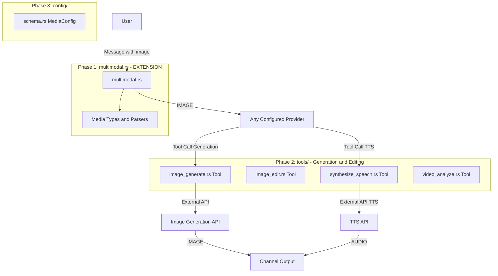

# Plan: Universal Multimedia for ZeroClaw (Corrected & Architecture-Compliant Version)

Date: 2026-03-05
Status: Pending validation
Version: 3.0 (ZeroClaw Architecture - SRP/KISS Compliant)

## Module Diagram (Multimedia via Tools)



## Summary

Adding OUTPUT multimedia capabilities to ZeroClaw, **strictly encapsulated in autonomous Tools**, without polluting the central orchestrator or existing Provider interfaces. Multimodal INPUT (Vision) already exists.

### What ALREADY EXISTS:

1. **`[multimodal]` Config** (in config-reference.md)
   - Support for `[IMAGE:<source>]` in user messages
   - Vision is natively handled by the `Provider` trait via `supports_vision()`.

2. **Robot-Kit** (`crates/robot-kit/`) - Hardware/Embedded
   - Local Ollama Vision (LLaVA, Moondream)
   - Local Whisper Transcription
   - Local Piper TTS

3. **Server Transcription** (`src/channels/transcription.rs`)
   - Channels (like Telegram) intercept voice messages, send them to the Groq API (Whisper), and pass the transcribed text to the agent as `[Voice] <text>`. **The agent doesn't need a Tool to transcribe, it natively understands voice.**

### What OUR PLAN adds (AI OUTPUT multimodal):

- **Image Generation (AI)**: YES (New Tool)
- **Image Editing (AI)**: YES (New Tool)
- **Image Analysis (Vision)**: NO (Already natively handled via `[IMAGE:]` markers and vision Providers)
- **Audio/Video Transcription**: NO (Already natively handled by Channels `channels/transcription.rs`)
- **Speech Synthesis (TTS)**: YES (New Tool)
- **Video Analysis**: YES (New Experimental Tool)

**Important Note (`AGENTS.md` Compliance)**:
*   Following the SRP (Single Responsibility Principle) and KISS, we will NOT modify `src/providers/traits.rs` to make it a "Generation God". Text models remain text models.
*   Following the "Secure by Default" principle, we will NOT add direct `/v1/media/` routes in the Gateway. The agent remains the sole orchestrator of these actions via Tool calls.

## Requirements

- External models supported for generation (DALL-E 3, Imagen 3, etc.).
- Tools generate files locally in a temporary workspace and return the file path (e.g., `[IMAGE:/path/to/img.png]`) to the agent.
- The Channel (Telegram, Discord, etc.) interprets outgoing `[IMAGE:]`, `[AUDIO:]` markers and attaches the physical files.

## ZeroClaw Architecture - Existing Files to Extend

```
src/
├── multimodal.rs          # ← EXTEND (recognize [AUDIO:] and [VIDEO:] in output)
├── tools/                 # ← Core of implementation
│   ├── image_generate.rs  # ← NEW
│   ├── synthesize_speech.rs # ← NEW
│   ├── video_analyze.rs   # ← NEW
│   └── mod.rs             # ← TOOL REGISTRATION
└── config/
    └── schema.rs          # ← EXTEND (API keys for DALL-E/Imagen, size limits)
```

## Configuration (to add in config.toml via `schema.rs`)

```toml
[multimodal.generation]
enabled = true
default_image_provider = "gemini" # or "openai"
default_image_model = "gemini-3.1-flash-image-preview"  # or "dall-e-3"
default_tts_provider = "gemini"   # or "openai"
default_tts_model = "gemini-2.5-flash-preview-tts"       # or "tts-1"
default_voice = "alloy"
```

## Phase 1: Generation Tools (src/tools/)

### 1.1 File: `src/tools/image_generate.rs` (NEW)

This Tool will autonomously call the DALL-E or Imagen API, without going through ZeroClaw's text Provider orchestration.

```rust
/// Tool: generate_image
/// Parameters:
///   - prompt: String (required)
///   - provider: Option<String> (override provider, e.g., "openai", "gemini")
///   - size: Option<String> (e.g., "1024x1024")
pub struct ImageGenerateTool {
    config: Arc<Config>,
    security: Arc<SecurityPolicy>,
}

// Execution makes the HTTP request to the image generation API,
// downloads the image to the secure workspace, and returns:
// "Image generated successfully: [IMAGE:/workspace/tmp/img_123.png]"
```

### 1.2 File: `src/tools/synthesize_speech.rs` (NEW)

```rust
/// Tool: synthesize_speech (TTS)
/// Parameters:
///   - text: String (required)
///   - voice: Option<String>
pub struct SynthesizeSpeechTool {
    config: Arc<Config>,
    security: Arc<SecurityPolicy>,
}

// Execution generates audio via OpenAI TTS or Gemini TTS,
// saves it, and returns:
// "Audio generated successfully: [AUDIO:/workspace/tmp/speech_123.mp3]"
```

### 1.3 File: `src/tools/video_analyze.rs` (NEW)

*Note: This tool is experimental. Gemini 1.5 Pro supports video analysis, but this often requires prior upload via Google's "File API".*

```rust
/// Tool: analyze_video
/// Parameters:
///   - file_path: String (required, must be in workspace)
///   - prompt: String (required, question about the video)
pub struct VideoAnalyzeTool {
    config: Arc<Config>,
    security: Arc<SecurityPolicy>,
}
```

## Phase 2: Extend multimodal.rs

It's not necessary to modify input parsing in `multimodal.rs` if we only handle output. However, we need to ensure that Channels (e.g., `src/channels/telegram.rs`) know how to parse `[AUDIO:/local/path.mp3]` markers generated by Tools in agent responses.

*Currently, Telegram already parses `[Document:...]` and `[IMAGE:...]`. We just need to add detection of `[AUDIO:...]` to send voice/audio, and `[VIDEO:...]` for video.*

## Implementation Roadmap (Checklist)

To ensure a safe and context-aware implementation, the plan is broken down into specific tasks:

### Phase 1: Configuration (Config & Schema)
- [ ] **Task 1.1**: Extend `MultimodalConfig` in `src/config/schema.rs` to add the `generation` sub-section (`enabled`, `default_image_provider`, `default_image_model`, `default_tts_provider`, `default_tts_model`, `default_voice`).
- [ ] **Task 1.2**: Update `src/config/mod.rs` if necessary to export new structs and add basic unit tests to ensure default config loads correctly.

### Phase 2: Image Generation Tool
- [ ] **Task 2.1**: Create the file `src/tools/image_generate.rs`.
- [ ] **Task 2.2**: Implement the `ImageGenerateTool` struct adhering to the `Tool` trait.
- [ ] **Task 2.3**: Implement internal HTTP logic (using `reqwest`) to call OpenAI (DALL-E) or Gemini based on config.
- [ ] **Task 2.4**: Save the downloaded image to the secure temporary workspace and return the `[IMAGE:/path/to/image.png]` tag.
- [ ] **Task 2.5**: Register the tool in `src/tools/mod.rs` (and where tools are instantiated, e.g., `src/agent/mod.rs` or `crates/zeroclaw-core`).

### Phase 3: Speech Synthesis Tool (TTS)
- [ ] **Task 3.1**: Create the file `src/tools/synthesize_speech.rs`.
- [ ] **Task 3.2**: Implement the `SynthesizeSpeechTool` struct adhering to the `Tool` trait.
- [ ] **Task 3.3**: Implement internal HTTP logic to call OpenAI TTS or Gemini TTS.
- [ ] **Task 3.4**: Save the audio to the workspace and return the `[AUDIO:/path/to/audio.mp3]` tag.
- [ ] **Task 3.5**: Register the tool in `src/tools/mod.rs`.

### Phase 4: Video Analysis Tool (Experimental)
- [ ] **Task 4.1**: Create `src/tools/video_analyze.rs` (logic for Google File API upload + prompt).

## Risks and Mitigations (Security & Costs)

| Risk | Mitigation (ZeroClaw Compliant) |
|--------|------------|
| Image generation cost explosion | Limit Tool access via security policies (AutonomyLevel). Add audit logging. |
| File generation outside workspace (Path Traversal) | Tool must use the same security checks (`security.is_path_allowed`) as `FileWriteTool` to save the generated image. |
| Exposure of unsecured direct API routes | Resolved: No `/v1/media/` routes are created. Agent remains the sole entry point, subject to human approval if configured. |
