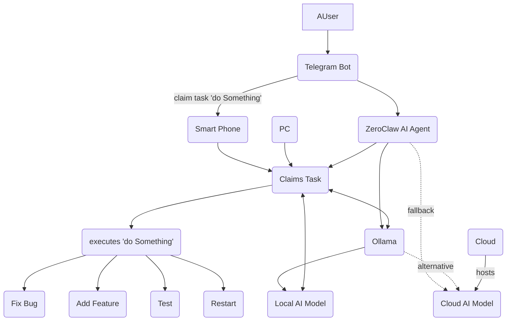

## ZeroClaw + Cline Integration Plan

### 1. Goal

Enable ZeroClaw to trigger Cline (AI coding assistant) for:
- Modifying ZeroClaw codebase
- Testing changes
- Restarting ZeroClaw service
- Or whatever you need to ask to cline through an instruction string and a path to a folder to let cline act on this folder.

### 2. Components

- `USER`: Initiates task via Telegram Bot
- `TELEGRAM BOT`: Interface for receiving requests
- `SMART PHONE / PC`: Devices to define/claim tasks
- `ZEROCLAW AI AGENT`: Core system handling task orchestration
- `OLLAMA`: Local AI model runtime (can also use: cloud AI model)
- `LOCAL AI MODEL`: AI model(s) running locally via Ollama
- `CLOUD AI MODEL`: Cloud-based AI models
- `CLAIMS TASK`: Mechanism where ZeroClaw takes ownership of a task
- `EXECUTES 'DO SOMETHING'`: Task execution step

### 3. Task Actions

- **Fix Bug**: Analyze issue → generate fix → apply to codebase
- **Add Feature**: Understand requirement → implement feature → update tests
- **Test**: Run test suite → report results
- **Restart**: Stop service → rebuild → start service
- **path to folder**: a path parameter allows to let cline act on the specific folder specified in th path

### 4. Process Flow

1. **Task Initiation**
   - User sends request via Telegram Bot
   - Task gets defined through Smart Phone or PC
   - Task enters `Claims Task` queue

2. **Task Processing**
   - [ZeroClaw Agent claims task from queue]
   - Agent invokes Cline for code or configuration modifications using scripts/cline-task 'DO SOMETHING' [path to folder]
   - cline Agent shall be instructed in the folder with rules imposing to run tests to validate changes !

3. **Model Selection**
   - ZeroClaw uses Ollama + local model by default
   - Falls back to cloud AI model if needed

4. **Service Management**
   - After successful modifications + tests
   - cline Agent restarts [ZeroClaw] or whatever service

### 5. Mermaid Diagram

---
