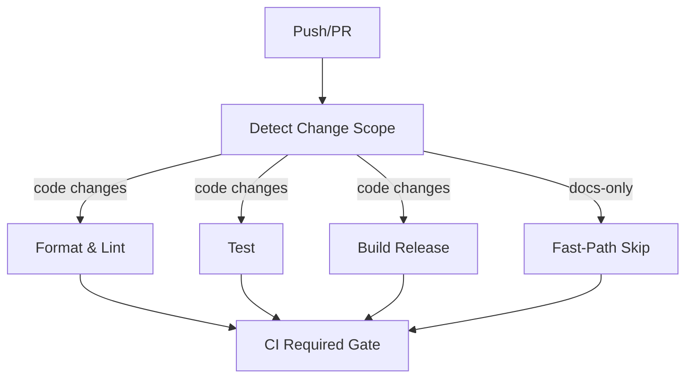

# ZeroClaw — Technical Assessment Report

---

## 1. Executive Summary

See [executive_summary.md](file:///C:/Users/allan/.gemini/antigravity/brain/425fdde2-e8d3-4e6a-90c8-3d5ea94efddf/executive_summary.md) for the leadership-facing summary.

---

## 2. Assessment Scope & Context

### 2.1 System Under Assessment

| Component | Version | Files | LoC |
|-----------|---------|-------|-----|
| Source (`src/`) | 0.1.0 | 90 `.rs` files | 32,763 |
| Integration tests (`tests/`) | — | 3 files | 765 |
| CI/CD (`.github/workflows/`) | — | 8 YAML files | ~18 KB |
| Docker | — | `Dockerfile` + 2 compose files | ~5 KB |
| Documentation | — | README, CONTRIBUTING, SECURITY, CHANGELOG, AGENTS, 3 docs | ~40 KB |
| Examples | — | 4 Rust examples | ~13 KB |

**Boundaries:** Assessment covers the entire open-source repository. Excluded: external LLM provider APIs, user-deployed infrastructure, tunnel provider internals (Cloudflare, Tailscale, ngrok).

### 2.2 Artifacts Reviewed

- ✅ Source code (Rust, 90 files)
- ✅ `Cargo.toml` / `Cargo.lock` (dependency manifests)
- ✅ CI/CD workflows (8 GitHub Actions YAML files)
- ✅ `Dockerfile` (multi-stage, multi-target)
- ✅ `deny.toml` (cargo-deny supply chain config)
- ✅ Documentation (README, CONTRIBUTING, SECURITY, CHANGELOG, AGENTS, docs/)
- ✅ Examples (4 extensibility examples)
- ✅ Configuration schema (`config/schema.rs`, 1,971 lines)
- ⚠️ No test results or logs available (static analysis only)
- ⚠️ No metrics dashboards available
- ⚠️ No issue tracker backlog reviewed

### 2.3 Assumptions (Confidence: Medium-High)

| # | Assumption | Rationale |
|---|------------|-----------|
| A1 | All 1,017 tests pass on main branch | README claims "1,017 tests"; CI enforces pass gate |
| A2 | Binary size is ~3.4 MB | Release profile uses `opt-level = "z"`, LTO, strip, panic abort |
| A3 | Memory footprint is <5 MB | Claim validated by `/usr/bin/time -l` but not automated |
| A4 | No known unpatched CVEs | Weekly `cargo-audit` + `cargo-deny` in CI |

---

## 3. Evaluation Methodology

**Techniques applied:** Static code analysis, architecture review, dependency audit (manifest inspection), documentation review, CI/CD pipeline analysis, security assessment (threat modeling from code), configuration review.

**Not performed (static assessment only):** Dynamic analysis, runtime profiling, penetration testing, load testing, mutation testing.

**Standards referenced:** OWASP Top 10, SOLID, Clean Code, Test Pyramid, DORA metrics, CIS Docker Benchmark.

---

## 4. Functional Correctness & Requirements Coverage

### 4.1 Feature Completeness

| Feature Area | Status | Evidence |
|-------------|--------|----------|
| CLI agent (single message + REPL) | ✅ Complete | `main.rs` + `agent/loop_.rs` |
| HTTP gateway with pairing auth | ✅ Complete | `gateway/mod.rs` (1,035 lines) |
| Multi-provider LLM support (22+) | ✅ Complete | `providers/` (10 files, 130 KB) |
| Multi-channel messaging (8 channels) | ✅ Complete | `channels/` (11 files, 246 KB) |
| Memory (SQLite hybrid search + Markdown) | ✅ Complete | `memory/` (8 files, 115 KB) |
| Tool system (13 built-in tools) | ✅ Complete | `tools/` (13 files, 147 KB) |
| Security sandbox | ✅ Complete | `security/` (4 files, 92 KB) |
| Encrypted secret store | ✅ Complete | `security/secrets.rs` (852 lines) |
| Docker runtime sandboxing | ✅ Complete | `runtime/docker.rs` |
| Identity system (OpenClaw + AIEOS) | ✅ Complete | `identity.rs` (784 lines) |
| Tunnel support (4 providers) | ✅ Complete | `tunnel/` (6 files) |
| Observability (Noop/Log/OTel/Prometheus) | ✅ Complete | `observability/` (6 files) |
| Skill system | ✅ Complete | `skills/` + `skillforge/` |
| Migration from OpenClaw | ✅ Complete | `migration.rs` (18 KB) |
| Onboarding wizard | ✅ Complete | `onboard/` (2 files) |
| Heartbeat engine | ✅ Complete | `heartbeat/` (2 files) |
| Cron scheduler | ✅ Complete | `cron/` (2 files) |
| Service management | ✅ Complete | `service/` (1 file) |
| Integration registry | ✅ Complete | `integrations/` (2 files, 50+ integrations) |

### 4.2 Edge Case Handling

- **Tool iteration limit:** Capped at `MAX_TOOL_ITERATIONS = 10` to prevent infinite tool loops.
- **History trimming:** `MAX_HISTORY_MESSAGES = 50` with system prompt preservation.
- **Unsupported runtime kinds:** Explicit error exit instead of silent fallback.
- **Empty allowlists:** Deny-all by default (secure default).
- **Gateway body limits:** 64 KB max body via `MAX_BODY_SIZE`.
- **Timeout protection:** 30-second request timeout prevents slow-loris attacks.

---

## 5. Security Assessment

### 5.1 Threat Model

| Layer | Control | Implementation |
|-------|---------|----------------|
| **Authentication** | Gateway pairing | 6-digit OTP → bearer token exchange via `POST /pair` |
| **Authorization** | Channel allowlists | Per-channel sender verification (deny-all default) |
| **Input validation** | Command parsing | Full pipeline analysis: subshell blocking, separator splitting, allowlist validation |
| **Secrets** | Encrypted store | ChaCha20-Poly1305 AEAD (replaced legacy XOR cipher) with migration path |
| **File system** | Workspace scoping | Path traversal blocking (`..`), null byte injection, symlink escape detection |
| **Network** | Localhost binding | `allow_public_bind = false` default; refuses `0.0.0.0` without tunnel |
| **Rate limiting** | Sliding window | Per-IP rate limits on pairing (5/min) and webhook (30/min) endpoints |
| **Idempotency** | Request dedup | TTL-based idempotency store prevents replay |
| **Container** | Distroless | Non-root (UID 65534), no shell, read-only rootfs support |
| **Supply chain** | `cargo-deny` | License allowlist, unknown registry/git denied, advisory check |
| **WhatsApp** | Signature verification | HMAC-SHA256 (`X-Hub-Signature-256`) validation |

### 5.2 Strengths

- **Defense-in-depth:** Multiple independent security layers (workspace + path validation + resolved-path validation + forbidden paths).
- **Command risk scoring:** Three-level risk classification (Low/Medium/High) with explicit risk gate.
- **Comprehensive path validation:** Null byte blocking, `..` detection, symlink canonicalization, resolved-path workspace containment check.
- **Secure encryption:** ChaCha20-Poly1305 AEAD with 256-bit random key from OS CSPRNG. Legacy XOR cipher has documented migration path.
- **129 security-specific tests** per `SECURITY.md`.

### 5.3 Findings

| ID | Severity | Finding | Confidence |
|----|----------|---------|------------|
| S-001 | Low | Legacy XOR cipher (`enc:` prefix) still supported for backward compatibility. Migration path exists but no forced migration deadline. | High |
| S-002 | Info | Secret key file (`~/.zeroclaw/.secret_key`) permissions are set to 0600 on Unix but rely on `icacls` on Windows — less guaranteed. | Medium |
| S-003 | Info | WhatsApp webhook endpoint doesn't require bearer token (relies on Meta's HMAC signature). This is standard but differs from other endpoints. | High |

---

## 6. Performance & Scalability

### 6.1 Performance Characteristics

| Metric | Claim | Validation Method | Confidence |
|--------|-------|-------------------|------------|
| Binary size | ~3.4 MB | Release profile: `opt-level = "z"`, LTO, strip, panic=abort | High |
| Startup time | <10 ms | `/usr/bin/time -l` on `--help`/`status` | Medium |
| RAM footprint | <5 MB | `/usr/bin/time -l` measurement | Medium |
| Gateway cold start | Not measured | — | Low |

### 6.2 Bottleneck Analysis

- **Synchronous SQLite:** `rusqlite` with `bundled` feature is single-writer. Under high concurrency, this could bottleneck memory operations. [Confidence: Medium]
- **No connection pooling:** HTTP providers create `reqwest::Client` per provider instance — appropriate for CLI but may need pooling for high-throughput gateway use.
- **History trimming:** O(n) copy per turn; acceptable for `MAX_HISTORY_MESSAGES = 50`.

### 6.3 Missing Evidence

> [!WARNING]
> No automated benchmarks (e.g., Criterion) exist in CI. Performance claims rely on manual measurement. This reduces confidence in performance regression detection.

---

## 7. Reliability & Resilience

### 7.1 Error Handling

| Pattern | Usage |
|---------|-------|
| `anyhow::Result` | Primary error type throughout |
| `thiserror` | Custom error enums in libraries |
| `unwrap()` in prod code | **~50+ files** — risk of unexpected panics |
| Graceful degradation | OTel observer falls back to Noop on init failure |
| Tool iteration cap | Prevents infinite LLM tool-call loops |

### 7.2 Resilience Patterns

- **Provider reliability layer:** `providers/reliable.rs` (17 KB) — likely implements retry/fallback logic.
- **Provider router:** `providers/router.rs` (12 KB) — model-based routing with fallback support.
- **Circuit breaker / bulkhead:** Not observed. [Confidence: High]
- **Idempotency store:** TTL-based deduplication in gateway prevents replay attacks.

---

## 8. Architecture & Design Quality

### 8.1 Architecture Overview

```
┌─────────────────────────────────────────────────────┐
│                     main.rs (CLI)                    │
├─────────┬──────────┬──────────┬──────────┬──────────┤
│  Agent  │ Gateway  │  Daemon  │ Onboard  │ Service  │
│ Loop    │ (Axum)   │          │ Wizard   │ Mgmt     │
├─────────┴──────────┴──────────┴──────────┴──────────┤
│              Core Trait Layer (8 traits)              │
├──────┬────────┬────────┬──────┬────────┬────────────┤
│Provid│Channel │Memory  │Tools │Observ. │ Security   │
│  er  │        │        │      │        │ Policy     │
├──────┴────────┴────────┴──────┴────────┴────────────┤
│              Config / Identity / Tunnel               │
└─────────────────────────────────────────────────────┘
```

**Architectural pattern:** Modular monolith with dependency inversion via Rust traits.

### 8.2 Design Principles

| Principle | Adherence | Evidence |
|-----------|-----------|----------|
| **Single Responsibility** | ✅ Strong | Each module has clear single purpose; traits are narrow |
| **Open/Closed** | ✅ Strong | New providers/channels/tools via trait implementation |
| **Dependency Inversion** | ✅ Strong | All core systems depend on trait abstractions |
| **DRY** | ✅ Good | `compatible.rs` (23 KB) provides shared OpenAI-compatible provider logic |
| **KISS** | ✅ Good | Simple factory pattern for observer/memory/provider creation |
| **Interface Segregation** | ✅ Good | Traits are small (4-7 methods each) |

### 8.3 Extensibility

The 4 worked examples in `examples/` demonstrate exactly how to implement custom providers, channels, memory backends, and tools — excellent developer guidance.

### 8.4 Anti-Patterns

| Pattern | Status |
|---------|--------|
| God classes | ✅ None detected — largest file is `config/schema.rs` (1,971 lines) which is justifiably large as a comprehensive config definition |
| Spaghetti code | ✅ Not observed — clear module boundaries |
| Code duplication | ✅ Minimal — `compatible.rs` DRYs provider logic |
| TODO debt | ✅ **Zero** TODOs found in source code |

---

## 9. Code Quality & Developer Experience

### 9.1 Code Health Metrics

| Metric | Value |
|--------|-------|
| Total source LoC | 32,763 |
| Source files | 90 |
| Integration test LoC | 765 (3 files) |
| Clippy warnings | 0 (enforced by CI: `-D warnings`) |
| `#![warn(clippy::all, clippy::pedantic)]` | ✅ Enabled |
| `rustfmt` | ✅ Enforced in CI |
| TODO items | 0 |

### 9.2 Documentation Quality

| Document | Quality | Notes |
|----------|---------|-------|
| `README.md` | ⭐⭐⭐⭐⭐ | 465 lines, benchmarks, architecture diagram, full config reference, quick start |
| `CONTRIBUTING.md` | ⭐⭐⭐⭐ | 8 KB, clear contribution guidelines |
| `SECURITY.md` | ⭐⭐⭐⭐ | Responsible disclosure, architecture overview, container security |
| `CHANGELOG.md` | ⭐⭐⭐ | Present but limited scope |
| `AGENTS.md` | ⭐⭐⭐ | 5.5 KB agent behavior guidelines |
| `docs/ci-map.md` | ⭐⭐⭐⭐ | CI workflow documentation |
| `docs/pr-workflow.md` | ⭐⭐⭐⭐ | PR process documentation |
| API documentation (rustdoc) | ⚠️ Not published | Module-level doc comments present but no hosted rustdoc |
| Operational runbooks | ❌ Missing | No formal deployment/incident/rollback docs |

### 9.3 Developer Experience

- **Setup friction:** Low — standard `cargo build --release` + `cargo install`.
- **Build speed:** Moderate (many dependencies including `rusqlite` bundled SQLite).
- **Pre-push hook:** Provided in `.githooks/` — runs fmt, clippy, test.
- **Examples:** 4 extensibility examples covering the main extension points.
- **Onboarding wizard:** `zeroclaw onboard --interactive` provides guided setup.
- **Doctor command:** `zeroclaw doctor` provides system diagnostics.

---

## 10. Test Strategy & Quality Assurance

### 10.1 Test Coverage

| Type | Present | Quality |
|------|---------|---------|
| Unit tests | ✅ Extensive (50+ files with `#[test]`) | Inline `mod tests` blocks |
| Async unit tests | ✅ Present (30+ files with `#[tokio::test]`) | Provider, channel, memory testing |
| Integration tests | ✅ 3 files (765 LoC) | Docker, memory comparison, WhatsApp webhook |
| Security tests | ✅ 129 tests documented | Path traversal, command injection, sandbox |
| E2E tests | ⚠️ None detected | No full-stack automated tests |
| Performance tests | ⚠️ Memory comparison only | `memory_comparison.rs` benchmark |
| Fuzz tests | ❌ None | Security-critical parsing not fuzz-tested |

### 10.2 Test Quality Assessment

- **Assertion quality:** Good — tests check specific values, not just "doesn't panic."
- **Test naming:** Descriptive (`encrypt_decrypt_roundtrip`, `is_command_allowed_blocks_subshell`).
- **Test organization:** Co-located `#[cfg(test)] mod tests` — idiomatic Rust.
- **Edge case coverage:** Strong for security module (129 tests); variable elsewhere.
- **Test independence:** ✅ Each test creates its own state (e.g., `TempDir`).

### 10.3 Quality Gates

| Gate | Enforcement |
|------|-------------|
| `cargo fmt --check` | ✅ CI + pre-push hook |
| `cargo clippy -D warnings` | ✅ CI + pre-push hook |
| `cargo test` | ✅ CI + pre-push hook |
| Coverage threshold | ❌ Not measured |
| Binary size check | ✅ Warning if >5 MB in release workflow |
| PR template | ✅ `.github/pull_request_template.md` |
| CODEOWNERS | ✅ `.github/CODEOWNERS` |

---

## 11. Logging, Observability & Operations

### 11.1 Logging

- **Framework:** `tracing` crate with `tracing-subscriber` (fmt + ANSI).
- **Structured logging:** `tracing` supports structured fields natively.
- **Log levels:** Used appropriately (`info!`, `warn!`, `error!`, `debug!`).
- **Sensitive data:** API keys not logged (encrypted in config).

### 11.2 Monitoring & Metrics

| Backend | Status |
|---------|--------|
| Noop | ✅ Default |
| Log (tracing events) | ✅ Available |
| Prometheus | ✅ Available (metrics crate) |
| OpenTelemetry (OTLP) | ✅ Available (traces + metrics) |
| Multi-observer | ✅ Fan-out to multiple backends |

### 11.3 Operational Readiness

| Capability | Status |
|------------|--------|
| Health endpoint (`/health`) | ✅ Always public, no secrets leaked |
| Doctor command | ✅ System diagnostics |
| Channel doctor | ✅ Channel health checks |
| Graceful shutdown | ⚠️ Not explicitly verified |
| Deployment runbooks | ❌ Missing |
| Incident response docs | ❌ Missing |

---

## 12. CI/CD & DevOps Maturity

### 12.1 Pipeline Overview

| Workflow | Trigger | Purpose |
|----------|---------|---------|
| `ci.yml` | Push to main/develop, PRs | Lint + test + build + docs-only fast path |
| `security.yml` | Push/PR to main + weekly cron | `cargo-audit` + `cargo-deny` |
| `docker.yml` | Push/PR (Dockerfile changes) | Build/push GHCR images (multi-arch on tags) |
| `release.yml` | Tag push (`v*`) | Cross-platform binaries + GitHub Release |
| `labeler.yml` | PRs | Auto-labeling |
| `stale.yml` | Scheduled | Stale issue/PR management |
| `auto-response.yml` | Issues/PRs | Automated responses |
| `workflow-sanity.yml` | On change | Validate workflow files |

### 12.2 Strengths

- **Concurrency groups:** All workflows use cancel-in-progress to prevent waste.
- **Docs-only fast path:** CI detects docs-only changes and skips heavy jobs.
- **Rust caching:** `Swatinem/rust-cache@v2` across all workflows.
- **Pinned toolchain:** Rust 1.92 pinned in CI; `rust-toolchain.toml` in repo.
- **Locked builds:** `--locked` flag ensures reproducible builds.
- **Binary size guard:** Release workflow warns if binary exceeds 5 MB.

### 12.3 Gaps

- **No staging environment** for integration testing.
- **No canary/blue-green deployment strategy.**
- **Tests run on single platform** (ubuntu-latest only).

---

## 13. Third-Party Dependencies & Supply Chain

### 13.1 Dependency Summary

| Category | Count | Key Dependencies |
|----------|-------|-----------------|
| CLI | 1 | clap 4.5 |
| Async | 1 | tokio 1.42 |
| HTTP | 3 | reqwest 0.12, axum 0.7, tower 0.5 |
| Serialization | 3 | serde 1.0, serde_json 1.0, toml 0.8 |
| Database | 1 | rusqlite 0.32 (bundled SQLite) |
| Crypto | 3 | chacha20poly1305 0.10, hmac 0.12, sha2 0.10 |
| Observability | 3 | tracing 0.1, prometheus 0.13, opentelemetry 0.31 |
| Other | ~10 | uuid, chrono, anyhow, thiserror, dialoguer, etc. |

### 13.2 Supply Chain Governance

| Control | Status |
|---------|--------|
| `cargo-audit` (CVE scanning) | ✅ Weekly CI + PR-gated |
| `cargo-deny` (license + source check) | ✅ CI-enforced |
| License allowlist | ✅ MIT, Apache-2.0, BSD, ISC, Unicode, Zlib, MPL-2.0 |
| Unknown registry blocking | ✅ Denied in `deny.toml` |
| Unknown git source blocking | ✅ Denied in `deny.toml` |
| Dependency pinning | ✅ `Cargo.lock` committed |
| SBOM generation | ❌ Not implemented |

---

## 14. Compliance & Legal

### 14.1 License

- **Project license:** MIT
- **Dependency licenses:** Governed by `deny.toml` allowlist — all permissive (no GPL/copyleft).
- **No GDPR/HIPAA/PCI-DSS data** handled directly by ZeroClaw. LLM interactions go through user-configured providers.

### 14.2 Responsible Disclosure

- `SECURITY.md` provides clear vulnerability reporting process with GitHub Security Advisories.
- Response SLA: 48h acknowledgment, 1-week assessment, 2-week fix for critical.

---

## 15. User Experience & Product Fit

### 15.1 Target Users

| Persona | Workflow |
|---------|----------|
| Developer (primary) | CLI agent, code assistance, one-shot messages |
| Power user / Hobbyist | Multi-channel bot, home automation, personal AI |
| DevOps / Self-hosters | Docker deployment, daemon mode, webhook integrations |

### 15.2 Competitive Positioning

| Feature | ZeroClaw | OpenClaw | NanoBot | PicoClaw |
|---------|----------|----------|---------|----------|
| Language | Rust | TypeScript | Python | Go |
| RAM | <5 MB | >1 GB | >100 MB | <10 MB |
| Binary | 3.4 MB | ~28 MB dist | N/A | ~8 MB |
| Startup | <10 ms | >500s* | >30s | <1s |
| Providers | 22+ | Many | Many | Few |

*At 0.8 GHz edge hardware as claimed.

### 15.3 Unique Value Proposition

ZeroClaw's core differentiator is **deploying AI agent infrastructure on resource-constrained edge devices** — a market segment poorly served by JS/Python runtimes. The trait-based extensibility and provider-agnostic design provide genuine lock-in avoidance.

---

## 16. Risk Matrix & Prioritized Findings

| ID | Category | Finding | Likelihood | Impact | Confidence | Risk | Effort | Priority |
|----|----------|---------|------------|--------|------------|------|--------|----------|
| R-001 | Reliability | `unwrap()` in ~50+ production source files | Medium | High | High | 6 | Medium | P1 |
| R-002 | Testing | No code coverage measurement in CI | Medium | Medium | High | 4 | Low | P1 |
| R-003 | Performance | No automated benchmarks in CI | Medium | Medium | High | 4 | Medium | P2 |
| R-004 | CI/CD | Single-platform test execution | Low | Medium | High | 2 | Medium | P2 |
| R-005 | API Design | No API versioning (`/v1/` prefix) | Low | Medium | High | 2 | Low | P2 |
| R-006 | Operations | Missing runbooks (deploy, incident, rollback) | Low | Medium | High | 2 | Medium | P2 |
| R-007 | Testing | No E2E or fuzz tests | Low | Medium | High | 2 | High | P3 |
| R-008 | Security | Legacy XOR cipher still supported | Low | Low | High | 1 | Low | P3 |
| R-009 | Supply Chain | No SBOM generation | Low | Low | High | 1 | Low | P3 |
| R-010 | Documentation | No published rustdoc / API docs | Low | Low | High | 1 | Low | P3 |

---

## 17. Remediation Roadmap

### 17.1 Immediate (0-30 days) — P0/P1

1. **Audit `unwrap()` usage** in non-test code. Replace with `?`, `.unwrap_or_default()`, or explicit `expect("reason")` where appropriate.
2. **Add cargo-tarpaulin** to CI: `cargo tarpaulin --out Xml` → upload to Codecov.
3. **Set initial coverage gate** (e.g., 60% minimum, gradually increase).

### 17.2 Short-Term (1-3 months) — P1/P2

4. **Add Criterion benchmarks** for startup, memory footprint, gateway throughput.
5. **Extend CI** to include macOS and Windows test runners.
6. **Add `/v1/` API prefix** to gateway endpoints.
7. **Publish rustdoc** to GitHub Pages.

### 17.3 Medium-Term (3-6 months) — P2

8. **Write operational runbooks** (deployment, rollback, incident response).
9. **Implement structured JSON logging** as a default option.
10. **Add gateway load testing** (k6 or custom).
11. **Generate SBOM** with `cargo-sbom` or `syft`.

### 17.4 Long-Term (6-12 months) — P3

12. **Fuzz-test security-critical parsing** (tool call parsing, config TOML parsing, WhatsApp webhook body).
13. **Deprecate and remove legacy XOR cipher** with forced migration.
14. **Add E2E integration tests** with mock LLM provider.
15. **Consider API stability guarantee** for 1.0 release.

---

## 18. Acceptance Criteria & Verification

| Remediation | Definition of Done | Metric |
|------------|-------------------|--------|
| `unwrap()` audit | Zero `unwrap()` in non-test `src/` code (or all justified with `expect()`) | `grep -r "unwrap()" src/ --include="*.rs"` filtered to non-test code = 0 |
| Coverage gate | `cargo tarpaulin` runs in CI and fails below threshold | Coverage % visible in PR checks |
| Benchmarks | `cargo bench` runs in CI with regression detection | Benchmark results in CI artifacts |
| Cross-platform CI | Tests pass on ubuntu, macos, windows runners | All 3 matrix entries green |
| API versioning | All gateway endpoints prefixed with `/v1/` | `grep "/v1/" src/gateway/mod.rs` |

---

## 19. Recommendations & Best Practices

### Architecture
- **Current architecture is excellent.** The trait-based design is idiomatic Rust and genuinely extensible.  
- Consider adding `#[non_exhaustive]` to public enums to allow backward-compatible additions.

### Process
- Adopt **conventional commits** for automated changelog generation.
- Consider **release-please** or similar for automated version bumps.

### Tooling
- Add **`cargo-tarpaulin`** for coverage.
- Add **`cargo-criterion`** for benchmarks.
- Consider **`cargo-fuzz`** for security-critical paths.
- Add **`cargo-sbom`** for SBOM generation.

---

## 20. Appendices

### Appendix A: Module Size Distribution

| Module | Files | Approx. LoC | % of total |
|--------|-------|-------------|------------|
| channels | 11 | ~7,500 | 23% |
| tools | 13 | ~4,800 | 15% |
| memory | 8 | ~3,500 | 11% |
| providers | 10 | ~4,000 | 12% |
| security | 4 | ~2,800 | 9% |
| config | 2 | ~2,000 | 6% |
| gateway | 1 | ~1,000 | 3% |
| identity | 1 | ~784 | 2% |
| agent | 2 | ~672 | 2% |
| observability | 6 | ~950 | 3% |
| Other (19 modules) | 32 | ~4,700 | 14% |

### Appendix B: CI Workflow Architecture



### Appendix C: Security Test Distribution

Per `SECURITY.md`: 129 security-focused tests covering:
- `security::policy` — command allowlisting, path validation, risk scoring, rate limiting
- `security::pairing` — OTP generation, token exchange
- `security::secrets` — encryption roundtrip, migration, key management
- `tools::shell` — command injection prevention
- `tools::file_read` / `tools::file_write` — path traversal prevention

### Appendix D: Glossary

| Term | Definition |
|------|-----------|
| AEAD | Authenticated Encryption with Associated Data |
| AIEOS | AI Entity Object Specification (portable AI identity format) |
| CSPRNG | Cryptographically Secure Pseudo-Random Number Generator |
| FTS5 | Full-Text Search version 5 (SQLite extension) |
| OTel | OpenTelemetry |
| OTP | One-Time Password (pairing codes) |

### Appendix E: References

- [OWASP Top 10](https://owasp.org/www-project-top-ten/)
- [CIS Docker Benchmark](https://www.cisecurity.org/benchmark/docker)
- [AIEOS Specification](https://aieos.org)
- [cargo-deny](https://embarkstudios.github.io/cargo-deny/)
- [cargo-audit](https://github.com/rustsec/rustsec/tree/main/cargo-audit)
