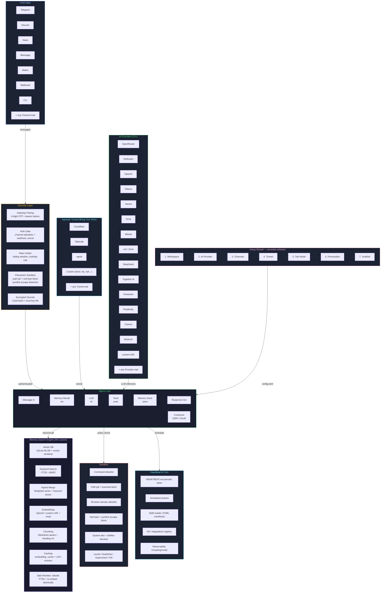

# ZeroClaw 项目总览

> ZeroClaw 是一个 Rust 编写的自主 AI Agent 运行时，核心定位：高性能、低资源消耗、安全优先。

## 一句话概括

一个可以接入 23+ LLM 提供商、13 个聊天平台、30 种工具，甚至能控制硬件的全栈 AI Agent 框架。

---

## 1. 系统架构图

> 来源：`docs/architecture.svg`，用 Mermaid 重新绘制。



**数据流概要：**

```
用户消息 → Chat Apps → Security Layer(认证/限流/沙箱) → Agent Loop
                                                          ↓
                                    ┌─ Memory Recall (混合检索上下文)
                                    ├─ LLM 推理 (22+ Provider)
                                    ├─ Tool 执行 (30 个工具)
                                    ├─ Memory Save (存储新知识)
                                    └─ Response Out → Chat Apps → 用户
```

---

## 2. 核心架构

基于 **trait + factory 模式**，有 8 个可插拔的扩展点：

| 子系统 | 职责 | 示例 |
|--------|------|------|
| **Provider** | LLM 模型接入 | OpenAI、Anthropic、Ollama、Gemini 等 23+ |
| **Channel** | 消息通道 | Telegram、Discord、Slack、QQ、钉钉、飞书、iMessage 等 13 个 |
| **Tool** | Agent 可调用的工具 | Shell 执行、文件读写、浏览器自动化、Git、定时任务等 30 个 |
| **Memory** | 记忆持久化 | SQLite（FTS5 全文搜索 + 向量检索）、Markdown、Lucid |
| **Observer** | 可观测性 | Prometheus、OpenTelemetry、日志 |
| **Runtime** | 运行时适配 | Native / Docker 容器 |
| **Peripheral** | 硬件外设 | STM32、ESP32、Arduino、树莓派 GPIO |
| **Security** | 安全策略 | 配对认证、沙箱隔离、密钥加密、权限控制 |

每个子系统的扩展方式统一：实现对应 trait -> 在 factory 模块中注册。

---

## 3. 目录结构

```
src/
├── main.rs              # CLI 入口，命令路由
├── lib.rs               # 模块导出和共享枚举
├── agent/               # Agent 编排循环（核心调度）
├── providers/           # LLM 提供商实现
├── channels/            # 聊天平台集成
├── tools/               # 工具/能力实现
├── memory/              # 记忆持久化后端
├── security/            # 安全策略、配对、密钥、沙箱
├── observability/       # 指标与链路追踪
├── runtime/             # 运行时适配器
├── peripherals/         # 硬件外设（STM32、树莓派 GPIO）
├── gateway/             # Webhook/HTTP 网关服务
├── config/              # 配置 schema 和加载
├── cron/                # 定时任务
├── heartbeat/           # 心跳后台任务
├── daemon.rs            # 守护进程模式
├── onboard/             # 交互式初始化向导
└── identity.rs          # 身份系统

firmware/                # 硬件固件
├── zeroclaw-esp32/      # ESP32 固件
└── zeroclaw-nucleo/     # STM32 Nucleo 固件

docs/                    # 架构与运维文档
.github/workflows/       # CI/CD 自动化
```

---

## 4. Provider 子系统（23+）

### 直接实现

- **OpenRouter** — 聚合路由，可访问多家模型
- **Anthropic** — Claude 系列
- **OpenAI** — GPT 系列
- **Ollama** — 本地模型推理
- **Google Gemini** — Gemini 系列
- **GitHub Copilot** — Copilot API

### 通过 OpenAI 兼容层接入

Venice、Groq、Mistral、xAI (Grok)、DeepSeek、Together、Fireworks、Perplexity、Cohere、Moonshot/Kimi、智谱 GLM、Minimax、通义千问、Z.AI 等。

### 弹性机制

- `router.rs` — 提供商选择与自动 fallback
- `reliable.rs` — 指数退避重试 + 熔断器
- 自动凭证解析（环境变量）
- 错误信息中自动脱敏（`sk-`、`xoxb-` 等）

---

## 5. Channel 子系统（13 个平台）

| 平台 | 协议 |
|------|------|
| CLI | stdin/stdout 交互 |
| Telegram | WebSocket + HTTP 轮询 |
| Discord | WebSocket Gateway |
| Slack | Webhook + API |
| WhatsApp | Meta Cloud API |
| iMessage | macOS 原生集成 |
| Email | SMTP/IMAP |
| Matrix | Matrix 协议 |
| Signal | Signal 协议 |
| IRC | IRC 协议 |
| 飞书 (Lark) | Webhook |
| 钉钉 (DingTalk) | Webhook |
| QQ | Webhook |

共同特性：
- 白名单访问控制（默认拒绝所有）
- 健康检查 + 指数退避自动重连
- 信号量限流的并发消息处理

---

## 6. Tool 子系统（30 个工具）

### 执行与系统
- `shell` — 执行 Shell 命令（工作目录隔离）
- `delegate` — 委托 composio.dev（1000+ OAuth 应用）

### 文件操作
- `file_read` — 读文件（检测符号链接逃逸）
- `file_write` — 写文件（阻止 null 字节注入）
- `http_request` — HTTP 请求

### 记忆操作
- `memory_store` — 存储事实/偏好
- `memory_recall` — 混合检索（关键词 + 向量）
- `memory_forget` — 删除记忆

### 浏览器自动化
- `browser` — WebDriver 驱动的浏览器操作
- `browser_open` — 快速导航
- `screenshot` — 截图
- `image_info` — 图像分析（视觉 API）

### 开发工具
- `git_operations` — Git 操作
- `cron_*` — 定时任务管理

### 硬件工具
- `hardware_board_info` — 查询板卡能力
- `hardware_memory_map` — 查看芯片内存布局
- `hardware_memory_read` — 通过 probe-rs 读取设备内存

---

## 7. Memory 子系统

### 后端

| 后端 | 特点 |
|------|------|
| **SQLite** | 主力后端，FTS5 全文搜索 + 向量余弦相似度 |
| **Lucid** | 外部记忆服务桥接 |
| **Markdown** | 纯文本文件（兼容 OpenClaw） |
| **None** | 无状态模式 |

### 混合检索

- **BM25 关键词搜索**（通过 SQLite FTS5）
- **向量余弦相似度**（嵌入由 Provider 生成）
- 权重可配置：`vector_weight` / `keyword_weight`
- LRU 嵌入缓存，减少 API 调用

### 数据分类

Core（核心）、Daily（日常）、Conversation（对话）、Custom（自定义）

---

## 8. 安全架构

### 五层防御

1. **配对认证** — 启动时 6 位一次性码交换，生成 Bearer Token
2. **策略引擎** — 工作目录隔离、命令白名单、速率限制（每小时操作数、每日成本上限）
3. **密钥管理** — ChaCha20-Poly1305 加密存储、环境变量集成、日志自动脱敏
4. **沙箱隔离** — Landlock（Linux）、Docker 容器、Firejail / Bubblewrap
5. **网关安全** — 默认仅绑定 localhost，公网需通过隧道（Tailscale/Cloudflare/ngrok）

### 安全默认值

- 空白名单 = 拒绝所有
- 拒绝绑定 `0.0.0.0`（除非配置隧道）
- 符号链接逃逸检测
- null 字节注入阻断
- 14 个系统目录 + 4 个敏感 dotfile 默认禁止访问

---

## 9. 运行模式

```bash
zeroclaw onboard          # 初始化向导
zeroclaw agent            # 交互式对话
zeroclaw agent -m "..."   # 单条消息模式
zeroclaw gateway          # 启动 Webhook 网关
zeroclaw daemon           # 守护进程（网关 + 频道 + 心跳）
zeroclaw service install  # 注册为系统服务
zeroclaw doctor           # 系统诊断
zeroclaw channel list     # 频道管理
zeroclaw cron list        # 定时任务管理
zeroclaw hardware discover # 硬件发现
```

---

## 10. 配置系统

配置文件：`~/.zeroclaw/config.toml`

关键配置段：

```toml
api_key = "..."
default_provider = "openai"
default_model = "gpt-4"

[memory]
backend = "sqlite"
embedding_provider = "openai"
vector_weight = 0.5
keyword_weight = 0.5

[autonomy]
level = "supervised"        # readonly / supervised / full
workspace_only = true
allowed_commands = ["git", "cargo", "npm"]

[gateway]
require_pairing = true

[channels_config.telegram]
token = "..."
allowlist = ["@user1", "123456789"]
```

---

## 11. 技术栈

| 领域 | 选型 |
|------|------|
| 语言 | Rust |
| 异步运行时 | Tokio |
| HTTP 客户端 | Reqwest (rustls) |
| Web 框架 | Axum |
| 数据库 | SQLite (FTS5) |
| 序列化 | Serde + serde_json |
| 加密 | ChaCha20-Poly1305, HMAC-SHA2 |
| CLI | Clap (derive) |
| 日志 | tracing + tracing-subscriber |
| 可观测性 | Prometheus + OpenTelemetry |
| 浏览器 | Fantoccini (WebDriver) |
| 硬件 | probe-rs (STM32), rppal (RPi GPIO) |

### 编译优化

```toml
[profile.release]
opt-level = "z"       # 最小体积
lto = "thin"          # 链接时优化
codegen-units = 1     # 单编译单元
panic = "abort"       # 无 unwind 开销
strip = true          # 去除符号
```

最终二进制约 **3.4MB**，启动 **<10ms**，内存 **<5MB**。

---

## 12. 设计原则

| 原则 | 含义 |
|------|------|
| **KISS** | 直白的控制流，显式 match 分支，可审计 |
| **YAGNI** | 没有具体用例不加功能 |
| **DRY + 三次法则** | 重复三次以上再抽象 |
| **SRP + ISP** | 单一职责，窄接口 |
| **Fail Fast** | 显式报错，不静默回退 |
| **Secure by Default** | 默认拒绝，最小权限 |
| **Determinism** | 可复现的 CI 和锁定依赖 |
| **Reversibility** | 小 PR，清晰回滚路径 |

---

## 13. 扩展方式速查

| 扩展类型 | 步骤 |
|----------|------|
| 新增 Provider | 实现 `Provider` trait -> `src/providers/` -> 注册 factory |
| 新增 Channel | 实现 `Channel` trait -> `src/channels/` -> 注册 factory |
| 新增 Tool | 实现 `Tool` trait -> `src/tools/` -> 注册 factory |
| 新增 Memory | 实现 `Memory` trait -> `src/memory/` -> 注册 factory |
| 新增 Observer | 实现 `Observer` trait -> `src/observability/` -> 注册 factory |
| 新增 Peripheral | 实现 `Peripheral` trait -> `src/peripherals/` -> 注册 factory |

---

## 总结

ZeroClaw 不是简单的聊天机器人包装器，而是一个**生产级 AI Agent 基础设施**。它让 AI Agent 能够：

1. 通过任意 LLM 提供商**思考**
2. 通过任意聊天平台**与人沟通**
3. 通过工具系统**执行真实操作**（文件、Shell、浏览器、API）
4. 通过记忆系统**保持长期上下文**
5. 通过硬件外设**控制物理世界**
6. 以最小资源开销、最高安全标准**自主运行**
