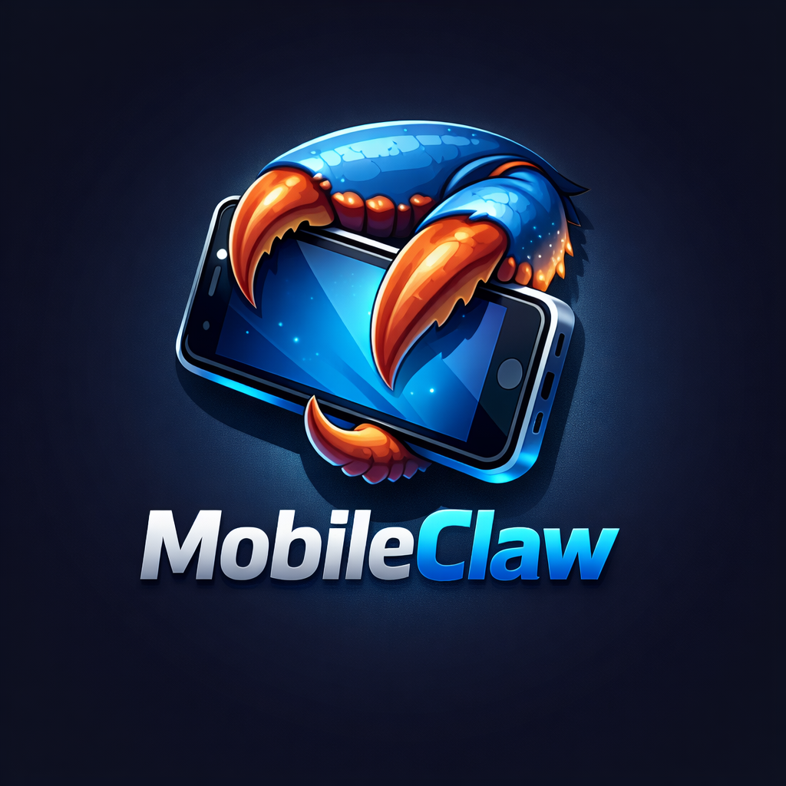

# MobileClaw Mobile



Turn your old Android phone into a personal assistant.

MobileClaw is not just chat. You ask in natural language, and the app can execute Android-native capabilities (when enabled) through the agent runtime.

## Demo

[](https://youtu.be/-3fpcQAL6II)

Video: https://youtu.be/-3fpcQAL6II

## What this app can do

- chat with agent + voice input
- read files, SMS, and call log (with permissions)
- trigger call/SMS/camera flows from chat
- read location, contacts, calendar, notifications, and sensors
- run accessibility-based UI automation (after manual OS enable)
- run browser session actions (open, navigate, read state, fetch page text)

## Build and run on a real Android device

1. On your phone, enable Developer Options and USB debugging.
2. Connect phone via USB and accept the debug prompt.
3. Verify connection:

```bash
adb devices
```

4. Build and run:

```bash
npm install
npm run android
```

If Metro is not reachable from the phone:

```bash
adb reverse tcp:8081 tcp:8081
```

## First launch checklist

1. Open Device tab.
2. Enable capabilities you want.
3. Grant Android permissions when prompted.
4. For UI automation, enable Accessibility service from in-app instructions.

## Notes

- Some actions still require Android system confirmation.
- Access depends on enabled toggles, permissions, and OS settings.
